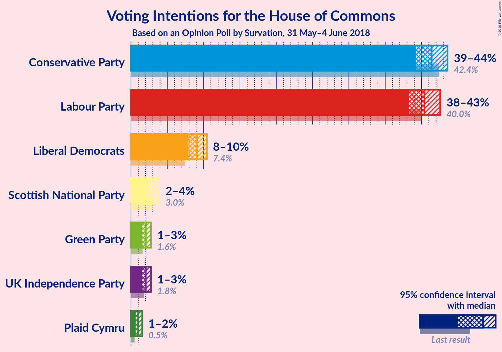

# Opinion Poll by Survation, 31 May–4 June 2018

<a href="#voting-intentions">Voting Intentions</a> | <a href="#seats">Seats</a> | <a href="#coalitions">Coalitions</a> | <a href="#technical-information">Technical Information</a>

## Voting Intentions

### Confidence Intervals

| Party | Last Result | Poll Result | 80% Confidence Interval | 90% Confidence Interval | 95% Confidence Interval | 99% Confidence Interval |
|:-----:|:-----------:|:-----------:|:-----------------------:|:-----------------------:|:-----------------------:|:-----------------------:|
| Conservative Party | 42.4% | 41.4% | 40.0–42.8% |39.6–43.2% |39.3–43.6% |38.6–44.3% |
| Labour Party | 40.0% | 40.4% | 39.0–41.8% |38.6–42.2% |38.3–42.6% |37.6–43.3% |
| Liberal Democrats | 7.4% | 9.1% | 8.3–10.0% |8.1–10.2% |7.9–10.4% |7.5–10.9% |
| Scottish National Party | 3.0% | 3.0% | 2.6–3.6% |2.5–3.7% |2.4–3.9% |2.2–4.2% |
| UK Independence Party | 1.8% | 2.0% | 1.7–2.5% |1.6–2.6% |1.5–2.8% |1.3–3.0% |
| Green Party | 1.6% | 2.0% | 1.7–2.5% |1.6–2.6% |1.5–2.8% |1.3–3.0% |
| Plaid Cymru | 0.5% | 1.0% | 0.8–1.3% |0.7–1.4% |0.6–1.5% |0.5–1.7% |

*Note:* The poll result column reflects the actual value used in the calculations. Published results may vary slightly, and in addition be rounded to fewer digits.

## Seats

### Confidence Intervals

| Party | Last Result | Median | 80% Confidence Interval | 90% Confidence Interval | 95% Confidence Interval | 99% Confidence Interval |
|:-----:|:-----------:|:------:|:-----------------------:|:-----------------------:|:-----------------------:|:-----------------------:|
| <a href="#conservative-party">Conservative Party</a> | 317 | 300 | 280–325 |274–332 |270–335 |262–340 |
| <a href="#labour-party">Labour Party</a> | 262 | 273 | 247–294 |242–301 |238–307 |234–317 |
| <a href="#liberal-democrats">Liberal Democrats</a> | 12 | 19 | 16–24 |15–25 |15–26 |14–27 |
| <a href="#scottish-national-party">Scottish National Party</a> | 35 | 29 | 20–45 |13–48 |8–49 |3–51 |
| <a href="#uk-independence-party">UK Independence Party</a> | 0 | 0 | 0 |0 |0 |0 |
| <a href="#green-party">Green Party</a> | 1 | 1 | 1 |1 |1 |1 |
| <a href="#plaid-cymru">Plaid Cymru</a> | 4 | 5 | 4–5 |4–6 |4–8 |3–8 |

### Conservative Party

*For a full overview of the results for this party, see the [Conservative Party](party-conservativeparty.html) page.*

| Number of Seats | Probability | Accumulated | Special Marks |
|:---------------:|:-----------:|:-----------:|:-------------:|
| 254 | 0.1% | 100% |  |
| 255 | 0% | 99.9% |  |
| 256 | 0% | 99.9% |  |
| 257 | 0.1% | 99.8% |  |
| 258 | 0.1% | 99.8% |  |
| 259 | 0% | 99.7% |  |
| 260 | 0.1% | 99.7% |  |
| 261 | 0% | 99.6% |  |
| 262 | 0.2% | 99.6% |  |
| 263 | 0.1% | 99.4% |  |
| 264 | 0.2% | 99.4% |  |
| 265 | 0.1% | 99.2% |  |
| 266 | 0.3% | 99.1% |  |
| 267 | 0.1% | 98.8% |  |
| 268 | 0.1% | 98.7% |  |
| 269 | 0.6% | 98.7% |  |
| 270 | 1.0% | 98% |  |
| 271 | 0.5% | 97% |  |
| 272 | 0.5% | 96% |  |
| 273 | 0.6% | 96% |  |
| 274 | 1.2% | 95% |  |
| 275 | 0.3% | 94% |  |
| 276 | 1.0% | 94% |  |
| 277 | 0.9% | 93% |  |
| 278 | 0.5% | 92% |  |
| 279 | 0.7% | 92% |  |
| 280 | 2% | 91% |  |
| 281 | 1.3% | 89% |  |
| 282 | 2% | 87% |  |
| 283 | 0.4% | 86% |  |
| 284 | 0.4% | 85% |  |
| 285 | 1.1% | 85% |  |
| 286 | 3% | 84% |  |
| 287 | 0.2% | 81% |  |
| 288 | 2% | 80% |  |
| 289 | 3% | 78% |  |
| 290 | 0.2% | 75% |  |
| 291 | 0.2% | 75% |  |
| 292 | 0.4% | 75% |  |
| 293 | 0.6% | 75% |  |
| 294 | 3% | 74% |  |
| 295 | 1.4% | 71% |  |
| 296 | 10% | 69% |  |
| 297 | 2% | 60% |  |
| 298 | 0.2% | 57% |  |
| 299 | 0.7% | 57% |  |
| 300 | 7% | 57% | Median |
| 301 | 0.5% | 49% |  |
| 302 | 0.3% | 49% |  |
| 303 | 8% | 49% |  |
| 304 | 1.2% | 41% |  |
| 305 | 0.6% | 40% |  |
| 306 | 1.1% | 39% |  |
| 307 | 0.8% | 38% |  |
| 308 | 2% | 37% |  |
| 309 | 0.4% | 35% |  |
| 310 | 2% | 35% |  |
| 311 | 0.7% | 33% |  |
| 312 | 0.5% | 33% |  |
| 313 | 2% | 32% |  |
| 314 | 5% | 30% |  |
| 315 | 0.2% | 25% |  |
| 316 | 1.0% | 24% |  |
| 317 | 0.5% | 23% | Last Result |
| 318 | 0.9% | 23% |  |
| 319 | 5% | 22% |  |
| 320 | 0.1% | 18% |  |
| 321 | 2% | 17% |  |
| 322 | 1.3% | 15% |  |
| 323 | 0.4% | 14% |  |
| 324 | 0.6% | 13% |  |
| 325 | 4% | 13% |  |
| 326 | 0.4% | 9% | Majority |
| 327 | 0.3% | 8% |  |
| 328 | 0.1% | 8% |  |
| 329 | 0.3% | 8% |  |
| 330 | 0.4% | 8% |  |
| 331 | 1.0% | 7% |  |
| 332 | 2% | 6% |  |
| 333 | 1.3% | 5% |  |
| 334 | 0.7% | 3% |  |
| 335 | 0.4% | 3% |  |
| 336 | 0.8% | 2% |  |
| 337 | 0% | 2% |  |
| 338 | 1.0% | 2% |  |
| 339 | 0% | 0.6% |  |
| 340 | 0.1% | 0.5% |  |
| 341 | 0% | 0.4% |  |
| 342 | 0% | 0.4% |  |
| 343 | 0% | 0.4% |  |
| 344 | 0.2% | 0.4% |  |
| 345 | 0% | 0.2% |  |
| 346 | 0% | 0.1% |  |
| 347 | 0.1% | 0.1% |  |
| 348 | 0% | 0% |  |

### Labour Party

*For a full overview of the results for this party, see the [Labour Party](party-labourparty.html) page.*

| Number of Seats | Probability | Accumulated | Special Marks |
|:---------------:|:-----------:|:-----------:|:-------------:|
| 226 | 0.1% | 100% |  |
| 227 | 0% | 99.9% |  |
| 228 | 0% | 99.9% |  |
| 229 | 0% | 99.9% |  |
| 230 | 0.1% | 99.9% |  |
| 231 | 0.1% | 99.8% |  |
| 232 | 0% | 99.8% |  |
| 233 | 0.1% | 99.7% |  |
| 234 | 0.1% | 99.6% |  |
| 235 | 0.2% | 99.5% |  |
| 236 | 0.3% | 99.3% |  |
| 237 | 1.1% | 99.0% |  |
| 238 | 0.7% | 98% |  |
| 239 | 0.3% | 97% |  |
| 240 | 0.2% | 97% |  |
| 241 | 1.4% | 97% |  |
| 242 | 0.7% | 95% |  |
| 243 | 0.5% | 95% |  |
| 244 | 0.2% | 94% |  |
| 245 | 0.1% | 94% |  |
| 246 | 3% | 94% |  |
| 247 | 2% | 91% |  |
| 248 | 1.1% | 89% |  |
| 249 | 0.1% | 88% |  |
| 250 | 0.7% | 88% |  |
| 251 | 0.2% | 87% |  |
| 252 | 0.1% | 87% |  |
| 253 | 2% | 87% |  |
| 254 | 4% | 85% |  |
| 255 | 2% | 81% |  |
| 256 | 0.6% | 79% |  |
| 257 | 1.0% | 79% |  |
| 258 | 0.4% | 78% |  |
| 259 | 2% | 77% |  |
| 260 | 0.4% | 75% |  |
| 261 | 4% | 75% |  |
| 262 | 0.6% | 70% | Last Result |
| 263 | 2% | 70% |  |
| 264 | 0.8% | 68% |  |
| 265 | 2% | 67% |  |
| 266 | 0.1% | 65% |  |
| 267 | 0.4% | 65% |  |
| 268 | 7% | 65% |  |
| 269 | 0.1% | 58% |  |
| 270 | 0.7% | 58% |  |
| 271 | 3% | 57% |  |
| 272 | 1.3% | 54% |  |
| 273 | 5% | 53% | Median |
| 274 | 2% | 48% |  |
| 275 | 0.4% | 47% |  |
| 276 | 0.4% | 46% |  |
| 277 | 0.3% | 46% |  |
| 278 | 0.2% | 45% |  |
| 279 | 2% | 45% |  |
| 280 | 7% | 44% |  |
| 281 | 2% | 36% |  |
| 282 | 1.1% | 34% |  |
| 283 | 9% | 33% |  |
| 284 | 0.5% | 24% |  |
| 285 | 0.9% | 23% |  |
| 286 | 0.7% | 22% |  |
| 287 | 0.2% | 22% |  |
| 288 | 0.4% | 21% |  |
| 289 | 2% | 21% |  |
| 290 | 0.5% | 19% |  |
| 291 | 3% | 18% |  |
| 292 | 3% | 15% |  |
| 293 | 0.9% | 12% |  |
| 294 | 2% | 11% |  |
| 295 | 0.2% | 9% |  |
| 296 | 0.4% | 9% |  |
| 297 | 0.7% | 9% |  |
| 298 | 0.2% | 8% |  |
| 299 | 2% | 8% |  |
| 300 | 0.7% | 6% |  |
| 301 | 0.9% | 5% |  |
| 302 | 0.4% | 4% |  |
| 303 | 0.5% | 4% |  |
| 304 | 0.5% | 3% |  |
| 305 | 0.1% | 3% |  |
| 306 | 0.1% | 3% |  |
| 307 | 0.3% | 3% |  |
| 308 | 0.2% | 2% |  |
| 309 | 0.2% | 2% |  |
| 310 | 0.6% | 2% |  |
| 311 | 0% | 1.5% |  |
| 312 | 0.1% | 1.5% |  |
| 313 | 0.4% | 1.4% |  |
| 314 | 0.1% | 1.0% |  |
| 315 | 0.1% | 0.9% |  |
| 316 | 0.1% | 0.9% |  |
| 317 | 0.3% | 0.8% |  |
| 318 | 0.1% | 0.4% |  |
| 319 | 0% | 0.4% |  |
| 320 | 0% | 0.3% |  |
| 321 | 0% | 0.3% |  |
| 322 | 0.1% | 0.3% |  |
| 323 | 0% | 0.2% |  |
| 324 | 0% | 0.2% |  |
| 325 | 0% | 0.1% |  |
| 326 | 0.1% | 0.1% | Majority |
| 327 | 0% | 0.1% |  |
| 328 | 0% | 0.1% |  |
| 329 | 0% | 0.1% |  |
| 330 | 0% | 0% |  |

### Liberal Democrats

*For a full overview of the results for this party, see the [Liberal Democrats](party-liberaldemocrats.html) page.*

| Number of Seats | Probability | Accumulated | Special Marks |
|:---------------:|:-----------:|:-----------:|:-------------:|
| 11 | 0% | 100% |  |
| 12 | 0.1% | 99.9% | Last Result |
| 13 | 0.2% | 99.9% |  |
| 14 | 0.6% | 99.7% |  |
| 15 | 5% | 99.1% |  |
| 16 | 12% | 94% |  |
| 17 | 20% | 82% |  |
| 18 | 11% | 62% |  |
| 19 | 5% | 51% | Median |
| 20 | 10% | 46% |  |
| 21 | 6% | 36% |  |
| 22 | 3% | 30% |  |
| 23 | 16% | 27% |  |
| 24 | 2% | 12% |  |
| 25 | 6% | 10% |  |
| 26 | 2% | 4% |  |
| 27 | 2% | 2% |  |
| 28 | 0.2% | 0.2% |  |
| 29 | 0% | 0% |  |

### Scottish National Party

*For a full overview of the results for this party, see the [Scottish National Party](party-scottishnationalparty.html) page.*

| Number of Seats | Probability | Accumulated | Special Marks |
|:---------------:|:-----------:|:-----------:|:-------------:|
| 0 | 0.1% | 100% |  |
| 1 | 0% | 99.9% |  |
| 2 | 0.1% | 99.9% |  |
| 3 | 0.5% | 99.8% |  |
| 4 | 0.4% | 99.3% |  |
| 5 | 0.3% | 98.9% |  |
| 6 | 0.1% | 98.6% |  |
| 7 | 0.4% | 98.5% |  |
| 8 | 1.2% | 98% |  |
| 9 | 1.1% | 97% |  |
| 10 | 0.2% | 96% |  |
| 11 | 0% | 96% |  |
| 12 | 0.3% | 96% |  |
| 13 | 0.6% | 95% |  |
| 14 | 0.1% | 95% |  |
| 15 | 0.8% | 95% |  |
| 16 | 0.2% | 94% |  |
| 17 | 1.1% | 94% |  |
| 18 | 0.1% | 93% |  |
| 19 | 2% | 92% |  |
| 20 | 3% | 90% |  |
| 21 | 2% | 87% |  |
| 22 | 4% | 86% |  |
| 23 | 12% | 82% |  |
| 24 | 0.5% | 70% |  |
| 25 | 0.7% | 69% |  |
| 26 | 2% | 69% |  |
| 27 | 2% | 67% |  |
| 28 | 4% | 65% |  |
| 29 | 14% | 61% | Median |
| 30 | 1.3% | 46% |  |
| 31 | 0.2% | 45% |  |
| 32 | 1.0% | 45% |  |
| 33 | 0.8% | 44% |  |
| 34 | 0% | 43% |  |
| 35 | 3% | 43% | Last Result |
| 36 | 1.5% | 39% |  |
| 37 | 3% | 38% |  |
| 38 | 3% | 35% |  |
| 39 | 10% | 32% |  |
| 40 | 5% | 22% |  |
| 41 | 0.9% | 17% |  |
| 42 | 0.8% | 16% |  |
| 43 | 0.5% | 15% |  |
| 44 | 3% | 14% |  |
| 45 | 4% | 12% |  |
| 46 | 2% | 8% |  |
| 47 | 0.8% | 6% |  |
| 48 | 2% | 5% |  |
| 49 | 1.5% | 3% |  |
| 50 | 0.2% | 2% |  |
| 51 | 1.3% | 2% |  |
| 52 | 0.3% | 0.4% |  |
| 53 | 0.1% | 0.2% |  |
| 54 | 0.1% | 0.1% |  |
| 55 | 0% | 0% |  |

### UK Independence Party

*For a full overview of the results for this party, see the [UK Independence Party](party-ukindependenceparty.html) page.*

| Number of Seats | Probability | Accumulated | Special Marks |
|:---------------:|:-----------:|:-----------:|:-------------:|
| 0 | 100% | 100% | Last Result, Median |

### Green Party

*For a full overview of the results for this party, see the [Green Party](party-greenparty.html) page.*

| Number of Seats | Probability | Accumulated | Special Marks |
|:---------------:|:-----------:|:-----------:|:-------------:|
| 1 | 100% | 100% | Last Result, Median |

### Plaid Cymru

*For a full overview of the results for this party, see the [Plaid Cymru](party-plaidcymru.html) page.*

| Number of Seats | Probability | Accumulated | Special Marks |
|:---------------:|:-----------:|:-----------:|:-------------:|
| 2 | 0.2% | 100% |  |
| 3 | 1.3% | 99.8% |  |
| 4 | 10% | 98.5% | Last Result |
| 5 | 80% | 88% | Median |
| 6 | 4% | 8% |  |
| 7 | 1.3% | 4% |  |
| 8 | 3% | 3% |  |
| 9 | 0.1% | 0.1% |  |
| 10 | 0% | 0% |  |

## Coalitions

### Confidence Intervals

| Coalition | Last Result | Median | Majority? | 80% Confidence Interval | 90% Confidence Interval | 95% Confidence Interval | 99% Confidence Interval |
|:---------:|:-----------:|:------:|:---------:|:-----------------------:|:-----------------------:|:-----------------------:|:-----------------------:|
| Conservative Party – Scottish National Party – Plaid Cymru | 356 | 337 | 77% | 314–366 | 308–370 | 303–374 | 289–379 |
| Conservative Party – Scottish National Party | 352 | 332 | 57% | 309–361 | 304–365 | 298–369 | 284–372 |
| Labour Party – Liberal Democrats – Scottish National Party – Plaid Cymru | 313 | 331 | 61% | 306–351 | 299–357 | 296–361 | 291–369 |
| Labour Party – Liberal Democrats – Scottish National Party | 309 | 326 | 50% | 301–347 | 293–353 | 291–356 | 286–364 |
| Conservative Party – Liberal Democrats | 329 | 321 | 39% | 300–344 | 296–349 | 291–353 | 284–358 |
| Labour Party – Scottish National Party – Plaid Cymru | 301 | 310 | 16% | 287–331 | 282–335 | 278–340 | 273–347 |
| Conservative Party – Plaid Cymru | 321 | 305 | 18% | 284–330 | 278–338 | 275–340 | 267–345 |
| Labour Party – Scottish National Party | 297 | 305 | 11% | 282–326 | 276–331 | 272–335 | 268–343 |
| Conservative Party | 317 | 300 | 9% | 280–325 | 274–332 | 270–335 | 262–340 |
| Labour Party – Liberal Democrats – Plaid Cymru | 278 | 299 | 6% | 270–322 | 266–327 | 262–333 | 259–347 |
| Labour Party – Liberal Democrats | 274 | 294 | 3% | 265–317 | 261–323 | 257–328 | 252–342 |
| Labour Party – Plaid Cymru | 266 | 278 | 0.3% | 252–299 | 247–305 | 243–312 | 240–322 |
| Labour Party | 262 | 273 | 0.1% | 247–294 | 242–301 | 238–307 | 234–317 |

### Conservative Party – Scottish National Party – Plaid Cymru

| Number of Seats | Probability | Accumulated | Special Marks |
|:---------------:|:-----------:|:-----------:|:-------------:|
| 280 | 0% | 100% |  |
| 281 | 0% | 99.9% |  |
| 282 | 0% | 99.9% |  |
| 283 | 0% | 99.9% |  |
| 284 | 0% | 99.9% |  |
| 285 | 0.1% | 99.9% |  |
| 286 | 0% | 99.8% |  |
| 287 | 0.2% | 99.8% |  |
| 288 | 0% | 99.6% |  |
| 289 | 0.2% | 99.6% |  |
| 290 | 0% | 99.4% |  |
| 291 | 0.1% | 99.4% |  |
| 292 | 0.1% | 99.2% |  |
| 293 | 0.1% | 99.2% |  |
| 294 | 0% | 99.1% |  |
| 295 | 0.1% | 99.1% |  |
| 296 | 0.1% | 99.0% |  |
| 297 | 0.6% | 98.9% |  |
| 298 | 0.3% | 98% |  |
| 299 | 0.1% | 98% |  |
| 300 | 0.1% | 98% |  |
| 301 | 0.1% | 98% |  |
| 302 | 0.2% | 98% |  |
| 303 | 0.2% | 98% |  |
| 304 | 0.1% | 97% |  |
| 305 | 0.3% | 97% |  |
| 306 | 0.5% | 97% |  |
| 307 | 0.5% | 97% |  |
| 308 | 1.3% | 96% |  |
| 309 | 0.2% | 95% |  |
| 310 | 0.9% | 95% |  |
| 311 | 0.1% | 94% |  |
| 312 | 2% | 94% |  |
| 313 | 0.4% | 92% |  |
| 314 | 2% | 92% |  |
| 315 | 0.5% | 90% |  |
| 316 | 0.3% | 89% |  |
| 317 | 0.2% | 89% |  |
| 318 | 0.3% | 89% |  |
| 319 | 3% | 89% |  |
| 320 | 4% | 86% |  |
| 321 | 2% | 82% |  |
| 322 | 2% | 80% |  |
| 323 | 0.2% | 78% |  |
| 324 | 0.3% | 78% |  |
| 325 | 0.7% | 78% |  |
| 326 | 0.8% | 77% | Majority |
| 327 | 0.7% | 76% |  |
| 328 | 7% | 76% |  |
| 329 | 1.1% | 68% |  |
| 330 | 8% | 67% |  |
| 331 | 2% | 59% |  |
| 332 | 0.7% | 57% |  |
| 333 | 2% | 56% |  |
| 334 | 0.1% | 55% | Median |
| 335 | 2% | 55% |  |
| 336 | 2% | 53% |  |
| 337 | 3% | 51% |  |
| 338 | 0.6% | 49% |  |
| 339 | 0.3% | 48% |  |
| 340 | 2% | 48% |  |
| 341 | 5% | 46% |  |
| 342 | 0.2% | 41% |  |
| 343 | 0.5% | 41% |  |
| 344 | 0.2% | 41% |  |
| 345 | 0.3% | 40% |  |
| 346 | 0.6% | 40% |  |
| 347 | 9% | 39% |  |
| 348 | 0.8% | 31% |  |
| 349 | 4% | 30% |  |
| 350 | 0.3% | 26% |  |
| 351 | 0.5% | 25% |  |
| 352 | 0.6% | 25% |  |
| 353 | 0.3% | 24% |  |
| 354 | 0.6% | 24% |  |
| 355 | 0.7% | 23% |  |
| 356 | 0.7% | 23% | Last Result |
| 357 | 3% | 22% |  |
| 358 | 0.2% | 19% |  |
| 359 | 1.4% | 19% |  |
| 360 | 3% | 17% |  |
| 361 | 0.4% | 14% |  |
| 362 | 0.1% | 13% |  |
| 363 | 2% | 13% |  |
| 364 | 0.4% | 11% |  |
| 365 | 0.3% | 11% |  |
| 366 | 2% | 11% |  |
| 367 | 0.6% | 9% |  |
| 368 | 3% | 8% |  |
| 369 | 0.1% | 5% |  |
| 370 | 0.3% | 5% |  |
| 371 | 0.4% | 5% |  |
| 372 | 0.6% | 5% |  |
| 373 | 0.3% | 4% |  |
| 374 | 1.3% | 4% |  |
| 375 | 1.1% | 2% |  |
| 376 | 0.5% | 1.3% |  |
| 377 | 0.2% | 0.8% |  |
| 378 | 0% | 0.6% |  |
| 379 | 0.1% | 0.5% |  |
| 380 | 0% | 0.4% |  |
| 381 | 0.2% | 0.4% |  |
| 382 | 0.1% | 0.2% |  |
| 383 | 0% | 0.1% |  |
| 384 | 0% | 0.1% |  |
| 385 | 0% | 0.1% |  |
| 386 | 0% | 0.1% |  |
| 387 | 0% | 0% |  |

### Conservative Party – Scottish National Party

| Number of Seats | Probability | Accumulated | Special Marks |
|:---------------:|:-----------:|:-----------:|:-------------:|
| 275 | 0% | 100% |  |
| 276 | 0% | 99.9% |  |
| 277 | 0% | 99.9% |  |
| 278 | 0% | 99.9% |  |
| 279 | 0% | 99.9% |  |
| 280 | 0.1% | 99.9% |  |
| 281 | 0% | 99.8% |  |
| 282 | 0.2% | 99.8% |  |
| 283 | 0% | 99.6% |  |
| 284 | 0.2% | 99.6% |  |
| 285 | 0% | 99.5% |  |
| 286 | 0.2% | 99.4% |  |
| 287 | 0% | 99.2% |  |
| 288 | 0.1% | 99.2% |  |
| 289 | 0% | 99.1% |  |
| 290 | 0.1% | 99.1% |  |
| 291 | 0.1% | 99.0% |  |
| 292 | 0.6% | 98.9% |  |
| 293 | 0.3% | 98% |  |
| 294 | 0% | 98% |  |
| 295 | 0.2% | 98% |  |
| 296 | 0% | 98% |  |
| 297 | 0.2% | 98% |  |
| 298 | 0.2% | 98% |  |
| 299 | 0.1% | 97% |  |
| 300 | 0.1% | 97% |  |
| 301 | 0.6% | 97% |  |
| 302 | 0.4% | 97% |  |
| 303 | 0.8% | 96% |  |
| 304 | 0.9% | 95% |  |
| 305 | 0.8% | 95% |  |
| 306 | 0.2% | 94% |  |
| 307 | 0.2% | 94% |  |
| 308 | 2% | 93% |  |
| 309 | 2% | 91% |  |
| 310 | 0.4% | 90% |  |
| 311 | 0.2% | 89% |  |
| 312 | 0.3% | 89% |  |
| 313 | 0.2% | 89% |  |
| 314 | 3% | 89% |  |
| 315 | 4% | 86% |  |
| 316 | 2% | 82% |  |
| 317 | 2% | 80% |  |
| 318 | 0.4% | 78% |  |
| 319 | 0.5% | 78% |  |
| 320 | 0.7% | 77% |  |
| 321 | 0.5% | 77% |  |
| 322 | 0.9% | 76% |  |
| 323 | 7% | 75% |  |
| 324 | 0.9% | 68% |  |
| 325 | 10% | 67% |  |
| 326 | 0.2% | 57% | Majority |
| 327 | 0.6% | 57% |  |
| 328 | 2% | 56% |  |
| 329 | 0.1% | 55% | Median |
| 330 | 2% | 54% |  |
| 331 | 1.4% | 53% |  |
| 332 | 3% | 51% |  |
| 333 | 1.3% | 49% |  |
| 334 | 0.1% | 48% |  |
| 335 | 2% | 48% |  |
| 336 | 4% | 46% |  |
| 337 | 0.3% | 41% |  |
| 338 | 0.5% | 41% |  |
| 339 | 0.3% | 41% |  |
| 340 | 0% | 40% |  |
| 341 | 1.0% | 40% |  |
| 342 | 9% | 39% |  |
| 343 | 0.6% | 30% |  |
| 344 | 4% | 30% |  |
| 345 | 1.0% | 26% |  |
| 346 | 0.2% | 25% |  |
| 347 | 0.6% | 25% |  |
| 348 | 0.5% | 24% |  |
| 349 | 0.4% | 24% |  |
| 350 | 0.7% | 23% |  |
| 351 | 0.9% | 23% |  |
| 352 | 2% | 22% | Last Result |
| 353 | 1.2% | 20% |  |
| 354 | 1.4% | 18% |  |
| 355 | 0.2% | 17% |  |
| 356 | 4% | 17% |  |
| 357 | 0.1% | 13% |  |
| 358 | 2% | 13% |  |
| 359 | 0.5% | 11% |  |
| 360 | 0.2% | 11% |  |
| 361 | 3% | 11% |  |
| 362 | 0.9% | 8% |  |
| 363 | 1.5% | 7% |  |
| 364 | 0.2% | 5% |  |
| 365 | 0.1% | 5% |  |
| 366 | 0.6% | 5% |  |
| 367 | 0.5% | 4% |  |
| 368 | 0.3% | 4% |  |
| 369 | 1.3% | 4% |  |
| 370 | 1.0% | 2% |  |
| 371 | 0.6% | 1.3% |  |
| 372 | 0.2% | 0.7% |  |
| 373 | 0.1% | 0.4% |  |
| 374 | 0% | 0.4% |  |
| 375 | 0% | 0.4% |  |
| 376 | 0.1% | 0.3% |  |
| 377 | 0.1% | 0.2% |  |
| 378 | 0% | 0.1% |  |
| 379 | 0% | 0.1% |  |
| 380 | 0.1% | 0.1% |  |
| 381 | 0% | 0% |  |

### Labour Party – Liberal Democrats – Scottish National Party – Plaid Cymru

| Number of Seats | Probability | Accumulated | Special Marks |
|:---------------:|:-----------:|:-----------:|:-------------:|
| 284 | 0.1% | 100% |  |
| 285 | 0% | 99.9% |  |
| 286 | 0% | 99.9% |  |
| 287 | 0.2% | 99.8% |  |
| 288 | 0% | 99.6% |  |
| 289 | 0% | 99.6% |  |
| 290 | 0% | 99.6% |  |
| 291 | 0.1% | 99.6% |  |
| 292 | 0% | 99.5% |  |
| 293 | 1.0% | 99.4% |  |
| 294 | 0% | 98% |  |
| 295 | 0.8% | 98% |  |
| 296 | 0.4% | 98% |  |
| 297 | 0.7% | 97% |  |
| 298 | 1.3% | 97% |  |
| 299 | 2% | 95% |  |
| 300 | 1.0% | 94% |  |
| 301 | 0.4% | 93% |  |
| 302 | 0.3% | 92% |  |
| 303 | 0.1% | 92% |  |
| 304 | 0.3% | 92% |  |
| 305 | 0.4% | 92% |  |
| 306 | 4% | 91% |  |
| 307 | 0.6% | 87% |  |
| 308 | 0.4% | 87% |  |
| 309 | 1.3% | 86% |  |
| 310 | 2% | 85% |  |
| 311 | 0.1% | 83% |  |
| 312 | 5% | 82% |  |
| 313 | 0.9% | 78% | Last Result |
| 314 | 0.5% | 77% |  |
| 315 | 1.0% | 77% |  |
| 316 | 0.2% | 76% |  |
| 317 | 5% | 75% |  |
| 318 | 2% | 70% |  |
| 319 | 0.5% | 68% |  |
| 320 | 0.7% | 67% |  |
| 321 | 2% | 67% |  |
| 322 | 0.4% | 65% |  |
| 323 | 2% | 65% |  |
| 324 | 0.8% | 63% |  |
| 325 | 1.1% | 62% |  |
| 326 | 0.6% | 61% | Median, Majority |
| 327 | 1.2% | 60% |  |
| 328 | 8% | 59% |  |
| 329 | 0.3% | 51% |  |
| 330 | 0.5% | 51% |  |
| 331 | 7% | 51% |  |
| 332 | 0.7% | 43% |  |
| 333 | 0.2% | 43% |  |
| 334 | 2% | 43% |  |
| 335 | 10% | 40% |  |
| 336 | 1.4% | 31% |  |
| 337 | 3% | 29% |  |
| 338 | 0.6% | 26% |  |
| 339 | 0.4% | 25% |  |
| 340 | 0.2% | 25% |  |
| 341 | 0.2% | 25% |  |
| 342 | 3% | 25% |  |
| 343 | 2% | 22% |  |
| 344 | 0.2% | 20% |  |
| 345 | 3% | 19% |  |
| 346 | 1.1% | 16% |  |
| 347 | 0.4% | 15% |  |
| 348 | 0.4% | 15% |  |
| 349 | 2% | 14% |  |
| 350 | 1.3% | 13% |  |
| 351 | 2% | 11% |  |
| 352 | 0.7% | 9% |  |
| 353 | 0.5% | 8% |  |
| 354 | 0.9% | 8% |  |
| 355 | 1.0% | 7% |  |
| 356 | 0.3% | 6% |  |
| 357 | 1.2% | 6% |  |
| 358 | 0.6% | 5% |  |
| 359 | 0.5% | 4% |  |
| 360 | 0.5% | 4% |  |
| 361 | 1.0% | 3% |  |
| 362 | 0.6% | 2% |  |
| 363 | 0.1% | 1.3% |  |
| 364 | 0.1% | 1.3% |  |
| 365 | 0.3% | 1.2% |  |
| 366 | 0.1% | 0.9% |  |
| 367 | 0.2% | 0.8% |  |
| 368 | 0.1% | 0.6% |  |
| 369 | 0.2% | 0.6% |  |
| 370 | 0% | 0.4% |  |
| 371 | 0.1% | 0.4% |  |
| 372 | 0% | 0.3% |  |
| 373 | 0.1% | 0.3% |  |
| 374 | 0.1% | 0.2% |  |
| 375 | 0% | 0.2% |  |
| 376 | 0% | 0.1% |  |
| 377 | 0.1% | 0.1% |  |
| 378 | 0% | 0% |  |

### Labour Party – Liberal Democrats – Scottish National Party

| Number of Seats | Probability | Accumulated | Special Marks |
|:---------------:|:-----------:|:-----------:|:-------------:|
| 279 | 0.1% | 100% |  |
| 280 | 0% | 99.9% |  |
| 281 | 0% | 99.8% |  |
| 282 | 0.2% | 99.8% |  |
| 283 | 0% | 99.6% |  |
| 284 | 0% | 99.6% |  |
| 285 | 0% | 99.6% |  |
| 286 | 0.1% | 99.6% |  |
| 287 | 0.1% | 99.4% |  |
| 288 | 1.0% | 99.3% |  |
| 289 | 0.4% | 98% |  |
| 290 | 0.3% | 98% |  |
| 291 | 0.4% | 98% |  |
| 292 | 2% | 97% |  |
| 293 | 1.4% | 96% |  |
| 294 | 0.6% | 94% |  |
| 295 | 0.9% | 93% |  |
| 296 | 0.4% | 93% |  |
| 297 | 0.3% | 92% |  |
| 298 | 0.2% | 92% |  |
| 299 | 0.4% | 92% |  |
| 300 | 0.3% | 91% |  |
| 301 | 4% | 91% |  |
| 302 | 0.5% | 87% |  |
| 303 | 0.3% | 87% |  |
| 304 | 1.5% | 86% |  |
| 305 | 3% | 85% |  |
| 306 | 0.1% | 82% |  |
| 307 | 2% | 82% |  |
| 308 | 3% | 81% |  |
| 309 | 0.5% | 77% | Last Result |
| 310 | 0.7% | 77% |  |
| 311 | 1.5% | 76% |  |
| 312 | 4% | 74% |  |
| 313 | 2% | 70% |  |
| 314 | 1.1% | 69% |  |
| 315 | 0.6% | 67% |  |
| 316 | 2% | 67% |  |
| 317 | 0.6% | 65% |  |
| 318 | 2% | 64% |  |
| 319 | 0.5% | 62% |  |
| 320 | 1.1% | 62% |  |
| 321 | 0.6% | 61% | Median |
| 322 | 1.1% | 60% |  |
| 323 | 8% | 59% |  |
| 324 | 0.2% | 51% |  |
| 325 | 0.8% | 51% |  |
| 326 | 7% | 50% | Majority |
| 327 | 0.4% | 43% |  |
| 328 | 0.2% | 43% |  |
| 329 | 4% | 43% |  |
| 330 | 8% | 39% |  |
| 331 | 2% | 31% |  |
| 332 | 3% | 29% |  |
| 333 | 0.4% | 26% |  |
| 334 | 0.6% | 25% |  |
| 335 | 0.2% | 25% |  |
| 336 | 0.1% | 25% |  |
| 337 | 2% | 25% |  |
| 338 | 3% | 22% |  |
| 339 | 0.2% | 20% |  |
| 340 | 3% | 19% |  |
| 341 | 0.7% | 16% |  |
| 342 | 0.8% | 15% |  |
| 343 | 0.3% | 15% |  |
| 344 | 2% | 14% |  |
| 345 | 2% | 13% |  |
| 346 | 0.5% | 11% |  |
| 347 | 2% | 10% |  |
| 348 | 0.4% | 8% |  |
| 349 | 0.8% | 8% |  |
| 350 | 0.9% | 7% |  |
| 351 | 0.4% | 6% |  |
| 352 | 0.6% | 6% |  |
| 353 | 1.3% | 5% |  |
| 354 | 0.6% | 4% |  |
| 355 | 0.4% | 3% |  |
| 356 | 1.0% | 3% |  |
| 357 | 0.6% | 2% |  |
| 358 | 0.2% | 1.4% |  |
| 359 | 0.1% | 1.3% |  |
| 360 | 0.2% | 1.2% |  |
| 361 | 0.2% | 1.0% |  |
| 362 | 0.2% | 0.9% |  |
| 363 | 0.1% | 0.7% |  |
| 364 | 0.1% | 0.6% |  |
| 365 | 0.1% | 0.5% |  |
| 366 | 0.1% | 0.4% |  |
| 367 | 0% | 0.3% |  |
| 368 | 0.1% | 0.3% |  |
| 369 | 0.1% | 0.2% |  |
| 370 | 0% | 0.2% |  |
| 371 | 0% | 0.1% |  |
| 372 | 0.1% | 0.1% |  |
| 373 | 0% | 0.1% |  |
| 374 | 0% | 0% |  |

### Conservative Party – Liberal Democrats

| Number of Seats | Probability | Accumulated | Special Marks |
|:---------------:|:-----------:|:-----------:|:-------------:|
| 276 | 0% | 100% |  |
| 277 | 0% | 99.9% |  |
| 278 | 0% | 99.9% |  |
| 279 | 0.1% | 99.9% |  |
| 280 | 0.1% | 99.8% |  |
| 281 | 0% | 99.7% |  |
| 282 | 0.1% | 99.7% |  |
| 283 | 0.1% | 99.6% |  |
| 284 | 0.2% | 99.5% |  |
| 285 | 0.1% | 99.3% |  |
| 286 | 0.1% | 99.2% |  |
| 287 | 0.3% | 99.1% |  |
| 288 | 0.1% | 98.8% |  |
| 289 | 0.7% | 98.7% |  |
| 290 | 0.4% | 98% |  |
| 291 | 0.1% | 98% |  |
| 292 | 0.1% | 97% |  |
| 293 | 0.9% | 97% |  |
| 294 | 0.7% | 96% |  |
| 295 | 0.7% | 96% |  |
| 296 | 1.4% | 95% |  |
| 297 | 0.1% | 94% |  |
| 298 | 0% | 94% |  |
| 299 | 2% | 93% |  |
| 300 | 2% | 91% |  |
| 301 | 1.4% | 89% |  |
| 302 | 0.5% | 88% |  |
| 303 | 0.8% | 87% |  |
| 304 | 0.3% | 86% |  |
| 305 | 2% | 86% |  |
| 306 | 4% | 84% |  |
| 307 | 0.6% | 80% |  |
| 308 | 0.5% | 79% |  |
| 309 | 1.5% | 79% |  |
| 310 | 0.4% | 77% |  |
| 311 | 2% | 77% |  |
| 312 | 0.2% | 75% |  |
| 313 | 2% | 75% |  |
| 314 | 9% | 73% |  |
| 315 | 0.6% | 64% |  |
| 316 | 0.3% | 63% |  |
| 317 | 3% | 63% |  |
| 318 | 0.5% | 60% |  |
| 319 | 7% | 60% | Median |
| 320 | 2% | 53% |  |
| 321 | 2% | 51% |  |
| 322 | 0.2% | 49% |  |
| 323 | 9% | 49% |  |
| 324 | 0.6% | 41% |  |
| 325 | 1.3% | 40% |  |
| 326 | 0.8% | 39% | Majority |
| 327 | 0.7% | 38% |  |
| 328 | 3% | 37% |  |
| 329 | 0.6% | 34% | Last Result |
| 330 | 1.4% | 34% |  |
| 331 | 6% | 32% |  |
| 332 | 0.3% | 26% |  |
| 333 | 0.5% | 26% |  |
| 334 | 2% | 25% |  |
| 335 | 0.3% | 24% |  |
| 336 | 4% | 23% |  |
| 337 | 0.5% | 19% |  |
| 338 | 0.2% | 19% |  |
| 339 | 1.1% | 19% |  |
| 340 | 0.5% | 18% |  |
| 341 | 0.4% | 17% |  |
| 342 | 4% | 17% |  |
| 343 | 0.6% | 12% |  |
| 344 | 2% | 12% |  |
| 345 | 0.2% | 10% |  |
| 346 | 0.7% | 9% |  |
| 347 | 0.3% | 9% |  |
| 348 | 1.2% | 8% |  |
| 349 | 3% | 7% |  |
| 350 | 0.4% | 4% |  |
| 351 | 0.3% | 4% |  |
| 352 | 0.5% | 3% |  |
| 353 | 0.7% | 3% |  |
| 354 | 0.3% | 2% |  |
| 355 | 0.2% | 2% |  |
| 356 | 1.2% | 2% |  |
| 357 | 0% | 0.5% |  |
| 358 | 0.1% | 0.5% |  |
| 359 | 0% | 0.4% |  |
| 360 | 0.1% | 0.4% |  |
| 361 | 0.1% | 0.4% |  |
| 362 | 0.1% | 0.2% |  |
| 363 | 0% | 0.2% |  |
| 364 | 0% | 0.1% |  |
| 365 | 0.1% | 0.1% |  |
| 366 | 0% | 0% |  |

### Labour Party – Scottish National Party – Plaid Cymru

| Number of Seats | Probability | Accumulated | Special Marks |
|:---------------:|:-----------:|:-----------:|:-------------:|
| 266 | 0.1% | 100% |  |
| 267 | 0% | 99.9% |  |
| 268 | 0% | 99.9% |  |
| 269 | 0.1% | 99.8% |  |
| 270 | 0.1% | 99.8% |  |
| 271 | 0.1% | 99.6% |  |
| 272 | 0% | 99.6% |  |
| 273 | 0.1% | 99.6% |  |
| 274 | 0% | 99.5% |  |
| 275 | 1.2% | 99.5% |  |
| 276 | 0.2% | 98% |  |
| 277 | 0.3% | 98% |  |
| 278 | 0.7% | 98% |  |
| 279 | 0.5% | 97% |  |
| 280 | 0.3% | 97% |  |
| 281 | 0.4% | 96% |  |
| 282 | 3% | 96% |  |
| 283 | 1.2% | 93% |  |
| 284 | 0.3% | 92% |  |
| 285 | 0.7% | 91% |  |
| 286 | 0.2% | 91% |  |
| 287 | 2% | 90% |  |
| 288 | 0.6% | 88% |  |
| 289 | 4% | 88% |  |
| 290 | 0.4% | 83% |  |
| 291 | 0.5% | 83% |  |
| 292 | 1.1% | 82% |  |
| 293 | 0.2% | 81% |  |
| 294 | 0.5% | 81% |  |
| 295 | 4% | 81% |  |
| 296 | 0.3% | 77% |  |
| 297 | 2% | 76% |  |
| 298 | 0.5% | 75% |  |
| 299 | 0.3% | 74% |  |
| 300 | 6% | 74% |  |
| 301 | 1.4% | 68% | Last Result |
| 302 | 0.6% | 66% |  |
| 303 | 3% | 66% |  |
| 304 | 0.7% | 63% |  |
| 305 | 0.8% | 62% |  |
| 306 | 1.3% | 61% |  |
| 307 | 0.6% | 60% | Median |
| 308 | 9% | 59% |  |
| 309 | 0.2% | 51% |  |
| 310 | 2% | 51% |  |
| 311 | 2% | 49% |  |
| 312 | 7% | 47% |  |
| 313 | 0.5% | 40% |  |
| 314 | 3% | 40% |  |
| 315 | 0.3% | 37% |  |
| 316 | 0.6% | 37% |  |
| 317 | 9% | 36% |  |
| 318 | 2% | 27% |  |
| 319 | 0.2% | 25% |  |
| 320 | 2% | 25% |  |
| 321 | 0.4% | 23% |  |
| 322 | 1.5% | 23% |  |
| 323 | 0.5% | 21% |  |
| 324 | 0.6% | 21% |  |
| 325 | 4% | 20% |  |
| 326 | 2% | 16% | Majority |
| 327 | 0.3% | 14% |  |
| 328 | 0.8% | 14% |  |
| 329 | 0.5% | 13% |  |
| 330 | 1.4% | 12% |  |
| 331 | 2% | 11% |  |
| 332 | 2% | 9% |  |
| 333 | 0% | 7% |  |
| 334 | 0.1% | 6% |  |
| 335 | 1.4% | 6% |  |
| 336 | 0.7% | 5% |  |
| 337 | 0.7% | 4% |  |
| 338 | 0.9% | 4% |  |
| 339 | 0.1% | 3% |  |
| 340 | 0.1% | 3% |  |
| 341 | 0.4% | 2% |  |
| 342 | 0.7% | 2% |  |
| 343 | 0.1% | 1.3% |  |
| 344 | 0.3% | 1.2% |  |
| 345 | 0.1% | 0.9% |  |
| 346 | 0.1% | 0.8% |  |
| 347 | 0.2% | 0.7% |  |
| 348 | 0.1% | 0.5% |  |
| 349 | 0.1% | 0.4% |  |
| 350 | 0% | 0.3% |  |
| 351 | 0.1% | 0.3% |  |
| 352 | 0.1% | 0.2% |  |
| 353 | 0% | 0.1% |  |
| 354 | 0% | 0.1% |  |
| 355 | 0% | 0.1% |  |
| 356 | 0% | 0% |  |

### Conservative Party – Plaid Cymru

| Number of Seats | Probability | Accumulated | Special Marks |
|:---------------:|:-----------:|:-----------:|:-------------:|
| 258 | 0% | 100% |  |
| 259 | 0.1% | 99.9% |  |
| 260 | 0% | 99.9% |  |
| 261 | 0% | 99.9% |  |
| 262 | 0.1% | 99.8% |  |
| 263 | 0.1% | 99.8% |  |
| 264 | 0% | 99.7% |  |
| 265 | 0.1% | 99.7% |  |
| 266 | 0.1% | 99.6% |  |
| 267 | 0.1% | 99.5% |  |
| 268 | 0.1% | 99.4% |  |
| 269 | 0.2% | 99.3% |  |
| 270 | 0.2% | 99.1% |  |
| 271 | 0.2% | 99.0% |  |
| 272 | 0.1% | 98.8% |  |
| 273 | 0.2% | 98.7% |  |
| 274 | 0.6% | 98.6% |  |
| 275 | 1.0% | 98% |  |
| 276 | 0.4% | 97% |  |
| 277 | 0.6% | 97% |  |
| 278 | 1.3% | 96% |  |
| 279 | 0.6% | 95% |  |
| 280 | 0.4% | 94% |  |
| 281 | 0.9% | 94% |  |
| 282 | 0.8% | 93% |  |
| 283 | 0.4% | 92% |  |
| 284 | 2% | 92% |  |
| 285 | 0.5% | 90% |  |
| 286 | 2% | 89% |  |
| 287 | 2% | 87% |  |
| 288 | 0.3% | 86% |  |
| 289 | 0.8% | 85% |  |
| 290 | 0.7% | 85% |  |
| 291 | 3% | 84% |  |
| 292 | 0.2% | 81% |  |
| 293 | 3% | 80% |  |
| 294 | 2% | 78% |  |
| 295 | 0.1% | 75% |  |
| 296 | 0.2% | 75% |  |
| 297 | 0.6% | 75% |  |
| 298 | 0.4% | 75% |  |
| 299 | 3% | 74% |  |
| 300 | 2% | 71% |  |
| 301 | 8% | 69% |  |
| 302 | 4% | 61% |  |
| 303 | 0.2% | 57% |  |
| 304 | 0.4% | 57% |  |
| 305 | 7% | 57% | Median |
| 306 | 0.8% | 50% |  |
| 307 | 0.2% | 49% |  |
| 308 | 8% | 49% |  |
| 309 | 1.1% | 41% |  |
| 310 | 0.6% | 40% |  |
| 311 | 1.1% | 39% |  |
| 312 | 0.5% | 38% |  |
| 313 | 2% | 38% |  |
| 314 | 0.6% | 36% |  |
| 315 | 2% | 35% |  |
| 316 | 0.6% | 33% |  |
| 317 | 1.1% | 33% |  |
| 318 | 2% | 31% |  |
| 319 | 4% | 30% |  |
| 320 | 1.5% | 26% |  |
| 321 | 0.7% | 24% | Last Result |
| 322 | 0.5% | 23% |  |
| 323 | 3% | 23% |  |
| 324 | 2% | 19% |  |
| 325 | 0.1% | 18% |  |
| 326 | 3% | 18% | Majority |
| 327 | 1.5% | 15% |  |
| 328 | 0.3% | 14% |  |
| 329 | 0.5% | 13% |  |
| 330 | 4% | 13% |  |
| 331 | 0.3% | 9% |  |
| 332 | 0.4% | 9% |  |
| 333 | 0.2% | 8% |  |
| 334 | 0.3% | 8% |  |
| 335 | 0.4% | 8% |  |
| 336 | 0.9% | 7% |  |
| 337 | 0.6% | 7% |  |
| 338 | 1.4% | 6% |  |
| 339 | 2% | 4% |  |
| 340 | 0.4% | 3% |  |
| 341 | 0.3% | 2% |  |
| 342 | 0.4% | 2% |  |
| 343 | 1.0% | 2% |  |
| 344 | 0.1% | 0.7% |  |
| 345 | 0.1% | 0.6% |  |
| 346 | 0% | 0.4% |  |
| 347 | 0% | 0.4% |  |
| 348 | 0% | 0.4% |  |
| 349 | 0.2% | 0.4% |  |
| 350 | 0% | 0.2% |  |
| 351 | 0% | 0.2% |  |
| 352 | 0.1% | 0.1% |  |
| 353 | 0% | 0% |  |

### Labour Party – Scottish National Party

| Number of Seats | Probability | Accumulated | Special Marks |
|:---------------:|:-----------:|:-----------:|:-------------:|
| 261 | 0.1% | 100% |  |
| 262 | 0% | 99.9% |  |
| 263 | 0% | 99.9% |  |
| 264 | 0.1% | 99.8% |  |
| 265 | 0.1% | 99.7% |  |
| 266 | 0.1% | 99.6% |  |
| 267 | 0% | 99.5% |  |
| 268 | 0% | 99.5% |  |
| 269 | 0% | 99.5% |  |
| 270 | 1.3% | 99.5% |  |
| 271 | 0.3% | 98% |  |
| 272 | 0.5% | 98% |  |
| 273 | 0.4% | 97% |  |
| 274 | 0.6% | 97% |  |
| 275 | 1.3% | 96% |  |
| 276 | 0.3% | 95% |  |
| 277 | 2% | 95% |  |
| 278 | 1.0% | 93% |  |
| 279 | 0.5% | 92% |  |
| 280 | 0.7% | 91% |  |
| 281 | 0.2% | 91% |  |
| 282 | 2% | 90% |  |
| 283 | 0.5% | 88% |  |
| 284 | 4% | 88% |  |
| 285 | 0.5% | 84% |  |
| 286 | 0.6% | 83% |  |
| 287 | 0.7% | 82% |  |
| 288 | 0.7% | 82% |  |
| 289 | 0.5% | 81% |  |
| 290 | 1.0% | 80% |  |
| 291 | 3% | 79% |  |
| 292 | 2% | 76% |  |
| 293 | 0.2% | 75% |  |
| 294 | 2% | 75% |  |
| 295 | 5% | 73% |  |
| 296 | 0.6% | 68% |  |
| 297 | 1.3% | 67% | Last Result |
| 298 | 3% | 66% |  |
| 299 | 0.9% | 63% |  |
| 300 | 0.6% | 62% |  |
| 301 | 1.1% | 61% |  |
| 302 | 0.6% | 60% | Median |
| 303 | 8% | 60% |  |
| 304 | 0.5% | 51% |  |
| 305 | 2% | 51% |  |
| 306 | 2% | 49% |  |
| 307 | 7% | 47% |  |
| 308 | 0.3% | 40% |  |
| 309 | 3% | 40% |  |
| 310 | 0.3% | 37% |  |
| 311 | 0.5% | 37% |  |
| 312 | 10% | 36% |  |
| 313 | 0.4% | 26% |  |
| 314 | 0.2% | 25% |  |
| 315 | 2% | 25% |  |
| 316 | 0.3% | 23% |  |
| 317 | 1.3% | 23% |  |
| 318 | 0.4% | 21% |  |
| 319 | 0.4% | 21% |  |
| 320 | 5% | 20% |  |
| 321 | 2% | 16% |  |
| 322 | 0.7% | 14% |  |
| 323 | 0.4% | 13% |  |
| 324 | 0.6% | 13% |  |
| 325 | 1.1% | 12% |  |
| 326 | 1.2% | 11% | Majority |
| 327 | 3% | 10% |  |
| 328 | 0% | 7% |  |
| 329 | 0.1% | 6% |  |
| 330 | 0.7% | 6% |  |
| 331 | 1.4% | 6% |  |
| 332 | 0.9% | 4% |  |
| 333 | 0.7% | 3% |  |
| 334 | 0.1% | 3% |  |
| 335 | 0.1% | 3% |  |
| 336 | 0.3% | 2% |  |
| 337 | 0.7% | 2% |  |
| 338 | 0.2% | 1.4% |  |
| 339 | 0.3% | 1.2% |  |
| 340 | 0.1% | 0.9% |  |
| 341 | 0.1% | 0.8% |  |
| 342 | 0.2% | 0.8% |  |
| 343 | 0.1% | 0.6% |  |
| 344 | 0.1% | 0.5% |  |
| 345 | 0% | 0.3% |  |
| 346 | 0.1% | 0.3% |  |
| 347 | 0.1% | 0.2% |  |
| 348 | 0% | 0.1% |  |
| 349 | 0% | 0.1% |  |
| 350 | 0% | 0.1% |  |
| 351 | 0% | 0% |  |

### Conservative Party

| Number of Seats | Probability | Accumulated | Special Marks |
|:---------------:|:-----------:|:-----------:|:-------------:|
| 254 | 0.1% | 100% |  |
| 255 | 0% | 99.9% |  |
| 256 | 0% | 99.9% |  |
| 257 | 0.1% | 99.8% |  |
| 258 | 0.1% | 99.8% |  |
| 259 | 0% | 99.7% |  |
| 260 | 0.1% | 99.7% |  |
| 261 | 0% | 99.6% |  |
| 262 | 0.2% | 99.6% |  |
| 263 | 0.1% | 99.4% |  |
| 264 | 0.2% | 99.4% |  |
| 265 | 0.1% | 99.2% |  |
| 266 | 0.3% | 99.1% |  |
| 267 | 0.1% | 98.8% |  |
| 268 | 0.1% | 98.7% |  |
| 269 | 0.6% | 98.7% |  |
| 270 | 1.0% | 98% |  |
| 271 | 0.5% | 97% |  |
| 272 | 0.5% | 96% |  |
| 273 | 0.6% | 96% |  |
| 274 | 1.2% | 95% |  |
| 275 | 0.3% | 94% |  |
| 276 | 1.0% | 94% |  |
| 277 | 0.9% | 93% |  |
| 278 | 0.5% | 92% |  |
| 279 | 0.7% | 92% |  |
| 280 | 2% | 91% |  |
| 281 | 1.3% | 89% |  |
| 282 | 2% | 87% |  |
| 283 | 0.4% | 86% |  |
| 284 | 0.4% | 85% |  |
| 285 | 1.1% | 85% |  |
| 286 | 3% | 84% |  |
| 287 | 0.2% | 81% |  |
| 288 | 2% | 80% |  |
| 289 | 3% | 78% |  |
| 290 | 0.2% | 75% |  |
| 291 | 0.2% | 75% |  |
| 292 | 0.4% | 75% |  |
| 293 | 0.6% | 75% |  |
| 294 | 3% | 74% |  |
| 295 | 1.4% | 71% |  |
| 296 | 10% | 69% |  |
| 297 | 2% | 60% |  |
| 298 | 0.2% | 57% |  |
| 299 | 0.7% | 57% |  |
| 300 | 7% | 57% | Median |
| 301 | 0.5% | 49% |  |
| 302 | 0.3% | 49% |  |
| 303 | 8% | 49% |  |
| 304 | 1.2% | 41% |  |
| 305 | 0.6% | 40% |  |
| 306 | 1.1% | 39% |  |
| 307 | 0.8% | 38% |  |
| 308 | 2% | 37% |  |
| 309 | 0.4% | 35% |  |
| 310 | 2% | 35% |  |
| 311 | 0.7% | 33% |  |
| 312 | 0.5% | 33% |  |
| 313 | 2% | 32% |  |
| 314 | 5% | 30% |  |
| 315 | 0.2% | 25% |  |
| 316 | 1.0% | 24% |  |
| 317 | 0.5% | 23% | Last Result |
| 318 | 0.9% | 23% |  |
| 319 | 5% | 22% |  |
| 320 | 0.1% | 18% |  |
| 321 | 2% | 17% |  |
| 322 | 1.3% | 15% |  |
| 323 | 0.4% | 14% |  |
| 324 | 0.6% | 13% |  |
| 325 | 4% | 13% |  |
| 326 | 0.4% | 9% | Majority |
| 327 | 0.3% | 8% |  |
| 328 | 0.1% | 8% |  |
| 329 | 0.3% | 8% |  |
| 330 | 0.4% | 8% |  |
| 331 | 1.0% | 7% |  |
| 332 | 2% | 6% |  |
| 333 | 1.3% | 5% |  |
| 334 | 0.7% | 3% |  |
| 335 | 0.4% | 3% |  |
| 336 | 0.8% | 2% |  |
| 337 | 0% | 2% |  |
| 338 | 1.0% | 2% |  |
| 339 | 0% | 0.6% |  |
| 340 | 0.1% | 0.5% |  |
| 341 | 0% | 0.4% |  |
| 342 | 0% | 0.4% |  |
| 343 | 0% | 0.4% |  |
| 344 | 0.2% | 0.4% |  |
| 345 | 0% | 0.2% |  |
| 346 | 0% | 0.1% |  |
| 347 | 0.1% | 0.1% |  |
| 348 | 0% | 0% |  |

### Labour Party – Liberal Democrats – Plaid Cymru

| Number of Seats | Probability | Accumulated | Special Marks |
|:---------------:|:-----------:|:-----------:|:-------------:|
| 251 | 0.1% | 100% |  |
| 252 | 0% | 99.9% |  |
| 253 | 0% | 99.9% |  |
| 254 | 0.1% | 99.9% |  |
| 255 | 0.1% | 99.8% |  |
| 256 | 0% | 99.7% |  |
| 257 | 0% | 99.6% |  |
| 258 | 0.1% | 99.6% |  |
| 259 | 0.2% | 99.6% |  |
| 260 | 0.6% | 99.3% |  |
| 261 | 1.0% | 98.7% |  |
| 262 | 1.3% | 98% |  |
| 263 | 0.3% | 96% |  |
| 264 | 0.5% | 96% |  |
| 265 | 0.6% | 96% |  |
| 266 | 0.1% | 95% |  |
| 267 | 0.2% | 95% |  |
| 268 | 1.5% | 95% |  |
| 269 | 0.9% | 93% |  |
| 270 | 3% | 92% |  |
| 271 | 0.2% | 89% |  |
| 272 | 0.5% | 89% |  |
| 273 | 2% | 89% |  |
| 274 | 0.1% | 87% |  |
| 275 | 4% | 87% |  |
| 276 | 0.2% | 83% |  |
| 277 | 1.4% | 83% |  |
| 278 | 1.2% | 82% | Last Result |
| 279 | 2% | 80% |  |
| 280 | 0.9% | 78% |  |
| 281 | 0.7% | 77% |  |
| 282 | 0.4% | 77% |  |
| 283 | 0.5% | 76% |  |
| 284 | 0.6% | 76% |  |
| 285 | 0.2% | 75% |  |
| 286 | 1.0% | 75% |  |
| 287 | 4% | 74% |  |
| 288 | 0.6% | 70% |  |
| 289 | 9% | 70% |  |
| 290 | 1.0% | 61% |  |
| 291 | 0% | 60% |  |
| 292 | 0.3% | 60% |  |
| 293 | 0.5% | 59% |  |
| 294 | 0.3% | 59% |  |
| 295 | 4% | 59% |  |
| 296 | 2% | 54% |  |
| 297 | 0.1% | 52% | Median |
| 298 | 1.3% | 52% |  |
| 299 | 3% | 51% |  |
| 300 | 1.4% | 49% |  |
| 301 | 2% | 47% |  |
| 302 | 0.1% | 46% |  |
| 303 | 2% | 45% |  |
| 304 | 0.6% | 44% |  |
| 305 | 0.2% | 43% |  |
| 306 | 10% | 43% |  |
| 307 | 0.9% | 33% |  |
| 308 | 7% | 32% |  |
| 309 | 0.9% | 25% |  |
| 310 | 0.5% | 24% |  |
| 311 | 0.7% | 23% |  |
| 312 | 0.5% | 23% |  |
| 313 | 0.4% | 22% |  |
| 314 | 2% | 22% |  |
| 315 | 2% | 20% |  |
| 316 | 4% | 18% |  |
| 317 | 3% | 14% |  |
| 318 | 0.2% | 11% |  |
| 319 | 0.3% | 11% |  |
| 320 | 0.2% | 11% |  |
| 321 | 0.4% | 11% |  |
| 322 | 2% | 10% |  |
| 323 | 2% | 9% |  |
| 324 | 0.2% | 7% |  |
| 325 | 0.2% | 6% |  |
| 326 | 0.8% | 6% | Majority |
| 327 | 0.9% | 5% |  |
| 328 | 0.8% | 5% |  |
| 329 | 0.4% | 4% |  |
| 330 | 0.6% | 3% |  |
| 331 | 0.1% | 3% |  |
| 332 | 0.1% | 3% |  |
| 333 | 0.2% | 3% |  |
| 334 | 0.2% | 2% |  |
| 335 | 0% | 2% |  |
| 336 | 0.2% | 2% |  |
| 337 | 0% | 2% |  |
| 338 | 0.3% | 2% |  |
| 339 | 0.6% | 2% |  |
| 340 | 0.1% | 1.1% |  |
| 341 | 0.1% | 1.0% |  |
| 342 | 0% | 0.9% |  |
| 343 | 0.1% | 0.9% |  |
| 344 | 0% | 0.8% |  |
| 345 | 0.2% | 0.8% |  |
| 346 | 0% | 0.6% |  |
| 347 | 0.2% | 0.5% |  |
| 348 | 0% | 0.4% |  |
| 349 | 0.2% | 0.4% |  |
| 350 | 0% | 0.2% |  |
| 351 | 0.1% | 0.2% |  |
| 352 | 0% | 0.1% |  |
| 353 | 0% | 0.1% |  |
| 354 | 0% | 0.1% |  |
| 355 | 0% | 0.1% |  |
| 356 | 0% | 0.1% |  |
| 357 | 0% | 0% |  |

### Labour Party – Liberal Democrats

| Number of Seats | Probability | Accumulated | Special Marks |
|:---------------:|:-----------:|:-----------:|:-------------:|
| 245 | 0% | 100% |  |
| 246 | 0% | 99.9% |  |
| 247 | 0% | 99.9% |  |
| 248 | 0% | 99.9% |  |
| 249 | 0.1% | 99.9% |  |
| 250 | 0.2% | 99.8% |  |
| 251 | 0% | 99.6% |  |
| 252 | 0.1% | 99.6% |  |
| 253 | 0% | 99.5% |  |
| 254 | 0.2% | 99.4% |  |
| 255 | 0.5% | 99.2% |  |
| 256 | 1.1% | 98.7% |  |
| 257 | 1.3% | 98% |  |
| 258 | 0.3% | 96% |  |
| 259 | 0.6% | 96% |  |
| 260 | 0.4% | 95% |  |
| 261 | 0.3% | 95% |  |
| 262 | 0.1% | 95% |  |
| 263 | 3% | 95% |  |
| 264 | 0.6% | 92% |  |
| 265 | 2% | 91% |  |
| 266 | 0.3% | 89% |  |
| 267 | 0.4% | 89% |  |
| 268 | 2% | 89% |  |
| 269 | 0.1% | 87% |  |
| 270 | 0.4% | 87% |  |
| 271 | 3% | 86% |  |
| 272 | 1.4% | 83% |  |
| 273 | 0.2% | 81% |  |
| 274 | 3% | 81% | Last Result |
| 275 | 0.7% | 78% |  |
| 276 | 0.7% | 77% |  |
| 277 | 0.6% | 77% |  |
| 278 | 0.3% | 76% |  |
| 279 | 0.6% | 76% |  |
| 280 | 0.5% | 75% |  |
| 281 | 0.3% | 75% |  |
| 282 | 4% | 74% |  |
| 283 | 0.8% | 70% |  |
| 284 | 9% | 69% |  |
| 285 | 0.6% | 61% |  |
| 286 | 0.3% | 60% |  |
| 287 | 0.2% | 60% |  |
| 288 | 0.5% | 59% |  |
| 289 | 0.2% | 59% |  |
| 290 | 5% | 59% |  |
| 291 | 2% | 54% |  |
| 292 | 0.3% | 52% | Median |
| 293 | 0.6% | 52% |  |
| 294 | 3% | 51% |  |
| 295 | 2% | 49% |  |
| 296 | 2% | 47% |  |
| 297 | 0.1% | 45% |  |
| 298 | 2% | 45% |  |
| 299 | 0.7% | 44% |  |
| 300 | 2% | 43% |  |
| 301 | 8% | 41% |  |
| 302 | 1.1% | 33% |  |
| 303 | 7% | 32% |  |
| 304 | 0.7% | 24% |  |
| 305 | 0.8% | 24% |  |
| 306 | 0.7% | 23% |  |
| 307 | 0.3% | 22% |  |
| 308 | 0.2% | 22% |  |
| 309 | 2% | 22% |  |
| 310 | 2% | 20% |  |
| 311 | 4% | 18% |  |
| 312 | 3% | 14% |  |
| 313 | 0.3% | 11% |  |
| 314 | 0.2% | 11% |  |
| 315 | 0.3% | 11% |  |
| 316 | 0.5% | 11% |  |
| 317 | 2% | 10% |  |
| 318 | 0.4% | 8% |  |
| 319 | 2% | 8% |  |
| 320 | 0.1% | 6% |  |
| 321 | 0.9% | 6% |  |
| 322 | 0.2% | 5% |  |
| 323 | 1.3% | 5% |  |
| 324 | 0.5% | 4% |  |
| 325 | 0.5% | 3% |  |
| 326 | 0.3% | 3% | Majority |
| 327 | 0.1% | 3% |  |
| 328 | 0.2% | 3% |  |
| 329 | 0.2% | 2% |  |
| 330 | 0.1% | 2% |  |
| 331 | 0.1% | 2% |  |
| 332 | 0.1% | 2% |  |
| 333 | 0.3% | 2% |  |
| 334 | 0.6% | 2% |  |
| 335 | 0.1% | 1.1% |  |
| 336 | 0.1% | 1.0% |  |
| 337 | 0% | 0.9% |  |
| 338 | 0.1% | 0.9% |  |
| 339 | 0.1% | 0.8% |  |
| 340 | 0.1% | 0.8% |  |
| 341 | 0% | 0.6% |  |
| 342 | 0.2% | 0.6% |  |
| 343 | 0% | 0.4% |  |
| 344 | 0.2% | 0.4% |  |
| 345 | 0% | 0.2% |  |
| 346 | 0.1% | 0.2% |  |
| 347 | 0% | 0.1% |  |
| 348 | 0% | 0.1% |  |
| 349 | 0% | 0.1% |  |
| 350 | 0% | 0.1% |  |
| 351 | 0% | 0.1% |  |
| 352 | 0% | 0% |  |

### Labour Party – Plaid Cymru

| Number of Seats | Probability | Accumulated | Special Marks |
|:---------------:|:-----------:|:-----------:|:-------------:|
| 231 | 0% | 100% |  |
| 232 | 0% | 99.9% |  |
| 233 | 0% | 99.9% |  |
| 234 | 0% | 99.9% |  |
| 235 | 0.1% | 99.9% |  |
| 236 | 0.1% | 99.8% |  |
| 237 | 0% | 99.8% |  |
| 238 | 0% | 99.7% |  |
| 239 | 0.1% | 99.7% |  |
| 240 | 0.2% | 99.6% |  |
| 241 | 0.3% | 99.5% |  |
| 242 | 1.1% | 99.1% |  |
| 243 | 0.7% | 98% |  |
| 244 | 0.3% | 97% |  |
| 245 | 0.1% | 97% |  |
| 246 | 1.3% | 97% |  |
| 247 | 0.9% | 96% |  |
| 248 | 0.3% | 95% |  |
| 249 | 0.3% | 94% |  |
| 250 | 0.2% | 94% |  |
| 251 | 2% | 94% |  |
| 252 | 2% | 92% |  |
| 253 | 2% | 90% |  |
| 254 | 0.3% | 88% |  |
| 255 | 0.6% | 88% |  |
| 256 | 0.3% | 87% |  |
| 257 | 0.1% | 87% |  |
| 258 | 5% | 87% |  |
| 259 | 1.4% | 82% |  |
| 260 | 2% | 81% |  |
| 261 | 1.5% | 79% |  |
| 262 | 0% | 78% |  |
| 263 | 0.5% | 78% |  |
| 264 | 2% | 77% |  |
| 265 | 0.1% | 75% |  |
| 266 | 4% | 75% | Last Result |
| 267 | 0.9% | 70% |  |
| 268 | 2% | 69% |  |
| 269 | 0.5% | 68% |  |
| 270 | 1.5% | 67% |  |
| 271 | 0.4% | 66% |  |
| 272 | 0.1% | 65% |  |
| 273 | 7% | 65% |  |
| 274 | 0.1% | 58% |  |
| 275 | 0.7% | 58% |  |
| 276 | 2% | 57% |  |
| 277 | 1.1% | 55% |  |
| 278 | 5% | 53% | Median |
| 279 | 1.4% | 49% |  |
| 280 | 0.6% | 47% |  |
| 281 | 0.6% | 47% |  |
| 282 | 0.5% | 46% |  |
| 283 | 0.1% | 45% |  |
| 284 | 2% | 45% |  |
| 285 | 7% | 44% |  |
| 286 | 2% | 36% |  |
| 287 | 1.0% | 34% |  |
| 288 | 8% | 33% |  |
| 289 | 2% | 25% |  |
| 290 | 0.8% | 24% |  |
| 291 | 1.2% | 23% |  |
| 292 | 0.2% | 22% |  |
| 293 | 0.4% | 21% |  |
| 294 | 2% | 21% |  |
| 295 | 0.5% | 19% |  |
| 296 | 3% | 18% |  |
| 297 | 3% | 15% |  |
| 298 | 0.2% | 12% |  |
| 299 | 2% | 11% |  |
| 300 | 0.6% | 10% |  |
| 301 | 0.4% | 9% |  |
| 302 | 0.6% | 9% |  |
| 303 | 2% | 8% |  |
| 304 | 0.9% | 7% |  |
| 305 | 1.2% | 6% |  |
| 306 | 0.2% | 5% |  |
| 307 | 0.4% | 4% |  |
| 308 | 0.5% | 4% |  |
| 309 | 0.5% | 3% |  |
| 310 | 0.2% | 3% |  |
| 311 | 0.1% | 3% |  |
| 312 | 0.3% | 3% |  |
| 313 | 0.1% | 2% |  |
| 314 | 0.4% | 2% |  |
| 315 | 0.4% | 2% |  |
| 316 | 0% | 1.5% |  |
| 317 | 0.1% | 1.5% |  |
| 318 | 0.3% | 1.3% |  |
| 319 | 0.1% | 1.0% |  |
| 320 | 0.1% | 0.9% |  |
| 321 | 0.1% | 0.8% |  |
| 322 | 0.3% | 0.8% |  |
| 323 | 0.1% | 0.4% |  |
| 324 | 0% | 0.4% |  |
| 325 | 0% | 0.3% |  |
| 326 | 0.1% | 0.3% | Majority |
| 327 | 0.1% | 0.2% |  |
| 328 | 0% | 0.2% |  |
| 329 | 0% | 0.2% |  |
| 330 | 0% | 0.1% |  |
| 331 | 0.1% | 0.1% |  |
| 332 | 0% | 0.1% |  |
| 333 | 0% | 0.1% |  |
| 334 | 0% | 0.1% |  |
| 335 | 0% | 0% |  |

### Labour Party

| Number of Seats | Probability | Accumulated | Special Marks |
|:---------------:|:-----------:|:-----------:|:-------------:|
| 226 | 0.1% | 100% |  |
| 227 | 0% | 99.9% |  |
| 228 | 0% | 99.9% |  |
| 229 | 0% | 99.9% |  |
| 230 | 0.1% | 99.9% |  |
| 231 | 0.1% | 99.8% |  |
| 232 | 0% | 99.8% |  |
| 233 | 0.1% | 99.7% |  |
| 234 | 0.1% | 99.6% |  |
| 235 | 0.2% | 99.5% |  |
| 236 | 0.3% | 99.3% |  |
| 237 | 1.1% | 99.0% |  |
| 238 | 0.7% | 98% |  |
| 239 | 0.3% | 97% |  |
| 240 | 0.2% | 97% |  |
| 241 | 1.4% | 97% |  |
| 242 | 0.7% | 95% |  |
| 243 | 0.5% | 95% |  |
| 244 | 0.2% | 94% |  |
| 245 | 0.1% | 94% |  |
| 246 | 3% | 94% |  |
| 247 | 2% | 91% |  |
| 248 | 1.1% | 89% |  |
| 249 | 0.1% | 88% |  |
| 250 | 0.7% | 88% |  |
| 251 | 0.2% | 87% |  |
| 252 | 0.1% | 87% |  |
| 253 | 2% | 87% |  |
| 254 | 4% | 85% |  |
| 255 | 2% | 81% |  |
| 256 | 0.6% | 79% |  |
| 257 | 1.0% | 79% |  |
| 258 | 0.4% | 78% |  |
| 259 | 2% | 77% |  |
| 260 | 0.4% | 75% |  |
| 261 | 4% | 75% |  |
| 262 | 0.6% | 70% | Last Result |
| 263 | 2% | 70% |  |
| 264 | 0.8% | 68% |  |
| 265 | 2% | 67% |  |
| 266 | 0.1% | 65% |  |
| 267 | 0.4% | 65% |  |
| 268 | 7% | 65% |  |
| 269 | 0.1% | 58% |  |
| 270 | 0.7% | 58% |  |
| 271 | 3% | 57% |  |
| 272 | 1.3% | 54% |  |
| 273 | 5% | 53% | Median |
| 274 | 2% | 48% |  |
| 275 | 0.4% | 47% |  |
| 276 | 0.4% | 46% |  |
| 277 | 0.3% | 46% |  |
| 278 | 0.2% | 45% |  |
| 279 | 2% | 45% |  |
| 280 | 7% | 44% |  |
| 281 | 2% | 36% |  |
| 282 | 1.1% | 34% |  |
| 283 | 9% | 33% |  |
| 284 | 0.5% | 24% |  |
| 285 | 0.9% | 23% |  |
| 286 | 0.7% | 22% |  |
| 287 | 0.2% | 22% |  |
| 288 | 0.4% | 21% |  |
| 289 | 2% | 21% |  |
| 290 | 0.5% | 19% |  |
| 291 | 3% | 18% |  |
| 292 | 3% | 15% |  |
| 293 | 0.9% | 12% |  |
| 294 | 2% | 11% |  |
| 295 | 0.2% | 9% |  |
| 296 | 0.4% | 9% |  |
| 297 | 0.7% | 9% |  |
| 298 | 0.2% | 8% |  |
| 299 | 2% | 8% |  |
| 300 | 0.7% | 6% |  |
| 301 | 0.9% | 5% |  |
| 302 | 0.4% | 4% |  |
| 303 | 0.5% | 4% |  |
| 304 | 0.5% | 3% |  |
| 305 | 0.1% | 3% |  |
| 306 | 0.1% | 3% |  |
| 307 | 0.3% | 3% |  |
| 308 | 0.2% | 2% |  |
| 309 | 0.2% | 2% |  |
| 310 | 0.6% | 2% |  |
| 311 | 0% | 1.5% |  |
| 312 | 0.1% | 1.5% |  |
| 313 | 0.4% | 1.4% |  |
| 314 | 0.1% | 1.0% |  |
| 315 | 0.1% | 0.9% |  |
| 316 | 0.1% | 0.9% |  |
| 317 | 0.3% | 0.8% |  |
| 318 | 0.1% | 0.4% |  |
| 319 | 0% | 0.4% |  |
| 320 | 0% | 0.3% |  |
| 321 | 0% | 0.3% |  |
| 322 | 0.1% | 0.3% |  |
| 323 | 0% | 0.2% |  |
| 324 | 0% | 0.2% |  |
| 325 | 0% | 0.1% |  |
| 326 | 0.1% | 0.1% | Majority |
| 327 | 0% | 0.1% |  |
| 328 | 0% | 0.1% |  |
| 329 | 0% | 0.1% |  |
| 330 | 0% | 0% |  |

## Technical Information

### Opinion Poll

+ **Polling firm:** Survation
+ **Commissioner(s):** —
+ **Fieldwork period:** 31 May–4 June 2018

### Calculations

+ **Sample size:** 2012
+ **Simulations done:** 131,072
+ **Error estimate:** 1.20%

