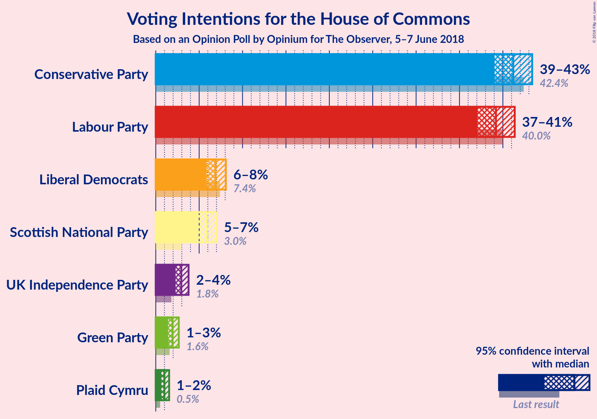
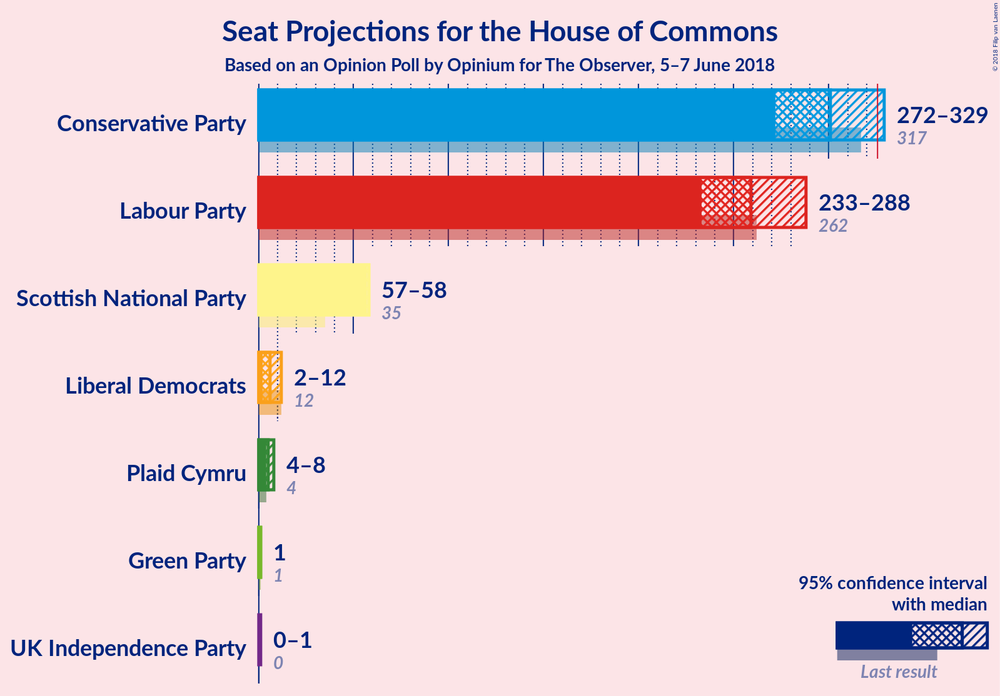
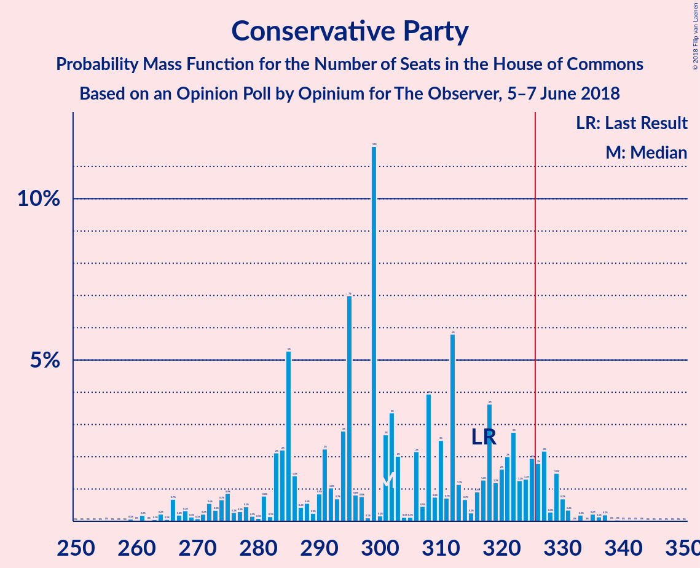
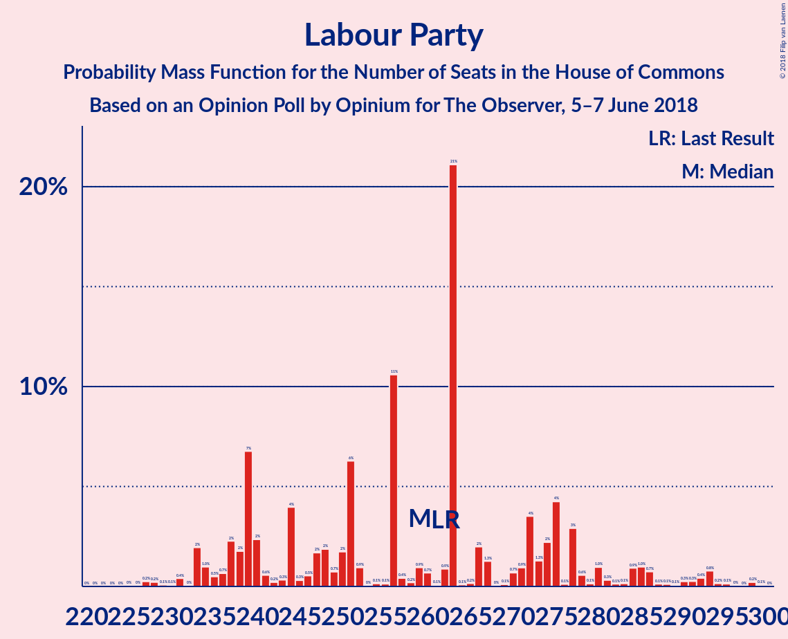
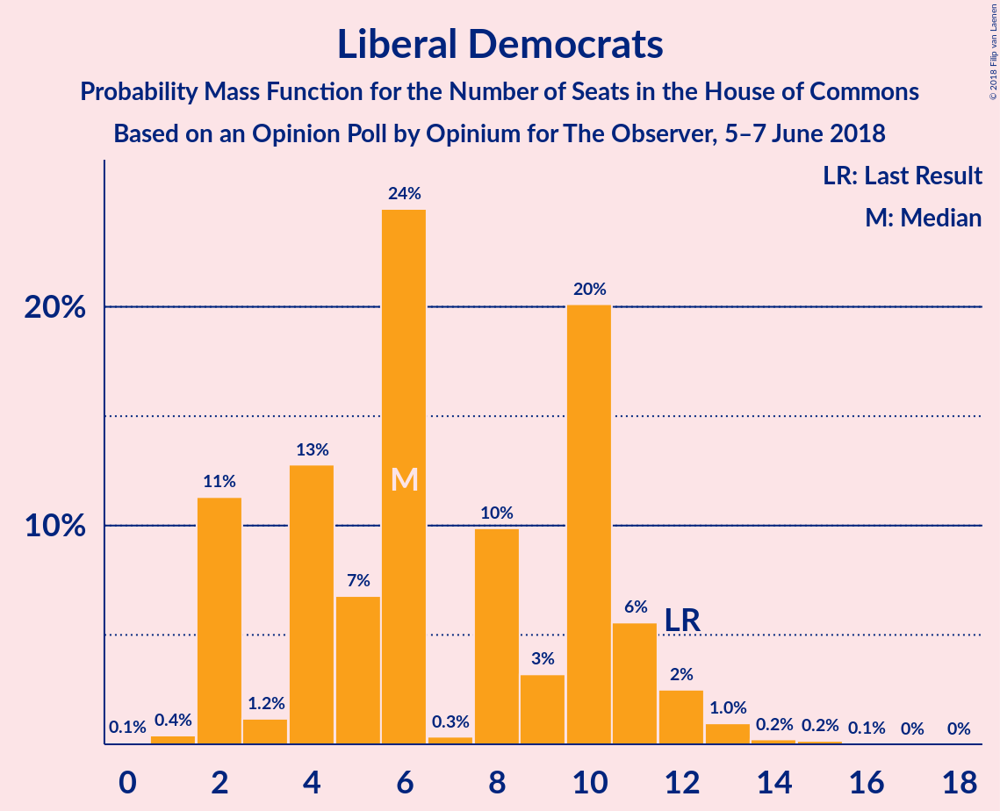
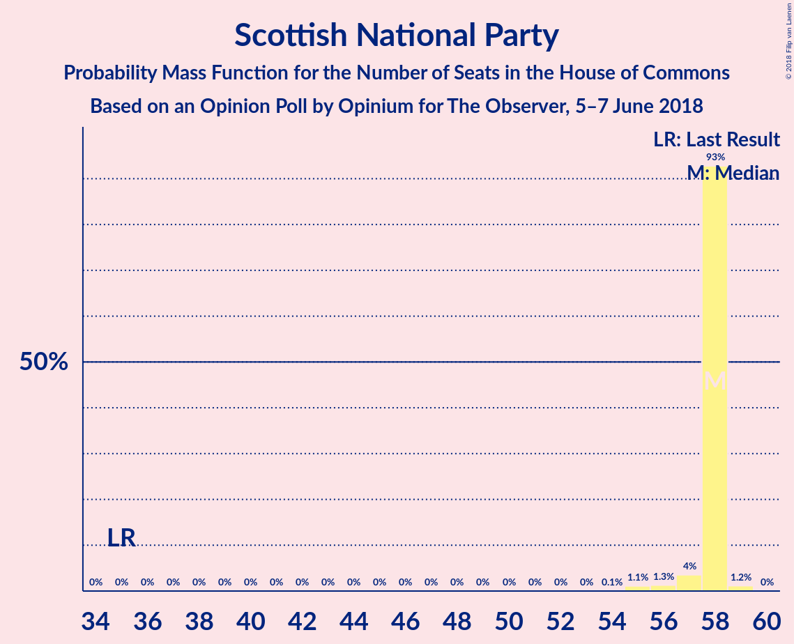
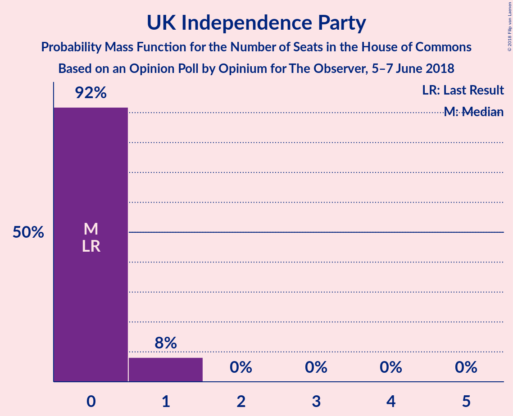
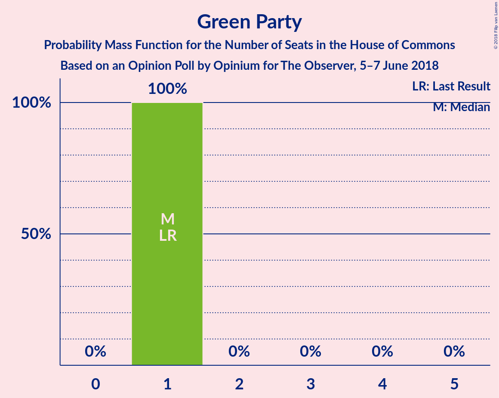
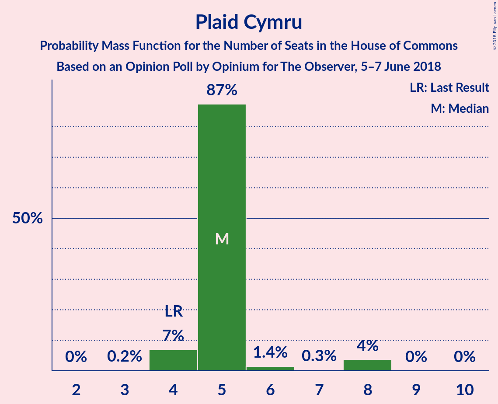
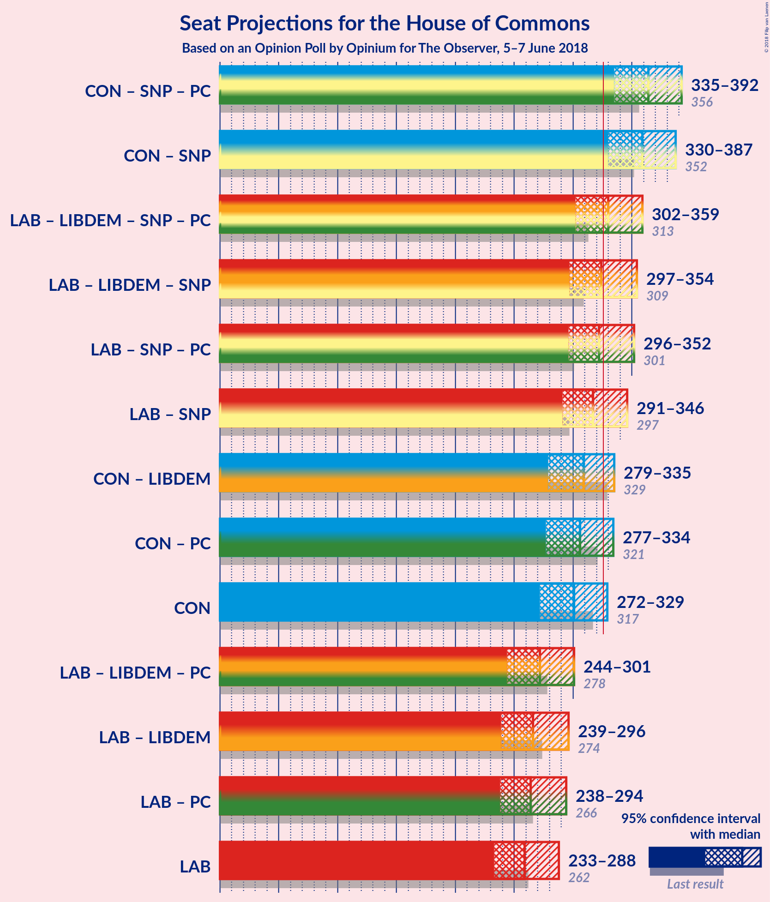

# Opinion Poll by Opinium for The Observer, 5–7 June 2018

<a href="#voting-intentions">Voting Intentions</a> | <a href="#seats">Seats</a> | <a href="#coalitions">Coalitions</a> | <a href="#technical-information">Technical Information</a>

## Voting Intentions

### Confidence Intervals

| Party | Last Result | Poll Result | 80% Confidence Interval | 90% Confidence Interval | 95% Confidence Interval | 99% Confidence Interval |
|:-----:|:-----------:|:-----------:|:-----------------------:|:-----------------------:|:-----------------------:|:-----------------------:|
| Conservative Party | 42.4% | 41.2% | 39.8–42.6% |39.4–43.0% |39.0–43.4% |38.4–44.1% |
| Labour Party | 40.0% | 39.2% | 37.8–40.6% |37.4–41.0% |37.1–41.4% |36.4–42.1% |
| Liberal Democrats | 7.4% | 6.9% | 6.2–7.7% |6.0–7.9% |5.9–8.1% |5.5–8.5% |
| Scottish National Party | 3.0% | 5.9% | 5.3–6.6% |5.1–6.8% |4.9–7.0% |4.6–7.4% |
| UK Independence Party | 1.8% | 2.9% | 2.5–3.5% |2.4–3.6% |2.3–3.8% |2.1–4.1% |
| Green Party | 1.6% | 1.9% | 1.6–2.4% |1.5–2.5% |1.4–2.7% |1.3–2.9% |
| Plaid Cymru | 0.5% | 1.0% | 0.8–1.4% |0.7–1.4% |0.6–1.5% |0.5–1.7% |

*Note:* The poll result column reflects the actual value used in the calculations. Published results may vary slightly, and in addition be rounded to fewer digits.

## Seats

### Confidence Intervals

| Party | Last Result | Median | 80% Confidence Interval | 90% Confidence Interval | 95% Confidence Interval | 99% Confidence Interval |
|:-----:|:-----------:|:------:|:-----------------------:|:-----------------------:|:-----------------------:|:-----------------------:|
| <a href="#conservative-party">Conservative Party</a> | 317 | 301 | 284–324 |276–327 |272–329 |264–336 |
| <a href="#labour-party">Labour Party</a> | 262 | 259 | 239–277 |236–284 |233–288 |228–295 |
| <a href="#liberal-democrats">Liberal Democrats</a> | 12 | 6 | 2–10 |2–11 |2–12 |2–13 |
| <a href="#scottish-national-party">Scottish National Party</a> | 35 | 58 | 58 |57–58 |57–58 |55–59 |
| <a href="#uk-independence-party">UK Independence Party</a> | 0 | 0 | 0 |0–1 |0–1 |0–1 |
| <a href="#green-party">Green Party</a> | 1 | 1 | 1 |1 |1 |1 |
| <a href="#plaid-cymru">Plaid Cymru</a> | 4 | 5 | 5 |4–6 |4–8 |4–8 |

### Conservative Party

*For a full overview of the results for this party, see the [Conservative Party](party-conservativeparty.html) page.*

| Number of Seats | Probability | Accumulated | Special Marks |
|:---------------:|:-----------:|:-----------:|:-------------:|
| 258 | 0% | 100% |  |
| 259 | 0.1% | 99.9% |  |
| 260 | 0% | 99.9% |  |
| 261 | 0.2% | 99.8% |  |
| 262 | 0% | 99.7% |  |
| 263 | 0.1% | 99.6% |  |
| 264 | 0.2% | 99.6% |  |
| 265 | 0.1% | 99.3% |  |
| 266 | 0.7% | 99.3% |  |
| 267 | 0.2% | 98.6% |  |
| 268 | 0.3% | 98% |  |
| 269 | 0.1% | 98% |  |
| 270 | 0.1% | 98% |  |
| 271 | 0.2% | 98% |  |
| 272 | 0.6% | 98% |  |
| 273 | 0.3% | 97% |  |
| 274 | 0.7% | 97% |  |
| 275 | 0.9% | 96% |  |
| 276 | 0.3% | 95% |  |
| 277 | 0.3% | 95% |  |
| 278 | 0.5% | 95% |  |
| 279 | 0.2% | 94% |  |
| 280 | 0.1% | 94% |  |
| 281 | 0.8% | 94% |  |
| 282 | 0.1% | 93% |  |
| 283 | 2% | 93% |  |
| 284 | 2% | 91% |  |
| 285 | 5% | 89% |  |
| 286 | 1.4% | 83% |  |
| 287 | 0.4% | 82% |  |
| 288 | 0.6% | 81% |  |
| 289 | 0.3% | 81% |  |
| 290 | 0.9% | 81% |  |
| 291 | 2% | 80% |  |
| 292 | 1.0% | 78% |  |
| 293 | 0.7% | 77% |  |
| 294 | 3% | 76% |  |
| 295 | 7% | 73% |  |
| 296 | 0.8% | 66% |  |
| 297 | 0.8% | 65% |  |
| 298 | 0.1% | 64% |  |
| 299 | 12% | 64% |  |
| 300 | 0.2% | 53% |  |
| 301 | 3% | 53% | Median |
| 302 | 3% | 50% |  |
| 303 | 2% | 46% |  |
| 304 | 0.1% | 44% |  |
| 305 | 0.1% | 44% |  |
| 306 | 2% | 44% |  |
| 307 | 0.5% | 42% |  |
| 308 | 4% | 42% |  |
| 309 | 0.8% | 38% |  |
| 310 | 3% | 37% |  |
| 311 | 0.7% | 34% |  |
| 312 | 6% | 34% |  |
| 313 | 1.1% | 28% |  |
| 314 | 0.7% | 27% |  |
| 315 | 0.3% | 26% |  |
| 316 | 0.9% | 26% |  |
| 317 | 1.3% | 25% | Last Result |
| 318 | 4% | 24% |  |
| 319 | 1.2% | 20% |  |
| 320 | 2% | 19% |  |
| 321 | 2% | 17% |  |
| 322 | 3% | 15% |  |
| 323 | 1.3% | 12% |  |
| 324 | 1.3% | 11% |  |
| 325 | 2% | 10% |  |
| 326 | 2% | 8% | Majority |
| 327 | 2% | 6% |  |
| 328 | 0.3% | 4% |  |
| 329 | 1.5% | 4% |  |
| 330 | 0.7% | 2% |  |
| 331 | 0.4% | 1.3% |  |
| 332 | 0% | 1.0% |  |
| 333 | 0.2% | 1.0% |  |
| 334 | 0% | 0.8% |  |
| 335 | 0.2% | 0.7% |  |
| 336 | 0.1% | 0.5% |  |
| 337 | 0.2% | 0.4% |  |
| 338 | 0% | 0.2% |  |
| 339 | 0% | 0.1% |  |
| 340 | 0% | 0.1% |  |
| 341 | 0% | 0.1% |  |
| 342 | 0% | 0.1% |  |
| 343 | 0% | 0% |  |

### Labour Party

*For a full overview of the results for this party, see the [Labour Party](party-labourparty.html) page.*

| Number of Seats | Probability | Accumulated | Special Marks |
|:---------------:|:-----------:|:-----------:|:-------------:|
| 223 | 0% | 100% |  |
| 224 | 0% | 99.9% |  |
| 225 | 0% | 99.9% |  |
| 226 | 0% | 99.9% |  |
| 227 | 0.2% | 99.8% |  |
| 228 | 0.2% | 99.6% |  |
| 229 | 0.1% | 99.4% |  |
| 230 | 0.1% | 99.3% |  |
| 231 | 0.4% | 99.2% |  |
| 232 | 0% | 98.8% |  |
| 233 | 2% | 98.8% |  |
| 234 | 1.0% | 97% |  |
| 235 | 0.5% | 96% |  |
| 236 | 0.7% | 95% |  |
| 237 | 2% | 95% |  |
| 238 | 2% | 92% |  |
| 239 | 7% | 91% |  |
| 240 | 2% | 84% |  |
| 241 | 0.6% | 82% |  |
| 242 | 0.2% | 81% |  |
| 243 | 0.3% | 81% |  |
| 244 | 4% | 80% |  |
| 245 | 0.3% | 76% |  |
| 246 | 0.5% | 76% |  |
| 247 | 2% | 76% |  |
| 248 | 2% | 74% |  |
| 249 | 0.7% | 72% |  |
| 250 | 2% | 71% |  |
| 251 | 6% | 70% |  |
| 252 | 0.9% | 63% |  |
| 253 | 0% | 62% |  |
| 254 | 0.1% | 62% |  |
| 255 | 0.1% | 62% |  |
| 256 | 11% | 62% |  |
| 257 | 0.4% | 51% |  |
| 258 | 0.2% | 51% |  |
| 259 | 0.9% | 51% | Median |
| 260 | 0.7% | 50% |  |
| 261 | 0.1% | 49% |  |
| 262 | 0.9% | 49% | Last Result |
| 263 | 21% | 48% |  |
| 264 | 0.1% | 27% |  |
| 265 | 0.2% | 27% |  |
| 266 | 2% | 27% |  |
| 267 | 1.3% | 25% |  |
| 268 | 0% | 24% |  |
| 269 | 0.1% | 24% |  |
| 270 | 0.7% | 24% |  |
| 271 | 0.9% | 23% |  |
| 272 | 4% | 22% |  |
| 273 | 1.3% | 18% |  |
| 274 | 2% | 17% |  |
| 275 | 4% | 15% |  |
| 276 | 0.1% | 11% |  |
| 277 | 3% | 10% |  |
| 278 | 0.6% | 8% |  |
| 279 | 0.1% | 7% |  |
| 280 | 1.0% | 7% |  |
| 281 | 0.3% | 6% |  |
| 282 | 0.1% | 6% |  |
| 283 | 0.1% | 5% |  |
| 284 | 0.9% | 5% |  |
| 285 | 1.0% | 4% |  |
| 286 | 0.7% | 3% |  |
| 287 | 0.1% | 3% |  |
| 288 | 0.1% | 3% |  |
| 289 | 0.1% | 2% |  |
| 290 | 0.3% | 2% |  |
| 291 | 0.3% | 2% |  |
| 292 | 0.4% | 2% |  |
| 293 | 0.8% | 1.4% |  |
| 294 | 0.2% | 0.7% |  |
| 295 | 0.1% | 0.5% |  |
| 296 | 0% | 0.4% |  |
| 297 | 0% | 0.3% |  |
| 298 | 0.2% | 0.3% |  |
| 299 | 0.1% | 0.1% |  |
| 300 | 0% | 0% |  |

### Liberal Democrats

*For a full overview of the results for this party, see the [Liberal Democrats](party-liberaldemocrats.html) page.*

| Number of Seats | Probability | Accumulated | Special Marks |
|:---------------:|:-----------:|:-----------:|:-------------:|
| 0 | 0.1% | 100% |  |
| 1 | 0.4% | 99.9% |  |
| 2 | 11% | 99.5% |  |
| 3 | 1.2% | 88% |  |
| 4 | 13% | 87% |  |
| 5 | 7% | 74% |  |
| 6 | 24% | 67% | Median |
| 7 | 0.3% | 43% |  |
| 8 | 10% | 43% |  |
| 9 | 3% | 33% |  |
| 10 | 20% | 30% |  |
| 11 | 6% | 9% |  |
| 12 | 2% | 4% | Last Result |
| 13 | 1.0% | 1.4% |  |
| 14 | 0.2% | 0.4% |  |
| 15 | 0.2% | 0.2% |  |
| 16 | 0.1% | 0.1% |  |
| 17 | 0% | 0% |  |

### Scottish National Party

*For a full overview of the results for this party, see the [Scottish National Party](party-scottishnationalparty.html) page.*

| Number of Seats | Probability | Accumulated | Special Marks |
|:---------------:|:-----------:|:-----------:|:-------------:|
| 35 | 0% | 100% | Last Result |
| 36 | 0% | 100% |  |
| 37 | 0% | 100% |  |
| 38 | 0% | 100% |  |
| 39 | 0% | 100% |  |
| 40 | 0% | 100% |  |
| 41 | 0% | 100% |  |
| 42 | 0% | 100% |  |
| 43 | 0% | 100% |  |
| 44 | 0% | 100% |  |
| 45 | 0% | 100% |  |
| 46 | 0% | 100% |  |
| 47 | 0% | 100% |  |
| 48 | 0% | 100% |  |
| 49 | 0% | 100% |  |
| 50 | 0% | 100% |  |
| 51 | 0% | 100% |  |
| 52 | 0% | 100% |  |
| 53 | 0% | 100% |  |
| 54 | 0.1% | 100% |  |
| 55 | 1.1% | 99.9% |  |
| 56 | 1.3% | 98.8% |  |
| 57 | 4% | 98% |  |
| 58 | 93% | 94% | Median |
| 59 | 1.2% | 1.2% |  |
| 60 | 0% | 0% |  |

### UK Independence Party

*For a full overview of the results for this party, see the [UK Independence Party](party-ukindependenceparty.html) page.*

| Number of Seats | Probability | Accumulated | Special Marks |
|:---------------:|:-----------:|:-----------:|:-------------:|
| 0 | 92% | 100% | Last Result, Median |
| 1 | 8% | 8% |  |
| 2 | 0% | 0% |  |

### Green Party

*For a full overview of the results for this party, see the [Green Party](party-greenparty.html) page.*

| Number of Seats | Probability | Accumulated | Special Marks |
|:---------------:|:-----------:|:-----------:|:-------------:|
| 1 | 100% | 100% | Last Result, Median |

### Plaid Cymru

*For a full overview of the results for this party, see the [Plaid Cymru](party-plaidcymru.html) page.*

| Number of Seats | Probability | Accumulated | Special Marks |
|:---------------:|:-----------:|:-----------:|:-------------:|
| 2 | 0% | 100% |  |
| 3 | 0.2% | 99.9% |  |
| 4 | 7% | 99.8% | Last Result |
| 5 | 87% | 93% | Median |
| 6 | 1.4% | 5% |  |
| 7 | 0.3% | 4% |  |
| 8 | 4% | 4% |  |
| 9 | 0% | 0.1% |  |
| 10 | 0% | 0% |  |

## Coalitions

### Confidence Intervals

| Coalition | Last Result | Median | Majority? | 80% Confidence Interval | 90% Confidence Interval | 95% Confidence Interval | 99% Confidence Interval |
|:---------:|:-----------:|:------:|:---------:|:-----------------------:|:-----------------------:|:-----------------------:|:-----------------------:|
| Conservative Party – Scottish National Party – Plaid Cymru | 356 | 364 | 99.6% | 347–387 | 339–390 | 335–392 | 327–398 |
| Conservative Party – Scottish National Party | 352 | 359 | 98% | 342–382 | 334–385 | 330–387 | 322–393 |
| Labour Party – Liberal Democrats – Scottish National Party – Plaid Cymru | 313 | 330 | 56% | 307–347 | 304–355 | 302–359 | 295–367 |
| Labour Party – Liberal Democrats – Scottish National Party | 309 | 324 | 48% | 301–342 | 299–350 | 297–354 | 290–362 |
| Labour Party – Scottish National Party – Plaid Cymru | 301 | 322 | 48% | 302–340 | 300–347 | 296–352 | 291–357 |
| Labour Party – Scottish National Party | 297 | 317 | 24% | 297–335 | 294–342 | 291–346 | 286–352 |
| Conservative Party – Liberal Democrats | 329 | 309 | 20% | 291–329 | 284–331 | 279–335 | 274–340 |
| Conservative Party – Plaid Cymru | 321 | 306 | 18% | 289–330 | 281–332 | 277–334 | 269–341 |
| Conservative Party | 317 | 301 | 8% | 284–324 | 276–327 | 272–329 | 264–336 |
| Labour Party – Liberal Democrats – Plaid Cymru | 278 | 272 | 0% | 249–289 | 246–297 | 244–301 | 238–309 |
| Labour Party – Liberal Democrats | 274 | 266 | 0% | 243–284 | 241–292 | 239–296 | 233–304 |
| Labour Party – Plaid Cymru | 266 | 264 | 0% | 244–282 | 242–289 | 238–294 | 233–299 |
| Labour Party | 262 | 259 | 0% | 239–277 | 236–284 | 233–288 | 228–295 |

### Conservative Party – Scottish National Party – Plaid Cymru

| Number of Seats | Probability | Accumulated | Special Marks |
|:---------------:|:-----------:|:-----------:|:-------------:|
| 321 | 0% | 100% |  |
| 322 | 0.1% | 99.9% |  |
| 323 | 0.2% | 99.9% |  |
| 324 | 0% | 99.7% |  |
| 325 | 0% | 99.6% |  |
| 326 | 0% | 99.6% | Majority |
| 327 | 0.3% | 99.5% |  |
| 328 | 0.1% | 99.3% |  |
| 329 | 0.7% | 99.2% |  |
| 330 | 0.4% | 98.5% |  |
| 331 | 0.1% | 98% |  |
| 332 | 0.2% | 98% |  |
| 333 | 0.1% | 98% |  |
| 334 | 0.2% | 98% |  |
| 335 | 0.8% | 98% |  |
| 336 | 0.2% | 97% |  |
| 337 | 0.7% | 97% |  |
| 338 | 0.9% | 96% |  |
| 339 | 0.3% | 95% |  |
| 340 | 0.3% | 95% |  |
| 341 | 0.1% | 95% |  |
| 342 | 0.4% | 94% |  |
| 343 | 0.1% | 94% |  |
| 344 | 0.9% | 94% |  |
| 345 | 0.1% | 93% |  |
| 346 | 2% | 93% |  |
| 347 | 2% | 91% |  |
| 348 | 5% | 89% |  |
| 349 | 2% | 83% |  |
| 350 | 0.2% | 82% |  |
| 351 | 0.7% | 81% |  |
| 352 | 0.8% | 81% |  |
| 353 | 0% | 80% |  |
| 354 | 2% | 80% |  |
| 355 | 1.0% | 78% |  |
| 356 | 0.5% | 77% | Last Result |
| 357 | 3% | 76% |  |
| 358 | 7% | 73% |  |
| 359 | 0.8% | 66% |  |
| 360 | 0.7% | 65% |  |
| 361 | 0.3% | 65% |  |
| 362 | 12% | 64% |  |
| 363 | 1.2% | 53% |  |
| 364 | 1.4% | 51% | Median |
| 365 | 4% | 50% |  |
| 366 | 2% | 46% |  |
| 367 | 0.2% | 45% |  |
| 368 | 0.2% | 44% |  |
| 369 | 2% | 44% |  |
| 370 | 2% | 42% |  |
| 371 | 3% | 40% |  |
| 372 | 0.5% | 37% |  |
| 373 | 3% | 37% |  |
| 374 | 0.7% | 34% |  |
| 375 | 6% | 34% |  |
| 376 | 0.7% | 28% |  |
| 377 | 0.4% | 27% |  |
| 378 | 0.8% | 26% |  |
| 379 | 0.5% | 26% |  |
| 380 | 2% | 25% |  |
| 381 | 4% | 23% |  |
| 382 | 2% | 20% |  |
| 383 | 0.7% | 18% |  |
| 384 | 2% | 17% |  |
| 385 | 3% | 15% |  |
| 386 | 1.5% | 13% |  |
| 387 | 1.2% | 11% |  |
| 388 | 2% | 10% |  |
| 389 | 2% | 8% |  |
| 390 | 2% | 6% |  |
| 391 | 0.4% | 4% |  |
| 392 | 2% | 4% |  |
| 393 | 0.6% | 2% |  |
| 394 | 0.4% | 1.4% |  |
| 395 | 0% | 1.0% |  |
| 396 | 0.3% | 1.0% |  |
| 397 | 0% | 0.7% |  |
| 398 | 0.2% | 0.7% |  |
| 399 | 0.2% | 0.5% |  |
| 400 | 0.1% | 0.3% |  |
| 401 | 0% | 0.2% |  |
| 402 | 0% | 0.1% |  |
| 403 | 0% | 0.1% |  |
| 404 | 0% | 0.1% |  |
| 405 | 0% | 0.1% |  |
| 406 | 0% | 0% |  |

### Conservative Party – Scottish National Party

| Number of Seats | Probability | Accumulated | Special Marks |
|:---------------:|:-----------:|:-----------:|:-------------:|
| 316 | 0% | 100% |  |
| 317 | 0.1% | 99.9% |  |
| 318 | 0% | 99.9% |  |
| 319 | 0.2% | 99.8% |  |
| 320 | 0% | 99.6% |  |
| 321 | 0% | 99.6% |  |
| 322 | 0.2% | 99.6% |  |
| 323 | 0.1% | 99.3% |  |
| 324 | 0.7% | 99.2% |  |
| 325 | 0.2% | 98.6% |  |
| 326 | 0.3% | 98% | Majority |
| 327 | 0.1% | 98% |  |
| 328 | 0.1% | 98% |  |
| 329 | 0.2% | 98% |  |
| 330 | 0.6% | 98% |  |
| 331 | 0.4% | 97% |  |
| 332 | 0.7% | 97% |  |
| 333 | 0.9% | 96% |  |
| 334 | 0.2% | 95% |  |
| 335 | 0.3% | 95% |  |
| 336 | 0.4% | 95% |  |
| 337 | 0.2% | 94% |  |
| 338 | 0.1% | 94% |  |
| 339 | 0.7% | 94% |  |
| 340 | 0.1% | 93% |  |
| 341 | 3% | 93% |  |
| 342 | 2% | 90% |  |
| 343 | 5% | 89% |  |
| 344 | 1.4% | 83% |  |
| 345 | 0.5% | 82% |  |
| 346 | 0.5% | 81% |  |
| 347 | 0.6% | 81% |  |
| 348 | 0.5% | 80% |  |
| 349 | 2% | 80% |  |
| 350 | 1.1% | 78% |  |
| 351 | 0.7% | 76% |  |
| 352 | 3% | 76% | Last Result |
| 353 | 7% | 73% |  |
| 354 | 0.8% | 66% |  |
| 355 | 0.8% | 65% |  |
| 356 | 0.1% | 64% |  |
| 357 | 12% | 64% |  |
| 358 | 0.2% | 52% |  |
| 359 | 2% | 52% | Median |
| 360 | 3% | 50% |  |
| 361 | 2% | 46% |  |
| 362 | 0.1% | 44% |  |
| 363 | 0.1% | 44% |  |
| 364 | 2% | 44% |  |
| 365 | 2% | 42% |  |
| 366 | 3% | 40% |  |
| 367 | 0.6% | 37% |  |
| 368 | 2% | 37% |  |
| 369 | 0.7% | 34% |  |
| 370 | 6% | 34% |  |
| 371 | 1.4% | 28% |  |
| 372 | 0.3% | 26% |  |
| 373 | 0.6% | 26% |  |
| 374 | 0.6% | 25% |  |
| 375 | 1.3% | 25% |  |
| 376 | 4% | 23% |  |
| 377 | 1.5% | 20% |  |
| 378 | 1.2% | 18% |  |
| 379 | 2% | 17% |  |
| 380 | 3% | 15% |  |
| 381 | 1.3% | 12% |  |
| 382 | 2% | 11% |  |
| 383 | 2% | 9% |  |
| 384 | 2% | 7% |  |
| 385 | 2% | 6% |  |
| 386 | 0.3% | 4% |  |
| 387 | 1.5% | 3% |  |
| 388 | 0.7% | 2% |  |
| 389 | 0.3% | 1.3% |  |
| 390 | 0% | 1.0% |  |
| 391 | 0.3% | 1.0% |  |
| 392 | 0% | 0.7% |  |
| 393 | 0.2% | 0.6% |  |
| 394 | 0% | 0.4% |  |
| 395 | 0.2% | 0.4% |  |
| 396 | 0% | 0.2% |  |
| 397 | 0.1% | 0.1% |  |
| 398 | 0% | 0.1% |  |
| 399 | 0% | 0.1% |  |
| 400 | 0% | 0.1% |  |
| 401 | 0% | 0% |  |

### Labour Party – Liberal Democrats – Scottish National Party – Plaid Cymru

| Number of Seats | Probability | Accumulated | Special Marks |
|:---------------:|:-----------:|:-----------:|:-------------:|
| 289 | 0% | 100% |  |
| 290 | 0% | 99.9% |  |
| 291 | 0% | 99.9% |  |
| 292 | 0% | 99.9% |  |
| 293 | 0% | 99.9% |  |
| 294 | 0.2% | 99.8% |  |
| 295 | 0.1% | 99.6% |  |
| 296 | 0.2% | 99.5% |  |
| 297 | 0% | 99.2% |  |
| 298 | 0.2% | 99.2% |  |
| 299 | 0% | 99.0% |  |
| 300 | 0.3% | 99.0% |  |
| 301 | 0.7% | 98.7% |  |
| 302 | 2% | 98% |  |
| 303 | 0.2% | 96% |  |
| 304 | 2% | 96% |  |
| 305 | 2% | 94% |  |
| 306 | 2% | 92% |  |
| 307 | 1.2% | 90% |  |
| 308 | 3% | 89% |  |
| 309 | 1.3% | 86% |  |
| 310 | 2% | 85% |  |
| 311 | 2% | 83% |  |
| 312 | 1.3% | 81% |  |
| 313 | 4% | 80% | Last Result |
| 314 | 1.0% | 76% |  |
| 315 | 0.9% | 75% |  |
| 316 | 0.4% | 74% |  |
| 317 | 0.7% | 74% |  |
| 318 | 1.0% | 73% |  |
| 319 | 6% | 72% |  |
| 320 | 0.8% | 66% |  |
| 321 | 2% | 66% |  |
| 322 | 0.7% | 63% |  |
| 323 | 4% | 62% |  |
| 324 | 0.7% | 58% |  |
| 325 | 2% | 58% |  |
| 326 | 0.1% | 56% | Majority |
| 327 | 0.9% | 56% |  |
| 328 | 2% | 55% | Median |
| 329 | 3% | 53% |  |
| 330 | 3% | 50% |  |
| 331 | 0.1% | 47% |  |
| 332 | 12% | 47% |  |
| 333 | 0.2% | 36% |  |
| 334 | 1.3% | 35% |  |
| 335 | 0.2% | 34% |  |
| 336 | 7% | 34% |  |
| 337 | 3% | 27% |  |
| 338 | 0.6% | 24% |  |
| 339 | 2% | 23% |  |
| 340 | 1.2% | 21% |  |
| 341 | 0.9% | 20% |  |
| 342 | 0.3% | 19% |  |
| 343 | 0.5% | 19% |  |
| 344 | 0.5% | 18% |  |
| 345 | 1.3% | 18% |  |
| 346 | 5% | 17% |  |
| 347 | 2% | 11% |  |
| 348 | 2% | 9% |  |
| 349 | 0.1% | 7% |  |
| 350 | 0.8% | 7% |  |
| 351 | 0.2% | 6% |  |
| 352 | 0.1% | 6% |  |
| 353 | 0.6% | 6% |  |
| 354 | 0.2% | 5% |  |
| 355 | 0.2% | 5% |  |
| 356 | 0.9% | 5% |  |
| 357 | 0.8% | 4% |  |
| 358 | 0.2% | 3% |  |
| 359 | 0.6% | 3% |  |
| 360 | 0.2% | 2% |  |
| 361 | 0.1% | 2% |  |
| 362 | 0.1% | 2% |  |
| 363 | 0.3% | 2% |  |
| 364 | 0.2% | 2% |  |
| 365 | 0.7% | 1.4% |  |
| 366 | 0.1% | 0.7% |  |
| 367 | 0.2% | 0.6% |  |
| 368 | 0.1% | 0.4% |  |
| 369 | 0% | 0.4% |  |
| 370 | 0.2% | 0.3% |  |
| 371 | 0% | 0.2% |  |
| 372 | 0.1% | 0.1% |  |
| 373 | 0% | 0.1% |  |
| 374 | 0% | 0% |  |

### Labour Party – Liberal Democrats – Scottish National Party

| Number of Seats | Probability | Accumulated | Special Marks |
|:---------------:|:-----------:|:-----------:|:-------------:|
| 284 | 0% | 100% |  |
| 285 | 0% | 99.9% |  |
| 286 | 0% | 99.9% |  |
| 287 | 0% | 99.9% |  |
| 288 | 0% | 99.8% |  |
| 289 | 0.1% | 99.8% |  |
| 290 | 0.3% | 99.7% |  |
| 291 | 0.2% | 99.4% |  |
| 292 | 0% | 99.2% |  |
| 293 | 0.2% | 99.2% |  |
| 294 | 0% | 99.0% |  |
| 295 | 0.3% | 98.9% |  |
| 296 | 0.6% | 98.6% |  |
| 297 | 2% | 98% |  |
| 298 | 0.4% | 96% |  |
| 299 | 2% | 96% |  |
| 300 | 2% | 94% |  |
| 301 | 2% | 92% |  |
| 302 | 0.9% | 90% |  |
| 303 | 3% | 89% |  |
| 304 | 1.2% | 86% |  |
| 305 | 2% | 84% |  |
| 306 | 0.9% | 82% |  |
| 307 | 2% | 81% |  |
| 308 | 4% | 80% |  |
| 309 | 1.3% | 76% | Last Result |
| 310 | 0.8% | 75% |  |
| 311 | 0.6% | 74% |  |
| 312 | 0.8% | 73% |  |
| 313 | 0.2% | 73% |  |
| 314 | 6% | 72% |  |
| 315 | 0.7% | 66% |  |
| 316 | 3% | 66% |  |
| 317 | 0.5% | 63% |  |
| 318 | 4% | 62% |  |
| 319 | 0.5% | 58% |  |
| 320 | 2% | 58% |  |
| 321 | 0.1% | 56% |  |
| 322 | 0.9% | 56% |  |
| 323 | 2% | 55% | Median |
| 324 | 3% | 53% |  |
| 325 | 2% | 50% |  |
| 326 | 1.1% | 48% | Majority |
| 327 | 12% | 47% |  |
| 328 | 0.3% | 36% |  |
| 329 | 1.5% | 35% |  |
| 330 | 0.2% | 34% |  |
| 331 | 7% | 34% |  |
| 332 | 3% | 27% |  |
| 333 | 0.5% | 24% |  |
| 334 | 2% | 23% |  |
| 335 | 1.0% | 21% |  |
| 336 | 0.5% | 20% |  |
| 337 | 0.5% | 20% |  |
| 338 | 0.7% | 19% |  |
| 339 | 0.1% | 18% |  |
| 340 | 2% | 18% |  |
| 341 | 5% | 17% |  |
| 342 | 3% | 11% |  |
| 343 | 2% | 9% |  |
| 344 | 0.1% | 7% |  |
| 345 | 1.0% | 7% |  |
| 346 | 0.2% | 6% |  |
| 347 | 0.2% | 6% |  |
| 348 | 0.2% | 6% |  |
| 349 | 0.2% | 5% |  |
| 350 | 0.3% | 5% |  |
| 351 | 0.9% | 5% |  |
| 352 | 0.7% | 4% |  |
| 353 | 0.3% | 3% |  |
| 354 | 0.6% | 3% |  |
| 355 | 0.2% | 2% |  |
| 356 | 0.1% | 2% |  |
| 357 | 0.2% | 2% |  |
| 358 | 0.1% | 2% |  |
| 359 | 0.4% | 2% |  |
| 360 | 0.7% | 1.5% |  |
| 361 | 0.1% | 0.8% |  |
| 362 | 0.2% | 0.7% |  |
| 363 | 0.1% | 0.4% |  |
| 364 | 0% | 0.4% |  |
| 365 | 0% | 0.4% |  |
| 366 | 0.2% | 0.3% |  |
| 367 | 0.1% | 0.1% |  |
| 368 | 0% | 0% |  |

### Labour Party – Scottish National Party – Plaid Cymru

| Number of Seats | Probability | Accumulated | Special Marks |
|:---------------:|:-----------:|:-----------:|:-------------:|
| 286 | 0% | 100% |  |
| 287 | 0.1% | 99.9% |  |
| 288 | 0% | 99.8% |  |
| 289 | 0.1% | 99.8% |  |
| 290 | 0.2% | 99.7% |  |
| 291 | 0.1% | 99.5% |  |
| 292 | 0.1% | 99.4% |  |
| 293 | 0% | 99.3% |  |
| 294 | 0.5% | 99.3% |  |
| 295 | 0% | 98.8% |  |
| 296 | 2% | 98.8% |  |
| 297 | 0.9% | 97% |  |
| 298 | 0.2% | 96% |  |
| 299 | 0.5% | 96% |  |
| 300 | 2% | 95% |  |
| 301 | 2% | 93% | Last Result |
| 302 | 7% | 91% |  |
| 303 | 3% | 84% |  |
| 304 | 0.6% | 81% |  |
| 305 | 0.1% | 81% |  |
| 306 | 0.4% | 80% |  |
| 307 | 4% | 80% |  |
| 308 | 0.4% | 76% |  |
| 309 | 0.3% | 76% |  |
| 310 | 0.7% | 76% |  |
| 311 | 3% | 75% |  |
| 312 | 2% | 72% |  |
| 313 | 0.2% | 70% |  |
| 314 | 8% | 70% |  |
| 315 | 0.1% | 62% |  |
| 316 | 0% | 62% |  |
| 317 | 0.1% | 62% |  |
| 318 | 0.8% | 62% |  |
| 319 | 10% | 61% |  |
| 320 | 0% | 51% |  |
| 321 | 0.1% | 51% |  |
| 322 | 1.4% | 51% | Median |
| 323 | 0.1% | 50% |  |
| 324 | 0.2% | 49% |  |
| 325 | 0.9% | 49% |  |
| 326 | 21% | 48% | Majority |
| 327 | 0.1% | 27% |  |
| 328 | 0.8% | 27% |  |
| 329 | 1.3% | 26% |  |
| 330 | 1.2% | 25% |  |
| 331 | 0% | 24% |  |
| 332 | 0.4% | 24% |  |
| 333 | 0.9% | 23% |  |
| 334 | 0.7% | 23% |  |
| 335 | 5% | 22% |  |
| 336 | 0.4% | 17% |  |
| 337 | 2% | 17% |  |
| 338 | 4% | 15% |  |
| 339 | 0.1% | 11% |  |
| 340 | 3% | 10% |  |
| 341 | 0.2% | 8% |  |
| 342 | 0.1% | 7% |  |
| 343 | 1.0% | 7% |  |
| 344 | 0.9% | 6% |  |
| 345 | 0.1% | 5% |  |
| 346 | 0.2% | 5% |  |
| 347 | 1.0% | 5% |  |
| 348 | 0.9% | 4% |  |
| 349 | 0.7% | 3% |  |
| 350 | 0.1% | 3% |  |
| 351 | 0% | 3% |  |
| 352 | 0.2% | 3% |  |
| 353 | 0.3% | 2% |  |
| 354 | 0.6% | 2% |  |
| 355 | 0% | 1.5% |  |
| 356 | 0.8% | 1.4% |  |
| 357 | 0.2% | 0.6% |  |
| 358 | 0.1% | 0.5% |  |
| 359 | 0% | 0.4% |  |
| 360 | 0.2% | 0.3% |  |
| 361 | 0.1% | 0.2% |  |
| 362 | 0.1% | 0.1% |  |
| 363 | 0% | 0% |  |

### Labour Party – Scottish National Party

| Number of Seats | Probability | Accumulated | Special Marks |
|:---------------:|:-----------:|:-----------:|:-------------:|
| 280 | 0% | 100% |  |
| 281 | 0% | 99.9% |  |
| 282 | 0.1% | 99.9% |  |
| 283 | 0.1% | 99.8% |  |
| 284 | 0.1% | 99.8% |  |
| 285 | 0.1% | 99.7% |  |
| 286 | 0.2% | 99.6% |  |
| 287 | 0.1% | 99.4% |  |
| 288 | 0.1% | 99.3% |  |
| 289 | 0.4% | 99.2% |  |
| 290 | 0.1% | 98.8% |  |
| 291 | 2% | 98.7% |  |
| 292 | 0.8% | 97% |  |
| 293 | 0.6% | 96% |  |
| 294 | 0.6% | 95% |  |
| 295 | 2% | 95% |  |
| 296 | 2% | 92% |  |
| 297 | 7% | 90% | Last Result |
| 298 | 2% | 84% |  |
| 299 | 1.0% | 82% |  |
| 300 | 0.2% | 81% |  |
| 301 | 0.5% | 80% |  |
| 302 | 4% | 80% |  |
| 303 | 0.4% | 76% |  |
| 304 | 0.3% | 76% |  |
| 305 | 1.0% | 75% |  |
| 306 | 3% | 74% |  |
| 307 | 2% | 72% |  |
| 308 | 0.2% | 70% |  |
| 309 | 6% | 70% |  |
| 310 | 1.0% | 63% |  |
| 311 | 0.1% | 62% |  |
| 312 | 0.1% | 62% |  |
| 313 | 0.1% | 62% |  |
| 314 | 11% | 62% |  |
| 315 | 0.4% | 51% |  |
| 316 | 0.3% | 51% |  |
| 317 | 0.9% | 51% | Median |
| 318 | 0.6% | 50% |  |
| 319 | 0.1% | 49% |  |
| 320 | 1.0% | 49% |  |
| 321 | 21% | 48% |  |
| 322 | 0.1% | 27% |  |
| 323 | 0.8% | 27% |  |
| 324 | 2% | 26% |  |
| 325 | 1.0% | 25% |  |
| 326 | 0% | 24% | Majority |
| 327 | 0.2% | 24% |  |
| 328 | 0.7% | 23% |  |
| 329 | 0.9% | 23% |  |
| 330 | 4% | 22% |  |
| 331 | 1.3% | 18% |  |
| 332 | 2% | 17% |  |
| 333 | 4% | 15% |  |
| 334 | 0.2% | 11% |  |
| 335 | 3% | 10% |  |
| 336 | 0.6% | 8% |  |
| 337 | 0.1% | 7% |  |
| 338 | 1.0% | 7% |  |
| 339 | 0.3% | 6% |  |
| 340 | 0.1% | 5% |  |
| 341 | 0.2% | 5% |  |
| 342 | 0.8% | 5% |  |
| 343 | 1.0% | 4% |  |
| 344 | 0.8% | 3% |  |
| 345 | 0.1% | 3% |  |
| 346 | 0.1% | 3% |  |
| 347 | 0.1% | 2% |  |
| 348 | 0.3% | 2% |  |
| 349 | 0.2% | 2% |  |
| 350 | 0.4% | 2% |  |
| 351 | 0.8% | 1.4% |  |
| 352 | 0.2% | 0.6% |  |
| 353 | 0.1% | 0.5% |  |
| 354 | 0% | 0.4% |  |
| 355 | 0% | 0.3% |  |
| 356 | 0.2% | 0.3% |  |
| 357 | 0.1% | 0.1% |  |
| 358 | 0% | 0% |  |

### Conservative Party – Liberal Democrats

| Number of Seats | Probability | Accumulated | Special Marks |
|:---------------:|:-----------:|:-----------:|:-------------:|
| 269 | 0.1% | 100% |  |
| 270 | 0.1% | 99.9% |  |
| 271 | 0.2% | 99.8% |  |
| 272 | 0% | 99.7% |  |
| 273 | 0.1% | 99.6% |  |
| 274 | 0.2% | 99.5% |  |
| 275 | 0.8% | 99.3% |  |
| 276 | 0% | 98.5% |  |
| 277 | 0.6% | 98.5% |  |
| 278 | 0.2% | 98% |  |
| 279 | 0.1% | 98% |  |
| 280 | 0% | 97% |  |
| 281 | 0.1% | 97% |  |
| 282 | 0.7% | 97% |  |
| 283 | 1.1% | 97% |  |
| 284 | 0.8% | 96% |  |
| 285 | 0.2% | 95% |  |
| 286 | 0.2% | 95% |  |
| 287 | 1.0% | 94% |  |
| 288 | 0.8% | 93% |  |
| 289 | 0.2% | 93% |  |
| 290 | 0.1% | 92% |  |
| 291 | 3% | 92% |  |
| 292 | 0.1% | 90% |  |
| 293 | 4% | 89% |  |
| 294 | 2% | 85% |  |
| 295 | 0.5% | 83% |  |
| 296 | 5% | 83% |  |
| 297 | 0.5% | 78% |  |
| 298 | 0.9% | 77% |  |
| 299 | 0.3% | 76% |  |
| 300 | 0% | 76% |  |
| 301 | 2% | 76% |  |
| 302 | 0.2% | 74% |  |
| 303 | 0.9% | 74% |  |
| 304 | 0.1% | 73% |  |
| 305 | 22% | 73% |  |
| 306 | 0.2% | 51% |  |
| 307 | 0.1% | 51% | Median |
| 308 | 0.1% | 51% |  |
| 309 | 1.5% | 50% |  |
| 310 | 0.1% | 49% |  |
| 311 | 2% | 49% |  |
| 312 | 9% | 47% |  |
| 313 | 0.8% | 38% |  |
| 314 | 0.1% | 38% |  |
| 315 | 0% | 38% |  |
| 316 | 0.3% | 38% |  |
| 317 | 7% | 37% |  |
| 318 | 0.1% | 30% |  |
| 319 | 2% | 30% |  |
| 320 | 3% | 28% |  |
| 321 | 0.6% | 25% |  |
| 322 | 0.3% | 24% |  |
| 323 | 0.3% | 24% |  |
| 324 | 4% | 24% |  |
| 325 | 0.3% | 20% |  |
| 326 | 0.1% | 20% | Majority |
| 327 | 0.9% | 19% |  |
| 328 | 4% | 19% |  |
| 329 | 5% | 14% | Last Result |
| 330 | 3% | 9% |  |
| 331 | 2% | 7% |  |
| 332 | 0.5% | 5% |  |
| 333 | 0.2% | 4% |  |
| 334 | 0.9% | 4% |  |
| 335 | 2% | 3% |  |
| 336 | 0% | 1.2% |  |
| 337 | 0.5% | 1.2% |  |
| 338 | 0% | 0.7% |  |
| 339 | 0.1% | 0.7% |  |
| 340 | 0.1% | 0.6% |  |
| 341 | 0.2% | 0.5% |  |
| 342 | 0.1% | 0.3% |  |
| 343 | 0% | 0.2% |  |
| 344 | 0.1% | 0.2% |  |
| 345 | 0% | 0.1% |  |
| 346 | 0% | 0% |  |

### Conservative Party – Plaid Cymru

| Number of Seats | Probability | Accumulated | Special Marks |
|:---------------:|:-----------:|:-----------:|:-------------:|
| 264 | 0.1% | 100% |  |
| 265 | 0.2% | 99.9% |  |
| 266 | 0% | 99.7% |  |
| 267 | 0% | 99.6% |  |
| 268 | 0.1% | 99.6% |  |
| 269 | 0.2% | 99.5% |  |
| 270 | 0.1% | 99.3% |  |
| 271 | 0.7% | 99.2% |  |
| 272 | 0.4% | 98.5% |  |
| 273 | 0.1% | 98% |  |
| 274 | 0.2% | 98% |  |
| 275 | 0.1% | 98% |  |
| 276 | 0.2% | 98% |  |
| 277 | 0.8% | 98% |  |
| 278 | 0.1% | 97% |  |
| 279 | 0.7% | 97% |  |
| 280 | 0.9% | 96% |  |
| 281 | 0.3% | 95% |  |
| 282 | 0.3% | 95% |  |
| 283 | 0% | 95% |  |
| 284 | 0.4% | 94% |  |
| 285 | 0.1% | 94% |  |
| 286 | 1.0% | 94% |  |
| 287 | 0.1% | 93% |  |
| 288 | 2% | 93% |  |
| 289 | 3% | 91% |  |
| 290 | 5% | 89% |  |
| 291 | 2% | 83% |  |
| 292 | 0.2% | 82% |  |
| 293 | 0.7% | 81% |  |
| 294 | 0.5% | 81% |  |
| 295 | 0.4% | 80% |  |
| 296 | 2% | 80% |  |
| 297 | 1.0% | 78% |  |
| 298 | 0.6% | 77% |  |
| 299 | 3% | 76% |  |
| 300 | 7% | 73% |  |
| 301 | 0.9% | 66% |  |
| 302 | 0.8% | 65% |  |
| 303 | 0.3% | 65% |  |
| 304 | 12% | 64% |  |
| 305 | 1.1% | 53% |  |
| 306 | 2% | 52% | Median |
| 307 | 4% | 50% |  |
| 308 | 2% | 46% |  |
| 309 | 0.2% | 45% |  |
| 310 | 0.2% | 44% |  |
| 311 | 2% | 44% |  |
| 312 | 0.5% | 42% |  |
| 313 | 4% | 42% |  |
| 314 | 0.6% | 38% |  |
| 315 | 3% | 37% |  |
| 316 | 0.6% | 34% |  |
| 317 | 6% | 34% |  |
| 318 | 0.4% | 28% |  |
| 319 | 0.8% | 27% |  |
| 320 | 0.4% | 26% |  |
| 321 | 0.8% | 26% | Last Result |
| 322 | 2% | 25% |  |
| 323 | 3% | 24% |  |
| 324 | 2% | 20% |  |
| 325 | 1.0% | 19% |  |
| 326 | 2% | 18% | Majority |
| 327 | 3% | 15% |  |
| 328 | 2% | 13% |  |
| 329 | 1.1% | 11% |  |
| 330 | 2% | 10% |  |
| 331 | 2% | 8% |  |
| 332 | 2% | 6% |  |
| 333 | 0.4% | 4% |  |
| 334 | 2% | 4% |  |
| 335 | 0.6% | 2% |  |
| 336 | 0.3% | 1.4% |  |
| 337 | 0% | 1.1% |  |
| 338 | 0.2% | 1.0% |  |
| 339 | 0.1% | 0.8% |  |
| 340 | 0.2% | 0.8% |  |
| 341 | 0.3% | 0.6% |  |
| 342 | 0.1% | 0.3% |  |
| 343 | 0% | 0.2% |  |
| 344 | 0% | 0.1% |  |
| 345 | 0% | 0.1% |  |
| 346 | 0% | 0.1% |  |
| 347 | 0% | 0.1% |  |
| 348 | 0% | 0% |  |

### Conservative Party

| Number of Seats | Probability | Accumulated | Special Marks |
|:---------------:|:-----------:|:-----------:|:-------------:|
| 258 | 0% | 100% |  |
| 259 | 0.1% | 99.9% |  |
| 260 | 0% | 99.9% |  |
| 261 | 0.2% | 99.8% |  |
| 262 | 0% | 99.7% |  |
| 263 | 0.1% | 99.6% |  |
| 264 | 0.2% | 99.6% |  |
| 265 | 0.1% | 99.3% |  |
| 266 | 0.7% | 99.3% |  |
| 267 | 0.2% | 98.6% |  |
| 268 | 0.3% | 98% |  |
| 269 | 0.1% | 98% |  |
| 270 | 0.1% | 98% |  |
| 271 | 0.2% | 98% |  |
| 272 | 0.6% | 98% |  |
| 273 | 0.3% | 97% |  |
| 274 | 0.7% | 97% |  |
| 275 | 0.9% | 96% |  |
| 276 | 0.3% | 95% |  |
| 277 | 0.3% | 95% |  |
| 278 | 0.5% | 95% |  |
| 279 | 0.2% | 94% |  |
| 280 | 0.1% | 94% |  |
| 281 | 0.8% | 94% |  |
| 282 | 0.1% | 93% |  |
| 283 | 2% | 93% |  |
| 284 | 2% | 91% |  |
| 285 | 5% | 89% |  |
| 286 | 1.4% | 83% |  |
| 287 | 0.4% | 82% |  |
| 288 | 0.6% | 81% |  |
| 289 | 0.3% | 81% |  |
| 290 | 0.9% | 81% |  |
| 291 | 2% | 80% |  |
| 292 | 1.0% | 78% |  |
| 293 | 0.7% | 77% |  |
| 294 | 3% | 76% |  |
| 295 | 7% | 73% |  |
| 296 | 0.8% | 66% |  |
| 297 | 0.8% | 65% |  |
| 298 | 0.1% | 64% |  |
| 299 | 12% | 64% |  |
| 300 | 0.2% | 53% |  |
| 301 | 3% | 53% | Median |
| 302 | 3% | 50% |  |
| 303 | 2% | 46% |  |
| 304 | 0.1% | 44% |  |
| 305 | 0.1% | 44% |  |
| 306 | 2% | 44% |  |
| 307 | 0.5% | 42% |  |
| 308 | 4% | 42% |  |
| 309 | 0.8% | 38% |  |
| 310 | 3% | 37% |  |
| 311 | 0.7% | 34% |  |
| 312 | 6% | 34% |  |
| 313 | 1.1% | 28% |  |
| 314 | 0.7% | 27% |  |
| 315 | 0.3% | 26% |  |
| 316 | 0.9% | 26% |  |
| 317 | 1.3% | 25% | Last Result |
| 318 | 4% | 24% |  |
| 319 | 1.2% | 20% |  |
| 320 | 2% | 19% |  |
| 321 | 2% | 17% |  |
| 322 | 3% | 15% |  |
| 323 | 1.3% | 12% |  |
| 324 | 1.3% | 11% |  |
| 325 | 2% | 10% |  |
| 326 | 2% | 8% | Majority |
| 327 | 2% | 6% |  |
| 328 | 0.3% | 4% |  |
| 329 | 1.5% | 4% |  |
| 330 | 0.7% | 2% |  |
| 331 | 0.4% | 1.3% |  |
| 332 | 0% | 1.0% |  |
| 333 | 0.2% | 1.0% |  |
| 334 | 0% | 0.8% |  |
| 335 | 0.2% | 0.7% |  |
| 336 | 0.1% | 0.5% |  |
| 337 | 0.2% | 0.4% |  |
| 338 | 0% | 0.2% |  |
| 339 | 0% | 0.1% |  |
| 340 | 0% | 0.1% |  |
| 341 | 0% | 0.1% |  |
| 342 | 0% | 0.1% |  |
| 343 | 0% | 0% |  |

### Labour Party – Liberal Democrats – Plaid Cymru

| Number of Seats | Probability | Accumulated | Special Marks |
|:---------------:|:-----------:|:-----------:|:-------------:|
| 231 | 0% | 100% |  |
| 232 | 0% | 99.9% |  |
| 233 | 0% | 99.9% |  |
| 234 | 0.1% | 99.9% |  |
| 235 | 0% | 99.9% |  |
| 236 | 0.2% | 99.8% |  |
| 237 | 0% | 99.6% |  |
| 238 | 0.2% | 99.6% |  |
| 239 | 0% | 99.4% |  |
| 240 | 0.3% | 99.3% |  |
| 241 | 0% | 99.0% |  |
| 242 | 0.3% | 99.0% |  |
| 243 | 0.7% | 98.7% |  |
| 244 | 2% | 98% |  |
| 245 | 0.3% | 97% |  |
| 246 | 2% | 96% |  |
| 247 | 2% | 94% |  |
| 248 | 2% | 93% |  |
| 249 | 1.4% | 90% |  |
| 250 | 3% | 89% |  |
| 251 | 1.3% | 86% |  |
| 252 | 2% | 85% |  |
| 253 | 1.1% | 83% |  |
| 254 | 2% | 82% |  |
| 255 | 4% | 80% |  |
| 256 | 1.1% | 76% |  |
| 257 | 0.6% | 75% |  |
| 258 | 0.8% | 75% |  |
| 259 | 0.2% | 74% |  |
| 260 | 1.3% | 74% |  |
| 261 | 6% | 72% |  |
| 262 | 0.7% | 66% |  |
| 263 | 2% | 66% |  |
| 264 | 0.6% | 63% |  |
| 265 | 3% | 63% |  |
| 266 | 2% | 60% |  |
| 267 | 2% | 58% |  |
| 268 | 0.1% | 56% |  |
| 269 | 0.9% | 56% |  |
| 270 | 2% | 55% | Median |
| 271 | 3% | 53% |  |
| 272 | 2% | 50% |  |
| 273 | 0.2% | 48% |  |
| 274 | 12% | 48% |  |
| 275 | 0.2% | 36% |  |
| 276 | 1.3% | 35% |  |
| 277 | 0.2% | 34% |  |
| 278 | 7% | 34% | Last Result |
| 279 | 3% | 27% |  |
| 280 | 0.7% | 24% |  |
| 281 | 2% | 23% |  |
| 282 | 1.2% | 21% |  |
| 283 | 0.5% | 20% |  |
| 284 | 0.6% | 20% |  |
| 285 | 0.4% | 19% |  |
| 286 | 0.7% | 19% |  |
| 287 | 1.2% | 18% |  |
| 288 | 5% | 17% |  |
| 289 | 2% | 11% |  |
| 290 | 3% | 10% |  |
| 291 | 0.1% | 7% |  |
| 292 | 0.7% | 7% |  |
| 293 | 0.2% | 6% |  |
| 294 | 0.1% | 6% |  |
| 295 | 0.5% | 6% |  |
| 296 | 0.3% | 5% |  |
| 297 | 0.2% | 5% |  |
| 298 | 0.9% | 5% |  |
| 299 | 0.8% | 4% |  |
| 300 | 0.3% | 3% |  |
| 301 | 0.6% | 3% |  |
| 302 | 0.2% | 2% |  |
| 303 | 0.1% | 2% |  |
| 304 | 0.2% | 2% |  |
| 305 | 0.3% | 2% |  |
| 306 | 0.2% | 2% |  |
| 307 | 0.7% | 1.4% |  |
| 308 | 0.1% | 0.8% |  |
| 309 | 0.2% | 0.7% |  |
| 310 | 0% | 0.4% |  |
| 311 | 0% | 0.4% |  |
| 312 | 0.2% | 0.4% |  |
| 313 | 0% | 0.2% |  |
| 314 | 0.1% | 0.1% |  |
| 315 | 0% | 0.1% |  |
| 316 | 0% | 0% |  |

### Labour Party – Liberal Democrats

| Number of Seats | Probability | Accumulated | Special Marks |
|:---------------:|:-----------:|:-----------:|:-------------:|
| 226 | 0% | 100% |  |
| 227 | 0% | 99.9% |  |
| 228 | 0% | 99.9% |  |
| 229 | 0% | 99.9% |  |
| 230 | 0% | 99.9% |  |
| 231 | 0.1% | 99.8% |  |
| 232 | 0.2% | 99.7% |  |
| 233 | 0.2% | 99.5% |  |
| 234 | 0% | 99.3% |  |
| 235 | 0.3% | 99.3% |  |
| 236 | 0.1% | 99.0% |  |
| 237 | 0.4% | 99.0% |  |
| 238 | 0.6% | 98.6% |  |
| 239 | 2% | 98% |  |
| 240 | 0.3% | 96% |  |
| 241 | 2% | 96% |  |
| 242 | 2% | 94% |  |
| 243 | 2% | 92% |  |
| 244 | 1.0% | 90% |  |
| 245 | 3% | 89% |  |
| 246 | 1.4% | 86% |  |
| 247 | 2% | 84% |  |
| 248 | 0.6% | 82% |  |
| 249 | 2% | 82% |  |
| 250 | 4% | 80% |  |
| 251 | 1.4% | 76% |  |
| 252 | 0.5% | 75% |  |
| 253 | 1.0% | 74% |  |
| 254 | 0.3% | 73% |  |
| 255 | 0.6% | 73% |  |
| 256 | 6% | 72% |  |
| 257 | 0.7% | 66% |  |
| 258 | 3% | 66% |  |
| 259 | 0.4% | 63% |  |
| 260 | 3% | 63% |  |
| 261 | 2% | 60% |  |
| 262 | 2% | 58% |  |
| 263 | 0.1% | 56% |  |
| 264 | 0.9% | 56% |  |
| 265 | 2% | 55% | Median |
| 266 | 3% | 53% |  |
| 267 | 1.4% | 50% |  |
| 268 | 1.2% | 49% |  |
| 269 | 12% | 47% |  |
| 270 | 0.3% | 36% |  |
| 271 | 1.5% | 35% |  |
| 272 | 0.1% | 34% |  |
| 273 | 7% | 34% |  |
| 274 | 3% | 27% | Last Result |
| 275 | 0.6% | 24% |  |
| 276 | 2% | 23% |  |
| 277 | 1.0% | 21% |  |
| 278 | 0.1% | 20% |  |
| 279 | 0.9% | 20% |  |
| 280 | 0.6% | 19% |  |
| 281 | 0.3% | 19% |  |
| 282 | 2% | 18% |  |
| 283 | 5% | 17% |  |
| 284 | 2% | 11% |  |
| 285 | 2% | 9% |  |
| 286 | 0.1% | 7% |  |
| 287 | 0.9% | 7% |  |
| 288 | 0.2% | 6% |  |
| 289 | 0.3% | 6% |  |
| 290 | 0.2% | 6% |  |
| 291 | 0.2% | 5% |  |
| 292 | 0.2% | 5% |  |
| 293 | 0.9% | 5% |  |
| 294 | 0.7% | 4% |  |
| 295 | 0.4% | 3% |  |
| 296 | 0.6% | 3% |  |
| 297 | 0.2% | 2% |  |
| 298 | 0.1% | 2% |  |
| 299 | 0.2% | 2% |  |
| 300 | 0.1% | 2% |  |
| 301 | 0.4% | 2% |  |
| 302 | 0.7% | 1.5% |  |
| 303 | 0% | 0.8% |  |
| 304 | 0.3% | 0.7% |  |
| 305 | 0% | 0.4% |  |
| 306 | 0% | 0.4% |  |
| 307 | 0% | 0.4% |  |
| 308 | 0.2% | 0.3% |  |
| 309 | 0.1% | 0.1% |  |
| 310 | 0% | 0.1% |  |
| 311 | 0% | 0% |  |

### Labour Party – Plaid Cymru

| Number of Seats | Probability | Accumulated | Special Marks |
|:---------------:|:-----------:|:-----------:|:-------------:|
| 229 | 0% | 100% |  |
| 230 | 0% | 99.9% |  |
| 231 | 0% | 99.9% |  |
| 232 | 0.4% | 99.9% |  |
| 233 | 0.1% | 99.5% |  |
| 234 | 0.1% | 99.4% |  |
| 235 | 0% | 99.3% |  |
| 236 | 0.4% | 99.3% |  |
| 237 | 0% | 98.9% |  |
| 238 | 2% | 98.8% |  |
| 239 | 0.9% | 97% |  |
| 240 | 0% | 96% |  |
| 241 | 0.5% | 96% |  |
| 242 | 2% | 95% |  |
| 243 | 2% | 93% |  |
| 244 | 7% | 91% |  |
| 245 | 3% | 84% |  |
| 246 | 0.1% | 81% |  |
| 247 | 0% | 81% |  |
| 248 | 0.4% | 81% |  |
| 249 | 4% | 81% |  |
| 250 | 0.2% | 77% |  |
| 251 | 0.5% | 76% |  |
| 252 | 1.4% | 76% |  |
| 253 | 2% | 75% |  |
| 254 | 0.7% | 72% |  |
| 255 | 2% | 72% |  |
| 256 | 8% | 70% |  |
| 257 | 0% | 62% |  |
| 258 | 0% | 62% |  |
| 259 | 0.1% | 62% |  |
| 260 | 0.8% | 62% |  |
| 261 | 10% | 62% |  |
| 262 | 0% | 51% |  |
| 263 | 0.1% | 51% |  |
| 264 | 1.4% | 51% | Median |
| 265 | 0.2% | 50% |  |
| 266 | 0.2% | 49% | Last Result |
| 267 | 1.0% | 49% |  |
| 268 | 21% | 48% |  |
| 269 | 0.1% | 27% |  |
| 270 | 0.1% | 27% |  |
| 271 | 2% | 27% |  |
| 272 | 1.5% | 25% |  |
| 273 | 0% | 24% |  |
| 274 | 0.3% | 24% |  |
| 275 | 0.9% | 24% |  |
| 276 | 0.8% | 23% |  |
| 277 | 4% | 22% |  |
| 278 | 0.5% | 17% |  |
| 279 | 2% | 17% |  |
| 280 | 4% | 15% |  |
| 281 | 0.1% | 11% |  |
| 282 | 3% | 10% |  |
| 283 | 0.2% | 8% |  |
| 284 | 0.1% | 8% |  |
| 285 | 1.0% | 7% |  |
| 286 | 0.8% | 6% |  |
| 287 | 0.1% | 6% |  |
| 288 | 0.1% | 5% |  |
| 289 | 1.1% | 5% |  |
| 290 | 0.9% | 4% |  |
| 291 | 0.7% | 3% |  |
| 292 | 0.1% | 3% |  |
| 293 | 0% | 3% |  |
| 294 | 0.1% | 3% |  |
| 295 | 0.3% | 2% |  |
| 296 | 0.6% | 2% |  |
| 297 | 0% | 1.5% |  |
| 298 | 0.8% | 1.5% |  |
| 299 | 0.2% | 0.7% |  |
| 300 | 0.1% | 0.5% |  |
| 301 | 0% | 0.4% |  |
| 302 | 0.2% | 0.3% |  |
| 303 | 0.1% | 0.2% |  |
| 304 | 0.1% | 0.1% |  |
| 305 | 0% | 0% |  |

### Labour Party

| Number of Seats | Probability | Accumulated | Special Marks |
|:---------------:|:-----------:|:-----------:|:-------------:|
| 223 | 0% | 100% |  |
| 224 | 0% | 99.9% |  |
| 225 | 0% | 99.9% |  |
| 226 | 0% | 99.9% |  |
| 227 | 0.2% | 99.8% |  |
| 228 | 0.2% | 99.6% |  |
| 229 | 0.1% | 99.4% |  |
| 230 | 0.1% | 99.3% |  |
| 231 | 0.4% | 99.2% |  |
| 232 | 0% | 98.8% |  |
| 233 | 2% | 98.8% |  |
| 234 | 1.0% | 97% |  |
| 235 | 0.5% | 96% |  |
| 236 | 0.7% | 95% |  |
| 237 | 2% | 95% |  |
| 238 | 2% | 92% |  |
| 239 | 7% | 91% |  |
| 240 | 2% | 84% |  |
| 241 | 0.6% | 82% |  |
| 242 | 0.2% | 81% |  |
| 243 | 0.3% | 81% |  |
| 244 | 4% | 80% |  |
| 245 | 0.3% | 76% |  |
| 246 | 0.5% | 76% |  |
| 247 | 2% | 76% |  |
| 248 | 2% | 74% |  |
| 249 | 0.7% | 72% |  |
| 250 | 2% | 71% |  |
| 251 | 6% | 70% |  |
| 252 | 0.9% | 63% |  |
| 253 | 0% | 62% |  |
| 254 | 0.1% | 62% |  |
| 255 | 0.1% | 62% |  |
| 256 | 11% | 62% |  |
| 257 | 0.4% | 51% |  |
| 258 | 0.2% | 51% |  |
| 259 | 0.9% | 51% | Median |
| 260 | 0.7% | 50% |  |
| 261 | 0.1% | 49% |  |
| 262 | 0.9% | 49% | Last Result |
| 263 | 21% | 48% |  |
| 264 | 0.1% | 27% |  |
| 265 | 0.2% | 27% |  |
| 266 | 2% | 27% |  |
| 267 | 1.3% | 25% |  |
| 268 | 0% | 24% |  |
| 269 | 0.1% | 24% |  |
| 270 | 0.7% | 24% |  |
| 271 | 0.9% | 23% |  |
| 272 | 4% | 22% |  |
| 273 | 1.3% | 18% |  |
| 274 | 2% | 17% |  |
| 275 | 4% | 15% |  |
| 276 | 0.1% | 11% |  |
| 277 | 3% | 10% |  |
| 278 | 0.6% | 8% |  |
| 279 | 0.1% | 7% |  |
| 280 | 1.0% | 7% |  |
| 281 | 0.3% | 6% |  |
| 282 | 0.1% | 6% |  |
| 283 | 0.1% | 5% |  |
| 284 | 0.9% | 5% |  |
| 285 | 1.0% | 4% |  |
| 286 | 0.7% | 3% |  |
| 287 | 0.1% | 3% |  |
| 288 | 0.1% | 3% |  |
| 289 | 0.1% | 2% |  |
| 290 | 0.3% | 2% |  |
| 291 | 0.3% | 2% |  |
| 292 | 0.4% | 2% |  |
| 293 | 0.8% | 1.4% |  |
| 294 | 0.2% | 0.7% |  |
| 295 | 0.1% | 0.5% |  |
| 296 | 0% | 0.4% |  |
| 297 | 0% | 0.3% |  |
| 298 | 0.2% | 0.3% |  |
| 299 | 0.1% | 0.1% |  |
| 300 | 0% | 0% |  |

## Technical Information

### Opinion Poll

+ **Polling firm:** Opinium
+ **Commissioner(s):** The Observer
+ **Fieldwork period:** 5–7 June 2018

### Calculations

+ **Sample size:** 2005
+ **Simulations done:** 131,072
+ **Error estimate:** 0.81%

