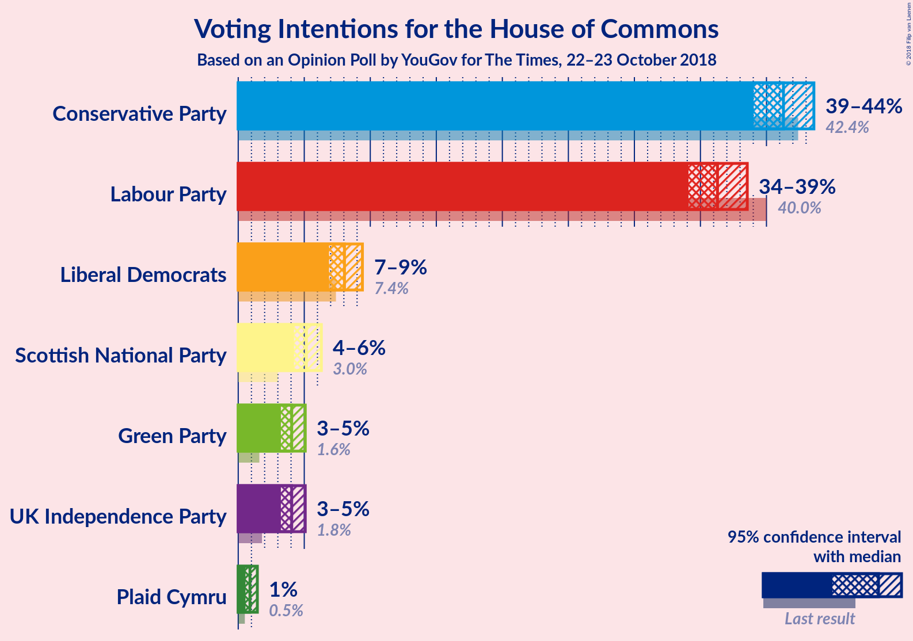
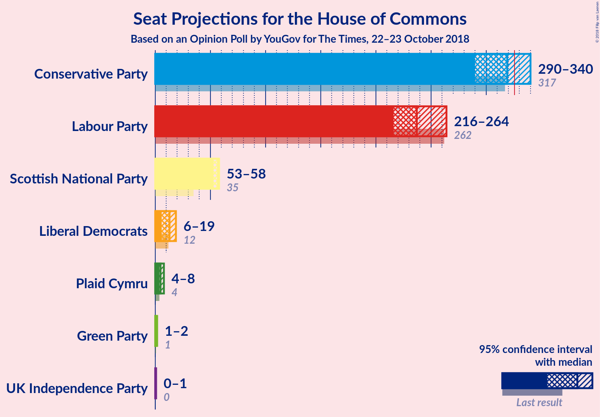
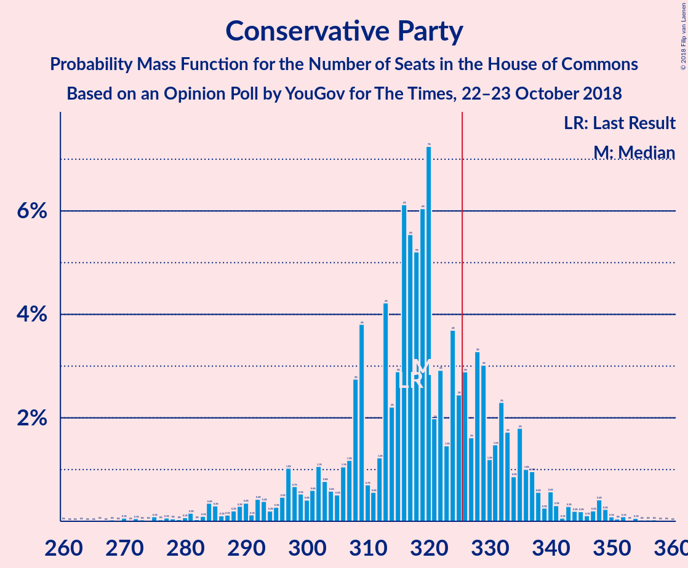
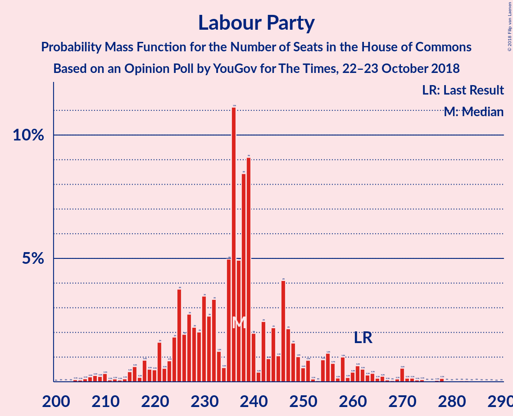
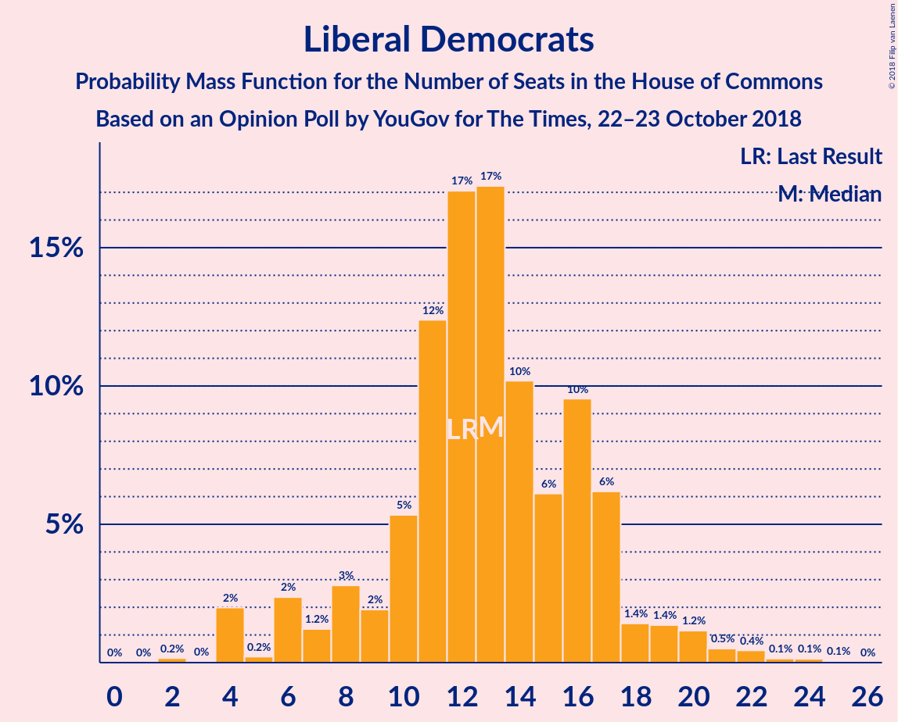
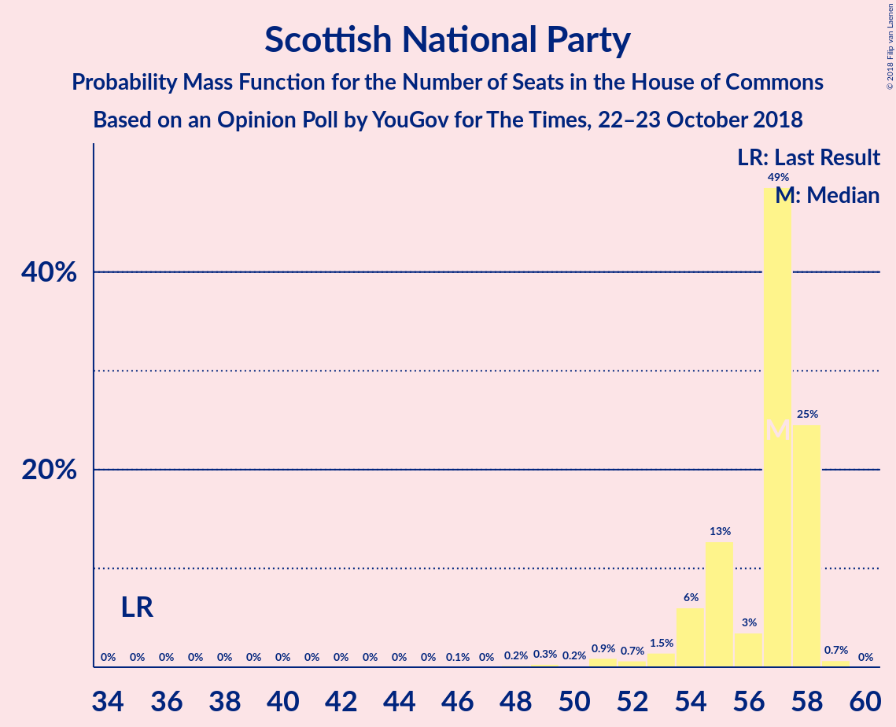
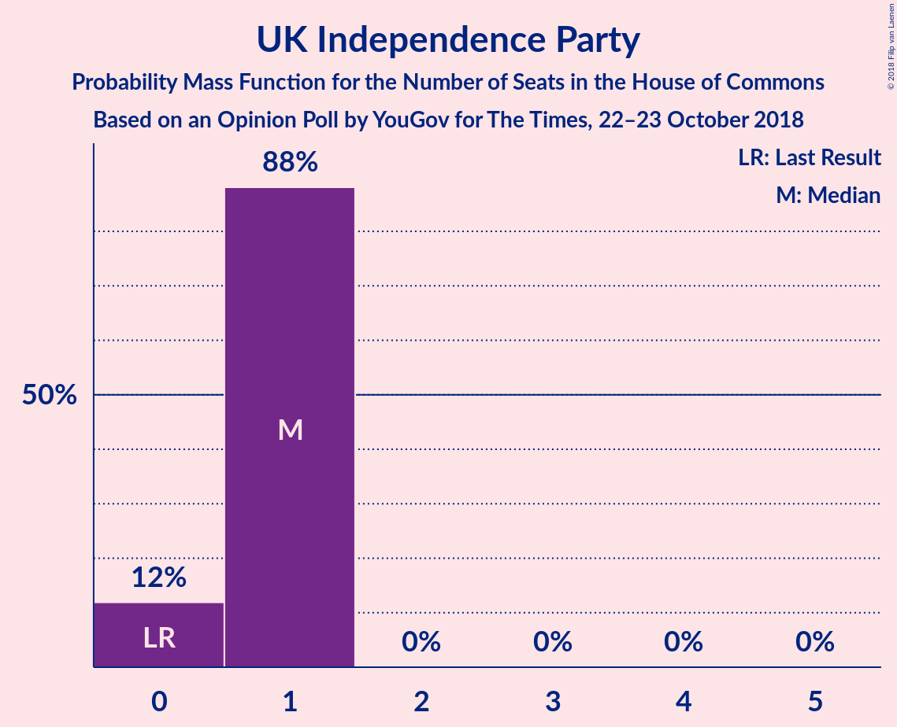
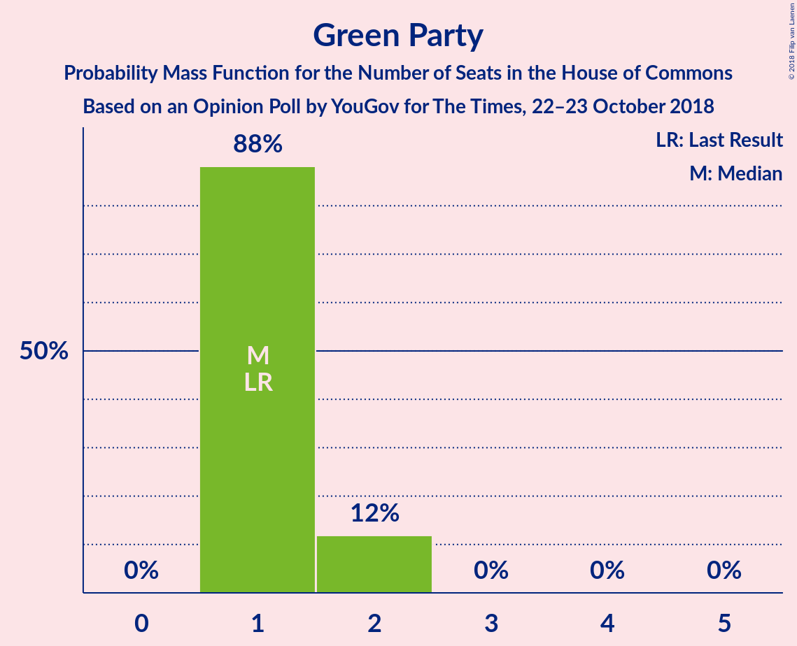
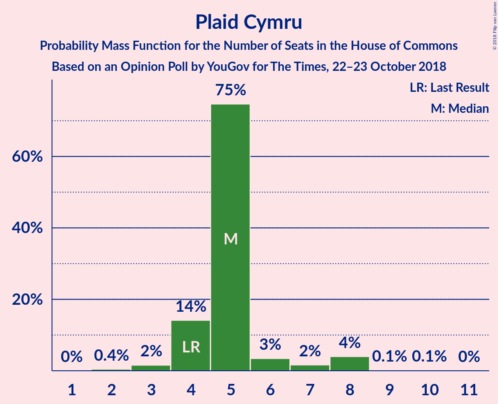

# Opinion Poll by YouGov for The Times, 22–23 October 2018

<a href="#voting-intentions">Voting Intentions</a> | <a href="#seats">Seats</a> | <a href="#coalitions">Coalitions</a> | <a href="#technical-information">Technical Information</a>

## Voting Intentions

### Confidence Intervals

| Party | Last Result | Poll Result | 80% Confidence Interval | 90% Confidence Interval | 95% Confidence Interval | 99% Confidence Interval |
|:-----:|:-----------:|:-----------:|:-----------------------:|:-----------------------:|:-----------------------:|:-----------------------:|
| Conservative Party | 42.4% | 41.3% | 39.8–42.8% |39.4–43.2% |39.0–43.6% |38.3–44.3% |
| Labour Party | 40.0% | 36.3% | 34.9–37.8% |34.4–38.2% |34.1–38.5% |33.4–39.3% |
| Liberal Democrats | 7.4% | 8.0% | 7.3–8.9% |7.1–9.2% |6.9–9.4% |6.5–9.8% |
| Scottish National Party | 3.0% | 5.2% | 4.5–5.9% |4.4–6.1% |4.2–6.3% |3.9–6.7% |
| UK Independence Party | 1.8% | 4.1% | 3.5–4.7% |3.4–4.9% |3.2–5.1% |3.0–5.4% |
| Green Party | 1.6% | 4.1% | 3.5–4.7% |3.4–4.9% |3.2–5.1% |3.0–5.4% |
| Plaid Cymru | 0.5% | 0.9% | 0.7–1.2% |0.6–1.4% |0.5–1.4% |0.5–1.6% |

*Note:* The poll result column reflects the actual value used in the calculations. Published results may vary slightly, and in addition be rounded to fewer digits.

## Seats

### Confidence Intervals

| Party | Last Result | Median | 80% Confidence Interval | 90% Confidence Interval | 95% Confidence Interval | 99% Confidence Interval |
|:-----:|:-----------:|:------:|:-----------------------:|:-----------------------:|:-----------------------:|:-----------------------:|
| <a href="#conservative-party">Conservative Party</a> | 317 | 319 | 304–333 |297–336 |290–340 |278–349 |
| <a href="#labour-party">Labour Party</a> | 262 | 237 | 225–250 |221–258 |216–264 |207–277 |
| <a href="#liberal-democrats">Liberal Democrats</a> | 12 | 13 | 9–17 |7–18 |6–19 |4–22 |
| <a href="#scottish-national-party">Scottish National Party</a> | 35 | 57 | 55–58 |54–58 |53–58 |49–59 |
| <a href="#uk-independence-party">UK Independence Party</a> | 0 | 1 | 0–1 |0–1 |0–1 |0–1 |
| <a href="#green-party">Green Party</a> | 1 | 1 | 1–2 |1–2 |1–2 |1–2 |
| <a href="#plaid-cymru">Plaid Cymru</a> | 4 | 5 | 4–5 |4–7 |4–8 |3–8 |

### Conservative Party

*For a full overview of the results for this party, see the [Conservative Party](party-conservativeparty.html) page.*

| Number of Seats | Probability | Accumulated | Special Marks |
|:---------------:|:-----------:|:-----------:|:-------------:|
| 264 | 0% | 100% |  |
| 265 | 0% | 99.9% |  |
| 266 | 0% | 99.9% |  |
| 267 | 0% | 99.9% |  |
| 268 | 0% | 99.9% |  |
| 269 | 0% | 99.9% |  |
| 270 | 0.1% | 99.9% |  |
| 271 | 0% | 99.8% |  |
| 272 | 0.1% | 99.8% |  |
| 273 | 0% | 99.7% |  |
| 274 | 0% | 99.7% |  |
| 275 | 0.1% | 99.7% |  |
| 276 | 0% | 99.6% |  |
| 277 | 0.1% | 99.6% |  |
| 278 | 0% | 99.5% |  |
| 279 | 0% | 99.5% |  |
| 280 | 0.1% | 99.4% |  |
| 281 | 0.2% | 99.4% |  |
| 282 | 0% | 99.2% |  |
| 283 | 0.1% | 99.2% |  |
| 284 | 0.4% | 99.1% |  |
| 285 | 0.3% | 98.7% |  |
| 286 | 0.1% | 98% |  |
| 287 | 0.1% | 98% |  |
| 288 | 0.2% | 98% |  |
| 289 | 0.3% | 98% |  |
| 290 | 0.4% | 98% |  |
| 291 | 0.1% | 97% |  |
| 292 | 0.4% | 97% |  |
| 293 | 0.4% | 97% |  |
| 294 | 0.2% | 96% |  |
| 295 | 0.3% | 96% |  |
| 296 | 0.5% | 96% |  |
| 297 | 1.0% | 95% |  |
| 298 | 0.7% | 94% |  |
| 299 | 0.5% | 94% |  |
| 300 | 0.4% | 93% |  |
| 301 | 0.6% | 93% |  |
| 302 | 1.1% | 92% |  |
| 303 | 0.8% | 91% |  |
| 304 | 0.6% | 90% |  |
| 305 | 0.5% | 90% |  |
| 306 | 1.1% | 89% |  |
| 307 | 1.2% | 88% |  |
| 308 | 3% | 87% |  |
| 309 | 4% | 84% |  |
| 310 | 0.7% | 80% |  |
| 311 | 0.6% | 80% |  |
| 312 | 1.2% | 79% |  |
| 313 | 4% | 78% |  |
| 314 | 2% | 74% |  |
| 315 | 3% | 72% |  |
| 316 | 6% | 69% |  |
| 317 | 6% | 63% | Last Result |
| 318 | 5% | 57% |  |
| 319 | 6% | 52% | Median |
| 320 | 7% | 46% |  |
| 321 | 2% | 38% |  |
| 322 | 3% | 37% |  |
| 323 | 1.5% | 34% |  |
| 324 | 4% | 32% |  |
| 325 | 2% | 28% |  |
| 326 | 3% | 26% | Majority |
| 327 | 2% | 23% |  |
| 328 | 3% | 21% |  |
| 329 | 3% | 18% |  |
| 330 | 1.2% | 15% |  |
| 331 | 1.5% | 14% |  |
| 332 | 2% | 12% |  |
| 333 | 2% | 10% |  |
| 334 | 0.9% | 8% |  |
| 335 | 2% | 8% |  |
| 336 | 1.0% | 6% |  |
| 337 | 1.0% | 5% |  |
| 338 | 0.6% | 4% |  |
| 339 | 0.3% | 3% |  |
| 340 | 0.6% | 3% |  |
| 341 | 0.3% | 2% |  |
| 342 | 0.1% | 2% |  |
| 343 | 0.3% | 2% |  |
| 344 | 0.2% | 2% |  |
| 345 | 0.2% | 2% |  |
| 346 | 0.1% | 1.4% |  |
| 347 | 0.2% | 1.3% |  |
| 348 | 0.4% | 1.1% |  |
| 349 | 0.2% | 0.7% |  |
| 350 | 0.1% | 0.4% |  |
| 351 | 0% | 0.4% |  |
| 352 | 0.1% | 0.3% |  |
| 353 | 0% | 0.2% |  |
| 354 | 0.1% | 0.2% |  |
| 355 | 0% | 0.1% |  |
| 356 | 0% | 0.1% |  |
| 357 | 0% | 0.1% |  |
| 358 | 0% | 0.1% |  |
| 359 | 0% | 0% |  |

### Labour Party

*For a full overview of the results for this party, see the [Labour Party](party-labourparty.html) page.*

| Number of Seats | Probability | Accumulated | Special Marks |
|:---------------:|:-----------:|:-----------:|:-------------:|
| 200 | 0% | 100% |  |
| 201 | 0% | 99.9% |  |
| 202 | 0% | 99.9% |  |
| 203 | 0% | 99.9% |  |
| 204 | 0.1% | 99.9% |  |
| 205 | 0.1% | 99.8% |  |
| 206 | 0.1% | 99.7% |  |
| 207 | 0.2% | 99.6% |  |
| 208 | 0.3% | 99.4% |  |
| 209 | 0.2% | 99.2% |  |
| 210 | 0.3% | 99.0% |  |
| 211 | 0.1% | 98.6% |  |
| 212 | 0.1% | 98.5% |  |
| 213 | 0.1% | 98% |  |
| 214 | 0.1% | 98% |  |
| 215 | 0.4% | 98% |  |
| 216 | 0.6% | 98% |  |
| 217 | 0.2% | 97% |  |
| 218 | 0.9% | 97% |  |
| 219 | 0.5% | 96% |  |
| 220 | 0.5% | 96% |  |
| 221 | 2% | 95% |  |
| 222 | 0.5% | 94% |  |
| 223 | 0.9% | 93% |  |
| 224 | 2% | 92% |  |
| 225 | 4% | 90% |  |
| 226 | 2% | 87% |  |
| 227 | 3% | 85% |  |
| 228 | 2% | 82% |  |
| 229 | 2% | 80% |  |
| 230 | 3% | 78% |  |
| 231 | 3% | 74% |  |
| 232 | 3% | 72% |  |
| 233 | 1.2% | 68% |  |
| 234 | 0.6% | 67% |  |
| 235 | 5% | 66% |  |
| 236 | 11% | 61% |  |
| 237 | 5% | 50% | Median |
| 238 | 8% | 45% |  |
| 239 | 9% | 37% |  |
| 240 | 2% | 28% |  |
| 241 | 0.4% | 26% |  |
| 242 | 2% | 26% |  |
| 243 | 0.9% | 23% |  |
| 244 | 2% | 22% |  |
| 245 | 1.1% | 20% |  |
| 246 | 4% | 19% |  |
| 247 | 2% | 15% |  |
| 248 | 2% | 13% |  |
| 249 | 1.0% | 11% |  |
| 250 | 0.6% | 10% |  |
| 251 | 0.9% | 9% |  |
| 252 | 0.1% | 9% |  |
| 253 | 0% | 9% |  |
| 254 | 0.9% | 8% |  |
| 255 | 1.2% | 8% |  |
| 256 | 0.7% | 6% |  |
| 257 | 0.2% | 6% |  |
| 258 | 1.0% | 6% |  |
| 259 | 0.2% | 5% |  |
| 260 | 0.4% | 4% |  |
| 261 | 0.6% | 4% |  |
| 262 | 0.5% | 3% | Last Result |
| 263 | 0.3% | 3% |  |
| 264 | 0.3% | 3% |  |
| 265 | 0.1% | 2% |  |
| 266 | 0.2% | 2% |  |
| 267 | 0.1% | 2% |  |
| 268 | 0% | 2% |  |
| 269 | 0.1% | 2% |  |
| 270 | 0.6% | 2% |  |
| 271 | 0.1% | 1.0% |  |
| 272 | 0.1% | 0.9% |  |
| 273 | 0.1% | 0.7% |  |
| 274 | 0.1% | 0.7% |  |
| 275 | 0% | 0.6% |  |
| 276 | 0% | 0.5% |  |
| 277 | 0.1% | 0.5% |  |
| 278 | 0.1% | 0.5% |  |
| 279 | 0% | 0.3% |  |
| 280 | 0% | 0.3% |  |
| 281 | 0% | 0.3% |  |
| 282 | 0% | 0.2% |  |
| 283 | 0% | 0.2% |  |
| 284 | 0% | 0.1% |  |
| 285 | 0% | 0.1% |  |
| 286 | 0% | 0.1% |  |
| 287 | 0% | 0.1% |  |
| 288 | 0% | 0.1% |  |
| 289 | 0% | 0.1% |  |
| 290 | 0% | 0% |  |

### Liberal Democrats

*For a full overview of the results for this party, see the [Liberal Democrats](party-liberaldemocrats.html) page.*

| Number of Seats | Probability | Accumulated | Special Marks |
|:---------------:|:-----------:|:-----------:|:-------------:|
| 2 | 0.2% | 100% |  |
| 3 | 0% | 99.8% |  |
| 4 | 2% | 99.8% |  |
| 5 | 0.2% | 98% |  |
| 6 | 2% | 98% |  |
| 7 | 1.2% | 95% |  |
| 8 | 3% | 94% |  |
| 9 | 2% | 91% |  |
| 10 | 5% | 89% |  |
| 11 | 12% | 84% |  |
| 12 | 17% | 72% | Last Result |
| 13 | 17% | 55% | Median |
| 14 | 10% | 37% |  |
| 15 | 6% | 27% |  |
| 16 | 10% | 21% |  |
| 17 | 6% | 11% |  |
| 18 | 1.4% | 5% |  |
| 19 | 1.4% | 4% |  |
| 20 | 1.2% | 2% |  |
| 21 | 0.5% | 1.3% |  |
| 22 | 0.4% | 0.8% |  |
| 23 | 0.1% | 0.4% |  |
| 24 | 0.1% | 0.2% |  |
| 25 | 0.1% | 0.1% |  |
| 26 | 0% | 0% |  |

### Scottish National Party

*For a full overview of the results for this party, see the [Scottish National Party](party-scottishnationalparty.html) page.*

| Number of Seats | Probability | Accumulated | Special Marks |
|:---------------:|:-----------:|:-----------:|:-------------:|
| 35 | 0% | 100% | Last Result |
| 36 | 0% | 100% |  |
| 37 | 0% | 100% |  |
| 38 | 0% | 100% |  |
| 39 | 0% | 100% |  |
| 40 | 0% | 100% |  |
| 41 | 0% | 100% |  |
| 42 | 0% | 100% |  |
| 43 | 0% | 100% |  |
| 44 | 0% | 100% |  |
| 45 | 0% | 100% |  |
| 46 | 0.1% | 100% |  |
| 47 | 0% | 99.9% |  |
| 48 | 0.2% | 99.9% |  |
| 49 | 0.3% | 99.7% |  |
| 50 | 0.2% | 99.4% |  |
| 51 | 0.9% | 99.2% |  |
| 52 | 0.7% | 98% |  |
| 53 | 1.5% | 98% |  |
| 54 | 6% | 96% |  |
| 55 | 13% | 90% |  |
| 56 | 3% | 77% |  |
| 57 | 49% | 74% | Median |
| 58 | 25% | 25% |  |
| 59 | 0.7% | 0.7% |  |
| 60 | 0% | 0% |  |

### UK Independence Party

*For a full overview of the results for this party, see the [UK Independence Party](party-ukindependenceparty.html) page.*

| Number of Seats | Probability | Accumulated | Special Marks |
|:---------------:|:-----------:|:-----------:|:-------------:|
| 0 | 12% | 100% | Last Result |
| 1 | 88% | 88% | Median |
| 2 | 0% | 0% |  |

### Green Party

*For a full overview of the results for this party, see the [Green Party](party-greenparty.html) page.*

| Number of Seats | Probability | Accumulated | Special Marks |
|:---------------:|:-----------:|:-----------:|:-------------:|
| 1 | 88% | 100% | Last Result, Median |
| 2 | 12% | 12% |  |
| 3 | 0% | 0% |  |

### Plaid Cymru

*For a full overview of the results for this party, see the [Plaid Cymru](party-plaidcymru.html) page.*

| Number of Seats | Probability | Accumulated | Special Marks |
|:---------------:|:-----------:|:-----------:|:-------------:|
| 2 | 0.4% | 100% |  |
| 3 | 2% | 99.5% |  |
| 4 | 14% | 98% | Last Result |
| 5 | 75% | 84% | Median |
| 6 | 3% | 9% |  |
| 7 | 2% | 6% |  |
| 8 | 4% | 4% |  |
| 9 | 0.1% | 0.2% |  |
| 10 | 0.1% | 0.1% |  |
| 11 | 0% | 0% |  |

## Coalitions

### Confidence Intervals

| Coalition | Last Result | Median | Majority? | 80% Confidence Interval | 90% Confidence Interval | 95% Confidence Interval | 99% Confidence Interval |
|:---------:|:-----------:|:------:|:---------:|:-----------------------:|:-----------------------:|:-----------------------:|:-----------------------:|
| Conservative Party – Scottish National Party – Plaid Cymru | 356 | 380 | 100% | 366–394 | 359–398 | 352–403 | 339–411 |
| Conservative Party – Scottish National Party | 352 | 375 | 99.9% | 361–389 | 354–393 | 347–397 | 334–405 |
| Conservative Party – Liberal Democrats | 329 | 332 | 77% | 319–345 | 310–349 | 305–352 | 291–362 |
| Conservative Party – Plaid Cymru | 321 | 324 | 38% | 309–338 | 302–342 | 295–345 | 282–355 |
| Conservative Party | 317 | 319 | 26% | 304–333 | 297–336 | 290–340 | 278–349 |
| Labour Party – Liberal Democrats – Scottish National Party – Plaid Cymru | 313 | 311 | 10% | 298–325 | 294–333 | 290–339 | 281–352 |
| Labour Party – Liberal Democrats – Scottish National Party | 309 | 306 | 6% | 292–320 | 288–328 | 285–335 | 275–348 |
| Labour Party – Scottish National Party – Plaid Cymru | 301 | 298 | 2% | 285–311 | 281–320 | 278–325 | 268–339 |
| Labour Party – Scottish National Party | 297 | 293 | 2% | 280–306 | 276–315 | 272–320 | 263–334 |
| Labour Party – Liberal Democrats – Plaid Cymru | 278 | 255 | 0% | 242–269 | 237–276 | 233–283 | 225–295 |
| Labour Party – Liberal Democrats | 274 | 250 | 0% | 236–264 | 232–271 | 228–278 | 219–291 |
| Labour Party – Plaid Cymru | 266 | 242 | 0% | 230–255 | 226–263 | 222–269 | 213–281 |
| Labour Party | 262 | 237 | 0% | 225–250 | 221–258 | 216–264 | 207–277 |

### Conservative Party – Scottish National Party – Plaid Cymru

| Number of Seats | Probability | Accumulated | Special Marks |
|:---------------:|:-----------:|:-----------:|:-------------:|
| 326 | 0% | 100% | Majority |
| 327 | 0% | 99.9% |  |
| 328 | 0% | 99.9% |  |
| 329 | 0% | 99.9% |  |
| 330 | 0% | 99.9% |  |
| 331 | 0% | 99.9% |  |
| 332 | 0.1% | 99.9% |  |
| 333 | 0% | 99.8% |  |
| 334 | 0% | 99.8% |  |
| 335 | 0% | 99.7% |  |
| 336 | 0% | 99.7% |  |
| 337 | 0.1% | 99.7% |  |
| 338 | 0% | 99.6% |  |
| 339 | 0.1% | 99.6% |  |
| 340 | 0% | 99.5% |  |
| 341 | 0.1% | 99.4% |  |
| 342 | 0% | 99.4% |  |
| 343 | 0.2% | 99.3% |  |
| 344 | 0.1% | 99.1% |  |
| 345 | 0.1% | 99.1% |  |
| 346 | 0.4% | 99.0% |  |
| 347 | 0.2% | 98.6% |  |
| 348 | 0.1% | 98% |  |
| 349 | 0.2% | 98% |  |
| 350 | 0.2% | 98% |  |
| 351 | 0.3% | 98% |  |
| 352 | 0.3% | 98% |  |
| 353 | 0.5% | 97% |  |
| 354 | 0.2% | 97% |  |
| 355 | 0.5% | 97% |  |
| 356 | 0.3% | 96% | Last Result |
| 357 | 0.5% | 96% |  |
| 358 | 0.4% | 95% |  |
| 359 | 0.7% | 95% |  |
| 360 | 0.8% | 94% |  |
| 361 | 0.5% | 94% |  |
| 362 | 1.0% | 93% |  |
| 363 | 1.0% | 92% |  |
| 364 | 0.6% | 91% |  |
| 365 | 0.2% | 90% |  |
| 366 | 0.8% | 90% |  |
| 367 | 0.4% | 89% |  |
| 368 | 1.1% | 89% |  |
| 369 | 1.4% | 88% |  |
| 370 | 3% | 87% |  |
| 371 | 3% | 83% |  |
| 372 | 0.9% | 80% |  |
| 373 | 2% | 79% |  |
| 374 | 0.8% | 78% |  |
| 375 | 3% | 77% |  |
| 376 | 4% | 74% |  |
| 377 | 3% | 70% |  |
| 378 | 6% | 67% |  |
| 379 | 5% | 61% |  |
| 380 | 8% | 56% |  |
| 381 | 5% | 48% | Median |
| 382 | 5% | 43% |  |
| 383 | 3% | 38% |  |
| 384 | 3% | 35% |  |
| 385 | 2% | 33% |  |
| 386 | 3% | 31% |  |
| 387 | 3% | 28% |  |
| 388 | 3% | 25% |  |
| 389 | 1.3% | 21% |  |
| 390 | 2% | 20% |  |
| 391 | 4% | 18% |  |
| 392 | 1.2% | 14% |  |
| 393 | 2% | 13% |  |
| 394 | 2% | 11% |  |
| 395 | 1.3% | 9% |  |
| 396 | 0.8% | 8% |  |
| 397 | 2% | 7% |  |
| 398 | 0.5% | 5% |  |
| 399 | 1.0% | 5% |  |
| 400 | 0.6% | 4% |  |
| 401 | 0.4% | 3% |  |
| 402 | 0.2% | 3% |  |
| 403 | 0.6% | 3% |  |
| 404 | 0.1% | 2% |  |
| 405 | 0.1% | 2% |  |
| 406 | 0.2% | 2% |  |
| 407 | 0.2% | 2% |  |
| 408 | 0.4% | 1.3% |  |
| 409 | 0.3% | 1.0% |  |
| 410 | 0.2% | 0.7% |  |
| 411 | 0.2% | 0.6% |  |
| 412 | 0.1% | 0.4% |  |
| 413 | 0% | 0.3% |  |
| 414 | 0% | 0.3% |  |
| 415 | 0.1% | 0.2% |  |
| 416 | 0% | 0.2% |  |
| 417 | 0% | 0.1% |  |
| 418 | 0% | 0.1% |  |
| 419 | 0% | 0.1% |  |
| 420 | 0% | 0% |  |

### Conservative Party – Scottish National Party

| Number of Seats | Probability | Accumulated | Special Marks |
|:---------------:|:-----------:|:-----------:|:-------------:|
| 321 | 0% | 100% |  |
| 322 | 0% | 99.9% |  |
| 323 | 0% | 99.9% |  |
| 324 | 0% | 99.9% |  |
| 325 | 0% | 99.9% |  |
| 326 | 0% | 99.9% | Majority |
| 327 | 0.1% | 99.9% |  |
| 328 | 0% | 99.8% |  |
| 329 | 0.1% | 99.8% |  |
| 330 | 0% | 99.7% |  |
| 331 | 0% | 99.7% |  |
| 332 | 0.1% | 99.7% |  |
| 333 | 0% | 99.6% |  |
| 334 | 0.1% | 99.6% |  |
| 335 | 0.1% | 99.5% |  |
| 336 | 0.1% | 99.4% |  |
| 337 | 0.1% | 99.4% |  |
| 338 | 0.2% | 99.3% |  |
| 339 | 0.1% | 99.2% |  |
| 340 | 0.1% | 99.1% |  |
| 341 | 0.3% | 99.0% |  |
| 342 | 0.3% | 98.7% |  |
| 343 | 0.1% | 98% |  |
| 344 | 0.2% | 98% |  |
| 345 | 0.2% | 98% |  |
| 346 | 0.3% | 98% |  |
| 347 | 0.3% | 98% |  |
| 348 | 0.3% | 97% |  |
| 349 | 0.4% | 97% |  |
| 350 | 0.4% | 97% |  |
| 351 | 0.3% | 96% |  |
| 352 | 0.2% | 96% | Last Result |
| 353 | 0.4% | 96% |  |
| 354 | 0.9% | 95% |  |
| 355 | 1.0% | 94% |  |
| 356 | 0.3% | 93% |  |
| 357 | 1.2% | 93% |  |
| 358 | 1.1% | 92% |  |
| 359 | 0.5% | 91% |  |
| 360 | 0.2% | 90% |  |
| 361 | 0.7% | 90% |  |
| 362 | 0.3% | 89% |  |
| 363 | 1.1% | 89% |  |
| 364 | 1.5% | 88% |  |
| 365 | 3% | 87% |  |
| 366 | 3% | 84% |  |
| 367 | 1.1% | 80% |  |
| 368 | 1.4% | 79% |  |
| 369 | 0.5% | 78% |  |
| 370 | 2% | 77% |  |
| 371 | 5% | 75% |  |
| 372 | 3% | 70% |  |
| 373 | 5% | 67% |  |
| 374 | 6% | 62% |  |
| 375 | 8% | 56% |  |
| 376 | 6% | 49% | Median |
| 377 | 5% | 43% |  |
| 378 | 1.4% | 37% |  |
| 379 | 3% | 36% |  |
| 380 | 3% | 33% |  |
| 381 | 3% | 30% |  |
| 382 | 3% | 28% |  |
| 383 | 4% | 24% |  |
| 384 | 1.1% | 21% |  |
| 385 | 2% | 20% |  |
| 386 | 4% | 18% |  |
| 387 | 2% | 14% |  |
| 388 | 2% | 12% |  |
| 389 | 1.1% | 10% |  |
| 390 | 1.5% | 9% |  |
| 391 | 0.6% | 8% |  |
| 392 | 2% | 7% |  |
| 393 | 0.9% | 5% |  |
| 394 | 1.0% | 4% |  |
| 395 | 0.4% | 3% |  |
| 396 | 0.2% | 3% |  |
| 397 | 0.3% | 3% |  |
| 398 | 0.7% | 2% |  |
| 399 | 0.1% | 2% |  |
| 400 | 0.1% | 2% |  |
| 401 | 0.1% | 2% |  |
| 402 | 0.2% | 2% |  |
| 403 | 0.4% | 1.3% |  |
| 404 | 0.3% | 0.9% |  |
| 405 | 0.1% | 0.6% |  |
| 406 | 0.1% | 0.5% |  |
| 407 | 0.1% | 0.4% |  |
| 408 | 0% | 0.3% |  |
| 409 | 0% | 0.2% |  |
| 410 | 0.1% | 0.2% |  |
| 411 | 0% | 0.1% |  |
| 412 | 0% | 0.1% |  |
| 413 | 0% | 0.1% |  |
| 414 | 0% | 0.1% |  |
| 415 | 0% | 0% |  |

### Conservative Party – Liberal Democrats

| Number of Seats | Probability | Accumulated | Special Marks |
|:---------------:|:-----------:|:-----------:|:-------------:|
| 279 | 0% | 100% |  |
| 280 | 0% | 99.9% |  |
| 281 | 0% | 99.9% |  |
| 282 | 0% | 99.9% |  |
| 283 | 0% | 99.9% |  |
| 284 | 0% | 99.9% |  |
| 285 | 0.1% | 99.9% |  |
| 286 | 0% | 99.8% |  |
| 287 | 0% | 99.8% |  |
| 288 | 0.1% | 99.8% |  |
| 289 | 0.1% | 99.7% |  |
| 290 | 0.1% | 99.6% |  |
| 291 | 0.1% | 99.5% |  |
| 292 | 0% | 99.5% |  |
| 293 | 0% | 99.5% |  |
| 294 | 0.1% | 99.4% |  |
| 295 | 0.1% | 99.3% |  |
| 296 | 0.1% | 99.3% |  |
| 297 | 0.1% | 99.1% |  |
| 298 | 0.5% | 99.0% |  |
| 299 | 0.1% | 98.5% |  |
| 300 | 0.1% | 98% |  |
| 301 | 0% | 98% |  |
| 302 | 0.3% | 98% |  |
| 303 | 0.1% | 98% |  |
| 304 | 0.3% | 98% |  |
| 305 | 0.2% | 98% |  |
| 306 | 0.2% | 97% |  |
| 307 | 0.9% | 97% |  |
| 308 | 0.5% | 96% |  |
| 309 | 0.3% | 96% |  |
| 310 | 0.5% | 95% |  |
| 311 | 0.9% | 95% |  |
| 312 | 0.5% | 94% |  |
| 313 | 0.7% | 94% |  |
| 314 | 0.3% | 93% |  |
| 315 | 0.6% | 93% |  |
| 316 | 0.4% | 92% |  |
| 317 | 0.6% | 92% |  |
| 318 | 0.7% | 91% |  |
| 319 | 1.5% | 90% |  |
| 320 | 1.0% | 89% |  |
| 321 | 3% | 88% |  |
| 322 | 4% | 85% |  |
| 323 | 2% | 81% |  |
| 324 | 2% | 80% |  |
| 325 | 2% | 78% |  |
| 326 | 2% | 77% | Majority |
| 327 | 2% | 75% |  |
| 328 | 2% | 73% |  |
| 329 | 5% | 71% | Last Result |
| 330 | 8% | 66% |  |
| 331 | 8% | 59% |  |
| 332 | 9% | 50% | Median |
| 333 | 6% | 41% |  |
| 334 | 1.5% | 36% |  |
| 335 | 3% | 34% |  |
| 336 | 2% | 32% |  |
| 337 | 3% | 30% |  |
| 338 | 2% | 27% |  |
| 339 | 2% | 25% |  |
| 340 | 3% | 23% |  |
| 341 | 3% | 19% |  |
| 342 | 2% | 16% |  |
| 343 | 3% | 14% |  |
| 344 | 1.1% | 11% |  |
| 345 | 2% | 10% |  |
| 346 | 0.5% | 8% |  |
| 347 | 2% | 8% |  |
| 348 | 0.6% | 6% |  |
| 349 | 0.4% | 5% |  |
| 350 | 1.5% | 5% |  |
| 351 | 0.6% | 3% |  |
| 352 | 0.3% | 3% |  |
| 353 | 0.3% | 2% |  |
| 354 | 0.2% | 2% |  |
| 355 | 0.3% | 2% |  |
| 356 | 0.1% | 2% |  |
| 357 | 0.1% | 2% |  |
| 358 | 0.1% | 1.4% |  |
| 359 | 0.2% | 1.4% |  |
| 360 | 0.4% | 1.2% |  |
| 361 | 0.3% | 0.8% |  |
| 362 | 0.2% | 0.6% |  |
| 363 | 0.1% | 0.3% |  |
| 364 | 0.1% | 0.3% |  |
| 365 | 0% | 0.2% |  |
| 366 | 0% | 0.1% |  |
| 367 | 0% | 0.1% |  |
| 368 | 0% | 0.1% |  |
| 369 | 0% | 0.1% |  |
| 370 | 0% | 0% |  |

### Conservative Party – Plaid Cymru

| Number of Seats | Probability | Accumulated | Special Marks |
|:---------------:|:-----------:|:-----------:|:-------------:|
| 269 | 0% | 100% |  |
| 270 | 0% | 99.9% |  |
| 271 | 0% | 99.9% |  |
| 272 | 0% | 99.9% |  |
| 273 | 0% | 99.9% |  |
| 274 | 0% | 99.9% |  |
| 275 | 0.1% | 99.9% |  |
| 276 | 0% | 99.8% |  |
| 277 | 0% | 99.8% |  |
| 278 | 0% | 99.7% |  |
| 279 | 0% | 99.7% |  |
| 280 | 0.1% | 99.7% |  |
| 281 | 0% | 99.6% |  |
| 282 | 0.1% | 99.6% |  |
| 283 | 0% | 99.5% |  |
| 284 | 0.1% | 99.4% |  |
| 285 | 0.1% | 99.4% |  |
| 286 | 0.1% | 99.3% |  |
| 287 | 0% | 99.2% |  |
| 288 | 0.1% | 99.2% |  |
| 289 | 0.5% | 99.1% |  |
| 290 | 0.2% | 98.6% |  |
| 291 | 0.1% | 98% |  |
| 292 | 0.1% | 98% |  |
| 293 | 0.3% | 98% |  |
| 294 | 0.3% | 98% |  |
| 295 | 0.4% | 98% |  |
| 296 | 0.4% | 97% |  |
| 297 | 0.2% | 97% |  |
| 298 | 0.4% | 97% |  |
| 299 | 0.2% | 96% |  |
| 300 | 0.6% | 96% |  |
| 301 | 0.4% | 96% |  |
| 302 | 0.7% | 95% |  |
| 303 | 0.5% | 94% |  |
| 304 | 0.7% | 94% |  |
| 305 | 0.5% | 93% |  |
| 306 | 0.5% | 93% |  |
| 307 | 1.0% | 92% |  |
| 308 | 0.8% | 91% |  |
| 309 | 0.8% | 90% |  |
| 310 | 0.4% | 90% |  |
| 311 | 1.2% | 89% |  |
| 312 | 1.0% | 88% |  |
| 313 | 3% | 87% |  |
| 314 | 3% | 84% |  |
| 315 | 0.9% | 81% |  |
| 316 | 0.5% | 80% |  |
| 317 | 1.4% | 79% |  |
| 318 | 6% | 78% |  |
| 319 | 2% | 72% |  |
| 320 | 1.3% | 71% |  |
| 321 | 8% | 69% | Last Result |
| 322 | 5% | 62% |  |
| 323 | 5% | 57% |  |
| 324 | 6% | 52% | Median |
| 325 | 8% | 46% |  |
| 326 | 3% | 38% | Majority |
| 327 | 2% | 36% |  |
| 328 | 1.1% | 34% |  |
| 329 | 4% | 33% |  |
| 330 | 3% | 29% |  |
| 331 | 3% | 26% |  |
| 332 | 2% | 23% |  |
| 333 | 4% | 22% |  |
| 334 | 3% | 18% |  |
| 335 | 1.1% | 15% |  |
| 336 | 2% | 14% |  |
| 337 | 1.3% | 12% |  |
| 338 | 2% | 11% |  |
| 339 | 1.0% | 9% |  |
| 340 | 2% | 8% |  |
| 341 | 1.1% | 6% |  |
| 342 | 1.0% | 5% |  |
| 343 | 0.9% | 4% |  |
| 344 | 0.4% | 3% |  |
| 345 | 0.5% | 3% |  |
| 346 | 0.3% | 2% |  |
| 347 | 0.1% | 2% |  |
| 348 | 0.3% | 2% |  |
| 349 | 0.2% | 2% |  |
| 350 | 0.2% | 2% |  |
| 351 | 0.1% | 2% |  |
| 352 | 0.1% | 1.4% |  |
| 353 | 0.4% | 1.2% |  |
| 354 | 0.2% | 0.8% |  |
| 355 | 0.2% | 0.6% |  |
| 356 | 0% | 0.4% |  |
| 357 | 0.1% | 0.3% |  |
| 358 | 0% | 0.2% |  |
| 359 | 0.1% | 0.2% |  |
| 360 | 0% | 0.2% |  |
| 361 | 0% | 0.1% |  |
| 362 | 0% | 0.1% |  |
| 363 | 0% | 0.1% |  |
| 364 | 0% | 0% |  |

### Conservative Party

| Number of Seats | Probability | Accumulated | Special Marks |
|:---------------:|:-----------:|:-----------:|:-------------:|
| 264 | 0% | 100% |  |
| 265 | 0% | 99.9% |  |
| 266 | 0% | 99.9% |  |
| 267 | 0% | 99.9% |  |
| 268 | 0% | 99.9% |  |
| 269 | 0% | 99.9% |  |
| 270 | 0.1% | 99.9% |  |
| 271 | 0% | 99.8% |  |
| 272 | 0.1% | 99.8% |  |
| 273 | 0% | 99.7% |  |
| 274 | 0% | 99.7% |  |
| 275 | 0.1% | 99.7% |  |
| 276 | 0% | 99.6% |  |
| 277 | 0.1% | 99.6% |  |
| 278 | 0% | 99.5% |  |
| 279 | 0% | 99.5% |  |
| 280 | 0.1% | 99.4% |  |
| 281 | 0.2% | 99.4% |  |
| 282 | 0% | 99.2% |  |
| 283 | 0.1% | 99.2% |  |
| 284 | 0.4% | 99.1% |  |
| 285 | 0.3% | 98.7% |  |
| 286 | 0.1% | 98% |  |
| 287 | 0.1% | 98% |  |
| 288 | 0.2% | 98% |  |
| 289 | 0.3% | 98% |  |
| 290 | 0.4% | 98% |  |
| 291 | 0.1% | 97% |  |
| 292 | 0.4% | 97% |  |
| 293 | 0.4% | 97% |  |
| 294 | 0.2% | 96% |  |
| 295 | 0.3% | 96% |  |
| 296 | 0.5% | 96% |  |
| 297 | 1.0% | 95% |  |
| 298 | 0.7% | 94% |  |
| 299 | 0.5% | 94% |  |
| 300 | 0.4% | 93% |  |
| 301 | 0.6% | 93% |  |
| 302 | 1.1% | 92% |  |
| 303 | 0.8% | 91% |  |
| 304 | 0.6% | 90% |  |
| 305 | 0.5% | 90% |  |
| 306 | 1.1% | 89% |  |
| 307 | 1.2% | 88% |  |
| 308 | 3% | 87% |  |
| 309 | 4% | 84% |  |
| 310 | 0.7% | 80% |  |
| 311 | 0.6% | 80% |  |
| 312 | 1.2% | 79% |  |
| 313 | 4% | 78% |  |
| 314 | 2% | 74% |  |
| 315 | 3% | 72% |  |
| 316 | 6% | 69% |  |
| 317 | 6% | 63% | Last Result |
| 318 | 5% | 57% |  |
| 319 | 6% | 52% | Median |
| 320 | 7% | 46% |  |
| 321 | 2% | 38% |  |
| 322 | 3% | 37% |  |
| 323 | 1.5% | 34% |  |
| 324 | 4% | 32% |  |
| 325 | 2% | 28% |  |
| 326 | 3% | 26% | Majority |
| 327 | 2% | 23% |  |
| 328 | 3% | 21% |  |
| 329 | 3% | 18% |  |
| 330 | 1.2% | 15% |  |
| 331 | 1.5% | 14% |  |
| 332 | 2% | 12% |  |
| 333 | 2% | 10% |  |
| 334 | 0.9% | 8% |  |
| 335 | 2% | 8% |  |
| 336 | 1.0% | 6% |  |
| 337 | 1.0% | 5% |  |
| 338 | 0.6% | 4% |  |
| 339 | 0.3% | 3% |  |
| 340 | 0.6% | 3% |  |
| 341 | 0.3% | 2% |  |
| 342 | 0.1% | 2% |  |
| 343 | 0.3% | 2% |  |
| 344 | 0.2% | 2% |  |
| 345 | 0.2% | 2% |  |
| 346 | 0.1% | 1.4% |  |
| 347 | 0.2% | 1.3% |  |
| 348 | 0.4% | 1.1% |  |
| 349 | 0.2% | 0.7% |  |
| 350 | 0.1% | 0.4% |  |
| 351 | 0% | 0.4% |  |
| 352 | 0.1% | 0.3% |  |
| 353 | 0% | 0.2% |  |
| 354 | 0.1% | 0.2% |  |
| 355 | 0% | 0.1% |  |
| 356 | 0% | 0.1% |  |
| 357 | 0% | 0.1% |  |
| 358 | 0% | 0.1% |  |
| 359 | 0% | 0% |  |

### Labour Party – Liberal Democrats – Scottish National Party – Plaid Cymru

| Number of Seats | Probability | Accumulated | Special Marks |
|:---------------:|:-----------:|:-----------:|:-------------:|
| 272 | 0% | 100% |  |
| 273 | 0% | 99.9% |  |
| 274 | 0% | 99.9% |  |
| 275 | 0% | 99.9% |  |
| 276 | 0.1% | 99.9% |  |
| 277 | 0% | 99.8% |  |
| 278 | 0.1% | 99.8% |  |
| 279 | 0.1% | 99.7% |  |
| 280 | 0.1% | 99.7% |  |
| 281 | 0.2% | 99.6% |  |
| 282 | 0.5% | 99.4% |  |
| 283 | 0.2% | 98.9% |  |
| 284 | 0.1% | 98.8% |  |
| 285 | 0.2% | 98.6% |  |
| 286 | 0.2% | 98% |  |
| 287 | 0.3% | 98% |  |
| 288 | 0.1% | 98% |  |
| 289 | 0.1% | 98% |  |
| 290 | 0.6% | 98% |  |
| 291 | 0.4% | 97% |  |
| 292 | 0.3% | 97% |  |
| 293 | 1.1% | 96% |  |
| 294 | 0.7% | 95% |  |
| 295 | 2% | 95% |  |
| 296 | 0.8% | 93% |  |
| 297 | 2% | 92% |  |
| 298 | 2% | 90% |  |
| 299 | 2% | 88% |  |
| 300 | 2% | 87% |  |
| 301 | 3% | 85% |  |
| 302 | 3% | 82% |  |
| 303 | 1.0% | 79% |  |
| 304 | 4% | 78% |  |
| 305 | 2% | 74% |  |
| 306 | 4% | 72% |  |
| 307 | 1.1% | 68% |  |
| 308 | 3% | 67% |  |
| 309 | 2% | 64% |  |
| 310 | 8% | 61% |  |
| 311 | 6% | 54% |  |
| 312 | 4% | 48% | Median |
| 313 | 6% | 43% | Last Result |
| 314 | 6% | 37% |  |
| 315 | 3% | 31% |  |
| 316 | 3% | 28% |  |
| 317 | 4% | 25% |  |
| 318 | 1.0% | 22% |  |
| 319 | 0.6% | 21% |  |
| 320 | 0.6% | 20% |  |
| 321 | 4% | 20% |  |
| 322 | 2% | 15% |  |
| 323 | 1.2% | 13% |  |
| 324 | 1.0% | 12% |  |
| 325 | 0.9% | 11% |  |
| 326 | 0.1% | 10% | Majority |
| 327 | 0.7% | 10% |  |
| 328 | 1.1% | 9% |  |
| 329 | 0.6% | 8% |  |
| 330 | 0.8% | 7% |  |
| 331 | 0.2% | 6% |  |
| 332 | 0.4% | 6% |  |
| 333 | 1.3% | 6% |  |
| 334 | 0.4% | 4% |  |
| 335 | 0.3% | 4% |  |
| 336 | 0.2% | 4% |  |
| 337 | 0.4% | 4% |  |
| 338 | 0.4% | 3% |  |
| 339 | 0.3% | 3% |  |
| 340 | 0.1% | 2% |  |
| 341 | 0.4% | 2% |  |
| 342 | 0.2% | 2% |  |
| 343 | 0.1% | 2% |  |
| 344 | 0.1% | 2% |  |
| 345 | 0.3% | 2% |  |
| 346 | 0.3% | 1.3% |  |
| 347 | 0.1% | 0.9% |  |
| 348 | 0.1% | 0.8% |  |
| 349 | 0.1% | 0.8% |  |
| 350 | 0.1% | 0.7% |  |
| 351 | 0% | 0.6% |  |
| 352 | 0% | 0.5% |  |
| 353 | 0.1% | 0.5% |  |
| 354 | 0.1% | 0.4% |  |
| 355 | 0% | 0.3% |  |
| 356 | 0% | 0.3% |  |
| 357 | 0% | 0.3% |  |
| 358 | 0.1% | 0.3% |  |
| 359 | 0% | 0.2% |  |
| 360 | 0% | 0.2% |  |
| 361 | 0% | 0.1% |  |
| 362 | 0% | 0.1% |  |
| 363 | 0% | 0.1% |  |
| 364 | 0% | 0.1% |  |
| 365 | 0% | 0.1% |  |
| 366 | 0% | 0% |  |

### Labour Party – Liberal Democrats – Scottish National Party

| Number of Seats | Probability | Accumulated | Special Marks |
|:---------------:|:-----------:|:-----------:|:-------------:|
| 267 | 0% | 100% |  |
| 268 | 0% | 99.9% |  |
| 269 | 0% | 99.9% |  |
| 270 | 0% | 99.9% |  |
| 271 | 0% | 99.9% |  |
| 272 | 0% | 99.8% |  |
| 273 | 0.1% | 99.8% |  |
| 274 | 0.1% | 99.7% |  |
| 275 | 0.2% | 99.6% |  |
| 276 | 0.2% | 99.5% |  |
| 277 | 0.4% | 99.2% |  |
| 278 | 0.1% | 98.8% |  |
| 279 | 0.2% | 98.7% |  |
| 280 | 0.2% | 98.5% |  |
| 281 | 0.2% | 98% |  |
| 282 | 0.3% | 98% |  |
| 283 | 0.1% | 98% |  |
| 284 | 0.1% | 98% |  |
| 285 | 0.6% | 98% |  |
| 286 | 0.4% | 97% |  |
| 287 | 0.7% | 97% |  |
| 288 | 1.1% | 96% |  |
| 289 | 0.7% | 95% |  |
| 290 | 2% | 94% |  |
| 291 | 1.0% | 92% |  |
| 292 | 2% | 91% |  |
| 293 | 1.0% | 90% |  |
| 294 | 2% | 89% |  |
| 295 | 2% | 86% |  |
| 296 | 3% | 85% |  |
| 297 | 3% | 82% |  |
| 298 | 1.1% | 78% |  |
| 299 | 3% | 77% |  |
| 300 | 2% | 74% |  |
| 301 | 4% | 71% |  |
| 302 | 1.0% | 67% |  |
| 303 | 2% | 66% |  |
| 304 | 3% | 65% |  |
| 305 | 8% | 61% |  |
| 306 | 6% | 53% |  |
| 307 | 4% | 48% | Median |
| 308 | 5% | 43% |  |
| 309 | 7% | 38% | Last Result |
| 310 | 1.3% | 31% |  |
| 311 | 3% | 29% |  |
| 312 | 5% | 27% |  |
| 313 | 1.2% | 22% |  |
| 314 | 0.3% | 21% |  |
| 315 | 1.0% | 20% |  |
| 316 | 4% | 19% |  |
| 317 | 3% | 16% |  |
| 318 | 1.0% | 13% |  |
| 319 | 1.2% | 12% |  |
| 320 | 0.8% | 11% |  |
| 321 | 0.4% | 10% |  |
| 322 | 0.7% | 10% |  |
| 323 | 1.1% | 9% |  |
| 324 | 0.5% | 8% |  |
| 325 | 0.9% | 7% |  |
| 326 | 0.3% | 6% | Majority |
| 327 | 0.2% | 6% |  |
| 328 | 1.1% | 6% |  |
| 329 | 0.4% | 5% |  |
| 330 | 0.5% | 4% |  |
| 331 | 0.2% | 4% |  |
| 332 | 0.4% | 4% |  |
| 333 | 0.2% | 3% |  |
| 334 | 0.5% | 3% |  |
| 335 | 0.1% | 3% |  |
| 336 | 0.4% | 2% |  |
| 337 | 0.2% | 2% |  |
| 338 | 0.1% | 2% |  |
| 339 | 0.2% | 2% |  |
| 340 | 0.2% | 2% |  |
| 341 | 0.4% | 1.4% |  |
| 342 | 0.1% | 0.9% |  |
| 343 | 0.1% | 0.8% |  |
| 344 | 0.1% | 0.8% |  |
| 345 | 0.1% | 0.7% |  |
| 346 | 0% | 0.6% |  |
| 347 | 0% | 0.5% |  |
| 348 | 0.1% | 0.5% |  |
| 349 | 0.1% | 0.4% |  |
| 350 | 0% | 0.4% |  |
| 351 | 0% | 0.3% |  |
| 352 | 0% | 0.3% |  |
| 353 | 0% | 0.3% |  |
| 354 | 0.1% | 0.2% |  |
| 355 | 0% | 0.2% |  |
| 356 | 0% | 0.1% |  |
| 357 | 0% | 0.1% |  |
| 358 | 0% | 0.1% |  |
| 359 | 0% | 0.1% |  |
| 360 | 0% | 0.1% |  |
| 361 | 0% | 0.1% |  |
| 362 | 0% | 0% |  |

### Labour Party – Scottish National Party – Plaid Cymru

| Number of Seats | Probability | Accumulated | Special Marks |
|:---------------:|:-----------:|:-----------:|:-------------:|
| 261 | 0% | 100% |  |
| 262 | 0% | 99.9% |  |
| 263 | 0% | 99.9% |  |
| 264 | 0% | 99.9% |  |
| 265 | 0.1% | 99.9% |  |
| 266 | 0% | 99.8% |  |
| 267 | 0.1% | 99.8% |  |
| 268 | 0.2% | 99.7% |  |
| 269 | 0.3% | 99.4% |  |
| 270 | 0.3% | 99.2% |  |
| 271 | 0.2% | 98.8% |  |
| 272 | 0.1% | 98.6% |  |
| 273 | 0.1% | 98.6% |  |
| 274 | 0.1% | 98% |  |
| 275 | 0.2% | 98% |  |
| 276 | 0.1% | 98% |  |
| 277 | 0.4% | 98% |  |
| 278 | 0.3% | 98% |  |
| 279 | 0.5% | 97% |  |
| 280 | 1.4% | 97% |  |
| 281 | 0.5% | 95% |  |
| 282 | 0.7% | 95% |  |
| 283 | 2% | 94% |  |
| 284 | 0.6% | 93% |  |
| 285 | 2% | 92% |  |
| 286 | 1.0% | 90% |  |
| 287 | 3% | 89% |  |
| 288 | 2% | 86% |  |
| 289 | 3% | 84% |  |
| 290 | 3% | 81% |  |
| 291 | 3% | 78% |  |
| 292 | 3% | 75% |  |
| 293 | 2% | 73% |  |
| 294 | 2% | 70% |  |
| 295 | 2% | 68% |  |
| 296 | 2% | 66% |  |
| 297 | 7% | 64% |  |
| 298 | 9% | 58% |  |
| 299 | 7% | 49% | Median |
| 300 | 9% | 42% |  |
| 301 | 5% | 34% | Last Result |
| 302 | 2% | 28% |  |
| 303 | 1.1% | 26% |  |
| 304 | 2% | 25% |  |
| 305 | 2% | 23% |  |
| 306 | 0.5% | 21% |  |
| 307 | 2% | 20% |  |
| 308 | 5% | 19% |  |
| 309 | 2% | 14% |  |
| 310 | 1.1% | 12% |  |
| 311 | 1.4% | 11% |  |
| 312 | 0.6% | 10% |  |
| 313 | 0.7% | 9% |  |
| 314 | 0.4% | 8% |  |
| 315 | 0.5% | 8% |  |
| 316 | 0.3% | 7% |  |
| 317 | 0.7% | 7% |  |
| 318 | 0.6% | 6% |  |
| 319 | 0.5% | 6% |  |
| 320 | 0.9% | 5% |  |
| 321 | 0.2% | 4% |  |
| 322 | 0.4% | 4% |  |
| 323 | 0.9% | 4% |  |
| 324 | 0.2% | 3% |  |
| 325 | 0.2% | 3% |  |
| 326 | 0.4% | 2% | Majority |
| 327 | 0.1% | 2% |  |
| 328 | 0.2% | 2% |  |
| 329 | 0.2% | 2% |  |
| 330 | 0% | 2% |  |
| 331 | 0.2% | 2% |  |
| 332 | 0.5% | 1.4% |  |
| 333 | 0.1% | 1.0% |  |
| 334 | 0.1% | 0.9% |  |
| 335 | 0.1% | 0.7% |  |
| 336 | 0.1% | 0.6% |  |
| 337 | 0% | 0.6% |  |
| 338 | 0% | 0.5% |  |
| 339 | 0.1% | 0.5% |  |
| 340 | 0.1% | 0.4% |  |
| 341 | 0% | 0.3% |  |
| 342 | 0.1% | 0.3% |  |
| 343 | 0% | 0.2% |  |
| 344 | 0% | 0.2% |  |
| 345 | 0% | 0.2% |  |
| 346 | 0% | 0.1% |  |
| 347 | 0% | 0.1% |  |
| 348 | 0% | 0.1% |  |
| 349 | 0% | 0.1% |  |
| 350 | 0% | 0.1% |  |
| 351 | 0% | 0.1% |  |
| 352 | 0% | 0% |  |

### Labour Party – Scottish National Party

| Number of Seats | Probability | Accumulated | Special Marks |
|:---------------:|:-----------:|:-----------:|:-------------:|
| 255 | 0% | 100% |  |
| 256 | 0% | 99.9% |  |
| 257 | 0% | 99.9% |  |
| 258 | 0% | 99.9% |  |
| 259 | 0% | 99.9% |  |
| 260 | 0% | 99.9% |  |
| 261 | 0.1% | 99.8% |  |
| 262 | 0.1% | 99.7% |  |
| 263 | 0.3% | 99.6% |  |
| 264 | 0.2% | 99.3% |  |
| 265 | 0.4% | 99.1% |  |
| 266 | 0.2% | 98.7% |  |
| 267 | 0.1% | 98.5% |  |
| 268 | 0.1% | 98% |  |
| 269 | 0.1% | 98% |  |
| 270 | 0.3% | 98% |  |
| 271 | 0.1% | 98% |  |
| 272 | 0.4% | 98% |  |
| 273 | 0.5% | 97% |  |
| 274 | 0.5% | 97% |  |
| 275 | 1.2% | 96% |  |
| 276 | 0.6% | 95% |  |
| 277 | 0.9% | 95% |  |
| 278 | 2% | 94% |  |
| 279 | 0.7% | 92% |  |
| 280 | 2% | 91% |  |
| 281 | 0.8% | 89% |  |
| 282 | 3% | 89% |  |
| 283 | 1.4% | 86% |  |
| 284 | 4% | 85% |  |
| 285 | 3% | 80% |  |
| 286 | 3% | 78% |  |
| 287 | 2% | 75% |  |
| 288 | 2% | 72% |  |
| 289 | 2% | 70% |  |
| 290 | 2% | 68% |  |
| 291 | 2% | 66% |  |
| 292 | 5% | 64% |  |
| 293 | 10% | 58% |  |
| 294 | 5% | 48% | Median |
| 295 | 7% | 43% |  |
| 296 | 6% | 35% |  |
| 297 | 3% | 30% | Last Result |
| 298 | 1.4% | 27% |  |
| 299 | 2% | 25% |  |
| 300 | 2% | 23% |  |
| 301 | 1.3% | 22% |  |
| 302 | 2% | 20% |  |
| 303 | 5% | 19% |  |
| 304 | 2% | 14% |  |
| 305 | 0.9% | 12% |  |
| 306 | 1.5% | 11% |  |
| 307 | 0.8% | 10% |  |
| 308 | 0.7% | 9% |  |
| 309 | 0.3% | 8% |  |
| 310 | 0.5% | 8% |  |
| 311 | 0.5% | 7% |  |
| 312 | 0.2% | 7% |  |
| 313 | 0.8% | 7% |  |
| 314 | 0.4% | 6% |  |
| 315 | 1.0% | 5% |  |
| 316 | 0.2% | 4% |  |
| 317 | 0.2% | 4% |  |
| 318 | 0.8% | 4% |  |
| 319 | 0.6% | 3% |  |
| 320 | 0.2% | 3% |  |
| 321 | 0.4% | 2% |  |
| 322 | 0.1% | 2% |  |
| 323 | 0.1% | 2% |  |
| 324 | 0.2% | 2% |  |
| 325 | 0% | 2% |  |
| 326 | 0.1% | 2% | Majority |
| 327 | 0.4% | 1.5% |  |
| 328 | 0.1% | 1.0% |  |
| 329 | 0.2% | 0.9% |  |
| 330 | 0.1% | 0.7% |  |
| 331 | 0.1% | 0.7% |  |
| 332 | 0% | 0.6% |  |
| 333 | 0% | 0.5% |  |
| 334 | 0% | 0.5% |  |
| 335 | 0.2% | 0.5% |  |
| 336 | 0% | 0.3% |  |
| 337 | 0% | 0.3% |  |
| 338 | 0% | 0.3% |  |
| 339 | 0% | 0.2% |  |
| 340 | 0% | 0.2% |  |
| 341 | 0% | 0.1% |  |
| 342 | 0% | 0.1% |  |
| 343 | 0% | 0.1% |  |
| 344 | 0% | 0.1% |  |
| 345 | 0% | 0.1% |  |
| 346 | 0% | 0.1% |  |
| 347 | 0% | 0% |  |

### Labour Party – Liberal Democrats – Plaid Cymru

| Number of Seats | Probability | Accumulated | Special Marks |
|:---------------:|:-----------:|:-----------:|:-------------:|
| 217 | 0% | 100% |  |
| 218 | 0% | 99.9% |  |
| 219 | 0% | 99.9% |  |
| 220 | 0.1% | 99.9% |  |
| 221 | 0% | 99.8% |  |
| 222 | 0.1% | 99.8% |  |
| 223 | 0.1% | 99.7% |  |
| 224 | 0.1% | 99.7% |  |
| 225 | 0.1% | 99.5% |  |
| 226 | 0.3% | 99.4% |  |
| 227 | 0.4% | 99.1% |  |
| 228 | 0.2% | 98.8% |  |
| 229 | 0.1% | 98.5% |  |
| 230 | 0.1% | 98% |  |
| 231 | 0.1% | 98% |  |
| 232 | 0.5% | 98% |  |
| 233 | 0.4% | 98% |  |
| 234 | 0.2% | 97% |  |
| 235 | 0.3% | 97% |  |
| 236 | 0.9% | 97% |  |
| 237 | 1.0% | 96% |  |
| 238 | 2% | 95% |  |
| 239 | 0.6% | 93% |  |
| 240 | 1.0% | 93% |  |
| 241 | 1.1% | 92% |  |
| 242 | 3% | 90% |  |
| 243 | 2% | 88% |  |
| 244 | 4% | 86% |  |
| 245 | 1.4% | 82% |  |
| 246 | 2% | 81% |  |
| 247 | 4% | 79% |  |
| 248 | 3% | 76% |  |
| 249 | 2% | 72% |  |
| 250 | 3% | 70% |  |
| 251 | 3% | 67% |  |
| 252 | 1.3% | 64% |  |
| 253 | 6% | 63% |  |
| 254 | 6% | 57% |  |
| 255 | 6% | 50% | Median |
| 256 | 6% | 44% |  |
| 257 | 6% | 38% |  |
| 258 | 3% | 32% |  |
| 259 | 4% | 29% |  |
| 260 | 2% | 25% |  |
| 261 | 0.8% | 23% |  |
| 262 | 1.1% | 22% |  |
| 263 | 0.8% | 21% |  |
| 264 | 4% | 20% |  |
| 265 | 2% | 16% |  |
| 266 | 1.3% | 13% |  |
| 267 | 1.3% | 12% |  |
| 268 | 0.6% | 11% |  |
| 269 | 0.3% | 10% |  |
| 270 | 0.1% | 10% |  |
| 271 | 0.6% | 10% |  |
| 272 | 1.2% | 9% |  |
| 273 | 1.1% | 8% |  |
| 274 | 0.3% | 7% |  |
| 275 | 0.7% | 7% |  |
| 276 | 1.1% | 6% |  |
| 277 | 0.4% | 5% |  |
| 278 | 0.3% | 4% | Last Result |
| 279 | 0.3% | 4% |  |
| 280 | 0.4% | 4% |  |
| 281 | 0.4% | 3% |  |
| 282 | 0.4% | 3% |  |
| 283 | 0.2% | 3% |  |
| 284 | 0.3% | 2% |  |
| 285 | 0.2% | 2% |  |
| 286 | 0.2% | 2% |  |
| 287 | 0.1% | 2% |  |
| 288 | 0.3% | 2% |  |
| 289 | 0.3% | 1.3% |  |
| 290 | 0.1% | 1.0% |  |
| 291 | 0.1% | 0.9% |  |
| 292 | 0.1% | 0.8% |  |
| 293 | 0.1% | 0.7% |  |
| 294 | 0.1% | 0.6% |  |
| 295 | 0% | 0.5% |  |
| 296 | 0.1% | 0.5% |  |
| 297 | 0.1% | 0.4% |  |
| 298 | 0% | 0.3% |  |
| 299 | 0% | 0.3% |  |
| 300 | 0% | 0.3% |  |
| 301 | 0.1% | 0.3% |  |
| 302 | 0% | 0.2% |  |
| 303 | 0% | 0.2% |  |
| 304 | 0% | 0.1% |  |
| 305 | 0% | 0.1% |  |
| 306 | 0% | 0.1% |  |
| 307 | 0% | 0.1% |  |
| 308 | 0% | 0.1% |  |
| 309 | 0% | 0.1% |  |
| 310 | 0% | 0% |  |

### Labour Party – Liberal Democrats

| Number of Seats | Probability | Accumulated | Special Marks |
|:---------------:|:-----------:|:-----------:|:-------------:|
| 211 | 0% | 100% |  |
| 212 | 0% | 99.9% |  |
| 213 | 0% | 99.9% |  |
| 214 | 0% | 99.9% |  |
| 215 | 0.1% | 99.8% |  |
| 216 | 0% | 99.8% |  |
| 217 | 0.1% | 99.7% |  |
| 218 | 0.1% | 99.7% |  |
| 219 | 0.2% | 99.6% |  |
| 220 | 0.2% | 99.4% |  |
| 221 | 0.2% | 99.3% |  |
| 222 | 0.4% | 99.0% |  |
| 223 | 0.2% | 98.7% |  |
| 224 | 0.2% | 98.5% |  |
| 225 | 0.1% | 98% |  |
| 226 | 0.1% | 98% |  |
| 227 | 0.4% | 98% |  |
| 228 | 0.4% | 98% |  |
| 229 | 0.3% | 97% |  |
| 230 | 0.6% | 97% |  |
| 231 | 0.8% | 96% |  |
| 232 | 0.6% | 95% |  |
| 233 | 2% | 95% |  |
| 234 | 0.6% | 93% |  |
| 235 | 1.0% | 92% |  |
| 236 | 2% | 91% |  |
| 237 | 2% | 90% |  |
| 238 | 2% | 87% |  |
| 239 | 4% | 86% |  |
| 240 | 2% | 82% |  |
| 241 | 2% | 81% |  |
| 242 | 3% | 79% |  |
| 243 | 4% | 76% |  |
| 244 | 2% | 72% |  |
| 245 | 2% | 69% |  |
| 246 | 2% | 67% |  |
| 247 | 3% | 65% |  |
| 248 | 6% | 62% |  |
| 249 | 6% | 56% |  |
| 250 | 6% | 50% | Median |
| 251 | 5% | 44% |  |
| 252 | 7% | 39% |  |
| 253 | 3% | 33% |  |
| 254 | 3% | 29% |  |
| 255 | 3% | 26% |  |
| 256 | 0.9% | 23% |  |
| 257 | 1.4% | 22% |  |
| 258 | 0.6% | 21% |  |
| 259 | 3% | 20% |  |
| 260 | 3% | 17% |  |
| 261 | 1.3% | 13% |  |
| 262 | 1.0% | 12% |  |
| 263 | 0.8% | 11% |  |
| 264 | 0.4% | 10% |  |
| 265 | 0.2% | 10% |  |
| 266 | 0.5% | 10% |  |
| 267 | 1.3% | 9% |  |
| 268 | 0.9% | 8% |  |
| 269 | 0.5% | 7% |  |
| 270 | 0.4% | 6% |  |
| 271 | 1.0% | 6% |  |
| 272 | 0.4% | 5% |  |
| 273 | 0.5% | 4% |  |
| 274 | 0.2% | 4% | Last Result |
| 275 | 0.5% | 4% |  |
| 276 | 0.2% | 3% |  |
| 277 | 0.5% | 3% |  |
| 278 | 0.2% | 3% |  |
| 279 | 0.3% | 2% |  |
| 280 | 0.2% | 2% |  |
| 281 | 0.2% | 2% |  |
| 282 | 0.1% | 2% |  |
| 283 | 0.2% | 2% |  |
| 284 | 0.4% | 1.4% |  |
| 285 | 0.1% | 1.0% |  |
| 286 | 0.1% | 0.9% |  |
| 287 | 0.1% | 0.8% |  |
| 288 | 0.1% | 0.7% |  |
| 289 | 0.1% | 0.6% |  |
| 290 | 0% | 0.6% |  |
| 291 | 0.1% | 0.5% |  |
| 292 | 0.1% | 0.4% |  |
| 293 | 0% | 0.3% |  |
| 294 | 0% | 0.3% |  |
| 295 | 0% | 0.3% |  |
| 296 | 0% | 0.3% |  |
| 297 | 0.1% | 0.2% |  |
| 298 | 0% | 0.2% |  |
| 299 | 0% | 0.1% |  |
| 300 | 0% | 0.1% |  |
| 301 | 0% | 0.1% |  |
| 302 | 0% | 0.1% |  |
| 303 | 0% | 0.1% |  |
| 304 | 0% | 0.1% |  |
| 305 | 0% | 0% |  |

### Labour Party – Plaid Cymru

| Number of Seats | Probability | Accumulated | Special Marks |
|:---------------:|:-----------:|:-----------:|:-------------:|
| 206 | 0% | 100% |  |
| 207 | 0% | 99.9% |  |
| 208 | 0% | 99.9% |  |
| 209 | 0% | 99.9% |  |
| 210 | 0.1% | 99.9% |  |
| 211 | 0.1% | 99.8% |  |
| 212 | 0.2% | 99.8% |  |
| 213 | 0.3% | 99.5% |  |
| 214 | 0.3% | 99.2% |  |
| 215 | 0.3% | 98.9% |  |
| 216 | 0% | 98.7% |  |
| 217 | 0.1% | 98.6% |  |
| 218 | 0.1% | 98.5% |  |
| 219 | 0.2% | 98% |  |
| 220 | 0.4% | 98% |  |
| 221 | 0.3% | 98% |  |
| 222 | 0.2% | 98% |  |
| 223 | 1.2% | 97% |  |
| 224 | 0.6% | 96% |  |
| 225 | 0.4% | 96% |  |
| 226 | 1.2% | 95% |  |
| 227 | 0.1% | 94% |  |
| 228 | 0.8% | 94% |  |
| 229 | 2% | 93% |  |
| 230 | 4% | 91% |  |
| 231 | 1.4% | 87% |  |
| 232 | 3% | 85% |  |
| 233 | 2% | 82% |  |
| 234 | 2% | 80% |  |
| 235 | 3% | 78% |  |
| 236 | 3% | 75% |  |
| 237 | 3% | 71% |  |
| 238 | 0.6% | 68% |  |
| 239 | 0.3% | 68% |  |
| 240 | 6% | 67% |  |
| 241 | 11% | 62% |  |
| 242 | 6% | 51% | Median |
| 243 | 10% | 44% |  |
| 244 | 7% | 34% |  |
| 245 | 1.4% | 27% |  |
| 246 | 0.2% | 26% |  |
| 247 | 3% | 26% |  |
| 248 | 2% | 23% |  |
| 249 | 2% | 21% |  |
| 250 | 0.6% | 20% |  |
| 251 | 4% | 19% |  |
| 252 | 2% | 15% |  |
| 253 | 2% | 13% |  |
| 254 | 0.7% | 11% |  |
| 255 | 0.7% | 10% |  |
| 256 | 0.8% | 9% |  |
| 257 | 0.1% | 9% |  |
| 258 | 0% | 9% |  |
| 259 | 0.8% | 8% |  |
| 260 | 2% | 8% |  |
| 261 | 0.6% | 6% |  |
| 262 | 0% | 6% |  |
| 263 | 0.9% | 6% |  |
| 264 | 0.2% | 5% |  |
| 265 | 0.7% | 4% |  |
| 266 | 0.7% | 4% | Last Result |
| 267 | 0.4% | 3% |  |
| 268 | 0.1% | 3% |  |
| 269 | 0.4% | 3% |  |
| 270 | 0.2% | 2% |  |
| 271 | 0.2% | 2% |  |
| 272 | 0% | 2% |  |
| 273 | 0% | 2% |  |
| 274 | 0.2% | 2% |  |
| 275 | 0.5% | 2% |  |
| 276 | 0.2% | 1.0% |  |
| 277 | 0.1% | 0.8% |  |
| 278 | 0% | 0.7% |  |
| 279 | 0.1% | 0.6% |  |
| 280 | 0% | 0.6% |  |
| 281 | 0.1% | 0.5% |  |
| 282 | 0% | 0.5% |  |
| 283 | 0.1% | 0.4% |  |
| 284 | 0% | 0.3% |  |
| 285 | 0% | 0.3% |  |
| 286 | 0% | 0.2% |  |
| 287 | 0% | 0.2% |  |
| 288 | 0% | 0.2% |  |
| 289 | 0% | 0.1% |  |
| 290 | 0% | 0.1% |  |
| 291 | 0% | 0.1% |  |
| 292 | 0% | 0.1% |  |
| 293 | 0% | 0.1% |  |
| 294 | 0% | 0% |  |

### Labour Party

| Number of Seats | Probability | Accumulated | Special Marks |
|:---------------:|:-----------:|:-----------:|:-------------:|
| 200 | 0% | 100% |  |
| 201 | 0% | 99.9% |  |
| 202 | 0% | 99.9% |  |
| 203 | 0% | 99.9% |  |
| 204 | 0.1% | 99.9% |  |
| 205 | 0.1% | 99.8% |  |
| 206 | 0.1% | 99.7% |  |
| 207 | 0.2% | 99.6% |  |
| 208 | 0.3% | 99.4% |  |
| 209 | 0.2% | 99.2% |  |
| 210 | 0.3% | 99.0% |  |
| 211 | 0.1% | 98.6% |  |
| 212 | 0.1% | 98.5% |  |
| 213 | 0.1% | 98% |  |
| 214 | 0.1% | 98% |  |
| 215 | 0.4% | 98% |  |
| 216 | 0.6% | 98% |  |
| 217 | 0.2% | 97% |  |
| 218 | 0.9% | 97% |  |
| 219 | 0.5% | 96% |  |
| 220 | 0.5% | 96% |  |
| 221 | 2% | 95% |  |
| 222 | 0.5% | 94% |  |
| 223 | 0.9% | 93% |  |
| 224 | 2% | 92% |  |
| 225 | 4% | 90% |  |
| 226 | 2% | 87% |  |
| 227 | 3% | 85% |  |
| 228 | 2% | 82% |  |
| 229 | 2% | 80% |  |
| 230 | 3% | 78% |  |
| 231 | 3% | 74% |  |
| 232 | 3% | 72% |  |
| 233 | 1.2% | 68% |  |
| 234 | 0.6% | 67% |  |
| 235 | 5% | 66% |  |
| 236 | 11% | 61% |  |
| 237 | 5% | 50% | Median |
| 238 | 8% | 45% |  |
| 239 | 9% | 37% |  |
| 240 | 2% | 28% |  |
| 241 | 0.4% | 26% |  |
| 242 | 2% | 26% |  |
| 243 | 0.9% | 23% |  |
| 244 | 2% | 22% |  |
| 245 | 1.1% | 20% |  |
| 246 | 4% | 19% |  |
| 247 | 2% | 15% |  |
| 248 | 2% | 13% |  |
| 249 | 1.0% | 11% |  |
| 250 | 0.6% | 10% |  |
| 251 | 0.9% | 9% |  |
| 252 | 0.1% | 9% |  |
| 253 | 0% | 9% |  |
| 254 | 0.9% | 8% |  |
| 255 | 1.2% | 8% |  |
| 256 | 0.7% | 6% |  |
| 257 | 0.2% | 6% |  |
| 258 | 1.0% | 6% |  |
| 259 | 0.2% | 5% |  |
| 260 | 0.4% | 4% |  |
| 261 | 0.6% | 4% |  |
| 262 | 0.5% | 3% | Last Result |
| 263 | 0.3% | 3% |  |
| 264 | 0.3% | 3% |  |
| 265 | 0.1% | 2% |  |
| 266 | 0.2% | 2% |  |
| 267 | 0.1% | 2% |  |
| 268 | 0% | 2% |  |
| 269 | 0.1% | 2% |  |
| 270 | 0.6% | 2% |  |
| 271 | 0.1% | 1.0% |  |
| 272 | 0.1% | 0.9% |  |
| 273 | 0.1% | 0.7% |  |
| 274 | 0.1% | 0.7% |  |
| 275 | 0% | 0.6% |  |
| 276 | 0% | 0.5% |  |
| 277 | 0.1% | 0.5% |  |
| 278 | 0.1% | 0.5% |  |
| 279 | 0% | 0.3% |  |
| 280 | 0% | 0.3% |  |
| 281 | 0% | 0.3% |  |
| 282 | 0% | 0.2% |  |
| 283 | 0% | 0.2% |  |
| 284 | 0% | 0.1% |  |
| 285 | 0% | 0.1% |  |
| 286 | 0% | 0.1% |  |
| 287 | 0% | 0.1% |  |
| 288 | 0% | 0.1% |  |
| 289 | 0% | 0.1% |  |
| 290 | 0% | 0% |  |

## Technical Information

### Opinion Poll

+ **Polling firm:** YouGov
+ **Commissioner(s):** The Times
+ **Fieldwork period:** 22–23 October 2018

### Calculations

+ **Sample size:** 1802
+ **Simulations done:** 1,048,576
+ **Error estimate:** 0.87%

