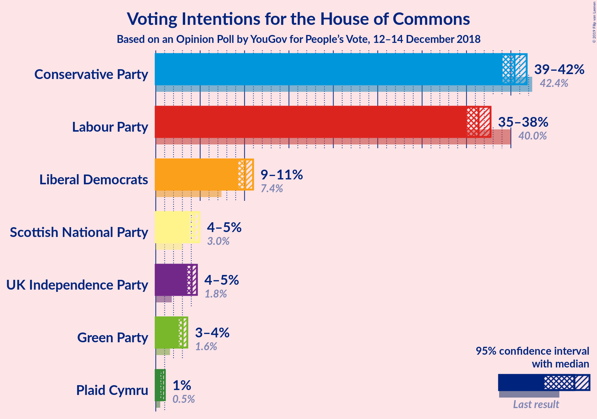
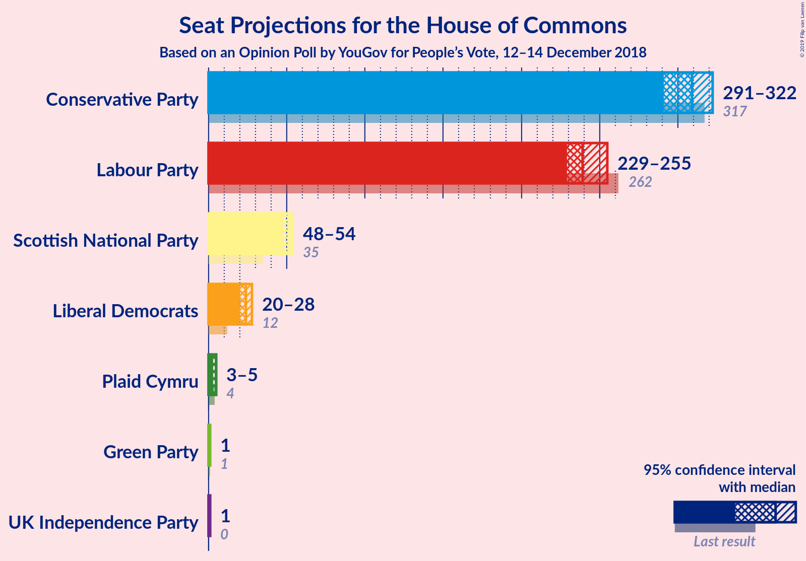
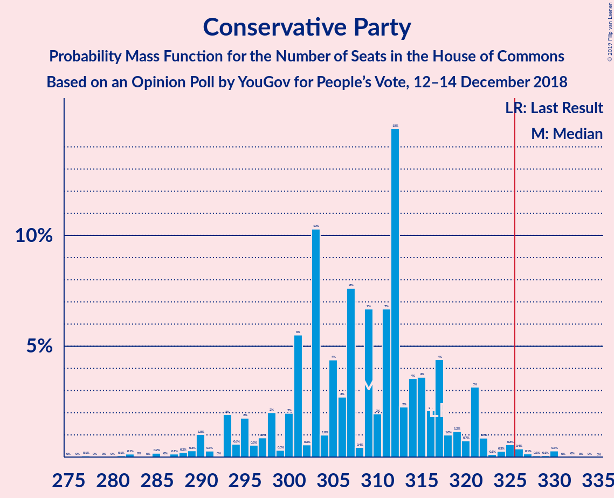
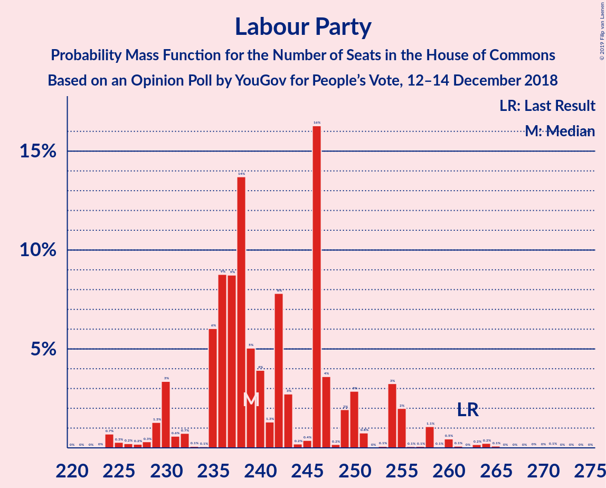
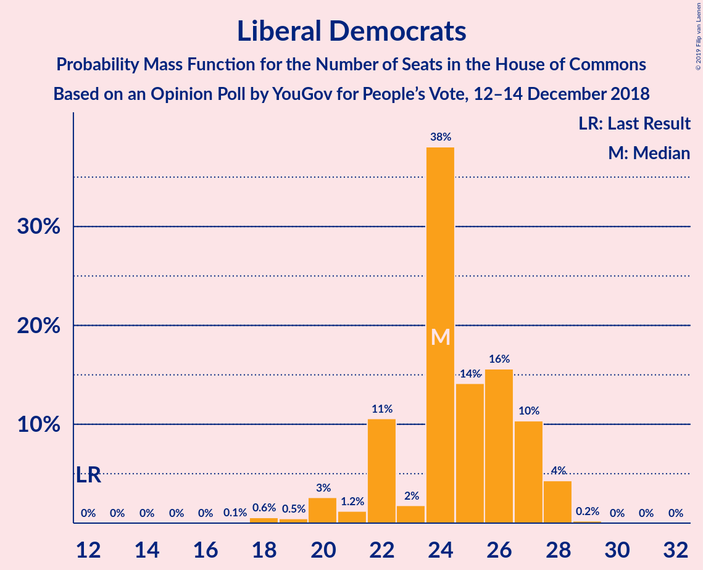
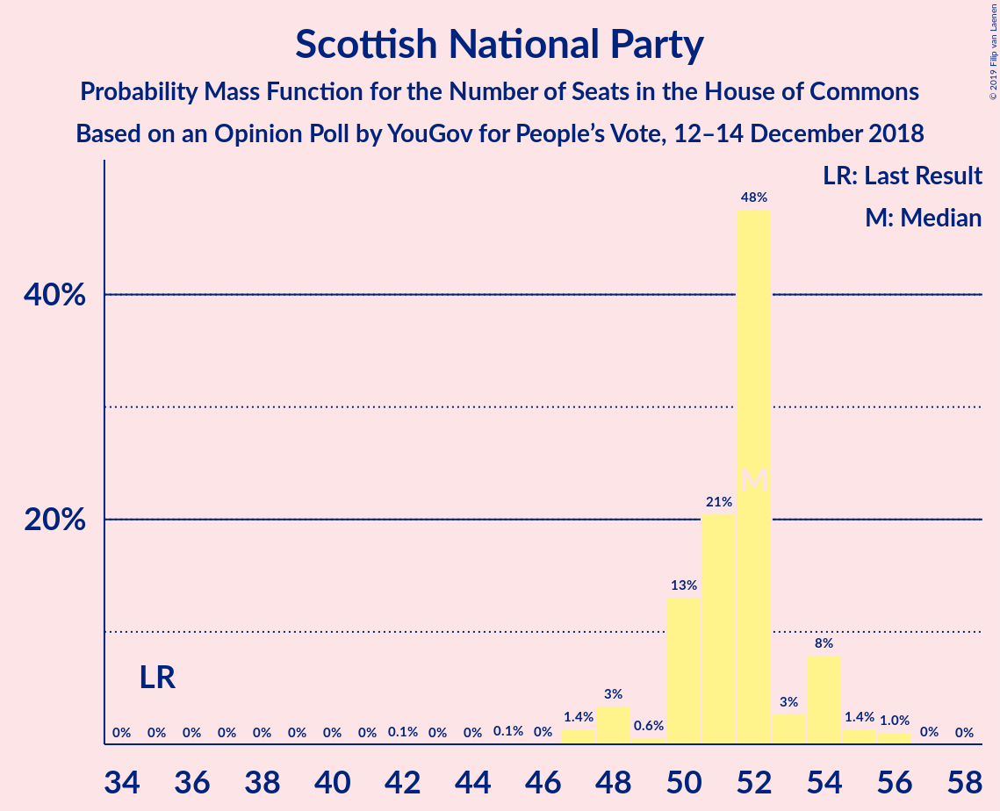
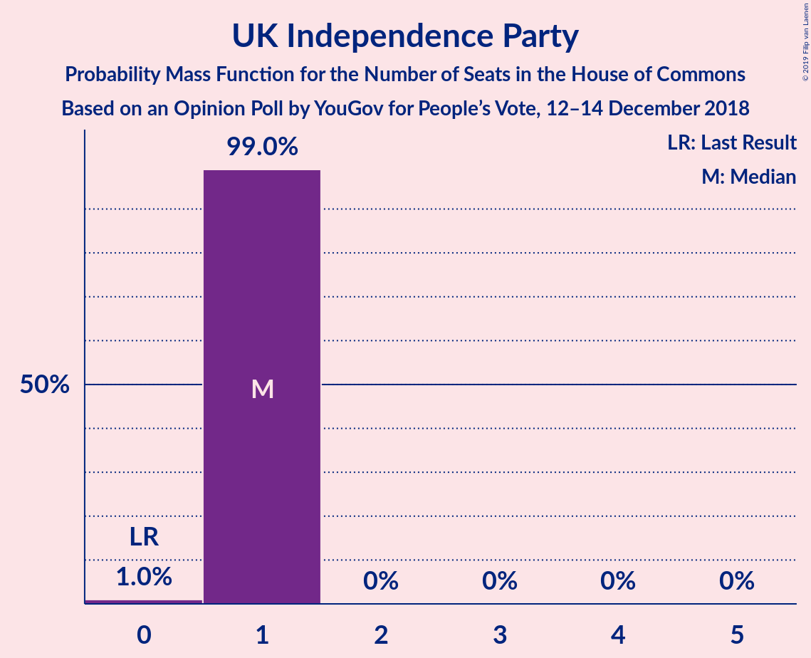
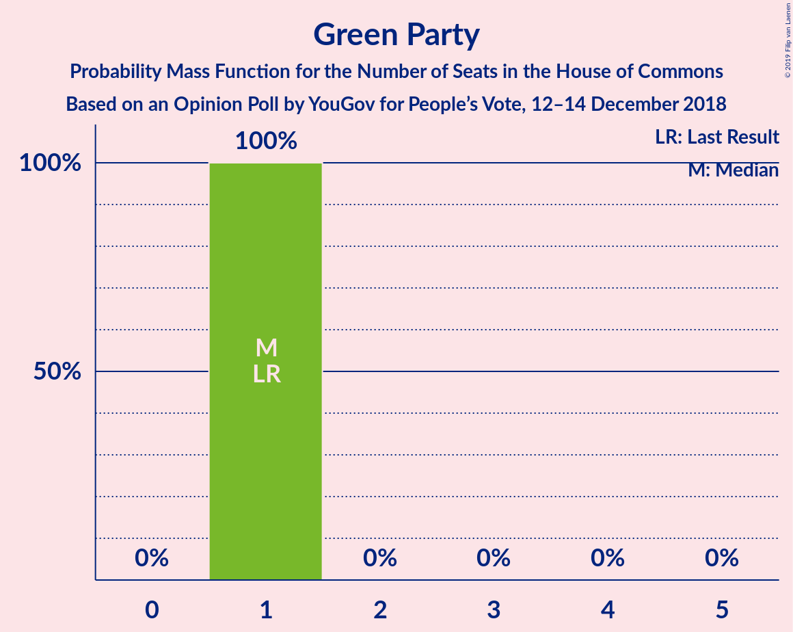
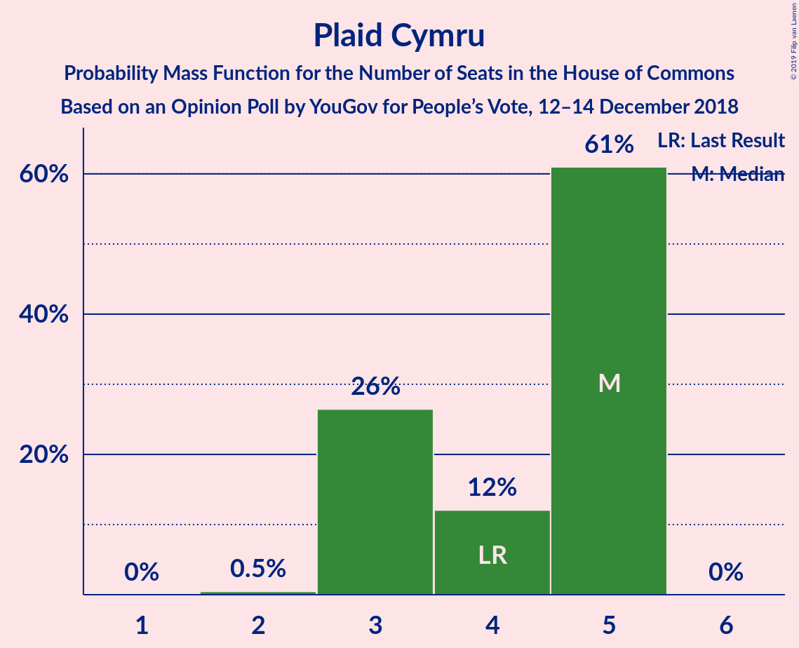
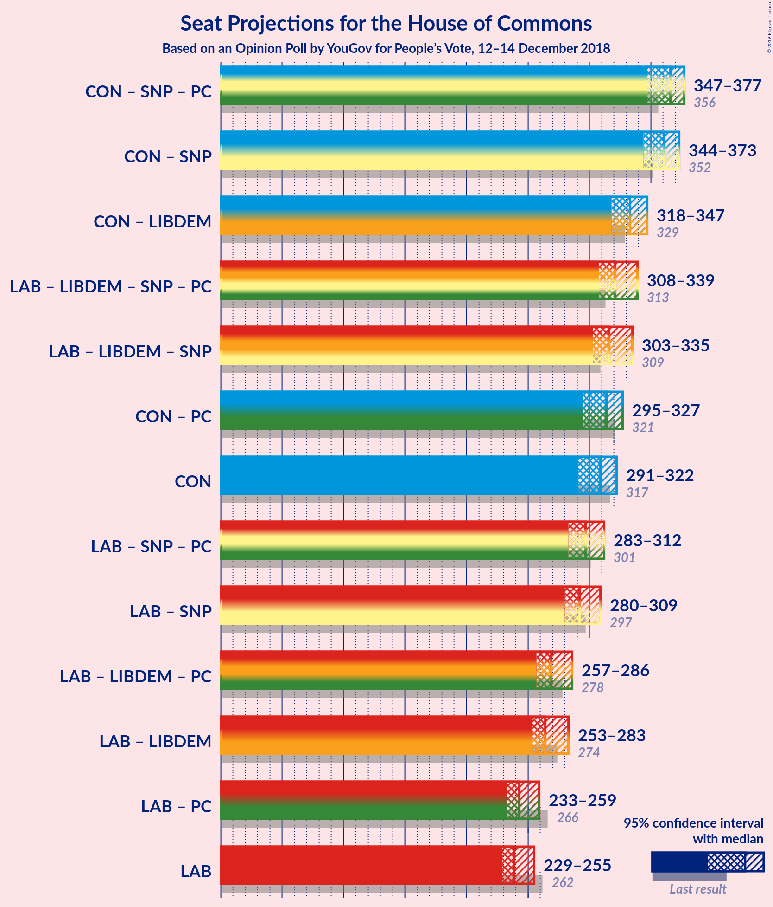

# Opinion Poll by YouGov for People’s Vote, 12–14 December 2018

<a href="#voting-intentions">Voting Intentions</a> | <a href="#seats">Seats</a> | <a href="#coalitions">Coalitions</a> | <a href="#technical-information">Technical Information</a>

## Voting Intentions

### Confidence Intervals

| Party | Last Result | Poll Result | 80% Confidence Interval | 90% Confidence Interval | 95% Confidence Interval | 99% Confidence Interval |
|:-----:|:-----------:|:-----------:|:-----------------------:|:-----------------------:|:-----------------------:|:-----------------------:|
| Conservative Party | 42.4% | 40.4% | 39.5–41.3% |39.3–41.6% |39.1–41.8% |38.6–42.2% |
| Labour Party | 40.0% | 36.4% | 35.5–37.3% |35.3–37.5% |35.0–37.7% |34.6–38.1% |
| Liberal Democrats | 7.4% | 10.1% | 9.6–10.7% |9.4–10.8% |9.3–11.0% |9.0–11.2% |
| Scottish National Party | 3.0% | 4.3% | 4.0–4.7% |3.9–4.8% |3.8–4.9% |3.6–5.1% |
| UK Independence Party | 1.8% | 4.0% | 3.7–4.4% |3.6–4.5% |3.5–4.6% |3.4–4.8% |
| Green Party | 1.6% | 3.0% | 2.7–3.4% |2.7–3.5% |2.6–3.6% |2.5–3.7% |
| Plaid Cymru | 0.5% | 0.7% | 0.6–0.9% |0.6–1.0% |0.5–1.0% |0.5–1.1% |

*Note:* The poll result column reflects the actual value used in the calculations. Published results may vary slightly, and in addition be rounded to fewer digits.

## Seats

### Confidence Intervals

| Party | Last Result | Median | 80% Confidence Interval | 90% Confidence Interval | 95% Confidence Interval | 99% Confidence Interval |
|:-----:|:-----------:|:------:|:-----------------------:|:-----------------------:|:-----------------------:|:-----------------------:|
| <a href="#conservative-party">Conservative Party</a> | 317 | 309 | 298–317 |294–321 |291–322 |285–328 |
| <a href="#labour-party">Labour Party</a> | 262 | 239 | 235–250 |230–254 |229–255 |224–263 |
| <a href="#liberal-democrats">Liberal Democrats</a> | 12 | 24 | 22–27 |22–27 |20–28 |18–28 |
| <a href="#scottish-national-party">Scottish National Party</a> | 35 | 52 | 50–54 |48–54 |48–54 |47–56 |
| <a href="#uk-independence-party">UK Independence Party</a> | 0 | 1 | 1 |1 |1 |0–1 |
| <a href="#green-party">Green Party</a> | 1 | 1 | 1 |1 |1 |1 |
| <a href="#plaid-cymru">Plaid Cymru</a> | 4 | 5 | 3–5 |3–5 |3–5 |3–5 |

### Conservative Party

*For a full overview of the results for this party, see the [Conservative Party](party-conservativeparty.html) page.*

| Number of Seats | Probability | Accumulated | Special Marks |
|:---------------:|:-----------:|:-----------:|:-------------:|
| 277 | 0.1% | 100% |  |
| 278 | 0% | 99.9% |  |
| 279 | 0% | 99.9% |  |
| 280 | 0% | 99.9% |  |
| 281 | 0.1% | 99.9% |  |
| 282 | 0.1% | 99.8% |  |
| 283 | 0% | 99.7% |  |
| 284 | 0% | 99.6% |  |
| 285 | 0.2% | 99.6% |  |
| 286 | 0% | 99.4% |  |
| 287 | 0.1% | 99.4% |  |
| 288 | 0.2% | 99.3% |  |
| 289 | 0.3% | 99.0% |  |
| 290 | 1.0% | 98.8% |  |
| 291 | 0.3% | 98% |  |
| 292 | 0% | 97% |  |
| 293 | 2% | 97% |  |
| 294 | 0.6% | 96% |  |
| 295 | 2% | 95% |  |
| 296 | 0.5% | 93% |  |
| 297 | 0.9% | 93% |  |
| 298 | 2% | 92% |  |
| 299 | 0.3% | 90% |  |
| 300 | 2% | 89% |  |
| 301 | 6% | 87% |  |
| 302 | 0.6% | 82% |  |
| 303 | 10% | 81% |  |
| 304 | 1.0% | 71% |  |
| 305 | 4% | 70% |  |
| 306 | 3% | 66% |  |
| 307 | 8% | 63% |  |
| 308 | 0.4% | 55% |  |
| 309 | 7% | 55% | Median |
| 310 | 2% | 48% |  |
| 311 | 7% | 46% |  |
| 312 | 15% | 40% |  |
| 313 | 2% | 25% |  |
| 314 | 4% | 23% |  |
| 315 | 4% | 19% |  |
| 316 | 2% | 15% |  |
| 317 | 4% | 13% | Last Result |
| 318 | 1.0% | 9% |  |
| 319 | 1.2% | 8% |  |
| 320 | 0.7% | 7% |  |
| 321 | 3% | 6% |  |
| 322 | 0.9% | 3% |  |
| 323 | 0.1% | 2% |  |
| 324 | 0.3% | 2% |  |
| 325 | 0.6% | 2% |  |
| 326 | 0.4% | 1.0% | Majority |
| 327 | 0.1% | 0.7% |  |
| 328 | 0.1% | 0.5% |  |
| 329 | 0.1% | 0.4% |  |
| 330 | 0.3% | 0.4% |  |
| 331 | 0% | 0.1% |  |
| 332 | 0% | 0.1% |  |
| 333 | 0% | 0% |  |

### Labour Party

*For a full overview of the results for this party, see the [Labour Party](party-labourparty.html) page.*

| Number of Seats | Probability | Accumulated | Special Marks |
|:---------------:|:-----------:|:-----------:|:-------------:|
| 223 | 0% | 100% |  |
| 224 | 0.7% | 99.9% |  |
| 225 | 0.3% | 99.2% |  |
| 226 | 0.2% | 99.0% |  |
| 227 | 0.2% | 98.7% |  |
| 228 | 0.3% | 98.5% |  |
| 229 | 1.3% | 98% |  |
| 230 | 3% | 97% |  |
| 231 | 0.6% | 94% |  |
| 232 | 0.7% | 93% |  |
| 233 | 0.1% | 92% |  |
| 234 | 0.1% | 92% |  |
| 235 | 6% | 92% |  |
| 236 | 9% | 86% |  |
| 237 | 9% | 77% |  |
| 238 | 14% | 69% |  |
| 239 | 5% | 55% | Median |
| 240 | 4% | 50% |  |
| 241 | 1.3% | 46% |  |
| 242 | 8% | 45% |  |
| 243 | 3% | 37% |  |
| 244 | 0.2% | 34% |  |
| 245 | 0.4% | 34% |  |
| 246 | 16% | 33% |  |
| 247 | 4% | 17% |  |
| 248 | 0.2% | 14% |  |
| 249 | 2% | 13% |  |
| 250 | 3% | 11% |  |
| 251 | 0.8% | 9% |  |
| 252 | 0% | 8% |  |
| 253 | 0.1% | 8% |  |
| 254 | 3% | 8% |  |
| 255 | 2% | 4% |  |
| 256 | 0.1% | 2% |  |
| 257 | 0.1% | 2% |  |
| 258 | 1.1% | 2% |  |
| 259 | 0.1% | 1.3% |  |
| 260 | 0.5% | 1.2% |  |
| 261 | 0.1% | 0.8% |  |
| 262 | 0% | 0.7% | Last Result |
| 263 | 0.2% | 0.6% |  |
| 264 | 0.2% | 0.5% |  |
| 265 | 0.1% | 0.2% |  |
| 266 | 0% | 0.2% |  |
| 267 | 0% | 0.1% |  |
| 268 | 0% | 0.1% |  |
| 269 | 0% | 0.1% |  |
| 270 | 0% | 0.1% |  |
| 271 | 0.1% | 0.1% |  |
| 272 | 0% | 0% |  |

### Liberal Democrats

*For a full overview of the results for this party, see the [Liberal Democrats](party-liberaldemocrats.html) page.*

| Number of Seats | Probability | Accumulated | Special Marks |
|:---------------:|:-----------:|:-----------:|:-------------:|
| 12 | 0% | 100% | Last Result |
| 13 | 0% | 100% |  |
| 14 | 0% | 100% |  |
| 15 | 0% | 100% |  |
| 16 | 0% | 100% |  |
| 17 | 0.1% | 100% |  |
| 18 | 0.6% | 99.9% |  |
| 19 | 0.5% | 99.4% |  |
| 20 | 3% | 98.9% |  |
| 21 | 1.2% | 96% |  |
| 22 | 11% | 95% |  |
| 23 | 2% | 85% |  |
| 24 | 38% | 83% | Median |
| 25 | 14% | 45% |  |
| 26 | 16% | 31% |  |
| 27 | 10% | 15% |  |
| 28 | 4% | 5% |  |
| 29 | 0.2% | 0.3% |  |
| 30 | 0% | 0.1% |  |
| 31 | 0% | 0% |  |

### Scottish National Party

*For a full overview of the results for this party, see the [Scottish National Party](party-scottishnationalparty.html) page.*

| Number of Seats | Probability | Accumulated | Special Marks |
|:---------------:|:-----------:|:-----------:|:-------------:|
| 35 | 0% | 100% | Last Result |
| 36 | 0% | 100% |  |
| 37 | 0% | 100% |  |
| 38 | 0% | 100% |  |
| 39 | 0% | 100% |  |
| 40 | 0% | 100% |  |
| 41 | 0% | 100% |  |
| 42 | 0.1% | 100% |  |
| 43 | 0% | 99.9% |  |
| 44 | 0% | 99.9% |  |
| 45 | 0.1% | 99.9% |  |
| 46 | 0% | 99.8% |  |
| 47 | 1.4% | 99.8% |  |
| 48 | 3% | 98% |  |
| 49 | 0.6% | 95% |  |
| 50 | 13% | 94% |  |
| 51 | 21% | 81% |  |
| 52 | 48% | 61% | Median |
| 53 | 3% | 13% |  |
| 54 | 8% | 10% |  |
| 55 | 1.4% | 2% |  |
| 56 | 1.0% | 1.1% |  |
| 57 | 0% | 0% |  |

### UK Independence Party

*For a full overview of the results for this party, see the [UK Independence Party](party-ukindependenceparty.html) page.*

| Number of Seats | Probability | Accumulated | Special Marks |
|:---------------:|:-----------:|:-----------:|:-------------:|
| 0 | 1.0% | 100% | Last Result |
| 1 | 99.0% | 99.0% | Median |
| 2 | 0% | 0% |  |

### Green Party

*For a full overview of the results for this party, see the [Green Party](party-greenparty.html) page.*

| Number of Seats | Probability | Accumulated | Special Marks |
|:---------------:|:-----------:|:-----------:|:-------------:|
| 1 | 100% | 100% | Last Result, Median |

### Plaid Cymru

*For a full overview of the results for this party, see the [Plaid Cymru](party-plaidcymru.html) page.*

| Number of Seats | Probability | Accumulated | Special Marks |
|:---------------:|:-----------:|:-----------:|:-------------:|
| 2 | 0.5% | 100% |  |
| 3 | 26% | 99.5% |  |
| 4 | 12% | 73% | Last Result |
| 5 | 61% | 61% | Median |
| 6 | 0% | 0% |  |

## Coalitions

### Confidence Intervals

| Coalition | Last Result | Median | Majority? | 80% Confidence Interval | 90% Confidence Interval | 95% Confidence Interval | 99% Confidence Interval |
|:---------:|:-----------:|:------:|:---------:|:-----------------------:|:-----------------------:|:-----------------------:|:-----------------------:|
| Conservative Party – Scottish National Party – Plaid Cymru | 356 | 366 | 100% | 355–372 | 350–374 | 347–377 | 341–383 |
| Conservative Party – Scottish National Party | 352 | 361 | 100% | 352–368 | 345–371 | 344–373 | 337–378 |
| Conservative Party – Liberal Democrats | 329 | 333 | 88% | 324–341 | 319–346 | 318–347 | 310–351 |
| Labour Party – Liberal Democrats – Scottish National Party – Plaid Cymru | 313 | 321 | 30% | 313–332 | 309–336 | 308–339 | 303–345 |
| Labour Party – Liberal Democrats – Scottish National Party | 309 | 316 | 15% | 309–328 | 306–332 | 303–335 | 298–340 |
| Conservative Party – Plaid Cymru | 321 | 314 | 3% | 302–321 | 298–324 | 295–327 | 290–332 |
| Conservative Party | 317 | 309 | 1.0% | 298–317 | 294–321 | 291–322 | 285–328 |
| Labour Party – Scottish National Party – Plaid Cymru | 301 | 297 | 0.1% | 289–306 | 284–311 | 283–312 | 279–320 |
| Labour Party – Scottish National Party | 297 | 292 | 0% | 284–302 | 280–306 | 280–309 | 275–315 |
| Labour Party – Liberal Democrats – Plaid Cymru | 278 | 269 | 0% | 262–278 | 259–285 | 257–286 | 252–293 |
| Labour Party – Liberal Democrats | 274 | 264 | 0% | 258–275 | 256–280 | 253–283 | 247–289 |
| Labour Party – Plaid Cymru | 266 | 243 | 0% | 239–254 | 233–259 | 233–259 | 229–268 |
| Labour Party | 262 | 239 | 0% | 235–250 | 230–254 | 229–255 | 224–263 |

### Conservative Party – Scottish National Party – Plaid Cymru

| Number of Seats | Probability | Accumulated | Special Marks |
|:---------------:|:-----------:|:-----------:|:-------------:|
| 333 | 0.1% | 100% |  |
| 334 | 0% | 99.9% |  |
| 335 | 0% | 99.9% |  |
| 336 | 0% | 99.9% |  |
| 337 | 0% | 99.9% |  |
| 338 | 0.1% | 99.8% |  |
| 339 | 0% | 99.8% |  |
| 340 | 0.1% | 99.8% |  |
| 341 | 0.2% | 99.7% |  |
| 342 | 0.1% | 99.5% |  |
| 343 | 0.2% | 99.3% |  |
| 344 | 0.3% | 99.2% |  |
| 345 | 1.0% | 98.9% |  |
| 346 | 0% | 98% |  |
| 347 | 0.6% | 98% |  |
| 348 | 0.6% | 97% |  |
| 349 | 0.6% | 97% |  |
| 350 | 2% | 96% |  |
| 351 | 1.0% | 94% |  |
| 352 | 1.2% | 93% |  |
| 353 | 0.7% | 92% |  |
| 354 | 0.4% | 91% |  |
| 355 | 2% | 91% |  |
| 356 | 3% | 89% | Last Result |
| 357 | 4% | 86% |  |
| 358 | 0.6% | 82% |  |
| 359 | 2% | 81% |  |
| 360 | 10% | 79% |  |
| 361 | 3% | 69% |  |
| 362 | 5% | 66% |  |
| 363 | 2% | 61% |  |
| 364 | 5% | 59% |  |
| 365 | 2% | 55% |  |
| 366 | 11% | 53% | Median |
| 367 | 3% | 42% |  |
| 368 | 12% | 39% |  |
| 369 | 4% | 27% |  |
| 370 | 4% | 23% |  |
| 371 | 6% | 19% |  |
| 372 | 4% | 14% |  |
| 373 | 2% | 10% |  |
| 374 | 4% | 8% |  |
| 375 | 0.7% | 4% |  |
| 376 | 0.4% | 3% |  |
| 377 | 0.7% | 3% |  |
| 378 | 0.2% | 2% |  |
| 379 | 0.6% | 2% |  |
| 380 | 0.2% | 2% |  |
| 381 | 0.2% | 1.4% |  |
| 382 | 0.5% | 1.1% |  |
| 383 | 0.3% | 0.6% |  |
| 384 | 0.1% | 0.3% |  |
| 385 | 0% | 0.1% |  |
| 386 | 0.1% | 0.1% |  |
| 387 | 0% | 0.1% |  |
| 388 | 0% | 0% |  |

### Conservative Party – Scottish National Party

| Number of Seats | Probability | Accumulated | Special Marks |
|:---------------:|:-----------:|:-----------:|:-------------:|
| 329 | 0.1% | 100% |  |
| 330 | 0% | 99.9% |  |
| 331 | 0% | 99.9% |  |
| 332 | 0% | 99.9% |  |
| 333 | 0% | 99.9% |  |
| 334 | 0% | 99.9% |  |
| 335 | 0.1% | 99.8% |  |
| 336 | 0.2% | 99.8% |  |
| 337 | 0.1% | 99.6% |  |
| 338 | 0.3% | 99.5% |  |
| 339 | 0.3% | 99.2% |  |
| 340 | 0.1% | 98.9% |  |
| 341 | 0.1% | 98.8% |  |
| 342 | 1.0% | 98.7% |  |
| 343 | 0% | 98% |  |
| 344 | 1.0% | 98% |  |
| 345 | 2% | 97% |  |
| 346 | 0.4% | 95% |  |
| 347 | 1.5% | 94% |  |
| 348 | 0.8% | 93% |  |
| 349 | 1.0% | 92% |  |
| 350 | 0.2% | 91% |  |
| 351 | 0.4% | 91% |  |
| 352 | 6% | 90% | Last Result |
| 353 | 2% | 84% |  |
| 354 | 3% | 83% |  |
| 355 | 10% | 80% |  |
| 356 | 0.9% | 70% |  |
| 357 | 7% | 69% |  |
| 358 | 2% | 62% |  |
| 359 | 4% | 60% |  |
| 360 | 0.9% | 56% |  |
| 361 | 7% | 55% | Median |
| 362 | 3% | 48% |  |
| 363 | 13% | 45% |  |
| 364 | 5% | 31% |  |
| 365 | 4% | 26% |  |
| 366 | 7% | 22% |  |
| 367 | 2% | 16% |  |
| 368 | 3% | 13% |  |
| 369 | 2% | 10% |  |
| 370 | 0.8% | 7% |  |
| 371 | 3% | 7% |  |
| 372 | 0.6% | 3% |  |
| 373 | 0.3% | 3% |  |
| 374 | 0.8% | 2% |  |
| 375 | 0.2% | 2% |  |
| 376 | 0.3% | 2% |  |
| 377 | 0.5% | 1.2% |  |
| 378 | 0.3% | 0.7% |  |
| 379 | 0.2% | 0.4% |  |
| 380 | 0% | 0.2% |  |
| 381 | 0.1% | 0.2% |  |
| 382 | 0% | 0.1% |  |
| 383 | 0% | 0% |  |

### Conservative Party – Liberal Democrats

| Number of Seats | Probability | Accumulated | Special Marks |
|:---------------:|:-----------:|:-----------:|:-------------:|
| 303 | 0.1% | 100% |  |
| 304 | 0% | 99.9% |  |
| 305 | 0% | 99.9% |  |
| 306 | 0% | 99.9% |  |
| 307 | 0.1% | 99.9% |  |
| 308 | 0.1% | 99.7% |  |
| 309 | 0% | 99.6% |  |
| 310 | 0.1% | 99.6% |  |
| 311 | 0.1% | 99.5% |  |
| 312 | 0.1% | 99.4% |  |
| 313 | 0% | 99.3% |  |
| 314 | 0% | 99.2% |  |
| 315 | 0.5% | 99.2% |  |
| 316 | 0.2% | 98.8% |  |
| 317 | 1.0% | 98.6% |  |
| 318 | 0.3% | 98% |  |
| 319 | 2% | 97% |  |
| 320 | 0.9% | 95% |  |
| 321 | 1.1% | 94% |  |
| 322 | 0.8% | 93% |  |
| 323 | 1.2% | 92% |  |
| 324 | 2% | 91% |  |
| 325 | 1.3% | 89% |  |
| 326 | 1.5% | 88% | Majority |
| 327 | 13% | 86% |  |
| 328 | 4% | 73% |  |
| 329 | 0.5% | 68% | Last Result |
| 330 | 2% | 68% |  |
| 331 | 6% | 66% |  |
| 332 | 1.2% | 60% |  |
| 333 | 11% | 59% | Median |
| 334 | 0.9% | 48% |  |
| 335 | 2% | 47% |  |
| 336 | 20% | 46% |  |
| 337 | 5% | 26% |  |
| 338 | 1.0% | 21% |  |
| 339 | 6% | 20% |  |
| 340 | 3% | 14% |  |
| 341 | 2% | 11% |  |
| 342 | 0.3% | 9% |  |
| 343 | 0.9% | 9% |  |
| 344 | 1.4% | 8% |  |
| 345 | 0.9% | 6% |  |
| 346 | 0.5% | 5% |  |
| 347 | 3% | 5% |  |
| 348 | 0.3% | 1.5% |  |
| 349 | 0.4% | 1.2% |  |
| 350 | 0.1% | 0.7% |  |
| 351 | 0.1% | 0.6% |  |
| 352 | 0.1% | 0.5% |  |
| 353 | 0.3% | 0.4% |  |
| 354 | 0% | 0.1% |  |
| 355 | 0% | 0% |  |

### Labour Party – Liberal Democrats – Scottish National Party – Plaid Cymru

| Number of Seats | Probability | Accumulated | Special Marks |
|:---------------:|:-----------:|:-----------:|:-------------:|
| 298 | 0% | 100% |  |
| 299 | 0% | 99.9% |  |
| 300 | 0.3% | 99.9% |  |
| 301 | 0% | 99.6% |  |
| 302 | 0.1% | 99.6% |  |
| 303 | 0.2% | 99.5% |  |
| 304 | 0.4% | 99.3% |  |
| 305 | 0.6% | 99.0% |  |
| 306 | 0.2% | 98% |  |
| 307 | 0.1% | 98% |  |
| 308 | 0.9% | 98% |  |
| 309 | 3% | 97% |  |
| 310 | 0.7% | 94% |  |
| 311 | 1.0% | 93% |  |
| 312 | 1.1% | 92% |  |
| 313 | 4% | 91% | Last Result |
| 314 | 2% | 87% |  |
| 315 | 3% | 85% |  |
| 316 | 4% | 81% |  |
| 317 | 2% | 78% |  |
| 318 | 15% | 75% |  |
| 319 | 7% | 60% |  |
| 320 | 2% | 54% | Median |
| 321 | 7% | 52% |  |
| 322 | 0.5% | 45% |  |
| 323 | 8% | 45% |  |
| 324 | 3% | 37% |  |
| 325 | 4% | 34% |  |
| 326 | 1.0% | 30% | Majority |
| 327 | 10% | 29% |  |
| 328 | 0.6% | 19% |  |
| 329 | 6% | 18% |  |
| 330 | 2% | 13% |  |
| 331 | 0.3% | 11% |  |
| 332 | 2% | 10% |  |
| 333 | 0.9% | 8% |  |
| 334 | 0.5% | 7% |  |
| 335 | 2% | 7% |  |
| 336 | 0.6% | 5% |  |
| 337 | 2% | 4% |  |
| 338 | 0% | 3% |  |
| 339 | 0.3% | 3% |  |
| 340 | 1.0% | 2% |  |
| 341 | 0.3% | 1.2% |  |
| 342 | 0.2% | 1.0% |  |
| 343 | 0.1% | 0.7% |  |
| 344 | 0% | 0.6% |  |
| 345 | 0.2% | 0.6% |  |
| 346 | 0% | 0.4% |  |
| 347 | 0% | 0.4% |  |
| 348 | 0.1% | 0.3% |  |
| 349 | 0.1% | 0.2% |  |
| 350 | 0% | 0.1% |  |
| 351 | 0% | 0.1% |  |
| 352 | 0% | 0.1% |  |
| 353 | 0.1% | 0.1% |  |
| 354 | 0% | 0% |  |

### Labour Party – Liberal Democrats – Scottish National Party

| Number of Seats | Probability | Accumulated | Special Marks |
|:---------------:|:-----------:|:-----------:|:-------------:|
| 295 | 0.3% | 100% |  |
| 296 | 0.1% | 99.7% |  |
| 297 | 0.1% | 99.6% |  |
| 298 | 0.1% | 99.5% |  |
| 299 | 0.4% | 99.5% |  |
| 300 | 0.5% | 99.1% |  |
| 301 | 0.2% | 98.5% |  |
| 302 | 0.1% | 98% |  |
| 303 | 0.8% | 98% |  |
| 304 | 0.5% | 97% |  |
| 305 | 0.7% | 97% |  |
| 306 | 3% | 96% |  |
| 307 | 0.5% | 93% |  |
| 308 | 0.8% | 92% |  |
| 309 | 5% | 92% | Last Result |
| 310 | 2% | 87% |  |
| 311 | 5% | 84% |  |
| 312 | 2% | 79% |  |
| 313 | 12% | 77% |  |
| 314 | 5% | 65% |  |
| 315 | 4% | 60% | Median |
| 316 | 9% | 56% |  |
| 317 | 0.5% | 47% |  |
| 318 | 9% | 47% |  |
| 319 | 2% | 37% |  |
| 320 | 2% | 35% |  |
| 321 | 3% | 33% |  |
| 322 | 11% | 30% |  |
| 323 | 1.2% | 20% |  |
| 324 | 3% | 18% |  |
| 325 | 0.3% | 15% |  |
| 326 | 4% | 15% | Majority |
| 327 | 0.5% | 11% |  |
| 328 | 0.8% | 10% |  |
| 329 | 1.4% | 9% |  |
| 330 | 2% | 8% |  |
| 331 | 0.7% | 6% |  |
| 332 | 2% | 5% |  |
| 333 | 0.1% | 3% |  |
| 334 | 0.6% | 3% |  |
| 335 | 0.1% | 3% |  |
| 336 | 0.5% | 2% |  |
| 337 | 1.1% | 2% |  |
| 338 | 0.1% | 0.8% |  |
| 339 | 0% | 0.7% |  |
| 340 | 0.3% | 0.7% |  |
| 341 | 0% | 0.4% |  |
| 342 | 0% | 0.4% |  |
| 343 | 0.1% | 0.4% |  |
| 344 | 0.1% | 0.3% |  |
| 345 | 0% | 0.2% |  |
| 346 | 0.1% | 0.2% |  |
| 347 | 0% | 0.1% |  |
| 348 | 0% | 0.1% |  |
| 349 | 0.1% | 0.1% |  |
| 350 | 0% | 0% |  |

### Conservative Party – Plaid Cymru

| Number of Seats | Probability | Accumulated | Special Marks |
|:---------------:|:-----------:|:-----------:|:-------------:|
| 281 | 0.1% | 100% |  |
| 282 | 0% | 99.9% |  |
| 283 | 0% | 99.9% |  |
| 284 | 0.1% | 99.9% |  |
| 285 | 0% | 99.8% |  |
| 286 | 0.1% | 99.8% |  |
| 287 | 0.1% | 99.7% |  |
| 288 | 0% | 99.6% |  |
| 289 | 0% | 99.6% |  |
| 290 | 0.3% | 99.6% |  |
| 291 | 0% | 99.3% |  |
| 292 | 0.1% | 99.3% |  |
| 293 | 1.1% | 99.2% |  |
| 294 | 0.5% | 98% |  |
| 295 | 0.1% | 98% |  |
| 296 | 0.6% | 97% |  |
| 297 | 0.1% | 97% |  |
| 298 | 2% | 97% |  |
| 299 | 0.7% | 95% |  |
| 300 | 2% | 94% |  |
| 301 | 1.4% | 92% |  |
| 302 | 0.8% | 91% |  |
| 303 | 0.4% | 90% |  |
| 304 | 4% | 89% |  |
| 305 | 0.3% | 85% |  |
| 306 | 3% | 85% |  |
| 307 | 1.2% | 82% |  |
| 308 | 11% | 80% |  |
| 309 | 3% | 70% |  |
| 310 | 2% | 67% |  |
| 311 | 2% | 65% |  |
| 312 | 9% | 63% |  |
| 313 | 0.5% | 53% |  |
| 314 | 9% | 53% | Median |
| 315 | 4% | 44% |  |
| 316 | 5% | 40% |  |
| 317 | 12% | 35% |  |
| 318 | 2% | 23% |  |
| 319 | 5% | 21% |  |
| 320 | 3% | 16% |  |
| 321 | 5% | 13% | Last Result |
| 322 | 0.8% | 9% |  |
| 323 | 0.5% | 8% |  |
| 324 | 4% | 7% |  |
| 325 | 0.7% | 4% |  |
| 326 | 0.5% | 3% | Majority |
| 327 | 0.8% | 3% |  |
| 328 | 0.1% | 2% |  |
| 329 | 0.2% | 2% |  |
| 330 | 0.5% | 1.5% |  |
| 331 | 0.4% | 0.9% |  |
| 332 | 0.1% | 0.6% |  |
| 333 | 0.1% | 0.5% |  |
| 334 | 0.1% | 0.4% |  |
| 335 | 0.3% | 0.3% |  |
| 336 | 0% | 0% |  |

### Conservative Party

| Number of Seats | Probability | Accumulated | Special Marks |
|:---------------:|:-----------:|:-----------:|:-------------:|
| 277 | 0.1% | 100% |  |
| 278 | 0% | 99.9% |  |
| 279 | 0% | 99.9% |  |
| 280 | 0% | 99.9% |  |
| 281 | 0.1% | 99.9% |  |
| 282 | 0.1% | 99.8% |  |
| 283 | 0% | 99.7% |  |
| 284 | 0% | 99.6% |  |
| 285 | 0.2% | 99.6% |  |
| 286 | 0% | 99.4% |  |
| 287 | 0.1% | 99.4% |  |
| 288 | 0.2% | 99.3% |  |
| 289 | 0.3% | 99.0% |  |
| 290 | 1.0% | 98.8% |  |
| 291 | 0.3% | 98% |  |
| 292 | 0% | 97% |  |
| 293 | 2% | 97% |  |
| 294 | 0.6% | 96% |  |
| 295 | 2% | 95% |  |
| 296 | 0.5% | 93% |  |
| 297 | 0.9% | 93% |  |
| 298 | 2% | 92% |  |
| 299 | 0.3% | 90% |  |
| 300 | 2% | 89% |  |
| 301 | 6% | 87% |  |
| 302 | 0.6% | 82% |  |
| 303 | 10% | 81% |  |
| 304 | 1.0% | 71% |  |
| 305 | 4% | 70% |  |
| 306 | 3% | 66% |  |
| 307 | 8% | 63% |  |
| 308 | 0.4% | 55% |  |
| 309 | 7% | 55% | Median |
| 310 | 2% | 48% |  |
| 311 | 7% | 46% |  |
| 312 | 15% | 40% |  |
| 313 | 2% | 25% |  |
| 314 | 4% | 23% |  |
| 315 | 4% | 19% |  |
| 316 | 2% | 15% |  |
| 317 | 4% | 13% | Last Result |
| 318 | 1.0% | 9% |  |
| 319 | 1.2% | 8% |  |
| 320 | 0.7% | 7% |  |
| 321 | 3% | 6% |  |
| 322 | 0.9% | 3% |  |
| 323 | 0.1% | 2% |  |
| 324 | 0.3% | 2% |  |
| 325 | 0.6% | 2% |  |
| 326 | 0.4% | 1.0% | Majority |
| 327 | 0.1% | 0.7% |  |
| 328 | 0.1% | 0.5% |  |
| 329 | 0.1% | 0.4% |  |
| 330 | 0.3% | 0.4% |  |
| 331 | 0% | 0.1% |  |
| 332 | 0% | 0.1% |  |
| 333 | 0% | 0% |  |

### Labour Party – Scottish National Party – Plaid Cymru

| Number of Seats | Probability | Accumulated | Special Marks |
|:---------------:|:-----------:|:-----------:|:-------------:|
| 276 | 0% | 100% |  |
| 277 | 0.3% | 99.9% |  |
| 278 | 0.1% | 99.6% |  |
| 279 | 0.2% | 99.5% |  |
| 280 | 0.1% | 99.4% |  |
| 281 | 0.4% | 99.3% |  |
| 282 | 0.2% | 98.8% |  |
| 283 | 3% | 98.6% |  |
| 284 | 0.5% | 95% |  |
| 285 | 0.9% | 95% |  |
| 286 | 1.4% | 94% |  |
| 287 | 1.0% | 92% |  |
| 288 | 0.3% | 91% |  |
| 289 | 2% | 91% |  |
| 290 | 3% | 89% |  |
| 291 | 6% | 86% |  |
| 292 | 1.2% | 80% |  |
| 293 | 5% | 79% |  |
| 294 | 20% | 74% |  |
| 295 | 2% | 55% |  |
| 296 | 0.9% | 53% | Median |
| 297 | 11% | 52% |  |
| 298 | 1.2% | 41% |  |
| 299 | 6% | 40% |  |
| 300 | 2% | 34% |  |
| 301 | 0.5% | 32% | Last Result |
| 302 | 4% | 32% |  |
| 303 | 13% | 27% |  |
| 304 | 1.5% | 14% |  |
| 305 | 1.3% | 12% |  |
| 306 | 2% | 11% |  |
| 307 | 1.2% | 9% |  |
| 308 | 0.8% | 8% |  |
| 309 | 1.1% | 7% |  |
| 310 | 0.9% | 6% |  |
| 311 | 2% | 5% |  |
| 312 | 0.3% | 3% |  |
| 313 | 1.0% | 2% |  |
| 314 | 0.2% | 1.4% |  |
| 315 | 0.5% | 1.2% |  |
| 316 | 0% | 0.8% |  |
| 317 | 0% | 0.8% |  |
| 318 | 0.1% | 0.7% |  |
| 319 | 0.1% | 0.6% |  |
| 320 | 0.1% | 0.5% |  |
| 321 | 0% | 0.4% |  |
| 322 | 0.1% | 0.4% |  |
| 323 | 0.1% | 0.3% |  |
| 324 | 0% | 0.1% |  |
| 325 | 0% | 0.1% |  |
| 326 | 0% | 0.1% | Majority |
| 327 | 0.1% | 0.1% |  |
| 328 | 0% | 0% |  |

### Labour Party – Scottish National Party

| Number of Seats | Probability | Accumulated | Special Marks |
|:---------------:|:-----------:|:-----------:|:-------------:|
| 272 | 0.3% | 100% |  |
| 273 | 0.1% | 99.7% |  |
| 274 | 0.1% | 99.6% |  |
| 275 | 0.1% | 99.5% |  |
| 276 | 0.5% | 99.4% |  |
| 277 | 0.1% | 98.9% |  |
| 278 | 0.3% | 98.8% |  |
| 279 | 0.6% | 98% |  |
| 280 | 3% | 98% |  |
| 281 | 1.1% | 95% |  |
| 282 | 0.9% | 94% |  |
| 283 | 0.8% | 93% |  |
| 284 | 2% | 92% |  |
| 285 | 0.9% | 90% |  |
| 286 | 3% | 89% |  |
| 287 | 4% | 86% |  |
| 288 | 4% | 82% |  |
| 289 | 16% | 78% |  |
| 290 | 4% | 62% |  |
| 291 | 5% | 58% | Median |
| 292 | 10% | 52% |  |
| 293 | 1.4% | 43% |  |
| 294 | 6% | 41% |  |
| 295 | 2% | 35% |  |
| 296 | 0.6% | 33% |  |
| 297 | 4% | 33% | Last Result |
| 298 | 11% | 29% |  |
| 299 | 5% | 18% |  |
| 300 | 1.1% | 14% |  |
| 301 | 0.9% | 13% |  |
| 302 | 3% | 12% |  |
| 303 | 0.3% | 9% |  |
| 304 | 2% | 9% |  |
| 305 | 0.8% | 7% |  |
| 306 | 3% | 6% |  |
| 307 | 0.3% | 3% |  |
| 308 | 0.2% | 3% |  |
| 309 | 0.4% | 3% |  |
| 310 | 1.3% | 2% |  |
| 311 | 0.1% | 0.9% |  |
| 312 | 0.1% | 0.8% |  |
| 313 | 0% | 0.8% |  |
| 314 | 0.1% | 0.7% |  |
| 315 | 0.2% | 0.7% |  |
| 316 | 0% | 0.5% |  |
| 317 | 0% | 0.4% |  |
| 318 | 0.2% | 0.4% |  |
| 319 | 0.1% | 0.2% |  |
| 320 | 0% | 0.1% |  |
| 321 | 0% | 0.1% |  |
| 322 | 0% | 0.1% |  |
| 323 | 0.1% | 0.1% |  |
| 324 | 0% | 0% |  |

### Labour Party – Liberal Democrats – Plaid Cymru

| Number of Seats | Probability | Accumulated | Special Marks |
|:---------------:|:-----------:|:-----------:|:-------------:|
| 248 | 0% | 100% |  |
| 249 | 0.1% | 99.9% |  |
| 250 | 0.1% | 99.9% |  |
| 251 | 0.1% | 99.8% |  |
| 252 | 0.3% | 99.7% |  |
| 253 | 0.5% | 99.3% |  |
| 254 | 0.3% | 98.8% |  |
| 255 | 0.2% | 98.5% |  |
| 256 | 0.8% | 98% |  |
| 257 | 0.3% | 98% |  |
| 258 | 0.6% | 97% |  |
| 259 | 3% | 97% |  |
| 260 | 0.8% | 93% |  |
| 261 | 2% | 93% |  |
| 262 | 3% | 90% |  |
| 263 | 2% | 87% |  |
| 264 | 7% | 85% |  |
| 265 | 4% | 78% |  |
| 266 | 5% | 74% |  |
| 267 | 13% | 69% |  |
| 268 | 3% | 55% | Median |
| 269 | 7% | 52% |  |
| 270 | 0.9% | 45% |  |
| 271 | 4% | 44% |  |
| 272 | 2% | 40% |  |
| 273 | 7% | 38% |  |
| 274 | 0.9% | 31% |  |
| 275 | 10% | 30% |  |
| 276 | 3% | 20% |  |
| 277 | 2% | 17% |  |
| 278 | 6% | 16% | Last Result |
| 279 | 0.4% | 10% |  |
| 280 | 0.2% | 9% |  |
| 281 | 1.0% | 9% |  |
| 282 | 0.8% | 8% |  |
| 283 | 1.5% | 7% |  |
| 284 | 0.4% | 6% |  |
| 285 | 2% | 5% |  |
| 286 | 1.0% | 3% |  |
| 287 | 0% | 2% |  |
| 288 | 1.0% | 2% |  |
| 289 | 0% | 1.3% |  |
| 290 | 0.1% | 1.2% |  |
| 291 | 0.3% | 1.1% |  |
| 292 | 0.3% | 0.8% |  |
| 293 | 0.1% | 0.5% |  |
| 294 | 0.2% | 0.4% |  |
| 295 | 0.1% | 0.2% |  |
| 296 | 0% | 0.2% |  |
| 297 | 0% | 0.1% |  |
| 298 | 0% | 0.1% |  |
| 299 | 0% | 0.1% |  |
| 300 | 0% | 0.1% |  |
| 301 | 0.1% | 0.1% |  |
| 302 | 0% | 0% |  |

### Labour Party – Liberal Democrats

| Number of Seats | Probability | Accumulated | Special Marks |
|:---------------:|:-----------:|:-----------:|:-------------:|
| 243 | 0% | 100% |  |
| 244 | 0.1% | 99.9% |  |
| 245 | 0% | 99.9% |  |
| 246 | 0.1% | 99.9% |  |
| 247 | 0.3% | 99.7% |  |
| 248 | 0.6% | 99.4% |  |
| 249 | 0.2% | 98.9% |  |
| 250 | 0.3% | 98.7% |  |
| 251 | 0.6% | 98% |  |
| 252 | 0.2% | 98% |  |
| 253 | 0.7% | 98% |  |
| 254 | 0.4% | 97% |  |
| 255 | 0.7% | 97% |  |
| 256 | 4% | 96% |  |
| 257 | 2% | 92% |  |
| 258 | 3% | 90% |  |
| 259 | 6% | 87% |  |
| 260 | 4% | 81% |  |
| 261 | 4% | 77% |  |
| 262 | 12% | 73% |  |
| 263 | 3% | 61% | Median |
| 264 | 11% | 58% |  |
| 265 | 2% | 47% |  |
| 266 | 5% | 45% |  |
| 267 | 2% | 41% |  |
| 268 | 5% | 39% |  |
| 269 | 3% | 34% |  |
| 270 | 10% | 31% |  |
| 271 | 2% | 21% |  |
| 272 | 0.6% | 19% |  |
| 273 | 4% | 18% |  |
| 274 | 3% | 14% | Last Result |
| 275 | 2% | 11% |  |
| 276 | 0.4% | 9% |  |
| 277 | 0.7% | 9% |  |
| 278 | 1.2% | 8% |  |
| 279 | 1.0% | 7% |  |
| 280 | 2% | 6% |  |
| 281 | 0.6% | 4% |  |
| 282 | 0.6% | 3% |  |
| 283 | 0.6% | 3% |  |
| 284 | 0% | 2% |  |
| 285 | 1.1% | 2% |  |
| 286 | 0.3% | 1.1% |  |
| 287 | 0.2% | 0.8% |  |
| 288 | 0.1% | 0.7% |  |
| 289 | 0.2% | 0.5% |  |
| 290 | 0.1% | 0.3% |  |
| 291 | 0% | 0.2% |  |
| 292 | 0.1% | 0.2% |  |
| 293 | 0% | 0.2% |  |
| 294 | 0% | 0.1% |  |
| 295 | 0% | 0.1% |  |
| 296 | 0% | 0.1% |  |
| 297 | 0.1% | 0.1% |  |
| 298 | 0% | 0% |  |

### Labour Party – Plaid Cymru

| Number of Seats | Probability | Accumulated | Special Marks |
|:---------------:|:-----------:|:-----------:|:-------------:|
| 228 | 0.2% | 100% |  |
| 229 | 0.8% | 99.8% |  |
| 230 | 0.2% | 99.0% |  |
| 231 | 0.3% | 98.8% |  |
| 232 | 0.2% | 98.6% |  |
| 233 | 3% | 98% |  |
| 234 | 1.4% | 95% |  |
| 235 | 0.7% | 94% |  |
| 236 | 0.6% | 93% |  |
| 237 | 0% | 92% |  |
| 238 | 0.1% | 92% |  |
| 239 | 5% | 92% |  |
| 240 | 9% | 87% |  |
| 241 | 5% | 78% |  |
| 242 | 13% | 73% |  |
| 243 | 11% | 61% |  |
| 244 | 0% | 50% | Median |
| 245 | 5% | 50% |  |
| 246 | 2% | 45% |  |
| 247 | 8% | 43% |  |
| 248 | 1.2% | 35% |  |
| 249 | 2% | 34% |  |
| 250 | 1.3% | 32% |  |
| 251 | 17% | 30% |  |
| 252 | 0.9% | 13% |  |
| 253 | 2% | 13% |  |
| 254 | 3% | 11% |  |
| 255 | 0% | 8% |  |
| 256 | 0% | 8% |  |
| 257 | 0% | 8% |  |
| 258 | 2% | 8% |  |
| 259 | 4% | 6% |  |
| 260 | 0.1% | 2% |  |
| 261 | 0.9% | 2% |  |
| 262 | 0.1% | 1.5% |  |
| 263 | 0.1% | 1.4% |  |
| 264 | 0.1% | 1.2% |  |
| 265 | 0.5% | 1.1% |  |
| 266 | 0% | 0.7% | Last Result |
| 267 | 0.1% | 0.7% |  |
| 268 | 0.3% | 0.6% |  |
| 269 | 0.1% | 0.2% |  |
| 270 | 0% | 0.1% |  |
| 271 | 0% | 0.1% |  |
| 272 | 0% | 0.1% |  |
| 273 | 0% | 0.1% |  |
| 274 | 0% | 0.1% |  |
| 275 | 0.1% | 0.1% |  |
| 276 | 0% | 0% |  |

### Labour Party

| Number of Seats | Probability | Accumulated | Special Marks |
|:---------------:|:-----------:|:-----------:|:-------------:|
| 223 | 0% | 100% |  |
| 224 | 0.7% | 99.9% |  |
| 225 | 0.3% | 99.2% |  |
| 226 | 0.2% | 99.0% |  |
| 227 | 0.2% | 98.7% |  |
| 228 | 0.3% | 98.5% |  |
| 229 | 1.3% | 98% |  |
| 230 | 3% | 97% |  |
| 231 | 0.6% | 94% |  |
| 232 | 0.7% | 93% |  |
| 233 | 0.1% | 92% |  |
| 234 | 0.1% | 92% |  |
| 235 | 6% | 92% |  |
| 236 | 9% | 86% |  |
| 237 | 9% | 77% |  |
| 238 | 14% | 69% |  |
| 239 | 5% | 55% | Median |
| 240 | 4% | 50% |  |
| 241 | 1.3% | 46% |  |
| 242 | 8% | 45% |  |
| 243 | 3% | 37% |  |
| 244 | 0.2% | 34% |  |
| 245 | 0.4% | 34% |  |
| 246 | 16% | 33% |  |
| 247 | 4% | 17% |  |
| 248 | 0.2% | 14% |  |
| 249 | 2% | 13% |  |
| 250 | 3% | 11% |  |
| 251 | 0.8% | 9% |  |
| 252 | 0% | 8% |  |
| 253 | 0.1% | 8% |  |
| 254 | 3% | 8% |  |
| 255 | 2% | 4% |  |
| 256 | 0.1% | 2% |  |
| 257 | 0.1% | 2% |  |
| 258 | 1.1% | 2% |  |
| 259 | 0.1% | 1.3% |  |
| 260 | 0.5% | 1.2% |  |
| 261 | 0.1% | 0.8% |  |
| 262 | 0% | 0.7% | Last Result |
| 263 | 0.2% | 0.6% |  |
| 264 | 0.2% | 0.5% |  |
| 265 | 0.1% | 0.2% |  |
| 266 | 0% | 0.2% |  |
| 267 | 0% | 0.1% |  |
| 268 | 0% | 0.1% |  |
| 269 | 0% | 0.1% |  |
| 270 | 0% | 0.1% |  |
| 271 | 0.1% | 0.1% |  |
| 272 | 0% | 0% |  |

## Technical Information

### Opinion Poll

+ **Polling firm:** YouGov
+ **Commissioner(s):** People’s Vote
+ **Fieldwork period:** 12–14 December 2018

### Calculations

+ **Sample size:** 5043
+ **Simulations done:** 131,072
+ **Error estimate:** 0.70%

