# Opinion Poll by Kantar Public, 7–11 February 2019

<a href="#voting-intentions">Voting Intentions</a> | <a href="#seats">Seats</a> | <a href="#coalitions">Coalitions</a> | <a href="#technical-information">Technical Information</a>

## Voting Intentions

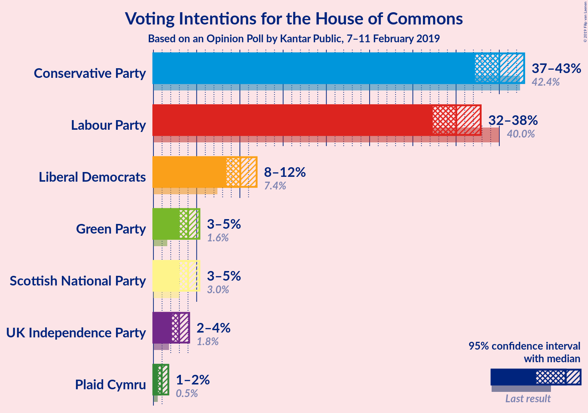

### Confidence Intervals

| Party | Last Result | Poll Result | 80% Confidence Interval | 90% Confidence Interval | 95% Confidence Interval | 99% Confidence Interval |
|:-----:|:-----------:|:-----------:|:-----------------------:|:-----------------------:|:-----------------------:|:-----------------------:|
| Conservative Party | 42.4% | 40.0% | 38.2–41.9% |37.6–42.4% |37.2–42.9% |36.3–43.8% |
| Labour Party | 40.0% | 35.0% | 33.2–36.9% |32.7–37.4% |32.3–37.8% |31.5–38.7% |
| Liberal Democrats | 7.4% | 10.0% | 9.0–11.3% |8.7–11.6% |8.4–11.9% |7.9–12.5% |
| Scottish National Party | 3.0% | 4.0% | 3.4–4.9% |3.2–5.1% |3.0–5.3% |2.7–5.8% |
| Green Party | 1.6% | 4.0% | 3.4–4.9% |3.2–5.1% |3.0–5.3% |2.7–5.8% |
| UK Independence Party | 1.8% | 3.0% | 2.4–3.7% |2.3–3.9% |2.1–4.1% |1.9–4.5% |
| Plaid Cymru | 0.5% | 1.0% | 0.7–1.4% |0.6–1.6% |0.5–1.7% |0.4–2.0% |

*Note:* The poll result column reflects the actual value used in the calculations. Published results may vary slightly, and in addition be rounded to fewer digits.

## Seats

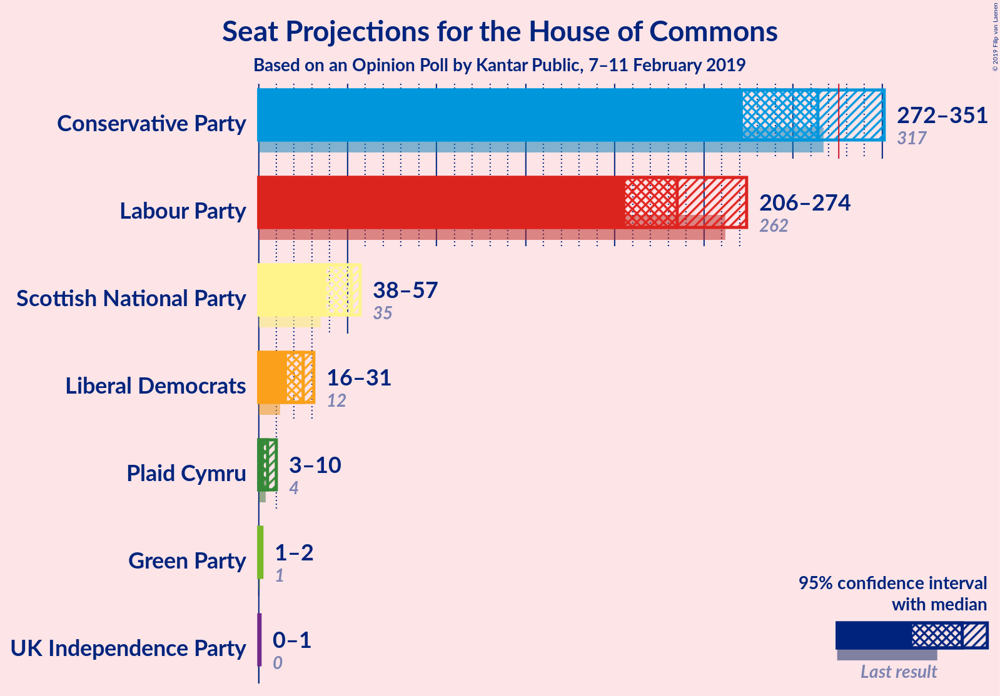

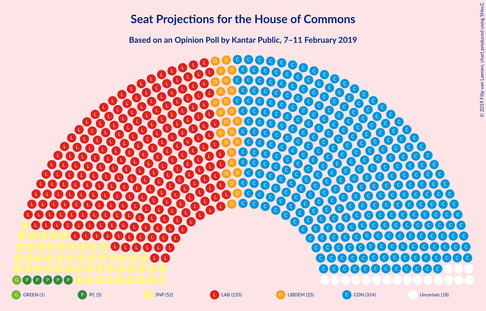

### Confidence Intervals

| Party | Last Result | Median | 80% Confidence Interval | 90% Confidence Interval | 95% Confidence Interval | 99% Confidence Interval |
|:-----:|:-----------:|:------:|:-----------------------:|:-----------------------:|:-----------------------:|:-----------------------:|
| <a href="#conservative-party">Conservative Party</a> | 317 | 314 | 293–339 |282–345 |272–351 |259–361 |
| <a href="#labour-party">Labour Party</a> | 262 | 235 | 215–252 |211–263 |206–274 |200–288 |
| <a href="#liberal-democrats">Liberal Democrats</a> | 12 | 25 | 20–29 |18–30 |16–31 |13–33 |
| <a href="#scottish-national-party">Scottish National Party</a> | 35 | 52 | 41–56 |40–56 |38–57 |29–57 |
| <a href="#green-party">Green Party</a> | 1 | 1 | 1–2 |1–2 |1–2 |1–2 |
| <a href="#uk-independence-party">UK Independence Party</a> | 0 | 0 | 0–1 |0–1 |0–1 |0–1 |
| <a href="#plaid-cymru">Plaid Cymru</a> | 4 | 5 | 4–8 |3–9 |3–10 |2–11 |

### Conservative Party

*For a full overview of the results for this party, see the [Conservative Party](party-conservativeparty.html) page.*

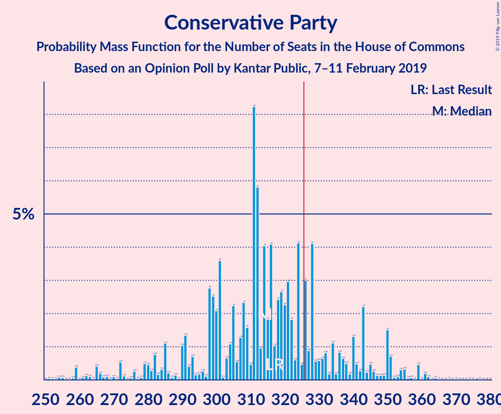

| Number of Seats | Probability | Accumulated | Special Marks |
|:---------------:|:-----------:|:-----------:|:-------------:|
| 251 | 0% | 100% |  |
| 252 | 0% | 99.9% |  |
| 253 | 0% | 99.9% |  |
| 254 | 0.1% | 99.9% |  |
| 255 | 0.1% | 99.8% |  |
| 256 | 0% | 99.7% |  |
| 257 | 0% | 99.7% |  |
| 258 | 0.1% | 99.7% |  |
| 259 | 0.4% | 99.6% |  |
| 260 | 0% | 99.3% |  |
| 261 | 0.1% | 99.2% |  |
| 262 | 0.1% | 99.2% |  |
| 263 | 0.1% | 99.0% |  |
| 264 | 0% | 99.0% |  |
| 265 | 0.4% | 98.9% |  |
| 266 | 0.2% | 98.5% |  |
| 267 | 0.1% | 98% |  |
| 268 | 0.1% | 98% |  |
| 269 | 0% | 98% |  |
| 270 | 0.1% | 98% |  |
| 271 | 0% | 98% |  |
| 272 | 0.5% | 98% |  |
| 273 | 0.1% | 97% |  |
| 274 | 0% | 97% |  |
| 275 | 0.1% | 97% |  |
| 276 | 0.3% | 97% |  |
| 277 | 0% | 97% |  |
| 278 | 0.1% | 97% |  |
| 279 | 0.5% | 97% |  |
| 280 | 0.5% | 96% |  |
| 281 | 0.3% | 96% |  |
| 282 | 0.8% | 96% |  |
| 283 | 0.2% | 95% |  |
| 284 | 0.3% | 95% |  |
| 285 | 1.1% | 94% |  |
| 286 | 0.2% | 93% |  |
| 287 | 0.1% | 93% |  |
| 288 | 0.1% | 93% |  |
| 289 | 0% | 93% |  |
| 290 | 1.0% | 93% |  |
| 291 | 1.3% | 92% |  |
| 292 | 0.4% | 90% |  |
| 293 | 0.7% | 90% |  |
| 294 | 0.2% | 89% |  |
| 295 | 0.2% | 89% |  |
| 296 | 0.3% | 89% |  |
| 297 | 0.1% | 89% |  |
| 298 | 3% | 89% |  |
| 299 | 3% | 86% |  |
| 300 | 2% | 83% |  |
| 301 | 4% | 81% |  |
| 302 | 0.1% | 78% |  |
| 303 | 0.7% | 78% |  |
| 304 | 1.1% | 77% |  |
| 305 | 2% | 76% |  |
| 306 | 0.6% | 74% |  |
| 307 | 1.3% | 73% |  |
| 308 | 2% | 72% |  |
| 309 | 2% | 69% |  |
| 310 | 0.5% | 68% |  |
| 311 | 8% | 67% |  |
| 312 | 6% | 59% |  |
| 313 | 1.0% | 53% |  |
| 314 | 4% | 52% | Median |
| 315 | 2% | 48% |  |
| 316 | 4% | 47% |  |
| 317 | 1.0% | 42% | Last Result |
| 318 | 2% | 41% |  |
| 319 | 3% | 39% |  |
| 320 | 2% | 36% |  |
| 321 | 3% | 34% |  |
| 322 | 2% | 31% |  |
| 323 | 0.6% | 29% |  |
| 324 | 4% | 29% |  |
| 325 | 0.5% | 25% |  |
| 326 | 3% | 24% | Majority |
| 327 | 0.9% | 21% |  |
| 328 | 4% | 20% |  |
| 329 | 0.6% | 16% |  |
| 330 | 0.6% | 16% |  |
| 331 | 0.6% | 15% |  |
| 332 | 0.8% | 14% |  |
| 333 | 0.2% | 13% |  |
| 334 | 1.1% | 13% |  |
| 335 | 0.2% | 12% |  |
| 336 | 0.8% | 12% |  |
| 337 | 0.6% | 11% |  |
| 338 | 0.5% | 10% |  |
| 339 | 0.2% | 10% |  |
| 340 | 1.3% | 10% |  |
| 341 | 0.5% | 9% |  |
| 342 | 0.3% | 8% |  |
| 343 | 2% | 8% |  |
| 344 | 0.2% | 6% |  |
| 345 | 0.5% | 5% |  |
| 346 | 0.3% | 5% |  |
| 347 | 0.1% | 5% |  |
| 348 | 0.1% | 4% |  |
| 349 | 0.1% | 4% |  |
| 350 | 2% | 4% |  |
| 351 | 0.7% | 3% |  |
| 352 | 0.1% | 2% |  |
| 353 | 0.1% | 2% |  |
| 354 | 0.3% | 2% |  |
| 355 | 0.3% | 1.5% |  |
| 356 | 0.1% | 1.1% |  |
| 357 | 0.1% | 1.1% |  |
| 358 | 0% | 1.0% |  |
| 359 | 0.5% | 1.0% |  |
| 360 | 0% | 0.5% |  |
| 361 | 0.2% | 0.5% |  |
| 362 | 0.1% | 0.3% |  |
| 363 | 0% | 0.2% |  |
| 364 | 0.1% | 0.2% |  |
| 365 | 0% | 0.2% |  |
| 366 | 0% | 0.1% |  |
| 367 | 0% | 0.1% |  |
| 368 | 0% | 0.1% |  |
| 369 | 0% | 0.1% |  |
| 370 | 0% | 0.1% |  |
| 371 | 0% | 0.1% |  |
| 372 | 0% | 0.1% |  |
| 373 | 0% | 0.1% |  |
| 374 | 0% | 0.1% |  |
| 375 | 0% | 0% |  |

### Labour Party

*For a full overview of the results for this party, see the [Labour Party](party-labourparty.html) page.*

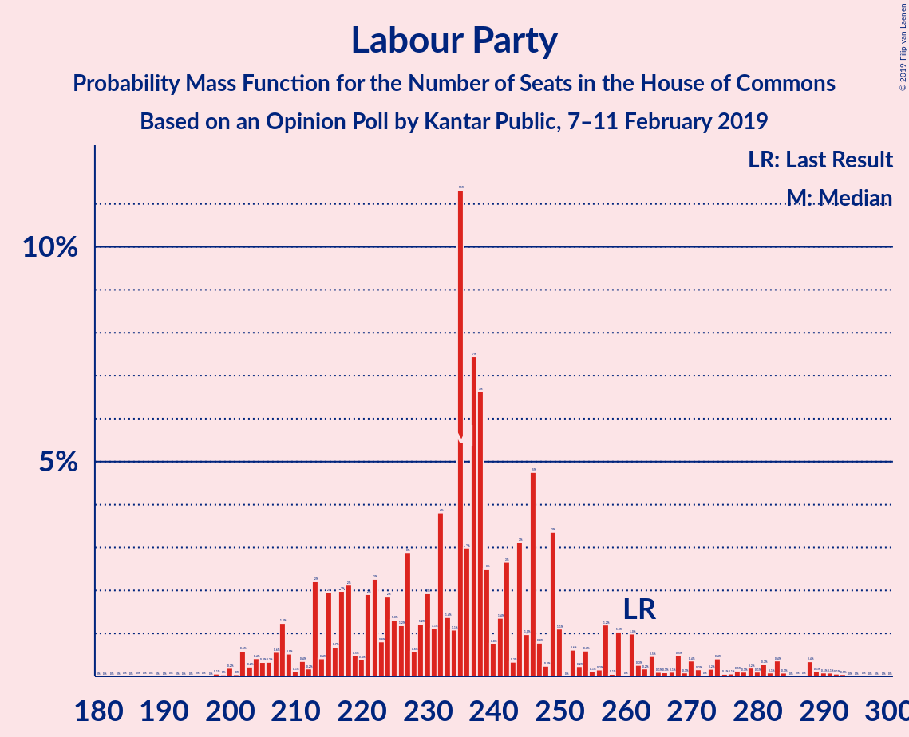

| Number of Seats | Probability | Accumulated | Special Marks |
|:---------------:|:-----------:|:-----------:|:-------------:|
| 185 | 0% | 100% |  |
| 186 | 0% | 99.9% |  |
| 187 | 0% | 99.9% |  |
| 188 | 0% | 99.9% |  |
| 189 | 0% | 99.9% |  |
| 190 | 0% | 99.9% |  |
| 191 | 0% | 99.9% |  |
| 192 | 0% | 99.8% |  |
| 193 | 0% | 99.8% |  |
| 194 | 0% | 99.8% |  |
| 195 | 0% | 99.8% |  |
| 196 | 0% | 99.8% |  |
| 197 | 0% | 99.8% |  |
| 198 | 0.1% | 99.8% |  |
| 199 | 0% | 99.7% |  |
| 200 | 0.2% | 99.6% |  |
| 201 | 0% | 99.5% |  |
| 202 | 0.6% | 99.4% |  |
| 203 | 0.2% | 98.8% |  |
| 204 | 0.4% | 98.6% |  |
| 205 | 0.3% | 98% |  |
| 206 | 0.3% | 98% |  |
| 207 | 0.6% | 97% |  |
| 208 | 1.2% | 97% |  |
| 209 | 0.5% | 96% |  |
| 210 | 0.1% | 95% |  |
| 211 | 0.4% | 95% |  |
| 212 | 0.2% | 95% |  |
| 213 | 2% | 94% |  |
| 214 | 0.4% | 92% |  |
| 215 | 2% | 92% |  |
| 216 | 0.7% | 90% |  |
| 217 | 2% | 89% |  |
| 218 | 2% | 87% |  |
| 219 | 0.5% | 85% |  |
| 220 | 0.4% | 85% |  |
| 221 | 2% | 84% |  |
| 222 | 2% | 82% |  |
| 223 | 0.8% | 80% |  |
| 224 | 2% | 79% |  |
| 225 | 1.3% | 77% |  |
| 226 | 1.2% | 76% |  |
| 227 | 3% | 75% |  |
| 228 | 0.6% | 72% |  |
| 229 | 1.2% | 71% |  |
| 230 | 2% | 70% |  |
| 231 | 1.1% | 68% |  |
| 232 | 4% | 67% |  |
| 233 | 1.4% | 63% |  |
| 234 | 1.1% | 62% |  |
| 235 | 11% | 61% | Median |
| 236 | 3% | 49% |  |
| 237 | 7% | 46% |  |
| 238 | 7% | 39% |  |
| 239 | 3% | 32% |  |
| 240 | 0.8% | 30% |  |
| 241 | 1.4% | 29% |  |
| 242 | 3% | 28% |  |
| 243 | 0.3% | 25% |  |
| 244 | 3% | 25% |  |
| 245 | 1.0% | 22% |  |
| 246 | 5% | 21% |  |
| 247 | 0.8% | 16% |  |
| 248 | 0.2% | 15% |  |
| 249 | 3% | 15% |  |
| 250 | 1.1% | 12% |  |
| 251 | 0% | 10% |  |
| 252 | 0.6% | 10% |  |
| 253 | 0.2% | 10% |  |
| 254 | 0.6% | 10% |  |
| 255 | 0.1% | 9% |  |
| 256 | 0.2% | 9% |  |
| 257 | 1.2% | 9% |  |
| 258 | 0.1% | 7% |  |
| 259 | 1.0% | 7% |  |
| 260 | 0% | 6% |  |
| 261 | 1.0% | 6% |  |
| 262 | 0.3% | 5% | Last Result |
| 263 | 0.2% | 5% |  |
| 264 | 0.5% | 5% |  |
| 265 | 0.1% | 4% |  |
| 266 | 0.1% | 4% |  |
| 267 | 0.1% | 4% |  |
| 268 | 0.5% | 4% |  |
| 269 | 0.1% | 4% |  |
| 270 | 0.4% | 4% |  |
| 271 | 0.2% | 3% |  |
| 272 | 0% | 3% |  |
| 273 | 0.2% | 3% |  |
| 274 | 0.4% | 3% |  |
| 275 | 0.1% | 2% |  |
| 276 | 0.1% | 2% |  |
| 277 | 0.1% | 2% |  |
| 278 | 0.1% | 2% |  |
| 279 | 0.2% | 2% |  |
| 280 | 0.1% | 2% |  |
| 281 | 0.3% | 2% |  |
| 282 | 0.1% | 1.4% |  |
| 283 | 0.4% | 1.3% |  |
| 284 | 0.1% | 1.0% |  |
| 285 | 0% | 0.9% |  |
| 286 | 0% | 0.9% |  |
| 287 | 0% | 0.9% |  |
| 288 | 0.4% | 0.8% |  |
| 289 | 0.1% | 0.5% |  |
| 290 | 0.1% | 0.4% |  |
| 291 | 0.1% | 0.3% |  |
| 292 | 0.1% | 0.2% |  |
| 293 | 0.1% | 0.1% |  |
| 294 | 0% | 0.1% |  |
| 295 | 0% | 0.1% |  |
| 296 | 0% | 0.1% |  |
| 297 | 0% | 0% |  |

### Liberal Democrats

*For a full overview of the results for this party, see the [Liberal Democrats](party-liberaldemocrats.html) page.*

| Number of Seats | Probability | Accumulated | Special Marks |
|:---------------:|:-----------:|:-----------:|:-------------:|
| 12 | 0.1% | 100% | Last Result |
| 13 | 0.5% | 99.8% |  |
| 14 | 0.8% | 99.3% |  |
| 15 | 0.7% | 98% |  |
| 16 | 1.4% | 98% |  |
| 17 | 1.3% | 96% |  |
| 18 | 3% | 95% |  |
| 19 | 2% | 92% |  |
| 20 | 8% | 90% |  |
| 21 | 3% | 82% |  |
| 22 | 5% | 79% |  |
| 23 | 5% | 74% |  |
| 24 | 14% | 69% |  |
| 25 | 11% | 55% | Median |
| 26 | 13% | 44% |  |
| 27 | 8% | 31% |  |
| 28 | 10% | 23% |  |
| 29 | 4% | 14% |  |
| 30 | 4% | 9% |  |
| 31 | 2% | 5% |  |
| 32 | 1.3% | 2% |  |
| 33 | 0.9% | 1.2% |  |
| 34 | 0.1% | 0.4% |  |
| 35 | 0.1% | 0.2% |  |
| 36 | 0.1% | 0.1% |  |
| 37 | 0% | 0% |  |

### Scottish National Party

*For a full overview of the results for this party, see the [Scottish National Party](party-scottishnationalparty.html) page.*

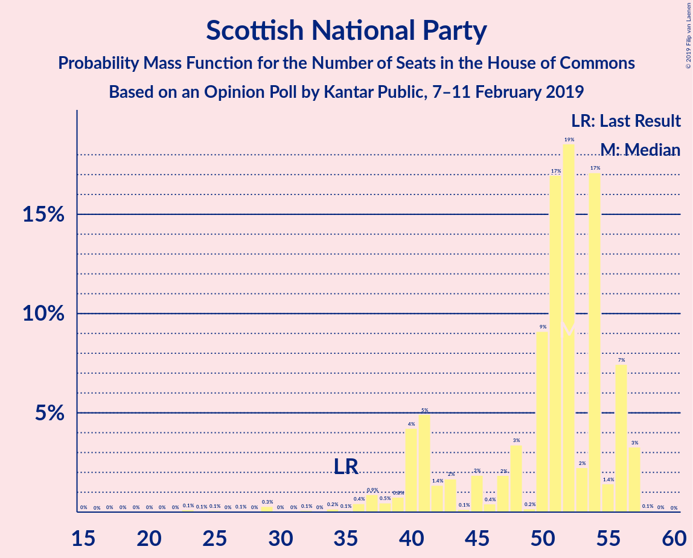

| Number of Seats | Probability | Accumulated | Special Marks |
|:---------------:|:-----------:|:-----------:|:-------------:|
| 17 | 0% | 100% |  |
| 18 | 0% | 99.9% |  |
| 19 | 0% | 99.9% |  |
| 20 | 0% | 99.9% |  |
| 21 | 0% | 99.9% |  |
| 22 | 0% | 99.9% |  |
| 23 | 0.1% | 99.9% |  |
| 24 | 0.1% | 99.8% |  |
| 25 | 0.1% | 99.7% |  |
| 26 | 0% | 99.6% |  |
| 27 | 0.1% | 99.6% |  |
| 28 | 0% | 99.5% |  |
| 29 | 0.3% | 99.5% |  |
| 30 | 0% | 99.2% |  |
| 31 | 0% | 99.2% |  |
| 32 | 0.1% | 99.2% |  |
| 33 | 0% | 99.1% |  |
| 34 | 0.2% | 99.1% |  |
| 35 | 0.1% | 98.9% | Last Result |
| 36 | 0.4% | 98.8% |  |
| 37 | 0.9% | 98% |  |
| 38 | 0.5% | 98% |  |
| 39 | 0.8% | 97% |  |
| 40 | 4% | 96% |  |
| 41 | 5% | 92% |  |
| 42 | 1.4% | 87% |  |
| 43 | 2% | 86% |  |
| 44 | 0.1% | 84% |  |
| 45 | 2% | 84% |  |
| 46 | 0.4% | 82% |  |
| 47 | 2% | 82% |  |
| 48 | 3% | 80% |  |
| 49 | 0.2% | 76% |  |
| 50 | 9% | 76% |  |
| 51 | 17% | 67% |  |
| 52 | 19% | 50% | Median |
| 53 | 2% | 32% |  |
| 54 | 17% | 29% |  |
| 55 | 1.4% | 12% |  |
| 56 | 7% | 11% |  |
| 57 | 3% | 3% |  |
| 58 | 0.1% | 0.1% |  |
| 59 | 0% | 0% |  |

### Green Party

*For a full overview of the results for this party, see the [Green Party](party-greenparty.html) page.*

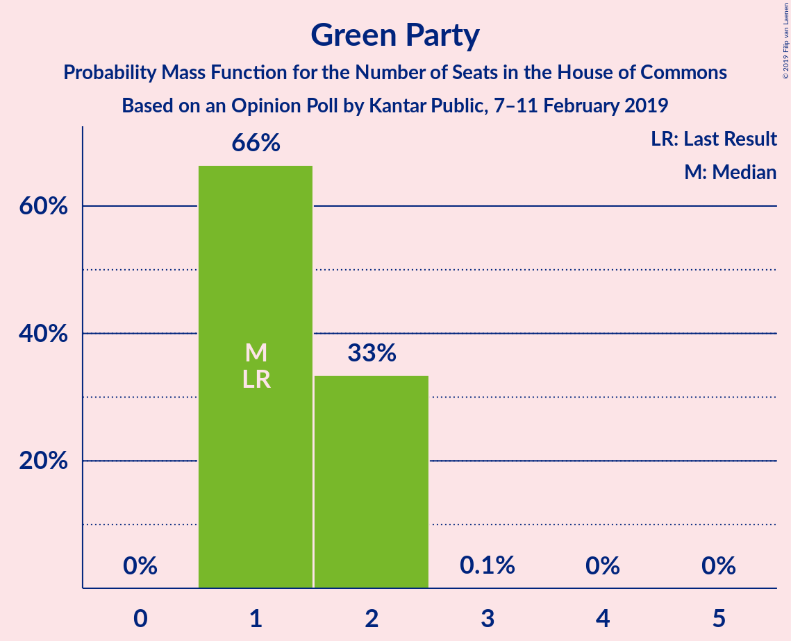

| Number of Seats | Probability | Accumulated | Special Marks |
|:---------------:|:-----------:|:-----------:|:-------------:|
| 1 | 66% | 100% | Last Result, Median |
| 2 | 33% | 34% |  |
| 3 | 0.1% | 0.1% |  |
| 4 | 0% | 0% |  |

### UK Independence Party

*For a full overview of the results for this party, see the [UK Independence Party](party-ukindependenceparty.html) page.*

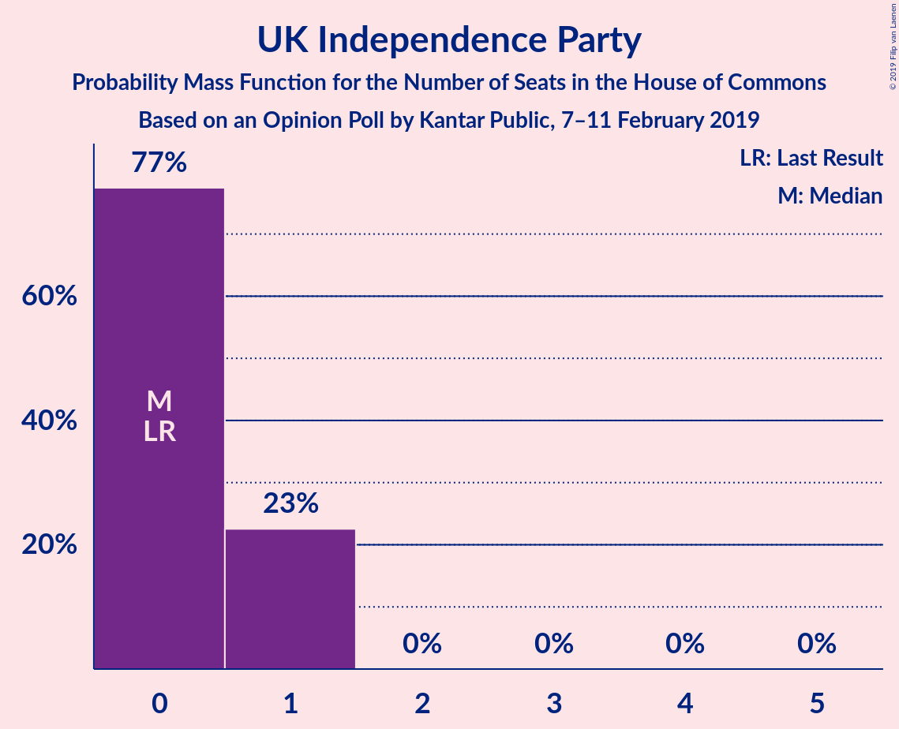

| Number of Seats | Probability | Accumulated | Special Marks |
|:---------------:|:-----------:|:-----------:|:-------------:|
| 0 | 77% | 100% | Last Result, Median |
| 1 | 23% | 23% |  |
| 2 | 0% | 0% |  |

### Plaid Cymru

*For a full overview of the results for this party, see the [Plaid Cymru](party-plaidcymru.html) page.*

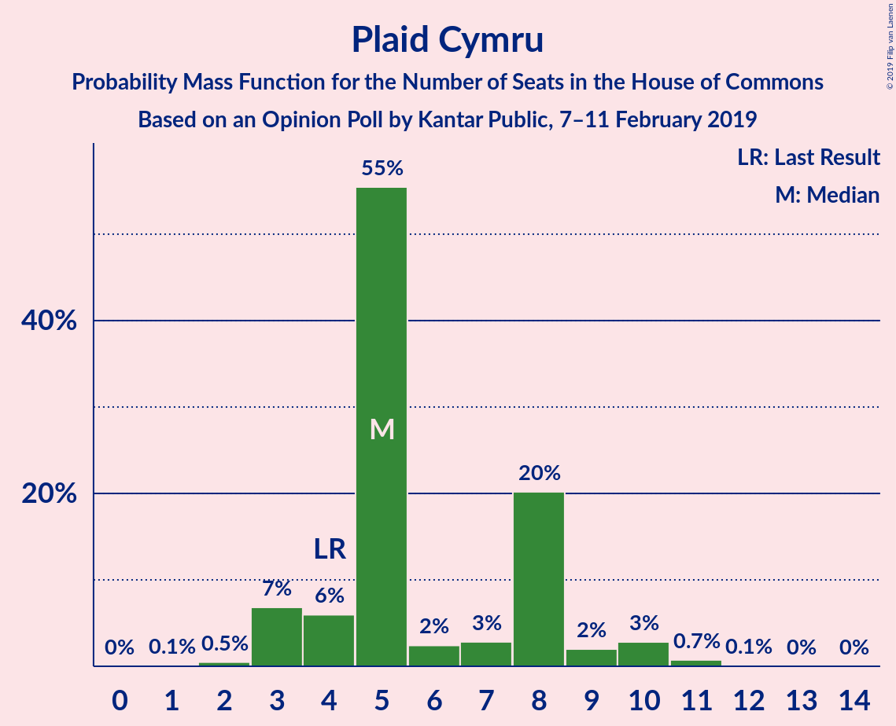

| Number of Seats | Probability | Accumulated | Special Marks |
|:---------------:|:-----------:|:-----------:|:-------------:|
| 1 | 0.1% | 100% |  |
| 2 | 0.5% | 99.9% |  |
| 3 | 7% | 99.4% |  |
| 4 | 6% | 93% | Last Result |
| 5 | 55% | 87% | Median |
| 6 | 2% | 31% |  |
| 7 | 3% | 29% |  |
| 8 | 20% | 26% |  |
| 9 | 2% | 6% |  |
| 10 | 3% | 4% |  |
| 11 | 0.7% | 0.9% |  |
| 12 | 0.1% | 0.2% |  |
| 13 | 0% | 0.1% |  |
| 14 | 0% | 0% |  |

## Coalitions

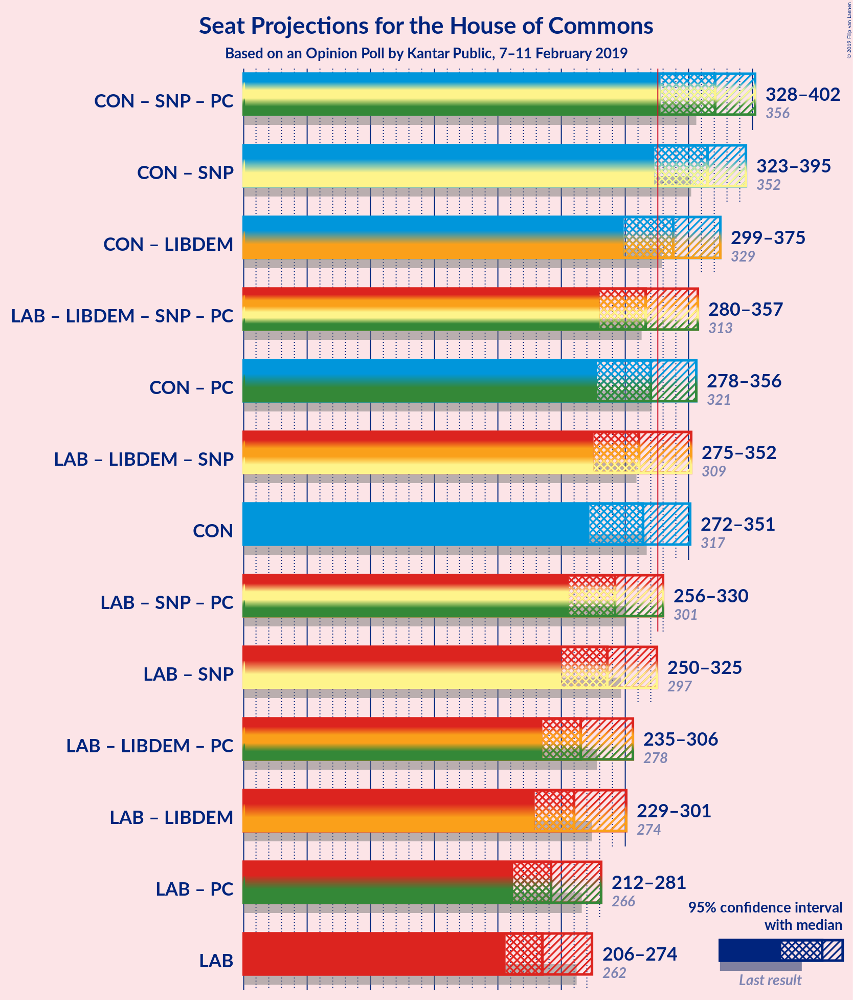

### Confidence Intervals

| Coalition | Last Result | Median | Majority? | 80% Confidence Interval | 90% Confidence Interval | 95% Confidence Interval | 99% Confidence Interval |
|:---------:|:-----------:|:------:|:---------:|:-----------------------:|:-----------------------:|:-----------------------:|:-----------------------:|
| Conservative Party – Scottish National Party – Plaid Cymru | 356 | 371 | 98% | 351–390 | 339–398 | 328–402 | 315–410 |
| Conservative Party – Scottish National Party | 352 | 365 | 97% | 345–384 | 335–392 | 323–395 | 310–404 |
| Conservative Party – Liberal Democrats | 329 | 338 | 84% | 321–361 | 310–369 | 299–375 | 285–381 |
| Labour Party – Liberal Democrats – Scottish National Party – Plaid Cymru | 313 | 316 | 26% | 291–338 | 285–348 | 280–357 | 270–371 |
| Conservative Party – Plaid Cymru | 321 | 320 | 37% | 299–345 | 288–352 | 278–356 | 264–367 |
| Labour Party – Liberal Democrats – Scottish National Party | 309 | 311 | 17% | 286–331 | 279–343 | 275–352 | 264–366 |
| Conservative Party | 317 | 314 | 24% | 293–339 | 282–345 | 272–351 | 259–361 |
| Labour Party – Scottish National Party – Plaid Cymru | 301 | 292 | 4% | 270–310 | 262–320 | 256–330 | 250–345 |
| Labour Party – Scottish National Party | 297 | 286 | 2% | 263–304 | 256–315 | 250–325 | 242–340 |
| Labour Party – Liberal Democrats – Plaid Cymru | 278 | 265 | 0.1% | 246–286 | 238–296 | 235–306 | 227–320 |
| Labour Party – Liberal Democrats | 274 | 260 | 0% | 240–280 | 233–292 | 229–301 | 221–315 |
| Labour Party – Plaid Cymru | 266 | 242 | 0% | 222–257 | 218–268 | 212–281 | 209–294 |
| Labour Party | 262 | 235 | 0% | 215–252 | 211–263 | 206–274 | 200–288 |

### Conservative Party – Scottish National Party – Plaid Cymru

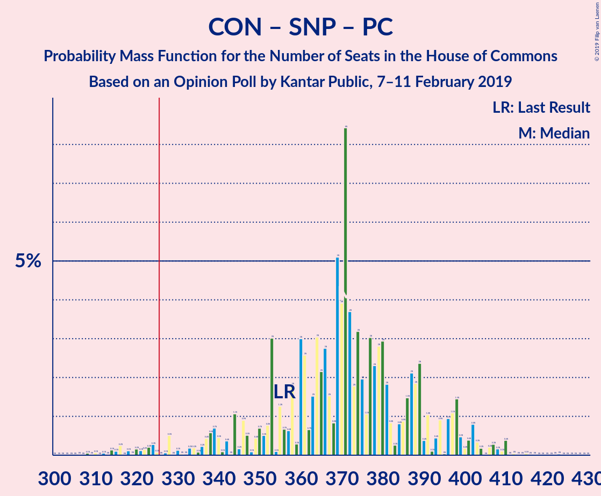

| Number of Seats | Probability | Accumulated | Special Marks |
|:---------------:|:-----------:|:-----------:|:-------------:|
| 306 | 0% | 100% |  |
| 307 | 0% | 99.9% |  |
| 308 | 0.1% | 99.9% |  |
| 309 | 0% | 99.9% |  |
| 310 | 0.1% | 99.9% |  |
| 311 | 0% | 99.8% |  |
| 312 | 0.1% | 99.8% |  |
| 313 | 0% | 99.7% |  |
| 314 | 0.1% | 99.7% |  |
| 315 | 0.1% | 99.6% |  |
| 316 | 0.2% | 99.5% |  |
| 317 | 0% | 99.2% |  |
| 318 | 0.1% | 99.2% |  |
| 319 | 0% | 99.1% |  |
| 320 | 0.2% | 99.1% |  |
| 321 | 0.1% | 98.9% |  |
| 322 | 0.2% | 98.8% |  |
| 323 | 0.2% | 98.6% |  |
| 324 | 0.3% | 98% |  |
| 325 | 0.1% | 98% |  |
| 326 | 0% | 98% | Majority |
| 327 | 0.1% | 98% |  |
| 328 | 0.5% | 98% |  |
| 329 | 0% | 97% |  |
| 330 | 0.1% | 97% |  |
| 331 | 0% | 97% |  |
| 332 | 0% | 97% |  |
| 333 | 0.2% | 97% |  |
| 334 | 0.2% | 97% |  |
| 335 | 0.1% | 97% |  |
| 336 | 0.2% | 97% |  |
| 337 | 0.4% | 97% |  |
| 338 | 0.6% | 96% |  |
| 339 | 0.7% | 96% |  |
| 340 | 0.5% | 95% |  |
| 341 | 0.1% | 94% |  |
| 342 | 0.4% | 94% |  |
| 343 | 0% | 94% |  |
| 344 | 1.1% | 94% |  |
| 345 | 0.2% | 93% |  |
| 346 | 0.9% | 93% |  |
| 347 | 0.5% | 92% |  |
| 348 | 0.1% | 91% |  |
| 349 | 0.4% | 91% |  |
| 350 | 0.7% | 91% |  |
| 351 | 0.5% | 90% |  |
| 352 | 0.8% | 90% |  |
| 353 | 3% | 89% |  |
| 354 | 0.1% | 86% |  |
| 355 | 1.3% | 86% |  |
| 356 | 0.7% | 84% | Last Result |
| 357 | 0.6% | 84% |  |
| 358 | 2% | 83% |  |
| 359 | 0.3% | 81% |  |
| 360 | 3% | 81% |  |
| 361 | 3% | 78% |  |
| 362 | 0.7% | 75% |  |
| 363 | 2% | 75% |  |
| 364 | 3% | 73% |  |
| 365 | 2% | 70% |  |
| 366 | 3% | 68% |  |
| 367 | 2% | 65% |  |
| 368 | 0.8% | 64% |  |
| 369 | 5% | 63% |  |
| 370 | 4% | 58% |  |
| 371 | 8% | 54% | Median |
| 372 | 4% | 45% |  |
| 373 | 2% | 42% |  |
| 374 | 3% | 40% |  |
| 375 | 2% | 37% |  |
| 376 | 1.1% | 35% |  |
| 377 | 3% | 34% |  |
| 378 | 2% | 31% |  |
| 379 | 3% | 28% |  |
| 380 | 3% | 26% |  |
| 381 | 2% | 23% |  |
| 382 | 0.8% | 21% |  |
| 383 | 0.3% | 20% |  |
| 384 | 0.8% | 20% |  |
| 385 | 0.9% | 19% |  |
| 386 | 1.5% | 18% |  |
| 387 | 2% | 17% |  |
| 388 | 2% | 14% |  |
| 389 | 2% | 13% |  |
| 390 | 0.4% | 10% |  |
| 391 | 1.0% | 10% |  |
| 392 | 0.1% | 9% |  |
| 393 | 0.4% | 9% |  |
| 394 | 0.9% | 8% |  |
| 395 | 0% | 7% |  |
| 396 | 0.9% | 7% |  |
| 397 | 1.1% | 6% |  |
| 398 | 1.5% | 5% |  |
| 399 | 0.5% | 4% |  |
| 400 | 0.2% | 3% |  |
| 401 | 0.4% | 3% |  |
| 402 | 0.8% | 3% |  |
| 403 | 0.3% | 2% |  |
| 404 | 0.2% | 2% |  |
| 405 | 0% | 1.5% |  |
| 406 | 0.2% | 1.5% |  |
| 407 | 0.3% | 1.3% |  |
| 408 | 0.2% | 1.0% |  |
| 409 | 0.1% | 0.8% |  |
| 410 | 0.4% | 0.7% |  |
| 411 | 0% | 0.3% |  |
| 412 | 0% | 0.3% |  |
| 413 | 0% | 0.3% |  |
| 414 | 0% | 0.2% |  |
| 415 | 0.1% | 0.2% |  |
| 416 | 0% | 0.2% |  |
| 417 | 0% | 0.1% |  |
| 418 | 0% | 0.1% |  |
| 419 | 0% | 0.1% |  |
| 420 | 0% | 0.1% |  |
| 421 | 0% | 0.1% |  |
| 422 | 0% | 0.1% |  |
| 423 | 0% | 0.1% |  |
| 424 | 0% | 0% |  |

### Conservative Party – Scottish National Party

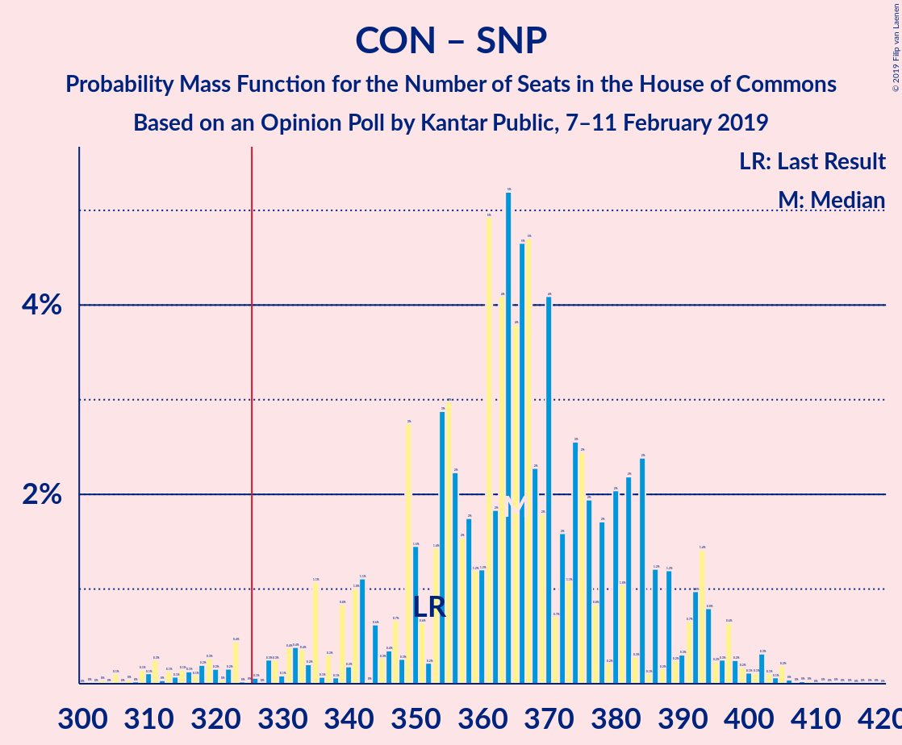

| Number of Seats | Probability | Accumulated | Special Marks |
|:---------------:|:-----------:|:-----------:|:-------------:|
| 302 | 0% | 100% |  |
| 303 | 0% | 99.9% |  |
| 304 | 0% | 99.9% |  |
| 305 | 0.1% | 99.9% |  |
| 306 | 0% | 99.8% |  |
| 307 | 0% | 99.8% |  |
| 308 | 0% | 99.7% |  |
| 309 | 0.1% | 99.7% |  |
| 310 | 0.1% | 99.6% |  |
| 311 | 0.3% | 99.5% |  |
| 312 | 0% | 99.2% |  |
| 313 | 0.1% | 99.2% |  |
| 314 | 0.1% | 99.0% |  |
| 315 | 0.1% | 99.0% |  |
| 316 | 0.1% | 98.8% |  |
| 317 | 0.1% | 98.7% |  |
| 318 | 0.2% | 98.6% |  |
| 319 | 0.3% | 98% |  |
| 320 | 0.2% | 98% |  |
| 321 | 0% | 98% |  |
| 322 | 0.2% | 98% |  |
| 323 | 0.4% | 98% |  |
| 324 | 0% | 97% |  |
| 325 | 0% | 97% |  |
| 326 | 0.1% | 97% | Majority |
| 327 | 0% | 97% |  |
| 328 | 0.3% | 97% |  |
| 329 | 0.3% | 97% |  |
| 330 | 0.1% | 97% |  |
| 331 | 0.4% | 97% |  |
| 332 | 0.4% | 96% |  |
| 333 | 0.4% | 96% |  |
| 334 | 0.2% | 96% |  |
| 335 | 1.1% | 95% |  |
| 336 | 0.1% | 94% |  |
| 337 | 0.3% | 94% |  |
| 338 | 0.1% | 94% |  |
| 339 | 0.8% | 94% |  |
| 340 | 0.2% | 93% |  |
| 341 | 1.0% | 93% |  |
| 342 | 1.1% | 92% |  |
| 343 | 0% | 91% |  |
| 344 | 0.6% | 91% |  |
| 345 | 0.3% | 90% |  |
| 346 | 0.4% | 90% |  |
| 347 | 0.7% | 89% |  |
| 348 | 0.3% | 89% |  |
| 349 | 3% | 88% |  |
| 350 | 1.5% | 86% |  |
| 351 | 0.6% | 84% |  |
| 352 | 0.2% | 84% | Last Result |
| 353 | 1.4% | 83% |  |
| 354 | 3% | 82% |  |
| 355 | 3% | 79% |  |
| 356 | 2% | 76% |  |
| 357 | 2% | 74% |  |
| 358 | 2% | 72% |  |
| 359 | 1.2% | 71% |  |
| 360 | 1.2% | 69% |  |
| 361 | 5% | 68% |  |
| 362 | 2% | 63% |  |
| 363 | 4% | 61% |  |
| 364 | 5% | 57% |  |
| 365 | 4% | 52% |  |
| 366 | 5% | 48% | Median |
| 367 | 5% | 44% |  |
| 368 | 2% | 39% |  |
| 369 | 2% | 37% |  |
| 370 | 4% | 35% |  |
| 371 | 0.7% | 31% |  |
| 372 | 2% | 30% |  |
| 373 | 1.1% | 29% |  |
| 374 | 3% | 27% |  |
| 375 | 2% | 25% |  |
| 376 | 2% | 22% |  |
| 377 | 0.8% | 20% |  |
| 378 | 2% | 20% |  |
| 379 | 0.2% | 18% |  |
| 380 | 2% | 18% |  |
| 381 | 1.0% | 16% |  |
| 382 | 2% | 15% |  |
| 383 | 0.3% | 12% |  |
| 384 | 2% | 12% |  |
| 385 | 0.1% | 10% |  |
| 386 | 1.2% | 10% |  |
| 387 | 0.2% | 8% |  |
| 388 | 1.2% | 8% |  |
| 389 | 0.2% | 7% |  |
| 390 | 0.3% | 7% |  |
| 391 | 0.7% | 7% |  |
| 392 | 1.0% | 6% |  |
| 393 | 1.4% | 5% |  |
| 394 | 0.8% | 4% |  |
| 395 | 0.2% | 3% |  |
| 396 | 0.3% | 2% |  |
| 397 | 0.6% | 2% |  |
| 398 | 0.2% | 2% |  |
| 399 | 0.2% | 1.3% |  |
| 400 | 0.1% | 1.2% |  |
| 401 | 0.1% | 1.1% |  |
| 402 | 0.3% | 0.9% |  |
| 403 | 0.1% | 0.6% |  |
| 404 | 0.1% | 0.5% |  |
| 405 | 0.2% | 0.5% |  |
| 406 | 0% | 0.3% |  |
| 407 | 0% | 0.2% |  |
| 408 | 0% | 0.2% |  |
| 409 | 0% | 0.2% |  |
| 410 | 0% | 0.2% |  |
| 411 | 0% | 0.1% |  |
| 412 | 0% | 0.1% |  |
| 413 | 0% | 0.1% |  |
| 414 | 0% | 0.1% |  |
| 415 | 0% | 0.1% |  |
| 416 | 0% | 0.1% |  |
| 417 | 0% | 0.1% |  |
| 418 | 0% | 0.1% |  |
| 419 | 0% | 0% |  |

### Conservative Party – Liberal Democrats

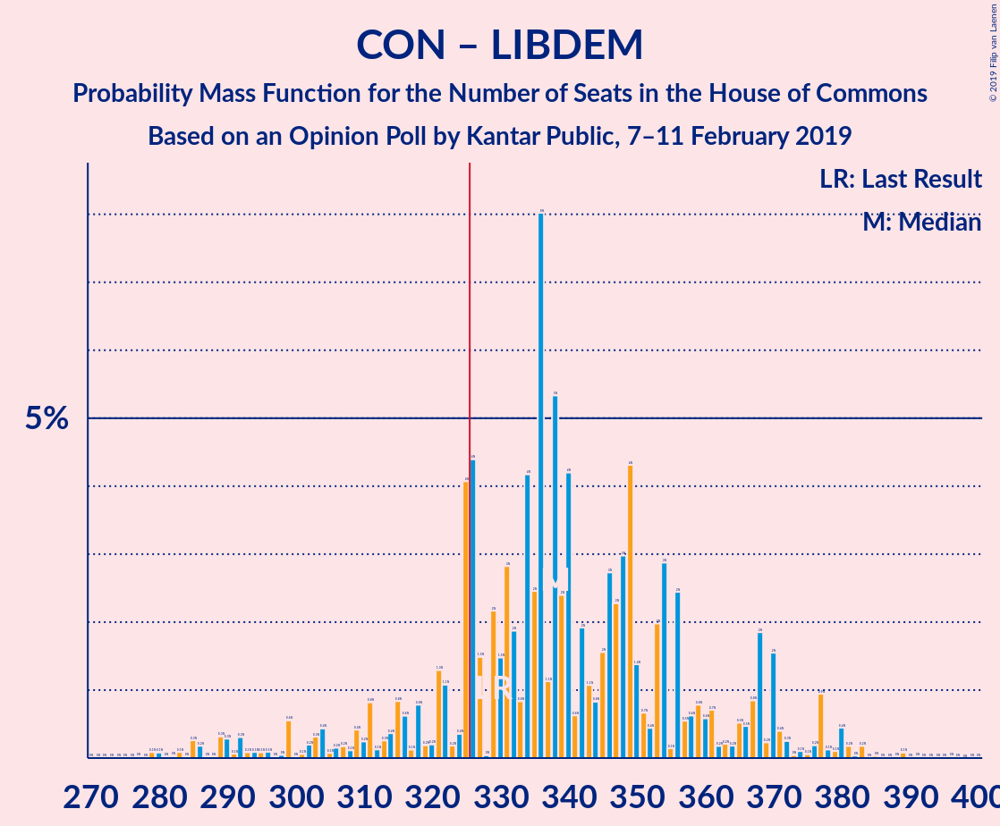

| Number of Seats | Probability | Accumulated | Special Marks |
|:---------------:|:-----------:|:-----------:|:-------------:|
| 279 | 0.1% | 100% |  |
| 280 | 0.1% | 99.9% |  |
| 281 | 0% | 99.8% |  |
| 282 | 0% | 99.8% |  |
| 283 | 0.1% | 99.7% |  |
| 284 | 0% | 99.7% |  |
| 285 | 0.3% | 99.6% |  |
| 286 | 0.2% | 99.4% |  |
| 287 | 0% | 99.2% |  |
| 288 | 0% | 99.2% |  |
| 289 | 0.3% | 99.1% |  |
| 290 | 0.3% | 98.8% |  |
| 291 | 0.1% | 98.5% |  |
| 292 | 0.3% | 98% |  |
| 293 | 0.1% | 98% |  |
| 294 | 0.1% | 98% |  |
| 295 | 0.1% | 98% |  |
| 296 | 0.1% | 98% |  |
| 297 | 0% | 98% |  |
| 298 | 0% | 98% |  |
| 299 | 0.6% | 98% |  |
| 300 | 0% | 97% |  |
| 301 | 0.1% | 97% |  |
| 302 | 0.2% | 97% |  |
| 303 | 0.3% | 97% |  |
| 304 | 0.4% | 97% |  |
| 305 | 0.1% | 96% |  |
| 306 | 0.2% | 96% |  |
| 307 | 0.2% | 96% |  |
| 308 | 0.1% | 96% |  |
| 309 | 0.4% | 96% |  |
| 310 | 0.2% | 95% |  |
| 311 | 0.8% | 95% |  |
| 312 | 0.1% | 94% |  |
| 313 | 0.3% | 94% |  |
| 314 | 0.4% | 94% |  |
| 315 | 0.8% | 93% |  |
| 316 | 0.6% | 93% |  |
| 317 | 0.1% | 92% |  |
| 318 | 0.8% | 92% |  |
| 319 | 0.2% | 91% |  |
| 320 | 0.2% | 91% |  |
| 321 | 1.3% | 91% |  |
| 322 | 1.1% | 89% |  |
| 323 | 0.2% | 88% |  |
| 324 | 0.4% | 88% |  |
| 325 | 4% | 88% |  |
| 326 | 4% | 84% | Majority |
| 327 | 1.5% | 79% |  |
| 328 | 0% | 78% |  |
| 329 | 2% | 78% | Last Result |
| 330 | 1.5% | 76% |  |
| 331 | 3% | 74% |  |
| 332 | 2% | 71% |  |
| 333 | 0.8% | 69% |  |
| 334 | 4% | 69% |  |
| 335 | 2% | 64% |  |
| 336 | 8% | 62% |  |
| 337 | 1.1% | 54% |  |
| 338 | 5% | 53% |  |
| 339 | 2% | 47% | Median |
| 340 | 4% | 45% |  |
| 341 | 0.6% | 41% |  |
| 342 | 2% | 40% |  |
| 343 | 1.1% | 38% |  |
| 344 | 0.8% | 37% |  |
| 345 | 2% | 36% |  |
| 346 | 3% | 35% |  |
| 347 | 2% | 32% |  |
| 348 | 3% | 30% |  |
| 349 | 4% | 27% |  |
| 350 | 1.4% | 23% |  |
| 351 | 0.7% | 21% |  |
| 352 | 0.4% | 21% |  |
| 353 | 2% | 20% |  |
| 354 | 3% | 18% |  |
| 355 | 0.1% | 15% |  |
| 356 | 2% | 15% |  |
| 357 | 0.5% | 13% |  |
| 358 | 0.6% | 12% |  |
| 359 | 0.8% | 11% |  |
| 360 | 0.6% | 11% |  |
| 361 | 0.7% | 10% |  |
| 362 | 0.2% | 9% |  |
| 363 | 0.2% | 9% |  |
| 364 | 0.2% | 9% |  |
| 365 | 0.5% | 9% |  |
| 366 | 0.5% | 8% |  |
| 367 | 0.8% | 8% |  |
| 368 | 2% | 7% |  |
| 369 | 0.2% | 5% |  |
| 370 | 2% | 5% |  |
| 371 | 0.4% | 3% |  |
| 372 | 0.3% | 3% |  |
| 373 | 0% | 3% |  |
| 374 | 0.1% | 3% |  |
| 375 | 0.1% | 3% |  |
| 376 | 0.2% | 2% |  |
| 377 | 0.9% | 2% |  |
| 378 | 0.1% | 1.3% |  |
| 379 | 0.1% | 1.2% |  |
| 380 | 0.4% | 1.1% |  |
| 381 | 0.2% | 0.7% |  |
| 382 | 0% | 0.5% |  |
| 383 | 0.2% | 0.4% |  |
| 384 | 0% | 0.3% |  |
| 385 | 0% | 0.3% |  |
| 386 | 0% | 0.2% |  |
| 387 | 0% | 0.2% |  |
| 388 | 0% | 0.2% |  |
| 389 | 0.1% | 0.2% |  |
| 390 | 0% | 0.1% |  |
| 391 | 0% | 0.1% |  |
| 392 | 0% | 0.1% |  |
| 393 | 0% | 0.1% |  |
| 394 | 0% | 0.1% |  |
| 395 | 0% | 0.1% |  |
| 396 | 0% | 0% |  |

### Labour Party – Liberal Democrats – Scottish National Party – Plaid Cymru

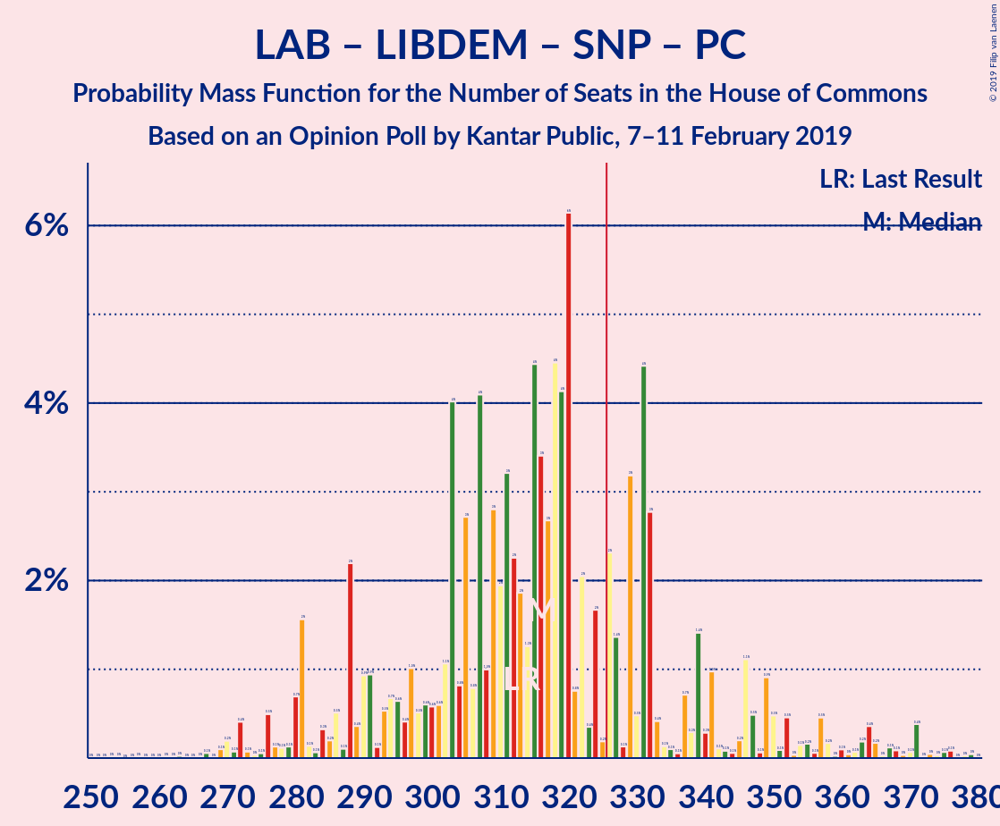

| Number of Seats | Probability | Accumulated | Special Marks |
|:---------------:|:-----------:|:-----------:|:-------------:|
| 257 | 0% | 100% |  |
| 258 | 0% | 99.9% |  |
| 259 | 0% | 99.9% |  |
| 260 | 0% | 99.9% |  |
| 261 | 0% | 99.9% |  |
| 262 | 0% | 99.9% |  |
| 263 | 0% | 99.9% |  |
| 264 | 0% | 99.9% |  |
| 265 | 0% | 99.9% |  |
| 266 | 0% | 99.9% |  |
| 267 | 0.1% | 99.8% |  |
| 268 | 0% | 99.8% |  |
| 269 | 0.1% | 99.8% |  |
| 270 | 0.2% | 99.7% |  |
| 271 | 0.1% | 99.5% |  |
| 272 | 0.4% | 99.4% |  |
| 273 | 0.1% | 99.0% |  |
| 274 | 0% | 98.9% |  |
| 275 | 0.1% | 98.9% |  |
| 276 | 0.5% | 98.8% |  |
| 277 | 0.1% | 98% |  |
| 278 | 0.1% | 98% |  |
| 279 | 0.1% | 98% |  |
| 280 | 0.7% | 98% |  |
| 281 | 2% | 97% |  |
| 282 | 0.1% | 96% |  |
| 283 | 0.1% | 96% |  |
| 284 | 0.3% | 96% |  |
| 285 | 0.2% | 95% |  |
| 286 | 0.5% | 95% |  |
| 287 | 0.1% | 94% |  |
| 288 | 2% | 94% |  |
| 289 | 0.4% | 92% |  |
| 290 | 0.9% | 92% |  |
| 291 | 0.9% | 91% |  |
| 292 | 0.1% | 90% |  |
| 293 | 0.5% | 90% |  |
| 294 | 0.7% | 89% |  |
| 295 | 0.6% | 89% |  |
| 296 | 0.4% | 88% |  |
| 297 | 1.0% | 88% |  |
| 298 | 0.5% | 87% |  |
| 299 | 0.6% | 86% |  |
| 300 | 0.6% | 85% |  |
| 301 | 0.6% | 85% |  |
| 302 | 1.1% | 84% |  |
| 303 | 4% | 83% |  |
| 304 | 0.8% | 79% |  |
| 305 | 3% | 78% |  |
| 306 | 0.8% | 76% |  |
| 307 | 4% | 75% |  |
| 308 | 1.0% | 71% |  |
| 309 | 3% | 70% |  |
| 310 | 2% | 67% |  |
| 311 | 3% | 65% |  |
| 312 | 2% | 62% |  |
| 313 | 2% | 60% | Last Result |
| 314 | 1.3% | 58% |  |
| 315 | 4% | 56% |  |
| 316 | 3% | 52% |  |
| 317 | 3% | 49% | Median |
| 318 | 4% | 46% |  |
| 319 | 4% | 41% |  |
| 320 | 6% | 37% |  |
| 321 | 0.8% | 31% |  |
| 322 | 2% | 30% |  |
| 323 | 0.4% | 28% |  |
| 324 | 2% | 28% |  |
| 325 | 0.2% | 26% |  |
| 326 | 2% | 26% | Majority |
| 327 | 1.4% | 24% |  |
| 328 | 0.1% | 22% |  |
| 329 | 3% | 22% |  |
| 330 | 0.5% | 19% |  |
| 331 | 4% | 19% |  |
| 332 | 3% | 14% |  |
| 333 | 0.4% | 11% |  |
| 334 | 0.1% | 11% |  |
| 335 | 0.1% | 11% |  |
| 336 | 0.1% | 11% |  |
| 337 | 0.7% | 11% |  |
| 338 | 0.3% | 10% |  |
| 339 | 1.4% | 10% |  |
| 340 | 0.3% | 8% |  |
| 341 | 1.0% | 8% |  |
| 342 | 0.1% | 7% |  |
| 343 | 0.1% | 7% |  |
| 344 | 0.1% | 7% |  |
| 345 | 0.2% | 7% |  |
| 346 | 1.1% | 7% |  |
| 347 | 0.5% | 6% |  |
| 348 | 0.1% | 5% |  |
| 349 | 0.9% | 5% |  |
| 350 | 0.5% | 4% |  |
| 351 | 0.1% | 4% |  |
| 352 | 0.5% | 4% |  |
| 353 | 0% | 3% |  |
| 354 | 0.1% | 3% |  |
| 355 | 0.2% | 3% |  |
| 356 | 0.1% | 3% |  |
| 357 | 0.5% | 3% |  |
| 358 | 0.2% | 2% |  |
| 359 | 0% | 2% |  |
| 360 | 0.1% | 2% |  |
| 361 | 0% | 2% |  |
| 362 | 0.1% | 2% |  |
| 363 | 0.2% | 2% |  |
| 364 | 0.4% | 2% |  |
| 365 | 0.2% | 1.3% |  |
| 366 | 0% | 1.1% |  |
| 367 | 0.1% | 1.1% |  |
| 368 | 0.1% | 0.9% |  |
| 369 | 0% | 0.8% |  |
| 370 | 0.1% | 0.8% |  |
| 371 | 0.4% | 0.7% |  |
| 372 | 0% | 0.4% |  |
| 373 | 0% | 0.4% |  |
| 374 | 0% | 0.3% |  |
| 375 | 0.1% | 0.3% |  |
| 376 | 0.1% | 0.2% |  |
| 377 | 0% | 0.1% |  |
| 378 | 0% | 0.1% |  |
| 379 | 0% | 0.1% |  |
| 380 | 0% | 0% |  |

### Conservative Party – Plaid Cymru

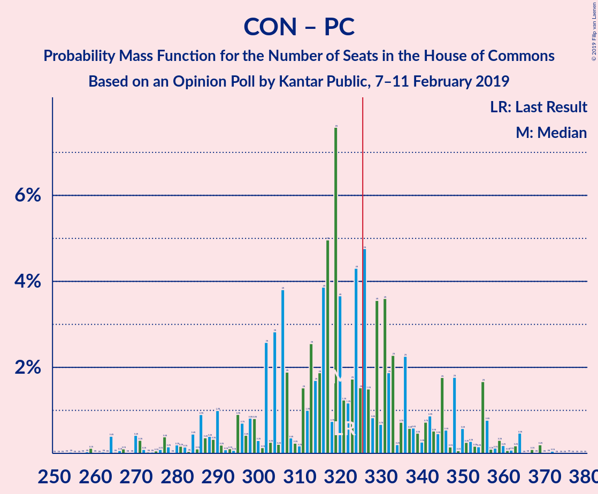

| Number of Seats | Probability | Accumulated | Special Marks |
|:---------------:|:-----------:|:-----------:|:-------------:|
| 254 | 0% | 100% |  |
| 255 | 0% | 99.9% |  |
| 256 | 0% | 99.9% |  |
| 257 | 0% | 99.9% |  |
| 258 | 0% | 99.9% |  |
| 259 | 0.1% | 99.9% |  |
| 260 | 0% | 99.7% |  |
| 261 | 0% | 99.7% |  |
| 262 | 0% | 99.7% |  |
| 263 | 0% | 99.7% |  |
| 264 | 0.4% | 99.7% |  |
| 265 | 0% | 99.3% |  |
| 266 | 0.1% | 99.2% |  |
| 267 | 0.1% | 99.2% |  |
| 268 | 0% | 99.1% |  |
| 269 | 0% | 99.0% |  |
| 270 | 0.4% | 99.0% |  |
| 271 | 0.3% | 98.6% |  |
| 272 | 0.1% | 98% |  |
| 273 | 0% | 98% |  |
| 274 | 0% | 98% |  |
| 275 | 0.1% | 98% |  |
| 276 | 0.1% | 98% |  |
| 277 | 0.4% | 98% |  |
| 278 | 0.2% | 98% |  |
| 279 | 0% | 97% |  |
| 280 | 0.2% | 97% |  |
| 281 | 0.2% | 97% |  |
| 282 | 0.1% | 97% |  |
| 283 | 0% | 97% |  |
| 284 | 0.4% | 97% |  |
| 285 | 0.1% | 96% |  |
| 286 | 0.9% | 96% |  |
| 287 | 0.4% | 95% |  |
| 288 | 0.4% | 95% |  |
| 289 | 0.3% | 95% |  |
| 290 | 1.0% | 94% |  |
| 291 | 0.2% | 93% |  |
| 292 | 0.1% | 93% |  |
| 293 | 0.1% | 93% |  |
| 294 | 0.1% | 93% |  |
| 295 | 0.9% | 93% |  |
| 296 | 0.7% | 92% |  |
| 297 | 0.4% | 91% |  |
| 298 | 0.8% | 91% |  |
| 299 | 0.8% | 90% |  |
| 300 | 0.3% | 89% |  |
| 301 | 0.1% | 89% |  |
| 302 | 3% | 89% |  |
| 303 | 0.3% | 86% |  |
| 304 | 3% | 86% |  |
| 305 | 0.2% | 83% |  |
| 306 | 4% | 83% |  |
| 307 | 2% | 79% |  |
| 308 | 0.4% | 77% |  |
| 309 | 0.2% | 77% |  |
| 310 | 0.2% | 77% |  |
| 311 | 2% | 76% |  |
| 312 | 1.0% | 75% |  |
| 313 | 3% | 74% |  |
| 314 | 2% | 71% |  |
| 315 | 2% | 70% |  |
| 316 | 4% | 68% |  |
| 317 | 5% | 64% |  |
| 318 | 0.7% | 59% |  |
| 319 | 8% | 58% | Median |
| 320 | 4% | 51% |  |
| 321 | 1.2% | 47% | Last Result |
| 322 | 1.2% | 46% |  |
| 323 | 2% | 45% |  |
| 324 | 4% | 43% |  |
| 325 | 2% | 39% |  |
| 326 | 5% | 37% | Majority |
| 327 | 1.5% | 32% |  |
| 328 | 0.8% | 31% |  |
| 329 | 4% | 30% |  |
| 330 | 0.7% | 26% |  |
| 331 | 4% | 26% |  |
| 332 | 2% | 22% |  |
| 333 | 2% | 20% |  |
| 334 | 0.2% | 18% |  |
| 335 | 0.7% | 18% |  |
| 336 | 2% | 17% |  |
| 337 | 0.6% | 15% |  |
| 338 | 0.6% | 14% |  |
| 339 | 0.5% | 14% |  |
| 340 | 0.3% | 13% |  |
| 341 | 0.7% | 13% |  |
| 342 | 0.9% | 12% |  |
| 343 | 0.5% | 11% |  |
| 344 | 0.5% | 11% |  |
| 345 | 2% | 10% |  |
| 346 | 0.5% | 8% |  |
| 347 | 0.1% | 8% |  |
| 348 | 2% | 8% |  |
| 349 | 0.1% | 6% |  |
| 350 | 0.6% | 6% |  |
| 351 | 0.3% | 5% |  |
| 352 | 0.3% | 5% |  |
| 353 | 0.2% | 5% |  |
| 354 | 0.2% | 5% |  |
| 355 | 2% | 4% |  |
| 356 | 0.8% | 3% |  |
| 357 | 0.1% | 2% |  |
| 358 | 0.1% | 2% |  |
| 359 | 0.3% | 2% |  |
| 360 | 0.2% | 2% |  |
| 361 | 0.1% | 1.3% |  |
| 362 | 0.1% | 1.3% |  |
| 363 | 0.2% | 1.2% |  |
| 364 | 0.5% | 1.0% |  |
| 365 | 0% | 0.6% |  |
| 366 | 0% | 0.5% |  |
| 367 | 0.1% | 0.5% |  |
| 368 | 0% | 0.4% |  |
| 369 | 0.2% | 0.4% |  |
| 370 | 0% | 0.2% |  |
| 371 | 0% | 0.2% |  |
| 372 | 0.1% | 0.2% |  |
| 373 | 0% | 0.1% |  |
| 374 | 0% | 0.1% |  |
| 375 | 0% | 0.1% |  |
| 376 | 0% | 0.1% |  |
| 377 | 0% | 0.1% |  |
| 378 | 0% | 0.1% |  |
| 379 | 0% | 0.1% |  |
| 380 | 0% | 0% |  |

### Labour Party – Liberal Democrats – Scottish National Party

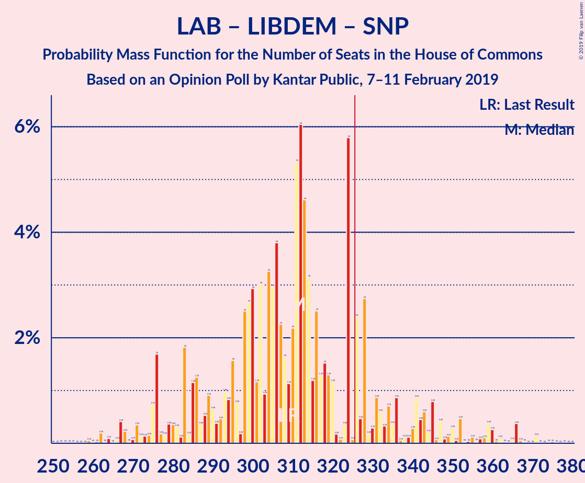

| Number of Seats | Probability | Accumulated | Special Marks |
|:---------------:|:-----------:|:-----------:|:-------------:|
| 252 | 0% | 100% |  |
| 253 | 0% | 99.9% |  |
| 254 | 0% | 99.9% |  |
| 255 | 0% | 99.9% |  |
| 256 | 0% | 99.9% |  |
| 257 | 0% | 99.9% |  |
| 258 | 0% | 99.9% |  |
| 259 | 0.1% | 99.9% |  |
| 260 | 0% | 99.8% |  |
| 261 | 0% | 99.8% |  |
| 262 | 0.2% | 99.8% |  |
| 263 | 0% | 99.6% |  |
| 264 | 0.1% | 99.6% |  |
| 265 | 0% | 99.5% |  |
| 266 | 0.1% | 99.5% |  |
| 267 | 0.4% | 99.4% |  |
| 268 | 0.2% | 99.0% |  |
| 269 | 0% | 98.7% |  |
| 270 | 0.1% | 98.7% |  |
| 271 | 0.3% | 98.6% |  |
| 272 | 0.1% | 98% |  |
| 273 | 0.1% | 98% |  |
| 274 | 0.2% | 98% |  |
| 275 | 0.7% | 98% |  |
| 276 | 2% | 97% |  |
| 277 | 0.2% | 95% |  |
| 278 | 0.2% | 95% |  |
| 279 | 0.4% | 95% |  |
| 280 | 0.4% | 95% |  |
| 281 | 0.3% | 94% |  |
| 282 | 0.1% | 94% |  |
| 283 | 2% | 94% |  |
| 284 | 0.2% | 92% |  |
| 285 | 1.2% | 92% |  |
| 286 | 1.3% | 91% |  |
| 287 | 0.4% | 90% |  |
| 288 | 0.5% | 89% |  |
| 289 | 0.9% | 89% |  |
| 290 | 0.6% | 88% |  |
| 291 | 0.4% | 87% |  |
| 292 | 0.5% | 87% |  |
| 293 | 1.0% | 86% |  |
| 294 | 0.8% | 85% |  |
| 295 | 2% | 84% |  |
| 296 | 0.8% | 83% |  |
| 297 | 0.2% | 82% |  |
| 298 | 3% | 82% |  |
| 299 | 3% | 79% |  |
| 300 | 3% | 77% |  |
| 301 | 1.2% | 74% |  |
| 302 | 3% | 73% |  |
| 303 | 0.9% | 70% |  |
| 304 | 3% | 69% |  |
| 305 | 3% | 65% |  |
| 306 | 4% | 62% |  |
| 307 | 2% | 59% |  |
| 308 | 2% | 56% |  |
| 309 | 1.1% | 55% | Last Result |
| 310 | 2% | 54% |  |
| 311 | 5% | 51% |  |
| 312 | 6% | 46% | Median |
| 313 | 5% | 40% |  |
| 314 | 3% | 35% |  |
| 315 | 1.2% | 32% |  |
| 316 | 3% | 31% |  |
| 317 | 1.3% | 29% |  |
| 318 | 2% | 27% |  |
| 319 | 1.3% | 26% |  |
| 320 | 1.2% | 25% |  |
| 321 | 0.2% | 23% |  |
| 322 | 0.1% | 23% |  |
| 323 | 0.4% | 23% |  |
| 324 | 6% | 23% |  |
| 325 | 0.1% | 17% |  |
| 326 | 2% | 17% | Majority |
| 327 | 0.5% | 14% |  |
| 328 | 3% | 14% |  |
| 329 | 0.2% | 11% |  |
| 330 | 0.3% | 11% |  |
| 331 | 0.9% | 11% |  |
| 332 | 0.6% | 10% |  |
| 333 | 0.3% | 9% |  |
| 334 | 0.7% | 9% |  |
| 335 | 0.4% | 8% |  |
| 336 | 0.9% | 8% |  |
| 337 | 0.1% | 7% |  |
| 338 | 0.1% | 7% |  |
| 339 | 0.1% | 7% |  |
| 340 | 0.3% | 7% |  |
| 341 | 0.9% | 6% |  |
| 342 | 0.4% | 6% |  |
| 343 | 0.6% | 5% |  |
| 344 | 0.2% | 5% |  |
| 345 | 0.8% | 4% |  |
| 346 | 0.1% | 4% |  |
| 347 | 0.4% | 3% |  |
| 348 | 0.1% | 3% |  |
| 349 | 0.1% | 3% |  |
| 350 | 0.3% | 3% |  |
| 351 | 0.1% | 3% |  |
| 352 | 0.5% | 3% |  |
| 353 | 0% | 2% |  |
| 354 | 0% | 2% |  |
| 355 | 0.1% | 2% |  |
| 356 | 0% | 2% |  |
| 357 | 0.1% | 2% |  |
| 358 | 0.1% | 2% |  |
| 359 | 0.4% | 2% |  |
| 360 | 0.3% | 1.2% |  |
| 361 | 0% | 1.0% |  |
| 362 | 0.1% | 0.9% |  |
| 363 | 0% | 0.8% |  |
| 364 | 0% | 0.8% |  |
| 365 | 0.1% | 0.8% |  |
| 366 | 0.4% | 0.7% |  |
| 367 | 0.1% | 0.4% |  |
| 368 | 0% | 0.3% |  |
| 369 | 0% | 0.3% |  |
| 370 | 0% | 0.3% |  |
| 371 | 0.1% | 0.3% |  |
| 372 | 0% | 0.1% |  |
| 373 | 0% | 0.1% |  |
| 374 | 0% | 0.1% |  |
| 375 | 0% | 0.1% |  |
| 376 | 0% | 0.1% |  |
| 377 | 0% | 0% |  |

### Conservative Party

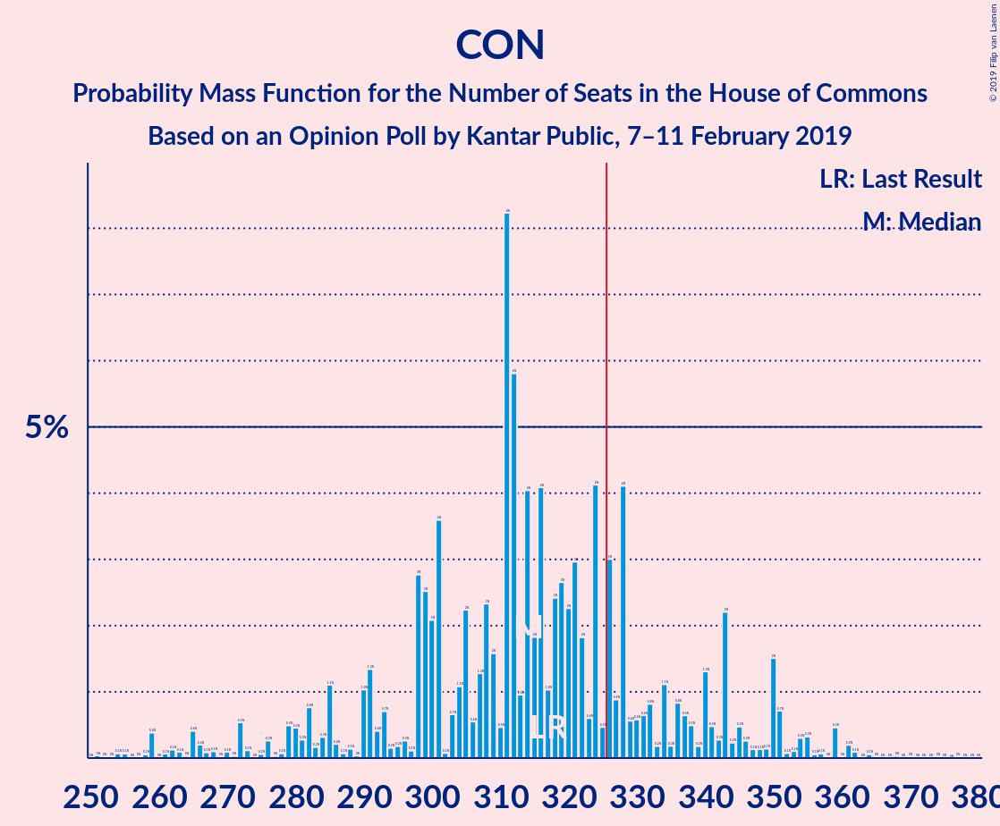

| Number of Seats | Probability | Accumulated | Special Marks |
|:---------------:|:-----------:|:-----------:|:-------------:|
| 251 | 0% | 100% |  |
| 252 | 0% | 99.9% |  |
| 253 | 0% | 99.9% |  |
| 254 | 0.1% | 99.9% |  |
| 255 | 0.1% | 99.8% |  |
| 256 | 0% | 99.7% |  |
| 257 | 0% | 99.7% |  |
| 258 | 0.1% | 99.7% |  |
| 259 | 0.4% | 99.6% |  |
| 260 | 0% | 99.3% |  |
| 261 | 0.1% | 99.2% |  |
| 262 | 0.1% | 99.2% |  |
| 263 | 0.1% | 99.0% |  |
| 264 | 0% | 99.0% |  |
| 265 | 0.4% | 98.9% |  |
| 266 | 0.2% | 98.5% |  |
| 267 | 0.1% | 98% |  |
| 268 | 0.1% | 98% |  |
| 269 | 0% | 98% |  |
| 270 | 0.1% | 98% |  |
| 271 | 0% | 98% |  |
| 272 | 0.5% | 98% |  |
| 273 | 0.1% | 97% |  |
| 274 | 0% | 97% |  |
| 275 | 0.1% | 97% |  |
| 276 | 0.3% | 97% |  |
| 277 | 0% | 97% |  |
| 278 | 0.1% | 97% |  |
| 279 | 0.5% | 97% |  |
| 280 | 0.5% | 96% |  |
| 281 | 0.3% | 96% |  |
| 282 | 0.8% | 96% |  |
| 283 | 0.2% | 95% |  |
| 284 | 0.3% | 95% |  |
| 285 | 1.1% | 94% |  |
| 286 | 0.2% | 93% |  |
| 287 | 0.1% | 93% |  |
| 288 | 0.1% | 93% |  |
| 289 | 0% | 93% |  |
| 290 | 1.0% | 93% |  |
| 291 | 1.3% | 92% |  |
| 292 | 0.4% | 90% |  |
| 293 | 0.7% | 90% |  |
| 294 | 0.2% | 89% |  |
| 295 | 0.2% | 89% |  |
| 296 | 0.3% | 89% |  |
| 297 | 0.1% | 89% |  |
| 298 | 3% | 89% |  |
| 299 | 3% | 86% |  |
| 300 | 2% | 83% |  |
| 301 | 4% | 81% |  |
| 302 | 0.1% | 78% |  |
| 303 | 0.7% | 78% |  |
| 304 | 1.1% | 77% |  |
| 305 | 2% | 76% |  |
| 306 | 0.6% | 74% |  |
| 307 | 1.3% | 73% |  |
| 308 | 2% | 72% |  |
| 309 | 2% | 69% |  |
| 310 | 0.5% | 68% |  |
| 311 | 8% | 67% |  |
| 312 | 6% | 59% |  |
| 313 | 1.0% | 53% |  |
| 314 | 4% | 52% | Median |
| 315 | 2% | 48% |  |
| 316 | 4% | 47% |  |
| 317 | 1.0% | 42% | Last Result |
| 318 | 2% | 41% |  |
| 319 | 3% | 39% |  |
| 320 | 2% | 36% |  |
| 321 | 3% | 34% |  |
| 322 | 2% | 31% |  |
| 323 | 0.6% | 29% |  |
| 324 | 4% | 29% |  |
| 325 | 0.5% | 25% |  |
| 326 | 3% | 24% | Majority |
| 327 | 0.9% | 21% |  |
| 328 | 4% | 20% |  |
| 329 | 0.6% | 16% |  |
| 330 | 0.6% | 16% |  |
| 331 | 0.6% | 15% |  |
| 332 | 0.8% | 14% |  |
| 333 | 0.2% | 13% |  |
| 334 | 1.1% | 13% |  |
| 335 | 0.2% | 12% |  |
| 336 | 0.8% | 12% |  |
| 337 | 0.6% | 11% |  |
| 338 | 0.5% | 10% |  |
| 339 | 0.2% | 10% |  |
| 340 | 1.3% | 10% |  |
| 341 | 0.5% | 9% |  |
| 342 | 0.3% | 8% |  |
| 343 | 2% | 8% |  |
| 344 | 0.2% | 6% |  |
| 345 | 0.5% | 5% |  |
| 346 | 0.3% | 5% |  |
| 347 | 0.1% | 5% |  |
| 348 | 0.1% | 4% |  |
| 349 | 0.1% | 4% |  |
| 350 | 2% | 4% |  |
| 351 | 0.7% | 3% |  |
| 352 | 0.1% | 2% |  |
| 353 | 0.1% | 2% |  |
| 354 | 0.3% | 2% |  |
| 355 | 0.3% | 1.5% |  |
| 356 | 0.1% | 1.1% |  |
| 357 | 0.1% | 1.1% |  |
| 358 | 0% | 1.0% |  |
| 359 | 0.5% | 1.0% |  |
| 360 | 0% | 0.5% |  |
| 361 | 0.2% | 0.5% |  |
| 362 | 0.1% | 0.3% |  |
| 363 | 0% | 0.2% |  |
| 364 | 0.1% | 0.2% |  |
| 365 | 0% | 0.2% |  |
| 366 | 0% | 0.1% |  |
| 367 | 0% | 0.1% |  |
| 368 | 0% | 0.1% |  |
| 369 | 0% | 0.1% |  |
| 370 | 0% | 0.1% |  |
| 371 | 0% | 0.1% |  |
| 372 | 0% | 0.1% |  |
| 373 | 0% | 0.1% |  |
| 374 | 0% | 0.1% |  |
| 375 | 0% | 0% |  |

### Labour Party – Scottish National Party – Plaid Cymru

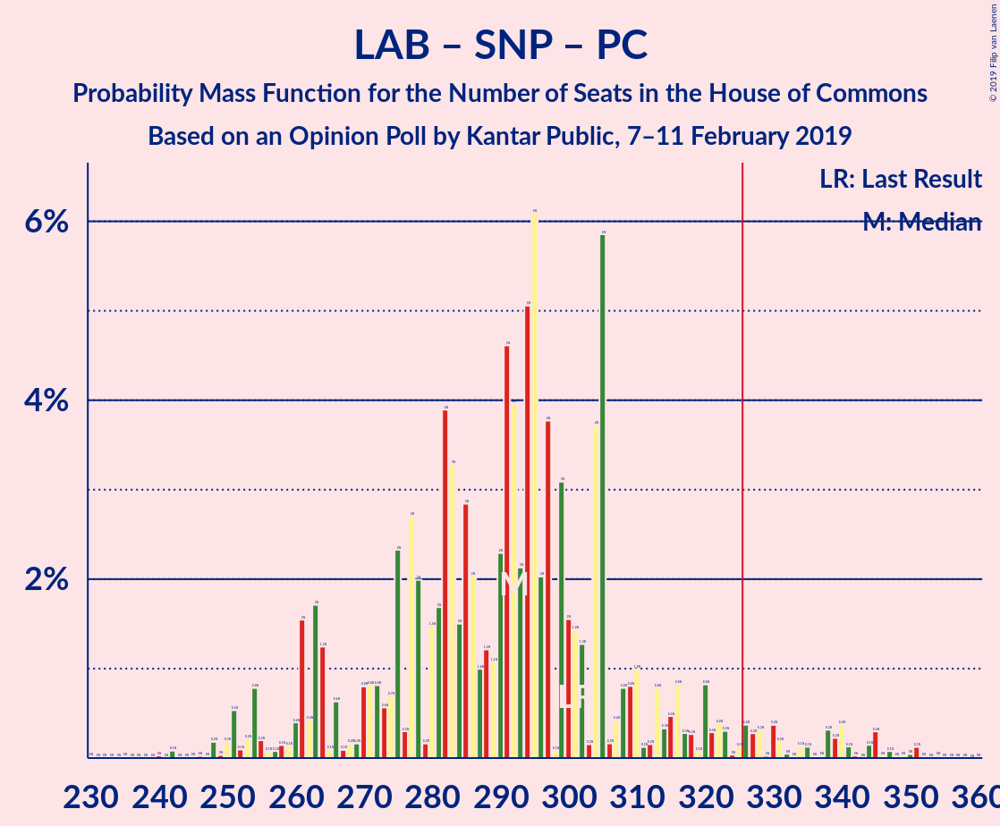

| Number of Seats | Probability | Accumulated | Special Marks |
|:---------------:|:-----------:|:-----------:|:-------------:|
| 236 | 0% | 100% |  |
| 237 | 0% | 99.9% |  |
| 238 | 0% | 99.9% |  |
| 239 | 0% | 99.9% |  |
| 240 | 0% | 99.9% |  |
| 241 | 0% | 99.9% |  |
| 242 | 0.1% | 99.9% |  |
| 243 | 0% | 99.8% |  |
| 244 | 0% | 99.8% |  |
| 245 | 0% | 99.8% |  |
| 246 | 0% | 99.8% |  |
| 247 | 0% | 99.7% |  |
| 248 | 0.2% | 99.7% |  |
| 249 | 0% | 99.5% |  |
| 250 | 0.2% | 99.5% |  |
| 251 | 0.5% | 99.3% |  |
| 252 | 0.1% | 98.8% |  |
| 253 | 0.2% | 98.7% |  |
| 254 | 0.8% | 98% |  |
| 255 | 0.2% | 98% |  |
| 256 | 0.1% | 98% |  |
| 257 | 0.1% | 97% |  |
| 258 | 0.1% | 97% |  |
| 259 | 0.1% | 97% |  |
| 260 | 0.4% | 97% |  |
| 261 | 2% | 97% |  |
| 262 | 0.4% | 95% |  |
| 263 | 2% | 95% |  |
| 264 | 1.2% | 93% |  |
| 265 | 0.1% | 92% |  |
| 266 | 0.6% | 92% |  |
| 267 | 0.1% | 91% |  |
| 268 | 0.2% | 91% |  |
| 269 | 0.2% | 91% |  |
| 270 | 0.8% | 91% |  |
| 271 | 0.8% | 90% |  |
| 272 | 0.8% | 89% |  |
| 273 | 0.6% | 88% |  |
| 274 | 0.7% | 88% |  |
| 275 | 2% | 87% |  |
| 276 | 0.3% | 85% |  |
| 277 | 3% | 84% |  |
| 278 | 2% | 82% |  |
| 279 | 0.2% | 80% |  |
| 280 | 1.5% | 79% |  |
| 281 | 2% | 78% |  |
| 282 | 4% | 76% |  |
| 283 | 3% | 72% |  |
| 284 | 2% | 69% |  |
| 285 | 3% | 68% |  |
| 286 | 2% | 65% |  |
| 287 | 1.0% | 63% |  |
| 288 | 1.2% | 62% |  |
| 289 | 1.1% | 60% |  |
| 290 | 2% | 59% |  |
| 291 | 5% | 57% |  |
| 292 | 4% | 52% | Median |
| 293 | 2% | 49% |  |
| 294 | 5% | 46% |  |
| 295 | 6% | 41% |  |
| 296 | 2% | 35% |  |
| 297 | 4% | 33% |  |
| 298 | 0.1% | 29% |  |
| 299 | 3% | 29% |  |
| 300 | 2% | 26% |  |
| 301 | 1.4% | 25% | Last Result |
| 302 | 1.3% | 23% |  |
| 303 | 0.2% | 22% |  |
| 304 | 4% | 22% |  |
| 305 | 6% | 18% |  |
| 306 | 0.2% | 12% |  |
| 307 | 0.4% | 12% |  |
| 308 | 0.8% | 12% |  |
| 309 | 0.8% | 11% |  |
| 310 | 1.0% | 10% |  |
| 311 | 0.1% | 9% |  |
| 312 | 0.2% | 9% |  |
| 313 | 0.8% | 9% |  |
| 314 | 0.3% | 8% |  |
| 315 | 0.5% | 8% |  |
| 316 | 0.8% | 7% |  |
| 317 | 0.3% | 6% |  |
| 318 | 0.3% | 6% |  |
| 319 | 0.1% | 6% |  |
| 320 | 0.8% | 6% |  |
| 321 | 0.3% | 5% |  |
| 322 | 0.4% | 5% |  |
| 323 | 0.3% | 4% |  |
| 324 | 0% | 4% |  |
| 325 | 0.1% | 4% |  |
| 326 | 0.4% | 4% | Majority |
| 327 | 0.3% | 3% |  |
| 328 | 0.3% | 3% |  |
| 329 | 0% | 3% |  |
| 330 | 0.4% | 3% |  |
| 331 | 0.2% | 2% |  |
| 332 | 0% | 2% |  |
| 333 | 0% | 2% |  |
| 334 | 0.1% | 2% |  |
| 335 | 0.1% | 2% |  |
| 336 | 0% | 2% |  |
| 337 | 0% | 2% |  |
| 338 | 0.3% | 2% |  |
| 339 | 0.2% | 2% |  |
| 340 | 0.4% | 1.4% |  |
| 341 | 0.1% | 1.0% |  |
| 342 | 0% | 0.9% |  |
| 343 | 0% | 0.8% |  |
| 344 | 0.1% | 0.8% |  |
| 345 | 0.3% | 0.7% |  |
| 346 | 0% | 0.4% |  |
| 347 | 0.1% | 0.3% |  |
| 348 | 0% | 0.3% |  |
| 349 | 0% | 0.3% |  |
| 350 | 0% | 0.2% |  |
| 351 | 0.1% | 0.2% |  |
| 352 | 0% | 0.1% |  |
| 353 | 0% | 0% |  |

### Labour Party – Scottish National Party

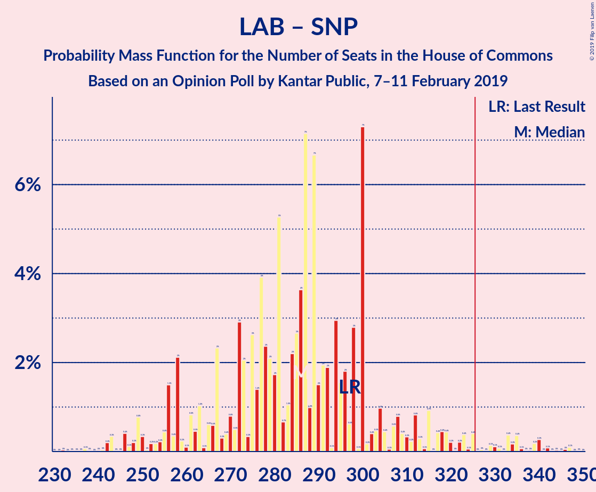

| Number of Seats | Probability | Accumulated | Special Marks |
|:---------------:|:-----------:|:-----------:|:-------------:|
| 231 | 0% | 100% |  |
| 232 | 0% | 99.9% |  |
| 233 | 0% | 99.9% |  |
| 234 | 0% | 99.9% |  |
| 235 | 0% | 99.9% |  |
| 236 | 0% | 99.9% |  |
| 237 | 0.1% | 99.9% |  |
| 238 | 0% | 99.8% |  |
| 239 | 0% | 99.8% |  |
| 240 | 0% | 99.8% |  |
| 241 | 0% | 99.7% |  |
| 242 | 0.2% | 99.7% |  |
| 243 | 0.3% | 99.5% |  |
| 244 | 0% | 99.2% |  |
| 245 | 0% | 99.1% |  |
| 246 | 0.4% | 99.1% |  |
| 247 | 0.1% | 98.7% |  |
| 248 | 0.2% | 98.6% |  |
| 249 | 0.8% | 98% |  |
| 250 | 0.3% | 98% |  |
| 251 | 0% | 97% |  |
| 252 | 0.2% | 97% |  |
| 253 | 0.2% | 97% |  |
| 254 | 0.2% | 97% |  |
| 255 | 0.4% | 97% |  |
| 256 | 1.5% | 96% |  |
| 257 | 0.4% | 95% |  |
| 258 | 2% | 94% |  |
| 259 | 0.2% | 92% |  |
| 260 | 0.1% | 92% |  |
| 261 | 0.8% | 92% |  |
| 262 | 0.5% | 91% |  |
| 263 | 1.0% | 91% |  |
| 264 | 0.1% | 90% |  |
| 265 | 0.6% | 90% |  |
| 266 | 0.6% | 89% |  |
| 267 | 2% | 88% |  |
| 268 | 0.3% | 86% |  |
| 269 | 0.4% | 86% |  |
| 270 | 0.8% | 85% |  |
| 271 | 0.5% | 85% |  |
| 272 | 3% | 84% |  |
| 273 | 2% | 81% |  |
| 274 | 0.3% | 79% |  |
| 275 | 3% | 79% |  |
| 276 | 1.4% | 76% |  |
| 277 | 4% | 75% |  |
| 278 | 2% | 71% |  |
| 279 | 2% | 68% |  |
| 280 | 2% | 66% |  |
| 281 | 5% | 65% |  |
| 282 | 0.7% | 59% |  |
| 283 | 1.0% | 59% |  |
| 284 | 2% | 58% |  |
| 285 | 3% | 55% |  |
| 286 | 4% | 53% |  |
| 287 | 7% | 49% | Median |
| 288 | 1.0% | 42% |  |
| 289 | 7% | 41% |  |
| 290 | 2% | 34% |  |
| 291 | 2% | 33% |  |
| 292 | 2% | 31% |  |
| 293 | 0.1% | 29% |  |
| 294 | 3% | 29% |  |
| 295 | 2% | 26% |  |
| 296 | 2% | 24% |  |
| 297 | 0.6% | 23% | Last Result |
| 298 | 3% | 22% |  |
| 299 | 0.1% | 19% |  |
| 300 | 7% | 19% |  |
| 301 | 0.2% | 12% |  |
| 302 | 0.4% | 12% |  |
| 303 | 0.5% | 11% |  |
| 304 | 1.0% | 11% |  |
| 305 | 0.4% | 10% |  |
| 306 | 0.1% | 9% |  |
| 307 | 0.6% | 9% |  |
| 308 | 0.8% | 9% |  |
| 309 | 0.4% | 8% |  |
| 310 | 0.3% | 8% |  |
| 311 | 0.2% | 7% |  |
| 312 | 0.8% | 7% |  |
| 313 | 0.3% | 6% |  |
| 314 | 0.1% | 6% |  |
| 315 | 0.9% | 6% |  |
| 316 | 0% | 5% |  |
| 317 | 0.4% | 5% |  |
| 318 | 0.4% | 4% |  |
| 319 | 0.4% | 4% |  |
| 320 | 0.2% | 4% |  |
| 321 | 0% | 3% |  |
| 322 | 0.2% | 3% |  |
| 323 | 0.4% | 3% |  |
| 324 | 0.1% | 3% |  |
| 325 | 0.4% | 3% |  |
| 326 | 0% | 2% | Majority |
| 327 | 0% | 2% |  |
| 328 | 0% | 2% |  |
| 329 | 0.1% | 2% |  |
| 330 | 0.1% | 2% |  |
| 331 | 0.1% | 2% |  |
| 332 | 0% | 2% |  |
| 333 | 0.4% | 2% |  |
| 334 | 0.2% | 1.5% |  |
| 335 | 0.4% | 1.3% |  |
| 336 | 0.1% | 0.9% |  |
| 337 | 0% | 0.9% |  |
| 338 | 0% | 0.8% |  |
| 339 | 0.2% | 0.8% |  |
| 340 | 0.3% | 0.6% |  |
| 341 | 0% | 0.4% |  |
| 342 | 0.1% | 0.3% |  |
| 343 | 0% | 0.3% |  |
| 344 | 0% | 0.2% |  |
| 345 | 0% | 0.2% |  |
| 346 | 0% | 0.2% |  |
| 347 | 0.1% | 0.1% |  |
| 348 | 0% | 0.1% |  |
| 349 | 0% | 0% |  |

### Labour Party – Liberal Democrats – Plaid Cymru

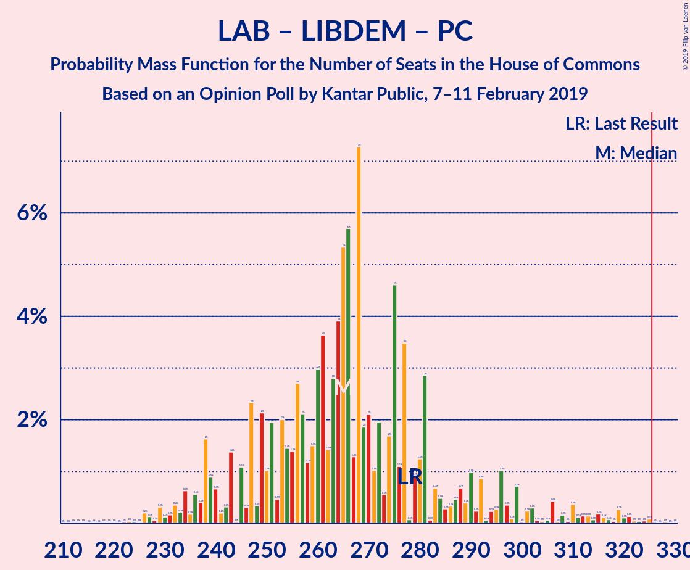

| Number of Seats | Probability | Accumulated | Special Marks |
|:---------------:|:-----------:|:-----------:|:-------------:|
| 213 | 0% | 100% |  |
| 214 | 0% | 99.9% |  |
| 215 | 0% | 99.9% |  |
| 216 | 0% | 99.9% |  |
| 217 | 0% | 99.9% |  |
| 218 | 0% | 99.9% |  |
| 219 | 0% | 99.9% |  |
| 220 | 0% | 99.9% |  |
| 221 | 0% | 99.9% |  |
| 222 | 0% | 99.8% |  |
| 223 | 0% | 99.8% |  |
| 224 | 0% | 99.8% |  |
| 225 | 0% | 99.7% |  |
| 226 | 0.2% | 99.7% |  |
| 227 | 0.1% | 99.5% |  |
| 228 | 0.1% | 99.4% |  |
| 229 | 0.3% | 99.3% |  |
| 230 | 0.1% | 99.0% |  |
| 231 | 0.2% | 98.9% |  |
| 232 | 0.4% | 98.8% |  |
| 233 | 0.2% | 98% |  |
| 234 | 0.6% | 98% |  |
| 235 | 0.2% | 98% |  |
| 236 | 0.6% | 97% |  |
| 237 | 0.4% | 97% |  |
| 238 | 2% | 96% |  |
| 239 | 0.9% | 95% |  |
| 240 | 0.7% | 94% |  |
| 241 | 0.2% | 93% |  |
| 242 | 0.3% | 93% |  |
| 243 | 1.4% | 93% |  |
| 244 | 0% | 91% |  |
| 245 | 1.1% | 91% |  |
| 246 | 0.3% | 90% |  |
| 247 | 2% | 90% |  |
| 248 | 0.3% | 88% |  |
| 249 | 2% | 87% |  |
| 250 | 1.0% | 85% |  |
| 251 | 2% | 84% |  |
| 252 | 0.5% | 82% |  |
| 253 | 2% | 82% |  |
| 254 | 1.4% | 80% |  |
| 255 | 1.4% | 78% |  |
| 256 | 3% | 77% |  |
| 257 | 2% | 74% |  |
| 258 | 1.2% | 72% |  |
| 259 | 1.5% | 71% |  |
| 260 | 3% | 69% |  |
| 261 | 4% | 66% |  |
| 262 | 1.4% | 63% |  |
| 263 | 3% | 61% |  |
| 264 | 4% | 59% |  |
| 265 | 5% | 55% | Median |
| 266 | 6% | 49% |  |
| 267 | 1.3% | 44% |  |
| 268 | 7% | 42% |  |
| 269 | 2% | 35% |  |
| 270 | 2% | 33% |  |
| 271 | 1.0% | 31% |  |
| 272 | 2% | 30% |  |
| 273 | 0.6% | 28% |  |
| 274 | 2% | 28% |  |
| 275 | 5% | 26% |  |
| 276 | 1.1% | 21% |  |
| 277 | 3% | 20% |  |
| 278 | 0.1% | 17% | Last Result |
| 279 | 0.9% | 17% |  |
| 280 | 1.2% | 16% |  |
| 281 | 3% | 14% |  |
| 282 | 0.1% | 12% |  |
| 283 | 0.7% | 11% |  |
| 284 | 0.5% | 11% |  |
| 285 | 0.3% | 10% |  |
| 286 | 0.3% | 10% |  |
| 287 | 0.5% | 10% |  |
| 288 | 0.7% | 9% |  |
| 289 | 0.4% | 9% |  |
| 290 | 1.0% | 8% |  |
| 291 | 0.2% | 7% |  |
| 292 | 0.9% | 7% |  |
| 293 | 0.1% | 6% |  |
| 294 | 0.2% | 6% |  |
| 295 | 0.3% | 6% |  |
| 296 | 1.0% | 6% |  |
| 297 | 0.3% | 5% |  |
| 298 | 0.1% | 4% |  |
| 299 | 0.7% | 4% |  |
| 300 | 0% | 3% |  |
| 301 | 0.2% | 3% |  |
| 302 | 0.3% | 3% |  |
| 303 | 0.1% | 3% |  |
| 304 | 0% | 3% |  |
| 305 | 0.1% | 3% |  |
| 306 | 0.4% | 3% |  |
| 307 | 0% | 2% |  |
| 308 | 0.2% | 2% |  |
| 309 | 0% | 2% |  |
| 310 | 0.4% | 2% |  |
| 311 | 0.1% | 2% |  |
| 312 | 0.1% | 2% |  |
| 313 | 0.1% | 1.4% |  |
| 314 | 0.1% | 1.3% |  |
| 315 | 0.2% | 1.2% |  |
| 316 | 0.1% | 1.0% |  |
| 317 | 0.1% | 0.9% |  |
| 318 | 0% | 0.8% |  |
| 319 | 0.3% | 0.8% |  |
| 320 | 0.1% | 0.5% |  |
| 321 | 0.1% | 0.4% |  |
| 322 | 0% | 0.3% |  |
| 323 | 0% | 0.3% |  |
| 324 | 0% | 0.2% |  |
| 325 | 0.1% | 0.2% |  |
| 326 | 0% | 0.1% | Majority |
| 327 | 0% | 0.1% |  |
| 328 | 0% | 0.1% |  |
| 329 | 0% | 0% |  |

### Labour Party – Liberal Democrats

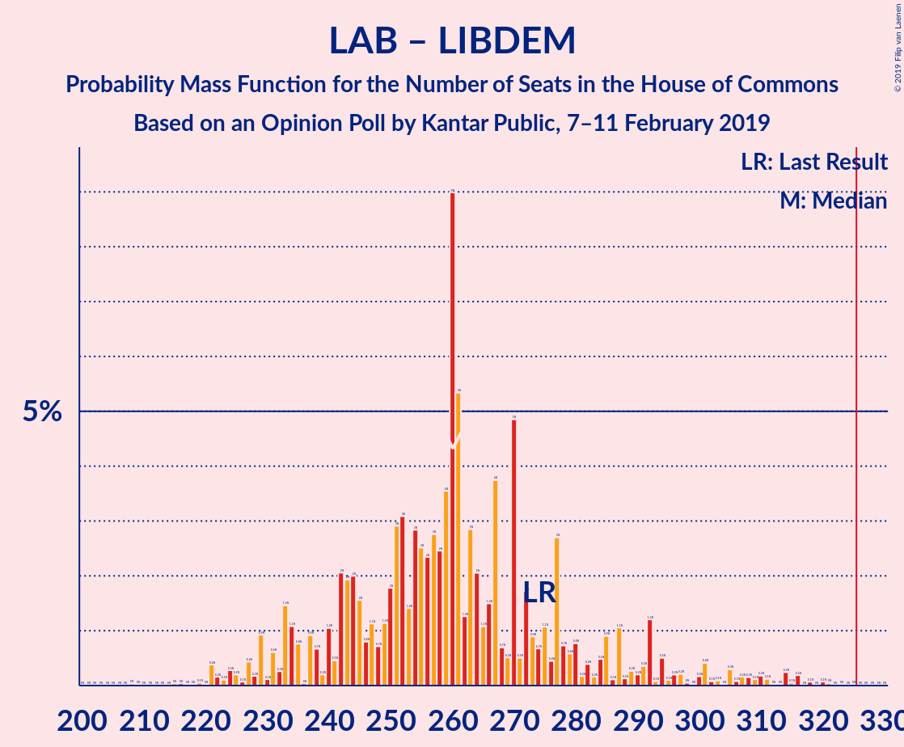

| Number of Seats | Probability | Accumulated | Special Marks |
|:---------------:|:-----------:|:-----------:|:-------------:|
| 208 | 0% | 100% |  |
| 209 | 0% | 99.9% |  |
| 210 | 0% | 99.9% |  |
| 211 | 0% | 99.9% |  |
| 212 | 0% | 99.9% |  |
| 213 | 0% | 99.9% |  |
| 214 | 0% | 99.9% |  |
| 215 | 0% | 99.9% |  |
| 216 | 0% | 99.8% |  |
| 217 | 0% | 99.8% |  |
| 218 | 0% | 99.7% |  |
| 219 | 0.1% | 99.7% |  |
| 220 | 0% | 99.7% |  |
| 221 | 0.4% | 99.7% |  |
| 222 | 0.2% | 99.3% |  |
| 223 | 0.1% | 99.1% |  |
| 224 | 0.3% | 99.0% |  |
| 225 | 0.2% | 98.7% |  |
| 226 | 0.1% | 98.5% |  |
| 227 | 0.4% | 98% |  |
| 228 | 0.2% | 98% |  |
| 229 | 0.9% | 98% |  |
| 230 | 0.1% | 97% |  |
| 231 | 0.6% | 97% |  |
| 232 | 0.3% | 96% |  |
| 233 | 1.5% | 96% |  |
| 234 | 1.1% | 94% |  |
| 235 | 0.8% | 93% |  |
| 236 | 0% | 93% |  |
| 237 | 0.9% | 93% |  |
| 238 | 0.7% | 92% |  |
| 239 | 0.2% | 91% |  |
| 240 | 1.0% | 91% |  |
| 241 | 0.5% | 90% |  |
| 242 | 2% | 89% |  |
| 243 | 2% | 87% |  |
| 244 | 2% | 85% |  |
| 245 | 2% | 83% |  |
| 246 | 0.8% | 82% |  |
| 247 | 1.1% | 81% |  |
| 248 | 0.7% | 80% |  |
| 249 | 1.1% | 79% |  |
| 250 | 2% | 78% |  |
| 251 | 3% | 76% |  |
| 252 | 3% | 73% |  |
| 253 | 1.4% | 70% |  |
| 254 | 3% | 69% |  |
| 255 | 3% | 66% |  |
| 256 | 2% | 63% |  |
| 257 | 3% | 61% |  |
| 258 | 2% | 58% |  |
| 259 | 4% | 56% |  |
| 260 | 9% | 52% | Median |
| 261 | 5% | 43% |  |
| 262 | 1.3% | 38% |  |
| 263 | 3% | 37% |  |
| 264 | 2% | 34% |  |
| 265 | 1.1% | 32% |  |
| 266 | 1.5% | 31% |  |
| 267 | 4% | 29% |  |
| 268 | 0.7% | 25% |  |
| 269 | 0.5% | 25% |  |
| 270 | 5% | 24% |  |
| 271 | 0.5% | 19% |  |
| 272 | 2% | 19% |  |
| 273 | 0.9% | 17% |  |
| 274 | 0.7% | 16% | Last Result |
| 275 | 1.1% | 16% |  |
| 276 | 0.4% | 15% |  |
| 277 | 3% | 14% |  |
| 278 | 0.7% | 11% |  |
| 279 | 0.6% | 11% |  |
| 280 | 0.8% | 10% |  |
| 281 | 0.2% | 9% |  |
| 282 | 0.4% | 9% |  |
| 283 | 0.2% | 9% |  |
| 284 | 0.5% | 9% |  |
| 285 | 0.9% | 8% |  |
| 286 | 0.1% | 7% |  |
| 287 | 1.1% | 7% |  |
| 288 | 0.1% | 6% |  |
| 289 | 0.3% | 6% |  |
| 290 | 0.2% | 6% |  |
| 291 | 0.4% | 5% |  |
| 292 | 1.2% | 5% |  |
| 293 | 0.1% | 4% |  |
| 294 | 0.5% | 4% |  |
| 295 | 0.1% | 3% |  |
| 296 | 0.2% | 3% |  |
| 297 | 0.2% | 3% |  |
| 298 | 0% | 3% |  |
| 299 | 0% | 3% |  |
| 300 | 0.2% | 3% |  |
| 301 | 0.4% | 3% |  |
| 302 | 0.1% | 2% |  |
| 303 | 0.1% | 2% |  |
| 304 | 0% | 2% |  |
| 305 | 0.3% | 2% |  |
| 306 | 0.1% | 2% |  |
| 307 | 0.2% | 2% |  |
| 308 | 0.2% | 1.4% |  |
| 309 | 0.1% | 1.2% |  |
| 310 | 0.2% | 1.1% |  |
| 311 | 0.1% | 0.9% |  |
| 312 | 0% | 0.8% |  |
| 313 | 0% | 0.8% |  |
| 314 | 0.2% | 0.8% |  |
| 315 | 0.1% | 0.5% |  |
| 316 | 0.2% | 0.5% |  |
| 317 | 0% | 0.3% |  |
| 318 | 0.1% | 0.3% |  |
| 319 | 0% | 0.2% |  |
| 320 | 0.1% | 0.2% |  |
| 321 | 0% | 0.1% |  |
| 322 | 0% | 0.1% |  |
| 323 | 0% | 0.1% |  |
| 324 | 0% | 0.1% |  |
| 325 | 0% | 0.1% |  |
| 326 | 0% | 0% | Majority |

### Labour Party – Plaid Cymru

| Number of Seats | Probability | Accumulated | Special Marks |
|:---------------:|:-----------:|:-----------:|:-------------:|
| 190 | 0% | 100% |  |
| 191 | 0% | 99.9% |  |
| 192 | 0% | 99.9% |  |
| 193 | 0% | 99.9% |  |
| 194 | 0% | 99.9% |  |
| 195 | 0% | 99.9% |  |
| 196 | 0% | 99.9% |  |
| 197 | 0% | 99.9% |  |
| 198 | 0% | 99.9% |  |
| 199 | 0% | 99.8% |  |
| 200 | 0% | 99.8% |  |
| 201 | 0% | 99.8% |  |
| 202 | 0% | 99.8% |  |
| 203 | 0% | 99.8% |  |
| 204 | 0.1% | 99.8% |  |
| 205 | 0.1% | 99.7% |  |
| 206 | 0% | 99.7% |  |
| 207 | 0% | 99.6% |  |
| 208 | 0% | 99.6% |  |
| 209 | 0.4% | 99.6% |  |
| 210 | 0.4% | 99.2% |  |
| 211 | 0.5% | 98.8% |  |
| 212 | 1.0% | 98% |  |
| 213 | 2% | 97% |  |
| 214 | 0.4% | 96% |  |
| 215 | 0.1% | 95% |  |
| 216 | 0.2% | 95% |  |
| 217 | 0.1% | 95% |  |
| 218 | 2% | 95% |  |
| 219 | 1.2% | 93% |  |
| 220 | 0.7% | 92% |  |
| 221 | 0.5% | 91% |  |
| 222 | 2% | 91% |  |
| 223 | 4% | 89% |  |
| 224 | 0.3% | 85% |  |
| 225 | 0% | 85% |  |
| 226 | 0.8% | 85% |  |
| 227 | 2% | 84% |  |
| 228 | 1.0% | 81% |  |
| 229 | 3% | 80% |  |
| 230 | 0.7% | 78% |  |
| 231 | 2% | 77% |  |
| 232 | 2% | 75% |  |
| 233 | 0.6% | 73% |  |
| 234 | 0.7% | 72% |  |
| 235 | 0.4% | 71% |  |
| 236 | 1.4% | 71% |  |
| 237 | 0.9% | 70% |  |
| 238 | 0.3% | 69% |  |
| 239 | 0.7% | 68% |  |
| 240 | 11% | 68% | Median |
| 241 | 5% | 57% |  |
| 242 | 9% | 52% |  |
| 243 | 10% | 43% |  |
| 244 | 1.0% | 33% |  |
| 245 | 0.8% | 32% |  |
| 246 | 2% | 31% |  |
| 247 | 2% | 29% |  |
| 248 | 2% | 27% |  |
| 249 | 2% | 25% |  |
| 250 | 0.9% | 23% |  |
| 251 | 7% | 22% |  |
| 252 | 0.8% | 16% |  |
| 253 | 3% | 15% |  |
| 254 | 0.3% | 12% |  |
| 255 | 0.5% | 12% |  |
| 256 | 0% | 11% |  |
| 257 | 1.1% | 11% |  |
| 258 | 0.2% | 10% |  |
| 259 | 0.7% | 10% |  |
| 260 | 0.1% | 9% |  |
| 261 | 0.1% | 9% |  |
| 262 | 1.2% | 9% |  |
| 263 | 0.7% | 8% |  |
| 264 | 0.4% | 7% |  |
| 265 | 0.4% | 7% |  |
| 266 | 1.0% | 6% | Last Result |
| 267 | 0.1% | 5% |  |
| 268 | 0.1% | 5% |  |
| 269 | 0.4% | 5% |  |
| 270 | 0% | 5% |  |
| 271 | 0.2% | 4% |  |
| 272 | 0.1% | 4% |  |
| 273 | 0% | 4% |  |
| 274 | 0% | 4% |  |
| 275 | 0.8% | 4% |  |
| 276 | 0.3% | 3% |  |
| 277 | 0.1% | 3% |  |
| 278 | 0.1% | 3% |  |
| 279 | 0.4% | 3% |  |
| 280 | 0% | 3% |  |
| 281 | 0.2% | 3% |  |
| 282 | 0.1% | 2% |  |
| 283 | 0.2% | 2% |  |
| 284 | 0.1% | 2% |  |
| 285 | 0.1% | 2% |  |
| 286 | 0.3% | 2% |  |
| 287 | 0.1% | 2% |  |
| 288 | 0.4% | 1.4% |  |
| 289 | 0.1% | 1.1% |  |
| 290 | 0.1% | 1.0% |  |
| 291 | 0% | 0.9% |  |
| 292 | 0% | 0.9% |  |
| 293 | 0.3% | 0.8% |  |
| 294 | 0.2% | 0.5% |  |
| 295 | 0.1% | 0.4% |  |
| 296 | 0.2% | 0.3% |  |
| 297 | 0% | 0.1% |  |
| 298 | 0% | 0.1% |  |
| 299 | 0% | 0.1% |  |
| 300 | 0% | 0.1% |  |
| 301 | 0% | 0.1% |  |
| 302 | 0% | 0% |  |

### Labour Party

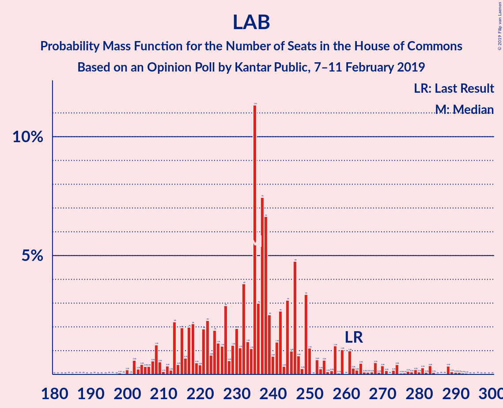

| Number of Seats | Probability | Accumulated | Special Marks |
|:---------------:|:-----------:|:-----------:|:-------------:|
| 185 | 0% | 100% |  |
| 186 | 0% | 99.9% |  |
| 187 | 0% | 99.9% |  |
| 188 | 0% | 99.9% |  |
| 189 | 0% | 99.9% |  |
| 190 | 0% | 99.9% |  |
| 191 | 0% | 99.9% |  |
| 192 | 0% | 99.8% |  |
| 193 | 0% | 99.8% |  |
| 194 | 0% | 99.8% |  |
| 195 | 0% | 99.8% |  |
| 196 | 0% | 99.8% |  |
| 197 | 0% | 99.8% |  |
| 198 | 0.1% | 99.8% |  |
| 199 | 0% | 99.7% |  |
| 200 | 0.2% | 99.6% |  |
| 201 | 0% | 99.5% |  |
| 202 | 0.6% | 99.4% |  |
| 203 | 0.2% | 98.8% |  |
| 204 | 0.4% | 98.6% |  |
| 205 | 0.3% | 98% |  |
| 206 | 0.3% | 98% |  |
| 207 | 0.6% | 97% |  |
| 208 | 1.2% | 97% |  |
| 209 | 0.5% | 96% |  |
| 210 | 0.1% | 95% |  |
| 211 | 0.4% | 95% |  |
| 212 | 0.2% | 95% |  |
| 213 | 2% | 94% |  |
| 214 | 0.4% | 92% |  |
| 215 | 2% | 92% |  |
| 216 | 0.7% | 90% |  |
| 217 | 2% | 89% |  |
| 218 | 2% | 87% |  |
| 219 | 0.5% | 85% |  |
| 220 | 0.4% | 85% |  |
| 221 | 2% | 84% |  |
| 222 | 2% | 82% |  |
| 223 | 0.8% | 80% |  |
| 224 | 2% | 79% |  |
| 225 | 1.3% | 77% |  |
| 226 | 1.2% | 76% |  |
| 227 | 3% | 75% |  |
| 228 | 0.6% | 72% |  |
| 229 | 1.2% | 71% |  |
| 230 | 2% | 70% |  |
| 231 | 1.1% | 68% |  |
| 232 | 4% | 67% |  |
| 233 | 1.4% | 63% |  |
| 234 | 1.1% | 62% |  |
| 235 | 11% | 61% | Median |
| 236 | 3% | 49% |  |
| 237 | 7% | 46% |  |
| 238 | 7% | 39% |  |
| 239 | 3% | 32% |  |
| 240 | 0.8% | 30% |  |
| 241 | 1.4% | 29% |  |
| 242 | 3% | 28% |  |
| 243 | 0.3% | 25% |  |
| 244 | 3% | 25% |  |
| 245 | 1.0% | 22% |  |
| 246 | 5% | 21% |  |
| 247 | 0.8% | 16% |  |
| 248 | 0.2% | 15% |  |
| 249 | 3% | 15% |  |
| 250 | 1.1% | 12% |  |
| 251 | 0% | 10% |  |
| 252 | 0.6% | 10% |  |
| 253 | 0.2% | 10% |  |
| 254 | 0.6% | 10% |  |
| 255 | 0.1% | 9% |  |
| 256 | 0.2% | 9% |  |
| 257 | 1.2% | 9% |  |
| 258 | 0.1% | 7% |  |
| 259 | 1.0% | 7% |  |
| 260 | 0% | 6% |  |
| 261 | 1.0% | 6% |  |
| 262 | 0.3% | 5% | Last Result |
| 263 | 0.2% | 5% |  |
| 264 | 0.5% | 5% |  |
| 265 | 0.1% | 4% |  |
| 266 | 0.1% | 4% |  |
| 267 | 0.1% | 4% |  |
| 268 | 0.5% | 4% |  |
| 269 | 0.1% | 4% |  |
| 270 | 0.4% | 4% |  |
| 271 | 0.2% | 3% |  |
| 272 | 0% | 3% |  |
| 273 | 0.2% | 3% |  |
| 274 | 0.4% | 3% |  |
| 275 | 0.1% | 2% |  |
| 276 | 0.1% | 2% |  |
| 277 | 0.1% | 2% |  |
| 278 | 0.1% | 2% |  |
| 279 | 0.2% | 2% |  |
| 280 | 0.1% | 2% |  |
| 281 | 0.3% | 2% |  |
| 282 | 0.1% | 1.4% |  |
| 283 | 0.4% | 1.3% |  |
| 284 | 0.1% | 1.0% |  |
| 285 | 0% | 0.9% |  |
| 286 | 0% | 0.9% |  |
| 287 | 0% | 0.9% |  |
| 288 | 0.4% | 0.8% |  |
| 289 | 0.1% | 0.5% |  |
| 290 | 0.1% | 0.4% |  |
| 291 | 0.1% | 0.3% |  |
| 292 | 0.1% | 0.2% |  |
| 293 | 0.1% | 0.1% |  |
| 294 | 0% | 0.1% |  |
| 295 | 0% | 0.1% |  |
| 296 | 0% | 0.1% |  |
| 297 | 0% | 0% |  |

## Technical Information

### Opinion Poll

+ **Polling firm:** Kantar Public
+ **Commissioner(s):** —
+ **Fieldwork period:** 7–11 February 2019

### Calculations

+ **Sample size:** 1145
+ **Simulations done:** 131,072
+ **Error estimate:** 0.96%

