# Opinion Poll by Survation, 3–6 April 2019

<a href="#voting-intentions">Voting Intentions</a> | <a href="#seats">Seats</a> | <a href="#coalitions">Coalitions</a> | <a href="#technical-information">Technical Information</a>

## Voting Intentions

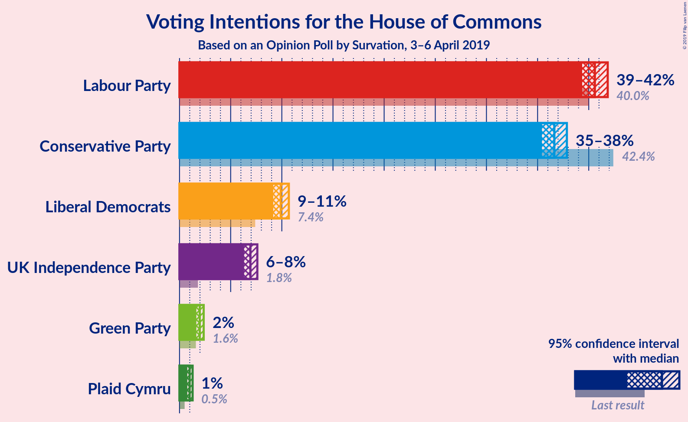

### Confidence Intervals

| Party | Last Result | Poll Result | 80% Confidence Interval | 90% Confidence Interval | 95% Confidence Interval | 99% Confidence Interval |
|:-----:|:-----------:|:-----------:|:-----------------------:|:-----------------------:|:-----------------------:|:-----------------------:|
| Labour Party | 40.0% | 40.6% | 39.8–41.4% |39.6–41.6% |39.4–41.9% |39.0–42.2% |
| Conservative Party | 42.4% | 36.6% | 35.8–37.4% |35.6–37.7% |35.4–37.9% |35.1–38.3% |
| Liberal Democrats | 7.4% | 9.9% | 9.4–10.4% |9.3–10.6% |9.2–10.7% |8.9–10.9% |
| UK Independence Party | 1.8% | 6.9% | 6.5–7.4% |6.4–7.5% |6.3–7.6% |6.1–7.8% |
| Green Party | 1.6% | 2.0% | 1.8–2.2% |1.7–2.3% |1.6–2.4% |1.6–2.5% |
| Plaid Cymru | 0.5% | 1.0% | 0.8–1.2% |0.8–1.2% |0.8–1.3% |0.7–1.4% |

*Note:* The poll result column reflects the actual value used in the calculations. Published results may vary slightly, and in addition be rounded to fewer digits.

## Seats

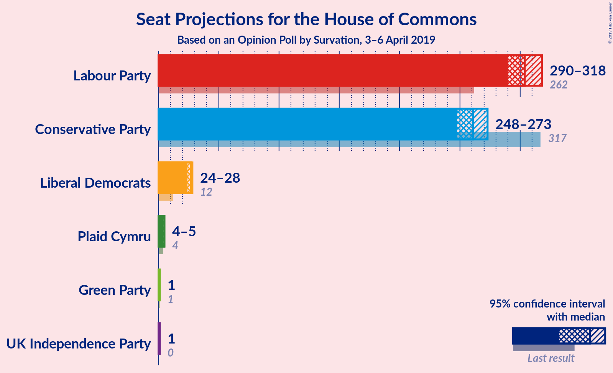

### Confidence Intervals

| Party | Last Result | Median | 80% Confidence Interval | 90% Confidence Interval | 95% Confidence Interval | 99% Confidence Interval |
|:-----:|:-----------:|:------:|:-----------------------:|:-----------------------:|:-----------------------:|:-----------------------:|
| <a href="#labour-party">Labour Party</a> | 262 | 304 | 296–315 |294–316 |290–318 |285–321 |
| <a href="#conservative-party">Conservative Party</a> | 317 | 261 | 250–268 |249–270 |248–273 |245–277 |
| <a href="#liberal-democrats">Liberal Democrats</a> | 12 | 27 | 25–27 |24–28 |24–28 |23–28 |
| <a href="#uk-independence-party">UK Independence Party</a> | 0 | 1 | 1 |1 |1 |1 |
| <a href="#green-party">Green Party</a> | 1 | 1 | 1 |1 |1 |1 |
| <a href="#plaid-cymru">Plaid Cymru</a> | 4 | 5 | 5 |4–5 |4–5 |4–5 |

### Labour Party

*For a full overview of the results for this party, see the [Labour Party](party-labourparty.html) page.*

| Number of Seats | Probability | Accumulated | Special Marks |
|:---------------:|:-----------:|:-----------:|:-------------:|
| 262 | 0% | 100% | Last Result |
| 263 | 0% | 100% |  |
| 264 | 0% | 100% |  |
| 265 | 0% | 100% |  |
| 266 | 0% | 100% |  |
| 267 | 0% | 100% |  |
| 268 | 0% | 100% |  |
| 269 | 0% | 100% |  |
| 270 | 0% | 100% |  |
| 271 | 0% | 100% |  |
| 272 | 0% | 100% |  |
| 273 | 0% | 100% |  |
| 274 | 0% | 100% |  |
| 275 | 0% | 100% |  |
| 276 | 0% | 99.9% |  |
| 277 | 0% | 99.9% |  |
| 278 | 0% | 99.9% |  |
| 279 | 0% | 99.9% |  |
| 280 | 0.1% | 99.9% |  |
| 281 | 0.1% | 99.8% |  |
| 282 | 0% | 99.7% |  |
| 283 | 0.1% | 99.7% |  |
| 284 | 0.1% | 99.6% |  |
| 285 | 0.2% | 99.5% |  |
| 286 | 0.4% | 99.3% |  |
| 287 | 0.9% | 98.9% |  |
| 288 | 0.1% | 98% |  |
| 289 | 0.2% | 98% |  |
| 290 | 0.6% | 98% |  |
| 291 | 0.6% | 97% |  |
| 292 | 0.2% | 97% |  |
| 293 | 1.2% | 96% |  |
| 294 | 4% | 95% |  |
| 295 | 1.1% | 92% |  |
| 296 | 2% | 90% |  |
| 297 | 4% | 89% |  |
| 298 | 8% | 85% |  |
| 299 | 1.4% | 77% |  |
| 300 | 3% | 75% |  |
| 301 | 7% | 73% |  |
| 302 | 2% | 65% |  |
| 303 | 8% | 64% |  |
| 304 | 8% | 56% | Median |
| 305 | 6% | 48% |  |
| 306 | 2% | 43% |  |
| 307 | 7% | 41% |  |
| 308 | 6% | 34% |  |
| 309 | 5% | 29% |  |
| 310 | 2% | 24% |  |
| 311 | 2% | 22% |  |
| 312 | 2% | 20% |  |
| 313 | 2% | 18% |  |
| 314 | 4% | 16% |  |
| 315 | 5% | 12% |  |
| 316 | 3% | 7% |  |
| 317 | 1.4% | 4% |  |
| 318 | 0.9% | 3% |  |
| 319 | 0.5% | 2% |  |
| 320 | 0.6% | 1.4% |  |
| 321 | 0.4% | 0.8% |  |
| 322 | 0.2% | 0.4% |  |
| 323 | 0.1% | 0.2% |  |
| 324 | 0.1% | 0.1% |  |
| 325 | 0% | 0% |  |

### Conservative Party

*For a full overview of the results for this party, see the [Conservative Party](party-conservativeparty.html) page.*

| Number of Seats | Probability | Accumulated | Special Marks |
|:---------------:|:-----------:|:-----------:|:-------------:|
| 241 | 0% | 100% |  |
| 242 | 0% | 99.9% |  |
| 243 | 0.1% | 99.9% |  |
| 244 | 0.2% | 99.8% |  |
| 245 | 0.2% | 99.6% |  |
| 246 | 1.1% | 99.4% |  |
| 247 | 0.4% | 98% |  |
| 248 | 0.7% | 98% |  |
| 249 | 3% | 97% |  |
| 250 | 7% | 94% |  |
| 251 | 3% | 87% |  |
| 252 | 1.2% | 85% |  |
| 253 | 2% | 84% |  |
| 254 | 3% | 81% |  |
| 255 | 1.2% | 79% |  |
| 256 | 1.4% | 77% |  |
| 257 | 7% | 76% |  |
| 258 | 7% | 69% |  |
| 259 | 1.5% | 62% |  |
| 260 | 6% | 61% |  |
| 261 | 17% | 55% | Median |
| 262 | 5% | 38% |  |
| 263 | 1.3% | 33% |  |
| 264 | 11% | 32% |  |
| 265 | 5% | 21% |  |
| 266 | 3% | 16% |  |
| 267 | 2% | 14% |  |
| 268 | 3% | 11% |  |
| 269 | 2% | 8% |  |
| 270 | 1.2% | 6% |  |
| 271 | 1.0% | 5% |  |
| 272 | 1.1% | 4% |  |
| 273 | 0.3% | 3% |  |
| 274 | 0.9% | 2% |  |
| 275 | 0.4% | 1.4% |  |
| 276 | 0.2% | 0.9% |  |
| 277 | 0.3% | 0.7% |  |
| 278 | 0.1% | 0.5% |  |
| 279 | 0% | 0.3% |  |
| 280 | 0.1% | 0.3% |  |
| 281 | 0.1% | 0.2% |  |
| 282 | 0.1% | 0.2% |  |
| 283 | 0% | 0.1% |  |
| 284 | 0% | 0.1% |  |
| 285 | 0% | 0.1% |  |
| 286 | 0% | 0% |  |
| 287 | 0% | 0% |  |
| 288 | 0% | 0% |  |
| 289 | 0% | 0% |  |
| 290 | 0% | 0% |  |
| 291 | 0% | 0% |  |
| 292 | 0% | 0% |  |
| 293 | 0% | 0% |  |
| 294 | 0% | 0% |  |
| 295 | 0% | 0% |  |
| 296 | 0% | 0% |  |
| 297 | 0% | 0% |  |
| 298 | 0% | 0% |  |
| 299 | 0% | 0% |  |
| 300 | 0% | 0% |  |
| 301 | 0% | 0% |  |
| 302 | 0% | 0% |  |
| 303 | 0% | 0% |  |
| 304 | 0% | 0% |  |
| 305 | 0% | 0% |  |
| 306 | 0% | 0% |  |
| 307 | 0% | 0% |  |
| 308 | 0% | 0% |  |
| 309 | 0% | 0% |  |
| 310 | 0% | 0% |  |
| 311 | 0% | 0% |  |
| 312 | 0% | 0% |  |
| 313 | 0% | 0% |  |
| 314 | 0% | 0% |  |
| 315 | 0% | 0% |  |
| 316 | 0% | 0% |  |
| 317 | 0% | 0% | Last Result |

### Liberal Democrats

*For a full overview of the results for this party, see the [Liberal Democrats](party-liberaldemocrats.html) page.*

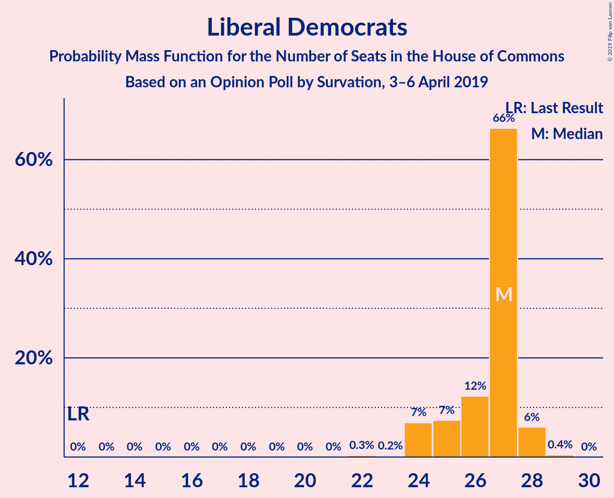

| Number of Seats | Probability | Accumulated | Special Marks |
|:---------------:|:-----------:|:-----------:|:-------------:|
| 12 | 0% | 100% | Last Result |
| 13 | 0% | 100% |  |
| 14 | 0% | 100% |  |
| 15 | 0% | 100% |  |
| 16 | 0% | 100% |  |
| 17 | 0% | 100% |  |
| 18 | 0% | 100% |  |
| 19 | 0% | 100% |  |
| 20 | 0% | 100% |  |
| 21 | 0% | 100% |  |
| 22 | 0.3% | 100% |  |
| 23 | 0.2% | 99.6% |  |
| 24 | 7% | 99.5% |  |
| 25 | 7% | 93% |  |
| 26 | 12% | 85% |  |
| 27 | 66% | 73% | Median |
| 28 | 6% | 6% |  |
| 29 | 0.4% | 0.5% |  |
| 30 | 0% | 0% |  |

### UK Independence Party

*For a full overview of the results for this party, see the [UK Independence Party](party-ukindependenceparty.html) page.*

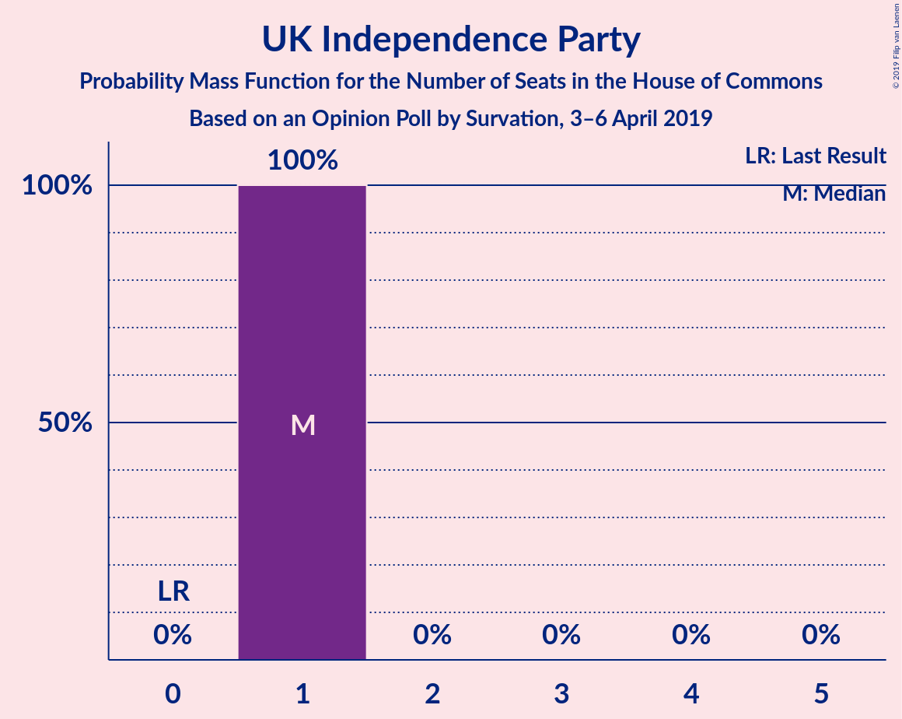

| Number of Seats | Probability | Accumulated | Special Marks |
|:---------------:|:-----------:|:-----------:|:-------------:|
| 0 | 0% | 100% | Last Result |
| 1 | 100% | 100% | Median |

### Green Party

*For a full overview of the results for this party, see the [Green Party](party-greenparty.html) page.*

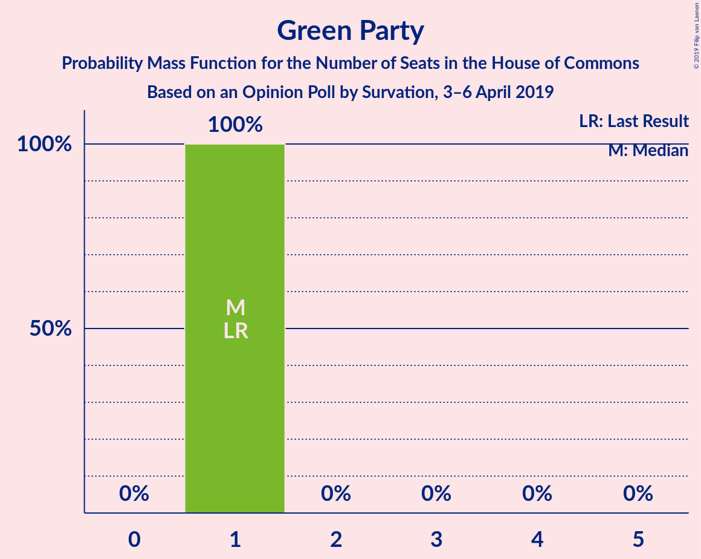

| Number of Seats | Probability | Accumulated | Special Marks |
|:---------------:|:-----------:|:-----------:|:-------------:|
| 1 | 100% | 100% | Last Result, Median |

### Plaid Cymru

*For a full overview of the results for this party, see the [Plaid Cymru](party-plaidcymru.html) page.*

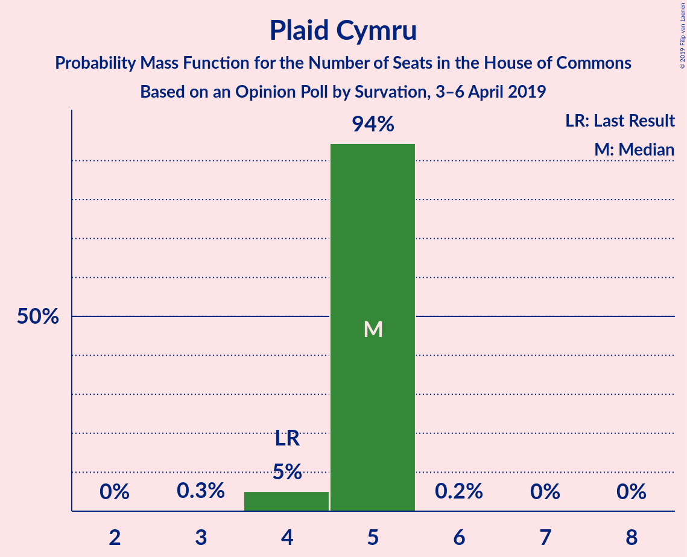

| Number of Seats | Probability | Accumulated | Special Marks |
|:---------------:|:-----------:|:-----------:|:-------------:|
| 3 | 0.3% | 100% |  |
| 4 | 5% | 99.7% | Last Result |
| 5 | 94% | 95% | Median |
| 6 | 0.2% | 0.2% |  |
| 7 | 0% | 0.1% |  |
| 8 | 0% | 0% |  |

## Coalitions

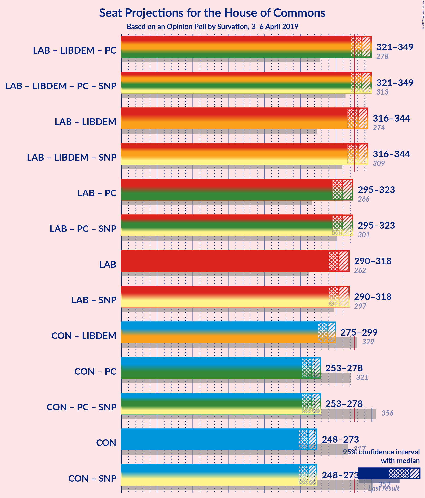

### Confidence Intervals

| Coalition | Last Result | Median | Majority? | 80% Confidence Interval | 90% Confidence Interval | 95% Confidence Interval | 99% Confidence Interval |
|:---------:|:-----------:|:------:|:---------:|:-----------------------:|:-----------------------:|:-----------------------:|:-----------------------:|
| Labour Party – Liberal Democrats – Plaid Cymru | 278 | 336 | 93% | 327–347 | 324–348 | 321–349 | 316–352 |
| Labour Party – Liberal Democrats | 274 | 331 | 75% | 322–342 | 319–343 | 316–344 | 311–347 |
| Labour Party – Plaid Cymru | 266 | 309 | 0.8% | 301–320 | 299–321 | 295–323 | 290–326 |
| Labour Party | 262 | 304 | 0% | 296–315 | 294–316 | 290–318 | 285–321 |
| Conservative Party – Liberal Democrats | 329 | 288 | 0% | 277–294 | 276–296 | 275–299 | 271–303 |
| Conservative Party – Plaid Cymru | 321 | 266 | 0% | 255–273 | 254–275 | 253–278 | 250–282 |
| Conservative Party | 317 | 261 | 0% | 250–268 | 249–270 | 248–273 | 245–277 |

### Labour Party – Liberal Democrats – Plaid Cymru

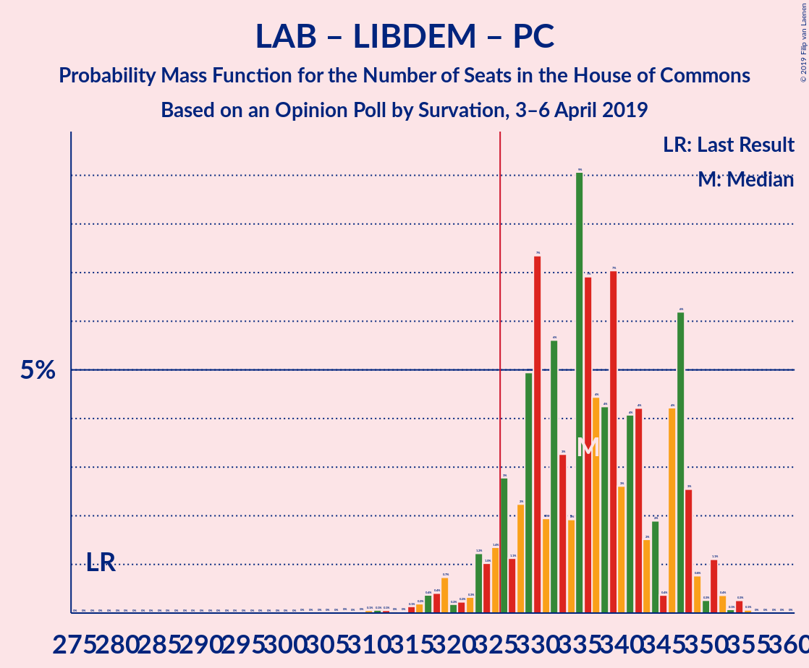

| Number of Seats | Probability | Accumulated | Special Marks |
|:---------------:|:-----------:|:-----------:|:-------------:|
| 278 | 0% | 100% | Last Result |
| 279 | 0% | 100% |  |
| 280 | 0% | 100% |  |
| 281 | 0% | 100% |  |
| 282 | 0% | 100% |  |
| 283 | 0% | 100% |  |
| 284 | 0% | 100% |  |
| 285 | 0% | 100% |  |
| 286 | 0% | 100% |  |
| 287 | 0% | 100% |  |
| 288 | 0% | 100% |  |
| 289 | 0% | 100% |  |
| 290 | 0% | 100% |  |
| 291 | 0% | 100% |  |
| 292 | 0% | 100% |  |
| 293 | 0% | 100% |  |
| 294 | 0% | 100% |  |
| 295 | 0% | 100% |  |
| 296 | 0% | 100% |  |
| 297 | 0% | 100% |  |
| 298 | 0% | 100% |  |
| 299 | 0% | 100% |  |
| 300 | 0% | 100% |  |
| 301 | 0% | 100% |  |
| 302 | 0% | 100% |  |
| 303 | 0% | 100% |  |
| 304 | 0% | 100% |  |
| 305 | 0% | 100% |  |
| 306 | 0% | 100% |  |
| 307 | 0% | 100% |  |
| 308 | 0% | 99.9% |  |
| 309 | 0% | 99.9% |  |
| 310 | 0.1% | 99.9% |  |
| 311 | 0.1% | 99.8% |  |
| 312 | 0.1% | 99.8% |  |
| 313 | 0% | 99.7% |  |
| 314 | 0% | 99.7% |  |
| 315 | 0.1% | 99.7% |  |
| 316 | 0.2% | 99.5% |  |
| 317 | 0.4% | 99.3% |  |
| 318 | 0.4% | 99.0% |  |
| 319 | 0.7% | 98.6% |  |
| 320 | 0.2% | 98% |  |
| 321 | 0.2% | 98% |  |
| 322 | 0.3% | 97% |  |
| 323 | 1.2% | 97% |  |
| 324 | 1.0% | 96% |  |
| 325 | 1.4% | 95% |  |
| 326 | 3% | 93% | Majority |
| 327 | 1.1% | 91% |  |
| 328 | 2% | 90% |  |
| 329 | 5% | 87% |  |
| 330 | 7% | 82% |  |
| 331 | 2% | 75% |  |
| 332 | 6% | 73% |  |
| 333 | 3% | 67% |  |
| 334 | 2% | 64% |  |
| 335 | 9% | 62% |  |
| 336 | 7% | 53% | Median |
| 337 | 4% | 46% |  |
| 338 | 4% | 42% |  |
| 339 | 7% | 38% |  |
| 340 | 3% | 31% |  |
| 341 | 4% | 28% |  |
| 342 | 4% | 24% |  |
| 343 | 2% | 20% |  |
| 344 | 2% | 18% |  |
| 345 | 0.4% | 16% |  |
| 346 | 4% | 16% |  |
| 347 | 6% | 12% |  |
| 348 | 3% | 5% |  |
| 349 | 0.8% | 3% |  |
| 350 | 0.3% | 2% |  |
| 351 | 1.1% | 2% |  |
| 352 | 0.4% | 0.8% |  |
| 353 | 0.1% | 0.5% |  |
| 354 | 0.3% | 0.4% |  |
| 355 | 0.1% | 0.1% |  |
| 356 | 0% | 0.1% |  |
| 357 | 0% | 0% |  |

### Labour Party – Liberal Democrats

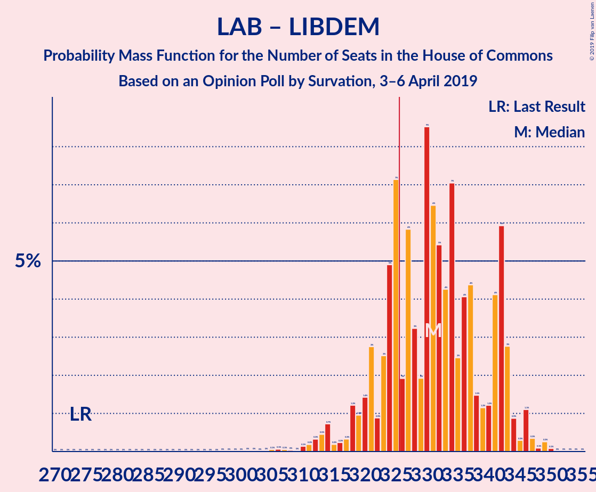

| Number of Seats | Probability | Accumulated | Special Marks |
|:---------------:|:-----------:|:-----------:|:-------------:|
| 274 | 0% | 100% | Last Result |
| 275 | 0% | 100% |  |
| 276 | 0% | 100% |  |
| 277 | 0% | 100% |  |
| 278 | 0% | 100% |  |
| 279 | 0% | 100% |  |
| 280 | 0% | 100% |  |
| 281 | 0% | 100% |  |
| 282 | 0% | 100% |  |
| 283 | 0% | 100% |  |
| 284 | 0% | 100% |  |
| 285 | 0% | 100% |  |
| 286 | 0% | 100% |  |
| 287 | 0% | 100% |  |
| 288 | 0% | 100% |  |
| 289 | 0% | 100% |  |
| 290 | 0% | 100% |  |
| 291 | 0% | 100% |  |
| 292 | 0% | 100% |  |
| 293 | 0% | 100% |  |
| 294 | 0% | 100% |  |
| 295 | 0% | 100% |  |
| 296 | 0% | 100% |  |
| 297 | 0% | 100% |  |
| 298 | 0% | 100% |  |
| 299 | 0% | 100% |  |
| 300 | 0% | 100% |  |
| 301 | 0% | 100% |  |
| 302 | 0% | 100% |  |
| 303 | 0% | 99.9% |  |
| 304 | 0% | 99.9% |  |
| 305 | 0.1% | 99.9% |  |
| 306 | 0.1% | 99.8% |  |
| 307 | 0.1% | 99.8% |  |
| 308 | 0% | 99.7% |  |
| 309 | 0% | 99.7% |  |
| 310 | 0.1% | 99.7% |  |
| 311 | 0.2% | 99.5% |  |
| 312 | 0.3% | 99.3% |  |
| 313 | 0.5% | 99.0% |  |
| 314 | 0.7% | 98.6% |  |
| 315 | 0.2% | 98% |  |
| 316 | 0.2% | 98% |  |
| 317 | 0.3% | 97% |  |
| 318 | 1.2% | 97% |  |
| 319 | 1.0% | 96% |  |
| 320 | 1.4% | 95% |  |
| 321 | 3% | 93% |  |
| 322 | 0.9% | 91% |  |
| 323 | 3% | 90% |  |
| 324 | 5% | 87% |  |
| 325 | 7% | 82% |  |
| 326 | 2% | 75% | Majority |
| 327 | 6% | 73% |  |
| 328 | 3% | 68% |  |
| 329 | 2% | 64% |  |
| 330 | 9% | 62% |  |
| 331 | 6% | 54% | Median |
| 332 | 5% | 47% |  |
| 333 | 4% | 42% |  |
| 334 | 7% | 38% |  |
| 335 | 2% | 31% |  |
| 336 | 4% | 28% |  |
| 337 | 4% | 24% |  |
| 338 | 1.5% | 20% |  |
| 339 | 1.2% | 18% |  |
| 340 | 1.2% | 17% |  |
| 341 | 4% | 16% |  |
| 342 | 6% | 12% |  |
| 343 | 3% | 6% |  |
| 344 | 0.9% | 3% |  |
| 345 | 0.3% | 2% |  |
| 346 | 1.1% | 2% |  |
| 347 | 0.3% | 0.8% |  |
| 348 | 0.1% | 0.5% |  |
| 349 | 0.3% | 0.4% |  |
| 350 | 0.1% | 0.1% |  |
| 351 | 0% | 0.1% |  |
| 352 | 0% | 0% |  |

### Labour Party – Plaid Cymru

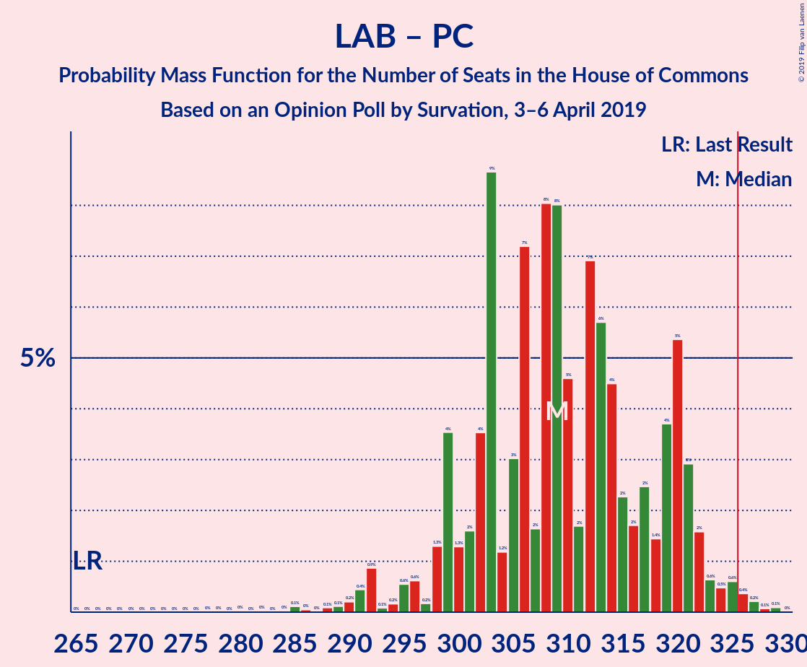

| Number of Seats | Probability | Accumulated | Special Marks |
|:---------------:|:-----------:|:-----------:|:-------------:|
| 266 | 0% | 100% | Last Result |
| 267 | 0% | 100% |  |
| 268 | 0% | 100% |  |
| 269 | 0% | 100% |  |
| 270 | 0% | 100% |  |
| 271 | 0% | 100% |  |
| 272 | 0% | 100% |  |
| 273 | 0% | 100% |  |
| 274 | 0% | 100% |  |
| 275 | 0% | 100% |  |
| 276 | 0% | 100% |  |
| 277 | 0% | 100% |  |
| 278 | 0% | 100% |  |
| 279 | 0% | 100% |  |
| 280 | 0% | 100% |  |
| 281 | 0% | 99.9% |  |
| 282 | 0% | 99.9% |  |
| 283 | 0% | 99.9% |  |
| 284 | 0% | 99.9% |  |
| 285 | 0.1% | 99.9% |  |
| 286 | 0% | 99.8% |  |
| 287 | 0% | 99.7% |  |
| 288 | 0.1% | 99.7% |  |
| 289 | 0.1% | 99.6% |  |
| 290 | 0.2% | 99.5% |  |
| 291 | 0.4% | 99.3% |  |
| 292 | 0.9% | 98.9% |  |
| 293 | 0.1% | 98% |  |
| 294 | 0.2% | 98% |  |
| 295 | 0.6% | 98% |  |
| 296 | 0.6% | 97% |  |
| 297 | 0.2% | 97% |  |
| 298 | 1.3% | 96% |  |
| 299 | 4% | 95% |  |
| 300 | 1.3% | 92% |  |
| 301 | 2% | 90% |  |
| 302 | 4% | 89% |  |
| 303 | 9% | 85% |  |
| 304 | 1.2% | 76% |  |
| 305 | 3% | 75% |  |
| 306 | 7% | 72% |  |
| 307 | 2% | 65% |  |
| 308 | 8% | 63% |  |
| 309 | 8% | 55% | Median |
| 310 | 5% | 47% |  |
| 311 | 2% | 43% |  |
| 312 | 7% | 41% |  |
| 313 | 6% | 34% |  |
| 314 | 4% | 28% |  |
| 315 | 2% | 24% |  |
| 316 | 2% | 22% |  |
| 317 | 2% | 20% |  |
| 318 | 1.4% | 18% |  |
| 319 | 4% | 16% |  |
| 320 | 5% | 12% |  |
| 321 | 3% | 7% |  |
| 322 | 2% | 4% |  |
| 323 | 0.6% | 3% |  |
| 324 | 0.5% | 2% |  |
| 325 | 0.6% | 1.4% |  |
| 326 | 0.4% | 0.8% | Majority |
| 327 | 0.2% | 0.4% |  |
| 328 | 0.1% | 0.2% |  |
| 329 | 0.1% | 0.1% |  |
| 330 | 0% | 0% |  |

### Labour Party

| Number of Seats | Probability | Accumulated | Special Marks |
|:---------------:|:-----------:|:-----------:|:-------------:|
| 262 | 0% | 100% | Last Result |
| 263 | 0% | 100% |  |
| 264 | 0% | 100% |  |
| 265 | 0% | 100% |  |
| 266 | 0% | 100% |  |
| 267 | 0% | 100% |  |
| 268 | 0% | 100% |  |
| 269 | 0% | 100% |  |
| 270 | 0% | 100% |  |
| 271 | 0% | 100% |  |
| 272 | 0% | 100% |  |
| 273 | 0% | 100% |  |
| 274 | 0% | 100% |  |
| 275 | 0% | 100% |  |
| 276 | 0% | 99.9% |  |
| 277 | 0% | 99.9% |  |
| 278 | 0% | 99.9% |  |
| 279 | 0% | 99.9% |  |
| 280 | 0.1% | 99.9% |  |
| 281 | 0.1% | 99.8% |  |
| 282 | 0% | 99.7% |  |
| 283 | 0.1% | 99.7% |  |
| 284 | 0.1% | 99.6% |  |
| 285 | 0.2% | 99.5% |  |
| 286 | 0.4% | 99.3% |  |
| 287 | 0.9% | 98.9% |  |
| 288 | 0.1% | 98% |  |
| 289 | 0.2% | 98% |  |
| 290 | 0.6% | 98% |  |
| 291 | 0.6% | 97% |  |
| 292 | 0.2% | 97% |  |
| 293 | 1.2% | 96% |  |
| 294 | 4% | 95% |  |
| 295 | 1.1% | 92% |  |
| 296 | 2% | 90% |  |
| 297 | 4% | 89% |  |
| 298 | 8% | 85% |  |
| 299 | 1.4% | 77% |  |
| 300 | 3% | 75% |  |
| 301 | 7% | 73% |  |
| 302 | 2% | 65% |  |
| 303 | 8% | 64% |  |
| 304 | 8% | 56% | Median |
| 305 | 6% | 48% |  |
| 306 | 2% | 43% |  |
| 307 | 7% | 41% |  |
| 308 | 6% | 34% |  |
| 309 | 5% | 29% |  |
| 310 | 2% | 24% |  |
| 311 | 2% | 22% |  |
| 312 | 2% | 20% |  |
| 313 | 2% | 18% |  |
| 314 | 4% | 16% |  |
| 315 | 5% | 12% |  |
| 316 | 3% | 7% |  |
| 317 | 1.4% | 4% |  |
| 318 | 0.9% | 3% |  |
| 319 | 0.5% | 2% |  |
| 320 | 0.6% | 1.4% |  |
| 321 | 0.4% | 0.8% |  |
| 322 | 0.2% | 0.4% |  |
| 323 | 0.1% | 0.2% |  |
| 324 | 0.1% | 0.1% |  |
| 325 | 0% | 0% |  |

### Conservative Party – Liberal Democrats

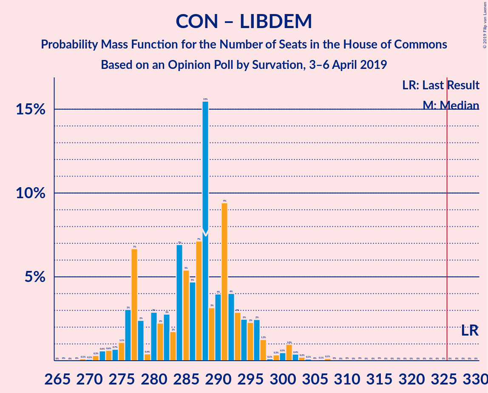

| Number of Seats | Probability | Accumulated | Special Marks |
|:---------------:|:-----------:|:-----------:|:-------------:|
| 269 | 0.1% | 100% |  |
| 270 | 0.1% | 99.8% |  |
| 271 | 0.3% | 99.8% |  |
| 272 | 0.6% | 99.5% |  |
| 273 | 0.6% | 98.9% |  |
| 274 | 0.7% | 98% |  |
| 275 | 1.1% | 98% |  |
| 276 | 3% | 97% |  |
| 277 | 7% | 93% |  |
| 278 | 2% | 87% |  |
| 279 | 0.4% | 84% |  |
| 280 | 3% | 84% |  |
| 281 | 2% | 81% |  |
| 282 | 3% | 79% |  |
| 283 | 2% | 76% |  |
| 284 | 7% | 74% |  |
| 285 | 5% | 67% |  |
| 286 | 5% | 62% |  |
| 287 | 7% | 57% |  |
| 288 | 15% | 50% | Median |
| 289 | 3% | 35% |  |
| 290 | 4% | 32% |  |
| 291 | 9% | 28% |  |
| 292 | 4% | 18% |  |
| 293 | 3% | 14% |  |
| 294 | 2% | 11% |  |
| 295 | 2% | 9% |  |
| 296 | 2% | 7% |  |
| 297 | 1.3% | 4% |  |
| 298 | 0.1% | 3% |  |
| 299 | 0.3% | 3% |  |
| 300 | 0.5% | 2% |  |
| 301 | 1.0% | 2% |  |
| 302 | 0.4% | 1.0% |  |
| 303 | 0.2% | 0.6% |  |
| 304 | 0.1% | 0.4% |  |
| 305 | 0% | 0.3% |  |
| 306 | 0.1% | 0.3% |  |
| 307 | 0.1% | 0.2% |  |
| 308 | 0% | 0.1% |  |
| 309 | 0% | 0.1% |  |
| 310 | 0% | 0.1% |  |
| 311 | 0% | 0.1% |  |
| 312 | 0% | 0.1% |  |
| 313 | 0% | 0% |  |
| 314 | 0% | 0% |  |
| 315 | 0% | 0% |  |
| 316 | 0% | 0% |  |
| 317 | 0% | 0% |  |
| 318 | 0% | 0% |  |
| 319 | 0% | 0% |  |
| 320 | 0% | 0% |  |
| 321 | 0% | 0% |  |
| 322 | 0% | 0% |  |
| 323 | 0% | 0% |  |
| 324 | 0% | 0% |  |
| 325 | 0% | 0% |  |
| 326 | 0% | 0% | Majority |
| 327 | 0% | 0% |  |
| 328 | 0% | 0% |  |
| 329 | 0% | 0% | Last Result |

### Conservative Party – Plaid Cymru

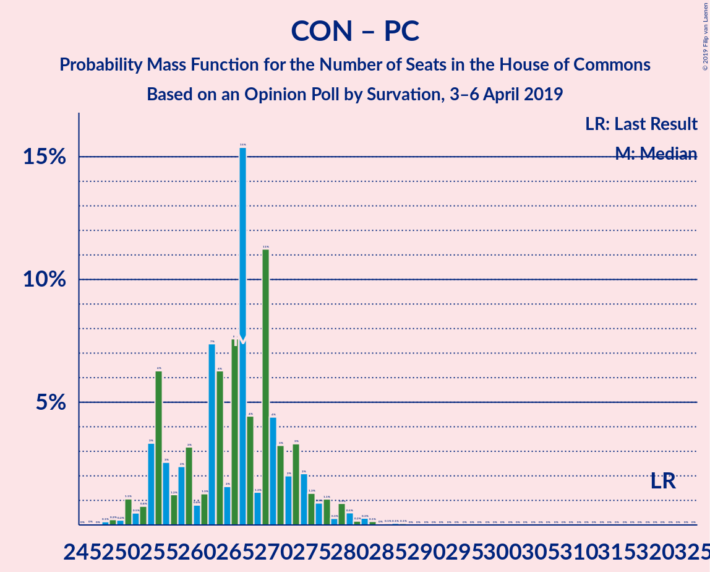

| Number of Seats | Probability | Accumulated | Special Marks |
|:---------------:|:-----------:|:-----------:|:-------------:|
| 246 | 0% | 100% |  |
| 247 | 0% | 99.9% |  |
| 248 | 0.1% | 99.9% |  |
| 249 | 0.2% | 99.8% |  |
| 250 | 0.2% | 99.6% |  |
| 251 | 1.1% | 99.4% |  |
| 252 | 0.5% | 98% |  |
| 253 | 0.8% | 98% |  |
| 254 | 3% | 97% |  |
| 255 | 6% | 94% |  |
| 256 | 3% | 87% |  |
| 257 | 1.2% | 85% |  |
| 258 | 2% | 84% |  |
| 259 | 3% | 81% |  |
| 260 | 0.8% | 78% |  |
| 261 | 1.3% | 77% |  |
| 262 | 7% | 76% |  |
| 263 | 6% | 69% |  |
| 264 | 2% | 62% |  |
| 265 | 8% | 61% |  |
| 266 | 15% | 53% | Median |
| 267 | 4% | 38% |  |
| 268 | 1.3% | 33% |  |
| 269 | 11% | 32% |  |
| 270 | 4% | 21% |  |
| 271 | 3% | 16% |  |
| 272 | 2% | 13% |  |
| 273 | 3% | 11% |  |
| 274 | 2% | 8% |  |
| 275 | 1.3% | 6% |  |
| 276 | 0.9% | 4% |  |
| 277 | 1.1% | 4% |  |
| 278 | 0.3% | 3% |  |
| 279 | 0.9% | 2% |  |
| 280 | 0.5% | 1.4% |  |
| 281 | 0.2% | 0.9% |  |
| 282 | 0.3% | 0.7% |  |
| 283 | 0.1% | 0.5% |  |
| 284 | 0% | 0.3% |  |
| 285 | 0.1% | 0.3% |  |
| 286 | 0.1% | 0.2% |  |
| 287 | 0.1% | 0.2% |  |
| 288 | 0% | 0.1% |  |
| 289 | 0% | 0.1% |  |
| 290 | 0% | 0.1% |  |
| 291 | 0% | 0% |  |
| 292 | 0% | 0% |  |
| 293 | 0% | 0% |  |
| 294 | 0% | 0% |  |
| 295 | 0% | 0% |  |
| 296 | 0% | 0% |  |
| 297 | 0% | 0% |  |
| 298 | 0% | 0% |  |
| 299 | 0% | 0% |  |
| 300 | 0% | 0% |  |
| 301 | 0% | 0% |  |
| 302 | 0% | 0% |  |
| 303 | 0% | 0% |  |
| 304 | 0% | 0% |  |
| 305 | 0% | 0% |  |
| 306 | 0% | 0% |  |
| 307 | 0% | 0% |  |
| 308 | 0% | 0% |  |
| 309 | 0% | 0% |  |
| 310 | 0% | 0% |  |
| 311 | 0% | 0% |  |
| 312 | 0% | 0% |  |
| 313 | 0% | 0% |  |
| 314 | 0% | 0% |  |
| 315 | 0% | 0% |  |
| 316 | 0% | 0% |  |
| 317 | 0% | 0% |  |
| 318 | 0% | 0% |  |
| 319 | 0% | 0% |  |
| 320 | 0% | 0% |  |
| 321 | 0% | 0% | Last Result |

### Conservative Party

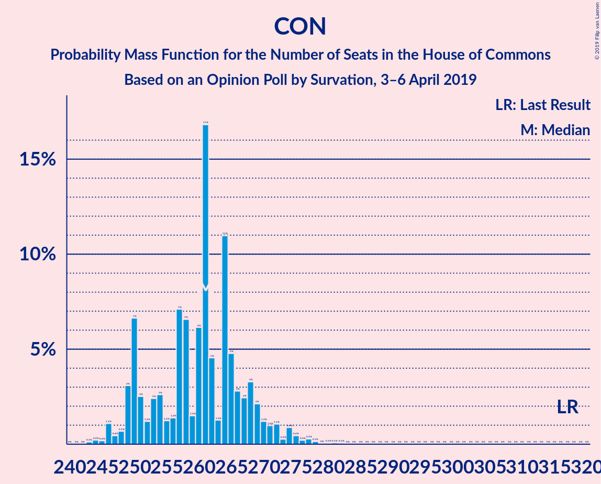

| Number of Seats | Probability | Accumulated | Special Marks |
|:---------------:|:-----------:|:-----------:|:-------------:|
| 241 | 0% | 100% |  |
| 242 | 0% | 99.9% |  |
| 243 | 0.1% | 99.9% |  |
| 244 | 0.2% | 99.8% |  |
| 245 | 0.2% | 99.6% |  |
| 246 | 1.1% | 99.4% |  |
| 247 | 0.4% | 98% |  |
| 248 | 0.7% | 98% |  |
| 249 | 3% | 97% |  |
| 250 | 7% | 94% |  |
| 251 | 3% | 87% |  |
| 252 | 1.2% | 85% |  |
| 253 | 2% | 84% |  |
| 254 | 3% | 81% |  |
| 255 | 1.2% | 79% |  |
| 256 | 1.4% | 77% |  |
| 257 | 7% | 76% |  |
| 258 | 7% | 69% |  |
| 259 | 1.5% | 62% |  |
| 260 | 6% | 61% |  |
| 261 | 17% | 55% | Median |
| 262 | 5% | 38% |  |
| 263 | 1.3% | 33% |  |
| 264 | 11% | 32% |  |
| 265 | 5% | 21% |  |
| 266 | 3% | 16% |  |
| 267 | 2% | 14% |  |
| 268 | 3% | 11% |  |
| 269 | 2% | 8% |  |
| 270 | 1.2% | 6% |  |
| 271 | 1.0% | 5% |  |
| 272 | 1.1% | 4% |  |
| 273 | 0.3% | 3% |  |
| 274 | 0.9% | 2% |  |
| 275 | 0.4% | 1.4% |  |
| 276 | 0.2% | 0.9% |  |
| 277 | 0.3% | 0.7% |  |
| 278 | 0.1% | 0.5% |  |
| 279 | 0% | 0.3% |  |
| 280 | 0.1% | 0.3% |  |
| 281 | 0.1% | 0.2% |  |
| 282 | 0.1% | 0.2% |  |
| 283 | 0% | 0.1% |  |
| 284 | 0% | 0.1% |  |
| 285 | 0% | 0.1% |  |
| 286 | 0% | 0% |  |
| 287 | 0% | 0% |  |
| 288 | 0% | 0% |  |
| 289 | 0% | 0% |  |
| 290 | 0% | 0% |  |
| 291 | 0% | 0% |  |
| 292 | 0% | 0% |  |
| 293 | 0% | 0% |  |
| 294 | 0% | 0% |  |
| 295 | 0% | 0% |  |
| 296 | 0% | 0% |  |
| 297 | 0% | 0% |  |
| 298 | 0% | 0% |  |
| 299 | 0% | 0% |  |
| 300 | 0% | 0% |  |
| 301 | 0% | 0% |  |
| 302 | 0% | 0% |  |
| 303 | 0% | 0% |  |
| 304 | 0% | 0% |  |
| 305 | 0% | 0% |  |
| 306 | 0% | 0% |  |
| 307 | 0% | 0% |  |
| 308 | 0% | 0% |  |
| 309 | 0% | 0% |  |
| 310 | 0% | 0% |  |
| 311 | 0% | 0% |  |
| 312 | 0% | 0% |  |
| 313 | 0% | 0% |  |
| 314 | 0% | 0% |  |
| 315 | 0% | 0% |  |
| 316 | 0% | 0% |  |
| 317 | 0% | 0% | Last Result |

## Technical Information

### Opinion Poll

+ **Polling firm:** Survation
+ **Commissioner(s):** —
+ **Fieldwork period:** 3–6 April 2019

### Calculations

+ **Sample size:** 6062
+ **Simulations done:** 131,072
+ **Error estimate:** 0.58%

