# Opinion Poll by Survation for Daily Mail, 22 May 2019

<a href="#voting-intentions">Voting Intentions</a> | <a href="#seats">Seats</a> | <a href="#coalitions">Coalitions</a> | <a href="#technical-information">Technical Information</a>

## Voting Intentions

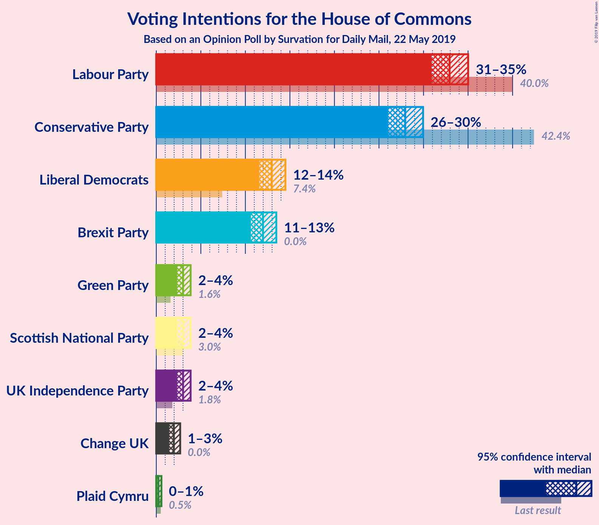

### Confidence Intervals

| Party | Last Result | Poll Result | 80% Confidence Interval | 90% Confidence Interval | 95% Confidence Interval | 99% Confidence Interval |
|:-----:|:-----------:|:-----------:|:-----------------------:|:-----------------------:|:-----------------------:|:-----------------------:|
| Labour Party | 40.0% | 32.9% | 31.6–34.3% |31.2–34.7% |30.9–35.0% |30.3–35.7% |
| Conservative Party | 42.4% | 27.9% | 26.7–29.2% |26.3–29.6% |26.0–29.9% |25.4–30.6% |
| Liberal Democrats | 7.4% | 13.0% | 12.0–14.0% |11.8–14.3% |11.6–14.5% |11.1–15.0% |
| Brexit Party | 0.0% | 12.0% | 11.1–13.0% |10.8–13.2% |10.6–13.5% |10.2–13.9% |
| Scottish National Party | 3.0% | 3.0% | 2.6–3.6% |2.4–3.7% |2.3–3.9% |2.1–4.1% |
| UK Independence Party | 1.8% | 3.0% | 2.6–3.6% |2.4–3.7% |2.3–3.9% |2.1–4.1% |
| Green Party | 1.6% | 3.0% | 2.6–3.6% |2.4–3.7% |2.3–3.9% |2.1–4.1% |
| Change UK | 0.0% | 2.0% | 1.6–2.4% |1.5–2.6% |1.4–2.7% |1.3–2.9% |
| Plaid Cymru | 0.5% | 0.2% | 0.2–0.5% |0.1–0.5% |0.1–0.6% |0.1–0.7% |

*Note:* The poll result column reflects the actual value used in the calculations. Published results may vary slightly, and in addition be rounded to fewer digits.

## Seats

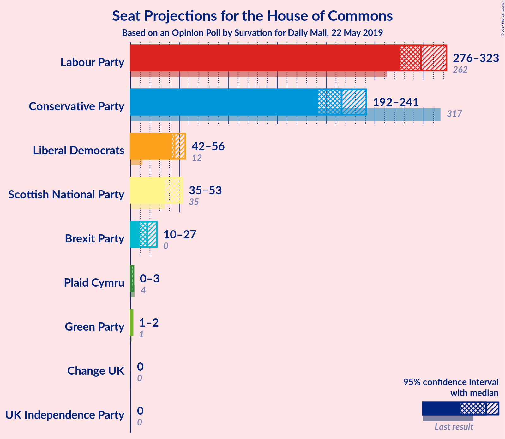

### Confidence Intervals

| Party | Last Result | Median | 80% Confidence Interval | 90% Confidence Interval | 95% Confidence Interval | 99% Confidence Interval |
|:-----:|:-----------:|:------:|:-----------------------:|:-----------------------:|:-----------------------:|:-----------------------:|
| <a href="#labour-party">Labour Party</a> | 262 | 297 | 282–312 |279–316 |276–323 |267–335 |
| <a href="#conservative-party">Conservative Party</a> | 317 | 216 | 202–232 |196–235 |192–241 |185–248 |
| <a href="#liberal-democrats">Liberal Democrats</a> | 12 | 45 | 44–54 |44–55 |42–56 |40–58 |
| <a href="#brexit-party">Brexit Party</a> | 0 | 17 | 12–24 |11–26 |10–27 |6–30 |
| <a href="#scottish-national-party">Scottish National Party</a> | 35 | 51 | 49–53 |39–53 |35–53 |21–53 |
| <a href="#uk-independence-party">UK Independence Party</a> | 0 | 0 | 0 |0 |0 |0 |
| <a href="#green-party">Green Party</a> | 1 | 1 | 1–2 |1–2 |1–2 |1–2 |
| <a href="#change-uk">Change UK</a> | 0 | 0 | 0 |0 |0 |0 |
| <a href="#plaid-cymru">Plaid Cymru</a> | 4 | 1 | 0–3 |0–3 |0–3 |0–4 |

### Labour Party

*For a full overview of the results for this party, see the [Labour Party](party-labourparty.html) page.*

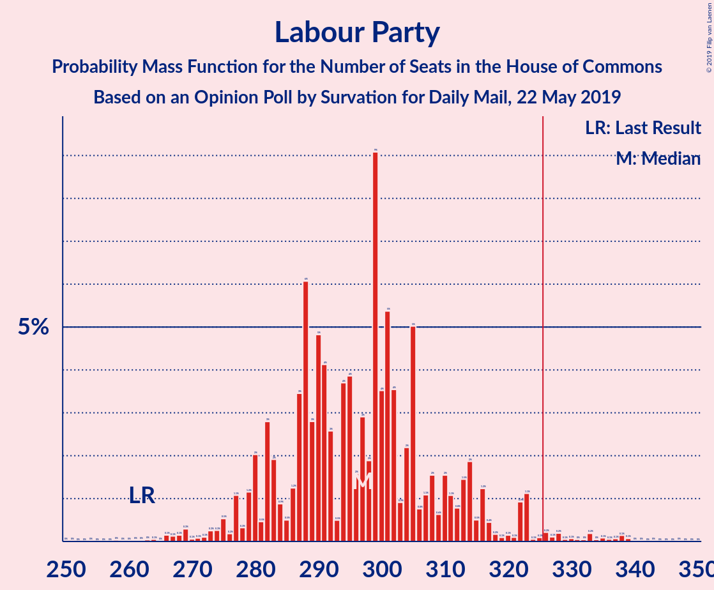

| Number of Seats | Probability | Accumulated | Special Marks |
|:---------------:|:-----------:|:-----------:|:-------------:|
| 251 | 0% | 100% |  |
| 252 | 0% | 99.9% |  |
| 253 | 0% | 99.9% |  |
| 254 | 0% | 99.9% |  |
| 255 | 0% | 99.9% |  |
| 256 | 0% | 99.9% |  |
| 257 | 0% | 99.9% |  |
| 258 | 0% | 99.9% |  |
| 259 | 0% | 99.9% |  |
| 260 | 0% | 99.8% |  |
| 261 | 0% | 99.8% |  |
| 262 | 0% | 99.8% | Last Result |
| 263 | 0% | 99.8% |  |
| 264 | 0.1% | 99.7% |  |
| 265 | 0% | 99.7% |  |
| 266 | 0.1% | 99.7% |  |
| 267 | 0.1% | 99.5% |  |
| 268 | 0.1% | 99.4% |  |
| 269 | 0.3% | 99.2% |  |
| 270 | 0.1% | 98.9% |  |
| 271 | 0.1% | 98.9% |  |
| 272 | 0.1% | 98.8% |  |
| 273 | 0.3% | 98.7% |  |
| 274 | 0.3% | 98% |  |
| 275 | 0.5% | 98% |  |
| 276 | 0.2% | 98% |  |
| 277 | 1.1% | 97% |  |
| 278 | 0.3% | 96% |  |
| 279 | 1.2% | 96% |  |
| 280 | 2% | 95% |  |
| 281 | 0.5% | 93% |  |
| 282 | 3% | 92% |  |
| 283 | 2% | 90% |  |
| 284 | 0.9% | 88% |  |
| 285 | 0.5% | 87% |  |
| 286 | 1.2% | 86% |  |
| 287 | 3% | 85% |  |
| 288 | 6% | 82% |  |
| 289 | 3% | 76% |  |
| 290 | 5% | 73% |  |
| 291 | 4% | 68% |  |
| 292 | 3% | 64% |  |
| 293 | 0.5% | 61% |  |
| 294 | 4% | 61% |  |
| 295 | 4% | 57% |  |
| 296 | 2% | 53% |  |
| 297 | 3% | 52% | Median |
| 298 | 2% | 49% |  |
| 299 | 9% | 47% |  |
| 300 | 4% | 38% |  |
| 301 | 5% | 34% |  |
| 302 | 4% | 29% |  |
| 303 | 0.9% | 25% |  |
| 304 | 2% | 24% |  |
| 305 | 5% | 22% |  |
| 306 | 0.8% | 17% |  |
| 307 | 1.1% | 16% |  |
| 308 | 2% | 15% |  |
| 309 | 0.6% | 14% |  |
| 310 | 2% | 13% |  |
| 311 | 1.1% | 12% |  |
| 312 | 0.8% | 10% |  |
| 313 | 1.5% | 10% |  |
| 314 | 2% | 8% |  |
| 315 | 0.5% | 6% |  |
| 316 | 1.2% | 6% |  |
| 317 | 0.4% | 5% |  |
| 318 | 0.2% | 4% |  |
| 319 | 0.1% | 4% |  |
| 320 | 0.1% | 4% |  |
| 321 | 0.1% | 4% |  |
| 322 | 0.9% | 4% |  |
| 323 | 1.1% | 3% |  |
| 324 | 0.1% | 2% |  |
| 325 | 0.1% | 2% |  |
| 326 | 0.2% | 2% | Majority |
| 327 | 0.1% | 1.3% |  |
| 328 | 0.2% | 1.2% |  |
| 329 | 0.1% | 1.0% |  |
| 330 | 0.1% | 0.9% |  |
| 331 | 0% | 0.9% |  |
| 332 | 0% | 0.8% |  |
| 333 | 0.2% | 0.8% |  |
| 334 | 0% | 0.6% |  |
| 335 | 0.1% | 0.6% |  |
| 336 | 0.1% | 0.5% |  |
| 337 | 0.1% | 0.4% |  |
| 338 | 0.1% | 0.3% |  |
| 339 | 0.1% | 0.2% |  |
| 340 | 0% | 0.1% |  |
| 341 | 0% | 0.1% |  |
| 342 | 0% | 0.1% |  |
| 343 | 0% | 0.1% |  |
| 344 | 0% | 0.1% |  |
| 345 | 0% | 0.1% |  |
| 346 | 0% | 0.1% |  |
| 347 | 0% | 0.1% |  |
| 348 | 0% | 0% |  |

### Conservative Party

*For a full overview of the results for this party, see the [Conservative Party](party-conservativeparty.html) page.*

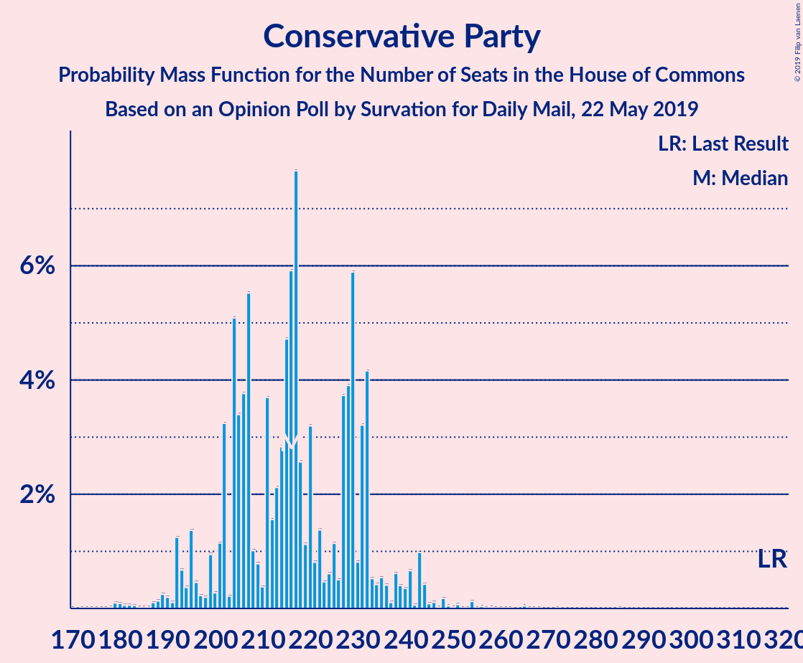

| Number of Seats | Probability | Accumulated | Special Marks |
|:---------------:|:-----------:|:-----------:|:-------------:|
| 174 | 0% | 100% |  |
| 175 | 0% | 99.9% |  |
| 176 | 0% | 99.9% |  |
| 177 | 0% | 99.9% |  |
| 178 | 0% | 99.9% |  |
| 179 | 0.1% | 99.9% |  |
| 180 | 0.1% | 99.8% |  |
| 181 | 0.1% | 99.7% |  |
| 182 | 0.1% | 99.7% |  |
| 183 | 0.1% | 99.6% |  |
| 184 | 0% | 99.5% |  |
| 185 | 0% | 99.5% |  |
| 186 | 0% | 99.5% |  |
| 187 | 0.1% | 99.5% |  |
| 188 | 0.1% | 99.4% |  |
| 189 | 0.2% | 99.2% |  |
| 190 | 0.2% | 99.0% |  |
| 191 | 0.1% | 98.8% |  |
| 192 | 1.2% | 98.7% |  |
| 193 | 0.7% | 97% |  |
| 194 | 0.4% | 97% |  |
| 195 | 1.4% | 96% |  |
| 196 | 0.5% | 95% |  |
| 197 | 0.2% | 95% |  |
| 198 | 0.2% | 94% |  |
| 199 | 0.9% | 94% |  |
| 200 | 0.3% | 93% |  |
| 201 | 1.1% | 93% |  |
| 202 | 3% | 92% |  |
| 203 | 0.2% | 89% |  |
| 204 | 5% | 88% |  |
| 205 | 3% | 83% |  |
| 206 | 4% | 80% |  |
| 207 | 6% | 76% |  |
| 208 | 1.0% | 71% |  |
| 209 | 0.8% | 70% |  |
| 210 | 0.4% | 69% |  |
| 211 | 4% | 68% |  |
| 212 | 2% | 65% |  |
| 213 | 2% | 63% |  |
| 214 | 3% | 61% |  |
| 215 | 5% | 58% |  |
| 216 | 6% | 53% | Median |
| 217 | 8% | 48% |  |
| 218 | 3% | 40% |  |
| 219 | 1.1% | 37% |  |
| 220 | 3% | 36% |  |
| 221 | 0.8% | 33% |  |
| 222 | 1.4% | 32% |  |
| 223 | 0.5% | 31% |  |
| 224 | 0.6% | 30% |  |
| 225 | 1.1% | 30% |  |
| 226 | 0.5% | 29% |  |
| 227 | 4% | 28% |  |
| 228 | 4% | 24% |  |
| 229 | 6% | 20% |  |
| 230 | 0.8% | 15% |  |
| 231 | 3% | 14% |  |
| 232 | 4% | 11% |  |
| 233 | 0.5% | 6% |  |
| 234 | 0.4% | 6% |  |
| 235 | 0.5% | 5% |  |
| 236 | 0.4% | 5% |  |
| 237 | 0.1% | 4% |  |
| 238 | 0.6% | 4% |  |
| 239 | 0.4% | 4% |  |
| 240 | 0.4% | 3% |  |
| 241 | 0.7% | 3% |  |
| 242 | 0.1% | 2% |  |
| 243 | 1.0% | 2% |  |
| 244 | 0.4% | 1.3% |  |
| 245 | 0.1% | 0.9% |  |
| 246 | 0.1% | 0.8% |  |
| 247 | 0% | 0.7% |  |
| 248 | 0.2% | 0.7% |  |
| 249 | 0% | 0.5% |  |
| 250 | 0% | 0.5% |  |
| 251 | 0.1% | 0.4% |  |
| 252 | 0% | 0.4% |  |
| 253 | 0% | 0.4% |  |
| 254 | 0.1% | 0.3% |  |
| 255 | 0% | 0.2% |  |
| 256 | 0% | 0.2% |  |
| 257 | 0% | 0.2% |  |
| 258 | 0% | 0.2% |  |
| 259 | 0% | 0.2% |  |
| 260 | 0% | 0.1% |  |
| 261 | 0% | 0.1% |  |
| 262 | 0% | 0.1% |  |
| 263 | 0% | 0.1% |  |
| 264 | 0% | 0.1% |  |
| 265 | 0% | 0.1% |  |
| 266 | 0% | 0.1% |  |
| 267 | 0% | 0% |  |
| 268 | 0% | 0% |  |
| 269 | 0% | 0% |  |
| 270 | 0% | 0% |  |
| 271 | 0% | 0% |  |
| 272 | 0% | 0% |  |
| 273 | 0% | 0% |  |
| 274 | 0% | 0% |  |
| 275 | 0% | 0% |  |
| 276 | 0% | 0% |  |
| 277 | 0% | 0% |  |
| 278 | 0% | 0% |  |
| 279 | 0% | 0% |  |
| 280 | 0% | 0% |  |
| 281 | 0% | 0% |  |
| 282 | 0% | 0% |  |
| 283 | 0% | 0% |  |
| 284 | 0% | 0% |  |
| 285 | 0% | 0% |  |
| 286 | 0% | 0% |  |
| 287 | 0% | 0% |  |
| 288 | 0% | 0% |  |
| 289 | 0% | 0% |  |
| 290 | 0% | 0% |  |
| 291 | 0% | 0% |  |
| 292 | 0% | 0% |  |
| 293 | 0% | 0% |  |
| 294 | 0% | 0% |  |
| 295 | 0% | 0% |  |
| 296 | 0% | 0% |  |
| 297 | 0% | 0% |  |
| 298 | 0% | 0% |  |
| 299 | 0% | 0% |  |
| 300 | 0% | 0% |  |
| 301 | 0% | 0% |  |
| 302 | 0% | 0% |  |
| 303 | 0% | 0% |  |
| 304 | 0% | 0% |  |
| 305 | 0% | 0% |  |
| 306 | 0% | 0% |  |
| 307 | 0% | 0% |  |
| 308 | 0% | 0% |  |
| 309 | 0% | 0% |  |
| 310 | 0% | 0% |  |
| 311 | 0% | 0% |  |
| 312 | 0% | 0% |  |
| 313 | 0% | 0% |  |
| 314 | 0% | 0% |  |
| 315 | 0% | 0% |  |
| 316 | 0% | 0% |  |
| 317 | 0% | 0% | Last Result |

### Liberal Democrats

*For a full overview of the results for this party, see the [Liberal Democrats](party-liberaldemocrats.html) page.*

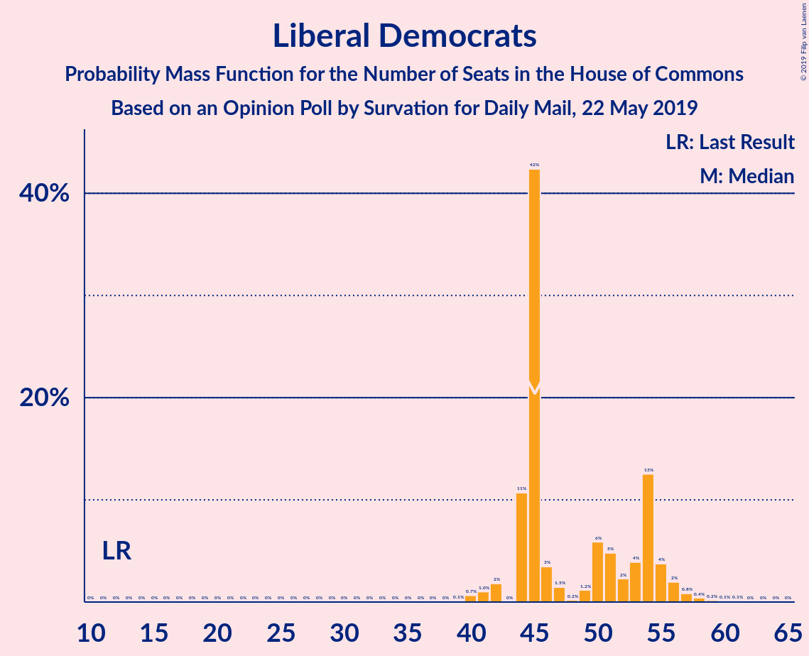

| Number of Seats | Probability | Accumulated | Special Marks |
|:---------------:|:-----------:|:-----------:|:-------------:|
| 12 | 0% | 100% | Last Result |
| 13 | 0% | 100% |  |
| 14 | 0% | 100% |  |
| 15 | 0% | 100% |  |
| 16 | 0% | 100% |  |
| 17 | 0% | 100% |  |
| 18 | 0% | 100% |  |
| 19 | 0% | 100% |  |
| 20 | 0% | 100% |  |
| 21 | 0% | 100% |  |
| 22 | 0% | 100% |  |
| 23 | 0% | 100% |  |
| 24 | 0% | 100% |  |
| 25 | 0% | 100% |  |
| 26 | 0% | 100% |  |
| 27 | 0% | 100% |  |
| 28 | 0% | 100% |  |
| 29 | 0% | 100% |  |
| 30 | 0% | 100% |  |
| 31 | 0% | 100% |  |
| 32 | 0% | 100% |  |
| 33 | 0% | 100% |  |
| 34 | 0% | 100% |  |
| 35 | 0% | 100% |  |
| 36 | 0% | 100% |  |
| 37 | 0% | 100% |  |
| 38 | 0% | 99.9% |  |
| 39 | 0.1% | 99.9% |  |
| 40 | 0.7% | 99.8% |  |
| 41 | 1.0% | 99.1% |  |
| 42 | 2% | 98% |  |
| 43 | 0% | 96% |  |
| 44 | 11% | 96% |  |
| 45 | 42% | 86% | Median |
| 46 | 3% | 43% |  |
| 47 | 1.5% | 40% |  |
| 48 | 0.2% | 38% |  |
| 49 | 1.2% | 38% |  |
| 50 | 6% | 37% |  |
| 51 | 5% | 31% |  |
| 52 | 2% | 26% |  |
| 53 | 4% | 24% |  |
| 54 | 13% | 20% |  |
| 55 | 4% | 7% |  |
| 56 | 2% | 4% |  |
| 57 | 0.8% | 2% |  |
| 58 | 0.4% | 0.9% |  |
| 59 | 0.2% | 0.5% |  |
| 60 | 0.1% | 0.3% |  |
| 61 | 0.1% | 0.2% |  |
| 62 | 0% | 0.1% |  |
| 63 | 0% | 0.1% |  |
| 64 | 0% | 0% |  |

### Brexit Party

*For a full overview of the results for this party, see the [Brexit Party](party-brexitparty.html) page.*

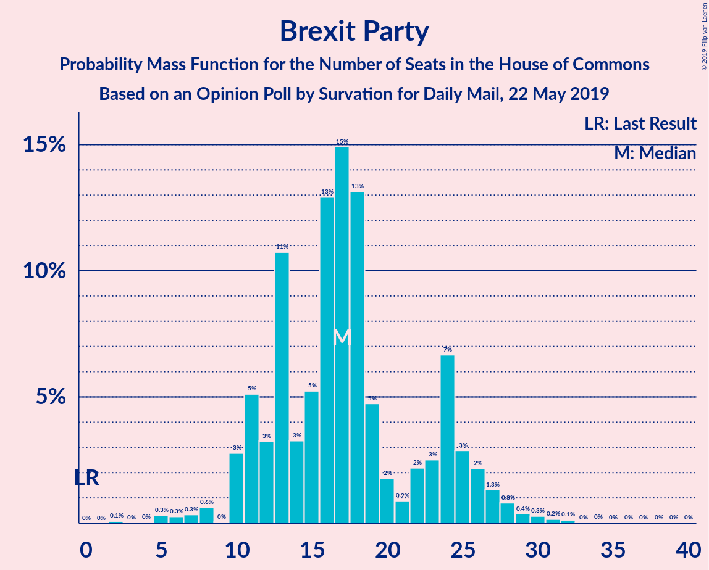

| Number of Seats | Probability | Accumulated | Special Marks |
|:---------------:|:-----------:|:-----------:|:-------------:|
| 0 | 0% | 100% | Last Result |
| 1 | 0% | 100% |  |
| 2 | 0.1% | 100% |  |
| 3 | 0% | 99.9% |  |
| 4 | 0% | 99.9% |  |
| 5 | 0.3% | 99.9% |  |
| 6 | 0.3% | 99.5% |  |
| 7 | 0.3% | 99.3% |  |
| 8 | 0.6% | 99.0% |  |
| 9 | 0% | 98% |  |
| 10 | 3% | 98% |  |
| 11 | 5% | 96% |  |
| 12 | 3% | 90% |  |
| 13 | 11% | 87% |  |
| 14 | 3% | 76% |  |
| 15 | 5% | 73% |  |
| 16 | 13% | 68% |  |
| 17 | 15% | 55% | Median |
| 18 | 13% | 40% |  |
| 19 | 5% | 27% |  |
| 20 | 2% | 22% |  |
| 21 | 0.9% | 20% |  |
| 22 | 2% | 20% |  |
| 23 | 3% | 17% |  |
| 24 | 7% | 15% |  |
| 25 | 3% | 8% |  |
| 26 | 2% | 5% |  |
| 27 | 1.3% | 3% |  |
| 28 | 0.8% | 2% |  |
| 29 | 0.4% | 1.0% |  |
| 30 | 0.3% | 0.7% |  |
| 31 | 0.2% | 0.4% |  |
| 32 | 0.1% | 0.2% |  |
| 33 | 0% | 0.1% |  |
| 34 | 0% | 0.1% |  |
| 35 | 0% | 0.1% |  |
| 36 | 0% | 0.1% |  |
| 37 | 0% | 0.1% |  |
| 38 | 0% | 0% |  |

### Scottish National Party

*For a full overview of the results for this party, see the [Scottish National Party](party-scottishnationalparty.html) page.*

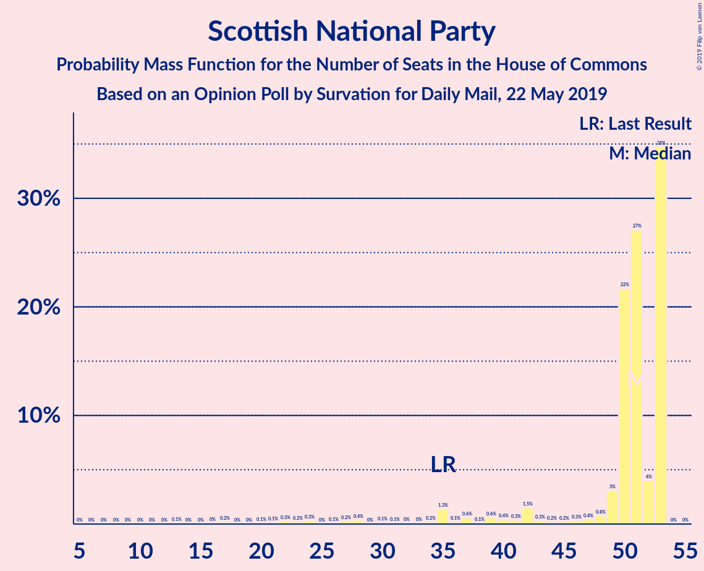

| Number of Seats | Probability | Accumulated | Special Marks |
|:---------------:|:-----------:|:-----------:|:-------------:|
| 7 | 0% | 100% |  |
| 8 | 0% | 99.9% |  |
| 9 | 0% | 99.9% |  |
| 10 | 0% | 99.9% |  |
| 11 | 0% | 99.9% |  |
| 12 | 0% | 99.9% |  |
| 13 | 0.1% | 99.9% |  |
| 14 | 0% | 99.8% |  |
| 15 | 0% | 99.8% |  |
| 16 | 0% | 99.8% |  |
| 17 | 0.2% | 99.8% |  |
| 18 | 0% | 99.6% |  |
| 19 | 0% | 99.6% |  |
| 20 | 0.1% | 99.6% |  |
| 21 | 0.1% | 99.5% |  |
| 22 | 0.3% | 99.4% |  |
| 23 | 0.2% | 99.1% |  |
| 24 | 0.3% | 99.0% |  |
| 25 | 0% | 98.7% |  |
| 26 | 0.1% | 98.6% |  |
| 27 | 0.2% | 98.6% |  |
| 28 | 0.4% | 98% |  |
| 29 | 0% | 98% |  |
| 30 | 0.1% | 98% |  |
| 31 | 0.1% | 98% |  |
| 32 | 0% | 98% |  |
| 33 | 0% | 98% |  |
| 34 | 0.2% | 98% |  |
| 35 | 1.3% | 98% | Last Result |
| 36 | 0.1% | 96% |  |
| 37 | 0.6% | 96% |  |
| 38 | 0.1% | 96% |  |
| 39 | 0.6% | 95% |  |
| 40 | 0.4% | 95% |  |
| 41 | 0.3% | 94% |  |
| 42 | 1.5% | 94% |  |
| 43 | 0.3% | 93% |  |
| 44 | 0.2% | 92% |  |
| 45 | 0.2% | 92% |  |
| 46 | 0.3% | 92% |  |
| 47 | 0.4% | 92% |  |
| 48 | 0.8% | 91% |  |
| 49 | 3% | 91% |  |
| 50 | 22% | 87% |  |
| 51 | 27% | 66% | Median |
| 52 | 4% | 39% |  |
| 53 | 35% | 35% |  |
| 54 | 0% | 0% |  |

### UK Independence Party

*For a full overview of the results for this party, see the [UK Independence Party](party-ukindependenceparty.html) page.*

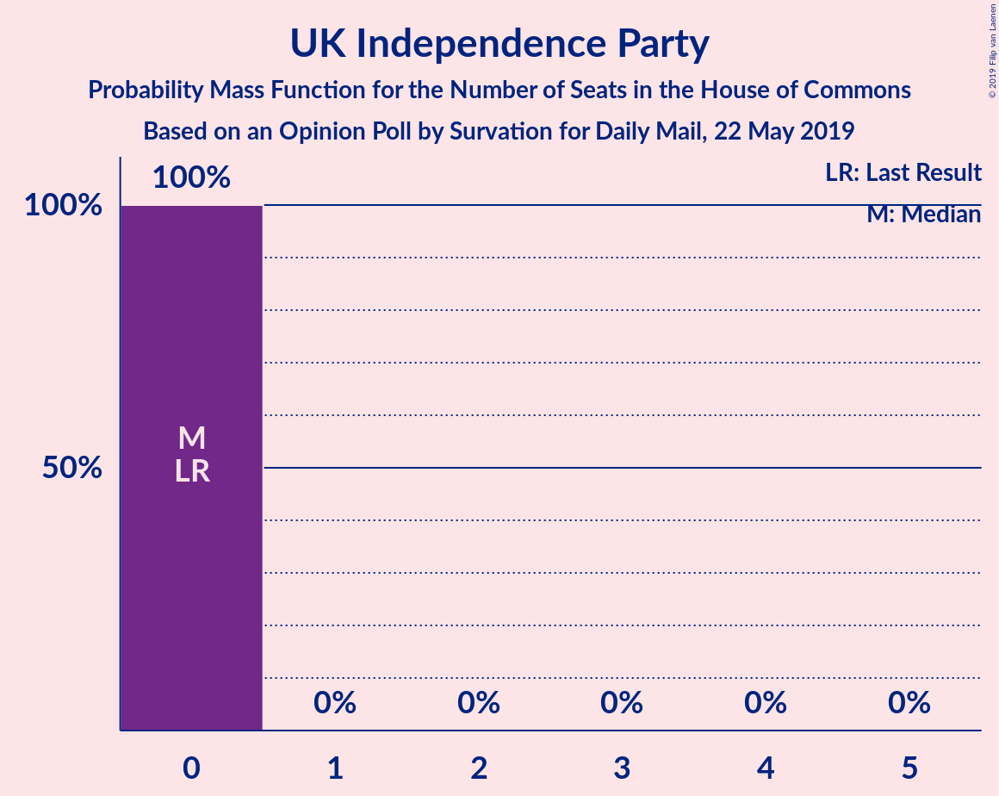

| Number of Seats | Probability | Accumulated | Special Marks |
|:---------------:|:-----------:|:-----------:|:-------------:|
| 0 | 100% | 100% | Last Result, Median |

### Green Party

*For a full overview of the results for this party, see the [Green Party](party-greenparty.html) page.*

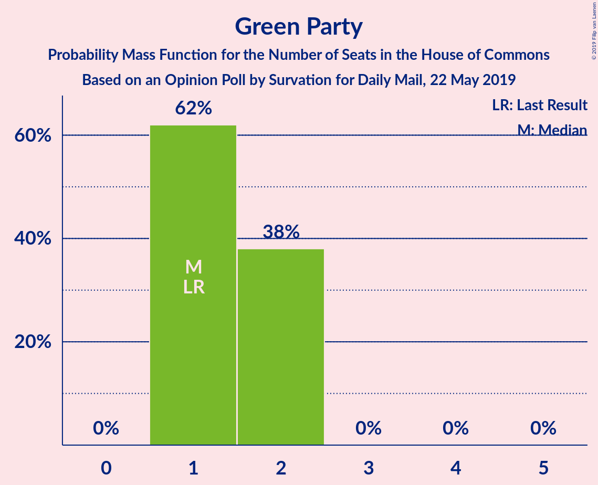

| Number of Seats | Probability | Accumulated | Special Marks |
|:---------------:|:-----------:|:-----------:|:-------------:|
| 1 | 62% | 100% | Last Result, Median |
| 2 | 38% | 38% |  |
| 3 | 0% | 0% |  |

### Change UK

*For a full overview of the results for this party, see the [Change UK](party-changeuk.html) page.*

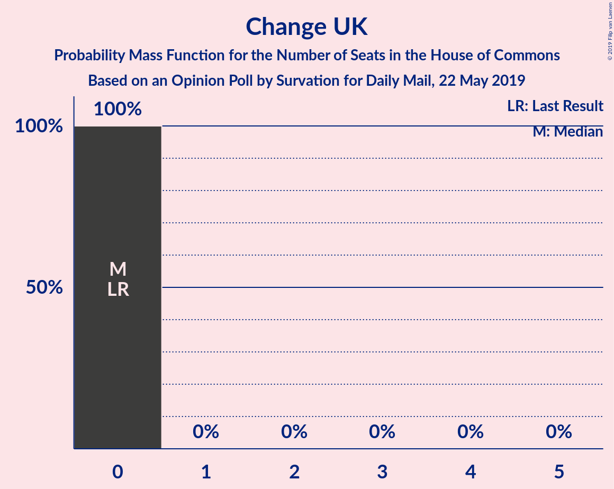

| Number of Seats | Probability | Accumulated | Special Marks |
|:---------------:|:-----------:|:-----------:|:-------------:|
| 0 | 100% | 100% | Last Result, Median |

### Plaid Cymru

*For a full overview of the results for this party, see the [Plaid Cymru](party-plaidcymru.html) page.*

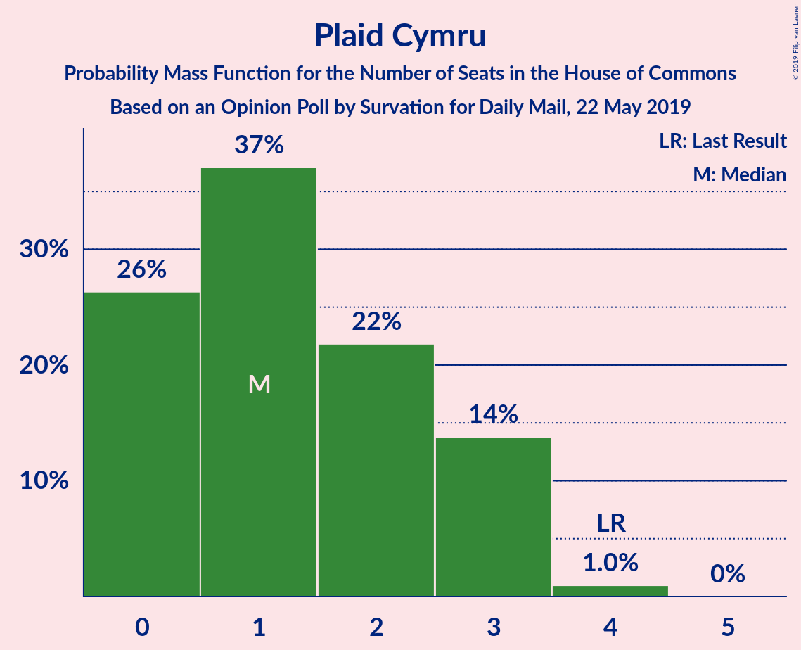

| Number of Seats | Probability | Accumulated | Special Marks |
|:---------------:|:-----------:|:-----------:|:-------------:|
| 0 | 26% | 100% |  |
| 1 | 37% | 74% | Median |
| 2 | 22% | 37% |  |
| 3 | 14% | 15% |  |
| 4 | 1.0% | 1.0% | Last Result |
| 5 | 0% | 0% |  |

## Coalitions

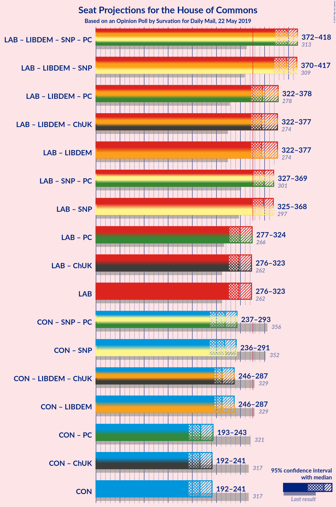

### Confidence Intervals

| Coalition | Last Result | Median | Majority? | 80% Confidence Interval | 90% Confidence Interval | 95% Confidence Interval | 99% Confidence Interval |
|:---------:|:-----------:|:------:|:---------:|:-----------------------:|:-----------------------:|:-----------------------:|:-----------------------:|
| Labour Party – Liberal Democrats – Scottish National Party – Plaid Cymru | 313 | 397 | 100% | 382–412 | 375–416 | 372–418 | 363–428 |
| Labour Party – Liberal Democrats – Scottish National Party | 309 | 396 | 100% | 380–411 | 375–415 | 370–417 | 362–428 |
| Labour Party – Liberal Democrats – Plaid Cymru | 278 | 346 | 95% | 332–363 | 325–369 | 322–378 | 313–390 |
| Labour Party – Liberal Democrats – Change UK | 274 | 344 | 94% | 330–361 | 325–367 | 322–377 | 313–389 |
| Labour Party – Liberal Democrats | 274 | 344 | 94% | 330–361 | 325–367 | 322–377 | 313–389 |
| Labour Party – Scottish National Party – Plaid Cymru | 301 | 349 | 98% | 334–362 | 330–367 | 327–369 | 317–377 |
| Labour Party – Scottish National Party | 297 | 348 | 97% | 332–360 | 329–365 | 325–368 | 315–376 |
| Labour Party – Plaid Cymru | 266 | 299 | 2% | 284–313 | 280–317 | 277–324 | 268–336 |
| Labour Party – Change UK | 262 | 297 | 2% | 282–312 | 279–316 | 276–323 | 267–335 |
| Labour Party | 262 | 297 | 2% | 282–312 | 279–316 | 276–323 | 267–335 |
| Conservative Party – Scottish National Party – Plaid Cymru | 356 | 268 | 0% | 253–283 | 246–285 | 237–293 | 225–299 |
| Conservative Party – Scottish National Party | 352 | 267 | 0% | 251–282 | 245–284 | 236–291 | 225–297 |
| Conservative Party – Liberal Democrats – Change UK | 329 | 262 | 0% | 251–277 | 248–281 | 246–287 | 237–295 |
| Conservative Party – Liberal Democrats | 329 | 262 | 0% | 251–277 | 248–281 | 246–287 | 237–295 |
| Conservative Party – Plaid Cymru | 321 | 217 | 0% | 203–233 | 198–237 | 193–243 | 187–250 |
| Conservative Party – Change UK | 317 | 216 | 0% | 202–232 | 196–235 | 192–241 | 185–248 |
| Conservative Party | 317 | 216 | 0% | 202–232 | 196–235 | 192–241 | 185–248 |

### Labour Party – Liberal Democrats – Scottish National Party – Plaid Cymru

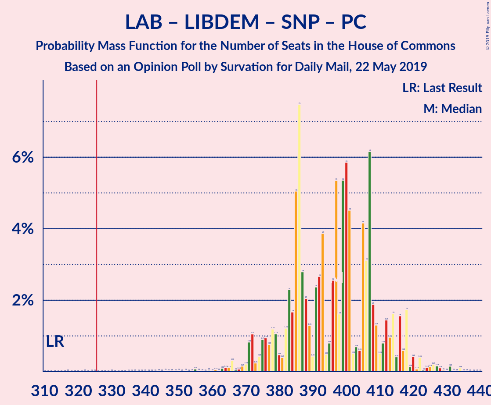

| Number of Seats | Probability | Accumulated | Special Marks |
|:---------------:|:-----------:|:-----------:|:-------------:|
| 313 | 0% | 100% | Last Result |
| 314 | 0% | 100% |  |
| 315 | 0% | 100% |  |
| 316 | 0% | 100% |  |
| 317 | 0% | 100% |  |
| 318 | 0% | 100% |  |
| 319 | 0% | 100% |  |
| 320 | 0% | 100% |  |
| 321 | 0% | 100% |  |
| 322 | 0% | 100% |  |
| 323 | 0% | 100% |  |
| 324 | 0% | 100% |  |
| 325 | 0% | 100% |  |
| 326 | 0% | 100% | Majority |
| 327 | 0% | 100% |  |
| 328 | 0% | 100% |  |
| 329 | 0% | 100% |  |
| 330 | 0% | 100% |  |
| 331 | 0% | 100% |  |
| 332 | 0% | 100% |  |
| 333 | 0% | 100% |  |
| 334 | 0% | 100% |  |
| 335 | 0% | 100% |  |
| 336 | 0% | 100% |  |
| 337 | 0% | 100% |  |
| 338 | 0% | 100% |  |
| 339 | 0% | 100% |  |
| 340 | 0% | 100% |  |
| 341 | 0% | 100% |  |
| 342 | 0% | 100% |  |
| 343 | 0% | 100% |  |
| 344 | 0% | 100% |  |
| 345 | 0% | 99.9% |  |
| 346 | 0% | 99.9% |  |
| 347 | 0% | 99.9% |  |
| 348 | 0% | 99.9% |  |
| 349 | 0% | 99.9% |  |
| 350 | 0% | 99.9% |  |
| 351 | 0% | 99.8% |  |
| 352 | 0% | 99.8% |  |
| 353 | 0% | 99.8% |  |
| 354 | 0% | 99.8% |  |
| 355 | 0.1% | 99.8% |  |
| 356 | 0% | 99.7% |  |
| 357 | 0% | 99.7% |  |
| 358 | 0% | 99.7% |  |
| 359 | 0% | 99.7% |  |
| 360 | 0% | 99.6% |  |
| 361 | 0.1% | 99.6% |  |
| 362 | 0% | 99.6% |  |
| 363 | 0.1% | 99.5% |  |
| 364 | 0.1% | 99.4% |  |
| 365 | 0.1% | 99.3% |  |
| 366 | 0.3% | 99.2% |  |
| 367 | 0% | 98.9% |  |
| 368 | 0.1% | 98.8% |  |
| 369 | 0.2% | 98.8% |  |
| 370 | 0.2% | 98.6% |  |
| 371 | 0.8% | 98% |  |
| 372 | 1.1% | 98% |  |
| 373 | 0.2% | 97% |  |
| 374 | 0.4% | 96% |  |
| 375 | 0.9% | 96% |  |
| 376 | 0.9% | 95% |  |
| 377 | 0.8% | 94% |  |
| 378 | 1.2% | 93% |  |
| 379 | 1.1% | 92% |  |
| 380 | 0.5% | 91% |  |
| 381 | 0.4% | 90% |  |
| 382 | 1.2% | 90% |  |
| 383 | 2% | 89% |  |
| 384 | 2% | 87% |  |
| 385 | 5% | 85% |  |
| 386 | 7% | 80% |  |
| 387 | 3% | 72% |  |
| 388 | 2% | 70% |  |
| 389 | 1.3% | 68% |  |
| 390 | 0.4% | 66% |  |
| 391 | 2% | 66% |  |
| 392 | 3% | 63% |  |
| 393 | 4% | 61% |  |
| 394 | 0.5% | 57% | Median |
| 395 | 0.8% | 56% |  |
| 396 | 3% | 56% |  |
| 397 | 5% | 53% |  |
| 398 | 2% | 48% |  |
| 399 | 5% | 46% |  |
| 400 | 6% | 41% |  |
| 401 | 5% | 35% |  |
| 402 | 0.5% | 30% |  |
| 403 | 0.7% | 30% |  |
| 404 | 0.6% | 29% |  |
| 405 | 4% | 29% |  |
| 406 | 3% | 24% |  |
| 407 | 6% | 21% |  |
| 408 | 2% | 15% |  |
| 409 | 1.3% | 13% |  |
| 410 | 0.5% | 12% |  |
| 411 | 0.8% | 11% |  |
| 412 | 1.4% | 11% |  |
| 413 | 1.0% | 9% |  |
| 414 | 2% | 8% |  |
| 415 | 0.4% | 7% |  |
| 416 | 2% | 6% |  |
| 417 | 0.6% | 5% |  |
| 418 | 2% | 4% |  |
| 419 | 0.1% | 2% |  |
| 420 | 0.4% | 2% |  |
| 421 | 0.1% | 2% |  |
| 422 | 0.4% | 2% |  |
| 423 | 0% | 1.3% |  |
| 424 | 0.1% | 1.2% |  |
| 425 | 0.1% | 1.1% |  |
| 426 | 0.2% | 1.0% |  |
| 427 | 0.2% | 0.8% |  |
| 428 | 0.1% | 0.6% |  |
| 429 | 0% | 0.5% |  |
| 430 | 0% | 0.5% |  |
| 431 | 0.2% | 0.4% |  |
| 432 | 0% | 0.3% |  |
| 433 | 0% | 0.2% |  |
| 434 | 0.1% | 0.2% |  |
| 435 | 0% | 0.1% |  |
| 436 | 0% | 0.1% |  |
| 437 | 0% | 0.1% |  |
| 438 | 0% | 0% |  |

### Labour Party – Liberal Democrats – Scottish National Party

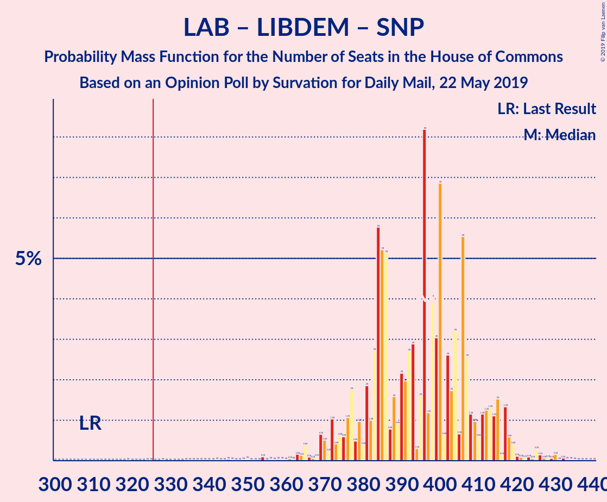

| Number of Seats | Probability | Accumulated | Special Marks |
|:---------------:|:-----------:|:-----------:|:-------------:|
| 309 | 0% | 100% | Last Result |
| 310 | 0% | 100% |  |
| 311 | 0% | 100% |  |
| 312 | 0% | 100% |  |
| 313 | 0% | 100% |  |
| 314 | 0% | 100% |  |
| 315 | 0% | 100% |  |
| 316 | 0% | 100% |  |
| 317 | 0% | 100% |  |
| 318 | 0% | 100% |  |
| 319 | 0% | 100% |  |
| 320 | 0% | 100% |  |
| 321 | 0% | 100% |  |
| 322 | 0% | 100% |  |
| 323 | 0% | 100% |  |
| 324 | 0% | 100% |  |
| 325 | 0% | 100% |  |
| 326 | 0% | 100% | Majority |
| 327 | 0% | 100% |  |
| 328 | 0% | 100% |  |
| 329 | 0% | 100% |  |
| 330 | 0% | 100% |  |
| 331 | 0% | 100% |  |
| 332 | 0% | 100% |  |
| 333 | 0% | 100% |  |
| 334 | 0% | 100% |  |
| 335 | 0% | 100% |  |
| 336 | 0% | 100% |  |
| 337 | 0% | 100% |  |
| 338 | 0% | 100% |  |
| 339 | 0% | 100% |  |
| 340 | 0% | 100% |  |
| 341 | 0% | 100% |  |
| 342 | 0% | 100% |  |
| 343 | 0% | 100% |  |
| 344 | 0% | 99.9% |  |
| 345 | 0% | 99.9% |  |
| 346 | 0% | 99.9% |  |
| 347 | 0% | 99.9% |  |
| 348 | 0% | 99.9% |  |
| 349 | 0% | 99.9% |  |
| 350 | 0% | 99.9% |  |
| 351 | 0% | 99.8% |  |
| 352 | 0% | 99.8% |  |
| 353 | 0% | 99.8% |  |
| 354 | 0.1% | 99.8% |  |
| 355 | 0% | 99.7% |  |
| 356 | 0% | 99.7% |  |
| 357 | 0% | 99.7% |  |
| 358 | 0% | 99.6% |  |
| 359 | 0% | 99.6% |  |
| 360 | 0% | 99.6% |  |
| 361 | 0.1% | 99.6% |  |
| 362 | 0% | 99.5% |  |
| 363 | 0.2% | 99.5% |  |
| 364 | 0.1% | 99.3% |  |
| 365 | 0.4% | 99.2% |  |
| 366 | 0.1% | 98.8% |  |
| 367 | 0.1% | 98.7% |  |
| 368 | 0.1% | 98.7% |  |
| 369 | 0.7% | 98.6% |  |
| 370 | 0.5% | 98% |  |
| 371 | 0.2% | 97% |  |
| 372 | 1.0% | 97% |  |
| 373 | 0.4% | 96% |  |
| 374 | 0.6% | 96% |  |
| 375 | 0.6% | 95% |  |
| 376 | 1.1% | 95% |  |
| 377 | 2% | 93% |  |
| 378 | 0.5% | 92% |  |
| 379 | 1.0% | 91% |  |
| 380 | 0.4% | 90% |  |
| 381 | 2% | 90% |  |
| 382 | 1.0% | 88% |  |
| 383 | 3% | 87% |  |
| 384 | 6% | 84% |  |
| 385 | 5% | 78% |  |
| 386 | 5% | 73% |  |
| 387 | 0.8% | 68% |  |
| 388 | 2% | 67% |  |
| 389 | 0.9% | 66% |  |
| 390 | 2% | 65% |  |
| 391 | 2% | 63% |  |
| 392 | 3% | 61% |  |
| 393 | 3% | 58% | Median |
| 394 | 0.3% | 55% |  |
| 395 | 2% | 55% |  |
| 396 | 8% | 53% |  |
| 397 | 1.2% | 45% |  |
| 398 | 4% | 44% |  |
| 399 | 3% | 40% |  |
| 400 | 7% | 37% |  |
| 401 | 0.6% | 30% |  |
| 402 | 3% | 29% |  |
| 403 | 2% | 27% |  |
| 404 | 3% | 25% |  |
| 405 | 0.7% | 22% |  |
| 406 | 6% | 21% |  |
| 407 | 3% | 16% |  |
| 408 | 1.2% | 13% |  |
| 409 | 1.0% | 12% |  |
| 410 | 0.6% | 11% |  |
| 411 | 1.2% | 10% |  |
| 412 | 1.2% | 9% |  |
| 413 | 1.3% | 8% |  |
| 414 | 1.1% | 7% |  |
| 415 | 2% | 5% |  |
| 416 | 0.1% | 4% |  |
| 417 | 1.3% | 4% |  |
| 418 | 0.6% | 2% |  |
| 419 | 0.4% | 2% |  |
| 420 | 0.1% | 1.4% |  |
| 421 | 0.1% | 1.3% |  |
| 422 | 0.1% | 1.2% |  |
| 423 | 0.1% | 1.2% |  |
| 424 | 0.1% | 1.1% |  |
| 425 | 0.3% | 1.0% |  |
| 426 | 0.1% | 0.7% |  |
| 427 | 0.1% | 0.6% |  |
| 428 | 0.1% | 0.5% |  |
| 429 | 0.1% | 0.4% |  |
| 430 | 0.2% | 0.4% |  |
| 431 | 0% | 0.2% |  |
| 432 | 0.1% | 0.2% |  |
| 433 | 0% | 0.1% |  |
| 434 | 0% | 0.1% |  |
| 435 | 0% | 0.1% |  |
| 436 | 0% | 0.1% |  |
| 437 | 0% | 0% |  |

### Labour Party – Liberal Democrats – Plaid Cymru

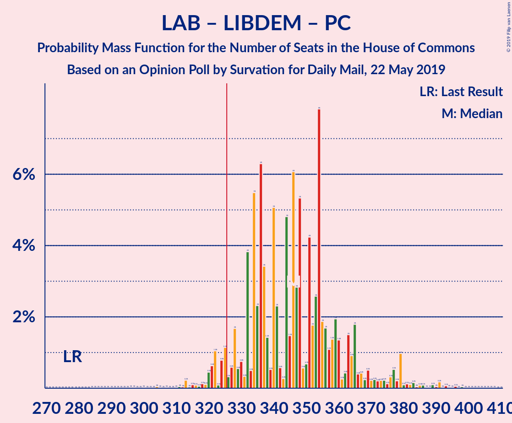

| Number of Seats | Probability | Accumulated | Special Marks |
|:---------------:|:-----------:|:-----------:|:-------------:|
| 278 | 0% | 100% | Last Result |
| 279 | 0% | 100% |  |
| 280 | 0% | 100% |  |
| 281 | 0% | 100% |  |
| 282 | 0% | 100% |  |
| 283 | 0% | 100% |  |
| 284 | 0% | 100% |  |
| 285 | 0% | 100% |  |
| 286 | 0% | 100% |  |
| 287 | 0% | 100% |  |
| 288 | 0% | 100% |  |
| 289 | 0% | 100% |  |
| 290 | 0% | 100% |  |
| 291 | 0% | 100% |  |
| 292 | 0% | 100% |  |
| 293 | 0% | 100% |  |
| 294 | 0% | 100% |  |
| 295 | 0% | 100% |  |
| 296 | 0% | 100% |  |
| 297 | 0% | 99.9% |  |
| 298 | 0% | 99.9% |  |
| 299 | 0% | 99.9% |  |
| 300 | 0% | 99.9% |  |
| 301 | 0% | 99.9% |  |
| 302 | 0% | 99.9% |  |
| 303 | 0% | 99.9% |  |
| 304 | 0% | 99.9% |  |
| 305 | 0% | 99.8% |  |
| 306 | 0% | 99.8% |  |
| 307 | 0% | 99.8% |  |
| 308 | 0% | 99.8% |  |
| 309 | 0% | 99.8% |  |
| 310 | 0% | 99.8% |  |
| 311 | 0% | 99.7% |  |
| 312 | 0% | 99.7% |  |
| 313 | 0.2% | 99.7% |  |
| 314 | 0% | 99.4% |  |
| 315 | 0.1% | 99.4% |  |
| 316 | 0.1% | 99.3% |  |
| 317 | 0.1% | 99.2% |  |
| 318 | 0.1% | 99.2% |  |
| 319 | 0.1% | 99.0% |  |
| 320 | 0.5% | 98.9% |  |
| 321 | 0.6% | 98% |  |
| 322 | 1.0% | 98% |  |
| 323 | 0.1% | 97% |  |
| 324 | 0.8% | 97% |  |
| 325 | 1.1% | 96% |  |
| 326 | 0.3% | 95% | Majority |
| 327 | 0.6% | 94% |  |
| 328 | 2% | 94% |  |
| 329 | 0.6% | 92% |  |
| 330 | 0.8% | 92% |  |
| 331 | 0.3% | 91% |  |
| 332 | 4% | 91% |  |
| 333 | 0.5% | 87% |  |
| 334 | 5% | 86% |  |
| 335 | 2% | 81% |  |
| 336 | 6% | 78% |  |
| 337 | 3% | 72% |  |
| 338 | 1.4% | 69% |  |
| 339 | 0.5% | 67% |  |
| 340 | 5% | 67% |  |
| 341 | 2% | 62% |  |
| 342 | 0.6% | 59% |  |
| 343 | 0.3% | 59% | Median |
| 344 | 5% | 59% |  |
| 345 | 1.5% | 54% |  |
| 346 | 6% | 52% |  |
| 347 | 3% | 46% |  |
| 348 | 5% | 43% |  |
| 349 | 0.6% | 38% |  |
| 350 | 0.7% | 37% |  |
| 351 | 4% | 37% |  |
| 352 | 2% | 33% |  |
| 353 | 3% | 31% |  |
| 354 | 8% | 28% |  |
| 355 | 2% | 20% |  |
| 356 | 2% | 19% |  |
| 357 | 1.1% | 17% |  |
| 358 | 1.4% | 16% |  |
| 359 | 2% | 14% |  |
| 360 | 1.4% | 12% |  |
| 361 | 0.3% | 11% |  |
| 362 | 0.4% | 11% |  |
| 363 | 2% | 10% |  |
| 364 | 0.9% | 9% |  |
| 365 | 2% | 8% |  |
| 366 | 0.4% | 6% |  |
| 367 | 0.4% | 6% |  |
| 368 | 0.2% | 5% |  |
| 369 | 0.5% | 5% |  |
| 370 | 0.2% | 5% |  |
| 371 | 0.2% | 4% |  |
| 372 | 0.2% | 4% |  |
| 373 | 0.2% | 4% |  |
| 374 | 0.2% | 4% |  |
| 375 | 0.1% | 3% |  |
| 376 | 0.3% | 3% |  |
| 377 | 0.5% | 3% |  |
| 378 | 0.2% | 3% |  |
| 379 | 1.0% | 2% |  |
| 380 | 0.1% | 1.3% |  |
| 381 | 0.1% | 1.3% |  |
| 382 | 0.1% | 1.1% |  |
| 383 | 0.2% | 1.0% |  |
| 384 | 0% | 0.9% |  |
| 385 | 0.1% | 0.8% |  |
| 386 | 0.1% | 0.7% |  |
| 387 | 0% | 0.7% |  |
| 388 | 0% | 0.6% |  |
| 389 | 0.1% | 0.6% |  |
| 390 | 0% | 0.5% |  |
| 391 | 0.2% | 0.5% |  |
| 392 | 0% | 0.3% |  |
| 393 | 0.1% | 0.3% |  |
| 394 | 0% | 0.2% |  |
| 395 | 0% | 0.2% |  |
| 396 | 0.1% | 0.2% |  |
| 397 | 0% | 0.1% |  |
| 398 | 0% | 0.1% |  |
| 399 | 0% | 0.1% |  |
| 400 | 0% | 0.1% |  |
| 401 | 0% | 0.1% |  |
| 402 | 0% | 0% |  |

### Labour Party – Liberal Democrats – Change UK

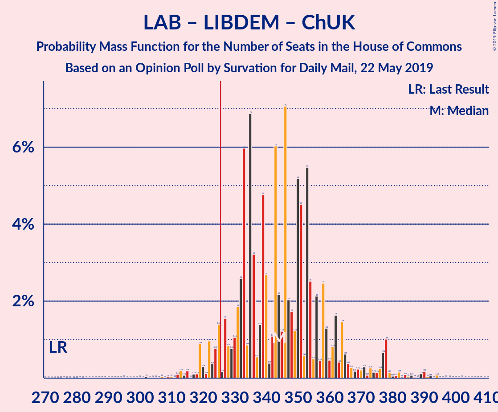

| Number of Seats | Probability | Accumulated | Special Marks |
|:---------------:|:-----------:|:-----------:|:-------------:|
| 274 | 0% | 100% | Last Result |
| 275 | 0% | 100% |  |
| 276 | 0% | 100% |  |
| 277 | 0% | 100% |  |
| 278 | 0% | 100% |  |
| 279 | 0% | 100% |  |
| 280 | 0% | 100% |  |
| 281 | 0% | 100% |  |
| 282 | 0% | 100% |  |
| 283 | 0% | 100% |  |
| 284 | 0% | 100% |  |
| 285 | 0% | 100% |  |
| 286 | 0% | 100% |  |
| 287 | 0% | 100% |  |
| 288 | 0% | 100% |  |
| 289 | 0% | 100% |  |
| 290 | 0% | 100% |  |
| 291 | 0% | 100% |  |
| 292 | 0% | 100% |  |
| 293 | 0% | 100% |  |
| 294 | 0% | 100% |  |
| 295 | 0% | 100% |  |
| 296 | 0% | 99.9% |  |
| 297 | 0% | 99.9% |  |
| 298 | 0% | 99.9% |  |
| 299 | 0% | 99.9% |  |
| 300 | 0% | 99.9% |  |
| 301 | 0% | 99.9% |  |
| 302 | 0% | 99.9% |  |
| 303 | 0% | 99.8% |  |
| 304 | 0% | 99.8% |  |
| 305 | 0% | 99.8% |  |
| 306 | 0% | 99.8% |  |
| 307 | 0% | 99.8% |  |
| 308 | 0% | 99.8% |  |
| 309 | 0% | 99.7% |  |
| 310 | 0% | 99.7% |  |
| 311 | 0% | 99.7% |  |
| 312 | 0.1% | 99.7% |  |
| 313 | 0.2% | 99.6% |  |
| 314 | 0.1% | 99.4% |  |
| 315 | 0.2% | 99.3% |  |
| 316 | 0% | 99.1% |  |
| 317 | 0.1% | 99.1% |  |
| 318 | 0.1% | 99.0% |  |
| 319 | 0.9% | 98.9% |  |
| 320 | 0.3% | 98% |  |
| 321 | 0.1% | 98% |  |
| 322 | 1.0% | 98% |  |
| 323 | 0.4% | 97% |  |
| 324 | 0.8% | 96% |  |
| 325 | 1.4% | 95% |  |
| 326 | 0.2% | 94% | Majority |
| 327 | 2% | 94% |  |
| 328 | 0.8% | 92% |  |
| 329 | 0.8% | 91% |  |
| 330 | 1.1% | 91% |  |
| 331 | 2% | 90% |  |
| 332 | 3% | 88% |  |
| 333 | 6% | 85% |  |
| 334 | 0.9% | 79% |  |
| 335 | 7% | 78% |  |
| 336 | 3% | 72% |  |
| 337 | 0.6% | 68% |  |
| 338 | 1.4% | 68% |  |
| 339 | 5% | 66% |  |
| 340 | 3% | 62% |  |
| 341 | 0.4% | 59% |  |
| 342 | 1.1% | 59% | Median |
| 343 | 6% | 57% |  |
| 344 | 2% | 51% |  |
| 345 | 1.2% | 49% |  |
| 346 | 7% | 48% |  |
| 347 | 2% | 41% |  |
| 348 | 2% | 39% |  |
| 349 | 1.2% | 37% |  |
| 350 | 5% | 36% |  |
| 351 | 5% | 31% |  |
| 352 | 0.6% | 26% |  |
| 353 | 5% | 26% |  |
| 354 | 3% | 20% |  |
| 355 | 0.5% | 18% |  |
| 356 | 2% | 17% |  |
| 357 | 0.5% | 15% |  |
| 358 | 2% | 15% |  |
| 359 | 1.3% | 12% |  |
| 360 | 0.5% | 11% |  |
| 361 | 0.8% | 10% |  |
| 362 | 2% | 10% |  |
| 363 | 0.4% | 8% |  |
| 364 | 1.5% | 8% |  |
| 365 | 0.6% | 6% |  |
| 366 | 0.4% | 5% |  |
| 367 | 0.3% | 5% |  |
| 368 | 0.2% | 5% |  |
| 369 | 0.2% | 5% |  |
| 370 | 0.2% | 4% |  |
| 371 | 0.3% | 4% |  |
| 372 | 0.1% | 4% |  |
| 373 | 0.3% | 4% |  |
| 374 | 0.2% | 4% |  |
| 375 | 0.1% | 3% |  |
| 376 | 0.2% | 3% |  |
| 377 | 0.7% | 3% |  |
| 378 | 1.0% | 2% |  |
| 379 | 0.1% | 1.3% |  |
| 380 | 0.1% | 1.1% |  |
| 381 | 0.1% | 1.1% |  |
| 382 | 0.2% | 1.0% |  |
| 383 | 0% | 0.9% |  |
| 384 | 0.1% | 0.8% |  |
| 385 | 0% | 0.7% |  |
| 386 | 0.1% | 0.7% |  |
| 387 | 0% | 0.6% |  |
| 388 | 0% | 0.6% |  |
| 389 | 0.1% | 0.6% |  |
| 390 | 0.2% | 0.5% |  |
| 391 | 0% | 0.3% |  |
| 392 | 0.1% | 0.3% |  |
| 393 | 0% | 0.2% |  |
| 394 | 0.1% | 0.2% |  |
| 395 | 0% | 0.1% |  |
| 396 | 0% | 0.1% |  |
| 397 | 0% | 0.1% |  |
| 398 | 0% | 0.1% |  |
| 399 | 0% | 0.1% |  |
| 400 | 0% | 0.1% |  |
| 401 | 0% | 0% |  |

### Labour Party – Liberal Democrats

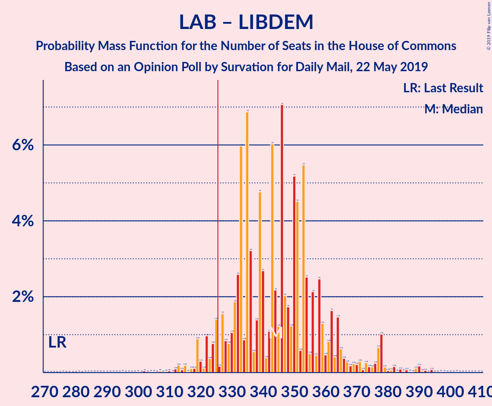

| Number of Seats | Probability | Accumulated | Special Marks |
|:---------------:|:-----------:|:-----------:|:-------------:|
| 274 | 0% | 100% | Last Result |
| 275 | 0% | 100% |  |
| 276 | 0% | 100% |  |
| 277 | 0% | 100% |  |
| 278 | 0% | 100% |  |
| 279 | 0% | 100% |  |
| 280 | 0% | 100% |  |
| 281 | 0% | 100% |  |
| 282 | 0% | 100% |  |
| 283 | 0% | 100% |  |
| 284 | 0% | 100% |  |
| 285 | 0% | 100% |  |
| 286 | 0% | 100% |  |
| 287 | 0% | 100% |  |
| 288 | 0% | 100% |  |
| 289 | 0% | 100% |  |
| 290 | 0% | 100% |  |
| 291 | 0% | 100% |  |
| 292 | 0% | 100% |  |
| 293 | 0% | 100% |  |
| 294 | 0% | 100% |  |
| 295 | 0% | 100% |  |
| 296 | 0% | 99.9% |  |
| 297 | 0% | 99.9% |  |
| 298 | 0% | 99.9% |  |
| 299 | 0% | 99.9% |  |
| 300 | 0% | 99.9% |  |
| 301 | 0% | 99.9% |  |
| 302 | 0% | 99.9% |  |
| 303 | 0% | 99.8% |  |
| 304 | 0% | 99.8% |  |
| 305 | 0% | 99.8% |  |
| 306 | 0% | 99.8% |  |
| 307 | 0% | 99.8% |  |
| 308 | 0% | 99.8% |  |
| 309 | 0% | 99.7% |  |
| 310 | 0% | 99.7% |  |
| 311 | 0% | 99.7% |  |
| 312 | 0.1% | 99.7% |  |
| 313 | 0.2% | 99.6% |  |
| 314 | 0.1% | 99.4% |  |
| 315 | 0.2% | 99.3% |  |
| 316 | 0% | 99.1% |  |
| 317 | 0.1% | 99.1% |  |
| 318 | 0.1% | 99.0% |  |
| 319 | 0.9% | 98.9% |  |
| 320 | 0.3% | 98% |  |
| 321 | 0.1% | 98% |  |
| 322 | 1.0% | 98% |  |
| 323 | 0.4% | 97% |  |
| 324 | 0.8% | 96% |  |
| 325 | 1.4% | 95% |  |
| 326 | 0.2% | 94% | Majority |
| 327 | 2% | 94% |  |
| 328 | 0.8% | 92% |  |
| 329 | 0.8% | 91% |  |
| 330 | 1.1% | 91% |  |
| 331 | 2% | 90% |  |
| 332 | 3% | 88% |  |
| 333 | 6% | 85% |  |
| 334 | 0.9% | 79% |  |
| 335 | 7% | 78% |  |
| 336 | 3% | 72% |  |
| 337 | 0.6% | 68% |  |
| 338 | 1.4% | 68% |  |
| 339 | 5% | 66% |  |
| 340 | 3% | 62% |  |
| 341 | 0.4% | 59% |  |
| 342 | 1.1% | 59% | Median |
| 343 | 6% | 57% |  |
| 344 | 2% | 51% |  |
| 345 | 1.2% | 49% |  |
| 346 | 7% | 48% |  |
| 347 | 2% | 41% |  |
| 348 | 2% | 39% |  |
| 349 | 1.2% | 37% |  |
| 350 | 5% | 36% |  |
| 351 | 5% | 31% |  |
| 352 | 0.6% | 26% |  |
| 353 | 5% | 26% |  |
| 354 | 3% | 20% |  |
| 355 | 0.5% | 18% |  |
| 356 | 2% | 17% |  |
| 357 | 0.5% | 15% |  |
| 358 | 2% | 15% |  |
| 359 | 1.3% | 12% |  |
| 360 | 0.5% | 11% |  |
| 361 | 0.8% | 10% |  |
| 362 | 2% | 10% |  |
| 363 | 0.4% | 8% |  |
| 364 | 1.5% | 8% |  |
| 365 | 0.6% | 6% |  |
| 366 | 0.4% | 5% |  |
| 367 | 0.3% | 5% |  |
| 368 | 0.2% | 5% |  |
| 369 | 0.2% | 5% |  |
| 370 | 0.2% | 4% |  |
| 371 | 0.3% | 4% |  |
| 372 | 0.1% | 4% |  |
| 373 | 0.3% | 4% |  |
| 374 | 0.2% | 4% |  |
| 375 | 0.1% | 3% |  |
| 376 | 0.2% | 3% |  |
| 377 | 0.7% | 3% |  |
| 378 | 1.0% | 2% |  |
| 379 | 0.1% | 1.3% |  |
| 380 | 0.1% | 1.1% |  |
| 381 | 0.1% | 1.1% |  |
| 382 | 0.2% | 1.0% |  |
| 383 | 0% | 0.9% |  |
| 384 | 0.1% | 0.8% |  |
| 385 | 0% | 0.7% |  |
| 386 | 0.1% | 0.7% |  |
| 387 | 0% | 0.6% |  |
| 388 | 0% | 0.6% |  |
| 389 | 0.1% | 0.6% |  |
| 390 | 0.2% | 0.5% |  |
| 391 | 0% | 0.3% |  |
| 392 | 0.1% | 0.3% |  |
| 393 | 0% | 0.2% |  |
| 394 | 0.1% | 0.2% |  |
| 395 | 0% | 0.1% |  |
| 396 | 0% | 0.1% |  |
| 397 | 0% | 0.1% |  |
| 398 | 0% | 0.1% |  |
| 399 | 0% | 0.1% |  |
| 400 | 0% | 0.1% |  |
| 401 | 0% | 0% |  |

### Labour Party – Scottish National Party – Plaid Cymru

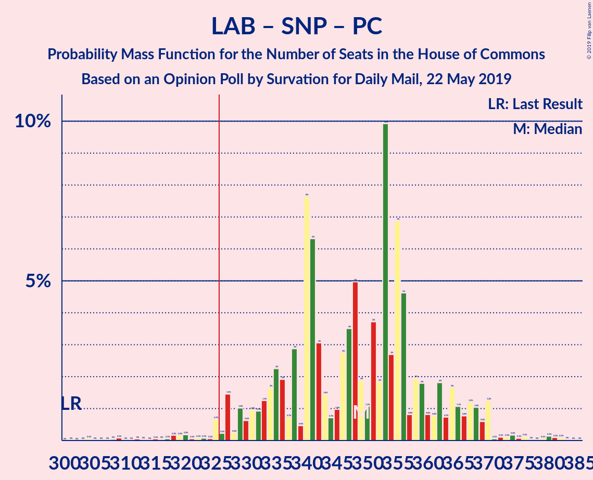

| Number of Seats | Probability | Accumulated | Special Marks |
|:---------------:|:-----------:|:-----------:|:-------------:|
| 301 | 0% | 100% | Last Result |
| 302 | 0% | 99.9% |  |
| 303 | 0% | 99.9% |  |
| 304 | 0.1% | 99.9% |  |
| 305 | 0% | 99.9% |  |
| 306 | 0% | 99.9% |  |
| 307 | 0% | 99.9% |  |
| 308 | 0% | 99.8% |  |
| 309 | 0.1% | 99.8% |  |
| 310 | 0% | 99.7% |  |
| 311 | 0% | 99.7% |  |
| 312 | 0% | 99.7% |  |
| 313 | 0% | 99.6% |  |
| 314 | 0% | 99.6% |  |
| 315 | 0.1% | 99.6% |  |
| 316 | 0% | 99.6% |  |
| 317 | 0.1% | 99.5% |  |
| 318 | 0.2% | 99.5% |  |
| 319 | 0.2% | 99.3% |  |
| 320 | 0.2% | 99.1% |  |
| 321 | 0.1% | 98.9% |  |
| 322 | 0.1% | 98.9% |  |
| 323 | 0.1% | 98.8% |  |
| 324 | 0.1% | 98.7% |  |
| 325 | 0.7% | 98.7% |  |
| 326 | 0.2% | 98% | Majority |
| 327 | 1.5% | 98% |  |
| 328 | 0.2% | 96% |  |
| 329 | 1.0% | 96% |  |
| 330 | 0.6% | 95% |  |
| 331 | 1.0% | 94% |  |
| 332 | 0.9% | 93% |  |
| 333 | 1.3% | 93% |  |
| 334 | 2% | 91% |  |
| 335 | 2% | 90% |  |
| 336 | 2% | 87% |  |
| 337 | 0.7% | 86% |  |
| 338 | 3% | 85% |  |
| 339 | 0.5% | 82% |  |
| 340 | 8% | 81% |  |
| 341 | 6% | 74% |  |
| 342 | 3% | 67% |  |
| 343 | 1.4% | 64% |  |
| 344 | 0.7% | 63% |  |
| 345 | 1.0% | 62% |  |
| 346 | 3% | 61% |  |
| 347 | 4% | 59% |  |
| 348 | 5% | 55% |  |
| 349 | 2% | 50% | Median |
| 350 | 1.1% | 48% |  |
| 351 | 4% | 47% |  |
| 352 | 2% | 43% |  |
| 353 | 10% | 42% |  |
| 354 | 3% | 32% |  |
| 355 | 7% | 29% |  |
| 356 | 5% | 22% |  |
| 357 | 0.8% | 17% |  |
| 358 | 2% | 17% |  |
| 359 | 2% | 15% |  |
| 360 | 0.8% | 13% |  |
| 361 | 0.8% | 12% |  |
| 362 | 2% | 11% |  |
| 363 | 0.7% | 9% |  |
| 364 | 2% | 9% |  |
| 365 | 1.1% | 7% |  |
| 366 | 0.8% | 6% |  |
| 367 | 1.2% | 5% |  |
| 368 | 1.0% | 4% |  |
| 369 | 0.6% | 3% |  |
| 370 | 1.2% | 2% |  |
| 371 | 0.1% | 1.1% |  |
| 372 | 0.1% | 1.1% |  |
| 373 | 0.1% | 1.0% |  |
| 374 | 0.2% | 0.9% |  |
| 375 | 0.1% | 0.7% |  |
| 376 | 0.1% | 0.6% |  |
| 377 | 0% | 0.5% |  |
| 378 | 0% | 0.5% |  |
| 379 | 0.1% | 0.5% |  |
| 380 | 0.1% | 0.4% |  |
| 381 | 0.1% | 0.3% |  |
| 382 | 0.1% | 0.2% |  |
| 383 | 0% | 0.1% |  |
| 384 | 0% | 0.1% |  |
| 385 | 0% | 0% |  |

### Labour Party – Scottish National Party

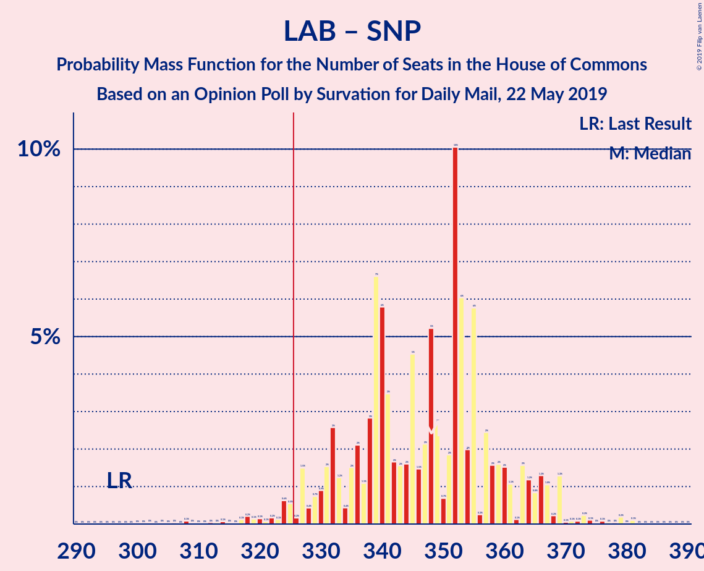

| Number of Seats | Probability | Accumulated | Special Marks |
|:---------------:|:-----------:|:-----------:|:-------------:|
| 297 | 0% | 100% | Last Result |
| 298 | 0% | 100% |  |
| 299 | 0% | 100% |  |
| 300 | 0% | 100% |  |
| 301 | 0% | 99.9% |  |
| 302 | 0% | 99.9% |  |
| 303 | 0% | 99.9% |  |
| 304 | 0% | 99.9% |  |
| 305 | 0% | 99.9% |  |
| 306 | 0% | 99.8% |  |
| 307 | 0% | 99.8% |  |
| 308 | 0.1% | 99.8% |  |
| 309 | 0% | 99.7% |  |
| 310 | 0% | 99.7% |  |
| 311 | 0% | 99.7% |  |
| 312 | 0% | 99.7% |  |
| 313 | 0% | 99.6% |  |
| 314 | 0.1% | 99.6% |  |
| 315 | 0% | 99.5% |  |
| 316 | 0% | 99.5% |  |
| 317 | 0.1% | 99.4% |  |
| 318 | 0.2% | 99.3% |  |
| 319 | 0.1% | 99.1% |  |
| 320 | 0.1% | 99.0% |  |
| 321 | 0.1% | 98.8% |  |
| 322 | 0.2% | 98.8% |  |
| 323 | 0.1% | 98.6% |  |
| 324 | 0.6% | 98% |  |
| 325 | 0.5% | 98% |  |
| 326 | 0.2% | 97% | Majority |
| 327 | 1.5% | 97% |  |
| 328 | 0.4% | 96% |  |
| 329 | 0.7% | 95% |  |
| 330 | 0.9% | 94% |  |
| 331 | 2% | 94% |  |
| 332 | 3% | 92% |  |
| 333 | 1.2% | 89% |  |
| 334 | 0.4% | 88% |  |
| 335 | 2% | 88% |  |
| 336 | 2% | 86% |  |
| 337 | 1.1% | 84% |  |
| 338 | 3% | 83% |  |
| 339 | 7% | 80% |  |
| 340 | 6% | 74% |  |
| 341 | 3% | 68% |  |
| 342 | 2% | 64% |  |
| 343 | 2% | 63% |  |
| 344 | 2% | 61% |  |
| 345 | 5% | 60% |  |
| 346 | 1.5% | 55% |  |
| 347 | 2% | 54% |  |
| 348 | 5% | 51% | Median |
| 349 | 3% | 46% |  |
| 350 | 0.7% | 43% |  |
| 351 | 2% | 43% |  |
| 352 | 10% | 41% |  |
| 353 | 6% | 31% |  |
| 354 | 2% | 25% |  |
| 355 | 6% | 23% |  |
| 356 | 0.3% | 17% |  |
| 357 | 2% | 17% |  |
| 358 | 2% | 14% |  |
| 359 | 2% | 13% |  |
| 360 | 2% | 11% |  |
| 361 | 1.1% | 10% |  |
| 362 | 0.1% | 9% |  |
| 363 | 2% | 9% |  |
| 364 | 1.2% | 7% |  |
| 365 | 0.8% | 6% |  |
| 366 | 1.3% | 5% |  |
| 367 | 1.0% | 4% |  |
| 368 | 0.2% | 3% |  |
| 369 | 1.3% | 2% |  |
| 370 | 0.1% | 1.1% |  |
| 371 | 0.1% | 1.1% |  |
| 372 | 0.1% | 1.0% |  |
| 373 | 0.2% | 0.9% |  |
| 374 | 0.1% | 0.7% |  |
| 375 | 0% | 0.6% |  |
| 376 | 0.1% | 0.5% |  |
| 377 | 0% | 0.4% |  |
| 378 | 0% | 0.4% |  |
| 379 | 0.2% | 0.4% |  |
| 380 | 0% | 0.2% |  |
| 381 | 0.1% | 0.2% |  |
| 382 | 0% | 0.1% |  |
| 383 | 0% | 0.1% |  |
| 384 | 0% | 0% |  |

### Labour Party – Plaid Cymru

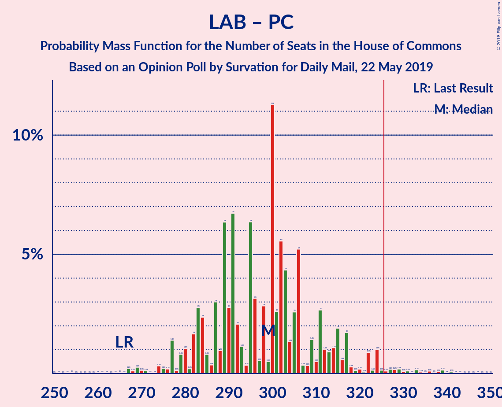

| Number of Seats | Probability | Accumulated | Special Marks |
|:---------------:|:-----------:|:-----------:|:-------------:|
| 253 | 0% | 100% |  |
| 254 | 0% | 99.9% |  |
| 255 | 0% | 99.9% |  |
| 256 | 0% | 99.9% |  |
| 257 | 0% | 99.9% |  |
| 258 | 0% | 99.9% |  |
| 259 | 0% | 99.9% |  |
| 260 | 0% | 99.9% |  |
| 261 | 0% | 99.9% |  |
| 262 | 0% | 99.8% |  |
| 263 | 0% | 99.8% |  |
| 264 | 0% | 99.8% |  |
| 265 | 0% | 99.8% |  |
| 266 | 0% | 99.7% | Last Result |
| 267 | 0.2% | 99.7% |  |
| 268 | 0.1% | 99.5% |  |
| 269 | 0.3% | 99.4% |  |
| 270 | 0.1% | 99.1% |  |
| 271 | 0.1% | 99.0% |  |
| 272 | 0% | 98.9% |  |
| 273 | 0% | 98.9% |  |
| 274 | 0.3% | 98.9% |  |
| 275 | 0.2% | 98.5% |  |
| 276 | 0.2% | 98% |  |
| 277 | 1.4% | 98% |  |
| 278 | 0.1% | 97% |  |
| 279 | 0.8% | 97% |  |
| 280 | 1.0% | 96% |  |
| 281 | 0.2% | 95% |  |
| 282 | 2% | 95% |  |
| 283 | 3% | 93% |  |
| 284 | 2% | 90% |  |
| 285 | 0.8% | 88% |  |
| 286 | 0.4% | 87% |  |
| 287 | 3% | 87% |  |
| 288 | 1.0% | 84% |  |
| 289 | 6% | 83% |  |
| 290 | 3% | 76% |  |
| 291 | 7% | 74% |  |
| 292 | 2% | 67% |  |
| 293 | 1.1% | 65% |  |
| 294 | 0.3% | 64% |  |
| 295 | 6% | 63% |  |
| 296 | 3% | 57% |  |
| 297 | 0.5% | 54% |  |
| 298 | 3% | 53% | Median |
| 299 | 0.5% | 50% |  |
| 300 | 11% | 50% |  |
| 301 | 3% | 39% |  |
| 302 | 6% | 36% |  |
| 303 | 4% | 30% |  |
| 304 | 1.3% | 26% |  |
| 305 | 3% | 25% |  |
| 306 | 5% | 22% |  |
| 307 | 0.4% | 17% |  |
| 308 | 0.3% | 17% |  |
| 309 | 1.4% | 16% |  |
| 310 | 0.5% | 15% |  |
| 311 | 3% | 14% |  |
| 312 | 1.0% | 12% |  |
| 313 | 0.9% | 11% |  |
| 314 | 1.1% | 10% |  |
| 315 | 2% | 9% |  |
| 316 | 0.6% | 7% |  |
| 317 | 2% | 6% |  |
| 318 | 0.3% | 4% |  |
| 319 | 0.1% | 4% |  |
| 320 | 0.2% | 4% |  |
| 321 | 0.1% | 4% |  |
| 322 | 0.9% | 4% |  |
| 323 | 0.1% | 3% |  |
| 324 | 1.0% | 3% |  |
| 325 | 0.1% | 2% |  |
| 326 | 0.1% | 2% | Majority |
| 327 | 0.2% | 2% |  |
| 328 | 0.2% | 1.4% |  |
| 329 | 0.2% | 1.2% |  |
| 330 | 0.1% | 1.0% |  |
| 331 | 0.1% | 0.9% |  |
| 332 | 0% | 0.8% |  |
| 333 | 0.2% | 0.8% |  |
| 334 | 0.1% | 0.7% |  |
| 335 | 0% | 0.6% |  |
| 336 | 0.1% | 0.6% |  |
| 337 | 0% | 0.5% |  |
| 338 | 0.1% | 0.4% |  |
| 339 | 0.1% | 0.3% |  |
| 340 | 0% | 0.2% |  |
| 341 | 0.1% | 0.2% |  |
| 342 | 0% | 0.1% |  |
| 343 | 0% | 0.1% |  |
| 344 | 0% | 0.1% |  |
| 345 | 0% | 0.1% |  |
| 346 | 0% | 0.1% |  |
| 347 | 0% | 0.1% |  |
| 348 | 0% | 0% |  |

### Labour Party – Change UK

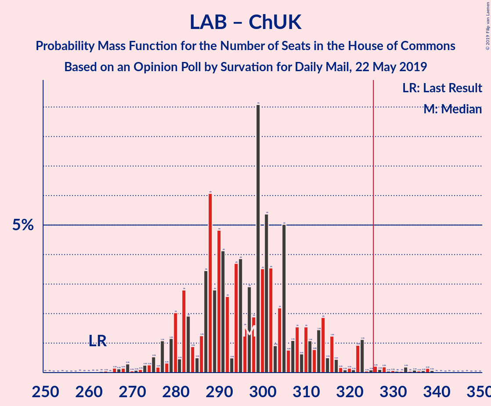

| Number of Seats | Probability | Accumulated | Special Marks |
|:---------------:|:-----------:|:-----------:|:-------------:|
| 251 | 0% | 100% |  |
| 252 | 0% | 99.9% |  |
| 253 | 0% | 99.9% |  |
| 254 | 0% | 99.9% |  |
| 255 | 0% | 99.9% |  |
| 256 | 0% | 99.9% |  |
| 257 | 0% | 99.9% |  |
| 258 | 0% | 99.9% |  |
| 259 | 0% | 99.9% |  |
| 260 | 0% | 99.8% |  |
| 261 | 0% | 99.8% |  |
| 262 | 0% | 99.8% | Last Result |
| 263 | 0% | 99.8% |  |
| 264 | 0.1% | 99.7% |  |
| 265 | 0% | 99.7% |  |
| 266 | 0.1% | 99.7% |  |
| 267 | 0.1% | 99.5% |  |
| 268 | 0.1% | 99.4% |  |
| 269 | 0.3% | 99.2% |  |
| 270 | 0.1% | 98.9% |  |
| 271 | 0.1% | 98.9% |  |
| 272 | 0.1% | 98.8% |  |
| 273 | 0.3% | 98.7% |  |
| 274 | 0.3% | 98% |  |
| 275 | 0.5% | 98% |  |
| 276 | 0.2% | 98% |  |
| 277 | 1.1% | 97% |  |
| 278 | 0.3% | 96% |  |
| 279 | 1.2% | 96% |  |
| 280 | 2% | 95% |  |
| 281 | 0.5% | 93% |  |
| 282 | 3% | 92% |  |
| 283 | 2% | 90% |  |
| 284 | 0.9% | 88% |  |
| 285 | 0.5% | 87% |  |
| 286 | 1.2% | 86% |  |
| 287 | 3% | 85% |  |
| 288 | 6% | 82% |  |
| 289 | 3% | 76% |  |
| 290 | 5% | 73% |  |
| 291 | 4% | 68% |  |
| 292 | 3% | 64% |  |
| 293 | 0.5% | 61% |  |
| 294 | 4% | 61% |  |
| 295 | 4% | 57% |  |
| 296 | 2% | 53% |  |
| 297 | 3% | 52% | Median |
| 298 | 2% | 49% |  |
| 299 | 9% | 47% |  |
| 300 | 4% | 38% |  |
| 301 | 5% | 34% |  |
| 302 | 4% | 29% |  |
| 303 | 0.9% | 25% |  |
| 304 | 2% | 24% |  |
| 305 | 5% | 22% |  |
| 306 | 0.8% | 17% |  |
| 307 | 1.1% | 16% |  |
| 308 | 2% | 15% |  |
| 309 | 0.6% | 14% |  |
| 310 | 2% | 13% |  |
| 311 | 1.1% | 12% |  |
| 312 | 0.8% | 10% |  |
| 313 | 1.5% | 10% |  |
| 314 | 2% | 8% |  |
| 315 | 0.5% | 6% |  |
| 316 | 1.2% | 6% |  |
| 317 | 0.4% | 5% |  |
| 318 | 0.2% | 4% |  |
| 319 | 0.1% | 4% |  |
| 320 | 0.1% | 4% |  |
| 321 | 0.1% | 4% |  |
| 322 | 0.9% | 4% |  |
| 323 | 1.1% | 3% |  |
| 324 | 0.1% | 2% |  |
| 325 | 0.1% | 2% |  |
| 326 | 0.2% | 2% | Majority |
| 327 | 0.1% | 1.3% |  |
| 328 | 0.2% | 1.2% |  |
| 329 | 0.1% | 1.0% |  |
| 330 | 0.1% | 0.9% |  |
| 331 | 0% | 0.9% |  |
| 332 | 0% | 0.8% |  |
| 333 | 0.2% | 0.8% |  |
| 334 | 0% | 0.6% |  |
| 335 | 0.1% | 0.6% |  |
| 336 | 0.1% | 0.5% |  |
| 337 | 0.1% | 0.4% |  |
| 338 | 0.1% | 0.3% |  |
| 339 | 0.1% | 0.2% |  |
| 340 | 0% | 0.1% |  |
| 341 | 0% | 0.1% |  |
| 342 | 0% | 0.1% |  |
| 343 | 0% | 0.1% |  |
| 344 | 0% | 0.1% |  |
| 345 | 0% | 0.1% |  |
| 346 | 0% | 0.1% |  |
| 347 | 0% | 0.1% |  |
| 348 | 0% | 0% |  |

### Labour Party

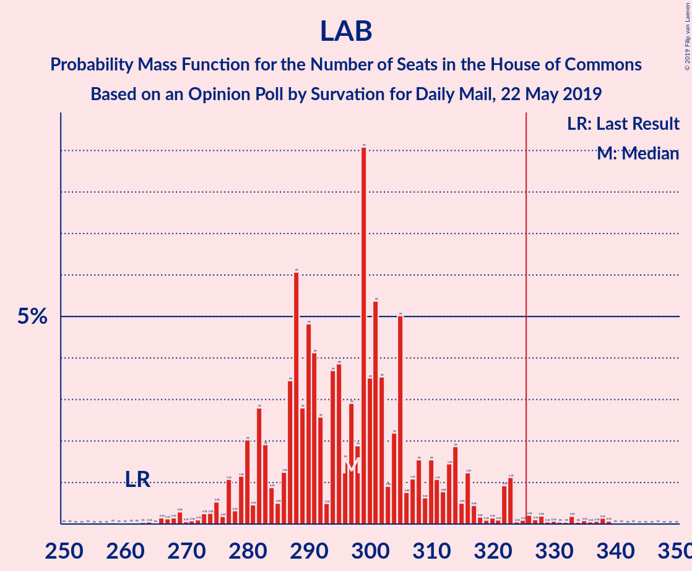

| Number of Seats | Probability | Accumulated | Special Marks |
|:---------------:|:-----------:|:-----------:|:-------------:|
| 251 | 0% | 100% |  |
| 252 | 0% | 99.9% |  |
| 253 | 0% | 99.9% |  |
| 254 | 0% | 99.9% |  |
| 255 | 0% | 99.9% |  |
| 256 | 0% | 99.9% |  |
| 257 | 0% | 99.9% |  |
| 258 | 0% | 99.9% |  |
| 259 | 0% | 99.9% |  |
| 260 | 0% | 99.8% |  |
| 261 | 0% | 99.8% |  |
| 262 | 0% | 99.8% | Last Result |
| 263 | 0% | 99.8% |  |
| 264 | 0.1% | 99.7% |  |
| 265 | 0% | 99.7% |  |
| 266 | 0.1% | 99.7% |  |
| 267 | 0.1% | 99.5% |  |
| 268 | 0.1% | 99.4% |  |
| 269 | 0.3% | 99.2% |  |
| 270 | 0.1% | 98.9% |  |
| 271 | 0.1% | 98.9% |  |
| 272 | 0.1% | 98.8% |  |
| 273 | 0.3% | 98.7% |  |
| 274 | 0.3% | 98% |  |
| 275 | 0.5% | 98% |  |
| 276 | 0.2% | 98% |  |
| 277 | 1.1% | 97% |  |
| 278 | 0.3% | 96% |  |
| 279 | 1.2% | 96% |  |
| 280 | 2% | 95% |  |
| 281 | 0.5% | 93% |  |
| 282 | 3% | 92% |  |
| 283 | 2% | 90% |  |
| 284 | 0.9% | 88% |  |
| 285 | 0.5% | 87% |  |
| 286 | 1.2% | 86% |  |
| 287 | 3% | 85% |  |
| 288 | 6% | 82% |  |
| 289 | 3% | 76% |  |
| 290 | 5% | 73% |  |
| 291 | 4% | 68% |  |
| 292 | 3% | 64% |  |
| 293 | 0.5% | 61% |  |
| 294 | 4% | 61% |  |
| 295 | 4% | 57% |  |
| 296 | 2% | 53% |  |
| 297 | 3% | 52% | Median |
| 298 | 2% | 49% |  |
| 299 | 9% | 47% |  |
| 300 | 4% | 38% |  |
| 301 | 5% | 34% |  |
| 302 | 4% | 29% |  |
| 303 | 0.9% | 25% |  |
| 304 | 2% | 24% |  |
| 305 | 5% | 22% |  |
| 306 | 0.8% | 17% |  |
| 307 | 1.1% | 16% |  |
| 308 | 2% | 15% |  |
| 309 | 0.6% | 14% |  |
| 310 | 2% | 13% |  |
| 311 | 1.1% | 12% |  |
| 312 | 0.8% | 10% |  |
| 313 | 1.5% | 10% |  |
| 314 | 2% | 8% |  |
| 315 | 0.5% | 6% |  |
| 316 | 1.2% | 6% |  |
| 317 | 0.4% | 5% |  |
| 318 | 0.2% | 4% |  |
| 319 | 0.1% | 4% |  |
| 320 | 0.1% | 4% |  |
| 321 | 0.1% | 4% |  |
| 322 | 0.9% | 4% |  |
| 323 | 1.1% | 3% |  |
| 324 | 0.1% | 2% |  |
| 325 | 0.1% | 2% |  |
| 326 | 0.2% | 2% | Majority |
| 327 | 0.1% | 1.3% |  |
| 328 | 0.2% | 1.2% |  |
| 329 | 0.1% | 1.0% |  |
| 330 | 0.1% | 0.9% |  |
| 331 | 0% | 0.9% |  |
| 332 | 0% | 0.8% |  |
| 333 | 0.2% | 0.8% |  |
| 334 | 0% | 0.6% |  |
| 335 | 0.1% | 0.6% |  |
| 336 | 0.1% | 0.5% |  |
| 337 | 0.1% | 0.4% |  |
| 338 | 0.1% | 0.3% |  |
| 339 | 0.1% | 0.2% |  |
| 340 | 0% | 0.1% |  |
| 341 | 0% | 0.1% |  |
| 342 | 0% | 0.1% |  |
| 343 | 0% | 0.1% |  |
| 344 | 0% | 0.1% |  |
| 345 | 0% | 0.1% |  |
| 346 | 0% | 0.1% |  |
| 347 | 0% | 0.1% |  |
| 348 | 0% | 0% |  |

### Conservative Party – Scottish National Party – Plaid Cymru

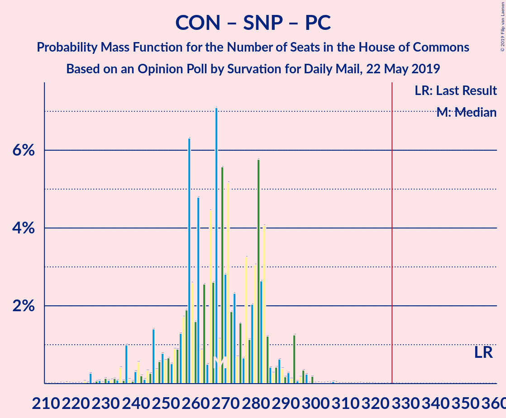

| Number of Seats | Probability | Accumulated | Special Marks |
|:---------------:|:-----------:|:-----------:|:-------------:|
| 215 | 0% | 100% |  |
| 216 | 0% | 99.9% |  |
| 217 | 0% | 99.9% |  |
| 218 | 0% | 99.9% |  |
| 219 | 0% | 99.9% |  |
| 220 | 0% | 99.9% |  |
| 221 | 0% | 99.9% |  |
| 222 | 0% | 99.8% |  |
| 223 | 0.1% | 99.8% |  |
| 224 | 0% | 99.8% |  |
| 225 | 0.3% | 99.7% |  |
| 226 | 0% | 99.5% |  |
| 227 | 0.1% | 99.5% |  |
| 228 | 0.1% | 99.4% |  |
| 229 | 0% | 99.3% |  |
| 230 | 0.1% | 99.3% |  |
| 231 | 0.1% | 99.1% |  |
| 232 | 0.1% | 99.1% |  |
| 233 | 0.1% | 99.0% |  |
| 234 | 0.1% | 98.8% |  |
| 235 | 0.4% | 98.7% |  |
| 236 | 0.1% | 98% |  |
| 237 | 1.0% | 98% |  |
| 238 | 0.1% | 97% |  |
| 239 | 0.1% | 97% |  |
| 240 | 0.3% | 97% |  |
| 241 | 0.6% | 97% |  |
| 242 | 0.2% | 96% |  |
| 243 | 0.1% | 96% |  |
| 244 | 0.3% | 96% |  |
| 245 | 0.3% | 96% |  |
| 246 | 1.4% | 95% |  |
| 247 | 0.4% | 94% |  |
| 248 | 0.6% | 94% |  |
| 249 | 0.8% | 93% |  |
| 250 | 0.6% | 92% |  |
| 251 | 0.7% | 92% |  |
| 252 | 0.5% | 91% |  |
| 253 | 0.9% | 90% |  |
| 254 | 0.9% | 89% |  |
| 255 | 1.3% | 89% |  |
| 256 | 2% | 87% |  |
| 257 | 2% | 86% |  |
| 258 | 6% | 84% |  |
| 259 | 3% | 77% |  |
| 260 | 2% | 75% |  |
| 261 | 5% | 73% |  |
| 262 | 0.9% | 68% |  |
| 263 | 3% | 68% |  |
| 264 | 0.5% | 65% |  |
| 265 | 4% | 64% |  |
| 266 | 3% | 60% |  |
| 267 | 7% | 57% |  |
| 268 | 1.2% | 50% | Median |
| 269 | 6% | 49% |  |
| 270 | 3% | 44% |  |
| 271 | 5% | 41% |  |
| 272 | 2% | 36% |  |
| 273 | 2% | 34% |  |
| 274 | 0.7% | 31% |  |
| 275 | 2% | 31% |  |
| 276 | 0.7% | 29% |  |
| 277 | 3% | 29% |  |
| 278 | 1.1% | 25% |  |
| 279 | 2% | 24% |  |
| 280 | 3% | 22% |  |
| 281 | 6% | 19% |  |
| 282 | 3% | 13% |  |
| 283 | 4% | 11% |  |
| 284 | 1.2% | 7% |  |
| 285 | 0.4% | 5% |  |
| 286 | 0.3% | 5% |  |
| 287 | 0.4% | 5% |  |
| 288 | 0.6% | 4% |  |
| 289 | 0.4% | 4% |  |
| 290 | 0.2% | 3% |  |
| 291 | 0.3% | 3% |  |
| 292 | 0.1% | 3% |  |
| 293 | 1.3% | 3% |  |
| 294 | 0.1% | 1.4% |  |
| 295 | 0.2% | 1.3% |  |
| 296 | 0.3% | 1.1% |  |
| 297 | 0.2% | 0.8% |  |
| 298 | 0% | 0.6% |  |
| 299 | 0.2% | 0.5% |  |
| 300 | 0% | 0.3% |  |
| 301 | 0% | 0.3% |  |
| 302 | 0% | 0.3% |  |
| 303 | 0% | 0.3% |  |
| 304 | 0% | 0.3% |  |
| 305 | 0% | 0.2% |  |
| 306 | 0.1% | 0.2% |  |
| 307 | 0% | 0.2% |  |
| 308 | 0% | 0.1% |  |
| 309 | 0% | 0.1% |  |
| 310 | 0% | 0.1% |  |
| 311 | 0% | 0.1% |  |
| 312 | 0% | 0.1% |  |
| 313 | 0% | 0.1% |  |
| 314 | 0% | 0.1% |  |
| 315 | 0% | 0.1% |  |
| 316 | 0% | 0% |  |
| 317 | 0% | 0% |  |
| 318 | 0% | 0% |  |
| 319 | 0% | 0% |  |
| 320 | 0% | 0% |  |
| 321 | 0% | 0% |  |
| 322 | 0% | 0% |  |
| 323 | 0% | 0% |  |
| 324 | 0% | 0% |  |
| 325 | 0% | 0% |  |
| 326 | 0% | 0% | Majority |
| 327 | 0% | 0% |  |
| 328 | 0% | 0% |  |
| 329 | 0% | 0% |  |
| 330 | 0% | 0% |  |
| 331 | 0% | 0% |  |
| 332 | 0% | 0% |  |
| 333 | 0% | 0% |  |
| 334 | 0% | 0% |  |
| 335 | 0% | 0% |  |
| 336 | 0% | 0% |  |
| 337 | 0% | 0% |  |
| 338 | 0% | 0% |  |
| 339 | 0% | 0% |  |
| 340 | 0% | 0% |  |
| 341 | 0% | 0% |  |
| 342 | 0% | 0% |  |
| 343 | 0% | 0% |  |
| 344 | 0% | 0% |  |
| 345 | 0% | 0% |  |
| 346 | 0% | 0% |  |
| 347 | 0% | 0% |  |
| 348 | 0% | 0% |  |
| 349 | 0% | 0% |  |
| 350 | 0% | 0% |  |
| 351 | 0% | 0% |  |
| 352 | 0% | 0% |  |
| 353 | 0% | 0% |  |
| 354 | 0% | 0% |  |
| 355 | 0% | 0% |  |
| 356 | 0% | 0% | Last Result |

### Conservative Party – Scottish National Party

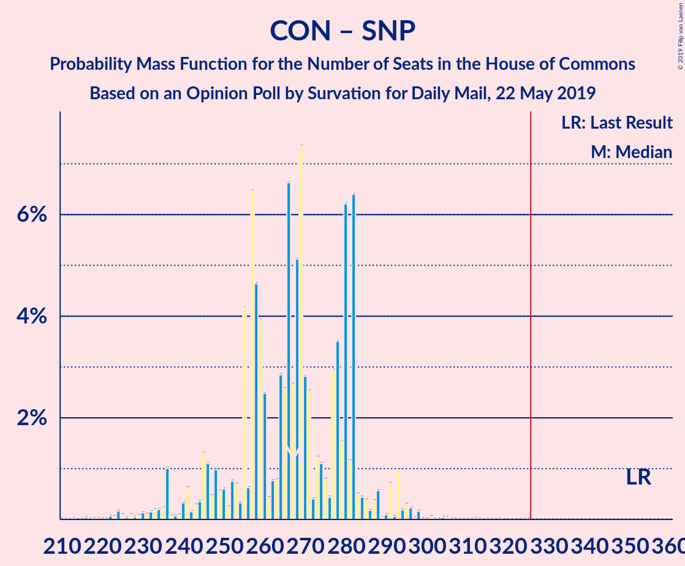

| Number of Seats | Probability | Accumulated | Special Marks |
|:---------------:|:-----------:|:-----------:|:-------------:|
| 213 | 0% | 100% |  |
| 214 | 0% | 99.9% |  |
| 215 | 0% | 99.9% |  |
| 216 | 0% | 99.9% |  |
| 217 | 0% | 99.9% |  |
| 218 | 0% | 99.9% |  |
| 219 | 0% | 99.9% |  |
| 220 | 0% | 99.8% |  |
| 221 | 0% | 99.8% |  |
| 222 | 0.1% | 99.8% |  |
| 223 | 0.1% | 99.8% |  |
| 224 | 0.2% | 99.7% |  |
| 225 | 0.1% | 99.5% |  |
| 226 | 0% | 99.4% |  |
| 227 | 0.1% | 99.4% |  |
| 228 | 0% | 99.3% |  |
| 229 | 0.1% | 99.3% |  |
| 230 | 0.1% | 99.2% |  |
| 231 | 0.1% | 99.1% |  |
| 232 | 0.1% | 99.0% |  |
| 233 | 0.2% | 98.8% |  |
| 234 | 0.2% | 98.6% |  |
| 235 | 0.2% | 98% |  |
| 236 | 1.0% | 98% |  |
| 237 | 0.1% | 97% |  |
| 238 | 0.1% | 97% |  |
| 239 | 0.1% | 97% |  |
| 240 | 0.3% | 97% |  |
| 241 | 0.6% | 97% |  |
| 242 | 0.2% | 96% |  |
| 243 | 0.3% | 96% |  |
| 244 | 0.4% | 96% |  |
| 245 | 1.3% | 95% |  |
| 246 | 1.1% | 94% |  |
| 247 | 0.5% | 93% |  |
| 248 | 1.0% | 92% |  |
| 249 | 0.6% | 91% |  |
| 250 | 0.6% | 91% |  |
| 251 | 0.3% | 90% |  |
| 252 | 0.8% | 90% |  |
| 253 | 0.7% | 89% |  |
| 254 | 0.3% | 88% |  |
| 255 | 4% | 88% |  |
| 256 | 0.6% | 84% |  |
| 257 | 6% | 83% |  |
| 258 | 5% | 77% |  |
| 259 | 4% | 72% |  |
| 260 | 2% | 68% |  |
| 261 | 0.4% | 66% |  |
| 262 | 0.8% | 65% |  |
| 263 | 0.8% | 65% |  |
| 264 | 3% | 64% |  |
| 265 | 3% | 61% |  |
| 266 | 7% | 58% |  |
| 267 | 3% | 52% | Median |
| 268 | 5% | 49% |  |
| 269 | 7% | 44% |  |
| 270 | 3% | 37% |  |
| 271 | 3% | 34% |  |
| 272 | 0.4% | 31% |  |
| 273 | 1.2% | 31% |  |
| 274 | 1.1% | 30% |  |
| 275 | 0.8% | 29% |  |
| 276 | 0.4% | 28% |  |
| 277 | 3% | 27% |  |
| 278 | 4% | 24% |  |
| 279 | 2% | 21% |  |
| 280 | 6% | 19% |  |
| 281 | 1.2% | 13% |  |
| 282 | 6% | 12% |  |
| 283 | 0.5% | 6% |  |
| 284 | 0.4% | 5% |  |
| 285 | 0.4% | 5% |  |
| 286 | 0.2% | 4% |  |
| 287 | 0.4% | 4% |  |
| 288 | 0.6% | 4% |  |
| 289 | 0% | 3% |  |
| 290 | 0.1% | 3% |  |
| 291 | 0.7% | 3% |  |
| 292 | 0.1% | 2% |  |
| 293 | 1.0% | 2% |  |
| 294 | 0.2% | 1.2% |  |
| 295 | 0.3% | 1.1% |  |
| 296 | 0.2% | 0.8% |  |
| 297 | 0% | 0.5% |  |
| 298 | 0.2% | 0.5% |  |
| 299 | 0% | 0.3% |  |
| 300 | 0% | 0.3% |  |
| 301 | 0.1% | 0.3% |  |
| 302 | 0% | 0.2% |  |
| 303 | 0% | 0.2% |  |
| 304 | 0% | 0.2% |  |
| 305 | 0% | 0.2% |  |
| 306 | 0% | 0.1% |  |
| 307 | 0% | 0.1% |  |
| 308 | 0% | 0.1% |  |
| 309 | 0% | 0.1% |  |
| 310 | 0% | 0.1% |  |
| 311 | 0% | 0.1% |  |
| 312 | 0% | 0.1% |  |
| 313 | 0% | 0.1% |  |
| 314 | 0% | 0.1% |  |
| 315 | 0% | 0.1% |  |
| 316 | 0% | 0% |  |
| 317 | 0% | 0% |  |
| 318 | 0% | 0% |  |
| 319 | 0% | 0% |  |
| 320 | 0% | 0% |  |
| 321 | 0% | 0% |  |
| 322 | 0% | 0% |  |
| 323 | 0% | 0% |  |
| 324 | 0% | 0% |  |
| 325 | 0% | 0% |  |
| 326 | 0% | 0% | Majority |
| 327 | 0% | 0% |  |
| 328 | 0% | 0% |  |
| 329 | 0% | 0% |  |
| 330 | 0% | 0% |  |
| 331 | 0% | 0% |  |
| 332 | 0% | 0% |  |
| 333 | 0% | 0% |  |
| 334 | 0% | 0% |  |
| 335 | 0% | 0% |  |
| 336 | 0% | 0% |  |
| 337 | 0% | 0% |  |
| 338 | 0% | 0% |  |
| 339 | 0% | 0% |  |
| 340 | 0% | 0% |  |
| 341 | 0% | 0% |  |
| 342 | 0% | 0% |  |
| 343 | 0% | 0% |  |
| 344 | 0% | 0% |  |
| 345 | 0% | 0% |  |
| 346 | 0% | 0% |  |
| 347 | 0% | 0% |  |
| 348 | 0% | 0% |  |
| 349 | 0% | 0% |  |
| 350 | 0% | 0% |  |
| 351 | 0% | 0% |  |
| 352 | 0% | 0% | Last Result |

### Conservative Party – Liberal Democrats – Change UK

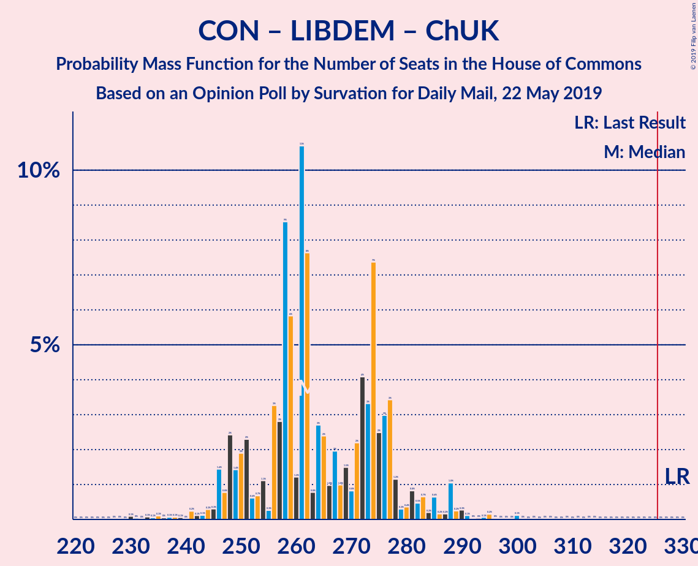

| Number of Seats | Probability | Accumulated | Special Marks |
|:---------------:|:-----------:|:-----------:|:-------------:|
| 228 | 0% | 100% |  |
| 229 | 0% | 99.9% |  |
| 230 | 0.1% | 99.9% |  |
| 231 | 0% | 99.8% |  |
| 232 | 0% | 99.8% |  |
| 233 | 0.1% | 99.8% |  |
| 234 | 0.1% | 99.7% |  |
| 235 | 0.1% | 99.7% |  |
| 236 | 0% | 99.6% |  |
| 237 | 0.1% | 99.5% |  |
| 238 | 0.1% | 99.4% |  |
| 239 | 0.1% | 99.4% |  |
| 240 | 0% | 99.3% |  |
| 241 | 0.2% | 99.3% |  |
| 242 | 0.1% | 99.1% |  |
| 243 | 0.1% | 98.9% |  |
| 244 | 0.3% | 98.8% |  |
| 245 | 0.3% | 98.5% |  |
| 246 | 1.4% | 98% |  |
| 247 | 0.8% | 97% |  |
| 248 | 2% | 96% |  |
| 249 | 1.4% | 94% |  |
| 250 | 2% | 92% |  |
| 251 | 2% | 90% |  |
| 252 | 0.6% | 88% |  |
| 253 | 0.7% | 87% |  |
| 254 | 1.1% | 87% |  |
| 255 | 0.3% | 86% |  |
| 256 | 3% | 85% |  |
| 257 | 3% | 82% |  |
| 258 | 9% | 79% |  |
| 259 | 6% | 71% |  |
| 260 | 1.2% | 65% |  |
| 261 | 11% | 64% | Median |
| 262 | 8% | 53% |  |
| 263 | 0.8% | 45% |  |
| 264 | 3% | 45% |  |
| 265 | 2% | 42% |  |
| 266 | 1.0% | 39% |  |
| 267 | 2% | 38% |  |
| 268 | 1.0% | 36% |  |
| 269 | 1.5% | 35% |  |
| 270 | 0.8% | 34% |  |
| 271 | 2% | 33% |  |
| 272 | 4% | 31% |  |
| 273 | 3% | 27% |  |
| 274 | 7% | 24% |  |
| 275 | 2% | 16% |  |
| 276 | 3% | 14% |  |
| 277 | 3% | 11% |  |
| 278 | 1.2% | 7% |  |
| 279 | 0.3% | 6% |  |
| 280 | 0.4% | 6% |  |
| 281 | 0.8% | 5% |  |
| 282 | 0.5% | 5% |  |
| 283 | 0.7% | 4% |  |
| 284 | 0.2% | 4% |  |
| 285 | 0.6% | 3% |  |
| 286 | 0.2% | 3% |  |
| 287 | 0.2% | 3% |  |
| 288 | 1.0% | 2% |  |
| 289 | 0.2% | 1.3% |  |
| 290 | 0.3% | 1.1% |  |
| 291 | 0.1% | 0.8% |  |
| 292 | 0% | 0.7% |  |
| 293 | 0% | 0.7% |  |
| 294 | 0.1% | 0.6% |  |
| 295 | 0.2% | 0.6% |  |
| 296 | 0% | 0.4% |  |
| 297 | 0% | 0.4% |  |
| 298 | 0% | 0.3% |  |
| 299 | 0% | 0.3% |  |
| 300 | 0.1% | 0.3% |  |
| 301 | 0% | 0.2% |  |
| 302 | 0% | 0.2% |  |
| 303 | 0% | 0.2% |  |
| 304 | 0% | 0.1% |  |
| 305 | 0% | 0.1% |  |
| 306 | 0% | 0.1% |  |
| 307 | 0% | 0.1% |  |
| 308 | 0% | 0.1% |  |
| 309 | 0% | 0.1% |  |
| 310 | 0% | 0.1% |  |
| 311 | 0% | 0.1% |  |
| 312 | 0% | 0% |  |
| 313 | 0% | 0% |  |
| 314 | 0% | 0% |  |
| 315 | 0% | 0% |  |
| 316 | 0% | 0% |  |
| 317 | 0% | 0% |  |
| 318 | 0% | 0% |  |
| 319 | 0% | 0% |  |
| 320 | 0% | 0% |  |
| 321 | 0% | 0% |  |
| 322 | 0% | 0% |  |
| 323 | 0% | 0% |  |
| 324 | 0% | 0% |  |
| 325 | 0% | 0% |  |
| 326 | 0% | 0% | Majority |
| 327 | 0% | 0% |  |
| 328 | 0% | 0% |  |
| 329 | 0% | 0% | Last Result |

### Conservative Party – Liberal Democrats

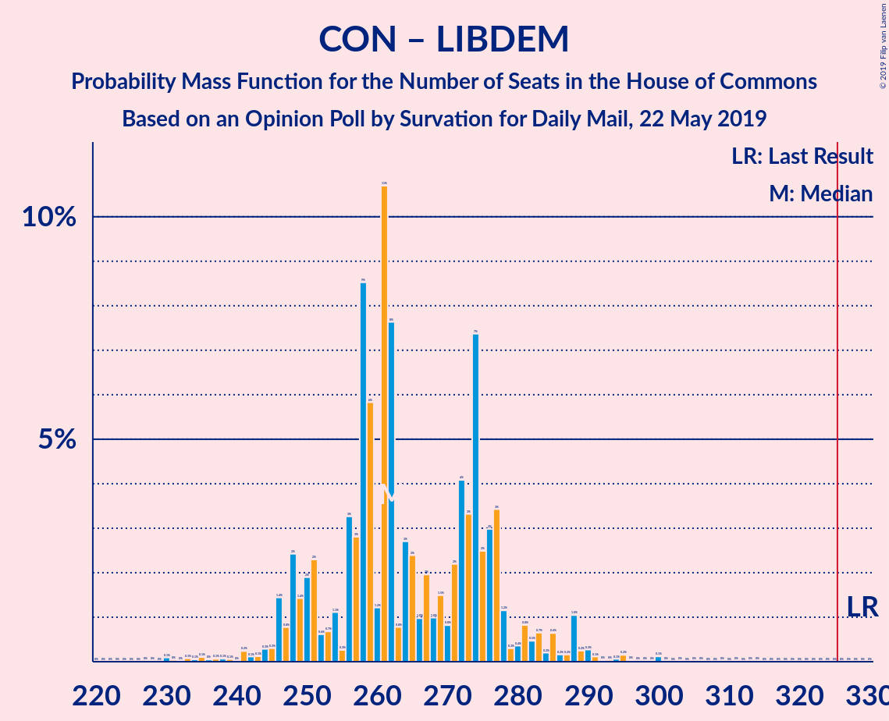

| Number of Seats | Probability | Accumulated | Special Marks |
|:---------------:|:-----------:|:-----------:|:-------------:|
| 228 | 0% | 100% |  |
| 229 | 0% | 99.9% |  |
| 230 | 0.1% | 99.9% |  |
| 231 | 0% | 99.8% |  |
| 232 | 0% | 99.8% |  |
| 233 | 0.1% | 99.8% |  |
| 234 | 0.1% | 99.7% |  |
| 235 | 0.1% | 99.7% |  |
| 236 | 0% | 99.6% |  |
| 237 | 0.1% | 99.5% |  |
| 238 | 0.1% | 99.4% |  |
| 239 | 0.1% | 99.4% |  |
| 240 | 0% | 99.3% |  |
| 241 | 0.2% | 99.3% |  |
| 242 | 0.1% | 99.1% |  |
| 243 | 0.1% | 98.9% |  |
| 244 | 0.3% | 98.8% |  |
| 245 | 0.3% | 98.5% |  |
| 246 | 1.4% | 98% |  |
| 247 | 0.8% | 97% |  |
| 248 | 2% | 96% |  |
| 249 | 1.4% | 94% |  |
| 250 | 2% | 92% |  |
| 251 | 2% | 90% |  |
| 252 | 0.6% | 88% |  |
| 253 | 0.7% | 87% |  |
| 254 | 1.1% | 87% |  |
| 255 | 0.3% | 86% |  |
| 256 | 3% | 85% |  |
| 257 | 3% | 82% |  |
| 258 | 9% | 79% |  |
| 259 | 6% | 71% |  |
| 260 | 1.2% | 65% |  |
| 261 | 11% | 64% | Median |
| 262 | 8% | 53% |  |
| 263 | 0.8% | 45% |  |
| 264 | 3% | 45% |  |
| 265 | 2% | 42% |  |
| 266 | 1.0% | 39% |  |
| 267 | 2% | 38% |  |
| 268 | 1.0% | 36% |  |
| 269 | 1.5% | 35% |  |
| 270 | 0.8% | 34% |  |
| 271 | 2% | 33% |  |
| 272 | 4% | 31% |  |
| 273 | 3% | 27% |  |
| 274 | 7% | 24% |  |
| 275 | 2% | 16% |  |
| 276 | 3% | 14% |  |
| 277 | 3% | 11% |  |
| 278 | 1.2% | 7% |  |
| 279 | 0.3% | 6% |  |
| 280 | 0.4% | 6% |  |
| 281 | 0.8% | 5% |  |
| 282 | 0.5% | 5% |  |
| 283 | 0.7% | 4% |  |
| 284 | 0.2% | 4% |  |
| 285 | 0.6% | 3% |  |
| 286 | 0.2% | 3% |  |
| 287 | 0.2% | 3% |  |
| 288 | 1.0% | 2% |  |
| 289 | 0.2% | 1.3% |  |
| 290 | 0.3% | 1.1% |  |
| 291 | 0.1% | 0.8% |  |
| 292 | 0% | 0.7% |  |
| 293 | 0% | 0.7% |  |
| 294 | 0.1% | 0.6% |  |
| 295 | 0.2% | 0.6% |  |
| 296 | 0% | 0.4% |  |
| 297 | 0% | 0.4% |  |
| 298 | 0% | 0.3% |  |
| 299 | 0% | 0.3% |  |
| 300 | 0.1% | 0.3% |  |
| 301 | 0% | 0.2% |  |
| 302 | 0% | 0.2% |  |
| 303 | 0% | 0.2% |  |
| 304 | 0% | 0.1% |  |
| 305 | 0% | 0.1% |  |
| 306 | 0% | 0.1% |  |
| 307 | 0% | 0.1% |  |
| 308 | 0% | 0.1% |  |
| 309 | 0% | 0.1% |  |
| 310 | 0% | 0.1% |  |
| 311 | 0% | 0.1% |  |
| 312 | 0% | 0% |  |
| 313 | 0% | 0% |  |
| 314 | 0% | 0% |  |
| 315 | 0% | 0% |  |
| 316 | 0% | 0% |  |
| 317 | 0% | 0% |  |
| 318 | 0% | 0% |  |
| 319 | 0% | 0% |  |
| 320 | 0% | 0% |  |
| 321 | 0% | 0% |  |
| 322 | 0% | 0% |  |
| 323 | 0% | 0% |  |
| 324 | 0% | 0% |  |
| 325 | 0% | 0% |  |
| 326 | 0% | 0% | Majority |
| 327 | 0% | 0% |  |
| 328 | 0% | 0% |  |
| 329 | 0% | 0% | Last Result |

### Conservative Party – Plaid Cymru

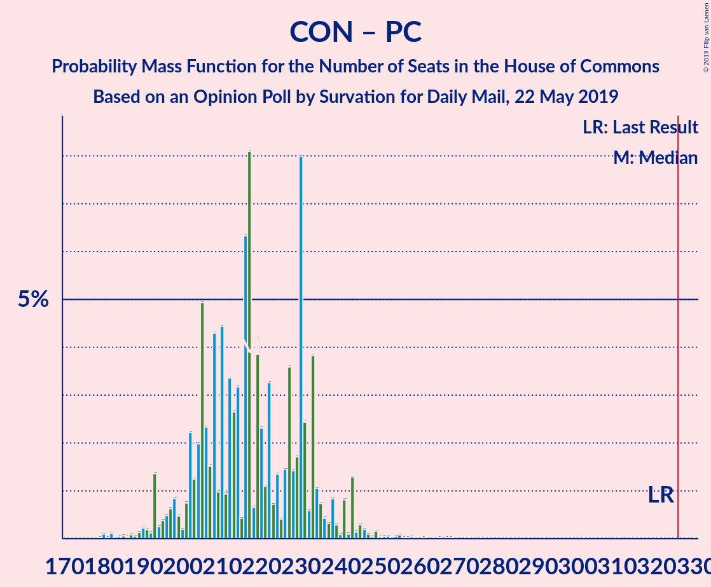

| Number of Seats | Probability | Accumulated | Special Marks |
|:---------------:|:-----------:|:-----------:|:-------------:|
| 176 | 0% | 100% |  |
| 177 | 0% | 99.9% |  |
| 178 | 0% | 99.9% |  |
| 179 | 0% | 99.9% |  |
| 180 | 0.1% | 99.9% |  |
| 181 | 0% | 99.8% |  |
| 182 | 0.1% | 99.8% |  |
| 183 | 0% | 99.7% |  |
| 184 | 0% | 99.7% |  |
| 185 | 0.1% | 99.6% |  |
| 186 | 0% | 99.6% |  |
| 187 | 0.1% | 99.5% |  |
| 188 | 0.1% | 99.4% |  |
| 189 | 0.1% | 99.4% |  |
| 190 | 0.2% | 99.2% |  |
| 191 | 0.2% | 99.0% |  |
| 192 | 0.1% | 98.8% |  |
| 193 | 1.4% | 98.7% |  |
| 194 | 0.3% | 97% |  |
| 195 | 0.4% | 97% |  |
| 196 | 0.5% | 97% |  |
| 197 | 0.6% | 96% |  |
| 198 | 0.8% | 96% |  |
| 199 | 0.5% | 95% |  |
| 200 | 0.2% | 94% |  |
| 201 | 0.7% | 94% |  |
| 202 | 2% | 93% |  |
| 203 | 1.2% | 91% |  |
| 204 | 2% | 90% |  |
| 205 | 5% | 88% |  |
| 206 | 2% | 83% |  |
| 207 | 2% | 81% |  |
| 208 | 4% | 79% |  |
| 209 | 1.0% | 75% |  |
| 210 | 4% | 74% |  |
| 211 | 0.9% | 69% |  |
| 212 | 3% | 68% |  |
| 213 | 3% | 65% |  |
| 214 | 3% | 62% |  |
| 215 | 0.4% | 59% |  |
| 216 | 6% | 59% |  |
| 217 | 8% | 53% | Median |
| 218 | 0.7% | 44% |  |
| 219 | 4% | 44% |  |
| 220 | 2% | 40% |  |
| 221 | 1.1% | 37% |  |
| 222 | 3% | 36% |  |
| 223 | 0.7% | 33% |  |
| 224 | 1.3% | 32% |  |
| 225 | 0.4% | 31% |  |
| 226 | 1.4% | 30% |  |
| 227 | 4% | 29% |  |
| 228 | 1.4% | 25% |  |
| 229 | 2% | 24% |  |
| 230 | 8% | 22% |  |
| 231 | 2% | 14% |  |
| 232 | 0.6% | 12% |  |
| 233 | 4% | 11% |  |
| 234 | 1.1% | 7% |  |
| 235 | 0.7% | 6% |  |
| 236 | 0.4% | 6% |  |
| 237 | 0.3% | 5% |  |
| 238 | 0.8% | 5% |  |
| 239 | 0.3% | 4% |  |
| 240 | 0.1% | 4% |  |
| 241 | 0.8% | 4% |  |
| 242 | 0.1% | 3% |  |
| 243 | 1.3% | 3% |  |
| 244 | 0.1% | 1.5% |  |
| 245 | 0.3% | 1.3% |  |
| 246 | 0.2% | 1.0% |  |
| 247 | 0.1% | 0.8% |  |
| 248 | 0% | 0.7% |  |
| 249 | 0.2% | 0.7% |  |
| 250 | 0% | 0.5% |  |
| 251 | 0% | 0.5% |  |
| 252 | 0.1% | 0.5% |  |
| 253 | 0% | 0.4% |  |
| 254 | 0.1% | 0.4% |  |
| 255 | 0.1% | 0.3% |  |
| 256 | 0% | 0.3% |  |
| 257 | 0% | 0.2% |  |
| 258 | 0% | 0.2% |  |
| 259 | 0% | 0.2% |  |
| 260 | 0% | 0.2% |  |
| 261 | 0% | 0.2% |  |
| 262 | 0% | 0.1% |  |
| 263 | 0% | 0.1% |  |
| 264 | 0% | 0.1% |  |
| 265 | 0% | 0.1% |  |
| 266 | 0% | 0.1% |  |
| 267 | 0% | 0.1% |  |
| 268 | 0% | 0.1% |  |
| 269 | 0% | 0% |  |
| 270 | 0% | 0% |  |
| 271 | 0% | 0% |  |
| 272 | 0% | 0% |  |
| 273 | 0% | 0% |  |
| 274 | 0% | 0% |  |
| 275 | 0% | 0% |  |
| 276 | 0% | 0% |  |
| 277 | 0% | 0% |  |
| 278 | 0% | 0% |  |
| 279 | 0% | 0% |  |
| 280 | 0% | 0% |  |
| 281 | 0% | 0% |  |
| 282 | 0% | 0% |  |
| 283 | 0% | 0% |  |
| 284 | 0% | 0% |  |
| 285 | 0% | 0% |  |
| 286 | 0% | 0% |  |
| 287 | 0% | 0% |  |
| 288 | 0% | 0% |  |
| 289 | 0% | 0% |  |
| 290 | 0% | 0% |  |
| 291 | 0% | 0% |  |
| 292 | 0% | 0% |  |
| 293 | 0% | 0% |  |
| 294 | 0% | 0% |  |
| 295 | 0% | 0% |  |
| 296 | 0% | 0% |  |
| 297 | 0% | 0% |  |
| 298 | 0% | 0% |  |
| 299 | 0% | 0% |  |
| 300 | 0% | 0% |  |
| 301 | 0% | 0% |  |
| 302 | 0% | 0% |  |
| 303 | 0% | 0% |  |
| 304 | 0% | 0% |  |
| 305 | 0% | 0% |  |
| 306 | 0% | 0% |  |
| 307 | 0% | 0% |  |
| 308 | 0% | 0% |  |
| 309 | 0% | 0% |  |
| 310 | 0% | 0% |  |
| 311 | 0% | 0% |  |
| 312 | 0% | 0% |  |
| 313 | 0% | 0% |  |
| 314 | 0% | 0% |  |
| 315 | 0% | 0% |  |
| 316 | 0% | 0% |  |
| 317 | 0% | 0% |  |
| 318 | 0% | 0% |  |
| 319 | 0% | 0% |  |
| 320 | 0% | 0% |  |
| 321 | 0% | 0% | Last Result |

### Conservative Party – Change UK

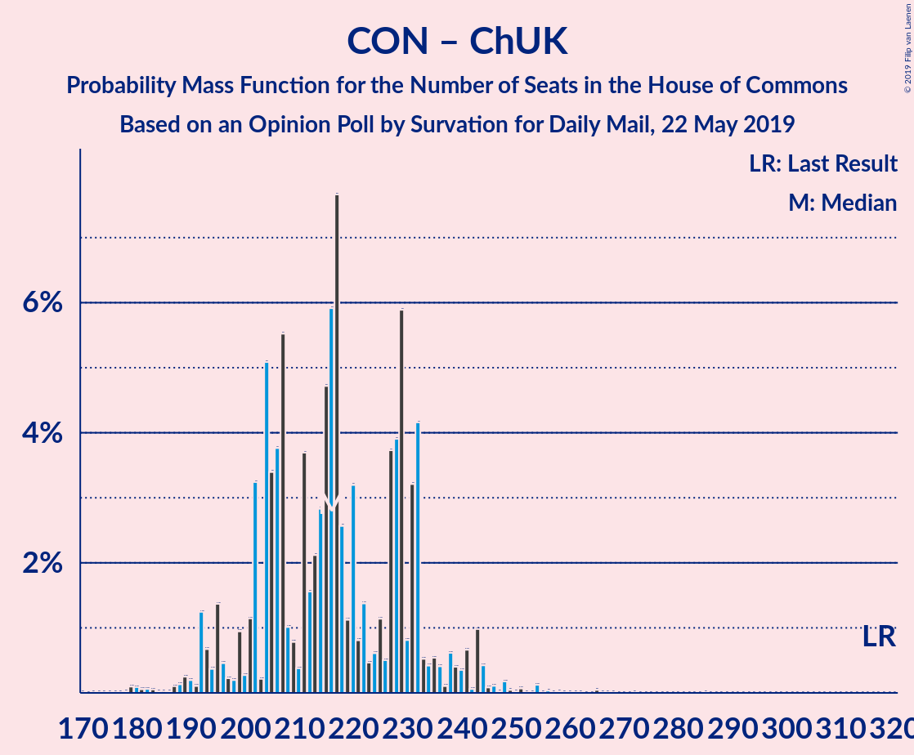

| Number of Seats | Probability | Accumulated | Special Marks |
|:---------------:|:-----------:|:-----------:|:-------------:|
| 174 | 0% | 100% |  |
| 175 | 0% | 99.9% |  |
| 176 | 0% | 99.9% |  |
| 177 | 0% | 99.9% |  |
| 178 | 0% | 99.9% |  |
| 179 | 0.1% | 99.9% |  |
| 180 | 0.1% | 99.8% |  |
| 181 | 0.1% | 99.7% |  |
| 182 | 0.1% | 99.7% |  |
| 183 | 0.1% | 99.6% |  |
| 184 | 0% | 99.5% |  |
| 185 | 0% | 99.5% |  |
| 186 | 0% | 99.5% |  |
| 187 | 0.1% | 99.5% |  |
| 188 | 0.1% | 99.4% |  |
| 189 | 0.2% | 99.2% |  |
| 190 | 0.2% | 99.0% |  |
| 191 | 0.1% | 98.8% |  |
| 192 | 1.2% | 98.7% |  |
| 193 | 0.7% | 97% |  |
| 194 | 0.4% | 97% |  |
| 195 | 1.4% | 96% |  |
| 196 | 0.5% | 95% |  |
| 197 | 0.2% | 95% |  |
| 198 | 0.2% | 94% |  |
| 199 | 0.9% | 94% |  |
| 200 | 0.3% | 93% |  |
| 201 | 1.1% | 93% |  |
| 202 | 3% | 92% |  |
| 203 | 0.2% | 89% |  |
| 204 | 5% | 88% |  |
| 205 | 3% | 83% |  |
| 206 | 4% | 80% |  |
| 207 | 6% | 76% |  |
| 208 | 1.0% | 71% |  |
| 209 | 0.8% | 70% |  |
| 210 | 0.4% | 69% |  |
| 211 | 4% | 68% |  |
| 212 | 2% | 65% |  |
| 213 | 2% | 63% |  |
| 214 | 3% | 61% |  |
| 215 | 5% | 58% |  |
| 216 | 6% | 53% | Median |
| 217 | 8% | 48% |  |
| 218 | 3% | 40% |  |
| 219 | 1.1% | 37% |  |
| 220 | 3% | 36% |  |
| 221 | 0.8% | 33% |  |
| 222 | 1.4% | 32% |  |
| 223 | 0.5% | 31% |  |
| 224 | 0.6% | 30% |  |
| 225 | 1.1% | 30% |  |
| 226 | 0.5% | 29% |  |
| 227 | 4% | 28% |  |
| 228 | 4% | 24% |  |
| 229 | 6% | 20% |  |
| 230 | 0.8% | 15% |  |
| 231 | 3% | 14% |  |
| 232 | 4% | 11% |  |
| 233 | 0.5% | 6% |  |
| 234 | 0.4% | 6% |  |
| 235 | 0.5% | 5% |  |
| 236 | 0.4% | 5% |  |
| 237 | 0.1% | 4% |  |
| 238 | 0.6% | 4% |  |
| 239 | 0.4% | 4% |  |
| 240 | 0.4% | 3% |  |
| 241 | 0.7% | 3% |  |
| 242 | 0.1% | 2% |  |
| 243 | 1.0% | 2% |  |
| 244 | 0.4% | 1.3% |  |
| 245 | 0.1% | 0.9% |  |
| 246 | 0.1% | 0.8% |  |
| 247 | 0% | 0.7% |  |
| 248 | 0.2% | 0.7% |  |
| 249 | 0% | 0.5% |  |
| 250 | 0% | 0.5% |  |
| 251 | 0.1% | 0.4% |  |
| 252 | 0% | 0.4% |  |
| 253 | 0% | 0.4% |  |
| 254 | 0.1% | 0.3% |  |
| 255 | 0% | 0.2% |  |
| 256 | 0% | 0.2% |  |
| 257 | 0% | 0.2% |  |
| 258 | 0% | 0.2% |  |
| 259 | 0% | 0.2% |  |
| 260 | 0% | 0.1% |  |
| 261 | 0% | 0.1% |  |
| 262 | 0% | 0.1% |  |
| 263 | 0% | 0.1% |  |
| 264 | 0% | 0.1% |  |
| 265 | 0% | 0.1% |  |
| 266 | 0% | 0.1% |  |
| 267 | 0% | 0% |  |
| 268 | 0% | 0% |  |
| 269 | 0% | 0% |  |
| 270 | 0% | 0% |  |
| 271 | 0% | 0% |  |
| 272 | 0% | 0% |  |
| 273 | 0% | 0% |  |
| 274 | 0% | 0% |  |
| 275 | 0% | 0% |  |
| 276 | 0% | 0% |  |
| 277 | 0% | 0% |  |
| 278 | 0% | 0% |  |
| 279 | 0% | 0% |  |
| 280 | 0% | 0% |  |
| 281 | 0% | 0% |  |
| 282 | 0% | 0% |  |
| 283 | 0% | 0% |  |
| 284 | 0% | 0% |  |
| 285 | 0% | 0% |  |
| 286 | 0% | 0% |  |
| 287 | 0% | 0% |  |
| 288 | 0% | 0% |  |
| 289 | 0% | 0% |  |
| 290 | 0% | 0% |  |
| 291 | 0% | 0% |  |
| 292 | 0% | 0% |  |
| 293 | 0% | 0% |  |
| 294 | 0% | 0% |  |
| 295 | 0% | 0% |  |
| 296 | 0% | 0% |  |
| 297 | 0% | 0% |  |
| 298 | 0% | 0% |  |
| 299 | 0% | 0% |  |
| 300 | 0% | 0% |  |
| 301 | 0% | 0% |  |
| 302 | 0% | 0% |  |
| 303 | 0% | 0% |  |
| 304 | 0% | 0% |  |
| 305 | 0% | 0% |  |
| 306 | 0% | 0% |  |
| 307 | 0% | 0% |  |
| 308 | 0% | 0% |  |
| 309 | 0% | 0% |  |
| 310 | 0% | 0% |  |
| 311 | 0% | 0% |  |
| 312 | 0% | 0% |  |
| 313 | 0% | 0% |  |
| 314 | 0% | 0% |  |
| 315 | 0% | 0% |  |
| 316 | 0% | 0% |  |
| 317 | 0% | 0% | Last Result |

### Conservative Party

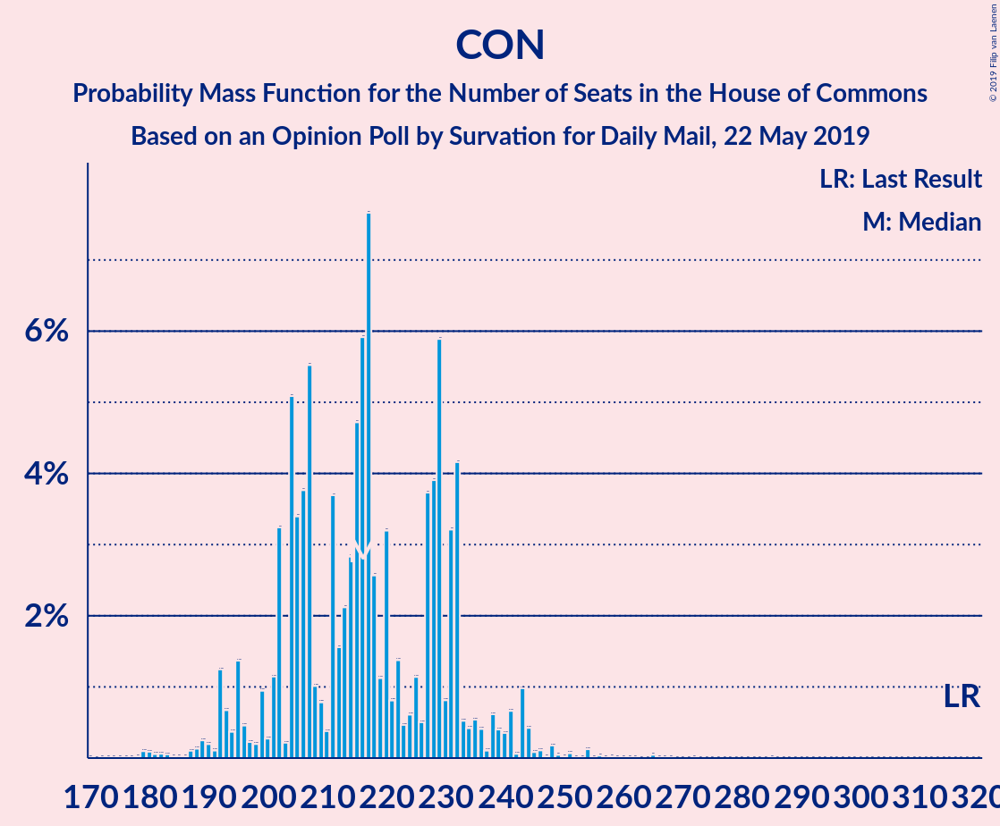

| Number of Seats | Probability | Accumulated | Special Marks |
|:---------------:|:-----------:|:-----------:|:-------------:|
| 174 | 0% | 100% |  |
| 175 | 0% | 99.9% |  |
| 176 | 0% | 99.9% |  |
| 177 | 0% | 99.9% |  |
| 178 | 0% | 99.9% |  |
| 179 | 0.1% | 99.9% |  |
| 180 | 0.1% | 99.8% |  |
| 181 | 0.1% | 99.7% |  |
| 182 | 0.1% | 99.7% |  |
| 183 | 0.1% | 99.6% |  |
| 184 | 0% | 99.5% |  |
| 185 | 0% | 99.5% |  |
| 186 | 0% | 99.5% |  |
| 187 | 0.1% | 99.5% |  |
| 188 | 0.1% | 99.4% |  |
| 189 | 0.2% | 99.2% |  |
| 190 | 0.2% | 99.0% |  |
| 191 | 0.1% | 98.8% |  |
| 192 | 1.2% | 98.7% |  |
| 193 | 0.7% | 97% |  |
| 194 | 0.4% | 97% |  |
| 195 | 1.4% | 96% |  |
| 196 | 0.5% | 95% |  |
| 197 | 0.2% | 95% |  |
| 198 | 0.2% | 94% |  |
| 199 | 0.9% | 94% |  |
| 200 | 0.3% | 93% |  |
| 201 | 1.1% | 93% |  |
| 202 | 3% | 92% |  |
| 203 | 0.2% | 89% |  |
| 204 | 5% | 88% |  |
| 205 | 3% | 83% |  |
| 206 | 4% | 80% |  |
| 207 | 6% | 76% |  |
| 208 | 1.0% | 71% |  |
| 209 | 0.8% | 70% |  |
| 210 | 0.4% | 69% |  |
| 211 | 4% | 68% |  |
| 212 | 2% | 65% |  |
| 213 | 2% | 63% |  |
| 214 | 3% | 61% |  |
| 215 | 5% | 58% |  |
| 216 | 6% | 53% | Median |
| 217 | 8% | 48% |  |
| 218 | 3% | 40% |  |
| 219 | 1.1% | 37% |  |
| 220 | 3% | 36% |  |
| 221 | 0.8% | 33% |  |
| 222 | 1.4% | 32% |  |
| 223 | 0.5% | 31% |  |
| 224 | 0.6% | 30% |  |
| 225 | 1.1% | 30% |  |
| 226 | 0.5% | 29% |  |
| 227 | 4% | 28% |  |
| 228 | 4% | 24% |  |
| 229 | 6% | 20% |  |
| 230 | 0.8% | 15% |  |
| 231 | 3% | 14% |  |
| 232 | 4% | 11% |  |
| 233 | 0.5% | 6% |  |
| 234 | 0.4% | 6% |  |
| 235 | 0.5% | 5% |  |
| 236 | 0.4% | 5% |  |
| 237 | 0.1% | 4% |  |
| 238 | 0.6% | 4% |  |
| 239 | 0.4% | 4% |  |
| 240 | 0.4% | 3% |  |
| 241 | 0.7% | 3% |  |
| 242 | 0.1% | 2% |  |
| 243 | 1.0% | 2% |  |
| 244 | 0.4% | 1.3% |  |
| 245 | 0.1% | 0.9% |  |
| 246 | 0.1% | 0.8% |  |
| 247 | 0% | 0.7% |  |
| 248 | 0.2% | 0.7% |  |
| 249 | 0% | 0.5% |  |
| 250 | 0% | 0.5% |  |
| 251 | 0.1% | 0.4% |  |
| 252 | 0% | 0.4% |  |
| 253 | 0% | 0.4% |  |
| 254 | 0.1% | 0.3% |  |
| 255 | 0% | 0.2% |  |
| 256 | 0% | 0.2% |  |
| 257 | 0% | 0.2% |  |
| 258 | 0% | 0.2% |  |
| 259 | 0% | 0.2% |  |
| 260 | 0% | 0.1% |  |
| 261 | 0% | 0.1% |  |
| 262 | 0% | 0.1% |  |
| 263 | 0% | 0.1% |  |
| 264 | 0% | 0.1% |  |
| 265 | 0% | 0.1% |  |
| 266 | 0% | 0.1% |  |
| 267 | 0% | 0% |  |
| 268 | 0% | 0% |  |
| 269 | 0% | 0% |  |
| 270 | 0% | 0% |  |
| 271 | 0% | 0% |  |
| 272 | 0% | 0% |  |
| 273 | 0% | 0% |  |
| 274 | 0% | 0% |  |
| 275 | 0% | 0% |  |
| 276 | 0% | 0% |  |
| 277 | 0% | 0% |  |
| 278 | 0% | 0% |  |
| 279 | 0% | 0% |  |
| 280 | 0% | 0% |  |
| 281 | 0% | 0% |  |
| 282 | 0% | 0% |  |
| 283 | 0% | 0% |  |
| 284 | 0% | 0% |  |
| 285 | 0% | 0% |  |
| 286 | 0% | 0% |  |
| 287 | 0% | 0% |  |
| 288 | 0% | 0% |  |
| 289 | 0% | 0% |  |
| 290 | 0% | 0% |  |
| 291 | 0% | 0% |  |
| 292 | 0% | 0% |  |
| 293 | 0% | 0% |  |
| 294 | 0% | 0% |  |
| 295 | 0% | 0% |  |
| 296 | 0% | 0% |  |
| 297 | 0% | 0% |  |
| 298 | 0% | 0% |  |
| 299 | 0% | 0% |  |
| 300 | 0% | 0% |  |
| 301 | 0% | 0% |  |
| 302 | 0% | 0% |  |
| 303 | 0% | 0% |  |
| 304 | 0% | 0% |  |
| 305 | 0% | 0% |  |
| 306 | 0% | 0% |  |
| 307 | 0% | 0% |  |
| 308 | 0% | 0% |  |
| 309 | 0% | 0% |  |
| 310 | 0% | 0% |  |
| 311 | 0% | 0% |  |
| 312 | 0% | 0% |  |
| 313 | 0% | 0% |  |
| 314 | 0% | 0% |  |
| 315 | 0% | 0% |  |
| 316 | 0% | 0% |  |
| 317 | 0% | 0% | Last Result |

## Technical Information

### Opinion Poll

+ **Polling firm:** Survation
+ **Commissioner(s):** Daily Mail
+ **Fieldwork period:** 22 May 2019

### Calculations

+ **Sample size:** 2029
+ **Simulations done:** 1,048,576
+ **Error estimate:** 1.60%

