# Opinion Poll by BMG Research for The Independent, 4–7 June 2019

<a href="#voting-intentions">Voting Intentions</a> | <a href="#seats">Seats</a> | <a href="#coalitions">Coalitions</a> | <a href="#technical-information">Technical Information</a>

## Voting Intentions

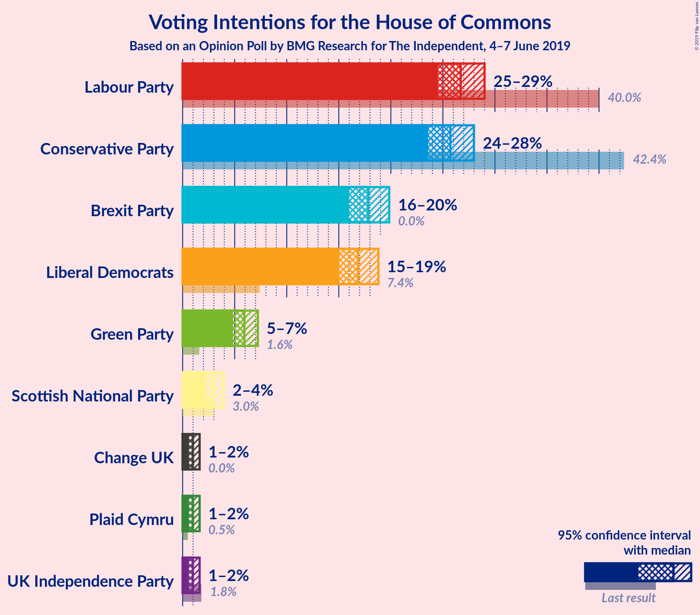

### Confidence Intervals

| Party | Last Result | Poll Result | 80% Confidence Interval | 90% Confidence Interval | 95% Confidence Interval | 99% Confidence Interval |
|:-----:|:-----------:|:-----------:|:-----------------------:|:-----------------------:|:-----------------------:|:-----------------------:|
| Labour Party | 40.0% | 26.7% | 25.3–28.2% |24.9–28.6% |24.5–29.0% |23.9–29.7% |
| Conservative Party | 42.4% | 25.7% | 24.3–27.2% |23.9–27.6% |23.6–28.0% |22.9–28.7% |
| Brexit Party | 0.0% | 17.8% | 16.6–19.1% |16.3–19.5% |16.0–19.8% |15.4–20.5% |
| Liberal Democrats | 7.4% | 16.8% | 15.7–18.1% |15.3–18.5% |15.0–18.8% |14.5–19.4% |
| Green Party | 1.6% | 5.9% | 5.2–6.8% |5.0–7.0% |4.8–7.2% |4.5–7.7% |
| Scottish National Party | 3.0% | 3.0% | 2.5–3.6% |2.3–3.8% |2.2–3.9% |2.0–4.3% |
| Plaid Cymru | 0.5% | 1.0% | 0.7–1.4% |0.7–1.5% |0.6–1.6% |0.5–1.8% |
| UK Independence Party | 1.8% | 1.0% | 0.7–1.4% |0.7–1.5% |0.6–1.6% |0.5–1.8% |
| Change UK | 0.0% | 1.0% | 0.7–1.4% |0.7–1.5% |0.6–1.6% |0.5–1.8% |

*Note:* The poll result column reflects the actual value used in the calculations. Published results may vary slightly, and in addition be rounded to fewer digits.

## Seats

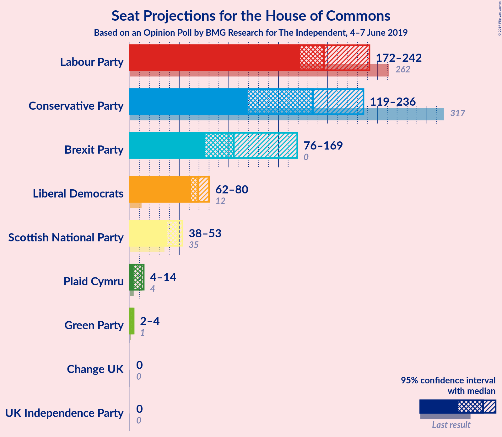

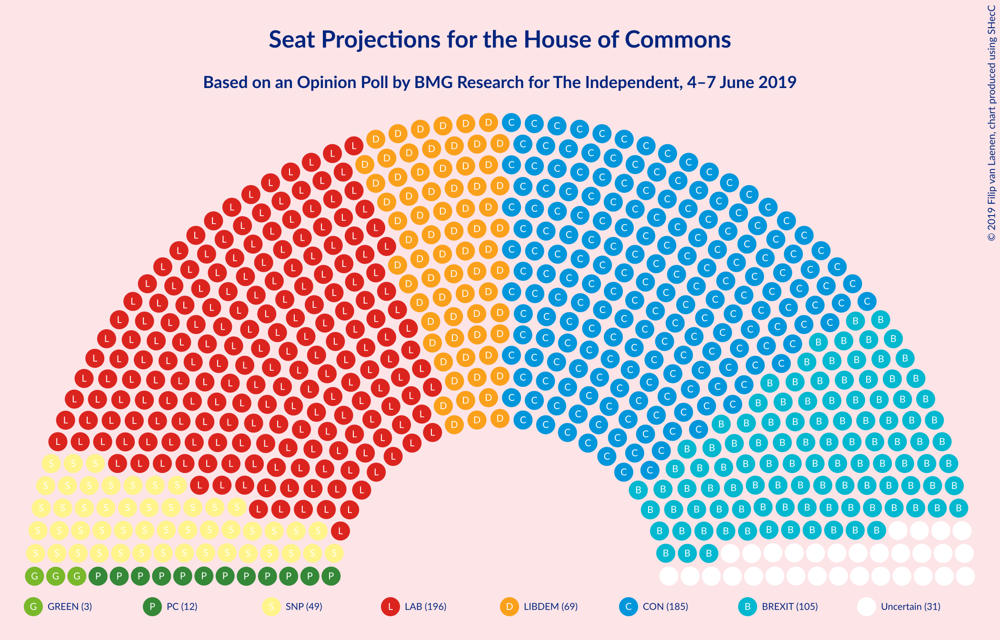

### Confidence Intervals

| Party | Last Result | Median | 80% Confidence Interval | 90% Confidence Interval | 95% Confidence Interval | 99% Confidence Interval |
|:-----:|:-----------:|:------:|:-----------------------:|:-----------------------:|:-----------------------:|:-----------------------:|
| <a href="#labour-party">Labour Party</a> | 262 | 196 | 186–226 |175–241 |172–242 |163–263 |
| <a href="#conservative-party">Conservative Party</a> | 317 | 185 | 150–212 |129–232 |119–236 |117–240 |
| <a href="#brexit-party">Brexit Party</a> | 0 | 105 | 84–146 |77–159 |76–169 |67–174 |
| <a href="#liberal-democrats">Liberal Democrats</a> | 12 | 69 | 64–74 |62–79 |62–80 |56–84 |
| <a href="#green-party">Green Party</a> | 1 | 3 | 2–4 |2–4 |2–4 |2–5 |
| <a href="#scottish-national-party">Scottish National Party</a> | 35 | 49 | 47–52 |43–53 |38–53 |32–53 |
| <a href="#plaid-cymru">Plaid Cymru</a> | 4 | 12 | 7–13 |4–14 |4–14 |3–14 |
| <a href="#uk-independence-party">UK Independence Party</a> | 0 | 0 | 0 |0 |0 |0 |
| <a href="#change-uk">Change UK</a> | 0 | 0 | 0 |0 |0 |0 |

### Labour Party

*For a full overview of the results for this party, see the [Labour Party](party-labourparty.html) page.*

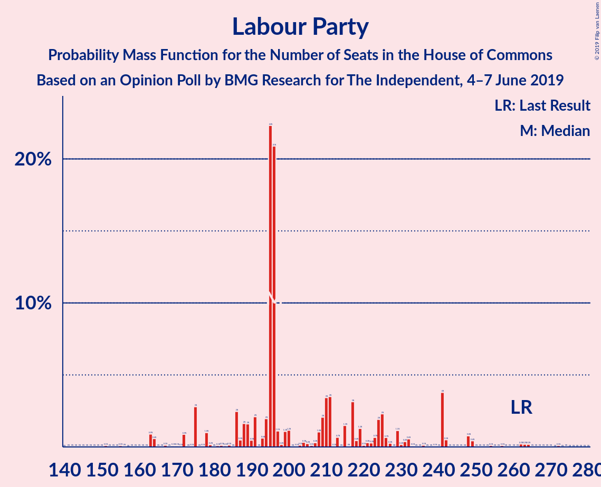

| Number of Seats | Probability | Accumulated | Special Marks |
|:---------------:|:-----------:|:-----------:|:-------------:|
| 144 | 0% | 100% |  |
| 145 | 0% | 99.9% |  |
| 146 | 0% | 99.9% |  |
| 147 | 0% | 99.9% |  |
| 148 | 0% | 99.9% |  |
| 149 | 0% | 99.9% |  |
| 150 | 0% | 99.9% |  |
| 151 | 0.1% | 99.8% |  |
| 152 | 0% | 99.7% |  |
| 153 | 0% | 99.7% |  |
| 154 | 0% | 99.7% |  |
| 155 | 0.1% | 99.7% |  |
| 156 | 0% | 99.6% |  |
| 157 | 0% | 99.6% |  |
| 158 | 0% | 99.6% |  |
| 159 | 0% | 99.6% |  |
| 160 | 0% | 99.6% |  |
| 161 | 0% | 99.5% |  |
| 162 | 0% | 99.5% |  |
| 163 | 0.9% | 99.5% |  |
| 164 | 0.6% | 98.6% |  |
| 165 | 0% | 98% |  |
| 166 | 0% | 98% |  |
| 167 | 0.1% | 98% |  |
| 168 | 0% | 98% |  |
| 169 | 0.1% | 98% |  |
| 170 | 0.1% | 98% |  |
| 171 | 0.1% | 98% |  |
| 172 | 0.9% | 98% |  |
| 173 | 0% | 97% |  |
| 174 | 0.1% | 97% |  |
| 175 | 3% | 97% |  |
| 176 | 0% | 94% |  |
| 177 | 0.1% | 94% |  |
| 178 | 1.0% | 94% |  |
| 179 | 0.2% | 93% |  |
| 180 | 0% | 93% |  |
| 181 | 0.1% | 93% |  |
| 182 | 0.1% | 93% |  |
| 183 | 0.1% | 92% |  |
| 184 | 0.1% | 92% |  |
| 185 | 0% | 92% |  |
| 186 | 2% | 92% |  |
| 187 | 0.5% | 90% |  |
| 188 | 2% | 89% |  |
| 189 | 2% | 88% |  |
| 190 | 0.5% | 86% |  |
| 191 | 2% | 86% |  |
| 192 | 0% | 83% |  |
| 193 | 0.6% | 83% |  |
| 194 | 2% | 83% |  |
| 195 | 22% | 81% |  |
| 196 | 21% | 59% | Median |
| 197 | 1.1% | 38% |  |
| 198 | 0.2% | 37% |  |
| 199 | 1.1% | 36% |  |
| 200 | 1.2% | 35% |  |
| 201 | 0% | 34% |  |
| 202 | 0.1% | 34% |  |
| 203 | 0.1% | 34% |  |
| 204 | 0.3% | 34% |  |
| 205 | 0.2% | 34% |  |
| 206 | 0.1% | 33% |  |
| 207 | 0.3% | 33% |  |
| 208 | 1.0% | 33% |  |
| 209 | 2% | 32% |  |
| 210 | 3% | 30% |  |
| 211 | 3% | 26% |  |
| 212 | 0.1% | 23% |  |
| 213 | 0.7% | 23% |  |
| 214 | 0% | 22% |  |
| 215 | 1.5% | 22% |  |
| 216 | 0% | 21% |  |
| 217 | 3% | 21% |  |
| 218 | 0.4% | 18% |  |
| 219 | 1.3% | 17% |  |
| 220 | 0.1% | 16% |  |
| 221 | 0.3% | 16% |  |
| 222 | 0.3% | 15% |  |
| 223 | 0.7% | 15% |  |
| 224 | 2% | 14% |  |
| 225 | 2% | 13% |  |
| 226 | 0.7% | 10% |  |
| 227 | 0.3% | 10% |  |
| 228 | 0% | 9% |  |
| 229 | 1.1% | 9% |  |
| 230 | 0.2% | 8% |  |
| 231 | 0.4% | 8% |  |
| 232 | 0.6% | 8% |  |
| 233 | 0.1% | 7% |  |
| 234 | 0% | 7% |  |
| 235 | 0% | 7% |  |
| 236 | 0.1% | 7% |  |
| 237 | 0% | 7% |  |
| 238 | 0% | 7% |  |
| 239 | 0.1% | 7% |  |
| 240 | 0% | 7% |  |
| 241 | 4% | 7% |  |
| 242 | 0.5% | 3% |  |
| 243 | 0% | 2% |  |
| 244 | 0% | 2% |  |
| 245 | 0% | 2% |  |
| 246 | 0% | 2% |  |
| 247 | 0% | 2% |  |
| 248 | 0.8% | 2% |  |
| 249 | 0.4% | 2% |  |
| 250 | 0% | 1.1% |  |
| 251 | 0% | 1.1% |  |
| 252 | 0% | 1.1% |  |
| 253 | 0% | 1.1% |  |
| 254 | 0.1% | 1.1% |  |
| 255 | 0% | 0.9% |  |
| 256 | 0% | 0.9% |  |
| 257 | 0.1% | 0.9% |  |
| 258 | 0% | 0.8% |  |
| 259 | 0% | 0.8% |  |
| 260 | 0% | 0.8% |  |
| 261 | 0% | 0.8% |  |
| 262 | 0.2% | 0.8% | Last Result |
| 263 | 0.2% | 0.6% |  |
| 264 | 0.2% | 0.4% |  |
| 265 | 0% | 0.2% |  |
| 266 | 0% | 0.2% |  |
| 267 | 0% | 0.2% |  |
| 268 | 0% | 0.2% |  |
| 269 | 0% | 0.1% |  |
| 270 | 0% | 0.1% |  |
| 271 | 0% | 0.1% |  |
| 272 | 0.1% | 0.1% |  |
| 273 | 0% | 0% |  |

### Conservative Party

*For a full overview of the results for this party, see the [Conservative Party](party-conservativeparty.html) page.*

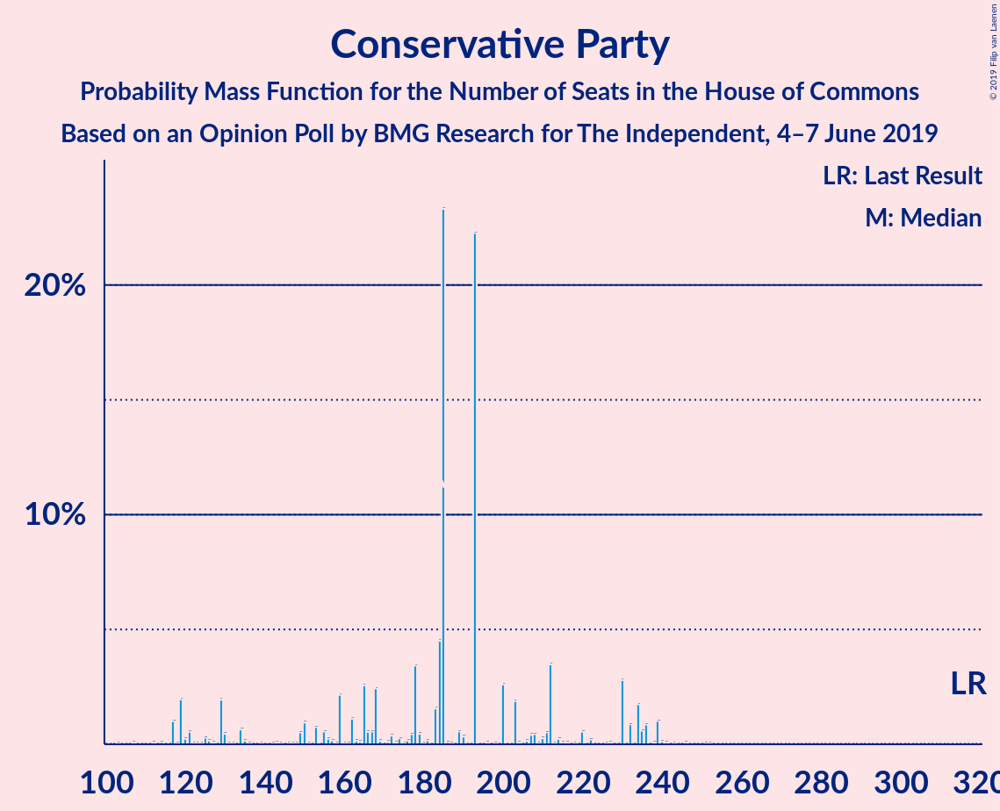

| Number of Seats | Probability | Accumulated | Special Marks |
|:---------------:|:-----------:|:-----------:|:-------------:|
| 103 | 0% | 100% |  |
| 104 | 0% | 99.9% |  |
| 105 | 0% | 99.9% |  |
| 106 | 0% | 99.9% |  |
| 107 | 0.1% | 99.9% |  |
| 108 | 0% | 99.8% |  |
| 109 | 0% | 99.8% |  |
| 110 | 0% | 99.8% |  |
| 111 | 0% | 99.8% |  |
| 112 | 0.1% | 99.8% |  |
| 113 | 0% | 99.7% |  |
| 114 | 0.1% | 99.7% |  |
| 115 | 0% | 99.6% |  |
| 116 | 0% | 99.6% |  |
| 117 | 1.0% | 99.6% |  |
| 118 | 0.1% | 98.6% |  |
| 119 | 2% | 98.5% |  |
| 120 | 0.2% | 97% |  |
| 121 | 0.5% | 96% |  |
| 122 | 0% | 96% |  |
| 123 | 0% | 96% |  |
| 124 | 0% | 96% |  |
| 125 | 0.3% | 96% |  |
| 126 | 0.2% | 95% |  |
| 127 | 0.1% | 95% |  |
| 128 | 0% | 95% |  |
| 129 | 2% | 95% |  |
| 130 | 0.5% | 93% |  |
| 131 | 0% | 93% |  |
| 132 | 0% | 93% |  |
| 133 | 0% | 93% |  |
| 134 | 0.6% | 93% |  |
| 135 | 0.2% | 92% |  |
| 136 | 0.1% | 92% |  |
| 137 | 0% | 92% |  |
| 138 | 0% | 92% |  |
| 139 | 0% | 92% |  |
| 140 | 0% | 92% |  |
| 141 | 0% | 92% |  |
| 142 | 0.1% | 92% |  |
| 143 | 0.1% | 92% |  |
| 144 | 0% | 92% |  |
| 145 | 0% | 92% |  |
| 146 | 0% | 92% |  |
| 147 | 0% | 92% |  |
| 148 | 0% | 91% |  |
| 149 | 0.5% | 91% |  |
| 150 | 0.9% | 91% |  |
| 151 | 0% | 90% |  |
| 152 | 0% | 90% |  |
| 153 | 0.7% | 90% |  |
| 154 | 0% | 89% |  |
| 155 | 0.6% | 89% |  |
| 156 | 0.2% | 89% |  |
| 157 | 0.2% | 88% |  |
| 158 | 0% | 88% |  |
| 159 | 2% | 88% |  |
| 160 | 0% | 86% |  |
| 161 | 0.1% | 86% |  |
| 162 | 1.1% | 86% |  |
| 163 | 0.2% | 85% |  |
| 164 | 0.1% | 85% |  |
| 165 | 3% | 85% |  |
| 166 | 0.5% | 82% |  |
| 167 | 0.6% | 81% |  |
| 168 | 2% | 81% |  |
| 169 | 0.1% | 78% |  |
| 170 | 0% | 78% |  |
| 171 | 0.1% | 78% |  |
| 172 | 0.4% | 78% |  |
| 173 | 0.1% | 78% |  |
| 174 | 0.3% | 78% |  |
| 175 | 0% | 77% |  |
| 176 | 0.2% | 77% |  |
| 177 | 0.4% | 77% |  |
| 178 | 3% | 77% |  |
| 179 | 0.5% | 73% |  |
| 180 | 0% | 73% |  |
| 181 | 0.2% | 73% |  |
| 182 | 0% | 73% |  |
| 183 | 2% | 73% |  |
| 184 | 5% | 71% |  |
| 185 | 23% | 67% | Median |
| 186 | 0.1% | 43% |  |
| 187 | 0.1% | 43% |  |
| 188 | 0% | 43% |  |
| 189 | 0.6% | 43% |  |
| 190 | 0.3% | 43% |  |
| 191 | 0% | 42% |  |
| 192 | 0% | 42% |  |
| 193 | 22% | 42% |  |
| 194 | 0% | 20% |  |
| 195 | 0% | 20% |  |
| 196 | 0.1% | 20% |  |
| 197 | 0% | 20% |  |
| 198 | 0.1% | 20% |  |
| 199 | 0% | 20% |  |
| 200 | 3% | 20% |  |
| 201 | 0% | 17% |  |
| 202 | 0% | 17% |  |
| 203 | 2% | 17% |  |
| 204 | 0.1% | 15% |  |
| 205 | 0% | 15% |  |
| 206 | 0.1% | 15% |  |
| 207 | 0.4% | 15% |  |
| 208 | 0.4% | 15% |  |
| 209 | 0% | 14% |  |
| 210 | 0.3% | 14% |  |
| 211 | 0.5% | 14% |  |
| 212 | 3% | 13% |  |
| 213 | 0% | 10% |  |
| 214 | 0.2% | 10% |  |
| 215 | 0.1% | 10% |  |
| 216 | 0.1% | 10% |  |
| 217 | 0% | 10% |  |
| 218 | 0% | 10% |  |
| 219 | 0% | 9% |  |
| 220 | 0.5% | 9% |  |
| 221 | 0% | 9% |  |
| 222 | 0.2% | 9% |  |
| 223 | 0% | 9% |  |
| 224 | 0% | 9% |  |
| 225 | 0% | 9% |  |
| 226 | 0% | 9% |  |
| 227 | 0.1% | 9% |  |
| 228 | 0% | 9% |  |
| 229 | 0% | 9% |  |
| 230 | 3% | 9% |  |
| 231 | 0% | 6% |  |
| 232 | 0.9% | 6% |  |
| 233 | 0% | 5% |  |
| 234 | 2% | 5% |  |
| 235 | 0.6% | 3% |  |
| 236 | 0.9% | 3% |  |
| 237 | 0% | 2% |  |
| 238 | 0.1% | 2% |  |
| 239 | 1.0% | 2% |  |
| 240 | 0.1% | 0.5% |  |
| 241 | 0.1% | 0.4% |  |
| 242 | 0% | 0.3% |  |
| 243 | 0% | 0.3% |  |
| 244 | 0% | 0.3% |  |
| 245 | 0% | 0.3% |  |
| 246 | 0.1% | 0.3% |  |
| 247 | 0% | 0.2% |  |
| 248 | 0% | 0.2% |  |
| 249 | 0% | 0.2% |  |
| 250 | 0% | 0.1% |  |
| 251 | 0.1% | 0.1% |  |
| 252 | 0% | 0.1% |  |
| 253 | 0% | 0% |  |
| 254 | 0% | 0% |  |
| 255 | 0% | 0% |  |
| 256 | 0% | 0% |  |
| 257 | 0% | 0% |  |
| 258 | 0% | 0% |  |
| 259 | 0% | 0% |  |
| 260 | 0% | 0% |  |
| 261 | 0% | 0% |  |
| 262 | 0% | 0% |  |
| 263 | 0% | 0% |  |
| 264 | 0% | 0% |  |
| 265 | 0% | 0% |  |
| 266 | 0% | 0% |  |
| 267 | 0% | 0% |  |
| 268 | 0% | 0% |  |
| 269 | 0% | 0% |  |
| 270 | 0% | 0% |  |
| 271 | 0% | 0% |  |
| 272 | 0% | 0% |  |
| 273 | 0% | 0% |  |
| 274 | 0% | 0% |  |
| 275 | 0% | 0% |  |
| 276 | 0% | 0% |  |
| 277 | 0% | 0% |  |
| 278 | 0% | 0% |  |
| 279 | 0% | 0% |  |
| 280 | 0% | 0% |  |
| 281 | 0% | 0% |  |
| 282 | 0% | 0% |  |
| 283 | 0% | 0% |  |
| 284 | 0% | 0% |  |
| 285 | 0% | 0% |  |
| 286 | 0% | 0% |  |
| 287 | 0% | 0% |  |
| 288 | 0% | 0% |  |
| 289 | 0% | 0% |  |
| 290 | 0% | 0% |  |
| 291 | 0% | 0% |  |
| 292 | 0% | 0% |  |
| 293 | 0% | 0% |  |
| 294 | 0% | 0% |  |
| 295 | 0% | 0% |  |
| 296 | 0% | 0% |  |
| 297 | 0% | 0% |  |
| 298 | 0% | 0% |  |
| 299 | 0% | 0% |  |
| 300 | 0% | 0% |  |
| 301 | 0% | 0% |  |
| 302 | 0% | 0% |  |
| 303 | 0% | 0% |  |
| 304 | 0% | 0% |  |
| 305 | 0% | 0% |  |
| 306 | 0% | 0% |  |
| 307 | 0% | 0% |  |
| 308 | 0% | 0% |  |
| 309 | 0% | 0% |  |
| 310 | 0% | 0% |  |
| 311 | 0% | 0% |  |
| 312 | 0% | 0% |  |
| 313 | 0% | 0% |  |
| 314 | 0% | 0% |  |
| 315 | 0% | 0% |  |
| 316 | 0% | 0% |  |
| 317 | 0% | 0% | Last Result |

### Brexit Party

*For a full overview of the results for this party, see the [Brexit Party](party-brexitparty.html) page.*

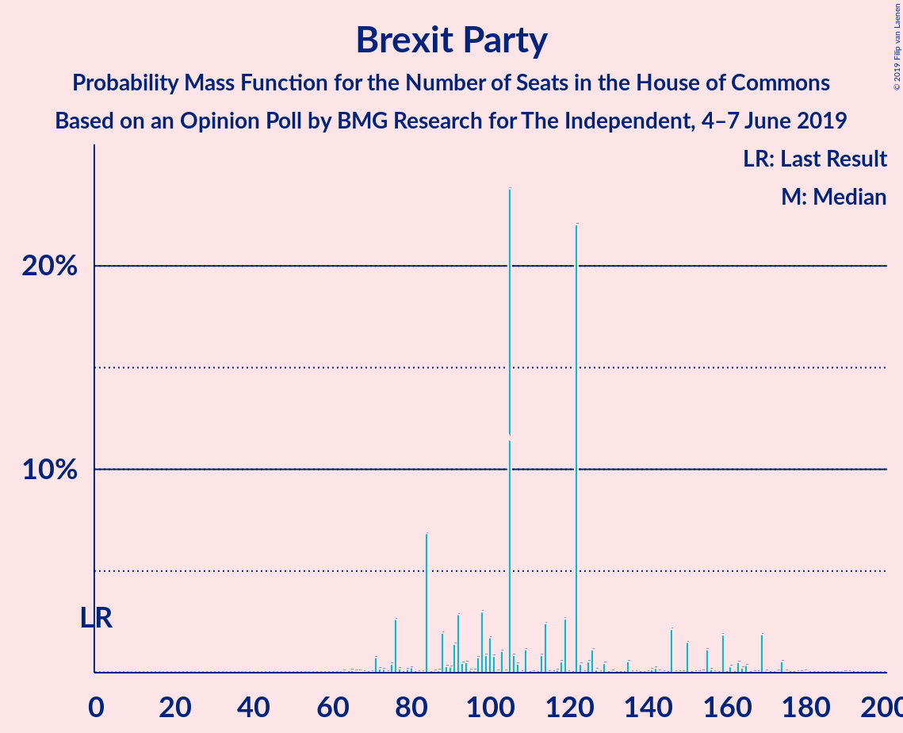

| Number of Seats | Probability | Accumulated | Special Marks |
|:---------------:|:-----------:|:-----------:|:-------------:|
| 0 | 0% | 100% | Last Result |
| 1 | 0% | 100% |  |
| 2 | 0% | 100% |  |
| 3 | 0% | 100% |  |
| 4 | 0% | 100% |  |
| 5 | 0% | 100% |  |
| 6 | 0% | 100% |  |
| 7 | 0% | 100% |  |
| 8 | 0% | 100% |  |
| 9 | 0% | 100% |  |
| 10 | 0% | 100% |  |
| 11 | 0% | 100% |  |
| 12 | 0% | 100% |  |
| 13 | 0% | 100% |  |
| 14 | 0% | 100% |  |
| 15 | 0% | 100% |  |
| 16 | 0% | 100% |  |
| 17 | 0% | 100% |  |
| 18 | 0% | 100% |  |
| 19 | 0% | 100% |  |
| 20 | 0% | 100% |  |
| 21 | 0% | 100% |  |
| 22 | 0% | 100% |  |
| 23 | 0% | 100% |  |
| 24 | 0% | 100% |  |
| 25 | 0% | 100% |  |
| 26 | 0% | 100% |  |
| 27 | 0% | 100% |  |
| 28 | 0% | 100% |  |
| 29 | 0% | 100% |  |
| 30 | 0% | 100% |  |
| 31 | 0% | 100% |  |
| 32 | 0% | 100% |  |
| 33 | 0% | 100% |  |
| 34 | 0% | 100% |  |
| 35 | 0% | 100% |  |
| 36 | 0% | 100% |  |
| 37 | 0% | 100% |  |
| 38 | 0% | 100% |  |
| 39 | 0% | 100% |  |
| 40 | 0% | 100% |  |
| 41 | 0% | 100% |  |
| 42 | 0% | 100% |  |
| 43 | 0% | 100% |  |
| 44 | 0% | 100% |  |
| 45 | 0% | 100% |  |
| 46 | 0% | 100% |  |
| 47 | 0% | 100% |  |
| 48 | 0% | 100% |  |
| 49 | 0% | 100% |  |
| 50 | 0% | 100% |  |
| 51 | 0% | 100% |  |
| 52 | 0% | 100% |  |
| 53 | 0% | 100% |  |
| 54 | 0% | 100% |  |
| 55 | 0% | 100% |  |
| 56 | 0% | 99.9% |  |
| 57 | 0% | 99.9% |  |
| 58 | 0% | 99.9% |  |
| 59 | 0% | 99.9% |  |
| 60 | 0% | 99.9% |  |
| 61 | 0% | 99.9% |  |
| 62 | 0% | 99.9% |  |
| 63 | 0.1% | 99.9% |  |
| 64 | 0% | 99.8% |  |
| 65 | 0.1% | 99.8% |  |
| 66 | 0.1% | 99.6% |  |
| 67 | 0.1% | 99.6% |  |
| 68 | 0% | 99.5% |  |
| 69 | 0% | 99.4% |  |
| 70 | 0% | 99.4% |  |
| 71 | 0.8% | 99.4% |  |
| 72 | 0.2% | 98.6% |  |
| 73 | 0.2% | 98% |  |
| 74 | 0% | 98% |  |
| 75 | 0.4% | 98% |  |
| 76 | 3% | 98% |  |
| 77 | 0.2% | 95% |  |
| 78 | 0% | 95% |  |
| 79 | 0.2% | 95% |  |
| 80 | 0.3% | 95% |  |
| 81 | 0% | 95% |  |
| 82 | 0% | 95% |  |
| 83 | 0% | 95% |  |
| 84 | 7% | 94% |  |
| 85 | 0% | 88% |  |
| 86 | 0.1% | 88% |  |
| 87 | 0.1% | 88% |  |
| 88 | 2% | 87% |  |
| 89 | 0.3% | 85% |  |
| 90 | 0.3% | 85% |  |
| 91 | 1.4% | 85% |  |
| 92 | 3% | 83% |  |
| 93 | 0.5% | 81% |  |
| 94 | 0.5% | 80% |  |
| 95 | 0.1% | 80% |  |
| 96 | 0.1% | 79% |  |
| 97 | 0.7% | 79% |  |
| 98 | 3% | 79% |  |
| 99 | 0.9% | 76% |  |
| 100 | 2% | 75% |  |
| 101 | 0.8% | 73% |  |
| 102 | 0.1% | 72% |  |
| 103 | 1.1% | 72% |  |
| 104 | 0.1% | 71% |  |
| 105 | 24% | 71% | Median |
| 106 | 0.9% | 47% |  |
| 107 | 0.4% | 46% |  |
| 108 | 0% | 46% |  |
| 109 | 1.1% | 46% |  |
| 110 | 0% | 45% |  |
| 111 | 0.1% | 45% |  |
| 112 | 0% | 45% |  |
| 113 | 0.9% | 45% |  |
| 114 | 2% | 44% |  |
| 115 | 0.1% | 41% |  |
| 116 | 0% | 41% |  |
| 117 | 0.1% | 41% |  |
| 118 | 0.5% | 41% |  |
| 119 | 3% | 41% |  |
| 120 | 0% | 38% |  |
| 121 | 0% | 38% |  |
| 122 | 22% | 38% |  |
| 123 | 0.4% | 16% |  |
| 124 | 0% | 15% |  |
| 125 | 0.5% | 15% |  |
| 126 | 1.1% | 15% |  |
| 127 | 0.1% | 14% |  |
| 128 | 0% | 14% |  |
| 129 | 0.5% | 14% |  |
| 130 | 0% | 13% |  |
| 131 | 0.1% | 13% |  |
| 132 | 0% | 13% |  |
| 133 | 0% | 13% |  |
| 134 | 0% | 13% |  |
| 135 | 0.5% | 13% |  |
| 136 | 0% | 12% |  |
| 137 | 0% | 12% |  |
| 138 | 0% | 12% |  |
| 139 | 0% | 12% |  |
| 140 | 0% | 12% |  |
| 141 | 0.2% | 12% |  |
| 142 | 0.2% | 12% |  |
| 143 | 0.1% | 12% |  |
| 144 | 0% | 12% |  |
| 145 | 0% | 12% |  |
| 146 | 2% | 12% |  |
| 147 | 0% | 10% |  |
| 148 | 0% | 10% |  |
| 149 | 0.1% | 10% |  |
| 150 | 2% | 9% |  |
| 151 | 0% | 8% |  |
| 152 | 0% | 8% |  |
| 153 | 0.1% | 8% |  |
| 154 | 0.1% | 8% |  |
| 155 | 1.1% | 8% |  |
| 156 | 0.2% | 7% |  |
| 157 | 0% | 7% |  |
| 158 | 0% | 6% |  |
| 159 | 2% | 6% |  |
| 160 | 0% | 5% |  |
| 161 | 0.3% | 5% |  |
| 162 | 0% | 4% |  |
| 163 | 0.5% | 4% |  |
| 164 | 0.2% | 4% |  |
| 165 | 0.4% | 4% |  |
| 166 | 0% | 3% |  |
| 167 | 0.1% | 3% |  |
| 168 | 0% | 3% |  |
| 169 | 2% | 3% |  |
| 170 | 0.1% | 1.2% |  |
| 171 | 0% | 1.1% |  |
| 172 | 0% | 1.1% |  |
| 173 | 0.1% | 1.1% |  |
| 174 | 0.6% | 1.0% |  |
| 175 | 0.1% | 0.5% |  |
| 176 | 0% | 0.4% |  |
| 177 | 0% | 0.4% |  |
| 178 | 0% | 0.4% |  |
| 179 | 0.1% | 0.3% |  |
| 180 | 0.1% | 0.3% |  |
| 181 | 0% | 0.2% |  |
| 182 | 0% | 0.2% |  |
| 183 | 0% | 0.2% |  |
| 184 | 0% | 0.2% |  |
| 185 | 0% | 0.1% |  |
| 186 | 0% | 0.1% |  |
| 187 | 0% | 0.1% |  |
| 188 | 0% | 0.1% |  |
| 189 | 0% | 0.1% |  |
| 190 | 0.1% | 0.1% |  |
| 191 | 0% | 0.1% |  |
| 192 | 0% | 0% |  |

### Liberal Democrats

*For a full overview of the results for this party, see the [Liberal Democrats](party-liberaldemocrats.html) page.*

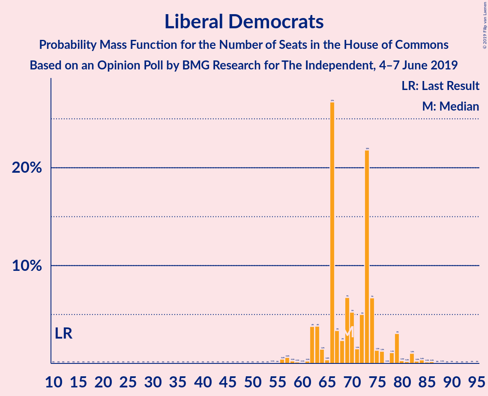

| Number of Seats | Probability | Accumulated | Special Marks |
|:---------------:|:-----------:|:-----------:|:-------------:|
| 12 | 0% | 100% | Last Result |
| 13 | 0% | 100% |  |
| 14 | 0% | 100% |  |
| 15 | 0% | 100% |  |
| 16 | 0% | 100% |  |
| 17 | 0% | 100% |  |
| 18 | 0% | 100% |  |
| 19 | 0% | 100% |  |
| 20 | 0% | 100% |  |
| 21 | 0% | 100% |  |
| 22 | 0% | 100% |  |
| 23 | 0% | 100% |  |
| 24 | 0% | 100% |  |
| 25 | 0% | 100% |  |
| 26 | 0% | 100% |  |
| 27 | 0% | 100% |  |
| 28 | 0% | 100% |  |
| 29 | 0% | 100% |  |
| 30 | 0% | 100% |  |
| 31 | 0% | 100% |  |
| 32 | 0% | 100% |  |
| 33 | 0% | 100% |  |
| 34 | 0% | 100% |  |
| 35 | 0% | 100% |  |
| 36 | 0% | 100% |  |
| 37 | 0% | 100% |  |
| 38 | 0% | 100% |  |
| 39 | 0% | 100% |  |
| 40 | 0% | 100% |  |
| 41 | 0% | 100% |  |
| 42 | 0% | 100% |  |
| 43 | 0% | 100% |  |
| 44 | 0% | 100% |  |
| 45 | 0% | 100% |  |
| 46 | 0% | 100% |  |
| 47 | 0% | 100% |  |
| 48 | 0% | 100% |  |
| 49 | 0% | 100% |  |
| 50 | 0% | 100% |  |
| 51 | 0% | 100% |  |
| 52 | 0% | 100% |  |
| 53 | 0% | 100% |  |
| 54 | 0.1% | 100% |  |
| 55 | 0% | 99.9% |  |
| 56 | 0.4% | 99.9% |  |
| 57 | 0.6% | 99.5% |  |
| 58 | 0.2% | 98.9% |  |
| 59 | 0.1% | 98.6% |  |
| 60 | 0.1% | 98% |  |
| 61 | 0.2% | 98% |  |
| 62 | 4% | 98% |  |
| 63 | 4% | 94% |  |
| 64 | 1.4% | 91% |  |
| 65 | 0.4% | 89% |  |
| 66 | 27% | 89% |  |
| 67 | 3% | 62% |  |
| 68 | 2% | 59% |  |
| 69 | 7% | 56% | Median |
| 70 | 5% | 50% |  |
| 71 | 1.5% | 44% |  |
| 72 | 5% | 43% |  |
| 73 | 22% | 38% |  |
| 74 | 7% | 16% |  |
| 75 | 1.3% | 9% |  |
| 76 | 1.2% | 8% |  |
| 77 | 0.1% | 7% |  |
| 78 | 1.1% | 7% |  |
| 79 | 3% | 6% |  |
| 80 | 0.3% | 3% |  |
| 81 | 0.2% | 2% |  |
| 82 | 1.0% | 2% |  |
| 83 | 0.2% | 1.1% |  |
| 84 | 0.4% | 0.8% |  |
| 85 | 0.1% | 0.5% |  |
| 86 | 0.2% | 0.3% |  |
| 87 | 0% | 0.1% |  |
| 88 | 0.1% | 0.1% |  |
| 89 | 0% | 0.1% |  |
| 90 | 0% | 0.1% |  |
| 91 | 0% | 0% |  |

### Green Party

*For a full overview of the results for this party, see the [Green Party](party-greenparty.html) page.*

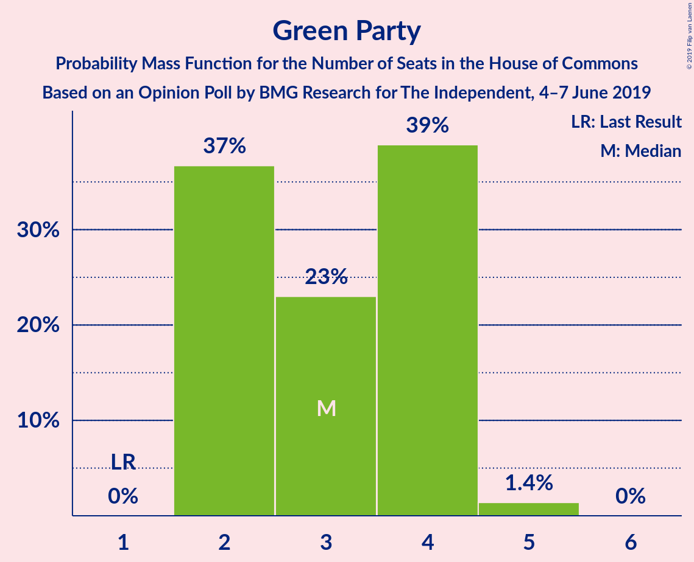

| Number of Seats | Probability | Accumulated | Special Marks |
|:---------------:|:-----------:|:-----------:|:-------------:|
| 1 | 0% | 100% | Last Result |
| 2 | 37% | 100% |  |
| 3 | 23% | 63% | Median |
| 4 | 39% | 40% |  |
| 5 | 1.4% | 1.4% |  |
| 6 | 0% | 0% |  |

### Scottish National Party

*For a full overview of the results for this party, see the [Scottish National Party](party-scottishnationalparty.html) page.*

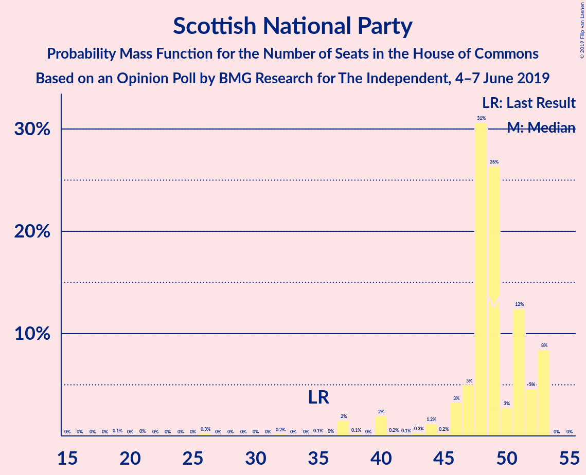

| Number of Seats | Probability | Accumulated | Special Marks |
|:---------------:|:-----------:|:-----------:|:-------------:|
| 19 | 0.1% | 100% |  |
| 20 | 0% | 99.9% |  |
| 21 | 0% | 99.9% |  |
| 22 | 0% | 99.8% |  |
| 23 | 0% | 99.8% |  |
| 24 | 0% | 99.8% |  |
| 25 | 0% | 99.8% |  |
| 26 | 0.3% | 99.8% |  |
| 27 | 0% | 99.5% |  |
| 28 | 0% | 99.5% |  |
| 29 | 0% | 99.5% |  |
| 30 | 0% | 99.5% |  |
| 31 | 0% | 99.5% |  |
| 32 | 0.2% | 99.5% |  |
| 33 | 0% | 99.3% |  |
| 34 | 0% | 99.3% |  |
| 35 | 0.1% | 99.3% | Last Result |
| 36 | 0% | 99.2% |  |
| 37 | 2% | 99.2% |  |
| 38 | 0.1% | 98% |  |
| 39 | 0% | 97% |  |
| 40 | 2% | 97% |  |
| 41 | 0.2% | 95% |  |
| 42 | 0.1% | 95% |  |
| 43 | 0.3% | 95% |  |
| 44 | 1.2% | 95% |  |
| 45 | 0.2% | 94% |  |
| 46 | 3% | 93% |  |
| 47 | 5% | 90% |  |
| 48 | 31% | 85% |  |
| 49 | 26% | 55% | Median |
| 50 | 3% | 28% |  |
| 51 | 12% | 25% |  |
| 52 | 5% | 13% |  |
| 53 | 8% | 8% |  |
| 54 | 0% | 0% |  |

### Plaid Cymru

*For a full overview of the results for this party, see the [Plaid Cymru](party-plaidcymru.html) page.*

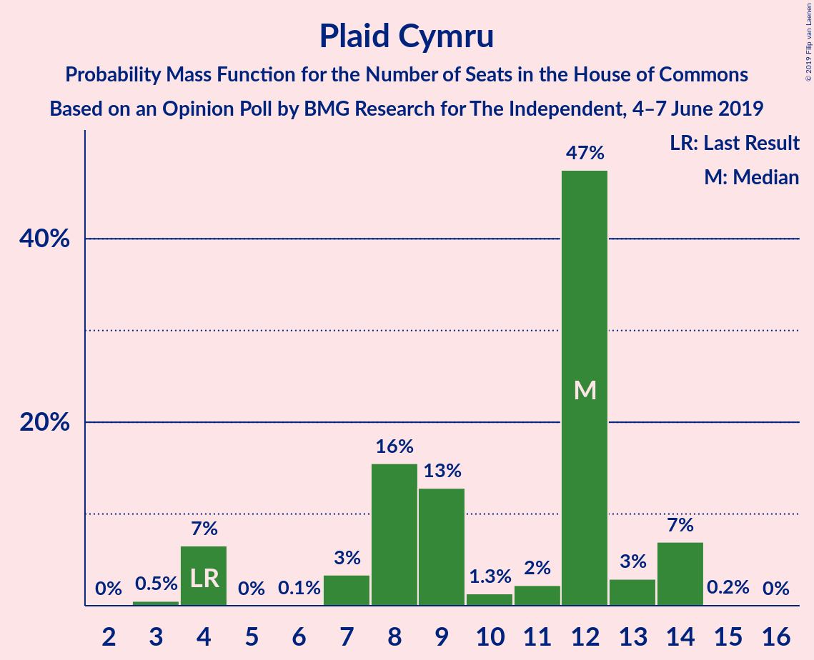

| Number of Seats | Probability | Accumulated | Special Marks |
|:---------------:|:-----------:|:-----------:|:-------------:|
| 2 | 0% | 100% |  |
| 3 | 0.5% | 99.9% |  |
| 4 | 7% | 99.4% | Last Result |
| 5 | 0% | 93% |  |
| 6 | 0.1% | 93% |  |
| 7 | 3% | 93% |  |
| 8 | 16% | 89% |  |
| 9 | 13% | 74% |  |
| 10 | 1.3% | 61% |  |
| 11 | 2% | 60% |  |
| 12 | 47% | 58% | Median |
| 13 | 3% | 10% |  |
| 14 | 7% | 7% |  |
| 15 | 0.2% | 0.2% |  |
| 16 | 0% | 0% |  |

### UK Independence Party

*For a full overview of the results for this party, see the [UK Independence Party](party-ukindependenceparty.html) page.*

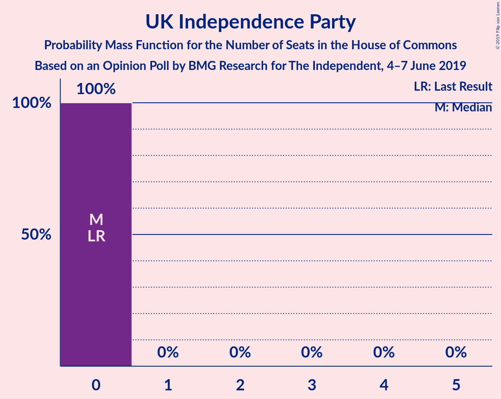

| Number of Seats | Probability | Accumulated | Special Marks |
|:---------------:|:-----------:|:-----------:|:-------------:|
| 0 | 100% | 100% | Last Result, Median |

### Change UK

*For a full overview of the results for this party, see the [Change UK](party-changeuk.html) page.*

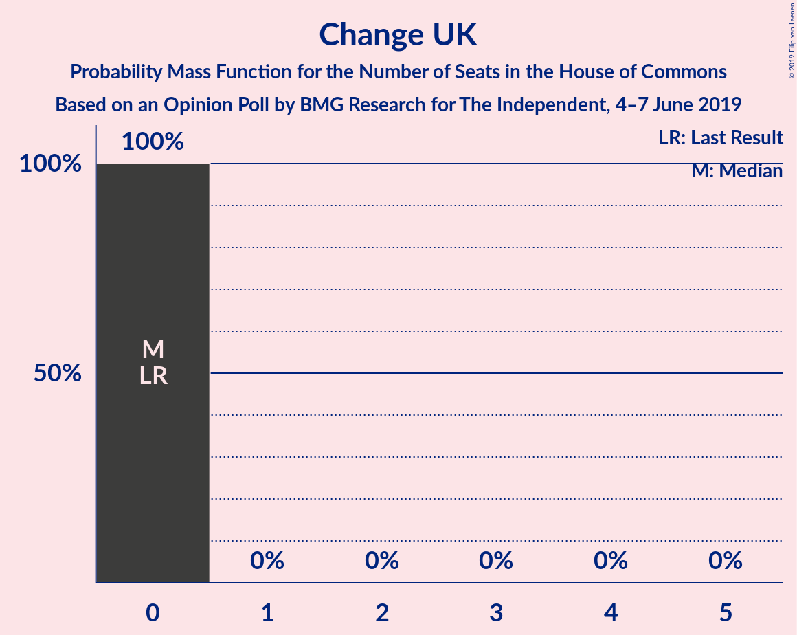

| Number of Seats | Probability | Accumulated | Special Marks |
|:---------------:|:-----------:|:-----------:|:-------------:|
| 0 | 100% | 100% | Last Result, Median |

## Coalitions

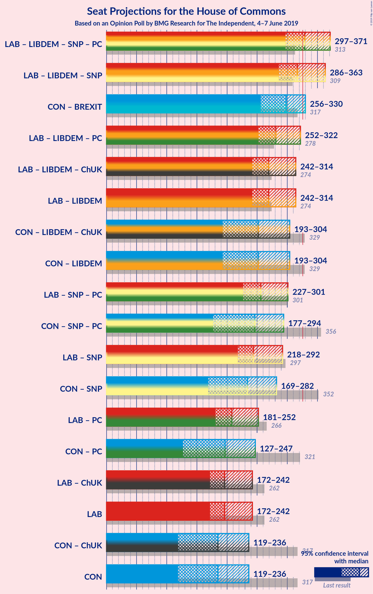

### Confidence Intervals

| Coalition | Last Result | Median | Majority? | 80% Confidence Interval | 90% Confidence Interval | 95% Confidence Interval | 99% Confidence Interval |
|:---------:|:-----------:|:------:|:---------:|:-----------------------:|:-----------------------:|:-----------------------:|:-----------------------:|
| Labour Party – Liberal Democrats – Scottish National Party – Plaid Cymru | 313 | 329 | 60% | 309–357 | 301–366 | 297–371 | 281–393 |
| Labour Party – Liberal Democrats – Scottish National Party | 309 | 317 | 29% | 302–348 | 292–358 | 286–363 | 273–384 |
| Conservative Party – Brexit Party | 317 | 298 | 7% | 272–318 | 262–328 | 256–330 | 236–346 |
| Labour Party – Liberal Democrats – Plaid Cymru | 278 | 281 | 2% | 262–305 | 253–315 | 252–322 | 233–342 |
| Labour Party – Liberal Democrats – Change UK | 274 | 269 | 1.1% | 253–297 | 244–307 | 242–314 | 226–333 |
| Labour Party – Liberal Democrats | 274 | 269 | 1.1% | 253–297 | 244–307 | 242–314 | 226–333 |
| Conservative Party – Liberal Democrats – Change UK | 329 | 252 | 0% | 220–280 | 204–299 | 193–304 | 190–308 |
| Conservative Party – Liberal Democrats | 329 | 252 | 0% | 220–280 | 204–299 | 193–304 | 190–308 |
| Labour Party – Scottish National Party – Plaid Cymru | 301 | 256 | 0.1% | 239–286 | 232–300 | 227–301 | 213–321 |
| Conservative Party – Scottish National Party – Plaid Cymru | 356 | 246 | 0% | 214–272 | 186–287 | 177–294 | 176–296 |
| Labour Party – Scottish National Party | 297 | 244 | 0% | 235–278 | 223–292 | 218–292 | 208–315 |
| Conservative Party – Scottish National Party | 352 | 234 | 0% | 202–264 | 175–278 | 169–282 | 168–285 |
| Labour Party – Plaid Cymru | 266 | 208 | 0% | 198–235 | 184–249 | 181–252 | 171–272 |
| Conservative Party – Plaid Cymru | 321 | 197 | 0% | 163–220 | 138–241 | 127–247 | 125–250 |
| Labour Party – Change UK | 262 | 196 | 0% | 186–226 | 175–241 | 172–242 | 163–263 |
| Labour Party | 262 | 196 | 0% | 186–226 | 175–241 | 172–242 | 163–263 |
| Conservative Party – Change UK | 317 | 185 | 0% | 150–212 | 129–232 | 119–236 | 117–240 |
| Conservative Party | 317 | 185 | 0% | 150–212 | 129–232 | 119–236 | 117–240 |

### Labour Party – Liberal Democrats – Scottish National Party – Plaid Cymru

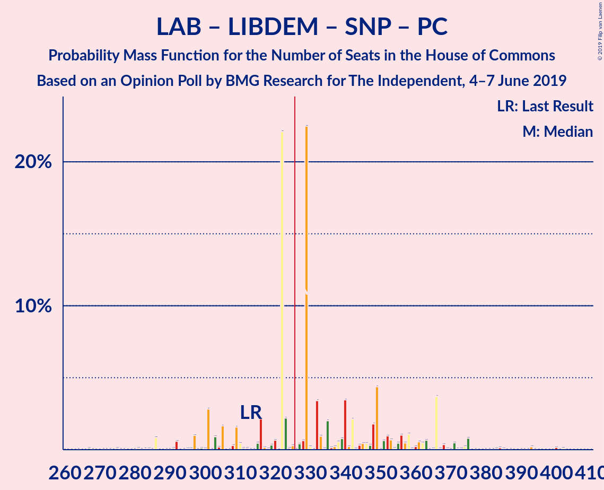

| Number of Seats | Probability | Accumulated | Special Marks |
|:---------------:|:-----------:|:-----------:|:-------------:|
| 267 | 0.1% | 100% |  |
| 268 | 0% | 99.9% |  |
| 269 | 0% | 99.8% |  |
| 270 | 0% | 99.8% |  |
| 271 | 0% | 99.8% |  |
| 272 | 0% | 99.8% |  |
| 273 | 0% | 99.8% |  |
| 274 | 0% | 99.8% |  |
| 275 | 0.1% | 99.8% |  |
| 276 | 0% | 99.7% |  |
| 277 | 0% | 99.6% |  |
| 278 | 0% | 99.6% |  |
| 279 | 0% | 99.6% |  |
| 280 | 0% | 99.6% |  |
| 281 | 0.1% | 99.6% |  |
| 282 | 0% | 99.5% |  |
| 283 | 0% | 99.4% |  |
| 284 | 0.1% | 99.4% |  |
| 285 | 0% | 99.3% |  |
| 286 | 0.8% | 99.3% |  |
| 287 | 0% | 98% |  |
| 288 | 0% | 98% |  |
| 289 | 0% | 98% |  |
| 290 | 0% | 98% |  |
| 291 | 0.1% | 98% |  |
| 292 | 0.6% | 98% |  |
| 293 | 0% | 98% |  |
| 294 | 0% | 98% |  |
| 295 | 0.1% | 98% |  |
| 296 | 0.1% | 98% |  |
| 297 | 1.0% | 98% |  |
| 298 | 0% | 97% |  |
| 299 | 0.1% | 96% |  |
| 300 | 0.1% | 96% |  |
| 301 | 3% | 96% |  |
| 302 | 0% | 94% |  |
| 303 | 0.9% | 93% |  |
| 304 | 0.2% | 93% |  |
| 305 | 2% | 92% |  |
| 306 | 0% | 91% |  |
| 307 | 0% | 91% |  |
| 308 | 0.3% | 91% |  |
| 309 | 2% | 90% |  |
| 310 | 0.4% | 89% |  |
| 311 | 0.1% | 88% |  |
| 312 | 0.1% | 88% |  |
| 313 | 0% | 88% | Last Result |
| 314 | 0% | 88% |  |
| 315 | 0.5% | 88% |  |
| 316 | 2% | 88% |  |
| 317 | 0.2% | 86% |  |
| 318 | 0.1% | 85% |  |
| 319 | 0.3% | 85% |  |
| 320 | 0.7% | 85% |  |
| 321 | 0% | 84% |  |
| 322 | 22% | 84% |  |
| 323 | 2% | 62% |  |
| 324 | 0.1% | 60% |  |
| 325 | 0.3% | 60% |  |
| 326 | 0% | 60% | Median, Majority |
| 327 | 0.4% | 60% |  |
| 328 | 0.6% | 59% |  |
| 329 | 22% | 59% |  |
| 330 | 0.2% | 36% |  |
| 331 | 0% | 36% |  |
| 332 | 3% | 36% |  |
| 333 | 0.9% | 33% |  |
| 334 | 0.1% | 32% |  |
| 335 | 2% | 32% |  |
| 336 | 0.1% | 30% |  |
| 337 | 0.2% | 29% |  |
| 338 | 0.5% | 29% |  |
| 339 | 0.8% | 29% |  |
| 340 | 3% | 28% |  |
| 341 | 0.2% | 24% |  |
| 342 | 2% | 24% |  |
| 343 | 0.1% | 22% |  |
| 344 | 0.3% | 22% |  |
| 345 | 0.4% | 22% |  |
| 346 | 0.4% | 21% |  |
| 347 | 0.3% | 21% |  |
| 348 | 2% | 20% |  |
| 349 | 4% | 19% |  |
| 350 | 0% | 14% |  |
| 351 | 0.6% | 14% |  |
| 352 | 1.0% | 14% |  |
| 353 | 0.7% | 13% |  |
| 354 | 0.1% | 12% |  |
| 355 | 0.5% | 12% |  |
| 356 | 1.0% | 11% |  |
| 357 | 0.5% | 10% |  |
| 358 | 1.1% | 10% |  |
| 359 | 0.1% | 9% |  |
| 360 | 0.2% | 9% |  |
| 361 | 0.5% | 9% |  |
| 362 | 0.5% | 8% |  |
| 363 | 0.7% | 8% |  |
| 364 | 0% | 7% |  |
| 365 | 0.1% | 7% |  |
| 366 | 4% | 7% |  |
| 367 | 0.1% | 3% |  |
| 368 | 0.4% | 3% |  |
| 369 | 0.1% | 3% |  |
| 370 | 0% | 3% |  |
| 371 | 0.5% | 3% |  |
| 372 | 0% | 2% |  |
| 373 | 0.1% | 2% |  |
| 374 | 0.2% | 2% |  |
| 375 | 0.8% | 2% |  |
| 376 | 0% | 1.0% |  |
| 377 | 0% | 1.0% |  |
| 378 | 0% | 1.0% |  |
| 379 | 0% | 1.0% |  |
| 380 | 0% | 1.0% |  |
| 381 | 0% | 1.0% |  |
| 382 | 0% | 0.9% |  |
| 383 | 0.1% | 0.9% |  |
| 384 | 0.1% | 0.8% |  |
| 385 | 0.1% | 0.7% |  |
| 386 | 0% | 0.6% |  |
| 387 | 0% | 0.6% |  |
| 388 | 0% | 0.6% |  |
| 389 | 0% | 0.6% |  |
| 390 | 0% | 0.6% |  |
| 391 | 0% | 0.6% |  |
| 392 | 0% | 0.5% |  |
| 393 | 0.2% | 0.5% |  |
| 394 | 0% | 0.3% |  |
| 395 | 0% | 0.3% |  |
| 396 | 0% | 0.3% |  |
| 397 | 0% | 0.3% |  |
| 398 | 0% | 0.3% |  |
| 399 | 0% | 0.3% |  |
| 400 | 0.2% | 0.3% |  |
| 401 | 0% | 0.1% |  |
| 402 | 0.1% | 0.1% |  |
| 403 | 0% | 0% |  |

### Labour Party – Liberal Democrats – Scottish National Party

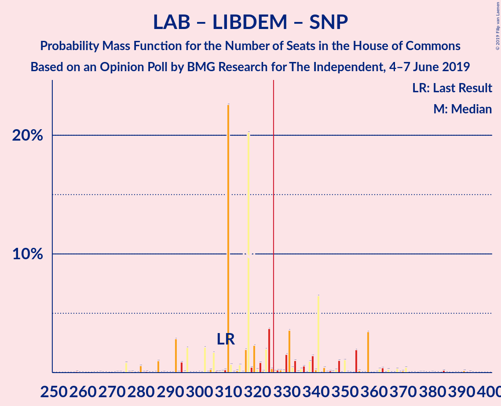

| Number of Seats | Probability | Accumulated | Special Marks |
|:---------------:|:-----------:|:-----------:|:-------------:|
| 258 | 0.1% | 100% |  |
| 259 | 0% | 99.9% |  |
| 260 | 0% | 99.8% |  |
| 261 | 0% | 99.8% |  |
| 262 | 0% | 99.8% |  |
| 263 | 0% | 99.8% |  |
| 264 | 0% | 99.8% |  |
| 265 | 0% | 99.8% |  |
| 266 | 0.1% | 99.8% |  |
| 267 | 0% | 99.7% |  |
| 268 | 0% | 99.7% |  |
| 269 | 0% | 99.6% |  |
| 270 | 0% | 99.6% |  |
| 271 | 0% | 99.6% |  |
| 272 | 0.1% | 99.6% |  |
| 273 | 0.1% | 99.5% |  |
| 274 | 0% | 99.5% |  |
| 275 | 0.8% | 99.5% |  |
| 276 | 0.1% | 98.6% |  |
| 277 | 0.1% | 98.6% |  |
| 278 | 0% | 98% |  |
| 279 | 0% | 98% |  |
| 280 | 0.6% | 98% |  |
| 281 | 0.1% | 98% |  |
| 282 | 0.1% | 98% |  |
| 283 | 0% | 98% |  |
| 284 | 0% | 98% |  |
| 285 | 0% | 98% |  |
| 286 | 1.0% | 98% |  |
| 287 | 0% | 97% |  |
| 288 | 0.1% | 97% |  |
| 289 | 0% | 97% |  |
| 290 | 0% | 97% |  |
| 291 | 0% | 96% |  |
| 292 | 3% | 96% |  |
| 293 | 0.1% | 94% |  |
| 294 | 0.9% | 94% |  |
| 295 | 0.1% | 93% |  |
| 296 | 2% | 93% |  |
| 297 | 0% | 90% |  |
| 298 | 0% | 90% |  |
| 299 | 0% | 90% |  |
| 300 | 0% | 90% |  |
| 301 | 0% | 90% |  |
| 302 | 2% | 90% |  |
| 303 | 0.1% | 88% |  |
| 304 | 0.3% | 88% |  |
| 305 | 2% | 88% |  |
| 306 | 0.1% | 86% |  |
| 307 | 0.1% | 86% |  |
| 308 | 0.1% | 86% |  |
| 309 | 0.2% | 86% | Last Result |
| 310 | 23% | 86% |  |
| 311 | 0.7% | 63% |  |
| 312 | 0.1% | 62% |  |
| 313 | 0.2% | 62% |  |
| 314 | 0.7% | 62% | Median |
| 315 | 0.1% | 61% |  |
| 316 | 2% | 61% |  |
| 317 | 20% | 59% |  |
| 318 | 0.5% | 39% |  |
| 319 | 2% | 39% |  |
| 320 | 0.3% | 36% |  |
| 321 | 0.8% | 36% |  |
| 322 | 0.1% | 35% |  |
| 323 | 2% | 35% |  |
| 324 | 4% | 33% |  |
| 325 | 0.3% | 30% |  |
| 326 | 0.1% | 29% | Majority |
| 327 | 0.2% | 29% |  |
| 328 | 0.2% | 29% |  |
| 329 | 0.2% | 29% |  |
| 330 | 2% | 28% |  |
| 331 | 4% | 27% |  |
| 332 | 0.4% | 23% |  |
| 333 | 1.0% | 23% |  |
| 334 | 0.1% | 22% |  |
| 335 | 0.3% | 22% |  |
| 336 | 0.6% | 21% |  |
| 337 | 0% | 21% |  |
| 338 | 1.0% | 21% |  |
| 339 | 1.4% | 20% |  |
| 340 | 0.2% | 19% |  |
| 341 | 6% | 18% |  |
| 342 | 0% | 12% |  |
| 343 | 0.4% | 12% |  |
| 344 | 0.1% | 11% |  |
| 345 | 0.2% | 11% |  |
| 346 | 0.1% | 11% |  |
| 347 | 0.3% | 11% |  |
| 348 | 1.0% | 11% |  |
| 349 | 0% | 10% |  |
| 350 | 1.1% | 10% |  |
| 351 | 0.1% | 9% |  |
| 352 | 0% | 9% |  |
| 353 | 0% | 9% |  |
| 354 | 2% | 9% |  |
| 355 | 0.2% | 7% |  |
| 356 | 0% | 6% |  |
| 357 | 0% | 6% |  |
| 358 | 3% | 6% |  |
| 359 | 0% | 3% |  |
| 360 | 0% | 3% |  |
| 361 | 0.1% | 3% |  |
| 362 | 0.3% | 3% |  |
| 363 | 0.4% | 3% |  |
| 364 | 0% | 2% |  |
| 365 | 0.3% | 2% |  |
| 366 | 0% | 2% |  |
| 367 | 0% | 2% |  |
| 368 | 0.3% | 2% |  |
| 369 | 0% | 2% |  |
| 370 | 0.1% | 1.5% |  |
| 371 | 0.4% | 1.3% |  |
| 372 | 0% | 0.9% |  |
| 373 | 0% | 0.9% |  |
| 374 | 0% | 0.9% |  |
| 375 | 0% | 0.8% |  |
| 376 | 0.1% | 0.8% |  |
| 377 | 0.1% | 0.8% |  |
| 378 | 0% | 0.7% |  |
| 379 | 0% | 0.7% |  |
| 380 | 0.1% | 0.6% |  |
| 381 | 0% | 0.6% |  |
| 382 | 0% | 0.6% |  |
| 383 | 0% | 0.6% |  |
| 384 | 0.2% | 0.6% |  |
| 385 | 0% | 0.4% |  |
| 386 | 0% | 0.3% |  |
| 387 | 0% | 0.3% |  |
| 388 | 0% | 0.3% |  |
| 389 | 0% | 0.3% |  |
| 390 | 0% | 0.3% |  |
| 391 | 0.2% | 0.3% |  |
| 392 | 0% | 0.1% |  |
| 393 | 0.1% | 0.1% |  |
| 394 | 0% | 0% |  |

### Conservative Party – Brexit Party

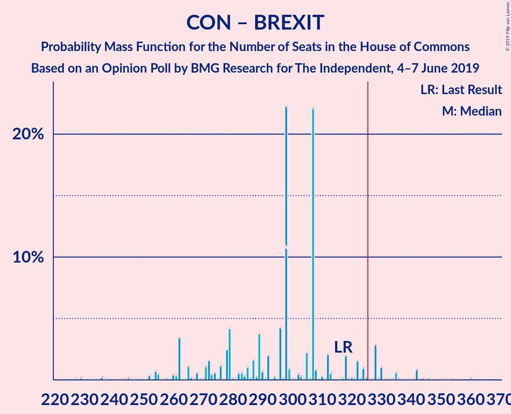

| Number of Seats | Probability | Accumulated | Special Marks |
|:---------------:|:-----------:|:-----------:|:-------------:|
| 227 | 0.1% | 100% |  |
| 228 | 0% | 99.9% |  |
| 229 | 0.2% | 99.9% |  |
| 230 | 0% | 99.7% |  |
| 231 | 0% | 99.7% |  |
| 232 | 0% | 99.7% |  |
| 233 | 0% | 99.7% |  |
| 234 | 0% | 99.7% |  |
| 235 | 0% | 99.7% |  |
| 236 | 0.2% | 99.7% |  |
| 237 | 0% | 99.5% |  |
| 238 | 0% | 99.4% |  |
| 239 | 0% | 99.4% |  |
| 240 | 0% | 99.4% |  |
| 241 | 0% | 99.4% |  |
| 242 | 0% | 99.4% |  |
| 243 | 0% | 99.4% |  |
| 244 | 0.1% | 99.3% |  |
| 245 | 0.2% | 99.3% |  |
| 246 | 0% | 99.1% |  |
| 247 | 0% | 99.1% |  |
| 248 | 0% | 99.0% |  |
| 249 | 0% | 99.0% |  |
| 250 | 0% | 99.0% |  |
| 251 | 0% | 99.0% |  |
| 252 | 0.3% | 99.0% |  |
| 253 | 0% | 98.6% |  |
| 254 | 0.7% | 98.6% |  |
| 255 | 0.5% | 98% |  |
| 256 | 0.1% | 98% |  |
| 257 | 0% | 97% |  |
| 258 | 0.1% | 97% |  |
| 259 | 0% | 97% |  |
| 260 | 0.4% | 97% |  |
| 261 | 0.3% | 97% |  |
| 262 | 3% | 97% |  |
| 263 | 0% | 93% |  |
| 264 | 0% | 93% |  |
| 265 | 1.1% | 93% |  |
| 266 | 0.2% | 92% |  |
| 267 | 0.1% | 92% |  |
| 268 | 0.5% | 92% |  |
| 269 | 0% | 91% |  |
| 270 | 0.1% | 91% |  |
| 271 | 1.1% | 91% |  |
| 272 | 2% | 90% |  |
| 273 | 0.4% | 88% |  |
| 274 | 0.6% | 88% |  |
| 275 | 0% | 87% |  |
| 276 | 1.1% | 87% |  |
| 277 | 0% | 86% |  |
| 278 | 2% | 86% |  |
| 279 | 4% | 84% |  |
| 280 | 0.1% | 80% |  |
| 281 | 0.1% | 80% |  |
| 282 | 0.5% | 79% |  |
| 283 | 0.6% | 79% |  |
| 284 | 0.3% | 78% |  |
| 285 | 1.0% | 78% |  |
| 286 | 0.1% | 77% |  |
| 287 | 2% | 77% |  |
| 288 | 0.2% | 75% |  |
| 289 | 4% | 75% |  |
| 290 | 0.7% | 71% | Median |
| 291 | 0.1% | 71% |  |
| 292 | 2% | 70% |  |
| 293 | 0% | 69% |  |
| 294 | 0.2% | 69% |  |
| 295 | 0% | 68% |  |
| 296 | 4% | 68% |  |
| 297 | 0.1% | 64% |  |
| 298 | 22% | 64% |  |
| 299 | 0.9% | 42% |  |
| 300 | 0.1% | 41% |  |
| 301 | 0% | 41% |  |
| 302 | 0.5% | 41% |  |
| 303 | 0.3% | 40% |  |
| 304 | 0.1% | 40% |  |
| 305 | 2% | 40% |  |
| 306 | 0.1% | 38% |  |
| 307 | 22% | 38% |  |
| 308 | 0.8% | 16% |  |
| 309 | 0% | 15% |  |
| 310 | 0.3% | 15% |  |
| 311 | 0.1% | 14% |  |
| 312 | 2% | 14% |  |
| 313 | 0.5% | 12% |  |
| 314 | 0% | 12% |  |
| 315 | 0% | 12% |  |
| 316 | 0.1% | 12% |  |
| 317 | 0.1% | 12% | Last Result |
| 318 | 2% | 12% |  |
| 319 | 0.1% | 10% |  |
| 320 | 0.2% | 10% |  |
| 321 | 0.1% | 9% |  |
| 322 | 2% | 9% |  |
| 323 | 0.1% | 8% |  |
| 324 | 0.9% | 8% |  |
| 325 | 0.2% | 7% |  |
| 326 | 0% | 7% | Majority |
| 327 | 0.1% | 6% |  |
| 328 | 3% | 6% |  |
| 329 | 0.1% | 4% |  |
| 330 | 1.0% | 3% |  |
| 331 | 0% | 2% |  |
| 332 | 0.1% | 2% |  |
| 333 | 0% | 2% |  |
| 334 | 0.1% | 2% |  |
| 335 | 0.6% | 2% |  |
| 336 | 0.1% | 2% |  |
| 337 | 0% | 2% |  |
| 338 | 0% | 2% |  |
| 339 | 0% | 2% |  |
| 340 | 0% | 2% |  |
| 341 | 0% | 2% |  |
| 342 | 0.8% | 2% |  |
| 343 | 0% | 0.7% |  |
| 344 | 0.1% | 0.7% |  |
| 345 | 0% | 0.6% |  |
| 346 | 0.1% | 0.6% |  |
| 347 | 0% | 0.4% |  |
| 348 | 0% | 0.4% |  |
| 349 | 0% | 0.4% |  |
| 350 | 0% | 0.4% |  |
| 351 | 0.1% | 0.4% |  |
| 352 | 0% | 0.3% |  |
| 353 | 0.1% | 0.3% |  |
| 354 | 0% | 0.2% |  |
| 355 | 0% | 0.2% |  |
| 356 | 0% | 0.2% |  |
| 357 | 0% | 0.2% |  |
| 358 | 0% | 0.2% |  |
| 359 | 0% | 0.2% |  |
| 360 | 0.1% | 0.2% |  |
| 361 | 0% | 0% |  |

### Labour Party – Liberal Democrats – Plaid Cymru

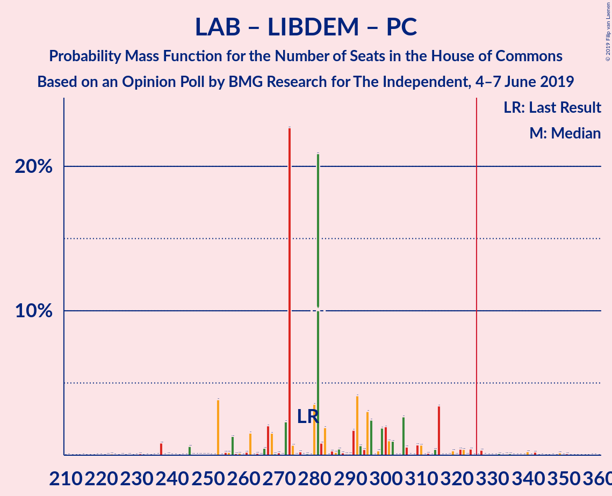

| Number of Seats | Probability | Accumulated | Special Marks |
|:---------------:|:-----------:|:-----------:|:-------------:|
| 219 | 0% | 100% |  |
| 220 | 0% | 99.9% |  |
| 221 | 0% | 99.9% |  |
| 222 | 0.1% | 99.9% |  |
| 223 | 0.1% | 99.9% |  |
| 224 | 0% | 99.8% |  |
| 225 | 0% | 99.7% |  |
| 226 | 0.1% | 99.7% |  |
| 227 | 0% | 99.7% |  |
| 228 | 0.1% | 99.7% |  |
| 229 | 0% | 99.6% |  |
| 230 | 0% | 99.6% |  |
| 231 | 0.1% | 99.6% |  |
| 232 | 0% | 99.5% |  |
| 233 | 0% | 99.5% |  |
| 234 | 0% | 99.5% |  |
| 235 | 0% | 99.5% |  |
| 236 | 0% | 99.5% |  |
| 237 | 0.8% | 99.4% |  |
| 238 | 0% | 98.6% |  |
| 239 | 0.1% | 98.6% |  |
| 240 | 0% | 98% |  |
| 241 | 0% | 98% |  |
| 242 | 0% | 98% |  |
| 243 | 0% | 98% |  |
| 244 | 0% | 98% |  |
| 245 | 0.6% | 98% |  |
| 246 | 0.1% | 98% |  |
| 247 | 0% | 98% |  |
| 248 | 0.1% | 98% |  |
| 249 | 0.1% | 98% |  |
| 250 | 0.1% | 98% |  |
| 251 | 0% | 98% |  |
| 252 | 0% | 98% |  |
| 253 | 4% | 97% |  |
| 254 | 0% | 94% |  |
| 255 | 0.2% | 94% |  |
| 256 | 0.2% | 93% |  |
| 257 | 1.3% | 93% |  |
| 258 | 0.1% | 92% |  |
| 259 | 0.1% | 92% |  |
| 260 | 0% | 92% |  |
| 261 | 0.2% | 92% |  |
| 262 | 2% | 91% |  |
| 263 | 0% | 90% |  |
| 264 | 0.1% | 90% |  |
| 265 | 0.1% | 90% |  |
| 266 | 0.5% | 90% |  |
| 267 | 2% | 89% |  |
| 268 | 2% | 87% |  |
| 269 | 0.1% | 86% |  |
| 270 | 0.2% | 86% |  |
| 271 | 0.1% | 85% |  |
| 272 | 2% | 85% |  |
| 273 | 23% | 83% |  |
| 274 | 0.7% | 60% |  |
| 275 | 0.1% | 60% |  |
| 276 | 0.2% | 60% |  |
| 277 | 0% | 59% | Median |
| 278 | 0.1% | 59% | Last Result |
| 279 | 0% | 59% |  |
| 280 | 4% | 59% |  |
| 281 | 21% | 56% |  |
| 282 | 0.8% | 35% |  |
| 283 | 2% | 34% |  |
| 284 | 0% | 32% |  |
| 285 | 0.3% | 32% |  |
| 286 | 0.2% | 32% |  |
| 287 | 0.4% | 32% |  |
| 288 | 0.2% | 31% |  |
| 289 | 0.1% | 31% |  |
| 290 | 0.1% | 31% |  |
| 291 | 2% | 31% |  |
| 292 | 4% | 29% |  |
| 293 | 0.7% | 25% |  |
| 294 | 0.4% | 24% |  |
| 295 | 3% | 24% |  |
| 296 | 2% | 21% |  |
| 297 | 0% | 18% |  |
| 298 | 0.3% | 18% |  |
| 299 | 2% | 18% |  |
| 300 | 2% | 16% |  |
| 301 | 1.0% | 14% |  |
| 302 | 1.0% | 13% |  |
| 303 | 0% | 12% |  |
| 304 | 0% | 12% |  |
| 305 | 3% | 12% |  |
| 306 | 0.6% | 10% |  |
| 307 | 0% | 9% |  |
| 308 | 0% | 9% |  |
| 309 | 0.7% | 9% |  |
| 310 | 0.7% | 8% |  |
| 311 | 0% | 8% |  |
| 312 | 0.1% | 7% |  |
| 313 | 0% | 7% |  |
| 314 | 0.4% | 7% |  |
| 315 | 3% | 7% |  |
| 316 | 0% | 4% |  |
| 317 | 0% | 4% |  |
| 318 | 0.1% | 3% |  |
| 319 | 0.3% | 3% |  |
| 320 | 0.1% | 3% |  |
| 321 | 0.4% | 3% |  |
| 322 | 0.4% | 3% |  |
| 323 | 0.1% | 2% |  |
| 324 | 0.4% | 2% |  |
| 325 | 0% | 2% |  |
| 326 | 0% | 2% | Majority |
| 327 | 0.3% | 2% |  |
| 328 | 0% | 1.3% |  |
| 329 | 0% | 1.3% |  |
| 330 | 0% | 1.3% |  |
| 331 | 0% | 1.2% |  |
| 332 | 0.1% | 1.2% |  |
| 333 | 0% | 1.1% |  |
| 334 | 0.1% | 1.1% |  |
| 335 | 0.1% | 1.0% |  |
| 336 | 0% | 0.9% |  |
| 337 | 0% | 0.9% |  |
| 338 | 0% | 0.9% |  |
| 339 | 0% | 0.9% |  |
| 340 | 0.2% | 0.8% |  |
| 341 | 0% | 0.6% |  |
| 342 | 0.2% | 0.6% |  |
| 343 | 0% | 0.4% |  |
| 344 | 0% | 0.4% |  |
| 345 | 0% | 0.3% |  |
| 346 | 0% | 0.3% |  |
| 347 | 0% | 0.3% |  |
| 348 | 0% | 0.3% |  |
| 349 | 0.2% | 0.3% |  |
| 350 | 0% | 0.2% |  |
| 351 | 0.1% | 0.1% |  |
| 352 | 0% | 0% |  |

### Labour Party – Liberal Democrats – Change UK

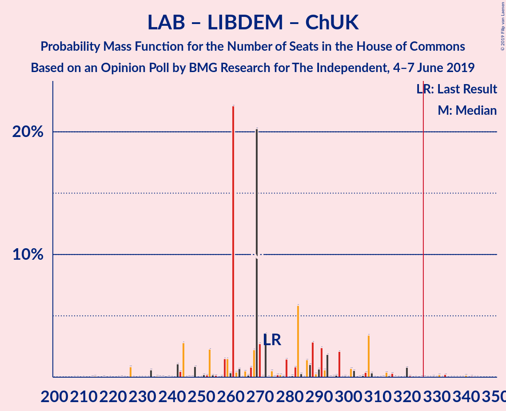

| Number of Seats | Probability | Accumulated | Special Marks |
|:---------------:|:-----------:|:-----------:|:-------------:|
| 208 | 0% | 100% |  |
| 209 | 0% | 99.9% |  |
| 210 | 0% | 99.9% |  |
| 211 | 0% | 99.9% |  |
| 212 | 0% | 99.9% |  |
| 213 | 0.1% | 99.9% |  |
| 214 | 0.1% | 99.9% |  |
| 215 | 0% | 99.8% |  |
| 216 | 0% | 99.8% |  |
| 217 | 0.1% | 99.8% |  |
| 218 | 0% | 99.7% |  |
| 219 | 0% | 99.7% |  |
| 220 | 0% | 99.6% |  |
| 221 | 0% | 99.6% |  |
| 222 | 0% | 99.6% |  |
| 223 | 0.1% | 99.6% |  |
| 224 | 0% | 99.6% |  |
| 225 | 0% | 99.5% |  |
| 226 | 0.8% | 99.5% |  |
| 227 | 0% | 98.7% |  |
| 228 | 0% | 98.6% |  |
| 229 | 0% | 98.6% |  |
| 230 | 0% | 98.6% |  |
| 231 | 0% | 98.6% |  |
| 232 | 0% | 98.6% |  |
| 233 | 0.6% | 98.5% |  |
| 234 | 0% | 98% |  |
| 235 | 0.1% | 98% |  |
| 236 | 0.1% | 98% |  |
| 237 | 0.1% | 98% |  |
| 238 | 0% | 98% |  |
| 239 | 0.1% | 98% |  |
| 240 | 0% | 98% |  |
| 241 | 0% | 98% |  |
| 242 | 1.1% | 98% |  |
| 243 | 0.5% | 97% |  |
| 244 | 3% | 96% |  |
| 245 | 0% | 93% |  |
| 246 | 0.1% | 93% |  |
| 247 | 0.1% | 93% |  |
| 248 | 0.9% | 93% |  |
| 249 | 0% | 92% |  |
| 250 | 0% | 92% |  |
| 251 | 0.2% | 92% |  |
| 252 | 0.2% | 92% |  |
| 253 | 2% | 92% |  |
| 254 | 0.2% | 90% |  |
| 255 | 0.2% | 89% |  |
| 256 | 0% | 89% |  |
| 257 | 0.1% | 89% |  |
| 258 | 2% | 89% |  |
| 259 | 2% | 88% |  |
| 260 | 0.4% | 86% |  |
| 261 | 22% | 86% |  |
| 262 | 0.4% | 64% |  |
| 263 | 0.7% | 63% |  |
| 264 | 0% | 63% |  |
| 265 | 0.5% | 62% | Median |
| 266 | 0.2% | 62% |  |
| 267 | 0.8% | 62% |  |
| 268 | 2% | 61% |  |
| 269 | 20% | 59% |  |
| 270 | 3% | 38% |  |
| 271 | 0.1% | 36% |  |
| 272 | 4% | 36% |  |
| 273 | 0% | 32% |  |
| 274 | 0.5% | 32% | Last Result |
| 275 | 0.1% | 32% |  |
| 276 | 0.2% | 31% |  |
| 277 | 0.2% | 31% |  |
| 278 | 0.1% | 31% |  |
| 279 | 1.5% | 31% |  |
| 280 | 0% | 30% |  |
| 281 | 0.1% | 30% |  |
| 282 | 0.8% | 29% |  |
| 283 | 6% | 29% |  |
| 284 | 0.3% | 23% |  |
| 285 | 0% | 22% |  |
| 286 | 1.4% | 22% |  |
| 287 | 1.0% | 21% |  |
| 288 | 3% | 20% |  |
| 289 | 0.3% | 17% |  |
| 290 | 0.7% | 17% |  |
| 291 | 2% | 16% |  |
| 292 | 0.6% | 14% |  |
| 293 | 2% | 13% |  |
| 294 | 0.1% | 11% |  |
| 295 | 0.1% | 11% |  |
| 296 | 0.2% | 11% |  |
| 297 | 2% | 11% |  |
| 298 | 0% | 9% |  |
| 299 | 0.1% | 9% |  |
| 300 | 0% | 9% |  |
| 301 | 0.7% | 9% |  |
| 302 | 0.5% | 8% |  |
| 303 | 0% | 7% |  |
| 304 | 0.1% | 7% |  |
| 305 | 0.1% | 7% |  |
| 306 | 0.4% | 7% |  |
| 307 | 3% | 7% |  |
| 308 | 0.3% | 3% |  |
| 309 | 0% | 3% |  |
| 310 | 0% | 3% |  |
| 311 | 0% | 3% |  |
| 312 | 0.1% | 3% |  |
| 313 | 0.4% | 3% |  |
| 314 | 0.1% | 3% |  |
| 315 | 0.3% | 2% |  |
| 316 | 0% | 2% |  |
| 317 | 0% | 2% |  |
| 318 | 0% | 2% |  |
| 319 | 0% | 2% |  |
| 320 | 0.8% | 2% |  |
| 321 | 0.1% | 1.3% |  |
| 322 | 0% | 1.2% |  |
| 323 | 0% | 1.2% |  |
| 324 | 0% | 1.2% |  |
| 325 | 0.1% | 1.2% |  |
| 326 | 0.1% | 1.1% | Majority |
| 327 | 0% | 1.0% |  |
| 328 | 0% | 1.0% |  |
| 329 | 0.1% | 1.0% |  |
| 330 | 0% | 0.9% |  |
| 331 | 0.2% | 0.9% |  |
| 332 | 0% | 0.6% |  |
| 333 | 0.2% | 0.6% |  |
| 334 | 0% | 0.4% |  |
| 335 | 0% | 0.4% |  |
| 336 | 0% | 0.4% |  |
| 337 | 0% | 0.4% |  |
| 338 | 0% | 0.3% |  |
| 339 | 0% | 0.3% |  |
| 340 | 0.2% | 0.3% |  |
| 341 | 0% | 0.1% |  |
| 342 | 0.1% | 0.1% |  |
| 343 | 0% | 0.1% |  |
| 344 | 0% | 0% |  |

### Labour Party – Liberal Democrats

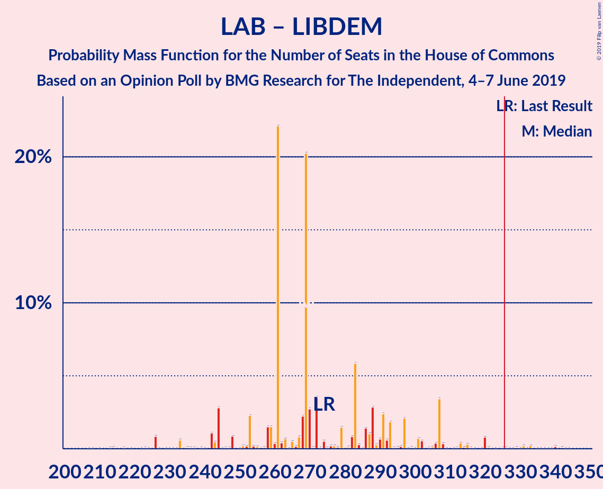

| Number of Seats | Probability | Accumulated | Special Marks |
|:---------------:|:-----------:|:-----------:|:-------------:|
| 208 | 0% | 100% |  |
| 209 | 0% | 99.9% |  |
| 210 | 0% | 99.9% |  |
| 211 | 0% | 99.9% |  |
| 212 | 0% | 99.9% |  |
| 213 | 0.1% | 99.9% |  |
| 214 | 0.1% | 99.9% |  |
| 215 | 0% | 99.8% |  |
| 216 | 0% | 99.8% |  |
| 217 | 0.1% | 99.8% |  |
| 218 | 0% | 99.7% |  |
| 219 | 0% | 99.7% |  |
| 220 | 0% | 99.6% |  |
| 221 | 0% | 99.6% |  |
| 222 | 0% | 99.6% |  |
| 223 | 0.1% | 99.6% |  |
| 224 | 0% | 99.6% |  |
| 225 | 0% | 99.5% |  |
| 226 | 0.8% | 99.5% |  |
| 227 | 0% | 98.7% |  |
| 228 | 0% | 98.6% |  |
| 229 | 0% | 98.6% |  |
| 230 | 0% | 98.6% |  |
| 231 | 0% | 98.6% |  |
| 232 | 0% | 98.6% |  |
| 233 | 0.6% | 98.5% |  |
| 234 | 0% | 98% |  |
| 235 | 0.1% | 98% |  |
| 236 | 0.1% | 98% |  |
| 237 | 0.1% | 98% |  |
| 238 | 0% | 98% |  |
| 239 | 0.1% | 98% |  |
| 240 | 0% | 98% |  |
| 241 | 0% | 98% |  |
| 242 | 1.1% | 98% |  |
| 243 | 0.5% | 97% |  |
| 244 | 3% | 96% |  |
| 245 | 0% | 93% |  |
| 246 | 0.1% | 93% |  |
| 247 | 0.1% | 93% |  |
| 248 | 0.9% | 93% |  |
| 249 | 0% | 92% |  |
| 250 | 0% | 92% |  |
| 251 | 0.2% | 92% |  |
| 252 | 0.2% | 92% |  |
| 253 | 2% | 92% |  |
| 254 | 0.2% | 90% |  |
| 255 | 0.2% | 89% |  |
| 256 | 0% | 89% |  |
| 257 | 0.1% | 89% |  |
| 258 | 2% | 89% |  |
| 259 | 2% | 88% |  |
| 260 | 0.4% | 86% |  |
| 261 | 22% | 86% |  |
| 262 | 0.4% | 64% |  |
| 263 | 0.7% | 63% |  |
| 264 | 0% | 63% |  |
| 265 | 0.5% | 62% | Median |
| 266 | 0.2% | 62% |  |
| 267 | 0.8% | 62% |  |
| 268 | 2% | 61% |  |
| 269 | 20% | 59% |  |
| 270 | 3% | 38% |  |
| 271 | 0.1% | 36% |  |
| 272 | 4% | 36% |  |
| 273 | 0% | 32% |  |
| 274 | 0.5% | 32% | Last Result |
| 275 | 0.1% | 32% |  |
| 276 | 0.2% | 31% |  |
| 277 | 0.2% | 31% |  |
| 278 | 0.1% | 31% |  |
| 279 | 1.5% | 31% |  |
| 280 | 0% | 30% |  |
| 281 | 0.1% | 30% |  |
| 282 | 0.8% | 29% |  |
| 283 | 6% | 29% |  |
| 284 | 0.3% | 23% |  |
| 285 | 0% | 22% |  |
| 286 | 1.4% | 22% |  |
| 287 | 1.0% | 21% |  |
| 288 | 3% | 20% |  |
| 289 | 0.3% | 17% |  |
| 290 | 0.7% | 17% |  |
| 291 | 2% | 16% |  |
| 292 | 0.6% | 14% |  |
| 293 | 2% | 13% |  |
| 294 | 0.1% | 11% |  |
| 295 | 0.1% | 11% |  |
| 296 | 0.2% | 11% |  |
| 297 | 2% | 11% |  |
| 298 | 0% | 9% |  |
| 299 | 0.1% | 9% |  |
| 300 | 0% | 9% |  |
| 301 | 0.7% | 9% |  |
| 302 | 0.5% | 8% |  |
| 303 | 0% | 7% |  |
| 304 | 0.1% | 7% |  |
| 305 | 0.1% | 7% |  |
| 306 | 0.4% | 7% |  |
| 307 | 3% | 7% |  |
| 308 | 0.3% | 3% |  |
| 309 | 0% | 3% |  |
| 310 | 0% | 3% |  |
| 311 | 0% | 3% |  |
| 312 | 0.1% | 3% |  |
| 313 | 0.4% | 3% |  |
| 314 | 0.1% | 3% |  |
| 315 | 0.3% | 2% |  |
| 316 | 0% | 2% |  |
| 317 | 0% | 2% |  |
| 318 | 0% | 2% |  |
| 319 | 0% | 2% |  |
| 320 | 0.8% | 2% |  |
| 321 | 0.1% | 1.3% |  |
| 322 | 0% | 1.2% |  |
| 323 | 0% | 1.2% |  |
| 324 | 0% | 1.2% |  |
| 325 | 0.1% | 1.2% |  |
| 326 | 0.1% | 1.1% | Majority |
| 327 | 0% | 1.0% |  |
| 328 | 0% | 1.0% |  |
| 329 | 0.1% | 1.0% |  |
| 330 | 0% | 0.9% |  |
| 331 | 0.2% | 0.9% |  |
| 332 | 0% | 0.6% |  |
| 333 | 0.2% | 0.6% |  |
| 334 | 0% | 0.4% |  |
| 335 | 0% | 0.4% |  |
| 336 | 0% | 0.4% |  |
| 337 | 0% | 0.4% |  |
| 338 | 0% | 0.3% |  |
| 339 | 0% | 0.3% |  |
| 340 | 0.2% | 0.3% |  |
| 341 | 0% | 0.1% |  |
| 342 | 0.1% | 0.1% |  |
| 343 | 0% | 0.1% |  |
| 344 | 0% | 0% |  |

### Conservative Party – Liberal Democrats – Change UK

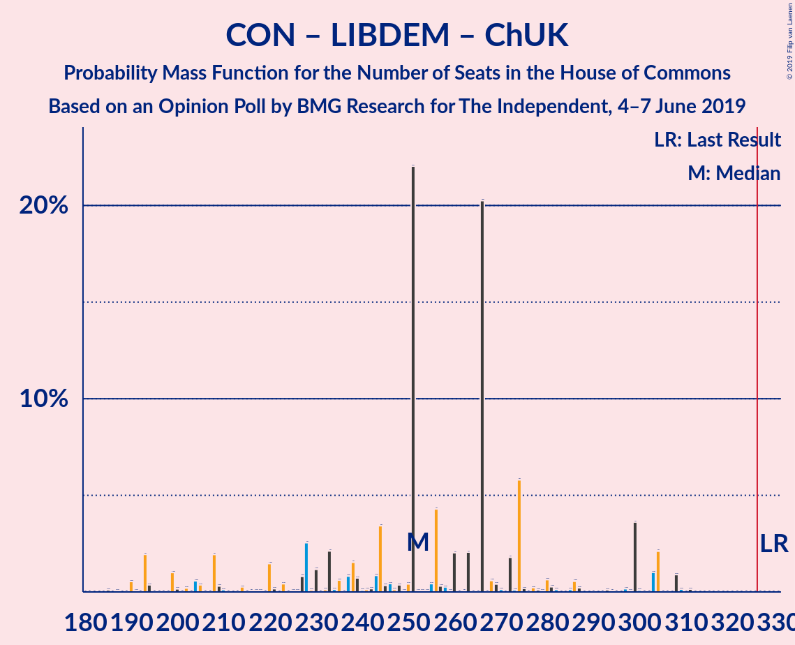

| Number of Seats | Probability | Accumulated | Special Marks |
|:---------------:|:-----------:|:-----------:|:-------------:|
| 183 | 0% | 100% |  |
| 184 | 0% | 99.9% |  |
| 185 | 0.1% | 99.9% |  |
| 186 | 0% | 99.8% |  |
| 187 | 0.1% | 99.8% |  |
| 188 | 0% | 99.8% |  |
| 189 | 0% | 99.8% |  |
| 190 | 0.5% | 99.8% |  |
| 191 | 0.1% | 99.2% |  |
| 192 | 0% | 99.2% |  |
| 193 | 2% | 99.2% |  |
| 194 | 0.4% | 97% |  |
| 195 | 0% | 97% |  |
| 196 | 0% | 97% |  |
| 197 | 0% | 97% |  |
| 198 | 0% | 97% |  |
| 199 | 1.0% | 97% |  |
| 200 | 0.2% | 96% |  |
| 201 | 0% | 96% |  |
| 202 | 0.2% | 96% |  |
| 203 | 0% | 95% |  |
| 204 | 0.6% | 95% |  |
| 205 | 0.4% | 95% |  |
| 206 | 0% | 94% |  |
| 207 | 0% | 94% |  |
| 208 | 2% | 94% |  |
| 209 | 0.3% | 92% |  |
| 210 | 0.1% | 92% |  |
| 211 | 0% | 92% |  |
| 212 | 0% | 92% |  |
| 213 | 0% | 92% |  |
| 214 | 0.3% | 92% |  |
| 215 | 0% | 92% |  |
| 216 | 0% | 92% |  |
| 217 | 0.1% | 92% |  |
| 218 | 0.1% | 92% |  |
| 219 | 0% | 91% |  |
| 220 | 1.5% | 91% |  |
| 221 | 0.2% | 90% |  |
| 222 | 0% | 90% |  |
| 223 | 0.4% | 90% |  |
| 224 | 0% | 89% |  |
| 225 | 0.1% | 89% |  |
| 226 | 0.1% | 89% |  |
| 227 | 0.8% | 89% |  |
| 228 | 3% | 88% |  |
| 229 | 0.1% | 86% |  |
| 230 | 1.2% | 86% |  |
| 231 | 0% | 85% |  |
| 232 | 0.1% | 85% |  |
| 233 | 2% | 84% |  |
| 234 | 0.1% | 82% |  |
| 235 | 0.6% | 82% |  |
| 236 | 0% | 82% |  |
| 237 | 0.8% | 82% |  |
| 238 | 2% | 81% |  |
| 239 | 0.7% | 79% |  |
| 240 | 0.1% | 78% |  |
| 241 | 0.1% | 78% |  |
| 242 | 0.2% | 78% |  |
| 243 | 0.9% | 78% |  |
| 244 | 3% | 77% |  |
| 245 | 0.3% | 74% |  |
| 246 | 0.4% | 73% |  |
| 247 | 0.1% | 73% |  |
| 248 | 0.4% | 73% |  |
| 249 | 0.1% | 73% |  |
| 250 | 0.4% | 72% |  |
| 251 | 22% | 72% |  |
| 252 | 0.1% | 50% |  |
| 253 | 0.1% | 50% |  |
| 254 | 0.1% | 50% | Median |
| 255 | 0.4% | 50% |  |
| 256 | 4% | 49% |  |
| 257 | 0.3% | 45% |  |
| 258 | 0.3% | 45% |  |
| 259 | 0.1% | 45% |  |
| 260 | 2% | 45% |  |
| 261 | 0% | 43% |  |
| 262 | 0% | 42% |  |
| 263 | 2% | 42% |  |
| 264 | 0% | 40% |  |
| 265 | 0% | 40% |  |
| 266 | 20% | 40% |  |
| 267 | 0% | 20% |  |
| 268 | 0.6% | 20% |  |
| 269 | 0.4% | 19% |  |
| 270 | 0.1% | 19% |  |
| 271 | 0% | 19% |  |
| 272 | 2% | 19% |  |
| 273 | 0.1% | 17% |  |
| 274 | 6% | 17% |  |
| 275 | 0.2% | 11% |  |
| 276 | 0% | 11% |  |
| 277 | 0.2% | 11% |  |
| 278 | 0.1% | 11% |  |
| 279 | 0.1% | 11% |  |
| 280 | 0.6% | 11% |  |
| 281 | 0.3% | 10% |  |
| 282 | 0.1% | 10% |  |
| 283 | 0% | 10% |  |
| 284 | 0% | 10% |  |
| 285 | 0.1% | 10% |  |
| 286 | 0.6% | 9% |  |
| 287 | 0.2% | 9% |  |
| 288 | 0% | 9% |  |
| 289 | 0% | 9% |  |
| 290 | 0% | 9% |  |
| 291 | 0% | 9% |  |
| 292 | 0% | 9% |  |
| 293 | 0.1% | 9% |  |
| 294 | 0% | 9% |  |
| 295 | 0% | 8% |  |
| 296 | 0% | 8% |  |
| 297 | 0.2% | 8% |  |
| 298 | 0.1% | 8% |  |
| 299 | 4% | 8% |  |
| 300 | 0.1% | 5% |  |
| 301 | 0% | 5% |  |
| 302 | 0% | 5% |  |
| 303 | 1.0% | 5% |  |
| 304 | 2% | 3% |  |
| 305 | 0% | 1.4% |  |
| 306 | 0% | 1.4% |  |
| 307 | 0% | 1.3% |  |
| 308 | 0.9% | 1.3% |  |
| 309 | 0.1% | 0.4% |  |
| 310 | 0% | 0.3% |  |
| 311 | 0.1% | 0.3% |  |
| 312 | 0% | 0.1% |  |
| 313 | 0% | 0.1% |  |
| 314 | 0% | 0.1% |  |
| 315 | 0% | 0.1% |  |
| 316 | 0% | 0.1% |  |
| 317 | 0% | 0.1% |  |
| 318 | 0% | 0.1% |  |
| 319 | 0% | 0% |  |
| 320 | 0% | 0% |  |
| 321 | 0% | 0% |  |
| 322 | 0% | 0% |  |
| 323 | 0% | 0% |  |
| 324 | 0% | 0% |  |
| 325 | 0% | 0% |  |
| 326 | 0% | 0% | Majority |
| 327 | 0% | 0% |  |
| 328 | 0% | 0% |  |
| 329 | 0% | 0% | Last Result |

### Conservative Party – Liberal Democrats

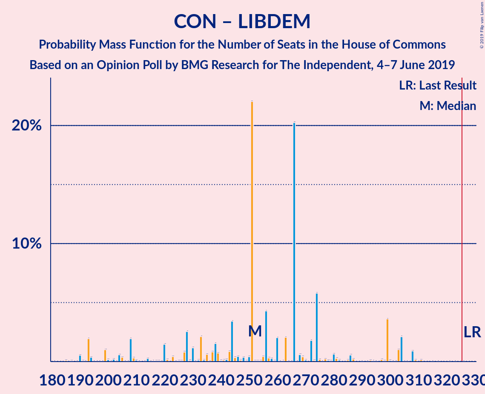

| Number of Seats | Probability | Accumulated | Special Marks |
|:---------------:|:-----------:|:-----------:|:-------------:|
| 183 | 0% | 100% |  |
| 184 | 0% | 99.9% |  |
| 185 | 0.1% | 99.9% |  |
| 186 | 0% | 99.8% |  |
| 187 | 0.1% | 99.8% |  |
| 188 | 0% | 99.8% |  |
| 189 | 0% | 99.8% |  |
| 190 | 0.5% | 99.8% |  |
| 191 | 0.1% | 99.2% |  |
| 192 | 0% | 99.2% |  |
| 193 | 2% | 99.2% |  |
| 194 | 0.4% | 97% |  |
| 195 | 0% | 97% |  |
| 196 | 0% | 97% |  |
| 197 | 0% | 97% |  |
| 198 | 0% | 97% |  |
| 199 | 1.0% | 97% |  |
| 200 | 0.2% | 96% |  |
| 201 | 0% | 96% |  |
| 202 | 0.2% | 96% |  |
| 203 | 0% | 95% |  |
| 204 | 0.6% | 95% |  |
| 205 | 0.4% | 95% |  |
| 206 | 0% | 94% |  |
| 207 | 0% | 94% |  |
| 208 | 2% | 94% |  |
| 209 | 0.3% | 92% |  |
| 210 | 0.1% | 92% |  |
| 211 | 0% | 92% |  |
| 212 | 0% | 92% |  |
| 213 | 0% | 92% |  |
| 214 | 0.3% | 92% |  |
| 215 | 0% | 92% |  |
| 216 | 0% | 92% |  |
| 217 | 0.1% | 92% |  |
| 218 | 0.1% | 92% |  |
| 219 | 0% | 91% |  |
| 220 | 1.5% | 91% |  |
| 221 | 0.2% | 90% |  |
| 222 | 0% | 90% |  |
| 223 | 0.4% | 90% |  |
| 224 | 0% | 89% |  |
| 225 | 0.1% | 89% |  |
| 226 | 0.1% | 89% |  |
| 227 | 0.8% | 89% |  |
| 228 | 3% | 88% |  |
| 229 | 0.1% | 86% |  |
| 230 | 1.2% | 86% |  |
| 231 | 0% | 85% |  |
| 232 | 0.1% | 85% |  |
| 233 | 2% | 84% |  |
| 234 | 0.1% | 82% |  |
| 235 | 0.6% | 82% |  |
| 236 | 0% | 82% |  |
| 237 | 0.8% | 82% |  |
| 238 | 2% | 81% |  |
| 239 | 0.7% | 79% |  |
| 240 | 0.1% | 78% |  |
| 241 | 0.1% | 78% |  |
| 242 | 0.2% | 78% |  |
| 243 | 0.9% | 78% |  |
| 244 | 3% | 77% |  |
| 245 | 0.3% | 74% |  |
| 246 | 0.4% | 73% |  |
| 247 | 0.1% | 73% |  |
| 248 | 0.4% | 73% |  |
| 249 | 0.1% | 73% |  |
| 250 | 0.4% | 72% |  |
| 251 | 22% | 72% |  |
| 252 | 0.1% | 50% |  |
| 253 | 0.1% | 50% |  |
| 254 | 0.1% | 50% | Median |
| 255 | 0.4% | 50% |  |
| 256 | 4% | 49% |  |
| 257 | 0.3% | 45% |  |
| 258 | 0.3% | 45% |  |
| 259 | 0.1% | 45% |  |
| 260 | 2% | 45% |  |
| 261 | 0% | 43% |  |
| 262 | 0% | 42% |  |
| 263 | 2% | 42% |  |
| 264 | 0% | 40% |  |
| 265 | 0% | 40% |  |
| 266 | 20% | 40% |  |
| 267 | 0% | 20% |  |
| 268 | 0.6% | 20% |  |
| 269 | 0.4% | 19% |  |
| 270 | 0.1% | 19% |  |
| 271 | 0% | 19% |  |
| 272 | 2% | 19% |  |
| 273 | 0.1% | 17% |  |
| 274 | 6% | 17% |  |
| 275 | 0.2% | 11% |  |
| 276 | 0% | 11% |  |
| 277 | 0.2% | 11% |  |
| 278 | 0.1% | 11% |  |
| 279 | 0.1% | 11% |  |
| 280 | 0.6% | 11% |  |
| 281 | 0.3% | 10% |  |
| 282 | 0.1% | 10% |  |
| 283 | 0% | 10% |  |
| 284 | 0% | 10% |  |
| 285 | 0.1% | 10% |  |
| 286 | 0.6% | 9% |  |
| 287 | 0.2% | 9% |  |
| 288 | 0% | 9% |  |
| 289 | 0% | 9% |  |
| 290 | 0% | 9% |  |
| 291 | 0% | 9% |  |
| 292 | 0% | 9% |  |
| 293 | 0.1% | 9% |  |
| 294 | 0% | 9% |  |
| 295 | 0% | 8% |  |
| 296 | 0% | 8% |  |
| 297 | 0.2% | 8% |  |
| 298 | 0.1% | 8% |  |
| 299 | 4% | 8% |  |
| 300 | 0.1% | 5% |  |
| 301 | 0% | 5% |  |
| 302 | 0% | 5% |  |
| 303 | 1.0% | 5% |  |
| 304 | 2% | 3% |  |
| 305 | 0% | 1.4% |  |
| 306 | 0% | 1.4% |  |
| 307 | 0% | 1.3% |  |
| 308 | 0.9% | 1.3% |  |
| 309 | 0.1% | 0.4% |  |
| 310 | 0% | 0.3% |  |
| 311 | 0.1% | 0.3% |  |
| 312 | 0% | 0.1% |  |
| 313 | 0% | 0.1% |  |
| 314 | 0% | 0.1% |  |
| 315 | 0% | 0.1% |  |
| 316 | 0% | 0.1% |  |
| 317 | 0% | 0.1% |  |
| 318 | 0% | 0.1% |  |
| 319 | 0% | 0% |  |
| 320 | 0% | 0% |  |
| 321 | 0% | 0% |  |
| 322 | 0% | 0% |  |
| 323 | 0% | 0% |  |
| 324 | 0% | 0% |  |
| 325 | 0% | 0% |  |
| 326 | 0% | 0% | Majority |
| 327 | 0% | 0% |  |
| 328 | 0% | 0% |  |
| 329 | 0% | 0% | Last Result |

### Labour Party – Scottish National Party – Plaid Cymru

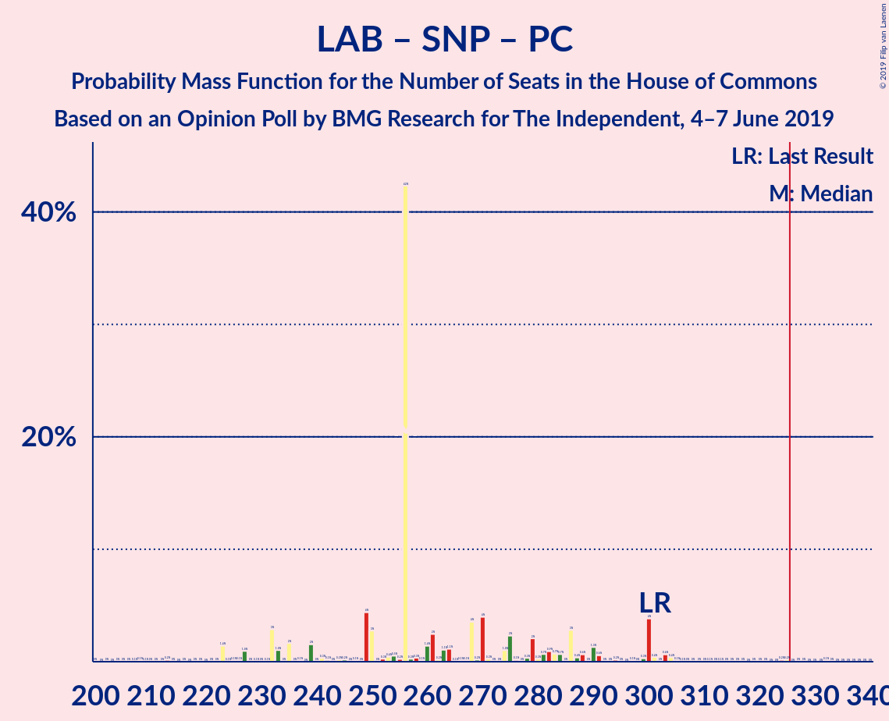

| Number of Seats | Probability | Accumulated | Special Marks |
|:---------------:|:-----------:|:-----------:|:-------------:|
| 202 | 0% | 100% |  |
| 203 | 0% | 99.9% |  |
| 204 | 0% | 99.9% |  |
| 205 | 0% | 99.9% |  |
| 206 | 0% | 99.9% |  |
| 207 | 0.1% | 99.9% |  |
| 208 | 0.1% | 99.8% |  |
| 209 | 0.1% | 99.7% |  |
| 210 | 0% | 99.7% |  |
| 211 | 0% | 99.6% |  |
| 212 | 0% | 99.6% |  |
| 213 | 0.2% | 99.6% |  |
| 214 | 0% | 99.5% |  |
| 215 | 0% | 99.4% |  |
| 216 | 0% | 99.4% |  |
| 217 | 0% | 99.4% |  |
| 218 | 0% | 99.4% |  |
| 219 | 0% | 99.4% |  |
| 220 | 0% | 99.4% |  |
| 221 | 0% | 99.4% |  |
| 222 | 0% | 99.4% |  |
| 223 | 1.4% | 99.3% |  |
| 224 | 0.1% | 98% |  |
| 225 | 0.1% | 98% |  |
| 226 | 0.1% | 98% |  |
| 227 | 1.0% | 98% |  |
| 228 | 0% | 97% |  |
| 229 | 0.1% | 97% |  |
| 230 | 0% | 97% |  |
| 231 | 0.1% | 97% |  |
| 232 | 3% | 97% |  |
| 233 | 1.0% | 94% |  |
| 234 | 0% | 93% |  |
| 235 | 2% | 93% |  |
| 236 | 0% | 91% |  |
| 237 | 0.1% | 91% |  |
| 238 | 0% | 91% |  |
| 239 | 2% | 91% |  |
| 240 | 0% | 89% |  |
| 241 | 0.3% | 89% |  |
| 242 | 0.1% | 89% |  |
| 243 | 0% | 89% |  |
| 244 | 0.2% | 89% |  |
| 245 | 0.2% | 89% |  |
| 246 | 0% | 88% |  |
| 247 | 0.1% | 88% |  |
| 248 | 0% | 88% |  |
| 249 | 4% | 88% |  |
| 250 | 3% | 84% |  |
| 251 | 0% | 81% |  |
| 252 | 0.3% | 81% |  |
| 253 | 0.4% | 81% |  |
| 254 | 0.5% | 80% |  |
| 255 | 0.2% | 80% |  |
| 256 | 42% | 80% |  |
| 257 | 0.3% | 37% | Median |
| 258 | 0.3% | 37% |  |
| 259 | 0.1% | 37% |  |
| 260 | 1.4% | 37% |  |
| 261 | 2% | 35% |  |
| 262 | 0.2% | 33% |  |
| 263 | 1.1% | 33% |  |
| 264 | 1.1% | 31% |  |
| 265 | 0.1% | 30% |  |
| 266 | 0.1% | 30% |  |
| 267 | 0.1% | 30% |  |
| 268 | 4% | 30% |  |
| 269 | 0.2% | 26% |  |
| 270 | 4% | 26% |  |
| 271 | 0.3% | 22% |  |
| 272 | 0% | 22% |  |
| 273 | 0% | 22% |  |
| 274 | 1.0% | 22% |  |
| 275 | 2% | 21% |  |
| 276 | 0.1% | 19% |  |
| 277 | 0% | 18% |  |
| 278 | 0.3% | 18% |  |
| 279 | 2% | 18% |  |
| 280 | 0.3% | 16% |  |
| 281 | 0.7% | 16% |  |
| 282 | 0.9% | 15% |  |
| 283 | 0.7% | 14% |  |
| 284 | 0.7% | 13% |  |
| 285 | 0% | 13% |  |
| 286 | 3% | 13% |  |
| 287 | 0.4% | 10% |  |
| 288 | 0.6% | 10% |  |
| 289 | 0% | 9% |  |
| 290 | 1.3% | 9% |  |
| 291 | 0.6% | 8% |  |
| 292 | 0% | 7% |  |
| 293 | 0% | 7% |  |
| 294 | 0.2% | 7% |  |
| 295 | 0% | 7% |  |
| 296 | 0% | 7% |  |
| 297 | 0.1% | 7% |  |
| 298 | 0% | 7% |  |
| 299 | 0.3% | 7% |  |
| 300 | 4% | 6% |  |
| 301 | 0.4% | 3% | Last Result |
| 302 | 0% | 2% |  |
| 303 | 0.6% | 2% |  |
| 304 | 0.4% | 1.4% |  |
| 305 | 0.1% | 1.0% |  |
| 306 | 0.1% | 0.9% |  |
| 307 | 0% | 0.9% |  |
| 308 | 0% | 0.8% |  |
| 309 | 0% | 0.8% |  |
| 310 | 0% | 0.8% |  |
| 311 | 0.1% | 0.8% |  |
| 312 | 0% | 0.7% |  |
| 313 | 0.1% | 0.7% |  |
| 314 | 0% | 0.6% |  |
| 315 | 0% | 0.6% |  |
| 316 | 0% | 0.6% |  |
| 317 | 0% | 0.6% |  |
| 318 | 0% | 0.6% |  |
| 319 | 0% | 0.6% |  |
| 320 | 0% | 0.5% |  |
| 321 | 0% | 0.5% |  |
| 322 | 0% | 0.5% |  |
| 323 | 0% | 0.5% |  |
| 324 | 0.2% | 0.5% |  |
| 325 | 0.2% | 0.3% |  |
| 326 | 0% | 0.1% | Majority |
| 327 | 0% | 0.1% |  |
| 328 | 0% | 0.1% |  |
| 329 | 0% | 0.1% |  |
| 330 | 0% | 0.1% |  |
| 331 | 0% | 0.1% |  |
| 332 | 0.1% | 0.1% |  |
| 333 | 0% | 0% |  |

### Conservative Party – Scottish National Party – Plaid Cymru

| Number of Seats | Probability | Accumulated | Special Marks |
|:---------------:|:-----------:|:-----------:|:-------------:|
| 164 | 0% | 100% |  |
| 165 | 0% | 99.9% |  |
| 166 | 0% | 99.9% |  |
| 167 | 0% | 99.9% |  |
| 168 | 0% | 99.9% |  |
| 169 | 0% | 99.9% |  |
| 170 | 0.1% | 99.9% |  |
| 171 | 0.1% | 99.8% |  |
| 172 | 0.1% | 99.7% |  |
| 173 | 0% | 99.7% |  |
| 174 | 0% | 99.6% |  |
| 175 | 0% | 99.6% |  |
| 176 | 1.2% | 99.6% |  |
| 177 | 2% | 98% |  |
| 178 | 0% | 97% |  |
| 179 | 0% | 97% |  |
| 180 | 0.1% | 96% |  |
| 181 | 0.4% | 96% |  |
| 182 | 0.3% | 96% |  |
| 183 | 0% | 96% |  |
| 184 | 0% | 96% |  |
| 185 | 0.2% | 96% |  |
| 186 | 0.6% | 96% |  |
| 187 | 0.1% | 95% |  |
| 188 | 2% | 95% |  |
| 189 | 0.3% | 93% |  |
| 190 | 0.1% | 93% |  |
| 191 | 0.7% | 93% |  |
| 192 | 0.1% | 92% |  |
| 193 | 0% | 92% |  |
| 194 | 0% | 92% |  |
| 195 | 0% | 92% |  |
| 196 | 0% | 92% |  |
| 197 | 0% | 92% |  |
| 198 | 0% | 92% |  |
| 199 | 0% | 92% |  |
| 200 | 0% | 92% |  |
| 201 | 0% | 92% |  |
| 202 | 0% | 92% |  |
| 203 | 0% | 92% |  |
| 204 | 0% | 92% |  |
| 205 | 0% | 92% |  |
| 206 | 0% | 92% |  |
| 207 | 0% | 92% |  |
| 208 | 0.1% | 92% |  |
| 209 | 0% | 91% |  |
| 210 | 0.2% | 91% |  |
| 211 | 0.1% | 91% |  |
| 212 | 0.1% | 91% |  |
| 213 | 0% | 91% |  |
| 214 | 3% | 91% |  |
| 215 | 1.1% | 88% |  |
| 216 | 0.1% | 87% |  |
| 217 | 0.7% | 87% |  |
| 218 | 0.1% | 86% |  |
| 219 | 2% | 86% |  |
| 220 | 0.4% | 84% |  |
| 221 | 0.2% | 84% |  |
| 222 | 0% | 84% |  |
| 223 | 1.1% | 84% |  |
| 224 | 0.1% | 83% |  |
| 225 | 0% | 82% |  |
| 226 | 3% | 82% |  |
| 227 | 0% | 79% |  |
| 228 | 0% | 79% |  |
| 229 | 0.3% | 79% |  |
| 230 | 0.7% | 79% |  |
| 231 | 0.2% | 78% |  |
| 232 | 0.7% | 78% |  |
| 233 | 0.5% | 77% |  |
| 234 | 0.1% | 77% |  |
| 235 | 0% | 77% |  |
| 236 | 0.1% | 77% |  |
| 237 | 4% | 77% |  |
| 238 | 0.5% | 73% |  |
| 239 | 0% | 72% |  |
| 240 | 0.2% | 72% |  |
| 241 | 5% | 72% |  |
| 242 | 0.1% | 67% |  |
| 243 | 0.3% | 67% |  |
| 244 | 0% | 67% |  |
| 245 | 0% | 67% |  |
| 246 | 23% | 67% | Median |
| 247 | 1.1% | 44% |  |
| 248 | 0.1% | 43% |  |
| 249 | 0% | 43% |  |
| 250 | 0.4% | 43% |  |
| 251 | 0% | 42% |  |
| 252 | 2% | 42% |  |
| 253 | 20% | 40% |  |
| 254 | 0% | 20% |  |
| 255 | 0% | 20% |  |
| 256 | 3% | 20% |  |
| 257 | 0% | 18% |  |
| 258 | 2% | 18% |  |
| 259 | 0.1% | 16% |  |
| 260 | 0% | 16% |  |
| 261 | 0.6% | 16% |  |
| 262 | 0.1% | 15% |  |
| 263 | 0.2% | 15% |  |
| 264 | 0% | 15% |  |
| 265 | 0.1% | 15% |  |
| 266 | 0.2% | 15% |  |
| 267 | 0% | 15% |  |
| 268 | 0.5% | 15% |  |
| 269 | 0.2% | 14% |  |
| 270 | 0.5% | 14% |  |
| 271 | 0.1% | 13% |  |
| 272 | 4% | 13% |  |
| 273 | 0.5% | 10% |  |
| 274 | 0.1% | 9% |  |
| 275 | 0.1% | 9% |  |
| 276 | 0% | 9% |  |
| 277 | 0.2% | 9% |  |
| 278 | 0% | 9% |  |
| 279 | 0.2% | 9% |  |
| 280 | 2% | 9% |  |
| 281 | 0% | 7% |  |
| 282 | 0% | 7% |  |
| 283 | 0% | 7% |  |
| 284 | 0.1% | 7% |  |
| 285 | 0.2% | 7% |  |
| 286 | 0% | 7% |  |
| 287 | 4% | 7% |  |
| 288 | 0% | 3% |  |
| 289 | 0% | 3% |  |
| 290 | 0% | 3% |  |
| 291 | 0.1% | 3% |  |
| 292 | 0% | 3% |  |
| 293 | 0% | 3% |  |
| 294 | 2% | 3% |  |
| 295 | 0% | 1.3% |  |
| 296 | 0.9% | 1.2% |  |
| 297 | 0.1% | 0.4% |  |
| 298 | 0.1% | 0.3% |  |
| 299 | 0% | 0.3% |  |
| 300 | 0% | 0.2% |  |
| 301 | 0.1% | 0.2% |  |
| 302 | 0% | 0.2% |  |
| 303 | 0% | 0.1% |  |
| 304 | 0% | 0.1% |  |
| 305 | 0% | 0.1% |  |
| 306 | 0% | 0.1% |  |
| 307 | 0% | 0.1% |  |
| 308 | 0% | 0% |  |
| 309 | 0% | 0% |  |
| 310 | 0% | 0% |  |
| 311 | 0% | 0% |  |
| 312 | 0% | 0% |  |
| 313 | 0% | 0% |  |
| 314 | 0% | 0% |  |
| 315 | 0% | 0% |  |
| 316 | 0% | 0% |  |
| 317 | 0% | 0% |  |
| 318 | 0% | 0% |  |
| 319 | 0% | 0% |  |
| 320 | 0% | 0% |  |
| 321 | 0% | 0% |  |
| 322 | 0% | 0% |  |
| 323 | 0% | 0% |  |
| 324 | 0% | 0% |  |
| 325 | 0% | 0% |  |
| 326 | 0% | 0% | Majority |
| 327 | 0% | 0% |  |
| 328 | 0% | 0% |  |
| 329 | 0% | 0% |  |
| 330 | 0% | 0% |  |
| 331 | 0% | 0% |  |
| 332 | 0% | 0% |  |
| 333 | 0% | 0% |  |
| 334 | 0% | 0% |  |
| 335 | 0% | 0% |  |
| 336 | 0% | 0% |  |
| 337 | 0% | 0% |  |
| 338 | 0% | 0% |  |
| 339 | 0% | 0% |  |
| 340 | 0% | 0% |  |
| 341 | 0% | 0% |  |
| 342 | 0% | 0% |  |
| 343 | 0% | 0% |  |
| 344 | 0% | 0% |  |
| 345 | 0% | 0% |  |
| 346 | 0% | 0% |  |
| 347 | 0% | 0% |  |
| 348 | 0% | 0% |  |
| 349 | 0% | 0% |  |
| 350 | 0% | 0% |  |
| 351 | 0% | 0% |  |
| 352 | 0% | 0% |  |
| 353 | 0% | 0% |  |
| 354 | 0% | 0% |  |
| 355 | 0% | 0% |  |
| 356 | 0% | 0% | Last Result |

### Labour Party – Scottish National Party

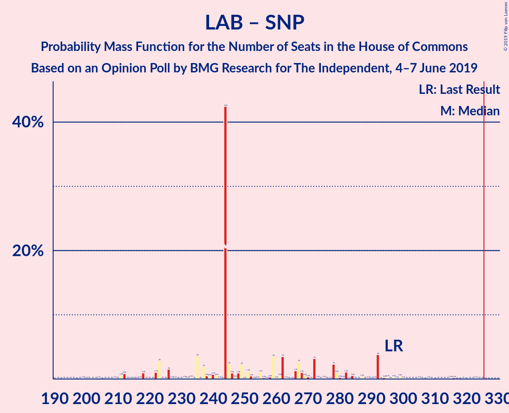

| Number of Seats | Probability | Accumulated | Special Marks |
|:---------------:|:-----------:|:-----------:|:-------------:|
| 193 | 0% | 100% |  |
| 194 | 0% | 99.9% |  |
| 195 | 0% | 99.9% |  |
| 196 | 0% | 99.9% |  |
| 197 | 0% | 99.9% |  |
| 198 | 0% | 99.9% |  |
| 199 | 0.1% | 99.9% |  |
| 200 | 0.1% | 99.8% |  |
| 201 | 0% | 99.7% |  |
| 202 | 0% | 99.7% |  |
| 203 | 0% | 99.7% |  |
| 204 | 0.1% | 99.6% |  |
| 205 | 0% | 99.5% |  |
| 206 | 0% | 99.5% |  |
| 207 | 0% | 99.5% |  |
| 208 | 0% | 99.5% |  |
| 209 | 0.1% | 99.5% |  |
| 210 | 0% | 99.4% |  |
| 211 | 0.6% | 99.4% |  |
| 212 | 0.8% | 98.8% |  |
| 213 | 0% | 98% |  |
| 214 | 0.1% | 98% |  |
| 215 | 0.1% | 98% |  |
| 216 | 0.1% | 98% |  |
| 217 | 0.1% | 98% |  |
| 218 | 0.9% | 98% |  |
| 219 | 0% | 97% |  |
| 220 | 0% | 97% |  |
| 221 | 0% | 97% |  |
| 222 | 1.1% | 97% |  |
| 223 | 3% | 96% |  |
| 224 | 0% | 93% |  |
| 225 | 0% | 93% |  |
| 226 | 2% | 93% |  |
| 227 | 0.1% | 91% |  |
| 228 | 0.1% | 91% |  |
| 229 | 0% | 91% |  |
| 230 | 0% | 91% |  |
| 231 | 0.2% | 91% |  |
| 232 | 0.1% | 91% |  |
| 233 | 0.2% | 91% |  |
| 234 | 0% | 90% |  |
| 235 | 4% | 90% |  |
| 236 | 0% | 87% |  |
| 237 | 2% | 87% |  |
| 238 | 0.5% | 85% |  |
| 239 | 0.5% | 84% |  |
| 240 | 0.7% | 84% |  |
| 241 | 0.5% | 83% |  |
| 242 | 0.1% | 83% |  |
| 243 | 0% | 83% |  |
| 244 | 42% | 83% |  |
| 245 | 2% | 40% | Median |
| 246 | 0.9% | 38% |  |
| 247 | 0.3% | 37% |  |
| 248 | 1.0% | 37% |  |
| 249 | 2% | 36% |  |
| 250 | 0.1% | 33% |  |
| 251 | 1.2% | 33% |  |
| 252 | 0.5% | 32% |  |
| 253 | 0.1% | 32% |  |
| 254 | 0.1% | 31% |  |
| 255 | 1.1% | 31% |  |
| 256 | 0.2% | 30% |  |
| 257 | 0.1% | 30% |  |
| 258 | 0.3% | 30% |  |
| 259 | 4% | 30% |  |
| 260 | 0.1% | 26% |  |
| 261 | 0.5% | 26% |  |
| 262 | 3% | 26% |  |
| 263 | 0.1% | 22% |  |
| 264 | 0% | 22% |  |
| 265 | 0.1% | 22% |  |
| 266 | 1.3% | 22% |  |
| 267 | 3% | 21% |  |
| 268 | 1.0% | 18% |  |
| 269 | 0.5% | 17% |  |
| 270 | 0.3% | 16% |  |
| 271 | 0% | 16% |  |
| 272 | 3% | 16% |  |
| 273 | 0.2% | 13% |  |
| 274 | 0% | 13% |  |
| 275 | 0.2% | 13% |  |
| 276 | 0% | 12% |  |
| 277 | 0.1% | 12% |  |
| 278 | 2% | 12% |  |
| 279 | 1.0% | 10% |  |
| 280 | 0.2% | 9% |  |
| 281 | 0.2% | 9% |  |
| 282 | 1.1% | 9% |  |
| 283 | 0.1% | 8% |  |
| 284 | 0.5% | 7% |  |
| 285 | 0% | 7% |  |
| 286 | 0% | 7% |  |
| 287 | 0.4% | 7% |  |
| 288 | 0% | 6% |  |
| 289 | 0.1% | 6% |  |
| 290 | 0.1% | 6% |  |
| 291 | 0.1% | 6% |  |
| 292 | 4% | 6% |  |
| 293 | 0% | 2% |  |
| 294 | 0.2% | 2% |  |
| 295 | 0.3% | 2% |  |
| 296 | 0% | 2% |  |
| 297 | 0.3% | 2% | Last Result |
| 298 | 0.1% | 1.4% |  |
| 299 | 0.4% | 1.4% |  |
| 300 | 0.1% | 0.9% |  |
| 301 | 0% | 0.8% |  |
| 302 | 0% | 0.8% |  |
| 303 | 0% | 0.8% |  |
| 304 | 0% | 0.7% |  |
| 305 | 0.1% | 0.7% |  |
| 306 | 0% | 0.7% |  |
| 307 | 0% | 0.6% |  |
| 308 | 0.1% | 0.6% |  |
| 309 | 0% | 0.6% |  |
| 310 | 0% | 0.6% |  |
| 311 | 0% | 0.6% |  |
| 312 | 0% | 0.5% |  |
| 313 | 0% | 0.5% |  |
| 314 | 0% | 0.5% |  |
| 315 | 0.2% | 0.5% |  |
| 316 | 0.2% | 0.4% |  |
| 317 | 0% | 0.1% |  |
| 318 | 0% | 0.1% |  |
| 319 | 0% | 0.1% |  |
| 320 | 0% | 0.1% |  |
| 321 | 0% | 0.1% |  |
| 322 | 0% | 0.1% |  |
| 323 | 0.1% | 0.1% |  |
| 324 | 0% | 0% |  |

### Conservative Party – Scottish National Party

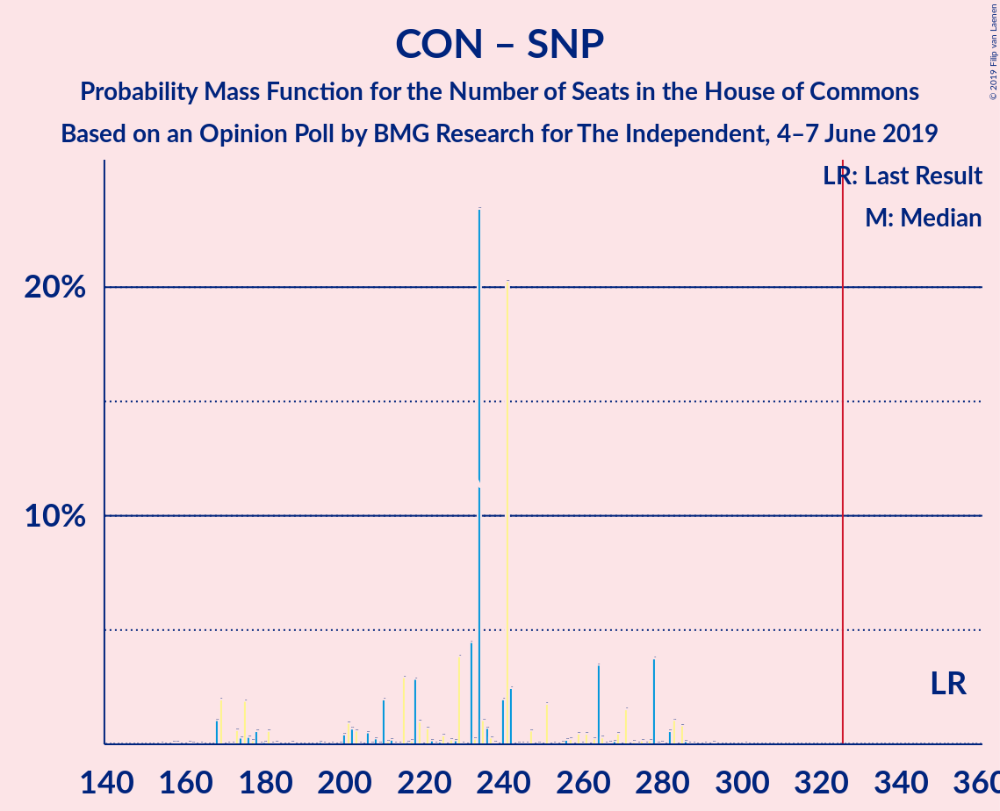

| Number of Seats | Probability | Accumulated | Special Marks |
|:---------------:|:-----------:|:-----------:|:-------------:|
| 154 | 0% | 100% |  |
| 155 | 0% | 99.9% |  |
| 156 | 0% | 99.9% |  |
| 157 | 0.1% | 99.9% |  |
| 158 | 0.1% | 99.8% |  |
| 159 | 0% | 99.8% |  |
| 160 | 0% | 99.7% |  |
| 161 | 0.1% | 99.7% |  |
| 162 | 0.1% | 99.7% |  |
| 163 | 0% | 99.6% |  |
| 164 | 0% | 99.6% |  |
| 165 | 0% | 99.6% |  |
| 166 | 0% | 99.6% |  |
| 167 | 0% | 99.6% |  |
| 168 | 1.1% | 99.6% |  |
| 169 | 2% | 98.5% |  |
| 170 | 0% | 97% |  |
| 171 | 0% | 97% |  |
| 172 | 0% | 97% |  |
| 173 | 0.6% | 96% |  |
| 174 | 0.3% | 96% |  |
| 175 | 2% | 96% |  |
| 176 | 0.3% | 94% |  |
| 177 | 0.2% | 93% |  |
| 178 | 0.6% | 93% |  |
| 179 | 0% | 93% |  |
| 180 | 0.1% | 93% |  |
| 181 | 0.6% | 92% |  |
| 182 | 0% | 92% |  |
| 183 | 0.1% | 92% |  |
| 184 | 0% | 92% |  |
| 185 | 0% | 92% |  |
| 186 | 0% | 92% |  |
| 187 | 0.1% | 92% |  |
| 188 | 0% | 92% |  |
| 189 | 0% | 92% |  |
| 190 | 0% | 92% |  |
| 191 | 0% | 92% |  |
| 192 | 0% | 92% |  |
| 193 | 0% | 92% |  |
| 194 | 0.1% | 92% |  |
| 195 | 0% | 92% |  |
| 196 | 0% | 92% |  |
| 197 | 0% | 91% |  |
| 198 | 0% | 91% |  |
| 199 | 0.1% | 91% |  |
| 200 | 0.4% | 91% |  |
| 201 | 0.9% | 91% |  |
| 202 | 0.7% | 90% |  |
| 203 | 0.6% | 89% |  |
| 204 | 0% | 89% |  |
| 205 | 0% | 89% |  |
| 206 | 0.5% | 89% |  |
| 207 | 0.1% | 88% |  |
| 208 | 0.3% | 88% |  |
| 209 | 0.1% | 88% |  |
| 210 | 2% | 88% |  |
| 211 | 0.1% | 86% |  |
| 212 | 0.2% | 86% |  |
| 213 | 0% | 86% |  |
| 214 | 0% | 86% |  |
| 215 | 3% | 85% |  |
| 216 | 0.1% | 83% |  |
| 217 | 0.1% | 82% |  |
| 218 | 3% | 82% |  |
| 219 | 1.0% | 79% |  |
| 220 | 0% | 78% |  |
| 221 | 0.7% | 78% |  |
| 222 | 0.2% | 78% |  |
| 223 | 0% | 78% |  |
| 224 | 0.1% | 78% |  |
| 225 | 0.4% | 77% |  |
| 226 | 0% | 77% |  |
| 227 | 0.2% | 77% |  |
| 228 | 0.2% | 77% |  |
| 229 | 4% | 77% |  |
| 230 | 0% | 73% |  |
| 231 | 0% | 73% |  |
| 232 | 4% | 73% |  |
| 233 | 0.2% | 68% |  |
| 234 | 23% | 68% | Median |
| 235 | 1.1% | 45% |  |
| 236 | 0.7% | 44% |  |
| 237 | 0.3% | 43% |  |
| 238 | 0.1% | 43% |  |
| 239 | 0% | 42% |  |
| 240 | 2% | 42% |  |
| 241 | 20% | 40% |  |
| 242 | 2% | 20% |  |
| 243 | 0% | 18% |  |
| 244 | 0.1% | 18% |  |
| 245 | 0% | 18% |  |
| 246 | 0% | 18% |  |
| 247 | 0.6% | 18% |  |
| 248 | 0% | 17% |  |
| 249 | 0.1% | 17% |  |
| 250 | 0% | 17% |  |
| 251 | 2% | 17% |  |
| 252 | 0% | 15% |  |
| 253 | 0% | 15% |  |
| 254 | 0% | 15% |  |
| 255 | 0.1% | 15% |  |
| 256 | 0.2% | 15% |  |
| 257 | 0.2% | 15% |  |
| 258 | 0% | 15% |  |
| 259 | 0.5% | 15% |  |
| 260 | 0% | 14% |  |
| 261 | 0.5% | 14% |  |
| 262 | 0% | 14% |  |
| 263 | 0.2% | 14% |  |
| 264 | 3% | 13% |  |
| 265 | 0.3% | 10% |  |
| 266 | 0% | 10% |  |
| 267 | 0.1% | 10% |  |
| 268 | 0.1% | 9% |  |
| 269 | 0.5% | 9% |  |
| 270 | 0% | 9% |  |
| 271 | 2% | 9% |  |
| 272 | 0% | 7% |  |
| 273 | 0.1% | 7% |  |
| 274 | 0% | 7% |  |
| 275 | 0.2% | 7% |  |
| 276 | 0% | 7% |  |
| 277 | 0.2% | 7% |  |
| 278 | 4% | 7% |  |
| 279 | 0.1% | 3% |  |
| 280 | 0.1% | 3% |  |
| 281 | 0% | 3% |  |
| 282 | 0.6% | 3% |  |
| 283 | 1.1% | 2% |  |
| 284 | 0% | 1.3% |  |
| 285 | 0.8% | 1.3% |  |
| 286 | 0.1% | 0.5% |  |
| 287 | 0% | 0.3% |  |
| 288 | 0% | 0.3% |  |
| 289 | 0% | 0.3% |  |
| 290 | 0% | 0.2% |  |
| 291 | 0% | 0.2% |  |
| 292 | 0% | 0.2% |  |
| 293 | 0.1% | 0.2% |  |
| 294 | 0% | 0.1% |  |
| 295 | 0% | 0.1% |  |
| 296 | 0% | 0.1% |  |
| 297 | 0% | 0.1% |  |
| 298 | 0% | 0.1% |  |
| 299 | 0% | 0.1% |  |
| 300 | 0% | 0.1% |  |
| 301 | 0% | 0.1% |  |
| 302 | 0% | 0% |  |
| 303 | 0% | 0% |  |
| 304 | 0% | 0% |  |
| 305 | 0% | 0% |  |
| 306 | 0% | 0% |  |
| 307 | 0% | 0% |  |
| 308 | 0% | 0% |  |
| 309 | 0% | 0% |  |
| 310 | 0% | 0% |  |
| 311 | 0% | 0% |  |
| 312 | 0% | 0% |  |
| 313 | 0% | 0% |  |
| 314 | 0% | 0% |  |
| 315 | 0% | 0% |  |
| 316 | 0% | 0% |  |
| 317 | 0% | 0% |  |
| 318 | 0% | 0% |  |
| 319 | 0% | 0% |  |
| 320 | 0% | 0% |  |
| 321 | 0% | 0% |  |
| 322 | 0% | 0% |  |
| 323 | 0% | 0% |  |
| 324 | 0% | 0% |  |
| 325 | 0% | 0% |  |
| 326 | 0% | 0% | Majority |
| 327 | 0% | 0% |  |
| 328 | 0% | 0% |  |
| 329 | 0% | 0% |  |
| 330 | 0% | 0% |  |
| 331 | 0% | 0% |  |
| 332 | 0% | 0% |  |
| 333 | 0% | 0% |  |
| 334 | 0% | 0% |  |
| 335 | 0% | 0% |  |
| 336 | 0% | 0% |  |
| 337 | 0% | 0% |  |
| 338 | 0% | 0% |  |
| 339 | 0% | 0% |  |
| 340 | 0% | 0% |  |
| 341 | 0% | 0% |  |
| 342 | 0% | 0% |  |
| 343 | 0% | 0% |  |
| 344 | 0% | 0% |  |
| 345 | 0% | 0% |  |
| 346 | 0% | 0% |  |
| 347 | 0% | 0% |  |
| 348 | 0% | 0% |  |
| 349 | 0% | 0% |  |
| 350 | 0% | 0% |  |
| 351 | 0% | 0% |  |
| 352 | 0% | 0% | Last Result |

### Labour Party – Plaid Cymru

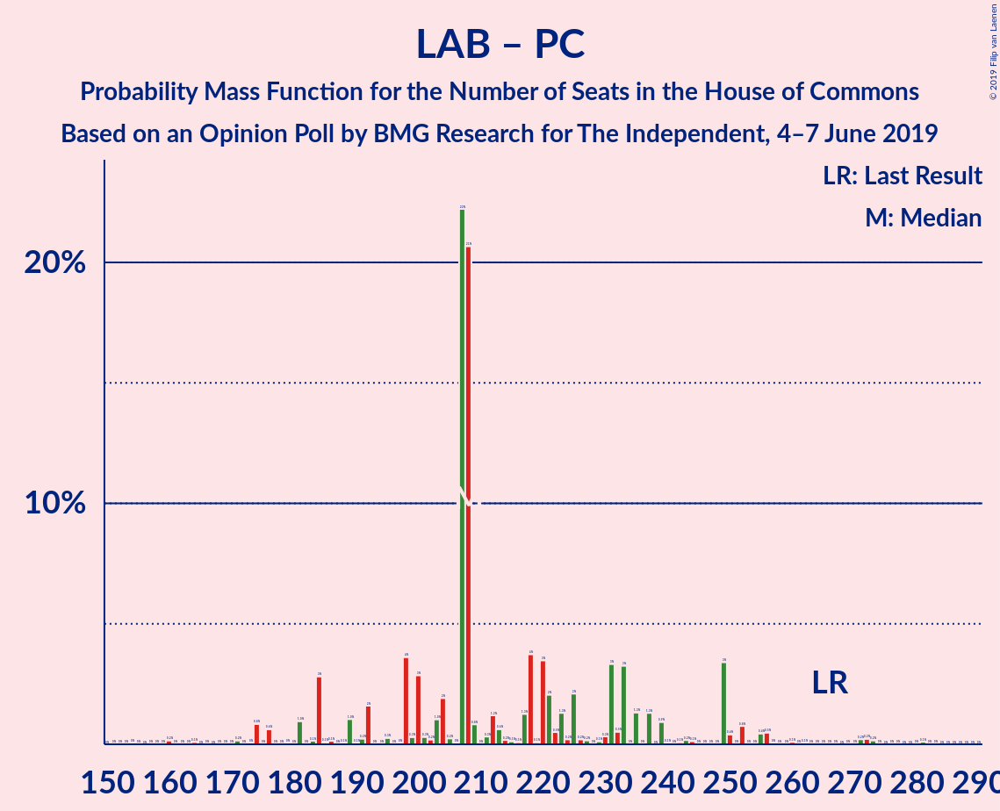

| Number of Seats | Probability | Accumulated | Special Marks |
|:---------------:|:-----------:|:-----------:|:-------------:|
| 154 | 0% | 100% |  |
| 155 | 0% | 99.9% |  |
| 156 | 0% | 99.9% |  |
| 157 | 0% | 99.9% |  |
| 158 | 0% | 99.9% |  |
| 159 | 0% | 99.9% |  |
| 160 | 0.2% | 99.8% |  |
| 161 | 0% | 99.7% |  |
| 162 | 0% | 99.7% |  |
| 163 | 0% | 99.7% |  |
| 164 | 0.1% | 99.7% |  |
| 165 | 0% | 99.6% |  |
| 166 | 0% | 99.6% |  |
| 167 | 0% | 99.6% |  |
| 168 | 0% | 99.6% |  |
| 169 | 0% | 99.6% |  |
| 170 | 0% | 99.5% |  |
| 171 | 0.2% | 99.5% |  |
| 172 | 0% | 99.4% |  |
| 173 | 0% | 99.4% |  |
| 174 | 0.8% | 99.3% |  |
| 175 | 0% | 98% |  |
| 176 | 0.6% | 98% |  |
| 177 | 0% | 98% |  |
| 178 | 0% | 98% |  |
| 179 | 0% | 98% |  |
| 180 | 0% | 98% |  |
| 181 | 1.0% | 98% |  |
| 182 | 0% | 97% |  |
| 183 | 0.1% | 97% |  |
| 184 | 3% | 97% |  |
| 185 | 0.1% | 94% |  |
| 186 | 0.1% | 94% |  |
| 187 | 0% | 94% |  |
| 188 | 0.1% | 94% |  |
| 189 | 1.0% | 93% |  |
| 190 | 0.1% | 92% |  |
| 191 | 0.2% | 92% |  |
| 192 | 2% | 92% |  |
| 193 | 0% | 91% |  |
| 194 | 0% | 91% |  |
| 195 | 0.3% | 91% |  |
| 196 | 0% | 90% |  |
| 197 | 0% | 90% |  |
| 198 | 4% | 90% |  |
| 199 | 0.3% | 87% |  |
| 200 | 3% | 86% |  |
| 201 | 0.3% | 83% |  |
| 202 | 0.2% | 83% |  |
| 203 | 1.0% | 83% |  |
| 204 | 2% | 82% |  |
| 205 | 0.2% | 80% |  |
| 206 | 0% | 80% |  |
| 207 | 22% | 80% |  |
| 208 | 21% | 57% | Median |
| 209 | 0.8% | 37% |  |
| 210 | 0% | 36% |  |
| 211 | 0.3% | 36% |  |
| 212 | 1.2% | 36% |  |
| 213 | 0.6% | 34% |  |
| 214 | 0.2% | 34% |  |
| 215 | 0.1% | 34% |  |
| 216 | 0.1% | 34% |  |
| 217 | 1.3% | 33% |  |
| 218 | 4% | 32% |  |
| 219 | 0.1% | 28% |  |
| 220 | 3% | 28% |  |
| 221 | 2% | 25% |  |
| 222 | 0.5% | 23% |  |
| 223 | 1.3% | 22% |  |
| 224 | 0.2% | 21% |  |
| 225 | 2% | 21% |  |
| 226 | 0.2% | 19% |  |
| 227 | 0.2% | 19% |  |
| 228 | 0% | 18% |  |
| 229 | 0.1% | 18% |  |
| 230 | 0.3% | 18% |  |
| 231 | 3% | 18% |  |
| 232 | 0.5% | 15% |  |
| 233 | 3% | 14% |  |
| 234 | 0% | 11% |  |
| 235 | 1.3% | 11% |  |
| 236 | 0% | 9% |  |
| 237 | 1.3% | 9% |  |
| 238 | 0% | 8% |  |
| 239 | 0.9% | 8% |  |
| 240 | 0.1% | 7% |  |
| 241 | 0% | 7% |  |
| 242 | 0.1% | 7% |  |
| 243 | 0.2% | 7% |  |
| 244 | 0.1% | 7% |  |
| 245 | 0% | 7% |  |
| 246 | 0% | 7% |  |
| 247 | 0% | 7% |  |
| 248 | 0% | 7% |  |
| 249 | 3% | 7% |  |
| 250 | 0.4% | 3% |  |
| 251 | 0% | 3% |  |
| 252 | 0.8% | 3% |  |
| 253 | 0% | 2% |  |
| 254 | 0% | 2% |  |
| 255 | 0.4% | 2% |  |
| 256 | 0.5% | 2% |  |
| 257 | 0% | 1.1% |  |
| 258 | 0% | 1.1% |  |
| 259 | 0% | 1.1% |  |
| 260 | 0.1% | 1.1% |  |
| 261 | 0% | 1.0% |  |
| 262 | 0.1% | 0.9% |  |
| 263 | 0% | 0.9% |  |
| 264 | 0% | 0.9% |  |
| 265 | 0% | 0.9% |  |
| 266 | 0% | 0.8% | Last Result |
| 267 | 0% | 0.8% |  |
| 268 | 0% | 0.8% |  |
| 269 | 0% | 0.8% |  |
| 270 | 0% | 0.8% |  |
| 271 | 0.2% | 0.8% |  |
| 272 | 0.2% | 0.6% |  |
| 273 | 0.2% | 0.3% |  |
| 274 | 0% | 0.2% |  |
| 275 | 0% | 0.2% |  |
| 276 | 0% | 0.2% |  |
| 277 | 0% | 0.2% |  |
| 278 | 0% | 0.1% |  |
| 279 | 0% | 0.1% |  |
| 280 | 0% | 0.1% |  |
| 281 | 0.1% | 0.1% |  |
| 282 | 0% | 0% |  |

### Conservative Party – Plaid Cymru

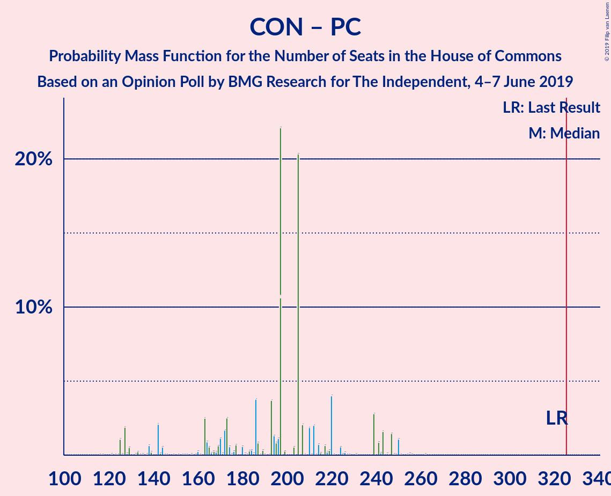

| Number of Seats | Probability | Accumulated | Special Marks |
|:---------------:|:-----------:|:-----------:|:-------------:|
| 114 | 0% | 100% |  |
| 115 | 0% | 99.9% |  |
| 116 | 0% | 99.9% |  |
| 117 | 0% | 99.9% |  |
| 118 | 0% | 99.9% |  |
| 119 | 0% | 99.9% |  |
| 120 | 0% | 99.9% |  |
| 121 | 0.1% | 99.8% |  |
| 122 | 0% | 99.8% |  |
| 123 | 0% | 99.8% |  |
| 124 | 0% | 99.7% |  |
| 125 | 1.1% | 99.7% |  |
| 126 | 0.1% | 98.6% |  |
| 127 | 2% | 98.5% |  |
| 128 | 0.1% | 97% |  |
| 129 | 0.5% | 97% |  |
| 130 | 0% | 96% |  |
| 131 | 0% | 96% |  |
| 132 | 0.1% | 96% |  |
| 133 | 0.2% | 96% |  |
| 134 | 0% | 96% |  |
| 135 | 0.1% | 96% |  |
| 136 | 0% | 96% |  |
| 137 | 0.1% | 96% |  |
| 138 | 0.7% | 95% |  |
| 139 | 0.2% | 95% |  |
| 140 | 0% | 95% |  |
| 141 | 0% | 95% |  |
| 142 | 2% | 95% |  |
| 143 | 0.1% | 93% |  |
| 144 | 0.6% | 92% |  |
| 145 | 0% | 92% |  |
| 146 | 0% | 92% |  |
| 147 | 0% | 92% |  |
| 148 | 0% | 92% |  |
| 149 | 0% | 92% |  |
| 150 | 0% | 92% |  |
| 151 | 0% | 92% |  |
| 152 | 0% | 92% |  |
| 153 | 0% | 92% |  |
| 154 | 0% | 92% |  |
| 155 | 0% | 92% |  |
| 156 | 0% | 92% |  |
| 157 | 0.1% | 92% |  |
| 158 | 0% | 91% |  |
| 159 | 0.1% | 91% |  |
| 160 | 0.3% | 91% |  |
| 161 | 0% | 91% |  |
| 162 | 0% | 91% |  |
| 163 | 2% | 91% |  |
| 164 | 0.9% | 89% |  |
| 165 | 0.6% | 88% |  |
| 166 | 0.2% | 87% |  |
| 167 | 0.3% | 87% |  |
| 168 | 0.2% | 87% |  |
| 169 | 0.6% | 86% |  |
| 170 | 1.1% | 86% |  |
| 171 | 0.1% | 85% |  |
| 172 | 2% | 85% |  |
| 173 | 3% | 83% |  |
| 174 | 0.6% | 80% |  |
| 175 | 0.1% | 80% |  |
| 176 | 0.3% | 80% |  |
| 177 | 0.7% | 79% |  |
| 178 | 0% | 79% |  |
| 179 | 0% | 79% |  |
| 180 | 0.6% | 79% |  |
| 181 | 0.1% | 78% |  |
| 182 | 0% | 78% |  |
| 183 | 0.3% | 78% |  |
| 184 | 0.3% | 78% |  |
| 185 | 0.1% | 77% |  |
| 186 | 4% | 77% |  |
| 187 | 0.8% | 74% |  |
| 188 | 0% | 73% |  |
| 189 | 0.3% | 73% |  |
| 190 | 0% | 72% |  |
| 191 | 0% | 72% |  |
| 192 | 0% | 72% |  |
| 193 | 4% | 72% |  |
| 194 | 1.3% | 69% |  |
| 195 | 0.8% | 67% |  |
| 196 | 1.1% | 66% |  |
| 197 | 22% | 65% | Median |
| 198 | 0% | 43% |  |
| 199 | 0.3% | 43% |  |
| 200 | 0% | 43% |  |
| 201 | 0% | 43% |  |
| 202 | 0% | 43% |  |
| 203 | 0.6% | 43% |  |
| 204 | 0% | 42% |  |
| 205 | 20% | 42% |  |
| 206 | 0% | 22% |  |
| 207 | 2% | 22% |  |
| 208 | 0% | 20% |  |
| 209 | 0% | 20% |  |
| 210 | 2% | 20% |  |
| 211 | 0.1% | 18% |  |
| 212 | 2% | 18% |  |
| 213 | 0% | 16% |  |
| 214 | 0.7% | 16% |  |
| 215 | 0.2% | 15% |  |
| 216 | 0% | 15% |  |
| 217 | 0.7% | 15% |  |
| 218 | 0.2% | 14% |  |
| 219 | 0.3% | 14% |  |
| 220 | 4% | 14% |  |
| 221 | 0% | 10% |  |
| 222 | 0% | 10% |  |
| 223 | 0% | 10% |  |
| 224 | 0.6% | 10% |  |
| 225 | 0.1% | 9% |  |
| 226 | 0.2% | 9% |  |
| 227 | 0% | 9% |  |
| 228 | 0% | 9% |  |
| 229 | 0% | 9% |  |
| 230 | 0% | 9% |  |
| 231 | 0.1% | 9% |  |
| 232 | 0% | 9% |  |
| 233 | 0% | 9% |  |
| 234 | 0% | 9% |  |
| 235 | 0% | 9% |  |
| 236 | 0% | 9% |  |
| 237 | 0% | 9% |  |
| 238 | 0% | 9% |  |
| 239 | 3% | 9% |  |
| 240 | 0% | 6% |  |
| 241 | 0.9% | 6% |  |
| 242 | 0.2% | 5% |  |
| 243 | 2% | 5% |  |
| 244 | 0% | 3% |  |
| 245 | 0.1% | 3% |  |
| 246 | 0% | 3% |  |
| 247 | 1.5% | 3% |  |
| 248 | 0.1% | 2% |  |
| 249 | 0% | 1.5% |  |
| 250 | 1.1% | 1.4% |  |
| 251 | 0% | 0.3% |  |
| 252 | 0% | 0.3% |  |
| 253 | 0% | 0.3% |  |
| 254 | 0% | 0.3% |  |
| 255 | 0.1% | 0.3% |  |
| 256 | 0.1% | 0.2% |  |
| 257 | 0% | 0.1% |  |
| 258 | 0% | 0.1% |  |
| 259 | 0% | 0.1% |  |
| 260 | 0% | 0.1% |  |
| 261 | 0% | 0.1% |  |
| 262 | 0.1% | 0.1% |  |
| 263 | 0% | 0% |  |
| 264 | 0% | 0% |  |
| 265 | 0% | 0% |  |
| 266 | 0% | 0% |  |
| 267 | 0% | 0% |  |
| 268 | 0% | 0% |  |
| 269 | 0% | 0% |  |
| 270 | 0% | 0% |  |
| 271 | 0% | 0% |  |
| 272 | 0% | 0% |  |
| 273 | 0% | 0% |  |
| 274 | 0% | 0% |  |
| 275 | 0% | 0% |  |
| 276 | 0% | 0% |  |
| 277 | 0% | 0% |  |
| 278 | 0% | 0% |  |
| 279 | 0% | 0% |  |
| 280 | 0% | 0% |  |
| 281 | 0% | 0% |  |
| 282 | 0% | 0% |  |
| 283 | 0% | 0% |  |
| 284 | 0% | 0% |  |
| 285 | 0% | 0% |  |
| 286 | 0% | 0% |  |
| 287 | 0% | 0% |  |
| 288 | 0% | 0% |  |
| 289 | 0% | 0% |  |
| 290 | 0% | 0% |  |
| 291 | 0% | 0% |  |
| 292 | 0% | 0% |  |
| 293 | 0% | 0% |  |
| 294 | 0% | 0% |  |
| 295 | 0% | 0% |  |
| 296 | 0% | 0% |  |
| 297 | 0% | 0% |  |
| 298 | 0% | 0% |  |
| 299 | 0% | 0% |  |
| 300 | 0% | 0% |  |
| 301 | 0% | 0% |  |
| 302 | 0% | 0% |  |
| 303 | 0% | 0% |  |
| 304 | 0% | 0% |  |
| 305 | 0% | 0% |  |
| 306 | 0% | 0% |  |
| 307 | 0% | 0% |  |
| 308 | 0% | 0% |  |
| 309 | 0% | 0% |  |
| 310 | 0% | 0% |  |
| 311 | 0% | 0% |  |
| 312 | 0% | 0% |  |
| 313 | 0% | 0% |  |
| 314 | 0% | 0% |  |
| 315 | 0% | 0% |  |
| 316 | 0% | 0% |  |
| 317 | 0% | 0% |  |
| 318 | 0% | 0% |  |
| 319 | 0% | 0% |  |
| 320 | 0% | 0% |  |
| 321 | 0% | 0% | Last Result |

### Labour Party – Change UK

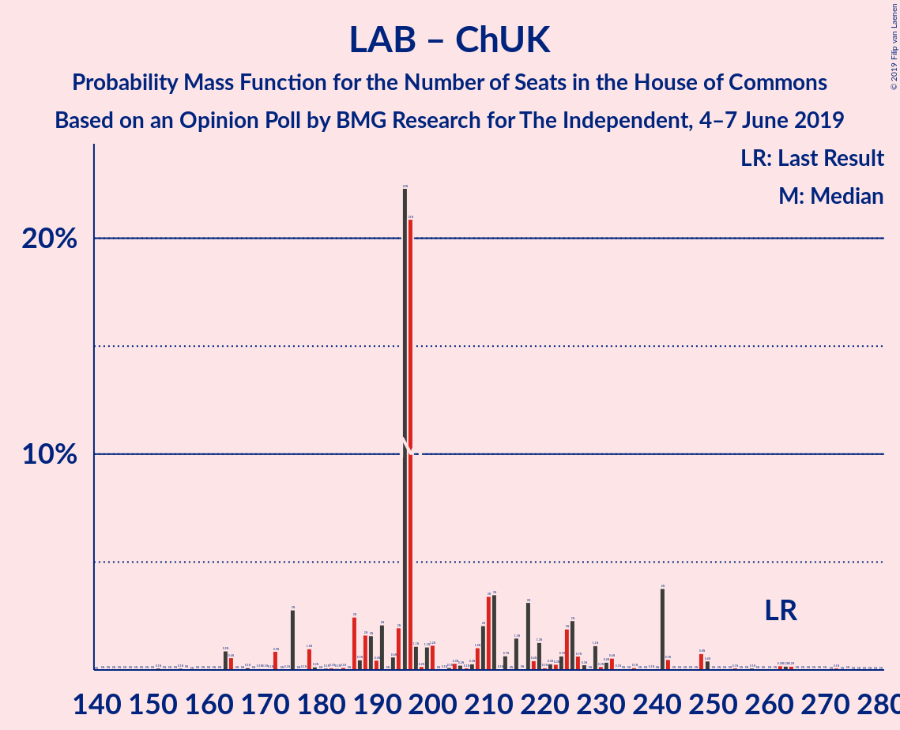

| Number of Seats | Probability | Accumulated | Special Marks |
|:---------------:|:-----------:|:-----------:|:-------------:|
| 144 | 0% | 100% |  |
| 145 | 0% | 99.9% |  |
| 146 | 0% | 99.9% |  |
| 147 | 0% | 99.9% |  |
| 148 | 0% | 99.9% |  |
| 149 | 0% | 99.9% |  |
| 150 | 0% | 99.9% |  |
| 151 | 0.1% | 99.8% |  |
| 152 | 0% | 99.7% |  |
| 153 | 0% | 99.7% |  |
| 154 | 0% | 99.7% |  |
| 155 | 0.1% | 99.7% |  |
| 156 | 0% | 99.6% |  |
| 157 | 0% | 99.6% |  |
| 158 | 0% | 99.6% |  |
| 159 | 0% | 99.6% |  |
| 160 | 0% | 99.6% |  |
| 161 | 0% | 99.5% |  |
| 162 | 0% | 99.5% |  |
| 163 | 0.9% | 99.5% |  |
| 164 | 0.6% | 98.6% |  |
| 165 | 0% | 98% |  |
| 166 | 0% | 98% |  |
| 167 | 0.1% | 98% |  |
| 168 | 0% | 98% |  |
| 169 | 0.1% | 98% |  |
| 170 | 0.1% | 98% |  |
| 171 | 0.1% | 98% |  |
| 172 | 0.9% | 98% |  |
| 173 | 0% | 97% |  |
| 174 | 0.1% | 97% |  |
| 175 | 3% | 97% |  |
| 176 | 0% | 94% |  |
| 177 | 0.1% | 94% |  |
| 178 | 1.0% | 94% |  |
| 179 | 0.2% | 93% |  |
| 180 | 0% | 93% |  |
| 181 | 0.1% | 93% |  |
| 182 | 0.1% | 93% |  |
| 183 | 0.1% | 92% |  |
| 184 | 0.1% | 92% |  |
| 185 | 0% | 92% |  |
| 186 | 2% | 92% |  |
| 187 | 0.5% | 90% |  |
| 188 | 2% | 89% |  |
| 189 | 2% | 88% |  |
| 190 | 0.5% | 86% |  |
| 191 | 2% | 86% |  |
| 192 | 0% | 83% |  |
| 193 | 0.6% | 83% |  |
| 194 | 2% | 83% |  |
| 195 | 22% | 81% |  |
| 196 | 21% | 59% | Median |
| 197 | 1.1% | 38% |  |
| 198 | 0.2% | 37% |  |
| 199 | 1.1% | 36% |  |
| 200 | 1.2% | 35% |  |
| 201 | 0% | 34% |  |
| 202 | 0.1% | 34% |  |
| 203 | 0.1% | 34% |  |
| 204 | 0.3% | 34% |  |
| 205 | 0.2% | 34% |  |
| 206 | 0.1% | 33% |  |
| 207 | 0.3% | 33% |  |
| 208 | 1.0% | 33% |  |
| 209 | 2% | 32% |  |
| 210 | 3% | 30% |  |
| 211 | 3% | 26% |  |
| 212 | 0.1% | 23% |  |
| 213 | 0.7% | 23% |  |
| 214 | 0% | 22% |  |
| 215 | 1.5% | 22% |  |
| 216 | 0% | 21% |  |
| 217 | 3% | 21% |  |
| 218 | 0.4% | 18% |  |
| 219 | 1.3% | 17% |  |
| 220 | 0.1% | 16% |  |
| 221 | 0.3% | 16% |  |
| 222 | 0.3% | 15% |  |
| 223 | 0.7% | 15% |  |
| 224 | 2% | 14% |  |
| 225 | 2% | 13% |  |
| 226 | 0.7% | 10% |  |
| 227 | 0.3% | 10% |  |
| 228 | 0% | 9% |  |
| 229 | 1.1% | 9% |  |
| 230 | 0.2% | 8% |  |
| 231 | 0.4% | 8% |  |
| 232 | 0.6% | 8% |  |
| 233 | 0.1% | 7% |  |
| 234 | 0% | 7% |  |
| 235 | 0% | 7% |  |
| 236 | 0.1% | 7% |  |
| 237 | 0% | 7% |  |
| 238 | 0% | 7% |  |
| 239 | 0.1% | 7% |  |
| 240 | 0% | 7% |  |
| 241 | 4% | 7% |  |
| 242 | 0.5% | 3% |  |
| 243 | 0% | 2% |  |
| 244 | 0% | 2% |  |
| 245 | 0% | 2% |  |
| 246 | 0% | 2% |  |
| 247 | 0% | 2% |  |
| 248 | 0.8% | 2% |  |
| 249 | 0.4% | 2% |  |
| 250 | 0% | 1.1% |  |
| 251 | 0% | 1.1% |  |
| 252 | 0% | 1.1% |  |
| 253 | 0% | 1.1% |  |
| 254 | 0.1% | 1.1% |  |
| 255 | 0% | 0.9% |  |
| 256 | 0% | 0.9% |  |
| 257 | 0.1% | 0.9% |  |
| 258 | 0% | 0.8% |  |
| 259 | 0% | 0.8% |  |
| 260 | 0% | 0.8% |  |
| 261 | 0% | 0.8% |  |
| 262 | 0.2% | 0.8% | Last Result |
| 263 | 0.2% | 0.6% |  |
| 264 | 0.2% | 0.4% |  |
| 265 | 0% | 0.2% |  |
| 266 | 0% | 0.2% |  |
| 267 | 0% | 0.2% |  |
| 268 | 0% | 0.2% |  |
| 269 | 0% | 0.1% |  |
| 270 | 0% | 0.1% |  |
| 271 | 0% | 0.1% |  |
| 272 | 0.1% | 0.1% |  |
| 273 | 0% | 0% |  |

### Labour Party

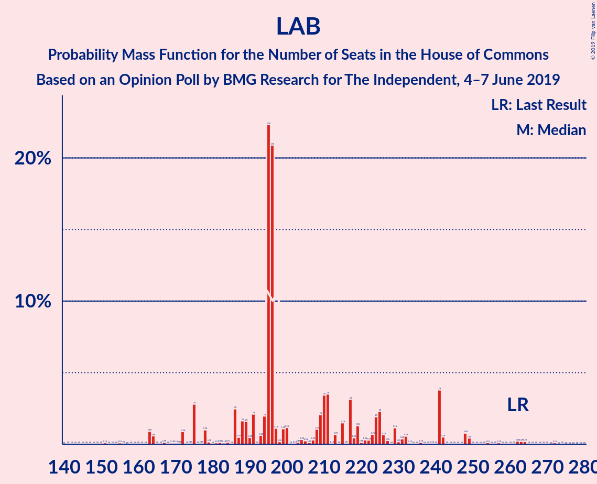

| Number of Seats | Probability | Accumulated | Special Marks |
|:---------------:|:-----------:|:-----------:|:-------------:|
| 144 | 0% | 100% |  |
| 145 | 0% | 99.9% |  |
| 146 | 0% | 99.9% |  |
| 147 | 0% | 99.9% |  |
| 148 | 0% | 99.9% |  |
| 149 | 0% | 99.9% |  |
| 150 | 0% | 99.9% |  |
| 151 | 0.1% | 99.8% |  |
| 152 | 0% | 99.7% |  |
| 153 | 0% | 99.7% |  |
| 154 | 0% | 99.7% |  |
| 155 | 0.1% | 99.7% |  |
| 156 | 0% | 99.6% |  |
| 157 | 0% | 99.6% |  |
| 158 | 0% | 99.6% |  |
| 159 | 0% | 99.6% |  |
| 160 | 0% | 99.6% |  |
| 161 | 0% | 99.5% |  |
| 162 | 0% | 99.5% |  |
| 163 | 0.9% | 99.5% |  |
| 164 | 0.6% | 98.6% |  |
| 165 | 0% | 98% |  |
| 166 | 0% | 98% |  |
| 167 | 0.1% | 98% |  |
| 168 | 0% | 98% |  |
| 169 | 0.1% | 98% |  |
| 170 | 0.1% | 98% |  |
| 171 | 0.1% | 98% |  |
| 172 | 0.9% | 98% |  |
| 173 | 0% | 97% |  |
| 174 | 0.1% | 97% |  |
| 175 | 3% | 97% |  |
| 176 | 0% | 94% |  |
| 177 | 0.1% | 94% |  |
| 178 | 1.0% | 94% |  |
| 179 | 0.2% | 93% |  |
| 180 | 0% | 93% |  |
| 181 | 0.1% | 93% |  |
| 182 | 0.1% | 93% |  |
| 183 | 0.1% | 92% |  |
| 184 | 0.1% | 92% |  |
| 185 | 0% | 92% |  |
| 186 | 2% | 92% |  |
| 187 | 0.5% | 90% |  |
| 188 | 2% | 89% |  |
| 189 | 2% | 88% |  |
| 190 | 0.5% | 86% |  |
| 191 | 2% | 86% |  |
| 192 | 0% | 83% |  |
| 193 | 0.6% | 83% |  |
| 194 | 2% | 83% |  |
| 195 | 22% | 81% |  |
| 196 | 21% | 59% | Median |
| 197 | 1.1% | 38% |  |
| 198 | 0.2% | 37% |  |
| 199 | 1.1% | 36% |  |
| 200 | 1.2% | 35% |  |
| 201 | 0% | 34% |  |
| 202 | 0.1% | 34% |  |
| 203 | 0.1% | 34% |  |
| 204 | 0.3% | 34% |  |
| 205 | 0.2% | 34% |  |
| 206 | 0.1% | 33% |  |
| 207 | 0.3% | 33% |  |
| 208 | 1.0% | 33% |  |
| 209 | 2% | 32% |  |
| 210 | 3% | 30% |  |
| 211 | 3% | 26% |  |
| 212 | 0.1% | 23% |  |
| 213 | 0.7% | 23% |  |
| 214 | 0% | 22% |  |
| 215 | 1.5% | 22% |  |
| 216 | 0% | 21% |  |
| 217 | 3% | 21% |  |
| 218 | 0.4% | 18% |  |
| 219 | 1.3% | 17% |  |
| 220 | 0.1% | 16% |  |
| 221 | 0.3% | 16% |  |
| 222 | 0.3% | 15% |  |
| 223 | 0.7% | 15% |  |
| 224 | 2% | 14% |  |
| 225 | 2% | 13% |  |
| 226 | 0.7% | 10% |  |
| 227 | 0.3% | 10% |  |
| 228 | 0% | 9% |  |
| 229 | 1.1% | 9% |  |
| 230 | 0.2% | 8% |  |
| 231 | 0.4% | 8% |  |
| 232 | 0.6% | 8% |  |
| 233 | 0.1% | 7% |  |
| 234 | 0% | 7% |  |
| 235 | 0% | 7% |  |
| 236 | 0.1% | 7% |  |
| 237 | 0% | 7% |  |
| 238 | 0% | 7% |  |
| 239 | 0.1% | 7% |  |
| 240 | 0% | 7% |  |
| 241 | 4% | 7% |  |
| 242 | 0.5% | 3% |  |
| 243 | 0% | 2% |  |
| 244 | 0% | 2% |  |
| 245 | 0% | 2% |  |
| 246 | 0% | 2% |  |
| 247 | 0% | 2% |  |
| 248 | 0.8% | 2% |  |
| 249 | 0.4% | 2% |  |
| 250 | 0% | 1.1% |  |
| 251 | 0% | 1.1% |  |
| 252 | 0% | 1.1% |  |
| 253 | 0% | 1.1% |  |
| 254 | 0.1% | 1.1% |  |
| 255 | 0% | 0.9% |  |
| 256 | 0% | 0.9% |  |
| 257 | 0.1% | 0.9% |  |
| 258 | 0% | 0.8% |  |
| 259 | 0% | 0.8% |  |
| 260 | 0% | 0.8% |  |
| 261 | 0% | 0.8% |  |
| 262 | 0.2% | 0.8% | Last Result |
| 263 | 0.2% | 0.6% |  |
| 264 | 0.2% | 0.4% |  |
| 265 | 0% | 0.2% |  |
| 266 | 0% | 0.2% |  |
| 267 | 0% | 0.2% |  |
| 268 | 0% | 0.2% |  |
| 269 | 0% | 0.1% |  |
| 270 | 0% | 0.1% |  |
| 271 | 0% | 0.1% |  |
| 272 | 0.1% | 0.1% |  |
| 273 | 0% | 0% |  |

### Conservative Party – Change UK

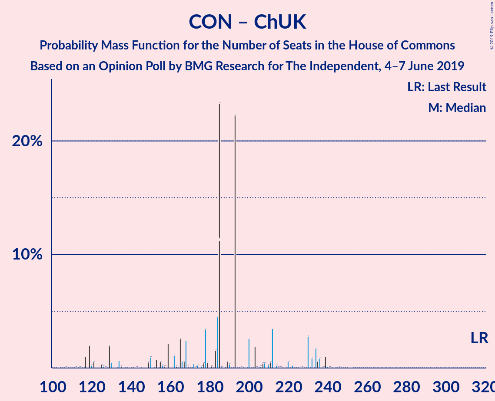

| Number of Seats | Probability | Accumulated | Special Marks |
|:---------------:|:-----------:|:-----------:|:-------------:|
| 103 | 0% | 100% |  |
| 104 | 0% | 99.9% |  |
| 105 | 0% | 99.9% |  |
| 106 | 0% | 99.9% |  |
| 107 | 0.1% | 99.9% |  |
| 108 | 0% | 99.8% |  |
| 109 | 0% | 99.8% |  |
| 110 | 0% | 99.8% |  |
| 111 | 0% | 99.8% |  |
| 112 | 0.1% | 99.8% |  |
| 113 | 0% | 99.7% |  |
| 114 | 0.1% | 99.7% |  |
| 115 | 0% | 99.6% |  |
| 116 | 0% | 99.6% |  |
| 117 | 1.0% | 99.6% |  |
| 118 | 0.1% | 98.6% |  |
| 119 | 2% | 98.5% |  |
| 120 | 0.2% | 97% |  |
| 121 | 0.5% | 96% |  |
| 122 | 0% | 96% |  |
| 123 | 0% | 96% |  |
| 124 | 0% | 96% |  |
| 125 | 0.3% | 96% |  |
| 126 | 0.2% | 95% |  |
| 127 | 0.1% | 95% |  |
| 128 | 0% | 95% |  |
| 129 | 2% | 95% |  |
| 130 | 0.5% | 93% |  |
| 131 | 0% | 93% |  |
| 132 | 0% | 93% |  |
| 133 | 0% | 93% |  |
| 134 | 0.6% | 93% |  |
| 135 | 0.2% | 92% |  |
| 136 | 0.1% | 92% |  |
| 137 | 0% | 92% |  |
| 138 | 0% | 92% |  |
| 139 | 0% | 92% |  |
| 140 | 0% | 92% |  |
| 141 | 0% | 92% |  |
| 142 | 0.1% | 92% |  |
| 143 | 0.1% | 92% |  |
| 144 | 0% | 92% |  |
| 145 | 0% | 92% |  |
| 146 | 0% | 92% |  |
| 147 | 0% | 92% |  |
| 148 | 0% | 91% |  |
| 149 | 0.5% | 91% |  |
| 150 | 0.9% | 91% |  |
| 151 | 0% | 90% |  |
| 152 | 0% | 90% |  |
| 153 | 0.7% | 90% |  |
| 154 | 0% | 89% |  |
| 155 | 0.6% | 89% |  |
| 156 | 0.2% | 89% |  |
| 157 | 0.2% | 88% |  |
| 158 | 0% | 88% |  |
| 159 | 2% | 88% |  |
| 160 | 0% | 86% |  |
| 161 | 0.1% | 86% |  |
| 162 | 1.1% | 86% |  |
| 163 | 0.2% | 85% |  |
| 164 | 0.1% | 85% |  |
| 165 | 3% | 85% |  |
| 166 | 0.5% | 82% |  |
| 167 | 0.6% | 81% |  |
| 168 | 2% | 81% |  |
| 169 | 0.1% | 78% |  |
| 170 | 0% | 78% |  |
| 171 | 0.1% | 78% |  |
| 172 | 0.4% | 78% |  |
| 173 | 0.1% | 78% |  |
| 174 | 0.3% | 78% |  |
| 175 | 0% | 77% |  |
| 176 | 0.2% | 77% |  |
| 177 | 0.4% | 77% |  |
| 178 | 3% | 77% |  |
| 179 | 0.5% | 73% |  |
| 180 | 0% | 73% |  |
| 181 | 0.2% | 73% |  |
| 182 | 0% | 73% |  |
| 183 | 2% | 73% |  |
| 184 | 5% | 71% |  |
| 185 | 23% | 67% | Median |
| 186 | 0.1% | 43% |  |
| 187 | 0.1% | 43% |  |
| 188 | 0% | 43% |  |
| 189 | 0.6% | 43% |  |
| 190 | 0.3% | 43% |  |
| 191 | 0% | 42% |  |
| 192 | 0% | 42% |  |
| 193 | 22% | 42% |  |
| 194 | 0% | 20% |  |
| 195 | 0% | 20% |  |
| 196 | 0.1% | 20% |  |
| 197 | 0% | 20% |  |
| 198 | 0.1% | 20% |  |
| 199 | 0% | 20% |  |
| 200 | 3% | 20% |  |
| 201 | 0% | 17% |  |
| 202 | 0% | 17% |  |
| 203 | 2% | 17% |  |
| 204 | 0.1% | 15% |  |
| 205 | 0% | 15% |  |
| 206 | 0.1% | 15% |  |
| 207 | 0.4% | 15% |  |
| 208 | 0.4% | 15% |  |
| 209 | 0% | 14% |  |
| 210 | 0.3% | 14% |  |
| 211 | 0.5% | 14% |  |
| 212 | 3% | 13% |  |
| 213 | 0% | 10% |  |
| 214 | 0.2% | 10% |  |
| 215 | 0.1% | 10% |  |
| 216 | 0.1% | 10% |  |
| 217 | 0% | 10% |  |
| 218 | 0% | 10% |  |
| 219 | 0% | 9% |  |
| 220 | 0.5% | 9% |  |
| 221 | 0% | 9% |  |
| 222 | 0.2% | 9% |  |
| 223 | 0% | 9% |  |
| 224 | 0% | 9% |  |
| 225 | 0% | 9% |  |
| 226 | 0% | 9% |  |
| 227 | 0.1% | 9% |  |
| 228 | 0% | 9% |  |
| 229 | 0% | 9% |  |
| 230 | 3% | 9% |  |
| 231 | 0% | 6% |  |
| 232 | 0.9% | 6% |  |
| 233 | 0% | 5% |  |
| 234 | 2% | 5% |  |
| 235 | 0.6% | 3% |  |
| 236 | 0.9% | 3% |  |
| 237 | 0% | 2% |  |
| 238 | 0.1% | 2% |  |
| 239 | 1.0% | 2% |  |
| 240 | 0.1% | 0.5% |  |
| 241 | 0.1% | 0.4% |  |
| 242 | 0% | 0.3% |  |
| 243 | 0% | 0.3% |  |
| 244 | 0% | 0.3% |  |
| 245 | 0% | 0.3% |  |
| 246 | 0.1% | 0.3% |  |
| 247 | 0% | 0.2% |  |
| 248 | 0% | 0.2% |  |
| 249 | 0% | 0.2% |  |
| 250 | 0% | 0.1% |  |
| 251 | 0.1% | 0.1% |  |
| 252 | 0% | 0.1% |  |
| 253 | 0% | 0% |  |
| 254 | 0% | 0% |  |
| 255 | 0% | 0% |  |
| 256 | 0% | 0% |  |
| 257 | 0% | 0% |  |
| 258 | 0% | 0% |  |
| 259 | 0% | 0% |  |
| 260 | 0% | 0% |  |
| 261 | 0% | 0% |  |
| 262 | 0% | 0% |  |
| 263 | 0% | 0% |  |
| 264 | 0% | 0% |  |
| 265 | 0% | 0% |  |
| 266 | 0% | 0% |  |
| 267 | 0% | 0% |  |
| 268 | 0% | 0% |  |
| 269 | 0% | 0% |  |
| 270 | 0% | 0% |  |
| 271 | 0% | 0% |  |
| 272 | 0% | 0% |  |
| 273 | 0% | 0% |  |
| 274 | 0% | 0% |  |
| 275 | 0% | 0% |  |
| 276 | 0% | 0% |  |
| 277 | 0% | 0% |  |
| 278 | 0% | 0% |  |
| 279 | 0% | 0% |  |
| 280 | 0% | 0% |  |
| 281 | 0% | 0% |  |
| 282 | 0% | 0% |  |
| 283 | 0% | 0% |  |
| 284 | 0% | 0% |  |
| 285 | 0% | 0% |  |
| 286 | 0% | 0% |  |
| 287 | 0% | 0% |  |
| 288 | 0% | 0% |  |
| 289 | 0% | 0% |  |
| 290 | 0% | 0% |  |
| 291 | 0% | 0% |  |
| 292 | 0% | 0% |  |
| 293 | 0% | 0% |  |
| 294 | 0% | 0% |  |
| 295 | 0% | 0% |  |
| 296 | 0% | 0% |  |
| 297 | 0% | 0% |  |
| 298 | 0% | 0% |  |
| 299 | 0% | 0% |  |
| 300 | 0% | 0% |  |
| 301 | 0% | 0% |  |
| 302 | 0% | 0% |  |
| 303 | 0% | 0% |  |
| 304 | 0% | 0% |  |
| 305 | 0% | 0% |  |
| 306 | 0% | 0% |  |
| 307 | 0% | 0% |  |
| 308 | 0% | 0% |  |
| 309 | 0% | 0% |  |
| 310 | 0% | 0% |  |
| 311 | 0% | 0% |  |
| 312 | 0% | 0% |  |
| 313 | 0% | 0% |  |
| 314 | 0% | 0% |  |
| 315 | 0% | 0% |  |
| 316 | 0% | 0% |  |
| 317 | 0% | 0% | Last Result |

### Conservative Party

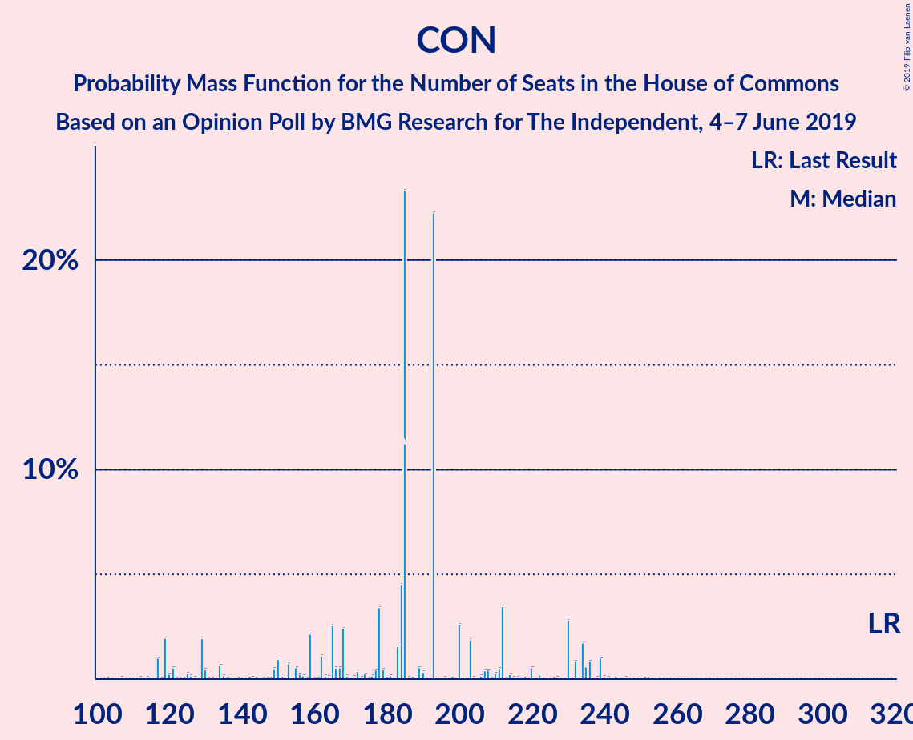

| Number of Seats | Probability | Accumulated | Special Marks |
|:---------------:|:-----------:|:-----------:|:-------------:|
| 103 | 0% | 100% |  |
| 104 | 0% | 99.9% |  |
| 105 | 0% | 99.9% |  |
| 106 | 0% | 99.9% |  |
| 107 | 0.1% | 99.9% |  |
| 108 | 0% | 99.8% |  |
| 109 | 0% | 99.8% |  |
| 110 | 0% | 99.8% |  |
| 111 | 0% | 99.8% |  |
| 112 | 0.1% | 99.8% |  |
| 113 | 0% | 99.7% |  |
| 114 | 0.1% | 99.7% |  |
| 115 | 0% | 99.6% |  |
| 116 | 0% | 99.6% |  |
| 117 | 1.0% | 99.6% |  |
| 118 | 0.1% | 98.6% |  |
| 119 | 2% | 98.5% |  |
| 120 | 0.2% | 97% |  |
| 121 | 0.5% | 96% |  |
| 122 | 0% | 96% |  |
| 123 | 0% | 96% |  |
| 124 | 0% | 96% |  |
| 125 | 0.3% | 96% |  |
| 126 | 0.2% | 95% |  |
| 127 | 0.1% | 95% |  |
| 128 | 0% | 95% |  |
| 129 | 2% | 95% |  |
| 130 | 0.5% | 93% |  |
| 131 | 0% | 93% |  |
| 132 | 0% | 93% |  |
| 133 | 0% | 93% |  |
| 134 | 0.6% | 93% |  |
| 135 | 0.2% | 92% |  |
| 136 | 0.1% | 92% |  |
| 137 | 0% | 92% |  |
| 138 | 0% | 92% |  |
| 139 | 0% | 92% |  |
| 140 | 0% | 92% |  |
| 141 | 0% | 92% |  |
| 142 | 0.1% | 92% |  |
| 143 | 0.1% | 92% |  |
| 144 | 0% | 92% |  |
| 145 | 0% | 92% |  |
| 146 | 0% | 92% |  |
| 147 | 0% | 92% |  |
| 148 | 0% | 91% |  |
| 149 | 0.5% | 91% |  |
| 150 | 0.9% | 91% |  |
| 151 | 0% | 90% |  |
| 152 | 0% | 90% |  |
| 153 | 0.7% | 90% |  |
| 154 | 0% | 89% |  |
| 155 | 0.6% | 89% |  |
| 156 | 0.2% | 89% |  |
| 157 | 0.2% | 88% |  |
| 158 | 0% | 88% |  |
| 159 | 2% | 88% |  |
| 160 | 0% | 86% |  |
| 161 | 0.1% | 86% |  |
| 162 | 1.1% | 86% |  |
| 163 | 0.2% | 85% |  |
| 164 | 0.1% | 85% |  |
| 165 | 3% | 85% |  |
| 166 | 0.5% | 82% |  |
| 167 | 0.6% | 81% |  |
| 168 | 2% | 81% |  |
| 169 | 0.1% | 78% |  |
| 170 | 0% | 78% |  |
| 171 | 0.1% | 78% |  |
| 172 | 0.4% | 78% |  |
| 173 | 0.1% | 78% |  |
| 174 | 0.3% | 78% |  |
| 175 | 0% | 77% |  |
| 176 | 0.2% | 77% |  |
| 177 | 0.4% | 77% |  |
| 178 | 3% | 77% |  |
| 179 | 0.5% | 73% |  |
| 180 | 0% | 73% |  |
| 181 | 0.2% | 73% |  |
| 182 | 0% | 73% |  |
| 183 | 2% | 73% |  |
| 184 | 5% | 71% |  |
| 185 | 23% | 67% | Median |
| 186 | 0.1% | 43% |  |
| 187 | 0.1% | 43% |  |
| 188 | 0% | 43% |  |
| 189 | 0.6% | 43% |  |
| 190 | 0.3% | 43% |  |
| 191 | 0% | 42% |  |
| 192 | 0% | 42% |  |
| 193 | 22% | 42% |  |
| 194 | 0% | 20% |  |
| 195 | 0% | 20% |  |
| 196 | 0.1% | 20% |  |
| 197 | 0% | 20% |  |
| 198 | 0.1% | 20% |  |
| 199 | 0% | 20% |  |
| 200 | 3% | 20% |  |
| 201 | 0% | 17% |  |
| 202 | 0% | 17% |  |
| 203 | 2% | 17% |  |
| 204 | 0.1% | 15% |  |
| 205 | 0% | 15% |  |
| 206 | 0.1% | 15% |  |
| 207 | 0.4% | 15% |  |
| 208 | 0.4% | 15% |  |
| 209 | 0% | 14% |  |
| 210 | 0.3% | 14% |  |
| 211 | 0.5% | 14% |  |
| 212 | 3% | 13% |  |
| 213 | 0% | 10% |  |
| 214 | 0.2% | 10% |  |
| 215 | 0.1% | 10% |  |
| 216 | 0.1% | 10% |  |
| 217 | 0% | 10% |  |
| 218 | 0% | 10% |  |
| 219 | 0% | 9% |  |
| 220 | 0.5% | 9% |  |
| 221 | 0% | 9% |  |
| 222 | 0.2% | 9% |  |
| 223 | 0% | 9% |  |
| 224 | 0% | 9% |  |
| 225 | 0% | 9% |  |
| 226 | 0% | 9% |  |
| 227 | 0.1% | 9% |  |
| 228 | 0% | 9% |  |
| 229 | 0% | 9% |  |
| 230 | 3% | 9% |  |
| 231 | 0% | 6% |  |
| 232 | 0.9% | 6% |  |
| 233 | 0% | 5% |  |
| 234 | 2% | 5% |  |
| 235 | 0.6% | 3% |  |
| 236 | 0.9% | 3% |  |
| 237 | 0% | 2% |  |
| 238 | 0.1% | 2% |  |
| 239 | 1.0% | 2% |  |
| 240 | 0.1% | 0.5% |  |
| 241 | 0.1% | 0.4% |  |
| 242 | 0% | 0.3% |  |
| 243 | 0% | 0.3% |  |
| 244 | 0% | 0.3% |  |
| 245 | 0% | 0.3% |  |
| 246 | 0.1% | 0.3% |  |
| 247 | 0% | 0.2% |  |
| 248 | 0% | 0.2% |  |
| 249 | 0% | 0.2% |  |
| 250 | 0% | 0.1% |  |
| 251 | 0.1% | 0.1% |  |
| 252 | 0% | 0.1% |  |
| 253 | 0% | 0% |  |
| 254 | 0% | 0% |  |
| 255 | 0% | 0% |  |
| 256 | 0% | 0% |  |
| 257 | 0% | 0% |  |
| 258 | 0% | 0% |  |
| 259 | 0% | 0% |  |
| 260 | 0% | 0% |  |
| 261 | 0% | 0% |  |
| 262 | 0% | 0% |  |
| 263 | 0% | 0% |  |
| 264 | 0% | 0% |  |
| 265 | 0% | 0% |  |
| 266 | 0% | 0% |  |
| 267 | 0% | 0% |  |
| 268 | 0% | 0% |  |
| 269 | 0% | 0% |  |
| 270 | 0% | 0% |  |
| 271 | 0% | 0% |  |
| 272 | 0% | 0% |  |
| 273 | 0% | 0% |  |
| 274 | 0% | 0% |  |
| 275 | 0% | 0% |  |
| 276 | 0% | 0% |  |
| 277 | 0% | 0% |  |
| 278 | 0% | 0% |  |
| 279 | 0% | 0% |  |
| 280 | 0% | 0% |  |
| 281 | 0% | 0% |  |
| 282 | 0% | 0% |  |
| 283 | 0% | 0% |  |
| 284 | 0% | 0% |  |
| 285 | 0% | 0% |  |
| 286 | 0% | 0% |  |
| 287 | 0% | 0% |  |
| 288 | 0% | 0% |  |
| 289 | 0% | 0% |  |
| 290 | 0% | 0% |  |
| 291 | 0% | 0% |  |
| 292 | 0% | 0% |  |
| 293 | 0% | 0% |  |
| 294 | 0% | 0% |  |
| 295 | 0% | 0% |  |
| 296 | 0% | 0% |  |
| 297 | 0% | 0% |  |
| 298 | 0% | 0% |  |
| 299 | 0% | 0% |  |
| 300 | 0% | 0% |  |
| 301 | 0% | 0% |  |
| 302 | 0% | 0% |  |
| 303 | 0% | 0% |  |
| 304 | 0% | 0% |  |
| 305 | 0% | 0% |  |
| 306 | 0% | 0% |  |
| 307 | 0% | 0% |  |
| 308 | 0% | 0% |  |
| 309 | 0% | 0% |  |
| 310 | 0% | 0% |  |
| 311 | 0% | 0% |  |
| 312 | 0% | 0% |  |
| 313 | 0% | 0% |  |
| 314 | 0% | 0% |  |
| 315 | 0% | 0% |  |
| 316 | 0% | 0% |  |
| 317 | 0% | 0% | Last Result |

## Technical Information

### Opinion Poll

+ **Polling firm:** BMG Research
+ **Commissioner(s):** The Independent
+ **Fieldwork period:** 4–7 June 2019

### Calculations

+ **Sample size:** 1520
+ **Simulations done:** 131,072
+ **Error estimate:** 1.65%

