# Opinion Poll by YouGov for The Times, 16–17 July 2019

<a href="#voting-intentions">Voting Intentions</a> | <a href="#seats">Seats</a> | <a href="#coalitions">Coalitions</a> | <a href="#technical-information">Technical Information</a>

## Voting Intentions

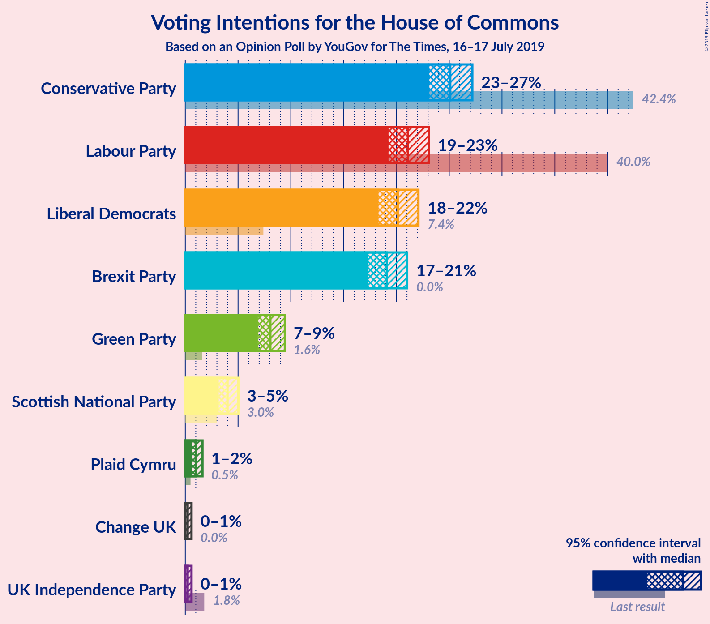

### Confidence Intervals

| Party | Last Result | Poll Result | 80% Confidence Interval | 90% Confidence Interval | 95% Confidence Interval | 99% Confidence Interval |
|:-----:|:-----------:|:-----------:|:-----------------------:|:-----------------------:|:-----------------------:|:-----------------------:|
| Conservative Party | 42.4% | 25.1% | 23.8–26.5% |23.4–26.9% |23.1–27.2% |22.5–27.9% |
| Labour Party | 40.0% | 21.1% | 19.9–22.4% |19.5–22.8% |19.3–23.1% |18.7–23.7% |
| Liberal Democrats | 7.4% | 20.1% | 18.9–21.4% |18.6–21.8% |18.3–22.1% |17.7–22.7% |
| Brexit Party | 0.0% | 19.1% | 17.9–20.3% |17.6–20.7% |17.3–21.0% |16.8–21.6% |
| Green Party | 1.6% | 8.1% | 7.3–9.0% |7.1–9.2% |6.9–9.4% |6.5–9.9% |
| Scottish National Party | 3.0% | 4.0% | 3.5–4.7% |3.3–4.9% |3.2–5.0% |2.9–5.4% |
| Plaid Cymru | 0.5% | 1.0% | 0.8–1.4% |0.7–1.5% |0.6–1.6% |0.5–1.8% |
| UK Independence Party | 1.8% | 0.2% | 0.1–0.5% |0.1–0.5% |0.1–0.6% |0.1–0.7% |
| Change UK | 0.0% | 0.2% | 0.1–0.5% |0.1–0.5% |0.1–0.6% |0.1–0.7% |

*Note:* The poll result column reflects the actual value used in the calculations. Published results may vary slightly, and in addition be rounded to fewer digits.

## Seats

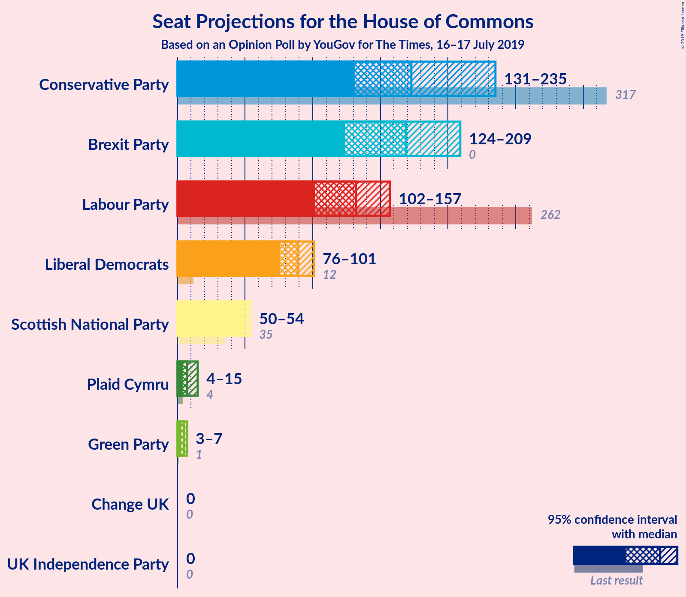

### Confidence Intervals

| Party | Last Result | Median | 80% Confidence Interval | 90% Confidence Interval | 95% Confidence Interval | 99% Confidence Interval |
|:-----:|:-----------:|:------:|:-----------------------:|:-----------------------:|:-----------------------:|:-----------------------:|
| <a href="#conservative-party">Conservative Party</a> | 317 | 173 | 141–211 |137–225 |131–235 |109–247 |
| <a href="#labour-party">Labour Party</a> | 262 | 132 | 109–148 |106–156 |102–157 |96–176 |
| <a href="#liberal-democrats">Liberal Democrats</a> | 12 | 89 | 81–99 |79–99 |76–101 |73–106 |
| <a href="#brexit-party">Brexit Party</a> | 0 | 169 | 144–203 |127–205 |124–209 |116–221 |
| <a href="#green-party">Green Party</a> | 1 | 5 | 3–6 |3–7 |3–7 |3–8 |
| <a href="#scottish-national-party">Scottish National Party</a> | 35 | 51 | 50–54 |50–54 |50–54 |48–54 |
| <a href="#plaid-cymru">Plaid Cymru</a> | 4 | 7 | 5–10 |4–13 |4–15 |4–16 |
| <a href="#uk-independence-party">UK Independence Party</a> | 0 | 0 | 0 |0 |0 |0 |
| <a href="#change-uk">Change UK</a> | 0 | 0 | 0 |0 |0 |0 |

### Conservative Party

*For a full overview of the results for this party, see the [Conservative Party](party-conservativeparty.html) page.*

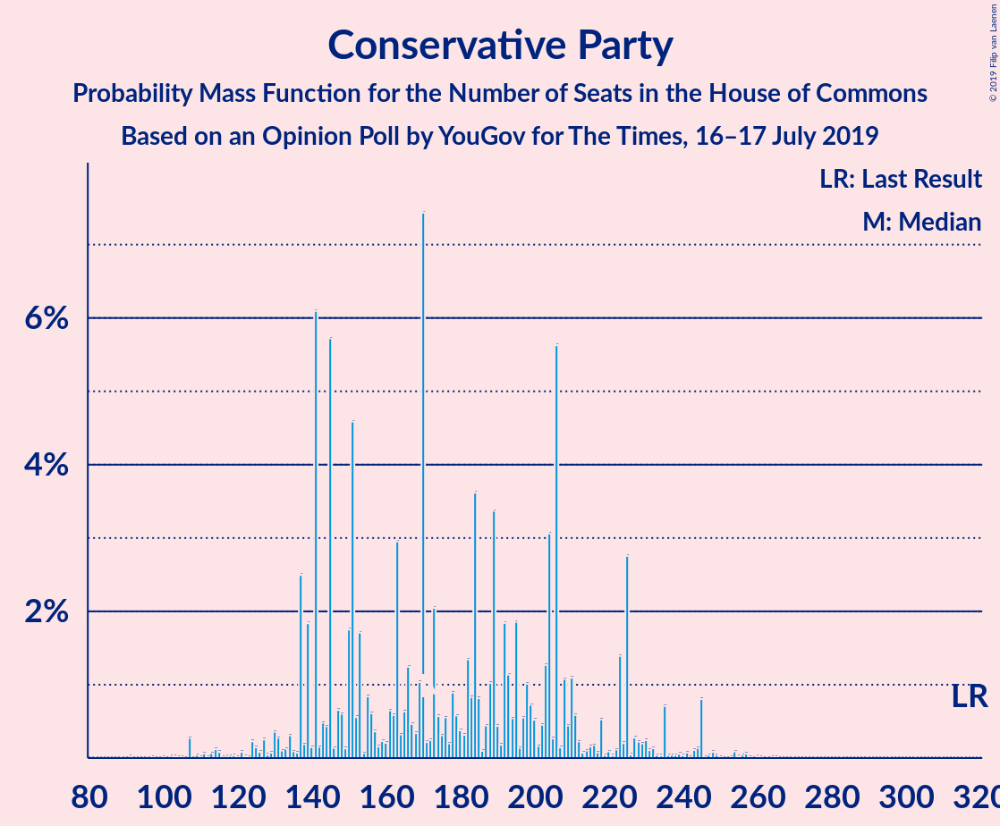

| Number of Seats | Probability | Accumulated | Special Marks |
|:---------------:|:-----------:|:-----------:|:-------------:|
| 94 | 0% | 100% |  |
| 95 | 0% | 99.9% |  |
| 96 | 0% | 99.9% |  |
| 97 | 0% | 99.9% |  |
| 98 | 0% | 99.9% |  |
| 99 | 0% | 99.9% |  |
| 100 | 0% | 99.9% |  |
| 101 | 0% | 99.9% |  |
| 102 | 0% | 99.9% |  |
| 103 | 0% | 99.9% |  |
| 104 | 0% | 99.9% |  |
| 105 | 0% | 99.8% |  |
| 106 | 0% | 99.8% |  |
| 107 | 0.3% | 99.8% |  |
| 108 | 0% | 99.5% |  |
| 109 | 0% | 99.5% |  |
| 110 | 0% | 99.5% |  |
| 111 | 0.1% | 99.5% |  |
| 112 | 0% | 99.4% |  |
| 113 | 0.1% | 99.4% |  |
| 114 | 0.1% | 99.3% |  |
| 115 | 0.1% | 99.2% |  |
| 116 | 0% | 99.1% |  |
| 117 | 0% | 99.1% |  |
| 118 | 0% | 99.1% |  |
| 119 | 0% | 99.1% |  |
| 120 | 0% | 99.0% |  |
| 121 | 0.1% | 99.0% |  |
| 122 | 0% | 98.9% |  |
| 123 | 0% | 98.9% |  |
| 124 | 0.2% | 98.9% |  |
| 125 | 0.1% | 98.7% |  |
| 126 | 0.1% | 98.5% |  |
| 127 | 0.3% | 98% |  |
| 128 | 0% | 98% |  |
| 129 | 0.1% | 98% |  |
| 130 | 0.4% | 98% |  |
| 131 | 0.3% | 98% |  |
| 132 | 0.1% | 97% |  |
| 133 | 0.1% | 97% |  |
| 134 | 0.3% | 97% |  |
| 135 | 0.1% | 97% |  |
| 136 | 0.1% | 97% |  |
| 137 | 2% | 97% |  |
| 138 | 0.2% | 94% |  |
| 139 | 2% | 94% |  |
| 140 | 0.1% | 92% |  |
| 141 | 6% | 92% |  |
| 142 | 0.2% | 86% |  |
| 143 | 0.5% | 86% |  |
| 144 | 0.4% | 85% |  |
| 145 | 6% | 85% |  |
| 146 | 0.1% | 79% |  |
| 147 | 0.7% | 79% |  |
| 148 | 0.6% | 78% |  |
| 149 | 0.1% | 78% |  |
| 150 | 2% | 78% |  |
| 151 | 5% | 76% |  |
| 152 | 0.6% | 71% |  |
| 153 | 2% | 71% |  |
| 154 | 0.1% | 69% |  |
| 155 | 0.8% | 69% |  |
| 156 | 0.6% | 68% |  |
| 157 | 0.4% | 68% |  |
| 158 | 0.2% | 67% |  |
| 159 | 0.2% | 67% |  |
| 160 | 0.2% | 67% |  |
| 161 | 0.6% | 67% |  |
| 162 | 0.6% | 66% |  |
| 163 | 3% | 65% |  |
| 164 | 0.3% | 62% |  |
| 165 | 0.6% | 62% |  |
| 166 | 1.2% | 61% |  |
| 167 | 0.5% | 60% |  |
| 168 | 0.3% | 60% |  |
| 169 | 1.0% | 59% |  |
| 170 | 7% | 58% |  |
| 171 | 0.2% | 51% |  |
| 172 | 0.2% | 51% |  |
| 173 | 2% | 50% | Median |
| 174 | 0.6% | 48% |  |
| 175 | 0.3% | 48% |  |
| 176 | 0.6% | 48% |  |
| 177 | 0.2% | 47% |  |
| 178 | 0.9% | 47% |  |
| 179 | 0.6% | 46% |  |
| 180 | 0.4% | 45% |  |
| 181 | 0.3% | 45% |  |
| 182 | 1.3% | 45% |  |
| 183 | 0.8% | 43% |  |
| 184 | 4% | 42% |  |
| 185 | 0.8% | 39% |  |
| 186 | 0.1% | 38% |  |
| 187 | 0.4% | 38% |  |
| 188 | 1.0% | 37% |  |
| 189 | 3% | 36% |  |
| 190 | 0.4% | 33% |  |
| 191 | 0.2% | 33% |  |
| 192 | 2% | 32% |  |
| 193 | 1.1% | 31% |  |
| 194 | 0.5% | 29% |  |
| 195 | 2% | 29% |  |
| 196 | 0.1% | 27% |  |
| 197 | 0.6% | 27% |  |
| 198 | 1.0% | 26% |  |
| 199 | 0.7% | 25% |  |
| 200 | 0.5% | 25% |  |
| 201 | 0.2% | 24% |  |
| 202 | 0.5% | 24% |  |
| 203 | 1.3% | 23% |  |
| 204 | 3% | 22% |  |
| 205 | 0.3% | 19% |  |
| 206 | 6% | 19% |  |
| 207 | 0.1% | 13% |  |
| 208 | 1.1% | 13% |  |
| 209 | 0.4% | 12% |  |
| 210 | 1.1% | 12% |  |
| 211 | 0.6% | 10% |  |
| 212 | 0.2% | 10% |  |
| 213 | 0.1% | 10% |  |
| 214 | 0.1% | 10% |  |
| 215 | 0.2% | 9% |  |
| 216 | 0.2% | 9% |  |
| 217 | 0.1% | 9% |  |
| 218 | 0.5% | 9% |  |
| 219 | 0% | 9% |  |
| 220 | 0.1% | 9% |  |
| 221 | 0% | 8% |  |
| 222 | 0.1% | 8% |  |
| 223 | 1.4% | 8% |  |
| 224 | 0.2% | 7% |  |
| 225 | 3% | 7% |  |
| 226 | 0% | 4% |  |
| 227 | 0.3% | 4% |  |
| 228 | 0.2% | 4% |  |
| 229 | 0.2% | 3% |  |
| 230 | 0.2% | 3% |  |
| 231 | 0.1% | 3% |  |
| 232 | 0.1% | 3% |  |
| 233 | 0% | 3% |  |
| 234 | 0% | 3% |  |
| 235 | 0.7% | 3% |  |
| 236 | 0% | 2% |  |
| 237 | 0% | 2% |  |
| 238 | 0% | 2% |  |
| 239 | 0.1% | 2% |  |
| 240 | 0% | 2% |  |
| 241 | 0.1% | 2% |  |
| 242 | 0% | 2% |  |
| 243 | 0.1% | 2% |  |
| 244 | 0.1% | 1.5% |  |
| 245 | 0.8% | 1.3% |  |
| 246 | 0% | 0.5% |  |
| 247 | 0% | 0.5% |  |
| 248 | 0.1% | 0.5% |  |
| 249 | 0% | 0.4% |  |
| 250 | 0% | 0.4% |  |
| 251 | 0% | 0.3% |  |
| 252 | 0% | 0.3% |  |
| 253 | 0% | 0.3% |  |
| 254 | 0.1% | 0.3% |  |
| 255 | 0% | 0.2% |  |
| 256 | 0% | 0.2% |  |
| 257 | 0.1% | 0.2% |  |
| 258 | 0% | 0.1% |  |
| 259 | 0% | 0.1% |  |
| 260 | 0% | 0.1% |  |
| 261 | 0% | 0.1% |  |
| 262 | 0% | 0.1% |  |
| 263 | 0% | 0% |  |
| 264 | 0% | 0% |  |
| 265 | 0% | 0% |  |
| 266 | 0% | 0% |  |
| 267 | 0% | 0% |  |
| 268 | 0% | 0% |  |
| 269 | 0% | 0% |  |
| 270 | 0% | 0% |  |
| 271 | 0% | 0% |  |
| 272 | 0% | 0% |  |
| 273 | 0% | 0% |  |
| 274 | 0% | 0% |  |
| 275 | 0% | 0% |  |
| 276 | 0% | 0% |  |
| 277 | 0% | 0% |  |
| 278 | 0% | 0% |  |
| 279 | 0% | 0% |  |
| 280 | 0% | 0% |  |
| 281 | 0% | 0% |  |
| 282 | 0% | 0% |  |
| 283 | 0% | 0% |  |
| 284 | 0% | 0% |  |
| 285 | 0% | 0% |  |
| 286 | 0% | 0% |  |
| 287 | 0% | 0% |  |
| 288 | 0% | 0% |  |
| 289 | 0% | 0% |  |
| 290 | 0% | 0% |  |
| 291 | 0% | 0% |  |
| 292 | 0% | 0% |  |
| 293 | 0% | 0% |  |
| 294 | 0% | 0% |  |
| 295 | 0% | 0% |  |
| 296 | 0% | 0% |  |
| 297 | 0% | 0% |  |
| 298 | 0% | 0% |  |
| 299 | 0% | 0% |  |
| 300 | 0% | 0% |  |
| 301 | 0% | 0% |  |
| 302 | 0% | 0% |  |
| 303 | 0% | 0% |  |
| 304 | 0% | 0% |  |
| 305 | 0% | 0% |  |
| 306 | 0% | 0% |  |
| 307 | 0% | 0% |  |
| 308 | 0% | 0% |  |
| 309 | 0% | 0% |  |
| 310 | 0% | 0% |  |
| 311 | 0% | 0% |  |
| 312 | 0% | 0% |  |
| 313 | 0% | 0% |  |
| 314 | 0% | 0% |  |
| 315 | 0% | 0% |  |
| 316 | 0% | 0% |  |
| 317 | 0% | 0% | Last Result |

### Labour Party

*For a full overview of the results for this party, see the [Labour Party](party-labourparty.html) page.*

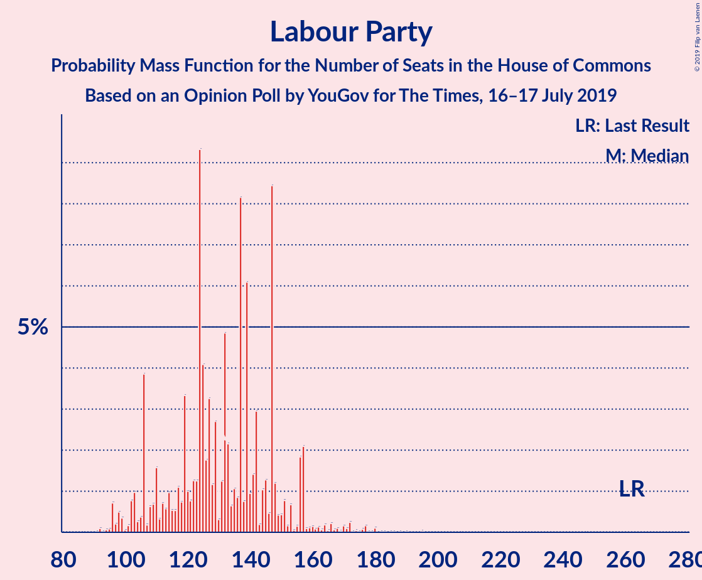

| Number of Seats | Probability | Accumulated | Special Marks |
|:---------------:|:-----------:|:-----------:|:-------------:|
| 91 | 0% | 100% |  |
| 92 | 0.1% | 99.9% |  |
| 93 | 0% | 99.9% |  |
| 94 | 0.1% | 99.8% |  |
| 95 | 0.1% | 99.8% |  |
| 96 | 0.7% | 99.7% |  |
| 97 | 0.2% | 99.0% |  |
| 98 | 0.5% | 98.8% |  |
| 99 | 0.3% | 98% |  |
| 100 | 0.1% | 98% |  |
| 101 | 0.2% | 98% |  |
| 102 | 0.8% | 98% |  |
| 103 | 1.0% | 97% |  |
| 104 | 0.3% | 96% |  |
| 105 | 0.4% | 96% |  |
| 106 | 4% | 95% |  |
| 107 | 0.2% | 91% |  |
| 108 | 0.6% | 91% |  |
| 109 | 0.7% | 91% |  |
| 110 | 2% | 90% |  |
| 111 | 0.3% | 88% |  |
| 112 | 0.7% | 88% |  |
| 113 | 0.6% | 87% |  |
| 114 | 1.0% | 87% |  |
| 115 | 0.5% | 86% |  |
| 116 | 0.5% | 85% |  |
| 117 | 1.1% | 85% |  |
| 118 | 0.7% | 84% |  |
| 119 | 3% | 83% |  |
| 120 | 1.0% | 80% |  |
| 121 | 0.8% | 79% |  |
| 122 | 1.3% | 78% |  |
| 123 | 1.3% | 77% |  |
| 124 | 9% | 75% |  |
| 125 | 4% | 66% |  |
| 126 | 2% | 62% |  |
| 127 | 3% | 60% |  |
| 128 | 1.2% | 57% |  |
| 129 | 3% | 56% |  |
| 130 | 0.3% | 53% |  |
| 131 | 1.2% | 53% |  |
| 132 | 5% | 51% | Median |
| 133 | 2% | 47% |  |
| 134 | 0.6% | 44% |  |
| 135 | 1.1% | 44% |  |
| 136 | 0.9% | 43% |  |
| 137 | 8% | 42% |  |
| 138 | 0.8% | 34% |  |
| 139 | 6% | 33% |  |
| 140 | 0.9% | 27% |  |
| 141 | 1.4% | 26% |  |
| 142 | 3% | 25% |  |
| 143 | 0.2% | 22% |  |
| 144 | 1.0% | 21% |  |
| 145 | 1.3% | 20% |  |
| 146 | 0.5% | 19% |  |
| 147 | 8% | 19% |  |
| 148 | 1.2% | 10% |  |
| 149 | 0.4% | 9% |  |
| 150 | 0.4% | 9% |  |
| 151 | 0.8% | 8% |  |
| 152 | 0.2% | 7% |  |
| 153 | 0.7% | 7% |  |
| 154 | 0.1% | 7% |  |
| 155 | 0.2% | 6% |  |
| 156 | 2% | 6% |  |
| 157 | 2% | 4% |  |
| 158 | 0.1% | 2% |  |
| 159 | 0.1% | 2% |  |
| 160 | 0.1% | 2% |  |
| 161 | 0.1% | 2% |  |
| 162 | 0.1% | 2% |  |
| 163 | 0.1% | 2% |  |
| 164 | 0.2% | 2% |  |
| 165 | 0% | 2% |  |
| 166 | 0.2% | 2% |  |
| 167 | 0.1% | 1.3% |  |
| 168 | 0.1% | 1.3% |  |
| 169 | 0% | 1.2% |  |
| 170 | 0.2% | 1.1% |  |
| 171 | 0.1% | 1.0% |  |
| 172 | 0.2% | 0.9% |  |
| 173 | 0% | 0.6% |  |
| 174 | 0% | 0.6% |  |
| 175 | 0% | 0.6% |  |
| 176 | 0.1% | 0.6% |  |
| 177 | 0.2% | 0.5% |  |
| 178 | 0% | 0.3% |  |
| 179 | 0% | 0.3% |  |
| 180 | 0.1% | 0.3% |  |
| 181 | 0% | 0.2% |  |
| 182 | 0% | 0.2% |  |
| 183 | 0% | 0.1% |  |
| 184 | 0% | 0.1% |  |
| 185 | 0% | 0.1% |  |
| 186 | 0% | 0.1% |  |
| 187 | 0% | 0.1% |  |
| 188 | 0% | 0.1% |  |
| 189 | 0% | 0.1% |  |
| 190 | 0% | 0.1% |  |
| 191 | 0% | 0.1% |  |
| 192 | 0% | 0.1% |  |
| 193 | 0% | 0.1% |  |
| 194 | 0% | 0.1% |  |
| 195 | 0% | 0.1% |  |
| 196 | 0% | 0% |  |
| 197 | 0% | 0% |  |
| 198 | 0% | 0% |  |
| 199 | 0% | 0% |  |
| 200 | 0% | 0% |  |
| 201 | 0% | 0% |  |
| 202 | 0% | 0% |  |
| 203 | 0% | 0% |  |
| 204 | 0% | 0% |  |
| 205 | 0% | 0% |  |
| 206 | 0% | 0% |  |
| 207 | 0% | 0% |  |
| 208 | 0% | 0% |  |
| 209 | 0% | 0% |  |
| 210 | 0% | 0% |  |
| 211 | 0% | 0% |  |
| 212 | 0% | 0% |  |
| 213 | 0% | 0% |  |
| 214 | 0% | 0% |  |
| 215 | 0% | 0% |  |
| 216 | 0% | 0% |  |
| 217 | 0% | 0% |  |
| 218 | 0% | 0% |  |
| 219 | 0% | 0% |  |
| 220 | 0% | 0% |  |
| 221 | 0% | 0% |  |
| 222 | 0% | 0% |  |
| 223 | 0% | 0% |  |
| 224 | 0% | 0% |  |
| 225 | 0% | 0% |  |
| 226 | 0% | 0% |  |
| 227 | 0% | 0% |  |
| 228 | 0% | 0% |  |
| 229 | 0% | 0% |  |
| 230 | 0% | 0% |  |
| 231 | 0% | 0% |  |
| 232 | 0% | 0% |  |
| 233 | 0% | 0% |  |
| 234 | 0% | 0% |  |
| 235 | 0% | 0% |  |
| 236 | 0% | 0% |  |
| 237 | 0% | 0% |  |
| 238 | 0% | 0% |  |
| 239 | 0% | 0% |  |
| 240 | 0% | 0% |  |
| 241 | 0% | 0% |  |
| 242 | 0% | 0% |  |
| 243 | 0% | 0% |  |
| 244 | 0% | 0% |  |
| 245 | 0% | 0% |  |
| 246 | 0% | 0% |  |
| 247 | 0% | 0% |  |
| 248 | 0% | 0% |  |
| 249 | 0% | 0% |  |
| 250 | 0% | 0% |  |
| 251 | 0% | 0% |  |
| 252 | 0% | 0% |  |
| 253 | 0% | 0% |  |
| 254 | 0% | 0% |  |
| 255 | 0% | 0% |  |
| 256 | 0% | 0% |  |
| 257 | 0% | 0% |  |
| 258 | 0% | 0% |  |
| 259 | 0% | 0% |  |
| 260 | 0% | 0% |  |
| 261 | 0% | 0% |  |
| 262 | 0% | 0% | Last Result |

### Liberal Democrats

*For a full overview of the results for this party, see the [Liberal Democrats](party-liberaldemocrats.html) page.*

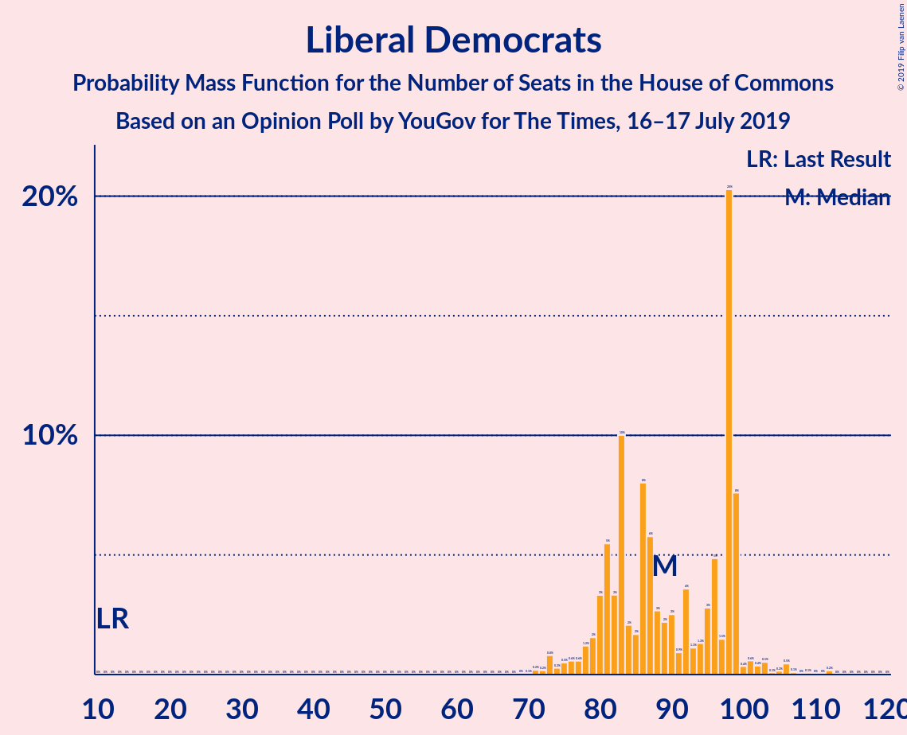

| Number of Seats | Probability | Accumulated | Special Marks |
|:---------------:|:-----------:|:-----------:|:-------------:|
| 12 | 0% | 100% | Last Result |
| 13 | 0% | 100% |  |
| 14 | 0% | 100% |  |
| 15 | 0% | 100% |  |
| 16 | 0% | 100% |  |
| 17 | 0% | 100% |  |
| 18 | 0% | 100% |  |
| 19 | 0% | 100% |  |
| 20 | 0% | 100% |  |
| 21 | 0% | 100% |  |
| 22 | 0% | 100% |  |
| 23 | 0% | 100% |  |
| 24 | 0% | 100% |  |
| 25 | 0% | 100% |  |
| 26 | 0% | 100% |  |
| 27 | 0% | 100% |  |
| 28 | 0% | 100% |  |
| 29 | 0% | 100% |  |
| 30 | 0% | 100% |  |
| 31 | 0% | 100% |  |
| 32 | 0% | 100% |  |
| 33 | 0% | 100% |  |
| 34 | 0% | 100% |  |
| 35 | 0% | 100% |  |
| 36 | 0% | 100% |  |
| 37 | 0% | 100% |  |
| 38 | 0% | 100% |  |
| 39 | 0% | 100% |  |
| 40 | 0% | 100% |  |
| 41 | 0% | 100% |  |
| 42 | 0% | 100% |  |
| 43 | 0% | 100% |  |
| 44 | 0% | 100% |  |
| 45 | 0% | 100% |  |
| 46 | 0% | 100% |  |
| 47 | 0% | 100% |  |
| 48 | 0% | 100% |  |
| 49 | 0% | 100% |  |
| 50 | 0% | 100% |  |
| 51 | 0% | 100% |  |
| 52 | 0% | 100% |  |
| 53 | 0% | 100% |  |
| 54 | 0% | 100% |  |
| 55 | 0% | 100% |  |
| 56 | 0% | 100% |  |
| 57 | 0% | 100% |  |
| 58 | 0% | 100% |  |
| 59 | 0% | 100% |  |
| 60 | 0% | 100% |  |
| 61 | 0% | 100% |  |
| 62 | 0% | 100% |  |
| 63 | 0% | 100% |  |
| 64 | 0% | 100% |  |
| 65 | 0% | 100% |  |
| 66 | 0% | 100% |  |
| 67 | 0% | 100% |  |
| 68 | 0% | 100% |  |
| 69 | 0% | 100% |  |
| 70 | 0.1% | 99.9% |  |
| 71 | 0.2% | 99.9% |  |
| 72 | 0.2% | 99.7% |  |
| 73 | 0.8% | 99.5% |  |
| 74 | 0.3% | 98.7% |  |
| 75 | 0.5% | 98% |  |
| 76 | 0.6% | 98% |  |
| 77 | 0.6% | 97% |  |
| 78 | 1.2% | 97% |  |
| 79 | 2% | 96% |  |
| 80 | 3% | 94% |  |
| 81 | 5% | 91% |  |
| 82 | 3% | 85% |  |
| 83 | 10% | 82% |  |
| 84 | 2% | 72% |  |
| 85 | 2% | 70% |  |
| 86 | 8% | 68% |  |
| 87 | 6% | 60% |  |
| 88 | 3% | 54% |  |
| 89 | 2% | 52% | Median |
| 90 | 3% | 49% |  |
| 91 | 0.9% | 47% |  |
| 92 | 4% | 46% |  |
| 93 | 1.1% | 42% |  |
| 94 | 1.3% | 41% |  |
| 95 | 3% | 40% |  |
| 96 | 5% | 37% |  |
| 97 | 1.5% | 32% |  |
| 98 | 20% | 31% |  |
| 99 | 8% | 11% |  |
| 100 | 0.4% | 3% |  |
| 101 | 0.6% | 3% |  |
| 102 | 0.4% | 2% |  |
| 103 | 0.5% | 2% |  |
| 104 | 0.1% | 1.1% |  |
| 105 | 0.2% | 1.1% |  |
| 106 | 0.5% | 0.9% |  |
| 107 | 0.1% | 0.4% |  |
| 108 | 0% | 0.4% |  |
| 109 | 0.1% | 0.3% |  |
| 110 | 0% | 0.3% |  |
| 111 | 0% | 0.2% |  |
| 112 | 0.2% | 0.2% |  |
| 113 | 0% | 0% |  |

### Brexit Party

*For a full overview of the results for this party, see the [Brexit Party](party-brexitparty.html) page.*

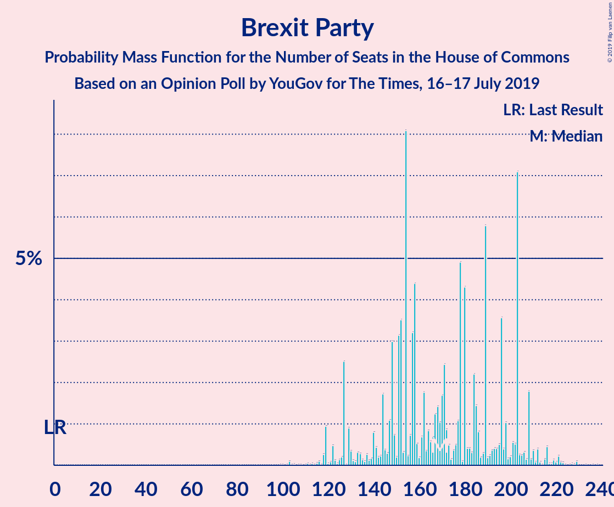

| Number of Seats | Probability | Accumulated | Special Marks |
|:---------------:|:-----------:|:-----------:|:-------------:|
| 0 | 0% | 100% | Last Result |
| 1 | 0% | 100% |  |
| 2 | 0% | 100% |  |
| 3 | 0% | 100% |  |
| 4 | 0% | 100% |  |
| 5 | 0% | 100% |  |
| 6 | 0% | 100% |  |
| 7 | 0% | 100% |  |
| 8 | 0% | 100% |  |
| 9 | 0% | 100% |  |
| 10 | 0% | 100% |  |
| 11 | 0% | 100% |  |
| 12 | 0% | 100% |  |
| 13 | 0% | 100% |  |
| 14 | 0% | 100% |  |
| 15 | 0% | 100% |  |
| 16 | 0% | 100% |  |
| 17 | 0% | 100% |  |
| 18 | 0% | 100% |  |
| 19 | 0% | 100% |  |
| 20 | 0% | 100% |  |
| 21 | 0% | 100% |  |
| 22 | 0% | 100% |  |
| 23 | 0% | 100% |  |
| 24 | 0% | 100% |  |
| 25 | 0% | 100% |  |
| 26 | 0% | 100% |  |
| 27 | 0% | 100% |  |
| 28 | 0% | 100% |  |
| 29 | 0% | 100% |  |
| 30 | 0% | 100% |  |
| 31 | 0% | 100% |  |
| 32 | 0% | 100% |  |
| 33 | 0% | 100% |  |
| 34 | 0% | 100% |  |
| 35 | 0% | 100% |  |
| 36 | 0% | 100% |  |
| 37 | 0% | 100% |  |
| 38 | 0% | 100% |  |
| 39 | 0% | 100% |  |
| 40 | 0% | 100% |  |
| 41 | 0% | 100% |  |
| 42 | 0% | 100% |  |
| 43 | 0% | 100% |  |
| 44 | 0% | 100% |  |
| 45 | 0% | 100% |  |
| 46 | 0% | 100% |  |
| 47 | 0% | 100% |  |
| 48 | 0% | 100% |  |
| 49 | 0% | 100% |  |
| 50 | 0% | 100% |  |
| 51 | 0% | 100% |  |
| 52 | 0% | 100% |  |
| 53 | 0% | 100% |  |
| 54 | 0% | 100% |  |
| 55 | 0% | 100% |  |
| 56 | 0% | 100% |  |
| 57 | 0% | 100% |  |
| 58 | 0% | 100% |  |
| 59 | 0% | 100% |  |
| 60 | 0% | 100% |  |
| 61 | 0% | 100% |  |
| 62 | 0% | 100% |  |
| 63 | 0% | 100% |  |
| 64 | 0% | 100% |  |
| 65 | 0% | 100% |  |
| 66 | 0% | 100% |  |
| 67 | 0% | 100% |  |
| 68 | 0% | 100% |  |
| 69 | 0% | 100% |  |
| 70 | 0% | 100% |  |
| 71 | 0% | 100% |  |
| 72 | 0% | 100% |  |
| 73 | 0% | 100% |  |
| 74 | 0% | 100% |  |
| 75 | 0% | 100% |  |
| 76 | 0% | 100% |  |
| 77 | 0% | 100% |  |
| 78 | 0% | 100% |  |
| 79 | 0% | 100% |  |
| 80 | 0% | 100% |  |
| 81 | 0% | 100% |  |
| 82 | 0% | 100% |  |
| 83 | 0% | 100% |  |
| 84 | 0% | 100% |  |
| 85 | 0% | 100% |  |
| 86 | 0% | 100% |  |
| 87 | 0% | 100% |  |
| 88 | 0% | 100% |  |
| 89 | 0% | 100% |  |
| 90 | 0% | 100% |  |
| 91 | 0% | 100% |  |
| 92 | 0% | 100% |  |
| 93 | 0% | 100% |  |
| 94 | 0% | 100% |  |
| 95 | 0% | 100% |  |
| 96 | 0% | 100% |  |
| 97 | 0% | 100% |  |
| 98 | 0% | 100% |  |
| 99 | 0% | 100% |  |
| 100 | 0% | 100% |  |
| 101 | 0% | 99.9% |  |
| 102 | 0% | 99.9% |  |
| 103 | 0.1% | 99.9% |  |
| 104 | 0% | 99.8% |  |
| 105 | 0% | 99.8% |  |
| 106 | 0% | 99.8% |  |
| 107 | 0% | 99.8% |  |
| 108 | 0% | 99.8% |  |
| 109 | 0% | 99.8% |  |
| 110 | 0% | 99.8% |  |
| 111 | 0% | 99.7% |  |
| 112 | 0% | 99.7% |  |
| 113 | 0% | 99.7% |  |
| 114 | 0% | 99.6% |  |
| 115 | 0.1% | 99.6% |  |
| 116 | 0.1% | 99.6% |  |
| 117 | 0% | 99.5% |  |
| 118 | 0.3% | 99.5% |  |
| 119 | 0.9% | 99.2% |  |
| 120 | 0% | 98% |  |
| 121 | 0.1% | 98% |  |
| 122 | 0.5% | 98% |  |
| 123 | 0.1% | 98% |  |
| 124 | 0% | 98% |  |
| 125 | 0.1% | 97% |  |
| 126 | 0.2% | 97% |  |
| 127 | 3% | 97% |  |
| 128 | 0% | 95% |  |
| 129 | 0.9% | 95% |  |
| 130 | 0.3% | 94% |  |
| 131 | 0.1% | 93% |  |
| 132 | 0.1% | 93% |  |
| 133 | 0.3% | 93% |  |
| 134 | 0.3% | 93% |  |
| 135 | 0.1% | 93% |  |
| 136 | 0.1% | 92% |  |
| 137 | 0.3% | 92% |  |
| 138 | 0.1% | 92% |  |
| 139 | 0.2% | 92% |  |
| 140 | 0.8% | 92% |  |
| 141 | 0.4% | 91% |  |
| 142 | 0.2% | 91% |  |
| 143 | 0.2% | 90% |  |
| 144 | 2% | 90% |  |
| 145 | 0.4% | 88% |  |
| 146 | 0.3% | 88% |  |
| 147 | 1.1% | 88% |  |
| 148 | 3% | 87% |  |
| 149 | 0.7% | 84% |  |
| 150 | 0.2% | 83% |  |
| 151 | 3% | 83% |  |
| 152 | 4% | 80% |  |
| 153 | 0.3% | 76% |  |
| 154 | 8% | 76% |  |
| 155 | 0.2% | 68% |  |
| 156 | 0.7% | 67% |  |
| 157 | 3% | 67% |  |
| 158 | 4% | 63% |  |
| 159 | 0.5% | 59% |  |
| 160 | 0.2% | 59% |  |
| 161 | 0.7% | 58% |  |
| 162 | 2% | 58% |  |
| 163 | 0.4% | 56% |  |
| 164 | 0.8% | 56% |  |
| 165 | 0.6% | 55% |  |
| 166 | 0.7% | 54% |  |
| 167 | 1.2% | 53% |  |
| 168 | 1.4% | 52% |  |
| 169 | 1.0% | 51% | Median |
| 170 | 2% | 50% |  |
| 171 | 2% | 48% |  |
| 172 | 0.9% | 46% |  |
| 173 | 0.5% | 45% |  |
| 174 | 0.1% | 44% |  |
| 175 | 0.4% | 44% |  |
| 176 | 0.5% | 44% |  |
| 177 | 1.1% | 43% |  |
| 178 | 5% | 42% |  |
| 179 | 0.1% | 37% |  |
| 180 | 4% | 37% |  |
| 181 | 0.4% | 33% |  |
| 182 | 0.4% | 32% |  |
| 183 | 0.3% | 32% |  |
| 184 | 2% | 32% |  |
| 185 | 1.4% | 30% |  |
| 186 | 0.8% | 28% |  |
| 187 | 0.2% | 27% |  |
| 188 | 0.3% | 27% |  |
| 189 | 6% | 27% |  |
| 190 | 0.2% | 21% |  |
| 191 | 0.2% | 21% |  |
| 192 | 0.4% | 21% |  |
| 193 | 0.4% | 20% |  |
| 194 | 0.4% | 20% |  |
| 195 | 0.5% | 19% |  |
| 196 | 4% | 19% |  |
| 197 | 0.4% | 15% |  |
| 198 | 1.0% | 15% |  |
| 199 | 0.2% | 14% |  |
| 200 | 0.2% | 14% |  |
| 201 | 0.6% | 14% |  |
| 202 | 0.5% | 13% |  |
| 203 | 7% | 12% |  |
| 204 | 0.3% | 5% |  |
| 205 | 0.2% | 5% |  |
| 206 | 0.3% | 5% |  |
| 207 | 0.1% | 5% |  |
| 208 | 2% | 4% |  |
| 209 | 0.2% | 3% |  |
| 210 | 0.4% | 2% |  |
| 211 | 0.1% | 2% |  |
| 212 | 0.4% | 2% |  |
| 213 | 0.1% | 2% |  |
| 214 | 0% | 2% |  |
| 215 | 0.2% | 2% |  |
| 216 | 0.5% | 1.4% |  |
| 217 | 0% | 0.9% |  |
| 218 | 0% | 0.9% |  |
| 219 | 0.1% | 0.9% |  |
| 220 | 0.1% | 0.7% |  |
| 221 | 0.2% | 0.7% |  |
| 222 | 0.1% | 0.4% |  |
| 223 | 0.1% | 0.4% |  |
| 224 | 0% | 0.3% |  |
| 225 | 0% | 0.3% |  |
| 226 | 0% | 0.3% |  |
| 227 | 0% | 0.2% |  |
| 228 | 0% | 0.2% |  |
| 229 | 0.1% | 0.2% |  |
| 230 | 0% | 0.1% |  |
| 231 | 0% | 0.1% |  |
| 232 | 0% | 0.1% |  |
| 233 | 0% | 0.1% |  |
| 234 | 0% | 0.1% |  |
| 235 | 0% | 0.1% |  |
| 236 | 0% | 0% |  |

### Green Party

*For a full overview of the results for this party, see the [Green Party](party-greenparty.html) page.*

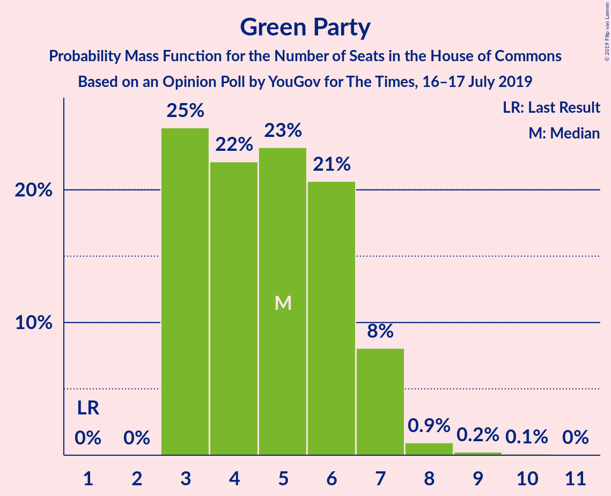

| Number of Seats | Probability | Accumulated | Special Marks |
|:---------------:|:-----------:|:-----------:|:-------------:|
| 1 | 0% | 100% | Last Result |
| 2 | 0% | 100% |  |
| 3 | 25% | 100% |  |
| 4 | 22% | 75% |  |
| 5 | 23% | 53% | Median |
| 6 | 21% | 30% |  |
| 7 | 8% | 9% |  |
| 8 | 0.9% | 1.3% |  |
| 9 | 0.2% | 0.4% |  |
| 10 | 0.1% | 0.1% |  |
| 11 | 0% | 0% |  |

### Scottish National Party

*For a full overview of the results for this party, see the [Scottish National Party](party-scottishnationalparty.html) page.*

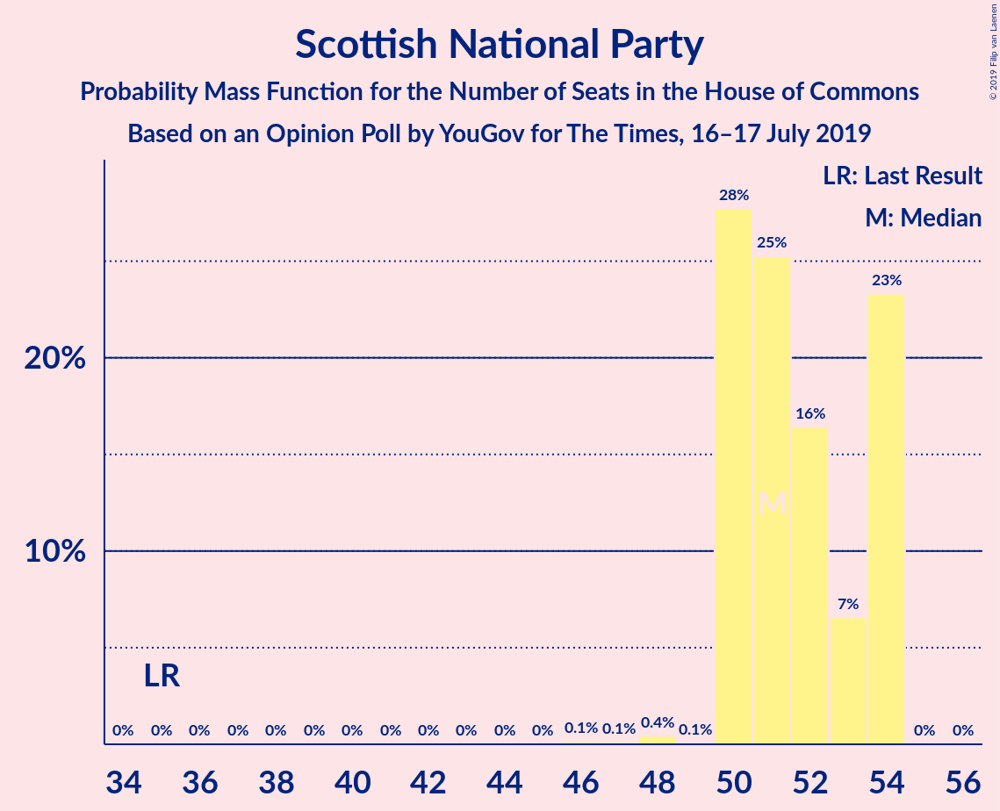

| Number of Seats | Probability | Accumulated | Special Marks |
|:---------------:|:-----------:|:-----------:|:-------------:|
| 35 | 0% | 100% | Last Result |
| 36 | 0% | 100% |  |
| 37 | 0% | 100% |  |
| 38 | 0% | 100% |  |
| 39 | 0% | 100% |  |
| 40 | 0% | 100% |  |
| 41 | 0% | 100% |  |
| 42 | 0% | 100% |  |
| 43 | 0% | 100% |  |
| 44 | 0% | 100% |  |
| 45 | 0% | 100% |  |
| 46 | 0.1% | 100% |  |
| 47 | 0.1% | 99.9% |  |
| 48 | 0.4% | 99.7% |  |
| 49 | 0.1% | 99.3% |  |
| 50 | 28% | 99.3% |  |
| 51 | 25% | 72% | Median |
| 52 | 16% | 46% |  |
| 53 | 7% | 30% |  |
| 54 | 23% | 23% |  |
| 55 | 0% | 0% |  |

### Plaid Cymru

*For a full overview of the results for this party, see the [Plaid Cymru](party-plaidcymru.html) page.*

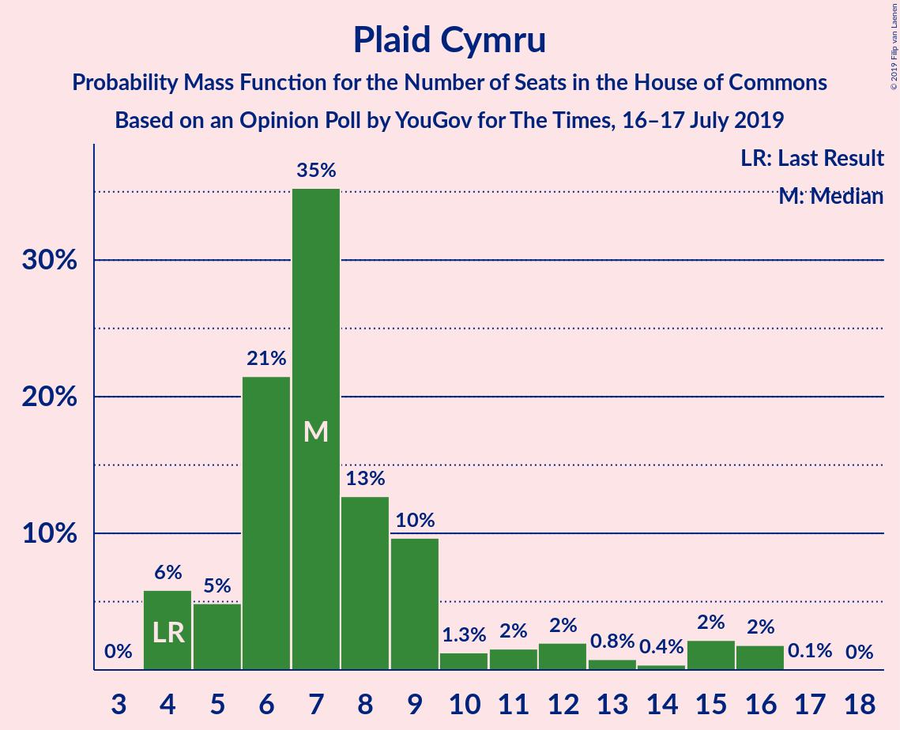

| Number of Seats | Probability | Accumulated | Special Marks |
|:---------------:|:-----------:|:-----------:|:-------------:|
| 4 | 6% | 100% | Last Result |
| 5 | 5% | 94% |  |
| 6 | 21% | 89% |  |
| 7 | 35% | 68% | Median |
| 8 | 13% | 32% |  |
| 9 | 10% | 20% |  |
| 10 | 1.3% | 10% |  |
| 11 | 2% | 9% |  |
| 12 | 2% | 7% |  |
| 13 | 0.8% | 5% |  |
| 14 | 0.4% | 4% |  |
| 15 | 2% | 4% |  |
| 16 | 2% | 2% |  |
| 17 | 0.1% | 0.1% |  |
| 18 | 0% | 0% |  |

### UK Independence Party

*For a full overview of the results for this party, see the [UK Independence Party](party-ukindependenceparty.html) page.*

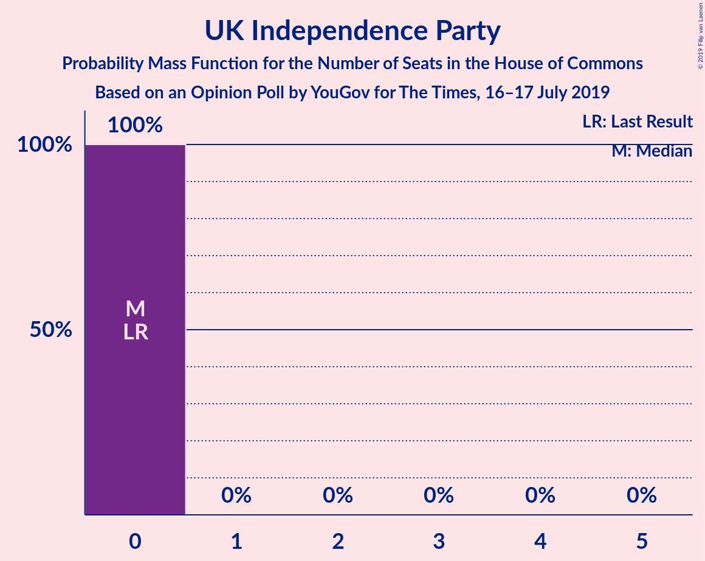

| Number of Seats | Probability | Accumulated | Special Marks |
|:---------------:|:-----------:|:-----------:|:-------------:|
| 0 | 100% | 100% | Last Result, Median |

### Change UK

*For a full overview of the results for this party, see the [Change UK](party-changeuk.html) page.*

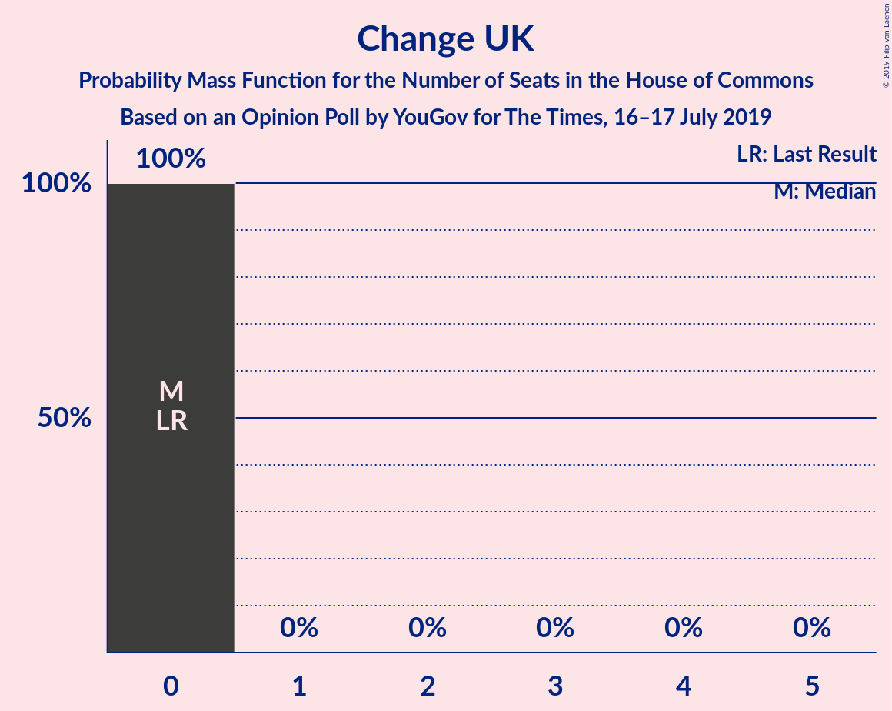

| Number of Seats | Probability | Accumulated | Special Marks |
|:---------------:|:-----------:|:-----------:|:-------------:|
| 0 | 100% | 100% | Last Result, Median |

## Coalitions

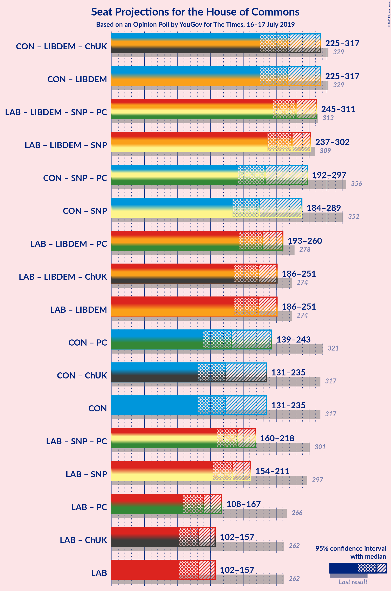

### Confidence Intervals

| Coalition | Last Result | Median | Majority? | 80% Confidence Interval | 90% Confidence Interval | 95% Confidence Interval | 99% Confidence Interval |
|:---------:|:-----------:|:------:|:---------:|:-----------------------:|:-----------------------:|:-----------------------:|:-----------------------:|
| Conservative Party – Liberal Democrats – Change UK | 329 | 267 | 2% | 240–299 | 228–307 | 225–317 | 208–329 |
| Conservative Party – Liberal Democrats | 329 | 267 | 2% | 240–299 | 228–307 | 225–317 | 208–329 |
| Labour Party – Liberal Democrats – Scottish National Party – Plaid Cymru | 313 | 280 | 0.7% | 252–303 | 246–304 | 245–311 | 237–328 |
| Labour Party – Liberal Democrats – Scottish National Party | 309 | 274 | 0.2% | 244–296 | 239–297 | 237–302 | 230–319 |
| Conservative Party – Scottish National Party – Plaid Cymru | 356 | 233 | 0% | 198–274 | 195–286 | 192–297 | 168–307 |
| Conservative Party – Scottish National Party | 352 | 224 | 0% | 192–265 | 189–279 | 184–289 | 160–299 |
| Labour Party – Liberal Democrats – Plaid Cymru | 278 | 229 | 0% | 201–252 | 196–252 | 193–260 | 185–277 |
| Labour Party – Liberal Democrats – Change UK | 274 | 223 | 0% | 194–245 | 189–245 | 186–251 | 178–268 |
| Labour Party – Liberal Democrats | 274 | 223 | 0% | 194–245 | 189–245 | 186–251 | 178–268 |
| Conservative Party – Plaid Cymru | 321 | 182 | 0% | 147–221 | 143–232 | 139–243 | 117–256 |
| Conservative Party – Change UK | 317 | 173 | 0% | 141–211 | 137–225 | 131–235 | 109–247 |
| Conservative Party | 317 | 173 | 0% | 141–211 | 137–225 | 131–235 | 109–247 |
| Labour Party – Scottish National Party – Plaid Cymru | 301 | 191 | 0% | 168–209 | 163–216 | 160–218 | 153–234 |
| Labour Party – Scottish National Party | 297 | 183 | 0% | 160–200 | 156–206 | 154–211 | 147–227 |
| Labour Party – Plaid Cymru | 266 | 139 | 0% | 117–155 | 113–163 | 108–167 | 102–183 |
| Labour Party – Change UK | 262 | 132 | 0% | 109–148 | 106–156 | 102–157 | 96–176 |
| Labour Party | 262 | 132 | 0% | 109–148 | 106–156 | 102–157 | 96–176 |

### Conservative Party – Liberal Democrats – Change UK

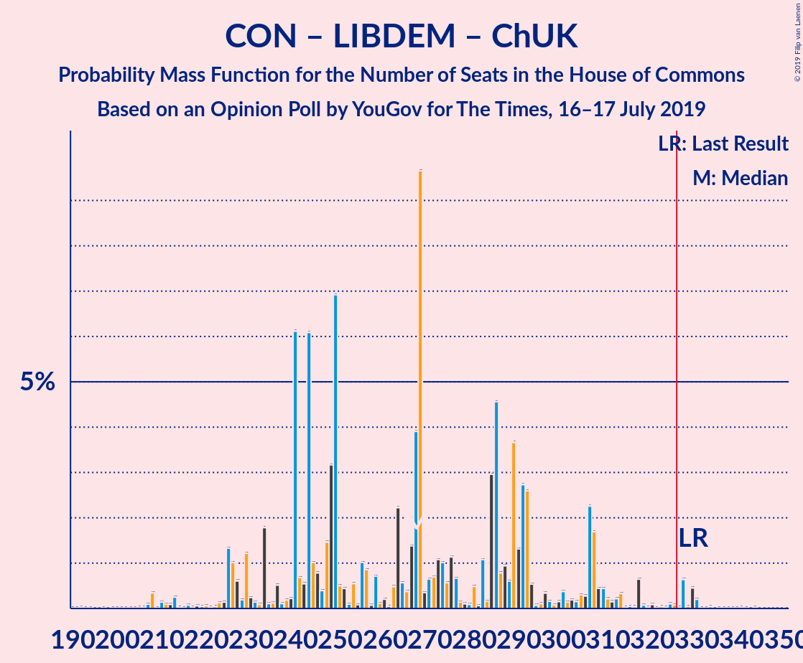

| Number of Seats | Probability | Accumulated | Special Marks |
|:---------------:|:-----------:|:-----------:|:-------------:|
| 192 | 0% | 100% |  |
| 193 | 0% | 99.9% |  |
| 194 | 0% | 99.9% |  |
| 195 | 0% | 99.9% |  |
| 196 | 0% | 99.9% |  |
| 197 | 0% | 99.9% |  |
| 198 | 0% | 99.9% |  |
| 199 | 0% | 99.9% |  |
| 200 | 0% | 99.9% |  |
| 201 | 0% | 99.9% |  |
| 202 | 0% | 99.9% |  |
| 203 | 0% | 99.9% |  |
| 204 | 0% | 99.8% |  |
| 205 | 0% | 99.8% |  |
| 206 | 0% | 99.8% |  |
| 207 | 0.1% | 99.8% |  |
| 208 | 0.3% | 99.7% |  |
| 209 | 0% | 99.3% |  |
| 210 | 0.1% | 99.3% |  |
| 211 | 0.1% | 99.2% |  |
| 212 | 0.1% | 99.1% |  |
| 213 | 0.2% | 99.0% |  |
| 214 | 0% | 98.8% |  |
| 215 | 0% | 98.7% |  |
| 216 | 0.1% | 98.7% |  |
| 217 | 0% | 98.6% |  |
| 218 | 0.1% | 98.6% |  |
| 219 | 0% | 98.6% |  |
| 220 | 0.1% | 98.5% |  |
| 221 | 0% | 98% |  |
| 222 | 0% | 98% |  |
| 223 | 0.1% | 98% |  |
| 224 | 0.1% | 98% |  |
| 225 | 1.3% | 98% |  |
| 226 | 1.0% | 97% |  |
| 227 | 0.6% | 96% |  |
| 228 | 0.2% | 95% |  |
| 229 | 1.2% | 95% |  |
| 230 | 0.2% | 94% |  |
| 231 | 0.1% | 94% |  |
| 232 | 0.1% | 93% |  |
| 233 | 2% | 93% |  |
| 234 | 0.1% | 92% |  |
| 235 | 0.1% | 91% |  |
| 236 | 0.5% | 91% |  |
| 237 | 0.1% | 91% |  |
| 238 | 0.2% | 91% |  |
| 239 | 0.2% | 90% |  |
| 240 | 6% | 90% |  |
| 241 | 0.7% | 84% |  |
| 242 | 0.5% | 83% |  |
| 243 | 6% | 83% |  |
| 244 | 1.0% | 77% |  |
| 245 | 0.8% | 76% |  |
| 246 | 0.4% | 75% |  |
| 247 | 1.5% | 75% |  |
| 248 | 3% | 73% |  |
| 249 | 7% | 70% |  |
| 250 | 0.5% | 63% |  |
| 251 | 0.4% | 63% |  |
| 252 | 0.1% | 62% |  |
| 253 | 0.5% | 62% |  |
| 254 | 0.1% | 61% |  |
| 255 | 1.0% | 61% |  |
| 256 | 0.9% | 60% |  |
| 257 | 0.1% | 60% |  |
| 258 | 0.7% | 59% |  |
| 259 | 0.1% | 59% |  |
| 260 | 0.2% | 59% |  |
| 261 | 0% | 58% |  |
| 262 | 0.5% | 58% | Median |
| 263 | 2% | 58% |  |
| 264 | 0.6% | 56% |  |
| 265 | 0.4% | 55% |  |
| 266 | 1.4% | 55% |  |
| 267 | 4% | 53% |  |
| 268 | 10% | 49% |  |
| 269 | 0.4% | 40% |  |
| 270 | 0.6% | 39% |  |
| 271 | 0.7% | 39% |  |
| 272 | 1.1% | 38% |  |
| 273 | 1.0% | 37% |  |
| 274 | 0.6% | 36% |  |
| 275 | 1.1% | 35% |  |
| 276 | 0.7% | 34% |  |
| 277 | 0.1% | 34% |  |
| 278 | 0.1% | 33% |  |
| 279 | 0.1% | 33% |  |
| 280 | 0.5% | 33% |  |
| 281 | 0.1% | 33% |  |
| 282 | 1.1% | 33% |  |
| 283 | 0.2% | 32% |  |
| 284 | 3% | 32% |  |
| 285 | 5% | 29% |  |
| 286 | 0.8% | 24% |  |
| 287 | 0.9% | 23% |  |
| 288 | 0.6% | 22% |  |
| 289 | 4% | 22% |  |
| 290 | 1.3% | 18% |  |
| 291 | 3% | 17% |  |
| 292 | 3% | 14% |  |
| 293 | 0.5% | 11% |  |
| 294 | 0.1% | 11% |  |
| 295 | 0.1% | 11% |  |
| 296 | 0.3% | 11% |  |
| 297 | 0.2% | 10% |  |
| 298 | 0.1% | 10% |  |
| 299 | 0.2% | 10% |  |
| 300 | 0.4% | 10% |  |
| 301 | 0.1% | 10% |  |
| 302 | 0.2% | 9% |  |
| 303 | 0.2% | 9% |  |
| 304 | 0.3% | 9% |  |
| 305 | 0.3% | 9% |  |
| 306 | 2% | 9% |  |
| 307 | 2% | 6% |  |
| 308 | 0.4% | 5% |  |
| 309 | 0.4% | 4% |  |
| 310 | 0.2% | 4% |  |
| 311 | 0.1% | 3% |  |
| 312 | 0.2% | 3% |  |
| 313 | 0.3% | 3% |  |
| 314 | 0% | 3% |  |
| 315 | 0% | 3% |  |
| 316 | 0% | 3% |  |
| 317 | 0.6% | 3% |  |
| 318 | 0.1% | 2% |  |
| 319 | 0% | 2% |  |
| 320 | 0.1% | 2% |  |
| 321 | 0% | 2% |  |
| 322 | 0% | 2% |  |
| 323 | 0% | 2% |  |
| 324 | 0.1% | 2% |  |
| 325 | 0.1% | 2% |  |
| 326 | 0% | 2% | Majority |
| 327 | 0.6% | 2% |  |
| 328 | 0% | 0.9% |  |
| 329 | 0.5% | 0.8% | Last Result |
| 330 | 0.2% | 0.4% |  |
| 331 | 0% | 0.2% |  |
| 332 | 0% | 0.2% |  |
| 333 | 0% | 0.2% |  |
| 334 | 0% | 0.1% |  |
| 335 | 0% | 0.1% |  |
| 336 | 0% | 0.1% |  |
| 337 | 0% | 0.1% |  |
| 338 | 0% | 0.1% |  |
| 339 | 0% | 0.1% |  |
| 340 | 0% | 0.1% |  |
| 341 | 0% | 0.1% |  |
| 342 | 0% | 0% |  |

### Conservative Party – Liberal Democrats

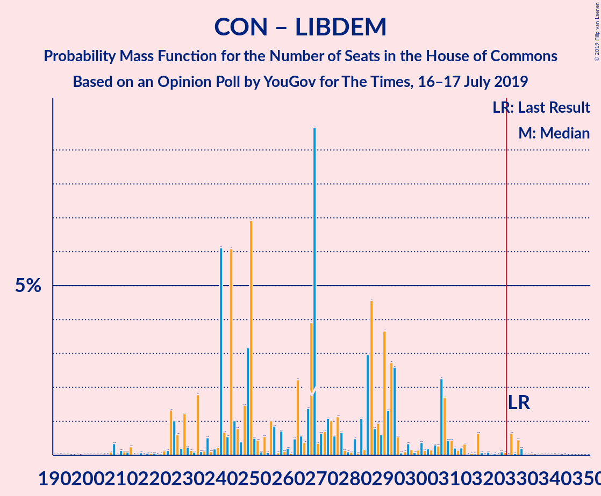

| Number of Seats | Probability | Accumulated | Special Marks |
|:---------------:|:-----------:|:-----------:|:-------------:|
| 192 | 0% | 100% |  |
| 193 | 0% | 99.9% |  |
| 194 | 0% | 99.9% |  |
| 195 | 0% | 99.9% |  |
| 196 | 0% | 99.9% |  |
| 197 | 0% | 99.9% |  |
| 198 | 0% | 99.9% |  |
| 199 | 0% | 99.9% |  |
| 200 | 0% | 99.9% |  |
| 201 | 0% | 99.9% |  |
| 202 | 0% | 99.9% |  |
| 203 | 0% | 99.9% |  |
| 204 | 0% | 99.8% |  |
| 205 | 0% | 99.8% |  |
| 206 | 0% | 99.8% |  |
| 207 | 0.1% | 99.8% |  |
| 208 | 0.3% | 99.7% |  |
| 209 | 0% | 99.3% |  |
| 210 | 0.1% | 99.3% |  |
| 211 | 0.1% | 99.2% |  |
| 212 | 0.1% | 99.1% |  |
| 213 | 0.2% | 99.0% |  |
| 214 | 0% | 98.8% |  |
| 215 | 0% | 98.7% |  |
| 216 | 0.1% | 98.7% |  |
| 217 | 0% | 98.6% |  |
| 218 | 0.1% | 98.6% |  |
| 219 | 0% | 98.6% |  |
| 220 | 0.1% | 98.5% |  |
| 221 | 0% | 98% |  |
| 222 | 0% | 98% |  |
| 223 | 0.1% | 98% |  |
| 224 | 0.1% | 98% |  |
| 225 | 1.3% | 98% |  |
| 226 | 1.0% | 97% |  |
| 227 | 0.6% | 96% |  |
| 228 | 0.2% | 95% |  |
| 229 | 1.2% | 95% |  |
| 230 | 0.2% | 94% |  |
| 231 | 0.1% | 94% |  |
| 232 | 0.1% | 93% |  |
| 233 | 2% | 93% |  |
| 234 | 0.1% | 92% |  |
| 235 | 0.1% | 91% |  |
| 236 | 0.5% | 91% |  |
| 237 | 0.1% | 91% |  |
| 238 | 0.2% | 91% |  |
| 239 | 0.2% | 90% |  |
| 240 | 6% | 90% |  |
| 241 | 0.7% | 84% |  |
| 242 | 0.5% | 83% |  |
| 243 | 6% | 83% |  |
| 244 | 1.0% | 77% |  |
| 245 | 0.8% | 76% |  |
| 246 | 0.4% | 75% |  |
| 247 | 1.5% | 75% |  |
| 248 | 3% | 73% |  |
| 249 | 7% | 70% |  |
| 250 | 0.5% | 63% |  |
| 251 | 0.4% | 63% |  |
| 252 | 0.1% | 62% |  |
| 253 | 0.5% | 62% |  |
| 254 | 0.1% | 61% |  |
| 255 | 1.0% | 61% |  |
| 256 | 0.9% | 60% |  |
| 257 | 0.1% | 60% |  |
| 258 | 0.7% | 59% |  |
| 259 | 0.1% | 59% |  |
| 260 | 0.2% | 59% |  |
| 261 | 0% | 58% |  |
| 262 | 0.5% | 58% | Median |
| 263 | 2% | 58% |  |
| 264 | 0.6% | 56% |  |
| 265 | 0.4% | 55% |  |
| 266 | 1.4% | 55% |  |
| 267 | 4% | 53% |  |
| 268 | 10% | 49% |  |
| 269 | 0.4% | 40% |  |
| 270 | 0.6% | 39% |  |
| 271 | 0.7% | 39% |  |
| 272 | 1.1% | 38% |  |
| 273 | 1.0% | 37% |  |
| 274 | 0.6% | 36% |  |
| 275 | 1.1% | 35% |  |
| 276 | 0.7% | 34% |  |
| 277 | 0.1% | 34% |  |
| 278 | 0.1% | 33% |  |
| 279 | 0.1% | 33% |  |
| 280 | 0.5% | 33% |  |
| 281 | 0.1% | 33% |  |
| 282 | 1.1% | 33% |  |
| 283 | 0.2% | 32% |  |
| 284 | 3% | 32% |  |
| 285 | 5% | 29% |  |
| 286 | 0.8% | 24% |  |
| 287 | 0.9% | 23% |  |
| 288 | 0.6% | 22% |  |
| 289 | 4% | 22% |  |
| 290 | 1.3% | 18% |  |
| 291 | 3% | 17% |  |
| 292 | 3% | 14% |  |
| 293 | 0.5% | 11% |  |
| 294 | 0.1% | 11% |  |
| 295 | 0.1% | 11% |  |
| 296 | 0.3% | 11% |  |
| 297 | 0.2% | 10% |  |
| 298 | 0.1% | 10% |  |
| 299 | 0.2% | 10% |  |
| 300 | 0.4% | 10% |  |
| 301 | 0.1% | 10% |  |
| 302 | 0.2% | 9% |  |
| 303 | 0.2% | 9% |  |
| 304 | 0.3% | 9% |  |
| 305 | 0.3% | 9% |  |
| 306 | 2% | 9% |  |
| 307 | 2% | 6% |  |
| 308 | 0.4% | 5% |  |
| 309 | 0.4% | 4% |  |
| 310 | 0.2% | 4% |  |
| 311 | 0.1% | 3% |  |
| 312 | 0.2% | 3% |  |
| 313 | 0.3% | 3% |  |
| 314 | 0% | 3% |  |
| 315 | 0% | 3% |  |
| 316 | 0% | 3% |  |
| 317 | 0.6% | 3% |  |
| 318 | 0.1% | 2% |  |
| 319 | 0% | 2% |  |
| 320 | 0.1% | 2% |  |
| 321 | 0% | 2% |  |
| 322 | 0% | 2% |  |
| 323 | 0% | 2% |  |
| 324 | 0.1% | 2% |  |
| 325 | 0.1% | 2% |  |
| 326 | 0% | 2% | Majority |
| 327 | 0.6% | 2% |  |
| 328 | 0% | 0.9% |  |
| 329 | 0.5% | 0.8% | Last Result |
| 330 | 0.2% | 0.4% |  |
| 331 | 0% | 0.2% |  |
| 332 | 0% | 0.2% |  |
| 333 | 0% | 0.2% |  |
| 334 | 0% | 0.1% |  |
| 335 | 0% | 0.1% |  |
| 336 | 0% | 0.1% |  |
| 337 | 0% | 0.1% |  |
| 338 | 0% | 0.1% |  |
| 339 | 0% | 0.1% |  |
| 340 | 0% | 0.1% |  |
| 341 | 0% | 0.1% |  |
| 342 | 0% | 0% |  |

### Labour Party – Liberal Democrats – Scottish National Party – Plaid Cymru

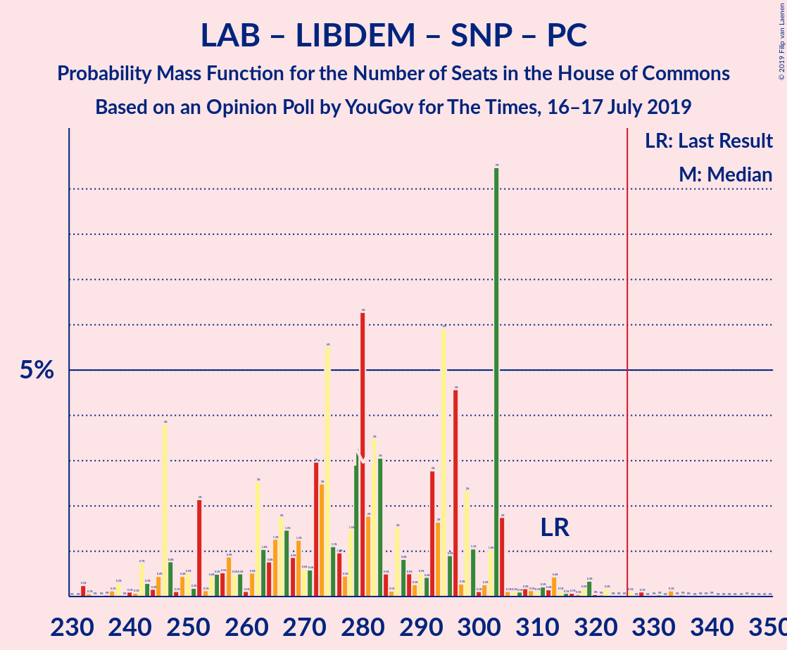

| Number of Seats | Probability | Accumulated | Special Marks |
|:---------------:|:-----------:|:-----------:|:-------------:|
| 230 | 0% | 100% |  |
| 231 | 0% | 99.9% |  |
| 232 | 0.2% | 99.9% |  |
| 233 | 0.1% | 99.7% |  |
| 234 | 0% | 99.6% |  |
| 235 | 0% | 99.6% |  |
| 236 | 0% | 99.6% |  |
| 237 | 0.1% | 99.6% |  |
| 238 | 0.3% | 99.4% |  |
| 239 | 0% | 99.1% |  |
| 240 | 0.1% | 99.1% |  |
| 241 | 0.1% | 99.0% |  |
| 242 | 0.7% | 98.9% |  |
| 243 | 0.3% | 98% |  |
| 244 | 0.2% | 98% |  |
| 245 | 0.4% | 98% |  |
| 246 | 4% | 97% |  |
| 247 | 0.8% | 93% |  |
| 248 | 0.1% | 93% |  |
| 249 | 0.4% | 93% |  |
| 250 | 0.5% | 92% |  |
| 251 | 0.2% | 92% |  |
| 252 | 2% | 91% |  |
| 253 | 0.1% | 89% |  |
| 254 | 0.4% | 89% |  |
| 255 | 0.5% | 89% |  |
| 256 | 0.5% | 88% |  |
| 257 | 0.9% | 88% |  |
| 258 | 0.5% | 87% |  |
| 259 | 0.5% | 86% |  |
| 260 | 0.1% | 86% |  |
| 261 | 0.5% | 86% |  |
| 262 | 3% | 85% |  |
| 263 | 1.0% | 83% |  |
| 264 | 0.8% | 82% |  |
| 265 | 1.3% | 81% |  |
| 266 | 2% | 80% |  |
| 267 | 1.5% | 78% |  |
| 268 | 0.9% | 76% |  |
| 269 | 1.2% | 75% |  |
| 270 | 0.6% | 74% |  |
| 271 | 0.6% | 74% |  |
| 272 | 3% | 73% |  |
| 273 | 2% | 70% |  |
| 274 | 6% | 68% |  |
| 275 | 1.1% | 62% |  |
| 276 | 1.0% | 61% |  |
| 277 | 0.5% | 60% |  |
| 278 | 1.5% | 60% |  |
| 279 | 3% | 58% | Median |
| 280 | 6% | 55% |  |
| 281 | 2% | 49% |  |
| 282 | 3% | 47% |  |
| 283 | 3% | 43% |  |
| 284 | 0.5% | 40% |  |
| 285 | 0.1% | 40% |  |
| 286 | 2% | 40% |  |
| 287 | 0.8% | 38% |  |
| 288 | 0.5% | 37% |  |
| 289 | 0.3% | 37% |  |
| 290 | 0.5% | 36% |  |
| 291 | 0.4% | 36% |  |
| 292 | 3% | 36% |  |
| 293 | 2% | 33% |  |
| 294 | 6% | 31% |  |
| 295 | 0.9% | 25% |  |
| 296 | 5% | 24% |  |
| 297 | 0.3% | 20% |  |
| 298 | 2% | 19% |  |
| 299 | 1.1% | 17% |  |
| 300 | 0.1% | 16% |  |
| 301 | 0.3% | 16% |  |
| 302 | 1.0% | 16% |  |
| 303 | 9% | 15% |  |
| 304 | 2% | 5% |  |
| 305 | 0.1% | 3% |  |
| 306 | 0.1% | 3% |  |
| 307 | 0.1% | 3% |  |
| 308 | 0.2% | 3% |  |
| 309 | 0.1% | 3% |  |
| 310 | 0.1% | 3% |  |
| 311 | 0.2% | 3% |  |
| 312 | 0.2% | 2% |  |
| 313 | 0.4% | 2% | Last Result |
| 314 | 0.1% | 2% |  |
| 315 | 0.1% | 2% |  |
| 316 | 0.1% | 2% |  |
| 317 | 0.1% | 2% |  |
| 318 | 0.2% | 2% |  |
| 319 | 0.3% | 1.3% |  |
| 320 | 0% | 1.0% |  |
| 321 | 0% | 0.9% |  |
| 322 | 0.2% | 0.9% |  |
| 323 | 0% | 0.7% |  |
| 324 | 0% | 0.7% |  |
| 325 | 0% | 0.7% |  |
| 326 | 0.1% | 0.7% | Majority |
| 327 | 0% | 0.5% |  |
| 328 | 0.1% | 0.5% |  |
| 329 | 0% | 0.4% |  |
| 330 | 0% | 0.4% |  |
| 331 | 0% | 0.4% |  |
| 332 | 0% | 0.4% |  |
| 333 | 0.1% | 0.3% |  |
| 334 | 0% | 0.2% |  |
| 335 | 0% | 0.2% |  |
| 336 | 0% | 0.2% |  |
| 337 | 0% | 0.1% |  |
| 338 | 0% | 0.1% |  |
| 339 | 0% | 0.1% |  |
| 340 | 0% | 0.1% |  |
| 341 | 0% | 0.1% |  |
| 342 | 0% | 0.1% |  |
| 343 | 0% | 0.1% |  |
| 344 | 0% | 0.1% |  |
| 345 | 0% | 0% |  |

### Labour Party – Liberal Democrats – Scottish National Party

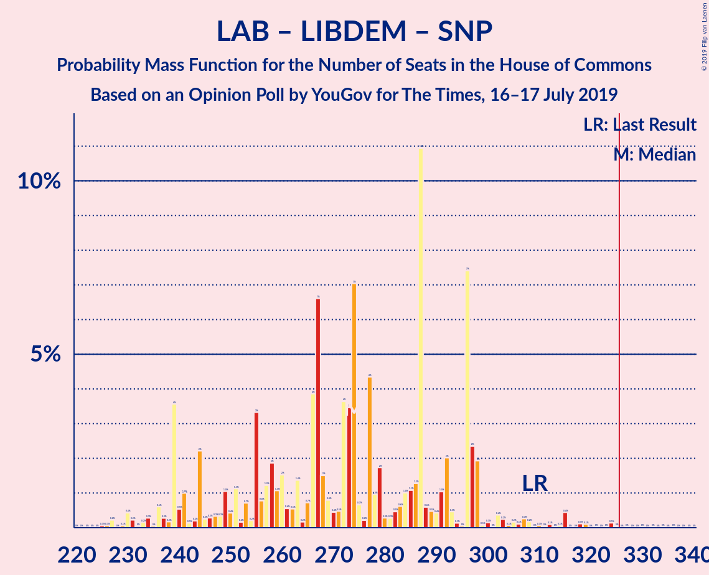

| Number of Seats | Probability | Accumulated | Special Marks |
|:---------------:|:-----------:|:-----------:|:-------------:|
| 223 | 0% | 100% |  |
| 224 | 0% | 99.9% |  |
| 225 | 0.1% | 99.9% |  |
| 226 | 0.1% | 99.9% |  |
| 227 | 0.2% | 99.8% |  |
| 228 | 0% | 99.6% |  |
| 229 | 0.1% | 99.6% |  |
| 230 | 0.4% | 99.5% |  |
| 231 | 0.2% | 99.1% |  |
| 232 | 0% | 98.9% |  |
| 233 | 0.2% | 98.8% |  |
| 234 | 0.3% | 98.7% |  |
| 235 | 0% | 98% |  |
| 236 | 0.6% | 98% |  |
| 237 | 0.3% | 98% |  |
| 238 | 0.2% | 97% |  |
| 239 | 4% | 97% |  |
| 240 | 0.5% | 94% |  |
| 241 | 1.0% | 93% |  |
| 242 | 0.1% | 92% |  |
| 243 | 0.2% | 92% |  |
| 244 | 2% | 92% |  |
| 245 | 0.3% | 90% |  |
| 246 | 0.3% | 89% |  |
| 247 | 0.3% | 89% |  |
| 248 | 0.3% | 89% |  |
| 249 | 1.0% | 88% |  |
| 250 | 0.4% | 87% |  |
| 251 | 1.1% | 87% |  |
| 252 | 0.2% | 86% |  |
| 253 | 0.7% | 86% |  |
| 254 | 0.2% | 85% |  |
| 255 | 3% | 85% |  |
| 256 | 0.8% | 81% |  |
| 257 | 1.2% | 81% |  |
| 258 | 2% | 79% |  |
| 259 | 1.1% | 78% |  |
| 260 | 2% | 77% |  |
| 261 | 0.6% | 75% |  |
| 262 | 0.5% | 74% |  |
| 263 | 1.4% | 74% |  |
| 264 | 0.2% | 73% |  |
| 265 | 0.7% | 72% |  |
| 266 | 4% | 72% |  |
| 267 | 7% | 68% |  |
| 268 | 2% | 61% |  |
| 269 | 0.8% | 60% |  |
| 270 | 0.4% | 59% |  |
| 271 | 0.5% | 58% |  |
| 272 | 4% | 58% | Median |
| 273 | 3% | 54% |  |
| 274 | 7% | 51% |  |
| 275 | 0.7% | 44% |  |
| 276 | 0.2% | 43% |  |
| 277 | 4% | 43% |  |
| 278 | 1.0% | 39% |  |
| 279 | 2% | 38% |  |
| 280 | 0.3% | 36% |  |
| 281 | 0.3% | 36% |  |
| 282 | 0.5% | 35% |  |
| 283 | 0.6% | 35% |  |
| 284 | 1.0% | 34% |  |
| 285 | 1.1% | 33% |  |
| 286 | 1.3% | 32% |  |
| 287 | 11% | 31% |  |
| 288 | 0.6% | 20% |  |
| 289 | 0.5% | 19% |  |
| 290 | 0.4% | 19% |  |
| 291 | 1.0% | 18% |  |
| 292 | 2% | 17% |  |
| 293 | 0.5% | 15% |  |
| 294 | 0.1% | 15% |  |
| 295 | 0% | 15% |  |
| 296 | 7% | 15% |  |
| 297 | 2% | 7% |  |
| 298 | 2% | 5% |  |
| 299 | 0.1% | 3% |  |
| 300 | 0.1% | 3% |  |
| 301 | 0% | 3% |  |
| 302 | 0.4% | 3% |  |
| 303 | 0.2% | 2% |  |
| 304 | 0.1% | 2% |  |
| 305 | 0.2% | 2% |  |
| 306 | 0.1% | 2% |  |
| 307 | 0.3% | 2% |  |
| 308 | 0.2% | 2% |  |
| 309 | 0% | 1.4% | Last Result |
| 310 | 0.1% | 1.4% |  |
| 311 | 0% | 1.3% |  |
| 312 | 0.1% | 1.3% |  |
| 313 | 0% | 1.2% |  |
| 314 | 0.1% | 1.2% |  |
| 315 | 0.4% | 1.1% |  |
| 316 | 0% | 0.7% |  |
| 317 | 0% | 0.7% |  |
| 318 | 0.1% | 0.7% |  |
| 319 | 0.1% | 0.5% |  |
| 320 | 0% | 0.4% |  |
| 321 | 0% | 0.4% |  |
| 322 | 0% | 0.4% |  |
| 323 | 0% | 0.4% |  |
| 324 | 0.1% | 0.4% |  |
| 325 | 0% | 0.2% |  |
| 326 | 0% | 0.2% | Majority |
| 327 | 0% | 0.2% |  |
| 328 | 0% | 0.2% |  |
| 329 | 0% | 0.2% |  |
| 330 | 0% | 0.1% |  |
| 331 | 0% | 0.1% |  |
| 332 | 0% | 0.1% |  |
| 333 | 0% | 0.1% |  |
| 334 | 0% | 0.1% |  |
| 335 | 0% | 0.1% |  |
| 336 | 0% | 0.1% |  |
| 337 | 0% | 0% |  |

### Conservative Party – Scottish National Party – Plaid Cymru

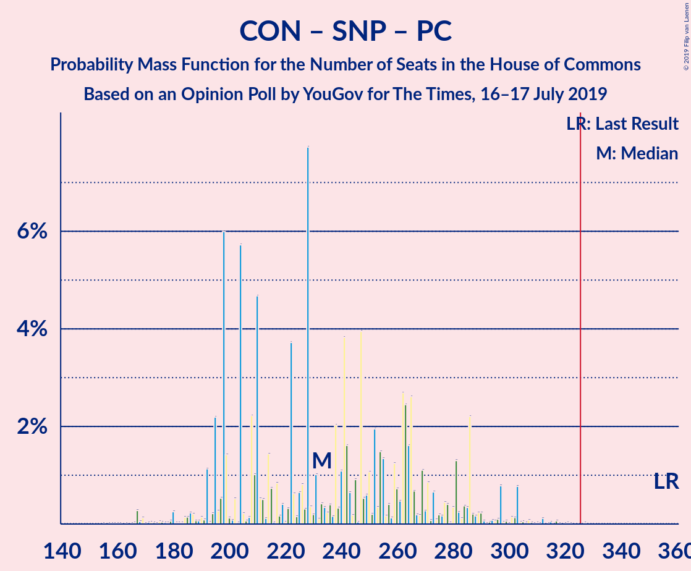

| Number of Seats | Probability | Accumulated | Special Marks |
|:---------------:|:-----------:|:-----------:|:-------------:|
| 155 | 0% | 100% |  |
| 156 | 0% | 99.9% |  |
| 157 | 0% | 99.9% |  |
| 158 | 0% | 99.9% |  |
| 159 | 0% | 99.9% |  |
| 160 | 0% | 99.9% |  |
| 161 | 0% | 99.9% |  |
| 162 | 0% | 99.9% |  |
| 163 | 0% | 99.9% |  |
| 164 | 0% | 99.9% |  |
| 165 | 0% | 99.9% |  |
| 166 | 0% | 99.8% |  |
| 167 | 0.3% | 99.8% |  |
| 168 | 0.1% | 99.5% |  |
| 169 | 0.1% | 99.5% |  |
| 170 | 0% | 99.4% |  |
| 171 | 0% | 99.3% |  |
| 172 | 0% | 99.3% |  |
| 173 | 0% | 99.3% |  |
| 174 | 0% | 99.2% |  |
| 175 | 0% | 99.2% |  |
| 176 | 0% | 99.2% |  |
| 177 | 0% | 99.1% |  |
| 178 | 0% | 99.1% |  |
| 179 | 0.1% | 99.1% |  |
| 180 | 0.3% | 99.0% |  |
| 181 | 0% | 98.8% |  |
| 182 | 0% | 98.7% |  |
| 183 | 0% | 98.7% |  |
| 184 | 0.1% | 98.7% |  |
| 185 | 0.1% | 98.6% |  |
| 186 | 0.2% | 98% |  |
| 187 | 0.2% | 98% |  |
| 188 | 0.1% | 98% |  |
| 189 | 0.1% | 98% |  |
| 190 | 0.1% | 98% |  |
| 191 | 0.1% | 98% |  |
| 192 | 1.1% | 98% |  |
| 193 | 0% | 96% |  |
| 194 | 0.2% | 96% |  |
| 195 | 2% | 96% |  |
| 196 | 0.3% | 94% |  |
| 197 | 0.5% | 94% |  |
| 198 | 6% | 93% |  |
| 199 | 1.4% | 87% |  |
| 200 | 0.1% | 86% |  |
| 201 | 0.1% | 86% |  |
| 202 | 0.5% | 86% |  |
| 203 | 0% | 85% |  |
| 204 | 6% | 85% |  |
| 205 | 0.2% | 79% |  |
| 206 | 0.1% | 79% |  |
| 207 | 0.1% | 79% |  |
| 208 | 2% | 79% |  |
| 209 | 1.0% | 77% |  |
| 210 | 5% | 76% |  |
| 211 | 0.5% | 71% |  |
| 212 | 0.5% | 71% |  |
| 213 | 0.1% | 70% |  |
| 214 | 1.4% | 70% |  |
| 215 | 0.7% | 68% |  |
| 216 | 0% | 68% |  |
| 217 | 0.8% | 68% |  |
| 218 | 0.2% | 67% |  |
| 219 | 0.4% | 67% |  |
| 220 | 0% | 66% |  |
| 221 | 0.3% | 66% |  |
| 222 | 4% | 66% |  |
| 223 | 0.6% | 62% |  |
| 224 | 0.2% | 62% |  |
| 225 | 0.7% | 61% |  |
| 226 | 0.8% | 61% |  |
| 227 | 0.3% | 60% |  |
| 228 | 8% | 60% |  |
| 229 | 0.4% | 52% |  |
| 230 | 0.2% | 52% |  |
| 231 | 1.0% | 51% | Median |
| 232 | 0.1% | 50% |  |
| 233 | 0.4% | 50% |  |
| 234 | 0.3% | 50% |  |
| 235 | 0.2% | 49% |  |
| 236 | 0.4% | 49% |  |
| 237 | 0.2% | 49% |  |
| 238 | 2% | 49% |  |
| 239 | 0.3% | 47% |  |
| 240 | 1.1% | 46% |  |
| 241 | 4% | 45% |  |
| 242 | 2% | 41% |  |
| 243 | 0.6% | 40% |  |
| 244 | 0.2% | 39% |  |
| 245 | 0.9% | 39% |  |
| 246 | 0% | 38% |  |
| 247 | 4% | 38% |  |
| 248 | 0.5% | 34% |  |
| 249 | 0.6% | 34% |  |
| 250 | 1.1% | 33% |  |
| 251 | 0.2% | 32% |  |
| 252 | 2% | 32% |  |
| 253 | 0.3% | 30% |  |
| 254 | 1.5% | 29% |  |
| 255 | 1.3% | 28% |  |
| 256 | 0.2% | 27% |  |
| 257 | 0.4% | 26% |  |
| 258 | 0.1% | 26% |  |
| 259 | 1.2% | 26% |  |
| 260 | 0.7% | 25% |  |
| 261 | 0.5% | 24% |  |
| 262 | 3% | 23% |  |
| 263 | 2% | 21% |  |
| 264 | 2% | 18% |  |
| 265 | 3% | 17% |  |
| 266 | 0.7% | 14% |  |
| 267 | 0.2% | 13% |  |
| 268 | 0.2% | 13% |  |
| 269 | 1.1% | 13% |  |
| 270 | 0.3% | 12% |  |
| 271 | 0.9% | 12% |  |
| 272 | 0.1% | 11% |  |
| 273 | 0.7% | 11% |  |
| 274 | 0.1% | 10% |  |
| 275 | 0.2% | 10% |  |
| 276 | 0.2% | 10% |  |
| 277 | 0.4% | 10% |  |
| 278 | 0.4% | 9% |  |
| 279 | 0% | 9% |  |
| 280 | 0.3% | 9% |  |
| 281 | 1.3% | 8% |  |
| 282 | 0.2% | 7% |  |
| 283 | 0.1% | 7% |  |
| 284 | 0.4% | 7% |  |
| 285 | 0.3% | 6% |  |
| 286 | 2% | 6% |  |
| 287 | 0.2% | 4% |  |
| 288 | 0.2% | 4% |  |
| 289 | 0.2% | 3% |  |
| 290 | 0.2% | 3% |  |
| 291 | 0.1% | 3% |  |
| 292 | 0% | 3% |  |
| 293 | 0% | 3% |  |
| 294 | 0.1% | 3% |  |
| 295 | 0.1% | 3% |  |
| 296 | 0.1% | 3% |  |
| 297 | 0.8% | 3% |  |
| 298 | 0% | 2% |  |
| 299 | 0.1% | 2% |  |
| 300 | 0% | 2% |  |
| 301 | 0.1% | 2% |  |
| 302 | 0.1% | 2% |  |
| 303 | 0.8% | 1.4% |  |
| 304 | 0% | 0.7% |  |
| 305 | 0% | 0.6% |  |
| 306 | 0% | 0.6% |  |
| 307 | 0.1% | 0.5% |  |
| 308 | 0% | 0.5% |  |
| 309 | 0% | 0.4% |  |
| 310 | 0% | 0.4% |  |
| 311 | 0% | 0.4% |  |
| 312 | 0.1% | 0.4% |  |
| 313 | 0% | 0.3% |  |
| 314 | 0% | 0.3% |  |
| 315 | 0% | 0.2% |  |
| 316 | 0% | 0.2% |  |
| 317 | 0.1% | 0.2% |  |
| 318 | 0% | 0.1% |  |
| 319 | 0% | 0.1% |  |
| 320 | 0% | 0.1% |  |
| 321 | 0% | 0.1% |  |
| 322 | 0% | 0.1% |  |
| 323 | 0% | 0.1% |  |
| 324 | 0% | 0% |  |
| 325 | 0% | 0% |  |
| 326 | 0% | 0% | Majority |
| 327 | 0% | 0% |  |
| 328 | 0% | 0% |  |
| 329 | 0% | 0% |  |
| 330 | 0% | 0% |  |
| 331 | 0% | 0% |  |
| 332 | 0% | 0% |  |
| 333 | 0% | 0% |  |
| 334 | 0% | 0% |  |
| 335 | 0% | 0% |  |
| 336 | 0% | 0% |  |
| 337 | 0% | 0% |  |
| 338 | 0% | 0% |  |
| 339 | 0% | 0% |  |
| 340 | 0% | 0% |  |
| 341 | 0% | 0% |  |
| 342 | 0% | 0% |  |
| 343 | 0% | 0% |  |
| 344 | 0% | 0% |  |
| 345 | 0% | 0% |  |
| 346 | 0% | 0% |  |
| 347 | 0% | 0% |  |
| 348 | 0% | 0% |  |
| 349 | 0% | 0% |  |
| 350 | 0% | 0% |  |
| 351 | 0% | 0% |  |
| 352 | 0% | 0% |  |
| 353 | 0% | 0% |  |
| 354 | 0% | 0% |  |
| 355 | 0% | 0% |  |
| 356 | 0% | 0% | Last Result |

### Conservative Party – Scottish National Party

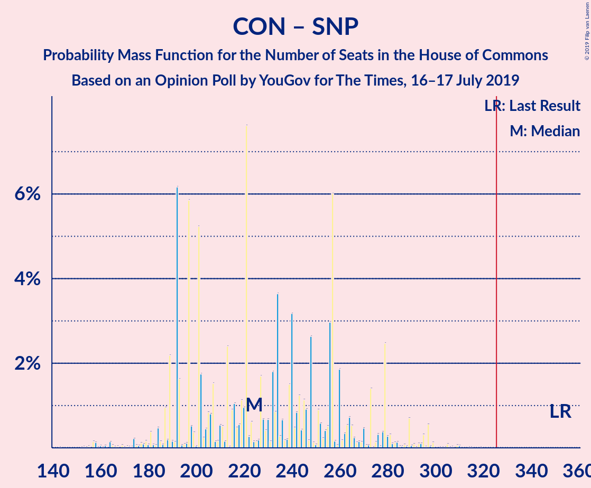

| Number of Seats | Probability | Accumulated | Special Marks |
|:---------------:|:-----------:|:-----------:|:-------------:|
| 145 | 0% | 100% |  |
| 146 | 0% | 99.9% |  |
| 147 | 0% | 99.9% |  |
| 148 | 0% | 99.9% |  |
| 149 | 0% | 99.9% |  |
| 150 | 0% | 99.9% |  |
| 151 | 0% | 99.9% |  |
| 152 | 0% | 99.9% |  |
| 153 | 0% | 99.9% |  |
| 154 | 0% | 99.9% |  |
| 155 | 0% | 99.9% |  |
| 156 | 0% | 99.8% |  |
| 157 | 0.1% | 99.8% |  |
| 158 | 0.1% | 99.7% |  |
| 159 | 0% | 99.6% |  |
| 160 | 0% | 99.5% |  |
| 161 | 0% | 99.5% |  |
| 162 | 0.1% | 99.5% |  |
| 163 | 0% | 99.4% |  |
| 164 | 0.1% | 99.4% |  |
| 165 | 0.1% | 99.3% |  |
| 166 | 0% | 99.2% |  |
| 167 | 0% | 99.2% |  |
| 168 | 0% | 99.2% |  |
| 169 | 0.1% | 99.1% |  |
| 170 | 0% | 99.1% |  |
| 171 | 0% | 99.1% |  |
| 172 | 0% | 99.0% |  |
| 173 | 0% | 99.0% |  |
| 174 | 0.2% | 99.0% |  |
| 175 | 0.1% | 98.8% |  |
| 176 | 0.1% | 98.7% |  |
| 177 | 0.1% | 98.6% |  |
| 178 | 0.1% | 98.5% |  |
| 179 | 0.2% | 98% |  |
| 180 | 0.1% | 98% |  |
| 181 | 0.4% | 98% |  |
| 182 | 0.1% | 98% |  |
| 183 | 0.1% | 98% |  |
| 184 | 0.5% | 98% |  |
| 185 | 0.2% | 97% |  |
| 186 | 0.1% | 97% |  |
| 187 | 1.0% | 97% |  |
| 188 | 0.2% | 96% |  |
| 189 | 2% | 96% |  |
| 190 | 0.2% | 94% |  |
| 191 | 0.1% | 93% |  |
| 192 | 6% | 93% |  |
| 193 | 2% | 87% |  |
| 194 | 0.1% | 86% |  |
| 195 | 0.1% | 85% |  |
| 196 | 0.1% | 85% |  |
| 197 | 6% | 85% |  |
| 198 | 0.5% | 79% |  |
| 199 | 0.4% | 79% |  |
| 200 | 0% | 79% |  |
| 201 | 5% | 78% |  |
| 202 | 2% | 73% |  |
| 203 | 0.2% | 72% |  |
| 204 | 0.4% | 71% |  |
| 205 | 0.8% | 71% |  |
| 206 | 0.8% | 70% |  |
| 207 | 2% | 69% |  |
| 208 | 0.2% | 68% |  |
| 209 | 0.2% | 67% |  |
| 210 | 0.5% | 67% |  |
| 211 | 0.5% | 67% |  |
| 212 | 0.2% | 66% |  |
| 213 | 2% | 66% |  |
| 214 | 0% | 64% |  |
| 215 | 0.9% | 64% |  |
| 216 | 1.0% | 63% |  |
| 217 | 0.5% | 62% |  |
| 218 | 0.6% | 61% |  |
| 219 | 1.1% | 61% |  |
| 220 | 1.0% | 60% |  |
| 221 | 8% | 59% |  |
| 222 | 0.3% | 51% |  |
| 223 | 0.6% | 51% |  |
| 224 | 0.1% | 50% | Median |
| 225 | 0.2% | 50% |  |
| 226 | 0.2% | 50% |  |
| 227 | 2% | 50% |  |
| 228 | 0.7% | 48% |  |
| 229 | 0.4% | 47% |  |
| 230 | 0.7% | 47% |  |
| 231 | 0.1% | 46% |  |
| 232 | 2% | 46% |  |
| 233 | 0.9% | 44% |  |
| 234 | 4% | 43% |  |
| 235 | 0.3% | 40% |  |
| 236 | 0.7% | 39% |  |
| 237 | 0.2% | 39% |  |
| 238 | 0.2% | 39% |  |
| 239 | 2% | 38% |  |
| 240 | 3% | 37% |  |
| 241 | 0.5% | 34% |  |
| 242 | 0.8% | 33% |  |
| 243 | 1.2% | 32% |  |
| 244 | 0.4% | 31% |  |
| 245 | 1.1% | 31% |  |
| 246 | 0.9% | 30% |  |
| 247 | 0.2% | 29% |  |
| 248 | 3% | 29% |  |
| 249 | 0.1% | 26% |  |
| 250 | 0.1% | 26% |  |
| 251 | 0.9% | 26% |  |
| 252 | 0.6% | 25% |  |
| 253 | 0.2% | 24% |  |
| 254 | 0.4% | 24% |  |
| 255 | 0.5% | 24% |  |
| 256 | 3% | 23% |  |
| 257 | 6% | 20% |  |
| 258 | 0.2% | 14% |  |
| 259 | 0.1% | 14% |  |
| 260 | 2% | 14% |  |
| 261 | 0.2% | 12% |  |
| 262 | 0.3% | 12% |  |
| 263 | 0.5% | 11% |  |
| 264 | 0.7% | 11% |  |
| 265 | 0.5% | 10% |  |
| 266 | 0.2% | 10% |  |
| 267 | 0.1% | 9% |  |
| 268 | 0.2% | 9% |  |
| 269 | 0.1% | 9% |  |
| 270 | 0.5% | 9% |  |
| 271 | 0.1% | 9% |  |
| 272 | 0.1% | 8% |  |
| 273 | 1.4% | 8% |  |
| 274 | 0% | 7% |  |
| 275 | 0.1% | 7% |  |
| 276 | 0.3% | 7% |  |
| 277 | 0% | 7% |  |
| 278 | 0.4% | 6% |  |
| 279 | 2% | 6% |  |
| 280 | 0.3% | 4% |  |
| 281 | 0.3% | 3% |  |
| 282 | 0.1% | 3% |  |
| 283 | 0.1% | 3% |  |
| 284 | 0.1% | 3% |  |
| 285 | 0% | 3% |  |
| 286 | 0% | 3% |  |
| 287 | 0.1% | 3% |  |
| 288 | 0% | 3% |  |
| 289 | 0.7% | 3% |  |
| 290 | 0.1% | 2% |  |
| 291 | 0.1% | 2% |  |
| 292 | 0% | 2% |  |
| 293 | 0.1% | 2% |  |
| 294 | 0.1% | 2% |  |
| 295 | 0.3% | 1.4% |  |
| 296 | 0% | 1.1% |  |
| 297 | 0.6% | 1.1% |  |
| 298 | 0% | 0.5% |  |
| 299 | 0.1% | 0.5% |  |
| 300 | 0% | 0.4% |  |
| 301 | 0% | 0.4% |  |
| 302 | 0% | 0.4% |  |
| 303 | 0% | 0.4% |  |
| 304 | 0% | 0.3% |  |
| 305 | 0.1% | 0.3% |  |
| 306 | 0% | 0.2% |  |
| 307 | 0% | 0.2% |  |
| 308 | 0% | 0.2% |  |
| 309 | 0.1% | 0.2% |  |
| 310 | 0% | 0.1% |  |
| 311 | 0% | 0.1% |  |
| 312 | 0% | 0.1% |  |
| 313 | 0% | 0.1% |  |
| 314 | 0% | 0.1% |  |
| 315 | 0% | 0.1% |  |
| 316 | 0% | 0% |  |
| 317 | 0% | 0% |  |
| 318 | 0% | 0% |  |
| 319 | 0% | 0% |  |
| 320 | 0% | 0% |  |
| 321 | 0% | 0% |  |
| 322 | 0% | 0% |  |
| 323 | 0% | 0% |  |
| 324 | 0% | 0% |  |
| 325 | 0% | 0% |  |
| 326 | 0% | 0% | Majority |
| 327 | 0% | 0% |  |
| 328 | 0% | 0% |  |
| 329 | 0% | 0% |  |
| 330 | 0% | 0% |  |
| 331 | 0% | 0% |  |
| 332 | 0% | 0% |  |
| 333 | 0% | 0% |  |
| 334 | 0% | 0% |  |
| 335 | 0% | 0% |  |
| 336 | 0% | 0% |  |
| 337 | 0% | 0% |  |
| 338 | 0% | 0% |  |
| 339 | 0% | 0% |  |
| 340 | 0% | 0% |  |
| 341 | 0% | 0% |  |
| 342 | 0% | 0% |  |
| 343 | 0% | 0% |  |
| 344 | 0% | 0% |  |
| 345 | 0% | 0% |  |
| 346 | 0% | 0% |  |
| 347 | 0% | 0% |  |
| 348 | 0% | 0% |  |
| 349 | 0% | 0% |  |
| 350 | 0% | 0% |  |
| 351 | 0% | 0% |  |
| 352 | 0% | 0% | Last Result |

### Labour Party – Liberal Democrats – Plaid Cymru

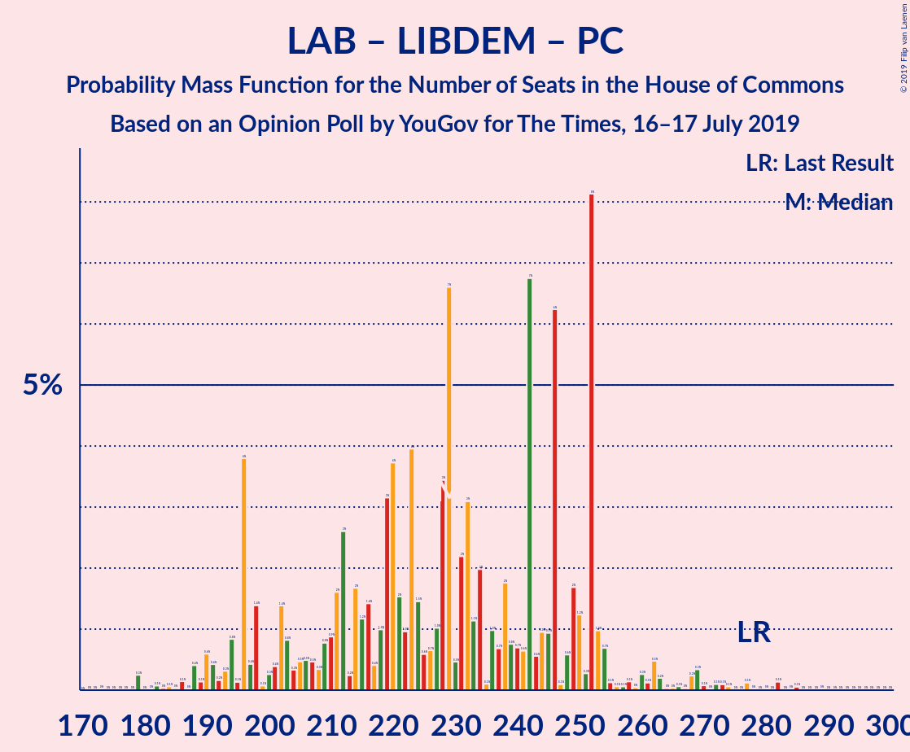

| Number of Seats | Probability | Accumulated | Special Marks |
|:---------------:|:-----------:|:-----------:|:-------------:|
| 177 | 0% | 100% |  |
| 178 | 0% | 99.9% |  |
| 179 | 0.3% | 99.9% |  |
| 180 | 0% | 99.7% |  |
| 181 | 0% | 99.7% |  |
| 182 | 0.1% | 99.7% |  |
| 183 | 0% | 99.6% |  |
| 184 | 0.1% | 99.6% |  |
| 185 | 0% | 99.5% |  |
| 186 | 0.1% | 99.5% |  |
| 187 | 0% | 99.3% |  |
| 188 | 0.4% | 99.3% |  |
| 189 | 0.1% | 98.9% |  |
| 190 | 0.6% | 98.8% |  |
| 191 | 0.4% | 98% |  |
| 192 | 0.2% | 98% |  |
| 193 | 0.3% | 98% |  |
| 194 | 0.8% | 97% |  |
| 195 | 0.1% | 96% |  |
| 196 | 4% | 96% |  |
| 197 | 0.4% | 92% |  |
| 198 | 1.4% | 92% |  |
| 199 | 0.1% | 91% |  |
| 200 | 0.3% | 91% |  |
| 201 | 0.4% | 90% |  |
| 202 | 1.4% | 90% |  |
| 203 | 0.8% | 89% |  |
| 204 | 0.3% | 88% |  |
| 205 | 0.5% | 87% |  |
| 206 | 0.5% | 87% |  |
| 207 | 0.5% | 86% |  |
| 208 | 0.3% | 86% |  |
| 209 | 0.8% | 86% |  |
| 210 | 0.9% | 85% |  |
| 211 | 2% | 84% |  |
| 212 | 3% | 82% |  |
| 213 | 0.2% | 80% |  |
| 214 | 2% | 80% |  |
| 215 | 1.2% | 78% |  |
| 216 | 1.4% | 77% |  |
| 217 | 0.4% | 75% |  |
| 218 | 1.0% | 75% |  |
| 219 | 3% | 74% |  |
| 220 | 4% | 71% |  |
| 221 | 2% | 67% |  |
| 222 | 1.0% | 65% |  |
| 223 | 4% | 64% |  |
| 224 | 1.5% | 61% |  |
| 225 | 0.6% | 59% |  |
| 226 | 0.7% | 58% |  |
| 227 | 1.0% | 58% |  |
| 228 | 3% | 57% | Median |
| 229 | 7% | 53% |  |
| 230 | 0.5% | 47% |  |
| 231 | 2% | 46% |  |
| 232 | 3% | 44% |  |
| 233 | 1.1% | 41% |  |
| 234 | 2% | 40% |  |
| 235 | 0.1% | 38% |  |
| 236 | 1.0% | 38% |  |
| 237 | 0.7% | 37% |  |
| 238 | 2% | 36% |  |
| 239 | 0.8% | 34% |  |
| 240 | 0.7% | 34% |  |
| 241 | 0.6% | 33% |  |
| 242 | 7% | 32% |  |
| 243 | 0.6% | 25% |  |
| 244 | 1.0% | 25% |  |
| 245 | 0.9% | 24% |  |
| 246 | 6% | 23% |  |
| 247 | 0.1% | 17% |  |
| 248 | 0.6% | 17% |  |
| 249 | 2% | 16% |  |
| 250 | 1.2% | 14% |  |
| 251 | 0.3% | 13% |  |
| 252 | 8% | 13% |  |
| 253 | 1.0% | 5% |  |
| 254 | 0.7% | 4% |  |
| 255 | 0.1% | 3% |  |
| 256 | 0.1% | 3% |  |
| 257 | 0.1% | 3% |  |
| 258 | 0.1% | 3% |  |
| 259 | 0% | 3% |  |
| 260 | 0.3% | 3% |  |
| 261 | 0.1% | 2% |  |
| 262 | 0.5% | 2% |  |
| 263 | 0.2% | 2% |  |
| 264 | 0% | 2% |  |
| 265 | 0% | 2% |  |
| 266 | 0.1% | 2% |  |
| 267 | 0% | 1.5% |  |
| 268 | 0.2% | 1.5% |  |
| 269 | 0.3% | 1.2% |  |
| 270 | 0.1% | 0.9% |  |
| 271 | 0% | 0.8% |  |
| 272 | 0.1% | 0.8% |  |
| 273 | 0.1% | 0.7% |  |
| 274 | 0.1% | 0.6% |  |
| 275 | 0% | 0.5% |  |
| 276 | 0% | 0.5% |  |
| 277 | 0.1% | 0.5% |  |
| 278 | 0% | 0.4% | Last Result |
| 279 | 0% | 0.4% |  |
| 280 | 0% | 0.4% |  |
| 281 | 0% | 0.4% |  |
| 282 | 0.1% | 0.3% |  |
| 283 | 0% | 0.2% |  |
| 284 | 0% | 0.2% |  |
| 285 | 0.1% | 0.2% |  |
| 286 | 0% | 0.1% |  |
| 287 | 0% | 0.1% |  |
| 288 | 0% | 0.1% |  |
| 289 | 0% | 0.1% |  |
| 290 | 0% | 0.1% |  |
| 291 | 0% | 0.1% |  |
| 292 | 0% | 0.1% |  |
| 293 | 0% | 0.1% |  |
| 294 | 0% | 0.1% |  |
| 295 | 0% | 0% |  |

### Labour Party – Liberal Democrats – Change UK

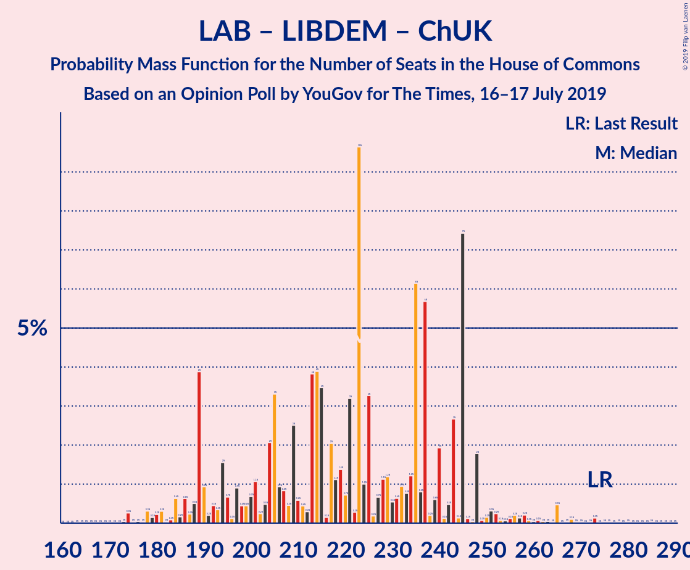

| Number of Seats | Probability | Accumulated | Special Marks |
|:---------------:|:-----------:|:-----------:|:-------------:|
| 169 | 0% | 100% |  |
| 170 | 0% | 99.9% |  |
| 171 | 0% | 99.9% |  |
| 172 | 0% | 99.9% |  |
| 173 | 0% | 99.9% |  |
| 174 | 0.3% | 99.9% |  |
| 175 | 0% | 99.6% |  |
| 176 | 0% | 99.6% |  |
| 177 | 0% | 99.5% |  |
| 178 | 0.3% | 99.5% |  |
| 179 | 0.1% | 99.2% |  |
| 180 | 0.2% | 99.1% |  |
| 181 | 0.3% | 98.8% |  |
| 182 | 0% | 98.5% |  |
| 183 | 0.1% | 98% |  |
| 184 | 0.6% | 98% |  |
| 185 | 0.2% | 98% |  |
| 186 | 0.6% | 98% |  |
| 187 | 0.2% | 97% |  |
| 188 | 0.5% | 97% |  |
| 189 | 4% | 96% |  |
| 190 | 0.9% | 92% |  |
| 191 | 0.2% | 91% |  |
| 192 | 0.5% | 91% |  |
| 193 | 0.3% | 91% |  |
| 194 | 2% | 90% |  |
| 195 | 0.7% | 89% |  |
| 196 | 0.1% | 88% |  |
| 197 | 0.9% | 88% |  |
| 198 | 0.4% | 87% |  |
| 199 | 0.4% | 87% |  |
| 200 | 0.7% | 86% |  |
| 201 | 1.1% | 86% |  |
| 202 | 0.2% | 85% |  |
| 203 | 0.5% | 84% |  |
| 204 | 2% | 84% |  |
| 205 | 3% | 82% |  |
| 206 | 0.9% | 78% |  |
| 207 | 0.8% | 77% |  |
| 208 | 0.5% | 77% |  |
| 209 | 3% | 76% |  |
| 210 | 0.6% | 74% |  |
| 211 | 0.4% | 73% |  |
| 212 | 0.3% | 73% |  |
| 213 | 4% | 72% |  |
| 214 | 4% | 69% |  |
| 215 | 3% | 65% |  |
| 216 | 0.1% | 61% |  |
| 217 | 2% | 61% |  |
| 218 | 1.1% | 59% |  |
| 219 | 1.4% | 58% |  |
| 220 | 0.7% | 56% |  |
| 221 | 3% | 56% | Median |
| 222 | 0.3% | 53% |  |
| 223 | 10% | 52% |  |
| 224 | 1.0% | 43% |  |
| 225 | 3% | 42% |  |
| 226 | 0.2% | 38% |  |
| 227 | 0.7% | 38% |  |
| 228 | 1.1% | 38% |  |
| 229 | 1.2% | 36% |  |
| 230 | 0.5% | 35% |  |
| 231 | 0.6% | 35% |  |
| 232 | 0.9% | 34% |  |
| 233 | 0.8% | 33% |  |
| 234 | 1.2% | 32% |  |
| 235 | 6% | 31% |  |
| 236 | 0.8% | 25% |  |
| 237 | 6% | 24% |  |
| 238 | 0.2% | 18% |  |
| 239 | 0.6% | 18% |  |
| 240 | 2% | 18% |  |
| 241 | 0.1% | 16% |  |
| 242 | 0.5% | 16% |  |
| 243 | 3% | 15% |  |
| 244 | 0.1% | 12% |  |
| 245 | 7% | 12% |  |
| 246 | 0.1% | 5% |  |
| 247 | 0% | 5% |  |
| 248 | 2% | 5% |  |
| 249 | 0.1% | 3% |  |
| 250 | 0.2% | 3% |  |
| 251 | 0.3% | 3% |  |
| 252 | 0.2% | 2% |  |
| 253 | 0.1% | 2% |  |
| 254 | 0.1% | 2% |  |
| 255 | 0.1% | 2% |  |
| 256 | 0.2% | 2% |  |
| 257 | 0.1% | 2% |  |
| 258 | 0.2% | 2% |  |
| 259 | 0.1% | 1.3% |  |
| 260 | 0% | 1.3% |  |
| 261 | 0.1% | 1.2% |  |
| 262 | 0% | 1.2% |  |
| 263 | 0% | 1.1% |  |
| 264 | 0% | 1.1% |  |
| 265 | 0.5% | 1.0% |  |
| 266 | 0% | 0.6% |  |
| 267 | 0% | 0.6% |  |
| 268 | 0.1% | 0.5% |  |
| 269 | 0% | 0.4% |  |
| 270 | 0% | 0.4% |  |
| 271 | 0% | 0.4% |  |
| 272 | 0% | 0.4% |  |
| 273 | 0.1% | 0.3% |  |
| 274 | 0% | 0.2% | Last Result |
| 275 | 0% | 0.2% |  |
| 276 | 0% | 0.2% |  |
| 277 | 0% | 0.2% |  |
| 278 | 0% | 0.1% |  |
| 279 | 0% | 0.1% |  |
| 280 | 0% | 0.1% |  |
| 281 | 0% | 0.1% |  |
| 282 | 0% | 0.1% |  |
| 283 | 0% | 0.1% |  |
| 284 | 0% | 0.1% |  |
| 285 | 0% | 0.1% |  |
| 286 | 0% | 0% |  |

### Labour Party – Liberal Democrats

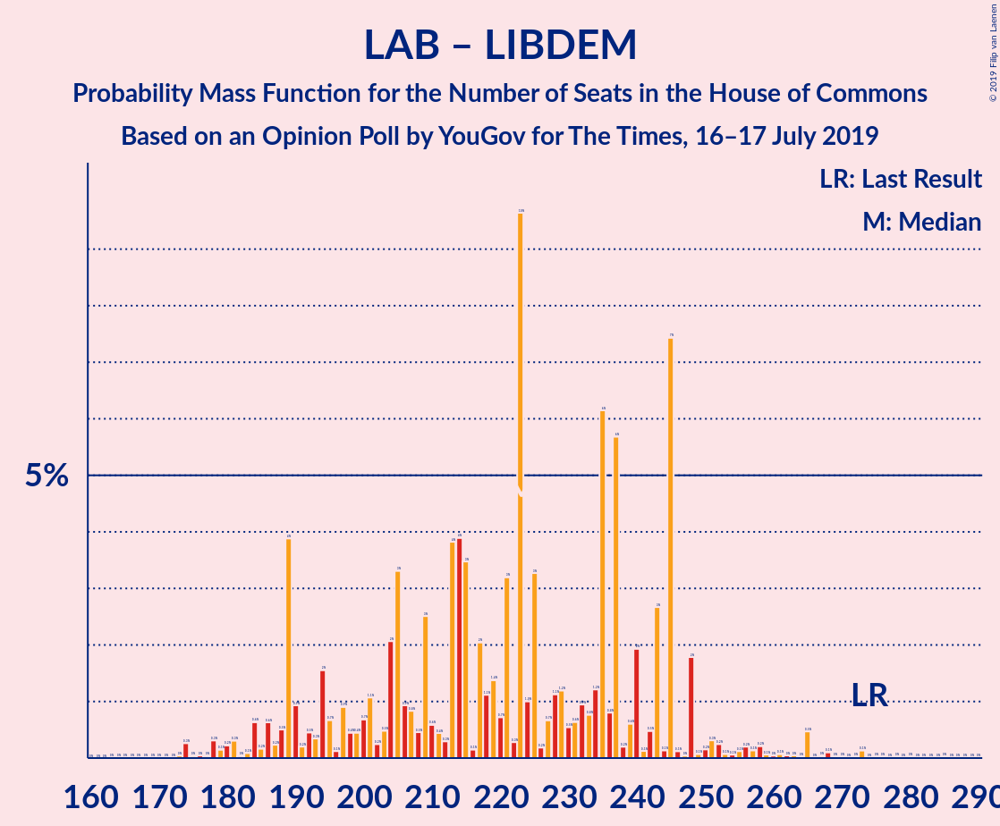

| Number of Seats | Probability | Accumulated | Special Marks |
|:---------------:|:-----------:|:-----------:|:-------------:|
| 169 | 0% | 100% |  |
| 170 | 0% | 99.9% |  |
| 171 | 0% | 99.9% |  |
| 172 | 0% | 99.9% |  |
| 173 | 0% | 99.9% |  |
| 174 | 0.3% | 99.9% |  |
| 175 | 0% | 99.6% |  |
| 176 | 0% | 99.6% |  |
| 177 | 0% | 99.5% |  |
| 178 | 0.3% | 99.5% |  |
| 179 | 0.1% | 99.2% |  |
| 180 | 0.2% | 99.1% |  |
| 181 | 0.3% | 98.8% |  |
| 182 | 0% | 98.5% |  |
| 183 | 0.1% | 98% |  |
| 184 | 0.6% | 98% |  |
| 185 | 0.2% | 98% |  |
| 186 | 0.6% | 98% |  |
| 187 | 0.2% | 97% |  |
| 188 | 0.5% | 97% |  |
| 189 | 4% | 96% |  |
| 190 | 0.9% | 92% |  |
| 191 | 0.2% | 91% |  |
| 192 | 0.5% | 91% |  |
| 193 | 0.3% | 91% |  |
| 194 | 2% | 90% |  |
| 195 | 0.7% | 89% |  |
| 196 | 0.1% | 88% |  |
| 197 | 0.9% | 88% |  |
| 198 | 0.4% | 87% |  |
| 199 | 0.4% | 87% |  |
| 200 | 0.7% | 86% |  |
| 201 | 1.1% | 86% |  |
| 202 | 0.2% | 85% |  |
| 203 | 0.5% | 84% |  |
| 204 | 2% | 84% |  |
| 205 | 3% | 82% |  |
| 206 | 0.9% | 78% |  |
| 207 | 0.8% | 77% |  |
| 208 | 0.5% | 77% |  |
| 209 | 3% | 76% |  |
| 210 | 0.6% | 74% |  |
| 211 | 0.4% | 73% |  |
| 212 | 0.3% | 73% |  |
| 213 | 4% | 72% |  |
| 214 | 4% | 69% |  |
| 215 | 3% | 65% |  |
| 216 | 0.1% | 61% |  |
| 217 | 2% | 61% |  |
| 218 | 1.1% | 59% |  |
| 219 | 1.4% | 58% |  |
| 220 | 0.7% | 56% |  |
| 221 | 3% | 56% | Median |
| 222 | 0.3% | 53% |  |
| 223 | 10% | 52% |  |
| 224 | 1.0% | 43% |  |
| 225 | 3% | 42% |  |
| 226 | 0.2% | 38% |  |
| 227 | 0.7% | 38% |  |
| 228 | 1.1% | 38% |  |
| 229 | 1.2% | 36% |  |
| 230 | 0.5% | 35% |  |
| 231 | 0.6% | 35% |  |
| 232 | 0.9% | 34% |  |
| 233 | 0.8% | 33% |  |
| 234 | 1.2% | 32% |  |
| 235 | 6% | 31% |  |
| 236 | 0.8% | 25% |  |
| 237 | 6% | 24% |  |
| 238 | 0.2% | 18% |  |
| 239 | 0.6% | 18% |  |
| 240 | 2% | 18% |  |
| 241 | 0.1% | 16% |  |
| 242 | 0.5% | 16% |  |
| 243 | 3% | 15% |  |
| 244 | 0.1% | 12% |  |
| 245 | 7% | 12% |  |
| 246 | 0.1% | 5% |  |
| 247 | 0% | 5% |  |
| 248 | 2% | 5% |  |
| 249 | 0.1% | 3% |  |
| 250 | 0.2% | 3% |  |
| 251 | 0.3% | 3% |  |
| 252 | 0.2% | 2% |  |
| 253 | 0.1% | 2% |  |
| 254 | 0.1% | 2% |  |
| 255 | 0.1% | 2% |  |
| 256 | 0.2% | 2% |  |
| 257 | 0.1% | 2% |  |
| 258 | 0.2% | 2% |  |
| 259 | 0.1% | 1.3% |  |
| 260 | 0% | 1.3% |  |
| 261 | 0.1% | 1.2% |  |
| 262 | 0% | 1.2% |  |
| 263 | 0% | 1.1% |  |
| 264 | 0% | 1.1% |  |
| 265 | 0.5% | 1.0% |  |
| 266 | 0% | 0.6% |  |
| 267 | 0% | 0.6% |  |
| 268 | 0.1% | 0.5% |  |
| 269 | 0% | 0.4% |  |
| 270 | 0% | 0.4% |  |
| 271 | 0% | 0.4% |  |
| 272 | 0% | 0.4% |  |
| 273 | 0.1% | 0.3% |  |
| 274 | 0% | 0.2% | Last Result |
| 275 | 0% | 0.2% |  |
| 276 | 0% | 0.2% |  |
| 277 | 0% | 0.2% |  |
| 278 | 0% | 0.1% |  |
| 279 | 0% | 0.1% |  |
| 280 | 0% | 0.1% |  |
| 281 | 0% | 0.1% |  |
| 282 | 0% | 0.1% |  |
| 283 | 0% | 0.1% |  |
| 284 | 0% | 0.1% |  |
| 285 | 0% | 0.1% |  |
| 286 | 0% | 0% |  |

### Conservative Party – Plaid Cymru

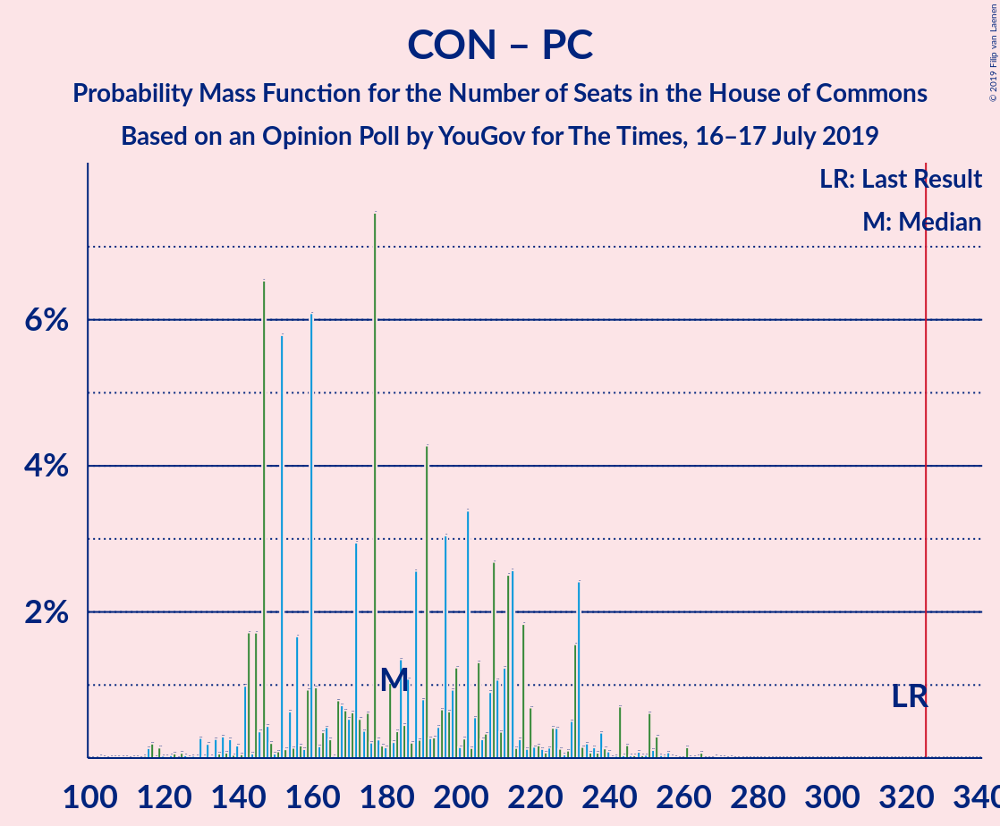

| Number of Seats | Probability | Accumulated | Special Marks |
|:---------------:|:-----------:|:-----------:|:-------------:|
| 104 | 0% | 100% |  |
| 105 | 0% | 99.9% |  |
| 106 | 0% | 99.9% |  |
| 107 | 0% | 99.9% |  |
| 108 | 0% | 99.9% |  |
| 109 | 0% | 99.9% |  |
| 110 | 0% | 99.9% |  |
| 111 | 0% | 99.9% |  |
| 112 | 0% | 99.9% |  |
| 113 | 0% | 99.9% |  |
| 114 | 0% | 99.8% |  |
| 115 | 0% | 99.8% |  |
| 116 | 0.1% | 99.8% |  |
| 117 | 0.2% | 99.7% |  |
| 118 | 0% | 99.5% |  |
| 119 | 0.1% | 99.5% |  |
| 120 | 0% | 99.3% |  |
| 121 | 0% | 99.3% |  |
| 122 | 0% | 99.3% |  |
| 123 | 0.1% | 99.2% |  |
| 124 | 0% | 99.2% |  |
| 125 | 0.1% | 99.2% |  |
| 126 | 0% | 99.1% |  |
| 127 | 0% | 99.0% |  |
| 128 | 0% | 99.0% |  |
| 129 | 0% | 99.0% |  |
| 130 | 0.3% | 99.0% |  |
| 131 | 0% | 98.7% |  |
| 132 | 0.2% | 98.7% |  |
| 133 | 0% | 98% |  |
| 134 | 0.3% | 98% |  |
| 135 | 0.1% | 98% |  |
| 136 | 0.3% | 98% |  |
| 137 | 0.1% | 98% |  |
| 138 | 0.3% | 98% |  |
| 139 | 0% | 98% |  |
| 140 | 0.2% | 97% |  |
| 141 | 0.1% | 97% |  |
| 142 | 1.0% | 97% |  |
| 143 | 2% | 96% |  |
| 144 | 0.1% | 95% |  |
| 145 | 2% | 94% |  |
| 146 | 0.4% | 93% |  |
| 147 | 7% | 92% |  |
| 148 | 0.4% | 86% |  |
| 149 | 0.2% | 85% |  |
| 150 | 0.1% | 85% |  |
| 151 | 0.1% | 85% |  |
| 152 | 6% | 85% |  |
| 153 | 0.1% | 79% |  |
| 154 | 0.6% | 79% |  |
| 155 | 0.1% | 79% |  |
| 156 | 2% | 78% |  |
| 157 | 0.2% | 77% |  |
| 158 | 0.1% | 77% |  |
| 159 | 0.9% | 76% |  |
| 160 | 6% | 75% |  |
| 161 | 1.0% | 69% |  |
| 162 | 0.2% | 68% |  |
| 163 | 0.4% | 68% |  |
| 164 | 0.4% | 68% |  |
| 165 | 0.3% | 67% |  |
| 166 | 0% | 67% |  |
| 167 | 0.8% | 67% |  |
| 168 | 0.7% | 66% |  |
| 169 | 0.7% | 66% |  |
| 170 | 0.5% | 65% |  |
| 171 | 0.6% | 64% |  |
| 172 | 3% | 64% |  |
| 173 | 0.5% | 61% |  |
| 174 | 0.4% | 60% |  |
| 175 | 0.6% | 60% |  |
| 176 | 0.2% | 59% |  |
| 177 | 7% | 59% |  |
| 178 | 0.3% | 52% |  |
| 179 | 0.2% | 51% |  |
| 180 | 0.1% | 51% | Median |
| 181 | 1.0% | 51% |  |
| 182 | 0.2% | 50% |  |
| 183 | 0.4% | 50% |  |
| 184 | 1.4% | 50% |  |
| 185 | 0.5% | 48% |  |
| 186 | 1.1% | 48% |  |
| 187 | 0.2% | 47% |  |
| 188 | 3% | 46% |  |
| 189 | 0.3% | 44% |  |
| 190 | 0.8% | 44% |  |
| 191 | 4% | 43% |  |
| 192 | 0.3% | 39% |  |
| 193 | 0.3% | 38% |  |
| 194 | 0.4% | 38% |  |
| 195 | 0.7% | 38% |  |
| 196 | 3% | 37% |  |
| 197 | 0.6% | 34% |  |
| 198 | 0.9% | 33% |  |
| 199 | 1.2% | 32% |  |
| 200 | 0.1% | 31% |  |
| 201 | 0.3% | 31% |  |
| 202 | 3% | 31% |  |
| 203 | 0.1% | 27% |  |
| 204 | 0.6% | 27% |  |
| 205 | 1.3% | 27% |  |
| 206 | 0.3% | 25% |  |
| 207 | 0.3% | 25% |  |
| 208 | 0.9% | 25% |  |
| 209 | 3% | 24% |  |
| 210 | 1.1% | 21% |  |
| 211 | 0.4% | 20% |  |
| 212 | 1.2% | 20% |  |
| 213 | 3% | 18% |  |
| 214 | 3% | 16% |  |
| 215 | 0.1% | 13% |  |
| 216 | 0.3% | 13% |  |
| 217 | 2% | 13% |  |
| 218 | 0.1% | 11% |  |
| 219 | 0.7% | 11% |  |
| 220 | 0.2% | 10% |  |
| 221 | 0.2% | 10% |  |
| 222 | 0.1% | 10% |  |
| 223 | 0.1% | 10% |  |
| 224 | 0.1% | 10% |  |
| 225 | 0.4% | 10% |  |
| 226 | 0.4% | 9% |  |
| 227 | 0.1% | 9% |  |
| 228 | 0% | 9% |  |
| 229 | 0.1% | 9% |  |
| 230 | 0.5% | 8% |  |
| 231 | 2% | 8% |  |
| 232 | 2% | 6% |  |
| 233 | 0.2% | 4% |  |
| 234 | 0.2% | 4% |  |
| 235 | 0.1% | 4% |  |
| 236 | 0.1% | 4% |  |
| 237 | 0.1% | 3% |  |
| 238 | 0.3% | 3% |  |
| 239 | 0.1% | 3% |  |
| 240 | 0.1% | 3% |  |
| 241 | 0% | 3% |  |
| 242 | 0% | 3% |  |
| 243 | 0.7% | 3% |  |
| 244 | 0% | 2% |  |
| 245 | 0.2% | 2% |  |
| 246 | 0% | 2% |  |
| 247 | 0% | 2% |  |
| 248 | 0.1% | 2% |  |
| 249 | 0% | 2% |  |
| 250 | 0% | 2% |  |
| 251 | 0.6% | 2% |  |
| 252 | 0.1% | 1.0% |  |
| 253 | 0.3% | 0.9% |  |
| 254 | 0% | 0.6% |  |
| 255 | 0% | 0.5% |  |
| 256 | 0.1% | 0.5% |  |
| 257 | 0% | 0.4% |  |
| 258 | 0% | 0.4% |  |
| 259 | 0% | 0.4% |  |
| 260 | 0% | 0.4% |  |
| 261 | 0.1% | 0.4% |  |
| 262 | 0% | 0.2% |  |
| 263 | 0% | 0.2% |  |
| 264 | 0% | 0.2% |  |
| 265 | 0.1% | 0.2% |  |
| 266 | 0% | 0.1% |  |
| 267 | 0% | 0.1% |  |
| 268 | 0% | 0.1% |  |
| 269 | 0% | 0.1% |  |
| 270 | 0% | 0.1% |  |
| 271 | 0% | 0.1% |  |
| 272 | 0% | 0% |  |
| 273 | 0% | 0% |  |
| 274 | 0% | 0% |  |
| 275 | 0% | 0% |  |
| 276 | 0% | 0% |  |
| 277 | 0% | 0% |  |
| 278 | 0% | 0% |  |
| 279 | 0% | 0% |  |
| 280 | 0% | 0% |  |
| 281 | 0% | 0% |  |
| 282 | 0% | 0% |  |
| 283 | 0% | 0% |  |
| 284 | 0% | 0% |  |
| 285 | 0% | 0% |  |
| 286 | 0% | 0% |  |
| 287 | 0% | 0% |  |
| 288 | 0% | 0% |  |
| 289 | 0% | 0% |  |
| 290 | 0% | 0% |  |
| 291 | 0% | 0% |  |
| 292 | 0% | 0% |  |
| 293 | 0% | 0% |  |
| 294 | 0% | 0% |  |
| 295 | 0% | 0% |  |
| 296 | 0% | 0% |  |
| 297 | 0% | 0% |  |
| 298 | 0% | 0% |  |
| 299 | 0% | 0% |  |
| 300 | 0% | 0% |  |
| 301 | 0% | 0% |  |
| 302 | 0% | 0% |  |
| 303 | 0% | 0% |  |
| 304 | 0% | 0% |  |
| 305 | 0% | 0% |  |
| 306 | 0% | 0% |  |
| 307 | 0% | 0% |  |
| 308 | 0% | 0% |  |
| 309 | 0% | 0% |  |
| 310 | 0% | 0% |  |
| 311 | 0% | 0% |  |
| 312 | 0% | 0% |  |
| 313 | 0% | 0% |  |
| 314 | 0% | 0% |  |
| 315 | 0% | 0% |  |
| 316 | 0% | 0% |  |
| 317 | 0% | 0% |  |
| 318 | 0% | 0% |  |
| 319 | 0% | 0% |  |
| 320 | 0% | 0% |  |
| 321 | 0% | 0% | Last Result |

### Conservative Party – Change UK

| Number of Seats | Probability | Accumulated | Special Marks |
|:---------------:|:-----------:|:-----------:|:-------------:|
| 94 | 0% | 100% |  |
| 95 | 0% | 99.9% |  |
| 96 | 0% | 99.9% |  |
| 97 | 0% | 99.9% |  |
| 98 | 0% | 99.9% |  |
| 99 | 0% | 99.9% |  |
| 100 | 0% | 99.9% |  |
| 101 | 0% | 99.9% |  |
| 102 | 0% | 99.9% |  |
| 103 | 0% | 99.9% |  |
| 104 | 0% | 99.9% |  |
| 105 | 0% | 99.8% |  |
| 106 | 0% | 99.8% |  |
| 107 | 0.3% | 99.8% |  |
| 108 | 0% | 99.5% |  |
| 109 | 0% | 99.5% |  |
| 110 | 0% | 99.5% |  |
| 111 | 0.1% | 99.5% |  |
| 112 | 0% | 99.4% |  |
| 113 | 0.1% | 99.4% |  |
| 114 | 0.1% | 99.3% |  |
| 115 | 0.1% | 99.2% |  |
| 116 | 0% | 99.1% |  |
| 117 | 0% | 99.1% |  |
| 118 | 0% | 99.1% |  |
| 119 | 0% | 99.1% |  |
| 120 | 0% | 99.0% |  |
| 121 | 0.1% | 99.0% |  |
| 122 | 0% | 98.9% |  |
| 123 | 0% | 98.9% |  |
| 124 | 0.2% | 98.9% |  |
| 125 | 0.1% | 98.7% |  |
| 126 | 0.1% | 98.5% |  |
| 127 | 0.3% | 98% |  |
| 128 | 0% | 98% |  |
| 129 | 0.1% | 98% |  |
| 130 | 0.4% | 98% |  |
| 131 | 0.3% | 98% |  |
| 132 | 0.1% | 97% |  |
| 133 | 0.1% | 97% |  |
| 134 | 0.3% | 97% |  |
| 135 | 0.1% | 97% |  |
| 136 | 0.1% | 97% |  |
| 137 | 2% | 97% |  |
| 138 | 0.2% | 94% |  |
| 139 | 2% | 94% |  |
| 140 | 0.1% | 92% |  |
| 141 | 6% | 92% |  |
| 142 | 0.2% | 86% |  |
| 143 | 0.5% | 86% |  |
| 144 | 0.4% | 85% |  |
| 145 | 6% | 85% |  |
| 146 | 0.1% | 79% |  |
| 147 | 0.7% | 79% |  |
| 148 | 0.6% | 78% |  |
| 149 | 0.1% | 78% |  |
| 150 | 2% | 78% |  |
| 151 | 5% | 76% |  |
| 152 | 0.6% | 71% |  |
| 153 | 2% | 71% |  |
| 154 | 0.1% | 69% |  |
| 155 | 0.8% | 69% |  |
| 156 | 0.6% | 68% |  |
| 157 | 0.4% | 68% |  |
| 158 | 0.2% | 67% |  |
| 159 | 0.2% | 67% |  |
| 160 | 0.2% | 67% |  |
| 161 | 0.6% | 67% |  |
| 162 | 0.6% | 66% |  |
| 163 | 3% | 65% |  |
| 164 | 0.3% | 62% |  |
| 165 | 0.6% | 62% |  |
| 166 | 1.2% | 61% |  |
| 167 | 0.5% | 60% |  |
| 168 | 0.3% | 60% |  |
| 169 | 1.0% | 59% |  |
| 170 | 7% | 58% |  |
| 171 | 0.2% | 51% |  |
| 172 | 0.2% | 51% |  |
| 173 | 2% | 50% | Median |
| 174 | 0.6% | 48% |  |
| 175 | 0.3% | 48% |  |
| 176 | 0.6% | 48% |  |
| 177 | 0.2% | 47% |  |
| 178 | 0.9% | 47% |  |
| 179 | 0.6% | 46% |  |
| 180 | 0.4% | 45% |  |
| 181 | 0.3% | 45% |  |
| 182 | 1.3% | 45% |  |
| 183 | 0.8% | 43% |  |
| 184 | 4% | 42% |  |
| 185 | 0.8% | 39% |  |
| 186 | 0.1% | 38% |  |
| 187 | 0.4% | 38% |  |
| 188 | 1.0% | 37% |  |
| 189 | 3% | 36% |  |
| 190 | 0.4% | 33% |  |
| 191 | 0.2% | 33% |  |
| 192 | 2% | 32% |  |
| 193 | 1.1% | 31% |  |
| 194 | 0.5% | 29% |  |
| 195 | 2% | 29% |  |
| 196 | 0.1% | 27% |  |
| 197 | 0.6% | 27% |  |
| 198 | 1.0% | 26% |  |
| 199 | 0.7% | 25% |  |
| 200 | 0.5% | 25% |  |
| 201 | 0.2% | 24% |  |
| 202 | 0.5% | 24% |  |
| 203 | 1.3% | 23% |  |
| 204 | 3% | 22% |  |
| 205 | 0.3% | 19% |  |
| 206 | 6% | 19% |  |
| 207 | 0.1% | 13% |  |
| 208 | 1.1% | 13% |  |
| 209 | 0.4% | 12% |  |
| 210 | 1.1% | 12% |  |
| 211 | 0.6% | 10% |  |
| 212 | 0.2% | 10% |  |
| 213 | 0.1% | 10% |  |
| 214 | 0.1% | 10% |  |
| 215 | 0.2% | 9% |  |
| 216 | 0.2% | 9% |  |
| 217 | 0.1% | 9% |  |
| 218 | 0.5% | 9% |  |
| 219 | 0% | 9% |  |
| 220 | 0.1% | 9% |  |
| 221 | 0% | 8% |  |
| 222 | 0.1% | 8% |  |
| 223 | 1.4% | 8% |  |
| 224 | 0.2% | 7% |  |
| 225 | 3% | 7% |  |
| 226 | 0% | 4% |  |
| 227 | 0.3% | 4% |  |
| 228 | 0.2% | 4% |  |
| 229 | 0.2% | 3% |  |
| 230 | 0.2% | 3% |  |
| 231 | 0.1% | 3% |  |
| 232 | 0.1% | 3% |  |
| 233 | 0% | 3% |  |
| 234 | 0% | 3% |  |
| 235 | 0.7% | 3% |  |
| 236 | 0% | 2% |  |
| 237 | 0% | 2% |  |
| 238 | 0% | 2% |  |
| 239 | 0.1% | 2% |  |
| 240 | 0% | 2% |  |
| 241 | 0.1% | 2% |  |
| 242 | 0% | 2% |  |
| 243 | 0.1% | 2% |  |
| 244 | 0.1% | 1.5% |  |
| 245 | 0.8% | 1.3% |  |
| 246 | 0% | 0.5% |  |
| 247 | 0% | 0.5% |  |
| 248 | 0.1% | 0.5% |  |
| 249 | 0% | 0.4% |  |
| 250 | 0% | 0.4% |  |
| 251 | 0% | 0.3% |  |
| 252 | 0% | 0.3% |  |
| 253 | 0% | 0.3% |  |
| 254 | 0.1% | 0.3% |  |
| 255 | 0% | 0.2% |  |
| 256 | 0% | 0.2% |  |
| 257 | 0.1% | 0.2% |  |
| 258 | 0% | 0.1% |  |
| 259 | 0% | 0.1% |  |
| 260 | 0% | 0.1% |  |
| 261 | 0% | 0.1% |  |
| 262 | 0% | 0.1% |  |
| 263 | 0% | 0% |  |
| 264 | 0% | 0% |  |
| 265 | 0% | 0% |  |
| 266 | 0% | 0% |  |
| 267 | 0% | 0% |  |
| 268 | 0% | 0% |  |
| 269 | 0% | 0% |  |
| 270 | 0% | 0% |  |
| 271 | 0% | 0% |  |
| 272 | 0% | 0% |  |
| 273 | 0% | 0% |  |
| 274 | 0% | 0% |  |
| 275 | 0% | 0% |  |
| 276 | 0% | 0% |  |
| 277 | 0% | 0% |  |
| 278 | 0% | 0% |  |
| 279 | 0% | 0% |  |
| 280 | 0% | 0% |  |
| 281 | 0% | 0% |  |
| 282 | 0% | 0% |  |
| 283 | 0% | 0% |  |
| 284 | 0% | 0% |  |
| 285 | 0% | 0% |  |
| 286 | 0% | 0% |  |
| 287 | 0% | 0% |  |
| 288 | 0% | 0% |  |
| 289 | 0% | 0% |  |
| 290 | 0% | 0% |  |
| 291 | 0% | 0% |  |
| 292 | 0% | 0% |  |
| 293 | 0% | 0% |  |
| 294 | 0% | 0% |  |
| 295 | 0% | 0% |  |
| 296 | 0% | 0% |  |
| 297 | 0% | 0% |  |
| 298 | 0% | 0% |  |
| 299 | 0% | 0% |  |
| 300 | 0% | 0% |  |
| 301 | 0% | 0% |  |
| 302 | 0% | 0% |  |
| 303 | 0% | 0% |  |
| 304 | 0% | 0% |  |
| 305 | 0% | 0% |  |
| 306 | 0% | 0% |  |
| 307 | 0% | 0% |  |
| 308 | 0% | 0% |  |
| 309 | 0% | 0% |  |
| 310 | 0% | 0% |  |
| 311 | 0% | 0% |  |
| 312 | 0% | 0% |  |
| 313 | 0% | 0% |  |
| 314 | 0% | 0% |  |
| 315 | 0% | 0% |  |
| 316 | 0% | 0% |  |
| 317 | 0% | 0% | Last Result |

### Conservative Party

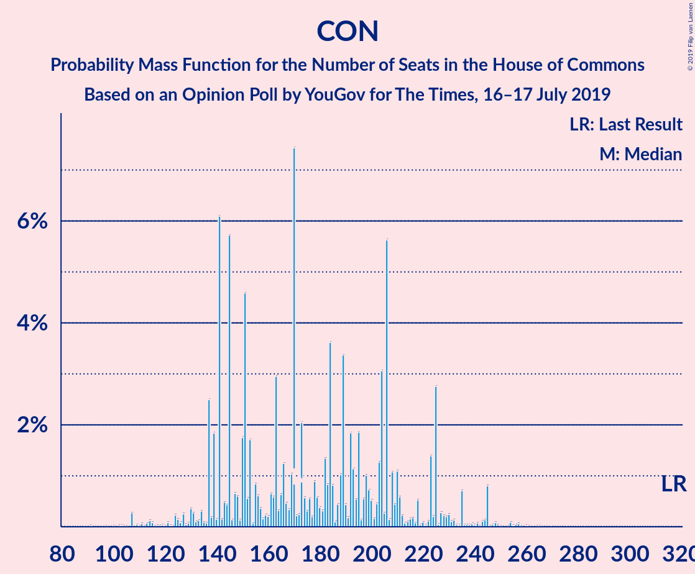

| Number of Seats | Probability | Accumulated | Special Marks |
|:---------------:|:-----------:|:-----------:|:-------------:|
| 94 | 0% | 100% |  |
| 95 | 0% | 99.9% |  |
| 96 | 0% | 99.9% |  |
| 97 | 0% | 99.9% |  |
| 98 | 0% | 99.9% |  |
| 99 | 0% | 99.9% |  |
| 100 | 0% | 99.9% |  |
| 101 | 0% | 99.9% |  |
| 102 | 0% | 99.9% |  |
| 103 | 0% | 99.9% |  |
| 104 | 0% | 99.9% |  |
| 105 | 0% | 99.8% |  |
| 106 | 0% | 99.8% |  |
| 107 | 0.3% | 99.8% |  |
| 108 | 0% | 99.5% |  |
| 109 | 0% | 99.5% |  |
| 110 | 0% | 99.5% |  |
| 111 | 0.1% | 99.5% |  |
| 112 | 0% | 99.4% |  |
| 113 | 0.1% | 99.4% |  |
| 114 | 0.1% | 99.3% |  |
| 115 | 0.1% | 99.2% |  |
| 116 | 0% | 99.1% |  |
| 117 | 0% | 99.1% |  |
| 118 | 0% | 99.1% |  |
| 119 | 0% | 99.1% |  |
| 120 | 0% | 99.0% |  |
| 121 | 0.1% | 99.0% |  |
| 122 | 0% | 98.9% |  |
| 123 | 0% | 98.9% |  |
| 124 | 0.2% | 98.9% |  |
| 125 | 0.1% | 98.7% |  |
| 126 | 0.1% | 98.5% |  |
| 127 | 0.3% | 98% |  |
| 128 | 0% | 98% |  |
| 129 | 0.1% | 98% |  |
| 130 | 0.4% | 98% |  |
| 131 | 0.3% | 98% |  |
| 132 | 0.1% | 97% |  |
| 133 | 0.1% | 97% |  |
| 134 | 0.3% | 97% |  |
| 135 | 0.1% | 97% |  |
| 136 | 0.1% | 97% |  |
| 137 | 2% | 97% |  |
| 138 | 0.2% | 94% |  |
| 139 | 2% | 94% |  |
| 140 | 0.1% | 92% |  |
| 141 | 6% | 92% |  |
| 142 | 0.2% | 86% |  |
| 143 | 0.5% | 86% |  |
| 144 | 0.4% | 85% |  |
| 145 | 6% | 85% |  |
| 146 | 0.1% | 79% |  |
| 147 | 0.7% | 79% |  |
| 148 | 0.6% | 78% |  |
| 149 | 0.1% | 78% |  |
| 150 | 2% | 78% |  |
| 151 | 5% | 76% |  |
| 152 | 0.6% | 71% |  |
| 153 | 2% | 71% |  |
| 154 | 0.1% | 69% |  |
| 155 | 0.8% | 69% |  |
| 156 | 0.6% | 68% |  |
| 157 | 0.4% | 68% |  |
| 158 | 0.2% | 67% |  |
| 159 | 0.2% | 67% |  |
| 160 | 0.2% | 67% |  |
| 161 | 0.6% | 67% |  |
| 162 | 0.6% | 66% |  |
| 163 | 3% | 65% |  |
| 164 | 0.3% | 62% |  |
| 165 | 0.6% | 62% |  |
| 166 | 1.2% | 61% |  |
| 167 | 0.5% | 60% |  |
| 168 | 0.3% | 60% |  |
| 169 | 1.0% | 59% |  |
| 170 | 7% | 58% |  |
| 171 | 0.2% | 51% |  |
| 172 | 0.2% | 51% |  |
| 173 | 2% | 50% | Median |
| 174 | 0.6% | 48% |  |
| 175 | 0.3% | 48% |  |
| 176 | 0.6% | 48% |  |
| 177 | 0.2% | 47% |  |
| 178 | 0.9% | 47% |  |
| 179 | 0.6% | 46% |  |
| 180 | 0.4% | 45% |  |
| 181 | 0.3% | 45% |  |
| 182 | 1.3% | 45% |  |
| 183 | 0.8% | 43% |  |
| 184 | 4% | 42% |  |
| 185 | 0.8% | 39% |  |
| 186 | 0.1% | 38% |  |
| 187 | 0.4% | 38% |  |
| 188 | 1.0% | 37% |  |
| 189 | 3% | 36% |  |
| 190 | 0.4% | 33% |  |
| 191 | 0.2% | 33% |  |
| 192 | 2% | 32% |  |
| 193 | 1.1% | 31% |  |
| 194 | 0.5% | 29% |  |
| 195 | 2% | 29% |  |
| 196 | 0.1% | 27% |  |
| 197 | 0.6% | 27% |  |
| 198 | 1.0% | 26% |  |
| 199 | 0.7% | 25% |  |
| 200 | 0.5% | 25% |  |
| 201 | 0.2% | 24% |  |
| 202 | 0.5% | 24% |  |
| 203 | 1.3% | 23% |  |
| 204 | 3% | 22% |  |
| 205 | 0.3% | 19% |  |
| 206 | 6% | 19% |  |
| 207 | 0.1% | 13% |  |
| 208 | 1.1% | 13% |  |
| 209 | 0.4% | 12% |  |
| 210 | 1.1% | 12% |  |
| 211 | 0.6% | 10% |  |
| 212 | 0.2% | 10% |  |
| 213 | 0.1% | 10% |  |
| 214 | 0.1% | 10% |  |
| 215 | 0.2% | 9% |  |
| 216 | 0.2% | 9% |  |
| 217 | 0.1% | 9% |  |
| 218 | 0.5% | 9% |  |
| 219 | 0% | 9% |  |
| 220 | 0.1% | 9% |  |
| 221 | 0% | 8% |  |
| 222 | 0.1% | 8% |  |
| 223 | 1.4% | 8% |  |
| 224 | 0.2% | 7% |  |
| 225 | 3% | 7% |  |
| 226 | 0% | 4% |  |
| 227 | 0.3% | 4% |  |
| 228 | 0.2% | 4% |  |
| 229 | 0.2% | 3% |  |
| 230 | 0.2% | 3% |  |
| 231 | 0.1% | 3% |  |
| 232 | 0.1% | 3% |  |
| 233 | 0% | 3% |  |
| 234 | 0% | 3% |  |
| 235 | 0.7% | 3% |  |
| 236 | 0% | 2% |  |
| 237 | 0% | 2% |  |
| 238 | 0% | 2% |  |
| 239 | 0.1% | 2% |  |
| 240 | 0% | 2% |  |
| 241 | 0.1% | 2% |  |
| 242 | 0% | 2% |  |
| 243 | 0.1% | 2% |  |
| 244 | 0.1% | 1.5% |  |
| 245 | 0.8% | 1.3% |  |
| 246 | 0% | 0.5% |  |
| 247 | 0% | 0.5% |  |
| 248 | 0.1% | 0.5% |  |
| 249 | 0% | 0.4% |  |
| 250 | 0% | 0.4% |  |
| 251 | 0% | 0.3% |  |
| 252 | 0% | 0.3% |  |
| 253 | 0% | 0.3% |  |
| 254 | 0.1% | 0.3% |  |
| 255 | 0% | 0.2% |  |
| 256 | 0% | 0.2% |  |
| 257 | 0.1% | 0.2% |  |
| 258 | 0% | 0.1% |  |
| 259 | 0% | 0.1% |  |
| 260 | 0% | 0.1% |  |
| 261 | 0% | 0.1% |  |
| 262 | 0% | 0.1% |  |
| 263 | 0% | 0% |  |
| 264 | 0% | 0% |  |
| 265 | 0% | 0% |  |
| 266 | 0% | 0% |  |
| 267 | 0% | 0% |  |
| 268 | 0% | 0% |  |
| 269 | 0% | 0% |  |
| 270 | 0% | 0% |  |
| 271 | 0% | 0% |  |
| 272 | 0% | 0% |  |
| 273 | 0% | 0% |  |
| 274 | 0% | 0% |  |
| 275 | 0% | 0% |  |
| 276 | 0% | 0% |  |
| 277 | 0% | 0% |  |
| 278 | 0% | 0% |  |
| 279 | 0% | 0% |  |
| 280 | 0% | 0% |  |
| 281 | 0% | 0% |  |
| 282 | 0% | 0% |  |
| 283 | 0% | 0% |  |
| 284 | 0% | 0% |  |
| 285 | 0% | 0% |  |
| 286 | 0% | 0% |  |
| 287 | 0% | 0% |  |
| 288 | 0% | 0% |  |
| 289 | 0% | 0% |  |
| 290 | 0% | 0% |  |
| 291 | 0% | 0% |  |
| 292 | 0% | 0% |  |
| 293 | 0% | 0% |  |
| 294 | 0% | 0% |  |
| 295 | 0% | 0% |  |
| 296 | 0% | 0% |  |
| 297 | 0% | 0% |  |
| 298 | 0% | 0% |  |
| 299 | 0% | 0% |  |
| 300 | 0% | 0% |  |
| 301 | 0% | 0% |  |
| 302 | 0% | 0% |  |
| 303 | 0% | 0% |  |
| 304 | 0% | 0% |  |
| 305 | 0% | 0% |  |
| 306 | 0% | 0% |  |
| 307 | 0% | 0% |  |
| 308 | 0% | 0% |  |
| 309 | 0% | 0% |  |
| 310 | 0% | 0% |  |
| 311 | 0% | 0% |  |
| 312 | 0% | 0% |  |
| 313 | 0% | 0% |  |
| 314 | 0% | 0% |  |
| 315 | 0% | 0% |  |
| 316 | 0% | 0% |  |
| 317 | 0% | 0% | Last Result |

### Labour Party – Scottish National Party – Plaid Cymru

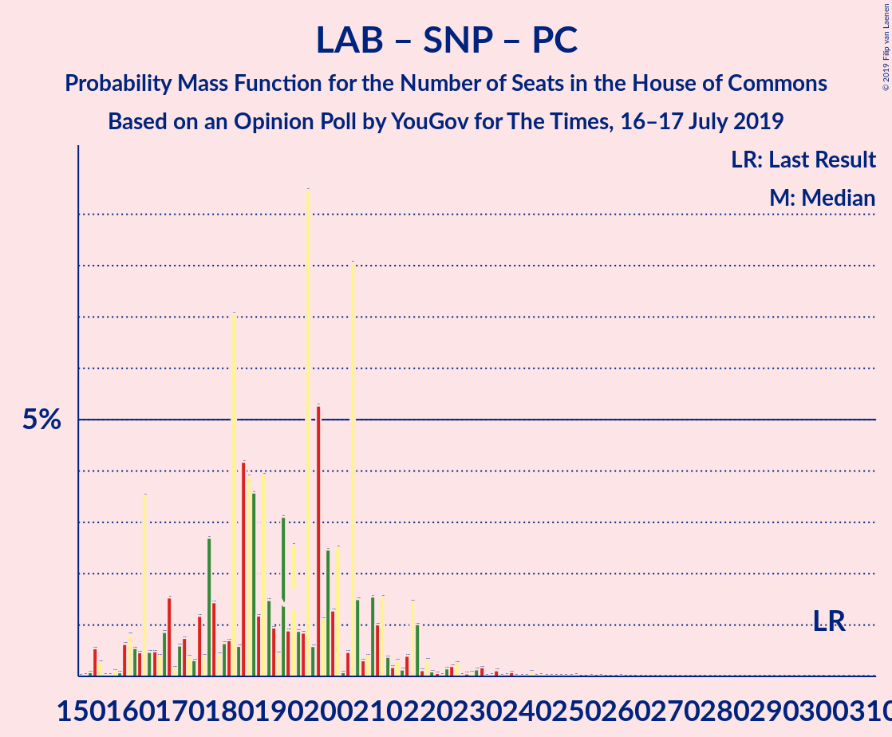

| Number of Seats | Probability | Accumulated | Special Marks |
|:---------------:|:-----------:|:-----------:|:-------------:|
| 151 | 0% | 100% |  |
| 152 | 0.1% | 99.9% |  |
| 153 | 0.5% | 99.8% |  |
| 154 | 0.3% | 99.3% |  |
| 155 | 0% | 99.0% |  |
| 156 | 0% | 99.0% |  |
| 157 | 0.1% | 99.0% |  |
| 158 | 0.1% | 98.9% |  |
| 159 | 0.6% | 98.8% |  |
| 160 | 0.8% | 98% |  |
| 161 | 0.5% | 97% |  |
| 162 | 0.5% | 97% |  |
| 163 | 4% | 96% |  |
| 164 | 0.5% | 93% |  |
| 165 | 0.5% | 92% |  |
| 166 | 0.4% | 92% |  |
| 167 | 0.9% | 91% |  |
| 168 | 2% | 91% |  |
| 169 | 0.2% | 89% |  |
| 170 | 0.6% | 89% |  |
| 171 | 0.7% | 88% |  |
| 172 | 0.4% | 88% |  |
| 173 | 0.3% | 87% |  |
| 174 | 1.2% | 87% |  |
| 175 | 0.4% | 86% |  |
| 176 | 3% | 85% |  |
| 177 | 1.4% | 83% |  |
| 178 | 0.4% | 81% |  |
| 179 | 0.6% | 81% |  |
| 180 | 0.7% | 80% |  |
| 181 | 7% | 79% |  |
| 182 | 0.6% | 72% |  |
| 183 | 4% | 72% |  |
| 184 | 4% | 68% |  |
| 185 | 4% | 64% |  |
| 186 | 1.2% | 60% |  |
| 187 | 4% | 59% |  |
| 188 | 1.5% | 55% |  |
| 189 | 0.9% | 53% |  |
| 190 | 0.5% | 53% | Median |
| 191 | 3% | 52% |  |
| 192 | 0.9% | 49% |  |
| 193 | 3% | 48% |  |
| 194 | 0.9% | 46% |  |
| 195 | 0.8% | 45% |  |
| 196 | 9% | 44% |  |
| 197 | 0.6% | 34% |  |
| 198 | 5% | 34% |  |
| 199 | 1.1% | 28% |  |
| 200 | 2% | 27% |  |
| 201 | 1.3% | 25% |  |
| 202 | 3% | 24% |  |
| 203 | 0.1% | 21% |  |
| 204 | 0.5% | 21% |  |
| 205 | 8% | 21% |  |
| 206 | 1.5% | 12% |  |
| 207 | 0.3% | 11% |  |
| 208 | 0.4% | 11% |  |
| 209 | 2% | 10% |  |
| 210 | 1.0% | 9% |  |
| 211 | 2% | 8% |  |
| 212 | 0.4% | 6% |  |
| 213 | 0.2% | 6% |  |
| 214 | 0.3% | 6% |  |
| 215 | 0.1% | 5% |  |
| 216 | 0.4% | 5% |  |
| 217 | 1.5% | 5% |  |
| 218 | 1.0% | 3% |  |
| 219 | 0.1% | 2% |  |
| 220 | 0.3% | 2% |  |
| 221 | 0.1% | 2% |  |
| 222 | 0.1% | 2% |  |
| 223 | 0% | 2% |  |
| 224 | 0.2% | 2% |  |
| 225 | 0.2% | 2% |  |
| 226 | 0.3% | 1.3% |  |
| 227 | 0% | 1.1% |  |
| 228 | 0.1% | 1.0% |  |
| 229 | 0.1% | 1.0% |  |
| 230 | 0.1% | 0.9% |  |
| 231 | 0.2% | 0.8% |  |
| 232 | 0% | 0.6% |  |
| 233 | 0% | 0.6% |  |
| 234 | 0.1% | 0.5% |  |
| 235 | 0% | 0.4% |  |
| 236 | 0% | 0.4% |  |
| 237 | 0.1% | 0.4% |  |
| 238 | 0% | 0.3% |  |
| 239 | 0% | 0.3% |  |
| 240 | 0% | 0.3% |  |
| 241 | 0.1% | 0.3% |  |
| 242 | 0% | 0.2% |  |
| 243 | 0% | 0.2% |  |
| 244 | 0% | 0.1% |  |
| 245 | 0% | 0.1% |  |
| 246 | 0% | 0.1% |  |
| 247 | 0% | 0.1% |  |
| 248 | 0% | 0.1% |  |
| 249 | 0% | 0.1% |  |
| 250 | 0% | 0.1% |  |
| 251 | 0% | 0% |  |
| 252 | 0% | 0% |  |
| 253 | 0% | 0% |  |
| 254 | 0% | 0% |  |
| 255 | 0% | 0% |  |
| 256 | 0% | 0% |  |
| 257 | 0% | 0% |  |
| 258 | 0% | 0% |  |
| 259 | 0% | 0% |  |
| 260 | 0% | 0% |  |
| 261 | 0% | 0% |  |
| 262 | 0% | 0% |  |
| 263 | 0% | 0% |  |
| 264 | 0% | 0% |  |
| 265 | 0% | 0% |  |
| 266 | 0% | 0% |  |
| 267 | 0% | 0% |  |
| 268 | 0% | 0% |  |
| 269 | 0% | 0% |  |
| 270 | 0% | 0% |  |
| 271 | 0% | 0% |  |
| 272 | 0% | 0% |  |
| 273 | 0% | 0% |  |
| 274 | 0% | 0% |  |
| 275 | 0% | 0% |  |
| 276 | 0% | 0% |  |
| 277 | 0% | 0% |  |
| 278 | 0% | 0% |  |
| 279 | 0% | 0% |  |
| 280 | 0% | 0% |  |
| 281 | 0% | 0% |  |
| 282 | 0% | 0% |  |
| 283 | 0% | 0% |  |
| 284 | 0% | 0% |  |
| 285 | 0% | 0% |  |
| 286 | 0% | 0% |  |
| 287 | 0% | 0% |  |
| 288 | 0% | 0% |  |
| 289 | 0% | 0% |  |
| 290 | 0% | 0% |  |
| 291 | 0% | 0% |  |
| 292 | 0% | 0% |  |
| 293 | 0% | 0% |  |
| 294 | 0% | 0% |  |
| 295 | 0% | 0% |  |
| 296 | 0% | 0% |  |
| 297 | 0% | 0% |  |
| 298 | 0% | 0% |  |
| 299 | 0% | 0% |  |
| 300 | 0% | 0% |  |
| 301 | 0% | 0% | Last Result |

### Labour Party – Scottish National Party

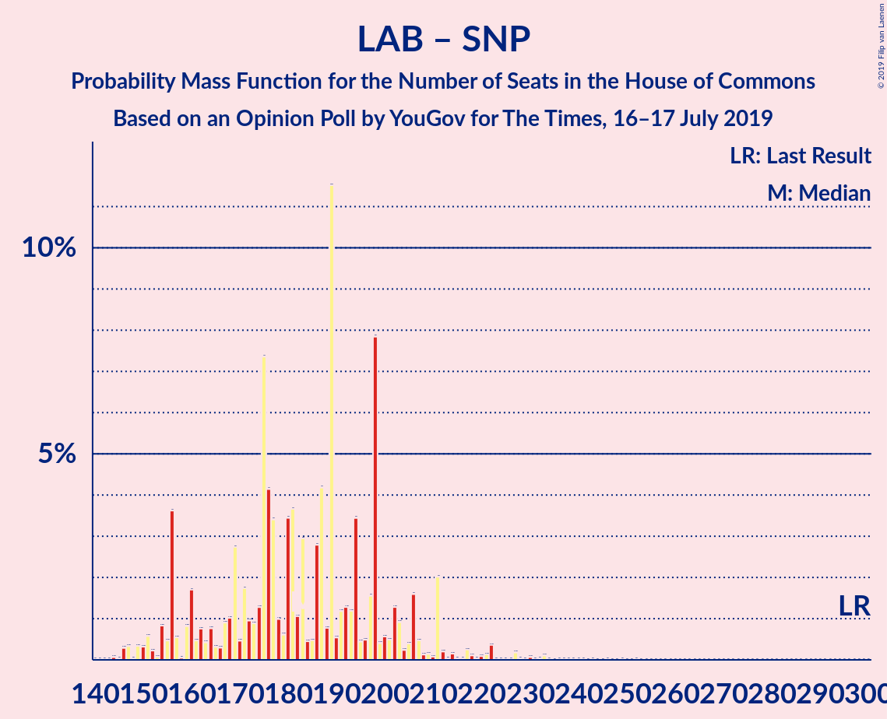

| Number of Seats | Probability | Accumulated | Special Marks |
|:---------------:|:-----------:|:-----------:|:-------------:|
| 143 | 0% | 100% |  |
| 144 | 0.1% | 99.9% |  |
| 145 | 0% | 99.9% |  |
| 146 | 0.3% | 99.8% |  |
| 147 | 0.3% | 99.6% |  |
| 148 | 0% | 99.2% |  |
| 149 | 0.3% | 99.2% |  |
| 150 | 0.3% | 98.8% |  |
| 151 | 0.6% | 98.5% |  |
| 152 | 0.2% | 98% |  |
| 153 | 0.1% | 98% |  |
| 154 | 0.8% | 98% |  |
| 155 | 0.5% | 97% |  |
| 156 | 4% | 96% |  |
| 157 | 0.5% | 93% |  |
| 158 | 0% | 92% |  |
| 159 | 0.8% | 92% |  |
| 160 | 2% | 91% |  |
| 161 | 0.5% | 90% |  |
| 162 | 0.8% | 89% |  |
| 163 | 0.4% | 88% |  |
| 164 | 0.8% | 88% |  |
| 165 | 0.3% | 87% |  |
| 166 | 0.3% | 87% |  |
| 167 | 0.9% | 87% |  |
| 168 | 1.0% | 86% |  |
| 169 | 3% | 85% |  |
| 170 | 0.5% | 82% |  |
| 171 | 2% | 81% |  |
| 172 | 1.0% | 80% |  |
| 173 | 0.9% | 79% |  |
| 174 | 1.3% | 78% |  |
| 175 | 7% | 77% |  |
| 176 | 4% | 69% |  |
| 177 | 3% | 65% |  |
| 178 | 1.0% | 62% |  |
| 179 | 0.6% | 61% |  |
| 180 | 3% | 60% |  |
| 181 | 4% | 57% |  |
| 182 | 1.1% | 53% |  |
| 183 | 3% | 52% | Median |
| 184 | 0.5% | 49% |  |
| 185 | 0.5% | 49% |  |
| 186 | 3% | 48% |  |
| 187 | 4% | 45% |  |
| 188 | 0.8% | 41% |  |
| 189 | 12% | 40% |  |
| 190 | 0.5% | 29% |  |
| 191 | 1.2% | 28% |  |
| 192 | 1.3% | 27% |  |
| 193 | 1.2% | 26% |  |
| 194 | 3% | 25% |  |
| 195 | 0.4% | 21% |  |
| 196 | 0.5% | 21% |  |
| 197 | 2% | 20% |  |
| 198 | 8% | 19% |  |
| 199 | 0.4% | 11% |  |
| 200 | 0.6% | 10% |  |
| 201 | 0.5% | 10% |  |
| 202 | 1.3% | 9% |  |
| 203 | 0.9% | 8% |  |
| 204 | 0.2% | 7% |  |
| 205 | 0.4% | 7% |  |
| 206 | 2% | 7% |  |
| 207 | 0.5% | 5% |  |
| 208 | 0.1% | 4% |  |
| 209 | 0.1% | 4% |  |
| 210 | 0.1% | 4% |  |
| 211 | 2% | 4% |  |
| 212 | 0.2% | 2% |  |
| 213 | 0% | 2% |  |
| 214 | 0.2% | 2% |  |
| 215 | 0% | 2% |  |
| 216 | 0% | 2% |  |
| 217 | 0.2% | 2% |  |
| 218 | 0.1% | 1.4% |  |
| 219 | 0% | 1.3% |  |
| 220 | 0.1% | 1.2% |  |
| 221 | 0.1% | 1.2% |  |
| 222 | 0.4% | 1.0% |  |
| 223 | 0% | 0.7% |  |
| 224 | 0% | 0.6% |  |
| 225 | 0% | 0.6% |  |
| 226 | 0% | 0.6% |  |
| 227 | 0.2% | 0.6% |  |
| 228 | 0% | 0.4% |  |
| 229 | 0% | 0.4% |  |
| 230 | 0.1% | 0.4% |  |
| 231 | 0% | 0.3% |  |
| 232 | 0% | 0.3% |  |
| 233 | 0.1% | 0.2% |  |
| 234 | 0% | 0.1% |  |
| 235 | 0% | 0.1% |  |
| 236 | 0% | 0.1% |  |
| 237 | 0% | 0.1% |  |
| 238 | 0% | 0.1% |  |
| 239 | 0% | 0.1% |  |
| 240 | 0% | 0.1% |  |
| 241 | 0% | 0.1% |  |
| 242 | 0% | 0.1% |  |
| 243 | 0% | 0.1% |  |
| 244 | 0% | 0.1% |  |
| 245 | 0% | 0.1% |  |
| 246 | 0% | 0.1% |  |
| 247 | 0% | 0% |  |
| 248 | 0% | 0% |  |
| 249 | 0% | 0% |  |
| 250 | 0% | 0% |  |
| 251 | 0% | 0% |  |
| 252 | 0% | 0% |  |
| 253 | 0% | 0% |  |
| 254 | 0% | 0% |  |
| 255 | 0% | 0% |  |
| 256 | 0% | 0% |  |
| 257 | 0% | 0% |  |
| 258 | 0% | 0% |  |
| 259 | 0% | 0% |  |
| 260 | 0% | 0% |  |
| 261 | 0% | 0% |  |
| 262 | 0% | 0% |  |
| 263 | 0% | 0% |  |
| 264 | 0% | 0% |  |
| 265 | 0% | 0% |  |
| 266 | 0% | 0% |  |
| 267 | 0% | 0% |  |
| 268 | 0% | 0% |  |
| 269 | 0% | 0% |  |
| 270 | 0% | 0% |  |
| 271 | 0% | 0% |  |
| 272 | 0% | 0% |  |
| 273 | 0% | 0% |  |
| 274 | 0% | 0% |  |
| 275 | 0% | 0% |  |
| 276 | 0% | 0% |  |
| 277 | 0% | 0% |  |
| 278 | 0% | 0% |  |
| 279 | 0% | 0% |  |
| 280 | 0% | 0% |  |
| 281 | 0% | 0% |  |
| 282 | 0% | 0% |  |
| 283 | 0% | 0% |  |
| 284 | 0% | 0% |  |
| 285 | 0% | 0% |  |
| 286 | 0% | 0% |  |
| 287 | 0% | 0% |  |
| 288 | 0% | 0% |  |
| 289 | 0% | 0% |  |
| 290 | 0% | 0% |  |
| 291 | 0% | 0% |  |
| 292 | 0% | 0% |  |
| 293 | 0% | 0% |  |
| 294 | 0% | 0% |  |
| 295 | 0% | 0% |  |
| 296 | 0% | 0% |  |
| 297 | 0% | 0% | Last Result |

### Labour Party – Plaid Cymru

| Number of Seats | Probability | Accumulated | Special Marks |
|:---------------:|:-----------:|:-----------:|:-------------:|
| 98 | 0% | 100% |  |
| 99 | 0% | 99.9% |  |
| 100 | 0.1% | 99.9% |  |
| 101 | 0.2% | 99.8% |  |
| 102 | 0.3% | 99.6% |  |
| 103 | 0.3% | 99.3% |  |
| 104 | 0% | 99.0% |  |
| 105 | 0.2% | 99.0% |  |
| 106 | 0.2% | 98.8% |  |
| 107 | 0.4% | 98.6% |  |
| 108 | 0.9% | 98% |  |
| 109 | 0.6% | 97% |  |
| 110 | 0.8% | 97% |  |
| 111 | 0.1% | 96% |  |
| 112 | 0.4% | 96% |  |
| 113 | 3% | 95% |  |
| 114 | 0.5% | 92% |  |
| 115 | 0.4% | 91% |  |
| 116 | 1.0% | 91% |  |
| 117 | 0.3% | 90% |  |
| 118 | 2% | 90% |  |
| 119 | 0.8% | 88% |  |
| 120 | 0.8% | 87% |  |
| 121 | 0.3% | 87% |  |
| 122 | 0.4% | 86% |  |
| 123 | 0.8% | 86% |  |
| 124 | 0.8% | 85% |  |
| 125 | 0.1% | 84% |  |
| 126 | 3% | 84% |  |
| 127 | 2% | 81% |  |
| 128 | 0.7% | 79% |  |
| 129 | 1.0% | 79% |  |
| 130 | 8% | 78% |  |
| 131 | 1.4% | 70% |  |
| 132 | 6% | 68% |  |
| 133 | 3% | 63% |  |
| 134 | 1.5% | 59% |  |
| 135 | 3% | 58% |  |
| 136 | 0.9% | 55% |  |
| 137 | 2% | 54% |  |
| 138 | 0.6% | 52% |  |
| 139 | 3% | 52% | Median |
| 140 | 3% | 49% |  |
| 141 | 0.4% | 46% |  |
| 142 | 1.1% | 46% |  |
| 143 | 0.8% | 45% |  |
| 144 | 7% | 44% |  |
| 145 | 1.1% | 37% |  |
| 146 | 4% | 36% |  |
| 147 | 0.8% | 32% |  |
| 148 | 9% | 31% |  |
| 149 | 0.4% | 23% |  |
| 150 | 0.6% | 22% |  |
| 151 | 0.4% | 21% |  |
| 152 | 0.3% | 21% |  |
| 153 | 0.4% | 21% |  |
| 154 | 9% | 20% |  |
| 155 | 2% | 12% |  |
| 156 | 0.7% | 10% |  |
| 157 | 0.5% | 9% |  |
| 158 | 0.6% | 9% |  |
| 159 | 0.4% | 8% |  |
| 160 | 1.3% | 8% |  |
| 161 | 1.1% | 7% |  |
| 162 | 0.1% | 5% |  |
| 163 | 1.3% | 5% |  |
| 164 | 0.8% | 4% |  |
| 165 | 0.2% | 3% |  |
| 166 | 0.3% | 3% |  |
| 167 | 0.6% | 3% |  |
| 168 | 0.1% | 2% |  |
| 169 | 0.1% | 2% |  |
| 170 | 0.2% | 2% |  |
| 171 | 0.1% | 2% |  |
| 172 | 0.1% | 2% |  |
| 173 | 0% | 2% |  |
| 174 | 0.3% | 2% |  |
| 175 | 0.1% | 1.3% |  |
| 176 | 0.3% | 1.2% |  |
| 177 | 0% | 0.9% |  |
| 178 | 0% | 0.9% |  |
| 179 | 0.1% | 0.9% |  |
| 180 | 0.1% | 0.8% |  |
| 181 | 0.1% | 0.7% |  |
| 182 | 0% | 0.6% |  |
| 183 | 0.1% | 0.5% |  |
| 184 | 0.1% | 0.4% |  |
| 185 | 0% | 0.3% |  |
| 186 | 0% | 0.3% |  |
| 187 | 0% | 0.3% |  |
| 188 | 0.1% | 0.3% |  |
| 189 | 0% | 0.2% |  |
| 190 | 0% | 0.2% |  |
| 191 | 0% | 0.2% |  |
| 192 | 0% | 0.1% |  |
| 193 | 0% | 0.1% |  |
| 194 | 0% | 0.1% |  |
| 195 | 0% | 0.1% |  |
| 196 | 0% | 0.1% |  |
| 197 | 0% | 0.1% |  |
| 198 | 0% | 0.1% |  |
| 199 | 0% | 0.1% |  |
| 200 | 0% | 0% |  |
| 201 | 0% | 0% |  |
| 202 | 0% | 0% |  |
| 203 | 0% | 0% |  |
| 204 | 0% | 0% |  |
| 205 | 0% | 0% |  |
| 206 | 0% | 0% |  |
| 207 | 0% | 0% |  |
| 208 | 0% | 0% |  |
| 209 | 0% | 0% |  |
| 210 | 0% | 0% |  |
| 211 | 0% | 0% |  |
| 212 | 0% | 0% |  |
| 213 | 0% | 0% |  |
| 214 | 0% | 0% |  |
| 215 | 0% | 0% |  |
| 216 | 0% | 0% |  |
| 217 | 0% | 0% |  |
| 218 | 0% | 0% |  |
| 219 | 0% | 0% |  |
| 220 | 0% | 0% |  |
| 221 | 0% | 0% |  |
| 222 | 0% | 0% |  |
| 223 | 0% | 0% |  |
| 224 | 0% | 0% |  |
| 225 | 0% | 0% |  |
| 226 | 0% | 0% |  |
| 227 | 0% | 0% |  |
| 228 | 0% | 0% |  |
| 229 | 0% | 0% |  |
| 230 | 0% | 0% |  |
| 231 | 0% | 0% |  |
| 232 | 0% | 0% |  |
| 233 | 0% | 0% |  |
| 234 | 0% | 0% |  |
| 235 | 0% | 0% |  |
| 236 | 0% | 0% |  |
| 237 | 0% | 0% |  |
| 238 | 0% | 0% |  |
| 239 | 0% | 0% |  |
| 240 | 0% | 0% |  |
| 241 | 0% | 0% |  |
| 242 | 0% | 0% |  |
| 243 | 0% | 0% |  |
| 244 | 0% | 0% |  |
| 245 | 0% | 0% |  |
| 246 | 0% | 0% |  |
| 247 | 0% | 0% |  |
| 248 | 0% | 0% |  |
| 249 | 0% | 0% |  |
| 250 | 0% | 0% |  |
| 251 | 0% | 0% |  |
| 252 | 0% | 0% |  |
| 253 | 0% | 0% |  |
| 254 | 0% | 0% |  |
| 255 | 0% | 0% |  |
| 256 | 0% | 0% |  |
| 257 | 0% | 0% |  |
| 258 | 0% | 0% |  |
| 259 | 0% | 0% |  |
| 260 | 0% | 0% |  |
| 261 | 0% | 0% |  |
| 262 | 0% | 0% |  |
| 263 | 0% | 0% |  |
| 264 | 0% | 0% |  |
| 265 | 0% | 0% |  |
| 266 | 0% | 0% | Last Result |

### Labour Party – Change UK

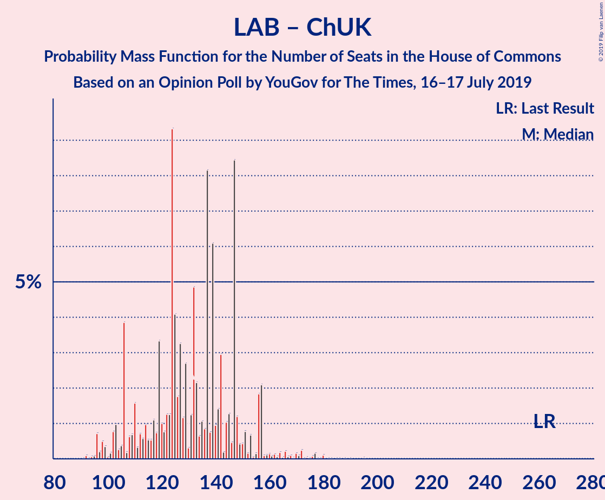

| Number of Seats | Probability | Accumulated | Special Marks |
|:---------------:|:-----------:|:-----------:|:-------------:|
| 91 | 0% | 100% |  |
| 92 | 0.1% | 99.9% |  |
| 93 | 0% | 99.9% |  |
| 94 | 0.1% | 99.8% |  |
| 95 | 0.1% | 99.8% |  |
| 96 | 0.7% | 99.7% |  |
| 97 | 0.2% | 99.0% |  |
| 98 | 0.5% | 98.8% |  |
| 99 | 0.3% | 98% |  |
| 100 | 0.1% | 98% |  |
| 101 | 0.2% | 98% |  |
| 102 | 0.8% | 98% |  |
| 103 | 1.0% | 97% |  |
| 104 | 0.3% | 96% |  |
| 105 | 0.4% | 96% |  |
| 106 | 4% | 95% |  |
| 107 | 0.2% | 91% |  |
| 108 | 0.6% | 91% |  |
| 109 | 0.7% | 91% |  |
| 110 | 2% | 90% |  |
| 111 | 0.3% | 88% |  |
| 112 | 0.7% | 88% |  |
| 113 | 0.6% | 87% |  |
| 114 | 1.0% | 87% |  |
| 115 | 0.5% | 86% |  |
| 116 | 0.5% | 85% |  |
| 117 | 1.1% | 85% |  |
| 118 | 0.7% | 84% |  |
| 119 | 3% | 83% |  |
| 120 | 1.0% | 80% |  |
| 121 | 0.8% | 79% |  |
| 122 | 1.3% | 78% |  |
| 123 | 1.3% | 77% |  |
| 124 | 9% | 75% |  |
| 125 | 4% | 66% |  |
| 126 | 2% | 62% |  |
| 127 | 3% | 60% |  |
| 128 | 1.2% | 57% |  |
| 129 | 3% | 56% |  |
| 130 | 0.3% | 53% |  |
| 131 | 1.2% | 53% |  |
| 132 | 5% | 51% | Median |
| 133 | 2% | 47% |  |
| 134 | 0.6% | 44% |  |
| 135 | 1.1% | 44% |  |
| 136 | 0.9% | 43% |  |
| 137 | 8% | 42% |  |
| 138 | 0.8% | 34% |  |
| 139 | 6% | 33% |  |
| 140 | 0.9% | 27% |  |
| 141 | 1.4% | 26% |  |
| 142 | 3% | 25% |  |
| 143 | 0.2% | 22% |  |
| 144 | 1.0% | 21% |  |
| 145 | 1.3% | 20% |  |
| 146 | 0.5% | 19% |  |
| 147 | 8% | 19% |  |
| 148 | 1.2% | 10% |  |
| 149 | 0.4% | 9% |  |
| 150 | 0.4% | 9% |  |
| 151 | 0.8% | 8% |  |
| 152 | 0.2% | 7% |  |
| 153 | 0.7% | 7% |  |
| 154 | 0.1% | 7% |  |
| 155 | 0.2% | 6% |  |
| 156 | 2% | 6% |  |
| 157 | 2% | 4% |  |
| 158 | 0.1% | 2% |  |
| 159 | 0.1% | 2% |  |
| 160 | 0.1% | 2% |  |
| 161 | 0.1% | 2% |  |
| 162 | 0.1% | 2% |  |
| 163 | 0.1% | 2% |  |
| 164 | 0.2% | 2% |  |
| 165 | 0% | 2% |  |
| 166 | 0.2% | 2% |  |
| 167 | 0.1% | 1.3% |  |
| 168 | 0.1% | 1.3% |  |
| 169 | 0% | 1.2% |  |
| 170 | 0.2% | 1.1% |  |
| 171 | 0.1% | 1.0% |  |
| 172 | 0.2% | 0.9% |  |
| 173 | 0% | 0.6% |  |
| 174 | 0% | 0.6% |  |
| 175 | 0% | 0.6% |  |
| 176 | 0.1% | 0.6% |  |
| 177 | 0.2% | 0.5% |  |
| 178 | 0% | 0.3% |  |
| 179 | 0% | 0.3% |  |
| 180 | 0.1% | 0.3% |  |
| 181 | 0% | 0.2% |  |
| 182 | 0% | 0.2% |  |
| 183 | 0% | 0.1% |  |
| 184 | 0% | 0.1% |  |
| 185 | 0% | 0.1% |  |
| 186 | 0% | 0.1% |  |
| 187 | 0% | 0.1% |  |
| 188 | 0% | 0.1% |  |
| 189 | 0% | 0.1% |  |
| 190 | 0% | 0.1% |  |
| 191 | 0% | 0.1% |  |
| 192 | 0% | 0.1% |  |
| 193 | 0% | 0.1% |  |
| 194 | 0% | 0.1% |  |
| 195 | 0% | 0.1% |  |
| 196 | 0% | 0% |  |
| 197 | 0% | 0% |  |
| 198 | 0% | 0% |  |
| 199 | 0% | 0% |  |
| 200 | 0% | 0% |  |
| 201 | 0% | 0% |  |
| 202 | 0% | 0% |  |
| 203 | 0% | 0% |  |
| 204 | 0% | 0% |  |
| 205 | 0% | 0% |  |
| 206 | 0% | 0% |  |
| 207 | 0% | 0% |  |
| 208 | 0% | 0% |  |
| 209 | 0% | 0% |  |
| 210 | 0% | 0% |  |
| 211 | 0% | 0% |  |
| 212 | 0% | 0% |  |
| 213 | 0% | 0% |  |
| 214 | 0% | 0% |  |
| 215 | 0% | 0% |  |
| 216 | 0% | 0% |  |
| 217 | 0% | 0% |  |
| 218 | 0% | 0% |  |
| 219 | 0% | 0% |  |
| 220 | 0% | 0% |  |
| 221 | 0% | 0% |  |
| 222 | 0% | 0% |  |
| 223 | 0% | 0% |  |
| 224 | 0% | 0% |  |
| 225 | 0% | 0% |  |
| 226 | 0% | 0% |  |
| 227 | 0% | 0% |  |
| 228 | 0% | 0% |  |
| 229 | 0% | 0% |  |
| 230 | 0% | 0% |  |
| 231 | 0% | 0% |  |
| 232 | 0% | 0% |  |
| 233 | 0% | 0% |  |
| 234 | 0% | 0% |  |
| 235 | 0% | 0% |  |
| 236 | 0% | 0% |  |
| 237 | 0% | 0% |  |
| 238 | 0% | 0% |  |
| 239 | 0% | 0% |  |
| 240 | 0% | 0% |  |
| 241 | 0% | 0% |  |
| 242 | 0% | 0% |  |
| 243 | 0% | 0% |  |
| 244 | 0% | 0% |  |
| 245 | 0% | 0% |  |
| 246 | 0% | 0% |  |
| 247 | 0% | 0% |  |
| 248 | 0% | 0% |  |
| 249 | 0% | 0% |  |
| 250 | 0% | 0% |  |
| 251 | 0% | 0% |  |
| 252 | 0% | 0% |  |
| 253 | 0% | 0% |  |
| 254 | 0% | 0% |  |
| 255 | 0% | 0% |  |
| 256 | 0% | 0% |  |
| 257 | 0% | 0% |  |
| 258 | 0% | 0% |  |
| 259 | 0% | 0% |  |
| 260 | 0% | 0% |  |
| 261 | 0% | 0% |  |
| 262 | 0% | 0% | Last Result |

### Labour Party

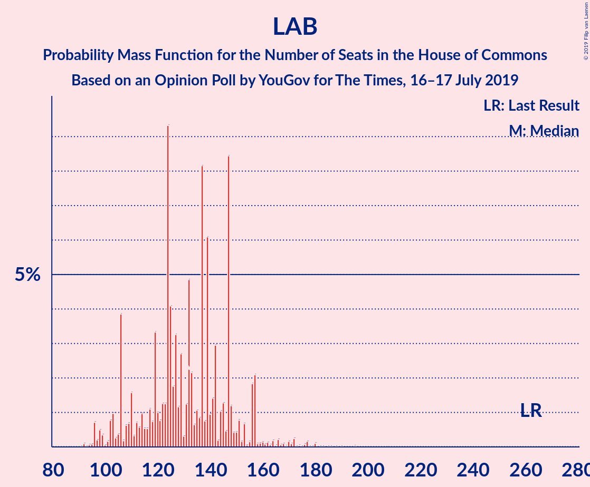

| Number of Seats | Probability | Accumulated | Special Marks |
|:---------------:|:-----------:|:-----------:|:-------------:|
| 91 | 0% | 100% |  |
| 92 | 0.1% | 99.9% |  |
| 93 | 0% | 99.9% |  |
| 94 | 0.1% | 99.8% |  |
| 95 | 0.1% | 99.8% |  |
| 96 | 0.7% | 99.7% |  |
| 97 | 0.2% | 99.0% |  |
| 98 | 0.5% | 98.8% |  |
| 99 | 0.3% | 98% |  |
| 100 | 0.1% | 98% |  |
| 101 | 0.2% | 98% |  |
| 102 | 0.8% | 98% |  |
| 103 | 1.0% | 97% |  |
| 104 | 0.3% | 96% |  |
| 105 | 0.4% | 96% |  |
| 106 | 4% | 95% |  |
| 107 | 0.2% | 91% |  |
| 108 | 0.6% | 91% |  |
| 109 | 0.7% | 91% |  |
| 110 | 2% | 90% |  |
| 111 | 0.3% | 88% |  |
| 112 | 0.7% | 88% |  |
| 113 | 0.6% | 87% |  |
| 114 | 1.0% | 87% |  |
| 115 | 0.5% | 86% |  |
| 116 | 0.5% | 85% |  |
| 117 | 1.1% | 85% |  |
| 118 | 0.7% | 84% |  |
| 119 | 3% | 83% |  |
| 120 | 1.0% | 80% |  |
| 121 | 0.8% | 79% |  |
| 122 | 1.3% | 78% |  |
| 123 | 1.3% | 77% |  |
| 124 | 9% | 75% |  |
| 125 | 4% | 66% |  |
| 126 | 2% | 62% |  |
| 127 | 3% | 60% |  |
| 128 | 1.2% | 57% |  |
| 129 | 3% | 56% |  |
| 130 | 0.3% | 53% |  |
| 131 | 1.2% | 53% |  |
| 132 | 5% | 51% | Median |
| 133 | 2% | 47% |  |
| 134 | 0.6% | 44% |  |
| 135 | 1.1% | 44% |  |
| 136 | 0.9% | 43% |  |
| 137 | 8% | 42% |  |
| 138 | 0.8% | 34% |  |
| 139 | 6% | 33% |  |
| 140 | 0.9% | 27% |  |
| 141 | 1.4% | 26% |  |
| 142 | 3% | 25% |  |
| 143 | 0.2% | 22% |  |
| 144 | 1.0% | 21% |  |
| 145 | 1.3% | 20% |  |
| 146 | 0.5% | 19% |  |
| 147 | 8% | 19% |  |
| 148 | 1.2% | 10% |  |
| 149 | 0.4% | 9% |  |
| 150 | 0.4% | 9% |  |
| 151 | 0.8% | 8% |  |
| 152 | 0.2% | 7% |  |
| 153 | 0.7% | 7% |  |
| 154 | 0.1% | 7% |  |
| 155 | 0.2% | 6% |  |
| 156 | 2% | 6% |  |
| 157 | 2% | 4% |  |
| 158 | 0.1% | 2% |  |
| 159 | 0.1% | 2% |  |
| 160 | 0.1% | 2% |  |
| 161 | 0.1% | 2% |  |
| 162 | 0.1% | 2% |  |
| 163 | 0.1% | 2% |  |
| 164 | 0.2% | 2% |  |
| 165 | 0% | 2% |  |
| 166 | 0.2% | 2% |  |
| 167 | 0.1% | 1.3% |  |
| 168 | 0.1% | 1.3% |  |
| 169 | 0% | 1.2% |  |
| 170 | 0.2% | 1.1% |  |
| 171 | 0.1% | 1.0% |  |
| 172 | 0.2% | 0.9% |  |
| 173 | 0% | 0.6% |  |
| 174 | 0% | 0.6% |  |
| 175 | 0% | 0.6% |  |
| 176 | 0.1% | 0.6% |  |
| 177 | 0.2% | 0.5% |  |
| 178 | 0% | 0.3% |  |
| 179 | 0% | 0.3% |  |
| 180 | 0.1% | 0.3% |  |
| 181 | 0% | 0.2% |  |
| 182 | 0% | 0.2% |  |
| 183 | 0% | 0.1% |  |
| 184 | 0% | 0.1% |  |
| 185 | 0% | 0.1% |  |
| 186 | 0% | 0.1% |  |
| 187 | 0% | 0.1% |  |
| 188 | 0% | 0.1% |  |
| 189 | 0% | 0.1% |  |
| 190 | 0% | 0.1% |  |
| 191 | 0% | 0.1% |  |
| 192 | 0% | 0.1% |  |
| 193 | 0% | 0.1% |  |
| 194 | 0% | 0.1% |  |
| 195 | 0% | 0.1% |  |
| 196 | 0% | 0% |  |
| 197 | 0% | 0% |  |
| 198 | 0% | 0% |  |
| 199 | 0% | 0% |  |
| 200 | 0% | 0% |  |
| 201 | 0% | 0% |  |
| 202 | 0% | 0% |  |
| 203 | 0% | 0% |  |
| 204 | 0% | 0% |  |
| 205 | 0% | 0% |  |
| 206 | 0% | 0% |  |
| 207 | 0% | 0% |  |
| 208 | 0% | 0% |  |
| 209 | 0% | 0% |  |
| 210 | 0% | 0% |  |
| 211 | 0% | 0% |  |
| 212 | 0% | 0% |  |
| 213 | 0% | 0% |  |
| 214 | 0% | 0% |  |
| 215 | 0% | 0% |  |
| 216 | 0% | 0% |  |
| 217 | 0% | 0% |  |
| 218 | 0% | 0% |  |
| 219 | 0% | 0% |  |
| 220 | 0% | 0% |  |
| 221 | 0% | 0% |  |
| 222 | 0% | 0% |  |
| 223 | 0% | 0% |  |
| 224 | 0% | 0% |  |
| 225 | 0% | 0% |  |
| 226 | 0% | 0% |  |
| 227 | 0% | 0% |  |
| 228 | 0% | 0% |  |
| 229 | 0% | 0% |  |
| 230 | 0% | 0% |  |
| 231 | 0% | 0% |  |
| 232 | 0% | 0% |  |
| 233 | 0% | 0% |  |
| 234 | 0% | 0% |  |
| 235 | 0% | 0% |  |
| 236 | 0% | 0% |  |
| 237 | 0% | 0% |  |
| 238 | 0% | 0% |  |
| 239 | 0% | 0% |  |
| 240 | 0% | 0% |  |
| 241 | 0% | 0% |  |
| 242 | 0% | 0% |  |
| 243 | 0% | 0% |  |
| 244 | 0% | 0% |  |
| 245 | 0% | 0% |  |
| 246 | 0% | 0% |  |
| 247 | 0% | 0% |  |
| 248 | 0% | 0% |  |
| 249 | 0% | 0% |  |
| 250 | 0% | 0% |  |
| 251 | 0% | 0% |  |
| 252 | 0% | 0% |  |
| 253 | 0% | 0% |  |
| 254 | 0% | 0% |  |
| 255 | 0% | 0% |  |
| 256 | 0% | 0% |  |
| 257 | 0% | 0% |  |
| 258 | 0% | 0% |  |
| 259 | 0% | 0% |  |
| 260 | 0% | 0% |  |
| 261 | 0% | 0% |  |
| 262 | 0% | 0% | Last Result |

## Technical Information

### Opinion Poll

+ **Polling firm:** YouGov
+ **Commissioner(s):** The Times
+ **Fieldwork period:** 16–17 July 2019

### Calculations

+ **Sample size:** 1749
+ **Simulations done:** 1,048,576
+ **Error estimate:** 0.99%

