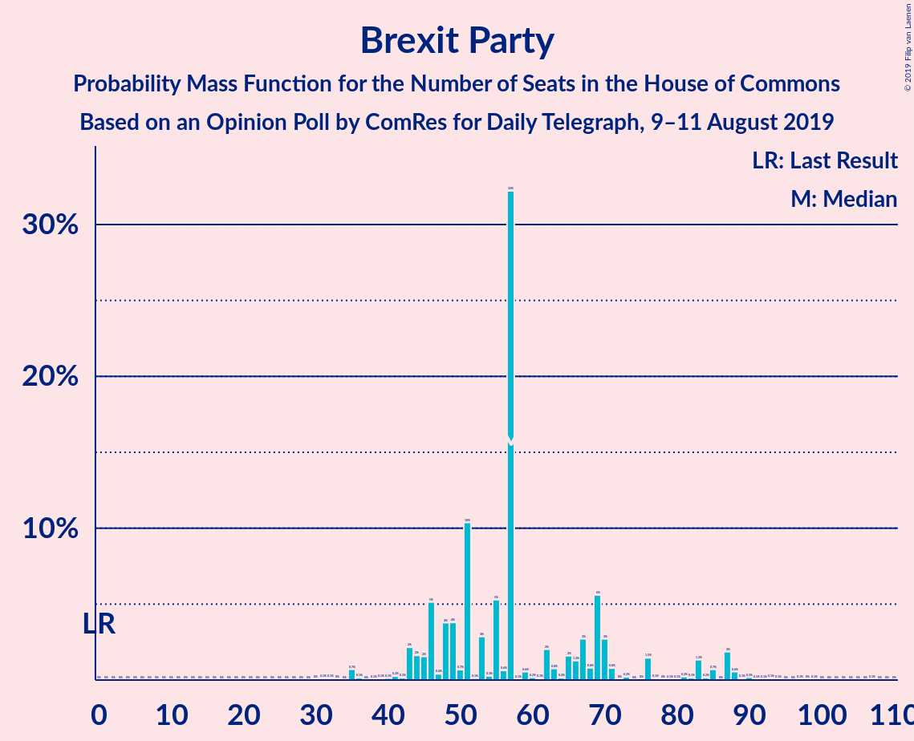
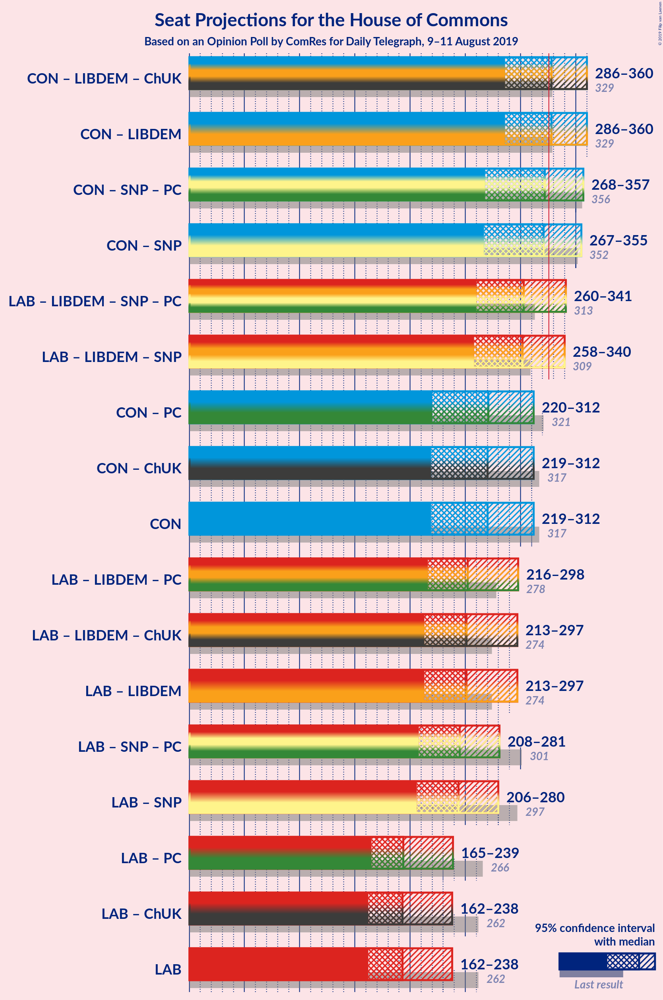

# Opinion Poll by ComRes for Daily Telegraph, 9–11 August 2019

<a href="#voting-intentions">Voting Intentions</a> | <a href="#seats">Seats</a> | <a href="#coalitions">Coalitions</a> | <a href="#technical-information">Technical Information</a>

## Voting Intentions

### Confidence Intervals

| Party | Last Result | Poll Result | 80% Confidence Interval | 90% Confidence Interval | 95% Confidence Interval | 99% Confidence Interval |
|:-----:|:-----------:|:-----------:|:-----------------------:|:-----------------------:|:-----------------------:|:-----------------------:|
| Conservative Party | 42.4% | 30.8% | 29.5–32.2% |29.2–32.6% |28.8–32.9% |28.2–33.5% |
| Labour Party | 40.0% | 26.9% | 25.6–28.2% |25.3–28.5% |25.0–28.8% |24.4–29.5% |
| Liberal Democrats | 7.4% | 15.9% | 14.9–17.0% |14.6–17.3% |14.4–17.6% |13.9–18.1% |
| Brexit Party | 0.0% | 15.9% | 14.9–17.0% |14.6–17.3% |14.4–17.6% |13.9–18.1% |
| Green Party | 1.6% | 4.0% | 3.5–4.6% |3.3–4.8% |3.2–4.9% |3.0–5.2% |
| Scottish National Party | 3.0% | 3.0% | 2.5–3.5% |2.4–3.7% |2.3–3.8% |2.1–4.1% |
| UK Independence Party | 1.8% | 1.0% | 0.8–1.4% |0.7–1.4% |0.6–1.5% |0.5–1.7% |
| Plaid Cymru | 0.5% | 0.2% | 0.2–0.5% |0.1–0.5% |0.1–0.6% |0.1–0.7% |
| Change UK | 0.0% | 0.2% | 0.2–0.5% |0.1–0.5% |0.1–0.6% |0.1–0.7% |

*Note:* The poll result column reflects the actual value used in the calculations. Published results may vary slightly, and in addition be rounded to fewer digits.

## Seats

### Confidence Intervals

| Party | Last Result | Median | 80% Confidence Interval | 90% Confidence Interval | 95% Confidence Interval | 99% Confidence Interval |
|:-----:|:-----------:|:------:|:-----------------------:|:-----------------------:|:-----------------------:|:-----------------------:|
| <a href="#conservative-party">Conservative Party</a> | 317 | 270 | 245–299 |241–307 |219–312 |218–321 |
| <a href="#labour-party">Labour Party</a> | 262 | 193 | 174–219 |162–223 |162–238 |158–238 |
| <a href="#liberal-democrats">Liberal Democrats</a> | 12 | 58 | 49–61 |49–65 |46–68 |46–68 |
| <a href="#brexit-party">Brexit Party</a> | 0 | 57 | 46–70 |44–83 |43–87 |35–91 |
| <a href="#green-party">Green Party</a> | 1 | 2 | 1–2 |1–2 |1–2 |1–2 |
| <a href="#scottish-national-party">Scottish National Party</a> | 35 | 50 | 42–51 |39–53 |39–53 |33–53 |
| <a href="#uk-independence-party">UK Independence Party</a> | 0 | 0 | 0 |0 |0 |0 |
| <a href="#plaid-cymru">Plaid Cymru</a> | 4 | 1 | 0–3 |0–3 |0–4 |0–4 |
| <a href="#change-uk">Change UK</a> | 0 | 0 | 0 |0 |0 |0 |

### Conservative Party

*For a full overview of the results for this party, see the [Conservative Party](party-conservativeparty.html) page.*

| Number of Seats | Probability | Accumulated | Special Marks |
|:---------------:|:-----------:|:-----------:|:-------------:|
| 196 | 0.1% | 100% |  |
| 197 | 0% | 99.9% |  |
| 198 | 0% | 99.9% |  |
| 199 | 0% | 99.9% |  |
| 200 | 0% | 99.9% |  |
| 201 | 0% | 99.9% |  |
| 202 | 0% | 99.9% |  |
| 203 | 0% | 99.9% |  |
| 204 | 0% | 99.9% |  |
| 205 | 0% | 99.9% |  |
| 206 | 0% | 99.9% |  |
| 207 | 0% | 99.9% |  |
| 208 | 0% | 99.9% |  |
| 209 | 0% | 99.9% |  |
| 210 | 0% | 99.9% |  |
| 211 | 0% | 99.9% |  |
| 212 | 0% | 99.9% |  |
| 213 | 0% | 99.9% |  |
| 214 | 0% | 99.9% |  |
| 215 | 0% | 99.8% |  |
| 216 | 0% | 99.8% |  |
| 217 | 0% | 99.8% |  |
| 218 | 2% | 99.8% |  |
| 219 | 0.3% | 98% |  |
| 220 | 0% | 97% |  |
| 221 | 0% | 97% |  |
| 222 | 0.2% | 97% |  |
| 223 | 0% | 97% |  |
| 224 | 0% | 97% |  |
| 225 | 0% | 97% |  |
| 226 | 0% | 97% |  |
| 227 | 0% | 97% |  |
| 228 | 0.1% | 97% |  |
| 229 | 0% | 97% |  |
| 230 | 0.2% | 97% |  |
| 231 | 0% | 97% |  |
| 232 | 0% | 97% |  |
| 233 | 0% | 97% |  |
| 234 | 0% | 97% |  |
| 235 | 0% | 97% |  |
| 236 | 0.1% | 97% |  |
| 237 | 0.1% | 97% |  |
| 238 | 0.3% | 97% |  |
| 239 | 0.4% | 96% |  |
| 240 | 0.1% | 96% |  |
| 241 | 3% | 96% |  |
| 242 | 0.8% | 93% |  |
| 243 | 0% | 92% |  |
| 244 | 0% | 92% |  |
| 245 | 6% | 92% |  |
| 246 | 0.1% | 86% |  |
| 247 | 0.1% | 86% |  |
| 248 | 0.1% | 86% |  |
| 249 | 0.1% | 86% |  |
| 250 | 0% | 86% |  |
| 251 | 0.2% | 86% |  |
| 252 | 0% | 86% |  |
| 253 | 0.3% | 86% |  |
| 254 | 0% | 85% |  |
| 255 | 1.1% | 85% |  |
| 256 | 0% | 84% |  |
| 257 | 4% | 84% |  |
| 258 | 0.2% | 80% |  |
| 259 | 1.0% | 80% |  |
| 260 | 0% | 79% |  |
| 261 | 0% | 79% |  |
| 262 | 1.5% | 78% |  |
| 263 | 0.2% | 77% |  |
| 264 | 3% | 77% |  |
| 265 | 2% | 74% |  |
| 266 | 3% | 72% |  |
| 267 | 0% | 68% |  |
| 268 | 0.1% | 68% |  |
| 269 | 0.3% | 68% |  |
| 270 | 32% | 68% | Median |
| 271 | 2% | 36% |  |
| 272 | 0.8% | 34% |  |
| 273 | 0.4% | 33% |  |
| 274 | 0.1% | 33% |  |
| 275 | 0.2% | 33% |  |
| 276 | 0.1% | 32% |  |
| 277 | 0.9% | 32% |  |
| 278 | 2% | 31% |  |
| 279 | 0.1% | 29% |  |
| 280 | 4% | 29% |  |
| 281 | 0.3% | 25% |  |
| 282 | 0.1% | 25% |  |
| 283 | 3% | 25% |  |
| 284 | 0.1% | 22% |  |
| 285 | 0.2% | 22% |  |
| 286 | 2% | 22% |  |
| 287 | 0.5% | 20% |  |
| 288 | 0% | 20% |  |
| 289 | 1.2% | 19% |  |
| 290 | 0.3% | 18% |  |
| 291 | 2% | 18% |  |
| 292 | 0.6% | 16% |  |
| 293 | 0% | 16% |  |
| 294 | 0.2% | 16% |  |
| 295 | 0.4% | 15% |  |
| 296 | 0% | 15% |  |
| 297 | 0.3% | 15% |  |
| 298 | 0% | 15% |  |
| 299 | 8% | 15% |  |
| 300 | 0% | 6% |  |
| 301 | 0% | 6% |  |
| 302 | 0% | 6% |  |
| 303 | 0% | 6% |  |
| 304 | 0% | 6% |  |
| 305 | 0% | 6% |  |
| 306 | 0.5% | 6% |  |
| 307 | 3% | 6% |  |
| 308 | 0% | 3% |  |
| 309 | 0% | 3% |  |
| 310 | 0% | 3% |  |
| 311 | 0% | 3% |  |
| 312 | 0.5% | 3% |  |
| 313 | 0.1% | 2% |  |
| 314 | 0% | 2% |  |
| 315 | 0% | 2% |  |
| 316 | 0% | 2% |  |
| 317 | 0% | 2% | Last Result |
| 318 | 0% | 2% |  |
| 319 | 0% | 2% |  |
| 320 | 0% | 2% |  |
| 321 | 2% | 2% |  |
| 322 | 0% | 0.1% |  |
| 323 | 0.1% | 0.1% |  |
| 324 | 0% | 0% |  |

### Labour Party

*For a full overview of the results for this party, see the [Labour Party](party-labourparty.html) page.*

| Number of Seats | Probability | Accumulated | Special Marks |
|:---------------:|:-----------:|:-----------:|:-------------:|
| 145 | 0% | 100% |  |
| 146 | 0.1% | 99.9% |  |
| 147 | 0% | 99.9% |  |
| 148 | 0% | 99.8% |  |
| 149 | 0.1% | 99.8% |  |
| 150 | 0% | 99.7% |  |
| 151 | 0% | 99.7% |  |
| 152 | 0% | 99.7% |  |
| 153 | 0.1% | 99.7% |  |
| 154 | 0% | 99.7% |  |
| 155 | 0% | 99.6% |  |
| 156 | 0% | 99.6% |  |
| 157 | 0% | 99.6% |  |
| 158 | 2% | 99.6% |  |
| 159 | 0.1% | 98% |  |
| 160 | 0% | 98% |  |
| 161 | 0% | 98% |  |
| 162 | 4% | 98% |  |
| 163 | 0.1% | 94% |  |
| 164 | 0% | 94% |  |
| 165 | 0.6% | 94% |  |
| 166 | 0.5% | 93% |  |
| 167 | 0.5% | 93% |  |
| 168 | 0% | 92% |  |
| 169 | 0% | 92% |  |
| 170 | 0.7% | 92% |  |
| 171 | 0.4% | 92% |  |
| 172 | 0.4% | 91% |  |
| 173 | 0% | 91% |  |
| 174 | 1.1% | 91% |  |
| 175 | 0.6% | 90% |  |
| 176 | 8% | 89% |  |
| 177 | 0% | 81% |  |
| 178 | 0.3% | 81% |  |
| 179 | 0.1% | 80% |  |
| 180 | 0.2% | 80% |  |
| 181 | 4% | 80% |  |
| 182 | 1.5% | 76% |  |
| 183 | 0.4% | 74% |  |
| 184 | 0.1% | 74% |  |
| 185 | 3% | 74% |  |
| 186 | 0.2% | 71% |  |
| 187 | 2% | 71% |  |
| 188 | 0.1% | 69% |  |
| 189 | 0.1% | 69% |  |
| 190 | 0.4% | 69% |  |
| 191 | 0.1% | 68% |  |
| 192 | 0.7% | 68% |  |
| 193 | 32% | 67% | Median |
| 194 | 0.4% | 35% |  |
| 195 | 0.9% | 35% |  |
| 196 | 2% | 34% |  |
| 197 | 0.7% | 33% |  |
| 198 | 4% | 32% |  |
| 199 | 1.1% | 28% |  |
| 200 | 0.1% | 27% |  |
| 201 | 0.1% | 27% |  |
| 202 | 0.5% | 27% |  |
| 203 | 0.4% | 26% |  |
| 204 | 5% | 26% |  |
| 205 | 3% | 21% |  |
| 206 | 0.1% | 17% |  |
| 207 | 0.2% | 17% |  |
| 208 | 4% | 17% |  |
| 209 | 0.1% | 14% |  |
| 210 | 1.3% | 13% |  |
| 211 | 0% | 12% |  |
| 212 | 0.1% | 12% |  |
| 213 | 0% | 12% |  |
| 214 | 0.2% | 12% |  |
| 215 | 0% | 12% |  |
| 216 | 0% | 12% |  |
| 217 | 0% | 12% |  |
| 218 | 0.2% | 12% |  |
| 219 | 4% | 12% |  |
| 220 | 0.8% | 7% |  |
| 221 | 0% | 7% |  |
| 222 | 0% | 7% |  |
| 223 | 2% | 7% |  |
| 224 | 0.1% | 4% |  |
| 225 | 0% | 4% |  |
| 226 | 0.7% | 4% |  |
| 227 | 0% | 4% |  |
| 228 | 0.2% | 4% |  |
| 229 | 0% | 3% |  |
| 230 | 0% | 3% |  |
| 231 | 0% | 3% |  |
| 232 | 0% | 3% |  |
| 233 | 0% | 3% |  |
| 234 | 0% | 3% |  |
| 235 | 0.1% | 3% |  |
| 236 | 0% | 3% |  |
| 237 | 0% | 3% |  |
| 238 | 3% | 3% |  |
| 239 | 0% | 0.4% |  |
| 240 | 0% | 0.3% |  |
| 241 | 0% | 0.3% |  |
| 242 | 0% | 0.3% |  |
| 243 | 0% | 0.3% |  |
| 244 | 0.1% | 0.3% |  |
| 245 | 0% | 0.2% |  |
| 246 | 0% | 0.2% |  |
| 247 | 0% | 0.2% |  |
| 248 | 0% | 0.2% |  |
| 249 | 0% | 0.2% |  |
| 250 | 0.1% | 0.2% |  |
| 251 | 0% | 0.1% |  |
| 252 | 0% | 0% |  |
| 253 | 0% | 0% |  |
| 254 | 0% | 0% |  |
| 255 | 0% | 0% |  |
| 256 | 0% | 0% |  |
| 257 | 0% | 0% |  |
| 258 | 0% | 0% |  |
| 259 | 0% | 0% |  |
| 260 | 0% | 0% |  |
| 261 | 0% | 0% |  |
| 262 | 0% | 0% | Last Result |

### Liberal Democrats

*For a full overview of the results for this party, see the [Liberal Democrats](party-liberaldemocrats.html) page.*

| Number of Seats | Probability | Accumulated | Special Marks |
|:---------------:|:-----------:|:-----------:|:-------------:|
| 12 | 0% | 100% | Last Result |
| 13 | 0% | 100% |  |
| 14 | 0% | 100% |  |
| 15 | 0% | 100% |  |
| 16 | 0% | 100% |  |
| 17 | 0% | 100% |  |
| 18 | 0% | 100% |  |
| 19 | 0% | 100% |  |
| 20 | 0% | 100% |  |
| 21 | 0% | 100% |  |
| 22 | 0% | 100% |  |
| 23 | 0% | 100% |  |
| 24 | 0% | 100% |  |
| 25 | 0% | 100% |  |
| 26 | 0% | 100% |  |
| 27 | 0% | 100% |  |
| 28 | 0% | 100% |  |
| 29 | 0% | 100% |  |
| 30 | 0% | 100% |  |
| 31 | 0% | 100% |  |
| 32 | 0% | 100% |  |
| 33 | 0% | 100% |  |
| 34 | 0% | 100% |  |
| 35 | 0% | 100% |  |
| 36 | 0% | 100% |  |
| 37 | 0% | 100% |  |
| 38 | 0% | 100% |  |
| 39 | 0% | 100% |  |
| 40 | 0% | 100% |  |
| 41 | 0% | 100% |  |
| 42 | 0% | 100% |  |
| 43 | 0% | 100% |  |
| 44 | 0% | 100% |  |
| 45 | 0% | 100% |  |
| 46 | 3% | 99.9% |  |
| 47 | 0.8% | 97% |  |
| 48 | 0.7% | 97% |  |
| 49 | 6% | 96% |  |
| 50 | 0.1% | 90% |  |
| 51 | 0% | 89% |  |
| 52 | 0.6% | 89% |  |
| 53 | 0.5% | 89% |  |
| 54 | 1.4% | 88% |  |
| 55 | 0.3% | 87% |  |
| 56 | 1.3% | 86% |  |
| 57 | 10% | 85% |  |
| 58 | 35% | 75% | Median |
| 59 | 18% | 41% |  |
| 60 | 13% | 23% |  |
| 61 | 1.3% | 10% |  |
| 62 | 0.1% | 9% |  |
| 63 | 0.5% | 9% |  |
| 64 | 1.1% | 8% |  |
| 65 | 3% | 7% |  |
| 66 | 0.1% | 4% |  |
| 67 | 1.4% | 4% |  |
| 68 | 2% | 3% |  |
| 69 | 0.3% | 0.4% |  |
| 70 | 0.1% | 0.1% |  |
| 71 | 0% | 0.1% |  |
| 72 | 0% | 0% |  |

### Brexit Party

*For a full overview of the results for this party, see the [Brexit Party](party-brexitparty.html) page.*

| Number of Seats | Probability | Accumulated | Special Marks |
|:---------------:|:-----------:|:-----------:|:-------------:|
| 0 | 0% | 100% | Last Result |
| 1 | 0% | 100% |  |
| 2 | 0% | 100% |  |
| 3 | 0% | 100% |  |
| 4 | 0% | 100% |  |
| 5 | 0% | 100% |  |
| 6 | 0% | 100% |  |
| 7 | 0% | 100% |  |
| 8 | 0% | 100% |  |
| 9 | 0% | 100% |  |
| 10 | 0% | 100% |  |
| 11 | 0% | 100% |  |
| 12 | 0% | 100% |  |
| 13 | 0% | 100% |  |
| 14 | 0% | 100% |  |
| 15 | 0% | 100% |  |
| 16 | 0% | 100% |  |
| 17 | 0% | 100% |  |
| 18 | 0% | 100% |  |
| 19 | 0% | 100% |  |
| 20 | 0% | 100% |  |
| 21 | 0% | 100% |  |
| 22 | 0% | 100% |  |
| 23 | 0% | 100% |  |
| 24 | 0% | 100% |  |
| 25 | 0% | 100% |  |
| 26 | 0% | 100% |  |
| 27 | 0% | 100% |  |
| 28 | 0% | 100% |  |
| 29 | 0% | 100% |  |
| 30 | 0% | 100% |  |
| 31 | 0.1% | 99.9% |  |
| 32 | 0.1% | 99.8% |  |
| 33 | 0% | 99.7% |  |
| 34 | 0% | 99.7% |  |
| 35 | 0.7% | 99.7% |  |
| 36 | 0.1% | 99.0% |  |
| 37 | 0% | 98.8% |  |
| 38 | 0.1% | 98.8% |  |
| 39 | 0.1% | 98.8% |  |
| 40 | 0.1% | 98.7% |  |
| 41 | 0.3% | 98.5% |  |
| 42 | 0.2% | 98% |  |
| 43 | 2% | 98% |  |
| 44 | 2% | 96% |  |
| 45 | 2% | 94% |  |
| 46 | 5% | 93% |  |
| 47 | 0.4% | 88% |  |
| 48 | 4% | 87% |  |
| 49 | 4% | 83% |  |
| 50 | 0.7% | 80% |  |
| 51 | 10% | 79% |  |
| 52 | 0.1% | 69% |  |
| 53 | 3% | 68% |  |
| 54 | 0.3% | 66% |  |
| 55 | 5% | 65% |  |
| 56 | 0.6% | 60% |  |
| 57 | 32% | 59% | Median |
| 58 | 0.1% | 27% |  |
| 59 | 0.6% | 27% |  |
| 60 | 0.2% | 27% |  |
| 61 | 0.1% | 26% |  |
| 62 | 2% | 26% |  |
| 63 | 0.8% | 24% |  |
| 64 | 0.2% | 24% |  |
| 65 | 2% | 23% |  |
| 66 | 1.3% | 22% |  |
| 67 | 3% | 21% |  |
| 68 | 0.8% | 18% |  |
| 69 | 6% | 17% |  |
| 70 | 3% | 11% |  |
| 71 | 0.8% | 9% |  |
| 72 | 0% | 8% |  |
| 73 | 0.2% | 8% |  |
| 74 | 0% | 8% |  |
| 75 | 0% | 8% |  |
| 76 | 1.5% | 8% |  |
| 77 | 0.1% | 6% |  |
| 78 | 0% | 6% |  |
| 79 | 0.1% | 6% |  |
| 80 | 0.1% | 6% |  |
| 81 | 0.2% | 6% |  |
| 82 | 0.1% | 6% |  |
| 83 | 1.3% | 5% |  |
| 84 | 0.2% | 4% |  |
| 85 | 0.7% | 4% |  |
| 86 | 0% | 3% |  |
| 87 | 2% | 3% |  |
| 88 | 0.6% | 1.4% |  |
| 89 | 0.1% | 0.8% |  |
| 90 | 0.2% | 0.7% |  |
| 91 | 0.1% | 0.6% |  |
| 92 | 0.1% | 0.5% |  |
| 93 | 0.1% | 0.4% |  |
| 94 | 0.1% | 0.4% |  |
| 95 | 0% | 0.3% |  |
| 96 | 0% | 0.3% |  |
| 97 | 0.1% | 0.3% |  |
| 98 | 0% | 0.2% |  |
| 99 | 0.1% | 0.2% |  |
| 100 | 0% | 0.1% |  |
| 101 | 0% | 0.1% |  |
| 102 | 0% | 0.1% |  |
| 103 | 0% | 0.1% |  |
| 104 | 0% | 0.1% |  |
| 105 | 0% | 0.1% |  |
| 106 | 0% | 0.1% |  |
| 107 | 0.1% | 0.1% |  |
| 108 | 0% | 0% |  |

### Green Party

*For a full overview of the results for this party, see the [Green Party](party-greenparty.html) page.*

| Number of Seats | Probability | Accumulated | Special Marks |
|:---------------:|:-----------:|:-----------:|:-------------:|
| 1 | 20% | 100% | Last Result |
| 2 | 80% | 80% | Median |
| 3 | 0.3% | 0.3% |  |
| 4 | 0% | 0% |  |

### Scottish National Party

*For a full overview of the results for this party, see the [Scottish National Party](party-scottishnationalparty.html) page.*

| Number of Seats | Probability | Accumulated | Special Marks |
|:---------------:|:-----------:|:-----------:|:-------------:|
| 25 | 0.1% | 100% |  |
| 26 | 0% | 99.9% |  |
| 27 | 0% | 99.9% |  |
| 28 | 0% | 99.9% |  |
| 29 | 0% | 99.9% |  |
| 30 | 0% | 99.9% |  |
| 31 | 0% | 99.9% |  |
| 32 | 0.2% | 99.8% |  |
| 33 | 0.2% | 99.7% |  |
| 34 | 0% | 99.5% |  |
| 35 | 0% | 99.4% | Last Result |
| 36 | 0.1% | 99.4% |  |
| 37 | 0.1% | 99.3% |  |
| 38 | 0.4% | 99.2% |  |
| 39 | 5% | 98.8% |  |
| 40 | 3% | 94% |  |
| 41 | 0.2% | 90% |  |
| 42 | 3% | 90% |  |
| 43 | 3% | 87% |  |
| 44 | 0.4% | 84% |  |
| 45 | 16% | 84% |  |
| 46 | 0.6% | 68% |  |
| 47 | 0% | 67% |  |
| 48 | 9% | 67% |  |
| 49 | 7% | 58% |  |
| 50 | 8% | 52% | Median |
| 51 | 39% | 44% |  |
| 52 | 0.2% | 6% |  |
| 53 | 5% | 5% |  |
| 54 | 0% | 0% |  |

### UK Independence Party

*For a full overview of the results for this party, see the [UK Independence Party](party-ukindependenceparty.html) page.*

| Number of Seats | Probability | Accumulated | Special Marks |
|:---------------:|:-----------:|:-----------:|:-------------:|
| 0 | 100% | 100% | Last Result, Median |

### Plaid Cymru

*For a full overview of the results for this party, see the [Plaid Cymru](party-plaidcymru.html) page.*

| Number of Seats | Probability | Accumulated | Special Marks |
|:---------------:|:-----------:|:-----------:|:-------------:|
| 0 | 16% | 100% |  |
| 1 | 51% | 84% | Median |
| 2 | 4% | 33% |  |
| 3 | 26% | 29% |  |
| 4 | 4% | 4% | Last Result |
| 5 | 0% | 0% |  |

### Change UK

*For a full overview of the results for this party, see the [Change UK](party-changeuk.html) page.*

| Number of Seats | Probability | Accumulated | Special Marks |
|:---------------:|:-----------:|:-----------:|:-------------:|
| 0 | 100% | 100% | Last Result, Median |

## Coalitions

### Confidence Intervals

| Coalition | Last Result | Median | Majority? | 80% Confidence Interval | 90% Confidence Interval | 95% Confidence Interval | 99% Confidence Interval |
|:---------:|:-----------:|:------:|:---------:|:-----------------------:|:-----------------------:|:-----------------------:|:-----------------------:|
| Conservative Party – Liberal Democrats – Change UK | 329 | 328 | 70% | 302–358 | 300–359 | 286–360 | 282–370 |
| Conservative Party – Liberal Democrats | 329 | 328 | 70% | 302–358 | 300–359 | 286–360 | 282–370 |
| Conservative Party – Scottish National Party – Plaid Cymru | 356 | 322 | 31% | 299–344 | 284–349 | 268–357 | 268–362 |
| Conservative Party – Scottish National Party | 352 | 321 | 29% | 296–344 | 283–346 | 267–355 | 267–361 |
| Labour Party – Liberal Democrats – Scottish National Party – Plaid Cymru | 313 | 303 | 11% | 272–328 | 270–340 | 260–341 | 247–350 |
| Labour Party – Liberal Democrats – Scottish National Party | 309 | 302 | 11% | 269–327 | 269–339 | 258–340 | 247–347 |
| Conservative Party – Plaid Cymru | 321 | 271 | 0% | 248–299 | 242–310 | 220–312 | 219–321 |
| Conservative Party – Change UK | 317 | 270 | 0% | 245–299 | 241–307 | 219–312 | 218–321 |
| Conservative Party | 317 | 270 | 0% | 245–299 | 241–307 | 219–312 | 218–321 |
| Labour Party – Liberal Democrats – Plaid Cymru | 278 | 252 | 0% | 232–279 | 224–292 | 216–298 | 207–298 |
| Labour Party – Liberal Democrats – Change UK | 274 | 251 | 0% | 229–278 | 221–291 | 213–297 | 207–297 |
| Labour Party – Liberal Democrats | 274 | 251 | 0% | 229–278 | 221–291 | 213–297 | 207–297 |
| Labour Party – Scottish National Party – Plaid Cymru | 301 | 245 | 0% | 220–269 | 213–273 | 208–281 | 198–283 |
| Labour Party – Scottish National Party | 297 | 244 | 0% | 217–268 | 210–272 | 206–280 | 198–281 |
| Labour Party – Plaid Cymru | 266 | 194 | 0% | 176–220 | 165–224 | 165–239 | 158–239 |
| Labour Party – Change UK | 262 | 193 | 0% | 174–219 | 162–223 | 162–238 | 158–238 |
| Labour Party | 262 | 193 | 0% | 174–219 | 162–223 | 162–238 | 158–238 |

### Conservative Party – Liberal Democrats – Change UK

| Number of Seats | Probability | Accumulated | Special Marks |
|:---------------:|:-----------:|:-----------:|:-------------:|
| 265 | 0.1% | 100% |  |
| 266 | 0% | 99.9% |  |
| 267 | 0% | 99.9% |  |
| 268 | 0% | 99.9% |  |
| 269 | 0% | 99.9% |  |
| 270 | 0% | 99.9% |  |
| 271 | 0% | 99.9% |  |
| 272 | 0% | 99.9% |  |
| 273 | 0% | 99.9% |  |
| 274 | 0% | 99.9% |  |
| 275 | 0% | 99.8% |  |
| 276 | 0% | 99.8% |  |
| 277 | 0% | 99.8% |  |
| 278 | 0% | 99.8% |  |
| 279 | 0% | 99.8% |  |
| 280 | 0% | 99.8% |  |
| 281 | 0% | 99.8% |  |
| 282 | 0.3% | 99.8% |  |
| 283 | 0% | 99.5% |  |
| 284 | 0.1% | 99.4% |  |
| 285 | 0% | 99.3% |  |
| 286 | 2% | 99.3% |  |
| 287 | 0% | 97% |  |
| 288 | 0.1% | 97% |  |
| 289 | 0.3% | 97% |  |
| 290 | 0% | 97% |  |
| 291 | 0% | 97% |  |
| 292 | 0% | 97% |  |
| 293 | 0% | 97% |  |
| 294 | 0% | 97% |  |
| 295 | 0% | 97% |  |
| 296 | 0.1% | 97% |  |
| 297 | 0.2% | 97% |  |
| 298 | 0% | 97% |  |
| 299 | 0.3% | 97% |  |
| 300 | 3% | 96% |  |
| 301 | 0.2% | 93% |  |
| 302 | 5% | 93% |  |
| 303 | 0.1% | 88% |  |
| 304 | 1.1% | 88% |  |
| 305 | 0% | 87% |  |
| 306 | 0.1% | 87% |  |
| 307 | 0.1% | 87% |  |
| 308 | 0.1% | 87% |  |
| 309 | 0.8% | 87% |  |
| 310 | 0.1% | 86% |  |
| 311 | 0.1% | 86% |  |
| 312 | 1.2% | 86% |  |
| 313 | 0% | 84% |  |
| 314 | 0% | 84% |  |
| 315 | 0.3% | 84% |  |
| 316 | 4% | 84% |  |
| 317 | 0.2% | 80% |  |
| 318 | 0.1% | 80% |  |
| 319 | 0.9% | 80% |  |
| 320 | 0.1% | 79% |  |
| 321 | 0% | 79% |  |
| 322 | 0.4% | 79% |  |
| 323 | 6% | 78% |  |
| 324 | 2% | 72% |  |
| 325 | 0% | 70% |  |
| 326 | 3% | 70% | Majority |
| 327 | 1.3% | 67% |  |
| 328 | 32% | 65% | Median |
| 329 | 0.4% | 33% | Last Result |
| 330 | 2% | 33% |  |
| 331 | 0.2% | 31% |  |
| 332 | 0.1% | 31% |  |
| 333 | 0.2% | 31% |  |
| 334 | 0.3% | 30% |  |
| 335 | 0.1% | 30% |  |
| 336 | 3% | 30% |  |
| 337 | 0.1% | 27% |  |
| 338 | 1.1% | 27% |  |
| 339 | 0.4% | 26% |  |
| 340 | 0.1% | 25% |  |
| 341 | 0.3% | 25% |  |
| 342 | 0.3% | 25% |  |
| 343 | 4% | 25% |  |
| 344 | 0.1% | 21% |  |
| 345 | 0.8% | 21% |  |
| 346 | 2% | 20% |  |
| 347 | 0.1% | 18% |  |
| 348 | 1.2% | 18% |  |
| 349 | 0.2% | 16% |  |
| 350 | 2% | 16% |  |
| 351 | 0.4% | 15% |  |
| 352 | 0% | 14% |  |
| 353 | 0.1% | 14% |  |
| 354 | 0.2% | 14% |  |
| 355 | 0% | 14% |  |
| 356 | 3% | 14% |  |
| 357 | 0% | 10% |  |
| 358 | 0.6% | 10% |  |
| 359 | 7% | 10% |  |
| 360 | 0.6% | 3% |  |
| 361 | 0% | 2% |  |
| 362 | 0.1% | 2% |  |
| 363 | 0% | 2% |  |
| 364 | 0% | 2% |  |
| 365 | 0% | 2% |  |
| 366 | 0% | 2% |  |
| 367 | 0% | 2% |  |
| 368 | 0% | 2% |  |
| 369 | 0% | 2% |  |
| 370 | 2% | 2% |  |
| 371 | 0.1% | 0.1% |  |
| 372 | 0% | 0.1% |  |
| 373 | 0.1% | 0.1% |  |
| 374 | 0% | 0% |  |

### Conservative Party – Liberal Democrats

| Number of Seats | Probability | Accumulated | Special Marks |
|:---------------:|:-----------:|:-----------:|:-------------:|
| 265 | 0.1% | 100% |  |
| 266 | 0% | 99.9% |  |
| 267 | 0% | 99.9% |  |
| 268 | 0% | 99.9% |  |
| 269 | 0% | 99.9% |  |
| 270 | 0% | 99.9% |  |
| 271 | 0% | 99.9% |  |
| 272 | 0% | 99.9% |  |
| 273 | 0% | 99.9% |  |
| 274 | 0% | 99.9% |  |
| 275 | 0% | 99.8% |  |
| 276 | 0% | 99.8% |  |
| 277 | 0% | 99.8% |  |
| 278 | 0% | 99.8% |  |
| 279 | 0% | 99.8% |  |
| 280 | 0% | 99.8% |  |
| 281 | 0% | 99.8% |  |
| 282 | 0.3% | 99.8% |  |
| 283 | 0% | 99.5% |  |
| 284 | 0.1% | 99.4% |  |
| 285 | 0% | 99.3% |  |
| 286 | 2% | 99.3% |  |
| 287 | 0% | 97% |  |
| 288 | 0.1% | 97% |  |
| 289 | 0.3% | 97% |  |
| 290 | 0% | 97% |  |
| 291 | 0% | 97% |  |
| 292 | 0% | 97% |  |
| 293 | 0% | 97% |  |
| 294 | 0% | 97% |  |
| 295 | 0% | 97% |  |
| 296 | 0.1% | 97% |  |
| 297 | 0.2% | 97% |  |
| 298 | 0% | 97% |  |
| 299 | 0.3% | 97% |  |
| 300 | 3% | 96% |  |
| 301 | 0.2% | 93% |  |
| 302 | 5% | 93% |  |
| 303 | 0.1% | 88% |  |
| 304 | 1.1% | 88% |  |
| 305 | 0% | 87% |  |
| 306 | 0.1% | 87% |  |
| 307 | 0.1% | 87% |  |
| 308 | 0.1% | 87% |  |
| 309 | 0.8% | 87% |  |
| 310 | 0.1% | 86% |  |
| 311 | 0.1% | 86% |  |
| 312 | 1.2% | 86% |  |
| 313 | 0% | 84% |  |
| 314 | 0% | 84% |  |
| 315 | 0.3% | 84% |  |
| 316 | 4% | 84% |  |
| 317 | 0.2% | 80% |  |
| 318 | 0.1% | 80% |  |
| 319 | 0.9% | 80% |  |
| 320 | 0.1% | 79% |  |
| 321 | 0% | 79% |  |
| 322 | 0.4% | 79% |  |
| 323 | 6% | 78% |  |
| 324 | 2% | 72% |  |
| 325 | 0% | 70% |  |
| 326 | 3% | 70% | Majority |
| 327 | 1.3% | 67% |  |
| 328 | 32% | 65% | Median |
| 329 | 0.4% | 33% | Last Result |
| 330 | 2% | 33% |  |
| 331 | 0.2% | 31% |  |
| 332 | 0.1% | 31% |  |
| 333 | 0.2% | 31% |  |
| 334 | 0.3% | 30% |  |
| 335 | 0.1% | 30% |  |
| 336 | 3% | 30% |  |
| 337 | 0.1% | 27% |  |
| 338 | 1.1% | 27% |  |
| 339 | 0.4% | 26% |  |
| 340 | 0.1% | 25% |  |
| 341 | 0.3% | 25% |  |
| 342 | 0.3% | 25% |  |
| 343 | 4% | 25% |  |
| 344 | 0.1% | 21% |  |
| 345 | 0.8% | 21% |  |
| 346 | 2% | 20% |  |
| 347 | 0.1% | 18% |  |
| 348 | 1.2% | 18% |  |
| 349 | 0.2% | 16% |  |
| 350 | 2% | 16% |  |
| 351 | 0.4% | 15% |  |
| 352 | 0% | 14% |  |
| 353 | 0.1% | 14% |  |
| 354 | 0.2% | 14% |  |
| 355 | 0% | 14% |  |
| 356 | 3% | 14% |  |
| 357 | 0% | 10% |  |
| 358 | 0.6% | 10% |  |
| 359 | 7% | 10% |  |
| 360 | 0.6% | 3% |  |
| 361 | 0% | 2% |  |
| 362 | 0.1% | 2% |  |
| 363 | 0% | 2% |  |
| 364 | 0% | 2% |  |
| 365 | 0% | 2% |  |
| 366 | 0% | 2% |  |
| 367 | 0% | 2% |  |
| 368 | 0% | 2% |  |
| 369 | 0% | 2% |  |
| 370 | 2% | 2% |  |
| 371 | 0.1% | 0.1% |  |
| 372 | 0% | 0.1% |  |
| 373 | 0.1% | 0.1% |  |
| 374 | 0% | 0% |  |

### Conservative Party – Scottish National Party – Plaid Cymru

| Number of Seats | Probability | Accumulated | Special Marks |
|:---------------:|:-----------:|:-----------:|:-------------:|
| 246 | 0.1% | 100% |  |
| 247 | 0% | 99.9% |  |
| 248 | 0% | 99.9% |  |
| 249 | 0% | 99.9% |  |
| 250 | 0% | 99.9% |  |
| 251 | 0% | 99.9% |  |
| 252 | 0% | 99.9% |  |
| 253 | 0% | 99.9% |  |
| 254 | 0% | 99.9% |  |
| 255 | 0% | 99.9% |  |
| 256 | 0% | 99.9% |  |
| 257 | 0% | 99.9% |  |
| 258 | 0% | 99.9% |  |
| 259 | 0% | 99.9% |  |
| 260 | 0% | 99.9% |  |
| 261 | 0% | 99.9% |  |
| 262 | 0% | 99.9% |  |
| 263 | 0% | 99.9% |  |
| 264 | 0% | 99.9% |  |
| 265 | 0% | 99.9% |  |
| 266 | 0% | 99.8% |  |
| 267 | 0% | 99.8% |  |
| 268 | 2% | 99.8% |  |
| 269 | 0.1% | 97% |  |
| 270 | 0% | 97% |  |
| 271 | 0% | 97% |  |
| 272 | 0% | 97% |  |
| 273 | 0% | 97% |  |
| 274 | 0% | 97% |  |
| 275 | 0.2% | 97% |  |
| 276 | 0% | 97% |  |
| 277 | 0.1% | 97% |  |
| 278 | 0% | 97% |  |
| 279 | 0% | 97% |  |
| 280 | 0% | 97% |  |
| 281 | 0.1% | 97% |  |
| 282 | 0.1% | 97% |  |
| 283 | 0% | 97% |  |
| 284 | 3% | 97% |  |
| 285 | 0% | 94% |  |
| 286 | 0.1% | 94% |  |
| 287 | 0% | 94% |  |
| 288 | 0% | 94% |  |
| 289 | 0% | 94% |  |
| 290 | 0.3% | 94% |  |
| 291 | 0% | 93% |  |
| 292 | 0% | 93% |  |
| 293 | 1.0% | 93% |  |
| 294 | 0.1% | 92% |  |
| 295 | 0.1% | 92% |  |
| 296 | 0.8% | 92% |  |
| 297 | 0% | 91% |  |
| 298 | 0% | 91% |  |
| 299 | 5% | 91% |  |
| 300 | 0.3% | 86% |  |
| 301 | 0.1% | 86% |  |
| 302 | 0.1% | 86% |  |
| 303 | 0.1% | 85% |  |
| 304 | 1.0% | 85% |  |
| 305 | 0.1% | 84% |  |
| 306 | 0.1% | 84% |  |
| 307 | 4% | 84% |  |
| 308 | 0.4% | 80% |  |
| 309 | 1.4% | 80% |  |
| 310 | 2% | 78% |  |
| 311 | 0.1% | 76% |  |
| 312 | 1.3% | 76% |  |
| 313 | 1.5% | 74% |  |
| 314 | 0.1% | 73% |  |
| 315 | 0.3% | 73% |  |
| 316 | 0.3% | 73% |  |
| 317 | 0.3% | 72% |  |
| 318 | 1.3% | 72% |  |
| 319 | 3% | 71% |  |
| 320 | 0.3% | 67% |  |
| 321 | 0.9% | 67% | Median |
| 322 | 34% | 66% |  |
| 323 | 0% | 32% |  |
| 324 | 1.0% | 32% |  |
| 325 | 0.6% | 31% |  |
| 326 | 0.5% | 31% | Majority |
| 327 | 0.6% | 30% |  |
| 328 | 0.9% | 30% |  |
| 329 | 1.1% | 29% |  |
| 330 | 0.5% | 28% |  |
| 331 | 5% | 27% |  |
| 332 | 2% | 22% |  |
| 333 | 0.4% | 20% |  |
| 334 | 0.3% | 19% |  |
| 335 | 0.1% | 19% |  |
| 336 | 0.3% | 19% |  |
| 337 | 0.3% | 19% |  |
| 338 | 0.6% | 18% |  |
| 339 | 0.1% | 18% |  |
| 340 | 0.5% | 18% |  |
| 341 | 1.1% | 17% |  |
| 342 | 2% | 16% |  |
| 343 | 0% | 14% |  |
| 344 | 7% | 14% |  |
| 345 | 0.1% | 7% |  |
| 346 | 0% | 7% |  |
| 347 | 0.1% | 7% |  |
| 348 | 0.7% | 7% |  |
| 349 | 3% | 6% |  |
| 350 | 0% | 3% |  |
| 351 | 0% | 3% |  |
| 352 | 0% | 3% |  |
| 353 | 0.1% | 3% |  |
| 354 | 0% | 3% |  |
| 355 | 0% | 3% |  |
| 356 | 0% | 3% | Last Result |
| 357 | 0% | 3% |  |
| 358 | 0% | 2% |  |
| 359 | 0% | 2% |  |
| 360 | 0.1% | 2% |  |
| 361 | 2% | 2% |  |
| 362 | 0.1% | 0.5% |  |
| 363 | 0% | 0.5% |  |
| 364 | 0% | 0.4% |  |
| 365 | 0.4% | 0.4% |  |
| 366 | 0% | 0% |  |

### Conservative Party – Scottish National Party

| Number of Seats | Probability | Accumulated | Special Marks |
|:---------------:|:-----------:|:-----------:|:-------------:|
| 245 | 0.1% | 100% |  |
| 246 | 0% | 99.9% |  |
| 247 | 0% | 99.9% |  |
| 248 | 0% | 99.9% |  |
| 249 | 0% | 99.9% |  |
| 250 | 0% | 99.9% |  |
| 251 | 0% | 99.9% |  |
| 252 | 0% | 99.9% |  |
| 253 | 0% | 99.9% |  |
| 254 | 0% | 99.9% |  |
| 255 | 0% | 99.9% |  |
| 256 | 0% | 99.9% |  |
| 257 | 0% | 99.9% |  |
| 258 | 0% | 99.9% |  |
| 259 | 0% | 99.9% |  |
| 260 | 0% | 99.9% |  |
| 261 | 0% | 99.9% |  |
| 262 | 0% | 99.9% |  |
| 263 | 0% | 99.9% |  |
| 264 | 0% | 99.8% |  |
| 265 | 0% | 99.8% |  |
| 266 | 0% | 99.8% |  |
| 267 | 2% | 99.8% |  |
| 268 | 0.1% | 97% |  |
| 269 | 0% | 97% |  |
| 270 | 0% | 97% |  |
| 271 | 0% | 97% |  |
| 272 | 0% | 97% |  |
| 273 | 0% | 97% |  |
| 274 | 0.1% | 97% |  |
| 275 | 0.2% | 97% |  |
| 276 | 0% | 97% |  |
| 277 | 0% | 97% |  |
| 278 | 0% | 97% |  |
| 279 | 0.1% | 97% |  |
| 280 | 0% | 97% |  |
| 281 | 0.2% | 97% |  |
| 282 | 0.1% | 97% |  |
| 283 | 3% | 97% |  |
| 284 | 0% | 94% |  |
| 285 | 0% | 94% |  |
| 286 | 0% | 94% |  |
| 287 | 0.3% | 94% |  |
| 288 | 0% | 93% |  |
| 289 | 0% | 93% |  |
| 290 | 0.1% | 93% |  |
| 291 | 0.3% | 93% |  |
| 292 | 0% | 93% |  |
| 293 | 0.8% | 93% |  |
| 294 | 0% | 92% |  |
| 295 | 0.8% | 92% |  |
| 296 | 5% | 91% |  |
| 297 | 0.1% | 86% |  |
| 298 | 0% | 86% |  |
| 299 | 0.4% | 86% |  |
| 300 | 0.1% | 86% |  |
| 301 | 0% | 86% |  |
| 302 | 0.1% | 86% |  |
| 303 | 0.3% | 85% |  |
| 304 | 0.8% | 85% |  |
| 305 | 0.3% | 84% |  |
| 306 | 4% | 84% |  |
| 307 | 0.3% | 80% |  |
| 308 | 1.2% | 79% |  |
| 309 | 2% | 78% |  |
| 310 | 4% | 77% |  |
| 311 | 0% | 73% |  |
| 312 | 0.2% | 73% |  |
| 313 | 0% | 73% |  |
| 314 | 0.2% | 73% |  |
| 315 | 0.3% | 73% |  |
| 316 | 3% | 72% |  |
| 317 | 2% | 69% |  |
| 318 | 0% | 67% |  |
| 319 | 2% | 67% |  |
| 320 | 0.9% | 65% | Median |
| 321 | 33% | 64% |  |
| 322 | 0.2% | 31% |  |
| 323 | 0.4% | 31% |  |
| 324 | 0.7% | 31% |  |
| 325 | 1.0% | 30% |  |
| 326 | 0.5% | 29% | Majority |
| 327 | 0.1% | 29% |  |
| 328 | 4% | 29% |  |
| 329 | 2% | 25% |  |
| 330 | 3% | 22% |  |
| 331 | 0% | 20% |  |
| 332 | 0.3% | 20% |  |
| 333 | 0.5% | 20% |  |
| 334 | 0.2% | 19% |  |
| 335 | 0.1% | 19% |  |
| 336 | 0.3% | 19% |  |
| 337 | 0.6% | 18% |  |
| 338 | 2% | 18% |  |
| 339 | 2% | 16% |  |
| 340 | 0.1% | 14% |  |
| 341 | 0% | 14% |  |
| 342 | 0.1% | 14% |  |
| 343 | 0% | 14% |  |
| 344 | 7% | 14% |  |
| 345 | 0.1% | 7% |  |
| 346 | 4% | 6% |  |
| 347 | 0.1% | 3% |  |
| 348 | 0% | 3% |  |
| 349 | 0% | 3% |  |
| 350 | 0% | 3% |  |
| 351 | 0% | 3% |  |
| 352 | 0.1% | 3% | Last Result |
| 353 | 0% | 3% |  |
| 354 | 0% | 3% |  |
| 355 | 0% | 3% |  |
| 356 | 0% | 2% |  |
| 357 | 0% | 2% |  |
| 358 | 0% | 2% |  |
| 359 | 0% | 2% |  |
| 360 | 0.1% | 2% |  |
| 361 | 2% | 2% |  |
| 362 | 0.5% | 0.5% |  |
| 363 | 0% | 0% |  |

### Labour Party – Liberal Democrats – Scottish National Party – Plaid Cymru

| Number of Seats | Probability | Accumulated | Special Marks |
|:---------------:|:-----------:|:-----------:|:-------------:|
| 244 | 0.1% | 100% |  |
| 245 | 0% | 99.9% |  |
| 246 | 0% | 99.9% |  |
| 247 | 2% | 99.9% |  |
| 248 | 0% | 98% |  |
| 249 | 0% | 98% |  |
| 250 | 0% | 98% |  |
| 251 | 0% | 98% |  |
| 252 | 0% | 98% |  |
| 253 | 0% | 98% |  |
| 254 | 0% | 98% |  |
| 255 | 0% | 98% |  |
| 256 | 0.1% | 98% |  |
| 257 | 0% | 98% |  |
| 258 | 0% | 98% |  |
| 259 | 0% | 98% |  |
| 260 | 0.6% | 98% |  |
| 261 | 0% | 97% |  |
| 262 | 0% | 97% |  |
| 263 | 0% | 97% |  |
| 264 | 0% | 97% |  |
| 265 | 0% | 97% |  |
| 266 | 0.5% | 97% |  |
| 267 | 1.1% | 97% |  |
| 268 | 0% | 95% |  |
| 269 | 0.2% | 95% |  |
| 270 | 0.3% | 95% |  |
| 271 | 0% | 95% |  |
| 272 | 8% | 95% |  |
| 273 | 0.1% | 87% |  |
| 274 | 0% | 87% |  |
| 275 | 0.1% | 87% |  |
| 276 | 0% | 87% |  |
| 277 | 0.1% | 87% |  |
| 278 | 0% | 87% |  |
| 279 | 0.1% | 87% |  |
| 280 | 0.5% | 87% |  |
| 281 | 7% | 86% |  |
| 282 | 0.8% | 79% |  |
| 283 | 0.4% | 79% |  |
| 284 | 0% | 78% |  |
| 285 | 1.1% | 78% |  |
| 286 | 0% | 77% |  |
| 287 | 0.3% | 77% |  |
| 288 | 0.1% | 77% |  |
| 289 | 0.1% | 77% |  |
| 290 | 2% | 76% |  |
| 291 | 0.2% | 75% |  |
| 292 | 1.4% | 75% |  |
| 293 | 3% | 73% |  |
| 294 | 0.3% | 70% |  |
| 295 | 3% | 70% |  |
| 296 | 0.3% | 67% |  |
| 297 | 0.4% | 67% |  |
| 298 | 0.1% | 66% |  |
| 299 | 1.0% | 66% |  |
| 300 | 2% | 65% |  |
| 301 | 0.1% | 63% |  |
| 302 | 2% | 63% | Median |
| 303 | 32% | 62% |  |
| 304 | 0.2% | 29% |  |
| 305 | 0.1% | 29% |  |
| 306 | 0% | 29% |  |
| 307 | 0.1% | 29% |  |
| 308 | 2% | 29% |  |
| 309 | 0.1% | 27% |  |
| 310 | 0% | 27% |  |
| 311 | 0% | 27% |  |
| 312 | 3% | 27% |  |
| 313 | 0.3% | 24% | Last Result |
| 314 | 0% | 24% |  |
| 315 | 9% | 24% |  |
| 316 | 0.1% | 15% |  |
| 317 | 0% | 15% |  |
| 318 | 0% | 15% |  |
| 319 | 0.8% | 15% |  |
| 320 | 0% | 14% |  |
| 321 | 0% | 14% |  |
| 322 | 0.4% | 14% |  |
| 323 | 2% | 14% |  |
| 324 | 0.2% | 12% |  |
| 325 | 0.9% | 12% |  |
| 326 | 0% | 11% | Majority |
| 327 | 0% | 11% |  |
| 328 | 4% | 11% |  |
| 329 | 0.1% | 7% |  |
| 330 | 0.3% | 7% |  |
| 331 | 0% | 6% |  |
| 332 | 0% | 6% |  |
| 333 | 0% | 6% |  |
| 334 | 0.1% | 6% |  |
| 335 | 0.1% | 6% |  |
| 336 | 0% | 6% |  |
| 337 | 0% | 6% |  |
| 338 | 0% | 6% |  |
| 339 | 0% | 6% |  |
| 340 | 3% | 6% |  |
| 341 | 2% | 3% |  |
| 342 | 0.3% | 1.1% |  |
| 343 | 0.1% | 0.8% |  |
| 344 | 0% | 0.7% |  |
| 345 | 0.1% | 0.7% |  |
| 346 | 0% | 0.6% |  |
| 347 | 0% | 0.6% |  |
| 348 | 0% | 0.5% |  |
| 349 | 0% | 0.5% |  |
| 350 | 0.2% | 0.5% |  |
| 351 | 0% | 0.4% |  |
| 352 | 0% | 0.4% |  |
| 353 | 0.1% | 0.3% |  |
| 354 | 0% | 0.2% |  |
| 355 | 0% | 0.2% |  |
| 356 | 0% | 0.2% |  |
| 357 | 0.1% | 0.2% |  |
| 358 | 0% | 0.2% |  |
| 359 | 0% | 0.2% |  |
| 360 | 0.1% | 0.2% |  |
| 361 | 0% | 0.1% |  |
| 362 | 0% | 0% |  |

### Labour Party – Liberal Democrats – Scottish National Party

| Number of Seats | Probability | Accumulated | Special Marks |
|:---------------:|:-----------:|:-----------:|:-------------:|
| 241 | 0.1% | 100% |  |
| 242 | 0% | 99.9% |  |
| 243 | 0% | 99.9% |  |
| 244 | 0% | 99.9% |  |
| 245 | 0% | 99.9% |  |
| 246 | 0.1% | 99.9% |  |
| 247 | 2% | 99.8% |  |
| 248 | 0% | 98% |  |
| 249 | 0% | 98% |  |
| 250 | 0% | 98% |  |
| 251 | 0% | 98% |  |
| 252 | 0% | 98% |  |
| 253 | 0% | 98% |  |
| 254 | 0% | 98% |  |
| 255 | 0.1% | 98% |  |
| 256 | 0.1% | 98% |  |
| 257 | 0% | 98% |  |
| 258 | 0.5% | 98% |  |
| 259 | 0% | 97% |  |
| 260 | 0.1% | 97% |  |
| 261 | 0% | 97% |  |
| 262 | 0% | 97% |  |
| 263 | 0.4% | 97% |  |
| 264 | 1.1% | 97% |  |
| 265 | 0.1% | 95% |  |
| 266 | 0% | 95% |  |
| 267 | 0% | 95% |  |
| 268 | 0% | 95% |  |
| 269 | 8% | 95% |  |
| 270 | 0% | 88% |  |
| 271 | 0.4% | 88% |  |
| 272 | 0% | 87% |  |
| 273 | 0.1% | 87% |  |
| 274 | 0% | 87% |  |
| 275 | 0% | 87% |  |
| 276 | 0.5% | 87% |  |
| 277 | 0% | 87% |  |
| 278 | 0.1% | 87% |  |
| 279 | 0.7% | 86% |  |
| 280 | 0.1% | 86% |  |
| 281 | 7% | 86% |  |
| 282 | 0.7% | 79% |  |
| 283 | 0.4% | 78% |  |
| 284 | 0.3% | 77% |  |
| 285 | 0.2% | 77% |  |
| 286 | 2% | 77% |  |
| 287 | 0.4% | 75% |  |
| 288 | 0.3% | 75% |  |
| 289 | 0.2% | 75% |  |
| 290 | 3% | 74% |  |
| 291 | 1.3% | 72% |  |
| 292 | 0.2% | 70% |  |
| 293 | 0.3% | 70% |  |
| 294 | 3% | 70% |  |
| 295 | 0.1% | 66% |  |
| 296 | 0.4% | 66% |  |
| 297 | 0.2% | 66% |  |
| 298 | 0.5% | 66% |  |
| 299 | 4% | 65% |  |
| 300 | 0.1% | 62% |  |
| 301 | 0.3% | 62% | Median |
| 302 | 32% | 61% |  |
| 303 | 0.2% | 29% |  |
| 304 | 0.3% | 29% |  |
| 305 | 0% | 29% |  |
| 306 | 0.4% | 29% |  |
| 307 | 1.2% | 28% |  |
| 308 | 0.1% | 27% |  |
| 309 | 0.3% | 27% | Last Result |
| 310 | 0.3% | 27% |  |
| 311 | 0% | 26% |  |
| 312 | 11% | 26% |  |
| 313 | 0% | 15% |  |
| 314 | 0.2% | 15% |  |
| 315 | 0% | 15% |  |
| 316 | 0.1% | 15% |  |
| 317 | 0.1% | 15% |  |
| 318 | 0.8% | 15% |  |
| 319 | 0% | 14% |  |
| 320 | 0% | 14% |  |
| 321 | 2% | 14% |  |
| 322 | 1.0% | 13% |  |
| 323 | 0% | 12% |  |
| 324 | 0% | 12% |  |
| 325 | 0.8% | 12% |  |
| 326 | 0.1% | 11% | Majority |
| 327 | 4% | 11% |  |
| 328 | 0.1% | 7% |  |
| 329 | 0% | 7% |  |
| 330 | 0.2% | 7% |  |
| 331 | 0% | 6% |  |
| 332 | 0.1% | 6% |  |
| 333 | 0% | 6% |  |
| 334 | 0.1% | 6% |  |
| 335 | 0% | 6% |  |
| 336 | 0% | 6% |  |
| 337 | 0% | 6% |  |
| 338 | 0% | 6% |  |
| 339 | 3% | 6% |  |
| 340 | 2% | 3% |  |
| 341 | 0.1% | 0.8% |  |
| 342 | 0.1% | 0.7% |  |
| 343 | 0% | 0.6% |  |
| 344 | 0% | 0.6% |  |
| 345 | 0% | 0.6% |  |
| 346 | 0% | 0.6% |  |
| 347 | 0.1% | 0.6% |  |
| 348 | 0% | 0.4% |  |
| 349 | 0% | 0.4% |  |
| 350 | 0% | 0.4% |  |
| 351 | 0% | 0.3% |  |
| 352 | 0.1% | 0.3% |  |
| 353 | 0% | 0.2% |  |
| 354 | 0% | 0.2% |  |
| 355 | 0% | 0.2% |  |
| 356 | 0% | 0.2% |  |
| 357 | 0% | 0.2% |  |
| 358 | 0% | 0.2% |  |
| 359 | 0.1% | 0.2% |  |
| 360 | 0% | 0.1% |  |
| 361 | 0% | 0% |  |

### Conservative Party – Plaid Cymru

| Number of Seats | Probability | Accumulated | Special Marks |
|:---------------:|:-----------:|:-----------:|:-------------:|
| 197 | 0.1% | 100% |  |
| 198 | 0% | 99.9% |  |
| 199 | 0% | 99.9% |  |
| 200 | 0% | 99.9% |  |
| 201 | 0% | 99.9% |  |
| 202 | 0% | 99.9% |  |
| 203 | 0% | 99.9% |  |
| 204 | 0% | 99.9% |  |
| 205 | 0% | 99.9% |  |
| 206 | 0% | 99.9% |  |
| 207 | 0% | 99.9% |  |
| 208 | 0% | 99.9% |  |
| 209 | 0% | 99.9% |  |
| 210 | 0% | 99.9% |  |
| 211 | 0% | 99.9% |  |
| 212 | 0% | 99.9% |  |
| 213 | 0% | 99.9% |  |
| 214 | 0% | 99.9% |  |
| 215 | 0% | 99.9% |  |
| 216 | 0% | 99.9% |  |
| 217 | 0% | 99.8% |  |
| 218 | 0% | 99.8% |  |
| 219 | 2% | 99.8% |  |
| 220 | 0.3% | 98% |  |
| 221 | 0% | 97% |  |
| 222 | 0% | 97% |  |
| 223 | 0.1% | 97% |  |
| 224 | 0% | 97% |  |
| 225 | 0.1% | 97% |  |
| 226 | 0% | 97% |  |
| 227 | 0% | 97% |  |
| 228 | 0% | 97% |  |
| 229 | 0.2% | 97% |  |
| 230 | 0.2% | 97% |  |
| 231 | 0% | 97% |  |
| 232 | 0% | 97% |  |
| 233 | 0% | 97% |  |
| 234 | 0% | 97% |  |
| 235 | 0% | 97% |  |
| 236 | 0.1% | 97% |  |
| 237 | 0% | 97% |  |
| 238 | 0% | 97% |  |
| 239 | 0% | 97% |  |
| 240 | 0.3% | 97% |  |
| 241 | 0.1% | 96% |  |
| 242 | 3% | 96% |  |
| 243 | 0.8% | 93% |  |
| 244 | 0% | 92% |  |
| 245 | 0.8% | 92% |  |
| 246 | 0.1% | 91% |  |
| 247 | 0.1% | 91% |  |
| 248 | 5% | 91% |  |
| 249 | 0.1% | 86% |  |
| 250 | 0.1% | 86% |  |
| 251 | 0.1% | 86% |  |
| 252 | 0.2% | 86% |  |
| 253 | 0.2% | 86% |  |
| 254 | 0% | 85% |  |
| 255 | 0% | 85% |  |
| 256 | 1.2% | 85% |  |
| 257 | 0.1% | 84% |  |
| 258 | 4% | 84% |  |
| 259 | 0.9% | 80% |  |
| 260 | 0.4% | 79% |  |
| 261 | 0.2% | 79% |  |
| 262 | 0.1% | 79% |  |
| 263 | 0.2% | 78% |  |
| 264 | 1.4% | 78% |  |
| 265 | 4% | 77% |  |
| 266 | 0.1% | 73% |  |
| 267 | 0% | 73% |  |
| 268 | 1.5% | 73% |  |
| 269 | 4% | 72% |  |
| 270 | 0.1% | 68% |  |
| 271 | 32% | 68% | Median |
| 272 | 0.2% | 36% |  |
| 273 | 0.8% | 36% |  |
| 274 | 2% | 35% |  |
| 275 | 0.1% | 33% |  |
| 276 | 0.2% | 33% |  |
| 277 | 0.2% | 33% |  |
| 278 | 0.2% | 32% |  |
| 279 | 1.1% | 32% |  |
| 280 | 2% | 31% |  |
| 281 | 4% | 29% |  |
| 282 | 0.5% | 26% |  |
| 283 | 0.1% | 25% |  |
| 284 | 0.2% | 25% |  |
| 285 | 0% | 25% |  |
| 286 | 3% | 25% |  |
| 287 | 0.2% | 22% |  |
| 288 | 0.4% | 22% |  |
| 289 | 2% | 22% |  |
| 290 | 0.3% | 20% |  |
| 291 | 0.7% | 20% |  |
| 292 | 0.7% | 19% |  |
| 293 | 0.9% | 18% |  |
| 294 | 2% | 17% |  |
| 295 | 0.2% | 16% |  |
| 296 | 0% | 15% |  |
| 297 | 0.3% | 15% |  |
| 298 | 0.2% | 15% |  |
| 299 | 7% | 15% |  |
| 300 | 0% | 8% |  |
| 301 | 0.1% | 8% |  |
| 302 | 1.1% | 8% |  |
| 303 | 0.1% | 6% |  |
| 304 | 0% | 6% |  |
| 305 | 0% | 6% |  |
| 306 | 0% | 6% |  |
| 307 | 0% | 6% |  |
| 308 | 0.5% | 6% |  |
| 309 | 0% | 6% |  |
| 310 | 3% | 6% |  |
| 311 | 0% | 3% |  |
| 312 | 0.1% | 3% |  |
| 313 | 0% | 2% |  |
| 314 | 0.1% | 2% |  |
| 315 | 0.4% | 2% |  |
| 316 | 0% | 2% |  |
| 317 | 0% | 2% |  |
| 318 | 0% | 2% |  |
| 319 | 0% | 2% |  |
| 320 | 0% | 2% |  |
| 321 | 2% | 2% | Last Result |
| 322 | 0% | 0.1% |  |
| 323 | 0.1% | 0.1% |  |
| 324 | 0% | 0% |  |

### Conservative Party – Change UK

| Number of Seats | Probability | Accumulated | Special Marks |
|:---------------:|:-----------:|:-----------:|:-------------:|
| 196 | 0.1% | 100% |  |
| 197 | 0% | 99.9% |  |
| 198 | 0% | 99.9% |  |
| 199 | 0% | 99.9% |  |
| 200 | 0% | 99.9% |  |
| 201 | 0% | 99.9% |  |
| 202 | 0% | 99.9% |  |
| 203 | 0% | 99.9% |  |
| 204 | 0% | 99.9% |  |
| 205 | 0% | 99.9% |  |
| 206 | 0% | 99.9% |  |
| 207 | 0% | 99.9% |  |
| 208 | 0% | 99.9% |  |
| 209 | 0% | 99.9% |  |
| 210 | 0% | 99.9% |  |
| 211 | 0% | 99.9% |  |
| 212 | 0% | 99.9% |  |
| 213 | 0% | 99.9% |  |
| 214 | 0% | 99.9% |  |
| 215 | 0% | 99.8% |  |
| 216 | 0% | 99.8% |  |
| 217 | 0% | 99.8% |  |
| 218 | 2% | 99.8% |  |
| 219 | 0.3% | 98% |  |
| 220 | 0% | 97% |  |
| 221 | 0% | 97% |  |
| 222 | 0.2% | 97% |  |
| 223 | 0% | 97% |  |
| 224 | 0% | 97% |  |
| 225 | 0% | 97% |  |
| 226 | 0% | 97% |  |
| 227 | 0% | 97% |  |
| 228 | 0.1% | 97% |  |
| 229 | 0% | 97% |  |
| 230 | 0.2% | 97% |  |
| 231 | 0% | 97% |  |
| 232 | 0% | 97% |  |
| 233 | 0% | 97% |  |
| 234 | 0% | 97% |  |
| 235 | 0% | 97% |  |
| 236 | 0.1% | 97% |  |
| 237 | 0.1% | 97% |  |
| 238 | 0.3% | 97% |  |
| 239 | 0.4% | 96% |  |
| 240 | 0.1% | 96% |  |
| 241 | 3% | 96% |  |
| 242 | 0.8% | 93% |  |
| 243 | 0% | 92% |  |
| 244 | 0% | 92% |  |
| 245 | 6% | 92% |  |
| 246 | 0.1% | 86% |  |
| 247 | 0.1% | 86% |  |
| 248 | 0.1% | 86% |  |
| 249 | 0.1% | 86% |  |
| 250 | 0% | 86% |  |
| 251 | 0.2% | 86% |  |
| 252 | 0% | 86% |  |
| 253 | 0.3% | 86% |  |
| 254 | 0% | 85% |  |
| 255 | 1.1% | 85% |  |
| 256 | 0% | 84% |  |
| 257 | 4% | 84% |  |
| 258 | 0.2% | 80% |  |
| 259 | 1.0% | 80% |  |
| 260 | 0% | 79% |  |
| 261 | 0% | 79% |  |
| 262 | 1.5% | 78% |  |
| 263 | 0.2% | 77% |  |
| 264 | 3% | 77% |  |
| 265 | 2% | 74% |  |
| 266 | 3% | 72% |  |
| 267 | 0% | 68% |  |
| 268 | 0.1% | 68% |  |
| 269 | 0.3% | 68% |  |
| 270 | 32% | 68% | Median |
| 271 | 2% | 36% |  |
| 272 | 0.8% | 34% |  |
| 273 | 0.4% | 33% |  |
| 274 | 0.1% | 33% |  |
| 275 | 0.2% | 33% |  |
| 276 | 0.1% | 32% |  |
| 277 | 0.9% | 32% |  |
| 278 | 2% | 31% |  |
| 279 | 0.1% | 29% |  |
| 280 | 4% | 29% |  |
| 281 | 0.3% | 25% |  |
| 282 | 0.1% | 25% |  |
| 283 | 3% | 25% |  |
| 284 | 0.1% | 22% |  |
| 285 | 0.2% | 22% |  |
| 286 | 2% | 22% |  |
| 287 | 0.5% | 20% |  |
| 288 | 0% | 20% |  |
| 289 | 1.2% | 19% |  |
| 290 | 0.3% | 18% |  |
| 291 | 2% | 18% |  |
| 292 | 0.6% | 16% |  |
| 293 | 0% | 16% |  |
| 294 | 0.2% | 16% |  |
| 295 | 0.4% | 15% |  |
| 296 | 0% | 15% |  |
| 297 | 0.3% | 15% |  |
| 298 | 0% | 15% |  |
| 299 | 8% | 15% |  |
| 300 | 0% | 6% |  |
| 301 | 0% | 6% |  |
| 302 | 0% | 6% |  |
| 303 | 0% | 6% |  |
| 304 | 0% | 6% |  |
| 305 | 0% | 6% |  |
| 306 | 0.5% | 6% |  |
| 307 | 3% | 6% |  |
| 308 | 0% | 3% |  |
| 309 | 0% | 3% |  |
| 310 | 0% | 3% |  |
| 311 | 0% | 3% |  |
| 312 | 0.5% | 3% |  |
| 313 | 0.1% | 2% |  |
| 314 | 0% | 2% |  |
| 315 | 0% | 2% |  |
| 316 | 0% | 2% |  |
| 317 | 0% | 2% | Last Result |
| 318 | 0% | 2% |  |
| 319 | 0% | 2% |  |
| 320 | 0% | 2% |  |
| 321 | 2% | 2% |  |
| 322 | 0% | 0.1% |  |
| 323 | 0.1% | 0.1% |  |
| 324 | 0% | 0% |  |

### Conservative Party

| Number of Seats | Probability | Accumulated | Special Marks |
|:---------------:|:-----------:|:-----------:|:-------------:|
| 196 | 0.1% | 100% |  |
| 197 | 0% | 99.9% |  |
| 198 | 0% | 99.9% |  |
| 199 | 0% | 99.9% |  |
| 200 | 0% | 99.9% |  |
| 201 | 0% | 99.9% |  |
| 202 | 0% | 99.9% |  |
| 203 | 0% | 99.9% |  |
| 204 | 0% | 99.9% |  |
| 205 | 0% | 99.9% |  |
| 206 | 0% | 99.9% |  |
| 207 | 0% | 99.9% |  |
| 208 | 0% | 99.9% |  |
| 209 | 0% | 99.9% |  |
| 210 | 0% | 99.9% |  |
| 211 | 0% | 99.9% |  |
| 212 | 0% | 99.9% |  |
| 213 | 0% | 99.9% |  |
| 214 | 0% | 99.9% |  |
| 215 | 0% | 99.8% |  |
| 216 | 0% | 99.8% |  |
| 217 | 0% | 99.8% |  |
| 218 | 2% | 99.8% |  |
| 219 | 0.3% | 98% |  |
| 220 | 0% | 97% |  |
| 221 | 0% | 97% |  |
| 222 | 0.2% | 97% |  |
| 223 | 0% | 97% |  |
| 224 | 0% | 97% |  |
| 225 | 0% | 97% |  |
| 226 | 0% | 97% |  |
| 227 | 0% | 97% |  |
| 228 | 0.1% | 97% |  |
| 229 | 0% | 97% |  |
| 230 | 0.2% | 97% |  |
| 231 | 0% | 97% |  |
| 232 | 0% | 97% |  |
| 233 | 0% | 97% |  |
| 234 | 0% | 97% |  |
| 235 | 0% | 97% |  |
| 236 | 0.1% | 97% |  |
| 237 | 0.1% | 97% |  |
| 238 | 0.3% | 97% |  |
| 239 | 0.4% | 96% |  |
| 240 | 0.1% | 96% |  |
| 241 | 3% | 96% |  |
| 242 | 0.8% | 93% |  |
| 243 | 0% | 92% |  |
| 244 | 0% | 92% |  |
| 245 | 6% | 92% |  |
| 246 | 0.1% | 86% |  |
| 247 | 0.1% | 86% |  |
| 248 | 0.1% | 86% |  |
| 249 | 0.1% | 86% |  |
| 250 | 0% | 86% |  |
| 251 | 0.2% | 86% |  |
| 252 | 0% | 86% |  |
| 253 | 0.3% | 86% |  |
| 254 | 0% | 85% |  |
| 255 | 1.1% | 85% |  |
| 256 | 0% | 84% |  |
| 257 | 4% | 84% |  |
| 258 | 0.2% | 80% |  |
| 259 | 1.0% | 80% |  |
| 260 | 0% | 79% |  |
| 261 | 0% | 79% |  |
| 262 | 1.5% | 78% |  |
| 263 | 0.2% | 77% |  |
| 264 | 3% | 77% |  |
| 265 | 2% | 74% |  |
| 266 | 3% | 72% |  |
| 267 | 0% | 68% |  |
| 268 | 0.1% | 68% |  |
| 269 | 0.3% | 68% |  |
| 270 | 32% | 68% | Median |
| 271 | 2% | 36% |  |
| 272 | 0.8% | 34% |  |
| 273 | 0.4% | 33% |  |
| 274 | 0.1% | 33% |  |
| 275 | 0.2% | 33% |  |
| 276 | 0.1% | 32% |  |
| 277 | 0.9% | 32% |  |
| 278 | 2% | 31% |  |
| 279 | 0.1% | 29% |  |
| 280 | 4% | 29% |  |
| 281 | 0.3% | 25% |  |
| 282 | 0.1% | 25% |  |
| 283 | 3% | 25% |  |
| 284 | 0.1% | 22% |  |
| 285 | 0.2% | 22% |  |
| 286 | 2% | 22% |  |
| 287 | 0.5% | 20% |  |
| 288 | 0% | 20% |  |
| 289 | 1.2% | 19% |  |
| 290 | 0.3% | 18% |  |
| 291 | 2% | 18% |  |
| 292 | 0.6% | 16% |  |
| 293 | 0% | 16% |  |
| 294 | 0.2% | 16% |  |
| 295 | 0.4% | 15% |  |
| 296 | 0% | 15% |  |
| 297 | 0.3% | 15% |  |
| 298 | 0% | 15% |  |
| 299 | 8% | 15% |  |
| 300 | 0% | 6% |  |
| 301 | 0% | 6% |  |
| 302 | 0% | 6% |  |
| 303 | 0% | 6% |  |
| 304 | 0% | 6% |  |
| 305 | 0% | 6% |  |
| 306 | 0.5% | 6% |  |
| 307 | 3% | 6% |  |
| 308 | 0% | 3% |  |
| 309 | 0% | 3% |  |
| 310 | 0% | 3% |  |
| 311 | 0% | 3% |  |
| 312 | 0.5% | 3% |  |
| 313 | 0.1% | 2% |  |
| 314 | 0% | 2% |  |
| 315 | 0% | 2% |  |
| 316 | 0% | 2% |  |
| 317 | 0% | 2% | Last Result |
| 318 | 0% | 2% |  |
| 319 | 0% | 2% |  |
| 320 | 0% | 2% |  |
| 321 | 2% | 2% |  |
| 322 | 0% | 0.1% |  |
| 323 | 0.1% | 0.1% |  |
| 324 | 0% | 0% |  |

### Labour Party – Liberal Democrats – Plaid Cymru

| Number of Seats | Probability | Accumulated | Special Marks |
|:---------------:|:-----------:|:-----------:|:-------------:|
| 201 | 0.1% | 100% |  |
| 202 | 0% | 99.9% |  |
| 203 | 0% | 99.9% |  |
| 204 | 0% | 99.9% |  |
| 205 | 0% | 99.9% |  |
| 206 | 0% | 99.9% |  |
| 207 | 2% | 99.9% |  |
| 208 | 0.2% | 98% |  |
| 209 | 0% | 98% |  |
| 210 | 0% | 98% |  |
| 211 | 0% | 98% |  |
| 212 | 0% | 98% |  |
| 213 | 0% | 98% |  |
| 214 | 0% | 98% |  |
| 215 | 0% | 98% |  |
| 216 | 0.4% | 98% |  |
| 217 | 0% | 97% |  |
| 218 | 0% | 97% |  |
| 219 | 0% | 97% |  |
| 220 | 0.5% | 97% |  |
| 221 | 0.2% | 97% |  |
| 222 | 0.2% | 96% |  |
| 223 | 0% | 96% |  |
| 224 | 3% | 96% |  |
| 225 | 0% | 93% |  |
| 226 | 0% | 93% |  |
| 227 | 0.2% | 93% |  |
| 228 | 1.3% | 93% |  |
| 229 | 0.6% | 91% |  |
| 230 | 0.5% | 91% |  |
| 231 | 0.2% | 90% |  |
| 232 | 0.9% | 90% |  |
| 233 | 3% | 89% |  |
| 234 | 0.8% | 86% |  |
| 235 | 0% | 85% |  |
| 236 | 7% | 85% |  |
| 237 | 0.1% | 78% |  |
| 238 | 0.1% | 78% |  |
| 239 | 1.3% | 78% |  |
| 240 | 0.2% | 76% |  |
| 241 | 0.1% | 76% |  |
| 242 | 0.7% | 76% |  |
| 243 | 0.1% | 75% |  |
| 244 | 0.2% | 75% |  |
| 245 | 4% | 75% |  |
| 246 | 0% | 71% |  |
| 247 | 1.3% | 71% |  |
| 248 | 3% | 70% |  |
| 249 | 0.4% | 67% |  |
| 250 | 1.0% | 66% |  |
| 251 | 0.9% | 65% |  |
| 252 | 32% | 64% | Median |
| 253 | 0.1% | 32% |  |
| 254 | 0.5% | 32% |  |
| 255 | 0.1% | 32% |  |
| 256 | 0.5% | 32% |  |
| 257 | 0.3% | 31% |  |
| 258 | 1.1% | 31% |  |
| 259 | 2% | 30% |  |
| 260 | 0% | 28% |  |
| 261 | 0% | 28% |  |
| 262 | 0.1% | 28% |  |
| 263 | 0.4% | 28% |  |
| 264 | 5% | 27% |  |
| 265 | 4% | 22% |  |
| 266 | 0.8% | 18% |  |
| 267 | 2% | 18% |  |
| 268 | 0.2% | 15% |  |
| 269 | 0% | 15% |  |
| 270 | 0.3% | 15% |  |
| 271 | 0% | 15% |  |
| 272 | 0.1% | 15% |  |
| 273 | 0.3% | 14% |  |
| 274 | 0.4% | 14% |  |
| 275 | 2% | 14% |  |
| 276 | 0.2% | 12% |  |
| 277 | 0.1% | 12% |  |
| 278 | 0% | 12% | Last Result |
| 279 | 4% | 12% |  |
| 280 | 0.8% | 7% |  |
| 281 | 0% | 7% |  |
| 282 | 0.1% | 7% |  |
| 283 | 0% | 7% |  |
| 284 | 0% | 7% |  |
| 285 | 0.2% | 7% |  |
| 286 | 0% | 6% |  |
| 287 | 0% | 6% |  |
| 288 | 0% | 6% |  |
| 289 | 0.2% | 6% |  |
| 290 | 0% | 6% |  |
| 291 | 0% | 6% |  |
| 292 | 2% | 6% |  |
| 293 | 0% | 4% |  |
| 294 | 0.4% | 4% |  |
| 295 | 0% | 4% |  |
| 296 | 0% | 4% |  |
| 297 | 0.1% | 4% |  |
| 298 | 3% | 3% |  |
| 299 | 0% | 0.4% |  |
| 300 | 0.1% | 0.4% |  |
| 301 | 0% | 0.3% |  |
| 302 | 0% | 0.3% |  |
| 303 | 0% | 0.3% |  |
| 304 | 0% | 0.3% |  |
| 305 | 0% | 0.3% |  |
| 306 | 0% | 0.2% |  |
| 307 | 0.1% | 0.2% |  |
| 308 | 0% | 0.1% |  |
| 309 | 0% | 0.1% |  |
| 310 | 0% | 0.1% |  |
| 311 | 0% | 0.1% |  |
| 312 | 0% | 0.1% |  |
| 313 | 0% | 0.1% |  |
| 314 | 0% | 0.1% |  |
| 315 | 0% | 0.1% |  |
| 316 | 0% | 0.1% |  |
| 317 | 0% | 0% |  |

### Labour Party – Liberal Democrats – Change UK

| Number of Seats | Probability | Accumulated | Special Marks |
|:---------------:|:-----------:|:-----------:|:-------------:|
| 198 | 0.1% | 100% |  |
| 199 | 0% | 99.9% |  |
| 200 | 0% | 99.9% |  |
| 201 | 0% | 99.9% |  |
| 202 | 0% | 99.9% |  |
| 203 | 0% | 99.9% |  |
| 204 | 0% | 99.9% |  |
| 205 | 0% | 99.8% |  |
| 206 | 0% | 99.8% |  |
| 207 | 2% | 99.8% |  |
| 208 | 0.1% | 98% |  |
| 209 | 0% | 98% |  |
| 210 | 0% | 98% |  |
| 211 | 0% | 98% |  |
| 212 | 0% | 98% |  |
| 213 | 0.4% | 98% |  |
| 214 | 0% | 97% |  |
| 215 | 0% | 97% |  |
| 216 | 0% | 97% |  |
| 217 | 0% | 97% |  |
| 218 | 0.6% | 97% |  |
| 219 | 0% | 97% |  |
| 220 | 0% | 97% |  |
| 221 | 4% | 97% |  |
| 222 | 0% | 93% |  |
| 223 | 0.1% | 93% |  |
| 224 | 0% | 93% |  |
| 225 | 2% | 93% |  |
| 226 | 0.1% | 91% |  |
| 227 | 0.1% | 91% |  |
| 228 | 0.4% | 91% |  |
| 229 | 0.7% | 91% |  |
| 230 | 4% | 90% |  |
| 231 | 0.9% | 86% |  |
| 232 | 0% | 85% |  |
| 233 | 0.1% | 85% |  |
| 234 | 0.1% | 85% |  |
| 235 | 0.1% | 85% |  |
| 236 | 7% | 85% |  |
| 237 | 0% | 78% |  |
| 238 | 1.2% | 78% |  |
| 239 | 0.7% | 76% |  |
| 240 | 0.3% | 76% |  |
| 241 | 1.5% | 75% |  |
| 242 | 0.1% | 74% |  |
| 243 | 0.1% | 74% |  |
| 244 | 3% | 74% |  |
| 245 | 3% | 71% |  |
| 246 | 1.3% | 68% |  |
| 247 | 0.2% | 67% |  |
| 248 | 0.6% | 67% |  |
| 249 | 0.8% | 66% |  |
| 250 | 0.4% | 65% |  |
| 251 | 33% | 65% | Median |
| 252 | 0.2% | 32% |  |
| 253 | 0% | 32% |  |
| 254 | 0.7% | 32% |  |
| 255 | 0.3% | 31% |  |
| 256 | 2% | 31% |  |
| 257 | 1.1% | 29% |  |
| 258 | 0.1% | 28% |  |
| 259 | 0% | 28% |  |
| 260 | 0.1% | 28% |  |
| 261 | 6% | 28% |  |
| 262 | 4% | 22% |  |
| 263 | 0.1% | 18% |  |
| 264 | 0% | 18% |  |
| 265 | 0.8% | 18% |  |
| 266 | 0.1% | 17% |  |
| 267 | 3% | 17% |  |
| 268 | 0.2% | 15% |  |
| 269 | 0.2% | 15% |  |
| 270 | 0.3% | 14% |  |
| 271 | 0% | 14% |  |
| 272 | 0% | 14% |  |
| 273 | 2% | 14% |  |
| 274 | 0.9% | 13% | Last Result |
| 275 | 0.1% | 12% |  |
| 276 | 0.1% | 12% |  |
| 277 | 0% | 11% |  |
| 278 | 4% | 11% |  |
| 279 | 0% | 7% |  |
| 280 | 0.8% | 7% |  |
| 281 | 0% | 7% |  |
| 282 | 0.1% | 7% |  |
| 283 | 0% | 7% |  |
| 284 | 0% | 7% |  |
| 285 | 0.2% | 7% |  |
| 286 | 0.1% | 6% |  |
| 287 | 0% | 6% |  |
| 288 | 0% | 6% |  |
| 289 | 0.1% | 6% |  |
| 290 | 0% | 6% |  |
| 291 | 2% | 6% |  |
| 292 | 0% | 4% |  |
| 293 | 0.2% | 4% |  |
| 294 | 0% | 4% |  |
| 295 | 0.1% | 3% |  |
| 296 | 0% | 3% |  |
| 297 | 3% | 3% |  |
| 298 | 0% | 0.4% |  |
| 299 | 0.1% | 0.4% |  |
| 300 | 0% | 0.3% |  |
| 301 | 0% | 0.3% |  |
| 302 | 0% | 0.3% |  |
| 303 | 0% | 0.3% |  |
| 304 | 0% | 0.2% |  |
| 305 | 0% | 0.2% |  |
| 306 | 0.1% | 0.2% |  |
| 307 | 0% | 0.1% |  |
| 308 | 0% | 0.1% |  |
| 309 | 0% | 0.1% |  |
| 310 | 0% | 0.1% |  |
| 311 | 0% | 0.1% |  |
| 312 | 0% | 0.1% |  |
| 313 | 0% | 0.1% |  |
| 314 | 0% | 0% |  |

### Labour Party – Liberal Democrats

| Number of Seats | Probability | Accumulated | Special Marks |
|:---------------:|:-----------:|:-----------:|:-------------:|
| 198 | 0.1% | 100% |  |
| 199 | 0% | 99.9% |  |
| 200 | 0% | 99.9% |  |
| 201 | 0% | 99.9% |  |
| 202 | 0% | 99.9% |  |
| 203 | 0% | 99.9% |  |
| 204 | 0% | 99.9% |  |
| 205 | 0% | 99.8% |  |
| 206 | 0% | 99.8% |  |
| 207 | 2% | 99.8% |  |
| 208 | 0.1% | 98% |  |
| 209 | 0% | 98% |  |
| 210 | 0% | 98% |  |
| 211 | 0% | 98% |  |
| 212 | 0% | 98% |  |
| 213 | 0.4% | 98% |  |
| 214 | 0% | 97% |  |
| 215 | 0% | 97% |  |
| 216 | 0% | 97% |  |
| 217 | 0% | 97% |  |
| 218 | 0.6% | 97% |  |
| 219 | 0% | 97% |  |
| 220 | 0% | 97% |  |
| 221 | 4% | 97% |  |
| 222 | 0% | 93% |  |
| 223 | 0.1% | 93% |  |
| 224 | 0% | 93% |  |
| 225 | 2% | 93% |  |
| 226 | 0.1% | 91% |  |
| 227 | 0.1% | 91% |  |
| 228 | 0.4% | 91% |  |
| 229 | 0.7% | 91% |  |
| 230 | 4% | 90% |  |
| 231 | 0.9% | 86% |  |
| 232 | 0% | 85% |  |
| 233 | 0.1% | 85% |  |
| 234 | 0.1% | 85% |  |
| 235 | 0.1% | 85% |  |
| 236 | 7% | 85% |  |
| 237 | 0% | 78% |  |
| 238 | 1.2% | 78% |  |
| 239 | 0.7% | 76% |  |
| 240 | 0.3% | 76% |  |
| 241 | 1.5% | 75% |  |
| 242 | 0.1% | 74% |  |
| 243 | 0.1% | 74% |  |
| 244 | 3% | 74% |  |
| 245 | 3% | 71% |  |
| 246 | 1.3% | 68% |  |
| 247 | 0.2% | 67% |  |
| 248 | 0.6% | 67% |  |
| 249 | 0.8% | 66% |  |
| 250 | 0.4% | 65% |  |
| 251 | 33% | 65% | Median |
| 252 | 0.2% | 32% |  |
| 253 | 0% | 32% |  |
| 254 | 0.7% | 32% |  |
| 255 | 0.3% | 31% |  |
| 256 | 2% | 31% |  |
| 257 | 1.1% | 29% |  |
| 258 | 0.1% | 28% |  |
| 259 | 0% | 28% |  |
| 260 | 0.1% | 28% |  |
| 261 | 6% | 28% |  |
| 262 | 4% | 22% |  |
| 263 | 0.1% | 18% |  |
| 264 | 0% | 18% |  |
| 265 | 0.8% | 18% |  |
| 266 | 0.1% | 17% |  |
| 267 | 3% | 17% |  |
| 268 | 0.2% | 15% |  |
| 269 | 0.2% | 15% |  |
| 270 | 0.3% | 14% |  |
| 271 | 0% | 14% |  |
| 272 | 0% | 14% |  |
| 273 | 2% | 14% |  |
| 274 | 0.9% | 13% | Last Result |
| 275 | 0.1% | 12% |  |
| 276 | 0.1% | 12% |  |
| 277 | 0% | 11% |  |
| 278 | 4% | 11% |  |
| 279 | 0% | 7% |  |
| 280 | 0.8% | 7% |  |
| 281 | 0% | 7% |  |
| 282 | 0.1% | 7% |  |
| 283 | 0% | 7% |  |
| 284 | 0% | 7% |  |
| 285 | 0.2% | 7% |  |
| 286 | 0.1% | 6% |  |
| 287 | 0% | 6% |  |
| 288 | 0% | 6% |  |
| 289 | 0.1% | 6% |  |
| 290 | 0% | 6% |  |
| 291 | 2% | 6% |  |
| 292 | 0% | 4% |  |
| 293 | 0.2% | 4% |  |
| 294 | 0% | 4% |  |
| 295 | 0.1% | 3% |  |
| 296 | 0% | 3% |  |
| 297 | 3% | 3% |  |
| 298 | 0% | 0.4% |  |
| 299 | 0.1% | 0.4% |  |
| 300 | 0% | 0.3% |  |
| 301 | 0% | 0.3% |  |
| 302 | 0% | 0.3% |  |
| 303 | 0% | 0.3% |  |
| 304 | 0% | 0.2% |  |
| 305 | 0% | 0.2% |  |
| 306 | 0.1% | 0.2% |  |
| 307 | 0% | 0.1% |  |
| 308 | 0% | 0.1% |  |
| 309 | 0% | 0.1% |  |
| 310 | 0% | 0.1% |  |
| 311 | 0% | 0.1% |  |
| 312 | 0% | 0.1% |  |
| 313 | 0% | 0.1% |  |
| 314 | 0% | 0% |  |

### Labour Party – Scottish National Party – Plaid Cymru

| Number of Seats | Probability | Accumulated | Special Marks |
|:---------------:|:-----------:|:-----------:|:-------------:|
| 190 | 0% | 100% |  |
| 191 | 0% | 99.9% |  |
| 192 | 0% | 99.9% |  |
| 193 | 0% | 99.9% |  |
| 194 | 0% | 99.9% |  |
| 195 | 0.1% | 99.9% |  |
| 196 | 0% | 99.8% |  |
| 197 | 0.1% | 99.8% |  |
| 198 | 2% | 99.7% |  |
| 199 | 0% | 98% |  |
| 200 | 0% | 98% |  |
| 201 | 0% | 98% |  |
| 202 | 0% | 98% |  |
| 203 | 0% | 98% |  |
| 204 | 0% | 98% |  |
| 205 | 0.1% | 98% |  |
| 206 | 0% | 98% |  |
| 207 | 0% | 98% |  |
| 208 | 0.7% | 98% |  |
| 209 | 0% | 97% |  |
| 210 | 0.1% | 97% |  |
| 211 | 0.2% | 97% |  |
| 212 | 0% | 97% |  |
| 213 | 4% | 97% |  |
| 214 | 0% | 93% |  |
| 215 | 0.2% | 93% |  |
| 216 | 0% | 93% |  |
| 217 | 0% | 93% |  |
| 218 | 2% | 93% |  |
| 219 | 0.1% | 91% |  |
| 220 | 0.7% | 91% |  |
| 221 | 8% | 90% |  |
| 222 | 0.5% | 82% |  |
| 223 | 3% | 82% |  |
| 224 | 0.1% | 78% |  |
| 225 | 0.8% | 78% |  |
| 226 | 0.1% | 77% |  |
| 227 | 0% | 77% |  |
| 228 | 0.2% | 77% |  |
| 229 | 0.1% | 77% |  |
| 230 | 0.1% | 77% |  |
| 231 | 2% | 77% |  |
| 232 | 0.8% | 75% |  |
| 233 | 3% | 74% |  |
| 234 | 0.1% | 71% |  |
| 235 | 1.4% | 71% |  |
| 236 | 0.1% | 70% |  |
| 237 | 0.2% | 70% |  |
| 238 | 0.1% | 70% |  |
| 239 | 0.2% | 70% |  |
| 240 | 0.7% | 69% |  |
| 241 | 2% | 69% |  |
| 242 | 2% | 67% |  |
| 243 | 0.2% | 65% |  |
| 244 | 0.5% | 64% | Median |
| 245 | 32% | 64% |  |
| 246 | 0.1% | 32% |  |
| 247 | 0% | 32% |  |
| 248 | 0.4% | 32% |  |
| 249 | 3% | 31% |  |
| 250 | 1.4% | 29% |  |
| 251 | 0.2% | 27% |  |
| 252 | 0.9% | 27% |  |
| 253 | 3% | 26% |  |
| 254 | 0% | 24% |  |
| 255 | 0.3% | 24% |  |
| 256 | 0.5% | 23% |  |
| 257 | 0.2% | 23% |  |
| 258 | 10% | 23% |  |
| 259 | 1.1% | 13% |  |
| 260 | 0.1% | 12% |  |
| 261 | 0% | 12% |  |
| 262 | 0.1% | 12% |  |
| 263 | 0% | 12% |  |
| 264 | 0% | 12% |  |
| 265 | 0.8% | 12% |  |
| 266 | 0.1% | 11% |  |
| 267 | 0% | 11% |  |
| 268 | 0% | 11% |  |
| 269 | 4% | 11% |  |
| 270 | 0% | 7% |  |
| 271 | 0.3% | 7% |  |
| 272 | 0% | 6% |  |
| 273 | 2% | 6% |  |
| 274 | 0.1% | 4% |  |
| 275 | 0.1% | 4% |  |
| 276 | 0% | 4% |  |
| 277 | 0.3% | 4% |  |
| 278 | 0% | 4% |  |
| 279 | 0% | 4% |  |
| 280 | 0% | 4% |  |
| 281 | 3% | 4% |  |
| 282 | 0% | 0.6% |  |
| 283 | 0.1% | 0.6% |  |
| 284 | 0% | 0.5% |  |
| 285 | 0% | 0.5% |  |
| 286 | 0% | 0.5% |  |
| 287 | 0.1% | 0.4% |  |
| 288 | 0% | 0.4% |  |
| 289 | 0% | 0.4% |  |
| 290 | 0% | 0.3% |  |
| 291 | 0% | 0.3% |  |
| 292 | 0% | 0.3% |  |
| 293 | 0% | 0.3% |  |
| 294 | 0% | 0.3% |  |
| 295 | 0% | 0.3% |  |
| 296 | 0% | 0.3% |  |
| 297 | 0% | 0.3% |  |
| 298 | 0.1% | 0.3% |  |
| 299 | 0% | 0.2% |  |
| 300 | 0% | 0.2% |  |
| 301 | 0% | 0.2% | Last Result |
| 302 | 0% | 0.2% |  |
| 303 | 0% | 0.2% |  |
| 304 | 0.1% | 0.1% |  |
| 305 | 0% | 0% |  |

### Labour Party – Scottish National Party

| Number of Seats | Probability | Accumulated | Special Marks |
|:---------------:|:-----------:|:-----------:|:-------------:|
| 188 | 0% | 100% |  |
| 189 | 0% | 99.9% |  |
| 190 | 0% | 99.9% |  |
| 191 | 0% | 99.9% |  |
| 192 | 0.1% | 99.9% |  |
| 193 | 0% | 99.9% |  |
| 194 | 0.1% | 99.9% |  |
| 195 | 0% | 99.8% |  |
| 196 | 0% | 99.8% |  |
| 197 | 0.2% | 99.8% |  |
| 198 | 2% | 99.6% |  |
| 199 | 0% | 98% |  |
| 200 | 0% | 98% |  |
| 201 | 0.1% | 98% |  |
| 202 | 0% | 98% |  |
| 203 | 0% | 98% |  |
| 204 | 0.1% | 98% |  |
| 205 | 0% | 98% |  |
| 206 | 0.6% | 98% |  |
| 207 | 0% | 97% |  |
| 208 | 0% | 97% |  |
| 209 | 0% | 97% |  |
| 210 | 4% | 97% |  |
| 211 | 0% | 93% |  |
| 212 | 0% | 93% |  |
| 213 | 0.1% | 93% |  |
| 214 | 0% | 93% |  |
| 215 | 2% | 93% |  |
| 216 | 0.1% | 91% |  |
| 217 | 0.7% | 91% |  |
| 218 | 1.1% | 90% |  |
| 219 | 0.1% | 89% |  |
| 220 | 3% | 89% |  |
| 221 | 7% | 85% |  |
| 222 | 0.1% | 78% |  |
| 223 | 0.1% | 78% |  |
| 224 | 0.3% | 78% |  |
| 225 | 0.5% | 78% |  |
| 226 | 0.1% | 77% |  |
| 227 | 1.5% | 77% |  |
| 228 | 0.3% | 76% |  |
| 229 | 0.7% | 75% |  |
| 230 | 3% | 75% |  |
| 231 | 0.6% | 72% |  |
| 232 | 0.2% | 71% |  |
| 233 | 0.2% | 71% |  |
| 234 | 1.3% | 71% |  |
| 235 | 0.1% | 70% |  |
| 236 | 0% | 70% |  |
| 237 | 0.3% | 70% |  |
| 238 | 0.2% | 69% |  |
| 239 | 2% | 69% |  |
| 240 | 3% | 67% |  |
| 241 | 0.1% | 64% |  |
| 242 | 0.4% | 64% |  |
| 243 | 0.1% | 64% | Median |
| 244 | 32% | 64% |  |
| 245 | 0.6% | 32% |  |
| 246 | 0.1% | 31% |  |
| 247 | 0.1% | 31% |  |
| 248 | 3% | 31% |  |
| 249 | 1.1% | 28% |  |
| 250 | 0% | 27% |  |
| 251 | 0.9% | 27% |  |
| 252 | 0.2% | 26% |  |
| 253 | 3% | 26% |  |
| 254 | 0% | 23% |  |
| 255 | 9% | 23% |  |
| 256 | 1.4% | 14% |  |
| 257 | 0.1% | 13% |  |
| 258 | 1.1% | 13% |  |
| 259 | 0% | 12% |  |
| 260 | 0% | 12% |  |
| 261 | 0% | 12% |  |
| 262 | 0% | 12% |  |
| 263 | 0.1% | 12% |  |
| 264 | 0% | 12% |  |
| 265 | 0.8% | 12% |  |
| 266 | 0.1% | 11% |  |
| 267 | 0% | 11% |  |
| 268 | 4% | 11% |  |
| 269 | 0% | 7% |  |
| 270 | 0.1% | 7% |  |
| 271 | 0.3% | 7% |  |
| 272 | 2% | 6% |  |
| 273 | 0.1% | 4% |  |
| 274 | 0.3% | 4% |  |
| 275 | 0% | 4% |  |
| 276 | 0% | 4% |  |
| 277 | 0% | 4% |  |
| 278 | 0% | 4% |  |
| 279 | 0% | 4% |  |
| 280 | 3% | 4% |  |
| 281 | 0% | 0.5% |  |
| 282 | 0% | 0.5% |  |
| 283 | 0.1% | 0.5% |  |
| 284 | 0% | 0.4% |  |
| 285 | 0% | 0.4% |  |
| 286 | 0% | 0.4% |  |
| 287 | 0% | 0.4% |  |
| 288 | 0% | 0.3% |  |
| 289 | 0% | 0.3% |  |
| 290 | 0% | 0.3% |  |
| 291 | 0% | 0.3% |  |
| 292 | 0% | 0.3% |  |
| 293 | 0% | 0.3% |  |
| 294 | 0% | 0.3% |  |
| 295 | 0% | 0.3% |  |
| 296 | 0% | 0.3% |  |
| 297 | 0.1% | 0.3% | Last Result |
| 298 | 0% | 0.2% |  |
| 299 | 0% | 0.2% |  |
| 300 | 0% | 0.2% |  |
| 301 | 0% | 0.2% |  |
| 302 | 0% | 0.1% |  |
| 303 | 0.1% | 0.1% |  |
| 304 | 0% | 0% |  |

### Labour Party – Plaid Cymru

| Number of Seats | Probability | Accumulated | Special Marks |
|:---------------:|:-----------:|:-----------:|:-------------:|
| 147 | 0.1% | 100% |  |
| 148 | 0% | 99.9% |  |
| 149 | 0.1% | 99.9% |  |
| 150 | 0% | 99.8% |  |
| 151 | 0% | 99.8% |  |
| 152 | 0.1% | 99.8% |  |
| 153 | 0% | 99.7% |  |
| 154 | 0% | 99.7% |  |
| 155 | 0% | 99.7% |  |
| 156 | 0% | 99.7% |  |
| 157 | 0% | 99.7% |  |
| 158 | 2% | 99.6% |  |
| 159 | 0.1% | 98% |  |
| 160 | 0% | 98% |  |
| 161 | 0% | 98% |  |
| 162 | 0% | 98% |  |
| 163 | 0% | 98% |  |
| 164 | 0% | 98% |  |
| 165 | 4% | 98% |  |
| 166 | 0.1% | 94% |  |
| 167 | 0% | 94% |  |
| 168 | 1.0% | 94% |  |
| 169 | 0% | 93% |  |
| 170 | 0% | 93% |  |
| 171 | 0.5% | 93% |  |
| 172 | 0.6% | 92% |  |
| 173 | 0.6% | 92% |  |
| 174 | 0.2% | 91% |  |
| 175 | 0.4% | 91% |  |
| 176 | 7% | 90% |  |
| 177 | 0.7% | 83% |  |
| 178 | 0.7% | 82% |  |
| 179 | 1.3% | 82% |  |
| 180 | 0.1% | 80% |  |
| 181 | 0.1% | 80% |  |
| 182 | 1.2% | 80% |  |
| 183 | 0.3% | 79% |  |
| 184 | 3% | 79% |  |
| 185 | 0.1% | 75% |  |
| 186 | 2% | 75% |  |
| 187 | 0.1% | 74% |  |
| 188 | 4% | 74% |  |
| 189 | 0.6% | 69% |  |
| 190 | 0.1% | 69% |  |
| 191 | 0% | 69% |  |
| 192 | 1.1% | 69% |  |
| 193 | 0.1% | 68% |  |
| 194 | 32% | 68% | Median |
| 195 | 0.3% | 35% |  |
| 196 | 0.6% | 35% |  |
| 197 | 0.1% | 35% |  |
| 198 | 0.3% | 34% |  |
| 199 | 5% | 34% |  |
| 200 | 2% | 29% |  |
| 201 | 0.2% | 27% |  |
| 202 | 0.2% | 27% |  |
| 203 | 0.1% | 27% |  |
| 204 | 0.1% | 27% |  |
| 205 | 0.4% | 27% |  |
| 206 | 0.3% | 26% |  |
| 207 | 5% | 26% |  |
| 208 | 6% | 21% |  |
| 209 | 0.3% | 15% |  |
| 210 | 1.2% | 15% |  |
| 211 | 1.2% | 14% |  |
| 212 | 0% | 12% |  |
| 213 | 0.1% | 12% |  |
| 214 | 0.1% | 12% |  |
| 215 | 0% | 12% |  |
| 216 | 0% | 12% |  |
| 217 | 0.2% | 12% |  |
| 218 | 0% | 12% |  |
| 219 | 0% | 12% |  |
| 220 | 5% | 12% |  |
| 221 | 0.1% | 7% |  |
| 222 | 0% | 7% |  |
| 223 | 0.1% | 7% |  |
| 224 | 2% | 7% |  |
| 225 | 0.1% | 4% |  |
| 226 | 0.3% | 4% |  |
| 227 | 0% | 4% |  |
| 228 | 0% | 4% |  |
| 229 | 0.4% | 4% |  |
| 230 | 0% | 4% |  |
| 231 | 0.1% | 4% |  |
| 232 | 0% | 3% |  |
| 233 | 0% | 3% |  |
| 234 | 0% | 3% |  |
| 235 | 0% | 3% |  |
| 236 | 0% | 3% |  |
| 237 | 0% | 3% |  |
| 238 | 0% | 3% |  |
| 239 | 3% | 3% |  |
| 240 | 0% | 0.4% |  |
| 241 | 0% | 0.4% |  |
| 242 | 0% | 0.4% |  |
| 243 | 0% | 0.3% |  |
| 244 | 0% | 0.3% |  |
| 245 | 0.1% | 0.3% |  |
| 246 | 0% | 0.2% |  |
| 247 | 0% | 0.2% |  |
| 248 | 0% | 0.2% |  |
| 249 | 0% | 0.2% |  |
| 250 | 0% | 0.2% |  |
| 251 | 0.1% | 0.2% |  |
| 252 | 0% | 0.1% |  |
| 253 | 0% | 0% |  |
| 254 | 0% | 0% |  |
| 255 | 0% | 0% |  |
| 256 | 0% | 0% |  |
| 257 | 0% | 0% |  |
| 258 | 0% | 0% |  |
| 259 | 0% | 0% |  |
| 260 | 0% | 0% |  |
| 261 | 0% | 0% |  |
| 262 | 0% | 0% |  |
| 263 | 0% | 0% |  |
| 264 | 0% | 0% |  |
| 265 | 0% | 0% |  |
| 266 | 0% | 0% | Last Result |

### Labour Party – Change UK

| Number of Seats | Probability | Accumulated | Special Marks |
|:---------------:|:-----------:|:-----------:|:-------------:|
| 145 | 0% | 100% |  |
| 146 | 0.1% | 99.9% |  |
| 147 | 0% | 99.9% |  |
| 148 | 0% | 99.8% |  |
| 149 | 0.1% | 99.8% |  |
| 150 | 0% | 99.7% |  |
| 151 | 0% | 99.7% |  |
| 152 | 0% | 99.7% |  |
| 153 | 0.1% | 99.7% |  |
| 154 | 0% | 99.7% |  |
| 155 | 0% | 99.6% |  |
| 156 | 0% | 99.6% |  |
| 157 | 0% | 99.6% |  |
| 158 | 2% | 99.6% |  |
| 159 | 0.1% | 98% |  |
| 160 | 0% | 98% |  |
| 161 | 0% | 98% |  |
| 162 | 4% | 98% |  |
| 163 | 0.1% | 94% |  |
| 164 | 0% | 94% |  |
| 165 | 0.6% | 94% |  |
| 166 | 0.5% | 93% |  |
| 167 | 0.5% | 93% |  |
| 168 | 0% | 92% |  |
| 169 | 0% | 92% |  |
| 170 | 0.7% | 92% |  |
| 171 | 0.4% | 92% |  |
| 172 | 0.4% | 91% |  |
| 173 | 0% | 91% |  |
| 174 | 1.1% | 91% |  |
| 175 | 0.6% | 90% |  |
| 176 | 8% | 89% |  |
| 177 | 0% | 81% |  |
| 178 | 0.3% | 81% |  |
| 179 | 0.1% | 80% |  |
| 180 | 0.2% | 80% |  |
| 181 | 4% | 80% |  |
| 182 | 1.5% | 76% |  |
| 183 | 0.4% | 74% |  |
| 184 | 0.1% | 74% |  |
| 185 | 3% | 74% |  |
| 186 | 0.2% | 71% |  |
| 187 | 2% | 71% |  |
| 188 | 0.1% | 69% |  |
| 189 | 0.1% | 69% |  |
| 190 | 0.4% | 69% |  |
| 191 | 0.1% | 68% |  |
| 192 | 0.7% | 68% |  |
| 193 | 32% | 67% | Median |
| 194 | 0.4% | 35% |  |
| 195 | 0.9% | 35% |  |
| 196 | 2% | 34% |  |
| 197 | 0.7% | 33% |  |
| 198 | 4% | 32% |  |
| 199 | 1.1% | 28% |  |
| 200 | 0.1% | 27% |  |
| 201 | 0.1% | 27% |  |
| 202 | 0.5% | 27% |  |
| 203 | 0.4% | 26% |  |
| 204 | 5% | 26% |  |
| 205 | 3% | 21% |  |
| 206 | 0.1% | 17% |  |
| 207 | 0.2% | 17% |  |
| 208 | 4% | 17% |  |
| 209 | 0.1% | 14% |  |
| 210 | 1.3% | 13% |  |
| 211 | 0% | 12% |  |
| 212 | 0.1% | 12% |  |
| 213 | 0% | 12% |  |
| 214 | 0.2% | 12% |  |
| 215 | 0% | 12% |  |
| 216 | 0% | 12% |  |
| 217 | 0% | 12% |  |
| 218 | 0.2% | 12% |  |
| 219 | 4% | 12% |  |
| 220 | 0.8% | 7% |  |
| 221 | 0% | 7% |  |
| 222 | 0% | 7% |  |
| 223 | 2% | 7% |  |
| 224 | 0.1% | 4% |  |
| 225 | 0% | 4% |  |
| 226 | 0.7% | 4% |  |
| 227 | 0% | 4% |  |
| 228 | 0.2% | 4% |  |
| 229 | 0% | 3% |  |
| 230 | 0% | 3% |  |
| 231 | 0% | 3% |  |
| 232 | 0% | 3% |  |
| 233 | 0% | 3% |  |
| 234 | 0% | 3% |  |
| 235 | 0.1% | 3% |  |
| 236 | 0% | 3% |  |
| 237 | 0% | 3% |  |
| 238 | 3% | 3% |  |
| 239 | 0% | 0.4% |  |
| 240 | 0% | 0.3% |  |
| 241 | 0% | 0.3% |  |
| 242 | 0% | 0.3% |  |
| 243 | 0% | 0.3% |  |
| 244 | 0.1% | 0.3% |  |
| 245 | 0% | 0.2% |  |
| 246 | 0% | 0.2% |  |
| 247 | 0% | 0.2% |  |
| 248 | 0% | 0.2% |  |
| 249 | 0% | 0.2% |  |
| 250 | 0.1% | 0.2% |  |
| 251 | 0% | 0.1% |  |
| 252 | 0% | 0% |  |
| 253 | 0% | 0% |  |
| 254 | 0% | 0% |  |
| 255 | 0% | 0% |  |
| 256 | 0% | 0% |  |
| 257 | 0% | 0% |  |
| 258 | 0% | 0% |  |
| 259 | 0% | 0% |  |
| 260 | 0% | 0% |  |
| 261 | 0% | 0% |  |
| 262 | 0% | 0% | Last Result |

### Labour Party

| Number of Seats | Probability | Accumulated | Special Marks |
|:---------------:|:-----------:|:-----------:|:-------------:|
| 145 | 0% | 100% |  |
| 146 | 0.1% | 99.9% |  |
| 147 | 0% | 99.9% |  |
| 148 | 0% | 99.8% |  |
| 149 | 0.1% | 99.8% |  |
| 150 | 0% | 99.7% |  |
| 151 | 0% | 99.7% |  |
| 152 | 0% | 99.7% |  |
| 153 | 0.1% | 99.7% |  |
| 154 | 0% | 99.7% |  |
| 155 | 0% | 99.6% |  |
| 156 | 0% | 99.6% |  |
| 157 | 0% | 99.6% |  |
| 158 | 2% | 99.6% |  |
| 159 | 0.1% | 98% |  |
| 160 | 0% | 98% |  |
| 161 | 0% | 98% |  |
| 162 | 4% | 98% |  |
| 163 | 0.1% | 94% |  |
| 164 | 0% | 94% |  |
| 165 | 0.6% | 94% |  |
| 166 | 0.5% | 93% |  |
| 167 | 0.5% | 93% |  |
| 168 | 0% | 92% |  |
| 169 | 0% | 92% |  |
| 170 | 0.7% | 92% |  |
| 171 | 0.4% | 92% |  |
| 172 | 0.4% | 91% |  |
| 173 | 0% | 91% |  |
| 174 | 1.1% | 91% |  |
| 175 | 0.6% | 90% |  |
| 176 | 8% | 89% |  |
| 177 | 0% | 81% |  |
| 178 | 0.3% | 81% |  |
| 179 | 0.1% | 80% |  |
| 180 | 0.2% | 80% |  |
| 181 | 4% | 80% |  |
| 182 | 1.5% | 76% |  |
| 183 | 0.4% | 74% |  |
| 184 | 0.1% | 74% |  |
| 185 | 3% | 74% |  |
| 186 | 0.2% | 71% |  |
| 187 | 2% | 71% |  |
| 188 | 0.1% | 69% |  |
| 189 | 0.1% | 69% |  |
| 190 | 0.4% | 69% |  |
| 191 | 0.1% | 68% |  |
| 192 | 0.7% | 68% |  |
| 193 | 32% | 67% | Median |
| 194 | 0.4% | 35% |  |
| 195 | 0.9% | 35% |  |
| 196 | 2% | 34% |  |
| 197 | 0.7% | 33% |  |
| 198 | 4% | 32% |  |
| 199 | 1.1% | 28% |  |
| 200 | 0.1% | 27% |  |
| 201 | 0.1% | 27% |  |
| 202 | 0.5% | 27% |  |
| 203 | 0.4% | 26% |  |
| 204 | 5% | 26% |  |
| 205 | 3% | 21% |  |
| 206 | 0.1% | 17% |  |
| 207 | 0.2% | 17% |  |
| 208 | 4% | 17% |  |
| 209 | 0.1% | 14% |  |
| 210 | 1.3% | 13% |  |
| 211 | 0% | 12% |  |
| 212 | 0.1% | 12% |  |
| 213 | 0% | 12% |  |
| 214 | 0.2% | 12% |  |
| 215 | 0% | 12% |  |
| 216 | 0% | 12% |  |
| 217 | 0% | 12% |  |
| 218 | 0.2% | 12% |  |
| 219 | 4% | 12% |  |
| 220 | 0.8% | 7% |  |
| 221 | 0% | 7% |  |
| 222 | 0% | 7% |  |
| 223 | 2% | 7% |  |
| 224 | 0.1% | 4% |  |
| 225 | 0% | 4% |  |
| 226 | 0.7% | 4% |  |
| 227 | 0% | 4% |  |
| 228 | 0.2% | 4% |  |
| 229 | 0% | 3% |  |
| 230 | 0% | 3% |  |
| 231 | 0% | 3% |  |
| 232 | 0% | 3% |  |
| 233 | 0% | 3% |  |
| 234 | 0% | 3% |  |
| 235 | 0.1% | 3% |  |
| 236 | 0% | 3% |  |
| 237 | 0% | 3% |  |
| 238 | 3% | 3% |  |
| 239 | 0% | 0.4% |  |
| 240 | 0% | 0.3% |  |
| 241 | 0% | 0.3% |  |
| 242 | 0% | 0.3% |  |
| 243 | 0% | 0.3% |  |
| 244 | 0.1% | 0.3% |  |
| 245 | 0% | 0.2% |  |
| 246 | 0% | 0.2% |  |
| 247 | 0% | 0.2% |  |
| 248 | 0% | 0.2% |  |
| 249 | 0% | 0.2% |  |
| 250 | 0.1% | 0.2% |  |
| 251 | 0% | 0.1% |  |
| 252 | 0% | 0% |  |
| 253 | 0% | 0% |  |
| 254 | 0% | 0% |  |
| 255 | 0% | 0% |  |
| 256 | 0% | 0% |  |
| 257 | 0% | 0% |  |
| 258 | 0% | 0% |  |
| 259 | 0% | 0% |  |
| 260 | 0% | 0% |  |
| 261 | 0% | 0% |  |
| 262 | 0% | 0% | Last Result |

## Technical Information

### Opinion Poll

+ **Polling firm:** ComRes
+ **Commissioner(s):** Daily Telegraph
+ **Fieldwork period:** 9–11 August 2019

### Calculations

+ **Sample size:** 2011
+ **Simulations done:** 131,072
+ **Error estimate:** 2.39%

