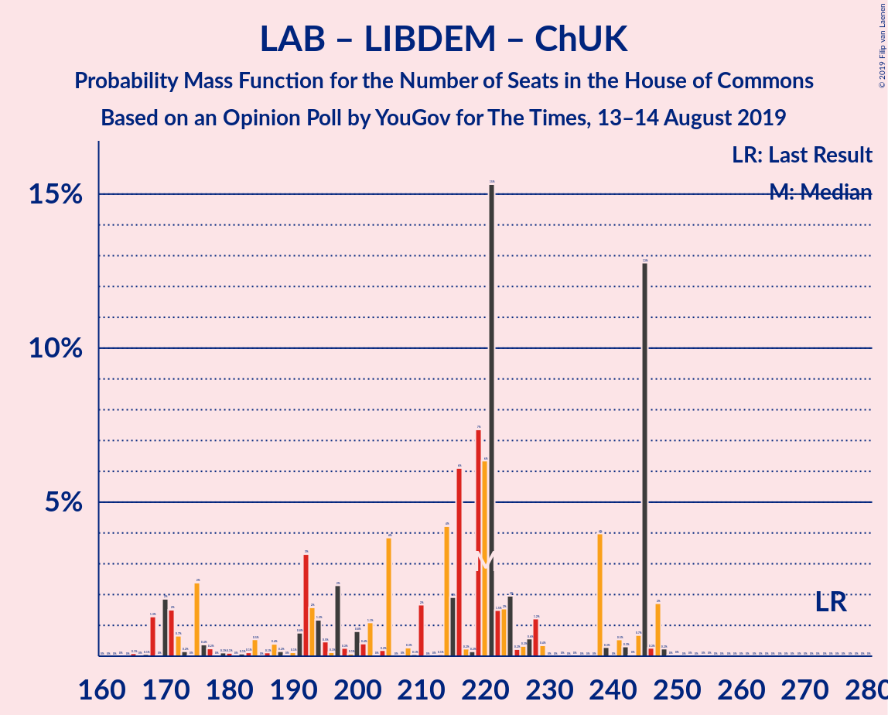

# Opinion Poll by YouGov for The Times, 13–14 August 2019

<a href="#voting-intentions">Voting Intentions</a> | <a href="#seats">Seats</a> | <a href="#coalitions">Coalitions</a> | <a href="#technical-information">Technical Information</a>

## Voting Intentions

### Confidence Intervals

| Party | Last Result | Poll Result | 80% Confidence Interval | 90% Confidence Interval | 95% Confidence Interval | 99% Confidence Interval |
|:-----:|:-----------:|:-----------:|:-----------------------:|:-----------------------:|:-----------------------:|:-----------------------:|
| Conservative Party | 42.4% | 29.6% | 28.2–31.1% |27.8–31.5% |27.4–31.9% |26.7–32.6% |
| Labour Party | 40.0% | 20.7% | 19.5–22.1% |19.1–22.5% |18.8–22.8% |18.2–23.4% |
| Liberal Democrats | 7.4% | 19.8% | 18.5–21.1% |18.2–21.4% |17.9–21.8% |17.3–22.4% |
| Brexit Party | 0.0% | 13.8% | 12.8–15.0% |12.5–15.3% |12.2–15.6% |11.8–16.2% |
| Green Party | 1.6% | 7.9% | 7.1–8.8% |6.8–9.1% |6.7–9.3% |6.3–9.8% |
| Scottish National Party | 3.0% | 3.9% | 3.4–4.6% |3.2–4.8% |3.1–5.0% |2.9–5.4% |
| Plaid Cymru | 0.5% | 1.0% | 0.7–1.4% |0.7–1.5% |0.6–1.6% |0.5–1.8% |
| UK Independence Party | 1.8% | 1.0% | 0.7–1.4% |0.7–1.5% |0.6–1.6% |0.5–1.8% |
| Change UK | 0.0% | 0.2% | 0.1–0.5% |0.1–0.6% |0.1–0.6% |0.1–0.8% |

*Note:* The poll result column reflects the actual value used in the calculations. Published results may vary slightly, and in addition be rounded to fewer digits.

## Seats

### Confidence Intervals

| Party | Last Result | Median | 80% Confidence Interval | 90% Confidence Interval | 95% Confidence Interval | 99% Confidence Interval |
|:-----:|:-----------:|:------:|:-----------------------:|:-----------------------:|:-----------------------:|:-----------------------:|
| <a href="#conservative-party">Conservative Party</a> | 317 | 291 | 264–309 |264–316 |264–319 |257–332 |
| <a href="#labour-party">Labour Party</a> | 262 | 142 | 111–162 |101–167 |92–169 |91–172 |
| <a href="#liberal-democrats">Liberal Democrats</a> | 12 | 76 | 71–83 |70–83 |68–86 |62–91 |
| <a href="#brexit-party">Brexit Party</a> | 0 | 59 | 47–83 |45–90 |44–100 |40–104 |
| <a href="#green-party">Green Party</a> | 1 | 5 | 4–6 |4–6 |4–6 |3–7 |
| <a href="#scottish-national-party">Scottish National Party</a> | 35 | 52 | 48–54 |48–54 |47–54 |45–54 |
| <a href="#plaid-cymru">Plaid Cymru</a> | 4 | 8 | 4–10 |4–11 |4–12 |4–16 |
| <a href="#uk-independence-party">UK Independence Party</a> | 0 | 0 | 0 |0 |0 |0 |
| <a href="#change-uk">Change UK</a> | 0 | 0 | 0 |0 |0 |0 |

### Conservative Party

*For a full overview of the results for this party, see the [Conservative Party](party-conservativeparty.html) page.*

| Number of Seats | Probability | Accumulated | Special Marks |
|:---------------:|:-----------:|:-----------:|:-------------:|
| 235 | 0% | 100% |  |
| 236 | 0% | 99.9% |  |
| 237 | 0% | 99.9% |  |
| 238 | 0% | 99.9% |  |
| 239 | 0% | 99.9% |  |
| 240 | 0% | 99.9% |  |
| 241 | 0% | 99.9% |  |
| 242 | 0% | 99.9% |  |
| 243 | 0% | 99.9% |  |
| 244 | 0% | 99.9% |  |
| 245 | 0% | 99.9% |  |
| 246 | 0% | 99.9% |  |
| 247 | 0% | 99.8% |  |
| 248 | 0.1% | 99.8% |  |
| 249 | 0% | 99.7% |  |
| 250 | 0% | 99.7% |  |
| 251 | 0% | 99.7% |  |
| 252 | 0% | 99.7% |  |
| 253 | 0% | 99.7% |  |
| 254 | 0% | 99.7% |  |
| 255 | 0.1% | 99.6% |  |
| 256 | 0% | 99.6% |  |
| 257 | 0.2% | 99.6% |  |
| 258 | 0% | 99.3% |  |
| 259 | 0.1% | 99.3% |  |
| 260 | 0% | 99.2% |  |
| 261 | 0.5% | 99.2% |  |
| 262 | 0.1% | 98.7% |  |
| 263 | 0.3% | 98.6% |  |
| 264 | 13% | 98% |  |
| 265 | 0.5% | 86% |  |
| 266 | 0% | 85% |  |
| 267 | 0.2% | 85% |  |
| 268 | 2% | 85% |  |
| 269 | 0% | 82% |  |
| 270 | 5% | 82% |  |
| 271 | 0% | 77% |  |
| 272 | 0.1% | 77% |  |
| 273 | 0.8% | 77% |  |
| 274 | 0.5% | 77% |  |
| 275 | 0.5% | 76% |  |
| 276 | 0.1% | 76% |  |
| 277 | 1.3% | 75% |  |
| 278 | 2% | 74% |  |
| 279 | 0.2% | 73% |  |
| 280 | 0.1% | 72% |  |
| 281 | 0.2% | 72% |  |
| 282 | 2% | 72% |  |
| 283 | 0.8% | 70% |  |
| 284 | 8% | 69% |  |
| 285 | 4% | 61% |  |
| 286 | 0.5% | 57% |  |
| 287 | 0% | 56% |  |
| 288 | 0.5% | 56% |  |
| 289 | 4% | 56% |  |
| 290 | 0.4% | 52% |  |
| 291 | 2% | 51% | Median |
| 292 | 6% | 49% |  |
| 293 | 5% | 43% |  |
| 294 | 0.3% | 38% |  |
| 295 | 0.1% | 38% |  |
| 296 | 0.3% | 38% |  |
| 297 | 9% | 38% |  |
| 298 | 0.1% | 28% |  |
| 299 | 1.5% | 28% |  |
| 300 | 1.2% | 27% |  |
| 301 | 0.5% | 26% |  |
| 302 | 6% | 25% |  |
| 303 | 5% | 19% |  |
| 304 | 0.4% | 14% |  |
| 305 | 0.3% | 14% |  |
| 306 | 0.4% | 13% |  |
| 307 | 2% | 13% |  |
| 308 | 1.2% | 11% |  |
| 309 | 0.3% | 10% |  |
| 310 | 0.5% | 10% |  |
| 311 | 0.7% | 9% |  |
| 312 | 0.4% | 9% |  |
| 313 | 0.1% | 8% |  |
| 314 | 1.3% | 8% |  |
| 315 | 2% | 7% |  |
| 316 | 2% | 5% |  |
| 317 | 0.2% | 3% | Last Result |
| 318 | 0% | 3% |  |
| 319 | 0.5% | 3% |  |
| 320 | 0.3% | 2% |  |
| 321 | 0.1% | 2% |  |
| 322 | 0.1% | 2% |  |
| 323 | 0.1% | 2% |  |
| 324 | 0% | 2% |  |
| 325 | 0% | 2% |  |
| 326 | 0% | 2% | Majority |
| 327 | 0.2% | 2% |  |
| 328 | 0% | 1.4% |  |
| 329 | 0% | 1.4% |  |
| 330 | 0.1% | 1.4% |  |
| 331 | 0% | 1.3% |  |
| 332 | 1.1% | 1.3% |  |
| 333 | 0% | 0.2% |  |
| 334 | 0.1% | 0.2% |  |
| 335 | 0% | 0.1% |  |
| 336 | 0% | 0.1% |  |
| 337 | 0% | 0.1% |  |
| 338 | 0% | 0.1% |  |
| 339 | 0% | 0% |  |

### Labour Party

*For a full overview of the results for this party, see the [Labour Party](party-labourparty.html) page.*

| Number of Seats | Probability | Accumulated | Special Marks |
|:---------------:|:-----------:|:-----------:|:-------------:|
| 91 | 2% | 100% |  |
| 92 | 0.8% | 98% |  |
| 93 | 0% | 97% |  |
| 94 | 0.1% | 97% |  |
| 95 | 0.1% | 97% |  |
| 96 | 0% | 97% |  |
| 97 | 0.3% | 97% |  |
| 98 | 1.3% | 97% |  |
| 99 | 0.1% | 96% |  |
| 100 | 0.1% | 95% |  |
| 101 | 0.5% | 95% |  |
| 102 | 3% | 95% |  |
| 103 | 0.2% | 92% |  |
| 104 | 0.1% | 92% |  |
| 105 | 0.2% | 91% |  |
| 106 | 0.1% | 91% |  |
| 107 | 0.1% | 91% |  |
| 108 | 0% | 91% |  |
| 109 | 0% | 91% |  |
| 110 | 0.4% | 91% |  |
| 111 | 0.8% | 91% |  |
| 112 | 2% | 90% |  |
| 113 | 1.0% | 88% |  |
| 114 | 0.5% | 87% |  |
| 115 | 2% | 87% |  |
| 116 | 0.3% | 84% |  |
| 117 | 0.4% | 84% |  |
| 118 | 0.3% | 84% |  |
| 119 | 0% | 83% |  |
| 120 | 0.6% | 83% |  |
| 121 | 0.2% | 83% |  |
| 122 | 0% | 83% |  |
| 123 | 0.7% | 83% |  |
| 124 | 0.1% | 82% |  |
| 125 | 3% | 82% |  |
| 126 | 1.0% | 79% |  |
| 127 | 0.2% | 78% |  |
| 128 | 4% | 78% |  |
| 129 | 0.1% | 73% |  |
| 130 | 0.4% | 73% |  |
| 131 | 0.6% | 73% |  |
| 132 | 0.4% | 72% |  |
| 133 | 1.2% | 72% |  |
| 134 | 2% | 71% |  |
| 135 | 0.4% | 69% |  |
| 136 | 0.2% | 69% |  |
| 137 | 0% | 68% |  |
| 138 | 5% | 68% |  |
| 139 | 2% | 63% |  |
| 140 | 5% | 61% |  |
| 141 | 5% | 56% |  |
| 142 | 1.2% | 51% | Median |
| 143 | 2% | 49% |  |
| 144 | 1.2% | 48% |  |
| 145 | 1.3% | 47% |  |
| 146 | 6% | 45% |  |
| 147 | 9% | 40% |  |
| 148 | 7% | 30% |  |
| 149 | 0.3% | 23% |  |
| 150 | 0.6% | 23% |  |
| 151 | 0.2% | 22% |  |
| 152 | 0.3% | 22% |  |
| 153 | 0.7% | 22% |  |
| 154 | 0% | 21% |  |
| 155 | 0% | 21% |  |
| 156 | 0% | 21% |  |
| 157 | 0.1% | 21% |  |
| 158 | 0.3% | 21% |  |
| 159 | 0% | 21% |  |
| 160 | 0% | 21% |  |
| 161 | 0.1% | 21% |  |
| 162 | 13% | 21% |  |
| 163 | 0% | 8% |  |
| 164 | 0.4% | 8% |  |
| 165 | 0% | 7% |  |
| 166 | 0% | 7% |  |
| 167 | 4% | 7% |  |
| 168 | 0% | 3% |  |
| 169 | 0.5% | 3% |  |
| 170 | 0.1% | 2% |  |
| 171 | 2% | 2% |  |
| 172 | 0% | 0.5% |  |
| 173 | 0% | 0.5% |  |
| 174 | 0% | 0.5% |  |
| 175 | 0% | 0.5% |  |
| 176 | 0.2% | 0.5% |  |
| 177 | 0% | 0.2% |  |
| 178 | 0% | 0.2% |  |
| 179 | 0% | 0.1% |  |
| 180 | 0% | 0.1% |  |
| 181 | 0% | 0.1% |  |
| 182 | 0% | 0.1% |  |
| 183 | 0% | 0.1% |  |
| 184 | 0% | 0.1% |  |
| 185 | 0% | 0.1% |  |
| 186 | 0% | 0.1% |  |
| 187 | 0% | 0.1% |  |
| 188 | 0% | 0.1% |  |
| 189 | 0% | 0.1% |  |
| 190 | 0% | 0.1% |  |
| 191 | 0% | 0.1% |  |
| 192 | 0% | 0.1% |  |
| 193 | 0% | 0.1% |  |
| 194 | 0% | 0% |  |
| 195 | 0% | 0% |  |
| 196 | 0% | 0% |  |
| 197 | 0% | 0% |  |
| 198 | 0% | 0% |  |
| 199 | 0% | 0% |  |
| 200 | 0% | 0% |  |
| 201 | 0% | 0% |  |
| 202 | 0% | 0% |  |
| 203 | 0% | 0% |  |
| 204 | 0% | 0% |  |
| 205 | 0% | 0% |  |
| 206 | 0% | 0% |  |
| 207 | 0% | 0% |  |
| 208 | 0% | 0% |  |
| 209 | 0% | 0% |  |
| 210 | 0% | 0% |  |
| 211 | 0% | 0% |  |
| 212 | 0% | 0% |  |
| 213 | 0% | 0% |  |
| 214 | 0% | 0% |  |
| 215 | 0% | 0% |  |
| 216 | 0% | 0% |  |
| 217 | 0% | 0% |  |
| 218 | 0% | 0% |  |
| 219 | 0% | 0% |  |
| 220 | 0% | 0% |  |
| 221 | 0% | 0% |  |
| 222 | 0% | 0% |  |
| 223 | 0% | 0% |  |
| 224 | 0% | 0% |  |
| 225 | 0% | 0% |  |
| 226 | 0% | 0% |  |
| 227 | 0% | 0% |  |
| 228 | 0% | 0% |  |
| 229 | 0% | 0% |  |
| 230 | 0% | 0% |  |
| 231 | 0% | 0% |  |
| 232 | 0% | 0% |  |
| 233 | 0% | 0% |  |
| 234 | 0% | 0% |  |
| 235 | 0% | 0% |  |
| 236 | 0% | 0% |  |
| 237 | 0% | 0% |  |
| 238 | 0% | 0% |  |
| 239 | 0% | 0% |  |
| 240 | 0% | 0% |  |
| 241 | 0% | 0% |  |
| 242 | 0% | 0% |  |
| 243 | 0% | 0% |  |
| 244 | 0% | 0% |  |
| 245 | 0% | 0% |  |
| 246 | 0% | 0% |  |
| 247 | 0% | 0% |  |
| 248 | 0% | 0% |  |
| 249 | 0% | 0% |  |
| 250 | 0% | 0% |  |
| 251 | 0% | 0% |  |
| 252 | 0% | 0% |  |
| 253 | 0% | 0% |  |
| 254 | 0% | 0% |  |
| 255 | 0% | 0% |  |
| 256 | 0% | 0% |  |
| 257 | 0% | 0% |  |
| 258 | 0% | 0% |  |
| 259 | 0% | 0% |  |
| 260 | 0% | 0% |  |
| 261 | 0% | 0% |  |
| 262 | 0% | 0% | Last Result |

### Liberal Democrats

*For a full overview of the results for this party, see the [Liberal Democrats](party-liberaldemocrats.html) page.*

| Number of Seats | Probability | Accumulated | Special Marks |
|:---------------:|:-----------:|:-----------:|:-------------:|
| 12 | 0% | 100% | Last Result |
| 13 | 0% | 100% |  |
| 14 | 0% | 100% |  |
| 15 | 0% | 100% |  |
| 16 | 0% | 100% |  |
| 17 | 0% | 100% |  |
| 18 | 0% | 100% |  |
| 19 | 0% | 100% |  |
| 20 | 0% | 100% |  |
| 21 | 0% | 100% |  |
| 22 | 0% | 100% |  |
| 23 | 0% | 100% |  |
| 24 | 0% | 100% |  |
| 25 | 0% | 100% |  |
| 26 | 0% | 100% |  |
| 27 | 0% | 100% |  |
| 28 | 0% | 100% |  |
| 29 | 0% | 100% |  |
| 30 | 0% | 100% |  |
| 31 | 0% | 100% |  |
| 32 | 0% | 100% |  |
| 33 | 0% | 100% |  |
| 34 | 0% | 100% |  |
| 35 | 0% | 100% |  |
| 36 | 0% | 100% |  |
| 37 | 0% | 100% |  |
| 38 | 0% | 100% |  |
| 39 | 0% | 100% |  |
| 40 | 0% | 100% |  |
| 41 | 0% | 100% |  |
| 42 | 0% | 100% |  |
| 43 | 0% | 100% |  |
| 44 | 0% | 100% |  |
| 45 | 0% | 100% |  |
| 46 | 0% | 100% |  |
| 47 | 0% | 100% |  |
| 48 | 0% | 100% |  |
| 49 | 0% | 100% |  |
| 50 | 0% | 100% |  |
| 51 | 0% | 100% |  |
| 52 | 0% | 100% |  |
| 53 | 0% | 100% |  |
| 54 | 0% | 100% |  |
| 55 | 0% | 100% |  |
| 56 | 0% | 100% |  |
| 57 | 0% | 100% |  |
| 58 | 0% | 100% |  |
| 59 | 0% | 100% |  |
| 60 | 0.3% | 100% |  |
| 61 | 0.1% | 99.6% |  |
| 62 | 0% | 99.5% |  |
| 63 | 0.2% | 99.5% |  |
| 64 | 0.2% | 99.3% |  |
| 65 | 0.2% | 99.1% |  |
| 66 | 0.4% | 98.9% |  |
| 67 | 0.6% | 98.5% |  |
| 68 | 1.2% | 98% |  |
| 69 | 2% | 97% |  |
| 70 | 2% | 95% |  |
| 71 | 12% | 93% |  |
| 72 | 3% | 82% |  |
| 73 | 3% | 79% |  |
| 74 | 10% | 76% |  |
| 75 | 7% | 66% |  |
| 76 | 16% | 59% | Median |
| 77 | 8% | 43% |  |
| 78 | 1.1% | 36% |  |
| 79 | 11% | 35% |  |
| 80 | 3% | 24% |  |
| 81 | 0.2% | 21% |  |
| 82 | 3% | 21% |  |
| 83 | 13% | 18% |  |
| 84 | 0.2% | 5% |  |
| 85 | 0.3% | 4% |  |
| 86 | 2% | 4% |  |
| 87 | 0.4% | 2% |  |
| 88 | 0.4% | 2% |  |
| 89 | 0.1% | 1.2% |  |
| 90 | 0% | 1.1% |  |
| 91 | 0.8% | 1.1% |  |
| 92 | 0.1% | 0.2% |  |
| 93 | 0% | 0.1% |  |
| 94 | 0% | 0.1% |  |
| 95 | 0% | 0.1% |  |
| 96 | 0% | 0.1% |  |
| 97 | 0% | 0% |  |

### Brexit Party

*For a full overview of the results for this party, see the [Brexit Party](party-brexitparty.html) page.*

| Number of Seats | Probability | Accumulated | Special Marks |
|:---------------:|:-----------:|:-----------:|:-------------:|
| 0 | 0% | 100% | Last Result |
| 1 | 0% | 100% |  |
| 2 | 0% | 100% |  |
| 3 | 0% | 100% |  |
| 4 | 0% | 100% |  |
| 5 | 0% | 100% |  |
| 6 | 0% | 100% |  |
| 7 | 0% | 100% |  |
| 8 | 0% | 100% |  |
| 9 | 0% | 100% |  |
| 10 | 0% | 100% |  |
| 11 | 0% | 100% |  |
| 12 | 0% | 100% |  |
| 13 | 0% | 100% |  |
| 14 | 0% | 100% |  |
| 15 | 0% | 100% |  |
| 16 | 0% | 100% |  |
| 17 | 0% | 100% |  |
| 18 | 0% | 100% |  |
| 19 | 0% | 100% |  |
| 20 | 0% | 100% |  |
| 21 | 0% | 100% |  |
| 22 | 0% | 100% |  |
| 23 | 0% | 100% |  |
| 24 | 0% | 100% |  |
| 25 | 0% | 100% |  |
| 26 | 0% | 100% |  |
| 27 | 0% | 100% |  |
| 28 | 0% | 100% |  |
| 29 | 0% | 100% |  |
| 30 | 0% | 99.9% |  |
| 31 | 0% | 99.9% |  |
| 32 | 0% | 99.9% |  |
| 33 | 0.1% | 99.9% |  |
| 34 | 0% | 99.9% |  |
| 35 | 0% | 99.8% |  |
| 36 | 0% | 99.8% |  |
| 37 | 0.2% | 99.8% |  |
| 38 | 0.1% | 99.6% |  |
| 39 | 0% | 99.5% |  |
| 40 | 0.2% | 99.5% |  |
| 41 | 0.2% | 99.4% |  |
| 42 | 0.2% | 99.1% |  |
| 43 | 0.1% | 98.9% |  |
| 44 | 2% | 98.8% |  |
| 45 | 4% | 97% |  |
| 46 | 0.1% | 93% |  |
| 47 | 6% | 93% |  |
| 48 | 0.6% | 87% |  |
| 49 | 0.7% | 87% |  |
| 50 | 2% | 86% |  |
| 51 | 6% | 84% |  |
| 52 | 0.1% | 78% |  |
| 53 | 2% | 78% |  |
| 54 | 0.3% | 76% |  |
| 55 | 0.1% | 76% |  |
| 56 | 0.7% | 76% |  |
| 57 | 0.7% | 75% |  |
| 58 | 13% | 74% |  |
| 59 | 18% | 61% | Median |
| 60 | 2% | 44% |  |
| 61 | 3% | 42% |  |
| 62 | 5% | 39% |  |
| 63 | 5% | 33% |  |
| 64 | 0.2% | 28% |  |
| 65 | 2% | 28% |  |
| 66 | 0.8% | 26% |  |
| 67 | 2% | 26% |  |
| 68 | 3% | 24% |  |
| 69 | 0.1% | 21% |  |
| 70 | 0.2% | 21% |  |
| 71 | 0.8% | 21% |  |
| 72 | 0.4% | 20% |  |
| 73 | 1.2% | 20% |  |
| 74 | 3% | 18% |  |
| 75 | 0.2% | 16% |  |
| 76 | 0.6% | 15% |  |
| 77 | 0.1% | 15% |  |
| 78 | 0.6% | 15% |  |
| 79 | 3% | 14% |  |
| 80 | 0% | 12% |  |
| 81 | 0.7% | 12% |  |
| 82 | 0.3% | 11% |  |
| 83 | 0.8% | 11% |  |
| 84 | 0.5% | 10% |  |
| 85 | 1.3% | 9% |  |
| 86 | 0% | 8% |  |
| 87 | 0.1% | 8% |  |
| 88 | 0.8% | 8% |  |
| 89 | 0.4% | 7% |  |
| 90 | 2% | 7% |  |
| 91 | 0.5% | 5% |  |
| 92 | 0% | 4% |  |
| 93 | 0.4% | 4% |  |
| 94 | 0% | 4% |  |
| 95 | 0% | 4% |  |
| 96 | 0.1% | 4% |  |
| 97 | 0.1% | 4% |  |
| 98 | 0.5% | 3% |  |
| 99 | 0.3% | 3% |  |
| 100 | 0.2% | 3% |  |
| 101 | 0% | 2% |  |
| 102 | 0% | 2% |  |
| 103 | 0% | 2% |  |
| 104 | 2% | 2% |  |
| 105 | 0.1% | 0.3% |  |
| 106 | 0% | 0.2% |  |
| 107 | 0.1% | 0.2% |  |
| 108 | 0% | 0.1% |  |
| 109 | 0% | 0.1% |  |
| 110 | 0% | 0.1% |  |
| 111 | 0% | 0.1% |  |
| 112 | 0% | 0.1% |  |
| 113 | 0% | 0.1% |  |
| 114 | 0% | 0.1% |  |
| 115 | 0% | 0.1% |  |
| 116 | 0% | 0.1% |  |
| 117 | 0% | 0.1% |  |
| 118 | 0% | 0.1% |  |
| 119 | 0% | 0.1% |  |
| 120 | 0.1% | 0.1% |  |
| 121 | 0% | 0% |  |

### Green Party

*For a full overview of the results for this party, see the [Green Party](party-greenparty.html) page.*

| Number of Seats | Probability | Accumulated | Special Marks |
|:---------------:|:-----------:|:-----------:|:-------------:|
| 1 | 0% | 100% | Last Result |
| 2 | 0% | 100% |  |
| 3 | 1.0% | 100% |  |
| 4 | 32% | 99.0% |  |
| 5 | 27% | 67% | Median |
| 6 | 38% | 39% |  |
| 7 | 2% | 2% |  |
| 8 | 0.1% | 0.2% |  |
| 9 | 0% | 0% |  |

### Scottish National Party

*For a full overview of the results for this party, see the [Scottish National Party](party-scottishnationalparty.html) page.*

| Number of Seats | Probability | Accumulated | Special Marks |
|:---------------:|:-----------:|:-----------:|:-------------:|
| 35 | 0% | 100% | Last Result |
| 36 | 0% | 100% |  |
| 37 | 0% | 100% |  |
| 38 | 0% | 100% |  |
| 39 | 0% | 100% |  |
| 40 | 0% | 100% |  |
| 41 | 0% | 100% |  |
| 42 | 0.1% | 100% |  |
| 43 | 0% | 99.8% |  |
| 44 | 0% | 99.8% |  |
| 45 | 0.6% | 99.8% |  |
| 46 | 0.2% | 99.2% |  |
| 47 | 2% | 99.0% |  |
| 48 | 10% | 97% |  |
| 49 | 6% | 87% |  |
| 50 | 15% | 80% |  |
| 51 | 8% | 66% |  |
| 52 | 16% | 58% | Median |
| 53 | 5% | 42% |  |
| 54 | 37% | 37% |  |
| 55 | 0% | 0% |  |

### Plaid Cymru

*For a full overview of the results for this party, see the [Plaid Cymru](party-plaidcymru.html) page.*

| Number of Seats | Probability | Accumulated | Special Marks |
|:---------------:|:-----------:|:-----------:|:-------------:|
| 3 | 0.1% | 100% |  |
| 4 | 19% | 99.9% | Last Result |
| 5 | 2% | 81% |  |
| 6 | 5% | 79% |  |
| 7 | 19% | 74% |  |
| 8 | 30% | 55% | Median |
| 9 | 8% | 24% |  |
| 10 | 8% | 16% |  |
| 11 | 4% | 8% |  |
| 12 | 3% | 4% |  |
| 13 | 0.4% | 2% |  |
| 14 | 0.6% | 1.2% |  |
| 15 | 0% | 0.6% |  |
| 16 | 0.6% | 0.6% |  |
| 17 | 0% | 0% |  |

### UK Independence Party

*For a full overview of the results for this party, see the [UK Independence Party](party-ukindependenceparty.html) page.*

| Number of Seats | Probability | Accumulated | Special Marks |
|:---------------:|:-----------:|:-----------:|:-------------:|
| 0 | 100% | 100% | Last Result, Median |

### Change UK

*For a full overview of the results for this party, see the [Change UK](party-changeuk.html) page.*

| Number of Seats | Probability | Accumulated | Special Marks |
|:---------------:|:-----------:|:-----------:|:-------------:|
| 0 | 100% | 100% | Last Result, Median |

## Coalitions

### Confidence Intervals

| Coalition | Last Result | Median | Majority? | 80% Confidence Interval | 90% Confidence Interval | 95% Confidence Interval | 99% Confidence Interval |
|:---------:|:-----------:|:------:|:---------:|:-----------------------:|:-----------------------:|:-----------------------:|:-----------------------:|
| Conservative Party – Brexit Party | 317 | 348 | 85% | 322–380 | 322–394 | 320–399 | 318–400 |
| Conservative Party – Liberal Democrats – Change UK | 329 | 367 | 99.9% | 347–384 | 346–390 | 344–394 | 337–401 |
| Conservative Party – Liberal Democrats | 329 | 367 | 99.9% | 347–384 | 346–390 | 344–394 | 337–401 |
| Conservative Party – Scottish National Party – Plaid Cymru | 356 | 349 | 83% | 322–369 | 322–377 | 322–378 | 316–387 |
| Conservative Party – Scottish National Party | 352 | 342 | 77% | 314–362 | 314–368 | 314–371 | 307–379 |
| Conservative Party – Plaid Cymru | 321 | 297 | 5% | 272–317 | 272–324 | 272–327 | 266–340 |
| Conservative Party – Change UK | 317 | 291 | 2% | 264–309 | 264–316 | 264–319 | 257–332 |
| Conservative Party | 317 | 291 | 2% | 264–309 | 264–316 | 264–319 | 257–332 |
| Labour Party – Liberal Democrats – Scottish National Party – Plaid Cymru | 313 | 277 | 0.1% | 246–303 | 232–303 | 228–305 | 226–307 |
| Labour Party – Liberal Democrats – Scottish National Party | 309 | 273 | 0% | 238–295 | 223–295 | 221–296 | 218–301 |
| Labour Party – Liberal Democrats – Plaid Cymru | 278 | 225 | 0% | 192–253 | 181–253 | 179–253 | 174–255 |
| Labour Party – Liberal Democrats – Change UK | 274 | 220 | 0% | 187–245 | 172–245 | 170–246 | 168–248 |
| Labour Party – Liberal Democrats | 274 | 220 | 0% | 187–245 | 172–245 | 170–246 | 168–248 |
| Labour Party – Scottish National Party – Plaid Cymru | 301 | 202 | 0% | 169–220 | 158–221 | 155–227 | 153–231 |
| Labour Party – Scottish National Party | 297 | 194 | 0% | 160–212 | 152–215 | 144–223 | 142–224 |
| Labour Party – Plaid Cymru | 266 | 149 | 0% | 119–170 | 110–173 | 103–175 | 102–180 |
| Labour Party – Change UK | 262 | 142 | 0% | 111–162 | 101–167 | 92–169 | 91–172 |
| Labour Party | 262 | 142 | 0% | 111–162 | 101–167 | 92–169 | 91–172 |

### Conservative Party – Brexit Party

| Number of Seats | Probability | Accumulated | Special Marks |
|:---------------:|:-----------:|:-----------:|:-------------:|
| 296 | 0% | 100% |  |
| 297 | 0% | 99.9% |  |
| 298 | 0% | 99.9% |  |
| 299 | 0% | 99.9% |  |
| 300 | 0% | 99.9% |  |
| 301 | 0% | 99.9% |  |
| 302 | 0% | 99.9% |  |
| 303 | 0% | 99.9% |  |
| 304 | 0% | 99.9% |  |
| 305 | 0% | 99.9% |  |
| 306 | 0% | 99.9% |  |
| 307 | 0% | 99.9% |  |
| 308 | 0% | 99.9% |  |
| 309 | 0% | 99.9% |  |
| 310 | 0% | 99.9% |  |
| 311 | 0% | 99.9% |  |
| 312 | 0.1% | 99.9% |  |
| 313 | 0% | 99.8% |  |
| 314 | 0% | 99.8% |  |
| 315 | 0% | 99.8% |  |
| 316 | 0% | 99.7% |  |
| 317 | 0% | 99.7% | Last Result |
| 318 | 2% | 99.7% |  |
| 319 | 0% | 98% |  |
| 320 | 0.6% | 98% |  |
| 321 | 0% | 97% |  |
| 322 | 13% | 97% |  |
| 323 | 0.1% | 85% |  |
| 324 | 0% | 85% |  |
| 325 | 0% | 85% |  |
| 326 | 0.4% | 85% | Majority |
| 327 | 0.5% | 84% |  |
| 328 | 0.6% | 84% |  |
| 329 | 0.1% | 83% |  |
| 330 | 0% | 83% |  |
| 331 | 0% | 83% |  |
| 332 | 0% | 83% |  |
| 333 | 0% | 83% |  |
| 334 | 4% | 83% |  |
| 335 | 0.3% | 79% |  |
| 336 | 0.4% | 79% |  |
| 337 | 0.8% | 78% |  |
| 338 | 0.1% | 77% |  |
| 339 | 0.3% | 77% |  |
| 340 | 0.5% | 77% |  |
| 341 | 0.1% | 76% |  |
| 342 | 2% | 76% |  |
| 343 | 9% | 74% |  |
| 344 | 0.9% | 65% |  |
| 345 | 2% | 64% |  |
| 346 | 1.0% | 62% |  |
| 347 | 0.6% | 61% |  |
| 348 | 11% | 61% |  |
| 349 | 6% | 50% |  |
| 350 | 0.1% | 44% | Median |
| 351 | 7% | 44% |  |
| 352 | 0.4% | 37% |  |
| 353 | 0.2% | 36% |  |
| 354 | 0.1% | 36% |  |
| 355 | 5% | 36% |  |
| 356 | 0% | 31% |  |
| 357 | 0.3% | 31% |  |
| 358 | 2% | 31% |  |
| 359 | 0.1% | 29% |  |
| 360 | 2% | 29% |  |
| 361 | 0.2% | 27% |  |
| 362 | 4% | 27% |  |
| 363 | 0.4% | 23% |  |
| 364 | 1.0% | 23% |  |
| 365 | 0% | 22% |  |
| 366 | 0.2% | 21% |  |
| 367 | 0.4% | 21% |  |
| 368 | 0.3% | 21% |  |
| 369 | 0.5% | 21% |  |
| 370 | 1.0% | 20% |  |
| 371 | 1.5% | 19% |  |
| 372 | 0.5% | 18% |  |
| 373 | 0.6% | 17% |  |
| 374 | 4% | 16% |  |
| 375 | 0.1% | 13% |  |
| 376 | 0.3% | 13% |  |
| 377 | 0.9% | 12% |  |
| 378 | 0% | 12% |  |
| 379 | 0.6% | 11% |  |
| 380 | 1.4% | 11% |  |
| 381 | 0.3% | 9% |  |
| 382 | 0.1% | 9% |  |
| 383 | 0% | 9% |  |
| 384 | 0.1% | 9% |  |
| 385 | 0.2% | 9% |  |
| 386 | 0.1% | 9% |  |
| 387 | 0% | 9% |  |
| 388 | 0.2% | 9% |  |
| 389 | 0.1% | 8% |  |
| 390 | 2% | 8% |  |
| 391 | 0.2% | 6% |  |
| 392 | 0.6% | 6% |  |
| 393 | 0.1% | 5% |  |
| 394 | 2% | 5% |  |
| 395 | 0% | 3% |  |
| 396 | 0.1% | 3% |  |
| 397 | 0.2% | 3% |  |
| 398 | 0.3% | 3% |  |
| 399 | 1.3% | 3% |  |
| 400 | 1.2% | 1.3% |  |
| 401 | 0% | 0.2% |  |
| 402 | 0% | 0.1% |  |
| 403 | 0% | 0.1% |  |
| 404 | 0% | 0.1% |  |
| 405 | 0% | 0.1% |  |
| 406 | 0% | 0.1% |  |
| 407 | 0% | 0.1% |  |
| 408 | 0% | 0.1% |  |
| 409 | 0% | 0% |  |

### Conservative Party – Liberal Democrats – Change UK

| Number of Seats | Probability | Accumulated | Special Marks |
|:---------------:|:-----------:|:-----------:|:-------------:|
| 319 | 0% | 100% |  |
| 320 | 0% | 99.9% |  |
| 321 | 0% | 99.9% |  |
| 322 | 0% | 99.9% |  |
| 323 | 0% | 99.9% |  |
| 324 | 0% | 99.9% |  |
| 325 | 0% | 99.9% |  |
| 326 | 0% | 99.9% | Majority |
| 327 | 0% | 99.8% |  |
| 328 | 0% | 99.8% |  |
| 329 | 0% | 99.8% | Last Result |
| 330 | 0% | 99.8% |  |
| 331 | 0.1% | 99.8% |  |
| 332 | 0% | 99.7% |  |
| 333 | 0% | 99.7% |  |
| 334 | 0.1% | 99.7% |  |
| 335 | 0% | 99.6% |  |
| 336 | 0.1% | 99.6% |  |
| 337 | 0.6% | 99.5% |  |
| 338 | 0.5% | 98.9% |  |
| 339 | 0% | 98% |  |
| 340 | 0% | 98% |  |
| 341 | 0.2% | 98% |  |
| 342 | 0.1% | 98% |  |
| 343 | 0% | 98% |  |
| 344 | 2% | 98% |  |
| 345 | 0.5% | 96% |  |
| 346 | 2% | 96% |  |
| 347 | 15% | 94% |  |
| 348 | 0.2% | 79% |  |
| 349 | 0.4% | 79% |  |
| 350 | 0.2% | 79% |  |
| 351 | 0.3% | 79% |  |
| 352 | 0% | 78% |  |
| 353 | 1.1% | 78% |  |
| 354 | 0% | 77% |  |
| 355 | 0.2% | 77% |  |
| 356 | 1.4% | 77% |  |
| 357 | 1.0% | 76% |  |
| 358 | 10% | 75% |  |
| 359 | 3% | 64% |  |
| 360 | 4% | 62% |  |
| 361 | 4% | 57% |  |
| 362 | 0.9% | 54% |  |
| 363 | 0.1% | 53% |  |
| 364 | 0.2% | 53% |  |
| 365 | 0.9% | 52% |  |
| 366 | 0.6% | 52% |  |
| 367 | 1.1% | 51% | Median |
| 368 | 12% | 50% |  |
| 369 | 0.3% | 38% |  |
| 370 | 0.6% | 38% |  |
| 371 | 1.0% | 37% |  |
| 372 | 6% | 36% |  |
| 373 | 2% | 31% |  |
| 374 | 0.4% | 28% |  |
| 375 | 2% | 28% |  |
| 376 | 0.7% | 26% |  |
| 377 | 7% | 25% |  |
| 378 | 0.8% | 18% |  |
| 379 | 0.1% | 17% |  |
| 380 | 4% | 17% |  |
| 381 | 0.4% | 13% |  |
| 382 | 2% | 13% |  |
| 383 | 0% | 11% |  |
| 384 | 2% | 11% |  |
| 385 | 0.1% | 9% |  |
| 386 | 1.5% | 9% |  |
| 387 | 0.5% | 8% |  |
| 388 | 0.1% | 7% |  |
| 389 | 2% | 7% |  |
| 390 | 0.5% | 5% |  |
| 391 | 0.4% | 5% |  |
| 392 | 0.1% | 4% |  |
| 393 | 0.5% | 4% |  |
| 394 | 2% | 4% |  |
| 395 | 0.2% | 2% |  |
| 396 | 0% | 2% |  |
| 397 | 0% | 2% |  |
| 398 | 0% | 2% |  |
| 399 | 0% | 1.5% |  |
| 400 | 0% | 1.5% |  |
| 401 | 1.3% | 1.5% |  |
| 402 | 0% | 0.2% |  |
| 403 | 0% | 0.1% |  |
| 404 | 0% | 0.1% |  |
| 405 | 0% | 0.1% |  |
| 406 | 0% | 0.1% |  |
| 407 | 0% | 0.1% |  |
| 408 | 0% | 0.1% |  |
| 409 | 0.1% | 0.1% |  |
| 410 | 0% | 0% |  |

### Conservative Party – Liberal Democrats

| Number of Seats | Probability | Accumulated | Special Marks |
|:---------------:|:-----------:|:-----------:|:-------------:|
| 319 | 0% | 100% |  |
| 320 | 0% | 99.9% |  |
| 321 | 0% | 99.9% |  |
| 322 | 0% | 99.9% |  |
| 323 | 0% | 99.9% |  |
| 324 | 0% | 99.9% |  |
| 325 | 0% | 99.9% |  |
| 326 | 0% | 99.9% | Majority |
| 327 | 0% | 99.8% |  |
| 328 | 0% | 99.8% |  |
| 329 | 0% | 99.8% | Last Result |
| 330 | 0% | 99.8% |  |
| 331 | 0.1% | 99.8% |  |
| 332 | 0% | 99.7% |  |
| 333 | 0% | 99.7% |  |
| 334 | 0.1% | 99.7% |  |
| 335 | 0% | 99.6% |  |
| 336 | 0.1% | 99.6% |  |
| 337 | 0.6% | 99.5% |  |
| 338 | 0.5% | 98.9% |  |
| 339 | 0% | 98% |  |
| 340 | 0% | 98% |  |
| 341 | 0.2% | 98% |  |
| 342 | 0.1% | 98% |  |
| 343 | 0% | 98% |  |
| 344 | 2% | 98% |  |
| 345 | 0.5% | 96% |  |
| 346 | 2% | 96% |  |
| 347 | 15% | 94% |  |
| 348 | 0.2% | 79% |  |
| 349 | 0.4% | 79% |  |
| 350 | 0.2% | 79% |  |
| 351 | 0.3% | 79% |  |
| 352 | 0% | 78% |  |
| 353 | 1.1% | 78% |  |
| 354 | 0% | 77% |  |
| 355 | 0.2% | 77% |  |
| 356 | 1.4% | 77% |  |
| 357 | 1.0% | 76% |  |
| 358 | 10% | 75% |  |
| 359 | 3% | 64% |  |
| 360 | 4% | 62% |  |
| 361 | 4% | 57% |  |
| 362 | 0.9% | 54% |  |
| 363 | 0.1% | 53% |  |
| 364 | 0.2% | 53% |  |
| 365 | 0.9% | 52% |  |
| 366 | 0.6% | 52% |  |
| 367 | 1.1% | 51% | Median |
| 368 | 12% | 50% |  |
| 369 | 0.3% | 38% |  |
| 370 | 0.6% | 38% |  |
| 371 | 1.0% | 37% |  |
| 372 | 6% | 36% |  |
| 373 | 2% | 31% |  |
| 374 | 0.4% | 28% |  |
| 375 | 2% | 28% |  |
| 376 | 0.7% | 26% |  |
| 377 | 7% | 25% |  |
| 378 | 0.8% | 18% |  |
| 379 | 0.1% | 17% |  |
| 380 | 4% | 17% |  |
| 381 | 0.4% | 13% |  |
| 382 | 2% | 13% |  |
| 383 | 0% | 11% |  |
| 384 | 2% | 11% |  |
| 385 | 0.1% | 9% |  |
| 386 | 1.5% | 9% |  |
| 387 | 0.5% | 8% |  |
| 388 | 0.1% | 7% |  |
| 389 | 2% | 7% |  |
| 390 | 0.5% | 5% |  |
| 391 | 0.4% | 5% |  |
| 392 | 0.1% | 4% |  |
| 393 | 0.5% | 4% |  |
| 394 | 2% | 4% |  |
| 395 | 0.2% | 2% |  |
| 396 | 0% | 2% |  |
| 397 | 0% | 2% |  |
| 398 | 0% | 2% |  |
| 399 | 0% | 1.5% |  |
| 400 | 0% | 1.5% |  |
| 401 | 1.3% | 1.5% |  |
| 402 | 0% | 0.2% |  |
| 403 | 0% | 0.1% |  |
| 404 | 0% | 0.1% |  |
| 405 | 0% | 0.1% |  |
| 406 | 0% | 0.1% |  |
| 407 | 0% | 0.1% |  |
| 408 | 0% | 0.1% |  |
| 409 | 0.1% | 0.1% |  |
| 410 | 0% | 0% |  |

### Conservative Party – Scottish National Party – Plaid Cymru

| Number of Seats | Probability | Accumulated | Special Marks |
|:---------------:|:-----------:|:-----------:|:-------------:|
| 299 | 0% | 100% |  |
| 300 | 0% | 99.9% |  |
| 301 | 0% | 99.9% |  |
| 302 | 0% | 99.9% |  |
| 303 | 0% | 99.9% |  |
| 304 | 0% | 99.9% |  |
| 305 | 0% | 99.9% |  |
| 306 | 0.1% | 99.8% |  |
| 307 | 0% | 99.8% |  |
| 308 | 0% | 99.8% |  |
| 309 | 0.1% | 99.7% |  |
| 310 | 0% | 99.6% |  |
| 311 | 0% | 99.6% |  |
| 312 | 0.1% | 99.6% |  |
| 313 | 0% | 99.6% |  |
| 314 | 0% | 99.6% |  |
| 315 | 0% | 99.6% |  |
| 316 | 0.3% | 99.5% |  |
| 317 | 0.5% | 99.3% |  |
| 318 | 0.2% | 98.8% |  |
| 319 | 0.2% | 98.6% |  |
| 320 | 0% | 98% |  |
| 321 | 0.1% | 98% |  |
| 322 | 13% | 98% |  |
| 323 | 0.5% | 86% |  |
| 324 | 0% | 85% |  |
| 325 | 2% | 85% |  |
| 326 | 1.2% | 83% | Majority |
| 327 | 0% | 82% |  |
| 328 | 3% | 82% |  |
| 329 | 0.1% | 79% |  |
| 330 | 0.5% | 79% |  |
| 331 | 2% | 79% |  |
| 332 | 0.3% | 77% |  |
| 333 | 0% | 77% |  |
| 334 | 0.1% | 77% |  |
| 335 | 0% | 76% |  |
| 336 | 2% | 76% |  |
| 337 | 0.5% | 75% |  |
| 338 | 0.2% | 74% |  |
| 339 | 0.5% | 74% |  |
| 340 | 0.2% | 74% |  |
| 341 | 2% | 73% |  |
| 342 | 0% | 72% |  |
| 343 | 4% | 72% |  |
| 344 | 2% | 68% |  |
| 345 | 0.7% | 66% |  |
| 346 | 13% | 65% |  |
| 347 | 0.6% | 52% |  |
| 348 | 0.2% | 51% |  |
| 349 | 5% | 51% |  |
| 350 | 0.3% | 46% |  |
| 351 | 0.4% | 46% | Median |
| 352 | 3% | 45% |  |
| 353 | 5% | 42% |  |
| 354 | 1.2% | 37% |  |
| 355 | 0.4% | 36% |  |
| 356 | 0.6% | 36% | Last Result |
| 357 | 2% | 35% |  |
| 358 | 13% | 33% |  |
| 359 | 0.3% | 20% |  |
| 360 | 1.4% | 20% |  |
| 361 | 2% | 19% |  |
| 362 | 0.5% | 17% |  |
| 363 | 0.2% | 17% |  |
| 364 | 5% | 16% |  |
| 365 | 0.3% | 12% |  |
| 366 | 0.2% | 11% |  |
| 367 | 0.6% | 11% |  |
| 368 | 0.1% | 11% |  |
| 369 | 0.9% | 11% |  |
| 370 | 0.4% | 10% |  |
| 371 | 0% | 9% |  |
| 372 | 0.3% | 9% |  |
| 373 | 0.4% | 9% |  |
| 374 | 2% | 8% |  |
| 375 | 0.1% | 7% |  |
| 376 | 0% | 7% |  |
| 377 | 2% | 7% |  |
| 378 | 2% | 5% |  |
| 379 | 0% | 2% |  |
| 380 | 0% | 2% |  |
| 381 | 0.3% | 2% |  |
| 382 | 0.3% | 2% |  |
| 383 | 0.3% | 2% |  |
| 384 | 0% | 2% |  |
| 385 | 0% | 2% |  |
| 386 | 0% | 2% |  |
| 387 | 1.1% | 1.5% |  |
| 388 | 0% | 0.4% |  |
| 389 | 0% | 0.4% |  |
| 390 | 0.1% | 0.4% |  |
| 391 | 0% | 0.3% |  |
| 392 | 0% | 0.2% |  |
| 393 | 0.1% | 0.2% |  |
| 394 | 0% | 0.1% |  |
| 395 | 0% | 0.1% |  |
| 396 | 0% | 0.1% |  |
| 397 | 0% | 0.1% |  |
| 398 | 0% | 0.1% |  |
| 399 | 0% | 0.1% |  |
| 400 | 0.1% | 0.1% |  |
| 401 | 0% | 0% |  |

### Conservative Party – Scottish National Party

| Number of Seats | Probability | Accumulated | Special Marks |
|:---------------:|:-----------:|:-----------:|:-------------:|
| 289 | 0% | 100% |  |
| 290 | 0% | 99.9% |  |
| 291 | 0% | 99.9% |  |
| 292 | 0% | 99.9% |  |
| 293 | 0% | 99.9% |  |
| 294 | 0% | 99.9% |  |
| 295 | 0% | 99.9% |  |
| 296 | 0% | 99.9% |  |
| 297 | 0% | 99.9% |  |
| 298 | 0% | 99.9% |  |
| 299 | 0.1% | 99.8% |  |
| 300 | 0% | 99.8% |  |
| 301 | 0.1% | 99.8% |  |
| 302 | 0.1% | 99.7% |  |
| 303 | 0% | 99.6% |  |
| 304 | 0% | 99.6% |  |
| 305 | 0% | 99.6% |  |
| 306 | 0% | 99.6% |  |
| 307 | 0.2% | 99.6% |  |
| 308 | 0.1% | 99.4% |  |
| 309 | 0.1% | 99.3% |  |
| 310 | 0% | 99.2% |  |
| 311 | 0.2% | 99.2% |  |
| 312 | 0.5% | 99.0% |  |
| 313 | 0.2% | 98.6% |  |
| 314 | 13% | 98% |  |
| 315 | 0.2% | 86% |  |
| 316 | 0% | 85% |  |
| 317 | 0% | 85% |  |
| 318 | 2% | 85% |  |
| 319 | 0.6% | 84% |  |
| 320 | 0.9% | 83% |  |
| 321 | 2% | 82% |  |
| 322 | 1.2% | 81% |  |
| 323 | 3% | 79% |  |
| 324 | 0% | 77% |  |
| 325 | 0% | 77% |  |
| 326 | 0.3% | 77% | Majority |
| 327 | 0.5% | 76% |  |
| 328 | 0.5% | 76% |  |
| 329 | 0.1% | 75% |  |
| 330 | 0% | 75% |  |
| 331 | 2% | 75% |  |
| 332 | 2% | 74% |  |
| 333 | 0.8% | 72% |  |
| 334 | 0.7% | 71% |  |
| 335 | 0.1% | 71% |  |
| 336 | 2% | 71% |  |
| 337 | 4% | 69% |  |
| 338 | 9% | 65% |  |
| 339 | 4% | 57% |  |
| 340 | 1.0% | 53% |  |
| 341 | 0.7% | 52% |  |
| 342 | 6% | 51% |  |
| 343 | 0.4% | 45% | Median |
| 344 | 6% | 45% |  |
| 345 | 1.0% | 39% |  |
| 346 | 0.4% | 38% |  |
| 347 | 0.4% | 38% |  |
| 348 | 3% | 37% |  |
| 349 | 0.6% | 34% |  |
| 350 | 0.5% | 34% |  |
| 351 | 8% | 33% |  |
| 352 | 0.7% | 25% | Last Result |
| 353 | 1.1% | 24% |  |
| 354 | 6% | 23% |  |
| 355 | 0.2% | 17% |  |
| 356 | 2% | 17% |  |
| 357 | 4% | 15% |  |
| 358 | 0.4% | 11% |  |
| 359 | 0.1% | 11% |  |
| 360 | 0.3% | 11% |  |
| 361 | 0.2% | 10% |  |
| 362 | 0.8% | 10% |  |
| 363 | 0.8% | 9% |  |
| 364 | 0.2% | 8% |  |
| 365 | 0% | 8% |  |
| 366 | 2% | 8% |  |
| 367 | 0% | 6% |  |
| 368 | 1.3% | 6% |  |
| 369 | 0% | 5% |  |
| 370 | 2% | 5% |  |
| 371 | 0.6% | 3% |  |
| 372 | 0% | 2% |  |
| 373 | 0.3% | 2% |  |
| 374 | 0.2% | 2% |  |
| 375 | 0.1% | 2% |  |
| 376 | 0.1% | 2% |  |
| 377 | 0.1% | 2% |  |
| 378 | 0% | 1.5% |  |
| 379 | 1.1% | 1.4% |  |
| 380 | 0.1% | 0.4% |  |
| 381 | 0% | 0.2% |  |
| 382 | 0% | 0.2% |  |
| 383 | 0% | 0.2% |  |
| 384 | 0% | 0.2% |  |
| 385 | 0% | 0.2% |  |
| 386 | 0% | 0.1% |  |
| 387 | 0% | 0.1% |  |
| 388 | 0.1% | 0.1% |  |
| 389 | 0% | 0% |  |

### Conservative Party – Plaid Cymru

| Number of Seats | Probability | Accumulated | Special Marks |
|:---------------:|:-----------:|:-----------:|:-------------:|
| 247 | 0% | 100% |  |
| 248 | 0% | 99.9% |  |
| 249 | 0% | 99.9% |  |
| 250 | 0% | 99.9% |  |
| 251 | 0% | 99.9% |  |
| 252 | 0% | 99.9% |  |
| 253 | 0% | 99.9% |  |
| 254 | 0% | 99.8% |  |
| 255 | 0.1% | 99.8% |  |
| 256 | 0% | 99.7% |  |
| 257 | 0% | 99.7% |  |
| 258 | 0% | 99.7% |  |
| 259 | 0% | 99.7% |  |
| 260 | 0% | 99.7% |  |
| 261 | 0.1% | 99.7% |  |
| 262 | 0.1% | 99.6% |  |
| 263 | 0% | 99.6% |  |
| 264 | 0% | 99.6% |  |
| 265 | 0% | 99.5% |  |
| 266 | 0.7% | 99.5% |  |
| 267 | 0.1% | 98.8% |  |
| 268 | 0.1% | 98.7% |  |
| 269 | 0.5% | 98.6% |  |
| 270 | 0.2% | 98% |  |
| 271 | 0.1% | 98% |  |
| 272 | 13% | 98% |  |
| 273 | 0% | 85% |  |
| 274 | 1.2% | 85% |  |
| 275 | 2% | 84% |  |
| 276 | 0.8% | 82% |  |
| 277 | 2% | 81% |  |
| 278 | 2% | 79% |  |
| 279 | 0% | 77% |  |
| 280 | 0.4% | 77% |  |
| 281 | 0% | 77% |  |
| 282 | 2% | 77% |  |
| 283 | 0.6% | 75% |  |
| 284 | 0.2% | 75% |  |
| 285 | 0% | 74% |  |
| 286 | 0% | 74% |  |
| 287 | 2% | 74% |  |
| 288 | 0.2% | 72% |  |
| 289 | 0% | 72% |  |
| 290 | 2% | 72% |  |
| 291 | 0.1% | 70% |  |
| 292 | 9% | 70% |  |
| 293 | 0.5% | 62% |  |
| 294 | 0.7% | 61% |  |
| 295 | 8% | 60% |  |
| 296 | 0.6% | 53% |  |
| 297 | 5% | 52% |  |
| 298 | 0.8% | 47% |  |
| 299 | 0.8% | 46% | Median |
| 300 | 0.5% | 45% |  |
| 301 | 8% | 45% |  |
| 302 | 0.9% | 37% |  |
| 303 | 1.3% | 36% |  |
| 304 | 7% | 35% |  |
| 305 | 0.3% | 28% |  |
| 306 | 6% | 28% |  |
| 307 | 0.6% | 22% |  |
| 308 | 0.3% | 21% |  |
| 309 | 1.1% | 21% |  |
| 310 | 4% | 20% |  |
| 311 | 1.3% | 16% |  |
| 312 | 0% | 15% |  |
| 313 | 3% | 15% |  |
| 314 | 0.2% | 12% |  |
| 315 | 0.8% | 12% |  |
| 316 | 0.6% | 11% |  |
| 317 | 0.6% | 10% |  |
| 318 | 0% | 10% |  |
| 319 | 0.3% | 10% |  |
| 320 | 2% | 9% |  |
| 321 | 0.2% | 8% | Last Result |
| 322 | 0.8% | 8% |  |
| 323 | 0% | 7% |  |
| 324 | 2% | 7% |  |
| 325 | 0.2% | 5% |  |
| 326 | 2% | 5% | Majority |
| 327 | 0.3% | 3% |  |
| 328 | 0% | 2% |  |
| 329 | 0.3% | 2% |  |
| 330 | 0.1% | 2% |  |
| 331 | 0.1% | 2% |  |
| 332 | 0% | 2% |  |
| 333 | 0% | 2% |  |
| 334 | 0% | 2% |  |
| 335 | 0% | 2% |  |
| 336 | 0.2% | 2% |  |
| 337 | 0% | 1.5% |  |
| 338 | 0% | 1.4% |  |
| 339 | 0% | 1.4% |  |
| 340 | 1.2% | 1.4% |  |
| 341 | 0% | 0.2% |  |
| 342 | 0% | 0.2% |  |
| 343 | 0% | 0.2% |  |
| 344 | 0% | 0.2% |  |
| 345 | 0% | 0.2% |  |
| 346 | 0.1% | 0.1% |  |
| 347 | 0% | 0% |  |

### Conservative Party – Change UK

| Number of Seats | Probability | Accumulated | Special Marks |
|:---------------:|:-----------:|:-----------:|:-------------:|
| 235 | 0% | 100% |  |
| 236 | 0% | 99.9% |  |
| 237 | 0% | 99.9% |  |
| 238 | 0% | 99.9% |  |
| 239 | 0% | 99.9% |  |
| 240 | 0% | 99.9% |  |
| 241 | 0% | 99.9% |  |
| 242 | 0% | 99.9% |  |
| 243 | 0% | 99.9% |  |
| 244 | 0% | 99.9% |  |
| 245 | 0% | 99.9% |  |
| 246 | 0% | 99.9% |  |
| 247 | 0% | 99.8% |  |
| 248 | 0.1% | 99.8% |  |
| 249 | 0% | 99.7% |  |
| 250 | 0% | 99.7% |  |
| 251 | 0% | 99.7% |  |
| 252 | 0% | 99.7% |  |
| 253 | 0% | 99.7% |  |
| 254 | 0% | 99.7% |  |
| 255 | 0.1% | 99.6% |  |
| 256 | 0% | 99.6% |  |
| 257 | 0.2% | 99.6% |  |
| 258 | 0% | 99.3% |  |
| 259 | 0.1% | 99.3% |  |
| 260 | 0% | 99.2% |  |
| 261 | 0.5% | 99.2% |  |
| 262 | 0.1% | 98.7% |  |
| 263 | 0.3% | 98.6% |  |
| 264 | 13% | 98% |  |
| 265 | 0.5% | 86% |  |
| 266 | 0% | 85% |  |
| 267 | 0.2% | 85% |  |
| 268 | 2% | 85% |  |
| 269 | 0% | 82% |  |
| 270 | 5% | 82% |  |
| 271 | 0% | 77% |  |
| 272 | 0.1% | 77% |  |
| 273 | 0.8% | 77% |  |
| 274 | 0.5% | 77% |  |
| 275 | 0.5% | 76% |  |
| 276 | 0.1% | 76% |  |
| 277 | 1.3% | 75% |  |
| 278 | 2% | 74% |  |
| 279 | 0.2% | 73% |  |
| 280 | 0.1% | 72% |  |
| 281 | 0.2% | 72% |  |
| 282 | 2% | 72% |  |
| 283 | 0.8% | 70% |  |
| 284 | 8% | 69% |  |
| 285 | 4% | 61% |  |
| 286 | 0.5% | 57% |  |
| 287 | 0% | 56% |  |
| 288 | 0.5% | 56% |  |
| 289 | 4% | 56% |  |
| 290 | 0.4% | 52% |  |
| 291 | 2% | 51% | Median |
| 292 | 6% | 49% |  |
| 293 | 5% | 43% |  |
| 294 | 0.3% | 38% |  |
| 295 | 0.1% | 38% |  |
| 296 | 0.3% | 38% |  |
| 297 | 9% | 38% |  |
| 298 | 0.1% | 28% |  |
| 299 | 1.5% | 28% |  |
| 300 | 1.2% | 27% |  |
| 301 | 0.5% | 26% |  |
| 302 | 6% | 25% |  |
| 303 | 5% | 19% |  |
| 304 | 0.4% | 14% |  |
| 305 | 0.3% | 14% |  |
| 306 | 0.4% | 13% |  |
| 307 | 2% | 13% |  |
| 308 | 1.2% | 11% |  |
| 309 | 0.3% | 10% |  |
| 310 | 0.5% | 10% |  |
| 311 | 0.7% | 9% |  |
| 312 | 0.4% | 9% |  |
| 313 | 0.1% | 8% |  |
| 314 | 1.3% | 8% |  |
| 315 | 2% | 7% |  |
| 316 | 2% | 5% |  |
| 317 | 0.2% | 3% | Last Result |
| 318 | 0% | 3% |  |
| 319 | 0.5% | 3% |  |
| 320 | 0.3% | 2% |  |
| 321 | 0.1% | 2% |  |
| 322 | 0.1% | 2% |  |
| 323 | 0.1% | 2% |  |
| 324 | 0% | 2% |  |
| 325 | 0% | 2% |  |
| 326 | 0% | 2% | Majority |
| 327 | 0.2% | 2% |  |
| 328 | 0% | 1.4% |  |
| 329 | 0% | 1.4% |  |
| 330 | 0.1% | 1.4% |  |
| 331 | 0% | 1.3% |  |
| 332 | 1.1% | 1.3% |  |
| 333 | 0% | 0.2% |  |
| 334 | 0.1% | 0.2% |  |
| 335 | 0% | 0.1% |  |
| 336 | 0% | 0.1% |  |
| 337 | 0% | 0.1% |  |
| 338 | 0% | 0.1% |  |
| 339 | 0% | 0% |  |

### Conservative Party

| Number of Seats | Probability | Accumulated | Special Marks |
|:---------------:|:-----------:|:-----------:|:-------------:|
| 235 | 0% | 100% |  |
| 236 | 0% | 99.9% |  |
| 237 | 0% | 99.9% |  |
| 238 | 0% | 99.9% |  |
| 239 | 0% | 99.9% |  |
| 240 | 0% | 99.9% |  |
| 241 | 0% | 99.9% |  |
| 242 | 0% | 99.9% |  |
| 243 | 0% | 99.9% |  |
| 244 | 0% | 99.9% |  |
| 245 | 0% | 99.9% |  |
| 246 | 0% | 99.9% |  |
| 247 | 0% | 99.8% |  |
| 248 | 0.1% | 99.8% |  |
| 249 | 0% | 99.7% |  |
| 250 | 0% | 99.7% |  |
| 251 | 0% | 99.7% |  |
| 252 | 0% | 99.7% |  |
| 253 | 0% | 99.7% |  |
| 254 | 0% | 99.7% |  |
| 255 | 0.1% | 99.6% |  |
| 256 | 0% | 99.6% |  |
| 257 | 0.2% | 99.6% |  |
| 258 | 0% | 99.3% |  |
| 259 | 0.1% | 99.3% |  |
| 260 | 0% | 99.2% |  |
| 261 | 0.5% | 99.2% |  |
| 262 | 0.1% | 98.7% |  |
| 263 | 0.3% | 98.6% |  |
| 264 | 13% | 98% |  |
| 265 | 0.5% | 86% |  |
| 266 | 0% | 85% |  |
| 267 | 0.2% | 85% |  |
| 268 | 2% | 85% |  |
| 269 | 0% | 82% |  |
| 270 | 5% | 82% |  |
| 271 | 0% | 77% |  |
| 272 | 0.1% | 77% |  |
| 273 | 0.8% | 77% |  |
| 274 | 0.5% | 77% |  |
| 275 | 0.5% | 76% |  |
| 276 | 0.1% | 76% |  |
| 277 | 1.3% | 75% |  |
| 278 | 2% | 74% |  |
| 279 | 0.2% | 73% |  |
| 280 | 0.1% | 72% |  |
| 281 | 0.2% | 72% |  |
| 282 | 2% | 72% |  |
| 283 | 0.8% | 70% |  |
| 284 | 8% | 69% |  |
| 285 | 4% | 61% |  |
| 286 | 0.5% | 57% |  |
| 287 | 0% | 56% |  |
| 288 | 0.5% | 56% |  |
| 289 | 4% | 56% |  |
| 290 | 0.4% | 52% |  |
| 291 | 2% | 51% | Median |
| 292 | 6% | 49% |  |
| 293 | 5% | 43% |  |
| 294 | 0.3% | 38% |  |
| 295 | 0.1% | 38% |  |
| 296 | 0.3% | 38% |  |
| 297 | 9% | 38% |  |
| 298 | 0.1% | 28% |  |
| 299 | 1.5% | 28% |  |
| 300 | 1.2% | 27% |  |
| 301 | 0.5% | 26% |  |
| 302 | 6% | 25% |  |
| 303 | 5% | 19% |  |
| 304 | 0.4% | 14% |  |
| 305 | 0.3% | 14% |  |
| 306 | 0.4% | 13% |  |
| 307 | 2% | 13% |  |
| 308 | 1.2% | 11% |  |
| 309 | 0.3% | 10% |  |
| 310 | 0.5% | 10% |  |
| 311 | 0.7% | 9% |  |
| 312 | 0.4% | 9% |  |
| 313 | 0.1% | 8% |  |
| 314 | 1.3% | 8% |  |
| 315 | 2% | 7% |  |
| 316 | 2% | 5% |  |
| 317 | 0.2% | 3% | Last Result |
| 318 | 0% | 3% |  |
| 319 | 0.5% | 3% |  |
| 320 | 0.3% | 2% |  |
| 321 | 0.1% | 2% |  |
| 322 | 0.1% | 2% |  |
| 323 | 0.1% | 2% |  |
| 324 | 0% | 2% |  |
| 325 | 0% | 2% |  |
| 326 | 0% | 2% | Majority |
| 327 | 0.2% | 2% |  |
| 328 | 0% | 1.4% |  |
| 329 | 0% | 1.4% |  |
| 330 | 0.1% | 1.4% |  |
| 331 | 0% | 1.3% |  |
| 332 | 1.1% | 1.3% |  |
| 333 | 0% | 0.2% |  |
| 334 | 0.1% | 0.2% |  |
| 335 | 0% | 0.1% |  |
| 336 | 0% | 0.1% |  |
| 337 | 0% | 0.1% |  |
| 338 | 0% | 0.1% |  |
| 339 | 0% | 0% |  |

### Labour Party – Liberal Democrats – Scottish National Party – Plaid Cymru

| Number of Seats | Probability | Accumulated | Special Marks |
|:---------------:|:-----------:|:-----------:|:-------------:|
| 219 | 0% | 100% |  |
| 220 | 0% | 99.9% |  |
| 221 | 0% | 99.9% |  |
| 222 | 0% | 99.9% |  |
| 223 | 0% | 99.9% |  |
| 224 | 0% | 99.9% |  |
| 225 | 0.1% | 99.9% |  |
| 226 | 1.1% | 99.8% |  |
| 227 | 0.1% | 98.8% |  |
| 228 | 1.3% | 98.7% |  |
| 229 | 0% | 97% |  |
| 230 | 0.2% | 97% |  |
| 231 | 0.3% | 97% |  |
| 232 | 2% | 97% |  |
| 233 | 0.1% | 95% |  |
| 234 | 0.2% | 95% |  |
| 235 | 0.4% | 95% |  |
| 236 | 0.3% | 94% |  |
| 237 | 2% | 94% |  |
| 238 | 0% | 92% |  |
| 239 | 0.2% | 92% |  |
| 240 | 0.1% | 91% |  |
| 241 | 0.2% | 91% |  |
| 242 | 0.1% | 91% |  |
| 243 | 0.1% | 91% |  |
| 244 | 0.1% | 91% |  |
| 245 | 0.6% | 91% |  |
| 246 | 0.9% | 90% |  |
| 247 | 0.6% | 89% |  |
| 248 | 0.2% | 89% |  |
| 249 | 0.8% | 89% |  |
| 250 | 0.6% | 88% |  |
| 251 | 2% | 87% |  |
| 252 | 0.3% | 86% |  |
| 253 | 2% | 85% |  |
| 254 | 0.3% | 83% |  |
| 255 | 2% | 83% |  |
| 256 | 0.8% | 81% |  |
| 257 | 0.8% | 80% |  |
| 258 | 0% | 79% |  |
| 259 | 0.3% | 79% |  |
| 260 | 0.1% | 79% |  |
| 261 | 0.2% | 79% |  |
| 262 | 0.4% | 79% |  |
| 263 | 0.8% | 78% |  |
| 264 | 0.1% | 77% |  |
| 265 | 2% | 77% |  |
| 266 | 4% | 75% |  |
| 267 | 0% | 71% |  |
| 268 | 0% | 71% |  |
| 269 | 0.1% | 71% |  |
| 270 | 2% | 71% |  |
| 271 | 0.1% | 69% |  |
| 272 | 0.1% | 69% |  |
| 273 | 5% | 69% |  |
| 274 | 0.2% | 64% |  |
| 275 | 0.5% | 64% |  |
| 276 | 0.9% | 63% |  |
| 277 | 13% | 62% |  |
| 278 | 4% | 50% | Median |
| 279 | 0.8% | 46% |  |
| 280 | 7% | 45% |  |
| 281 | 2% | 38% |  |
| 282 | 0.7% | 36% |  |
| 283 | 9% | 35% |  |
| 284 | 3% | 27% |  |
| 285 | 0.1% | 24% |  |
| 286 | 0.6% | 24% |  |
| 287 | 0.2% | 23% |  |
| 288 | 0.2% | 23% |  |
| 289 | 0.2% | 23% |  |
| 290 | 0.7% | 22% |  |
| 291 | 0.7% | 22% |  |
| 292 | 4% | 21% |  |
| 293 | 0% | 17% |  |
| 294 | 0% | 17% |  |
| 295 | 0% | 17% |  |
| 296 | 0% | 17% |  |
| 297 | 0% | 17% |  |
| 298 | 0.1% | 17% |  |
| 299 | 0.9% | 17% |  |
| 300 | 0.5% | 16% |  |
| 301 | 0% | 15% |  |
| 302 | 0% | 15% |  |
| 303 | 13% | 15% |  |
| 304 | 0% | 3% |  |
| 305 | 0.6% | 3% |  |
| 306 | 0.1% | 2% |  |
| 307 | 2% | 2% |  |
| 308 | 0% | 0.3% |  |
| 309 | 0% | 0.3% |  |
| 310 | 0% | 0.3% |  |
| 311 | 0% | 0.3% |  |
| 312 | 0% | 0.3% |  |
| 313 | 0.1% | 0.2% | Last Result |
| 314 | 0% | 0.1% |  |
| 315 | 0% | 0.1% |  |
| 316 | 0% | 0.1% |  |
| 317 | 0% | 0.1% |  |
| 318 | 0% | 0.1% |  |
| 319 | 0% | 0.1% |  |
| 320 | 0% | 0.1% |  |
| 321 | 0% | 0.1% |  |
| 322 | 0% | 0.1% |  |
| 323 | 0% | 0.1% |  |
| 324 | 0% | 0.1% |  |
| 325 | 0% | 0.1% |  |
| 326 | 0% | 0.1% | Majority |
| 327 | 0% | 0.1% |  |
| 328 | 0% | 0.1% |  |
| 329 | 0% | 0.1% |  |
| 330 | 0% | 0.1% |  |
| 331 | 0% | 0.1% |  |
| 332 | 0% | 0% |  |

### Labour Party – Liberal Democrats – Scottish National Party

| Number of Seats | Probability | Accumulated | Special Marks |
|:---------------:|:-----------:|:-----------:|:-------------:|
| 212 | 0% | 100% |  |
| 213 | 0% | 99.9% |  |
| 214 | 0% | 99.9% |  |
| 215 | 0% | 99.9% |  |
| 216 | 0% | 99.9% |  |
| 217 | 0% | 99.9% |  |
| 218 | 1.2% | 99.9% |  |
| 219 | 0.2% | 98.7% |  |
| 220 | 0% | 98.5% |  |
| 221 | 2% | 98% |  |
| 222 | 1.3% | 96% |  |
| 223 | 0.3% | 95% |  |
| 224 | 0.4% | 95% |  |
| 225 | 0% | 94% |  |
| 226 | 0.3% | 94% |  |
| 227 | 0.2% | 94% |  |
| 228 | 0.3% | 94% |  |
| 229 | 2% | 94% |  |
| 230 | 0% | 91% |  |
| 231 | 0.3% | 91% |  |
| 232 | 0% | 91% |  |
| 233 | 0.1% | 91% |  |
| 234 | 0.3% | 91% |  |
| 235 | 0.1% | 91% |  |
| 236 | 0.2% | 91% |  |
| 237 | 0.3% | 90% |  |
| 238 | 1.0% | 90% |  |
| 239 | 0.3% | 89% |  |
| 240 | 0.6% | 89% |  |
| 241 | 0% | 88% |  |
| 242 | 1.4% | 88% |  |
| 243 | 1.0% | 87% |  |
| 244 | 0.6% | 86% |  |
| 245 | 4% | 85% |  |
| 246 | 1.0% | 81% |  |
| 247 | 0.3% | 80% |  |
| 248 | 0.4% | 80% |  |
| 249 | 0.5% | 80% |  |
| 250 | 0.5% | 79% |  |
| 251 | 0.1% | 79% |  |
| 252 | 0.4% | 79% |  |
| 253 | 0.1% | 78% |  |
| 254 | 0.5% | 78% |  |
| 255 | 0.2% | 78% |  |
| 256 | 1.0% | 77% |  |
| 257 | 0% | 76% |  |
| 258 | 2% | 76% |  |
| 259 | 4% | 75% |  |
| 260 | 0% | 71% |  |
| 261 | 0% | 71% |  |
| 262 | 0.1% | 71% |  |
| 263 | 0.1% | 71% |  |
| 264 | 0% | 71% |  |
| 265 | 0.5% | 71% |  |
| 266 | 2% | 70% |  |
| 267 | 0.2% | 68% |  |
| 268 | 10% | 68% |  |
| 269 | 5% | 58% |  |
| 270 | 0% | 53% | Median |
| 271 | 0.1% | 53% |  |
| 272 | 0.2% | 52% |  |
| 273 | 14% | 52% |  |
| 274 | 2% | 39% |  |
| 275 | 10% | 37% |  |
| 276 | 2% | 27% |  |
| 277 | 2% | 25% |  |
| 278 | 0.1% | 24% |  |
| 279 | 0.2% | 24% |  |
| 280 | 2% | 23% |  |
| 281 | 0.6% | 22% |  |
| 282 | 0% | 21% |  |
| 283 | 0% | 21% |  |
| 284 | 0% | 21% |  |
| 285 | 0% | 21% |  |
| 286 | 4% | 21% |  |
| 287 | 0.3% | 17% |  |
| 288 | 0.1% | 17% |  |
| 289 | 0% | 17% |  |
| 290 | 0% | 17% |  |
| 291 | 0% | 17% |  |
| 292 | 0.4% | 17% |  |
| 293 | 0% | 16% |  |
| 294 | 0.1% | 16% |  |
| 295 | 14% | 16% |  |
| 296 | 0.3% | 3% |  |
| 297 | 0% | 2% |  |
| 298 | 0.1% | 2% |  |
| 299 | 0% | 2% |  |
| 300 | 2% | 2% |  |
| 301 | 0.3% | 0.5% |  |
| 302 | 0% | 0.3% |  |
| 303 | 0% | 0.3% |  |
| 304 | 0% | 0.2% |  |
| 305 | 0% | 0.2% |  |
| 306 | 0% | 0.1% |  |
| 307 | 0% | 0.1% |  |
| 308 | 0% | 0.1% |  |
| 309 | 0% | 0.1% | Last Result |
| 310 | 0% | 0.1% |  |
| 311 | 0% | 0.1% |  |
| 312 | 0% | 0.1% |  |
| 313 | 0% | 0.1% |  |
| 314 | 0% | 0.1% |  |
| 315 | 0% | 0.1% |  |
| 316 | 0% | 0.1% |  |
| 317 | 0% | 0.1% |  |
| 318 | 0% | 0.1% |  |
| 319 | 0% | 0.1% |  |
| 320 | 0% | 0.1% |  |
| 321 | 0% | 0.1% |  |
| 322 | 0% | 0.1% |  |
| 323 | 0% | 0.1% |  |
| 324 | 0% | 0.1% |  |
| 325 | 0% | 0.1% |  |
| 326 | 0% | 0% | Majority |

### Labour Party – Liberal Democrats – Plaid Cymru

| Number of Seats | Probability | Accumulated | Special Marks |
|:---------------:|:-----------:|:-----------:|:-------------:|
| 169 | 0% | 100% |  |
| 170 | 0% | 99.9% |  |
| 171 | 0% | 99.9% |  |
| 172 | 0% | 99.9% |  |
| 173 | 0.1% | 99.9% |  |
| 174 | 1.3% | 99.8% |  |
| 175 | 0% | 98.5% |  |
| 176 | 0% | 98.5% |  |
| 177 | 0.1% | 98% |  |
| 178 | 0% | 98% |  |
| 179 | 1.5% | 98% |  |
| 180 | 0.2% | 97% |  |
| 181 | 2% | 97% |  |
| 182 | 0.3% | 95% |  |
| 183 | 2% | 95% |  |
| 184 | 0.3% | 92% |  |
| 185 | 0.4% | 92% |  |
| 186 | 0% | 92% |  |
| 187 | 0% | 92% |  |
| 188 | 0.1% | 91% |  |
| 189 | 0.1% | 91% |  |
| 190 | 0% | 91% |  |
| 191 | 0.3% | 91% |  |
| 192 | 1.0% | 91% |  |
| 193 | 0.1% | 90% |  |
| 194 | 0.3% | 90% |  |
| 195 | 0.2% | 90% |  |
| 196 | 0% | 89% |  |
| 197 | 0.5% | 89% |  |
| 198 | 0.5% | 89% |  |
| 199 | 0.5% | 88% |  |
| 200 | 3% | 88% |  |
| 201 | 0.1% | 85% |  |
| 202 | 0.6% | 85% |  |
| 203 | 1.1% | 84% |  |
| 204 | 1.4% | 83% |  |
| 205 | 0.3% | 82% |  |
| 206 | 0.3% | 82% |  |
| 207 | 2% | 81% |  |
| 208 | 0.7% | 80% |  |
| 209 | 1.2% | 79% |  |
| 210 | 0% | 78% |  |
| 211 | 0.6% | 78% |  |
| 212 | 4% | 77% |  |
| 213 | 0% | 73% |  |
| 214 | 0.4% | 73% |  |
| 215 | 0.2% | 73% |  |
| 216 | 0.2% | 73% |  |
| 217 | 2% | 73% |  |
| 218 | 0% | 71% |  |
| 219 | 2% | 71% |  |
| 220 | 0.1% | 69% |  |
| 221 | 0.1% | 69% |  |
| 222 | 0% | 69% |  |
| 223 | 0% | 69% |  |
| 224 | 10% | 69% |  |
| 225 | 12% | 59% |  |
| 226 | 7% | 47% | Median |
| 227 | 2% | 40% |  |
| 228 | 2% | 38% |  |
| 229 | 9% | 36% |  |
| 230 | 2% | 27% |  |
| 231 | 0% | 25% |  |
| 232 | 1.2% | 25% |  |
| 233 | 0.1% | 24% |  |
| 234 | 0.5% | 24% |  |
| 235 | 0.2% | 23% |  |
| 236 | 0.7% | 23% |  |
| 237 | 0.2% | 22% |  |
| 238 | 0.3% | 22% |  |
| 239 | 0% | 22% |  |
| 240 | 0.4% | 22% |  |
| 241 | 0% | 21% |  |
| 242 | 0.1% | 21% |  |
| 243 | 0.3% | 21% |  |
| 244 | 4% | 21% |  |
| 245 | 0.5% | 17% |  |
| 246 | 0% | 16% |  |
| 247 | 0% | 16% |  |
| 248 | 0.1% | 16% |  |
| 249 | 0.8% | 16% |  |
| 250 | 0.1% | 16% |  |
| 251 | 0% | 15% |  |
| 252 | 0.3% | 15% |  |
| 253 | 13% | 15% |  |
| 254 | 2% | 2% |  |
| 255 | 0.3% | 0.7% |  |
| 256 | 0% | 0.4% |  |
| 257 | 0.1% | 0.4% |  |
| 258 | 0% | 0.3% |  |
| 259 | 0.1% | 0.3% |  |
| 260 | 0% | 0.2% |  |
| 261 | 0% | 0.2% |  |
| 262 | 0% | 0.2% |  |
| 263 | 0.1% | 0.2% |  |
| 264 | 0% | 0.1% |  |
| 265 | 0% | 0.1% |  |
| 266 | 0% | 0.1% |  |
| 267 | 0% | 0.1% |  |
| 268 | 0% | 0.1% |  |
| 269 | 0% | 0.1% |  |
| 270 | 0% | 0.1% |  |
| 271 | 0% | 0.1% |  |
| 272 | 0% | 0.1% |  |
| 273 | 0% | 0.1% |  |
| 274 | 0% | 0.1% |  |
| 275 | 0% | 0.1% |  |
| 276 | 0% | 0.1% |  |
| 277 | 0% | 0.1% |  |
| 278 | 0% | 0% | Last Result |

### Labour Party – Liberal Democrats – Change UK

| Number of Seats | Probability | Accumulated | Special Marks |
|:---------------:|:-----------:|:-----------:|:-------------:|
| 163 | 0% | 100% |  |
| 164 | 0% | 99.9% |  |
| 165 | 0.1% | 99.9% |  |
| 166 | 0% | 99.8% |  |
| 167 | 0.1% | 99.8% |  |
| 168 | 1.3% | 99.7% |  |
| 169 | 0% | 98% |  |
| 170 | 2% | 98% |  |
| 171 | 2% | 97% |  |
| 172 | 0.7% | 95% |  |
| 173 | 0.2% | 94% |  |
| 174 | 0% | 94% |  |
| 175 | 2% | 94% |  |
| 176 | 0.4% | 92% |  |
| 177 | 0.2% | 91% |  |
| 178 | 0% | 91% |  |
| 179 | 0.1% | 91% |  |
| 180 | 0.1% | 91% |  |
| 181 | 0% | 91% |  |
| 182 | 0.1% | 91% |  |
| 183 | 0.1% | 91% |  |
| 184 | 0.5% | 91% |  |
| 185 | 0% | 90% |  |
| 186 | 0.1% | 90% |  |
| 187 | 0.4% | 90% |  |
| 188 | 0.2% | 90% |  |
| 189 | 0% | 89% |  |
| 190 | 0.1% | 89% |  |
| 191 | 0.8% | 89% |  |
| 192 | 3% | 89% |  |
| 193 | 2% | 85% |  |
| 194 | 1.2% | 84% |  |
| 195 | 0.5% | 82% |  |
| 196 | 0.1% | 82% |  |
| 197 | 2% | 82% |  |
| 198 | 0.3% | 80% |  |
| 199 | 0.1% | 79% |  |
| 200 | 0.8% | 79% |  |
| 201 | 0.4% | 78% |  |
| 202 | 1.1% | 78% |  |
| 203 | 0% | 77% |  |
| 204 | 0.2% | 77% |  |
| 205 | 4% | 77% |  |
| 206 | 0% | 73% |  |
| 207 | 0% | 73% |  |
| 208 | 0.3% | 73% |  |
| 209 | 0.1% | 73% |  |
| 210 | 2% | 72% |  |
| 211 | 0% | 71% |  |
| 212 | 0% | 71% |  |
| 213 | 0.1% | 71% |  |
| 214 | 4% | 71% |  |
| 215 | 2% | 66% |  |
| 216 | 6% | 65% |  |
| 217 | 0.2% | 58% |  |
| 218 | 0.2% | 58% | Median |
| 219 | 7% | 58% |  |
| 220 | 6% | 51% |  |
| 221 | 15% | 44% |  |
| 222 | 1.5% | 29% |  |
| 223 | 2% | 28% |  |
| 224 | 2% | 26% |  |
| 225 | 0.2% | 24% |  |
| 226 | 0.3% | 24% |  |
| 227 | 0.6% | 23% |  |
| 228 | 1.2% | 23% |  |
| 229 | 0.4% | 22% |  |
| 230 | 0% | 21% |  |
| 231 | 0% | 21% |  |
| 232 | 0% | 21% |  |
| 233 | 0% | 21% |  |
| 234 | 0% | 21% |  |
| 235 | 0% | 21% |  |
| 236 | 0% | 21% |  |
| 237 | 0% | 21% |  |
| 238 | 4% | 21% |  |
| 239 | 0.3% | 17% |  |
| 240 | 0% | 17% |  |
| 241 | 0.5% | 17% |  |
| 242 | 0.3% | 16% |  |
| 243 | 0% | 16% |  |
| 244 | 0.7% | 16% |  |
| 245 | 13% | 15% |  |
| 246 | 0.3% | 3% |  |
| 247 | 2% | 2% |  |
| 248 | 0.2% | 0.6% |  |
| 249 | 0% | 0.3% |  |
| 250 | 0% | 0.3% |  |
| 251 | 0% | 0.2% |  |
| 252 | 0% | 0.2% |  |
| 253 | 0% | 0.2% |  |
| 254 | 0% | 0.2% |  |
| 255 | 0% | 0.2% |  |
| 256 | 0% | 0.1% |  |
| 257 | 0% | 0.1% |  |
| 258 | 0% | 0.1% |  |
| 259 | 0% | 0.1% |  |
| 260 | 0% | 0.1% |  |
| 261 | 0% | 0.1% |  |
| 262 | 0% | 0.1% |  |
| 263 | 0% | 0.1% |  |
| 264 | 0% | 0.1% |  |
| 265 | 0% | 0.1% |  |
| 266 | 0% | 0.1% |  |
| 267 | 0% | 0.1% |  |
| 268 | 0% | 0.1% |  |
| 269 | 0% | 0.1% |  |
| 270 | 0% | 0.1% |  |
| 271 | 0% | 0.1% |  |
| 272 | 0% | 0.1% |  |
| 273 | 0% | 0% |  |
| 274 | 0% | 0% | Last Result |

### Labour Party – Liberal Democrats

| Number of Seats | Probability | Accumulated | Special Marks |
|:---------------:|:-----------:|:-----------:|:-------------:|
| 163 | 0% | 100% |  |
| 164 | 0% | 99.9% |  |
| 165 | 0.1% | 99.9% |  |
| 166 | 0% | 99.8% |  |
| 167 | 0.1% | 99.8% |  |
| 168 | 1.3% | 99.7% |  |
| 169 | 0% | 98% |  |
| 170 | 2% | 98% |  |
| 171 | 2% | 97% |  |
| 172 | 0.7% | 95% |  |
| 173 | 0.2% | 94% |  |
| 174 | 0% | 94% |  |
| 175 | 2% | 94% |  |
| 176 | 0.4% | 92% |  |
| 177 | 0.2% | 91% |  |
| 178 | 0% | 91% |  |
| 179 | 0.1% | 91% |  |
| 180 | 0.1% | 91% |  |
| 181 | 0% | 91% |  |
| 182 | 0.1% | 91% |  |
| 183 | 0.1% | 91% |  |
| 184 | 0.5% | 91% |  |
| 185 | 0% | 90% |  |
| 186 | 0.1% | 90% |  |
| 187 | 0.4% | 90% |  |
| 188 | 0.2% | 90% |  |
| 189 | 0% | 89% |  |
| 190 | 0.1% | 89% |  |
| 191 | 0.8% | 89% |  |
| 192 | 3% | 89% |  |
| 193 | 2% | 85% |  |
| 194 | 1.2% | 84% |  |
| 195 | 0.5% | 82% |  |
| 196 | 0.1% | 82% |  |
| 197 | 2% | 82% |  |
| 198 | 0.3% | 80% |  |
| 199 | 0.1% | 79% |  |
| 200 | 0.8% | 79% |  |
| 201 | 0.4% | 78% |  |
| 202 | 1.1% | 78% |  |
| 203 | 0% | 77% |  |
| 204 | 0.2% | 77% |  |
| 205 | 4% | 77% |  |
| 206 | 0% | 73% |  |
| 207 | 0% | 73% |  |
| 208 | 0.3% | 73% |  |
| 209 | 0.1% | 73% |  |
| 210 | 2% | 72% |  |
| 211 | 0% | 71% |  |
| 212 | 0% | 71% |  |
| 213 | 0.1% | 71% |  |
| 214 | 4% | 71% |  |
| 215 | 2% | 66% |  |
| 216 | 6% | 65% |  |
| 217 | 0.2% | 58% |  |
| 218 | 0.2% | 58% | Median |
| 219 | 7% | 58% |  |
| 220 | 6% | 51% |  |
| 221 | 15% | 44% |  |
| 222 | 1.5% | 29% |  |
| 223 | 2% | 28% |  |
| 224 | 2% | 26% |  |
| 225 | 0.2% | 24% |  |
| 226 | 0.3% | 24% |  |
| 227 | 0.6% | 23% |  |
| 228 | 1.2% | 23% |  |
| 229 | 0.4% | 22% |  |
| 230 | 0% | 21% |  |
| 231 | 0% | 21% |  |
| 232 | 0% | 21% |  |
| 233 | 0% | 21% |  |
| 234 | 0% | 21% |  |
| 235 | 0% | 21% |  |
| 236 | 0% | 21% |  |
| 237 | 0% | 21% |  |
| 238 | 4% | 21% |  |
| 239 | 0.3% | 17% |  |
| 240 | 0% | 17% |  |
| 241 | 0.5% | 17% |  |
| 242 | 0.3% | 16% |  |
| 243 | 0% | 16% |  |
| 244 | 0.7% | 16% |  |
| 245 | 13% | 15% |  |
| 246 | 0.3% | 3% |  |
| 247 | 2% | 2% |  |
| 248 | 0.2% | 0.6% |  |
| 249 | 0% | 0.3% |  |
| 250 | 0% | 0.3% |  |
| 251 | 0% | 0.2% |  |
| 252 | 0% | 0.2% |  |
| 253 | 0% | 0.2% |  |
| 254 | 0% | 0.2% |  |
| 255 | 0% | 0.2% |  |
| 256 | 0% | 0.1% |  |
| 257 | 0% | 0.1% |  |
| 258 | 0% | 0.1% |  |
| 259 | 0% | 0.1% |  |
| 260 | 0% | 0.1% |  |
| 261 | 0% | 0.1% |  |
| 262 | 0% | 0.1% |  |
| 263 | 0% | 0.1% |  |
| 264 | 0% | 0.1% |  |
| 265 | 0% | 0.1% |  |
| 266 | 0% | 0.1% |  |
| 267 | 0% | 0.1% |  |
| 268 | 0% | 0.1% |  |
| 269 | 0% | 0.1% |  |
| 270 | 0% | 0.1% |  |
| 271 | 0% | 0.1% |  |
| 272 | 0% | 0.1% |  |
| 273 | 0% | 0% |  |
| 274 | 0% | 0% | Last Result |

### Labour Party – Scottish National Party – Plaid Cymru

| Number of Seats | Probability | Accumulated | Special Marks |
|:---------------:|:-----------:|:-----------:|:-------------:|
| 151 | 0% | 100% |  |
| 152 | 0.3% | 99.9% |  |
| 153 | 2% | 99.7% |  |
| 154 | 0.1% | 98% |  |
| 155 | 0.4% | 98% |  |
| 156 | 0.3% | 97% |  |
| 157 | 1.1% | 97% |  |
| 158 | 2% | 96% |  |
| 159 | 0% | 94% |  |
| 160 | 0.1% | 94% |  |
| 161 | 0.2% | 94% |  |
| 162 | 0% | 94% |  |
| 163 | 0.1% | 94% |  |
| 164 | 2% | 94% |  |
| 165 | 0% | 92% |  |
| 166 | 0.2% | 92% |  |
| 167 | 0.1% | 91% |  |
| 168 | 0.6% | 91% |  |
| 169 | 2% | 91% |  |
| 170 | 0.1% | 89% |  |
| 171 | 0.3% | 89% |  |
| 172 | 0.1% | 88% |  |
| 173 | 0.3% | 88% |  |
| 174 | 0.5% | 88% |  |
| 175 | 1.3% | 87% |  |
| 176 | 2% | 86% |  |
| 177 | 0.4% | 84% |  |
| 178 | 0.2% | 83% |  |
| 179 | 0.1% | 83% |  |
| 180 | 0.3% | 83% |  |
| 181 | 0.4% | 83% |  |
| 182 | 0.6% | 82% |  |
| 183 | 2% | 82% |  |
| 184 | 0.1% | 80% |  |
| 185 | 1.2% | 80% |  |
| 186 | 0.7% | 79% |  |
| 187 | 0% | 78% |  |
| 188 | 0.1% | 78% |  |
| 189 | 6% | 78% |  |
| 190 | 0.3% | 71% |  |
| 191 | 0.5% | 71% |  |
| 192 | 0.1% | 71% |  |
| 193 | 0.4% | 71% |  |
| 194 | 7% | 70% |  |
| 195 | 0.3% | 63% |  |
| 196 | 1.1% | 63% |  |
| 197 | 0.1% | 62% |  |
| 198 | 2% | 61% |  |
| 199 | 0.2% | 59% |  |
| 200 | 0% | 59% |  |
| 201 | 7% | 59% |  |
| 202 | 11% | 51% | Median |
| 203 | 0.6% | 40% |  |
| 204 | 0.2% | 40% |  |
| 205 | 0.3% | 40% |  |
| 206 | 0% | 39% |  |
| 207 | 0% | 39% |  |
| 208 | 0% | 39% |  |
| 209 | 16% | 39% |  |
| 210 | 0.3% | 24% |  |
| 211 | 0.7% | 23% |  |
| 212 | 0.5% | 23% |  |
| 213 | 0.2% | 22% |  |
| 214 | 0.7% | 22% |  |
| 215 | 0.2% | 21% |  |
| 216 | 0.1% | 21% |  |
| 217 | 0.3% | 21% |  |
| 218 | 0.1% | 21% |  |
| 219 | 0.1% | 21% |  |
| 220 | 13% | 21% |  |
| 221 | 4% | 8% |  |
| 222 | 0.1% | 4% |  |
| 223 | 0.6% | 4% |  |
| 224 | 0% | 3% |  |
| 225 | 0.1% | 3% |  |
| 226 | 0.1% | 3% |  |
| 227 | 0.5% | 3% |  |
| 228 | 0% | 2% |  |
| 229 | 0% | 2% |  |
| 230 | 0% | 2% |  |
| 231 | 2% | 2% |  |
| 232 | 0% | 0.5% |  |
| 233 | 0.3% | 0.5% |  |
| 234 | 0% | 0.2% |  |
| 235 | 0% | 0.2% |  |
| 236 | 0% | 0.2% |  |
| 237 | 0% | 0.2% |  |
| 238 | 0% | 0.2% |  |
| 239 | 0% | 0.2% |  |
| 240 | 0% | 0.1% |  |
| 241 | 0% | 0.1% |  |
| 242 | 0% | 0.1% |  |
| 243 | 0% | 0.1% |  |
| 244 | 0% | 0.1% |  |
| 245 | 0% | 0.1% |  |
| 246 | 0% | 0.1% |  |
| 247 | 0% | 0.1% |  |
| 248 | 0% | 0.1% |  |
| 249 | 0% | 0.1% |  |
| 250 | 0% | 0.1% |  |
| 251 | 0% | 0.1% |  |
| 252 | 0% | 0% |  |
| 253 | 0% | 0% |  |
| 254 | 0% | 0% |  |
| 255 | 0% | 0% |  |
| 256 | 0% | 0% |  |
| 257 | 0% | 0% |  |
| 258 | 0% | 0% |  |
| 259 | 0% | 0% |  |
| 260 | 0% | 0% |  |
| 261 | 0% | 0% |  |
| 262 | 0% | 0% |  |
| 263 | 0% | 0% |  |
| 264 | 0% | 0% |  |
| 265 | 0% | 0% |  |
| 266 | 0% | 0% |  |
| 267 | 0% | 0% |  |
| 268 | 0% | 0% |  |
| 269 | 0% | 0% |  |
| 270 | 0% | 0% |  |
| 271 | 0% | 0% |  |
| 272 | 0% | 0% |  |
| 273 | 0% | 0% |  |
| 274 | 0% | 0% |  |
| 275 | 0% | 0% |  |
| 276 | 0% | 0% |  |
| 277 | 0% | 0% |  |
| 278 | 0% | 0% |  |
| 279 | 0% | 0% |  |
| 280 | 0% | 0% |  |
| 281 | 0% | 0% |  |
| 282 | 0% | 0% |  |
| 283 | 0% | 0% |  |
| 284 | 0% | 0% |  |
| 285 | 0% | 0% |  |
| 286 | 0% | 0% |  |
| 287 | 0% | 0% |  |
| 288 | 0% | 0% |  |
| 289 | 0% | 0% |  |
| 290 | 0% | 0% |  |
| 291 | 0% | 0% |  |
| 292 | 0% | 0% |  |
| 293 | 0% | 0% |  |
| 294 | 0% | 0% |  |
| 295 | 0% | 0% |  |
| 296 | 0% | 0% |  |
| 297 | 0% | 0% |  |
| 298 | 0% | 0% |  |
| 299 | 0% | 0% |  |
| 300 | 0% | 0% |  |
| 301 | 0% | 0% | Last Result |

### Labour Party – Scottish National Party

| Number of Seats | Probability | Accumulated | Special Marks |
|:---------------:|:-----------:|:-----------:|:-------------:|
| 142 | 2% | 100% |  |
| 143 | 0.1% | 98% |  |
| 144 | 0.6% | 98% |  |
| 145 | 0% | 97% |  |
| 146 | 0.1% | 97% |  |
| 147 | 0.3% | 97% |  |
| 148 | 0.2% | 97% |  |
| 149 | 1.5% | 97% |  |
| 150 | 0% | 95% |  |
| 151 | 0% | 95% |  |
| 152 | 1.3% | 95% |  |
| 153 | 0% | 94% |  |
| 154 | 0.1% | 94% |  |
| 155 | 0.4% | 94% |  |
| 156 | 2% | 94% |  |
| 157 | 0.4% | 92% |  |
| 158 | 0.1% | 91% |  |
| 159 | 0.4% | 91% |  |
| 160 | 1.1% | 91% |  |
| 161 | 0.5% | 90% |  |
| 162 | 0.7% | 89% |  |
| 163 | 0.7% | 88% |  |
| 164 | 0.5% | 88% |  |
| 165 | 0% | 87% |  |
| 166 | 0.3% | 87% |  |
| 167 | 1.2% | 87% |  |
| 168 | 2% | 86% |  |
| 169 | 0.4% | 84% |  |
| 170 | 0.1% | 83% |  |
| 171 | 0.2% | 83% |  |
| 172 | 0% | 83% |  |
| 173 | 2% | 83% |  |
| 174 | 0.8% | 81% |  |
| 175 | 0.7% | 80% |  |
| 176 | 0.4% | 80% |  |
| 177 | 0.9% | 79% |  |
| 178 | 0.2% | 78% |  |
| 179 | 0.1% | 78% |  |
| 180 | 0.3% | 78% |  |
| 181 | 0.6% | 78% |  |
| 182 | 6% | 77% |  |
| 183 | 0.5% | 71% |  |
| 184 | 0.2% | 71% |  |
| 185 | 0.7% | 70% |  |
| 186 | 0.9% | 70% |  |
| 187 | 0.5% | 69% |  |
| 188 | 0.1% | 68% |  |
| 189 | 0% | 68% |  |
| 190 | 7% | 68% |  |
| 191 | 0.5% | 61% |  |
| 192 | 10% | 61% |  |
| 193 | 0.1% | 51% |  |
| 194 | 2% | 51% | Median |
| 195 | 0.1% | 48% |  |
| 196 | 0.6% | 48% |  |
| 197 | 2% | 47% |  |
| 198 | 6% | 46% |  |
| 199 | 0.4% | 39% |  |
| 200 | 0.4% | 39% |  |
| 201 | 9% | 39% |  |
| 202 | 7% | 29% |  |
| 203 | 0.2% | 22% |  |
| 204 | 0.2% | 22% |  |
| 205 | 0% | 22% |  |
| 206 | 0.2% | 22% |  |
| 207 | 0.6% | 22% |  |
| 208 | 0.2% | 21% |  |
| 209 | 0% | 21% |  |
| 210 | 0% | 21% |  |
| 211 | 0.1% | 21% |  |
| 212 | 13% | 21% |  |
| 213 | 0.1% | 8% |  |
| 214 | 0.4% | 8% |  |
| 215 | 4% | 7% |  |
| 216 | 0% | 3% |  |
| 217 | 0% | 3% |  |
| 218 | 0.5% | 3% |  |
| 219 | 0.2% | 3% |  |
| 220 | 0% | 3% |  |
| 221 | 0.1% | 3% |  |
| 222 | 0.1% | 3% |  |
| 223 | 0.5% | 3% |  |
| 224 | 2% | 2% |  |
| 225 | 0% | 0.5% |  |
| 226 | 0% | 0.5% |  |
| 227 | 0% | 0.5% |  |
| 228 | 0% | 0.5% |  |
| 229 | 0.3% | 0.5% |  |
| 230 | 0% | 0.2% |  |
| 231 | 0% | 0.2% |  |
| 232 | 0% | 0.1% |  |
| 233 | 0% | 0.1% |  |
| 234 | 0% | 0.1% |  |
| 235 | 0% | 0.1% |  |
| 236 | 0% | 0.1% |  |
| 237 | 0% | 0.1% |  |
| 238 | 0% | 0.1% |  |
| 239 | 0% | 0.1% |  |
| 240 | 0% | 0.1% |  |
| 241 | 0% | 0.1% |  |
| 242 | 0% | 0.1% |  |
| 243 | 0% | 0.1% |  |
| 244 | 0% | 0.1% |  |
| 245 | 0% | 0% |  |
| 246 | 0% | 0% |  |
| 247 | 0% | 0% |  |
| 248 | 0% | 0% |  |
| 249 | 0% | 0% |  |
| 250 | 0% | 0% |  |
| 251 | 0% | 0% |  |
| 252 | 0% | 0% |  |
| 253 | 0% | 0% |  |
| 254 | 0% | 0% |  |
| 255 | 0% | 0% |  |
| 256 | 0% | 0% |  |
| 257 | 0% | 0% |  |
| 258 | 0% | 0% |  |
| 259 | 0% | 0% |  |
| 260 | 0% | 0% |  |
| 261 | 0% | 0% |  |
| 262 | 0% | 0% |  |
| 263 | 0% | 0% |  |
| 264 | 0% | 0% |  |
| 265 | 0% | 0% |  |
| 266 | 0% | 0% |  |
| 267 | 0% | 0% |  |
| 268 | 0% | 0% |  |
| 269 | 0% | 0% |  |
| 270 | 0% | 0% |  |
| 271 | 0% | 0% |  |
| 272 | 0% | 0% |  |
| 273 | 0% | 0% |  |
| 274 | 0% | 0% |  |
| 275 | 0% | 0% |  |
| 276 | 0% | 0% |  |
| 277 | 0% | 0% |  |
| 278 | 0% | 0% |  |
| 279 | 0% | 0% |  |
| 280 | 0% | 0% |  |
| 281 | 0% | 0% |  |
| 282 | 0% | 0% |  |
| 283 | 0% | 0% |  |
| 284 | 0% | 0% |  |
| 285 | 0% | 0% |  |
| 286 | 0% | 0% |  |
| 287 | 0% | 0% |  |
| 288 | 0% | 0% |  |
| 289 | 0% | 0% |  |
| 290 | 0% | 0% |  |
| 291 | 0% | 0% |  |
| 292 | 0% | 0% |  |
| 293 | 0% | 0% |  |
| 294 | 0% | 0% |  |
| 295 | 0% | 0% |  |
| 296 | 0% | 0% |  |
| 297 | 0% | 0% | Last Result |

### Labour Party – Plaid Cymru

| Number of Seats | Probability | Accumulated | Special Marks |
|:---------------:|:-----------:|:-----------:|:-------------:|
| 98 | 0% | 100% |  |
| 99 | 0% | 99.9% |  |
| 100 | 0.3% | 99.9% |  |
| 101 | 0% | 99.6% |  |
| 102 | 2% | 99.6% |  |
| 103 | 0.4% | 98% |  |
| 104 | 1.3% | 97% |  |
| 105 | 0.1% | 96% |  |
| 106 | 0.3% | 96% |  |
| 107 | 0.1% | 95% |  |
| 108 | 0% | 95% |  |
| 109 | 0% | 95% |  |
| 110 | 3% | 95% |  |
| 111 | 0% | 92% |  |
| 112 | 0.3% | 92% |  |
| 113 | 0% | 92% |  |
| 114 | 0.1% | 92% |  |
| 115 | 0.4% | 92% |  |
| 116 | 0.4% | 91% |  |
| 117 | 0.2% | 91% |  |
| 118 | 0.5% | 91% |  |
| 119 | 0.2% | 90% |  |
| 120 | 0.3% | 90% |  |
| 121 | 2% | 90% |  |
| 122 | 0.2% | 88% |  |
| 123 | 2% | 88% |  |
| 124 | 1.2% | 85% |  |
| 125 | 0% | 84% |  |
| 126 | 0.5% | 84% |  |
| 127 | 0.3% | 84% |  |
| 128 | 0.5% | 83% |  |
| 129 | 0.3% | 83% |  |
| 130 | 0.7% | 83% |  |
| 131 | 0.2% | 82% |  |
| 132 | 0.5% | 82% |  |
| 133 | 0.9% | 81% |  |
| 134 | 0.2% | 80% |  |
| 135 | 6% | 80% |  |
| 136 | 0.2% | 74% |  |
| 137 | 0.3% | 74% |  |
| 138 | 0.7% | 74% |  |
| 139 | 0.5% | 73% |  |
| 140 | 0.3% | 73% |  |
| 141 | 3% | 72% |  |
| 142 | 0.7% | 70% |  |
| 143 | 2% | 69% |  |
| 144 | 0% | 67% |  |
| 145 | 5% | 67% |  |
| 146 | 1.2% | 62% |  |
| 147 | 1.5% | 60% |  |
| 148 | 6% | 59% |  |
| 149 | 7% | 53% |  |
| 150 | 6% | 46% | Median |
| 151 | 0.5% | 40% |  |
| 152 | 0.2% | 40% |  |
| 153 | 0.1% | 40% |  |
| 154 | 0.1% | 40% |  |
| 155 | 16% | 40% |  |
| 156 | 0.2% | 24% |  |
| 157 | 0.7% | 24% |  |
| 158 | 0.3% | 23% |  |
| 159 | 0.2% | 23% |  |
| 160 | 0.7% | 23% |  |
| 161 | 0.4% | 22% |  |
| 162 | 0.2% | 21% |  |
| 163 | 0.2% | 21% |  |
| 164 | 0.2% | 21% |  |
| 165 | 0.1% | 21% |  |
| 166 | 0.1% | 21% |  |
| 167 | 0.3% | 21% |  |
| 168 | 0.1% | 21% |  |
| 169 | 0% | 21% |  |
| 170 | 13% | 21% |  |
| 171 | 0.4% | 8% |  |
| 172 | 0.5% | 7% |  |
| 173 | 4% | 7% |  |
| 174 | 0% | 3% |  |
| 175 | 0.2% | 3% |  |
| 176 | 0.1% | 2% |  |
| 177 | 0% | 2% |  |
| 178 | 2% | 2% |  |
| 179 | 0% | 0.6% |  |
| 180 | 0.3% | 0.6% |  |
| 181 | 0% | 0.3% |  |
| 182 | 0% | 0.3% |  |
| 183 | 0.1% | 0.3% |  |
| 184 | 0% | 0.2% |  |
| 185 | 0% | 0.2% |  |
| 186 | 0% | 0.2% |  |
| 187 | 0.1% | 0.2% |  |
| 188 | 0% | 0.1% |  |
| 189 | 0% | 0.1% |  |
| 190 | 0% | 0.1% |  |
| 191 | 0% | 0.1% |  |
| 192 | 0% | 0.1% |  |
| 193 | 0% | 0.1% |  |
| 194 | 0% | 0.1% |  |
| 195 | 0% | 0.1% |  |
| 196 | 0% | 0.1% |  |
| 197 | 0% | 0.1% |  |
| 198 | 0% | 0% |  |
| 199 | 0% | 0% |  |
| 200 | 0% | 0% |  |
| 201 | 0% | 0% |  |
| 202 | 0% | 0% |  |
| 203 | 0% | 0% |  |
| 204 | 0% | 0% |  |
| 205 | 0% | 0% |  |
| 206 | 0% | 0% |  |
| 207 | 0% | 0% |  |
| 208 | 0% | 0% |  |
| 209 | 0% | 0% |  |
| 210 | 0% | 0% |  |
| 211 | 0% | 0% |  |
| 212 | 0% | 0% |  |
| 213 | 0% | 0% |  |
| 214 | 0% | 0% |  |
| 215 | 0% | 0% |  |
| 216 | 0% | 0% |  |
| 217 | 0% | 0% |  |
| 218 | 0% | 0% |  |
| 219 | 0% | 0% |  |
| 220 | 0% | 0% |  |
| 221 | 0% | 0% |  |
| 222 | 0% | 0% |  |
| 223 | 0% | 0% |  |
| 224 | 0% | 0% |  |
| 225 | 0% | 0% |  |
| 226 | 0% | 0% |  |
| 227 | 0% | 0% |  |
| 228 | 0% | 0% |  |
| 229 | 0% | 0% |  |
| 230 | 0% | 0% |  |
| 231 | 0% | 0% |  |
| 232 | 0% | 0% |  |
| 233 | 0% | 0% |  |
| 234 | 0% | 0% |  |
| 235 | 0% | 0% |  |
| 236 | 0% | 0% |  |
| 237 | 0% | 0% |  |
| 238 | 0% | 0% |  |
| 239 | 0% | 0% |  |
| 240 | 0% | 0% |  |
| 241 | 0% | 0% |  |
| 242 | 0% | 0% |  |
| 243 | 0% | 0% |  |
| 244 | 0% | 0% |  |
| 245 | 0% | 0% |  |
| 246 | 0% | 0% |  |
| 247 | 0% | 0% |  |
| 248 | 0% | 0% |  |
| 249 | 0% | 0% |  |
| 250 | 0% | 0% |  |
| 251 | 0% | 0% |  |
| 252 | 0% | 0% |  |
| 253 | 0% | 0% |  |
| 254 | 0% | 0% |  |
| 255 | 0% | 0% |  |
| 256 | 0% | 0% |  |
| 257 | 0% | 0% |  |
| 258 | 0% | 0% |  |
| 259 | 0% | 0% |  |
| 260 | 0% | 0% |  |
| 261 | 0% | 0% |  |
| 262 | 0% | 0% |  |
| 263 | 0% | 0% |  |
| 264 | 0% | 0% |  |
| 265 | 0% | 0% |  |
| 266 | 0% | 0% | Last Result |

### Labour Party – Change UK

| Number of Seats | Probability | Accumulated | Special Marks |
|:---------------:|:-----------:|:-----------:|:-------------:|
| 91 | 2% | 100% |  |
| 92 | 0.8% | 98% |  |
| 93 | 0% | 97% |  |
| 94 | 0.1% | 97% |  |
| 95 | 0.1% | 97% |  |
| 96 | 0% | 97% |  |
| 97 | 0.3% | 97% |  |
| 98 | 1.3% | 97% |  |
| 99 | 0.1% | 96% |  |
| 100 | 0.1% | 95% |  |
| 101 | 0.5% | 95% |  |
| 102 | 3% | 95% |  |
| 103 | 0.2% | 92% |  |
| 104 | 0.1% | 92% |  |
| 105 | 0.2% | 91% |  |
| 106 | 0.1% | 91% |  |
| 107 | 0.1% | 91% |  |
| 108 | 0% | 91% |  |
| 109 | 0% | 91% |  |
| 110 | 0.4% | 91% |  |
| 111 | 0.8% | 91% |  |
| 112 | 2% | 90% |  |
| 113 | 1.0% | 88% |  |
| 114 | 0.5% | 87% |  |
| 115 | 2% | 87% |  |
| 116 | 0.3% | 84% |  |
| 117 | 0.4% | 84% |  |
| 118 | 0.3% | 84% |  |
| 119 | 0% | 83% |  |
| 120 | 0.6% | 83% |  |
| 121 | 0.2% | 83% |  |
| 122 | 0% | 83% |  |
| 123 | 0.7% | 83% |  |
| 124 | 0.1% | 82% |  |
| 125 | 3% | 82% |  |
| 126 | 1.0% | 79% |  |
| 127 | 0.2% | 78% |  |
| 128 | 4% | 78% |  |
| 129 | 0.1% | 73% |  |
| 130 | 0.4% | 73% |  |
| 131 | 0.6% | 73% |  |
| 132 | 0.4% | 72% |  |
| 133 | 1.2% | 72% |  |
| 134 | 2% | 71% |  |
| 135 | 0.4% | 69% |  |
| 136 | 0.2% | 69% |  |
| 137 | 0% | 68% |  |
| 138 | 5% | 68% |  |
| 139 | 2% | 63% |  |
| 140 | 5% | 61% |  |
| 141 | 5% | 56% |  |
| 142 | 1.2% | 51% | Median |
| 143 | 2% | 49% |  |
| 144 | 1.2% | 48% |  |
| 145 | 1.3% | 47% |  |
| 146 | 6% | 45% |  |
| 147 | 9% | 40% |  |
| 148 | 7% | 30% |  |
| 149 | 0.3% | 23% |  |
| 150 | 0.6% | 23% |  |
| 151 | 0.2% | 22% |  |
| 152 | 0.3% | 22% |  |
| 153 | 0.7% | 22% |  |
| 154 | 0% | 21% |  |
| 155 | 0% | 21% |  |
| 156 | 0% | 21% |  |
| 157 | 0.1% | 21% |  |
| 158 | 0.3% | 21% |  |
| 159 | 0% | 21% |  |
| 160 | 0% | 21% |  |
| 161 | 0.1% | 21% |  |
| 162 | 13% | 21% |  |
| 163 | 0% | 8% |  |
| 164 | 0.4% | 8% |  |
| 165 | 0% | 7% |  |
| 166 | 0% | 7% |  |
| 167 | 4% | 7% |  |
| 168 | 0% | 3% |  |
| 169 | 0.5% | 3% |  |
| 170 | 0.1% | 2% |  |
| 171 | 2% | 2% |  |
| 172 | 0% | 0.5% |  |
| 173 | 0% | 0.5% |  |
| 174 | 0% | 0.5% |  |
| 175 | 0% | 0.5% |  |
| 176 | 0.2% | 0.5% |  |
| 177 | 0% | 0.2% |  |
| 178 | 0% | 0.2% |  |
| 179 | 0% | 0.1% |  |
| 180 | 0% | 0.1% |  |
| 181 | 0% | 0.1% |  |
| 182 | 0% | 0.1% |  |
| 183 | 0% | 0.1% |  |
| 184 | 0% | 0.1% |  |
| 185 | 0% | 0.1% |  |
| 186 | 0% | 0.1% |  |
| 187 | 0% | 0.1% |  |
| 188 | 0% | 0.1% |  |
| 189 | 0% | 0.1% |  |
| 190 | 0% | 0.1% |  |
| 191 | 0% | 0.1% |  |
| 192 | 0% | 0.1% |  |
| 193 | 0% | 0.1% |  |
| 194 | 0% | 0% |  |
| 195 | 0% | 0% |  |
| 196 | 0% | 0% |  |
| 197 | 0% | 0% |  |
| 198 | 0% | 0% |  |
| 199 | 0% | 0% |  |
| 200 | 0% | 0% |  |
| 201 | 0% | 0% |  |
| 202 | 0% | 0% |  |
| 203 | 0% | 0% |  |
| 204 | 0% | 0% |  |
| 205 | 0% | 0% |  |
| 206 | 0% | 0% |  |
| 207 | 0% | 0% |  |
| 208 | 0% | 0% |  |
| 209 | 0% | 0% |  |
| 210 | 0% | 0% |  |
| 211 | 0% | 0% |  |
| 212 | 0% | 0% |  |
| 213 | 0% | 0% |  |
| 214 | 0% | 0% |  |
| 215 | 0% | 0% |  |
| 216 | 0% | 0% |  |
| 217 | 0% | 0% |  |
| 218 | 0% | 0% |  |
| 219 | 0% | 0% |  |
| 220 | 0% | 0% |  |
| 221 | 0% | 0% |  |
| 222 | 0% | 0% |  |
| 223 | 0% | 0% |  |
| 224 | 0% | 0% |  |
| 225 | 0% | 0% |  |
| 226 | 0% | 0% |  |
| 227 | 0% | 0% |  |
| 228 | 0% | 0% |  |
| 229 | 0% | 0% |  |
| 230 | 0% | 0% |  |
| 231 | 0% | 0% |  |
| 232 | 0% | 0% |  |
| 233 | 0% | 0% |  |
| 234 | 0% | 0% |  |
| 235 | 0% | 0% |  |
| 236 | 0% | 0% |  |
| 237 | 0% | 0% |  |
| 238 | 0% | 0% |  |
| 239 | 0% | 0% |  |
| 240 | 0% | 0% |  |
| 241 | 0% | 0% |  |
| 242 | 0% | 0% |  |
| 243 | 0% | 0% |  |
| 244 | 0% | 0% |  |
| 245 | 0% | 0% |  |
| 246 | 0% | 0% |  |
| 247 | 0% | 0% |  |
| 248 | 0% | 0% |  |
| 249 | 0% | 0% |  |
| 250 | 0% | 0% |  |
| 251 | 0% | 0% |  |
| 252 | 0% | 0% |  |
| 253 | 0% | 0% |  |
| 254 | 0% | 0% |  |
| 255 | 0% | 0% |  |
| 256 | 0% | 0% |  |
| 257 | 0% | 0% |  |
| 258 | 0% | 0% |  |
| 259 | 0% | 0% |  |
| 260 | 0% | 0% |  |
| 261 | 0% | 0% |  |
| 262 | 0% | 0% | Last Result |

### Labour Party

| Number of Seats | Probability | Accumulated | Special Marks |
|:---------------:|:-----------:|:-----------:|:-------------:|
| 91 | 2% | 100% |  |
| 92 | 0.8% | 98% |  |
| 93 | 0% | 97% |  |
| 94 | 0.1% | 97% |  |
| 95 | 0.1% | 97% |  |
| 96 | 0% | 97% |  |
| 97 | 0.3% | 97% |  |
| 98 | 1.3% | 97% |  |
| 99 | 0.1% | 96% |  |
| 100 | 0.1% | 95% |  |
| 101 | 0.5% | 95% |  |
| 102 | 3% | 95% |  |
| 103 | 0.2% | 92% |  |
| 104 | 0.1% | 92% |  |
| 105 | 0.2% | 91% |  |
| 106 | 0.1% | 91% |  |
| 107 | 0.1% | 91% |  |
| 108 | 0% | 91% |  |
| 109 | 0% | 91% |  |
| 110 | 0.4% | 91% |  |
| 111 | 0.8% | 91% |  |
| 112 | 2% | 90% |  |
| 113 | 1.0% | 88% |  |
| 114 | 0.5% | 87% |  |
| 115 | 2% | 87% |  |
| 116 | 0.3% | 84% |  |
| 117 | 0.4% | 84% |  |
| 118 | 0.3% | 84% |  |
| 119 | 0% | 83% |  |
| 120 | 0.6% | 83% |  |
| 121 | 0.2% | 83% |  |
| 122 | 0% | 83% |  |
| 123 | 0.7% | 83% |  |
| 124 | 0.1% | 82% |  |
| 125 | 3% | 82% |  |
| 126 | 1.0% | 79% |  |
| 127 | 0.2% | 78% |  |
| 128 | 4% | 78% |  |
| 129 | 0.1% | 73% |  |
| 130 | 0.4% | 73% |  |
| 131 | 0.6% | 73% |  |
| 132 | 0.4% | 72% |  |
| 133 | 1.2% | 72% |  |
| 134 | 2% | 71% |  |
| 135 | 0.4% | 69% |  |
| 136 | 0.2% | 69% |  |
| 137 | 0% | 68% |  |
| 138 | 5% | 68% |  |
| 139 | 2% | 63% |  |
| 140 | 5% | 61% |  |
| 141 | 5% | 56% |  |
| 142 | 1.2% | 51% | Median |
| 143 | 2% | 49% |  |
| 144 | 1.2% | 48% |  |
| 145 | 1.3% | 47% |  |
| 146 | 6% | 45% |  |
| 147 | 9% | 40% |  |
| 148 | 7% | 30% |  |
| 149 | 0.3% | 23% |  |
| 150 | 0.6% | 23% |  |
| 151 | 0.2% | 22% |  |
| 152 | 0.3% | 22% |  |
| 153 | 0.7% | 22% |  |
| 154 | 0% | 21% |  |
| 155 | 0% | 21% |  |
| 156 | 0% | 21% |  |
| 157 | 0.1% | 21% |  |
| 158 | 0.3% | 21% |  |
| 159 | 0% | 21% |  |
| 160 | 0% | 21% |  |
| 161 | 0.1% | 21% |  |
| 162 | 13% | 21% |  |
| 163 | 0% | 8% |  |
| 164 | 0.4% | 8% |  |
| 165 | 0% | 7% |  |
| 166 | 0% | 7% |  |
| 167 | 4% | 7% |  |
| 168 | 0% | 3% |  |
| 169 | 0.5% | 3% |  |
| 170 | 0.1% | 2% |  |
| 171 | 2% | 2% |  |
| 172 | 0% | 0.5% |  |
| 173 | 0% | 0.5% |  |
| 174 | 0% | 0.5% |  |
| 175 | 0% | 0.5% |  |
| 176 | 0.2% | 0.5% |  |
| 177 | 0% | 0.2% |  |
| 178 | 0% | 0.2% |  |
| 179 | 0% | 0.1% |  |
| 180 | 0% | 0.1% |  |
| 181 | 0% | 0.1% |  |
| 182 | 0% | 0.1% |  |
| 183 | 0% | 0.1% |  |
| 184 | 0% | 0.1% |  |
| 185 | 0% | 0.1% |  |
| 186 | 0% | 0.1% |  |
| 187 | 0% | 0.1% |  |
| 188 | 0% | 0.1% |  |
| 189 | 0% | 0.1% |  |
| 190 | 0% | 0.1% |  |
| 191 | 0% | 0.1% |  |
| 192 | 0% | 0.1% |  |
| 193 | 0% | 0.1% |  |
| 194 | 0% | 0% |  |
| 195 | 0% | 0% |  |
| 196 | 0% | 0% |  |
| 197 | 0% | 0% |  |
| 198 | 0% | 0% |  |
| 199 | 0% | 0% |  |
| 200 | 0% | 0% |  |
| 201 | 0% | 0% |  |
| 202 | 0% | 0% |  |
| 203 | 0% | 0% |  |
| 204 | 0% | 0% |  |
| 205 | 0% | 0% |  |
| 206 | 0% | 0% |  |
| 207 | 0% | 0% |  |
| 208 | 0% | 0% |  |
| 209 | 0% | 0% |  |
| 210 | 0% | 0% |  |
| 211 | 0% | 0% |  |
| 212 | 0% | 0% |  |
| 213 | 0% | 0% |  |
| 214 | 0% | 0% |  |
| 215 | 0% | 0% |  |
| 216 | 0% | 0% |  |
| 217 | 0% | 0% |  |
| 218 | 0% | 0% |  |
| 219 | 0% | 0% |  |
| 220 | 0% | 0% |  |
| 221 | 0% | 0% |  |
| 222 | 0% | 0% |  |
| 223 | 0% | 0% |  |
| 224 | 0% | 0% |  |
| 225 | 0% | 0% |  |
| 226 | 0% | 0% |  |
| 227 | 0% | 0% |  |
| 228 | 0% | 0% |  |
| 229 | 0% | 0% |  |
| 230 | 0% | 0% |  |
| 231 | 0% | 0% |  |
| 232 | 0% | 0% |  |
| 233 | 0% | 0% |  |
| 234 | 0% | 0% |  |
| 235 | 0% | 0% |  |
| 236 | 0% | 0% |  |
| 237 | 0% | 0% |  |
| 238 | 0% | 0% |  |
| 239 | 0% | 0% |  |
| 240 | 0% | 0% |  |
| 241 | 0% | 0% |  |
| 242 | 0% | 0% |  |
| 243 | 0% | 0% |  |
| 244 | 0% | 0% |  |
| 245 | 0% | 0% |  |
| 246 | 0% | 0% |  |
| 247 | 0% | 0% |  |
| 248 | 0% | 0% |  |
| 249 | 0% | 0% |  |
| 250 | 0% | 0% |  |
| 251 | 0% | 0% |  |
| 252 | 0% | 0% |  |
| 253 | 0% | 0% |  |
| 254 | 0% | 0% |  |
| 255 | 0% | 0% |  |
| 256 | 0% | 0% |  |
| 257 | 0% | 0% |  |
| 258 | 0% | 0% |  |
| 259 | 0% | 0% |  |
| 260 | 0% | 0% |  |
| 261 | 0% | 0% |  |
| 262 | 0% | 0% | Last Result |

## Technical Information

### Opinion Poll

+ **Polling firm:** YouGov
+ **Commissioner(s):** The Times
+ **Fieldwork period:** 13–14 August 2019

### Calculations

+ **Sample size:** 1625
+ **Simulations done:** 131,072
+ **Error estimate:** 2.41%

