# Opinion Poll by ComRes for Britain Elects, 18–19 September 2019

<a href="#voting-intentions">Voting Intentions</a> | <a href="#seats">Seats</a> | <a href="#coalitions">Coalitions</a> | <a href="#technical-information">Technical Information</a>

## Voting Intentions

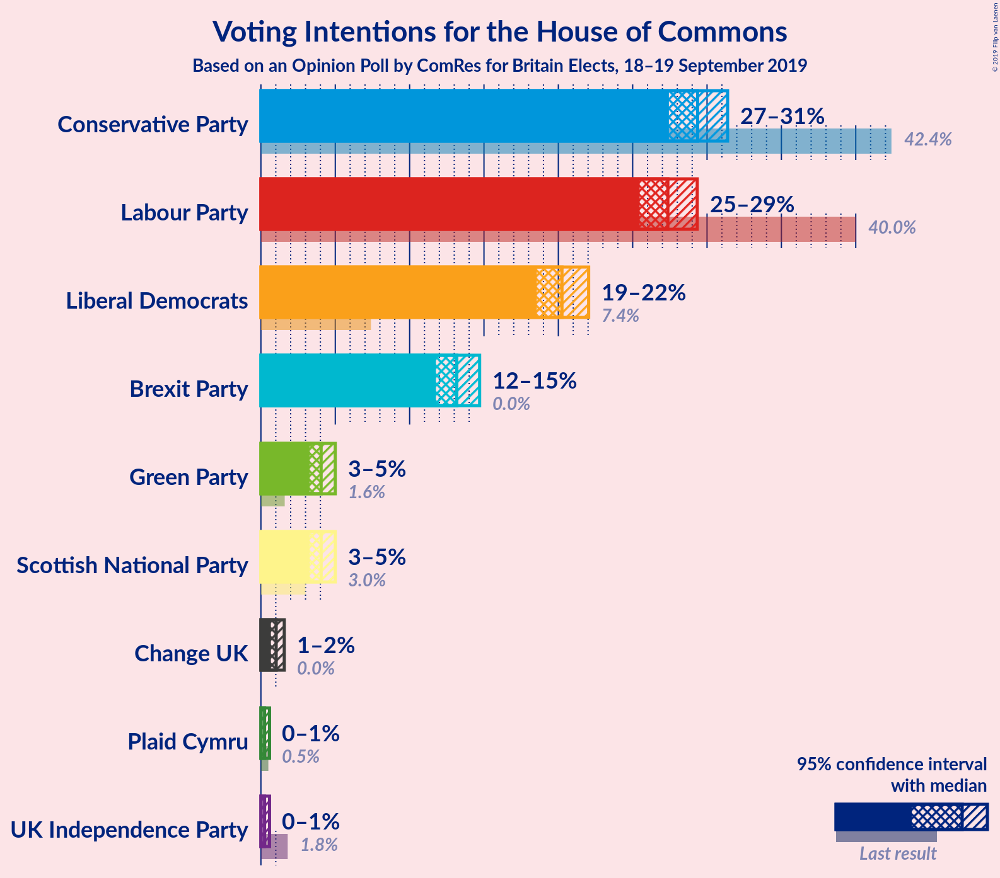

### Confidence Intervals

| Party | Last Result | Poll Result | 80% Confidence Interval | 90% Confidence Interval | 95% Confidence Interval | 99% Confidence Interval |
|:-----:|:-----------:|:-----------:|:-----------------------:|:-----------------------:|:-----------------------:|:-----------------------:|
| Conservative Party | 42.4% | 29.4% | 28.1–30.7% |27.7–31.1% |27.4–31.4% |26.8–32.0% |
| Labour Party | 40.0% | 27.4% | 26.1–28.7% |25.8–29.0% |25.5–29.3% |24.9–30.0% |
| Liberal Democrats | 7.4% | 20.2% | 19.1–21.4% |18.8–21.7% |18.5–22.0% |18.0–22.6% |
| Brexit Party | 0.0% | 13.2% | 12.3–14.2% |12.0–14.5% |11.8–14.7% |11.3–15.2% |
| Scottish National Party | 3.0% | 4.0% | 3.5–4.7% |3.4–4.8% |3.3–5.0% |3.0–5.3% |
| Green Party | 1.6% | 4.0% | 3.5–4.7% |3.4–4.8% |3.3–5.0% |3.0–5.3% |
| Change UK | 0.0% | 1.0% | 0.8–1.4% |0.7–1.5% |0.7–1.6% |0.6–1.8% |
| Plaid Cymru | 0.5% | 0.2% | 0.2–0.5% |0.1–0.5% |0.1–0.6% |0.1–0.7% |
| UK Independence Party | 1.8% | 0.2% | 0.2–0.5% |0.1–0.5% |0.1–0.6% |0.1–0.7% |

*Note:* The poll result column reflects the actual value used in the calculations. Published results may vary slightly, and in addition be rounded to fewer digits.

## Seats

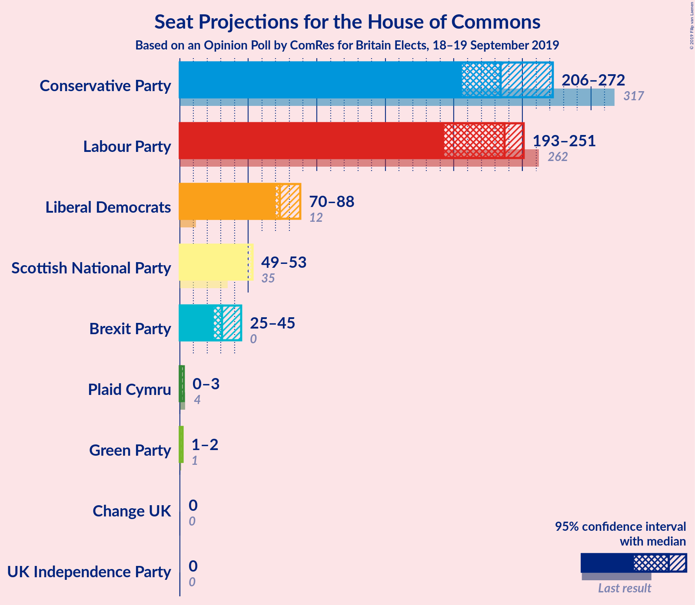

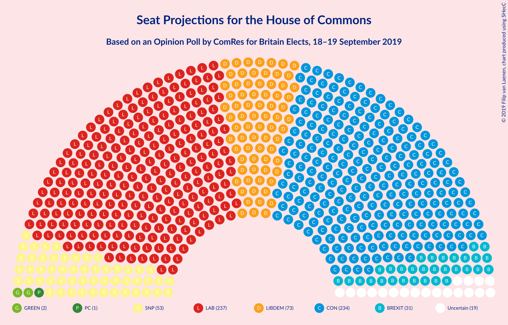

### Confidence Intervals

| Party | Last Result | Median | 80% Confidence Interval | 90% Confidence Interval | 95% Confidence Interval | 99% Confidence Interval |
|:-----:|:-----------:|:------:|:-----------------------:|:-----------------------:|:-----------------------:|:-----------------------:|
| <a href="#conservative-party">Conservative Party</a> | 317 | 234 | 227–258 |206–260 |206–272 |206–276 |
| <a href="#labour-party">Labour Party</a> | 262 | 237 | 204–244 |203–251 |193–251 |186–264 |
| <a href="#liberal-democrats">Liberal Democrats</a> | 12 | 73 | 72–82 |72–88 |70–88 |65–88 |
| <a href="#brexit-party">Brexit Party</a> | 0 | 31 | 30–45 |29–45 |25–45 |20–46 |
| <a href="#scottish-national-party">Scottish National Party</a> | 35 | 53 | 51–53 |51–53 |49–53 |49–54 |
| <a href="#green-party">Green Party</a> | 1 | 2 | 2 |1–2 |1–2 |1–3 |
| <a href="#change-uk">Change UK</a> | 0 | 0 | 0 |0 |0 |0 |
| <a href="#plaid-cymru">Plaid Cymru</a> | 4 | 1 | 0–3 |0–3 |0–3 |0–4 |
| <a href="#uk-independence-party">UK Independence Party</a> | 0 | 0 | 0 |0 |0 |0 |

### Conservative Party

*For a full overview of the results for this party, see the [Conservative Party](party-conservativeparty.html) page.*

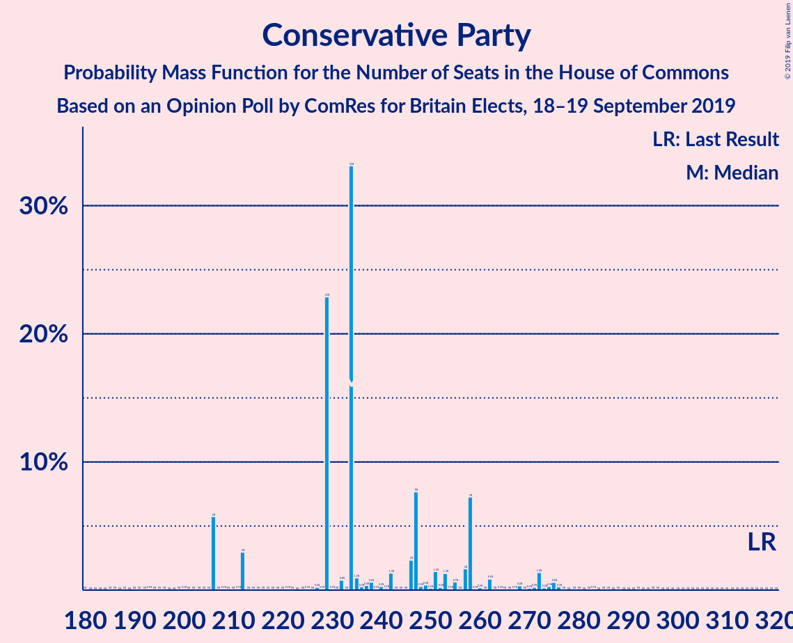

| Number of Seats | Probability | Accumulated | Special Marks |
|:---------------:|:-----------:|:-----------:|:-------------:|
| 186 | 0% | 100% |  |
| 187 | 0% | 99.9% |  |
| 188 | 0% | 99.9% |  |
| 189 | 0% | 99.9% |  |
| 190 | 0% | 99.9% |  |
| 191 | 0% | 99.9% |  |
| 192 | 0% | 99.9% |  |
| 193 | 0.1% | 99.9% |  |
| 194 | 0% | 99.8% |  |
| 195 | 0% | 99.8% |  |
| 196 | 0% | 99.7% |  |
| 197 | 0% | 99.7% |  |
| 198 | 0% | 99.7% |  |
| 199 | 0% | 99.7% |  |
| 200 | 0.1% | 99.7% |  |
| 201 | 0% | 99.6% |  |
| 202 | 0% | 99.6% |  |
| 203 | 0% | 99.6% |  |
| 204 | 0% | 99.6% |  |
| 205 | 0% | 99.6% |  |
| 206 | 6% | 99.5% |  |
| 207 | 0% | 94% |  |
| 208 | 0.1% | 94% |  |
| 209 | 0% | 94% |  |
| 210 | 0% | 94% |  |
| 211 | 0.1% | 94% |  |
| 212 | 3% | 94% |  |
| 213 | 0% | 91% |  |
| 214 | 0% | 91% |  |
| 215 | 0% | 91% |  |
| 216 | 0% | 91% |  |
| 217 | 0% | 91% |  |
| 218 | 0% | 90% |  |
| 219 | 0% | 90% |  |
| 220 | 0% | 90% |  |
| 221 | 0.1% | 90% |  |
| 222 | 0% | 90% |  |
| 223 | 0% | 90% |  |
| 224 | 0% | 90% |  |
| 225 | 0.1% | 90% |  |
| 226 | 0% | 90% |  |
| 227 | 0.2% | 90% |  |
| 228 | 0.1% | 90% |  |
| 229 | 23% | 90% |  |
| 230 | 0.1% | 67% |  |
| 231 | 0% | 67% |  |
| 232 | 0.8% | 67% |  |
| 233 | 0% | 66% |  |
| 234 | 33% | 66% | Median |
| 235 | 1.0% | 33% |  |
| 236 | 0.3% | 32% |  |
| 237 | 0.4% | 32% |  |
| 238 | 0.6% | 31% |  |
| 239 | 0.1% | 31% |  |
| 240 | 0.3% | 31% |  |
| 241 | 0.1% | 30% |  |
| 242 | 1.3% | 30% |  |
| 243 | 0% | 29% |  |
| 244 | 0% | 29% |  |
| 245 | 0% | 29% |  |
| 246 | 2% | 29% |  |
| 247 | 8% | 26% |  |
| 248 | 0.3% | 19% |  |
| 249 | 0.4% | 18% |  |
| 250 | 0.2% | 18% |  |
| 251 | 1.5% | 18% |  |
| 252 | 0.2% | 16% |  |
| 253 | 1.3% | 16% |  |
| 254 | 0.1% | 15% |  |
| 255 | 0.7% | 15% |  |
| 256 | 0% | 14% |  |
| 257 | 2% | 14% |  |
| 258 | 7% | 12% |  |
| 259 | 0.1% | 5% |  |
| 260 | 0.2% | 5% |  |
| 261 | 0% | 5% |  |
| 262 | 0.9% | 5% |  |
| 263 | 0% | 4% |  |
| 264 | 0.1% | 4% |  |
| 265 | 0% | 4% |  |
| 266 | 0% | 4% |  |
| 267 | 0.1% | 4% |  |
| 268 | 0.4% | 4% |  |
| 269 | 0% | 3% |  |
| 270 | 0.2% | 3% |  |
| 271 | 0.2% | 3% |  |
| 272 | 1.4% | 3% |  |
| 273 | 0.2% | 2% |  |
| 274 | 0.3% | 1.4% |  |
| 275 | 0.6% | 1.1% |  |
| 276 | 0.3% | 0.5% |  |
| 277 | 0% | 0.2% |  |
| 278 | 0% | 0.2% |  |
| 279 | 0% | 0.2% |  |
| 280 | 0% | 0.2% |  |
| 281 | 0% | 0.2% |  |
| 282 | 0% | 0.2% |  |
| 283 | 0.1% | 0.2% |  |
| 284 | 0% | 0.1% |  |
| 285 | 0% | 0.1% |  |
| 286 | 0% | 0.1% |  |
| 287 | 0% | 0.1% |  |
| 288 | 0% | 0.1% |  |
| 289 | 0% | 0% |  |
| 290 | 0% | 0% |  |
| 291 | 0% | 0% |  |
| 292 | 0% | 0% |  |
| 293 | 0% | 0% |  |
| 294 | 0% | 0% |  |
| 295 | 0% | 0% |  |
| 296 | 0% | 0% |  |
| 297 | 0% | 0% |  |
| 298 | 0% | 0% |  |
| 299 | 0% | 0% |  |
| 300 | 0% | 0% |  |
| 301 | 0% | 0% |  |
| 302 | 0% | 0% |  |
| 303 | 0% | 0% |  |
| 304 | 0% | 0% |  |
| 305 | 0% | 0% |  |
| 306 | 0% | 0% |  |
| 307 | 0% | 0% |  |
| 308 | 0% | 0% |  |
| 309 | 0% | 0% |  |
| 310 | 0% | 0% |  |
| 311 | 0% | 0% |  |
| 312 | 0% | 0% |  |
| 313 | 0% | 0% |  |
| 314 | 0% | 0% |  |
| 315 | 0% | 0% |  |
| 316 | 0% | 0% |  |
| 317 | 0% | 0% | Last Result |

### Labour Party

*For a full overview of the results for this party, see the [Labour Party](party-labourparty.html) page.*

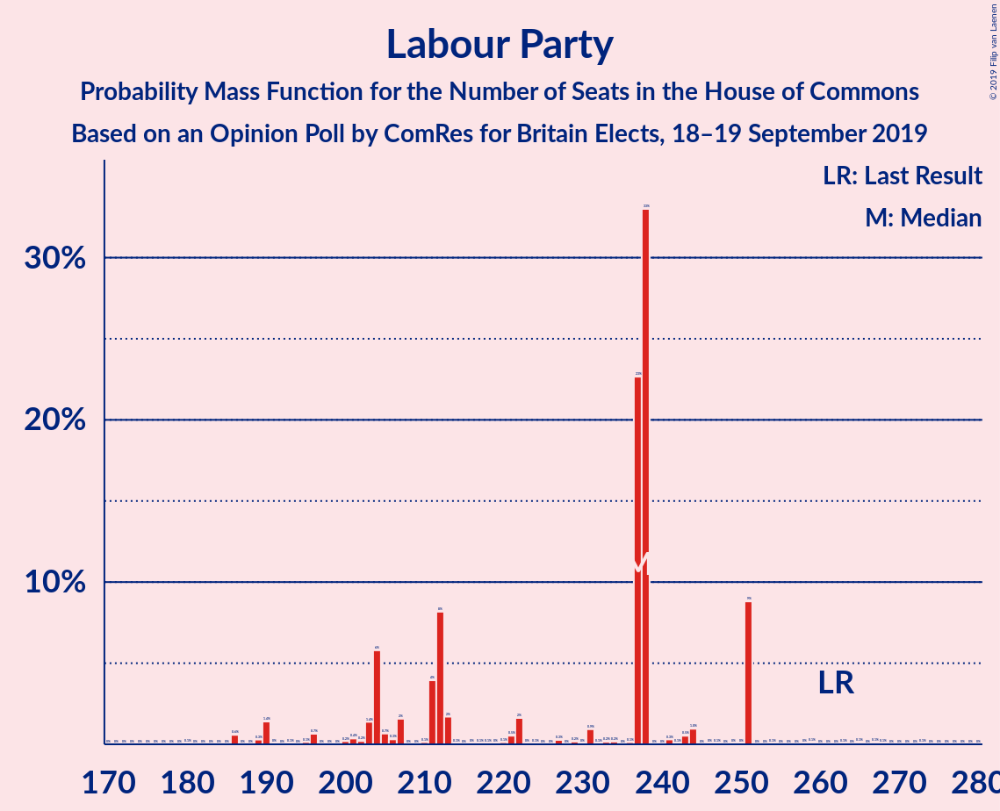

| Number of Seats | Probability | Accumulated | Special Marks |
|:---------------:|:-----------:|:-----------:|:-------------:|
| 177 | 0% | 100% |  |
| 178 | 0% | 99.9% |  |
| 179 | 0% | 99.9% |  |
| 180 | 0.1% | 99.9% |  |
| 181 | 0% | 99.9% |  |
| 182 | 0% | 99.9% |  |
| 183 | 0% | 99.9% |  |
| 184 | 0% | 99.9% |  |
| 185 | 0% | 99.9% |  |
| 186 | 0.6% | 99.9% |  |
| 187 | 0% | 99.3% |  |
| 188 | 0% | 99.3% |  |
| 189 | 0.3% | 99.3% |  |
| 190 | 1.4% | 99.0% |  |
| 191 | 0% | 98% |  |
| 192 | 0% | 98% |  |
| 193 | 0.1% | 98% |  |
| 194 | 0% | 97% |  |
| 195 | 0.1% | 97% |  |
| 196 | 0.7% | 97% |  |
| 197 | 0% | 97% |  |
| 198 | 0% | 97% |  |
| 199 | 0% | 97% |  |
| 200 | 0.2% | 97% |  |
| 201 | 0.4% | 96% |  |
| 202 | 0.2% | 96% |  |
| 203 | 1.4% | 96% |  |
| 204 | 6% | 94% |  |
| 205 | 0.7% | 89% |  |
| 206 | 0.3% | 88% |  |
| 207 | 2% | 88% |  |
| 208 | 0% | 86% |  |
| 209 | 0% | 86% |  |
| 210 | 0.1% | 86% |  |
| 211 | 4% | 86% |  |
| 212 | 8% | 82% |  |
| 213 | 2% | 74% |  |
| 214 | 0.1% | 72% |  |
| 215 | 0% | 72% |  |
| 216 | 0% | 72% |  |
| 217 | 0.1% | 72% |  |
| 218 | 0.1% | 72% |  |
| 219 | 0% | 72% |  |
| 220 | 0.1% | 72% |  |
| 221 | 0.5% | 72% |  |
| 222 | 2% | 71% |  |
| 223 | 0% | 70% |  |
| 224 | 0.1% | 70% |  |
| 225 | 0% | 69% |  |
| 226 | 0% | 69% |  |
| 227 | 0.3% | 69% |  |
| 228 | 0% | 69% |  |
| 229 | 0.2% | 69% |  |
| 230 | 0% | 69% |  |
| 231 | 0.9% | 69% |  |
| 232 | 0.1% | 68% |  |
| 233 | 0.2% | 68% |  |
| 234 | 0.2% | 68% |  |
| 235 | 0% | 68% |  |
| 236 | 0.1% | 68% |  |
| 237 | 23% | 67% | Median |
| 238 | 33% | 45% |  |
| 239 | 0% | 12% |  |
| 240 | 0% | 12% |  |
| 241 | 0.3% | 12% |  |
| 242 | 0.1% | 11% |  |
| 243 | 0.5% | 11% |  |
| 244 | 1.0% | 11% |  |
| 245 | 0% | 10% |  |
| 246 | 0% | 10% |  |
| 247 | 0.1% | 10% |  |
| 248 | 0% | 10% |  |
| 249 | 0% | 10% |  |
| 250 | 0% | 10% |  |
| 251 | 9% | 10% |  |
| 252 | 0% | 0.9% |  |
| 253 | 0% | 0.9% |  |
| 254 | 0.1% | 0.9% |  |
| 255 | 0% | 0.8% |  |
| 256 | 0% | 0.8% |  |
| 257 | 0% | 0.8% |  |
| 258 | 0% | 0.8% |  |
| 259 | 0.1% | 0.7% |  |
| 260 | 0% | 0.6% |  |
| 261 | 0% | 0.6% |  |
| 262 | 0% | 0.6% | Last Result |
| 263 | 0.1% | 0.6% |  |
| 264 | 0% | 0.5% |  |
| 265 | 0.1% | 0.5% |  |
| 266 | 0% | 0.4% |  |
| 267 | 0.1% | 0.4% |  |
| 268 | 0.1% | 0.3% |  |
| 269 | 0% | 0.2% |  |
| 270 | 0% | 0.2% |  |
| 271 | 0% | 0.2% |  |
| 272 | 0% | 0.1% |  |
| 273 | 0.1% | 0.1% |  |
| 274 | 0% | 0.1% |  |
| 275 | 0% | 0.1% |  |
| 276 | 0% | 0.1% |  |
| 277 | 0% | 0.1% |  |
| 278 | 0% | 0.1% |  |
| 279 | 0% | 0% |  |

### Liberal Democrats

*For a full overview of the results for this party, see the [Liberal Democrats](party-liberaldemocrats.html) page.*

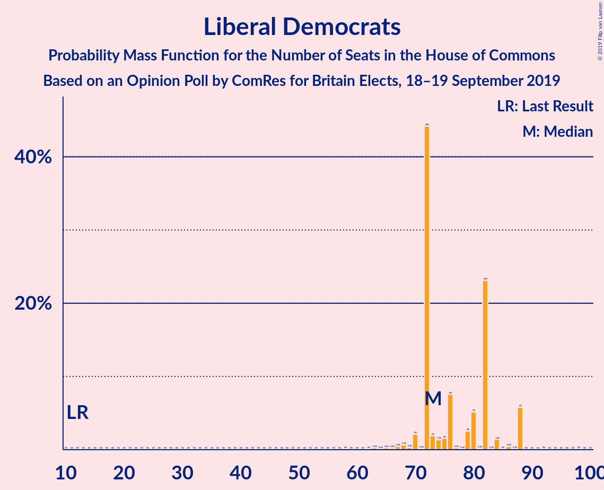

| Number of Seats | Probability | Accumulated | Special Marks |
|:---------------:|:-----------:|:-----------:|:-------------:|
| 12 | 0% | 100% | Last Result |
| 13 | 0% | 100% |  |
| 14 | 0% | 100% |  |
| 15 | 0% | 100% |  |
| 16 | 0% | 100% |  |
| 17 | 0% | 100% |  |
| 18 | 0% | 100% |  |
| 19 | 0% | 100% |  |
| 20 | 0% | 100% |  |
| 21 | 0% | 100% |  |
| 22 | 0% | 100% |  |
| 23 | 0% | 100% |  |
| 24 | 0% | 100% |  |
| 25 | 0% | 100% |  |
| 26 | 0% | 100% |  |
| 27 | 0% | 100% |  |
| 28 | 0% | 100% |  |
| 29 | 0% | 100% |  |
| 30 | 0% | 100% |  |
| 31 | 0% | 100% |  |
| 32 | 0% | 100% |  |
| 33 | 0% | 100% |  |
| 34 | 0% | 100% |  |
| 35 | 0% | 100% |  |
| 36 | 0% | 100% |  |
| 37 | 0% | 100% |  |
| 38 | 0% | 100% |  |
| 39 | 0% | 100% |  |
| 40 | 0% | 100% |  |
| 41 | 0% | 100% |  |
| 42 | 0% | 100% |  |
| 43 | 0% | 100% |  |
| 44 | 0% | 100% |  |
| 45 | 0% | 100% |  |
| 46 | 0% | 100% |  |
| 47 | 0% | 100% |  |
| 48 | 0% | 100% |  |
| 49 | 0% | 100% |  |
| 50 | 0% | 100% |  |
| 51 | 0% | 100% |  |
| 52 | 0% | 100% |  |
| 53 | 0% | 100% |  |
| 54 | 0% | 100% |  |
| 55 | 0% | 100% |  |
| 56 | 0% | 100% |  |
| 57 | 0% | 100% |  |
| 58 | 0% | 100% |  |
| 59 | 0% | 100% |  |
| 60 | 0% | 100% |  |
| 61 | 0% | 100% |  |
| 62 | 0% | 100% |  |
| 63 | 0.2% | 99.9% |  |
| 64 | 0.1% | 99.7% |  |
| 65 | 0.2% | 99.6% |  |
| 66 | 0.2% | 99.4% |  |
| 67 | 0.4% | 99.2% |  |
| 68 | 0.7% | 98.8% |  |
| 69 | 0.3% | 98% |  |
| 70 | 2% | 98% |  |
| 71 | 0.1% | 96% |  |
| 72 | 44% | 96% |  |
| 73 | 2% | 51% | Median |
| 74 | 1.3% | 50% |  |
| 75 | 2% | 48% |  |
| 76 | 8% | 47% |  |
| 77 | 0.2% | 39% |  |
| 78 | 0.1% | 39% |  |
| 79 | 3% | 39% |  |
| 80 | 5% | 36% |  |
| 81 | 0.1% | 31% |  |
| 82 | 23% | 31% |  |
| 83 | 0.1% | 8% |  |
| 84 | 1.4% | 8% |  |
| 85 | 0% | 6% |  |
| 86 | 0.4% | 6% |  |
| 87 | 0.1% | 6% |  |
| 88 | 6% | 6% |  |
| 89 | 0% | 0.1% |  |
| 90 | 0% | 0.1% |  |
| 91 | 0% | 0.1% |  |
| 92 | 0% | 0.1% |  |
| 93 | 0% | 0.1% |  |
| 94 | 0% | 0.1% |  |
| 95 | 0% | 0.1% |  |
| 96 | 0% | 0.1% |  |
| 97 | 0% | 0% |  |

### Brexit Party

*For a full overview of the results for this party, see the [Brexit Party](party-brexitparty.html) page.*

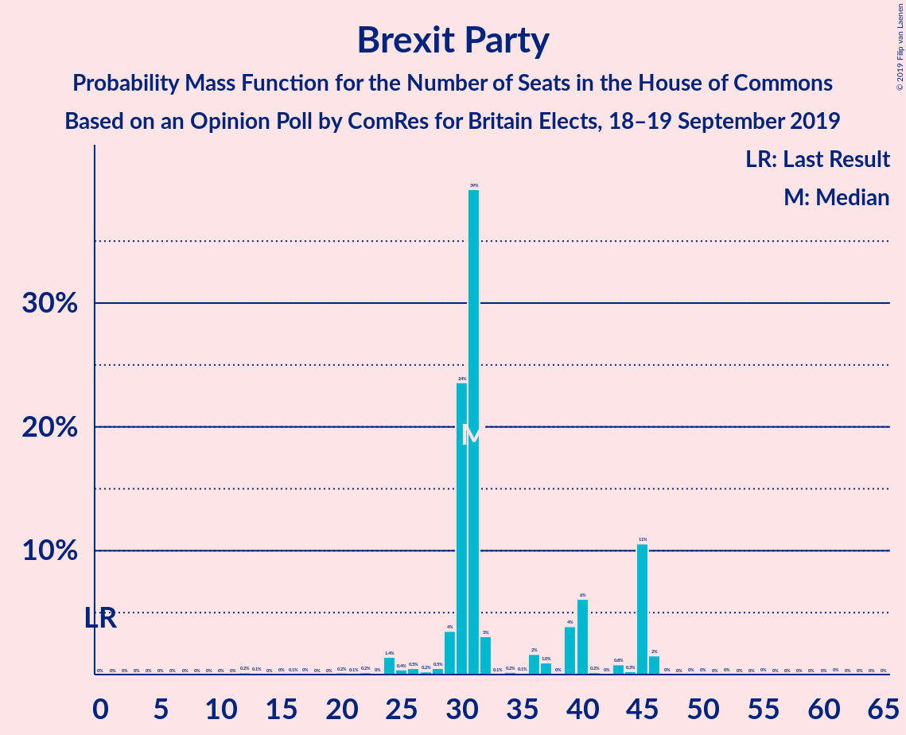

| Number of Seats | Probability | Accumulated | Special Marks |
|:---------------:|:-----------:|:-----------:|:-------------:|
| 0 | 0% | 100% | Last Result |
| 1 | 0% | 100% |  |
| 2 | 0% | 100% |  |
| 3 | 0% | 100% |  |
| 4 | 0% | 100% |  |
| 5 | 0% | 100% |  |
| 6 | 0% | 100% |  |
| 7 | 0% | 100% |  |
| 8 | 0% | 100% |  |
| 9 | 0% | 100% |  |
| 10 | 0% | 100% |  |
| 11 | 0% | 100% |  |
| 12 | 0.2% | 100% |  |
| 13 | 0.1% | 99.8% |  |
| 14 | 0% | 99.7% |  |
| 15 | 0% | 99.7% |  |
| 16 | 0.1% | 99.7% |  |
| 17 | 0% | 99.6% |  |
| 18 | 0% | 99.6% |  |
| 19 | 0% | 99.6% |  |
| 20 | 0.2% | 99.6% |  |
| 21 | 0.1% | 99.4% |  |
| 22 | 0.2% | 99.3% |  |
| 23 | 0% | 99.2% |  |
| 24 | 1.4% | 99.1% |  |
| 25 | 0.4% | 98% |  |
| 26 | 0.5% | 97% |  |
| 27 | 0.2% | 97% |  |
| 28 | 0.5% | 97% |  |
| 29 | 4% | 96% |  |
| 30 | 24% | 93% |  |
| 31 | 39% | 69% | Median |
| 32 | 3% | 30% |  |
| 33 | 0.1% | 27% |  |
| 34 | 0.2% | 27% |  |
| 35 | 0.1% | 26% |  |
| 36 | 2% | 26% |  |
| 37 | 1.0% | 25% |  |
| 38 | 0% | 24% |  |
| 39 | 4% | 24% |  |
| 40 | 6% | 20% |  |
| 41 | 0.2% | 14% |  |
| 42 | 0% | 14% |  |
| 43 | 0.8% | 13% |  |
| 44 | 0.3% | 13% |  |
| 45 | 11% | 12% |  |
| 46 | 2% | 2% |  |
| 47 | 0% | 0.3% |  |
| 48 | 0% | 0.3% |  |
| 49 | 0% | 0.3% |  |
| 50 | 0% | 0.2% |  |
| 51 | 0% | 0.2% |  |
| 52 | 0% | 0.2% |  |
| 53 | 0% | 0.2% |  |
| 54 | 0% | 0.2% |  |
| 55 | 0% | 0.2% |  |
| 56 | 0% | 0.1% |  |
| 57 | 0% | 0.1% |  |
| 58 | 0% | 0.1% |  |
| 59 | 0% | 0.1% |  |
| 60 | 0% | 0.1% |  |
| 61 | 0% | 0.1% |  |
| 62 | 0% | 0% |  |

### Scottish National Party

*For a full overview of the results for this party, see the [Scottish National Party](party-scottishnationalparty.html) page.*

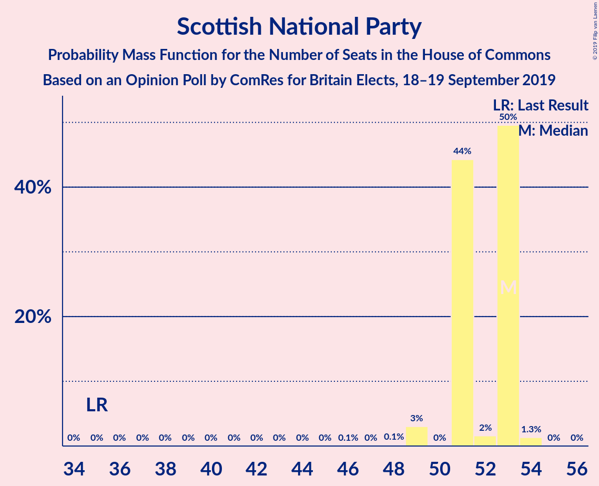

| Number of Seats | Probability | Accumulated | Special Marks |
|:---------------:|:-----------:|:-----------:|:-------------:|
| 35 | 0% | 100% | Last Result |
| 36 | 0% | 100% |  |
| 37 | 0% | 100% |  |
| 38 | 0% | 100% |  |
| 39 | 0% | 100% |  |
| 40 | 0% | 100% |  |
| 41 | 0% | 100% |  |
| 42 | 0% | 100% |  |
| 43 | 0% | 100% |  |
| 44 | 0% | 100% |  |
| 45 | 0% | 100% |  |
| 46 | 0.1% | 100% |  |
| 47 | 0% | 99.9% |  |
| 48 | 0.1% | 99.9% |  |
| 49 | 3% | 99.8% |  |
| 50 | 0% | 97% |  |
| 51 | 44% | 97% |  |
| 52 | 2% | 52% |  |
| 53 | 50% | 51% | Median |
| 54 | 1.3% | 1.3% |  |
| 55 | 0% | 0% |  |

### Green Party

*For a full overview of the results for this party, see the [Green Party](party-greenparty.html) page.*

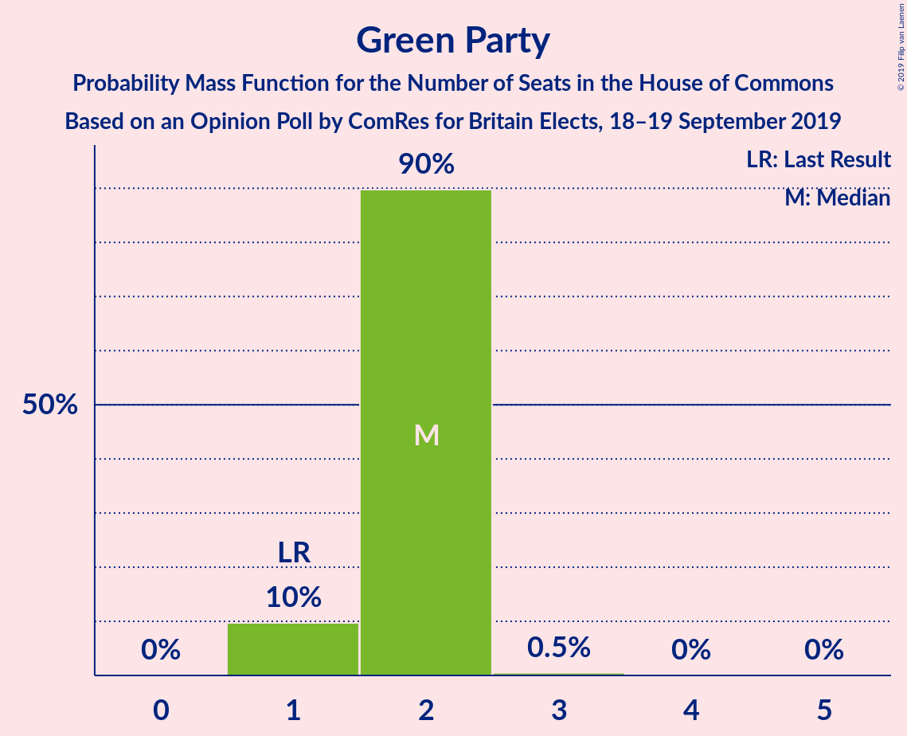

| Number of Seats | Probability | Accumulated | Special Marks |
|:---------------:|:-----------:|:-----------:|:-------------:|
| 1 | 10% | 100% | Last Result |
| 2 | 90% | 90% | Median |
| 3 | 0.5% | 0.5% |  |
| 4 | 0% | 0% |  |

### Change UK

*For a full overview of the results for this party, see the [Change UK](party-changeuk.html) page.*

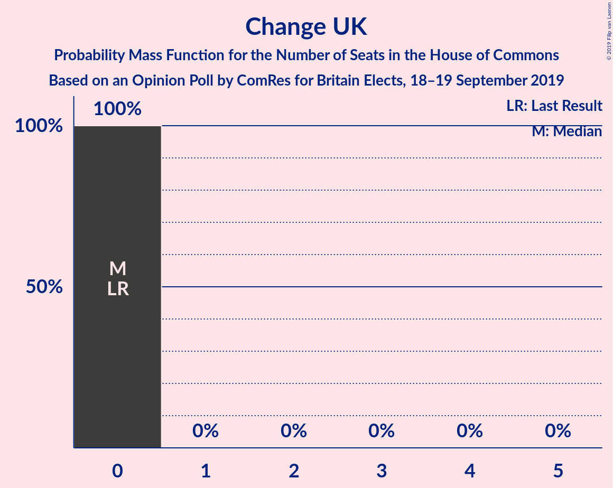

| Number of Seats | Probability | Accumulated | Special Marks |
|:---------------:|:-----------:|:-----------:|:-------------:|
| 0 | 100% | 100% | Last Result, Median |

### Plaid Cymru

*For a full overview of the results for this party, see the [Plaid Cymru](party-plaidcymru.html) page.*

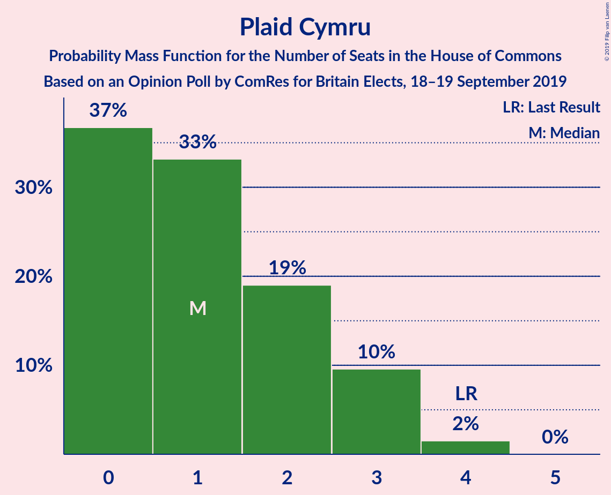

| Number of Seats | Probability | Accumulated | Special Marks |
|:---------------:|:-----------:|:-----------:|:-------------:|
| 0 | 37% | 100% |  |
| 1 | 33% | 63% | Median |
| 2 | 19% | 30% |  |
| 3 | 10% | 11% |  |
| 4 | 2% | 2% | Last Result |
| 5 | 0% | 0% |  |

### UK Independence Party

*For a full overview of the results for this party, see the [UK Independence Party](party-ukindependenceparty.html) page.*

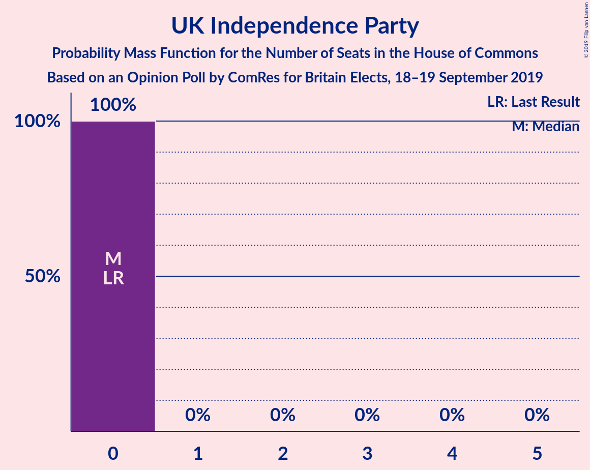

| Number of Seats | Probability | Accumulated | Special Marks |
|:---------------:|:-----------:|:-----------:|:-------------:|
| 0 | 100% | 100% | Last Result, Median |

## Coalitions

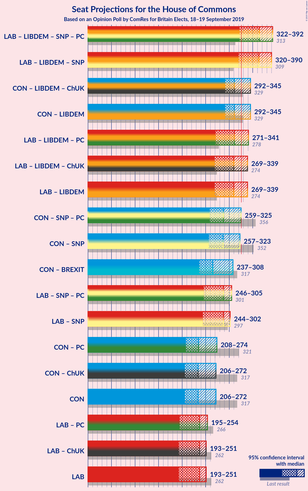

### Confidence Intervals

| Coalition | Last Result | Median | Majority? | 80% Confidence Interval | 90% Confidence Interval | 95% Confidence Interval | 99% Confidence Interval |
|:---------:|:-----------:|:------:|:---------:|:-----------------------:|:-----------------------:|:-----------------------:|:-----------------------:|
| Labour Party – Liberal Democrats – Scottish National Party – Plaid Cymru | 313 | 364 | 96% | 333–371 | 332–392 | 322–392 | 319–393 |
| Labour Party – Liberal Democrats – Scottish National Party | 309 | 363 | 96% | 331–370 | 330–390 | 320–390 | 316–392 |
| Conservative Party – Liberal Democrats – Change UK | 329 | 311 | 16% | 300–334 | 294–336 | 292–345 | 285–354 |
| Conservative Party – Liberal Democrats | 329 | 311 | 16% | 300–334 | 294–336 | 292–345 | 285–354 |
| Labour Party – Liberal Democrats – Plaid Cymru | 278 | 311 | 10% | 282–320 | 282–341 | 271–341 | 268–342 |
| Labour Party – Liberal Democrats – Change UK | 274 | 310 | 10% | 280–319 | 278–339 | 269–339 | 265–341 |
| Labour Party – Liberal Democrats | 274 | 310 | 10% | 280–319 | 278–339 | 269–339 | 265–341 |
| Conservative Party – Scottish National Party – Plaid Cymru | 356 | 288 | 1.4% | 280–311 | 259–314 | 259–325 | 259–329 |
| Conservative Party – Scottish National Party | 352 | 287 | 1.2% | 278–309 | 257–311 | 257–323 | 257–328 |
| Conservative Party – Brexit Party | 317 | 265 | 0.1% | 258–298 | 237–298 | 237–308 | 237–312 |
| Labour Party – Scottish National Party – Plaid Cymru | 301 | 288 | 0.1% | 257–298 | 254–304 | 246–305 | 240–318 |
| Labour Party – Scottish National Party | 297 | 288 | 0.1% | 255–296 | 254–302 | 244–302 | 237–315 |
| Conservative Party – Plaid Cymru | 321 | 235 | 0% | 229–260 | 208–264 | 208–274 | 208–278 |
| Conservative Party – Change UK | 317 | 234 | 0% | 227–258 | 206–260 | 206–272 | 206–276 |
| Conservative Party | 317 | 234 | 0% | 227–258 | 206–260 | 206–272 | 206–276 |
| Labour Party – Plaid Cymru | 266 | 237 | 0% | 206–247 | 204–253 | 195–254 | 189–267 |
| Labour Party – Change UK | 262 | 237 | 0% | 204–244 | 203–251 | 193–251 | 186–264 |
| Labour Party | 262 | 237 | 0% | 204–244 | 203–251 | 193–251 | 186–264 |

### Labour Party – Liberal Democrats – Scottish National Party – Plaid Cymru

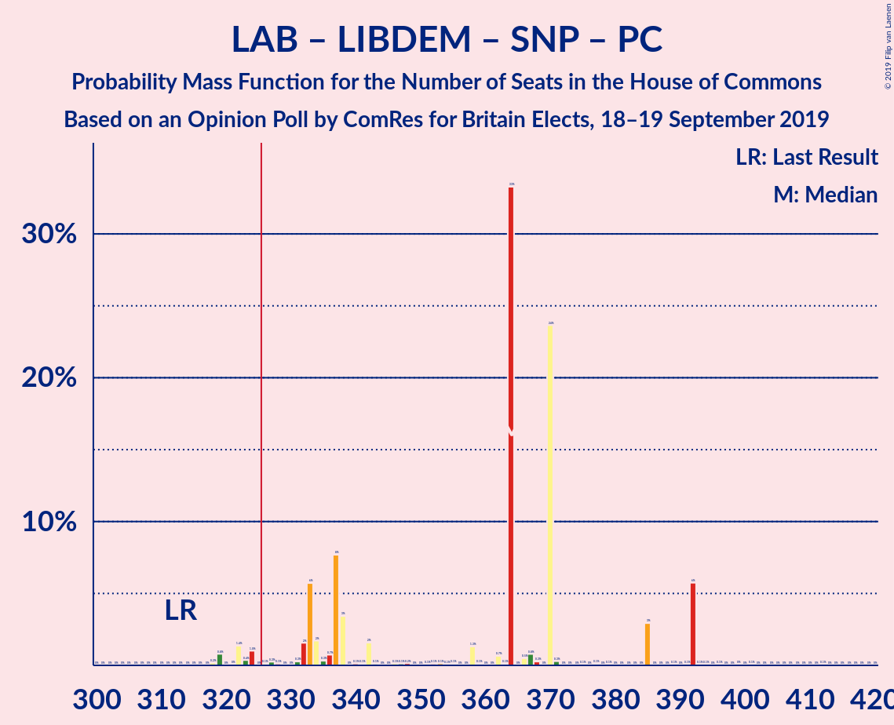

| Number of Seats | Probability | Accumulated | Special Marks |
|:---------------:|:-----------:|:-----------:|:-------------:|
| 302 | 0% | 100% |  |
| 303 | 0% | 99.9% |  |
| 304 | 0% | 99.9% |  |
| 305 | 0% | 99.9% |  |
| 306 | 0% | 99.9% |  |
| 307 | 0% | 99.9% |  |
| 308 | 0% | 99.9% |  |
| 309 | 0% | 99.9% |  |
| 310 | 0% | 99.9% |  |
| 311 | 0% | 99.9% |  |
| 312 | 0% | 99.9% |  |
| 313 | 0% | 99.8% | Last Result |
| 314 | 0% | 99.8% |  |
| 315 | 0% | 99.8% |  |
| 316 | 0% | 99.8% |  |
| 317 | 0% | 99.7% |  |
| 318 | 0.2% | 99.7% |  |
| 319 | 0.8% | 99.5% |  |
| 320 | 0% | 98.7% |  |
| 321 | 0% | 98.7% |  |
| 322 | 1.4% | 98.7% |  |
| 323 | 0.4% | 97% |  |
| 324 | 1.0% | 97% |  |
| 325 | 0% | 96% |  |
| 326 | 0.1% | 96% | Majority |
| 327 | 0.3% | 96% |  |
| 328 | 0.1% | 96% |  |
| 329 | 0% | 95% |  |
| 330 | 0% | 95% |  |
| 331 | 0.3% | 95% |  |
| 332 | 2% | 95% |  |
| 333 | 6% | 94% |  |
| 334 | 2% | 88% |  |
| 335 | 0.3% | 86% |  |
| 336 | 0.7% | 86% |  |
| 337 | 8% | 85% |  |
| 338 | 3% | 77% |  |
| 339 | 0% | 74% |  |
| 340 | 0.1% | 74% |  |
| 341 | 0.1% | 74% |  |
| 342 | 2% | 74% |  |
| 343 | 0.1% | 72% |  |
| 344 | 0% | 72% |  |
| 345 | 0% | 72% |  |
| 346 | 0.1% | 72% |  |
| 347 | 0.1% | 72% |  |
| 348 | 0.2% | 72% |  |
| 349 | 0% | 72% |  |
| 350 | 0% | 72% |  |
| 351 | 0.1% | 71% |  |
| 352 | 0.1% | 71% |  |
| 353 | 0.1% | 71% |  |
| 354 | 0.1% | 71% |  |
| 355 | 0.1% | 71% |  |
| 356 | 0% | 71% |  |
| 357 | 0% | 71% |  |
| 358 | 1.3% | 71% |  |
| 359 | 0.1% | 70% |  |
| 360 | 0% | 70% |  |
| 361 | 0% | 70% |  |
| 362 | 0.7% | 69% |  |
| 363 | 0.1% | 69% |  |
| 364 | 33% | 69% | Median |
| 365 | 0% | 35% |  |
| 366 | 0.5% | 35% |  |
| 367 | 0.8% | 35% |  |
| 368 | 0.3% | 34% |  |
| 369 | 0% | 34% |  |
| 370 | 24% | 34% |  |
| 371 | 0.3% | 10% |  |
| 372 | 0% | 10% |  |
| 373 | 0% | 10% |  |
| 374 | 0% | 10% |  |
| 375 | 0.1% | 10% |  |
| 376 | 0% | 10% |  |
| 377 | 0.1% | 10% |  |
| 378 | 0% | 10% |  |
| 379 | 0.1% | 10% |  |
| 380 | 0% | 10% |  |
| 381 | 0% | 10% |  |
| 382 | 0% | 9% |  |
| 383 | 0% | 9% |  |
| 384 | 0% | 9% |  |
| 385 | 3% | 9% |  |
| 386 | 0% | 6% |  |
| 387 | 0% | 6% |  |
| 388 | 0% | 6% |  |
| 389 | 0.1% | 6% |  |
| 390 | 0% | 6% |  |
| 391 | 0.1% | 6% |  |
| 392 | 6% | 6% |  |
| 393 | 0.1% | 0.6% |  |
| 394 | 0.1% | 0.5% |  |
| 395 | 0% | 0.4% |  |
| 396 | 0.1% | 0.4% |  |
| 397 | 0% | 0.3% |  |
| 398 | 0% | 0.3% |  |
| 399 | 0% | 0.3% |  |
| 400 | 0% | 0.2% |  |
| 401 | 0.1% | 0.2% |  |
| 402 | 0% | 0.2% |  |
| 403 | 0% | 0.2% |  |
| 404 | 0% | 0.2% |  |
| 405 | 0% | 0.2% |  |
| 406 | 0% | 0.2% |  |
| 407 | 0% | 0.2% |  |
| 408 | 0% | 0.1% |  |
| 409 | 0% | 0.1% |  |
| 410 | 0% | 0.1% |  |
| 411 | 0% | 0.1% |  |
| 412 | 0.1% | 0.1% |  |
| 413 | 0% | 0% |  |

### Labour Party – Liberal Democrats – Scottish National Party

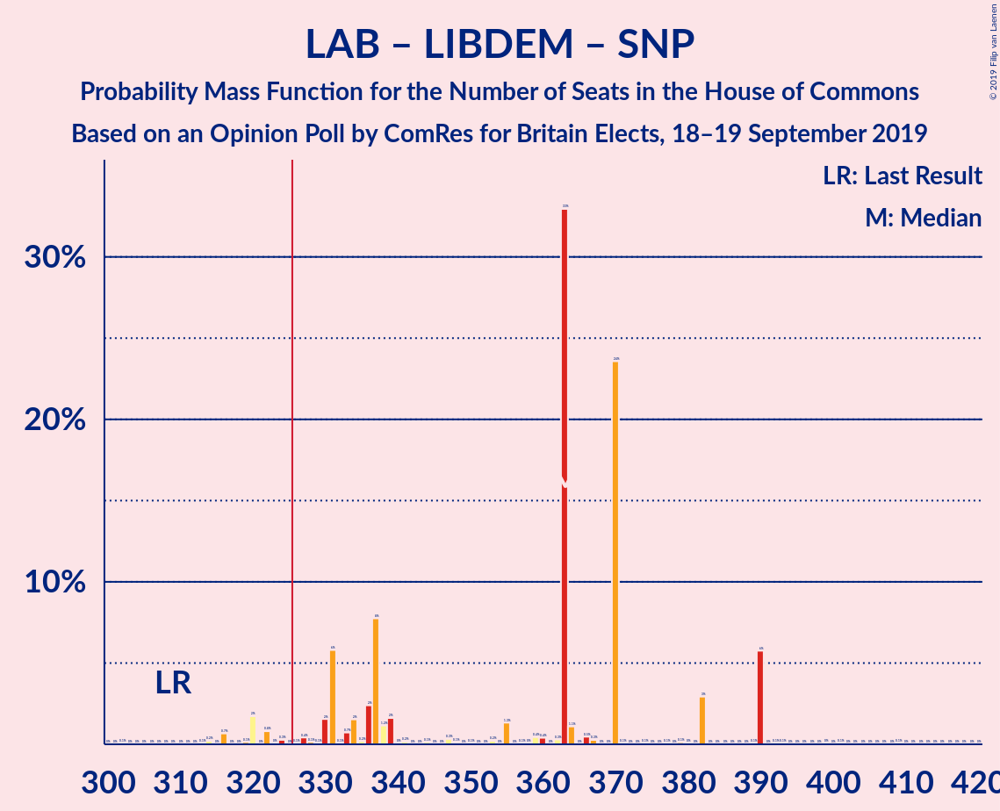

| Number of Seats | Probability | Accumulated | Special Marks |
|:---------------:|:-----------:|:-----------:|:-------------:|
| 302 | 0.1% | 100% |  |
| 303 | 0% | 99.9% |  |
| 304 | 0% | 99.9% |  |
| 305 | 0% | 99.9% |  |
| 306 | 0% | 99.9% |  |
| 307 | 0% | 99.9% |  |
| 308 | 0% | 99.9% |  |
| 309 | 0% | 99.9% | Last Result |
| 310 | 0% | 99.9% |  |
| 311 | 0% | 99.8% |  |
| 312 | 0% | 99.8% |  |
| 313 | 0.1% | 99.8% |  |
| 314 | 0.2% | 99.8% |  |
| 315 | 0% | 99.5% |  |
| 316 | 0.7% | 99.5% |  |
| 317 | 0% | 98.9% |  |
| 318 | 0% | 98.9% |  |
| 319 | 0.1% | 98.8% |  |
| 320 | 2% | 98.7% |  |
| 321 | 0% | 97% |  |
| 322 | 0.8% | 97% |  |
| 323 | 0% | 96% |  |
| 324 | 0.3% | 96% |  |
| 325 | 0% | 96% |  |
| 326 | 0.1% | 96% | Majority |
| 327 | 0.4% | 96% |  |
| 328 | 0.1% | 95% |  |
| 329 | 0.1% | 95% |  |
| 330 | 2% | 95% |  |
| 331 | 6% | 93% |  |
| 332 | 0.1% | 88% |  |
| 333 | 0.7% | 88% |  |
| 334 | 2% | 87% |  |
| 335 | 0.2% | 85% |  |
| 336 | 2% | 85% |  |
| 337 | 8% | 83% |  |
| 338 | 1.2% | 75% |  |
| 339 | 2% | 74% |  |
| 340 | 0% | 72% |  |
| 341 | 0.2% | 72% |  |
| 342 | 0% | 72% |  |
| 343 | 0% | 72% |  |
| 344 | 0.1% | 72% |  |
| 345 | 0% | 72% |  |
| 346 | 0% | 72% |  |
| 347 | 0.3% | 72% |  |
| 348 | 0.1% | 71% |  |
| 349 | 0% | 71% |  |
| 350 | 0.1% | 71% |  |
| 351 | 0% | 71% |  |
| 352 | 0% | 71% |  |
| 353 | 0.2% | 71% |  |
| 354 | 0% | 71% |  |
| 355 | 1.3% | 71% |  |
| 356 | 0% | 70% |  |
| 357 | 0.1% | 70% |  |
| 358 | 0% | 70% |  |
| 359 | 0.4% | 70% |  |
| 360 | 0.4% | 69% |  |
| 361 | 0% | 69% |  |
| 362 | 0.3% | 69% |  |
| 363 | 33% | 68% | Median |
| 364 | 1.1% | 35% |  |
| 365 | 0% | 34% |  |
| 366 | 0.5% | 34% |  |
| 367 | 0.3% | 34% |  |
| 368 | 0% | 34% |  |
| 369 | 0% | 34% |  |
| 370 | 24% | 34% |  |
| 371 | 0.1% | 10% |  |
| 372 | 0% | 10% |  |
| 373 | 0% | 10% |  |
| 374 | 0.1% | 10% |  |
| 375 | 0% | 10% |  |
| 376 | 0% | 10% |  |
| 377 | 0.1% | 10% |  |
| 378 | 0% | 10% |  |
| 379 | 0.1% | 10% |  |
| 380 | 0% | 9% |  |
| 381 | 0% | 9% |  |
| 382 | 3% | 9% |  |
| 383 | 0% | 6% |  |
| 384 | 0% | 6% |  |
| 385 | 0% | 6% |  |
| 386 | 0% | 6% |  |
| 387 | 0% | 6% |  |
| 388 | 0% | 6% |  |
| 389 | 0.1% | 6% |  |
| 390 | 6% | 6% |  |
| 391 | 0% | 0.6% |  |
| 392 | 0.1% | 0.5% |  |
| 393 | 0.1% | 0.4% |  |
| 394 | 0% | 0.4% |  |
| 395 | 0% | 0.3% |  |
| 396 | 0% | 0.3% |  |
| 397 | 0% | 0.3% |  |
| 398 | 0% | 0.3% |  |
| 399 | 0% | 0.3% |  |
| 400 | 0% | 0.2% |  |
| 401 | 0.1% | 0.2% |  |
| 402 | 0% | 0.2% |  |
| 403 | 0% | 0.2% |  |
| 404 | 0% | 0.2% |  |
| 405 | 0% | 0.1% |  |
| 406 | 0% | 0.1% |  |
| 407 | 0% | 0.1% |  |
| 408 | 0% | 0.1% |  |
| 409 | 0.1% | 0.1% |  |
| 410 | 0% | 0.1% |  |
| 411 | 0% | 0.1% |  |
| 412 | 0% | 0% |  |

### Conservative Party – Liberal Democrats – Change UK

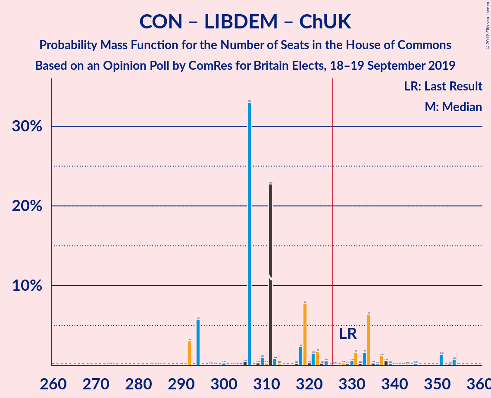

| Number of Seats | Probability | Accumulated | Special Marks |
|:---------------:|:-----------:|:-----------:|:-------------:|
| 267 | 0% | 100% |  |
| 268 | 0% | 99.9% |  |
| 269 | 0% | 99.9% |  |
| 270 | 0% | 99.9% |  |
| 271 | 0% | 99.9% |  |
| 272 | 0% | 99.9% |  |
| 273 | 0.1% | 99.9% |  |
| 274 | 0.1% | 99.8% |  |
| 275 | 0% | 99.8% |  |
| 276 | 0% | 99.8% |  |
| 277 | 0% | 99.7% |  |
| 278 | 0% | 99.7% |  |
| 279 | 0% | 99.7% |  |
| 280 | 0% | 99.7% |  |
| 281 | 0% | 99.7% |  |
| 282 | 0% | 99.6% |  |
| 283 | 0.1% | 99.6% |  |
| 284 | 0% | 99.6% |  |
| 285 | 0.1% | 99.5% |  |
| 286 | 0% | 99.4% |  |
| 287 | 0% | 99.4% |  |
| 288 | 0% | 99.4% |  |
| 289 | 0% | 99.4% |  |
| 290 | 0.1% | 99.3% |  |
| 291 | 0% | 99.3% |  |
| 292 | 3% | 99.3% |  |
| 293 | 0% | 96% |  |
| 294 | 6% | 96% |  |
| 295 | 0% | 90% |  |
| 296 | 0% | 90% |  |
| 297 | 0.1% | 90% |  |
| 298 | 0.1% | 90% |  |
| 299 | 0% | 90% |  |
| 300 | 0.3% | 90% |  |
| 301 | 0% | 90% |  |
| 302 | 0.1% | 90% |  |
| 303 | 0.1% | 90% |  |
| 304 | 0% | 90% |  |
| 305 | 0.4% | 90% |  |
| 306 | 33% | 89% |  |
| 307 | 0% | 56% | Median |
| 308 | 0.3% | 56% |  |
| 309 | 1.0% | 56% |  |
| 310 | 0.3% | 55% |  |
| 311 | 23% | 55% |  |
| 312 | 0.8% | 32% |  |
| 313 | 0.2% | 31% |  |
| 314 | 0% | 31% |  |
| 315 | 0% | 31% |  |
| 316 | 0% | 31% |  |
| 317 | 0.2% | 31% |  |
| 318 | 2% | 31% |  |
| 319 | 8% | 28% |  |
| 320 | 0.3% | 21% |  |
| 321 | 1.5% | 20% |  |
| 322 | 2% | 19% |  |
| 323 | 0.2% | 17% |  |
| 324 | 0.5% | 17% |  |
| 325 | 0% | 16% |  |
| 326 | 0.1% | 16% | Majority |
| 327 | 0.1% | 16% |  |
| 328 | 0.3% | 16% |  |
| 329 | 0.2% | 16% | Last Result |
| 330 | 0.6% | 16% |  |
| 331 | 2% | 15% |  |
| 332 | 0.2% | 14% |  |
| 333 | 2% | 13% |  |
| 334 | 6% | 12% |  |
| 335 | 0.3% | 5% |  |
| 336 | 0.2% | 5% |  |
| 337 | 1.2% | 5% |  |
| 338 | 0.5% | 4% |  |
| 339 | 0.2% | 3% |  |
| 340 | 0.1% | 3% |  |
| 341 | 0.1% | 3% |  |
| 342 | 0.1% | 3% |  |
| 343 | 0.1% | 3% |  |
| 344 | 0% | 3% |  |
| 345 | 0.2% | 3% |  |
| 346 | 0% | 2% |  |
| 347 | 0% | 2% |  |
| 348 | 0% | 2% |  |
| 349 | 0% | 2% |  |
| 350 | 0% | 2% |  |
| 351 | 1.4% | 2% |  |
| 352 | 0% | 1.0% |  |
| 353 | 0.1% | 1.0% |  |
| 354 | 0.7% | 0.9% |  |
| 355 | 0.1% | 0.1% |  |
| 356 | 0% | 0.1% |  |
| 357 | 0% | 0.1% |  |
| 358 | 0% | 0% |  |

### Conservative Party – Liberal Democrats

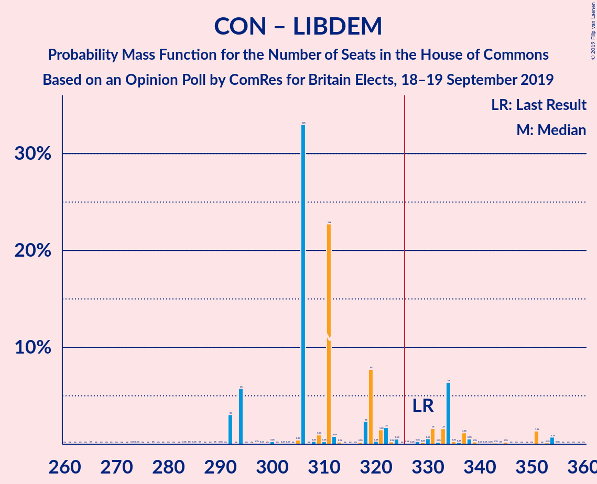

| Number of Seats | Probability | Accumulated | Special Marks |
|:---------------:|:-----------:|:-----------:|:-------------:|
| 267 | 0% | 100% |  |
| 268 | 0% | 99.9% |  |
| 269 | 0% | 99.9% |  |
| 270 | 0% | 99.9% |  |
| 271 | 0% | 99.9% |  |
| 272 | 0% | 99.9% |  |
| 273 | 0.1% | 99.9% |  |
| 274 | 0.1% | 99.8% |  |
| 275 | 0% | 99.8% |  |
| 276 | 0% | 99.8% |  |
| 277 | 0% | 99.7% |  |
| 278 | 0% | 99.7% |  |
| 279 | 0% | 99.7% |  |
| 280 | 0% | 99.7% |  |
| 281 | 0% | 99.7% |  |
| 282 | 0% | 99.6% |  |
| 283 | 0.1% | 99.6% |  |
| 284 | 0% | 99.6% |  |
| 285 | 0.1% | 99.5% |  |
| 286 | 0% | 99.4% |  |
| 287 | 0% | 99.4% |  |
| 288 | 0% | 99.4% |  |
| 289 | 0% | 99.4% |  |
| 290 | 0.1% | 99.3% |  |
| 291 | 0% | 99.3% |  |
| 292 | 3% | 99.3% |  |
| 293 | 0% | 96% |  |
| 294 | 6% | 96% |  |
| 295 | 0% | 90% |  |
| 296 | 0% | 90% |  |
| 297 | 0.1% | 90% |  |
| 298 | 0.1% | 90% |  |
| 299 | 0% | 90% |  |
| 300 | 0.3% | 90% |  |
| 301 | 0% | 90% |  |
| 302 | 0.1% | 90% |  |
| 303 | 0.1% | 90% |  |
| 304 | 0% | 90% |  |
| 305 | 0.4% | 90% |  |
| 306 | 33% | 89% |  |
| 307 | 0% | 56% | Median |
| 308 | 0.3% | 56% |  |
| 309 | 1.0% | 56% |  |
| 310 | 0.3% | 55% |  |
| 311 | 23% | 55% |  |
| 312 | 0.8% | 32% |  |
| 313 | 0.2% | 31% |  |
| 314 | 0% | 31% |  |
| 315 | 0% | 31% |  |
| 316 | 0% | 31% |  |
| 317 | 0.2% | 31% |  |
| 318 | 2% | 31% |  |
| 319 | 8% | 28% |  |
| 320 | 0.3% | 21% |  |
| 321 | 1.5% | 20% |  |
| 322 | 2% | 19% |  |
| 323 | 0.2% | 17% |  |
| 324 | 0.5% | 17% |  |
| 325 | 0% | 16% |  |
| 326 | 0.1% | 16% | Majority |
| 327 | 0.1% | 16% |  |
| 328 | 0.3% | 16% |  |
| 329 | 0.2% | 16% | Last Result |
| 330 | 0.6% | 16% |  |
| 331 | 2% | 15% |  |
| 332 | 0.2% | 14% |  |
| 333 | 2% | 13% |  |
| 334 | 6% | 12% |  |
| 335 | 0.3% | 5% |  |
| 336 | 0.2% | 5% |  |
| 337 | 1.2% | 5% |  |
| 338 | 0.5% | 4% |  |
| 339 | 0.2% | 3% |  |
| 340 | 0.1% | 3% |  |
| 341 | 0.1% | 3% |  |
| 342 | 0.1% | 3% |  |
| 343 | 0.1% | 3% |  |
| 344 | 0% | 3% |  |
| 345 | 0.2% | 3% |  |
| 346 | 0% | 2% |  |
| 347 | 0% | 2% |  |
| 348 | 0% | 2% |  |
| 349 | 0% | 2% |  |
| 350 | 0% | 2% |  |
| 351 | 1.4% | 2% |  |
| 352 | 0% | 1.0% |  |
| 353 | 0.1% | 1.0% |  |
| 354 | 0.7% | 0.9% |  |
| 355 | 0.1% | 0.1% |  |
| 356 | 0% | 0.1% |  |
| 357 | 0% | 0.1% |  |
| 358 | 0% | 0% |  |

### Labour Party – Liberal Democrats – Plaid Cymru

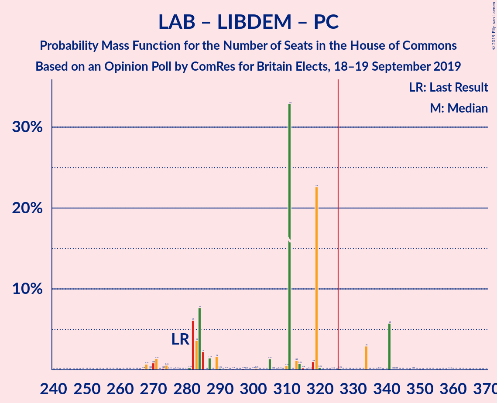

| Number of Seats | Probability | Accumulated | Special Marks |
|:---------------:|:-----------:|:-----------:|:-------------:|
| 249 | 0% | 100% |  |
| 250 | 0% | 99.9% |  |
| 251 | 0% | 99.9% |  |
| 252 | 0% | 99.9% |  |
| 253 | 0% | 99.9% |  |
| 254 | 0% | 99.9% |  |
| 255 | 0% | 99.9% |  |
| 256 | 0% | 99.9% |  |
| 257 | 0% | 99.9% |  |
| 258 | 0% | 99.9% |  |
| 259 | 0% | 99.9% |  |
| 260 | 0% | 99.8% |  |
| 261 | 0% | 99.8% |  |
| 262 | 0% | 99.8% |  |
| 263 | 0% | 99.8% |  |
| 264 | 0% | 99.8% |  |
| 265 | 0% | 99.8% |  |
| 266 | 0% | 99.7% |  |
| 267 | 0.1% | 99.7% |  |
| 268 | 0.7% | 99.6% |  |
| 269 | 0.2% | 98.9% |  |
| 270 | 0.9% | 98.7% |  |
| 271 | 1.4% | 98% |  |
| 272 | 0% | 96% |  |
| 273 | 0.2% | 96% |  |
| 274 | 0.6% | 96% |  |
| 275 | 0.1% | 96% |  |
| 276 | 0% | 96% |  |
| 277 | 0.1% | 96% |  |
| 278 | 0% | 95% | Last Result |
| 279 | 0% | 95% |  |
| 280 | 0.1% | 95% |  |
| 281 | 0.3% | 95% |  |
| 282 | 6% | 95% |  |
| 283 | 4% | 89% |  |
| 284 | 8% | 85% |  |
| 285 | 2% | 78% |  |
| 286 | 0% | 75% |  |
| 287 | 1.5% | 75% |  |
| 288 | 0% | 74% |  |
| 289 | 2% | 74% |  |
| 290 | 0.2% | 72% |  |
| 291 | 0% | 72% |  |
| 292 | 0.2% | 72% |  |
| 293 | 0% | 72% |  |
| 294 | 0.1% | 72% |  |
| 295 | 0% | 72% |  |
| 296 | 0% | 72% |  |
| 297 | 0.2% | 72% |  |
| 298 | 0.1% | 72% |  |
| 299 | 0% | 71% |  |
| 300 | 0.1% | 71% |  |
| 301 | 0.2% | 71% |  |
| 302 | 0% | 71% |  |
| 303 | 0% | 71% |  |
| 304 | 0% | 71% |  |
| 305 | 1.4% | 71% |  |
| 306 | 0.1% | 70% |  |
| 307 | 0% | 70% |  |
| 308 | 0.1% | 70% |  |
| 309 | 0% | 70% |  |
| 310 | 0.5% | 70% |  |
| 311 | 33% | 69% | Median |
| 312 | 0% | 36% |  |
| 313 | 1.2% | 36% |  |
| 314 | 0.8% | 35% |  |
| 315 | 0.2% | 34% |  |
| 316 | 0% | 34% |  |
| 317 | 0.1% | 34% |  |
| 318 | 1.0% | 34% |  |
| 319 | 23% | 33% |  |
| 320 | 0.3% | 10% |  |
| 321 | 0% | 10% |  |
| 322 | 0% | 10% |  |
| 323 | 0% | 10% |  |
| 324 | 0.1% | 10% |  |
| 325 | 0% | 10% |  |
| 326 | 0.2% | 10% | Majority |
| 327 | 0% | 10% |  |
| 328 | 0% | 10% |  |
| 329 | 0% | 10% |  |
| 330 | 0% | 9% |  |
| 331 | 0% | 9% |  |
| 332 | 0% | 9% |  |
| 333 | 0% | 9% |  |
| 334 | 3% | 9% |  |
| 335 | 0% | 6% |  |
| 336 | 0% | 6% |  |
| 337 | 0% | 6% |  |
| 338 | 0.1% | 6% |  |
| 339 | 0% | 6% |  |
| 340 | 0% | 6% |  |
| 341 | 6% | 6% |  |
| 342 | 0.1% | 0.5% |  |
| 343 | 0.1% | 0.4% |  |
| 344 | 0% | 0.3% |  |
| 345 | 0% | 0.3% |  |
| 346 | 0% | 0.3% |  |
| 347 | 0% | 0.3% |  |
| 348 | 0.1% | 0.3% |  |
| 349 | 0% | 0.2% |  |
| 350 | 0% | 0.2% |  |
| 351 | 0% | 0.2% |  |
| 352 | 0% | 0.2% |  |
| 353 | 0% | 0.2% |  |
| 354 | 0% | 0.2% |  |
| 355 | 0% | 0.1% |  |
| 356 | 0% | 0.1% |  |
| 357 | 0% | 0.1% |  |
| 358 | 0% | 0.1% |  |
| 359 | 0.1% | 0.1% |  |
| 360 | 0% | 0.1% |  |
| 361 | 0% | 0.1% |  |
| 362 | 0% | 0% |  |

### Labour Party – Liberal Democrats – Change UK

| Number of Seats | Probability | Accumulated | Special Marks |
|:---------------:|:-----------:|:-----------:|:-------------:|
| 249 | 0% | 100% |  |
| 250 | 0% | 99.9% |  |
| 251 | 0% | 99.9% |  |
| 252 | 0% | 99.9% |  |
| 253 | 0% | 99.9% |  |
| 254 | 0% | 99.9% |  |
| 255 | 0% | 99.9% |  |
| 256 | 0% | 99.9% |  |
| 257 | 0% | 99.9% |  |
| 258 | 0% | 99.8% |  |
| 259 | 0% | 99.8% |  |
| 260 | 0% | 99.8% |  |
| 261 | 0% | 99.8% |  |
| 262 | 0% | 99.8% |  |
| 263 | 0% | 99.8% |  |
| 264 | 0.2% | 99.7% |  |
| 265 | 0.7% | 99.6% |  |
| 266 | 0% | 98.8% |  |
| 267 | 0% | 98.8% |  |
| 268 | 1.0% | 98.8% |  |
| 269 | 1.4% | 98% |  |
| 270 | 0.1% | 96% |  |
| 271 | 0.4% | 96% |  |
| 272 | 0% | 96% |  |
| 273 | 0.2% | 96% |  |
| 274 | 0.3% | 96% | Last Result |
| 275 | 0.1% | 96% |  |
| 276 | 0% | 95% |  |
| 277 | 0.2% | 95% |  |
| 278 | 0.3% | 95% |  |
| 279 | 0% | 95% |  |
| 280 | 6% | 95% |  |
| 281 | 2% | 88% |  |
| 282 | 0.1% | 87% |  |
| 283 | 4% | 87% |  |
| 284 | 8% | 83% |  |
| 285 | 0% | 75% |  |
| 286 | 2% | 75% |  |
| 287 | 1.5% | 74% |  |
| 288 | 0% | 72% |  |
| 289 | 0% | 72% |  |
| 290 | 0.2% | 72% |  |
| 291 | 0% | 72% |  |
| 292 | 0% | 72% |  |
| 293 | 0% | 72% |  |
| 294 | 0.2% | 72% |  |
| 295 | 0% | 72% |  |
| 296 | 0.2% | 72% |  |
| 297 | 0.1% | 71% |  |
| 298 | 0% | 71% |  |
| 299 | 0.1% | 71% |  |
| 300 | 0.1% | 71% |  |
| 301 | 0.1% | 71% |  |
| 302 | 1.3% | 71% |  |
| 303 | 0% | 70% |  |
| 304 | 0.1% | 70% |  |
| 305 | 0% | 70% |  |
| 306 | 0% | 70% |  |
| 307 | 0.4% | 70% |  |
| 308 | 0% | 69% |  |
| 309 | 0.3% | 69% |  |
| 310 | 33% | 69% | Median |
| 311 | 1.4% | 36% |  |
| 312 | 0% | 34% |  |
| 313 | 0.6% | 34% |  |
| 314 | 0.1% | 34% |  |
| 315 | 0% | 34% |  |
| 316 | 0.2% | 34% |  |
| 317 | 0% | 34% |  |
| 318 | 1.0% | 34% |  |
| 319 | 23% | 33% |  |
| 320 | 0.1% | 10% |  |
| 321 | 0% | 10% |  |
| 322 | 0% | 10% |  |
| 323 | 0.1% | 10% |  |
| 324 | 0% | 10% |  |
| 325 | 0% | 10% |  |
| 326 | 0.2% | 10% | Majority |
| 327 | 0% | 9% |  |
| 328 | 0% | 9% |  |
| 329 | 0% | 9% |  |
| 330 | 0% | 9% |  |
| 331 | 3% | 9% |  |
| 332 | 0% | 6% |  |
| 333 | 0% | 6% |  |
| 334 | 0% | 6% |  |
| 335 | 0% | 6% |  |
| 336 | 0% | 6% |  |
| 337 | 0% | 6% |  |
| 338 | 0.1% | 6% |  |
| 339 | 6% | 6% |  |
| 340 | 0% | 0.5% |  |
| 341 | 0.1% | 0.5% |  |
| 342 | 0.1% | 0.4% |  |
| 343 | 0% | 0.4% |  |
| 344 | 0% | 0.3% |  |
| 345 | 0% | 0.3% |  |
| 346 | 0% | 0.3% |  |
| 347 | 0% | 0.3% |  |
| 348 | 0.1% | 0.3% |  |
| 349 | 0% | 0.2% |  |
| 350 | 0% | 0.2% |  |
| 351 | 0% | 0.2% |  |
| 352 | 0% | 0.1% |  |
| 353 | 0% | 0.1% |  |
| 354 | 0% | 0.1% |  |
| 355 | 0% | 0.1% |  |
| 356 | 0% | 0.1% |  |
| 357 | 0% | 0.1% |  |
| 358 | 0% | 0.1% |  |
| 359 | 0% | 0.1% |  |
| 360 | 0% | 0.1% |  |
| 361 | 0% | 0% |  |

### Labour Party – Liberal Democrats

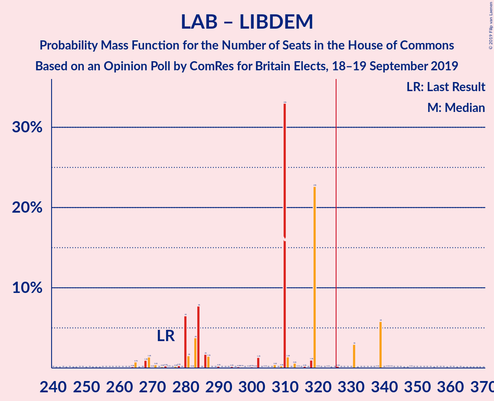

| Number of Seats | Probability | Accumulated | Special Marks |
|:---------------:|:-----------:|:-----------:|:-------------:|
| 249 | 0% | 100% |  |
| 250 | 0% | 99.9% |  |
| 251 | 0% | 99.9% |  |
| 252 | 0% | 99.9% |  |
| 253 | 0% | 99.9% |  |
| 254 | 0% | 99.9% |  |
| 255 | 0% | 99.9% |  |
| 256 | 0% | 99.9% |  |
| 257 | 0% | 99.9% |  |
| 258 | 0% | 99.8% |  |
| 259 | 0% | 99.8% |  |
| 260 | 0% | 99.8% |  |
| 261 | 0% | 99.8% |  |
| 262 | 0% | 99.8% |  |
| 263 | 0% | 99.8% |  |
| 264 | 0.2% | 99.7% |  |
| 265 | 0.7% | 99.6% |  |
| 266 | 0% | 98.8% |  |
| 267 | 0% | 98.8% |  |
| 268 | 1.0% | 98.8% |  |
| 269 | 1.4% | 98% |  |
| 270 | 0.1% | 96% |  |
| 271 | 0.4% | 96% |  |
| 272 | 0% | 96% |  |
| 273 | 0.2% | 96% |  |
| 274 | 0.3% | 96% | Last Result |
| 275 | 0.1% | 96% |  |
| 276 | 0% | 95% |  |
| 277 | 0.2% | 95% |  |
| 278 | 0.3% | 95% |  |
| 279 | 0% | 95% |  |
| 280 | 6% | 95% |  |
| 281 | 2% | 88% |  |
| 282 | 0.1% | 87% |  |
| 283 | 4% | 87% |  |
| 284 | 8% | 83% |  |
| 285 | 0% | 75% |  |
| 286 | 2% | 75% |  |
| 287 | 1.5% | 74% |  |
| 288 | 0% | 72% |  |
| 289 | 0% | 72% |  |
| 290 | 0.2% | 72% |  |
| 291 | 0% | 72% |  |
| 292 | 0% | 72% |  |
| 293 | 0% | 72% |  |
| 294 | 0.2% | 72% |  |
| 295 | 0% | 72% |  |
| 296 | 0.2% | 72% |  |
| 297 | 0.1% | 71% |  |
| 298 | 0% | 71% |  |
| 299 | 0.1% | 71% |  |
| 300 | 0.1% | 71% |  |
| 301 | 0.1% | 71% |  |
| 302 | 1.3% | 71% |  |
| 303 | 0% | 70% |  |
| 304 | 0.1% | 70% |  |
| 305 | 0% | 70% |  |
| 306 | 0% | 70% |  |
| 307 | 0.4% | 70% |  |
| 308 | 0% | 69% |  |
| 309 | 0.3% | 69% |  |
| 310 | 33% | 69% | Median |
| 311 | 1.4% | 36% |  |
| 312 | 0% | 34% |  |
| 313 | 0.6% | 34% |  |
| 314 | 0.1% | 34% |  |
| 315 | 0% | 34% |  |
| 316 | 0.2% | 34% |  |
| 317 | 0% | 34% |  |
| 318 | 1.0% | 34% |  |
| 319 | 23% | 33% |  |
| 320 | 0.1% | 10% |  |
| 321 | 0% | 10% |  |
| 322 | 0% | 10% |  |
| 323 | 0.1% | 10% |  |
| 324 | 0% | 10% |  |
| 325 | 0% | 10% |  |
| 326 | 0.2% | 10% | Majority |
| 327 | 0% | 9% |  |
| 328 | 0% | 9% |  |
| 329 | 0% | 9% |  |
| 330 | 0% | 9% |  |
| 331 | 3% | 9% |  |
| 332 | 0% | 6% |  |
| 333 | 0% | 6% |  |
| 334 | 0% | 6% |  |
| 335 | 0% | 6% |  |
| 336 | 0% | 6% |  |
| 337 | 0% | 6% |  |
| 338 | 0.1% | 6% |  |
| 339 | 6% | 6% |  |
| 340 | 0% | 0.5% |  |
| 341 | 0.1% | 0.5% |  |
| 342 | 0.1% | 0.4% |  |
| 343 | 0% | 0.4% |  |
| 344 | 0% | 0.3% |  |
| 345 | 0% | 0.3% |  |
| 346 | 0% | 0.3% |  |
| 347 | 0% | 0.3% |  |
| 348 | 0.1% | 0.3% |  |
| 349 | 0% | 0.2% |  |
| 350 | 0% | 0.2% |  |
| 351 | 0% | 0.2% |  |
| 352 | 0% | 0.1% |  |
| 353 | 0% | 0.1% |  |
| 354 | 0% | 0.1% |  |
| 355 | 0% | 0.1% |  |
| 356 | 0% | 0.1% |  |
| 357 | 0% | 0.1% |  |
| 358 | 0% | 0.1% |  |
| 359 | 0% | 0.1% |  |
| 360 | 0% | 0.1% |  |
| 361 | 0% | 0% |  |

### Conservative Party – Scottish National Party – Plaid Cymru

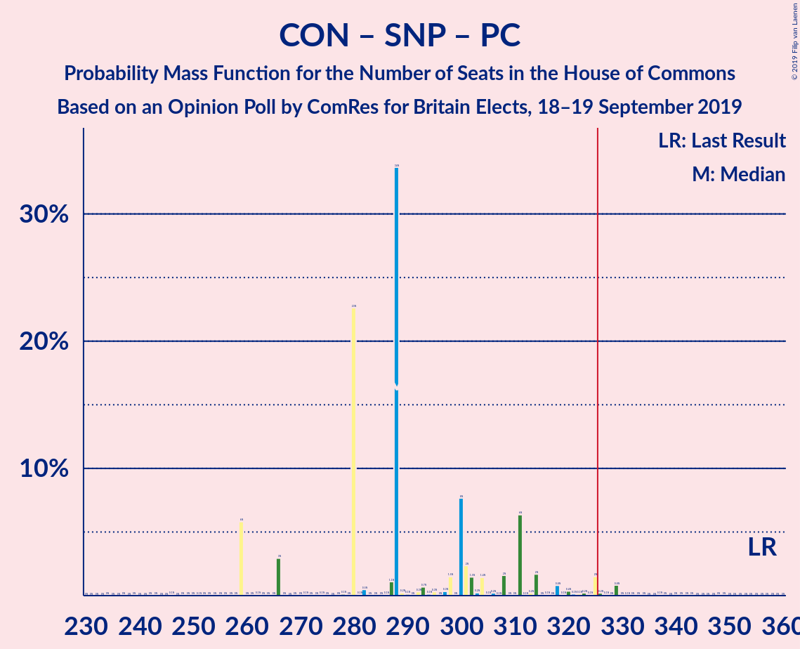

| Number of Seats | Probability | Accumulated | Special Marks |
|:---------------:|:-----------:|:-----------:|:-------------:|
| 239 | 0% | 100% |  |
| 240 | 0% | 99.9% |  |
| 241 | 0% | 99.9% |  |
| 242 | 0% | 99.9% |  |
| 243 | 0% | 99.9% |  |
| 244 | 0% | 99.9% |  |
| 245 | 0% | 99.9% |  |
| 246 | 0.1% | 99.9% |  |
| 247 | 0% | 99.8% |  |
| 248 | 0% | 99.8% |  |
| 249 | 0% | 99.8% |  |
| 250 | 0% | 99.7% |  |
| 251 | 0.1% | 99.7% |  |
| 252 | 0% | 99.7% |  |
| 253 | 0% | 99.7% |  |
| 254 | 0% | 99.6% |  |
| 255 | 0% | 99.6% |  |
| 256 | 0% | 99.6% |  |
| 257 | 0% | 99.6% |  |
| 258 | 0% | 99.5% |  |
| 259 | 6% | 99.5% |  |
| 260 | 0% | 94% |  |
| 261 | 0% | 94% |  |
| 262 | 0.1% | 94% |  |
| 263 | 0% | 94% |  |
| 264 | 0% | 94% |  |
| 265 | 0% | 94% |  |
| 266 | 3% | 94% |  |
| 267 | 0% | 91% |  |
| 268 | 0% | 91% |  |
| 269 | 0% | 91% |  |
| 270 | 0% | 91% |  |
| 271 | 0.1% | 91% |  |
| 272 | 0% | 90% |  |
| 273 | 0% | 90% |  |
| 274 | 0.1% | 90% |  |
| 275 | 0% | 90% |  |
| 276 | 0% | 90% |  |
| 277 | 0% | 90% |  |
| 278 | 0.1% | 90% |  |
| 279 | 0% | 90% |  |
| 280 | 23% | 90% |  |
| 281 | 0.1% | 68% |  |
| 282 | 0.5% | 67% |  |
| 283 | 0% | 67% |  |
| 284 | 0% | 67% |  |
| 285 | 0% | 67% |  |
| 286 | 0.1% | 67% |  |
| 287 | 1.1% | 67% |  |
| 288 | 34% | 66% | Median |
| 289 | 0.2% | 32% |  |
| 290 | 0.1% | 32% |  |
| 291 | 0% | 32% |  |
| 292 | 0.3% | 32% |  |
| 293 | 0.7% | 31% |  |
| 294 | 0.1% | 31% |  |
| 295 | 0.3% | 31% |  |
| 296 | 0% | 30% |  |
| 297 | 0.3% | 30% |  |
| 298 | 1.5% | 30% |  |
| 299 | 0% | 28% |  |
| 300 | 8% | 28% |  |
| 301 | 2% | 21% |  |
| 302 | 1.5% | 18% |  |
| 303 | 0.2% | 17% |  |
| 304 | 1.4% | 17% |  |
| 305 | 0.1% | 15% |  |
| 306 | 0.2% | 15% |  |
| 307 | 0.1% | 15% |  |
| 308 | 2% | 15% |  |
| 309 | 0% | 13% |  |
| 310 | 0% | 13% |  |
| 311 | 6% | 13% |  |
| 312 | 0.1% | 7% |  |
| 313 | 0.2% | 7% |  |
| 314 | 2% | 7% |  |
| 315 | 0% | 5% |  |
| 316 | 0.1% | 5% |  |
| 317 | 0% | 5% |  |
| 318 | 0.8% | 5% |  |
| 319 | 0.1% | 4% |  |
| 320 | 0.4% | 4% |  |
| 321 | 0.1% | 4% |  |
| 322 | 0.1% | 3% |  |
| 323 | 0.2% | 3% |  |
| 324 | 0.1% | 3% |  |
| 325 | 2% | 3% |  |
| 326 | 0.2% | 1.4% | Majority |
| 327 | 0.1% | 1.2% |  |
| 328 | 0% | 1.2% |  |
| 329 | 0.8% | 1.1% |  |
| 330 | 0% | 0.3% |  |
| 331 | 0.1% | 0.3% |  |
| 332 | 0% | 0.2% |  |
| 333 | 0% | 0.2% |  |
| 334 | 0% | 0.2% |  |
| 335 | 0% | 0.2% |  |
| 336 | 0% | 0.2% |  |
| 337 | 0.1% | 0.2% |  |
| 338 | 0% | 0.1% |  |
| 339 | 0% | 0.1% |  |
| 340 | 0% | 0.1% |  |
| 341 | 0% | 0.1% |  |
| 342 | 0% | 0% |  |
| 343 | 0% | 0% |  |
| 344 | 0% | 0% |  |
| 345 | 0% | 0% |  |
| 346 | 0% | 0% |  |
| 347 | 0% | 0% |  |
| 348 | 0% | 0% |  |
| 349 | 0% | 0% |  |
| 350 | 0% | 0% |  |
| 351 | 0% | 0% |  |
| 352 | 0% | 0% |  |
| 353 | 0% | 0% |  |
| 354 | 0% | 0% |  |
| 355 | 0% | 0% |  |
| 356 | 0% | 0% | Last Result |

### Conservative Party – Scottish National Party

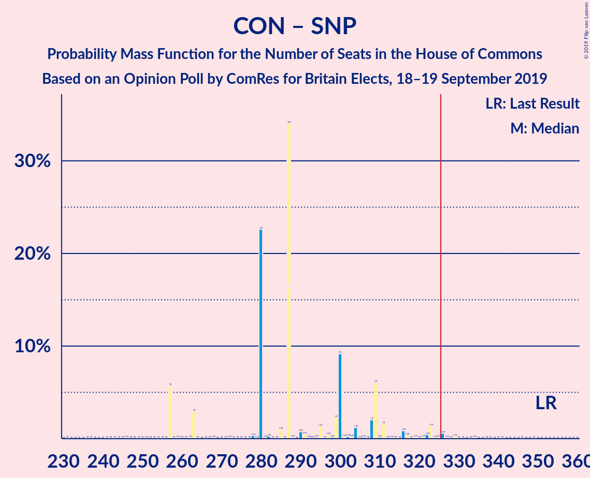

| Number of Seats | Probability | Accumulated | Special Marks |
|:---------------:|:-----------:|:-----------:|:-------------:|
| 237 | 0% | 100% |  |
| 238 | 0% | 99.9% |  |
| 239 | 0% | 99.9% |  |
| 240 | 0% | 99.9% |  |
| 241 | 0% | 99.9% |  |
| 242 | 0% | 99.9% |  |
| 243 | 0% | 99.9% |  |
| 244 | 0% | 99.9% |  |
| 245 | 0% | 99.9% |  |
| 246 | 0.1% | 99.8% |  |
| 247 | 0% | 99.8% |  |
| 248 | 0% | 99.7% |  |
| 249 | 0% | 99.7% |  |
| 250 | 0% | 99.7% |  |
| 251 | 0.1% | 99.7% |  |
| 252 | 0% | 99.6% |  |
| 253 | 0% | 99.6% |  |
| 254 | 0% | 99.6% |  |
| 255 | 0% | 99.6% |  |
| 256 | 0% | 99.5% |  |
| 257 | 6% | 99.5% |  |
| 258 | 0% | 94% |  |
| 259 | 0.1% | 94% |  |
| 260 | 0% | 94% |  |
| 261 | 0% | 94% |  |
| 262 | 0.1% | 94% |  |
| 263 | 3% | 94% |  |
| 264 | 0% | 91% |  |
| 265 | 0% | 91% |  |
| 266 | 0% | 91% |  |
| 267 | 0% | 91% |  |
| 268 | 0.1% | 91% |  |
| 269 | 0% | 90% |  |
| 270 | 0% | 90% |  |
| 271 | 0% | 90% |  |
| 272 | 0.1% | 90% |  |
| 273 | 0% | 90% |  |
| 274 | 0% | 90% |  |
| 275 | 0% | 90% |  |
| 276 | 0% | 90% |  |
| 277 | 0% | 90% |  |
| 278 | 0.3% | 90% |  |
| 279 | 0.1% | 90% |  |
| 280 | 23% | 90% |  |
| 281 | 0.1% | 67% |  |
| 282 | 0.3% | 67% |  |
| 283 | 0% | 67% |  |
| 284 | 0% | 67% |  |
| 285 | 1.0% | 67% |  |
| 286 | 0% | 66% |  |
| 287 | 34% | 66% | Median |
| 288 | 0.1% | 32% |  |
| 289 | 0% | 32% |  |
| 290 | 0.8% | 32% |  |
| 291 | 0.5% | 31% |  |
| 292 | 0.1% | 30% |  |
| 293 | 0.1% | 30% |  |
| 294 | 0.1% | 30% |  |
| 295 | 1.3% | 30% |  |
| 296 | 0% | 29% |  |
| 297 | 0.4% | 29% |  |
| 298 | 0.2% | 28% |  |
| 299 | 2% | 28% |  |
| 300 | 9% | 26% |  |
| 301 | 0.2% | 17% |  |
| 302 | 0.2% | 17% |  |
| 303 | 0.2% | 16% |  |
| 304 | 1.2% | 16% |  |
| 305 | 0.1% | 15% |  |
| 306 | 0.1% | 15% |  |
| 307 | 0% | 15% |  |
| 308 | 2% | 15% |  |
| 309 | 6% | 13% |  |
| 310 | 0.2% | 7% |  |
| 311 | 2% | 7% |  |
| 312 | 0% | 5% |  |
| 313 | 0.1% | 5% |  |
| 314 | 0% | 5% |  |
| 315 | 0% | 5% |  |
| 316 | 0.9% | 5% |  |
| 317 | 0.4% | 4% |  |
| 318 | 0% | 4% |  |
| 319 | 0.1% | 4% |  |
| 320 | 0% | 3% |  |
| 321 | 0.1% | 3% |  |
| 322 | 0.4% | 3% |  |
| 323 | 1.4% | 3% |  |
| 324 | 0.1% | 1.4% |  |
| 325 | 0.2% | 1.4% |  |
| 326 | 0.6% | 1.2% | Majority |
| 327 | 0.1% | 0.6% |  |
| 328 | 0% | 0.5% |  |
| 329 | 0.3% | 0.5% |  |
| 330 | 0% | 0.2% |  |
| 331 | 0% | 0.2% |  |
| 332 | 0% | 0.2% |  |
| 333 | 0% | 0.2% |  |
| 334 | 0.1% | 0.2% |  |
| 335 | 0% | 0.1% |  |
| 336 | 0% | 0.1% |  |
| 337 | 0% | 0.1% |  |
| 338 | 0% | 0.1% |  |
| 339 | 0% | 0.1% |  |
| 340 | 0% | 0.1% |  |
| 341 | 0% | 0% |  |
| 342 | 0% | 0% |  |
| 343 | 0% | 0% |  |
| 344 | 0% | 0% |  |
| 345 | 0% | 0% |  |
| 346 | 0% | 0% |  |
| 347 | 0% | 0% |  |
| 348 | 0% | 0% |  |
| 349 | 0% | 0% |  |
| 350 | 0% | 0% |  |
| 351 | 0% | 0% |  |
| 352 | 0% | 0% | Last Result |

### Conservative Party – Brexit Party

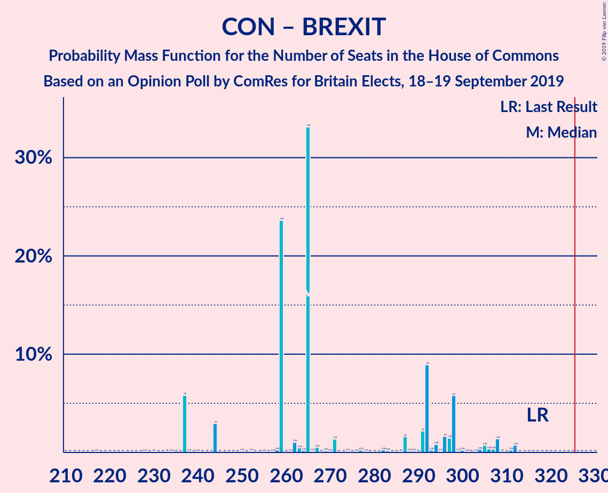

| Number of Seats | Probability | Accumulated | Special Marks |
|:---------------:|:-----------:|:-----------:|:-------------:|
| 217 | 0.1% | 100% |  |
| 218 | 0% | 99.9% |  |
| 219 | 0% | 99.9% |  |
| 220 | 0% | 99.9% |  |
| 221 | 0% | 99.9% |  |
| 222 | 0% | 99.9% |  |
| 223 | 0% | 99.8% |  |
| 224 | 0% | 99.8% |  |
| 225 | 0% | 99.8% |  |
| 226 | 0% | 99.8% |  |
| 227 | 0% | 99.8% |  |
| 228 | 0.1% | 99.8% |  |
| 229 | 0% | 99.8% |  |
| 230 | 0% | 99.8% |  |
| 231 | 0% | 99.7% |  |
| 232 | 0% | 99.7% |  |
| 233 | 0% | 99.7% |  |
| 234 | 0.1% | 99.7% |  |
| 235 | 0% | 99.6% |  |
| 236 | 0% | 99.5% |  |
| 237 | 6% | 99.5% |  |
| 238 | 0.1% | 94% |  |
| 239 | 0% | 94% |  |
| 240 | 0.1% | 94% |  |
| 241 | 0% | 94% |  |
| 242 | 0% | 94% |  |
| 243 | 0% | 94% |  |
| 244 | 3% | 94% |  |
| 245 | 0% | 91% |  |
| 246 | 0% | 91% |  |
| 247 | 0% | 91% |  |
| 248 | 0% | 91% |  |
| 249 | 0% | 90% |  |
| 250 | 0.1% | 90% |  |
| 251 | 0% | 90% |  |
| 252 | 0.1% | 90% |  |
| 253 | 0% | 90% |  |
| 254 | 0% | 90% |  |
| 255 | 0.1% | 90% |  |
| 256 | 0% | 90% |  |
| 257 | 0.1% | 90% |  |
| 258 | 0.3% | 90% |  |
| 259 | 24% | 90% |  |
| 260 | 0% | 66% |  |
| 261 | 0.1% | 66% |  |
| 262 | 1.0% | 66% |  |
| 263 | 0.5% | 65% |  |
| 264 | 0.2% | 65% |  |
| 265 | 33% | 64% | Median |
| 266 | 0.1% | 31% |  |
| 267 | 0.5% | 31% |  |
| 268 | 0% | 31% |  |
| 269 | 0.2% | 31% |  |
| 270 | 0.1% | 30% |  |
| 271 | 1.4% | 30% |  |
| 272 | 0% | 29% |  |
| 273 | 0% | 29% |  |
| 274 | 0.1% | 29% |  |
| 275 | 0% | 29% |  |
| 276 | 0.1% | 29% |  |
| 277 | 0.2% | 29% |  |
| 278 | 0.1% | 29% |  |
| 279 | 0% | 29% |  |
| 280 | 0% | 28% |  |
| 281 | 0% | 28% |  |
| 282 | 0.3% | 28% |  |
| 283 | 0.2% | 28% |  |
| 284 | 0% | 28% |  |
| 285 | 0% | 28% |  |
| 286 | 0% | 28% |  |
| 287 | 2% | 28% |  |
| 288 | 0.1% | 26% |  |
| 289 | 0.1% | 26% |  |
| 290 | 0% | 26% |  |
| 291 | 2% | 26% |  |
| 292 | 9% | 24% |  |
| 293 | 0.3% | 15% |  |
| 294 | 0.8% | 15% |  |
| 295 | 0.1% | 14% |  |
| 296 | 2% | 14% |  |
| 297 | 1.5% | 12% |  |
| 298 | 6% | 11% |  |
| 299 | 0.1% | 5% |  |
| 300 | 0.2% | 5% |  |
| 301 | 0.1% | 5% |  |
| 302 | 0% | 5% |  |
| 303 | 0.1% | 5% |  |
| 304 | 0.3% | 4% |  |
| 305 | 0.7% | 4% |  |
| 306 | 0.4% | 3% |  |
| 307 | 0.3% | 3% |  |
| 308 | 1.4% | 3% |  |
| 309 | 0% | 1.3% |  |
| 310 | 0% | 1.3% |  |
| 311 | 0.2% | 1.3% |  |
| 312 | 0.7% | 1.0% |  |
| 313 | 0% | 0.3% |  |
| 314 | 0% | 0.3% |  |
| 315 | 0% | 0.3% |  |
| 316 | 0% | 0.2% |  |
| 317 | 0% | 0.2% | Last Result |
| 318 | 0% | 0.2% |  |
| 319 | 0% | 0.1% |  |
| 320 | 0% | 0.1% |  |
| 321 | 0% | 0.1% |  |
| 322 | 0% | 0.1% |  |
| 323 | 0% | 0.1% |  |
| 324 | 0% | 0.1% |  |
| 325 | 0% | 0.1% |  |
| 326 | 0% | 0.1% | Majority |
| 327 | 0% | 0.1% |  |
| 328 | 0% | 0.1% |  |
| 329 | 0% | 0.1% |  |
| 330 | 0% | 0% |  |

### Labour Party – Scottish National Party – Plaid Cymru

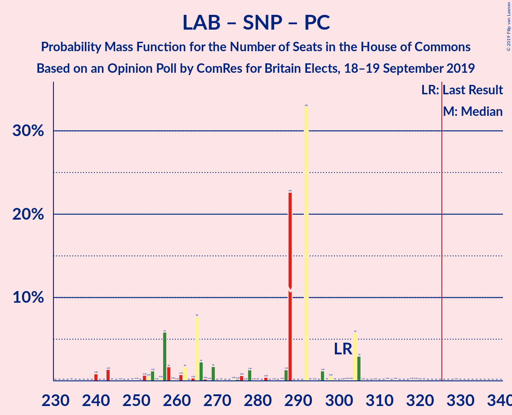

| Number of Seats | Probability | Accumulated | Special Marks |
|:---------------:|:-----------:|:-----------:|:-------------:|
| 230 | 0% | 100% |  |
| 231 | 0% | 99.9% |  |
| 232 | 0% | 99.9% |  |
| 233 | 0% | 99.9% |  |
| 234 | 0% | 99.9% |  |
| 235 | 0% | 99.9% |  |
| 236 | 0% | 99.9% |  |
| 237 | 0% | 99.9% |  |
| 238 | 0% | 99.9% |  |
| 239 | 0% | 99.9% |  |
| 240 | 0.8% | 99.8% |  |
| 241 | 0% | 99.0% |  |
| 242 | 0% | 99.0% |  |
| 243 | 1.4% | 99.0% |  |
| 244 | 0% | 98% |  |
| 245 | 0% | 98% |  |
| 246 | 0.1% | 98% |  |
| 247 | 0% | 97% |  |
| 248 | 0% | 97% |  |
| 249 | 0% | 97% |  |
| 250 | 0.1% | 97% |  |
| 251 | 0% | 97% |  |
| 252 | 0.7% | 97% |  |
| 253 | 0.5% | 97% |  |
| 254 | 1.2% | 96% |  |
| 255 | 0.1% | 95% |  |
| 256 | 0.3% | 95% |  |
| 257 | 6% | 95% |  |
| 258 | 2% | 89% |  |
| 259 | 0.2% | 87% |  |
| 260 | 0.1% | 87% |  |
| 261 | 0.7% | 87% |  |
| 262 | 2% | 86% |  |
| 263 | 0% | 84% |  |
| 264 | 0.3% | 84% |  |
| 265 | 8% | 84% |  |
| 266 | 2% | 76% |  |
| 267 | 0.2% | 74% |  |
| 268 | 0.1% | 74% |  |
| 269 | 2% | 74% |  |
| 270 | 0% | 72% |  |
| 271 | 0% | 72% |  |
| 272 | 0% | 72% |  |
| 273 | 0% | 72% |  |
| 274 | 0.2% | 72% |  |
| 275 | 0.2% | 72% |  |
| 276 | 0.6% | 71% |  |
| 277 | 0.1% | 71% |  |
| 278 | 1.3% | 71% |  |
| 279 | 0.1% | 69% |  |
| 280 | 0% | 69% |  |
| 281 | 0% | 69% |  |
| 282 | 0.4% | 69% |  |
| 283 | 0% | 69% |  |
| 284 | 0.1% | 69% |  |
| 285 | 0% | 69% |  |
| 286 | 0.1% | 69% |  |
| 287 | 1.3% | 69% |  |
| 288 | 23% | 67% |  |
| 289 | 0% | 45% |  |
| 290 | 0% | 45% |  |
| 291 | 0% | 45% | Median |
| 292 | 33% | 45% |  |
| 293 | 0% | 12% |  |
| 294 | 0.1% | 12% |  |
| 295 | 0% | 12% |  |
| 296 | 1.2% | 12% |  |
| 297 | 0% | 11% |  |
| 298 | 0.6% | 10% |  |
| 299 | 0% | 10% |  |
| 300 | 0% | 10% |  |
| 301 | 0.1% | 10% | Last Result |
| 302 | 0.1% | 10% |  |
| 303 | 0.1% | 10% |  |
| 304 | 6% | 10% |  |
| 305 | 3% | 4% |  |
| 306 | 0.1% | 0.9% |  |
| 307 | 0% | 0.8% |  |
| 308 | 0% | 0.8% |  |
| 309 | 0.1% | 0.8% |  |
| 310 | 0% | 0.8% |  |
| 311 | 0% | 0.8% |  |
| 312 | 0.1% | 0.7% |  |
| 313 | 0% | 0.6% |  |
| 314 | 0.1% | 0.6% |  |
| 315 | 0% | 0.5% |  |
| 316 | 0% | 0.5% |  |
| 317 | 0% | 0.5% |  |
| 318 | 0.1% | 0.5% |  |
| 319 | 0.1% | 0.4% |  |
| 320 | 0.1% | 0.3% |  |
| 321 | 0% | 0.2% |  |
| 322 | 0% | 0.2% |  |
| 323 | 0% | 0.2% |  |
| 324 | 0% | 0.1% |  |
| 325 | 0% | 0.1% |  |
| 326 | 0% | 0.1% | Majority |
| 327 | 0% | 0.1% |  |
| 328 | 0% | 0.1% |  |
| 329 | 0.1% | 0.1% |  |
| 330 | 0% | 0.1% |  |
| 331 | 0% | 0.1% |  |
| 332 | 0% | 0.1% |  |
| 333 | 0% | 0% |  |

### Labour Party – Scottish National Party

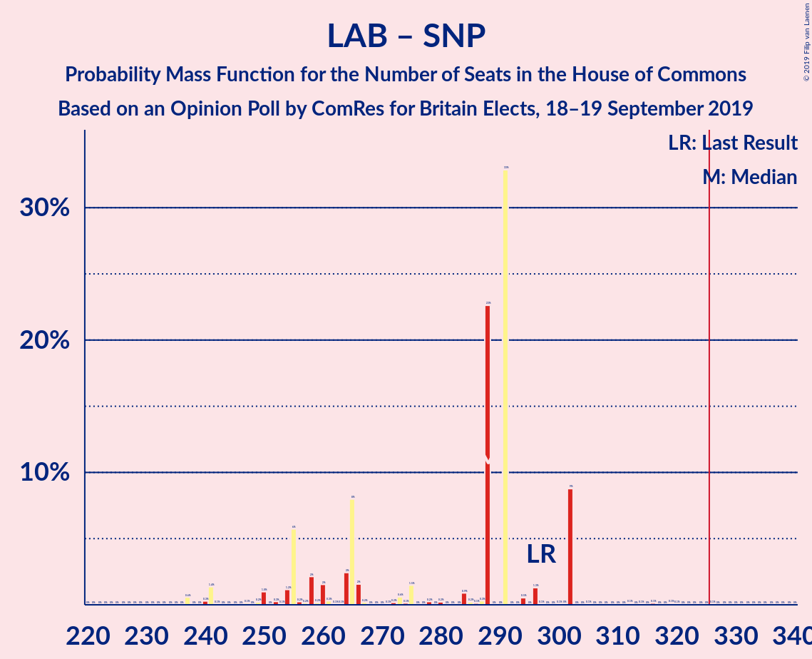

| Number of Seats | Probability | Accumulated | Special Marks |
|:---------------:|:-----------:|:-----------:|:-------------:|
| 226 | 0% | 100% |  |
| 227 | 0% | 99.9% |  |
| 228 | 0% | 99.9% |  |
| 229 | 0% | 99.9% |  |
| 230 | 0% | 99.9% |  |
| 231 | 0% | 99.9% |  |
| 232 | 0% | 99.9% |  |
| 233 | 0% | 99.9% |  |
| 234 | 0% | 99.9% |  |
| 235 | 0% | 99.9% |  |
| 236 | 0% | 99.9% |  |
| 237 | 0.6% | 99.9% |  |
| 238 | 0% | 99.3% |  |
| 239 | 0% | 99.3% |  |
| 240 | 0.3% | 99.3% |  |
| 241 | 1.4% | 99.0% |  |
| 242 | 0.1% | 98% |  |
| 243 | 0% | 98% |  |
| 244 | 0% | 98% |  |
| 245 | 0% | 97% |  |
| 246 | 0% | 97% |  |
| 247 | 0.1% | 97% |  |
| 248 | 0% | 97% |  |
| 249 | 0.2% | 97% |  |
| 250 | 1.0% | 97% |  |
| 251 | 0% | 96% |  |
| 252 | 0.3% | 96% |  |
| 253 | 0.1% | 96% |  |
| 254 | 1.2% | 96% |  |
| 255 | 6% | 95% |  |
| 256 | 0.2% | 89% |  |
| 257 | 0.2% | 89% |  |
| 258 | 2% | 88% |  |
| 259 | 0.2% | 86% |  |
| 260 | 2% | 86% |  |
| 261 | 0.3% | 85% |  |
| 262 | 0.1% | 84% |  |
| 263 | 0.1% | 84% |  |
| 264 | 2% | 84% |  |
| 265 | 8% | 82% |  |
| 266 | 2% | 74% |  |
| 267 | 0.2% | 72% |  |
| 268 | 0% | 72% |  |
| 269 | 0% | 72% |  |
| 270 | 0% | 72% |  |
| 271 | 0.1% | 72% |  |
| 272 | 0.2% | 72% |  |
| 273 | 0.6% | 72% |  |
| 274 | 0.1% | 71% |  |
| 275 | 1.5% | 71% |  |
| 276 | 0% | 69% |  |
| 277 | 0% | 69% |  |
| 278 | 0.2% | 69% |  |
| 279 | 0% | 69% |  |
| 280 | 0.2% | 69% |  |
| 281 | 0% | 69% |  |
| 282 | 0% | 69% |  |
| 283 | 0% | 69% |  |
| 284 | 0.9% | 69% |  |
| 285 | 0.2% | 68% |  |
| 286 | 0.1% | 68% |  |
| 287 | 0.3% | 68% |  |
| 288 | 23% | 67% |  |
| 289 | 0% | 45% |  |
| 290 | 0% | 45% | Median |
| 291 | 33% | 45% |  |
| 292 | 0% | 12% |  |
| 293 | 0% | 12% |  |
| 294 | 0.5% | 12% |  |
| 295 | 0% | 11% |  |
| 296 | 1.3% | 11% |  |
| 297 | 0.1% | 10% | Last Result |
| 298 | 0% | 10% |  |
| 299 | 0% | 10% |  |
| 300 | 0.1% | 10% |  |
| 301 | 0% | 10% |  |
| 302 | 9% | 10% |  |
| 303 | 0% | 0.9% |  |
| 304 | 0% | 0.9% |  |
| 305 | 0.1% | 0.9% |  |
| 306 | 0% | 0.8% |  |
| 307 | 0% | 0.8% |  |
| 308 | 0% | 0.8% |  |
| 309 | 0% | 0.8% |  |
| 310 | 0% | 0.7% |  |
| 311 | 0% | 0.7% |  |
| 312 | 0.1% | 0.7% |  |
| 313 | 0% | 0.6% |  |
| 314 | 0.1% | 0.6% |  |
| 315 | 0% | 0.5% |  |
| 316 | 0.1% | 0.5% |  |
| 317 | 0% | 0.4% |  |
| 318 | 0% | 0.3% |  |
| 319 | 0.1% | 0.3% |  |
| 320 | 0.1% | 0.2% |  |
| 321 | 0% | 0.2% |  |
| 322 | 0% | 0.2% |  |
| 323 | 0% | 0.1% |  |
| 324 | 0% | 0.1% |  |
| 325 | 0% | 0.1% |  |
| 326 | 0.1% | 0.1% | Majority |
| 327 | 0% | 0.1% |  |
| 328 | 0% | 0.1% |  |
| 329 | 0% | 0.1% |  |
| 330 | 0% | 0.1% |  |
| 331 | 0% | 0.1% |  |
| 332 | 0% | 0% |  |

### Conservative Party – Plaid Cymru

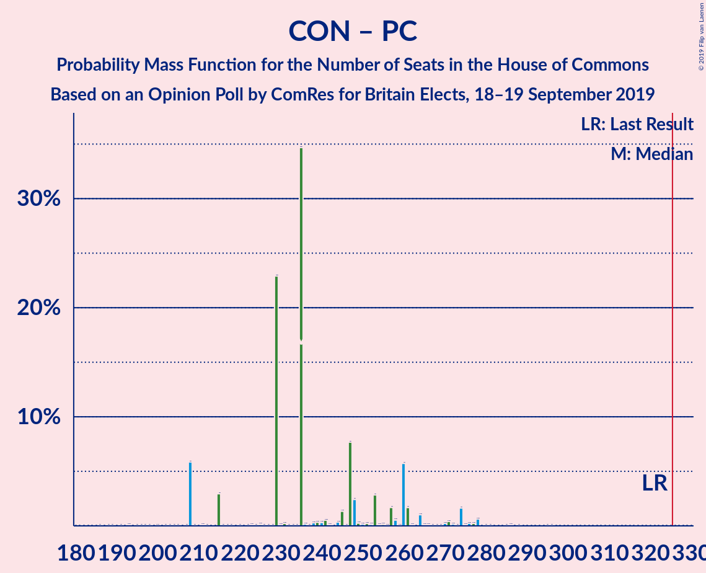

| Number of Seats | Probability | Accumulated | Special Marks |
|:---------------:|:-----------:|:-----------:|:-------------:|
| 188 | 0% | 100% |  |
| 189 | 0% | 99.9% |  |
| 190 | 0% | 99.9% |  |
| 191 | 0% | 99.9% |  |
| 192 | 0% | 99.9% |  |
| 193 | 0.1% | 99.9% |  |
| 194 | 0% | 99.8% |  |
| 195 | 0% | 99.8% |  |
| 196 | 0% | 99.8% |  |
| 197 | 0% | 99.8% |  |
| 198 | 0% | 99.7% |  |
| 199 | 0% | 99.7% |  |
| 200 | 0.1% | 99.7% |  |
| 201 | 0% | 99.7% |  |
| 202 | 0% | 99.7% |  |
| 203 | 0% | 99.6% |  |
| 204 | 0% | 99.6% |  |
| 205 | 0% | 99.6% |  |
| 206 | 0% | 99.6% |  |
| 207 | 0% | 99.6% |  |
| 208 | 6% | 99.5% |  |
| 209 | 0% | 94% |  |
| 210 | 0% | 94% |  |
| 211 | 0.1% | 94% |  |
| 212 | 0% | 94% |  |
| 213 | 0% | 94% |  |
| 214 | 0% | 94% |  |
| 215 | 3% | 94% |  |
| 216 | 0% | 91% |  |
| 217 | 0% | 91% |  |
| 218 | 0% | 91% |  |
| 219 | 0% | 91% |  |
| 220 | 0% | 90% |  |
| 221 | 0% | 90% |  |
| 222 | 0% | 90% |  |
| 223 | 0.1% | 90% |  |
| 224 | 0% | 90% |  |
| 225 | 0.1% | 90% |  |
| 226 | 0% | 90% |  |
| 227 | 0% | 90% |  |
| 228 | 0% | 90% |  |
| 229 | 23% | 90% |  |
| 230 | 0.1% | 67% |  |
| 231 | 0.2% | 67% |  |
| 232 | 0% | 67% |  |
| 233 | 0% | 67% |  |
| 234 | 0% | 67% |  |
| 235 | 35% | 67% | Median |
| 236 | 0.2% | 32% |  |
| 237 | 0% | 32% |  |
| 238 | 0.3% | 32% |  |
| 239 | 0.3% | 32% |  |
| 240 | 0.3% | 31% |  |
| 241 | 0.5% | 31% |  |
| 242 | 0.1% | 31% |  |
| 243 | 0% | 31% |  |
| 244 | 0.3% | 31% |  |
| 245 | 1.3% | 30% |  |
| 246 | 0% | 29% |  |
| 247 | 8% | 29% |  |
| 248 | 2% | 21% |  |
| 249 | 0.2% | 19% |  |
| 250 | 0.2% | 18% |  |
| 251 | 0.2% | 18% |  |
| 252 | 0.1% | 18% |  |
| 253 | 3% | 18% |  |
| 254 | 0.1% | 15% |  |
| 255 | 0.1% | 15% |  |
| 256 | 0.1% | 15% |  |
| 257 | 2% | 15% |  |
| 258 | 0.5% | 13% |  |
| 259 | 0.1% | 13% |  |
| 260 | 6% | 13% |  |
| 261 | 2% | 7% |  |
| 262 | 0.1% | 5% |  |
| 263 | 0% | 5% |  |
| 264 | 1.0% | 5% |  |
| 265 | 0.1% | 4% |  |
| 266 | 0.1% | 4% |  |
| 267 | 0% | 4% |  |
| 268 | 0% | 4% |  |
| 269 | 0% | 4% |  |
| 270 | 0.2% | 4% |  |
| 271 | 0.4% | 4% |  |
| 272 | 0.2% | 3% |  |
| 273 | 0% | 3% |  |
| 274 | 2% | 3% |  |
| 275 | 0.1% | 1.4% |  |
| 276 | 0.2% | 1.3% |  |
| 277 | 0.2% | 1.1% |  |
| 278 | 0.6% | 0.9% |  |
| 279 | 0% | 0.2% |  |
| 280 | 0% | 0.2% |  |
| 281 | 0% | 0.2% |  |
| 282 | 0% | 0.2% |  |
| 283 | 0% | 0.2% |  |
| 284 | 0% | 0.2% |  |
| 285 | 0% | 0.2% |  |
| 286 | 0.1% | 0.2% |  |
| 287 | 0% | 0.1% |  |
| 288 | 0% | 0.1% |  |
| 289 | 0% | 0% |  |
| 290 | 0% | 0% |  |
| 291 | 0% | 0% |  |
| 292 | 0% | 0% |  |
| 293 | 0% | 0% |  |
| 294 | 0% | 0% |  |
| 295 | 0% | 0% |  |
| 296 | 0% | 0% |  |
| 297 | 0% | 0% |  |
| 298 | 0% | 0% |  |
| 299 | 0% | 0% |  |
| 300 | 0% | 0% |  |
| 301 | 0% | 0% |  |
| 302 | 0% | 0% |  |
| 303 | 0% | 0% |  |
| 304 | 0% | 0% |  |
| 305 | 0% | 0% |  |
| 306 | 0% | 0% |  |
| 307 | 0% | 0% |  |
| 308 | 0% | 0% |  |
| 309 | 0% | 0% |  |
| 310 | 0% | 0% |  |
| 311 | 0% | 0% |  |
| 312 | 0% | 0% |  |
| 313 | 0% | 0% |  |
| 314 | 0% | 0% |  |
| 315 | 0% | 0% |  |
| 316 | 0% | 0% |  |
| 317 | 0% | 0% |  |
| 318 | 0% | 0% |  |
| 319 | 0% | 0% |  |
| 320 | 0% | 0% |  |
| 321 | 0% | 0% | Last Result |

### Conservative Party – Change UK

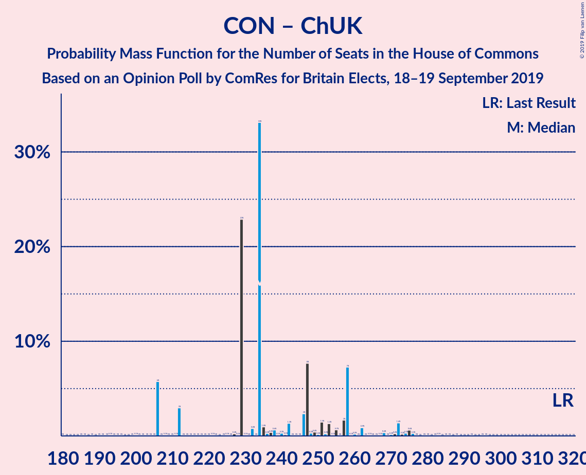

| Number of Seats | Probability | Accumulated | Special Marks |
|:---------------:|:-----------:|:-----------:|:-------------:|
| 186 | 0% | 100% |  |
| 187 | 0% | 99.9% |  |
| 188 | 0% | 99.9% |  |
| 189 | 0% | 99.9% |  |
| 190 | 0% | 99.9% |  |
| 191 | 0% | 99.9% |  |
| 192 | 0% | 99.9% |  |
| 193 | 0.1% | 99.9% |  |
| 194 | 0% | 99.8% |  |
| 195 | 0% | 99.8% |  |
| 196 | 0% | 99.7% |  |
| 197 | 0% | 99.7% |  |
| 198 | 0% | 99.7% |  |
| 199 | 0% | 99.7% |  |
| 200 | 0.1% | 99.7% |  |
| 201 | 0% | 99.6% |  |
| 202 | 0% | 99.6% |  |
| 203 | 0% | 99.6% |  |
| 204 | 0% | 99.6% |  |
| 205 | 0% | 99.6% |  |
| 206 | 6% | 99.5% |  |
| 207 | 0% | 94% |  |
| 208 | 0.1% | 94% |  |
| 209 | 0% | 94% |  |
| 210 | 0% | 94% |  |
| 211 | 0.1% | 94% |  |
| 212 | 3% | 94% |  |
| 213 | 0% | 91% |  |
| 214 | 0% | 91% |  |
| 215 | 0% | 91% |  |
| 216 | 0% | 91% |  |
| 217 | 0% | 91% |  |
| 218 | 0% | 90% |  |
| 219 | 0% | 90% |  |
| 220 | 0% | 90% |  |
| 221 | 0.1% | 90% |  |
| 222 | 0% | 90% |  |
| 223 | 0% | 90% |  |
| 224 | 0% | 90% |  |
| 225 | 0.1% | 90% |  |
| 226 | 0% | 90% |  |
| 227 | 0.2% | 90% |  |
| 228 | 0.1% | 90% |  |
| 229 | 23% | 90% |  |
| 230 | 0.1% | 67% |  |
| 231 | 0% | 67% |  |
| 232 | 0.8% | 67% |  |
| 233 | 0% | 66% |  |
| 234 | 33% | 66% | Median |
| 235 | 1.0% | 33% |  |
| 236 | 0.3% | 32% |  |
| 237 | 0.4% | 32% |  |
| 238 | 0.6% | 31% |  |
| 239 | 0.1% | 31% |  |
| 240 | 0.3% | 31% |  |
| 241 | 0.1% | 30% |  |
| 242 | 1.3% | 30% |  |
| 243 | 0% | 29% |  |
| 244 | 0% | 29% |  |
| 245 | 0% | 29% |  |
| 246 | 2% | 29% |  |
| 247 | 8% | 26% |  |
| 248 | 0.3% | 19% |  |
| 249 | 0.4% | 18% |  |
| 250 | 0.2% | 18% |  |
| 251 | 1.5% | 18% |  |
| 252 | 0.2% | 16% |  |
| 253 | 1.3% | 16% |  |
| 254 | 0.1% | 15% |  |
| 255 | 0.7% | 15% |  |
| 256 | 0% | 14% |  |
| 257 | 2% | 14% |  |
| 258 | 7% | 12% |  |
| 259 | 0.1% | 5% |  |
| 260 | 0.2% | 5% |  |
| 261 | 0% | 5% |  |
| 262 | 0.9% | 5% |  |
| 263 | 0% | 4% |  |
| 264 | 0.1% | 4% |  |
| 265 | 0% | 4% |  |
| 266 | 0% | 4% |  |
| 267 | 0.1% | 4% |  |
| 268 | 0.4% | 4% |  |
| 269 | 0% | 3% |  |
| 270 | 0.2% | 3% |  |
| 271 | 0.2% | 3% |  |
| 272 | 1.4% | 3% |  |
| 273 | 0.2% | 2% |  |
| 274 | 0.3% | 1.4% |  |
| 275 | 0.6% | 1.1% |  |
| 276 | 0.3% | 0.5% |  |
| 277 | 0% | 0.2% |  |
| 278 | 0% | 0.2% |  |
| 279 | 0% | 0.2% |  |
| 280 | 0% | 0.2% |  |
| 281 | 0% | 0.2% |  |
| 282 | 0% | 0.2% |  |
| 283 | 0.1% | 0.2% |  |
| 284 | 0% | 0.1% |  |
| 285 | 0% | 0.1% |  |
| 286 | 0% | 0.1% |  |
| 287 | 0% | 0.1% |  |
| 288 | 0% | 0.1% |  |
| 289 | 0% | 0% |  |
| 290 | 0% | 0% |  |
| 291 | 0% | 0% |  |
| 292 | 0% | 0% |  |
| 293 | 0% | 0% |  |
| 294 | 0% | 0% |  |
| 295 | 0% | 0% |  |
| 296 | 0% | 0% |  |
| 297 | 0% | 0% |  |
| 298 | 0% | 0% |  |
| 299 | 0% | 0% |  |
| 300 | 0% | 0% |  |
| 301 | 0% | 0% |  |
| 302 | 0% | 0% |  |
| 303 | 0% | 0% |  |
| 304 | 0% | 0% |  |
| 305 | 0% | 0% |  |
| 306 | 0% | 0% |  |
| 307 | 0% | 0% |  |
| 308 | 0% | 0% |  |
| 309 | 0% | 0% |  |
| 310 | 0% | 0% |  |
| 311 | 0% | 0% |  |
| 312 | 0% | 0% |  |
| 313 | 0% | 0% |  |
| 314 | 0% | 0% |  |
| 315 | 0% | 0% |  |
| 316 | 0% | 0% |  |
| 317 | 0% | 0% | Last Result |

### Conservative Party

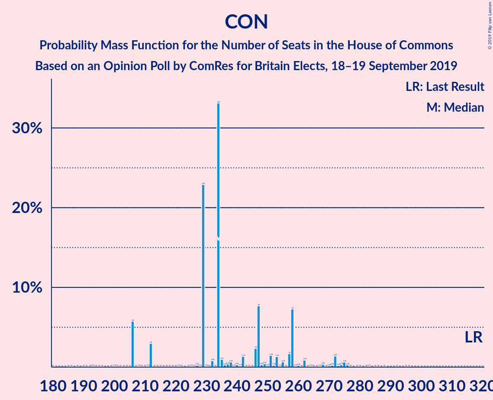

| Number of Seats | Probability | Accumulated | Special Marks |
|:---------------:|:-----------:|:-----------:|:-------------:|
| 186 | 0% | 100% |  |
| 187 | 0% | 99.9% |  |
| 188 | 0% | 99.9% |  |
| 189 | 0% | 99.9% |  |
| 190 | 0% | 99.9% |  |
| 191 | 0% | 99.9% |  |
| 192 | 0% | 99.9% |  |
| 193 | 0.1% | 99.9% |  |
| 194 | 0% | 99.8% |  |
| 195 | 0% | 99.8% |  |
| 196 | 0% | 99.7% |  |
| 197 | 0% | 99.7% |  |
| 198 | 0% | 99.7% |  |
| 199 | 0% | 99.7% |  |
| 200 | 0.1% | 99.7% |  |
| 201 | 0% | 99.6% |  |
| 202 | 0% | 99.6% |  |
| 203 | 0% | 99.6% |  |
| 204 | 0% | 99.6% |  |
| 205 | 0% | 99.6% |  |
| 206 | 6% | 99.5% |  |
| 207 | 0% | 94% |  |
| 208 | 0.1% | 94% |  |
| 209 | 0% | 94% |  |
| 210 | 0% | 94% |  |
| 211 | 0.1% | 94% |  |
| 212 | 3% | 94% |  |
| 213 | 0% | 91% |  |
| 214 | 0% | 91% |  |
| 215 | 0% | 91% |  |
| 216 | 0% | 91% |  |
| 217 | 0% | 91% |  |
| 218 | 0% | 90% |  |
| 219 | 0% | 90% |  |
| 220 | 0% | 90% |  |
| 221 | 0.1% | 90% |  |
| 222 | 0% | 90% |  |
| 223 | 0% | 90% |  |
| 224 | 0% | 90% |  |
| 225 | 0.1% | 90% |  |
| 226 | 0% | 90% |  |
| 227 | 0.2% | 90% |  |
| 228 | 0.1% | 90% |  |
| 229 | 23% | 90% |  |
| 230 | 0.1% | 67% |  |
| 231 | 0% | 67% |  |
| 232 | 0.8% | 67% |  |
| 233 | 0% | 66% |  |
| 234 | 33% | 66% | Median |
| 235 | 1.0% | 33% |  |
| 236 | 0.3% | 32% |  |
| 237 | 0.4% | 32% |  |
| 238 | 0.6% | 31% |  |
| 239 | 0.1% | 31% |  |
| 240 | 0.3% | 31% |  |
| 241 | 0.1% | 30% |  |
| 242 | 1.3% | 30% |  |
| 243 | 0% | 29% |  |
| 244 | 0% | 29% |  |
| 245 | 0% | 29% |  |
| 246 | 2% | 29% |  |
| 247 | 8% | 26% |  |
| 248 | 0.3% | 19% |  |
| 249 | 0.4% | 18% |  |
| 250 | 0.2% | 18% |  |
| 251 | 1.5% | 18% |  |
| 252 | 0.2% | 16% |  |
| 253 | 1.3% | 16% |  |
| 254 | 0.1% | 15% |  |
| 255 | 0.7% | 15% |  |
| 256 | 0% | 14% |  |
| 257 | 2% | 14% |  |
| 258 | 7% | 12% |  |
| 259 | 0.1% | 5% |  |
| 260 | 0.2% | 5% |  |
| 261 | 0% | 5% |  |
| 262 | 0.9% | 5% |  |
| 263 | 0% | 4% |  |
| 264 | 0.1% | 4% |  |
| 265 | 0% | 4% |  |
| 266 | 0% | 4% |  |
| 267 | 0.1% | 4% |  |
| 268 | 0.4% | 4% |  |
| 269 | 0% | 3% |  |
| 270 | 0.2% | 3% |  |
| 271 | 0.2% | 3% |  |
| 272 | 1.4% | 3% |  |
| 273 | 0.2% | 2% |  |
| 274 | 0.3% | 1.4% |  |
| 275 | 0.6% | 1.1% |  |
| 276 | 0.3% | 0.5% |  |
| 277 | 0% | 0.2% |  |
| 278 | 0% | 0.2% |  |
| 279 | 0% | 0.2% |  |
| 280 | 0% | 0.2% |  |
| 281 | 0% | 0.2% |  |
| 282 | 0% | 0.2% |  |
| 283 | 0.1% | 0.2% |  |
| 284 | 0% | 0.1% |  |
| 285 | 0% | 0.1% |  |
| 286 | 0% | 0.1% |  |
| 287 | 0% | 0.1% |  |
| 288 | 0% | 0.1% |  |
| 289 | 0% | 0% |  |
| 290 | 0% | 0% |  |
| 291 | 0% | 0% |  |
| 292 | 0% | 0% |  |
| 293 | 0% | 0% |  |
| 294 | 0% | 0% |  |
| 295 | 0% | 0% |  |
| 296 | 0% | 0% |  |
| 297 | 0% | 0% |  |
| 298 | 0% | 0% |  |
| 299 | 0% | 0% |  |
| 300 | 0% | 0% |  |
| 301 | 0% | 0% |  |
| 302 | 0% | 0% |  |
| 303 | 0% | 0% |  |
| 304 | 0% | 0% |  |
| 305 | 0% | 0% |  |
| 306 | 0% | 0% |  |
| 307 | 0% | 0% |  |
| 308 | 0% | 0% |  |
| 309 | 0% | 0% |  |
| 310 | 0% | 0% |  |
| 311 | 0% | 0% |  |
| 312 | 0% | 0% |  |
| 313 | 0% | 0% |  |
| 314 | 0% | 0% |  |
| 315 | 0% | 0% |  |
| 316 | 0% | 0% |  |
| 317 | 0% | 0% | Last Result |

### Labour Party – Plaid Cymru

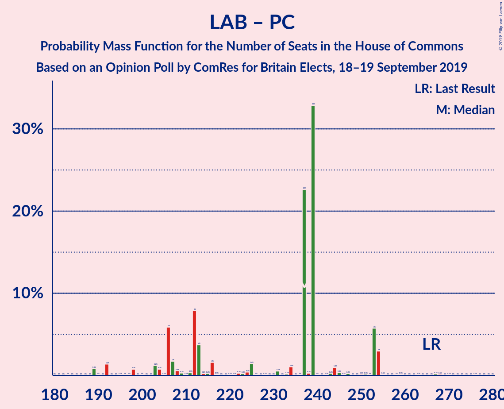

| Number of Seats | Probability | Accumulated | Special Marks |
|:---------------:|:-----------:|:-----------:|:-------------:|
| 180 | 0% | 100% |  |
| 181 | 0% | 99.9% |  |
| 182 | 0% | 99.9% |  |
| 183 | 0% | 99.9% |  |
| 184 | 0% | 99.9% |  |
| 185 | 0% | 99.9% |  |
| 186 | 0% | 99.9% |  |
| 187 | 0% | 99.9% |  |
| 188 | 0% | 99.9% |  |
| 189 | 0.8% | 99.8% |  |
| 190 | 0% | 99.0% |  |
| 191 | 0% | 99.0% |  |
| 192 | 1.4% | 99.0% |  |
| 193 | 0% | 98% |  |
| 194 | 0% | 98% |  |
| 195 | 0.1% | 98% |  |
| 196 | 0% | 97% |  |
| 197 | 0% | 97% |  |
| 198 | 0.7% | 97% |  |
| 199 | 0% | 97% |  |
| 200 | 0% | 97% |  |
| 201 | 0% | 97% |  |
| 202 | 0% | 97% |  |
| 203 | 1.2% | 97% |  |
| 204 | 0.7% | 95% |  |
| 205 | 0.1% | 95% |  |
| 206 | 6% | 95% |  |
| 207 | 2% | 89% |  |
| 208 | 0.6% | 87% |  |
| 209 | 0.3% | 86% |  |
| 210 | 0.1% | 86% |  |
| 211 | 0.3% | 86% |  |
| 212 | 8% | 86% |  |
| 213 | 4% | 78% |  |
| 214 | 0.2% | 74% |  |
| 215 | 0.2% | 74% |  |
| 216 | 2% | 74% |  |
| 217 | 0.1% | 72% |  |
| 218 | 0% | 72% |  |
| 219 | 0% | 72% |  |
| 220 | 0.1% | 72% |  |
| 221 | 0.1% | 72% |  |
| 222 | 0.3% | 72% |  |
| 223 | 0.2% | 72% |  |
| 224 | 0.4% | 71% |  |
| 225 | 1.4% | 71% |  |
| 226 | 0% | 70% |  |
| 227 | 0% | 70% |  |
| 228 | 0.1% | 70% |  |
| 229 | 0% | 69% |  |
| 230 | 0% | 69% |  |
| 231 | 0.5% | 69% |  |
| 232 | 0% | 69% |  |
| 233 | 0.1% | 69% |  |
| 234 | 1.0% | 69% |  |
| 235 | 0% | 68% |  |
| 236 | 0% | 68% |  |
| 237 | 23% | 68% |  |
| 238 | 0.3% | 45% | Median |
| 239 | 33% | 45% |  |
| 240 | 0% | 12% |  |
| 241 | 0% | 12% |  |
| 242 | 0.1% | 12% |  |
| 243 | 0.2% | 12% |  |
| 244 | 1.0% | 11% |  |
| 245 | 0.3% | 11% |  |
| 246 | 0.1% | 10% |  |
| 247 | 0.2% | 10% |  |
| 248 | 0% | 10% |  |
| 249 | 0% | 10% |  |
| 250 | 0.1% | 10% |  |
| 251 | 0.1% | 10% |  |
| 252 | 0% | 10% |  |
| 253 | 6% | 10% |  |
| 254 | 3% | 4% |  |
| 255 | 0.1% | 0.9% |  |
| 256 | 0% | 0.8% |  |
| 257 | 0% | 0.8% |  |
| 258 | 0% | 0.8% |  |
| 259 | 0.1% | 0.7% |  |
| 260 | 0% | 0.6% |  |
| 261 | 0% | 0.6% |  |
| 262 | 0% | 0.6% |  |
| 263 | 0.1% | 0.6% |  |
| 264 | 0% | 0.5% |  |
| 265 | 0% | 0.5% |  |
| 266 | 0% | 0.5% | Last Result |
| 267 | 0.2% | 0.5% |  |
| 268 | 0.1% | 0.3% |  |
| 269 | 0% | 0.2% |  |
| 270 | 0.1% | 0.2% |  |
| 271 | 0% | 0.2% |  |
| 272 | 0% | 0.2% |  |
| 273 | 0% | 0.1% |  |
| 274 | 0% | 0.1% |  |
| 275 | 0% | 0.1% |  |
| 276 | 0.1% | 0.1% |  |
| 277 | 0% | 0.1% |  |
| 278 | 0% | 0.1% |  |
| 279 | 0% | 0.1% |  |
| 280 | 0% | 0% |  |

### Labour Party – Change UK

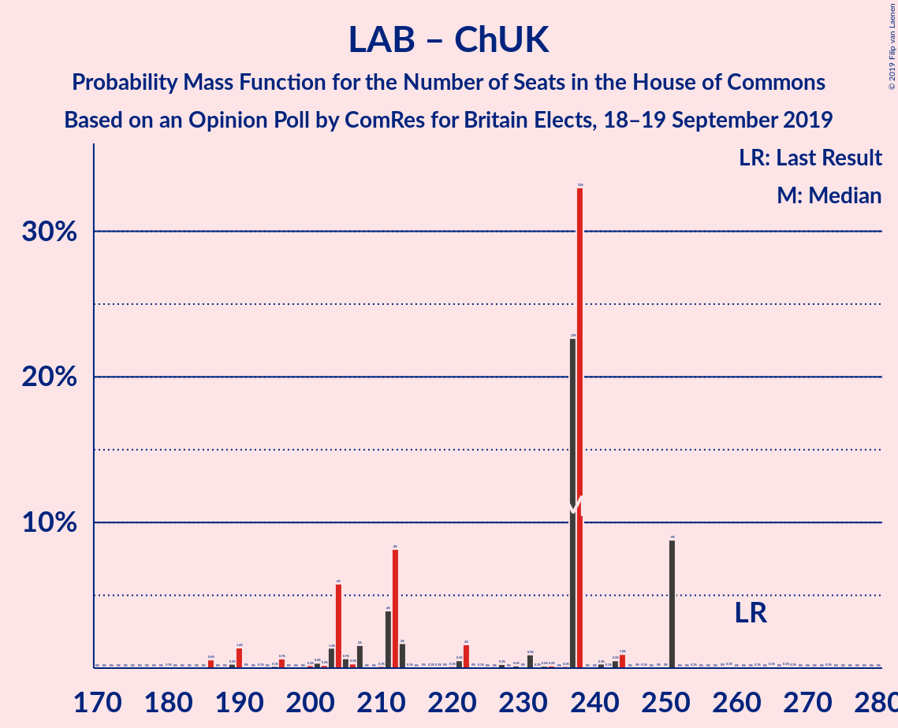

| Number of Seats | Probability | Accumulated | Special Marks |
|:---------------:|:-----------:|:-----------:|:-------------:|
| 177 | 0% | 100% |  |
| 178 | 0% | 99.9% |  |
| 179 | 0% | 99.9% |  |
| 180 | 0.1% | 99.9% |  |
| 181 | 0% | 99.9% |  |
| 182 | 0% | 99.9% |  |
| 183 | 0% | 99.9% |  |
| 184 | 0% | 99.9% |  |
| 185 | 0% | 99.9% |  |
| 186 | 0.6% | 99.9% |  |
| 187 | 0% | 99.3% |  |
| 188 | 0% | 99.3% |  |
| 189 | 0.3% | 99.3% |  |
| 190 | 1.4% | 99.0% |  |
| 191 | 0% | 98% |  |
| 192 | 0% | 98% |  |
| 193 | 0.1% | 98% |  |
| 194 | 0% | 97% |  |
| 195 | 0.1% | 97% |  |
| 196 | 0.7% | 97% |  |
| 197 | 0% | 97% |  |
| 198 | 0% | 97% |  |
| 199 | 0% | 97% |  |
| 200 | 0.2% | 97% |  |
| 201 | 0.4% | 96% |  |
| 202 | 0.2% | 96% |  |
| 203 | 1.4% | 96% |  |
| 204 | 6% | 94% |  |
| 205 | 0.7% | 89% |  |
| 206 | 0.3% | 88% |  |
| 207 | 2% | 88% |  |
| 208 | 0% | 86% |  |
| 209 | 0% | 86% |  |
| 210 | 0.1% | 86% |  |
| 211 | 4% | 86% |  |
| 212 | 8% | 82% |  |
| 213 | 2% | 74% |  |
| 214 | 0.1% | 72% |  |
| 215 | 0% | 72% |  |
| 216 | 0% | 72% |  |
| 217 | 0.1% | 72% |  |
| 218 | 0.1% | 72% |  |
| 219 | 0% | 72% |  |
| 220 | 0.1% | 72% |  |
| 221 | 0.5% | 72% |  |
| 222 | 2% | 71% |  |
| 223 | 0% | 70% |  |
| 224 | 0.1% | 70% |  |
| 225 | 0% | 69% |  |
| 226 | 0% | 69% |  |
| 227 | 0.3% | 69% |  |
| 228 | 0% | 69% |  |
| 229 | 0.2% | 69% |  |
| 230 | 0% | 69% |  |
| 231 | 0.9% | 69% |  |
| 232 | 0.1% | 68% |  |
| 233 | 0.2% | 68% |  |
| 234 | 0.2% | 68% |  |
| 235 | 0% | 68% |  |
| 236 | 0.1% | 68% |  |
| 237 | 23% | 67% | Median |
| 238 | 33% | 45% |  |
| 239 | 0% | 12% |  |
| 240 | 0% | 12% |  |
| 241 | 0.3% | 12% |  |
| 242 | 0.1% | 11% |  |
| 243 | 0.5% | 11% |  |
| 244 | 1.0% | 11% |  |
| 245 | 0% | 10% |  |
| 246 | 0% | 10% |  |
| 247 | 0.1% | 10% |  |
| 248 | 0% | 10% |  |
| 249 | 0% | 10% |  |
| 250 | 0% | 10% |  |
| 251 | 9% | 10% |  |
| 252 | 0% | 0.9% |  |
| 253 | 0% | 0.9% |  |
| 254 | 0.1% | 0.9% |  |
| 255 | 0% | 0.8% |  |
| 256 | 0% | 0.8% |  |
| 257 | 0% | 0.8% |  |
| 258 | 0% | 0.8% |  |
| 259 | 0.1% | 0.7% |  |
| 260 | 0% | 0.6% |  |
| 261 | 0% | 0.6% |  |
| 262 | 0% | 0.6% | Last Result |
| 263 | 0.1% | 0.6% |  |
| 264 | 0% | 0.5% |  |
| 265 | 0.1% | 0.5% |  |
| 266 | 0% | 0.4% |  |
| 267 | 0.1% | 0.4% |  |
| 268 | 0.1% | 0.3% |  |
| 269 | 0% | 0.2% |  |
| 270 | 0% | 0.2% |  |
| 271 | 0% | 0.2% |  |
| 272 | 0% | 0.1% |  |
| 273 | 0.1% | 0.1% |  |
| 274 | 0% | 0.1% |  |
| 275 | 0% | 0.1% |  |
| 276 | 0% | 0.1% |  |
| 277 | 0% | 0.1% |  |
| 278 | 0% | 0.1% |  |
| 279 | 0% | 0% |  |

### Labour Party

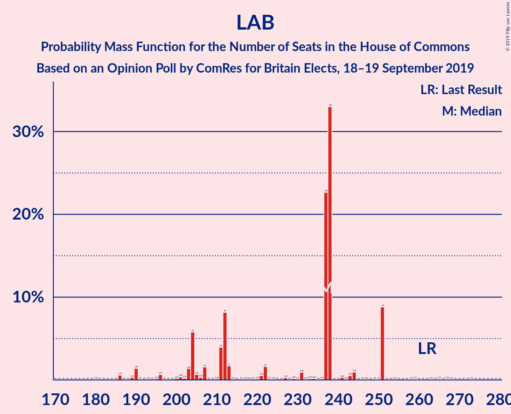

| Number of Seats | Probability | Accumulated | Special Marks |
|:---------------:|:-----------:|:-----------:|:-------------:|
| 177 | 0% | 100% |  |
| 178 | 0% | 99.9% |  |
| 179 | 0% | 99.9% |  |
| 180 | 0.1% | 99.9% |  |
| 181 | 0% | 99.9% |  |
| 182 | 0% | 99.9% |  |
| 183 | 0% | 99.9% |  |
| 184 | 0% | 99.9% |  |
| 185 | 0% | 99.9% |  |
| 186 | 0.6% | 99.9% |  |
| 187 | 0% | 99.3% |  |
| 188 | 0% | 99.3% |  |
| 189 | 0.3% | 99.3% |  |
| 190 | 1.4% | 99.0% |  |
| 191 | 0% | 98% |  |
| 192 | 0% | 98% |  |
| 193 | 0.1% | 98% |  |
| 194 | 0% | 97% |  |
| 195 | 0.1% | 97% |  |
| 196 | 0.7% | 97% |  |
| 197 | 0% | 97% |  |
| 198 | 0% | 97% |  |
| 199 | 0% | 97% |  |
| 200 | 0.2% | 97% |  |
| 201 | 0.4% | 96% |  |
| 202 | 0.2% | 96% |  |
| 203 | 1.4% | 96% |  |
| 204 | 6% | 94% |  |
| 205 | 0.7% | 89% |  |
| 206 | 0.3% | 88% |  |
| 207 | 2% | 88% |  |
| 208 | 0% | 86% |  |
| 209 | 0% | 86% |  |
| 210 | 0.1% | 86% |  |
| 211 | 4% | 86% |  |
| 212 | 8% | 82% |  |
| 213 | 2% | 74% |  |
| 214 | 0.1% | 72% |  |
| 215 | 0% | 72% |  |
| 216 | 0% | 72% |  |
| 217 | 0.1% | 72% |  |
| 218 | 0.1% | 72% |  |
| 219 | 0% | 72% |  |
| 220 | 0.1% | 72% |  |
| 221 | 0.5% | 72% |  |
| 222 | 2% | 71% |  |
| 223 | 0% | 70% |  |
| 224 | 0.1% | 70% |  |
| 225 | 0% | 69% |  |
| 226 | 0% | 69% |  |
| 227 | 0.3% | 69% |  |
| 228 | 0% | 69% |  |
| 229 | 0.2% | 69% |  |
| 230 | 0% | 69% |  |
| 231 | 0.9% | 69% |  |
| 232 | 0.1% | 68% |  |
| 233 | 0.2% | 68% |  |
| 234 | 0.2% | 68% |  |
| 235 | 0% | 68% |  |
| 236 | 0.1% | 68% |  |
| 237 | 23% | 67% | Median |
| 238 | 33% | 45% |  |
| 239 | 0% | 12% |  |
| 240 | 0% | 12% |  |
| 241 | 0.3% | 12% |  |
| 242 | 0.1% | 11% |  |
| 243 | 0.5% | 11% |  |
| 244 | 1.0% | 11% |  |
| 245 | 0% | 10% |  |
| 246 | 0% | 10% |  |
| 247 | 0.1% | 10% |  |
| 248 | 0% | 10% |  |
| 249 | 0% | 10% |  |
| 250 | 0% | 10% |  |
| 251 | 9% | 10% |  |
| 252 | 0% | 0.9% |  |
| 253 | 0% | 0.9% |  |
| 254 | 0.1% | 0.9% |  |
| 255 | 0% | 0.8% |  |
| 256 | 0% | 0.8% |  |
| 257 | 0% | 0.8% |  |
| 258 | 0% | 0.8% |  |
| 259 | 0.1% | 0.7% |  |
| 260 | 0% | 0.6% |  |
| 261 | 0% | 0.6% |  |
| 262 | 0% | 0.6% | Last Result |
| 263 | 0.1% | 0.6% |  |
| 264 | 0% | 0.5% |  |
| 265 | 0.1% | 0.5% |  |
| 266 | 0% | 0.4% |  |
| 267 | 0.1% | 0.4% |  |
| 268 | 0.1% | 0.3% |  |
| 269 | 0% | 0.2% |  |
| 270 | 0% | 0.2% |  |
| 271 | 0% | 0.2% |  |
| 272 | 0% | 0.1% |  |
| 273 | 0.1% | 0.1% |  |
| 274 | 0% | 0.1% |  |
| 275 | 0% | 0.1% |  |
| 276 | 0% | 0.1% |  |
| 277 | 0% | 0.1% |  |
| 278 | 0% | 0.1% |  |
| 279 | 0% | 0% |  |

## Technical Information

### Opinion Poll

+ **Polling firm:** ComRes
+ **Commissioner(s):** Britain Elects
+ **Fieldwork period:** 18–19 September 2019

### Calculations

+ **Sample size:** 2050
+ **Simulations done:** 131,072
+ **Error estimate:** 2.71%

