# Opinion Poll by ComRes for Daily Express, 9–10 October 2019

<a href="#voting-intentions">Voting Intentions</a> | <a href="#seats">Seats</a> | <a href="#coalitions">Coalitions</a> | <a href="#technical-information">Technical Information</a>

## Voting Intentions

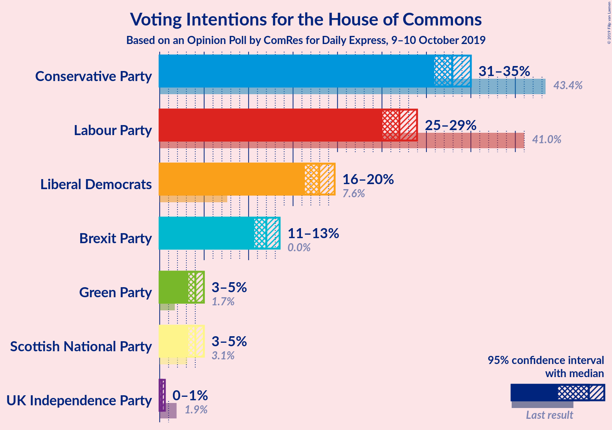

### Confidence Intervals

| Party | Last Result | Poll Result | 80% Confidence Interval | 90% Confidence Interval | 95% Confidence Interval | 99% Confidence Interval |
|:-----:|:-----------:|:-----------:|:-----------------------:|:-----------------------:|:-----------------------:|:-----------------------:|
| Conservative Party | 43.4% | 32.9% | 31.6–34.3% |31.2–34.7% |30.9–35.0% |30.3–35.7% |
| Labour Party | 41.0% | 27.0% | 25.7–28.3% |25.4–28.6% |25.1–28.9% |24.5–29.6% |
| Liberal Democrats | 7.6% | 17.9% | 16.9–19.1% |16.6–19.4% |16.3–19.7% |15.8–20.2% |
| Brexit Party | 0.0% | 12.0% | 11.1–13.0% |10.9–13.2% |10.6–13.5% |10.2–14.0% |
| Scottish National Party | 3.1% | 4.0% | 3.5–4.6% |3.4–4.8% |3.2–5.0% |3.0–5.3% |
| Green Party | 1.7% | 4.0% | 3.5–4.6% |3.4–4.8% |3.2–5.0% |3.0–5.3% |
| UK Independence Party | 1.9% | 0.2% | 0.2–0.5% |0.1–0.5% |0.1–0.6% |0.1–0.7% |

*Note:* The poll result column reflects the actual value used in the calculations. Published results may vary slightly, and in addition be rounded to fewer digits.

## Seats

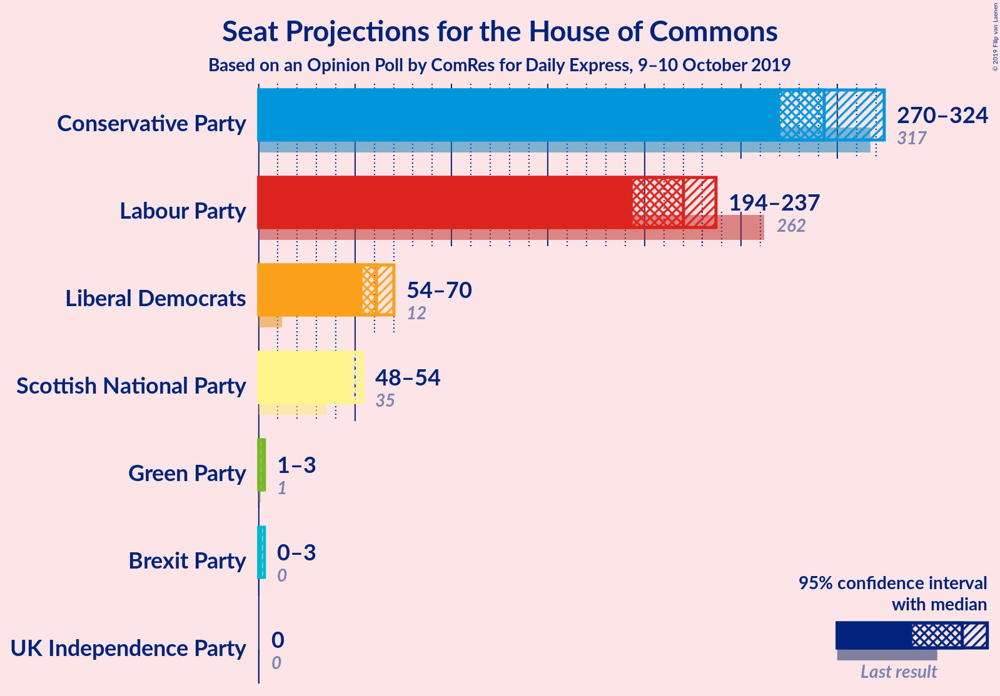

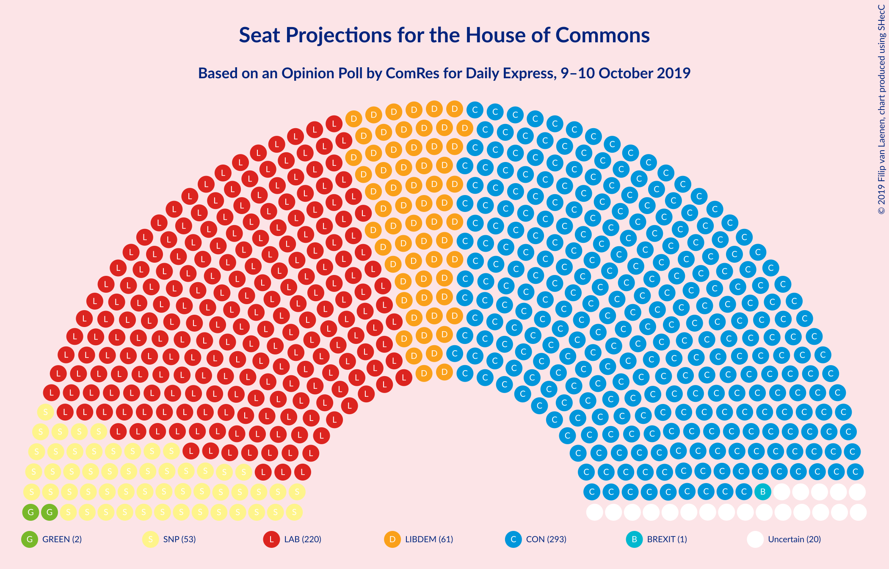

### Confidence Intervals

| Party | Last Result | Median | 80% Confidence Interval | 90% Confidence Interval | 95% Confidence Interval | 99% Confidence Interval |
|:-----:|:-----------:|:------:|:-----------------------:|:-----------------------:|:-----------------------:|:-----------------------:|
| <a href="#conservative-party">Conservative Party</a> | 317 | 293 | 279–314 |275–319 |270–324 |256–334 |
| <a href="#labour-party">Labour Party</a> | 262 | 220 | 203–231 |199–233 |194–237 |184–250 |
| <a href="#liberal-democrats">Liberal Democrats</a> | 12 | 61 | 58–67 |56–69 |54–70 |49–72 |
| <a href="#brexit-party">Brexit Party</a> | 0 | 1 | 0–2 |0–2 |0–3 |0–4 |
| <a href="#scottish-national-party">Scottish National Party</a> | 35 | 53 | 48–53 |48–53 |48–54 |45–54 |
| <a href="#green-party">Green Party</a> | 1 | 2 | 1–2 |1–2 |1–3 |1–3 |
| <a href="#uk-independence-party">UK Independence Party</a> | 0 | 0 | 0 |0 |0 |0 |

### Conservative Party

*For a full overview of the results for this party, see the [Conservative Party](party-conservativeparty.html) page.*

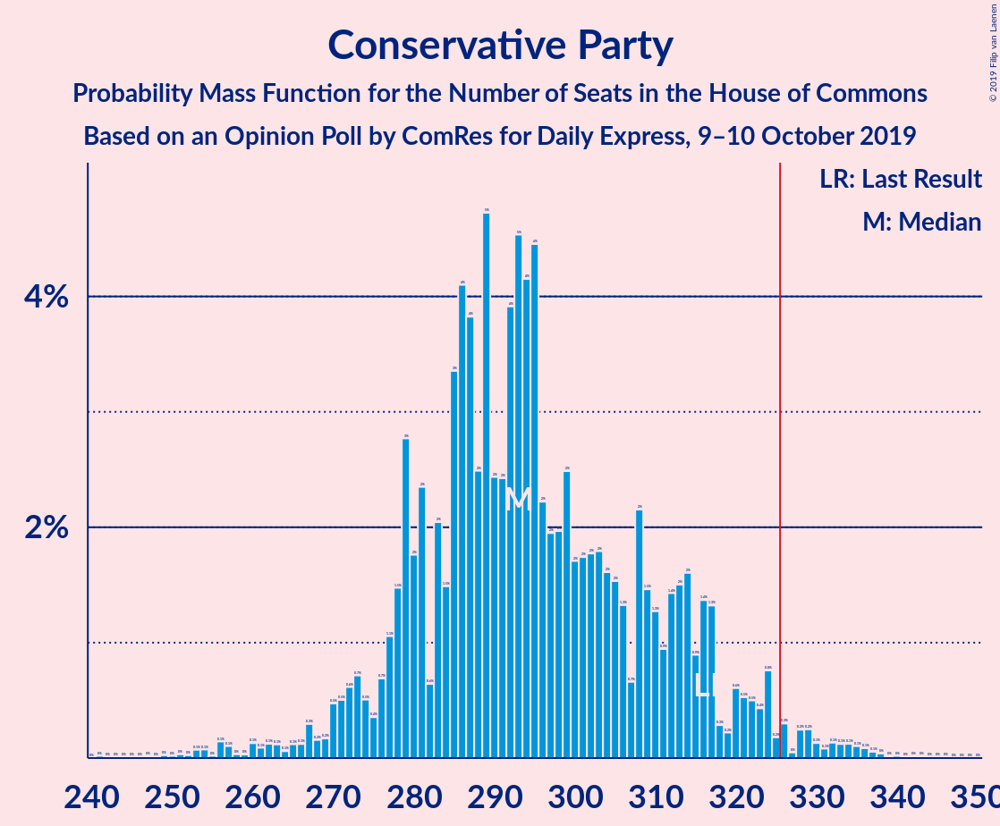

| Number of Seats | Probability | Accumulated | Special Marks |
|:---------------:|:-----------:|:-----------:|:-------------:|
| 242 | 0% | 100% |  |
| 243 | 0% | 99.9% |  |
| 244 | 0% | 99.9% |  |
| 245 | 0% | 99.9% |  |
| 246 | 0% | 99.9% |  |
| 247 | 0% | 99.9% |  |
| 248 | 0% | 99.9% |  |
| 249 | 0% | 99.9% |  |
| 250 | 0% | 99.9% |  |
| 251 | 0% | 99.8% |  |
| 252 | 0% | 99.8% |  |
| 253 | 0.1% | 99.8% |  |
| 254 | 0.1% | 99.7% |  |
| 255 | 0% | 99.6% |  |
| 256 | 0.1% | 99.6% |  |
| 257 | 0.1% | 99.5% |  |
| 258 | 0% | 99.4% |  |
| 259 | 0% | 99.3% |  |
| 260 | 0.1% | 99.3% |  |
| 261 | 0.1% | 99.2% |  |
| 262 | 0.1% | 99.1% |  |
| 263 | 0.1% | 99.0% |  |
| 264 | 0.1% | 98.9% |  |
| 265 | 0.1% | 98.8% |  |
| 266 | 0.1% | 98.7% |  |
| 267 | 0.3% | 98.5% |  |
| 268 | 0.2% | 98% |  |
| 269 | 0.2% | 98% |  |
| 270 | 0.5% | 98% |  |
| 271 | 0.5% | 97% |  |
| 272 | 0.6% | 97% |  |
| 273 | 0.7% | 96% |  |
| 274 | 0.5% | 96% |  |
| 275 | 0.4% | 95% |  |
| 276 | 0.7% | 95% |  |
| 277 | 1.1% | 94% |  |
| 278 | 1.5% | 93% |  |
| 279 | 3% | 92% |  |
| 280 | 2% | 89% |  |
| 281 | 2% | 87% |  |
| 282 | 0.6% | 85% |  |
| 283 | 2% | 84% |  |
| 284 | 1.5% | 82% |  |
| 285 | 3% | 80% |  |
| 286 | 4% | 77% |  |
| 287 | 4% | 73% |  |
| 288 | 2% | 69% |  |
| 289 | 5% | 67% |  |
| 290 | 2% | 62% |  |
| 291 | 2% | 60% |  |
| 292 | 4% | 57% |  |
| 293 | 5% | 53% | Median |
| 294 | 4% | 49% |  |
| 295 | 4% | 45% |  |
| 296 | 2% | 40% |  |
| 297 | 2% | 38% |  |
| 298 | 2% | 36% |  |
| 299 | 2% | 34% |  |
| 300 | 2% | 31% |  |
| 301 | 2% | 30% |  |
| 302 | 2% | 28% |  |
| 303 | 2% | 26% |  |
| 304 | 2% | 24% |  |
| 305 | 2% | 23% |  |
| 306 | 1.3% | 21% |  |
| 307 | 0.7% | 20% |  |
| 308 | 2% | 19% |  |
| 309 | 1.5% | 17% |  |
| 310 | 1.3% | 16% |  |
| 311 | 0.9% | 14% |  |
| 312 | 1.4% | 13% |  |
| 313 | 2% | 12% |  |
| 314 | 2% | 11% |  |
| 315 | 0.9% | 9% |  |
| 316 | 1.4% | 8% |  |
| 317 | 1.3% | 7% | Last Result |
| 318 | 0.3% | 5% |  |
| 319 | 0.2% | 5% |  |
| 320 | 0.6% | 5% |  |
| 321 | 0.5% | 4% |  |
| 322 | 0.5% | 4% |  |
| 323 | 0.4% | 3% |  |
| 324 | 0.8% | 3% |  |
| 325 | 0.2% | 2% |  |
| 326 | 0.3% | 2% | Majority |
| 327 | 0% | 2% |  |
| 328 | 0.2% | 1.5% |  |
| 329 | 0.2% | 1.2% |  |
| 330 | 0.1% | 1.0% |  |
| 331 | 0.1% | 0.9% |  |
| 332 | 0.1% | 0.8% |  |
| 333 | 0.1% | 0.6% |  |
| 334 | 0.1% | 0.5% |  |
| 335 | 0.1% | 0.4% |  |
| 336 | 0.1% | 0.3% |  |
| 337 | 0.1% | 0.2% |  |
| 338 | 0% | 0.2% |  |
| 339 | 0% | 0.1% |  |
| 340 | 0% | 0.1% |  |
| 341 | 0% | 0.1% |  |
| 342 | 0% | 0.1% |  |
| 343 | 0% | 0.1% |  |
| 344 | 0% | 0% |  |

### Labour Party

*For a full overview of the results for this party, see the [Labour Party](party-labourparty.html) page.*

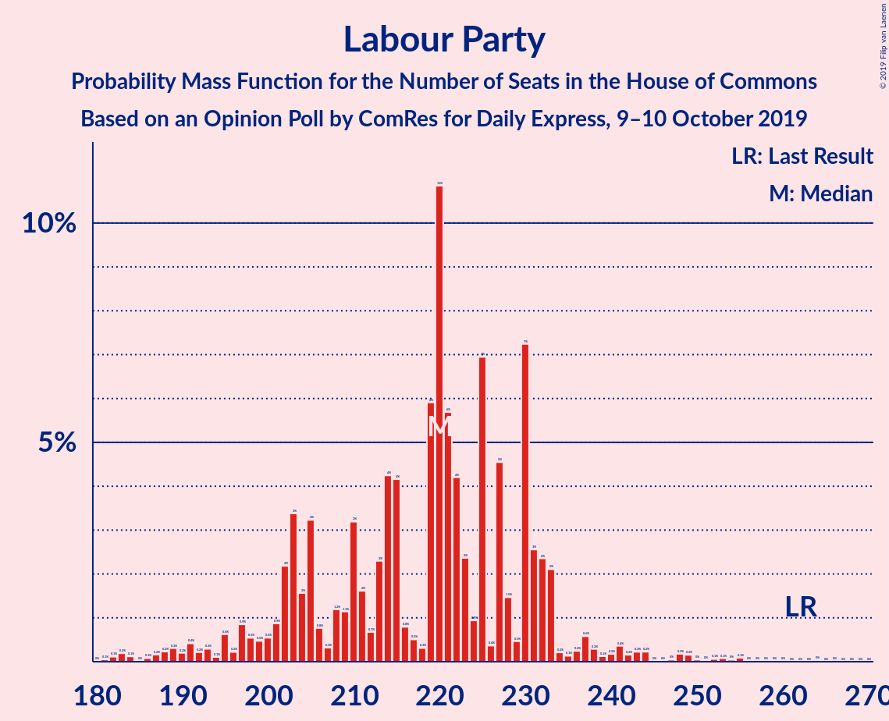

| Number of Seats | Probability | Accumulated | Special Marks |
|:---------------:|:-----------:|:-----------:|:-------------:|
| 180 | 0% | 100% |  |
| 181 | 0.1% | 99.9% |  |
| 182 | 0.1% | 99.9% |  |
| 183 | 0.2% | 99.8% |  |
| 184 | 0.1% | 99.6% |  |
| 185 | 0% | 99.5% |  |
| 186 | 0.1% | 99.4% |  |
| 187 | 0.2% | 99.4% |  |
| 188 | 0.2% | 99.2% |  |
| 189 | 0.3% | 99.0% |  |
| 190 | 0.2% | 98.7% |  |
| 191 | 0.4% | 98% |  |
| 192 | 0.2% | 98% |  |
| 193 | 0.3% | 98% |  |
| 194 | 0.1% | 98% |  |
| 195 | 0.6% | 97% |  |
| 196 | 0.2% | 97% |  |
| 197 | 0.9% | 97% |  |
| 198 | 0.5% | 96% |  |
| 199 | 0.5% | 95% |  |
| 200 | 0.5% | 95% |  |
| 201 | 0.9% | 94% |  |
| 202 | 2% | 93% |  |
| 203 | 3% | 91% |  |
| 204 | 2% | 88% |  |
| 205 | 3% | 86% |  |
| 206 | 0.8% | 83% |  |
| 207 | 0.3% | 82% |  |
| 208 | 1.2% | 82% |  |
| 209 | 1.1% | 81% |  |
| 210 | 3% | 79% |  |
| 211 | 2% | 76% |  |
| 212 | 0.7% | 75% |  |
| 213 | 2% | 74% |  |
| 214 | 4% | 72% |  |
| 215 | 4% | 67% |  |
| 216 | 0.8% | 63% |  |
| 217 | 0.5% | 63% |  |
| 218 | 0.3% | 62% |  |
| 219 | 6% | 62% |  |
| 220 | 11% | 56% | Median |
| 221 | 6% | 45% |  |
| 222 | 4% | 39% |  |
| 223 | 2% | 35% |  |
| 224 | 0.9% | 33% |  |
| 225 | 7% | 32% |  |
| 226 | 0.4% | 25% |  |
| 227 | 5% | 24% |  |
| 228 | 1.5% | 20% |  |
| 229 | 0.5% | 18% |  |
| 230 | 7% | 18% |  |
| 231 | 3% | 11% |  |
| 232 | 2% | 8% |  |
| 233 | 2% | 6% |  |
| 234 | 0.2% | 4% |  |
| 235 | 0.1% | 3% |  |
| 236 | 0.2% | 3% |  |
| 237 | 0.6% | 3% |  |
| 238 | 0.3% | 2% |  |
| 239 | 0.1% | 2% |  |
| 240 | 0.2% | 2% |  |
| 241 | 0.4% | 2% |  |
| 242 | 0.2% | 2% |  |
| 243 | 0.2% | 1.4% |  |
| 244 | 0.2% | 1.2% |  |
| 245 | 0% | 0.9% |  |
| 246 | 0% | 0.9% |  |
| 247 | 0% | 0.9% |  |
| 248 | 0.2% | 0.8% |  |
| 249 | 0.2% | 0.7% |  |
| 250 | 0% | 0.5% |  |
| 251 | 0% | 0.5% |  |
| 252 | 0.1% | 0.4% |  |
| 253 | 0.1% | 0.4% |  |
| 254 | 0% | 0.3% |  |
| 255 | 0.1% | 0.2% |  |
| 256 | 0% | 0.1% |  |
| 257 | 0% | 0.1% |  |
| 258 | 0% | 0.1% |  |
| 259 | 0% | 0.1% |  |
| 260 | 0% | 0.1% |  |
| 261 | 0% | 0.1% |  |
| 262 | 0% | 0.1% | Last Result |
| 263 | 0% | 0.1% |  |
| 264 | 0% | 0.1% |  |
| 265 | 0% | 0% |  |

### Liberal Democrats

*For a full overview of the results for this party, see the [Liberal Democrats](party-liberaldemocrats.html) page.*

| Number of Seats | Probability | Accumulated | Special Marks |
|:---------------:|:-----------:|:-----------:|:-------------:|
| 12 | 0% | 100% | Last Result |
| 13 | 0% | 100% |  |
| 14 | 0% | 100% |  |
| 15 | 0% | 100% |  |
| 16 | 0% | 100% |  |
| 17 | 0% | 100% |  |
| 18 | 0% | 100% |  |
| 19 | 0% | 100% |  |
| 20 | 0% | 100% |  |
| 21 | 0% | 100% |  |
| 22 | 0% | 100% |  |
| 23 | 0% | 100% |  |
| 24 | 0% | 100% |  |
| 25 | 0% | 100% |  |
| 26 | 0% | 100% |  |
| 27 | 0% | 100% |  |
| 28 | 0% | 100% |  |
| 29 | 0% | 100% |  |
| 30 | 0% | 100% |  |
| 31 | 0% | 100% |  |
| 32 | 0% | 100% |  |
| 33 | 0% | 100% |  |
| 34 | 0% | 100% |  |
| 35 | 0% | 100% |  |
| 36 | 0% | 100% |  |
| 37 | 0% | 100% |  |
| 38 | 0% | 100% |  |
| 39 | 0% | 100% |  |
| 40 | 0% | 100% |  |
| 41 | 0% | 100% |  |
| 42 | 0% | 100% |  |
| 43 | 0% | 100% |  |
| 44 | 0% | 100% |  |
| 45 | 0% | 100% |  |
| 46 | 0% | 100% |  |
| 47 | 0.3% | 100% |  |
| 48 | 0.2% | 99.7% |  |
| 49 | 0.5% | 99.5% |  |
| 50 | 0.1% | 99.1% |  |
| 51 | 0% | 98.9% |  |
| 52 | 0.2% | 98.9% |  |
| 53 | 0.4% | 98.6% |  |
| 54 | 1.0% | 98% |  |
| 55 | 2% | 97% |  |
| 56 | 2% | 96% |  |
| 57 | 2% | 93% |  |
| 58 | 8% | 91% |  |
| 59 | 13% | 84% |  |
| 60 | 19% | 70% |  |
| 61 | 7% | 52% | Median |
| 62 | 5% | 45% |  |
| 63 | 7% | 39% |  |
| 64 | 10% | 32% |  |
| 65 | 4% | 22% |  |
| 66 | 7% | 17% |  |
| 67 | 2% | 10% |  |
| 68 | 3% | 9% |  |
| 69 | 2% | 6% |  |
| 70 | 2% | 4% |  |
| 71 | 1.4% | 2% |  |
| 72 | 0.5% | 0.9% |  |
| 73 | 0.1% | 0.4% |  |
| 74 | 0.1% | 0.4% |  |
| 75 | 0.1% | 0.2% |  |
| 76 | 0.1% | 0.1% |  |
| 77 | 0% | 0% |  |

### Brexit Party

*For a full overview of the results for this party, see the [Brexit Party](party-brexitparty.html) page.*

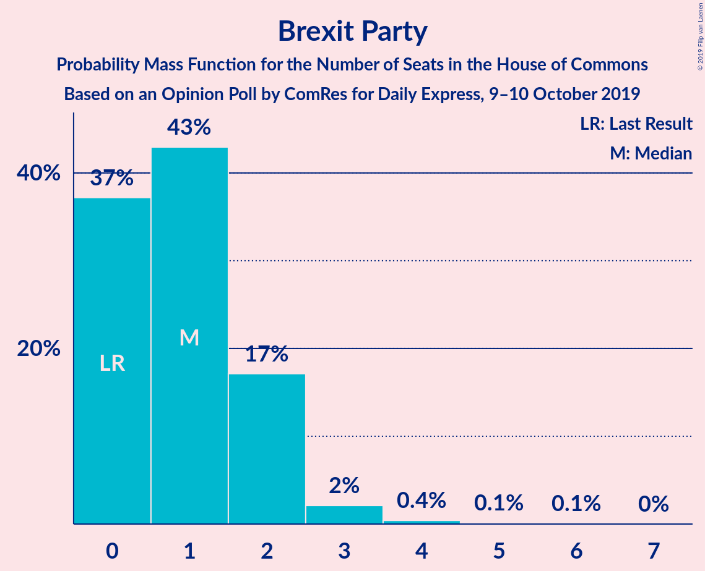

| Number of Seats | Probability | Accumulated | Special Marks |
|:---------------:|:-----------:|:-----------:|:-------------:|
| 0 | 37% | 100% | Last Result |
| 1 | 43% | 63% | Median |
| 2 | 17% | 20% |  |
| 3 | 2% | 3% |  |
| 4 | 0.4% | 0.6% |  |
| 5 | 0.1% | 0.2% |  |
| 6 | 0.1% | 0.1% |  |
| 7 | 0% | 0% |  |

### Scottish National Party

*For a full overview of the results for this party, see the [Scottish National Party](party-scottishnationalparty.html) page.*

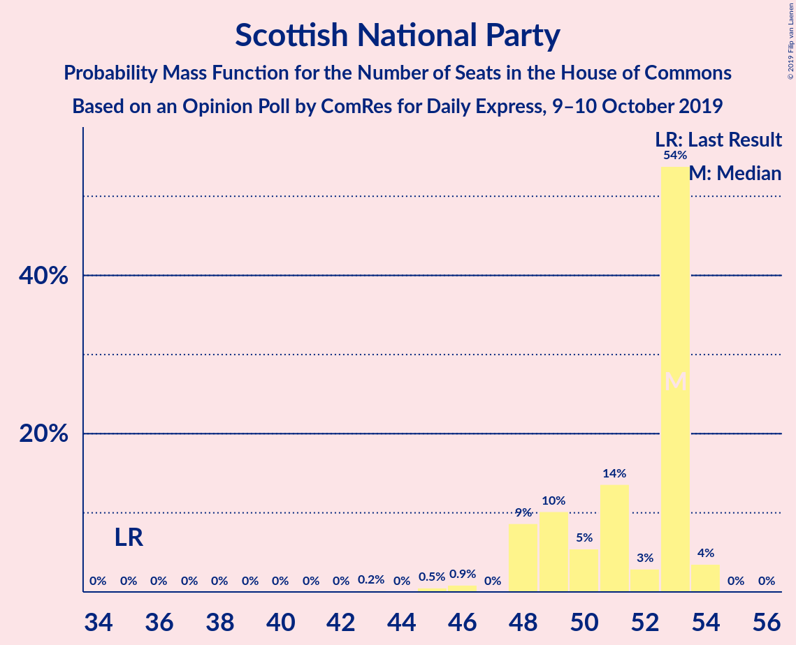

| Number of Seats | Probability | Accumulated | Special Marks |
|:---------------:|:-----------:|:-----------:|:-------------:|
| 35 | 0% | 100% | Last Result |
| 36 | 0% | 100% |  |
| 37 | 0% | 100% |  |
| 38 | 0% | 100% |  |
| 39 | 0% | 100% |  |
| 40 | 0% | 100% |  |
| 41 | 0% | 99.9% |  |
| 42 | 0% | 99.9% |  |
| 43 | 0.2% | 99.9% |  |
| 44 | 0% | 99.7% |  |
| 45 | 0.5% | 99.7% |  |
| 46 | 0.9% | 99.2% |  |
| 47 | 0% | 98% |  |
| 48 | 9% | 98% |  |
| 49 | 10% | 90% |  |
| 50 | 5% | 79% |  |
| 51 | 14% | 74% |  |
| 52 | 3% | 60% |  |
| 53 | 54% | 57% | Median |
| 54 | 4% | 4% |  |
| 55 | 0% | 0% |  |

### Green Party

*For a full overview of the results for this party, see the [Green Party](party-greenparty.html) page.*

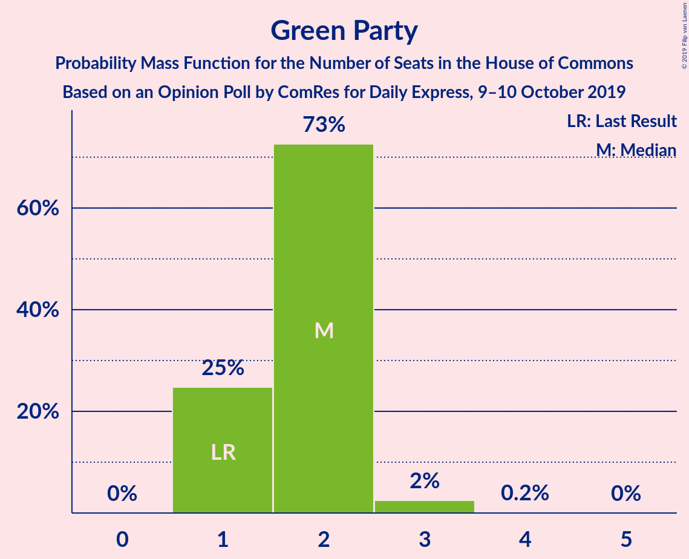

| Number of Seats | Probability | Accumulated | Special Marks |
|:---------------:|:-----------:|:-----------:|:-------------:|
| 1 | 25% | 100% | Last Result |
| 2 | 73% | 75% | Median |
| 3 | 2% | 3% |  |
| 4 | 0.2% | 0.2% |  |
| 5 | 0% | 0% |  |

### UK Independence Party

*For a full overview of the results for this party, see the [UK Independence Party](party-ukindependenceparty.html) page.*

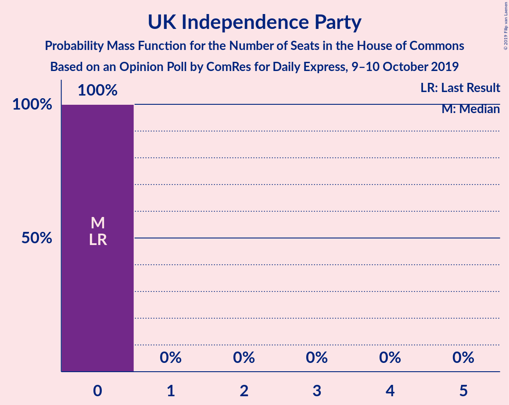

| Number of Seats | Probability | Accumulated | Special Marks |
|:---------------:|:-----------:|:-----------:|:-------------:|
| 0 | 100% | 100% | Last Result, Median |

## Coalitions

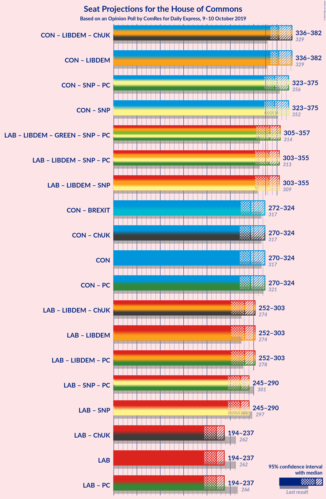

### Confidence Intervals

| Coalition | Last Result | Median | Majority? | 80% Confidence Interval | 90% Confidence Interval | 95% Confidence Interval | 99% Confidence Interval |
|:---------:|:-----------:|:------:|:---------:|:-----------------------:|:-----------------------:|:-----------------------:|:-----------------------:|
| Conservative Party – Liberal Democrats | 329 | 354 | 99.2% | 343–373 | 340–377 | 336–382 | 323–391 |
| Conservative Party – Scottish National Party | 352 | 345 | 96% | 331–365 | 327–370 | 323–375 | 309–385 |
| Labour Party – Liberal Democrats – Scottish National Party | 309 | 333 | 71% | 313–347 | 308–352 | 303–355 | 293–369 |
| Conservative Party – Brexit Party | 317 | 294 | 2% | 280–315 | 276–319 | 272–324 | 258–334 |
| Conservative Party | 317 | 293 | 2% | 279–314 | 275–319 | 270–324 | 256–334 |
| Labour Party – Liberal Democrats | 274 | 281 | 0.1% | 262–296 | 257–300 | 252–303 | 242–316 |
| Labour Party – Scottish National Party | 297 | 272 | 0% | 253–283 | 250–285 | 245–290 | 236–302 |
| Labour Party | 262 | 220 | 0% | 203–231 | 199–233 | 194–237 | 184–250 |

### Conservative Party – Liberal Democrats

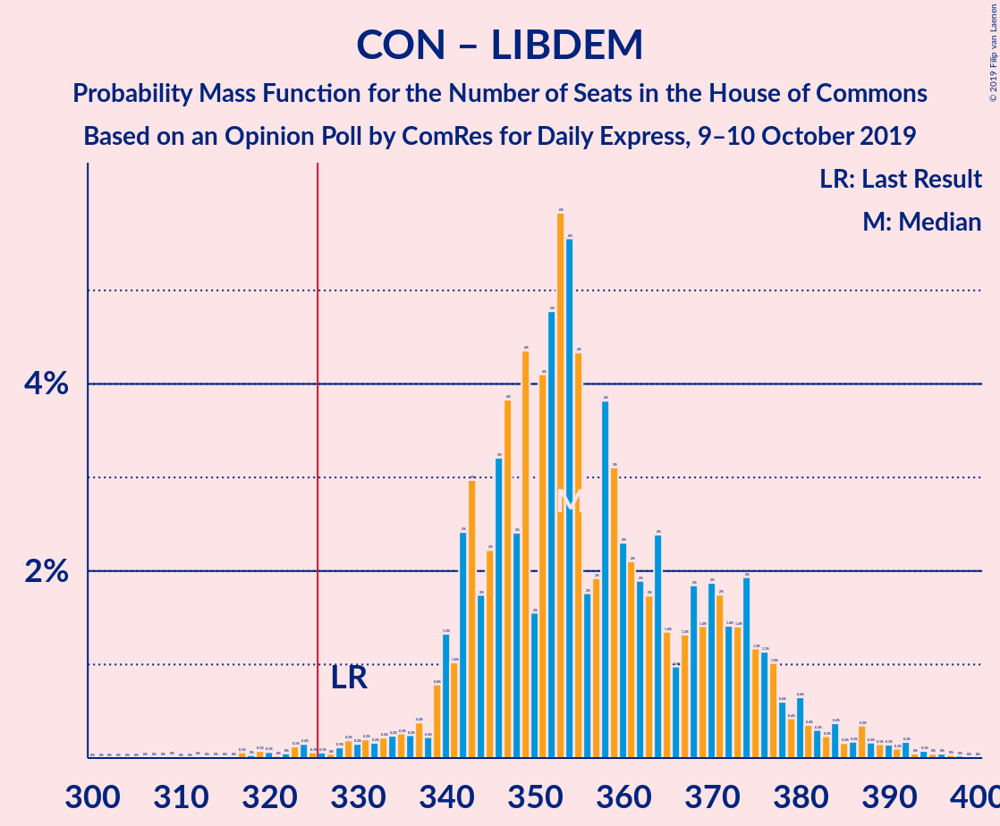

| Number of Seats | Probability | Accumulated | Special Marks |
|:---------------:|:-----------:|:-----------:|:-------------:|
| 309 | 0% | 100% |  |
| 310 | 0% | 99.9% |  |
| 311 | 0% | 99.9% |  |
| 312 | 0% | 99.9% |  |
| 313 | 0% | 99.9% |  |
| 314 | 0% | 99.9% |  |
| 315 | 0% | 99.9% |  |
| 316 | 0% | 99.9% |  |
| 317 | 0.1% | 99.9% |  |
| 318 | 0% | 99.8% |  |
| 319 | 0.1% | 99.8% |  |
| 320 | 0.1% | 99.7% |  |
| 321 | 0% | 99.6% |  |
| 322 | 0% | 99.6% |  |
| 323 | 0.1% | 99.6% |  |
| 324 | 0.2% | 99.5% |  |
| 325 | 0.1% | 99.3% |  |
| 326 | 0.1% | 99.2% | Majority |
| 327 | 0% | 99.2% |  |
| 328 | 0.1% | 99.1% |  |
| 329 | 0.2% | 99.0% | Last Result |
| 330 | 0.2% | 98.8% |  |
| 331 | 0.2% | 98.7% |  |
| 332 | 0.2% | 98% |  |
| 333 | 0.2% | 98% |  |
| 334 | 0.2% | 98% |  |
| 335 | 0.3% | 98% |  |
| 336 | 0.2% | 98% |  |
| 337 | 0.4% | 97% |  |
| 338 | 0.2% | 97% |  |
| 339 | 0.8% | 97% |  |
| 340 | 1.3% | 96% |  |
| 341 | 1.0% | 95% |  |
| 342 | 2% | 94% |  |
| 343 | 3% | 91% |  |
| 344 | 2% | 88% |  |
| 345 | 2% | 86% |  |
| 346 | 3% | 84% |  |
| 347 | 4% | 81% |  |
| 348 | 2% | 77% |  |
| 349 | 4% | 75% |  |
| 350 | 2% | 70% |  |
| 351 | 4% | 69% |  |
| 352 | 5% | 65% |  |
| 353 | 6% | 60% |  |
| 354 | 6% | 54% | Median |
| 355 | 4% | 49% |  |
| 356 | 2% | 44% |  |
| 357 | 2% | 43% |  |
| 358 | 4% | 41% |  |
| 359 | 3% | 37% |  |
| 360 | 2% | 34% |  |
| 361 | 2% | 31% |  |
| 362 | 2% | 29% |  |
| 363 | 2% | 27% |  |
| 364 | 2% | 26% |  |
| 365 | 1.4% | 23% |  |
| 366 | 1.0% | 22% |  |
| 367 | 1.3% | 21% |  |
| 368 | 2% | 20% |  |
| 369 | 1.4% | 18% |  |
| 370 | 2% | 16% |  |
| 371 | 2% | 14% |  |
| 372 | 1.4% | 13% |  |
| 373 | 1.4% | 11% |  |
| 374 | 2% | 10% |  |
| 375 | 1.2% | 8% |  |
| 376 | 1.1% | 7% |  |
| 377 | 1.0% | 6% |  |
| 378 | 0.6% | 5% |  |
| 379 | 0.4% | 4% |  |
| 380 | 0.6% | 4% |  |
| 381 | 0.4% | 3% |  |
| 382 | 0.3% | 3% |  |
| 383 | 0.2% | 2% |  |
| 384 | 0.4% | 2% |  |
| 385 | 0.2% | 2% |  |
| 386 | 0.2% | 2% |  |
| 387 | 0.3% | 1.4% |  |
| 388 | 0.2% | 1.0% |  |
| 389 | 0.1% | 0.9% |  |
| 390 | 0.1% | 0.7% |  |
| 391 | 0.1% | 0.6% |  |
| 392 | 0.2% | 0.5% |  |
| 393 | 0% | 0.3% |  |
| 394 | 0.1% | 0.3% |  |
| 395 | 0% | 0.2% |  |
| 396 | 0% | 0.1% |  |
| 397 | 0% | 0.1% |  |
| 398 | 0% | 0.1% |  |
| 399 | 0% | 0% |  |

### Conservative Party – Scottish National Party

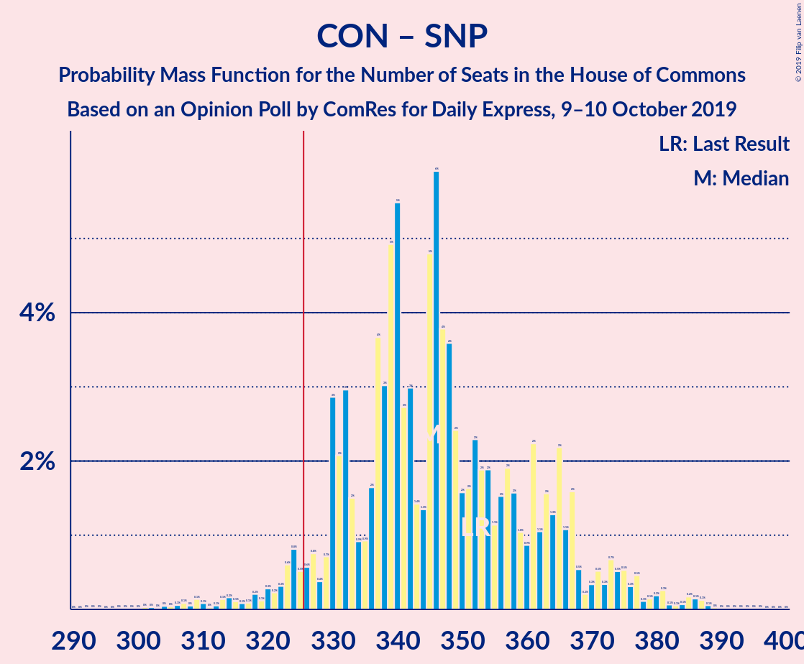

| Number of Seats | Probability | Accumulated | Special Marks |
|:---------------:|:-----------:|:-----------:|:-------------:|
| 294 | 0% | 100% |  |
| 295 | 0% | 99.9% |  |
| 296 | 0% | 99.9% |  |
| 297 | 0% | 99.9% |  |
| 298 | 0% | 99.9% |  |
| 299 | 0% | 99.9% |  |
| 300 | 0% | 99.9% |  |
| 301 | 0% | 99.9% |  |
| 302 | 0% | 99.9% |  |
| 303 | 0% | 99.8% |  |
| 304 | 0% | 99.8% |  |
| 305 | 0% | 99.8% |  |
| 306 | 0.1% | 99.7% |  |
| 307 | 0.1% | 99.7% |  |
| 308 | 0% | 99.6% |  |
| 309 | 0.1% | 99.5% |  |
| 310 | 0.1% | 99.4% |  |
| 311 | 0% | 99.3% |  |
| 312 | 0.1% | 99.3% |  |
| 313 | 0.1% | 99.3% |  |
| 314 | 0.2% | 99.1% |  |
| 315 | 0.1% | 99.0% |  |
| 316 | 0.1% | 98.8% |  |
| 317 | 0.1% | 98.8% |  |
| 318 | 0.2% | 98.7% |  |
| 319 | 0.1% | 98% |  |
| 320 | 0.3% | 98% |  |
| 321 | 0.2% | 98% |  |
| 322 | 0.3% | 98% |  |
| 323 | 0.6% | 98% |  |
| 324 | 0.8% | 97% |  |
| 325 | 0.5% | 96% |  |
| 326 | 0.6% | 96% | Majority |
| 327 | 0.8% | 95% |  |
| 328 | 0.4% | 94% |  |
| 329 | 0.7% | 94% |  |
| 330 | 3% | 93% |  |
| 331 | 2% | 90% |  |
| 332 | 3% | 88% |  |
| 333 | 2% | 85% |  |
| 334 | 0.9% | 84% |  |
| 335 | 0.9% | 83% |  |
| 336 | 2% | 82% |  |
| 337 | 4% | 80% |  |
| 338 | 3% | 77% |  |
| 339 | 5% | 74% |  |
| 340 | 5% | 69% |  |
| 341 | 3% | 63% |  |
| 342 | 3% | 60% |  |
| 343 | 1.4% | 57% |  |
| 344 | 1.3% | 56% |  |
| 345 | 5% | 55% |  |
| 346 | 6% | 50% | Median |
| 347 | 4% | 44% |  |
| 348 | 4% | 40% |  |
| 349 | 2% | 37% |  |
| 350 | 2% | 34% |  |
| 351 | 2% | 33% |  |
| 352 | 2% | 31% | Last Result |
| 353 | 2% | 29% |  |
| 354 | 2% | 27% |  |
| 355 | 1.1% | 25% |  |
| 356 | 2% | 24% |  |
| 357 | 2% | 22% |  |
| 358 | 2% | 20% |  |
| 359 | 1.0% | 19% |  |
| 360 | 0.9% | 18% |  |
| 361 | 2% | 17% |  |
| 362 | 1.1% | 15% |  |
| 363 | 2% | 14% |  |
| 364 | 1.3% | 12% |  |
| 365 | 2% | 11% |  |
| 366 | 1.1% | 9% |  |
| 367 | 2% | 8% |  |
| 368 | 0.5% | 6% |  |
| 369 | 0.2% | 5% |  |
| 370 | 0.3% | 5% |  |
| 371 | 0.5% | 5% |  |
| 372 | 0.3% | 4% |  |
| 373 | 0.7% | 4% |  |
| 374 | 0.5% | 3% |  |
| 375 | 0.5% | 3% |  |
| 376 | 0.3% | 2% |  |
| 377 | 0.5% | 2% |  |
| 378 | 0.1% | 1.5% |  |
| 379 | 0.1% | 1.4% |  |
| 380 | 0.2% | 1.2% |  |
| 381 | 0.3% | 1.1% |  |
| 382 | 0.1% | 0.8% |  |
| 383 | 0.1% | 0.7% |  |
| 384 | 0.1% | 0.7% |  |
| 385 | 0.2% | 0.6% |  |
| 386 | 0.1% | 0.4% |  |
| 387 | 0.1% | 0.3% |  |
| 388 | 0.1% | 0.2% |  |
| 389 | 0% | 0.1% |  |
| 390 | 0% | 0.1% |  |
| 391 | 0% | 0.1% |  |
| 392 | 0% | 0.1% |  |
| 393 | 0% | 0.1% |  |
| 394 | 0% | 0% |  |

### Labour Party – Liberal Democrats – Scottish National Party

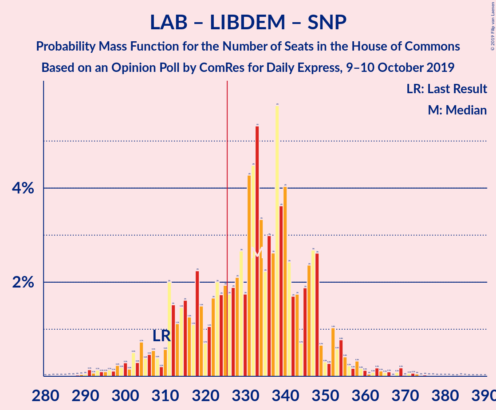

| Number of Seats | Probability | Accumulated | Special Marks |
|:---------------:|:-----------:|:-----------:|:-------------:|
| 285 | 0% | 100% |  |
| 286 | 0% | 99.9% |  |
| 287 | 0% | 99.9% |  |
| 288 | 0% | 99.9% |  |
| 289 | 0% | 99.9% |  |
| 290 | 0% | 99.8% |  |
| 291 | 0.1% | 99.8% |  |
| 292 | 0.1% | 99.7% |  |
| 293 | 0.1% | 99.6% |  |
| 294 | 0.1% | 99.5% |  |
| 295 | 0.1% | 99.4% |  |
| 296 | 0.1% | 99.3% |  |
| 297 | 0.1% | 99.1% |  |
| 298 | 0.2% | 99.0% |  |
| 299 | 0.2% | 98.8% |  |
| 300 | 0.3% | 98.6% |  |
| 301 | 0.2% | 98% |  |
| 302 | 0.5% | 98% |  |
| 303 | 0.3% | 98% |  |
| 304 | 0.7% | 97% |  |
| 305 | 0.4% | 97% |  |
| 306 | 0.5% | 96% |  |
| 307 | 0.5% | 96% |  |
| 308 | 0.4% | 95% |  |
| 309 | 0.2% | 95% | Last Result |
| 310 | 0.6% | 95% |  |
| 311 | 2% | 94% |  |
| 312 | 2% | 92% |  |
| 313 | 1.1% | 91% |  |
| 314 | 1.5% | 89% |  |
| 315 | 2% | 88% |  |
| 316 | 1.3% | 86% |  |
| 317 | 1.1% | 85% |  |
| 318 | 2% | 84% |  |
| 319 | 1.5% | 82% |  |
| 320 | 0.7% | 80% |  |
| 321 | 1.1% | 80% |  |
| 322 | 2% | 79% |  |
| 323 | 2% | 77% |  |
| 324 | 2% | 75% |  |
| 325 | 2% | 73% |  |
| 326 | 2% | 71% | Majority |
| 327 | 2% | 69% |  |
| 328 | 2% | 68% |  |
| 329 | 3% | 65% |  |
| 330 | 2% | 63% |  |
| 331 | 4% | 61% |  |
| 332 | 4% | 57% |  |
| 333 | 5% | 52% |  |
| 334 | 3% | 47% | Median |
| 335 | 2% | 44% |  |
| 336 | 3% | 41% |  |
| 337 | 3% | 38% |  |
| 338 | 6% | 36% |  |
| 339 | 4% | 30% |  |
| 340 | 4% | 26% |  |
| 341 | 2% | 22% |  |
| 342 | 2% | 20% |  |
| 343 | 2% | 18% |  |
| 344 | 0.7% | 17% |  |
| 345 | 2% | 16% |  |
| 346 | 2% | 14% |  |
| 347 | 3% | 12% |  |
| 348 | 3% | 9% |  |
| 349 | 0.7% | 6% |  |
| 350 | 0.3% | 6% |  |
| 351 | 0.3% | 5% |  |
| 352 | 1.0% | 5% |  |
| 353 | 0.6% | 4% |  |
| 354 | 0.8% | 3% |  |
| 355 | 0.4% | 3% |  |
| 356 | 0.2% | 2% |  |
| 357 | 0.2% | 2% |  |
| 358 | 0.3% | 2% |  |
| 359 | 0.2% | 2% |  |
| 360 | 0.1% | 1.4% |  |
| 361 | 0% | 1.3% |  |
| 362 | 0.1% | 1.2% |  |
| 363 | 0.2% | 1.1% |  |
| 364 | 0.1% | 0.9% |  |
| 365 | 0.1% | 0.8% |  |
| 366 | 0.1% | 0.8% |  |
| 367 | 0% | 0.7% |  |
| 368 | 0.1% | 0.6% |  |
| 369 | 0.2% | 0.6% |  |
| 370 | 0% | 0.4% |  |
| 371 | 0.1% | 0.4% |  |
| 372 | 0.1% | 0.3% |  |
| 373 | 0% | 0.2% |  |
| 374 | 0% | 0.2% |  |
| 375 | 0% | 0.2% |  |
| 376 | 0% | 0.1% |  |
| 377 | 0% | 0.1% |  |
| 378 | 0% | 0.1% |  |
| 379 | 0% | 0.1% |  |
| 380 | 0% | 0.1% |  |
| 381 | 0% | 0.1% |  |
| 382 | 0% | 0.1% |  |
| 383 | 0% | 0.1% |  |
| 384 | 0% | 0.1% |  |
| 385 | 0% | 0% |  |

### Conservative Party – Brexit Party

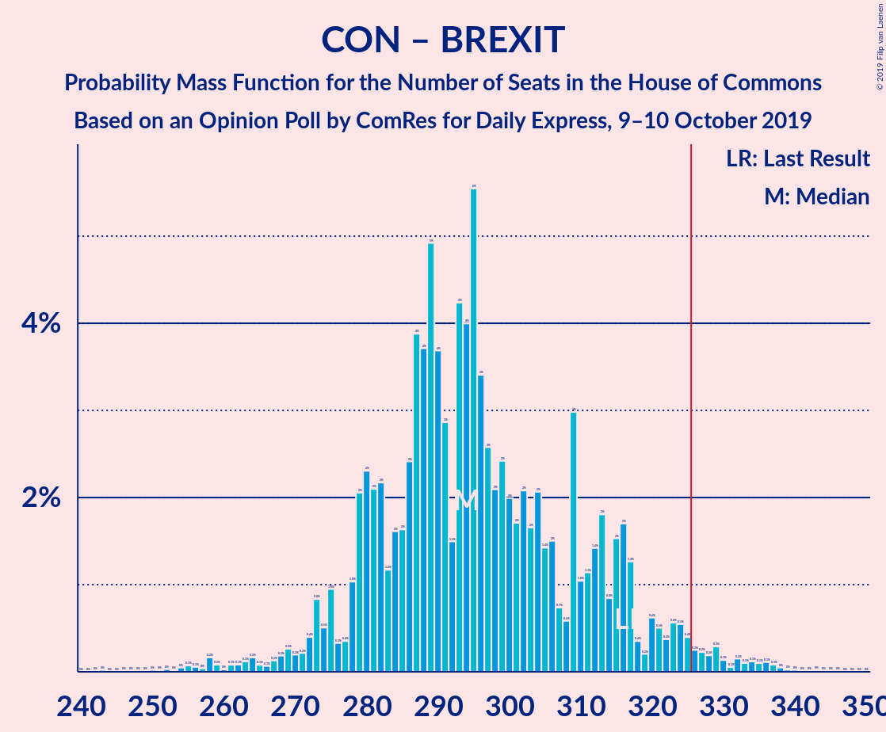

| Number of Seats | Probability | Accumulated | Special Marks |
|:---------------:|:-----------:|:-----------:|:-------------:|
| 243 | 0% | 100% |  |
| 244 | 0% | 99.9% |  |
| 245 | 0% | 99.9% |  |
| 246 | 0% | 99.9% |  |
| 247 | 0% | 99.9% |  |
| 248 | 0% | 99.9% |  |
| 249 | 0% | 99.9% |  |
| 250 | 0% | 99.9% |  |
| 251 | 0% | 99.9% |  |
| 252 | 0% | 99.9% |  |
| 253 | 0% | 99.8% |  |
| 254 | 0% | 99.8% |  |
| 255 | 0.1% | 99.8% |  |
| 256 | 0.1% | 99.7% |  |
| 257 | 0% | 99.6% |  |
| 258 | 0.2% | 99.6% |  |
| 259 | 0.1% | 99.4% |  |
| 260 | 0% | 99.4% |  |
| 261 | 0.1% | 99.3% |  |
| 262 | 0.1% | 99.2% |  |
| 263 | 0.1% | 99.2% |  |
| 264 | 0.2% | 99.0% |  |
| 265 | 0.1% | 98.9% |  |
| 266 | 0.1% | 98.8% |  |
| 267 | 0.1% | 98.7% |  |
| 268 | 0.2% | 98.6% |  |
| 269 | 0.3% | 98% |  |
| 270 | 0.2% | 98% |  |
| 271 | 0.2% | 98% |  |
| 272 | 0.4% | 98% |  |
| 273 | 0.8% | 97% |  |
| 274 | 0.5% | 97% |  |
| 275 | 1.0% | 96% |  |
| 276 | 0.3% | 95% |  |
| 277 | 0.4% | 95% |  |
| 278 | 1.0% | 94% |  |
| 279 | 2% | 93% |  |
| 280 | 2% | 91% |  |
| 281 | 2% | 89% |  |
| 282 | 2% | 87% |  |
| 283 | 1.2% | 85% |  |
| 284 | 2% | 84% |  |
| 285 | 2% | 82% |  |
| 286 | 2% | 80% |  |
| 287 | 4% | 78% |  |
| 288 | 4% | 74% |  |
| 289 | 5% | 70% |  |
| 290 | 4% | 65% |  |
| 291 | 3% | 62% |  |
| 292 | 1.5% | 59% |  |
| 293 | 4% | 57% |  |
| 294 | 4% | 53% | Median |
| 295 | 6% | 49% |  |
| 296 | 3% | 44% |  |
| 297 | 3% | 40% |  |
| 298 | 2% | 38% |  |
| 299 | 2% | 35% |  |
| 300 | 2% | 33% |  |
| 301 | 2% | 31% |  |
| 302 | 2% | 29% |  |
| 303 | 2% | 27% |  |
| 304 | 2% | 26% |  |
| 305 | 1.4% | 24% |  |
| 306 | 2% | 22% |  |
| 307 | 0.7% | 21% |  |
| 308 | 0.6% | 20% |  |
| 309 | 3% | 19% |  |
| 310 | 1.0% | 16% |  |
| 311 | 1.1% | 15% |  |
| 312 | 1.4% | 14% |  |
| 313 | 2% | 13% |  |
| 314 | 0.8% | 11% |  |
| 315 | 2% | 10% |  |
| 316 | 2% | 9% |  |
| 317 | 1.3% | 7% | Last Result |
| 318 | 0.4% | 6% |  |
| 319 | 0.2% | 5% |  |
| 320 | 0.6% | 5% |  |
| 321 | 0.5% | 4% |  |
| 322 | 0.4% | 4% |  |
| 323 | 0.6% | 3% |  |
| 324 | 0.5% | 3% |  |
| 325 | 0.4% | 2% |  |
| 326 | 0.3% | 2% | Majority |
| 327 | 0.2% | 2% |  |
| 328 | 0.2% | 2% |  |
| 329 | 0.3% | 1.3% |  |
| 330 | 0.1% | 1.0% |  |
| 331 | 0.1% | 0.9% |  |
| 332 | 0.2% | 0.8% |  |
| 333 | 0.1% | 0.7% |  |
| 334 | 0.1% | 0.6% |  |
| 335 | 0.1% | 0.5% |  |
| 336 | 0.1% | 0.4% |  |
| 337 | 0.1% | 0.3% |  |
| 338 | 0% | 0.2% |  |
| 339 | 0% | 0.1% |  |
| 340 | 0% | 0.1% |  |
| 341 | 0% | 0.1% |  |
| 342 | 0% | 0.1% |  |
| 343 | 0% | 0.1% |  |
| 344 | 0% | 0% |  |

### Conservative Party

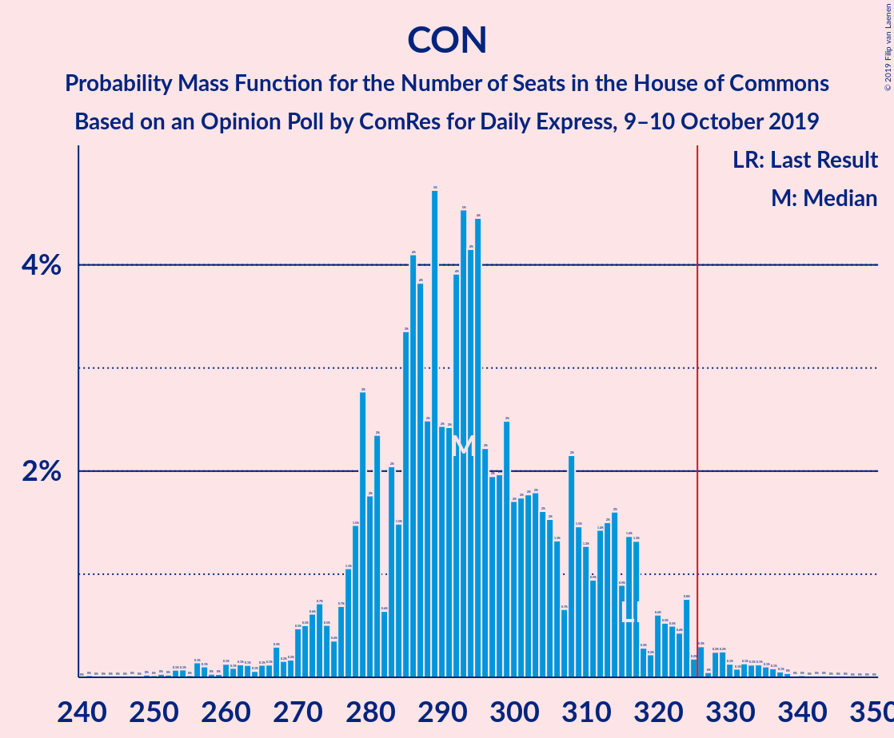

| Number of Seats | Probability | Accumulated | Special Marks |
|:---------------:|:-----------:|:-----------:|:-------------:|
| 242 | 0% | 100% |  |
| 243 | 0% | 99.9% |  |
| 244 | 0% | 99.9% |  |
| 245 | 0% | 99.9% |  |
| 246 | 0% | 99.9% |  |
| 247 | 0% | 99.9% |  |
| 248 | 0% | 99.9% |  |
| 249 | 0% | 99.9% |  |
| 250 | 0% | 99.9% |  |
| 251 | 0% | 99.8% |  |
| 252 | 0% | 99.8% |  |
| 253 | 0.1% | 99.8% |  |
| 254 | 0.1% | 99.7% |  |
| 255 | 0% | 99.6% |  |
| 256 | 0.1% | 99.6% |  |
| 257 | 0.1% | 99.5% |  |
| 258 | 0% | 99.4% |  |
| 259 | 0% | 99.3% |  |
| 260 | 0.1% | 99.3% |  |
| 261 | 0.1% | 99.2% |  |
| 262 | 0.1% | 99.1% |  |
| 263 | 0.1% | 99.0% |  |
| 264 | 0.1% | 98.9% |  |
| 265 | 0.1% | 98.8% |  |
| 266 | 0.1% | 98.7% |  |
| 267 | 0.3% | 98.5% |  |
| 268 | 0.2% | 98% |  |
| 269 | 0.2% | 98% |  |
| 270 | 0.5% | 98% |  |
| 271 | 0.5% | 97% |  |
| 272 | 0.6% | 97% |  |
| 273 | 0.7% | 96% |  |
| 274 | 0.5% | 96% |  |
| 275 | 0.4% | 95% |  |
| 276 | 0.7% | 95% |  |
| 277 | 1.1% | 94% |  |
| 278 | 1.5% | 93% |  |
| 279 | 3% | 92% |  |
| 280 | 2% | 89% |  |
| 281 | 2% | 87% |  |
| 282 | 0.6% | 85% |  |
| 283 | 2% | 84% |  |
| 284 | 1.5% | 82% |  |
| 285 | 3% | 80% |  |
| 286 | 4% | 77% |  |
| 287 | 4% | 73% |  |
| 288 | 2% | 69% |  |
| 289 | 5% | 67% |  |
| 290 | 2% | 62% |  |
| 291 | 2% | 60% |  |
| 292 | 4% | 57% |  |
| 293 | 5% | 53% | Median |
| 294 | 4% | 49% |  |
| 295 | 4% | 45% |  |
| 296 | 2% | 40% |  |
| 297 | 2% | 38% |  |
| 298 | 2% | 36% |  |
| 299 | 2% | 34% |  |
| 300 | 2% | 31% |  |
| 301 | 2% | 30% |  |
| 302 | 2% | 28% |  |
| 303 | 2% | 26% |  |
| 304 | 2% | 24% |  |
| 305 | 2% | 23% |  |
| 306 | 1.3% | 21% |  |
| 307 | 0.7% | 20% |  |
| 308 | 2% | 19% |  |
| 309 | 1.5% | 17% |  |
| 310 | 1.3% | 16% |  |
| 311 | 0.9% | 14% |  |
| 312 | 1.4% | 13% |  |
| 313 | 2% | 12% |  |
| 314 | 2% | 11% |  |
| 315 | 0.9% | 9% |  |
| 316 | 1.4% | 8% |  |
| 317 | 1.3% | 7% | Last Result |
| 318 | 0.3% | 5% |  |
| 319 | 0.2% | 5% |  |
| 320 | 0.6% | 5% |  |
| 321 | 0.5% | 4% |  |
| 322 | 0.5% | 4% |  |
| 323 | 0.4% | 3% |  |
| 324 | 0.8% | 3% |  |
| 325 | 0.2% | 2% |  |
| 326 | 0.3% | 2% | Majority |
| 327 | 0% | 2% |  |
| 328 | 0.2% | 1.5% |  |
| 329 | 0.2% | 1.2% |  |
| 330 | 0.1% | 1.0% |  |
| 331 | 0.1% | 0.9% |  |
| 332 | 0.1% | 0.8% |  |
| 333 | 0.1% | 0.6% |  |
| 334 | 0.1% | 0.5% |  |
| 335 | 0.1% | 0.4% |  |
| 336 | 0.1% | 0.3% |  |
| 337 | 0.1% | 0.2% |  |
| 338 | 0% | 0.2% |  |
| 339 | 0% | 0.1% |  |
| 340 | 0% | 0.1% |  |
| 341 | 0% | 0.1% |  |
| 342 | 0% | 0.1% |  |
| 343 | 0% | 0.1% |  |
| 344 | 0% | 0% |  |

### Labour Party – Liberal Democrats

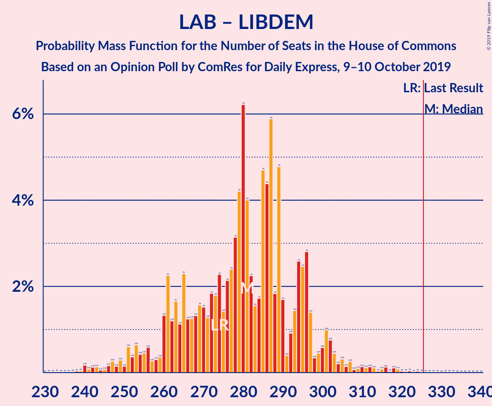

| Number of Seats | Probability | Accumulated | Special Marks |
|:---------------:|:-----------:|:-----------:|:-------------:|
| 234 | 0% | 100% |  |
| 235 | 0% | 99.9% |  |
| 236 | 0% | 99.9% |  |
| 237 | 0% | 99.9% |  |
| 238 | 0% | 99.9% |  |
| 239 | 0% | 99.9% |  |
| 240 | 0.2% | 99.8% |  |
| 241 | 0.1% | 99.7% |  |
| 242 | 0.1% | 99.6% |  |
| 243 | 0.1% | 99.4% |  |
| 244 | 0.1% | 99.3% |  |
| 245 | 0.1% | 99.3% |  |
| 246 | 0.2% | 99.2% |  |
| 247 | 0.3% | 99.0% |  |
| 248 | 0.1% | 98.8% |  |
| 249 | 0.3% | 98.6% |  |
| 250 | 0.1% | 98% |  |
| 251 | 0.6% | 98% |  |
| 252 | 0.4% | 98% |  |
| 253 | 0.6% | 97% |  |
| 254 | 0.4% | 97% |  |
| 255 | 0.5% | 96% |  |
| 256 | 0.6% | 96% |  |
| 257 | 0.3% | 95% |  |
| 258 | 0.3% | 95% |  |
| 259 | 0.4% | 95% |  |
| 260 | 1.3% | 94% |  |
| 261 | 2% | 93% |  |
| 262 | 1.2% | 91% |  |
| 263 | 2% | 89% |  |
| 264 | 1.1% | 88% |  |
| 265 | 2% | 87% |  |
| 266 | 1.2% | 84% |  |
| 267 | 1.3% | 83% |  |
| 268 | 1.3% | 82% |  |
| 269 | 2% | 80% |  |
| 270 | 2% | 79% |  |
| 271 | 1.3% | 77% |  |
| 272 | 2% | 76% |  |
| 273 | 2% | 74% |  |
| 274 | 2% | 72% | Last Result |
| 275 | 1.4% | 70% |  |
| 276 | 2% | 69% |  |
| 277 | 2% | 67% |  |
| 278 | 3% | 64% |  |
| 279 | 4% | 61% |  |
| 280 | 6% | 57% |  |
| 281 | 4% | 51% | Median |
| 282 | 2% | 47% |  |
| 283 | 2% | 44% |  |
| 284 | 2% | 43% |  |
| 285 | 5% | 41% |  |
| 286 | 4% | 36% |  |
| 287 | 6% | 32% |  |
| 288 | 2% | 26% |  |
| 289 | 5% | 24% |  |
| 290 | 2% | 20% |  |
| 291 | 0.4% | 18% |  |
| 292 | 0.9% | 17% |  |
| 293 | 1.4% | 17% |  |
| 294 | 3% | 15% |  |
| 295 | 2% | 13% |  |
| 296 | 3% | 10% |  |
| 297 | 1.4% | 7% |  |
| 298 | 0.3% | 6% |  |
| 299 | 0.4% | 6% |  |
| 300 | 0.6% | 5% |  |
| 301 | 1.0% | 4% |  |
| 302 | 0.8% | 3% |  |
| 303 | 0.4% | 3% |  |
| 304 | 0.2% | 2% |  |
| 305 | 0.3% | 2% |  |
| 306 | 0.1% | 2% |  |
| 307 | 0.3% | 2% |  |
| 308 | 0.1% | 1.4% |  |
| 309 | 0.1% | 1.3% |  |
| 310 | 0.1% | 1.2% |  |
| 311 | 0.1% | 1.1% |  |
| 312 | 0.1% | 1.0% |  |
| 313 | 0.1% | 0.8% |  |
| 314 | 0% | 0.7% |  |
| 315 | 0.1% | 0.7% |  |
| 316 | 0.1% | 0.6% |  |
| 317 | 0% | 0.5% |  |
| 318 | 0.1% | 0.5% |  |
| 319 | 0.1% | 0.3% |  |
| 320 | 0% | 0.3% |  |
| 321 | 0% | 0.2% |  |
| 322 | 0% | 0.2% |  |
| 323 | 0% | 0.2% |  |
| 324 | 0% | 0.2% |  |
| 325 | 0% | 0.1% |  |
| 326 | 0% | 0.1% | Majority |
| 327 | 0% | 0.1% |  |
| 328 | 0% | 0.1% |  |
| 329 | 0% | 0.1% |  |
| 330 | 0% | 0.1% |  |
| 331 | 0% | 0.1% |  |
| 332 | 0% | 0% |  |

### Labour Party – Scottish National Party

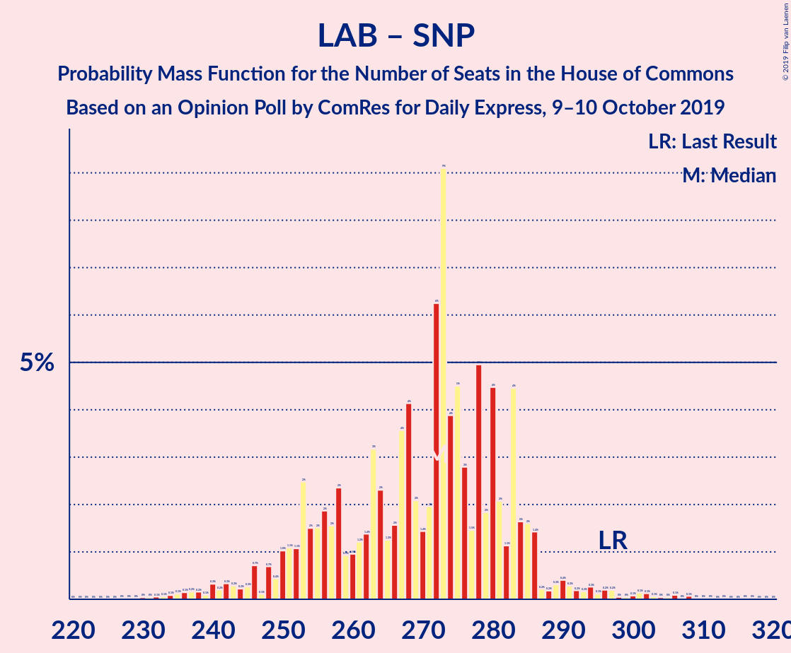

| Number of Seats | Probability | Accumulated | Special Marks |
|:---------------:|:-----------:|:-----------:|:-------------:|
| 229 | 0% | 100% |  |
| 230 | 0% | 99.9% |  |
| 231 | 0% | 99.9% |  |
| 232 | 0.1% | 99.9% |  |
| 233 | 0.1% | 99.8% |  |
| 234 | 0.1% | 99.7% |  |
| 235 | 0.1% | 99.7% |  |
| 236 | 0.1% | 99.5% |  |
| 237 | 0.2% | 99.4% |  |
| 238 | 0.2% | 99.2% |  |
| 239 | 0.1% | 99.1% |  |
| 240 | 0.3% | 99.0% |  |
| 241 | 0.2% | 98.7% |  |
| 242 | 0.3% | 98% |  |
| 243 | 0.3% | 98% |  |
| 244 | 0.2% | 98% |  |
| 245 | 0.3% | 98% |  |
| 246 | 0.7% | 97% |  |
| 247 | 0.1% | 97% |  |
| 248 | 0.7% | 97% |  |
| 249 | 0.4% | 96% |  |
| 250 | 1.0% | 95% |  |
| 251 | 1.1% | 94% |  |
| 252 | 1.1% | 93% |  |
| 253 | 2% | 92% |  |
| 254 | 2% | 90% |  |
| 255 | 2% | 88% |  |
| 256 | 2% | 87% |  |
| 257 | 2% | 85% |  |
| 258 | 2% | 83% |  |
| 259 | 0.9% | 81% |  |
| 260 | 1.0% | 80% |  |
| 261 | 1.2% | 79% |  |
| 262 | 1.4% | 78% |  |
| 263 | 3% | 76% |  |
| 264 | 2% | 73% |  |
| 265 | 1.3% | 71% |  |
| 266 | 2% | 70% |  |
| 267 | 4% | 68% |  |
| 268 | 4% | 65% |  |
| 269 | 2% | 60% |  |
| 270 | 1.4% | 58% |  |
| 271 | 2% | 57% |  |
| 272 | 6% | 55% |  |
| 273 | 9% | 49% | Median |
| 274 | 4% | 40% |  |
| 275 | 5% | 36% |  |
| 276 | 3% | 31% |  |
| 277 | 1.5% | 28% |  |
| 278 | 5% | 27% |  |
| 279 | 2% | 22% |  |
| 280 | 4% | 20% |  |
| 281 | 2% | 16% |  |
| 282 | 1.1% | 14% |  |
| 283 | 4% | 13% |  |
| 284 | 2% | 8% |  |
| 285 | 2% | 6% |  |
| 286 | 1.4% | 5% |  |
| 287 | 0.2% | 3% |  |
| 288 | 0.2% | 3% |  |
| 289 | 0.3% | 3% |  |
| 290 | 0.4% | 3% |  |
| 291 | 0.3% | 2% |  |
| 292 | 0.2% | 2% |  |
| 293 | 0.2% | 2% |  |
| 294 | 0.3% | 2% |  |
| 295 | 0.1% | 1.4% |  |
| 296 | 0.2% | 1.3% |  |
| 297 | 0.2% | 1.1% | Last Result |
| 298 | 0% | 0.9% |  |
| 299 | 0% | 0.8% |  |
| 300 | 0.1% | 0.8% |  |
| 301 | 0.1% | 0.7% |  |
| 302 | 0.1% | 0.6% |  |
| 303 | 0.1% | 0.5% |  |
| 304 | 0% | 0.4% |  |
| 305 | 0% | 0.4% |  |
| 306 | 0.1% | 0.3% |  |
| 307 | 0% | 0.2% |  |
| 308 | 0.1% | 0.2% |  |
| 309 | 0% | 0.1% |  |
| 310 | 0% | 0.1% |  |
| 311 | 0% | 0.1% |  |
| 312 | 0% | 0.1% |  |
| 313 | 0% | 0.1% |  |
| 314 | 0% | 0.1% |  |
| 315 | 0% | 0.1% |  |
| 316 | 0% | 0.1% |  |
| 317 | 0% | 0% |  |

### Labour Party

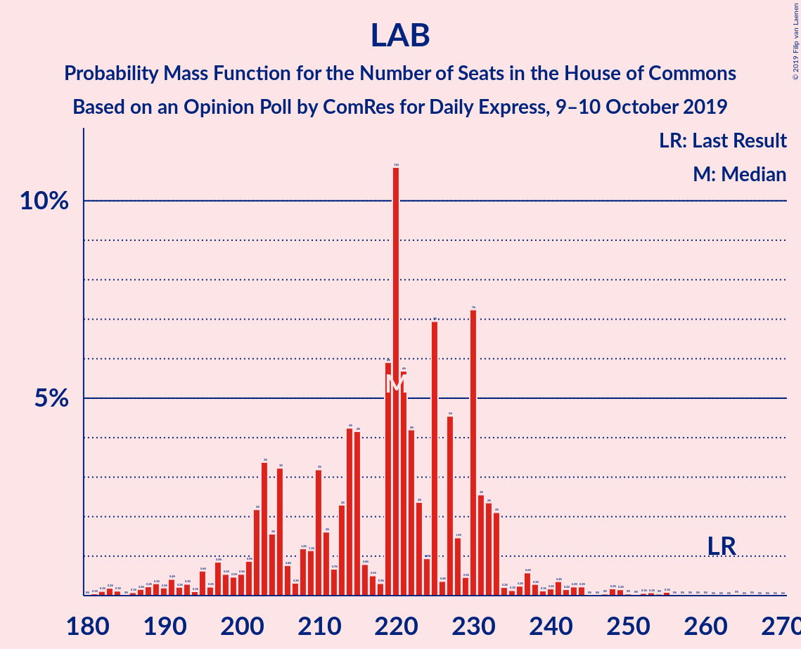

| Number of Seats | Probability | Accumulated | Special Marks |
|:---------------:|:-----------:|:-----------:|:-------------:|
| 180 | 0% | 100% |  |
| 181 | 0.1% | 99.9% |  |
| 182 | 0.1% | 99.9% |  |
| 183 | 0.2% | 99.8% |  |
| 184 | 0.1% | 99.6% |  |
| 185 | 0% | 99.5% |  |
| 186 | 0.1% | 99.4% |  |
| 187 | 0.2% | 99.4% |  |
| 188 | 0.2% | 99.2% |  |
| 189 | 0.3% | 99.0% |  |
| 190 | 0.2% | 98.7% |  |
| 191 | 0.4% | 98% |  |
| 192 | 0.2% | 98% |  |
| 193 | 0.3% | 98% |  |
| 194 | 0.1% | 98% |  |
| 195 | 0.6% | 97% |  |
| 196 | 0.2% | 97% |  |
| 197 | 0.9% | 97% |  |
| 198 | 0.5% | 96% |  |
| 199 | 0.5% | 95% |  |
| 200 | 0.5% | 95% |  |
| 201 | 0.9% | 94% |  |
| 202 | 2% | 93% |  |
| 203 | 3% | 91% |  |
| 204 | 2% | 88% |  |
| 205 | 3% | 86% |  |
| 206 | 0.8% | 83% |  |
| 207 | 0.3% | 82% |  |
| 208 | 1.2% | 82% |  |
| 209 | 1.1% | 81% |  |
| 210 | 3% | 79% |  |
| 211 | 2% | 76% |  |
| 212 | 0.7% | 75% |  |
| 213 | 2% | 74% |  |
| 214 | 4% | 72% |  |
| 215 | 4% | 67% |  |
| 216 | 0.8% | 63% |  |
| 217 | 0.5% | 63% |  |
| 218 | 0.3% | 62% |  |
| 219 | 6% | 62% |  |
| 220 | 11% | 56% | Median |
| 221 | 6% | 45% |  |
| 222 | 4% | 39% |  |
| 223 | 2% | 35% |  |
| 224 | 0.9% | 33% |  |
| 225 | 7% | 32% |  |
| 226 | 0.4% | 25% |  |
| 227 | 5% | 24% |  |
| 228 | 1.5% | 20% |  |
| 229 | 0.5% | 18% |  |
| 230 | 7% | 18% |  |
| 231 | 3% | 11% |  |
| 232 | 2% | 8% |  |
| 233 | 2% | 6% |  |
| 234 | 0.2% | 4% |  |
| 235 | 0.1% | 3% |  |
| 236 | 0.2% | 3% |  |
| 237 | 0.6% | 3% |  |
| 238 | 0.3% | 2% |  |
| 239 | 0.1% | 2% |  |
| 240 | 0.2% | 2% |  |
| 241 | 0.4% | 2% |  |
| 242 | 0.2% | 2% |  |
| 243 | 0.2% | 1.4% |  |
| 244 | 0.2% | 1.2% |  |
| 245 | 0% | 0.9% |  |
| 246 | 0% | 0.9% |  |
| 247 | 0% | 0.9% |  |
| 248 | 0.2% | 0.8% |  |
| 249 | 0.2% | 0.7% |  |
| 250 | 0% | 0.5% |  |
| 251 | 0% | 0.5% |  |
| 252 | 0.1% | 0.4% |  |
| 253 | 0.1% | 0.4% |  |
| 254 | 0% | 0.3% |  |
| 255 | 0.1% | 0.2% |  |
| 256 | 0% | 0.1% |  |
| 257 | 0% | 0.1% |  |
| 258 | 0% | 0.1% |  |
| 259 | 0% | 0.1% |  |
| 260 | 0% | 0.1% |  |
| 261 | 0% | 0.1% |  |
| 262 | 0% | 0.1% | Last Result |
| 263 | 0% | 0.1% |  |
| 264 | 0% | 0.1% |  |
| 265 | 0% | 0% |  |

## Technical Information

### Opinion Poll

+ **Polling firm:** ComRes
+ **Commissioner(s):** Daily Express
+ **Fieldwork period:** 9–10 October 2019

### Calculations

+ **Sample size:** 2018
+ **Simulations done:** 1,048,576
+ **Error estimate:** 1.07%

