# Opinion Poll by YouGov, 24–25 October 2019

<a href="#voting-intentions">Voting Intentions</a> | <a href="#seats">Seats</a> | <a href="#coalitions">Coalitions</a> | <a href="#technical-information">Technical Information</a>

## Voting Intentions

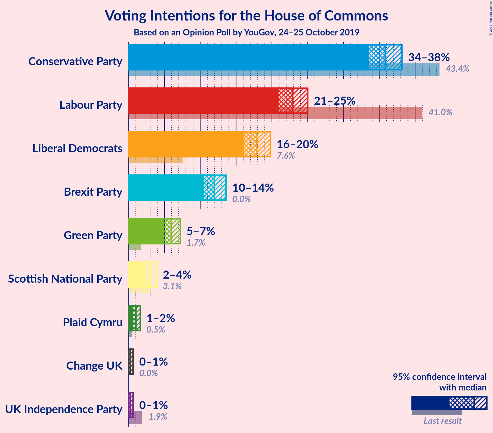

### Confidence Intervals

| Party | Last Result | Poll Result | 80% Confidence Interval | 90% Confidence Interval | 95% Confidence Interval | 99% Confidence Interval |
|:-----:|:-----------:|:-----------:|:-----------------------:|:-----------------------:|:-----------------------:|:-----------------------:|
| Conservative Party | 43.4% | 35.8% | 34.3–37.4% |33.9–37.8% |33.6–38.2% |32.8–38.9% |
| Labour Party | 41.0% | 22.9% | 21.6–24.3% |21.3–24.7% |20.9–25.0% |20.3–25.7% |
| Liberal Democrats | 7.6% | 17.9% | 16.7–19.1% |16.4–19.5% |16.1–19.8% |15.6–20.4% |
| Brexit Party | 0.0% | 12.0% | 11.0–13.0% |10.7–13.4% |10.5–13.6% |10.0–14.1% |
| Green Party | 1.7% | 6.0% | 5.3–6.8% |5.1–7.0% |4.9–7.2% |4.6–7.6% |
| Scottish National Party | 3.1% | 3.0% | 2.5–3.6% |2.4–3.8% |2.3–3.9% |2.1–4.2% |
| Plaid Cymru | 0.5% | 1.0% | 0.8–1.4% |0.7–1.5% |0.6–1.6% |0.5–1.8% |
| UK Independence Party | 1.9% | 0.2% | 0.1–0.5% |0.1–0.5% |0.1–0.6% |0.1–0.8% |
| Change UK | 0.0% | 0.2% | 0.1–0.5% |0.1–0.5% |0.1–0.6% |0.1–0.8% |

*Note:* The poll result column reflects the actual value used in the calculations. Published results may vary slightly, and in addition be rounded to fewer digits.

## Seats

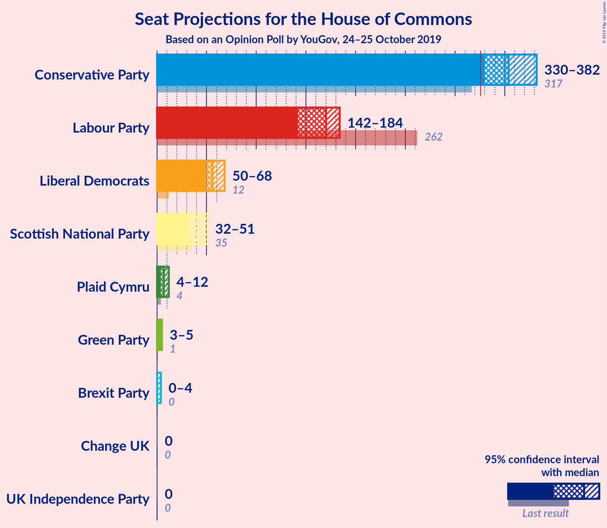

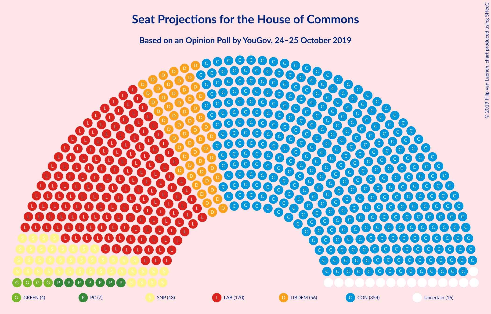

### Confidence Intervals

| Party | Last Result | Median | 80% Confidence Interval | 90% Confidence Interval | 95% Confidence Interval | 99% Confidence Interval |
|:-----:|:-----------:|:------:|:-----------------------:|:-----------------------:|:-----------------------:|:-----------------------:|
| <a href="#conservative-party">Conservative Party</a> | 317 | 354 | 341–371 |335–375 |330–382 |319–389 |
| <a href="#labour-party">Labour Party</a> | 262 | 170 | 150–177 |144–180 |142–184 |135–193 |
| <a href="#liberal-democrats">Liberal Democrats</a> | 12 | 56 | 51–63 |50–65 |50–68 |49–71 |
| <a href="#brexit-party">Brexit Party</a> | 0 | 0 | 0–1 |0–2 |0–4 |0–6 |
| <a href="#green-party">Green Party</a> | 1 | 4 | 3–5 |3–5 |3–5 |2–5 |
| <a href="#scottish-national-party">Scottish National Party</a> | 35 | 43 | 37–48 |34–49 |32–51 |31–53 |
| <a href="#plaid-cymru">Plaid Cymru</a> | 4 | 7 | 5–11 |4–11 |4–12 |4–13 |
| <a href="#uk-independence-party">UK Independence Party</a> | 0 | 0 | 0 |0 |0 |0 |
| <a href="#change-uk">Change UK</a> | 0 | 0 | 0 |0 |0 |0 |

### Conservative Party

*For a full overview of the results for this party, see the [Conservative Party](party-conservativeparty.html) page.*

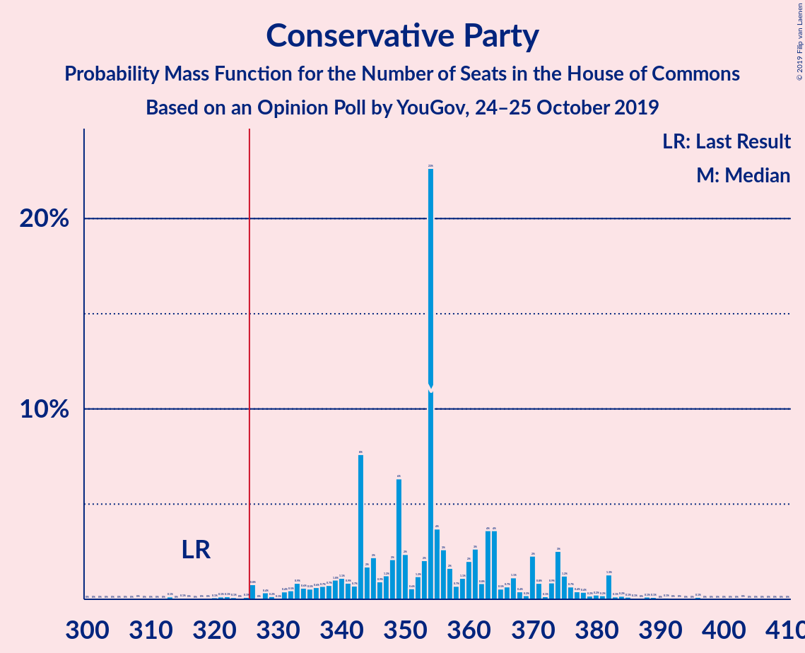

| Number of Seats | Probability | Accumulated | Special Marks |
|:---------------:|:-----------:|:-----------:|:-------------:|
| 304 | 0% | 100% |  |
| 305 | 0% | 99.9% |  |
| 306 | 0% | 99.9% |  |
| 307 | 0% | 99.9% |  |
| 308 | 0% | 99.9% |  |
| 309 | 0% | 99.9% |  |
| 310 | 0% | 99.9% |  |
| 311 | 0% | 99.8% |  |
| 312 | 0% | 99.8% |  |
| 313 | 0.1% | 99.8% |  |
| 314 | 0% | 99.7% |  |
| 315 | 0.1% | 99.7% |  |
| 316 | 0% | 99.6% |  |
| 317 | 0% | 99.6% | Last Result |
| 318 | 0% | 99.6% |  |
| 319 | 0% | 99.5% |  |
| 320 | 0.1% | 99.5% |  |
| 321 | 0.1% | 99.4% |  |
| 322 | 0.1% | 99.3% |  |
| 323 | 0.1% | 99.1% |  |
| 324 | 0% | 99.0% |  |
| 325 | 0.1% | 99.0% |  |
| 326 | 0.8% | 98.9% | Majority |
| 327 | 0% | 98% |  |
| 328 | 0.4% | 98% |  |
| 329 | 0.2% | 98% |  |
| 330 | 0.1% | 98% |  |
| 331 | 0.4% | 97% |  |
| 332 | 0.5% | 97% |  |
| 333 | 0.9% | 97% |  |
| 334 | 0.6% | 96% |  |
| 335 | 0.5% | 95% |  |
| 336 | 0.6% | 95% |  |
| 337 | 0.7% | 94% |  |
| 338 | 0.7% | 93% |  |
| 339 | 1.0% | 93% |  |
| 340 | 1.1% | 92% |  |
| 341 | 0.9% | 90% |  |
| 342 | 0.7% | 90% |  |
| 343 | 8% | 89% |  |
| 344 | 2% | 81% |  |
| 345 | 2% | 80% |  |
| 346 | 0.9% | 77% |  |
| 347 | 1.2% | 76% |  |
| 348 | 2% | 75% |  |
| 349 | 6% | 73% |  |
| 350 | 2% | 67% |  |
| 351 | 0.6% | 64% |  |
| 352 | 1.2% | 64% |  |
| 353 | 2% | 63% |  |
| 354 | 23% | 61% | Median |
| 355 | 4% | 38% |  |
| 356 | 3% | 34% |  |
| 357 | 2% | 32% |  |
| 358 | 0.7% | 30% |  |
| 359 | 1.1% | 29% |  |
| 360 | 2% | 28% |  |
| 361 | 3% | 26% |  |
| 362 | 0.8% | 24% |  |
| 363 | 4% | 23% |  |
| 364 | 4% | 19% |  |
| 365 | 0.5% | 15% |  |
| 366 | 0.7% | 15% |  |
| 367 | 1.1% | 14% |  |
| 368 | 0.4% | 13% |  |
| 369 | 0.2% | 13% |  |
| 370 | 2% | 12% |  |
| 371 | 0.8% | 10% |  |
| 372 | 0.1% | 9% |  |
| 373 | 0.9% | 9% |  |
| 374 | 3% | 8% |  |
| 375 | 1.2% | 6% |  |
| 376 | 0.7% | 5% |  |
| 377 | 0.4% | 4% |  |
| 378 | 0.4% | 4% |  |
| 379 | 0.2% | 3% |  |
| 380 | 0.2% | 3% |  |
| 381 | 0.2% | 3% |  |
| 382 | 1.3% | 3% |  |
| 383 | 0.1% | 1.2% |  |
| 384 | 0.2% | 1.1% |  |
| 385 | 0.1% | 0.9% |  |
| 386 | 0.1% | 0.8% |  |
| 387 | 0% | 0.7% |  |
| 388 | 0.1% | 0.7% |  |
| 389 | 0.1% | 0.6% |  |
| 390 | 0% | 0.4% |  |
| 391 | 0.1% | 0.4% |  |
| 392 | 0% | 0.4% |  |
| 393 | 0% | 0.3% |  |
| 394 | 0% | 0.3% |  |
| 395 | 0% | 0.3% |  |
| 396 | 0.1% | 0.2% |  |
| 397 | 0% | 0.1% |  |
| 398 | 0% | 0.1% |  |
| 399 | 0% | 0.1% |  |
| 400 | 0% | 0.1% |  |
| 401 | 0% | 0.1% |  |
| 402 | 0% | 0.1% |  |
| 403 | 0% | 0.1% |  |
| 404 | 0% | 0% |  |

### Labour Party

*For a full overview of the results for this party, see the [Labour Party](party-labourparty.html) page.*

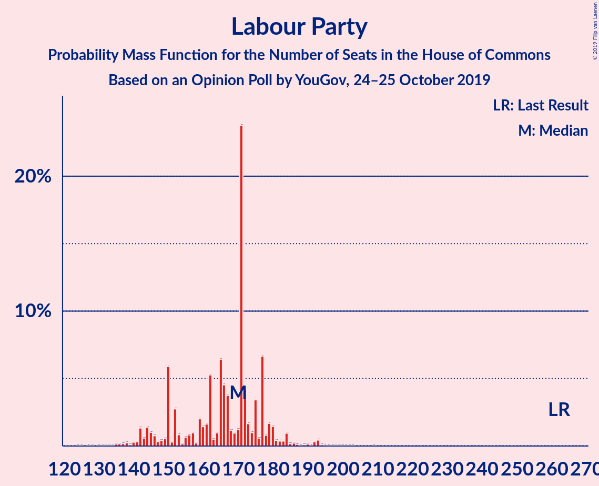

| Number of Seats | Probability | Accumulated | Special Marks |
|:---------------:|:-----------:|:-----------:|:-------------:|
| 126 | 0% | 100% |  |
| 127 | 0% | 99.9% |  |
| 128 | 0.1% | 99.9% |  |
| 129 | 0% | 99.9% |  |
| 130 | 0% | 99.9% |  |
| 131 | 0.1% | 99.8% |  |
| 132 | 0.1% | 99.8% |  |
| 133 | 0.1% | 99.7% |  |
| 134 | 0% | 99.7% |  |
| 135 | 0.1% | 99.6% |  |
| 136 | 0.2% | 99.5% |  |
| 137 | 0.2% | 99.3% |  |
| 138 | 0.2% | 99.1% |  |
| 139 | 0.1% | 98.9% |  |
| 140 | 0.3% | 98.8% |  |
| 141 | 0.3% | 98% |  |
| 142 | 1.3% | 98% |  |
| 143 | 0.6% | 97% |  |
| 144 | 1.4% | 96% |  |
| 145 | 1.0% | 95% |  |
| 146 | 0.8% | 94% |  |
| 147 | 0.3% | 93% |  |
| 148 | 0.4% | 93% |  |
| 149 | 0.5% | 92% |  |
| 150 | 6% | 92% |  |
| 151 | 0.3% | 86% |  |
| 152 | 3% | 86% |  |
| 153 | 0.8% | 83% |  |
| 154 | 0.2% | 82% |  |
| 155 | 0.6% | 82% |  |
| 156 | 0.8% | 81% |  |
| 157 | 1.0% | 80% |  |
| 158 | 0.2% | 79% |  |
| 159 | 2% | 79% |  |
| 160 | 1.4% | 77% |  |
| 161 | 2% | 76% |  |
| 162 | 5% | 74% |  |
| 163 | 0.5% | 69% |  |
| 164 | 1.0% | 68% |  |
| 165 | 6% | 67% |  |
| 166 | 5% | 61% |  |
| 167 | 4% | 56% |  |
| 168 | 1.2% | 53% |  |
| 169 | 1.0% | 51% |  |
| 170 | 1.2% | 51% | Median |
| 171 | 24% | 49% |  |
| 172 | 4% | 26% |  |
| 173 | 2% | 21% |  |
| 174 | 1.0% | 20% |  |
| 175 | 3% | 19% |  |
| 176 | 0.6% | 15% |  |
| 177 | 7% | 15% |  |
| 178 | 0.8% | 8% |  |
| 179 | 2% | 7% |  |
| 180 | 1.4% | 6% |  |
| 181 | 0.4% | 4% |  |
| 182 | 0.4% | 4% |  |
| 183 | 0.4% | 3% |  |
| 184 | 1.0% | 3% |  |
| 185 | 0.2% | 2% |  |
| 186 | 0.2% | 2% |  |
| 187 | 0.1% | 2% |  |
| 188 | 0% | 1.5% |  |
| 189 | 0.1% | 1.5% |  |
| 190 | 0.1% | 1.4% |  |
| 191 | 0% | 1.2% |  |
| 192 | 0.3% | 1.2% |  |
| 193 | 0.4% | 0.9% |  |
| 194 | 0.1% | 0.4% |  |
| 195 | 0% | 0.3% |  |
| 196 | 0% | 0.3% |  |
| 197 | 0% | 0.3% |  |
| 198 | 0.1% | 0.2% |  |
| 199 | 0.1% | 0.2% |  |
| 200 | 0% | 0.1% |  |
| 201 | 0% | 0.1% |  |
| 202 | 0% | 0.1% |  |
| 203 | 0% | 0.1% |  |
| 204 | 0% | 0.1% |  |
| 205 | 0% | 0% |  |
| 206 | 0% | 0% |  |
| 207 | 0% | 0% |  |
| 208 | 0% | 0% |  |
| 209 | 0% | 0% |  |
| 210 | 0% | 0% |  |
| 211 | 0% | 0% |  |
| 212 | 0% | 0% |  |
| 213 | 0% | 0% |  |
| 214 | 0% | 0% |  |
| 215 | 0% | 0% |  |
| 216 | 0% | 0% |  |
| 217 | 0% | 0% |  |
| 218 | 0% | 0% |  |
| 219 | 0% | 0% |  |
| 220 | 0% | 0% |  |
| 221 | 0% | 0% |  |
| 222 | 0% | 0% |  |
| 223 | 0% | 0% |  |
| 224 | 0% | 0% |  |
| 225 | 0% | 0% |  |
| 226 | 0% | 0% |  |
| 227 | 0% | 0% |  |
| 228 | 0% | 0% |  |
| 229 | 0% | 0% |  |
| 230 | 0% | 0% |  |
| 231 | 0% | 0% |  |
| 232 | 0% | 0% |  |
| 233 | 0% | 0% |  |
| 234 | 0% | 0% |  |
| 235 | 0% | 0% |  |
| 236 | 0% | 0% |  |
| 237 | 0% | 0% |  |
| 238 | 0% | 0% |  |
| 239 | 0% | 0% |  |
| 240 | 0% | 0% |  |
| 241 | 0% | 0% |  |
| 242 | 0% | 0% |  |
| 243 | 0% | 0% |  |
| 244 | 0% | 0% |  |
| 245 | 0% | 0% |  |
| 246 | 0% | 0% |  |
| 247 | 0% | 0% |  |
| 248 | 0% | 0% |  |
| 249 | 0% | 0% |  |
| 250 | 0% | 0% |  |
| 251 | 0% | 0% |  |
| 252 | 0% | 0% |  |
| 253 | 0% | 0% |  |
| 254 | 0% | 0% |  |
| 255 | 0% | 0% |  |
| 256 | 0% | 0% |  |
| 257 | 0% | 0% |  |
| 258 | 0% | 0% |  |
| 259 | 0% | 0% |  |
| 260 | 0% | 0% |  |
| 261 | 0% | 0% |  |
| 262 | 0% | 0% | Last Result |

### Liberal Democrats

*For a full overview of the results for this party, see the [Liberal Democrats](party-liberaldemocrats.html) page.*

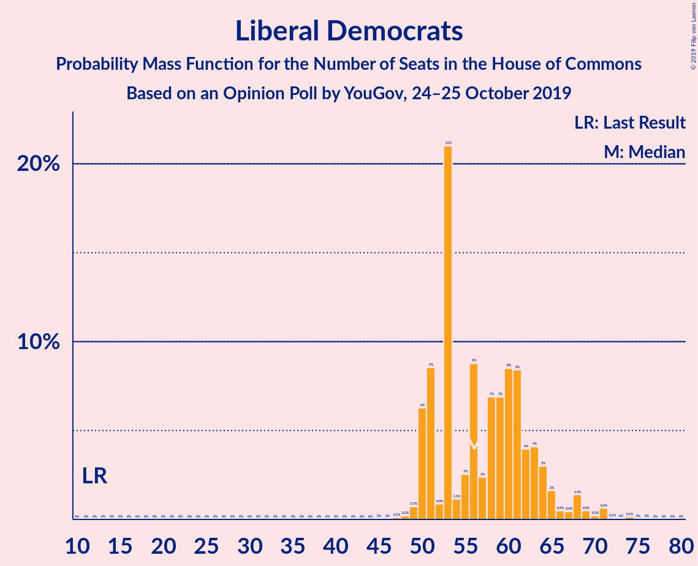

| Number of Seats | Probability | Accumulated | Special Marks |
|:---------------:|:-----------:|:-----------:|:-------------:|
| 12 | 0% | 100% | Last Result |
| 13 | 0% | 100% |  |
| 14 | 0% | 100% |  |
| 15 | 0% | 100% |  |
| 16 | 0% | 100% |  |
| 17 | 0% | 100% |  |
| 18 | 0% | 100% |  |
| 19 | 0% | 100% |  |
| 20 | 0% | 100% |  |
| 21 | 0% | 100% |  |
| 22 | 0% | 100% |  |
| 23 | 0% | 100% |  |
| 24 | 0% | 100% |  |
| 25 | 0% | 100% |  |
| 26 | 0% | 100% |  |
| 27 | 0% | 100% |  |
| 28 | 0% | 100% |  |
| 29 | 0% | 100% |  |
| 30 | 0% | 100% |  |
| 31 | 0% | 100% |  |
| 32 | 0% | 100% |  |
| 33 | 0% | 100% |  |
| 34 | 0% | 100% |  |
| 35 | 0% | 100% |  |
| 36 | 0% | 100% |  |
| 37 | 0% | 100% |  |
| 38 | 0% | 100% |  |
| 39 | 0% | 100% |  |
| 40 | 0% | 100% |  |
| 41 | 0% | 100% |  |
| 42 | 0% | 100% |  |
| 43 | 0% | 100% |  |
| 44 | 0% | 100% |  |
| 45 | 0% | 100% |  |
| 46 | 0% | 100% |  |
| 47 | 0.1% | 99.9% |  |
| 48 | 0.2% | 99.8% |  |
| 49 | 0.7% | 99.6% |  |
| 50 | 6% | 98.9% |  |
| 51 | 9% | 93% |  |
| 52 | 0.9% | 84% |  |
| 53 | 21% | 83% |  |
| 54 | 1.1% | 62% |  |
| 55 | 3% | 61% |  |
| 56 | 9% | 59% | Median |
| 57 | 2% | 50% |  |
| 58 | 7% | 47% |  |
| 59 | 7% | 40% |  |
| 60 | 8% | 34% |  |
| 61 | 8% | 25% |  |
| 62 | 4% | 17% |  |
| 63 | 4% | 13% |  |
| 64 | 3% | 9% |  |
| 65 | 2% | 6% |  |
| 66 | 0.5% | 4% |  |
| 67 | 0.4% | 4% |  |
| 68 | 1.4% | 3% |  |
| 69 | 0.5% | 2% |  |
| 70 | 0.2% | 1.2% |  |
| 71 | 0.6% | 1.0% |  |
| 72 | 0.1% | 0.3% |  |
| 73 | 0% | 0.3% |  |
| 74 | 0.1% | 0.2% |  |
| 75 | 0% | 0.1% |  |
| 76 | 0% | 0.1% |  |
| 77 | 0% | 0% |  |

### Brexit Party

*For a full overview of the results for this party, see the [Brexit Party](party-brexitparty.html) page.*

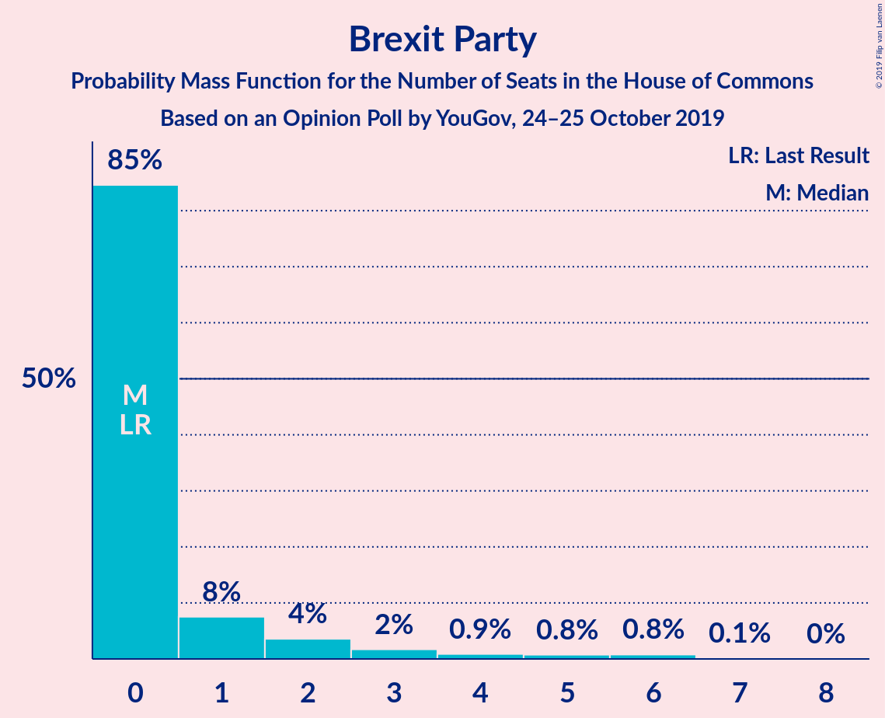

| Number of Seats | Probability | Accumulated | Special Marks |
|:---------------:|:-----------:|:-----------:|:-------------:|
| 0 | 85% | 100% | Last Result, Median |
| 1 | 8% | 15% |  |
| 2 | 4% | 8% |  |
| 3 | 2% | 4% |  |
| 4 | 0.9% | 3% |  |
| 5 | 0.8% | 2% |  |
| 6 | 0.8% | 0.9% |  |
| 7 | 0.1% | 0.1% |  |
| 8 | 0% | 0% |  |

### Green Party

*For a full overview of the results for this party, see the [Green Party](party-greenparty.html) page.*

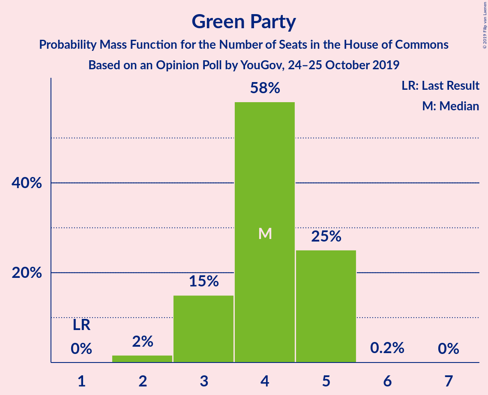

| Number of Seats | Probability | Accumulated | Special Marks |
|:---------------:|:-----------:|:-----------:|:-------------:|
| 1 | 0% | 100% | Last Result |
| 2 | 2% | 100% |  |
| 3 | 15% | 98% |  |
| 4 | 58% | 83% | Median |
| 5 | 25% | 25% |  |
| 6 | 0.2% | 0.2% |  |
| 7 | 0% | 0% |  |

### Scottish National Party

*For a full overview of the results for this party, see the [Scottish National Party](party-scottishnationalparty.html) page.*

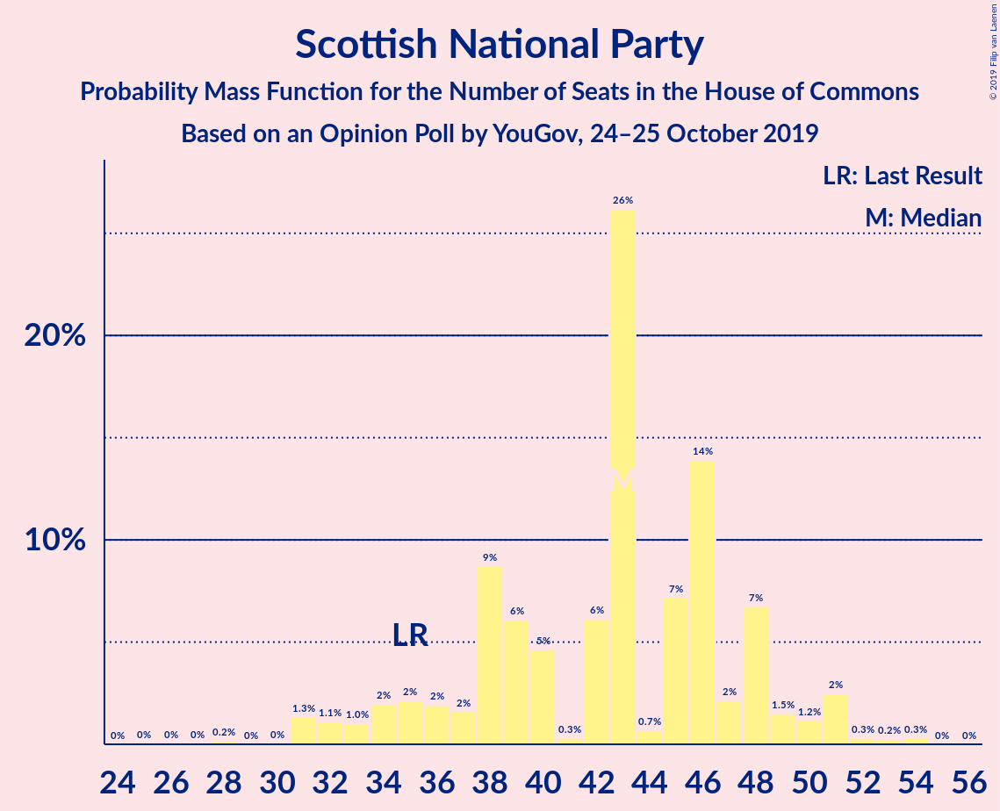

| Number of Seats | Probability | Accumulated | Special Marks |
|:---------------:|:-----------:|:-----------:|:-------------:|
| 25 | 0% | 100% |  |
| 26 | 0% | 99.9% |  |
| 27 | 0% | 99.9% |  |
| 28 | 0.2% | 99.9% |  |
| 29 | 0% | 99.7% |  |
| 30 | 0% | 99.7% |  |
| 31 | 1.3% | 99.7% |  |
| 32 | 1.1% | 98% |  |
| 33 | 1.0% | 97% |  |
| 34 | 2% | 96% |  |
| 35 | 2% | 94% | Last Result |
| 36 | 2% | 92% |  |
| 37 | 2% | 90% |  |
| 38 | 9% | 89% |  |
| 39 | 6% | 80% |  |
| 40 | 5% | 74% |  |
| 41 | 0.3% | 69% |  |
| 42 | 6% | 69% |  |
| 43 | 26% | 63% | Median |
| 44 | 0.7% | 37% |  |
| 45 | 7% | 36% |  |
| 46 | 14% | 29% |  |
| 47 | 2% | 15% |  |
| 48 | 7% | 13% |  |
| 49 | 1.5% | 6% |  |
| 50 | 1.2% | 4% |  |
| 51 | 2% | 3% |  |
| 52 | 0.3% | 0.8% |  |
| 53 | 0.2% | 0.6% |  |
| 54 | 0.3% | 0.3% |  |
| 55 | 0% | 0% |  |

### Plaid Cymru

*For a full overview of the results for this party, see the [Plaid Cymru](party-plaidcymru.html) page.*

| Number of Seats | Probability | Accumulated | Special Marks |
|:---------------:|:-----------:|:-----------:|:-------------:|
| 3 | 0.1% | 100% |  |
| 4 | 9% | 99.9% | Last Result |
| 5 | 5% | 91% |  |
| 6 | 4% | 86% |  |
| 7 | 42% | 82% | Median |
| 8 | 7% | 40% |  |
| 9 | 4% | 33% |  |
| 10 | 6% | 29% |  |
| 11 | 19% | 23% |  |
| 12 | 4% | 5% |  |
| 13 | 0.9% | 1.2% |  |
| 14 | 0.2% | 0.3% |  |
| 15 | 0% | 0% |  |

### UK Independence Party

*For a full overview of the results for this party, see the [UK Independence Party](party-ukindependenceparty.html) page.*

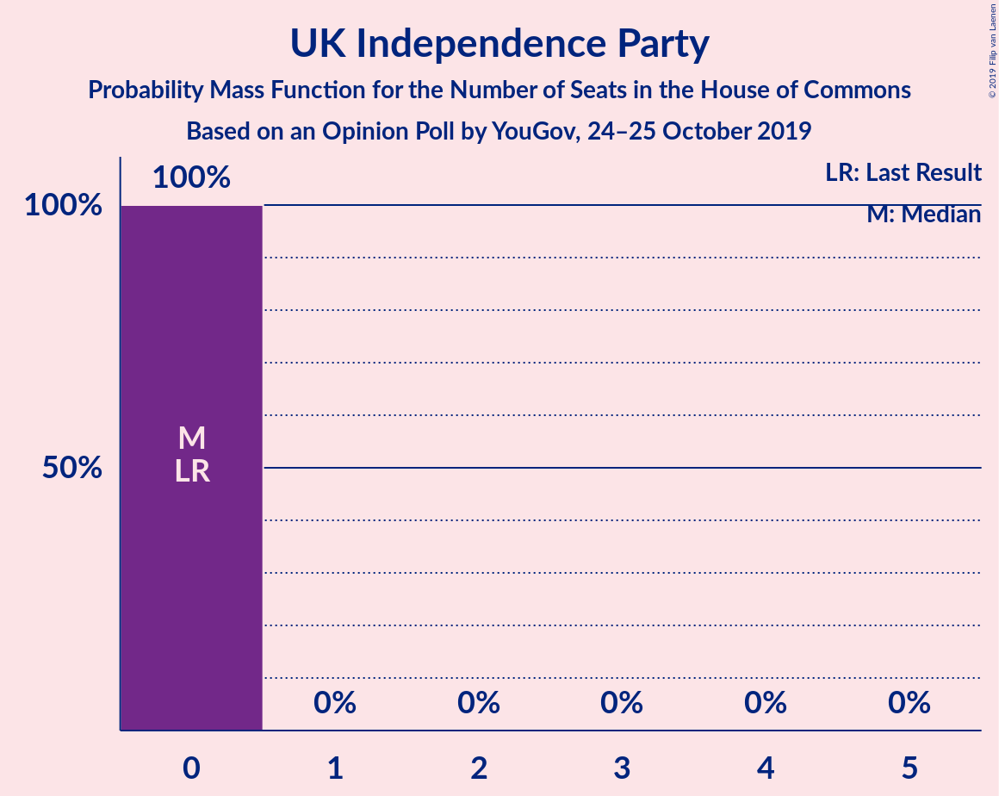

| Number of Seats | Probability | Accumulated | Special Marks |
|:---------------:|:-----------:|:-----------:|:-------------:|
| 0 | 100% | 100% | Last Result, Median |

### Change UK

*For a full overview of the results for this party, see the [Change UK](party-changeuk.html) page.*

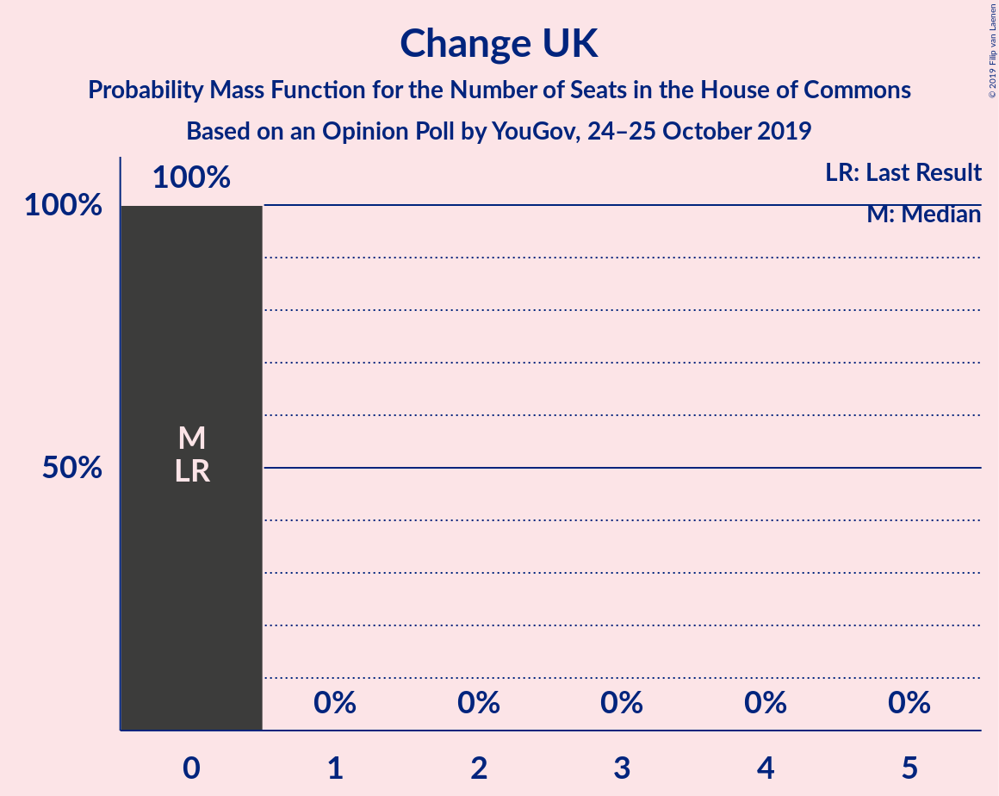

| Number of Seats | Probability | Accumulated | Special Marks |
|:---------------:|:-----------:|:-----------:|:-------------:|
| 0 | 100% | 100% | Last Result, Median |

## Coalitions

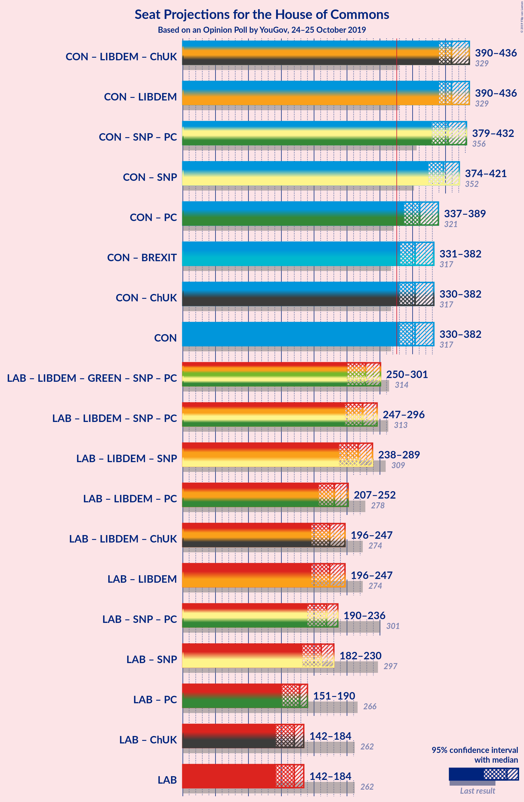

### Confidence Intervals

| Coalition | Last Result | Median | Majority? | 80% Confidence Interval | 90% Confidence Interval | 95% Confidence Interval | 99% Confidence Interval |
|:---------:|:-----------:|:------:|:---------:|:-----------------------:|:-----------------------:|:-----------------------:|:-----------------------:|
| Conservative Party – Liberal Democrats – Change UK | 329 | 409 | 100% | 401–426 | 397–433 | 390–436 | 382–446 |
| Conservative Party – Liberal Democrats | 329 | 409 | 100% | 401–426 | 397–433 | 390–436 | 382–446 |
| Conservative Party – Scottish National Party – Plaid Cymru | 356 | 404 | 100% | 391–419 | 385–428 | 379–432 | 370–438 |
| Conservative Party – Scottish National Party | 352 | 397 | 100% | 383–411 | 380–420 | 374–421 | 363–430 |
| Conservative Party – Plaid Cymru | 321 | 361 | 99.4% | 350–381 | 342–384 | 337–389 | 325–398 |
| Conservative Party – Brexit Party | 317 | 354 | 99.0% | 342–373 | 336–376 | 331–382 | 320–390 |
| Conservative Party – Change UK | 317 | 354 | 98.9% | 341–371 | 335–375 | 330–382 | 319–389 |
| Conservative Party | 317 | 354 | 98.9% | 341–371 | 335–375 | 330–382 | 319–389 |
| Labour Party – Liberal Democrats – Green Party – Scottish National Party – Plaid Cymru | 314 | 278 | 0.1% | 259–290 | 256–296 | 250–301 | 242–312 |
| Labour Party – Liberal Democrats – Scottish National Party – Plaid Cymru | 313 | 274 | 0% | 255–286 | 251–292 | 247–296 | 238–307 |
| Labour Party – Liberal Democrats – Scottish National Party | 309 | 267 | 0% | 246–278 | 242–285 | 238–289 | 229–303 |
| Labour Party – Liberal Democrats – Plaid Cymru | 278 | 231 | 0% | 216–245 | 207–247 | 207–252 | 197–262 |
| Labour Party – Liberal Democrats – Change UK | 274 | 224 | 0% | 208–236 | 200–241 | 196–247 | 189–255 |
| Labour Party – Liberal Democrats | 274 | 224 | 0% | 208–236 | 200–241 | 196–247 | 189–255 |
| Labour Party – Scottish National Party – Plaid Cymru | 301 | 219 | 0% | 201–226 | 194–230 | 190–236 | 181–245 |
| Labour Party – Scottish National Party | 297 | 211 | 0% | 192–219 | 186–223 | 182–230 | 174–238 |
| Labour Party – Plaid Cymru | 266 | 178 | 0% | 159–184 | 153–186 | 151–190 | 143–200 |
| Labour Party – Change UK | 262 | 170 | 0% | 150–177 | 144–180 | 142–184 | 135–193 |
| Labour Party | 262 | 170 | 0% | 150–177 | 144–180 | 142–184 | 135–193 |

### Conservative Party – Liberal Democrats – Change UK

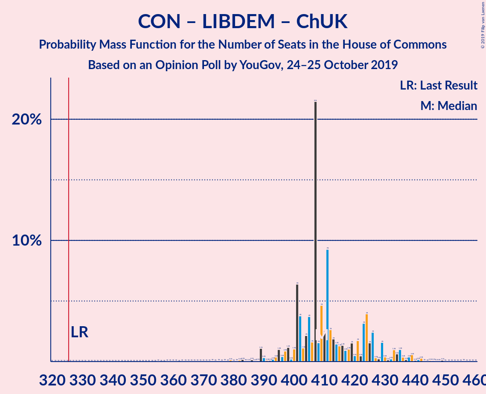

| Number of Seats | Probability | Accumulated | Special Marks |
|:---------------:|:-----------:|:-----------:|:-------------:|
| 329 | 0% | 100% | Last Result |
| 330 | 0% | 100% |  |
| 331 | 0% | 100% |  |
| 332 | 0% | 100% |  |
| 333 | 0% | 100% |  |
| 334 | 0% | 100% |  |
| 335 | 0% | 100% |  |
| 336 | 0% | 100% |  |
| 337 | 0% | 100% |  |
| 338 | 0% | 100% |  |
| 339 | 0% | 100% |  |
| 340 | 0% | 100% |  |
| 341 | 0% | 100% |  |
| 342 | 0% | 100% |  |
| 343 | 0% | 100% |  |
| 344 | 0% | 100% |  |
| 345 | 0% | 100% |  |
| 346 | 0% | 100% |  |
| 347 | 0% | 100% |  |
| 348 | 0% | 100% |  |
| 349 | 0% | 100% |  |
| 350 | 0% | 100% |  |
| 351 | 0% | 100% |  |
| 352 | 0% | 100% |  |
| 353 | 0% | 100% |  |
| 354 | 0% | 100% |  |
| 355 | 0% | 100% |  |
| 356 | 0% | 100% |  |
| 357 | 0% | 100% |  |
| 358 | 0% | 100% |  |
| 359 | 0% | 100% |  |
| 360 | 0% | 100% |  |
| 361 | 0% | 100% |  |
| 362 | 0% | 100% |  |
| 363 | 0% | 100% |  |
| 364 | 0% | 100% |  |
| 365 | 0% | 100% |  |
| 366 | 0% | 100% |  |
| 367 | 0% | 100% |  |
| 368 | 0% | 100% |  |
| 369 | 0% | 99.9% |  |
| 370 | 0% | 99.9% |  |
| 371 | 0% | 99.9% |  |
| 372 | 0% | 99.9% |  |
| 373 | 0% | 99.9% |  |
| 374 | 0% | 99.9% |  |
| 375 | 0% | 99.8% |  |
| 376 | 0% | 99.8% |  |
| 377 | 0% | 99.8% |  |
| 378 | 0% | 99.7% |  |
| 379 | 0.1% | 99.7% |  |
| 380 | 0% | 99.6% |  |
| 381 | 0% | 99.5% |  |
| 382 | 0.1% | 99.5% |  |
| 383 | 0.2% | 99.4% |  |
| 384 | 0% | 99.2% |  |
| 385 | 0.1% | 99.2% |  |
| 386 | 0.1% | 99.1% |  |
| 387 | 0.1% | 99.0% |  |
| 388 | 0.1% | 98.9% |  |
| 389 | 1.1% | 98.8% |  |
| 390 | 0.3% | 98% |  |
| 391 | 0.1% | 97% |  |
| 392 | 0.1% | 97% |  |
| 393 | 0.2% | 97% |  |
| 394 | 0.4% | 97% |  |
| 395 | 1.0% | 97% |  |
| 396 | 0.4% | 96% |  |
| 397 | 0.9% | 95% |  |
| 398 | 1.2% | 94% |  |
| 399 | 0.2% | 93% |  |
| 400 | 1.0% | 93% |  |
| 401 | 6% | 92% |  |
| 402 | 4% | 86% |  |
| 403 | 1.1% | 82% |  |
| 404 | 2% | 81% |  |
| 405 | 4% | 79% |  |
| 406 | 2% | 75% |  |
| 407 | 21% | 73% |  |
| 408 | 2% | 52% |  |
| 409 | 5% | 50% |  |
| 410 | 2% | 46% | Median |
| 411 | 9% | 43% |  |
| 412 | 3% | 34% |  |
| 413 | 2% | 31% |  |
| 414 | 1.4% | 29% |  |
| 415 | 1.3% | 28% |  |
| 416 | 1.3% | 27% |  |
| 417 | 0.9% | 25% |  |
| 418 | 1.0% | 24% |  |
| 419 | 2% | 23% |  |
| 420 | 0.5% | 22% |  |
| 421 | 2% | 21% |  |
| 422 | 0.5% | 20% |  |
| 423 | 3% | 19% |  |
| 424 | 4% | 16% |  |
| 425 | 2% | 12% |  |
| 426 | 2% | 11% |  |
| 427 | 0.3% | 8% |  |
| 428 | 0.2% | 8% |  |
| 429 | 2% | 8% |  |
| 430 | 0.4% | 6% |  |
| 431 | 0.1% | 6% |  |
| 432 | 0.2% | 5% |  |
| 433 | 1.0% | 5% |  |
| 434 | 0.6% | 4% |  |
| 435 | 1.0% | 4% |  |
| 436 | 0.4% | 3% |  |
| 437 | 0.2% | 2% |  |
| 438 | 0.4% | 2% |  |
| 439 | 0.6% | 2% |  |
| 440 | 0.1% | 1.2% |  |
| 441 | 0.2% | 1.1% |  |
| 442 | 0.3% | 0.9% |  |
| 443 | 0% | 0.7% |  |
| 444 | 0% | 0.6% |  |
| 445 | 0.1% | 0.6% |  |
| 446 | 0.1% | 0.5% |  |
| 447 | 0.1% | 0.4% |  |
| 448 | 0% | 0.4% |  |
| 449 | 0.1% | 0.3% |  |
| 450 | 0% | 0.2% |  |
| 451 | 0% | 0.2% |  |
| 452 | 0% | 0.2% |  |
| 453 | 0% | 0.1% |  |
| 454 | 0% | 0.1% |  |
| 455 | 0% | 0.1% |  |
| 456 | 0% | 0.1% |  |
| 457 | 0% | 0% |  |

### Conservative Party – Liberal Democrats

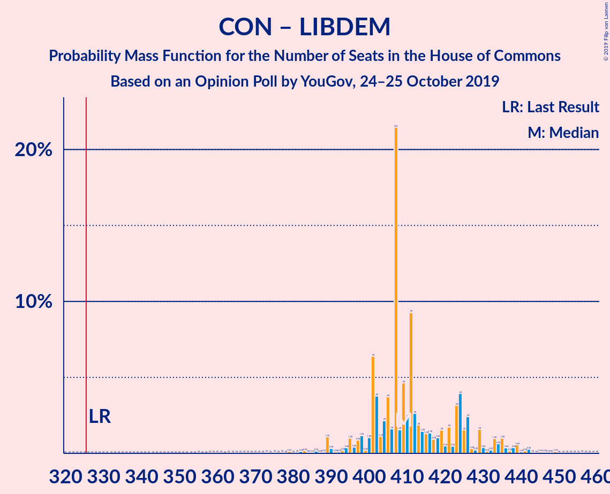

| Number of Seats | Probability | Accumulated | Special Marks |
|:---------------:|:-----------:|:-----------:|:-------------:|
| 329 | 0% | 100% | Last Result |
| 330 | 0% | 100% |  |
| 331 | 0% | 100% |  |
| 332 | 0% | 100% |  |
| 333 | 0% | 100% |  |
| 334 | 0% | 100% |  |
| 335 | 0% | 100% |  |
| 336 | 0% | 100% |  |
| 337 | 0% | 100% |  |
| 338 | 0% | 100% |  |
| 339 | 0% | 100% |  |
| 340 | 0% | 100% |  |
| 341 | 0% | 100% |  |
| 342 | 0% | 100% |  |
| 343 | 0% | 100% |  |
| 344 | 0% | 100% |  |
| 345 | 0% | 100% |  |
| 346 | 0% | 100% |  |
| 347 | 0% | 100% |  |
| 348 | 0% | 100% |  |
| 349 | 0% | 100% |  |
| 350 | 0% | 100% |  |
| 351 | 0% | 100% |  |
| 352 | 0% | 100% |  |
| 353 | 0% | 100% |  |
| 354 | 0% | 100% |  |
| 355 | 0% | 100% |  |
| 356 | 0% | 100% |  |
| 357 | 0% | 100% |  |
| 358 | 0% | 100% |  |
| 359 | 0% | 100% |  |
| 360 | 0% | 100% |  |
| 361 | 0% | 100% |  |
| 362 | 0% | 100% |  |
| 363 | 0% | 100% |  |
| 364 | 0% | 100% |  |
| 365 | 0% | 100% |  |
| 366 | 0% | 100% |  |
| 367 | 0% | 100% |  |
| 368 | 0% | 100% |  |
| 369 | 0% | 99.9% |  |
| 370 | 0% | 99.9% |  |
| 371 | 0% | 99.9% |  |
| 372 | 0% | 99.9% |  |
| 373 | 0% | 99.9% |  |
| 374 | 0% | 99.9% |  |
| 375 | 0% | 99.8% |  |
| 376 | 0% | 99.8% |  |
| 377 | 0% | 99.8% |  |
| 378 | 0% | 99.7% |  |
| 379 | 0.1% | 99.7% |  |
| 380 | 0% | 99.6% |  |
| 381 | 0% | 99.5% |  |
| 382 | 0.1% | 99.5% |  |
| 383 | 0.2% | 99.4% |  |
| 384 | 0% | 99.2% |  |
| 385 | 0.1% | 99.2% |  |
| 386 | 0.1% | 99.1% |  |
| 387 | 0.1% | 99.0% |  |
| 388 | 0.1% | 98.9% |  |
| 389 | 1.1% | 98.8% |  |
| 390 | 0.3% | 98% |  |
| 391 | 0.1% | 97% |  |
| 392 | 0.1% | 97% |  |
| 393 | 0.2% | 97% |  |
| 394 | 0.4% | 97% |  |
| 395 | 1.0% | 97% |  |
| 396 | 0.4% | 96% |  |
| 397 | 0.9% | 95% |  |
| 398 | 1.2% | 94% |  |
| 399 | 0.2% | 93% |  |
| 400 | 1.0% | 93% |  |
| 401 | 6% | 92% |  |
| 402 | 4% | 86% |  |
| 403 | 1.1% | 82% |  |
| 404 | 2% | 81% |  |
| 405 | 4% | 79% |  |
| 406 | 2% | 75% |  |
| 407 | 21% | 73% |  |
| 408 | 2% | 52% |  |
| 409 | 5% | 50% |  |
| 410 | 2% | 46% | Median |
| 411 | 9% | 43% |  |
| 412 | 3% | 34% |  |
| 413 | 2% | 31% |  |
| 414 | 1.4% | 29% |  |
| 415 | 1.3% | 28% |  |
| 416 | 1.3% | 27% |  |
| 417 | 0.9% | 25% |  |
| 418 | 1.0% | 24% |  |
| 419 | 2% | 23% |  |
| 420 | 0.5% | 22% |  |
| 421 | 2% | 21% |  |
| 422 | 0.5% | 20% |  |
| 423 | 3% | 19% |  |
| 424 | 4% | 16% |  |
| 425 | 2% | 12% |  |
| 426 | 2% | 11% |  |
| 427 | 0.3% | 8% |  |
| 428 | 0.2% | 8% |  |
| 429 | 2% | 8% |  |
| 430 | 0.4% | 6% |  |
| 431 | 0.1% | 6% |  |
| 432 | 0.2% | 5% |  |
| 433 | 1.0% | 5% |  |
| 434 | 0.6% | 4% |  |
| 435 | 1.0% | 4% |  |
| 436 | 0.4% | 3% |  |
| 437 | 0.2% | 2% |  |
| 438 | 0.4% | 2% |  |
| 439 | 0.6% | 2% |  |
| 440 | 0.1% | 1.2% |  |
| 441 | 0.2% | 1.1% |  |
| 442 | 0.3% | 0.9% |  |
| 443 | 0% | 0.7% |  |
| 444 | 0% | 0.6% |  |
| 445 | 0.1% | 0.6% |  |
| 446 | 0.1% | 0.5% |  |
| 447 | 0.1% | 0.4% |  |
| 448 | 0% | 0.4% |  |
| 449 | 0.1% | 0.3% |  |
| 450 | 0% | 0.2% |  |
| 451 | 0% | 0.2% |  |
| 452 | 0% | 0.2% |  |
| 453 | 0% | 0.1% |  |
| 454 | 0% | 0.1% |  |
| 455 | 0% | 0.1% |  |
| 456 | 0% | 0.1% |  |
| 457 | 0% | 0% |  |

### Conservative Party – Scottish National Party – Plaid Cymru

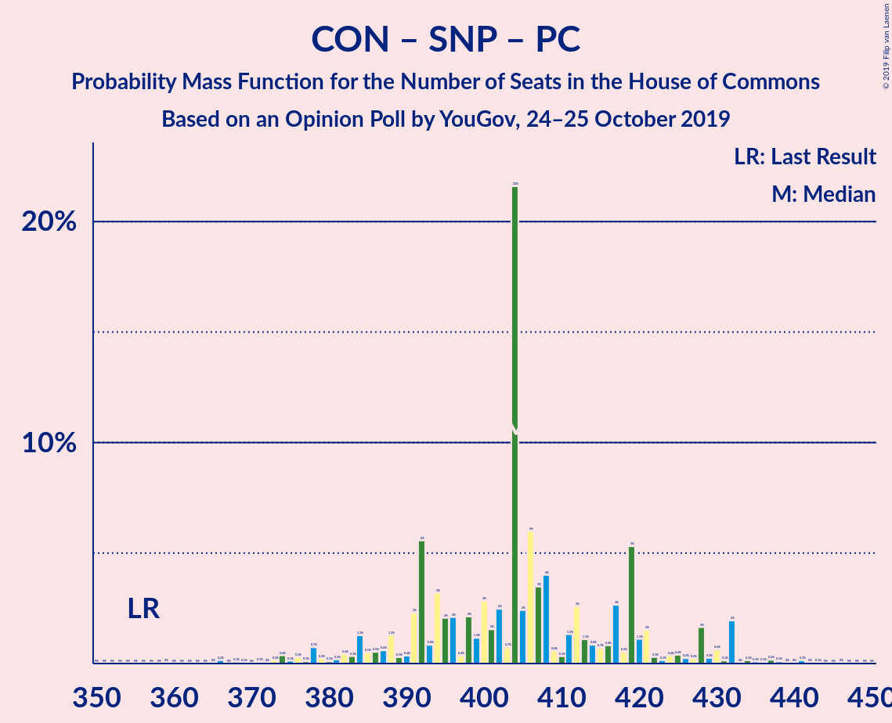

| Number of Seats | Probability | Accumulated | Special Marks |
|:---------------:|:-----------:|:-----------:|:-------------:|
| 356 | 0% | 100% | Last Result |
| 357 | 0% | 100% |  |
| 358 | 0% | 100% |  |
| 359 | 0% | 99.9% |  |
| 360 | 0% | 99.9% |  |
| 361 | 0% | 99.9% |  |
| 362 | 0% | 99.9% |  |
| 363 | 0% | 99.9% |  |
| 364 | 0% | 99.9% |  |
| 365 | 0% | 99.8% |  |
| 366 | 0.2% | 99.8% |  |
| 367 | 0% | 99.7% |  |
| 368 | 0.1% | 99.6% |  |
| 369 | 0.1% | 99.6% |  |
| 370 | 0% | 99.5% |  |
| 371 | 0.1% | 99.5% |  |
| 372 | 0% | 99.4% |  |
| 373 | 0.2% | 99.4% |  |
| 374 | 0.4% | 99.2% |  |
| 375 | 0.1% | 98.9% |  |
| 376 | 0.3% | 98.7% |  |
| 377 | 0.1% | 98% |  |
| 378 | 0.7% | 98% |  |
| 379 | 0.2% | 98% |  |
| 380 | 0.1% | 97% |  |
| 381 | 0.2% | 97% |  |
| 382 | 0.4% | 97% |  |
| 383 | 0.3% | 97% |  |
| 384 | 1.3% | 96% |  |
| 385 | 0.5% | 95% |  |
| 386 | 0.5% | 95% |  |
| 387 | 0.6% | 94% |  |
| 388 | 1.3% | 93% |  |
| 389 | 0.3% | 92% |  |
| 390 | 0.4% | 92% |  |
| 391 | 2% | 92% |  |
| 392 | 6% | 89% |  |
| 393 | 0.8% | 84% |  |
| 394 | 3% | 83% |  |
| 395 | 2% | 80% |  |
| 396 | 2% | 78% |  |
| 397 | 0.4% | 75% |  |
| 398 | 2% | 75% |  |
| 399 | 1.2% | 73% |  |
| 400 | 3% | 72% |  |
| 401 | 2% | 69% |  |
| 402 | 2% | 67% |  |
| 403 | 0.7% | 65% |  |
| 404 | 22% | 64% | Median |
| 405 | 2% | 43% |  |
| 406 | 6% | 40% |  |
| 407 | 3% | 34% |  |
| 408 | 4% | 31% |  |
| 409 | 0.6% | 27% |  |
| 410 | 0.3% | 26% |  |
| 411 | 1.3% | 26% |  |
| 412 | 3% | 24% |  |
| 413 | 1.1% | 22% |  |
| 414 | 0.8% | 21% |  |
| 415 | 0.7% | 20% |  |
| 416 | 0.8% | 19% |  |
| 417 | 3% | 18% |  |
| 418 | 0.5% | 16% |  |
| 419 | 5% | 15% |  |
| 420 | 1.1% | 10% |  |
| 421 | 2% | 9% |  |
| 422 | 0.3% | 7% |  |
| 423 | 0.1% | 7% |  |
| 424 | 0.4% | 7% |  |
| 425 | 0.4% | 7% |  |
| 426 | 0.2% | 6% |  |
| 427 | 0.2% | 6% |  |
| 428 | 2% | 6% |  |
| 429 | 0.3% | 4% |  |
| 430 | 0.6% | 4% |  |
| 431 | 0.1% | 3% |  |
| 432 | 2% | 3% |  |
| 433 | 0% | 1.0% |  |
| 434 | 0.1% | 1.0% |  |
| 435 | 0.1% | 0.9% |  |
| 436 | 0.1% | 0.8% |  |
| 437 | 0.2% | 0.7% |  |
| 438 | 0.1% | 0.5% |  |
| 439 | 0% | 0.4% |  |
| 440 | 0% | 0.4% |  |
| 441 | 0.1% | 0.4% |  |
| 442 | 0% | 0.2% |  |
| 443 | 0.1% | 0.2% |  |
| 444 | 0% | 0.1% |  |
| 445 | 0% | 0.1% |  |
| 446 | 0% | 0.1% |  |
| 447 | 0% | 0.1% |  |
| 448 | 0% | 0% |  |

### Conservative Party – Scottish National Party

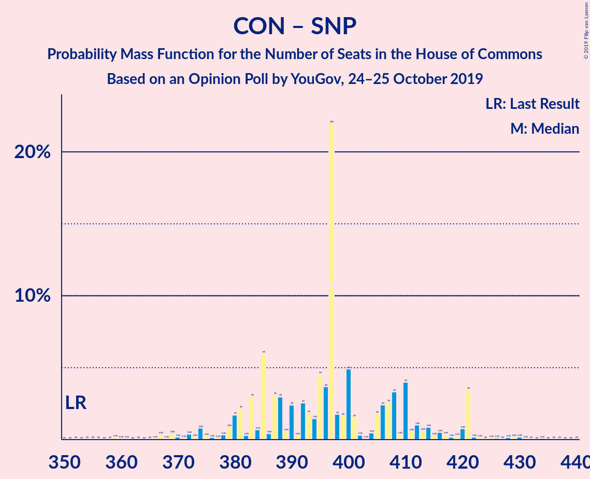

| Number of Seats | Probability | Accumulated | Special Marks |
|:---------------:|:-----------:|:-----------:|:-------------:|
| 352 | 0% | 100% | Last Result |
| 353 | 0% | 99.9% |  |
| 354 | 0% | 99.9% |  |
| 355 | 0% | 99.9% |  |
| 356 | 0% | 99.9% |  |
| 357 | 0% | 99.8% |  |
| 358 | 0% | 99.8% |  |
| 359 | 0.1% | 99.8% |  |
| 360 | 0.1% | 99.7% |  |
| 361 | 0.1% | 99.6% |  |
| 362 | 0% | 99.5% |  |
| 363 | 0% | 99.5% |  |
| 364 | 0% | 99.5% |  |
| 365 | 0% | 99.5% |  |
| 366 | 0.1% | 99.4% |  |
| 367 | 0.4% | 99.4% |  |
| 368 | 0.1% | 99.0% |  |
| 369 | 0.4% | 98.9% |  |
| 370 | 0.2% | 98% |  |
| 371 | 0.1% | 98% |  |
| 372 | 0.4% | 98% |  |
| 373 | 0.2% | 98% |  |
| 374 | 0.8% | 98% |  |
| 375 | 0.3% | 97% |  |
| 376 | 0.2% | 97% |  |
| 377 | 0.1% | 96% |  |
| 378 | 0.3% | 96% |  |
| 379 | 0.9% | 96% |  |
| 380 | 2% | 95% |  |
| 381 | 2% | 93% |  |
| 382 | 0.3% | 91% |  |
| 383 | 3% | 91% |  |
| 384 | 0.7% | 88% |  |
| 385 | 6% | 87% |  |
| 386 | 0.4% | 81% |  |
| 387 | 3% | 81% |  |
| 388 | 3% | 78% |  |
| 389 | 0.6% | 75% |  |
| 390 | 2% | 74% |  |
| 391 | 0.3% | 72% |  |
| 392 | 3% | 72% |  |
| 393 | 2% | 69% |  |
| 394 | 1.5% | 67% |  |
| 395 | 5% | 66% |  |
| 396 | 4% | 61% |  |
| 397 | 22% | 58% | Median |
| 398 | 2% | 36% |  |
| 399 | 2% | 34% |  |
| 400 | 5% | 32% |  |
| 401 | 2% | 27% |  |
| 402 | 0.3% | 26% |  |
| 403 | 0.1% | 25% |  |
| 404 | 0.5% | 25% |  |
| 405 | 2% | 25% |  |
| 406 | 2% | 23% |  |
| 407 | 3% | 21% |  |
| 408 | 3% | 18% |  |
| 409 | 0.4% | 15% |  |
| 410 | 4% | 14% |  |
| 411 | 0.6% | 10% |  |
| 412 | 1.0% | 10% |  |
| 413 | 0.6% | 9% |  |
| 414 | 0.9% | 8% |  |
| 415 | 0.3% | 7% |  |
| 416 | 0.5% | 7% |  |
| 417 | 0.4% | 6% |  |
| 418 | 0.2% | 6% |  |
| 419 | 0.3% | 6% |  |
| 420 | 0.8% | 6% |  |
| 421 | 3% | 5% |  |
| 422 | 0.2% | 1.4% |  |
| 423 | 0.1% | 1.2% |  |
| 424 | 0% | 1.1% |  |
| 425 | 0.1% | 1.1% |  |
| 426 | 0.1% | 1.0% |  |
| 427 | 0% | 0.9% |  |
| 428 | 0.1% | 0.9% |  |
| 429 | 0.2% | 0.7% |  |
| 430 | 0.2% | 0.5% |  |
| 431 | 0.1% | 0.4% |  |
| 432 | 0% | 0.3% |  |
| 433 | 0% | 0.2% |  |
| 434 | 0.1% | 0.2% |  |
| 435 | 0% | 0.1% |  |
| 436 | 0% | 0.1% |  |
| 437 | 0% | 0.1% |  |
| 438 | 0% | 0.1% |  |
| 439 | 0% | 0.1% |  |
| 440 | 0% | 0% |  |

### Conservative Party – Plaid Cymru

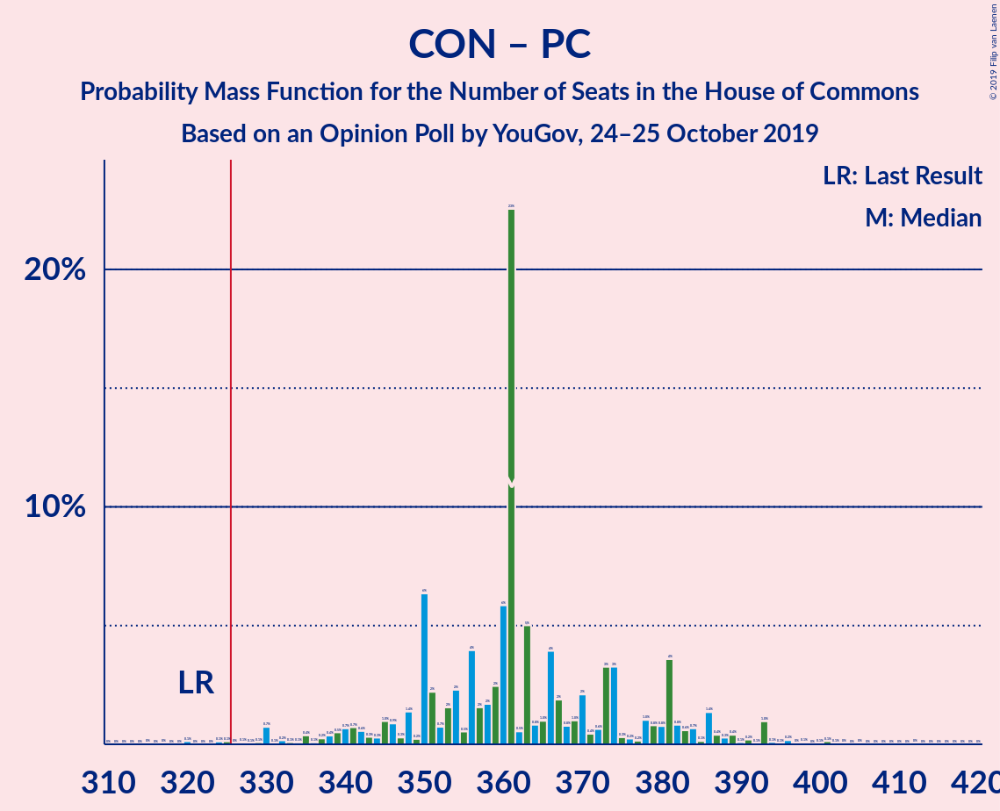

| Number of Seats | Probability | Accumulated | Special Marks |
|:---------------:|:-----------:|:-----------:|:-------------:|
| 310 | 0% | 100% |  |
| 311 | 0% | 99.9% |  |
| 312 | 0% | 99.9% |  |
| 313 | 0% | 99.9% |  |
| 314 | 0% | 99.9% |  |
| 315 | 0% | 99.9% |  |
| 316 | 0% | 99.9% |  |
| 317 | 0% | 99.9% |  |
| 318 | 0% | 99.9% |  |
| 319 | 0% | 99.8% |  |
| 320 | 0.1% | 99.8% |  |
| 321 | 0% | 99.7% | Last Result |
| 322 | 0% | 99.7% |  |
| 323 | 0% | 99.7% |  |
| 324 | 0.1% | 99.6% |  |
| 325 | 0.1% | 99.5% |  |
| 326 | 0% | 99.4% | Majority |
| 327 | 0.1% | 99.3% |  |
| 328 | 0.1% | 99.3% |  |
| 329 | 0.1% | 99.2% |  |
| 330 | 0.7% | 99.1% |  |
| 331 | 0.1% | 98% |  |
| 332 | 0.2% | 98% |  |
| 333 | 0.1% | 98% |  |
| 334 | 0.1% | 98% |  |
| 335 | 0.4% | 98% |  |
| 336 | 0.1% | 98% |  |
| 337 | 0.2% | 98% |  |
| 338 | 0.4% | 97% |  |
| 339 | 0.5% | 97% |  |
| 340 | 0.7% | 96% |  |
| 341 | 0.7% | 96% |  |
| 342 | 0.6% | 95% |  |
| 343 | 0.3% | 95% |  |
| 344 | 0.3% | 94% |  |
| 345 | 1.0% | 94% |  |
| 346 | 0.9% | 93% |  |
| 347 | 0.3% | 92% |  |
| 348 | 1.4% | 92% |  |
| 349 | 0.2% | 90% |  |
| 350 | 6% | 90% |  |
| 351 | 2% | 84% |  |
| 352 | 0.7% | 82% |  |
| 353 | 2% | 81% |  |
| 354 | 2% | 79% |  |
| 355 | 0.5% | 77% |  |
| 356 | 4% | 76% |  |
| 357 | 2% | 73% |  |
| 358 | 2% | 71% |  |
| 359 | 2% | 69% |  |
| 360 | 6% | 67% |  |
| 361 | 23% | 61% | Median |
| 362 | 0.5% | 38% |  |
| 363 | 5% | 38% |  |
| 364 | 0.8% | 33% |  |
| 365 | 1.0% | 32% |  |
| 366 | 4% | 31% |  |
| 367 | 2% | 27% |  |
| 368 | 0.8% | 25% |  |
| 369 | 1.0% | 24% |  |
| 370 | 2% | 23% |  |
| 371 | 0.4% | 21% |  |
| 372 | 0.6% | 21% |  |
| 373 | 3% | 20% |  |
| 374 | 3% | 17% |  |
| 375 | 0.3% | 14% |  |
| 376 | 0.2% | 13% |  |
| 377 | 0.2% | 13% |  |
| 378 | 1.0% | 13% |  |
| 379 | 0.8% | 12% |  |
| 380 | 0.8% | 11% |  |
| 381 | 4% | 10% |  |
| 382 | 0.8% | 7% |  |
| 383 | 0.6% | 6% |  |
| 384 | 0.7% | 5% |  |
| 385 | 0.1% | 5% |  |
| 386 | 1.4% | 5% |  |
| 387 | 0.4% | 3% |  |
| 388 | 0.3% | 3% |  |
| 389 | 0.4% | 3% |  |
| 390 | 0.1% | 2% |  |
| 391 | 0.2% | 2% |  |
| 392 | 0.1% | 2% |  |
| 393 | 1.0% | 2% |  |
| 394 | 0.1% | 0.9% |  |
| 395 | 0.1% | 0.8% |  |
| 396 | 0.2% | 0.7% |  |
| 397 | 0% | 0.6% |  |
| 398 | 0.1% | 0.5% |  |
| 399 | 0% | 0.5% |  |
| 400 | 0.1% | 0.4% |  |
| 401 | 0.1% | 0.4% |  |
| 402 | 0.1% | 0.2% |  |
| 403 | 0% | 0.2% |  |
| 404 | 0% | 0.2% |  |
| 405 | 0% | 0.1% |  |
| 406 | 0% | 0.1% |  |
| 407 | 0% | 0.1% |  |
| 408 | 0% | 0.1% |  |
| 409 | 0% | 0.1% |  |
| 410 | 0% | 0.1% |  |
| 411 | 0% | 0.1% |  |
| 412 | 0% | 0.1% |  |
| 413 | 0% | 0% |  |

### Conservative Party – Brexit Party

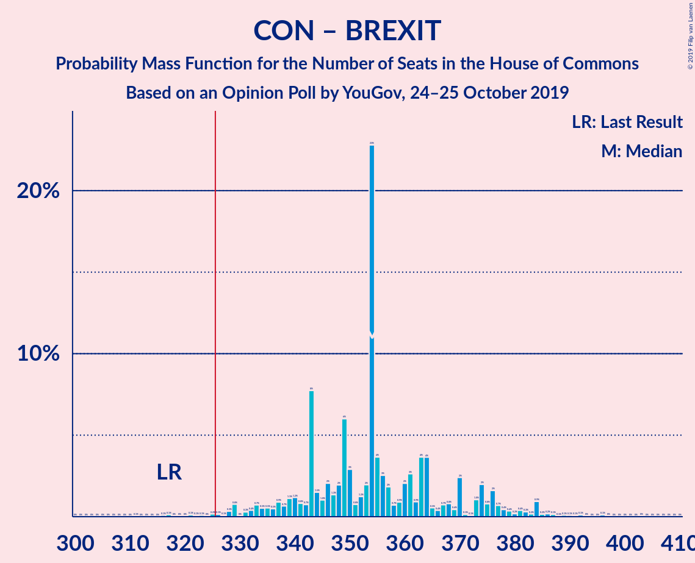

| Number of Seats | Probability | Accumulated | Special Marks |
|:---------------:|:-----------:|:-----------:|:-------------:|
| 305 | 0% | 100% |  |
| 306 | 0% | 99.9% |  |
| 307 | 0% | 99.9% |  |
| 308 | 0% | 99.9% |  |
| 309 | 0% | 99.9% |  |
| 310 | 0% | 99.9% |  |
| 311 | 0.1% | 99.9% |  |
| 312 | 0% | 99.9% |  |
| 313 | 0% | 99.9% |  |
| 314 | 0% | 99.8% |  |
| 315 | 0% | 99.8% |  |
| 316 | 0.1% | 99.8% |  |
| 317 | 0.1% | 99.7% | Last Result |
| 318 | 0% | 99.6% |  |
| 319 | 0% | 99.5% |  |
| 320 | 0% | 99.5% |  |
| 321 | 0.1% | 99.5% |  |
| 322 | 0.1% | 99.4% |  |
| 323 | 0.1% | 99.3% |  |
| 324 | 0% | 99.2% |  |
| 325 | 0.2% | 99.2% |  |
| 326 | 0.1% | 99.0% | Majority |
| 327 | 0.1% | 98.9% |  |
| 328 | 0.3% | 98.8% |  |
| 329 | 0.8% | 98% |  |
| 330 | 0% | 98% |  |
| 331 | 0.3% | 98% |  |
| 332 | 0.4% | 97% |  |
| 333 | 0.7% | 97% |  |
| 334 | 0.5% | 96% |  |
| 335 | 0.5% | 96% |  |
| 336 | 0.5% | 95% |  |
| 337 | 0.9% | 95% |  |
| 338 | 0.7% | 94% |  |
| 339 | 1.1% | 93% |  |
| 340 | 1.2% | 92% |  |
| 341 | 0.8% | 91% |  |
| 342 | 0.7% | 90% |  |
| 343 | 8% | 89% |  |
| 344 | 1.5% | 82% |  |
| 345 | 1.0% | 80% |  |
| 346 | 2% | 79% |  |
| 347 | 1.3% | 77% |  |
| 348 | 2% | 76% |  |
| 349 | 6% | 74% |  |
| 350 | 3% | 68% |  |
| 351 | 0.8% | 65% |  |
| 352 | 1.2% | 64% |  |
| 353 | 2% | 63% |  |
| 354 | 23% | 61% | Median |
| 355 | 4% | 38% |  |
| 356 | 3% | 34% |  |
| 357 | 2% | 32% |  |
| 358 | 0.7% | 30% |  |
| 359 | 0.9% | 29% |  |
| 360 | 2% | 28% |  |
| 361 | 3% | 26% |  |
| 362 | 0.9% | 24% |  |
| 363 | 4% | 23% |  |
| 364 | 4% | 19% |  |
| 365 | 0.5% | 16% |  |
| 366 | 0.4% | 15% |  |
| 367 | 0.7% | 15% |  |
| 368 | 0.8% | 14% |  |
| 369 | 0.4% | 13% |  |
| 370 | 2% | 13% |  |
| 371 | 0.1% | 10% |  |
| 372 | 0.1% | 10% |  |
| 373 | 1.0% | 10% |  |
| 374 | 2% | 9% |  |
| 375 | 0.8% | 7% |  |
| 376 | 2% | 6% |  |
| 377 | 0.7% | 5% |  |
| 378 | 0.4% | 4% |  |
| 379 | 0.4% | 4% |  |
| 380 | 0.2% | 3% |  |
| 381 | 0.4% | 3% |  |
| 382 | 0.3% | 3% |  |
| 383 | 0.2% | 2% |  |
| 384 | 0.9% | 2% |  |
| 385 | 0.2% | 1.2% |  |
| 386 | 0.2% | 1.0% |  |
| 387 | 0.1% | 0.9% |  |
| 388 | 0.1% | 0.7% |  |
| 389 | 0.1% | 0.7% |  |
| 390 | 0.1% | 0.6% |  |
| 391 | 0.1% | 0.5% |  |
| 392 | 0.1% | 0.4% |  |
| 393 | 0% | 0.3% |  |
| 394 | 0% | 0.3% |  |
| 395 | 0% | 0.3% |  |
| 396 | 0.1% | 0.3% |  |
| 397 | 0% | 0.1% |  |
| 398 | 0% | 0.1% |  |
| 399 | 0% | 0.1% |  |
| 400 | 0% | 0.1% |  |
| 401 | 0% | 0.1% |  |
| 402 | 0% | 0.1% |  |
| 403 | 0% | 0.1% |  |
| 404 | 0% | 0% |  |

### Conservative Party – Change UK

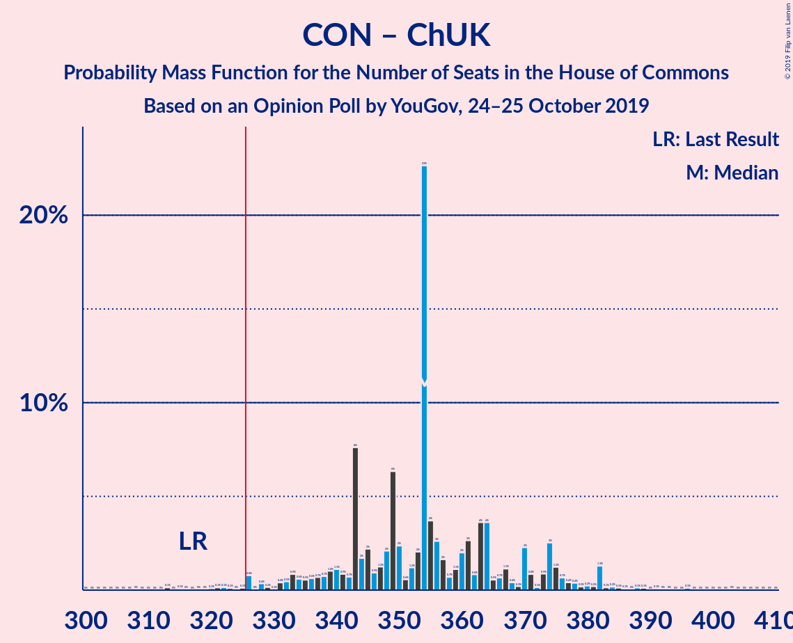

| Number of Seats | Probability | Accumulated | Special Marks |
|:---------------:|:-----------:|:-----------:|:-------------:|
| 304 | 0% | 100% |  |
| 305 | 0% | 99.9% |  |
| 306 | 0% | 99.9% |  |
| 307 | 0% | 99.9% |  |
| 308 | 0% | 99.9% |  |
| 309 | 0% | 99.9% |  |
| 310 | 0% | 99.9% |  |
| 311 | 0% | 99.8% |  |
| 312 | 0% | 99.8% |  |
| 313 | 0.1% | 99.8% |  |
| 314 | 0% | 99.7% |  |
| 315 | 0.1% | 99.7% |  |
| 316 | 0% | 99.6% |  |
| 317 | 0% | 99.6% | Last Result |
| 318 | 0% | 99.6% |  |
| 319 | 0% | 99.5% |  |
| 320 | 0.1% | 99.5% |  |
| 321 | 0.1% | 99.4% |  |
| 322 | 0.1% | 99.3% |  |
| 323 | 0.1% | 99.1% |  |
| 324 | 0% | 99.0% |  |
| 325 | 0.1% | 99.0% |  |
| 326 | 0.8% | 98.9% | Majority |
| 327 | 0% | 98% |  |
| 328 | 0.4% | 98% |  |
| 329 | 0.2% | 98% |  |
| 330 | 0.1% | 98% |  |
| 331 | 0.4% | 97% |  |
| 332 | 0.5% | 97% |  |
| 333 | 0.9% | 97% |  |
| 334 | 0.6% | 96% |  |
| 335 | 0.5% | 95% |  |
| 336 | 0.6% | 95% |  |
| 337 | 0.7% | 94% |  |
| 338 | 0.7% | 93% |  |
| 339 | 1.0% | 93% |  |
| 340 | 1.1% | 92% |  |
| 341 | 0.9% | 90% |  |
| 342 | 0.7% | 90% |  |
| 343 | 8% | 89% |  |
| 344 | 2% | 81% |  |
| 345 | 2% | 80% |  |
| 346 | 0.9% | 77% |  |
| 347 | 1.2% | 76% |  |
| 348 | 2% | 75% |  |
| 349 | 6% | 73% |  |
| 350 | 2% | 67% |  |
| 351 | 0.6% | 64% |  |
| 352 | 1.2% | 64% |  |
| 353 | 2% | 63% |  |
| 354 | 23% | 61% | Median |
| 355 | 4% | 38% |  |
| 356 | 3% | 34% |  |
| 357 | 2% | 32% |  |
| 358 | 0.7% | 30% |  |
| 359 | 1.1% | 29% |  |
| 360 | 2% | 28% |  |
| 361 | 3% | 26% |  |
| 362 | 0.8% | 24% |  |
| 363 | 4% | 23% |  |
| 364 | 4% | 19% |  |
| 365 | 0.5% | 15% |  |
| 366 | 0.7% | 15% |  |
| 367 | 1.1% | 14% |  |
| 368 | 0.4% | 13% |  |
| 369 | 0.2% | 13% |  |
| 370 | 2% | 12% |  |
| 371 | 0.8% | 10% |  |
| 372 | 0.1% | 9% |  |
| 373 | 0.9% | 9% |  |
| 374 | 3% | 8% |  |
| 375 | 1.2% | 6% |  |
| 376 | 0.7% | 5% |  |
| 377 | 0.4% | 4% |  |
| 378 | 0.4% | 4% |  |
| 379 | 0.2% | 3% |  |
| 380 | 0.2% | 3% |  |
| 381 | 0.2% | 3% |  |
| 382 | 1.3% | 3% |  |
| 383 | 0.1% | 1.2% |  |
| 384 | 0.2% | 1.1% |  |
| 385 | 0.1% | 0.9% |  |
| 386 | 0.1% | 0.8% |  |
| 387 | 0% | 0.7% |  |
| 388 | 0.1% | 0.7% |  |
| 389 | 0.1% | 0.6% |  |
| 390 | 0% | 0.4% |  |
| 391 | 0.1% | 0.4% |  |
| 392 | 0% | 0.4% |  |
| 393 | 0% | 0.3% |  |
| 394 | 0% | 0.3% |  |
| 395 | 0% | 0.3% |  |
| 396 | 0.1% | 0.2% |  |
| 397 | 0% | 0.1% |  |
| 398 | 0% | 0.1% |  |
| 399 | 0% | 0.1% |  |
| 400 | 0% | 0.1% |  |
| 401 | 0% | 0.1% |  |
| 402 | 0% | 0.1% |  |
| 403 | 0% | 0.1% |  |
| 404 | 0% | 0% |  |

### Conservative Party

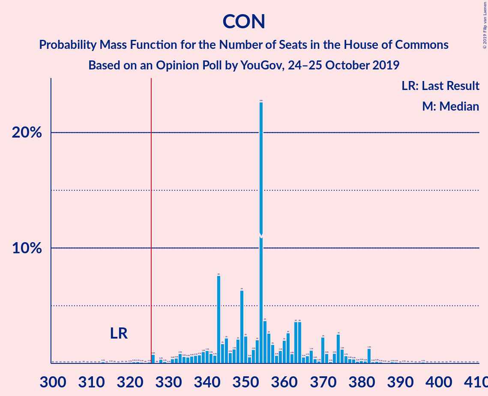

| Number of Seats | Probability | Accumulated | Special Marks |
|:---------------:|:-----------:|:-----------:|:-------------:|
| 304 | 0% | 100% |  |
| 305 | 0% | 99.9% |  |
| 306 | 0% | 99.9% |  |
| 307 | 0% | 99.9% |  |
| 308 | 0% | 99.9% |  |
| 309 | 0% | 99.9% |  |
| 310 | 0% | 99.9% |  |
| 311 | 0% | 99.8% |  |
| 312 | 0% | 99.8% |  |
| 313 | 0.1% | 99.8% |  |
| 314 | 0% | 99.7% |  |
| 315 | 0.1% | 99.7% |  |
| 316 | 0% | 99.6% |  |
| 317 | 0% | 99.6% | Last Result |
| 318 | 0% | 99.6% |  |
| 319 | 0% | 99.5% |  |
| 320 | 0.1% | 99.5% |  |
| 321 | 0.1% | 99.4% |  |
| 322 | 0.1% | 99.3% |  |
| 323 | 0.1% | 99.1% |  |
| 324 | 0% | 99.0% |  |
| 325 | 0.1% | 99.0% |  |
| 326 | 0.8% | 98.9% | Majority |
| 327 | 0% | 98% |  |
| 328 | 0.4% | 98% |  |
| 329 | 0.2% | 98% |  |
| 330 | 0.1% | 98% |  |
| 331 | 0.4% | 97% |  |
| 332 | 0.5% | 97% |  |
| 333 | 0.9% | 97% |  |
| 334 | 0.6% | 96% |  |
| 335 | 0.5% | 95% |  |
| 336 | 0.6% | 95% |  |
| 337 | 0.7% | 94% |  |
| 338 | 0.7% | 93% |  |
| 339 | 1.0% | 93% |  |
| 340 | 1.1% | 92% |  |
| 341 | 0.9% | 90% |  |
| 342 | 0.7% | 90% |  |
| 343 | 8% | 89% |  |
| 344 | 2% | 81% |  |
| 345 | 2% | 80% |  |
| 346 | 0.9% | 77% |  |
| 347 | 1.2% | 76% |  |
| 348 | 2% | 75% |  |
| 349 | 6% | 73% |  |
| 350 | 2% | 67% |  |
| 351 | 0.6% | 64% |  |
| 352 | 1.2% | 64% |  |
| 353 | 2% | 63% |  |
| 354 | 23% | 61% | Median |
| 355 | 4% | 38% |  |
| 356 | 3% | 34% |  |
| 357 | 2% | 32% |  |
| 358 | 0.7% | 30% |  |
| 359 | 1.1% | 29% |  |
| 360 | 2% | 28% |  |
| 361 | 3% | 26% |  |
| 362 | 0.8% | 24% |  |
| 363 | 4% | 23% |  |
| 364 | 4% | 19% |  |
| 365 | 0.5% | 15% |  |
| 366 | 0.7% | 15% |  |
| 367 | 1.1% | 14% |  |
| 368 | 0.4% | 13% |  |
| 369 | 0.2% | 13% |  |
| 370 | 2% | 12% |  |
| 371 | 0.8% | 10% |  |
| 372 | 0.1% | 9% |  |
| 373 | 0.9% | 9% |  |
| 374 | 3% | 8% |  |
| 375 | 1.2% | 6% |  |
| 376 | 0.7% | 5% |  |
| 377 | 0.4% | 4% |  |
| 378 | 0.4% | 4% |  |
| 379 | 0.2% | 3% |  |
| 380 | 0.2% | 3% |  |
| 381 | 0.2% | 3% |  |
| 382 | 1.3% | 3% |  |
| 383 | 0.1% | 1.2% |  |
| 384 | 0.2% | 1.1% |  |
| 385 | 0.1% | 0.9% |  |
| 386 | 0.1% | 0.8% |  |
| 387 | 0% | 0.7% |  |
| 388 | 0.1% | 0.7% |  |
| 389 | 0.1% | 0.6% |  |
| 390 | 0% | 0.4% |  |
| 391 | 0.1% | 0.4% |  |
| 392 | 0% | 0.4% |  |
| 393 | 0% | 0.3% |  |
| 394 | 0% | 0.3% |  |
| 395 | 0% | 0.3% |  |
| 396 | 0.1% | 0.2% |  |
| 397 | 0% | 0.1% |  |
| 398 | 0% | 0.1% |  |
| 399 | 0% | 0.1% |  |
| 400 | 0% | 0.1% |  |
| 401 | 0% | 0.1% |  |
| 402 | 0% | 0.1% |  |
| 403 | 0% | 0.1% |  |
| 404 | 0% | 0% |  |

### Labour Party – Liberal Democrats – Green Party – Scottish National Party – Plaid Cymru

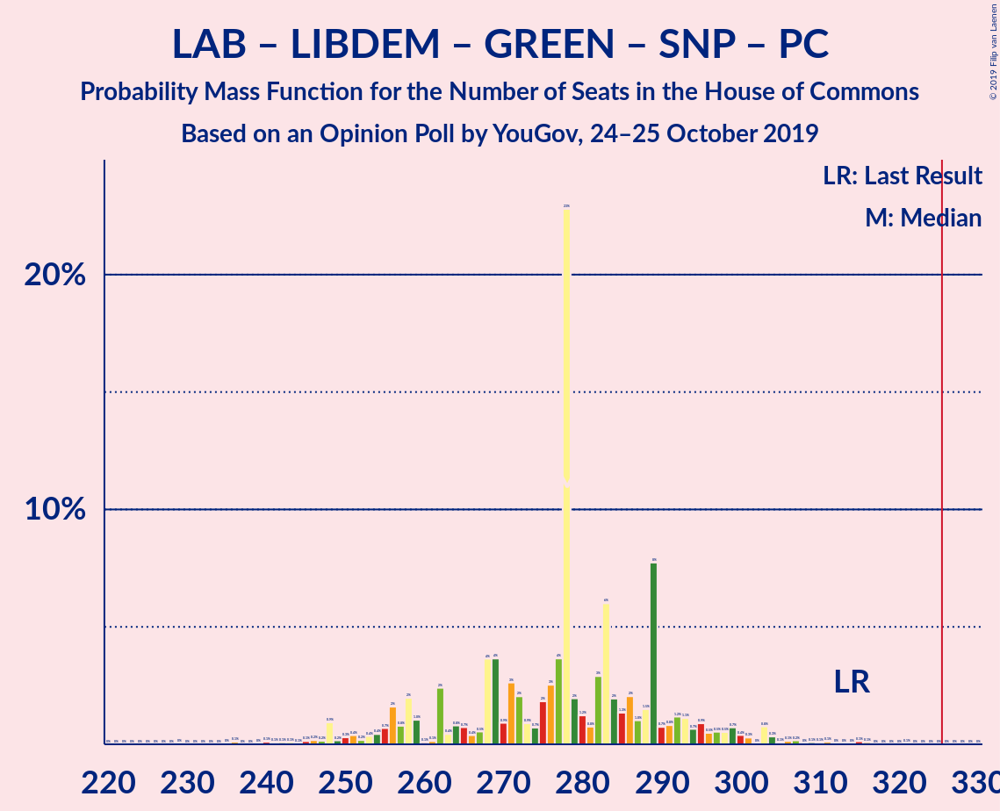

| Number of Seats | Probability | Accumulated | Special Marks |
|:---------------:|:-----------:|:-----------:|:-------------:|
| 229 | 0% | 100% |  |
| 230 | 0% | 99.9% |  |
| 231 | 0% | 99.9% |  |
| 232 | 0% | 99.9% |  |
| 233 | 0% | 99.9% |  |
| 234 | 0% | 99.9% |  |
| 235 | 0% | 99.9% |  |
| 236 | 0.1% | 99.9% |  |
| 237 | 0% | 99.7% |  |
| 238 | 0% | 99.7% |  |
| 239 | 0% | 99.7% |  |
| 240 | 0.1% | 99.7% |  |
| 241 | 0.1% | 99.6% |  |
| 242 | 0.1% | 99.5% |  |
| 243 | 0.1% | 99.4% |  |
| 244 | 0.1% | 99.3% |  |
| 245 | 0.1% | 99.3% |  |
| 246 | 0.2% | 99.1% |  |
| 247 | 0.2% | 99.0% |  |
| 248 | 0.9% | 98.8% |  |
| 249 | 0.2% | 98% |  |
| 250 | 0.3% | 98% |  |
| 251 | 0.4% | 97% |  |
| 252 | 0.2% | 97% |  |
| 253 | 0.4% | 97% |  |
| 254 | 0.4% | 96% |  |
| 255 | 0.7% | 96% |  |
| 256 | 2% | 95% |  |
| 257 | 0.8% | 94% |  |
| 258 | 2% | 93% |  |
| 259 | 1.0% | 91% |  |
| 260 | 0.1% | 90% |  |
| 261 | 0.1% | 90% |  |
| 262 | 2% | 90% |  |
| 263 | 0.4% | 87% |  |
| 264 | 0.8% | 87% |  |
| 265 | 0.7% | 86% |  |
| 266 | 0.4% | 85% |  |
| 267 | 0.5% | 85% |  |
| 268 | 4% | 84% |  |
| 269 | 4% | 81% |  |
| 270 | 0.9% | 77% |  |
| 271 | 3% | 76% |  |
| 272 | 2% | 74% |  |
| 273 | 0.9% | 72% |  |
| 274 | 0.7% | 71% |  |
| 275 | 2% | 70% |  |
| 276 | 3% | 68% |  |
| 277 | 4% | 66% |  |
| 278 | 23% | 62% |  |
| 279 | 2% | 39% |  |
| 280 | 1.2% | 37% | Median |
| 281 | 0.8% | 36% |  |
| 282 | 3% | 35% |  |
| 283 | 6% | 32% |  |
| 284 | 2% | 26% |  |
| 285 | 1.3% | 24% |  |
| 286 | 2% | 23% |  |
| 287 | 1.0% | 21% |  |
| 288 | 1.5% | 20% |  |
| 289 | 8% | 18% |  |
| 290 | 0.7% | 11% |  |
| 291 | 0.8% | 10% |  |
| 292 | 1.2% | 9% |  |
| 293 | 1.1% | 8% |  |
| 294 | 0.7% | 7% |  |
| 295 | 0.9% | 6% |  |
| 296 | 0.5% | 5% |  |
| 297 | 0.5% | 5% |  |
| 298 | 0.5% | 4% |  |
| 299 | 0.7% | 4% |  |
| 300 | 0.4% | 3% |  |
| 301 | 0.3% | 3% |  |
| 302 | 0% | 2% |  |
| 303 | 0.8% | 2% |  |
| 304 | 0.3% | 2% |  |
| 305 | 0.1% | 1.2% |  |
| 306 | 0.1% | 1.1% |  |
| 307 | 0.2% | 1.0% |  |
| 308 | 0% | 0.8% |  |
| 309 | 0.1% | 0.8% |  |
| 310 | 0.1% | 0.7% |  |
| 311 | 0.1% | 0.6% |  |
| 312 | 0% | 0.5% |  |
| 313 | 0% | 0.5% |  |
| 314 | 0% | 0.5% | Last Result |
| 315 | 0.1% | 0.4% |  |
| 316 | 0.1% | 0.3% |  |
| 317 | 0% | 0.2% |  |
| 318 | 0% | 0.2% |  |
| 319 | 0% | 0.2% |  |
| 320 | 0% | 0.1% |  |
| 321 | 0.1% | 0.1% |  |
| 322 | 0% | 0.1% |  |
| 323 | 0% | 0.1% |  |
| 324 | 0% | 0.1% |  |
| 325 | 0% | 0.1% |  |
| 326 | 0% | 0.1% | Majority |
| 327 | 0% | 0.1% |  |
| 328 | 0% | 0% |  |

### Labour Party – Liberal Democrats – Scottish National Party – Plaid Cymru

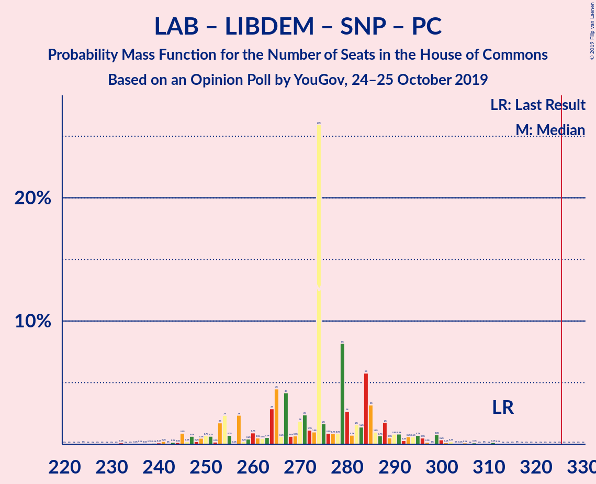

| Number of Seats | Probability | Accumulated | Special Marks |
|:---------------:|:-----------:|:-----------:|:-------------:|
| 224 | 0% | 100% |  |
| 225 | 0% | 99.9% |  |
| 226 | 0% | 99.9% |  |
| 227 | 0% | 99.9% |  |
| 228 | 0% | 99.9% |  |
| 229 | 0% | 99.9% |  |
| 230 | 0% | 99.9% |  |
| 231 | 0% | 99.9% |  |
| 232 | 0.1% | 99.9% |  |
| 233 | 0% | 99.7% |  |
| 234 | 0% | 99.7% |  |
| 235 | 0.1% | 99.7% |  |
| 236 | 0.1% | 99.6% |  |
| 237 | 0.1% | 99.6% |  |
| 238 | 0.1% | 99.5% |  |
| 239 | 0.1% | 99.4% |  |
| 240 | 0.1% | 99.3% |  |
| 241 | 0.2% | 99.2% |  |
| 242 | 0% | 99.0% |  |
| 243 | 0.2% | 99.0% |  |
| 244 | 0.1% | 98.8% |  |
| 245 | 0.9% | 98.7% |  |
| 246 | 0.2% | 98% |  |
| 247 | 0.6% | 98% |  |
| 248 | 0.2% | 97% |  |
| 249 | 0.5% | 97% |  |
| 250 | 0.7% | 96% |  |
| 251 | 0.7% | 96% |  |
| 252 | 0.2% | 95% |  |
| 253 | 2% | 95% |  |
| 254 | 2% | 93% |  |
| 255 | 0.7% | 91% |  |
| 256 | 0.1% | 90% |  |
| 257 | 2% | 90% |  |
| 258 | 0.2% | 87% |  |
| 259 | 0.4% | 87% |  |
| 260 | 0.9% | 87% |  |
| 261 | 0.5% | 86% |  |
| 262 | 0.5% | 85% |  |
| 263 | 0.5% | 85% |  |
| 264 | 3% | 84% |  |
| 265 | 4% | 82% |  |
| 266 | 0.6% | 77% |  |
| 267 | 4% | 76% |  |
| 268 | 0.6% | 72% |  |
| 269 | 0.7% | 72% |  |
| 270 | 2% | 71% |  |
| 271 | 2% | 69% |  |
| 272 | 1.1% | 67% |  |
| 273 | 1.0% | 66% |  |
| 274 | 26% | 65% |  |
| 275 | 2% | 39% |  |
| 276 | 0.9% | 37% | Median |
| 277 | 0.9% | 36% |  |
| 278 | 0.9% | 35% |  |
| 279 | 8% | 34% |  |
| 280 | 3% | 26% |  |
| 281 | 0.7% | 23% |  |
| 282 | 2% | 23% |  |
| 283 | 1.4% | 21% |  |
| 284 | 6% | 20% |  |
| 285 | 3% | 14% |  |
| 286 | 1.0% | 11% |  |
| 287 | 0.7% | 10% |  |
| 288 | 2% | 9% |  |
| 289 | 0.5% | 7% |  |
| 290 | 0.8% | 7% |  |
| 291 | 0.8% | 6% |  |
| 292 | 0.3% | 5% |  |
| 293 | 0.6% | 5% |  |
| 294 | 0.6% | 4% |  |
| 295 | 0.7% | 4% |  |
| 296 | 0.5% | 3% |  |
| 297 | 0.2% | 2% |  |
| 298 | 0% | 2% |  |
| 299 | 0.8% | 2% |  |
| 300 | 0.4% | 2% |  |
| 301 | 0.1% | 1.2% |  |
| 302 | 0.2% | 1.0% |  |
| 303 | 0% | 0.8% |  |
| 304 | 0.1% | 0.8% |  |
| 305 | 0.1% | 0.7% |  |
| 306 | 0% | 0.6% |  |
| 307 | 0.1% | 0.6% |  |
| 308 | 0% | 0.5% |  |
| 309 | 0% | 0.5% |  |
| 310 | 0% | 0.4% |  |
| 311 | 0.1% | 0.4% |  |
| 312 | 0.1% | 0.3% |  |
| 313 | 0% | 0.2% | Last Result |
| 314 | 0% | 0.2% |  |
| 315 | 0% | 0.2% |  |
| 316 | 0% | 0.1% |  |
| 317 | 0% | 0.1% |  |
| 318 | 0% | 0.1% |  |
| 319 | 0% | 0.1% |  |
| 320 | 0% | 0.1% |  |
| 321 | 0% | 0.1% |  |
| 322 | 0% | 0.1% |  |
| 323 | 0% | 0.1% |  |
| 324 | 0% | 0% |  |

### Labour Party – Liberal Democrats – Scottish National Party

| Number of Seats | Probability | Accumulated | Special Marks |
|:---------------:|:-----------:|:-----------:|:-------------:|
| 215 | 0% | 100% |  |
| 216 | 0% | 99.9% |  |
| 217 | 0% | 99.9% |  |
| 218 | 0% | 99.9% |  |
| 219 | 0% | 99.9% |  |
| 220 | 0% | 99.9% |  |
| 221 | 0% | 99.9% |  |
| 222 | 0% | 99.9% |  |
| 223 | 0% | 99.8% |  |
| 224 | 0% | 99.8% |  |
| 225 | 0.1% | 99.8% |  |
| 226 | 0% | 99.8% |  |
| 227 | 0.2% | 99.7% |  |
| 228 | 0.1% | 99.6% |  |
| 229 | 0% | 99.5% |  |
| 230 | 0.2% | 99.5% |  |
| 231 | 0.1% | 99.3% |  |
| 232 | 0.1% | 99.2% |  |
| 233 | 0.1% | 99.1% |  |
| 234 | 1.0% | 99.1% |  |
| 235 | 0.1% | 98% |  |
| 236 | 0.1% | 98% |  |
| 237 | 0.1% | 98% |  |
| 238 | 0.2% | 98% |  |
| 239 | 0.3% | 97% |  |
| 240 | 0.7% | 97% |  |
| 241 | 0.2% | 96% |  |
| 242 | 1.3% | 96% |  |
| 243 | 0.5% | 95% |  |
| 244 | 1.1% | 94% |  |
| 245 | 0.1% | 93% |  |
| 246 | 3% | 93% |  |
| 247 | 2% | 90% |  |
| 248 | 0.6% | 88% |  |
| 249 | 0.2% | 88% |  |
| 250 | 0.7% | 87% |  |
| 251 | 0.1% | 87% |  |
| 252 | 0.4% | 87% |  |
| 253 | 0.7% | 86% |  |
| 254 | 2% | 86% |  |
| 255 | 4% | 84% |  |
| 256 | 0.6% | 80% |  |
| 257 | 0.4% | 79% |  |
| 258 | 2% | 79% |  |
| 259 | 0.5% | 76% |  |
| 260 | 2% | 76% |  |
| 261 | 2% | 73% |  |
| 262 | 2% | 71% |  |
| 263 | 1.0% | 69% |  |
| 264 | 0.9% | 68% |  |
| 265 | 1.5% | 67% |  |
| 266 | 6% | 65% |  |
| 267 | 21% | 60% |  |
| 268 | 5% | 38% |  |
| 269 | 3% | 33% | Median |
| 270 | 3% | 30% |  |
| 271 | 0.7% | 27% |  |
| 272 | 2% | 27% |  |
| 273 | 3% | 25% |  |
| 274 | 3% | 22% |  |
| 275 | 0.8% | 20% |  |
| 276 | 2% | 19% |  |
| 277 | 6% | 17% |  |
| 278 | 2% | 11% |  |
| 279 | 0.4% | 9% |  |
| 280 | 0.6% | 9% |  |
| 281 | 1.4% | 8% |  |
| 282 | 0.5% | 7% |  |
| 283 | 1.1% | 7% |  |
| 284 | 0.3% | 5% |  |
| 285 | 0.3% | 5% |  |
| 286 | 0.9% | 5% |  |
| 287 | 0.5% | 4% |  |
| 288 | 0.3% | 4% |  |
| 289 | 0.9% | 3% |  |
| 290 | 0.1% | 2% |  |
| 291 | 0.1% | 2% |  |
| 292 | 0% | 2% |  |
| 293 | 0.4% | 2% |  |
| 294 | 0.1% | 2% |  |
| 295 | 0.9% | 2% |  |
| 296 | 0.1% | 0.9% |  |
| 297 | 0% | 0.8% |  |
| 298 | 0.1% | 0.8% |  |
| 299 | 0% | 0.7% |  |
| 300 | 0% | 0.6% |  |
| 301 | 0% | 0.6% |  |
| 302 | 0% | 0.6% |  |
| 303 | 0.1% | 0.5% |  |
| 304 | 0.2% | 0.4% |  |
| 305 | 0% | 0.2% |  |
| 306 | 0% | 0.2% |  |
| 307 | 0% | 0.2% |  |
| 308 | 0% | 0.2% |  |
| 309 | 0% | 0.1% | Last Result |
| 310 | 0% | 0.1% |  |
| 311 | 0% | 0.1% |  |
| 312 | 0% | 0.1% |  |
| 313 | 0% | 0.1% |  |
| 314 | 0% | 0.1% |  |
| 315 | 0% | 0.1% |  |
| 316 | 0% | 0% |  |

### Labour Party – Liberal Democrats – Plaid Cymru

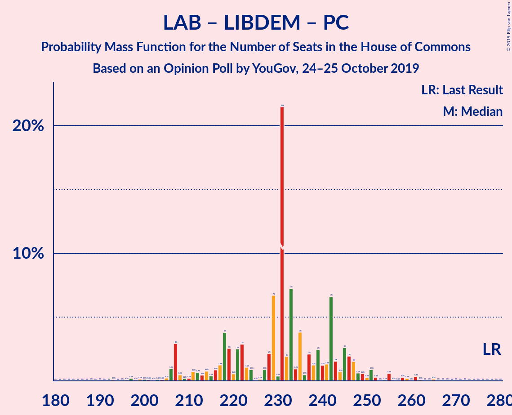

| Number of Seats | Probability | Accumulated | Special Marks |
|:---------------:|:-----------:|:-----------:|:-------------:|
| 189 | 0% | 100% |  |
| 190 | 0% | 99.9% |  |
| 191 | 0% | 99.9% |  |
| 192 | 0% | 99.9% |  |
| 193 | 0.1% | 99.9% |  |
| 194 | 0% | 99.8% |  |
| 195 | 0% | 99.8% |  |
| 196 | 0.1% | 99.7% |  |
| 197 | 0.2% | 99.7% |  |
| 198 | 0.1% | 99.5% |  |
| 199 | 0.1% | 99.4% |  |
| 200 | 0.1% | 99.2% |  |
| 201 | 0.1% | 99.1% |  |
| 202 | 0.1% | 99.0% |  |
| 203 | 0.1% | 99.0% |  |
| 204 | 0.1% | 98.9% |  |
| 205 | 0.2% | 98.7% |  |
| 206 | 1.0% | 98.5% |  |
| 207 | 3% | 98% |  |
| 208 | 0.5% | 95% |  |
| 209 | 0.2% | 94% |  |
| 210 | 0.2% | 94% |  |
| 211 | 0.7% | 94% |  |
| 212 | 0.7% | 93% |  |
| 213 | 0.5% | 92% |  |
| 214 | 0.8% | 92% |  |
| 215 | 0.4% | 91% |  |
| 216 | 0.9% | 91% |  |
| 217 | 1.3% | 90% |  |
| 218 | 4% | 89% |  |
| 219 | 3% | 85% |  |
| 220 | 0.6% | 82% |  |
| 221 | 3% | 82% |  |
| 222 | 3% | 79% |  |
| 223 | 1.1% | 76% |  |
| 224 | 0.9% | 75% |  |
| 225 | 0.1% | 74% |  |
| 226 | 0.1% | 74% |  |
| 227 | 0.9% | 74% |  |
| 228 | 2% | 73% |  |
| 229 | 7% | 71% |  |
| 230 | 0.4% | 64% |  |
| 231 | 21% | 64% |  |
| 232 | 2% | 43% |  |
| 233 | 7% | 41% | Median |
| 234 | 0.9% | 33% |  |
| 235 | 4% | 33% |  |
| 236 | 0.5% | 29% |  |
| 237 | 2% | 28% |  |
| 238 | 1.2% | 26% |  |
| 239 | 2% | 25% |  |
| 240 | 1.2% | 22% |  |
| 241 | 1.3% | 21% |  |
| 242 | 7% | 20% |  |
| 243 | 2% | 13% |  |
| 244 | 0.7% | 12% |  |
| 245 | 3% | 11% |  |
| 246 | 2% | 8% |  |
| 247 | 2% | 6% |  |
| 248 | 0.6% | 5% |  |
| 249 | 0.6% | 4% |  |
| 250 | 0.3% | 4% |  |
| 251 | 0.9% | 3% |  |
| 252 | 0.3% | 3% |  |
| 253 | 0% | 2% |  |
| 254 | 0.1% | 2% |  |
| 255 | 0.6% | 2% |  |
| 256 | 0.1% | 2% |  |
| 257 | 0.1% | 2% |  |
| 258 | 0.3% | 1.5% |  |
| 259 | 0.2% | 1.2% |  |
| 260 | 0% | 1.0% |  |
| 261 | 0.3% | 0.9% |  |
| 262 | 0.1% | 0.6% |  |
| 263 | 0% | 0.5% |  |
| 264 | 0% | 0.4% |  |
| 265 | 0.1% | 0.4% |  |
| 266 | 0% | 0.3% |  |
| 267 | 0% | 0.2% |  |
| 268 | 0% | 0.2% |  |
| 269 | 0% | 0.2% |  |
| 270 | 0% | 0.2% |  |
| 271 | 0% | 0.1% |  |
| 272 | 0% | 0.1% |  |
| 273 | 0% | 0.1% |  |
| 274 | 0% | 0.1% |  |
| 275 | 0% | 0% |  |
| 276 | 0% | 0% |  |
| 277 | 0% | 0% |  |
| 278 | 0% | 0% | Last Result |

### Labour Party – Liberal Democrats – Change UK

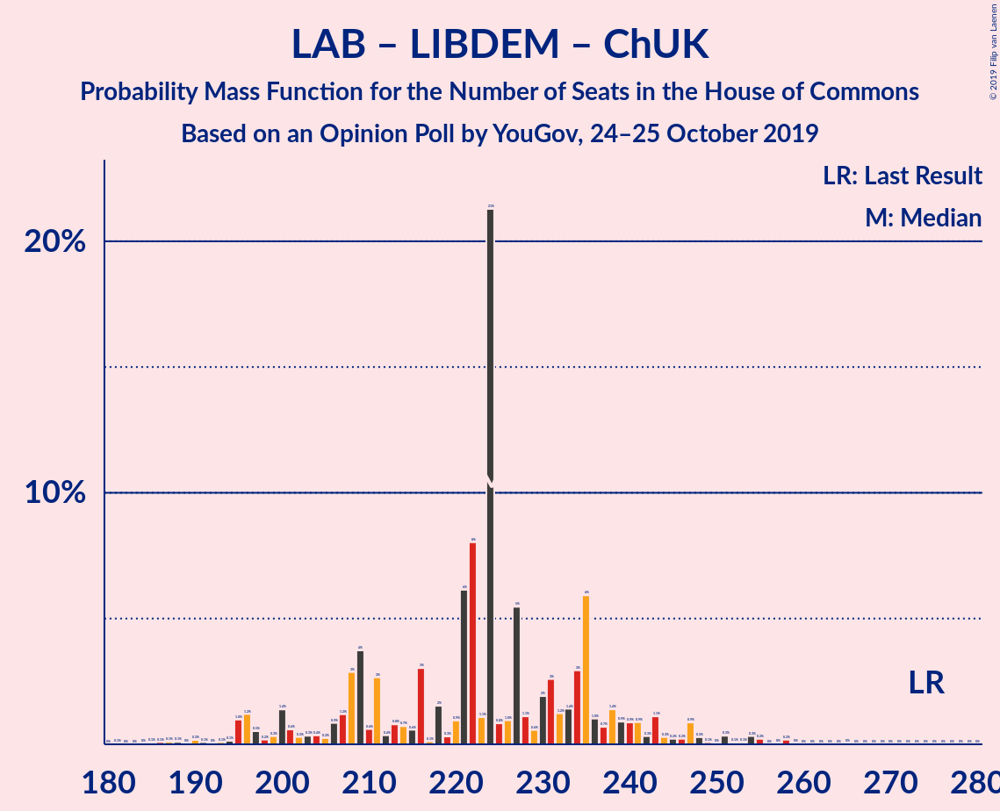

| Number of Seats | Probability | Accumulated | Special Marks |
|:---------------:|:-----------:|:-----------:|:-------------:|
| 181 | 0.1% | 100% |  |
| 182 | 0% | 99.9% |  |
| 183 | 0% | 99.9% |  |
| 184 | 0% | 99.9% |  |
| 185 | 0.1% | 99.9% |  |
| 186 | 0.1% | 99.8% |  |
| 187 | 0.1% | 99.7% |  |
| 188 | 0.1% | 99.6% |  |
| 189 | 0% | 99.5% |  |
| 190 | 0.2% | 99.5% |  |
| 191 | 0.1% | 99.3% |  |
| 192 | 0% | 99.2% |  |
| 193 | 0.1% | 99.2% |  |
| 194 | 0.1% | 99.1% |  |
| 195 | 1.0% | 99.0% |  |
| 196 | 1.2% | 98% |  |
| 197 | 0.5% | 97% |  |
| 198 | 0.2% | 96% |  |
| 199 | 0.3% | 96% |  |
| 200 | 1.4% | 96% |  |
| 201 | 0.6% | 94% |  |
| 202 | 0.3% | 94% |  |
| 203 | 0.3% | 93% |  |
| 204 | 0.4% | 93% |  |
| 205 | 0.2% | 93% |  |
| 206 | 0.9% | 93% |  |
| 207 | 1.2% | 92% |  |
| 208 | 3% | 90% |  |
| 209 | 4% | 88% |  |
| 210 | 0.6% | 84% |  |
| 211 | 3% | 83% |  |
| 212 | 0.4% | 81% |  |
| 213 | 0.8% | 80% |  |
| 214 | 0.7% | 79% |  |
| 215 | 0.6% | 79% |  |
| 216 | 3% | 78% |  |
| 217 | 0.1% | 75% |  |
| 218 | 2% | 75% |  |
| 219 | 0.3% | 73% |  |
| 220 | 0.9% | 73% |  |
| 221 | 6% | 72% |  |
| 222 | 8% | 66% |  |
| 223 | 1.1% | 58% |  |
| 224 | 21% | 57% |  |
| 225 | 0.8% | 36% |  |
| 226 | 1.0% | 35% | Median |
| 227 | 5% | 34% |  |
| 228 | 1.1% | 28% |  |
| 229 | 0.6% | 27% |  |
| 230 | 2% | 27% |  |
| 231 | 3% | 25% |  |
| 232 | 1.2% | 22% |  |
| 233 | 1.4% | 21% |  |
| 234 | 3% | 20% |  |
| 235 | 6% | 17% |  |
| 236 | 1.0% | 11% |  |
| 237 | 0.7% | 10% |  |
| 238 | 1.4% | 9% |  |
| 239 | 0.9% | 8% |  |
| 240 | 0.9% | 7% |  |
| 241 | 0.9% | 6% |  |
| 242 | 0.3% | 5% |  |
| 243 | 1.1% | 5% |  |
| 244 | 0.3% | 3% |  |
| 245 | 0.2% | 3% |  |
| 246 | 0.2% | 3% |  |
| 247 | 0.9% | 3% |  |
| 248 | 0.3% | 2% |  |
| 249 | 0.1% | 2% |  |
| 250 | 0% | 2% |  |
| 251 | 0.3% | 1.5% |  |
| 252 | 0.1% | 1.1% |  |
| 253 | 0.1% | 1.1% |  |
| 254 | 0.3% | 1.0% |  |
| 255 | 0.2% | 0.7% |  |
| 256 | 0% | 0.5% |  |
| 257 | 0% | 0.4% |  |
| 258 | 0.2% | 0.4% |  |
| 259 | 0% | 0.2% |  |
| 260 | 0% | 0.2% |  |
| 261 | 0% | 0.2% |  |
| 262 | 0% | 0.2% |  |
| 263 | 0% | 0.1% |  |
| 264 | 0% | 0.1% |  |
| 265 | 0% | 0.1% |  |
| 266 | 0% | 0.1% |  |
| 267 | 0% | 0.1% |  |
| 268 | 0% | 0.1% |  |
| 269 | 0% | 0% |  |
| 270 | 0% | 0% |  |
| 271 | 0% | 0% |  |
| 272 | 0% | 0% |  |
| 273 | 0% | 0% |  |
| 274 | 0% | 0% | Last Result |

### Labour Party – Liberal Democrats

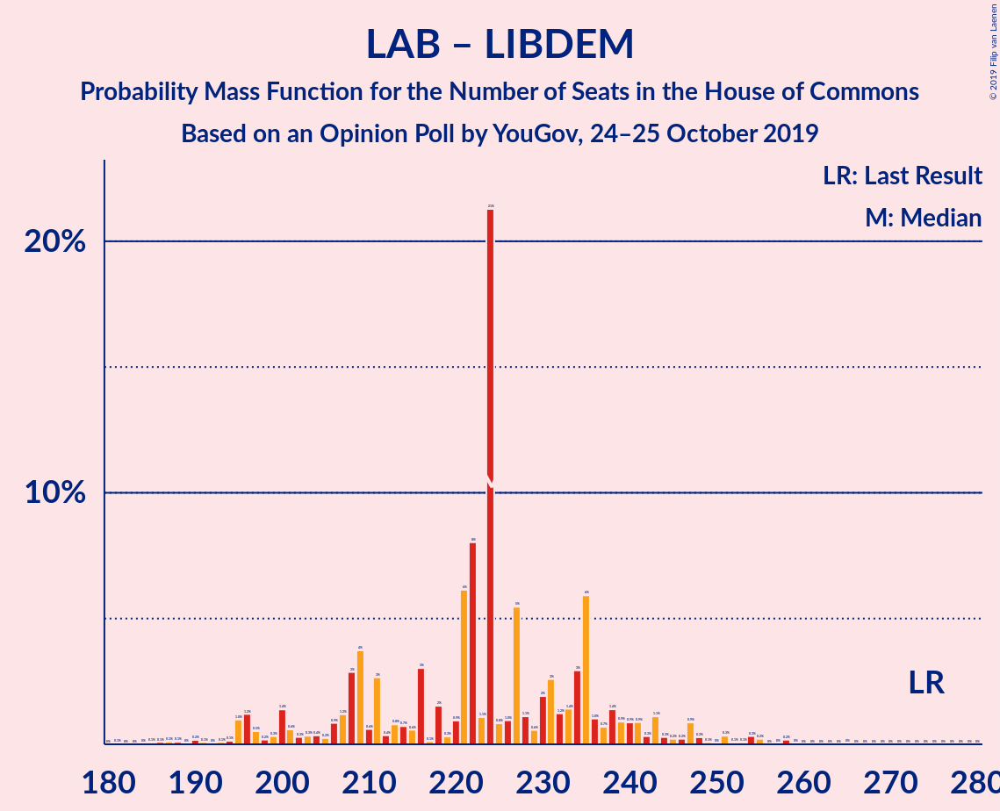

| Number of Seats | Probability | Accumulated | Special Marks |
|:---------------:|:-----------:|:-----------:|:-------------:|
| 181 | 0.1% | 100% |  |
| 182 | 0% | 99.9% |  |
| 183 | 0% | 99.9% |  |
| 184 | 0% | 99.9% |  |
| 185 | 0.1% | 99.9% |  |
| 186 | 0.1% | 99.8% |  |
| 187 | 0.1% | 99.7% |  |
| 188 | 0.1% | 99.6% |  |
| 189 | 0% | 99.5% |  |
| 190 | 0.2% | 99.5% |  |
| 191 | 0.1% | 99.3% |  |
| 192 | 0% | 99.2% |  |
| 193 | 0.1% | 99.2% |  |
| 194 | 0.1% | 99.1% |  |
| 195 | 1.0% | 99.0% |  |
| 196 | 1.2% | 98% |  |
| 197 | 0.5% | 97% |  |
| 198 | 0.2% | 96% |  |
| 199 | 0.3% | 96% |  |
| 200 | 1.4% | 96% |  |
| 201 | 0.6% | 94% |  |
| 202 | 0.3% | 94% |  |
| 203 | 0.3% | 93% |  |
| 204 | 0.4% | 93% |  |
| 205 | 0.2% | 93% |  |
| 206 | 0.9% | 93% |  |
| 207 | 1.2% | 92% |  |
| 208 | 3% | 90% |  |
| 209 | 4% | 88% |  |
| 210 | 0.6% | 84% |  |
| 211 | 3% | 83% |  |
| 212 | 0.4% | 81% |  |
| 213 | 0.8% | 80% |  |
| 214 | 0.7% | 79% |  |
| 215 | 0.6% | 79% |  |
| 216 | 3% | 78% |  |
| 217 | 0.1% | 75% |  |
| 218 | 2% | 75% |  |
| 219 | 0.3% | 73% |  |
| 220 | 0.9% | 73% |  |
| 221 | 6% | 72% |  |
| 222 | 8% | 66% |  |
| 223 | 1.1% | 58% |  |
| 224 | 21% | 57% |  |
| 225 | 0.8% | 36% |  |
| 226 | 1.0% | 35% | Median |
| 227 | 5% | 34% |  |
| 228 | 1.1% | 28% |  |
| 229 | 0.6% | 27% |  |
| 230 | 2% | 27% |  |
| 231 | 3% | 25% |  |
| 232 | 1.2% | 22% |  |
| 233 | 1.4% | 21% |  |
| 234 | 3% | 20% |  |
| 235 | 6% | 17% |  |
| 236 | 1.0% | 11% |  |
| 237 | 0.7% | 10% |  |
| 238 | 1.4% | 9% |  |
| 239 | 0.9% | 8% |  |
| 240 | 0.9% | 7% |  |
| 241 | 0.9% | 6% |  |
| 242 | 0.3% | 5% |  |
| 243 | 1.1% | 5% |  |
| 244 | 0.3% | 3% |  |
| 245 | 0.2% | 3% |  |
| 246 | 0.2% | 3% |  |
| 247 | 0.9% | 3% |  |
| 248 | 0.3% | 2% |  |
| 249 | 0.1% | 2% |  |
| 250 | 0% | 2% |  |
| 251 | 0.3% | 1.5% |  |
| 252 | 0.1% | 1.1% |  |
| 253 | 0.1% | 1.1% |  |
| 254 | 0.3% | 1.0% |  |
| 255 | 0.2% | 0.7% |  |
| 256 | 0% | 0.5% |  |
| 257 | 0% | 0.4% |  |
| 258 | 0.2% | 0.4% |  |
| 259 | 0% | 0.2% |  |
| 260 | 0% | 0.2% |  |
| 261 | 0% | 0.2% |  |
| 262 | 0% | 0.2% |  |
| 263 | 0% | 0.1% |  |
| 264 | 0% | 0.1% |  |
| 265 | 0% | 0.1% |  |
| 266 | 0% | 0.1% |  |
| 267 | 0% | 0.1% |  |
| 268 | 0% | 0.1% |  |
| 269 | 0% | 0% |  |
| 270 | 0% | 0% |  |
| 271 | 0% | 0% |  |
| 272 | 0% | 0% |  |
| 273 | 0% | 0% |  |
| 274 | 0% | 0% | Last Result |

### Labour Party – Scottish National Party – Plaid Cymru

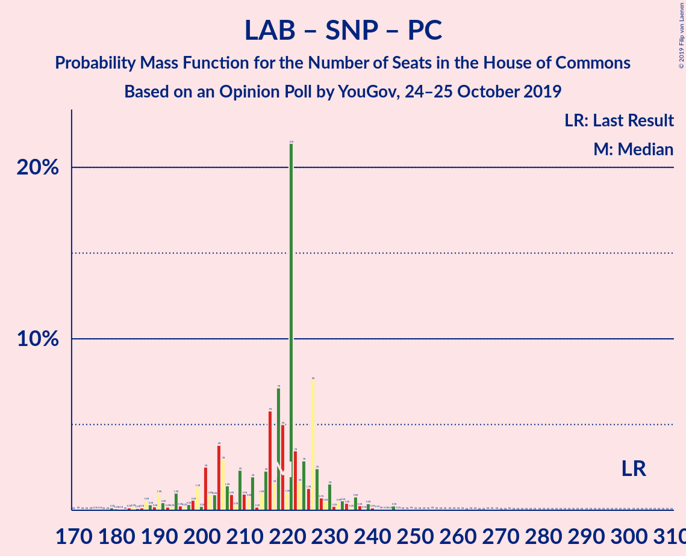

| Number of Seats | Probability | Accumulated | Special Marks |
|:---------------:|:-----------:|:-----------:|:-------------:|
| 171 | 0% | 100% |  |
| 172 | 0% | 99.9% |  |
| 173 | 0% | 99.9% |  |
| 174 | 0% | 99.9% |  |
| 175 | 0.1% | 99.9% |  |
| 176 | 0.1% | 99.8% |  |
| 177 | 0% | 99.8% |  |
| 178 | 0% | 99.8% |  |
| 179 | 0.2% | 99.7% |  |
| 180 | 0.1% | 99.6% |  |
| 181 | 0.1% | 99.5% |  |
| 182 | 0% | 99.4% |  |
| 183 | 0.1% | 99.4% |  |
| 184 | 0.2% | 99.2% |  |
| 185 | 0.1% | 99.1% |  |
| 186 | 0.1% | 99.0% |  |
| 187 | 0.6% | 98.8% |  |
| 188 | 0.3% | 98% |  |
| 189 | 0.2% | 98% |  |
| 190 | 1.0% | 98% |  |
| 191 | 0.4% | 97% |  |
| 192 | 0.2% | 96% |  |
| 193 | 0.2% | 96% |  |
| 194 | 1.0% | 96% |  |
| 195 | 0.3% | 95% |  |
| 196 | 0.2% | 95% |  |
| 197 | 0.3% | 94% |  |
| 198 | 0.6% | 94% |  |
| 199 | 1.3% | 93% |  |
| 200 | 0.2% | 92% |  |
| 201 | 3% | 92% |  |
| 202 | 0.9% | 89% |  |
| 203 | 0.9% | 88% |  |
| 204 | 4% | 87% |  |
| 205 | 3% | 84% |  |
| 206 | 1.4% | 81% |  |
| 207 | 0.9% | 79% |  |
| 208 | 0.3% | 78% |  |
| 209 | 2% | 78% |  |
| 210 | 0.9% | 76% |  |
| 211 | 0.8% | 75% |  |
| 212 | 2% | 74% |  |
| 213 | 0.2% | 72% |  |
| 214 | 1.0% | 72% |  |
| 215 | 2% | 71% |  |
| 216 | 6% | 69% |  |
| 217 | 2% | 63% |  |
| 218 | 7% | 61% |  |
| 219 | 5% | 54% |  |
| 220 | 1.0% | 49% | Median |
| 221 | 21% | 48% |  |
| 222 | 3% | 27% |  |
| 223 | 2% | 23% |  |
| 224 | 3% | 21% |  |
| 225 | 1.3% | 19% |  |
| 226 | 8% | 17% |  |
| 227 | 2% | 10% |  |
| 228 | 0.7% | 7% |  |
| 229 | 0.5% | 6% |  |
| 230 | 2% | 6% |  |
| 231 | 0.2% | 4% |  |
| 232 | 0.5% | 4% |  |
| 233 | 0.6% | 4% |  |
| 234 | 0.4% | 3% |  |
| 235 | 0.2% | 3% |  |
| 236 | 0.8% | 3% |  |
| 237 | 0.3% | 2% |  |
| 238 | 0.1% | 2% |  |
| 239 | 0.4% | 1.4% |  |
| 240 | 0.1% | 1.0% |  |
| 241 | 0.1% | 0.9% |  |
| 242 | 0% | 0.8% |  |
| 243 | 0.1% | 0.7% |  |
| 244 | 0.1% | 0.7% |  |
| 245 | 0.3% | 0.6% |  |
| 246 | 0.1% | 0.4% |  |
| 247 | 0% | 0.3% |  |
| 248 | 0% | 0.3% |  |
| 249 | 0% | 0.3% |  |
| 250 | 0% | 0.2% |  |
| 251 | 0% | 0.2% |  |
| 252 | 0% | 0.2% |  |
| 253 | 0% | 0.2% |  |
| 254 | 0% | 0.1% |  |
| 255 | 0% | 0.1% |  |
| 256 | 0% | 0.1% |  |
| 257 | 0% | 0.1% |  |
| 258 | 0% | 0.1% |  |
| 259 | 0% | 0% |  |
| 260 | 0% | 0% |  |
| 261 | 0% | 0% |  |
| 262 | 0% | 0% |  |
| 263 | 0% | 0% |  |
| 264 | 0% | 0% |  |
| 265 | 0% | 0% |  |
| 266 | 0% | 0% |  |
| 267 | 0% | 0% |  |
| 268 | 0% | 0% |  |
| 269 | 0% | 0% |  |
| 270 | 0% | 0% |  |
| 271 | 0% | 0% |  |
| 272 | 0% | 0% |  |
| 273 | 0% | 0% |  |
| 274 | 0% | 0% |  |
| 275 | 0% | 0% |  |
| 276 | 0% | 0% |  |
| 277 | 0% | 0% |  |
| 278 | 0% | 0% |  |
| 279 | 0% | 0% |  |
| 280 | 0% | 0% |  |
| 281 | 0% | 0% |  |
| 282 | 0% | 0% |  |
| 283 | 0% | 0% |  |
| 284 | 0% | 0% |  |
| 285 | 0% | 0% |  |
| 286 | 0% | 0% |  |
| 287 | 0% | 0% |  |
| 288 | 0% | 0% |  |
| 289 | 0% | 0% |  |
| 290 | 0% | 0% |  |
| 291 | 0% | 0% |  |
| 292 | 0% | 0% |  |
| 293 | 0% | 0% |  |
| 294 | 0% | 0% |  |
| 295 | 0% | 0% |  |
| 296 | 0% | 0% |  |
| 297 | 0% | 0% |  |
| 298 | 0% | 0% |  |
| 299 | 0% | 0% |  |
| 300 | 0% | 0% |  |
| 301 | 0% | 0% | Last Result |

### Labour Party – Scottish National Party

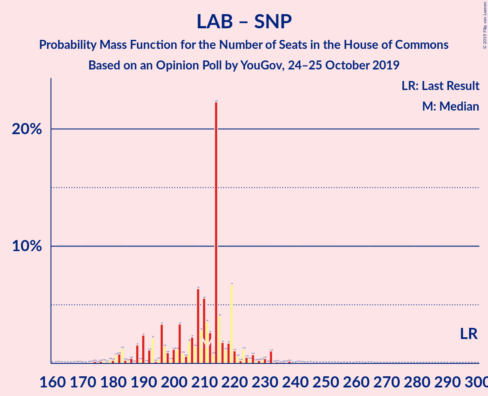

| Number of Seats | Probability | Accumulated | Special Marks |
|:---------------:|:-----------:|:-----------:|:-------------:|
| 162 | 0.1% | 100% |  |
| 163 | 0% | 99.9% |  |
| 164 | 0% | 99.9% |  |
| 165 | 0% | 99.9% |  |
| 166 | 0% | 99.9% |  |
| 167 | 0% | 99.8% |  |
| 168 | 0.1% | 99.8% |  |
| 169 | 0.1% | 99.8% |  |
| 170 | 0% | 99.7% |  |
| 171 | 0% | 99.7% |  |
| 172 | 0% | 99.7% |  |
| 173 | 0.1% | 99.6% |  |
| 174 | 0.2% | 99.5% |  |
| 175 | 0.1% | 99.4% |  |
| 176 | 0.2% | 99.3% |  |
| 177 | 0.2% | 99.1% |  |
| 178 | 0.1% | 98.9% |  |
| 179 | 0.3% | 98.8% |  |
| 180 | 0.3% | 98.5% |  |
| 181 | 0.7% | 98% |  |
| 182 | 0.8% | 98% |  |
| 183 | 1.3% | 97% |  |
| 184 | 0.3% | 96% |  |
| 185 | 0.2% | 95% |  |
| 186 | 0.4% | 95% |  |
| 187 | 0.1% | 95% |  |
| 188 | 2% | 95% |  |
| 189 | 0.3% | 93% |  |
| 190 | 2% | 93% |  |
| 191 | 0.1% | 90% |  |
| 192 | 1.1% | 90% |  |
| 193 | 2% | 89% |  |
| 194 | 0.2% | 87% |  |
| 195 | 0.4% | 87% |  |
| 196 | 3% | 86% |  |
| 197 | 1.4% | 83% |  |
| 198 | 0.9% | 81% |  |
| 199 | 0.3% | 81% |  |
| 200 | 1.2% | 80% |  |
| 201 | 1.2% | 79% |  |
| 202 | 3% | 78% |  |
| 203 | 0.9% | 74% |  |
| 204 | 0.6% | 74% |  |
| 205 | 2% | 73% |  |
| 206 | 2% | 71% |  |
| 207 | 1.4% | 69% |  |
| 208 | 6% | 67% |  |
| 209 | 3% | 61% |  |
| 210 | 6% | 58% |  |
| 211 | 4% | 53% |  |
| 212 | 3% | 49% |  |
| 213 | 0.8% | 47% | Median |
| 214 | 22% | 46% |  |
| 215 | 4% | 23% |  |
| 216 | 2% | 19% |  |
| 217 | 1.1% | 18% |  |
| 218 | 2% | 16% |  |
| 219 | 7% | 15% |  |
| 220 | 1.1% | 8% |  |
| 221 | 0.6% | 7% |  |
| 222 | 0.2% | 6% |  |
| 223 | 1.2% | 6% |  |
| 224 | 0.5% | 5% |  |
| 225 | 0.4% | 4% |  |
| 226 | 0.7% | 4% |  |
| 227 | 0.2% | 3% |  |
| 228 | 0.2% | 3% |  |
| 229 | 0.3% | 3% |  |
| 230 | 0.4% | 3% |  |
| 231 | 0.1% | 2% |  |
| 232 | 1.1% | 2% |  |
| 233 | 0.1% | 1.0% |  |
| 234 | 0.1% | 0.9% |  |
| 235 | 0% | 0.8% |  |
| 236 | 0.1% | 0.8% |  |
| 237 | 0.1% | 0.7% |  |
| 238 | 0.2% | 0.6% |  |
| 239 | 0% | 0.4% |  |
| 240 | 0% | 0.4% |  |
| 241 | 0.1% | 0.4% |  |
| 242 | 0.1% | 0.3% |  |
| 243 | 0% | 0.2% |  |
| 244 | 0% | 0.2% |  |
| 245 | 0% | 0.2% |  |
| 246 | 0% | 0.1% |  |
| 247 | 0% | 0.1% |  |
| 248 | 0% | 0.1% |  |
| 249 | 0% | 0.1% |  |
| 250 | 0% | 0.1% |  |
| 251 | 0% | 0.1% |  |
| 252 | 0% | 0.1% |  |
| 253 | 0% | 0.1% |  |
| 254 | 0% | 0% |  |
| 255 | 0% | 0% |  |
| 256 | 0% | 0% |  |
| 257 | 0% | 0% |  |
| 258 | 0% | 0% |  |
| 259 | 0% | 0% |  |
| 260 | 0% | 0% |  |
| 261 | 0% | 0% |  |
| 262 | 0% | 0% |  |
| 263 | 0% | 0% |  |
| 264 | 0% | 0% |  |
| 265 | 0% | 0% |  |
| 266 | 0% | 0% |  |
| 267 | 0% | 0% |  |
| 268 | 0% | 0% |  |
| 269 | 0% | 0% |  |
| 270 | 0% | 0% |  |
| 271 | 0% | 0% |  |
| 272 | 0% | 0% |  |
| 273 | 0% | 0% |  |
| 274 | 0% | 0% |  |
| 275 | 0% | 0% |  |
| 276 | 0% | 0% |  |
| 277 | 0% | 0% |  |
| 278 | 0% | 0% |  |
| 279 | 0% | 0% |  |
| 280 | 0% | 0% |  |
| 281 | 0% | 0% |  |
| 282 | 0% | 0% |  |
| 283 | 0% | 0% |  |
| 284 | 0% | 0% |  |
| 285 | 0% | 0% |  |
| 286 | 0% | 0% |  |
| 287 | 0% | 0% |  |
| 288 | 0% | 0% |  |
| 289 | 0% | 0% |  |
| 290 | 0% | 0% |  |
| 291 | 0% | 0% |  |
| 292 | 0% | 0% |  |
| 293 | 0% | 0% |  |
| 294 | 0% | 0% |  |
| 295 | 0% | 0% |  |
| 296 | 0% | 0% |  |
| 297 | 0% | 0% | Last Result |

### Labour Party – Plaid Cymru

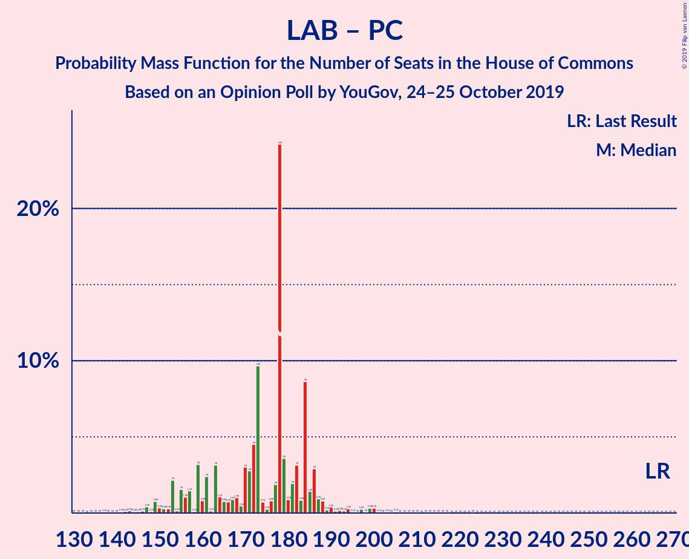

| Number of Seats | Probability | Accumulated | Special Marks |
|:---------------:|:-----------:|:-----------:|:-------------:|
| 135 | 0% | 100% |  |
| 136 | 0% | 99.9% |  |
| 137 | 0.1% | 99.9% |  |
| 138 | 0% | 99.9% |  |
| 139 | 0% | 99.9% |  |
| 140 | 0% | 99.8% |  |
| 141 | 0.1% | 99.8% |  |
| 142 | 0.1% | 99.8% |  |
| 143 | 0.2% | 99.6% |  |
| 144 | 0.1% | 99.5% |  |
| 145 | 0.1% | 99.4% |  |
| 146 | 0.1% | 99.3% |  |
| 147 | 0.4% | 99.2% |  |
| 148 | 0.1% | 98.7% |  |
| 149 | 0.8% | 98.7% |  |
| 150 | 0.3% | 98% |  |
| 151 | 0.3% | 98% |  |
| 152 | 0.3% | 97% |  |
| 153 | 2% | 97% |  |
| 154 | 0.1% | 95% |  |
| 155 | 2% | 95% |  |
| 156 | 1.0% | 93% |  |
| 157 | 1.5% | 92% |  |
| 158 | 0.1% | 91% |  |
| 159 | 3% | 91% |  |
| 160 | 0.8% | 87% |  |
| 161 | 2% | 86% |  |
| 162 | 0.1% | 84% |  |
| 163 | 3% | 84% |  |
| 164 | 1.1% | 81% |  |
| 165 | 0.8% | 80% |  |
| 166 | 0.7% | 79% |  |
| 167 | 0.9% | 78% |  |
| 168 | 1.0% | 77% |  |
| 169 | 0.5% | 76% |  |
| 170 | 3% | 76% |  |
| 171 | 3% | 73% |  |
| 172 | 5% | 70% |  |
| 173 | 10% | 66% |  |
| 174 | 0.7% | 56% |  |
| 175 | 0.3% | 55% |  |
| 176 | 0.8% | 55% |  |
| 177 | 2% | 54% | Median |
| 178 | 24% | 52% |  |
| 179 | 4% | 28% |  |
| 180 | 0.9% | 24% |  |
| 181 | 2% | 23% |  |
| 182 | 3% | 22% |  |
| 183 | 0.8% | 18% |  |
| 184 | 9% | 18% |  |
| 185 | 1.4% | 9% |  |
| 186 | 3% | 7% |  |
| 187 | 0.9% | 5% |  |
| 188 | 0.8% | 4% |  |
| 189 | 0.2% | 3% |  |
| 190 | 0.4% | 3% |  |
| 191 | 0.1% | 2% |  |
| 192 | 0.2% | 2% |  |
| 193 | 0.1% | 2% |  |
| 194 | 0.3% | 2% |  |
| 195 | 0.1% | 2% |  |
| 196 | 0% | 1.4% |  |
| 197 | 0.3% | 1.4% |  |
| 198 | 0% | 1.1% |  |
| 199 | 0.3% | 1.1% |  |
| 200 | 0.3% | 0.8% |  |
| 201 | 0.1% | 0.4% |  |
| 202 | 0% | 0.4% |  |
| 203 | 0.1% | 0.3% |  |
| 204 | 0% | 0.3% |  |
| 205 | 0.1% | 0.2% |  |
| 206 | 0% | 0.2% |  |
| 207 | 0% | 0.1% |  |
| 208 | 0% | 0.1% |  |
| 209 | 0% | 0.1% |  |
| 210 | 0% | 0.1% |  |
| 211 | 0% | 0.1% |  |
| 212 | 0% | 0.1% |  |
| 213 | 0% | 0.1% |  |
| 214 | 0% | 0% |  |
| 215 | 0% | 0% |  |
| 216 | 0% | 0% |  |
| 217 | 0% | 0% |  |
| 218 | 0% | 0% |  |
| 219 | 0% | 0% |  |
| 220 | 0% | 0% |  |
| 221 | 0% | 0% |  |
| 222 | 0% | 0% |  |
| 223 | 0% | 0% |  |
| 224 | 0% | 0% |  |
| 225 | 0% | 0% |  |
| 226 | 0% | 0% |  |
| 227 | 0% | 0% |  |
| 228 | 0% | 0% |  |
| 229 | 0% | 0% |  |
| 230 | 0% | 0% |  |
| 231 | 0% | 0% |  |
| 232 | 0% | 0% |  |
| 233 | 0% | 0% |  |
| 234 | 0% | 0% |  |
| 235 | 0% | 0% |  |
| 236 | 0% | 0% |  |
| 237 | 0% | 0% |  |
| 238 | 0% | 0% |  |
| 239 | 0% | 0% |  |
| 240 | 0% | 0% |  |
| 241 | 0% | 0% |  |
| 242 | 0% | 0% |  |
| 243 | 0% | 0% |  |
| 244 | 0% | 0% |  |
| 245 | 0% | 0% |  |
| 246 | 0% | 0% |  |
| 247 | 0% | 0% |  |
| 248 | 0% | 0% |  |
| 249 | 0% | 0% |  |
| 250 | 0% | 0% |  |
| 251 | 0% | 0% |  |
| 252 | 0% | 0% |  |
| 253 | 0% | 0% |  |
| 254 | 0% | 0% |  |
| 255 | 0% | 0% |  |
| 256 | 0% | 0% |  |
| 257 | 0% | 0% |  |
| 258 | 0% | 0% |  |
| 259 | 0% | 0% |  |
| 260 | 0% | 0% |  |
| 261 | 0% | 0% |  |
| 262 | 0% | 0% |  |
| 263 | 0% | 0% |  |
| 264 | 0% | 0% |  |
| 265 | 0% | 0% |  |
| 266 | 0% | 0% | Last Result |

### Labour Party – Change UK

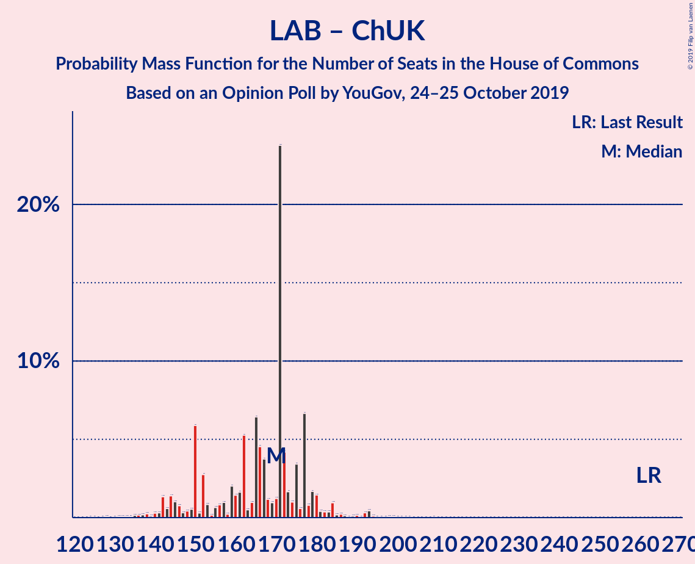

| Number of Seats | Probability | Accumulated | Special Marks |
|:---------------:|:-----------:|:-----------:|:-------------:|
| 126 | 0% | 100% |  |
| 127 | 0% | 99.9% |  |
| 128 | 0.1% | 99.9% |  |
| 129 | 0% | 99.9% |  |
| 130 | 0% | 99.9% |  |
| 131 | 0.1% | 99.8% |  |
| 132 | 0.1% | 99.8% |  |
| 133 | 0.1% | 99.7% |  |
| 134 | 0% | 99.7% |  |
| 135 | 0.1% | 99.6% |  |
| 136 | 0.2% | 99.5% |  |
| 137 | 0.2% | 99.3% |  |
| 138 | 0.2% | 99.1% |  |
| 139 | 0.1% | 98.9% |  |
| 140 | 0.3% | 98.8% |  |
| 141 | 0.3% | 98% |  |
| 142 | 1.3% | 98% |  |
| 143 | 0.6% | 97% |  |
| 144 | 1.4% | 96% |  |
| 145 | 1.0% | 95% |  |
| 146 | 0.8% | 94% |  |
| 147 | 0.3% | 93% |  |
| 148 | 0.4% | 93% |  |
| 149 | 0.5% | 92% |  |
| 150 | 6% | 92% |  |
| 151 | 0.3% | 86% |  |
| 152 | 3% | 86% |  |
| 153 | 0.8% | 83% |  |
| 154 | 0.2% | 82% |  |
| 155 | 0.6% | 82% |  |
| 156 | 0.8% | 81% |  |
| 157 | 1.0% | 80% |  |
| 158 | 0.2% | 79% |  |
| 159 | 2% | 79% |  |
| 160 | 1.4% | 77% |  |
| 161 | 2% | 76% |  |
| 162 | 5% | 74% |  |
| 163 | 0.5% | 69% |  |
| 164 | 1.0% | 68% |  |
| 165 | 6% | 67% |  |
| 166 | 5% | 61% |  |
| 167 | 4% | 56% |  |
| 168 | 1.2% | 53% |  |
| 169 | 1.0% | 51% |  |
| 170 | 1.2% | 51% | Median |
| 171 | 24% | 49% |  |
| 172 | 4% | 26% |  |
| 173 | 2% | 21% |  |
| 174 | 1.0% | 20% |  |
| 175 | 3% | 19% |  |
| 176 | 0.6% | 15% |  |
| 177 | 7% | 15% |  |
| 178 | 0.8% | 8% |  |
| 179 | 2% | 7% |  |
| 180 | 1.4% | 6% |  |
| 181 | 0.4% | 4% |  |
| 182 | 0.4% | 4% |  |
| 183 | 0.4% | 3% |  |
| 184 | 1.0% | 3% |  |
| 185 | 0.2% | 2% |  |
| 186 | 0.2% | 2% |  |
| 187 | 0.1% | 2% |  |
| 188 | 0% | 1.5% |  |
| 189 | 0.1% | 1.5% |  |
| 190 | 0.1% | 1.4% |  |
| 191 | 0% | 1.2% |  |
| 192 | 0.3% | 1.2% |  |
| 193 | 0.4% | 0.9% |  |
| 194 | 0.1% | 0.4% |  |
| 195 | 0% | 0.3% |  |
| 196 | 0% | 0.3% |  |
| 197 | 0% | 0.3% |  |
| 198 | 0.1% | 0.2% |  |
| 199 | 0.1% | 0.2% |  |
| 200 | 0% | 0.1% |  |
| 201 | 0% | 0.1% |  |
| 202 | 0% | 0.1% |  |
| 203 | 0% | 0.1% |  |
| 204 | 0% | 0.1% |  |
| 205 | 0% | 0% |  |
| 206 | 0% | 0% |  |
| 207 | 0% | 0% |  |
| 208 | 0% | 0% |  |
| 209 | 0% | 0% |  |
| 210 | 0% | 0% |  |
| 211 | 0% | 0% |  |
| 212 | 0% | 0% |  |
| 213 | 0% | 0% |  |
| 214 | 0% | 0% |  |
| 215 | 0% | 0% |  |
| 216 | 0% | 0% |  |
| 217 | 0% | 0% |  |
| 218 | 0% | 0% |  |
| 219 | 0% | 0% |  |
| 220 | 0% | 0% |  |
| 221 | 0% | 0% |  |
| 222 | 0% | 0% |  |
| 223 | 0% | 0% |  |
| 224 | 0% | 0% |  |
| 225 | 0% | 0% |  |
| 226 | 0% | 0% |  |
| 227 | 0% | 0% |  |
| 228 | 0% | 0% |  |
| 229 | 0% | 0% |  |
| 230 | 0% | 0% |  |
| 231 | 0% | 0% |  |
| 232 | 0% | 0% |  |
| 233 | 0% | 0% |  |
| 234 | 0% | 0% |  |
| 235 | 0% | 0% |  |
| 236 | 0% | 0% |  |
| 237 | 0% | 0% |  |
| 238 | 0% | 0% |  |
| 239 | 0% | 0% |  |
| 240 | 0% | 0% |  |
| 241 | 0% | 0% |  |
| 242 | 0% | 0% |  |
| 243 | 0% | 0% |  |
| 244 | 0% | 0% |  |
| 245 | 0% | 0% |  |
| 246 | 0% | 0% |  |
| 247 | 0% | 0% |  |
| 248 | 0% | 0% |  |
| 249 | 0% | 0% |  |
| 250 | 0% | 0% |  |
| 251 | 0% | 0% |  |
| 252 | 0% | 0% |  |
| 253 | 0% | 0% |  |
| 254 | 0% | 0% |  |
| 255 | 0% | 0% |  |
| 256 | 0% | 0% |  |
| 257 | 0% | 0% |  |
| 258 | 0% | 0% |  |
| 259 | 0% | 0% |  |
| 260 | 0% | 0% |  |
| 261 | 0% | 0% |  |
| 262 | 0% | 0% | Last Result |

### Labour Party

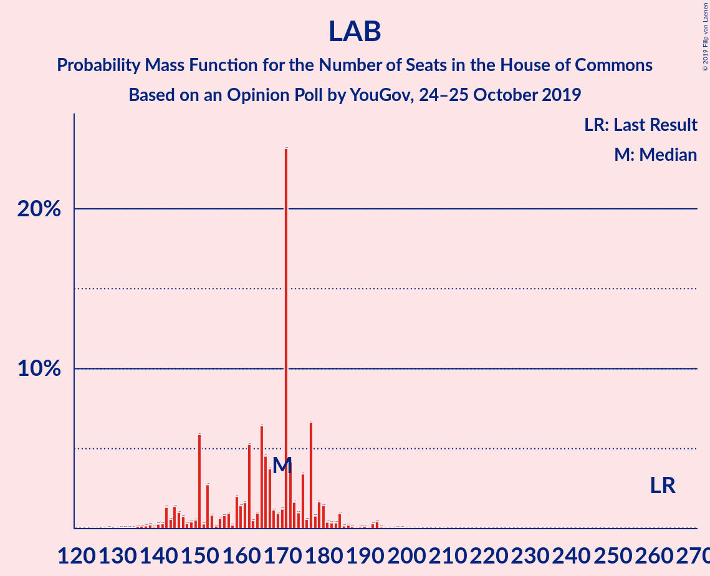

| Number of Seats | Probability | Accumulated | Special Marks |
|:---------------:|:-----------:|:-----------:|:-------------:|
| 126 | 0% | 100% |  |
| 127 | 0% | 99.9% |  |
| 128 | 0.1% | 99.9% |  |
| 129 | 0% | 99.9% |  |
| 130 | 0% | 99.9% |  |
| 131 | 0.1% | 99.8% |  |
| 132 | 0.1% | 99.8% |  |
| 133 | 0.1% | 99.7% |  |
| 134 | 0% | 99.7% |  |
| 135 | 0.1% | 99.6% |  |
| 136 | 0.2% | 99.5% |  |
| 137 | 0.2% | 99.3% |  |
| 138 | 0.2% | 99.1% |  |
| 139 | 0.1% | 98.9% |  |
| 140 | 0.3% | 98.8% |  |
| 141 | 0.3% | 98% |  |
| 142 | 1.3% | 98% |  |
| 143 | 0.6% | 97% |  |
| 144 | 1.4% | 96% |  |
| 145 | 1.0% | 95% |  |
| 146 | 0.8% | 94% |  |
| 147 | 0.3% | 93% |  |
| 148 | 0.4% | 93% |  |
| 149 | 0.5% | 92% |  |
| 150 | 6% | 92% |  |
| 151 | 0.3% | 86% |  |
| 152 | 3% | 86% |  |
| 153 | 0.8% | 83% |  |
| 154 | 0.2% | 82% |  |
| 155 | 0.6% | 82% |  |
| 156 | 0.8% | 81% |  |
| 157 | 1.0% | 80% |  |
| 158 | 0.2% | 79% |  |
| 159 | 2% | 79% |  |
| 160 | 1.4% | 77% |  |
| 161 | 2% | 76% |  |
| 162 | 5% | 74% |  |
| 163 | 0.5% | 69% |  |
| 164 | 1.0% | 68% |  |
| 165 | 6% | 67% |  |
| 166 | 5% | 61% |  |
| 167 | 4% | 56% |  |
| 168 | 1.2% | 53% |  |
| 169 | 1.0% | 51% |  |
| 170 | 1.2% | 51% | Median |
| 171 | 24% | 49% |  |
| 172 | 4% | 26% |  |
| 173 | 2% | 21% |  |
| 174 | 1.0% | 20% |  |
| 175 | 3% | 19% |  |
| 176 | 0.6% | 15% |  |
| 177 | 7% | 15% |  |
| 178 | 0.8% | 8% |  |
| 179 | 2% | 7% |  |
| 180 | 1.4% | 6% |  |
| 181 | 0.4% | 4% |  |
| 182 | 0.4% | 4% |  |
| 183 | 0.4% | 3% |  |
| 184 | 1.0% | 3% |  |
| 185 | 0.2% | 2% |  |
| 186 | 0.2% | 2% |  |
| 187 | 0.1% | 2% |  |
| 188 | 0% | 1.5% |  |
| 189 | 0.1% | 1.5% |  |
| 190 | 0.1% | 1.4% |  |
| 191 | 0% | 1.2% |  |
| 192 | 0.3% | 1.2% |  |
| 193 | 0.4% | 0.9% |  |
| 194 | 0.1% | 0.4% |  |
| 195 | 0% | 0.3% |  |
| 196 | 0% | 0.3% |  |
| 197 | 0% | 0.3% |  |
| 198 | 0.1% | 0.2% |  |
| 199 | 0.1% | 0.2% |  |
| 200 | 0% | 0.1% |  |
| 201 | 0% | 0.1% |  |
| 202 | 0% | 0.1% |  |
| 203 | 0% | 0.1% |  |
| 204 | 0% | 0.1% |  |
| 205 | 0% | 0% |  |
| 206 | 0% | 0% |  |
| 207 | 0% | 0% |  |
| 208 | 0% | 0% |  |
| 209 | 0% | 0% |  |
| 210 | 0% | 0% |  |
| 211 | 0% | 0% |  |
| 212 | 0% | 0% |  |
| 213 | 0% | 0% |  |
| 214 | 0% | 0% |  |
| 215 | 0% | 0% |  |
| 216 | 0% | 0% |  |
| 217 | 0% | 0% |  |
| 218 | 0% | 0% |  |
| 219 | 0% | 0% |  |
| 220 | 0% | 0% |  |
| 221 | 0% | 0% |  |
| 222 | 0% | 0% |  |
| 223 | 0% | 0% |  |
| 224 | 0% | 0% |  |
| 225 | 0% | 0% |  |
| 226 | 0% | 0% |  |
| 227 | 0% | 0% |  |
| 228 | 0% | 0% |  |
| 229 | 0% | 0% |  |
| 230 | 0% | 0% |  |
| 231 | 0% | 0% |  |
| 232 | 0% | 0% |  |
| 233 | 0% | 0% |  |
| 234 | 0% | 0% |  |
| 235 | 0% | 0% |  |
| 236 | 0% | 0% |  |
| 237 | 0% | 0% |  |
| 238 | 0% | 0% |  |
| 239 | 0% | 0% |  |
| 240 | 0% | 0% |  |
| 241 | 0% | 0% |  |
| 242 | 0% | 0% |  |
| 243 | 0% | 0% |  |
| 244 | 0% | 0% |  |
| 245 | 0% | 0% |  |
| 246 | 0% | 0% |  |
| 247 | 0% | 0% |  |
| 248 | 0% | 0% |  |
| 249 | 0% | 0% |  |
| 250 | 0% | 0% |  |
| 251 | 0% | 0% |  |
| 252 | 0% | 0% |  |
| 253 | 0% | 0% |  |
| 254 | 0% | 0% |  |
| 255 | 0% | 0% |  |
| 256 | 0% | 0% |  |
| 257 | 0% | 0% |  |
| 258 | 0% | 0% |  |
| 259 | 0% | 0% |  |
| 260 | 0% | 0% |  |
| 261 | 0% | 0% |  |
| 262 | 0% | 0% | Last Result |

## Technical Information

### Opinion Poll

+ **Polling firm:** YouGov
+ **Commissioner(s):** —
+ **Fieldwork period:** 24–25 October 2019

### Calculations

+ **Sample size:** 1672
+ **Simulations done:** 1,048,576
+ **Error estimate:** 0.79%

