# Opinion Poll by ComRes for Remain United, 30 October–5 November 2019

<a href="#voting-intentions">Voting Intentions</a> | <a href="#seats">Seats</a> | <a href="#coalitions">Coalitions</a> | <a href="#technical-information">Technical Information</a>

## Voting Intentions

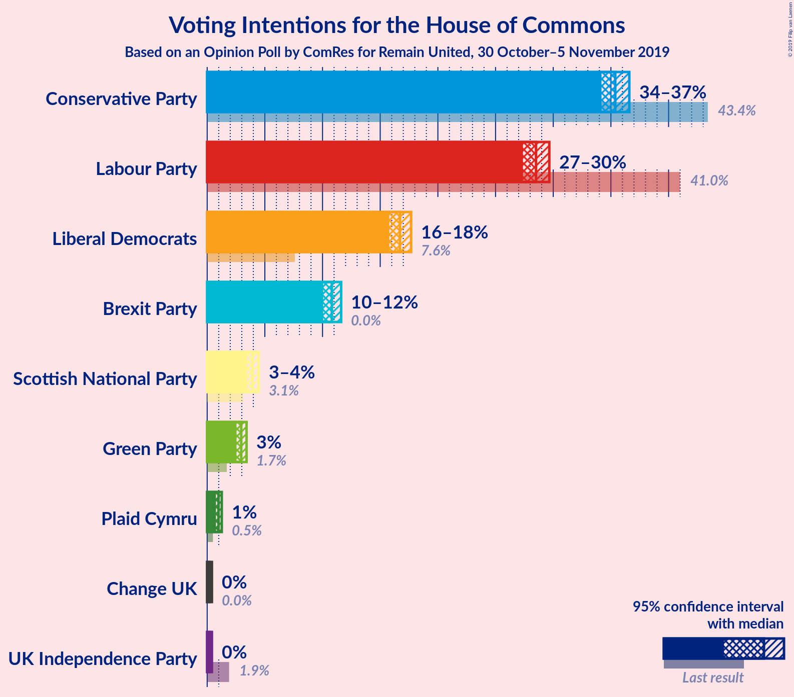

### Confidence Intervals

| Party | Last Result | Poll Result | 80% Confidence Interval | 90% Confidence Interval | 95% Confidence Interval | 99% Confidence Interval |
|:-----:|:-----------:|:-----------:|:-----------------------:|:-----------------------:|:-----------------------:|:-----------------------:|
| Conservative Party | 43.4% | 35.4% | 34.6–36.2% |34.4–36.4% |34.2–36.6% |33.8–37.0% |
| Labour Party | 41.0% | 28.5% | 27.8–29.3% |27.6–29.5% |27.4–29.7% |27.0–30.0% |
| Liberal Democrats | 7.6% | 16.7% | 16.1–17.3% |15.9–17.5% |15.8–17.7% |15.5–18.0% |
| Brexit Party | 0.0% | 10.8% | 10.3–11.3% |10.2–11.5% |10.0–11.6% |9.8–11.9% |
| Scottish National Party | 3.1% | 3.9% | 3.6–4.3% |3.5–4.4% |3.5–4.5% |3.3–4.6% |
| Green Party | 1.7% | 3.0% | 2.7–3.3% |2.6–3.3% |2.5–3.4% |2.4–3.6% |
| Plaid Cymru | 0.5% | 1.0% | 0.8–1.2% |0.8–1.2% |0.8–1.3% |0.7–1.4% |
| UK Independence Party | 1.9% | 0.2% | 0.2–0.4% |0.2–0.4% |0.1–0.4% |0.1–0.5% |
| Change UK | 0.0% | 0.2% | 0.2–0.4% |0.2–0.4% |0.1–0.4% |0.1–0.5% |

*Note:* The poll result column reflects the actual value used in the calculations. Published results may vary slightly, and in addition be rounded to fewer digits.

## Seats

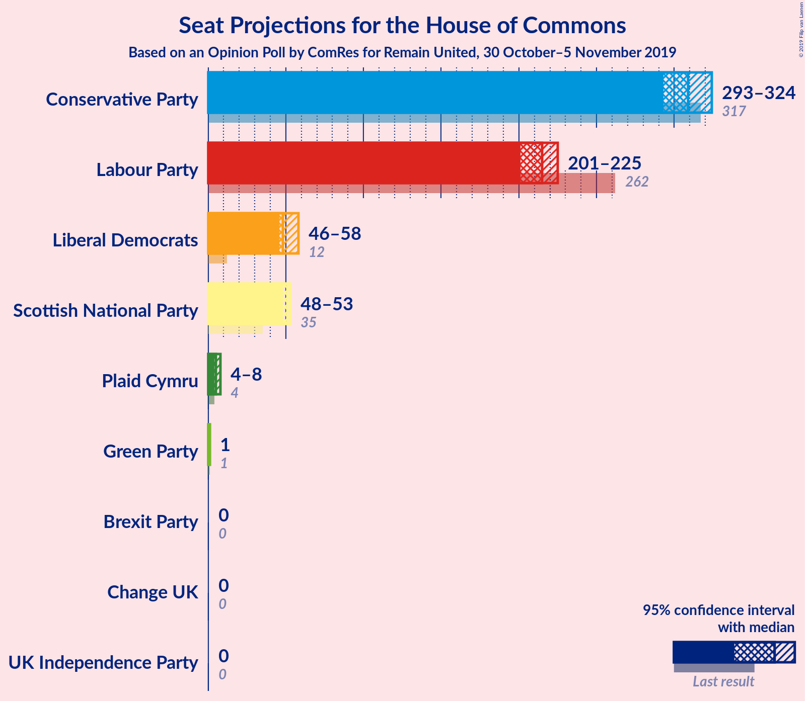

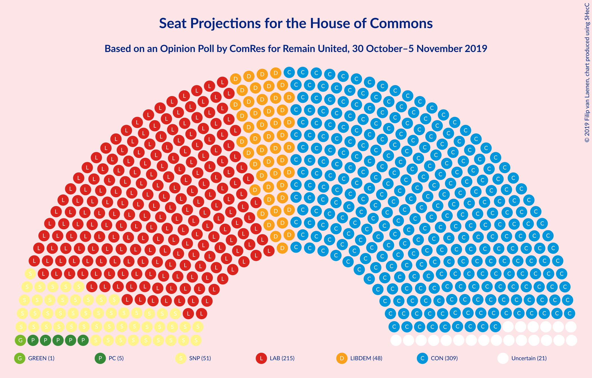

### Confidence Intervals

| Party | Last Result | Median | 80% Confidence Interval | 90% Confidence Interval | 95% Confidence Interval | 99% Confidence Interval |
|:-----:|:-----------:|:------:|:-----------------------:|:-----------------------:|:-----------------------:|:-----------------------:|
| <a href="#conservative-party">Conservative Party</a> | 317 | 309 | 303–321 |297–324 |293–324 |288–330 |
| <a href="#labour-party">Labour Party</a> | 262 | 215 | 202–221 |202–222 |201–225 |195–231 |
| <a href="#liberal-democrats">Liberal Democrats</a> | 12 | 48 | 47–56 |47–57 |46–58 |46–60 |
| <a href="#brexit-party">Brexit Party</a> | 0 | 0 | 0 |0 |0 |0 |
| <a href="#scottish-national-party">Scottish National Party</a> | 35 | 51 | 50–53 |49–53 |48–53 |46–53 |
| <a href="#green-party">Green Party</a> | 1 | 1 | 1 |1 |1 |1 |
| <a href="#plaid-cymru">Plaid Cymru</a> | 4 | 5 | 4–7 |4–8 |4–8 |4–9 |
| <a href="#uk-independence-party">UK Independence Party</a> | 0 | 0 | 0 |0 |0 |0 |
| <a href="#change-uk">Change UK</a> | 0 | 0 | 0 |0 |0 |0 |

### Conservative Party

*For a full overview of the results for this party, see the [Conservative Party](party-conservativeparty.html) page.*

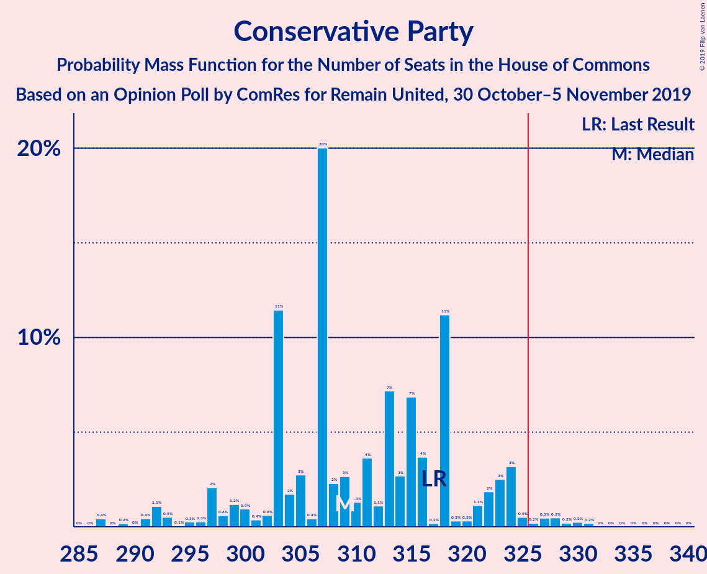

| Number of Seats | Probability | Accumulated | Special Marks |
|:---------------:|:-----------:|:-----------:|:-------------:|
| 286 | 0% | 100% |  |
| 287 | 0.4% | 99.9% |  |
| 288 | 0% | 99.5% |  |
| 289 | 0.2% | 99.5% |  |
| 290 | 0% | 99.3% |  |
| 291 | 0.4% | 99.3% |  |
| 292 | 1.1% | 98.8% |  |
| 293 | 0.5% | 98% |  |
| 294 | 0.1% | 97% |  |
| 295 | 0.3% | 97% |  |
| 296 | 0.3% | 97% |  |
| 297 | 2% | 97% |  |
| 298 | 0.6% | 95% |  |
| 299 | 1.2% | 94% |  |
| 300 | 0.9% | 93% |  |
| 301 | 0.4% | 92% |  |
| 302 | 0.6% | 91% |  |
| 303 | 11% | 91% |  |
| 304 | 2% | 79% |  |
| 305 | 3% | 78% |  |
| 306 | 0.4% | 75% |  |
| 307 | 20% | 75% |  |
| 308 | 2% | 55% |  |
| 309 | 3% | 52% | Median |
| 310 | 1.3% | 50% |  |
| 311 | 4% | 48% |  |
| 312 | 1.1% | 45% |  |
| 313 | 7% | 44% |  |
| 314 | 3% | 36% |  |
| 315 | 7% | 34% |  |
| 316 | 4% | 27% |  |
| 317 | 0.2% | 23% | Last Result |
| 318 | 11% | 23% |  |
| 319 | 0.3% | 12% |  |
| 320 | 0.3% | 11% |  |
| 321 | 1.1% | 11% |  |
| 322 | 2% | 10% |  |
| 323 | 3% | 8% |  |
| 324 | 3% | 6% |  |
| 325 | 0.5% | 2% |  |
| 326 | 0.2% | 2% | Majority |
| 327 | 0.5% | 2% |  |
| 328 | 0.5% | 1.2% |  |
| 329 | 0.2% | 0.8% |  |
| 330 | 0.2% | 0.6% |  |
| 331 | 0.2% | 0.3% |  |
| 332 | 0% | 0.1% |  |
| 333 | 0% | 0.1% |  |
| 334 | 0% | 0.1% |  |
| 335 | 0% | 0.1% |  |
| 336 | 0% | 0% |  |

### Labour Party

*For a full overview of the results for this party, see the [Labour Party](party-labourparty.html) page.*

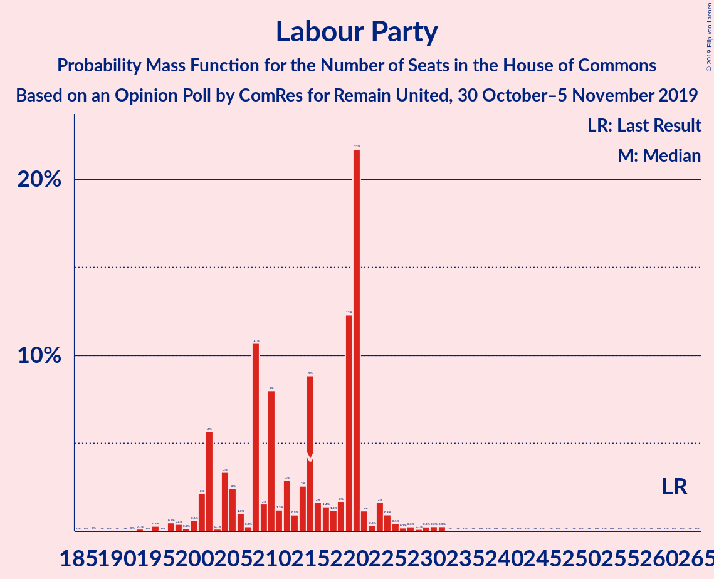

| Number of Seats | Probability | Accumulated | Special Marks |
|:---------------:|:-----------:|:-----------:|:-------------:|
| 189 | 0% | 100% |  |
| 190 | 0% | 99.9% |  |
| 191 | 0% | 99.9% |  |
| 192 | 0% | 99.9% |  |
| 193 | 0.1% | 99.9% |  |
| 194 | 0% | 99.7% |  |
| 195 | 0.3% | 99.7% |  |
| 196 | 0% | 99.4% |  |
| 197 | 0.5% | 99.4% |  |
| 198 | 0.4% | 98.9% |  |
| 199 | 0.2% | 98% |  |
| 200 | 0.6% | 98% |  |
| 201 | 2% | 98% |  |
| 202 | 6% | 96% |  |
| 203 | 0.1% | 90% |  |
| 204 | 3% | 90% |  |
| 205 | 2% | 86% |  |
| 206 | 1.0% | 84% |  |
| 207 | 0.3% | 83% |  |
| 208 | 11% | 83% |  |
| 209 | 2% | 72% |  |
| 210 | 8% | 70% |  |
| 211 | 1.2% | 62% |  |
| 212 | 3% | 61% |  |
| 213 | 0.9% | 58% |  |
| 214 | 3% | 57% |  |
| 215 | 9% | 55% | Median |
| 216 | 2% | 46% |  |
| 217 | 1.4% | 44% |  |
| 218 | 1.2% | 43% |  |
| 219 | 2% | 42% |  |
| 220 | 12% | 40% |  |
| 221 | 22% | 28% |  |
| 222 | 1.2% | 6% |  |
| 223 | 0.3% | 5% |  |
| 224 | 2% | 4% |  |
| 225 | 0.9% | 3% |  |
| 226 | 0.5% | 2% |  |
| 227 | 0.2% | 1.4% |  |
| 228 | 0.3% | 1.2% |  |
| 229 | 0.1% | 1.0% |  |
| 230 | 0.3% | 0.9% |  |
| 231 | 0.3% | 0.6% |  |
| 232 | 0.3% | 0.3% |  |
| 233 | 0% | 0% |  |
| 234 | 0% | 0% |  |
| 235 | 0% | 0% |  |
| 236 | 0% | 0% |  |
| 237 | 0% | 0% |  |
| 238 | 0% | 0% |  |
| 239 | 0% | 0% |  |
| 240 | 0% | 0% |  |
| 241 | 0% | 0% |  |
| 242 | 0% | 0% |  |
| 243 | 0% | 0% |  |
| 244 | 0% | 0% |  |
| 245 | 0% | 0% |  |
| 246 | 0% | 0% |  |
| 247 | 0% | 0% |  |
| 248 | 0% | 0% |  |
| 249 | 0% | 0% |  |
| 250 | 0% | 0% |  |
| 251 | 0% | 0% |  |
| 252 | 0% | 0% |  |
| 253 | 0% | 0% |  |
| 254 | 0% | 0% |  |
| 255 | 0% | 0% |  |
| 256 | 0% | 0% |  |
| 257 | 0% | 0% |  |
| 258 | 0% | 0% |  |
| 259 | 0% | 0% |  |
| 260 | 0% | 0% |  |
| 261 | 0% | 0% |  |
| 262 | 0% | 0% | Last Result |

### Liberal Democrats

*For a full overview of the results for this party, see the [Liberal Democrats](party-liberaldemocrats.html) page.*

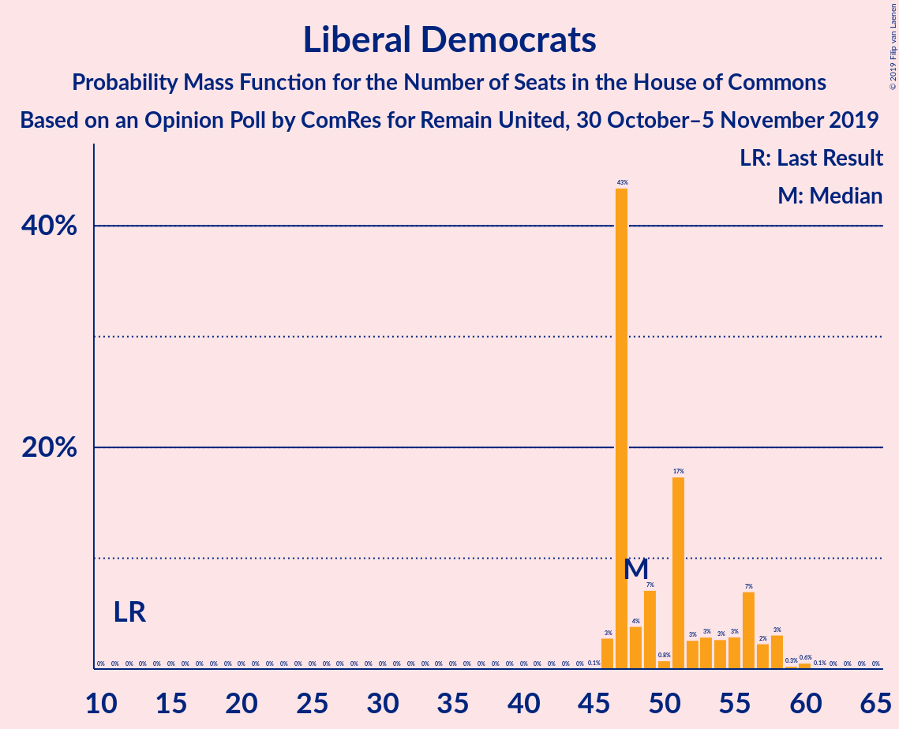

| Number of Seats | Probability | Accumulated | Special Marks |
|:---------------:|:-----------:|:-----------:|:-------------:|
| 12 | 0% | 100% | Last Result |
| 13 | 0% | 100% |  |
| 14 | 0% | 100% |  |
| 15 | 0% | 100% |  |
| 16 | 0% | 100% |  |
| 17 | 0% | 100% |  |
| 18 | 0% | 100% |  |
| 19 | 0% | 100% |  |
| 20 | 0% | 100% |  |
| 21 | 0% | 100% |  |
| 22 | 0% | 100% |  |
| 23 | 0% | 100% |  |
| 24 | 0% | 100% |  |
| 25 | 0% | 100% |  |
| 26 | 0% | 100% |  |
| 27 | 0% | 100% |  |
| 28 | 0% | 100% |  |
| 29 | 0% | 100% |  |
| 30 | 0% | 100% |  |
| 31 | 0% | 100% |  |
| 32 | 0% | 100% |  |
| 33 | 0% | 100% |  |
| 34 | 0% | 100% |  |
| 35 | 0% | 100% |  |
| 36 | 0% | 100% |  |
| 37 | 0% | 100% |  |
| 38 | 0% | 100% |  |
| 39 | 0% | 100% |  |
| 40 | 0% | 100% |  |
| 41 | 0% | 100% |  |
| 42 | 0% | 100% |  |
| 43 | 0% | 100% |  |
| 44 | 0% | 100% |  |
| 45 | 0.1% | 100% |  |
| 46 | 3% | 99.9% |  |
| 47 | 43% | 97% |  |
| 48 | 4% | 54% | Median |
| 49 | 7% | 50% |  |
| 50 | 0.8% | 43% |  |
| 51 | 17% | 42% |  |
| 52 | 3% | 24% |  |
| 53 | 3% | 22% |  |
| 54 | 3% | 19% |  |
| 55 | 3% | 16% |  |
| 56 | 7% | 13% |  |
| 57 | 2% | 6% |  |
| 58 | 3% | 4% |  |
| 59 | 0.3% | 1.0% |  |
| 60 | 0.6% | 0.7% |  |
| 61 | 0.1% | 0.1% |  |
| 62 | 0% | 0% |  |

### Brexit Party

*For a full overview of the results for this party, see the [Brexit Party](party-brexitparty.html) page.*

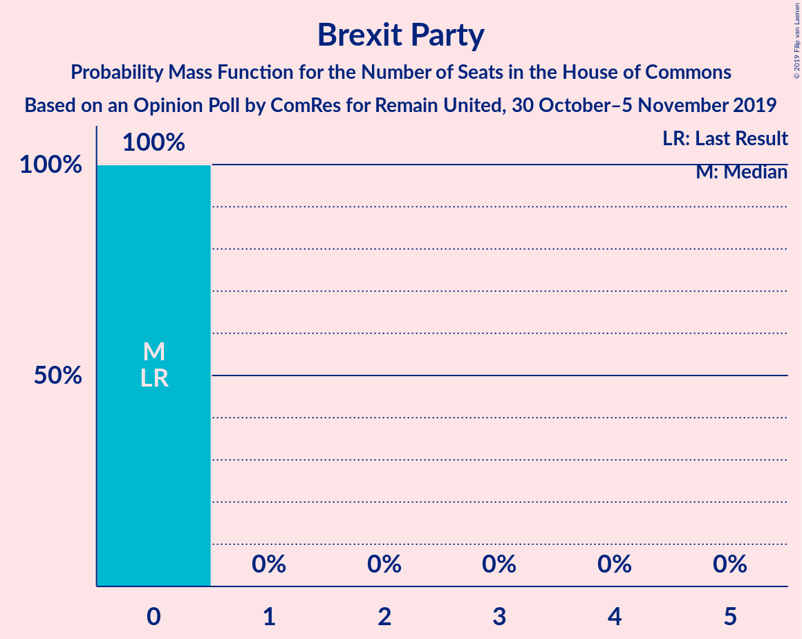

| Number of Seats | Probability | Accumulated | Special Marks |
|:---------------:|:-----------:|:-----------:|:-------------:|
| 0 | 100% | 100% | Last Result, Median |

### Scottish National Party

*For a full overview of the results for this party, see the [Scottish National Party](party-scottishnationalparty.html) page.*

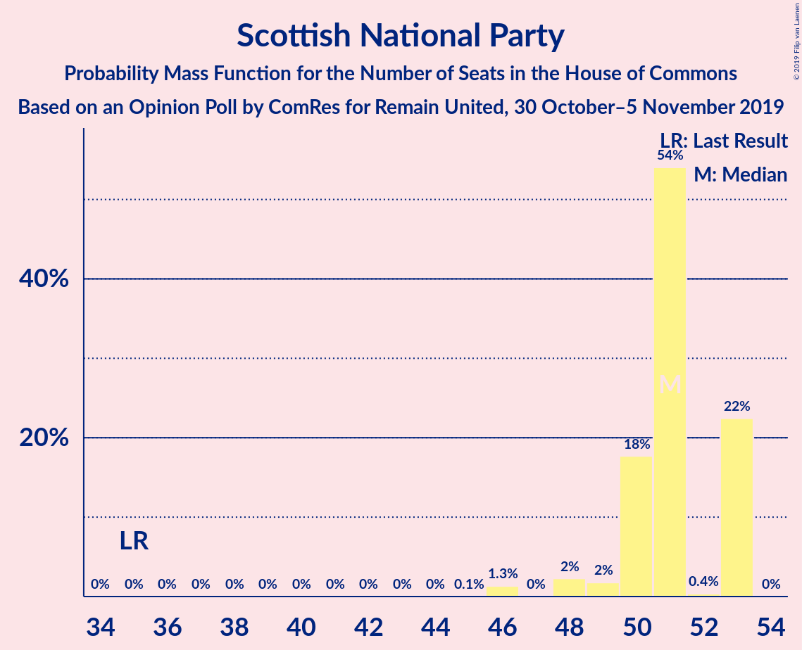

| Number of Seats | Probability | Accumulated | Special Marks |
|:---------------:|:-----------:|:-----------:|:-------------:|
| 35 | 0% | 100% | Last Result |
| 36 | 0% | 100% |  |
| 37 | 0% | 100% |  |
| 38 | 0% | 100% |  |
| 39 | 0% | 100% |  |
| 40 | 0% | 100% |  |
| 41 | 0% | 100% |  |
| 42 | 0% | 100% |  |
| 43 | 0% | 100% |  |
| 44 | 0% | 100% |  |
| 45 | 0.1% | 100% |  |
| 46 | 1.3% | 99.9% |  |
| 47 | 0% | 98.6% |  |
| 48 | 2% | 98.6% |  |
| 49 | 2% | 96% |  |
| 50 | 18% | 95% |  |
| 51 | 54% | 77% | Median |
| 52 | 0.4% | 23% |  |
| 53 | 22% | 22% |  |
| 54 | 0% | 0% |  |

### Green Party

*For a full overview of the results for this party, see the [Green Party](party-greenparty.html) page.*

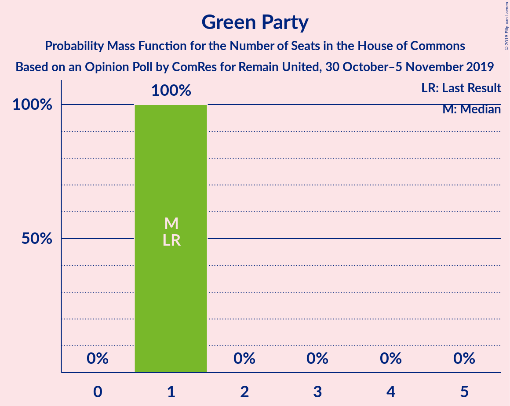

| Number of Seats | Probability | Accumulated | Special Marks |
|:---------------:|:-----------:|:-----------:|:-------------:|
| 1 | 100% | 100% | Last Result, Median |

### Plaid Cymru

*For a full overview of the results for this party, see the [Plaid Cymru](party-plaidcymru.html) page.*

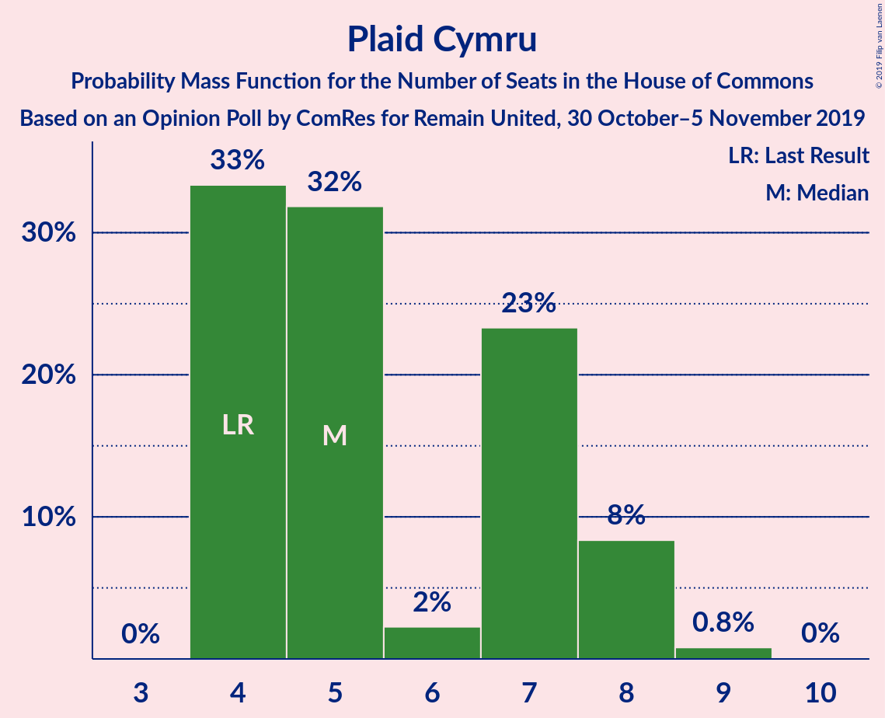

| Number of Seats | Probability | Accumulated | Special Marks |
|:---------------:|:-----------:|:-----------:|:-------------:|
| 4 | 33% | 100% | Last Result |
| 5 | 32% | 67% | Median |
| 6 | 2% | 35% |  |
| 7 | 23% | 33% |  |
| 8 | 8% | 9% |  |
| 9 | 0.8% | 0.8% |  |
| 10 | 0% | 0% |  |

### UK Independence Party

*For a full overview of the results for this party, see the [UK Independence Party](party-ukindependenceparty.html) page.*

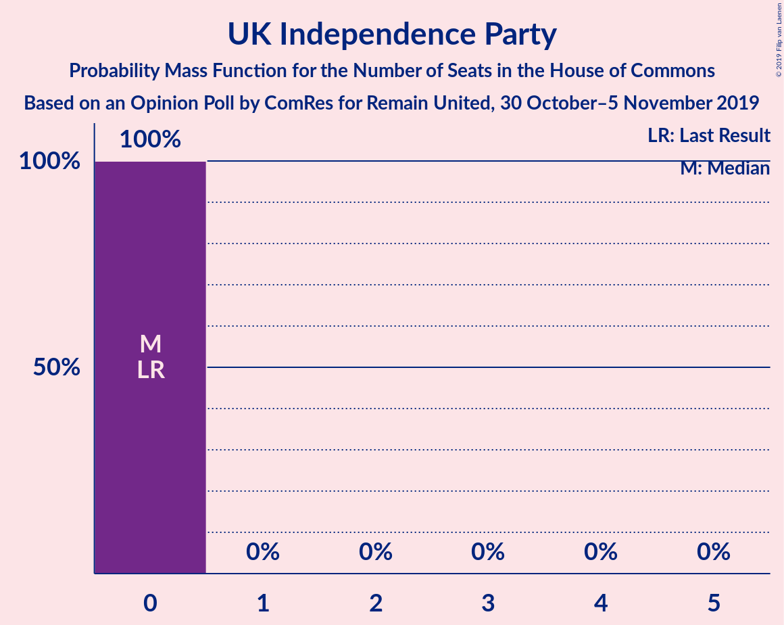

| Number of Seats | Probability | Accumulated | Special Marks |
|:---------------:|:-----------:|:-----------:|:-------------:|
| 0 | 100% | 100% | Last Result, Median |

### Change UK

*For a full overview of the results for this party, see the [Change UK](party-changeuk.html) page.*

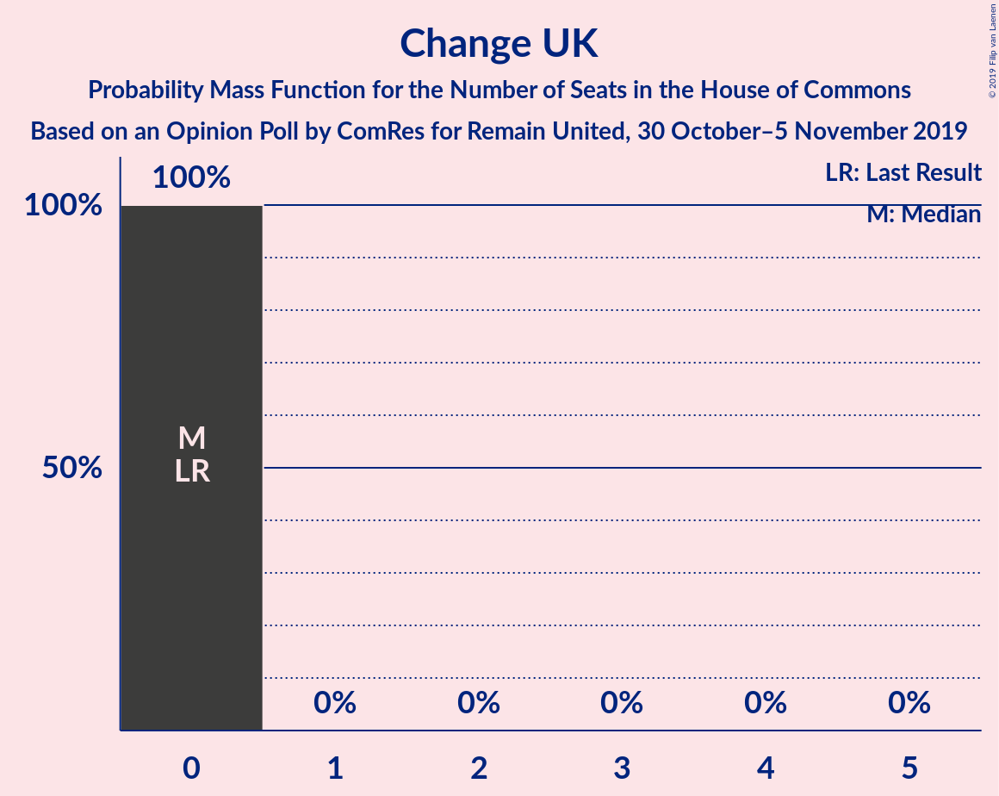

| Number of Seats | Probability | Accumulated | Special Marks |
|:---------------:|:-----------:|:-----------:|:-------------:|
| 0 | 100% | 100% | Last Result, Median |

## Coalitions

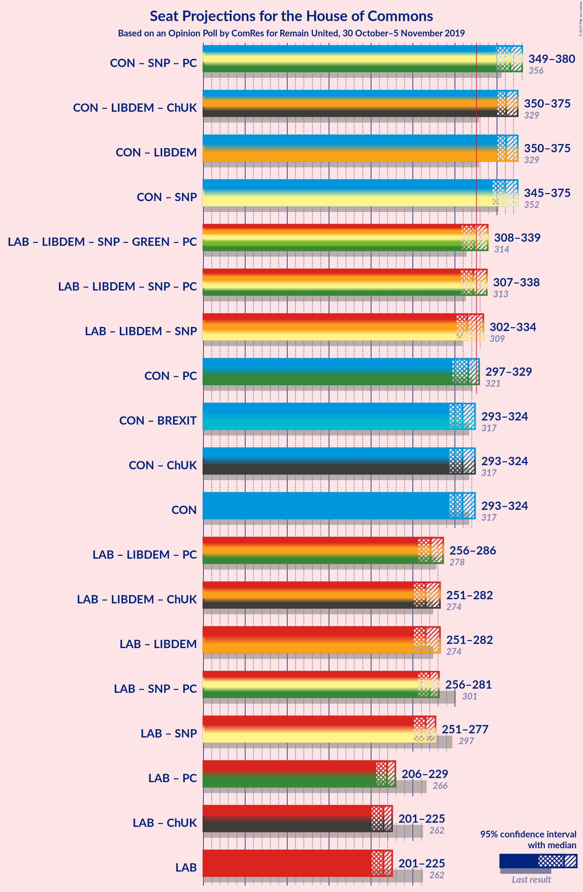

### Confidence Intervals

| Coalition | Last Result | Median | Majority? | 80% Confidence Interval | 90% Confidence Interval | 95% Confidence Interval | 99% Confidence Interval |
|:---------:|:-----------:|:------:|:---------:|:-----------------------:|:-----------------------:|:-----------------------:|:-----------------------:|
| Conservative Party – Scottish National Party – Plaid Cymru | 356 | 366 | 100% | 359–377 | 355–380 | 349–380 | 344–386 |
| Conservative Party – Liberal Democrats – Change UK | 329 | 361 | 100% | 354–372 | 351–373 | 350–375 | 343–380 |
| Conservative Party – Liberal Democrats | 329 | 361 | 100% | 354–372 | 351–373 | 350–375 | 343–380 |
| Conservative Party – Scottish National Party | 352 | 360 | 100% | 354–373 | 349–375 | 345–375 | 340–381 |
| Labour Party – Liberal Democrats – Scottish National Party – Green Party – Plaid Cymru | 314 | 323 | 25% | 311–329 | 308–335 | 308–339 | 302–344 |
| Labour Party – Liberal Democrats – Scottish National Party – Plaid Cymru | 313 | 322 | 25% | 310–328 | 307–334 | 307–338 | 301–343 |
| Labour Party – Liberal Democrats – Scottish National Party | 309 | 315 | 7% | 305–324 | 302–327 | 302–334 | 296–338 |
| Conservative Party – Plaid Cymru | 321 | 316 | 11% | 307–326 | 304–329 | 297–329 | 293–335 |
| Conservative Party – Brexit Party | 317 | 309 | 2% | 303–321 | 297–324 | 293–324 | 288–330 |
| Conservative Party – Change UK | 317 | 309 | 2% | 303–321 | 297–324 | 293–324 | 288–330 |
| Conservative Party | 317 | 309 | 2% | 303–321 | 297–324 | 293–324 | 288–330 |
| Labour Party – Liberal Democrats – Plaid Cymru | 278 | 271 | 0% | 258–277 | 256–282 | 256–286 | 250–291 |
| Labour Party – Liberal Democrats – Change UK | 274 | 265 | 0% | 254–272 | 251–276 | 251–282 | 245–287 |
| Labour Party – Liberal Democrats | 274 | 265 | 0% | 254–272 | 251–276 | 251–282 | 245–287 |
| Labour Party – Scottish National Party – Plaid Cymru | 301 | 270 | 0% | 259–277 | 258–280 | 256–281 | 251–288 |
| Labour Party – Scottish National Party | 297 | 265 | 0% | 253–273 | 252–274 | 251–277 | 246–283 |
| Labour Party – Plaid Cymru | 266 | 219 | 0% | 209–226 | 207–228 | 206–229 | 200–235 |
| Labour Party – Change UK | 262 | 215 | 0% | 202–221 | 202–222 | 201–225 | 195–231 |
| Labour Party | 262 | 215 | 0% | 202–221 | 202–222 | 201–225 | 195–231 |

### Conservative Party – Scottish National Party – Plaid Cymru

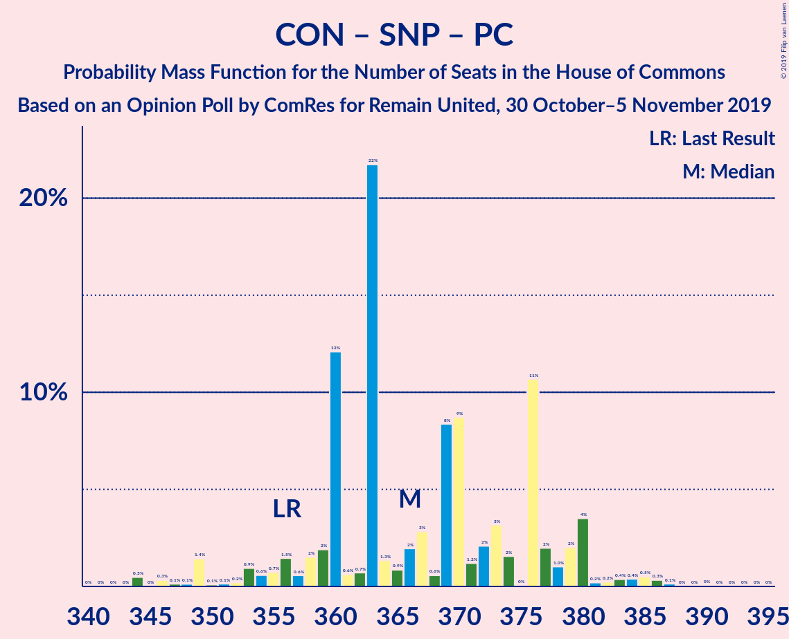

| Number of Seats | Probability | Accumulated | Special Marks |
|:---------------:|:-----------:|:-----------:|:-------------:|
| 342 | 0% | 100% |  |
| 343 | 0% | 99.9% |  |
| 344 | 0.5% | 99.9% |  |
| 345 | 0% | 99.5% |  |
| 346 | 0.3% | 99.4% |  |
| 347 | 0.1% | 99.1% |  |
| 348 | 0.1% | 99.0% |  |
| 349 | 1.4% | 98.8% |  |
| 350 | 0.1% | 97% |  |
| 351 | 0.1% | 97% |  |
| 352 | 0.2% | 97% |  |
| 353 | 0.9% | 97% |  |
| 354 | 0.6% | 96% |  |
| 355 | 0.7% | 95% |  |
| 356 | 1.5% | 95% | Last Result |
| 357 | 0.6% | 93% |  |
| 358 | 2% | 93% |  |
| 359 | 2% | 91% |  |
| 360 | 12% | 89% |  |
| 361 | 0.6% | 77% |  |
| 362 | 0.7% | 77% |  |
| 363 | 22% | 76% |  |
| 364 | 1.3% | 54% |  |
| 365 | 0.9% | 53% | Median |
| 366 | 2% | 52% |  |
| 367 | 3% | 50% |  |
| 368 | 0.6% | 47% |  |
| 369 | 8% | 47% |  |
| 370 | 9% | 38% |  |
| 371 | 1.2% | 30% |  |
| 372 | 2% | 28% |  |
| 373 | 3% | 26% |  |
| 374 | 2% | 23% |  |
| 375 | 0% | 22% |  |
| 376 | 11% | 21% |  |
| 377 | 2% | 11% |  |
| 378 | 1.0% | 9% |  |
| 379 | 2% | 8% |  |
| 380 | 4% | 6% |  |
| 381 | 0.2% | 2% |  |
| 382 | 0.2% | 2% |  |
| 383 | 0.4% | 2% |  |
| 384 | 0.4% | 1.5% |  |
| 385 | 0.5% | 1.1% |  |
| 386 | 0.3% | 0.6% |  |
| 387 | 0.1% | 0.3% |  |
| 388 | 0% | 0.1% |  |
| 389 | 0% | 0.1% |  |
| 390 | 0% | 0.1% |  |
| 391 | 0% | 0.1% |  |
| 392 | 0% | 0.1% |  |
| 393 | 0% | 0% |  |

### Conservative Party – Liberal Democrats – Change UK

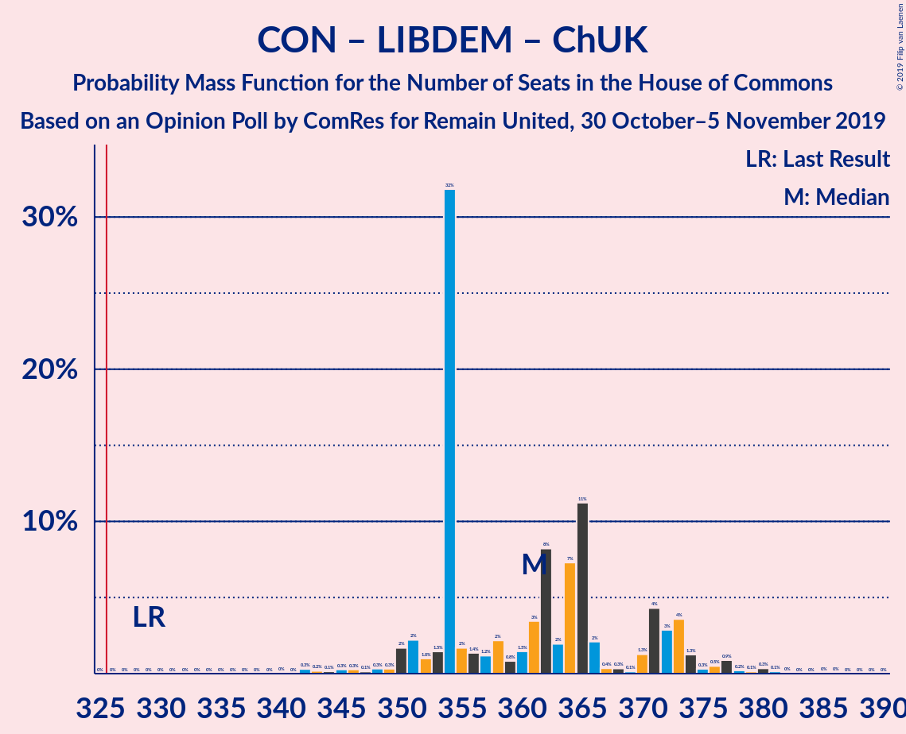

| Number of Seats | Probability | Accumulated | Special Marks |
|:---------------:|:-----------:|:-----------:|:-------------:|
| 329 | 0% | 100% | Last Result |
| 330 | 0% | 100% |  |
| 331 | 0% | 100% |  |
| 332 | 0% | 100% |  |
| 333 | 0% | 100% |  |
| 334 | 0% | 100% |  |
| 335 | 0% | 100% |  |
| 336 | 0% | 100% |  |
| 337 | 0% | 100% |  |
| 338 | 0% | 100% |  |
| 339 | 0% | 100% |  |
| 340 | 0% | 100% |  |
| 341 | 0% | 100% |  |
| 342 | 0.3% | 100% |  |
| 343 | 0.2% | 99.7% |  |
| 344 | 0.1% | 99.5% |  |
| 345 | 0.3% | 99.3% |  |
| 346 | 0.3% | 99.1% |  |
| 347 | 0.1% | 98.8% |  |
| 348 | 0.3% | 98.6% |  |
| 349 | 0.3% | 98% |  |
| 350 | 2% | 98% |  |
| 351 | 2% | 96% |  |
| 352 | 1.0% | 94% |  |
| 353 | 1.5% | 93% |  |
| 354 | 32% | 92% |  |
| 355 | 2% | 60% |  |
| 356 | 1.4% | 58% |  |
| 357 | 1.2% | 57% | Median |
| 358 | 2% | 56% |  |
| 359 | 0.8% | 53% |  |
| 360 | 1.5% | 53% |  |
| 361 | 3% | 51% |  |
| 362 | 8% | 48% |  |
| 363 | 2% | 39% |  |
| 364 | 7% | 37% |  |
| 365 | 11% | 30% |  |
| 366 | 2% | 19% |  |
| 367 | 0.4% | 17% |  |
| 368 | 0.3% | 16% |  |
| 369 | 0.1% | 16% |  |
| 370 | 1.3% | 16% |  |
| 371 | 4% | 15% |  |
| 372 | 3% | 10% |  |
| 373 | 4% | 8% |  |
| 374 | 1.3% | 4% |  |
| 375 | 0.3% | 3% |  |
| 376 | 0.5% | 2% |  |
| 377 | 0.9% | 2% |  |
| 378 | 0.2% | 1.0% |  |
| 379 | 0.1% | 0.8% |  |
| 380 | 0.3% | 0.6% |  |
| 381 | 0.1% | 0.3% |  |
| 382 | 0% | 0.1% |  |
| 383 | 0% | 0.1% |  |
| 384 | 0% | 0.1% |  |
| 385 | 0% | 0.1% |  |
| 386 | 0% | 0.1% |  |
| 387 | 0% | 0% |  |

### Conservative Party – Liberal Democrats

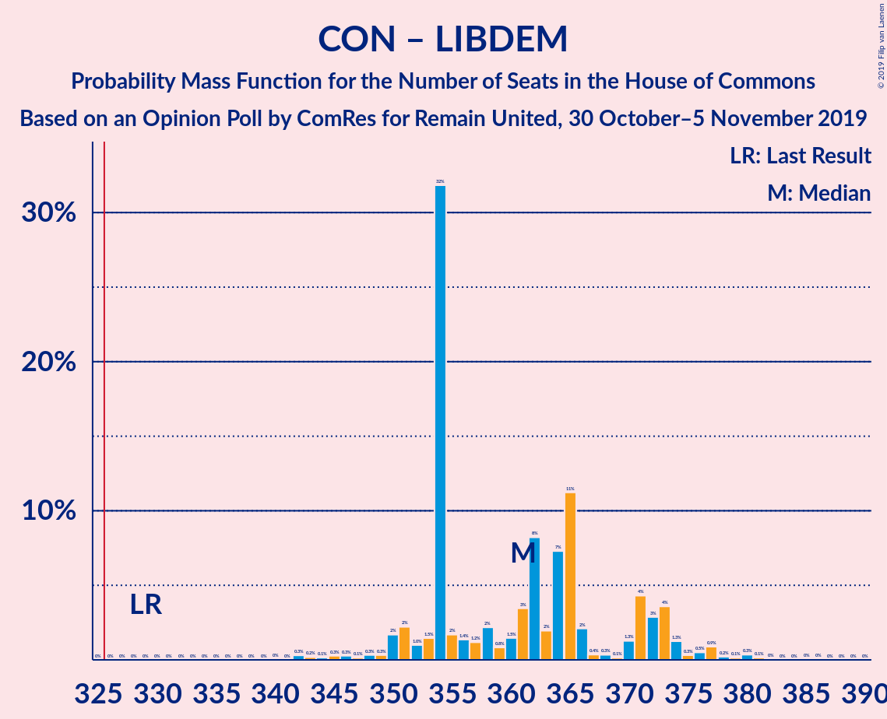

| Number of Seats | Probability | Accumulated | Special Marks |
|:---------------:|:-----------:|:-----------:|:-------------:|
| 329 | 0% | 100% | Last Result |
| 330 | 0% | 100% |  |
| 331 | 0% | 100% |  |
| 332 | 0% | 100% |  |
| 333 | 0% | 100% |  |
| 334 | 0% | 100% |  |
| 335 | 0% | 100% |  |
| 336 | 0% | 100% |  |
| 337 | 0% | 100% |  |
| 338 | 0% | 100% |  |
| 339 | 0% | 100% |  |
| 340 | 0% | 100% |  |
| 341 | 0% | 100% |  |
| 342 | 0.3% | 100% |  |
| 343 | 0.2% | 99.7% |  |
| 344 | 0.1% | 99.5% |  |
| 345 | 0.3% | 99.3% |  |
| 346 | 0.3% | 99.1% |  |
| 347 | 0.1% | 98.8% |  |
| 348 | 0.3% | 98.6% |  |
| 349 | 0.3% | 98% |  |
| 350 | 2% | 98% |  |
| 351 | 2% | 96% |  |
| 352 | 1.0% | 94% |  |
| 353 | 1.5% | 93% |  |
| 354 | 32% | 92% |  |
| 355 | 2% | 60% |  |
| 356 | 1.4% | 58% |  |
| 357 | 1.2% | 57% | Median |
| 358 | 2% | 56% |  |
| 359 | 0.8% | 53% |  |
| 360 | 1.5% | 53% |  |
| 361 | 3% | 51% |  |
| 362 | 8% | 48% |  |
| 363 | 2% | 39% |  |
| 364 | 7% | 37% |  |
| 365 | 11% | 30% |  |
| 366 | 2% | 19% |  |
| 367 | 0.4% | 17% |  |
| 368 | 0.3% | 16% |  |
| 369 | 0.1% | 16% |  |
| 370 | 1.3% | 16% |  |
| 371 | 4% | 15% |  |
| 372 | 3% | 10% |  |
| 373 | 4% | 8% |  |
| 374 | 1.3% | 4% |  |
| 375 | 0.3% | 3% |  |
| 376 | 0.5% | 2% |  |
| 377 | 0.9% | 2% |  |
| 378 | 0.2% | 1.0% |  |
| 379 | 0.1% | 0.8% |  |
| 380 | 0.3% | 0.6% |  |
| 381 | 0.1% | 0.3% |  |
| 382 | 0% | 0.1% |  |
| 383 | 0% | 0.1% |  |
| 384 | 0% | 0.1% |  |
| 385 | 0% | 0.1% |  |
| 386 | 0% | 0.1% |  |
| 387 | 0% | 0% |  |

### Conservative Party – Scottish National Party

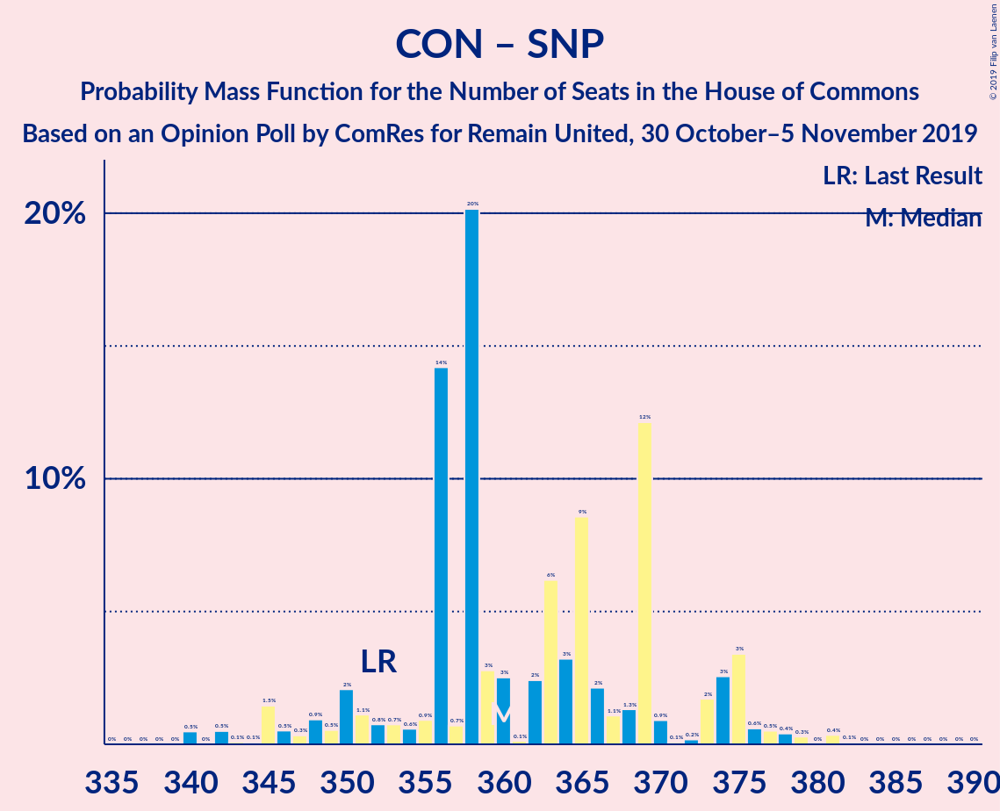

| Number of Seats | Probability | Accumulated | Special Marks |
|:---------------:|:-----------:|:-----------:|:-------------:|
| 338 | 0% | 100% |  |
| 339 | 0% | 99.9% |  |
| 340 | 0.5% | 99.9% |  |
| 341 | 0% | 99.4% |  |
| 342 | 0.5% | 99.4% |  |
| 343 | 0.1% | 98.9% |  |
| 344 | 0.1% | 98.8% |  |
| 345 | 1.5% | 98.7% |  |
| 346 | 0.5% | 97% |  |
| 347 | 0.3% | 97% |  |
| 348 | 0.9% | 96% |  |
| 349 | 0.5% | 95% |  |
| 350 | 2% | 95% |  |
| 351 | 1.1% | 93% |  |
| 352 | 0.8% | 92% | Last Result |
| 353 | 0.7% | 91% |  |
| 354 | 0.6% | 90% |  |
| 355 | 0.9% | 90% |  |
| 356 | 14% | 89% |  |
| 357 | 0.7% | 75% |  |
| 358 | 20% | 74% |  |
| 359 | 3% | 54% |  |
| 360 | 3% | 51% | Median |
| 361 | 0.1% | 48% |  |
| 362 | 2% | 48% |  |
| 363 | 6% | 46% |  |
| 364 | 3% | 40% |  |
| 365 | 9% | 36% |  |
| 366 | 2% | 28% |  |
| 367 | 1.1% | 26% |  |
| 368 | 1.3% | 25% |  |
| 369 | 12% | 23% |  |
| 370 | 0.9% | 11% |  |
| 371 | 0.1% | 10% |  |
| 372 | 0.2% | 10% |  |
| 373 | 2% | 10% |  |
| 374 | 3% | 8% |  |
| 375 | 3% | 6% |  |
| 376 | 0.6% | 2% |  |
| 377 | 0.5% | 2% |  |
| 378 | 0.4% | 1.2% |  |
| 379 | 0.3% | 0.8% |  |
| 380 | 0% | 0.5% |  |
| 381 | 0.4% | 0.5% |  |
| 382 | 0.1% | 0.2% |  |
| 383 | 0% | 0.1% |  |
| 384 | 0% | 0.1% |  |
| 385 | 0% | 0.1% |  |
| 386 | 0% | 0% |  |

### Labour Party – Liberal Democrats – Scottish National Party – Green Party – Plaid Cymru

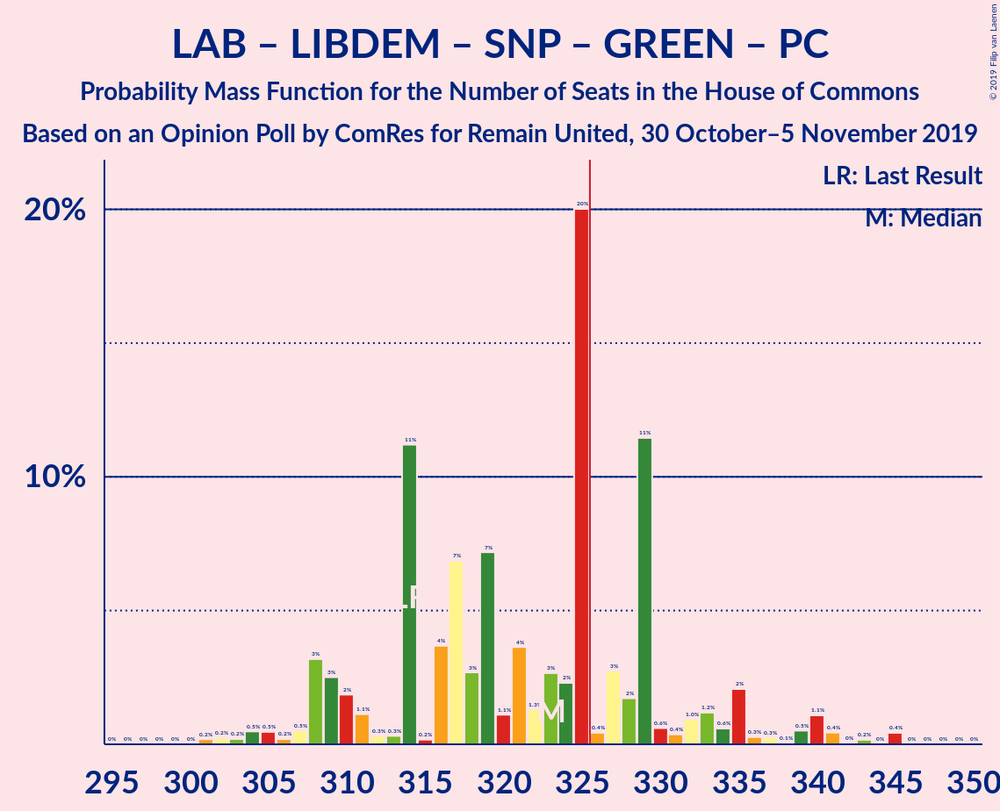

| Number of Seats | Probability | Accumulated | Special Marks |
|:---------------:|:-----------:|:-----------:|:-------------:|
| 297 | 0% | 100% |  |
| 298 | 0% | 99.9% |  |
| 299 | 0% | 99.9% |  |
| 300 | 0% | 99.9% |  |
| 301 | 0.2% | 99.9% |  |
| 302 | 0.2% | 99.7% |  |
| 303 | 0.2% | 99.4% |  |
| 304 | 0.5% | 99.2% |  |
| 305 | 0.5% | 98.8% |  |
| 306 | 0.2% | 98% |  |
| 307 | 0.5% | 98% |  |
| 308 | 3% | 98% |  |
| 309 | 3% | 94% |  |
| 310 | 2% | 92% |  |
| 311 | 1.1% | 90% |  |
| 312 | 0.3% | 89% |  |
| 313 | 0.3% | 89% |  |
| 314 | 11% | 88% | Last Result |
| 315 | 0.2% | 77% |  |
| 316 | 4% | 77% |  |
| 317 | 7% | 73% |  |
| 318 | 3% | 66% |  |
| 319 | 7% | 64% |  |
| 320 | 1.1% | 56% | Median |
| 321 | 4% | 55% |  |
| 322 | 1.3% | 52% |  |
| 323 | 3% | 50% |  |
| 324 | 2% | 48% |  |
| 325 | 20% | 45% |  |
| 326 | 0.4% | 25% | Majority |
| 327 | 3% | 25% |  |
| 328 | 2% | 22% |  |
| 329 | 11% | 21% |  |
| 330 | 0.6% | 9% |  |
| 331 | 0.4% | 9% |  |
| 332 | 1.0% | 8% |  |
| 333 | 1.2% | 7% |  |
| 334 | 0.6% | 6% |  |
| 335 | 2% | 5% |  |
| 336 | 0.3% | 3% |  |
| 337 | 0.3% | 3% |  |
| 338 | 0.1% | 3% |  |
| 339 | 0.5% | 3% |  |
| 340 | 1.1% | 2% |  |
| 341 | 0.4% | 1.2% |  |
| 342 | 0% | 0.7% |  |
| 343 | 0.2% | 0.7% |  |
| 344 | 0% | 0.5% |  |
| 345 | 0.4% | 0.5% |  |
| 346 | 0% | 0.1% |  |
| 347 | 0% | 0% |  |

### Labour Party – Liberal Democrats – Scottish National Party – Plaid Cymru

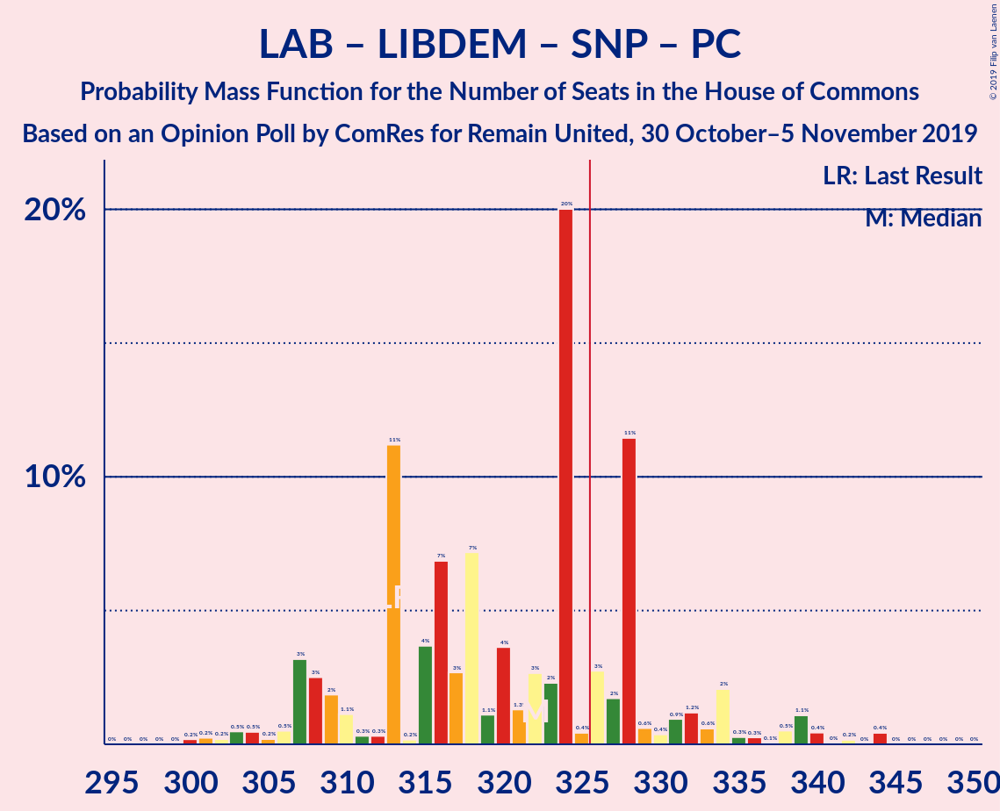

| Number of Seats | Probability | Accumulated | Special Marks |
|:---------------:|:-----------:|:-----------:|:-------------:|
| 296 | 0% | 100% |  |
| 297 | 0% | 99.9% |  |
| 298 | 0% | 99.9% |  |
| 299 | 0% | 99.9% |  |
| 300 | 0.2% | 99.9% |  |
| 301 | 0.2% | 99.7% |  |
| 302 | 0.2% | 99.4% |  |
| 303 | 0.5% | 99.2% |  |
| 304 | 0.5% | 98.8% |  |
| 305 | 0.2% | 98% |  |
| 306 | 0.5% | 98% |  |
| 307 | 3% | 98% |  |
| 308 | 3% | 94% |  |
| 309 | 2% | 92% |  |
| 310 | 1.1% | 90% |  |
| 311 | 0.3% | 89% |  |
| 312 | 0.3% | 89% |  |
| 313 | 11% | 88% | Last Result |
| 314 | 0.2% | 77% |  |
| 315 | 4% | 77% |  |
| 316 | 7% | 73% |  |
| 317 | 3% | 66% |  |
| 318 | 7% | 64% |  |
| 319 | 1.1% | 56% | Median |
| 320 | 4% | 55% |  |
| 321 | 1.3% | 52% |  |
| 322 | 3% | 50% |  |
| 323 | 2% | 48% |  |
| 324 | 20% | 45% |  |
| 325 | 0.4% | 25% |  |
| 326 | 3% | 25% | Majority |
| 327 | 2% | 22% |  |
| 328 | 11% | 21% |  |
| 329 | 0.6% | 9% |  |
| 330 | 0.4% | 9% |  |
| 331 | 0.9% | 8% |  |
| 332 | 1.2% | 7% |  |
| 333 | 0.6% | 6% |  |
| 334 | 2% | 5% |  |
| 335 | 0.3% | 3% |  |
| 336 | 0.3% | 3% |  |
| 337 | 0.1% | 3% |  |
| 338 | 0.5% | 3% |  |
| 339 | 1.1% | 2% |  |
| 340 | 0.4% | 1.2% |  |
| 341 | 0% | 0.7% |  |
| 342 | 0.2% | 0.7% |  |
| 343 | 0% | 0.5% |  |
| 344 | 0.4% | 0.5% |  |
| 345 | 0% | 0.1% |  |
| 346 | 0% | 0% |  |

### Labour Party – Liberal Democrats – Scottish National Party

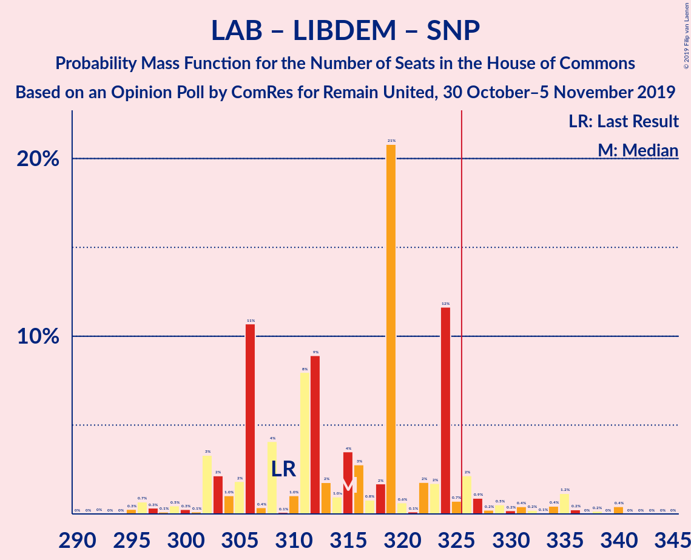

| Number of Seats | Probability | Accumulated | Special Marks |
|:---------------:|:-----------:|:-----------:|:-------------:|
| 290 | 0% | 100% |  |
| 291 | 0% | 99.9% |  |
| 292 | 0% | 99.9% |  |
| 293 | 0% | 99.9% |  |
| 294 | 0% | 99.9% |  |
| 295 | 0.3% | 99.9% |  |
| 296 | 0.7% | 99.6% |  |
| 297 | 0.3% | 98.9% |  |
| 298 | 0.1% | 98.6% |  |
| 299 | 0.5% | 98% |  |
| 300 | 0.3% | 98% |  |
| 301 | 0.1% | 98% |  |
| 302 | 3% | 98% |  |
| 303 | 2% | 94% |  |
| 304 | 1.0% | 92% |  |
| 305 | 2% | 91% |  |
| 306 | 11% | 89% |  |
| 307 | 0.4% | 79% |  |
| 308 | 4% | 78% |  |
| 309 | 0.1% | 74% | Last Result |
| 310 | 1.0% | 74% |  |
| 311 | 8% | 73% |  |
| 312 | 9% | 65% |  |
| 313 | 2% | 56% |  |
| 314 | 1.0% | 54% | Median |
| 315 | 4% | 53% |  |
| 316 | 3% | 50% |  |
| 317 | 0.8% | 47% |  |
| 318 | 2% | 46% |  |
| 319 | 21% | 45% |  |
| 320 | 0.6% | 24% |  |
| 321 | 0.1% | 23% |  |
| 322 | 2% | 23% |  |
| 323 | 2% | 21% |  |
| 324 | 12% | 20% |  |
| 325 | 0.7% | 8% |  |
| 326 | 2% | 7% | Majority |
| 327 | 0.9% | 5% |  |
| 328 | 0.2% | 4% |  |
| 329 | 0.5% | 4% |  |
| 330 | 0.2% | 3% |  |
| 331 | 0.4% | 3% |  |
| 332 | 0.2% | 3% |  |
| 333 | 0.1% | 3% |  |
| 334 | 0.4% | 3% |  |
| 335 | 1.2% | 2% |  |
| 336 | 0.2% | 0.9% |  |
| 337 | 0% | 0.7% |  |
| 338 | 0.2% | 0.6% |  |
| 339 | 0% | 0.5% |  |
| 340 | 0.4% | 0.5% |  |
| 341 | 0% | 0% |  |

### Conservative Party – Plaid Cymru

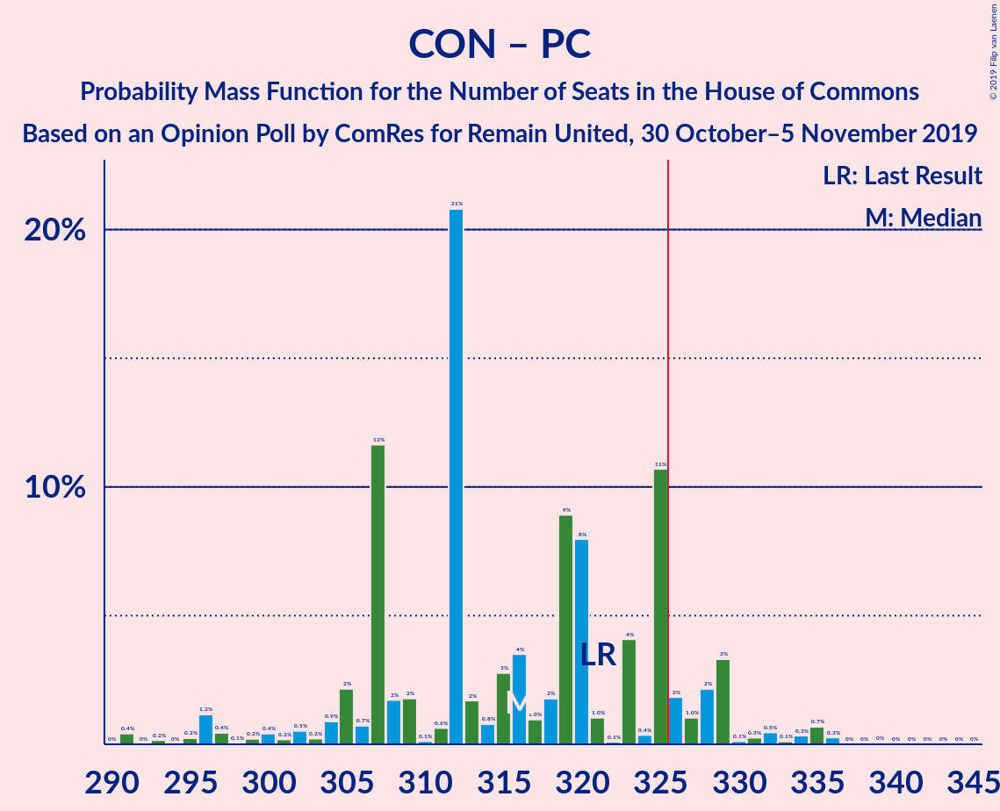

| Number of Seats | Probability | Accumulated | Special Marks |
|:---------------:|:-----------:|:-----------:|:-------------:|
| 291 | 0.4% | 100% |  |
| 292 | 0% | 99.5% |  |
| 293 | 0.2% | 99.5% |  |
| 294 | 0% | 99.4% |  |
| 295 | 0.2% | 99.3% |  |
| 296 | 1.2% | 99.1% |  |
| 297 | 0.4% | 98% |  |
| 298 | 0.1% | 97% |  |
| 299 | 0.2% | 97% |  |
| 300 | 0.4% | 97% |  |
| 301 | 0.2% | 97% |  |
| 302 | 0.5% | 97% |  |
| 303 | 0.2% | 96% |  |
| 304 | 0.9% | 96% |  |
| 305 | 2% | 95% |  |
| 306 | 0.7% | 93% |  |
| 307 | 12% | 92% |  |
| 308 | 2% | 80% |  |
| 309 | 2% | 79% |  |
| 310 | 0.1% | 77% |  |
| 311 | 0.6% | 77% |  |
| 312 | 21% | 76% |  |
| 313 | 2% | 55% |  |
| 314 | 0.8% | 54% | Median |
| 315 | 3% | 53% |  |
| 316 | 4% | 50% |  |
| 317 | 1.0% | 47% |  |
| 318 | 2% | 46% |  |
| 319 | 9% | 44% |  |
| 320 | 8% | 35% |  |
| 321 | 1.0% | 27% | Last Result |
| 322 | 0.1% | 26% |  |
| 323 | 4% | 26% |  |
| 324 | 0.4% | 22% |  |
| 325 | 11% | 21% |  |
| 326 | 2% | 11% | Majority |
| 327 | 1.0% | 9% |  |
| 328 | 2% | 8% |  |
| 329 | 3% | 6% |  |
| 330 | 0.1% | 2% |  |
| 331 | 0.3% | 2% |  |
| 332 | 0.5% | 2% |  |
| 333 | 0.1% | 2% |  |
| 334 | 0.3% | 1.4% |  |
| 335 | 0.7% | 1.1% |  |
| 336 | 0.3% | 0.4% |  |
| 337 | 0% | 0.1% |  |
| 338 | 0% | 0.1% |  |
| 339 | 0% | 0.1% |  |
| 340 | 0% | 0.1% |  |
| 341 | 0% | 0.1% |  |
| 342 | 0% | 0% |  |

### Conservative Party – Brexit Party

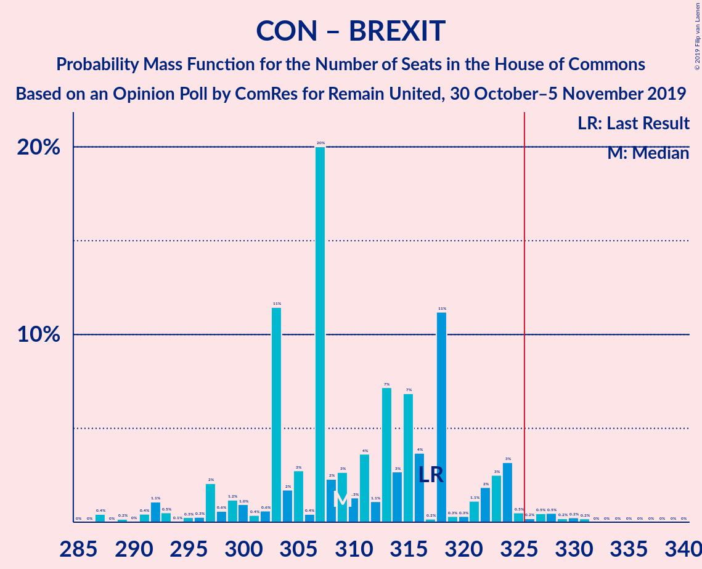

| Number of Seats | Probability | Accumulated | Special Marks |
|:---------------:|:-----------:|:-----------:|:-------------:|
| 286 | 0% | 100% |  |
| 287 | 0.4% | 99.9% |  |
| 288 | 0% | 99.5% |  |
| 289 | 0.2% | 99.5% |  |
| 290 | 0% | 99.3% |  |
| 291 | 0.4% | 99.3% |  |
| 292 | 1.1% | 98.8% |  |
| 293 | 0.5% | 98% |  |
| 294 | 0.1% | 97% |  |
| 295 | 0.3% | 97% |  |
| 296 | 0.3% | 97% |  |
| 297 | 2% | 97% |  |
| 298 | 0.6% | 95% |  |
| 299 | 1.2% | 94% |  |
| 300 | 1.0% | 93% |  |
| 301 | 0.4% | 92% |  |
| 302 | 0.6% | 91% |  |
| 303 | 11% | 91% |  |
| 304 | 2% | 79% |  |
| 305 | 3% | 78% |  |
| 306 | 0.4% | 75% |  |
| 307 | 20% | 75% |  |
| 308 | 2% | 55% |  |
| 309 | 3% | 52% | Median |
| 310 | 1.3% | 50% |  |
| 311 | 4% | 48% |  |
| 312 | 1.1% | 45% |  |
| 313 | 7% | 44% |  |
| 314 | 3% | 36% |  |
| 315 | 7% | 34% |  |
| 316 | 4% | 27% |  |
| 317 | 0.2% | 23% | Last Result |
| 318 | 11% | 23% |  |
| 319 | 0.3% | 12% |  |
| 320 | 0.3% | 11% |  |
| 321 | 1.1% | 11% |  |
| 322 | 2% | 10% |  |
| 323 | 3% | 8% |  |
| 324 | 3% | 6% |  |
| 325 | 0.5% | 2% |  |
| 326 | 0.2% | 2% | Majority |
| 327 | 0.5% | 2% |  |
| 328 | 0.5% | 1.2% |  |
| 329 | 0.2% | 0.8% |  |
| 330 | 0.2% | 0.6% |  |
| 331 | 0.2% | 0.3% |  |
| 332 | 0% | 0.1% |  |
| 333 | 0% | 0.1% |  |
| 334 | 0% | 0.1% |  |
| 335 | 0% | 0.1% |  |
| 336 | 0% | 0% |  |

### Conservative Party – Change UK

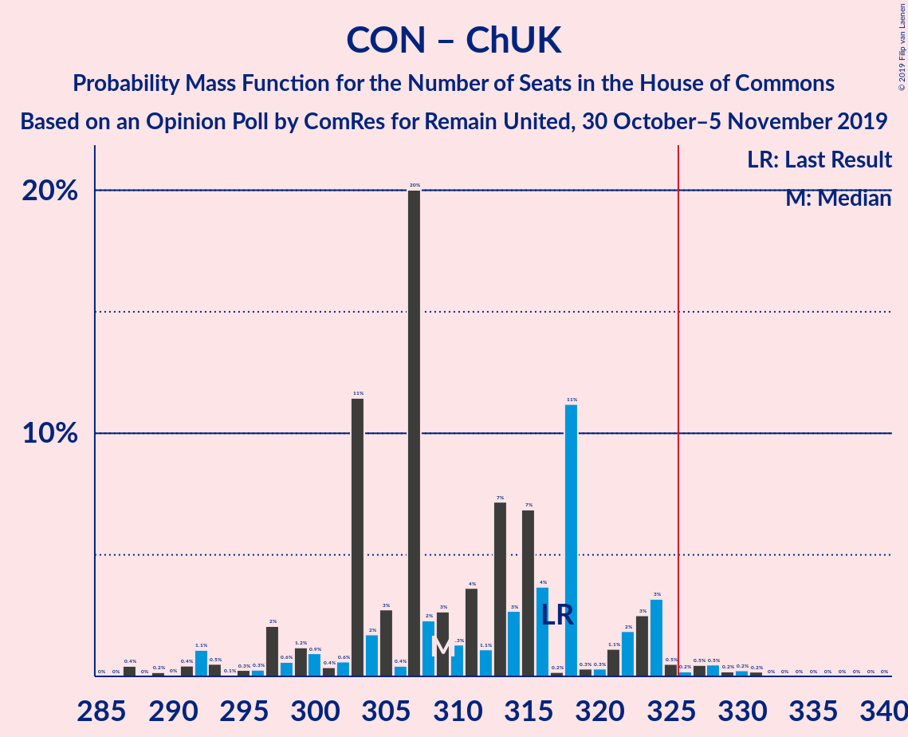

| Number of Seats | Probability | Accumulated | Special Marks |
|:---------------:|:-----------:|:-----------:|:-------------:|
| 286 | 0% | 100% |  |
| 287 | 0.4% | 99.9% |  |
| 288 | 0% | 99.5% |  |
| 289 | 0.2% | 99.5% |  |
| 290 | 0% | 99.3% |  |
| 291 | 0.4% | 99.3% |  |
| 292 | 1.1% | 98.8% |  |
| 293 | 0.5% | 98% |  |
| 294 | 0.1% | 97% |  |
| 295 | 0.3% | 97% |  |
| 296 | 0.3% | 97% |  |
| 297 | 2% | 97% |  |
| 298 | 0.6% | 95% |  |
| 299 | 1.2% | 94% |  |
| 300 | 0.9% | 93% |  |
| 301 | 0.4% | 92% |  |
| 302 | 0.6% | 91% |  |
| 303 | 11% | 91% |  |
| 304 | 2% | 79% |  |
| 305 | 3% | 78% |  |
| 306 | 0.4% | 75% |  |
| 307 | 20% | 75% |  |
| 308 | 2% | 55% |  |
| 309 | 3% | 52% | Median |
| 310 | 1.3% | 50% |  |
| 311 | 4% | 48% |  |
| 312 | 1.1% | 45% |  |
| 313 | 7% | 44% |  |
| 314 | 3% | 36% |  |
| 315 | 7% | 34% |  |
| 316 | 4% | 27% |  |
| 317 | 0.2% | 23% | Last Result |
| 318 | 11% | 23% |  |
| 319 | 0.3% | 12% |  |
| 320 | 0.3% | 11% |  |
| 321 | 1.1% | 11% |  |
| 322 | 2% | 10% |  |
| 323 | 3% | 8% |  |
| 324 | 3% | 6% |  |
| 325 | 0.5% | 2% |  |
| 326 | 0.2% | 2% | Majority |
| 327 | 0.5% | 2% |  |
| 328 | 0.5% | 1.2% |  |
| 329 | 0.2% | 0.8% |  |
| 330 | 0.2% | 0.6% |  |
| 331 | 0.2% | 0.3% |  |
| 332 | 0% | 0.1% |  |
| 333 | 0% | 0.1% |  |
| 334 | 0% | 0.1% |  |
| 335 | 0% | 0.1% |  |
| 336 | 0% | 0% |  |

### Conservative Party

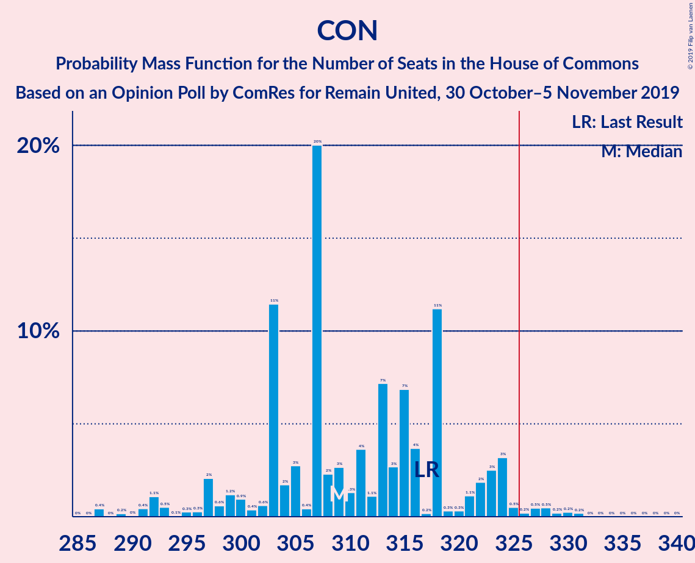

| Number of Seats | Probability | Accumulated | Special Marks |
|:---------------:|:-----------:|:-----------:|:-------------:|
| 286 | 0% | 100% |  |
| 287 | 0.4% | 99.9% |  |
| 288 | 0% | 99.5% |  |
| 289 | 0.2% | 99.5% |  |
| 290 | 0% | 99.3% |  |
| 291 | 0.4% | 99.3% |  |
| 292 | 1.1% | 98.8% |  |
| 293 | 0.5% | 98% |  |
| 294 | 0.1% | 97% |  |
| 295 | 0.3% | 97% |  |
| 296 | 0.3% | 97% |  |
| 297 | 2% | 97% |  |
| 298 | 0.6% | 95% |  |
| 299 | 1.2% | 94% |  |
| 300 | 0.9% | 93% |  |
| 301 | 0.4% | 92% |  |
| 302 | 0.6% | 91% |  |
| 303 | 11% | 91% |  |
| 304 | 2% | 79% |  |
| 305 | 3% | 78% |  |
| 306 | 0.4% | 75% |  |
| 307 | 20% | 75% |  |
| 308 | 2% | 55% |  |
| 309 | 3% | 52% | Median |
| 310 | 1.3% | 50% |  |
| 311 | 4% | 48% |  |
| 312 | 1.1% | 45% |  |
| 313 | 7% | 44% |  |
| 314 | 3% | 36% |  |
| 315 | 7% | 34% |  |
| 316 | 4% | 27% |  |
| 317 | 0.2% | 23% | Last Result |
| 318 | 11% | 23% |  |
| 319 | 0.3% | 12% |  |
| 320 | 0.3% | 11% |  |
| 321 | 1.1% | 11% |  |
| 322 | 2% | 10% |  |
| 323 | 3% | 8% |  |
| 324 | 3% | 6% |  |
| 325 | 0.5% | 2% |  |
| 326 | 0.2% | 2% | Majority |
| 327 | 0.5% | 2% |  |
| 328 | 0.5% | 1.2% |  |
| 329 | 0.2% | 0.8% |  |
| 330 | 0.2% | 0.6% |  |
| 331 | 0.2% | 0.3% |  |
| 332 | 0% | 0.1% |  |
| 333 | 0% | 0.1% |  |
| 334 | 0% | 0.1% |  |
| 335 | 0% | 0.1% |  |
| 336 | 0% | 0% |  |

### Labour Party – Liberal Democrats – Plaid Cymru

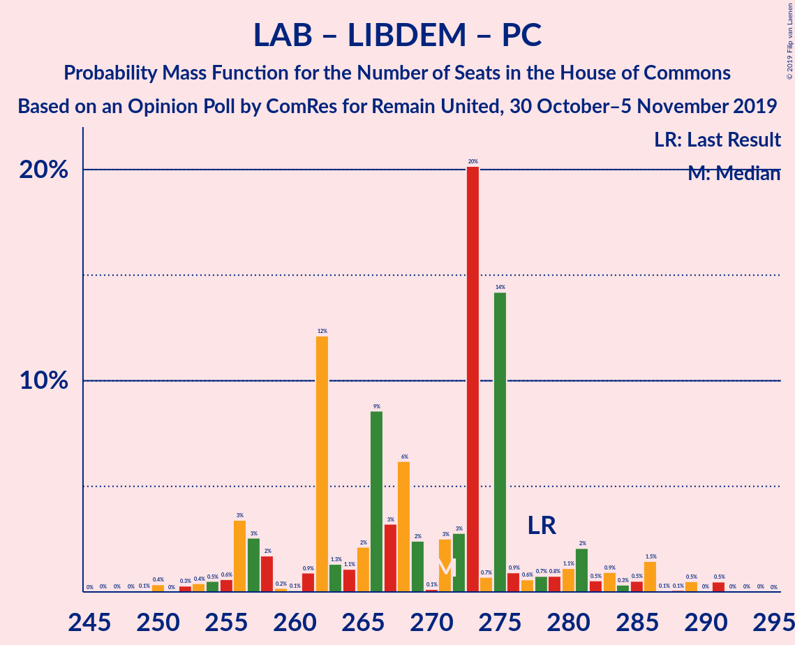

| Number of Seats | Probability | Accumulated | Special Marks |
|:---------------:|:-----------:|:-----------:|:-------------:|
| 246 | 0% | 100% |  |
| 247 | 0% | 99.9% |  |
| 248 | 0% | 99.9% |  |
| 249 | 0.1% | 99.9% |  |
| 250 | 0.4% | 99.8% |  |
| 251 | 0% | 99.5% |  |
| 252 | 0.3% | 99.5% |  |
| 253 | 0.4% | 99.2% |  |
| 254 | 0.5% | 98.8% |  |
| 255 | 0.6% | 98% |  |
| 256 | 3% | 98% |  |
| 257 | 3% | 94% |  |
| 258 | 2% | 92% |  |
| 259 | 0.2% | 90% |  |
| 260 | 0.1% | 90% |  |
| 261 | 0.9% | 90% |  |
| 262 | 12% | 89% |  |
| 263 | 1.3% | 77% |  |
| 264 | 1.1% | 75% |  |
| 265 | 2% | 74% |  |
| 266 | 9% | 72% |  |
| 267 | 3% | 64% |  |
| 268 | 6% | 60% | Median |
| 269 | 2% | 54% |  |
| 270 | 0.1% | 52% |  |
| 271 | 3% | 52% |  |
| 272 | 3% | 49% |  |
| 273 | 20% | 46% |  |
| 274 | 0.7% | 26% |  |
| 275 | 14% | 25% |  |
| 276 | 0.9% | 11% |  |
| 277 | 0.6% | 10% |  |
| 278 | 0.7% | 10% | Last Result |
| 279 | 0.8% | 9% |  |
| 280 | 1.1% | 8% |  |
| 281 | 2% | 7% |  |
| 282 | 0.5% | 5% |  |
| 283 | 0.9% | 5% |  |
| 284 | 0.3% | 4% |  |
| 285 | 0.5% | 3% |  |
| 286 | 1.5% | 3% |  |
| 287 | 0.1% | 1.3% |  |
| 288 | 0.1% | 1.2% |  |
| 289 | 0.5% | 1.1% |  |
| 290 | 0% | 0.6% |  |
| 291 | 0.5% | 0.6% |  |
| 292 | 0% | 0.1% |  |
| 293 | 0% | 0.1% |  |
| 294 | 0% | 0% |  |

### Labour Party – Liberal Democrats – Change UK

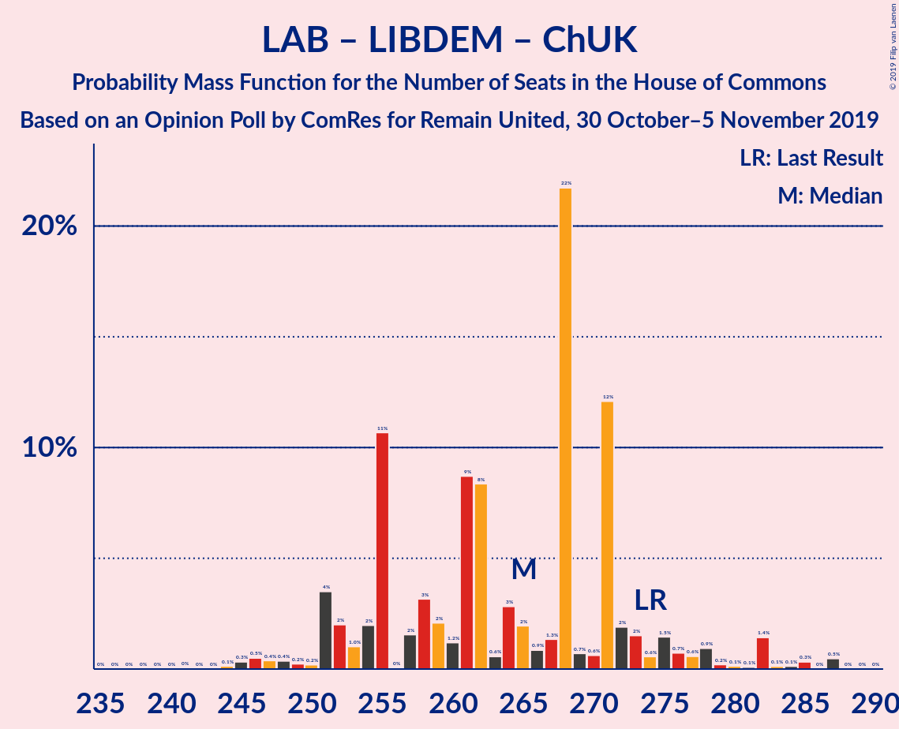

| Number of Seats | Probability | Accumulated | Special Marks |
|:---------------:|:-----------:|:-----------:|:-------------:|
| 239 | 0% | 100% |  |
| 240 | 0% | 99.9% |  |
| 241 | 0% | 99.9% |  |
| 242 | 0% | 99.9% |  |
| 243 | 0% | 99.9% |  |
| 244 | 0.1% | 99.9% |  |
| 245 | 0.3% | 99.7% |  |
| 246 | 0.5% | 99.4% |  |
| 247 | 0.4% | 98.9% |  |
| 248 | 0.4% | 98.5% |  |
| 249 | 0.2% | 98% |  |
| 250 | 0.2% | 98% |  |
| 251 | 4% | 98% |  |
| 252 | 2% | 94% |  |
| 253 | 1.0% | 92% |  |
| 254 | 2% | 91% |  |
| 255 | 11% | 89% |  |
| 256 | 0% | 79% |  |
| 257 | 2% | 78% |  |
| 258 | 3% | 77% |  |
| 259 | 2% | 74% |  |
| 260 | 1.2% | 72% |  |
| 261 | 9% | 70% |  |
| 262 | 8% | 62% |  |
| 263 | 0.6% | 53% | Median |
| 264 | 3% | 53% |  |
| 265 | 2% | 50% |  |
| 266 | 0.9% | 48% |  |
| 267 | 1.3% | 47% |  |
| 268 | 22% | 46% |  |
| 269 | 0.7% | 24% |  |
| 270 | 0.6% | 23% |  |
| 271 | 12% | 23% |  |
| 272 | 2% | 11% |  |
| 273 | 2% | 9% |  |
| 274 | 0.6% | 7% | Last Result |
| 275 | 1.5% | 7% |  |
| 276 | 0.7% | 5% |  |
| 277 | 0.6% | 5% |  |
| 278 | 0.9% | 4% |  |
| 279 | 0.2% | 3% |  |
| 280 | 0.1% | 3% |  |
| 281 | 0.1% | 3% |  |
| 282 | 1.4% | 3% |  |
| 283 | 0.1% | 1.2% |  |
| 284 | 0.1% | 1.0% |  |
| 285 | 0.3% | 0.9% |  |
| 286 | 0% | 0.6% |  |
| 287 | 0.5% | 0.5% |  |
| 288 | 0% | 0.1% |  |
| 289 | 0% | 0.1% |  |
| 290 | 0% | 0% |  |

### Labour Party – Liberal Democrats

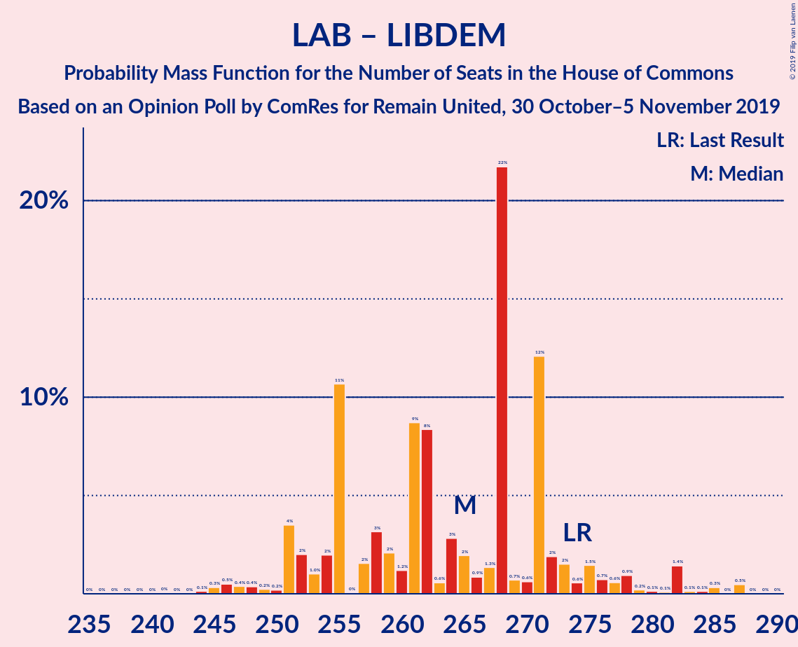

| Number of Seats | Probability | Accumulated | Special Marks |
|:---------------:|:-----------:|:-----------:|:-------------:|
| 239 | 0% | 100% |  |
| 240 | 0% | 99.9% |  |
| 241 | 0% | 99.9% |  |
| 242 | 0% | 99.9% |  |
| 243 | 0% | 99.9% |  |
| 244 | 0.1% | 99.9% |  |
| 245 | 0.3% | 99.7% |  |
| 246 | 0.5% | 99.4% |  |
| 247 | 0.4% | 98.9% |  |
| 248 | 0.4% | 98.5% |  |
| 249 | 0.2% | 98% |  |
| 250 | 0.2% | 98% |  |
| 251 | 4% | 98% |  |
| 252 | 2% | 94% |  |
| 253 | 1.0% | 92% |  |
| 254 | 2% | 91% |  |
| 255 | 11% | 89% |  |
| 256 | 0% | 79% |  |
| 257 | 2% | 78% |  |
| 258 | 3% | 77% |  |
| 259 | 2% | 74% |  |
| 260 | 1.2% | 72% |  |
| 261 | 9% | 70% |  |
| 262 | 8% | 62% |  |
| 263 | 0.6% | 53% | Median |
| 264 | 3% | 53% |  |
| 265 | 2% | 50% |  |
| 266 | 0.9% | 48% |  |
| 267 | 1.3% | 47% |  |
| 268 | 22% | 46% |  |
| 269 | 0.7% | 24% |  |
| 270 | 0.6% | 23% |  |
| 271 | 12% | 23% |  |
| 272 | 2% | 11% |  |
| 273 | 2% | 9% |  |
| 274 | 0.6% | 7% | Last Result |
| 275 | 1.5% | 7% |  |
| 276 | 0.7% | 5% |  |
| 277 | 0.6% | 5% |  |
| 278 | 0.9% | 4% |  |
| 279 | 0.2% | 3% |  |
| 280 | 0.1% | 3% |  |
| 281 | 0.1% | 3% |  |
| 282 | 1.4% | 3% |  |
| 283 | 0.1% | 1.2% |  |
| 284 | 0.1% | 1.0% |  |
| 285 | 0.3% | 0.9% |  |
| 286 | 0% | 0.6% |  |
| 287 | 0.5% | 0.5% |  |
| 288 | 0% | 0.1% |  |
| 289 | 0% | 0.1% |  |
| 290 | 0% | 0% |  |

### Labour Party – Scottish National Party – Plaid Cymru

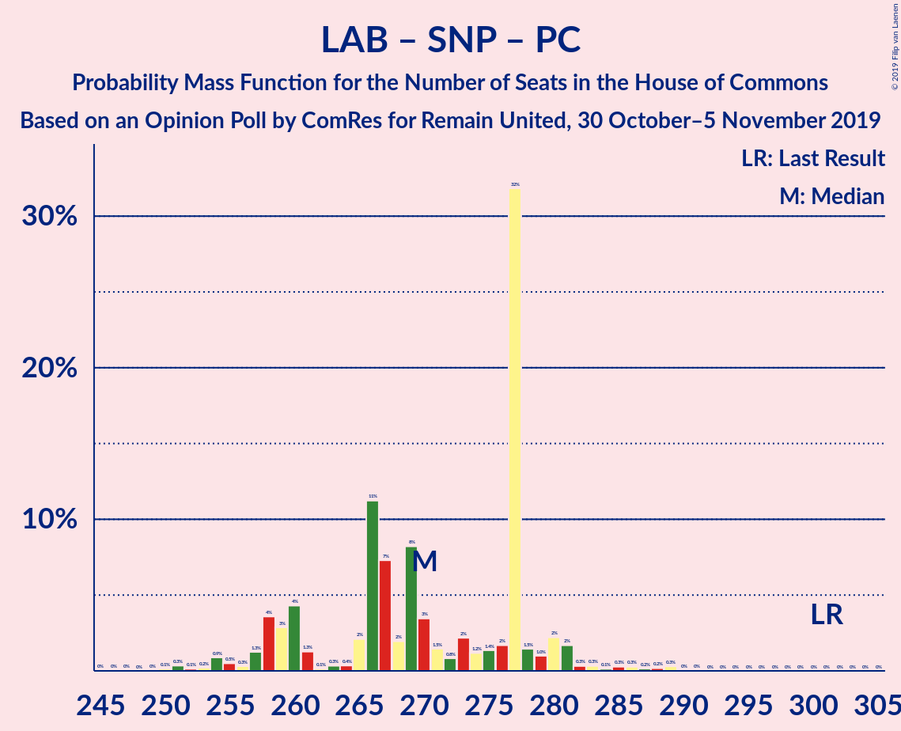

| Number of Seats | Probability | Accumulated | Special Marks |
|:---------------:|:-----------:|:-----------:|:-------------:|
| 245 | 0% | 100% |  |
| 246 | 0% | 99.9% |  |
| 247 | 0% | 99.9% |  |
| 248 | 0% | 99.9% |  |
| 249 | 0% | 99.9% |  |
| 250 | 0.1% | 99.9% |  |
| 251 | 0.3% | 99.7% |  |
| 252 | 0.1% | 99.4% |  |
| 253 | 0.2% | 99.2% |  |
| 254 | 0.9% | 99.0% |  |
| 255 | 0.5% | 98% |  |
| 256 | 0.3% | 98% |  |
| 257 | 1.3% | 97% |  |
| 258 | 4% | 96% |  |
| 259 | 3% | 92% |  |
| 260 | 4% | 90% |  |
| 261 | 1.3% | 85% |  |
| 262 | 0.1% | 84% |  |
| 263 | 0.3% | 84% |  |
| 264 | 0.4% | 84% |  |
| 265 | 2% | 83% |  |
| 266 | 11% | 81% |  |
| 267 | 7% | 70% |  |
| 268 | 2% | 63% |  |
| 269 | 8% | 61% |  |
| 270 | 3% | 52% |  |
| 271 | 1.5% | 49% | Median |
| 272 | 0.8% | 47% |  |
| 273 | 2% | 47% |  |
| 274 | 1.2% | 44% |  |
| 275 | 1.4% | 43% |  |
| 276 | 2% | 42% |  |
| 277 | 32% | 40% |  |
| 278 | 1.5% | 8% |  |
| 279 | 1.0% | 7% |  |
| 280 | 2% | 6% |  |
| 281 | 2% | 4% |  |
| 282 | 0.3% | 2% |  |
| 283 | 0.3% | 2% |  |
| 284 | 0.1% | 1.4% |  |
| 285 | 0.3% | 1.2% |  |
| 286 | 0.3% | 0.9% |  |
| 287 | 0.2% | 0.7% |  |
| 288 | 0.2% | 0.5% |  |
| 289 | 0.3% | 0.3% |  |
| 290 | 0% | 0% |  |
| 291 | 0% | 0% |  |
| 292 | 0% | 0% |  |
| 293 | 0% | 0% |  |
| 294 | 0% | 0% |  |
| 295 | 0% | 0% |  |
| 296 | 0% | 0% |  |
| 297 | 0% | 0% |  |
| 298 | 0% | 0% |  |
| 299 | 0% | 0% |  |
| 300 | 0% | 0% |  |
| 301 | 0% | 0% | Last Result |

### Labour Party – Scottish National Party

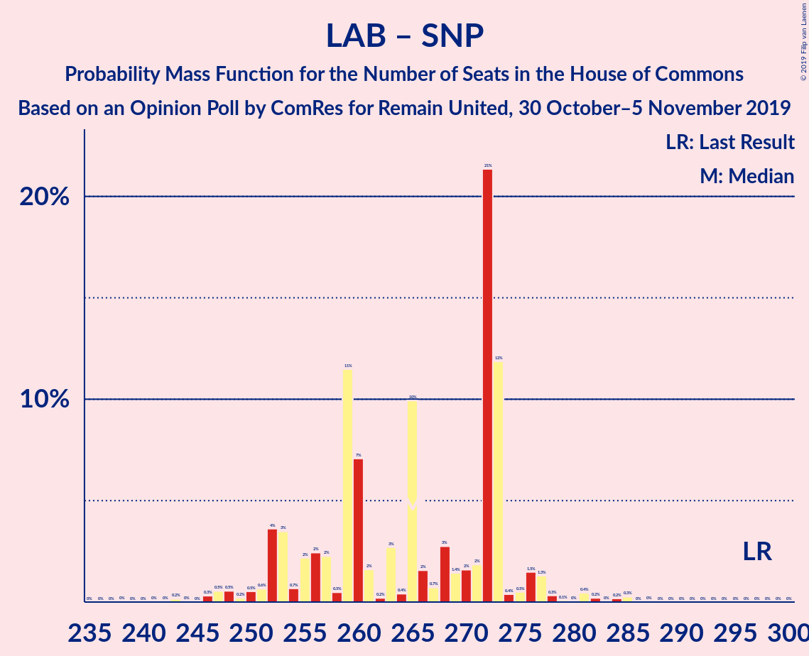

| Number of Seats | Probability | Accumulated | Special Marks |
|:---------------:|:-----------:|:-----------:|:-------------:|
| 238 | 0% | 100% |  |
| 239 | 0% | 99.9% |  |
| 240 | 0% | 99.9% |  |
| 241 | 0% | 99.9% |  |
| 242 | 0% | 99.9% |  |
| 243 | 0.2% | 99.9% |  |
| 244 | 0% | 99.7% |  |
| 245 | 0% | 99.7% |  |
| 246 | 0.3% | 99.7% |  |
| 247 | 0.5% | 99.4% |  |
| 248 | 0.5% | 98.8% |  |
| 249 | 0.2% | 98% |  |
| 250 | 0.5% | 98% |  |
| 251 | 0.6% | 98% |  |
| 252 | 4% | 97% |  |
| 253 | 3% | 93% |  |
| 254 | 0.7% | 90% |  |
| 255 | 2% | 89% |  |
| 256 | 2% | 87% |  |
| 257 | 2% | 85% |  |
| 258 | 0.5% | 82% |  |
| 259 | 11% | 82% |  |
| 260 | 7% | 70% |  |
| 261 | 2% | 63% |  |
| 262 | 0.2% | 62% |  |
| 263 | 3% | 61% |  |
| 264 | 0.4% | 59% |  |
| 265 | 10% | 58% |  |
| 266 | 2% | 48% | Median |
| 267 | 0.7% | 47% |  |
| 268 | 3% | 46% |  |
| 269 | 1.4% | 43% |  |
| 270 | 2% | 42% |  |
| 271 | 2% | 40% |  |
| 272 | 21% | 38% |  |
| 273 | 12% | 17% |  |
| 274 | 0.4% | 5% |  |
| 275 | 0.5% | 5% |  |
| 276 | 1.5% | 4% |  |
| 277 | 1.3% | 3% |  |
| 278 | 0.3% | 2% |  |
| 279 | 0.1% | 1.3% |  |
| 280 | 0% | 1.2% |  |
| 281 | 0.4% | 1.2% |  |
| 282 | 0.2% | 0.7% |  |
| 283 | 0% | 0.5% |  |
| 284 | 0.2% | 0.5% |  |
| 285 | 0.3% | 0.3% |  |
| 286 | 0% | 0% |  |
| 287 | 0% | 0% |  |
| 288 | 0% | 0% |  |
| 289 | 0% | 0% |  |
| 290 | 0% | 0% |  |
| 291 | 0% | 0% |  |
| 292 | 0% | 0% |  |
| 293 | 0% | 0% |  |
| 294 | 0% | 0% |  |
| 295 | 0% | 0% |  |
| 296 | 0% | 0% |  |
| 297 | 0% | 0% | Last Result |

### Labour Party – Plaid Cymru

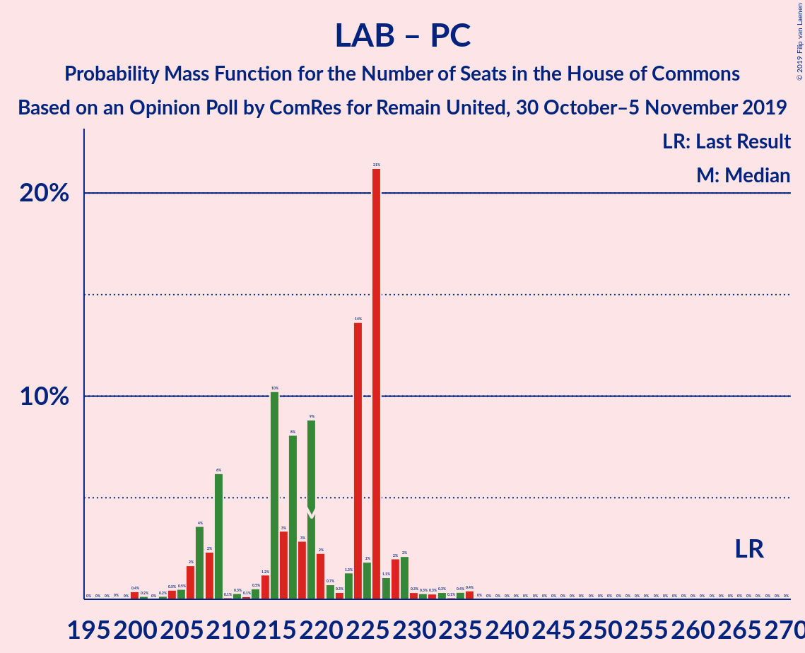

| Number of Seats | Probability | Accumulated | Special Marks |
|:---------------:|:-----------:|:-----------:|:-------------:|
| 195 | 0% | 100% |  |
| 196 | 0% | 99.9% |  |
| 197 | 0% | 99.9% |  |
| 198 | 0% | 99.9% |  |
| 199 | 0% | 99.9% |  |
| 200 | 0.4% | 99.9% |  |
| 201 | 0.2% | 99.5% |  |
| 202 | 0% | 99.3% |  |
| 203 | 0.2% | 99.3% |  |
| 204 | 0.5% | 99.2% |  |
| 205 | 0.5% | 98.7% |  |
| 206 | 2% | 98% |  |
| 207 | 4% | 97% |  |
| 208 | 2% | 93% |  |
| 209 | 6% | 91% |  |
| 210 | 0.1% | 84% |  |
| 211 | 0.3% | 84% |  |
| 212 | 0.1% | 84% |  |
| 213 | 0.5% | 84% |  |
| 214 | 1.2% | 83% |  |
| 215 | 10% | 82% |  |
| 216 | 3% | 72% |  |
| 217 | 8% | 69% |  |
| 218 | 3% | 60% |  |
| 219 | 9% | 58% |  |
| 220 | 2% | 49% | Median |
| 221 | 0.7% | 46% |  |
| 222 | 0.3% | 46% |  |
| 223 | 1.3% | 45% |  |
| 224 | 14% | 44% |  |
| 225 | 2% | 30% |  |
| 226 | 21% | 29% |  |
| 227 | 1.1% | 7% |  |
| 228 | 2% | 6% |  |
| 229 | 2% | 4% |  |
| 230 | 0.3% | 2% |  |
| 231 | 0.3% | 2% |  |
| 232 | 0.3% | 2% |  |
| 233 | 0.3% | 1.3% |  |
| 234 | 0.1% | 0.9% |  |
| 235 | 0.4% | 0.8% |  |
| 236 | 0.4% | 0.5% |  |
| 237 | 0% | 0.1% |  |
| 238 | 0% | 0% |  |
| 239 | 0% | 0% |  |
| 240 | 0% | 0% |  |
| 241 | 0% | 0% |  |
| 242 | 0% | 0% |  |
| 243 | 0% | 0% |  |
| 244 | 0% | 0% |  |
| 245 | 0% | 0% |  |
| 246 | 0% | 0% |  |
| 247 | 0% | 0% |  |
| 248 | 0% | 0% |  |
| 249 | 0% | 0% |  |
| 250 | 0% | 0% |  |
| 251 | 0% | 0% |  |
| 252 | 0% | 0% |  |
| 253 | 0% | 0% |  |
| 254 | 0% | 0% |  |
| 255 | 0% | 0% |  |
| 256 | 0% | 0% |  |
| 257 | 0% | 0% |  |
| 258 | 0% | 0% |  |
| 259 | 0% | 0% |  |
| 260 | 0% | 0% |  |
| 261 | 0% | 0% |  |
| 262 | 0% | 0% |  |
| 263 | 0% | 0% |  |
| 264 | 0% | 0% |  |
| 265 | 0% | 0% |  |
| 266 | 0% | 0% | Last Result |

### Labour Party – Change UK

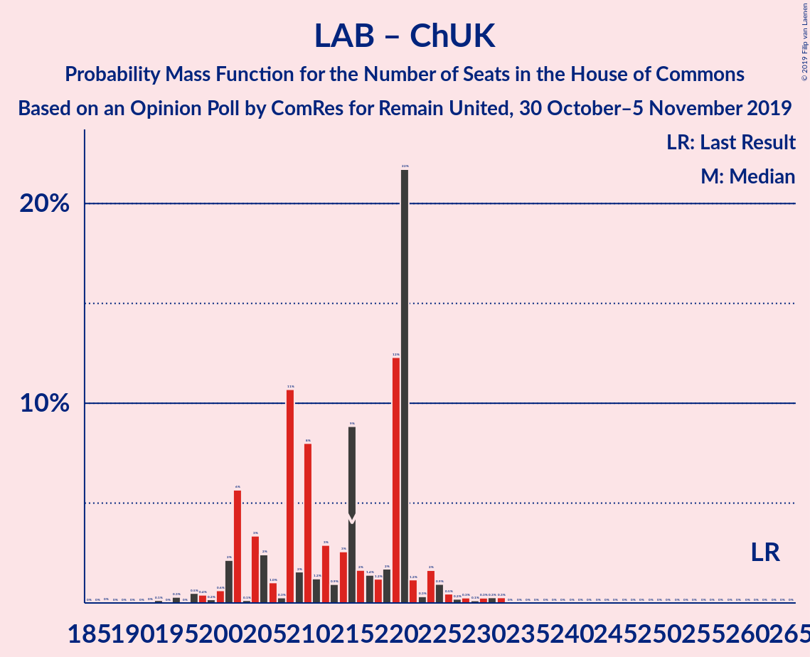

| Number of Seats | Probability | Accumulated | Special Marks |
|:---------------:|:-----------:|:-----------:|:-------------:|
| 189 | 0% | 100% |  |
| 190 | 0% | 99.9% |  |
| 191 | 0% | 99.9% |  |
| 192 | 0% | 99.9% |  |
| 193 | 0.1% | 99.9% |  |
| 194 | 0% | 99.7% |  |
| 195 | 0.3% | 99.7% |  |
| 196 | 0% | 99.4% |  |
| 197 | 0.5% | 99.4% |  |
| 198 | 0.4% | 98.9% |  |
| 199 | 0.2% | 98% |  |
| 200 | 0.6% | 98% |  |
| 201 | 2% | 98% |  |
| 202 | 6% | 96% |  |
| 203 | 0.1% | 90% |  |
| 204 | 3% | 90% |  |
| 205 | 2% | 86% |  |
| 206 | 1.0% | 84% |  |
| 207 | 0.3% | 83% |  |
| 208 | 11% | 83% |  |
| 209 | 2% | 72% |  |
| 210 | 8% | 70% |  |
| 211 | 1.2% | 62% |  |
| 212 | 3% | 61% |  |
| 213 | 0.9% | 58% |  |
| 214 | 3% | 57% |  |
| 215 | 9% | 55% | Median |
| 216 | 2% | 46% |  |
| 217 | 1.4% | 44% |  |
| 218 | 1.2% | 43% |  |
| 219 | 2% | 42% |  |
| 220 | 12% | 40% |  |
| 221 | 22% | 28% |  |
| 222 | 1.2% | 6% |  |
| 223 | 0.3% | 5% |  |
| 224 | 2% | 4% |  |
| 225 | 0.9% | 3% |  |
| 226 | 0.5% | 2% |  |
| 227 | 0.2% | 1.4% |  |
| 228 | 0.3% | 1.2% |  |
| 229 | 0.1% | 1.0% |  |
| 230 | 0.3% | 0.9% |  |
| 231 | 0.3% | 0.6% |  |
| 232 | 0.3% | 0.3% |  |
| 233 | 0% | 0% |  |
| 234 | 0% | 0% |  |
| 235 | 0% | 0% |  |
| 236 | 0% | 0% |  |
| 237 | 0% | 0% |  |
| 238 | 0% | 0% |  |
| 239 | 0% | 0% |  |
| 240 | 0% | 0% |  |
| 241 | 0% | 0% |  |
| 242 | 0% | 0% |  |
| 243 | 0% | 0% |  |
| 244 | 0% | 0% |  |
| 245 | 0% | 0% |  |
| 246 | 0% | 0% |  |
| 247 | 0% | 0% |  |
| 248 | 0% | 0% |  |
| 249 | 0% | 0% |  |
| 250 | 0% | 0% |  |
| 251 | 0% | 0% |  |
| 252 | 0% | 0% |  |
| 253 | 0% | 0% |  |
| 254 | 0% | 0% |  |
| 255 | 0% | 0% |  |
| 256 | 0% | 0% |  |
| 257 | 0% | 0% |  |
| 258 | 0% | 0% |  |
| 259 | 0% | 0% |  |
| 260 | 0% | 0% |  |
| 261 | 0% | 0% |  |
| 262 | 0% | 0% | Last Result |

### Labour Party

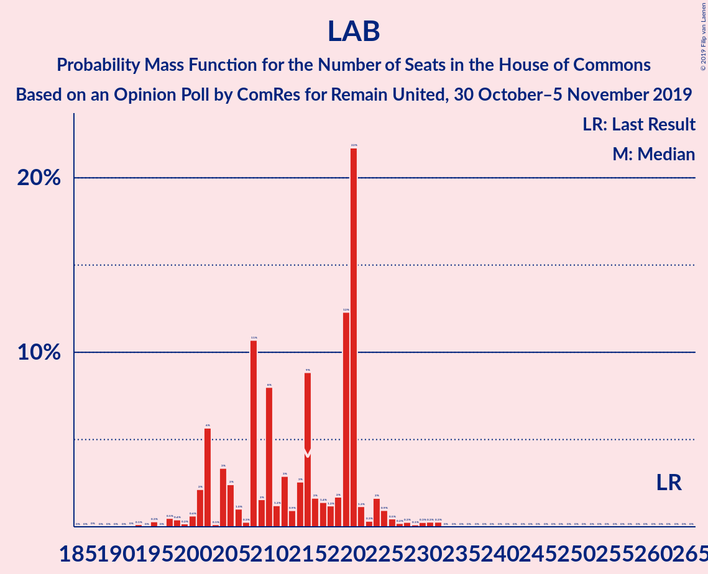

| Number of Seats | Probability | Accumulated | Special Marks |
|:---------------:|:-----------:|:-----------:|:-------------:|
| 189 | 0% | 100% |  |
| 190 | 0% | 99.9% |  |
| 191 | 0% | 99.9% |  |
| 192 | 0% | 99.9% |  |
| 193 | 0.1% | 99.9% |  |
| 194 | 0% | 99.7% |  |
| 195 | 0.3% | 99.7% |  |
| 196 | 0% | 99.4% |  |
| 197 | 0.5% | 99.4% |  |
| 198 | 0.4% | 98.9% |  |
| 199 | 0.2% | 98% |  |
| 200 | 0.6% | 98% |  |
| 201 | 2% | 98% |  |
| 202 | 6% | 96% |  |
| 203 | 0.1% | 90% |  |
| 204 | 3% | 90% |  |
| 205 | 2% | 86% |  |
| 206 | 1.0% | 84% |  |
| 207 | 0.3% | 83% |  |
| 208 | 11% | 83% |  |
| 209 | 2% | 72% |  |
| 210 | 8% | 70% |  |
| 211 | 1.2% | 62% |  |
| 212 | 3% | 61% |  |
| 213 | 0.9% | 58% |  |
| 214 | 3% | 57% |  |
| 215 | 9% | 55% | Median |
| 216 | 2% | 46% |  |
| 217 | 1.4% | 44% |  |
| 218 | 1.2% | 43% |  |
| 219 | 2% | 42% |  |
| 220 | 12% | 40% |  |
| 221 | 22% | 28% |  |
| 222 | 1.2% | 6% |  |
| 223 | 0.3% | 5% |  |
| 224 | 2% | 4% |  |
| 225 | 0.9% | 3% |  |
| 226 | 0.5% | 2% |  |
| 227 | 0.2% | 1.4% |  |
| 228 | 0.3% | 1.2% |  |
| 229 | 0.1% | 1.0% |  |
| 230 | 0.3% | 0.9% |  |
| 231 | 0.3% | 0.6% |  |
| 232 | 0.3% | 0.3% |  |
| 233 | 0% | 0% |  |
| 234 | 0% | 0% |  |
| 235 | 0% | 0% |  |
| 236 | 0% | 0% |  |
| 237 | 0% | 0% |  |
| 238 | 0% | 0% |  |
| 239 | 0% | 0% |  |
| 240 | 0% | 0% |  |
| 241 | 0% | 0% |  |
| 242 | 0% | 0% |  |
| 243 | 0% | 0% |  |
| 244 | 0% | 0% |  |
| 245 | 0% | 0% |  |
| 246 | 0% | 0% |  |
| 247 | 0% | 0% |  |
| 248 | 0% | 0% |  |
| 249 | 0% | 0% |  |
| 250 | 0% | 0% |  |
| 251 | 0% | 0% |  |
| 252 | 0% | 0% |  |
| 253 | 0% | 0% |  |
| 254 | 0% | 0% |  |
| 255 | 0% | 0% |  |
| 256 | 0% | 0% |  |
| 257 | 0% | 0% |  |
| 258 | 0% | 0% |  |
| 259 | 0% | 0% |  |
| 260 | 0% | 0% |  |
| 261 | 0% | 0% |  |
| 262 | 0% | 0% | Last Result |

## Technical Information

### Opinion Poll

+ **Polling firm:** ComRes
+ **Commissioner(s):** Remain United
+ **Fieldwork period:** 30 October–5 November 2019

### Calculations

+ **Sample size:** 6097
+ **Simulations done:** 1,048,576
+ **Error estimate:** 0.49%

