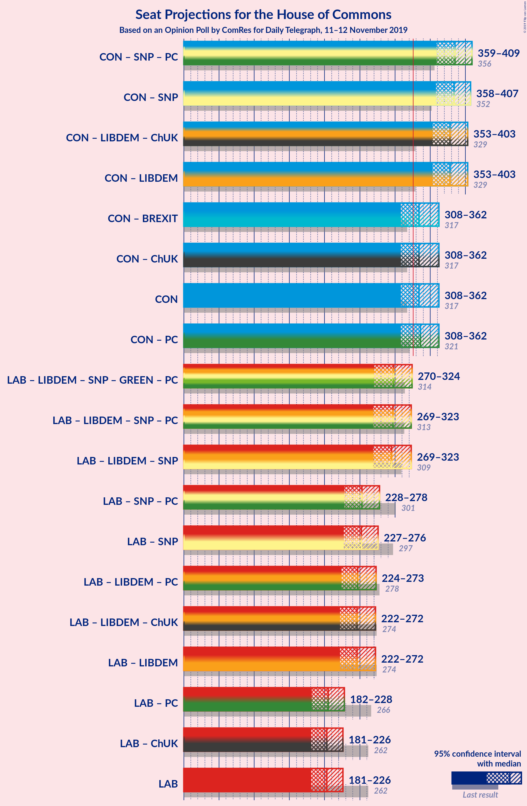

# Opinion Poll by ComRes for Daily Telegraph, 11–12 November 2019

<a href="#voting-intentions">Voting Intentions</a> | <a href="#seats">Seats</a> | <a href="#coalitions">Coalitions</a> | <a href="#technical-information">Technical Information</a>

## Voting Intentions

### Confidence Intervals

| Party | Last Result | Poll Result | 80% Confidence Interval | 90% Confidence Interval | 95% Confidence Interval | 99% Confidence Interval |
|:-----:|:-----------:|:-----------:|:-----------------------:|:-----------------------:|:-----------------------:|:-----------------------:|
| Conservative Party | 43.4% | 39.3% | 37.9–40.7% |37.5–41.1% |37.2–41.5% |36.5–42.1% |
| Labour Party | 41.0% | 29.5% | 28.2–30.8% |27.8–31.2% |27.5–31.5% |26.9–32.1% |
| Liberal Democrats | 7.6% | 15.7% | 14.7–16.8% |14.4–17.1% |14.2–17.4% |13.7–17.9% |
| Brexit Party | 0.0% | 6.9% | 6.2–7.7% |6.0–7.9% |5.9–8.1% |5.5–8.5% |
| Scottish National Party | 3.1% | 3.9% | 3.4–4.5% |3.3–4.7% |3.1–4.8% |2.9–5.2% |
| Green Party | 1.7% | 3.0% | 2.5–3.5% |2.4–3.7% |2.3–3.8% |2.1–4.1% |
| Plaid Cymru | 0.5% | 0.2% | 0.2–0.5% |0.1–0.5% |0.1–0.6% |0.1–0.7% |
| UK Independence Party | 1.9% | 0.2% | 0.2–0.5% |0.1–0.5% |0.1–0.6% |0.1–0.7% |
| Change UK | 0.0% | 0.2% | 0.2–0.5% |0.1–0.5% |0.1–0.6% |0.1–0.7% |

*Note:* The poll result column reflects the actual value used in the calculations. Published results may vary slightly, and in addition be rounded to fewer digits.

## Seats

### Confidence Intervals

| Party | Last Result | Median | 80% Confidence Interval | 90% Confidence Interval | 95% Confidence Interval | 99% Confidence Interval |
|:-----:|:-----------:|:------:|:-----------------------:|:-----------------------:|:-----------------------:|:-----------------------:|
| <a href="#conservative-party">Conservative Party</a> | 317 | 334 | 315–354 |311–358 |308–362 |301–366 |
| <a href="#labour-party">Labour Party</a> | 262 | 203 | 187–219 |184–224 |181–226 |176–231 |
| <a href="#liberal-democrats">Liberal Democrats</a> | 12 | 44 | 38–48 |36–49 |36–50 |35–55 |
| <a href="#brexit-party">Brexit Party</a> | 0 | 0 | 0 |0 |0 |0 |
| <a href="#scottish-national-party">Scottish National Party</a> | 35 | 50 | 45–53 |40–53 |39–53 |39–53 |
| <a href="#green-party">Green Party</a> | 1 | 1 | 1 |1 |1 |1 |
| <a href="#plaid-cymru">Plaid Cymru</a> | 4 | 0 | 0–4 |0–4 |0–4 |0–4 |
| <a href="#uk-independence-party">UK Independence Party</a> | 0 | 0 | 0 |0 |0 |0 |
| <a href="#change-uk">Change UK</a> | 0 | 0 | 0 |0 |0 |0 |

### Conservative Party

*For a full overview of the results for this party, see the [Conservative Party](party-conservativeparty.html) page.*

| Number of Seats | Probability | Accumulated | Special Marks |
|:---------------:|:-----------:|:-----------:|:-------------:|
| 293 | 0% | 100% |  |
| 294 | 0% | 99.9% |  |
| 295 | 0% | 99.9% |  |
| 296 | 0% | 99.9% |  |
| 297 | 0.1% | 99.9% |  |
| 298 | 0% | 99.8% |  |
| 299 | 0.1% | 99.7% |  |
| 300 | 0.1% | 99.7% |  |
| 301 | 0.1% | 99.6% |  |
| 302 | 0.1% | 99.5% |  |
| 303 | 0.2% | 99.3% |  |
| 304 | 0.5% | 99.2% |  |
| 305 | 0.1% | 98.6% |  |
| 306 | 0.4% | 98% |  |
| 307 | 0.3% | 98% |  |
| 308 | 1.4% | 98% |  |
| 309 | 0.6% | 96% |  |
| 310 | 0.6% | 96% |  |
| 311 | 0.7% | 95% |  |
| 312 | 1.1% | 95% |  |
| 313 | 1.4% | 93% |  |
| 314 | 0.9% | 92% |  |
| 315 | 2% | 91% |  |
| 316 | 1.0% | 89% |  |
| 317 | 0.8% | 88% | Last Result |
| 318 | 1.0% | 87% |  |
| 319 | 0.3% | 86% |  |
| 320 | 4% | 86% |  |
| 321 | 1.3% | 83% |  |
| 322 | 0.5% | 81% |  |
| 323 | 0.8% | 81% |  |
| 324 | 3% | 80% |  |
| 325 | 2% | 77% |  |
| 326 | 4% | 75% | Majority |
| 327 | 2% | 71% |  |
| 328 | 0.9% | 68% |  |
| 329 | 1.4% | 68% |  |
| 330 | 6% | 66% |  |
| 331 | 3% | 60% |  |
| 332 | 5% | 57% |  |
| 333 | 1.5% | 52% |  |
| 334 | 2% | 51% | Median |
| 335 | 3% | 49% |  |
| 336 | 3% | 46% |  |
| 337 | 0.7% | 43% |  |
| 338 | 1.3% | 42% |  |
| 339 | 2% | 41% |  |
| 340 | 1.1% | 39% |  |
| 341 | 0.8% | 38% |  |
| 342 | 1.0% | 37% |  |
| 343 | 6% | 37% |  |
| 344 | 6% | 30% |  |
| 345 | 2% | 24% |  |
| 346 | 0.8% | 22% |  |
| 347 | 0.9% | 21% |  |
| 348 | 1.3% | 20% |  |
| 349 | 1.2% | 19% |  |
| 350 | 1.3% | 17% |  |
| 351 | 2% | 16% |  |
| 352 | 2% | 14% |  |
| 353 | 0.9% | 12% |  |
| 354 | 1.2% | 11% |  |
| 355 | 2% | 10% |  |
| 356 | 1.4% | 7% |  |
| 357 | 0.7% | 6% |  |
| 358 | 0.7% | 5% |  |
| 359 | 0.9% | 5% |  |
| 360 | 0.6% | 4% |  |
| 361 | 0.4% | 3% |  |
| 362 | 0.8% | 3% |  |
| 363 | 1.0% | 2% |  |
| 364 | 0.1% | 0.9% |  |
| 365 | 0.3% | 0.8% |  |
| 366 | 0.2% | 0.6% |  |
| 367 | 0.1% | 0.4% |  |
| 368 | 0% | 0.3% |  |
| 369 | 0.1% | 0.3% |  |
| 370 | 0% | 0.2% |  |
| 371 | 0% | 0.1% |  |
| 372 | 0% | 0.1% |  |
| 373 | 0% | 0.1% |  |
| 374 | 0% | 0.1% |  |
| 375 | 0% | 0% |  |

### Labour Party

*For a full overview of the results for this party, see the [Labour Party](party-labourparty.html) page.*

| Number of Seats | Probability | Accumulated | Special Marks |
|:---------------:|:-----------:|:-----------:|:-------------:|
| 170 | 0% | 100% |  |
| 171 | 0% | 99.9% |  |
| 172 | 0.1% | 99.9% |  |
| 173 | 0% | 99.9% |  |
| 174 | 0.1% | 99.9% |  |
| 175 | 0% | 99.8% |  |
| 176 | 0.4% | 99.8% |  |
| 177 | 0.1% | 99.4% |  |
| 178 | 0.4% | 99.3% |  |
| 179 | 0.3% | 98.8% |  |
| 180 | 0.7% | 98% |  |
| 181 | 0.6% | 98% |  |
| 182 | 0.5% | 97% |  |
| 183 | 0.9% | 97% |  |
| 184 | 1.3% | 96% |  |
| 185 | 2% | 94% |  |
| 186 | 2% | 92% |  |
| 187 | 4% | 90% |  |
| 188 | 0.7% | 86% |  |
| 189 | 1.3% | 85% |  |
| 190 | 5% | 84% |  |
| 191 | 3% | 79% |  |
| 192 | 1.4% | 77% |  |
| 193 | 6% | 75% |  |
| 194 | 4% | 70% |  |
| 195 | 0.7% | 66% |  |
| 196 | 0.8% | 65% |  |
| 197 | 0.7% | 64% |  |
| 198 | 2% | 63% |  |
| 199 | 5% | 61% |  |
| 200 | 0.7% | 56% |  |
| 201 | 2% | 56% |  |
| 202 | 1.4% | 54% |  |
| 203 | 4% | 52% | Median |
| 204 | 5% | 48% |  |
| 205 | 4% | 44% |  |
| 206 | 6% | 40% |  |
| 207 | 5% | 34% |  |
| 208 | 2% | 29% |  |
| 209 | 3% | 27% |  |
| 210 | 0.6% | 24% |  |
| 211 | 4% | 24% |  |
| 212 | 0.8% | 20% |  |
| 213 | 0.7% | 19% |  |
| 214 | 3% | 18% |  |
| 215 | 1.1% | 16% |  |
| 216 | 2% | 15% |  |
| 217 | 1.5% | 13% |  |
| 218 | 1.1% | 11% |  |
| 219 | 0.3% | 10% |  |
| 220 | 0.1% | 10% |  |
| 221 | 0.8% | 10% |  |
| 222 | 1.2% | 9% |  |
| 223 | 3% | 8% |  |
| 224 | 2% | 5% |  |
| 225 | 0.6% | 3% |  |
| 226 | 0.3% | 3% |  |
| 227 | 0.3% | 2% |  |
| 228 | 0.7% | 2% |  |
| 229 | 0.2% | 1.2% |  |
| 230 | 0.5% | 1.1% |  |
| 231 | 0.1% | 0.6% |  |
| 232 | 0.1% | 0.5% |  |
| 233 | 0.1% | 0.4% |  |
| 234 | 0.1% | 0.3% |  |
| 235 | 0.1% | 0.2% |  |
| 236 | 0.1% | 0.1% |  |
| 237 | 0% | 0.1% |  |
| 238 | 0% | 0.1% |  |
| 239 | 0% | 0% |  |
| 240 | 0% | 0% |  |
| 241 | 0% | 0% |  |
| 242 | 0% | 0% |  |
| 243 | 0% | 0% |  |
| 244 | 0% | 0% |  |
| 245 | 0% | 0% |  |
| 246 | 0% | 0% |  |
| 247 | 0% | 0% |  |
| 248 | 0% | 0% |  |
| 249 | 0% | 0% |  |
| 250 | 0% | 0% |  |
| 251 | 0% | 0% |  |
| 252 | 0% | 0% |  |
| 253 | 0% | 0% |  |
| 254 | 0% | 0% |  |
| 255 | 0% | 0% |  |
| 256 | 0% | 0% |  |
| 257 | 0% | 0% |  |
| 258 | 0% | 0% |  |
| 259 | 0% | 0% |  |
| 260 | 0% | 0% |  |
| 261 | 0% | 0% |  |
| 262 | 0% | 0% | Last Result |

### Liberal Democrats

*For a full overview of the results for this party, see the [Liberal Democrats](party-liberaldemocrats.html) page.*

| Number of Seats | Probability | Accumulated | Special Marks |
|:---------------:|:-----------:|:-----------:|:-------------:|
| 12 | 0% | 100% | Last Result |
| 13 | 0% | 100% |  |
| 14 | 0% | 100% |  |
| 15 | 0% | 100% |  |
| 16 | 0% | 100% |  |
| 17 | 0% | 100% |  |
| 18 | 0% | 100% |  |
| 19 | 0% | 100% |  |
| 20 | 0% | 100% |  |
| 21 | 0% | 100% |  |
| 22 | 0% | 100% |  |
| 23 | 0% | 100% |  |
| 24 | 0% | 100% |  |
| 25 | 0% | 100% |  |
| 26 | 0% | 100% |  |
| 27 | 0% | 100% |  |
| 28 | 0% | 100% |  |
| 29 | 0% | 100% |  |
| 30 | 0% | 100% |  |
| 31 | 0% | 100% |  |
| 32 | 0% | 100% |  |
| 33 | 0.2% | 100% |  |
| 34 | 0.1% | 99.8% |  |
| 35 | 0.2% | 99.6% |  |
| 36 | 5% | 99.4% |  |
| 37 | 4% | 94% |  |
| 38 | 4% | 91% |  |
| 39 | 3% | 87% |  |
| 40 | 1.3% | 84% |  |
| 41 | 7% | 83% |  |
| 42 | 13% | 75% |  |
| 43 | 9% | 62% |  |
| 44 | 9% | 53% | Median |
| 45 | 3% | 44% |  |
| 46 | 19% | 41% |  |
| 47 | 11% | 22% |  |
| 48 | 5% | 11% |  |
| 49 | 3% | 7% |  |
| 50 | 2% | 3% |  |
| 51 | 0.8% | 2% |  |
| 52 | 0.2% | 1.1% |  |
| 53 | 0.1% | 0.8% |  |
| 54 | 0.2% | 0.7% |  |
| 55 | 0.3% | 0.5% |  |
| 56 | 0.1% | 0.2% |  |
| 57 | 0% | 0.1% |  |
| 58 | 0% | 0.1% |  |
| 59 | 0% | 0% |  |

### Brexit Party

*For a full overview of the results for this party, see the [Brexit Party](party-brexitparty.html) page.*

| Number of Seats | Probability | Accumulated | Special Marks |
|:---------------:|:-----------:|:-----------:|:-------------:|
| 0 | 100% | 100% | Last Result, Median |

### Scottish National Party

*For a full overview of the results for this party, see the [Scottish National Party](party-scottishnationalparty.html) page.*

| Number of Seats | Probability | Accumulated | Special Marks |
|:---------------:|:-----------:|:-----------:|:-------------:|
| 34 | 0% | 100% |  |
| 35 | 0% | 99.9% | Last Result |
| 36 | 0.1% | 99.9% |  |
| 37 | 0.1% | 99.8% |  |
| 38 | 0.1% | 99.8% |  |
| 39 | 3% | 99.7% |  |
| 40 | 2% | 97% |  |
| 41 | 2% | 95% |  |
| 42 | 0.7% | 93% |  |
| 43 | 2% | 93% |  |
| 44 | 0.7% | 91% |  |
| 45 | 3% | 90% |  |
| 46 | 0.6% | 87% |  |
| 47 | 7% | 86% |  |
| 48 | 13% | 79% |  |
| 49 | 0.3% | 66% |  |
| 50 | 30% | 66% | Median |
| 51 | 25% | 36% |  |
| 52 | 0.2% | 11% |  |
| 53 | 10% | 11% |  |
| 54 | 0.2% | 0.2% |  |
| 55 | 0% | 0% |  |

### Green Party

*For a full overview of the results for this party, see the [Green Party](party-greenparty.html) page.*

| Number of Seats | Probability | Accumulated | Special Marks |
|:---------------:|:-----------:|:-----------:|:-------------:|
| 1 | 99.9% | 100% | Last Result, Median |
| 2 | 0.1% | 0.1% |  |
| 3 | 0% | 0% |  |

### Plaid Cymru

*For a full overview of the results for this party, see the [Plaid Cymru](party-plaidcymru.html) page.*

| Number of Seats | Probability | Accumulated | Special Marks |
|:---------------:|:-----------:|:-----------:|:-------------:|
| 0 | 55% | 100% | Median |
| 1 | 0.1% | 45% |  |
| 2 | 1.1% | 44% |  |
| 3 | 19% | 43% |  |
| 4 | 24% | 24% | Last Result |
| 5 | 0% | 0% |  |

### UK Independence Party

*For a full overview of the results for this party, see the [UK Independence Party](party-ukindependenceparty.html) page.*

| Number of Seats | Probability | Accumulated | Special Marks |
|:---------------:|:-----------:|:-----------:|:-------------:|
| 0 | 100% | 100% | Last Result, Median |

### Change UK

*For a full overview of the results for this party, see the [Change UK](party-changeuk.html) page.*

| Number of Seats | Probability | Accumulated | Special Marks |
|:---------------:|:-----------:|:-----------:|:-------------:|
| 0 | 100% | 100% | Last Result, Median |

## Coalitions

### Confidence Intervals

| Coalition | Last Result | Median | Majority? | 80% Confidence Interval | 90% Confidence Interval | 95% Confidence Interval | 99% Confidence Interval |
|:---------:|:-----------:|:------:|:---------:|:-----------------------:|:-----------------------:|:-----------------------:|:-----------------------:|
| Conservative Party – Scottish National Party – Plaid Cymru | 356 | 385 | 100% | 367–403 | 363–407 | 359–409 | 353–415 |
| Conservative Party – Scottish National Party | 352 | 384 | 100% | 365–402 | 361–405 | 358–407 | 352–412 |
| Conservative Party – Liberal Democrats – Change UK | 329 | 378 | 100% | 360–396 | 356–399 | 353–403 | 347–408 |
| Conservative Party – Liberal Democrats | 329 | 378 | 100% | 360–396 | 356–399 | 353–403 | 347–408 |
| Conservative Party – Brexit Party | 317 | 334 | 75% | 315–354 | 311–358 | 308–362 | 301–366 |
| Conservative Party – Change UK | 317 | 334 | 75% | 315–354 | 311–358 | 308–362 | 301–366 |
| Conservative Party | 317 | 334 | 75% | 315–354 | 311–358 | 308–362 | 301–366 |
| Conservative Party – Plaid Cymru | 321 | 336 | 78% | 317–355 | 312–360 | 308–362 | 303–369 |
| Labour Party – Liberal Democrats – Scottish National Party – Green Party – Plaid Cymru | 314 | 298 | 2% | 278–317 | 274–321 | 270–324 | 266–331 |
| Labour Party – Liberal Democrats – Scottish National Party – Plaid Cymru | 313 | 297 | 2% | 277–316 | 273–320 | 269–323 | 265–330 |
| Labour Party – Liberal Democrats – Scottish National Party | 309 | 295 | 0.8% | 276–314 | 271–319 | 269–323 | 262–328 |
| Labour Party – Scottish National Party – Plaid Cymru | 301 | 253 | 0% | 235–271 | 232–275 | 228–278 | 223–283 |
| Labour Party – Scottish National Party | 297 | 252 | 0% | 234–269 | 231–275 | 227–276 | 221–282 |
| Labour Party – Liberal Democrats – Plaid Cymru | 278 | 247 | 0% | 229–266 | 226–270 | 224–273 | 219–279 |
| Labour Party – Liberal Democrats – Change UK | 274 | 246 | 0% | 228–264 | 224–268 | 222–272 | 216–278 |
| Labour Party – Liberal Democrats | 274 | 246 | 0% | 228–264 | 224–268 | 222–272 | 216–278 |
| Labour Party – Plaid Cymru | 266 | 205 | 0% | 187–221 | 186–224 | 182–228 | 179–232 |
| Labour Party – Change UK | 262 | 203 | 0% | 187–219 | 184–224 | 181–226 | 176–231 |
| Labour Party | 262 | 203 | 0% | 187–219 | 184–224 | 181–226 | 176–231 |

### Conservative Party – Scottish National Party – Plaid Cymru

| Number of Seats | Probability | Accumulated | Special Marks |
|:---------------:|:-----------:|:-----------:|:-------------:|
| 347 | 0.1% | 100% |  |
| 348 | 0% | 99.9% |  |
| 349 | 0% | 99.8% |  |
| 350 | 0% | 99.8% |  |
| 351 | 0.1% | 99.8% |  |
| 352 | 0.1% | 99.7% |  |
| 353 | 0.2% | 99.6% |  |
| 354 | 0.2% | 99.4% |  |
| 355 | 0.3% | 99.2% |  |
| 356 | 0.1% | 99.0% | Last Result |
| 357 | 0.1% | 98.9% |  |
| 358 | 1.2% | 98.8% |  |
| 359 | 0.4% | 98% |  |
| 360 | 0.3% | 97% |  |
| 361 | 1.2% | 97% |  |
| 362 | 0.6% | 96% |  |
| 363 | 2% | 95% |  |
| 364 | 1.5% | 93% |  |
| 365 | 0.4% | 92% |  |
| 366 | 0.7% | 91% |  |
| 367 | 0.7% | 91% |  |
| 368 | 2% | 90% |  |
| 369 | 0.9% | 88% |  |
| 370 | 1.4% | 87% |  |
| 371 | 3% | 86% |  |
| 372 | 0.8% | 83% |  |
| 373 | 1.0% | 82% |  |
| 374 | 1.2% | 81% |  |
| 375 | 1.0% | 80% |  |
| 376 | 3% | 79% |  |
| 377 | 4% | 76% |  |
| 378 | 2% | 72% |  |
| 379 | 2% | 69% |  |
| 380 | 3% | 67% |  |
| 381 | 2% | 64% |  |
| 382 | 4% | 61% |  |
| 383 | 1.4% | 57% |  |
| 384 | 5% | 56% | Median |
| 385 | 1.4% | 51% |  |
| 386 | 4% | 50% |  |
| 387 | 1.0% | 46% |  |
| 388 | 4% | 45% |  |
| 389 | 0.6% | 41% |  |
| 390 | 1.4% | 40% |  |
| 391 | 8% | 39% |  |
| 392 | 0.8% | 31% |  |
| 393 | 0.8% | 30% |  |
| 394 | 1.2% | 30% |  |
| 395 | 5% | 28% |  |
| 396 | 2% | 24% |  |
| 397 | 0.7% | 22% |  |
| 398 | 1.3% | 21% |  |
| 399 | 4% | 20% |  |
| 400 | 1.4% | 16% |  |
| 401 | 1.1% | 15% |  |
| 402 | 2% | 13% |  |
| 403 | 2% | 11% |  |
| 404 | 2% | 10% |  |
| 405 | 2% | 7% |  |
| 406 | 0.6% | 6% |  |
| 407 | 2% | 5% |  |
| 408 | 1.1% | 4% |  |
| 409 | 0.6% | 3% |  |
| 410 | 0.4% | 2% |  |
| 411 | 0.2% | 2% |  |
| 412 | 0.6% | 1.4% |  |
| 413 | 0.1% | 0.8% |  |
| 414 | 0.1% | 0.6% |  |
| 415 | 0.3% | 0.5% |  |
| 416 | 0% | 0.2% |  |
| 417 | 0.1% | 0.2% |  |
| 418 | 0% | 0.1% |  |
| 419 | 0.1% | 0.1% |  |
| 420 | 0% | 0.1% |  |
| 421 | 0% | 0% |  |

### Conservative Party – Scottish National Party

| Number of Seats | Probability | Accumulated | Special Marks |
|:---------------:|:-----------:|:-----------:|:-------------:|
| 344 | 0% | 100% |  |
| 345 | 0% | 99.9% |  |
| 346 | 0% | 99.9% |  |
| 347 | 0.1% | 99.9% |  |
| 348 | 0.1% | 99.8% |  |
| 349 | 0.1% | 99.8% |  |
| 350 | 0.1% | 99.7% |  |
| 351 | 0.1% | 99.6% |  |
| 352 | 0.3% | 99.6% | Last Result |
| 353 | 0.2% | 99.3% |  |
| 354 | 0.3% | 99.2% |  |
| 355 | 0.7% | 98.9% |  |
| 356 | 0.2% | 98% |  |
| 357 | 0.1% | 98% |  |
| 358 | 0.9% | 98% |  |
| 359 | 0.6% | 97% |  |
| 360 | 0.9% | 96% |  |
| 361 | 1.2% | 96% |  |
| 362 | 0.5% | 94% |  |
| 363 | 1.5% | 94% |  |
| 364 | 2% | 92% |  |
| 365 | 1.4% | 91% |  |
| 366 | 0.6% | 89% |  |
| 367 | 1.2% | 89% |  |
| 368 | 1.2% | 87% |  |
| 369 | 0.5% | 86% |  |
| 370 | 1.4% | 86% |  |
| 371 | 3% | 84% |  |
| 372 | 0.8% | 81% |  |
| 373 | 3% | 80% |  |
| 374 | 1.0% | 77% |  |
| 375 | 3% | 76% |  |
| 376 | 1.3% | 73% |  |
| 377 | 5% | 72% |  |
| 378 | 2% | 67% |  |
| 379 | 0.7% | 65% |  |
| 380 | 5% | 64% |  |
| 381 | 2% | 59% |  |
| 382 | 4% | 56% |  |
| 383 | 2% | 52% |  |
| 384 | 3% | 50% | Median |
| 385 | 3% | 47% |  |
| 386 | 3% | 44% |  |
| 387 | 1.5% | 41% |  |
| 388 | 1.3% | 40% |  |
| 389 | 0.9% | 39% |  |
| 390 | 1.5% | 38% |  |
| 391 | 7% | 36% |  |
| 392 | 1.2% | 29% |  |
| 393 | 1.3% | 28% |  |
| 394 | 0.6% | 26% |  |
| 395 | 7% | 26% |  |
| 396 | 1.4% | 19% |  |
| 397 | 1.0% | 17% |  |
| 398 | 2% | 16% |  |
| 399 | 1.0% | 14% |  |
| 400 | 0.8% | 13% |  |
| 401 | 0.7% | 12% |  |
| 402 | 2% | 12% |  |
| 403 | 2% | 10% |  |
| 404 | 3% | 8% |  |
| 405 | 2% | 5% |  |
| 406 | 0.6% | 4% |  |
| 407 | 0.8% | 3% |  |
| 408 | 0.4% | 2% |  |
| 409 | 0.3% | 2% |  |
| 410 | 0.1% | 1.4% |  |
| 411 | 0.4% | 1.3% |  |
| 412 | 0.6% | 1.0% |  |
| 413 | 0.1% | 0.4% |  |
| 414 | 0% | 0.2% |  |
| 415 | 0% | 0.2% |  |
| 416 | 0% | 0.1% |  |
| 417 | 0% | 0.1% |  |
| 418 | 0% | 0.1% |  |
| 419 | 0.1% | 0.1% |  |
| 420 | 0% | 0% |  |

### Conservative Party – Liberal Democrats – Change UK

| Number of Seats | Probability | Accumulated | Special Marks |
|:---------------:|:-----------:|:-----------:|:-------------:|
| 329 | 0% | 100% | Last Result |
| 330 | 0% | 100% |  |
| 331 | 0% | 100% |  |
| 332 | 0% | 100% |  |
| 333 | 0% | 100% |  |
| 334 | 0% | 100% |  |
| 335 | 0% | 100% |  |
| 336 | 0% | 100% |  |
| 337 | 0% | 100% |  |
| 338 | 0% | 100% |  |
| 339 | 0% | 100% |  |
| 340 | 0% | 100% |  |
| 341 | 0% | 100% |  |
| 342 | 0% | 99.9% |  |
| 343 | 0.1% | 99.9% |  |
| 344 | 0.1% | 99.8% |  |
| 345 | 0.1% | 99.8% |  |
| 346 | 0.1% | 99.7% |  |
| 347 | 0.1% | 99.6% |  |
| 348 | 0.1% | 99.5% |  |
| 349 | 0.6% | 99.4% |  |
| 350 | 0.2% | 98.8% |  |
| 351 | 0.5% | 98.6% |  |
| 352 | 0.3% | 98% |  |
| 353 | 0.4% | 98% |  |
| 354 | 0.6% | 97% |  |
| 355 | 1.1% | 97% |  |
| 356 | 2% | 96% |  |
| 357 | 2% | 94% |  |
| 358 | 1.1% | 92% |  |
| 359 | 0.5% | 91% |  |
| 360 | 1.4% | 91% |  |
| 361 | 1.2% | 89% |  |
| 362 | 1.0% | 88% |  |
| 363 | 1.3% | 87% |  |
| 364 | 1.1% | 86% |  |
| 365 | 0.6% | 85% |  |
| 366 | 3% | 84% |  |
| 367 | 1.4% | 81% |  |
| 368 | 0.9% | 80% |  |
| 369 | 0.4% | 79% |  |
| 370 | 5% | 79% |  |
| 371 | 4% | 74% |  |
| 372 | 4% | 70% |  |
| 373 | 4% | 66% |  |
| 374 | 2% | 62% |  |
| 375 | 4% | 60% |  |
| 376 | 4% | 56% |  |
| 377 | 1.3% | 52% |  |
| 378 | 5% | 51% | Median |
| 379 | 3% | 46% |  |
| 380 | 0.8% | 44% |  |
| 381 | 0.8% | 43% |  |
| 382 | 2% | 42% |  |
| 383 | 2% | 40% |  |
| 384 | 0.9% | 38% |  |
| 385 | 2% | 37% |  |
| 386 | 5% | 35% |  |
| 387 | 3% | 30% |  |
| 388 | 1.0% | 27% |  |
| 389 | 0.7% | 26% |  |
| 390 | 6% | 25% |  |
| 391 | 0.9% | 20% |  |
| 392 | 3% | 19% |  |
| 393 | 0.8% | 16% |  |
| 394 | 4% | 15% |  |
| 395 | 0.6% | 11% |  |
| 396 | 2% | 10% |  |
| 397 | 2% | 8% |  |
| 398 | 0.6% | 6% |  |
| 399 | 2% | 6% |  |
| 400 | 0.2% | 4% |  |
| 401 | 0.9% | 4% |  |
| 402 | 0.3% | 3% |  |
| 403 | 0.9% | 3% |  |
| 404 | 0.3% | 2% |  |
| 405 | 0.5% | 1.4% |  |
| 406 | 0.2% | 0.9% |  |
| 407 | 0.1% | 0.7% |  |
| 408 | 0.1% | 0.6% |  |
| 409 | 0.1% | 0.5% |  |
| 410 | 0.1% | 0.4% |  |
| 411 | 0.2% | 0.4% |  |
| 412 | 0% | 0.1% |  |
| 413 | 0% | 0.1% |  |
| 414 | 0% | 0.1% |  |
| 415 | 0% | 0.1% |  |
| 416 | 0% | 0.1% |  |
| 417 | 0% | 0.1% |  |
| 418 | 0% | 0% |  |

### Conservative Party – Liberal Democrats

| Number of Seats | Probability | Accumulated | Special Marks |
|:---------------:|:-----------:|:-----------:|:-------------:|
| 329 | 0% | 100% | Last Result |
| 330 | 0% | 100% |  |
| 331 | 0% | 100% |  |
| 332 | 0% | 100% |  |
| 333 | 0% | 100% |  |
| 334 | 0% | 100% |  |
| 335 | 0% | 100% |  |
| 336 | 0% | 100% |  |
| 337 | 0% | 100% |  |
| 338 | 0% | 100% |  |
| 339 | 0% | 100% |  |
| 340 | 0% | 100% |  |
| 341 | 0% | 100% |  |
| 342 | 0% | 99.9% |  |
| 343 | 0.1% | 99.9% |  |
| 344 | 0.1% | 99.8% |  |
| 345 | 0.1% | 99.8% |  |
| 346 | 0.1% | 99.7% |  |
| 347 | 0.1% | 99.6% |  |
| 348 | 0.1% | 99.5% |  |
| 349 | 0.6% | 99.4% |  |
| 350 | 0.2% | 98.8% |  |
| 351 | 0.5% | 98.6% |  |
| 352 | 0.3% | 98% |  |
| 353 | 0.4% | 98% |  |
| 354 | 0.6% | 97% |  |
| 355 | 1.1% | 97% |  |
| 356 | 2% | 96% |  |
| 357 | 2% | 94% |  |
| 358 | 1.1% | 92% |  |
| 359 | 0.5% | 91% |  |
| 360 | 1.4% | 91% |  |
| 361 | 1.2% | 89% |  |
| 362 | 1.0% | 88% |  |
| 363 | 1.3% | 87% |  |
| 364 | 1.1% | 86% |  |
| 365 | 0.6% | 85% |  |
| 366 | 3% | 84% |  |
| 367 | 1.4% | 81% |  |
| 368 | 0.9% | 80% |  |
| 369 | 0.4% | 79% |  |
| 370 | 5% | 79% |  |
| 371 | 4% | 74% |  |
| 372 | 4% | 70% |  |
| 373 | 4% | 66% |  |
| 374 | 2% | 62% |  |
| 375 | 4% | 60% |  |
| 376 | 4% | 56% |  |
| 377 | 1.3% | 52% |  |
| 378 | 5% | 51% | Median |
| 379 | 3% | 46% |  |
| 380 | 0.8% | 44% |  |
| 381 | 0.8% | 43% |  |
| 382 | 2% | 42% |  |
| 383 | 2% | 40% |  |
| 384 | 0.9% | 38% |  |
| 385 | 2% | 37% |  |
| 386 | 5% | 35% |  |
| 387 | 3% | 30% |  |
| 388 | 1.0% | 27% |  |
| 389 | 0.7% | 26% |  |
| 390 | 6% | 25% |  |
| 391 | 0.9% | 20% |  |
| 392 | 3% | 19% |  |
| 393 | 0.8% | 16% |  |
| 394 | 4% | 15% |  |
| 395 | 0.6% | 11% |  |
| 396 | 2% | 10% |  |
| 397 | 2% | 8% |  |
| 398 | 0.6% | 6% |  |
| 399 | 2% | 6% |  |
| 400 | 0.2% | 4% |  |
| 401 | 0.9% | 4% |  |
| 402 | 0.3% | 3% |  |
| 403 | 0.9% | 3% |  |
| 404 | 0.3% | 2% |  |
| 405 | 0.5% | 1.4% |  |
| 406 | 0.2% | 0.9% |  |
| 407 | 0.1% | 0.7% |  |
| 408 | 0.1% | 0.6% |  |
| 409 | 0.1% | 0.5% |  |
| 410 | 0.1% | 0.4% |  |
| 411 | 0.2% | 0.4% |  |
| 412 | 0% | 0.1% |  |
| 413 | 0% | 0.1% |  |
| 414 | 0% | 0.1% |  |
| 415 | 0% | 0.1% |  |
| 416 | 0% | 0.1% |  |
| 417 | 0% | 0.1% |  |
| 418 | 0% | 0% |  |

### Conservative Party – Brexit Party

| Number of Seats | Probability | Accumulated | Special Marks |
|:---------------:|:-----------:|:-----------:|:-------------:|
| 293 | 0% | 100% |  |
| 294 | 0% | 99.9% |  |
| 295 | 0% | 99.9% |  |
| 296 | 0% | 99.9% |  |
| 297 | 0.1% | 99.9% |  |
| 298 | 0% | 99.8% |  |
| 299 | 0.1% | 99.7% |  |
| 300 | 0.1% | 99.7% |  |
| 301 | 0.1% | 99.6% |  |
| 302 | 0.1% | 99.5% |  |
| 303 | 0.2% | 99.3% |  |
| 304 | 0.5% | 99.2% |  |
| 305 | 0.1% | 98.6% |  |
| 306 | 0.4% | 98% |  |
| 307 | 0.3% | 98% |  |
| 308 | 1.4% | 98% |  |
| 309 | 0.6% | 96% |  |
| 310 | 0.6% | 96% |  |
| 311 | 0.7% | 95% |  |
| 312 | 1.1% | 95% |  |
| 313 | 1.4% | 93% |  |
| 314 | 0.9% | 92% |  |
| 315 | 2% | 91% |  |
| 316 | 1.0% | 89% |  |
| 317 | 0.8% | 88% | Last Result |
| 318 | 1.0% | 87% |  |
| 319 | 0.3% | 86% |  |
| 320 | 4% | 86% |  |
| 321 | 1.3% | 83% |  |
| 322 | 0.5% | 81% |  |
| 323 | 0.8% | 81% |  |
| 324 | 3% | 80% |  |
| 325 | 2% | 77% |  |
| 326 | 4% | 75% | Majority |
| 327 | 2% | 71% |  |
| 328 | 0.9% | 68% |  |
| 329 | 1.4% | 68% |  |
| 330 | 6% | 66% |  |
| 331 | 3% | 60% |  |
| 332 | 5% | 57% |  |
| 333 | 1.5% | 52% |  |
| 334 | 2% | 51% | Median |
| 335 | 3% | 49% |  |
| 336 | 3% | 46% |  |
| 337 | 0.7% | 43% |  |
| 338 | 1.3% | 42% |  |
| 339 | 2% | 41% |  |
| 340 | 1.1% | 39% |  |
| 341 | 0.8% | 38% |  |
| 342 | 1.0% | 37% |  |
| 343 | 6% | 37% |  |
| 344 | 6% | 30% |  |
| 345 | 2% | 24% |  |
| 346 | 0.8% | 22% |  |
| 347 | 0.9% | 21% |  |
| 348 | 1.3% | 20% |  |
| 349 | 1.2% | 19% |  |
| 350 | 1.3% | 17% |  |
| 351 | 2% | 16% |  |
| 352 | 2% | 14% |  |
| 353 | 0.9% | 12% |  |
| 354 | 1.2% | 11% |  |
| 355 | 2% | 10% |  |
| 356 | 1.4% | 7% |  |
| 357 | 0.7% | 6% |  |
| 358 | 0.7% | 5% |  |
| 359 | 0.9% | 5% |  |
| 360 | 0.6% | 4% |  |
| 361 | 0.4% | 3% |  |
| 362 | 0.8% | 3% |  |
| 363 | 1.0% | 2% |  |
| 364 | 0.1% | 0.9% |  |
| 365 | 0.3% | 0.8% |  |
| 366 | 0.2% | 0.6% |  |
| 367 | 0.1% | 0.4% |  |
| 368 | 0% | 0.3% |  |
| 369 | 0.1% | 0.3% |  |
| 370 | 0% | 0.2% |  |
| 371 | 0% | 0.1% |  |
| 372 | 0% | 0.1% |  |
| 373 | 0% | 0.1% |  |
| 374 | 0% | 0.1% |  |
| 375 | 0% | 0% |  |

### Conservative Party – Change UK

| Number of Seats | Probability | Accumulated | Special Marks |
|:---------------:|:-----------:|:-----------:|:-------------:|
| 293 | 0% | 100% |  |
| 294 | 0% | 99.9% |  |
| 295 | 0% | 99.9% |  |
| 296 | 0% | 99.9% |  |
| 297 | 0.1% | 99.9% |  |
| 298 | 0% | 99.8% |  |
| 299 | 0.1% | 99.7% |  |
| 300 | 0.1% | 99.7% |  |
| 301 | 0.1% | 99.6% |  |
| 302 | 0.1% | 99.5% |  |
| 303 | 0.2% | 99.3% |  |
| 304 | 0.5% | 99.2% |  |
| 305 | 0.1% | 98.6% |  |
| 306 | 0.4% | 98% |  |
| 307 | 0.3% | 98% |  |
| 308 | 1.4% | 98% |  |
| 309 | 0.6% | 96% |  |
| 310 | 0.6% | 96% |  |
| 311 | 0.7% | 95% |  |
| 312 | 1.1% | 95% |  |
| 313 | 1.4% | 93% |  |
| 314 | 0.9% | 92% |  |
| 315 | 2% | 91% |  |
| 316 | 1.0% | 89% |  |
| 317 | 0.8% | 88% | Last Result |
| 318 | 1.0% | 87% |  |
| 319 | 0.3% | 86% |  |
| 320 | 4% | 86% |  |
| 321 | 1.3% | 83% |  |
| 322 | 0.5% | 81% |  |
| 323 | 0.8% | 81% |  |
| 324 | 3% | 80% |  |
| 325 | 2% | 77% |  |
| 326 | 4% | 75% | Majority |
| 327 | 2% | 71% |  |
| 328 | 0.9% | 68% |  |
| 329 | 1.4% | 68% |  |
| 330 | 6% | 66% |  |
| 331 | 3% | 60% |  |
| 332 | 5% | 57% |  |
| 333 | 1.5% | 52% |  |
| 334 | 2% | 51% | Median |
| 335 | 3% | 49% |  |
| 336 | 3% | 46% |  |
| 337 | 0.7% | 43% |  |
| 338 | 1.3% | 42% |  |
| 339 | 2% | 41% |  |
| 340 | 1.1% | 39% |  |
| 341 | 0.8% | 38% |  |
| 342 | 1.0% | 37% |  |
| 343 | 6% | 37% |  |
| 344 | 6% | 30% |  |
| 345 | 2% | 24% |  |
| 346 | 0.8% | 22% |  |
| 347 | 0.9% | 21% |  |
| 348 | 1.3% | 20% |  |
| 349 | 1.2% | 19% |  |
| 350 | 1.3% | 17% |  |
| 351 | 2% | 16% |  |
| 352 | 2% | 14% |  |
| 353 | 0.9% | 12% |  |
| 354 | 1.2% | 11% |  |
| 355 | 2% | 10% |  |
| 356 | 1.4% | 7% |  |
| 357 | 0.7% | 6% |  |
| 358 | 0.7% | 5% |  |
| 359 | 0.9% | 5% |  |
| 360 | 0.6% | 4% |  |
| 361 | 0.4% | 3% |  |
| 362 | 0.8% | 3% |  |
| 363 | 1.0% | 2% |  |
| 364 | 0.1% | 0.9% |  |
| 365 | 0.3% | 0.8% |  |
| 366 | 0.2% | 0.6% |  |
| 367 | 0.1% | 0.4% |  |
| 368 | 0% | 0.3% |  |
| 369 | 0.1% | 0.3% |  |
| 370 | 0% | 0.2% |  |
| 371 | 0% | 0.1% |  |
| 372 | 0% | 0.1% |  |
| 373 | 0% | 0.1% |  |
| 374 | 0% | 0.1% |  |
| 375 | 0% | 0% |  |

### Conservative Party

| Number of Seats | Probability | Accumulated | Special Marks |
|:---------------:|:-----------:|:-----------:|:-------------:|
| 293 | 0% | 100% |  |
| 294 | 0% | 99.9% |  |
| 295 | 0% | 99.9% |  |
| 296 | 0% | 99.9% |  |
| 297 | 0.1% | 99.9% |  |
| 298 | 0% | 99.8% |  |
| 299 | 0.1% | 99.7% |  |
| 300 | 0.1% | 99.7% |  |
| 301 | 0.1% | 99.6% |  |
| 302 | 0.1% | 99.5% |  |
| 303 | 0.2% | 99.3% |  |
| 304 | 0.5% | 99.2% |  |
| 305 | 0.1% | 98.6% |  |
| 306 | 0.4% | 98% |  |
| 307 | 0.3% | 98% |  |
| 308 | 1.4% | 98% |  |
| 309 | 0.6% | 96% |  |
| 310 | 0.6% | 96% |  |
| 311 | 0.7% | 95% |  |
| 312 | 1.1% | 95% |  |
| 313 | 1.4% | 93% |  |
| 314 | 0.9% | 92% |  |
| 315 | 2% | 91% |  |
| 316 | 1.0% | 89% |  |
| 317 | 0.8% | 88% | Last Result |
| 318 | 1.0% | 87% |  |
| 319 | 0.3% | 86% |  |
| 320 | 4% | 86% |  |
| 321 | 1.3% | 83% |  |
| 322 | 0.5% | 81% |  |
| 323 | 0.8% | 81% |  |
| 324 | 3% | 80% |  |
| 325 | 2% | 77% |  |
| 326 | 4% | 75% | Majority |
| 327 | 2% | 71% |  |
| 328 | 0.9% | 68% |  |
| 329 | 1.4% | 68% |  |
| 330 | 6% | 66% |  |
| 331 | 3% | 60% |  |
| 332 | 5% | 57% |  |
| 333 | 1.5% | 52% |  |
| 334 | 2% | 51% | Median |
| 335 | 3% | 49% |  |
| 336 | 3% | 46% |  |
| 337 | 0.7% | 43% |  |
| 338 | 1.3% | 42% |  |
| 339 | 2% | 41% |  |
| 340 | 1.1% | 39% |  |
| 341 | 0.8% | 38% |  |
| 342 | 1.0% | 37% |  |
| 343 | 6% | 37% |  |
| 344 | 6% | 30% |  |
| 345 | 2% | 24% |  |
| 346 | 0.8% | 22% |  |
| 347 | 0.9% | 21% |  |
| 348 | 1.3% | 20% |  |
| 349 | 1.2% | 19% |  |
| 350 | 1.3% | 17% |  |
| 351 | 2% | 16% |  |
| 352 | 2% | 14% |  |
| 353 | 0.9% | 12% |  |
| 354 | 1.2% | 11% |  |
| 355 | 2% | 10% |  |
| 356 | 1.4% | 7% |  |
| 357 | 0.7% | 6% |  |
| 358 | 0.7% | 5% |  |
| 359 | 0.9% | 5% |  |
| 360 | 0.6% | 4% |  |
| 361 | 0.4% | 3% |  |
| 362 | 0.8% | 3% |  |
| 363 | 1.0% | 2% |  |
| 364 | 0.1% | 0.9% |  |
| 365 | 0.3% | 0.8% |  |
| 366 | 0.2% | 0.6% |  |
| 367 | 0.1% | 0.4% |  |
| 368 | 0% | 0.3% |  |
| 369 | 0.1% | 0.3% |  |
| 370 | 0% | 0.2% |  |
| 371 | 0% | 0.1% |  |
| 372 | 0% | 0.1% |  |
| 373 | 0% | 0.1% |  |
| 374 | 0% | 0.1% |  |
| 375 | 0% | 0% |  |

### Conservative Party – Plaid Cymru

| Number of Seats | Probability | Accumulated | Special Marks |
|:---------------:|:-----------:|:-----------:|:-------------:|
| 295 | 0% | 100% |  |
| 296 | 0% | 99.9% |  |
| 297 | 0.1% | 99.9% |  |
| 298 | 0% | 99.8% |  |
| 299 | 0.1% | 99.8% |  |
| 300 | 0.1% | 99.8% |  |
| 301 | 0.1% | 99.7% |  |
| 302 | 0.1% | 99.6% |  |
| 303 | 0.1% | 99.5% |  |
| 304 | 0.1% | 99.4% |  |
| 305 | 0.1% | 99.3% |  |
| 306 | 0.2% | 99.2% |  |
| 307 | 0.7% | 99.0% |  |
| 308 | 1.2% | 98% |  |
| 309 | 0.5% | 97% |  |
| 310 | 0.2% | 97% |  |
| 311 | 0.8% | 96% |  |
| 312 | 0.8% | 96% |  |
| 313 | 2% | 95% |  |
| 314 | 0.4% | 93% |  |
| 315 | 1.1% | 93% |  |
| 316 | 1.1% | 91% |  |
| 317 | 1.4% | 90% |  |
| 318 | 1.4% | 89% |  |
| 319 | 0.3% | 88% |  |
| 320 | 3% | 87% |  |
| 321 | 0.9% | 84% | Last Result |
| 322 | 0.5% | 84% |  |
| 323 | 1.0% | 83% |  |
| 324 | 2% | 82% |  |
| 325 | 2% | 80% |  |
| 326 | 1.3% | 78% | Majority |
| 327 | 2% | 76% |  |
| 328 | 2% | 74% |  |
| 329 | 4% | 72% |  |
| 330 | 3% | 68% |  |
| 331 | 3% | 65% |  |
| 332 | 3% | 62% |  |
| 333 | 1.4% | 58% |  |
| 334 | 4% | 57% | Median |
| 335 | 2% | 53% |  |
| 336 | 2% | 50% |  |
| 337 | 0.9% | 48% |  |
| 338 | 4% | 47% |  |
| 339 | 2% | 44% |  |
| 340 | 1.3% | 42% |  |
| 341 | 0.9% | 41% |  |
| 342 | 0.8% | 40% |  |
| 343 | 7% | 39% |  |
| 344 | 3% | 32% |  |
| 345 | 2% | 29% |  |
| 346 | 1.0% | 27% |  |
| 347 | 0.9% | 26% |  |
| 348 | 5% | 25% |  |
| 349 | 0.9% | 20% |  |
| 350 | 0.7% | 19% |  |
| 351 | 2% | 19% |  |
| 352 | 3% | 17% |  |
| 353 | 1.4% | 15% |  |
| 354 | 1.2% | 13% |  |
| 355 | 3% | 12% |  |
| 356 | 1.3% | 9% |  |
| 357 | 0.7% | 8% |  |
| 358 | 0.7% | 7% |  |
| 359 | 1.0% | 6% |  |
| 360 | 1.4% | 5% |  |
| 361 | 0.4% | 4% |  |
| 362 | 0.9% | 3% |  |
| 363 | 1.0% | 2% |  |
| 364 | 0.2% | 1.5% |  |
| 365 | 0.3% | 1.3% |  |
| 366 | 0.2% | 0.9% |  |
| 367 | 0.1% | 0.8% |  |
| 368 | 0% | 0.6% |  |
| 369 | 0.4% | 0.6% |  |
| 370 | 0% | 0.2% |  |
| 371 | 0% | 0.2% |  |
| 372 | 0% | 0.2% |  |
| 373 | 0% | 0.1% |  |
| 374 | 0% | 0.1% |  |
| 375 | 0% | 0.1% |  |
| 376 | 0% | 0.1% |  |
| 377 | 0% | 0% |  |

### Labour Party – Liberal Democrats – Scottish National Party – Green Party – Plaid Cymru

| Number of Seats | Probability | Accumulated | Special Marks |
|:---------------:|:-----------:|:-----------:|:-------------:|
| 258 | 0% | 100% |  |
| 259 | 0% | 99.9% |  |
| 260 | 0% | 99.9% |  |
| 261 | 0% | 99.9% |  |
| 262 | 0% | 99.9% |  |
| 263 | 0.1% | 99.8% |  |
| 264 | 0% | 99.7% |  |
| 265 | 0.1% | 99.7% |  |
| 266 | 0.2% | 99.6% |  |
| 267 | 0.3% | 99.4% |  |
| 268 | 0.1% | 99.2% |  |
| 269 | 1.0% | 99.1% |  |
| 270 | 0.8% | 98% |  |
| 271 | 0.4% | 97% |  |
| 272 | 0.6% | 97% |  |
| 273 | 0.9% | 96% |  |
| 274 | 0.7% | 95% |  |
| 275 | 0.7% | 95% |  |
| 276 | 1.4% | 94% |  |
| 277 | 2% | 93% |  |
| 278 | 1.2% | 90% |  |
| 279 | 0.9% | 89% |  |
| 280 | 2% | 88% |  |
| 281 | 2% | 86% |  |
| 282 | 1.3% | 84% |  |
| 283 | 1.2% | 83% |  |
| 284 | 1.3% | 81% |  |
| 285 | 0.9% | 80% |  |
| 286 | 0.8% | 79% |  |
| 287 | 2% | 78% |  |
| 288 | 6% | 76% |  |
| 289 | 6% | 70% |  |
| 290 | 1.0% | 63% |  |
| 291 | 0.8% | 63% |  |
| 292 | 1.1% | 62% |  |
| 293 | 2% | 61% |  |
| 294 | 1.3% | 59% |  |
| 295 | 0.7% | 58% |  |
| 296 | 3% | 57% |  |
| 297 | 3% | 54% |  |
| 298 | 2% | 51% | Median |
| 299 | 1.5% | 49% |  |
| 300 | 5% | 48% |  |
| 301 | 3% | 43% |  |
| 302 | 6% | 40% |  |
| 303 | 1.4% | 34% |  |
| 304 | 0.9% | 32% |  |
| 305 | 2% | 32% |  |
| 306 | 4% | 29% |  |
| 307 | 2% | 25% |  |
| 308 | 3% | 23% |  |
| 309 | 0.8% | 20% |  |
| 310 | 0.5% | 19% |  |
| 311 | 1.3% | 19% |  |
| 312 | 4% | 17% |  |
| 313 | 0.3% | 14% |  |
| 314 | 1.0% | 14% | Last Result |
| 315 | 0.8% | 13% |  |
| 316 | 1.0% | 12% |  |
| 317 | 2% | 11% |  |
| 318 | 0.9% | 9% |  |
| 319 | 1.4% | 8% |  |
| 320 | 1.1% | 7% |  |
| 321 | 0.7% | 5% |  |
| 322 | 0.6% | 5% |  |
| 323 | 0.6% | 4% |  |
| 324 | 1.4% | 4% |  |
| 325 | 0.3% | 2% |  |
| 326 | 0.4% | 2% | Majority |
| 327 | 0.1% | 2% |  |
| 328 | 0.5% | 1.4% |  |
| 329 | 0.2% | 0.8% |  |
| 330 | 0.1% | 0.7% |  |
| 331 | 0.1% | 0.5% |  |
| 332 | 0.1% | 0.4% |  |
| 333 | 0.1% | 0.3% |  |
| 334 | 0% | 0.3% |  |
| 335 | 0.1% | 0.2% |  |
| 336 | 0% | 0.1% |  |
| 337 | 0% | 0.1% |  |
| 338 | 0% | 0.1% |  |
| 339 | 0% | 0.1% |  |
| 340 | 0% | 0% |  |

### Labour Party – Liberal Democrats – Scottish National Party – Plaid Cymru

| Number of Seats | Probability | Accumulated | Special Marks |
|:---------------:|:-----------:|:-----------:|:-------------:|
| 257 | 0% | 100% |  |
| 258 | 0% | 99.9% |  |
| 259 | 0% | 99.9% |  |
| 260 | 0% | 99.9% |  |
| 261 | 0% | 99.9% |  |
| 262 | 0.1% | 99.8% |  |
| 263 | 0% | 99.7% |  |
| 264 | 0.1% | 99.7% |  |
| 265 | 0.2% | 99.6% |  |
| 266 | 0.3% | 99.4% |  |
| 267 | 0.1% | 99.2% |  |
| 268 | 1.0% | 99.1% |  |
| 269 | 0.8% | 98% |  |
| 270 | 0.4% | 97% |  |
| 271 | 0.6% | 97% |  |
| 272 | 0.9% | 96% |  |
| 273 | 0.7% | 95% |  |
| 274 | 0.7% | 95% |  |
| 275 | 1.4% | 94% |  |
| 276 | 2% | 93% |  |
| 277 | 1.2% | 90% |  |
| 278 | 0.9% | 89% |  |
| 279 | 2% | 88% |  |
| 280 | 2% | 86% |  |
| 281 | 1.3% | 84% |  |
| 282 | 1.2% | 83% |  |
| 283 | 1.3% | 81% |  |
| 284 | 0.9% | 80% |  |
| 285 | 0.8% | 79% |  |
| 286 | 2% | 78% |  |
| 287 | 6% | 76% |  |
| 288 | 6% | 70% |  |
| 289 | 1.0% | 63% |  |
| 290 | 0.8% | 63% |  |
| 291 | 1.1% | 62% |  |
| 292 | 2% | 61% |  |
| 293 | 1.3% | 59% |  |
| 294 | 0.7% | 58% |  |
| 295 | 3% | 57% |  |
| 296 | 3% | 54% |  |
| 297 | 2% | 51% | Median |
| 298 | 1.5% | 49% |  |
| 299 | 5% | 48% |  |
| 300 | 3% | 43% |  |
| 301 | 6% | 40% |  |
| 302 | 1.4% | 34% |  |
| 303 | 0.9% | 32% |  |
| 304 | 2% | 32% |  |
| 305 | 4% | 29% |  |
| 306 | 2% | 25% |  |
| 307 | 3% | 23% |  |
| 308 | 0.8% | 20% |  |
| 309 | 0.5% | 19% |  |
| 310 | 1.3% | 19% |  |
| 311 | 4% | 17% |  |
| 312 | 0.3% | 14% |  |
| 313 | 1.0% | 14% | Last Result |
| 314 | 0.8% | 13% |  |
| 315 | 0.9% | 12% |  |
| 316 | 2% | 11% |  |
| 317 | 0.9% | 9% |  |
| 318 | 1.4% | 8% |  |
| 319 | 1.1% | 7% |  |
| 320 | 0.7% | 5% |  |
| 321 | 0.6% | 5% |  |
| 322 | 0.6% | 4% |  |
| 323 | 1.4% | 4% |  |
| 324 | 0.3% | 2% |  |
| 325 | 0.4% | 2% |  |
| 326 | 0.1% | 2% | Majority |
| 327 | 0.5% | 1.4% |  |
| 328 | 0.2% | 0.8% |  |
| 329 | 0.1% | 0.7% |  |
| 330 | 0.1% | 0.5% |  |
| 331 | 0.1% | 0.4% |  |
| 332 | 0.1% | 0.3% |  |
| 333 | 0% | 0.3% |  |
| 334 | 0.1% | 0.2% |  |
| 335 | 0% | 0.1% |  |
| 336 | 0% | 0.1% |  |
| 337 | 0% | 0.1% |  |
| 338 | 0% | 0.1% |  |
| 339 | 0% | 0% |  |

### Labour Party – Liberal Democrats – Scottish National Party

| Number of Seats | Probability | Accumulated | Special Marks |
|:---------------:|:-----------:|:-----------:|:-------------:|
| 255 | 0% | 100% |  |
| 256 | 0% | 99.9% |  |
| 257 | 0% | 99.9% |  |
| 258 | 0% | 99.9% |  |
| 259 | 0% | 99.9% |  |
| 260 | 0% | 99.8% |  |
| 261 | 0% | 99.8% |  |
| 262 | 0.4% | 99.8% |  |
| 263 | 0% | 99.4% |  |
| 264 | 0.1% | 99.4% |  |
| 265 | 0.2% | 99.2% |  |
| 266 | 0.3% | 99.1% |  |
| 267 | 0.2% | 98.7% |  |
| 268 | 1.0% | 98.5% |  |
| 269 | 0.9% | 98% |  |
| 270 | 0.4% | 97% |  |
| 271 | 1.4% | 96% |  |
| 272 | 1.0% | 95% |  |
| 273 | 0.7% | 94% |  |
| 274 | 0.7% | 93% |  |
| 275 | 1.3% | 92% |  |
| 276 | 3% | 91% |  |
| 277 | 1.2% | 88% |  |
| 278 | 1.4% | 87% |  |
| 279 | 3% | 85% |  |
| 280 | 2% | 83% |  |
| 281 | 0.7% | 81% |  |
| 282 | 0.9% | 81% |  |
| 283 | 5% | 80% |  |
| 284 | 0.9% | 75% |  |
| 285 | 1.0% | 74% |  |
| 286 | 2% | 73% |  |
| 287 | 3% | 71% |  |
| 288 | 7% | 68% |  |
| 289 | 0.8% | 61% |  |
| 290 | 0.9% | 60% |  |
| 291 | 1.3% | 59% |  |
| 292 | 2% | 58% |  |
| 293 | 4% | 56% |  |
| 294 | 0.9% | 53% |  |
| 295 | 2% | 52% |  |
| 296 | 2% | 50% |  |
| 297 | 4% | 47% | Median |
| 298 | 1.4% | 43% |  |
| 299 | 3% | 42% |  |
| 300 | 3% | 38% |  |
| 301 | 3% | 35% |  |
| 302 | 4% | 32% |  |
| 303 | 3% | 28% |  |
| 304 | 2% | 26% |  |
| 305 | 1.3% | 24% |  |
| 306 | 2% | 22% |  |
| 307 | 2% | 20% |  |
| 308 | 1.0% | 18% |  |
| 309 | 0.5% | 17% | Last Result |
| 310 | 0.9% | 16% |  |
| 311 | 3% | 16% |  |
| 312 | 0.3% | 13% |  |
| 313 | 1.4% | 12% |  |
| 314 | 1.4% | 11% |  |
| 315 | 1.1% | 10% |  |
| 316 | 1.1% | 9% |  |
| 317 | 0.4% | 7% |  |
| 318 | 2% | 7% |  |
| 319 | 0.8% | 5% |  |
| 320 | 0.8% | 4% |  |
| 321 | 0.2% | 4% |  |
| 322 | 0.5% | 3% |  |
| 323 | 1.2% | 3% |  |
| 324 | 0.7% | 2% |  |
| 325 | 0.2% | 1.0% |  |
| 326 | 0.1% | 0.8% | Majority |
| 327 | 0.1% | 0.7% |  |
| 328 | 0.1% | 0.6% |  |
| 329 | 0.1% | 0.5% |  |
| 330 | 0.1% | 0.4% |  |
| 331 | 0.1% | 0.3% |  |
| 332 | 0.1% | 0.2% |  |
| 333 | 0% | 0.2% |  |
| 334 | 0.1% | 0.2% |  |
| 335 | 0% | 0.1% |  |
| 336 | 0% | 0.1% |  |
| 337 | 0% | 0% |  |

### Labour Party – Scottish National Party – Plaid Cymru

| Number of Seats | Probability | Accumulated | Special Marks |
|:---------------:|:-----------:|:-----------:|:-------------:|
| 214 | 0% | 100% |  |
| 215 | 0% | 99.9% |  |
| 216 | 0% | 99.9% |  |
| 217 | 0% | 99.9% |  |
| 218 | 0% | 99.9% |  |
| 219 | 0% | 99.9% |  |
| 220 | 0.2% | 99.9% |  |
| 221 | 0.1% | 99.6% |  |
| 222 | 0.1% | 99.6% |  |
| 223 | 0.1% | 99.5% |  |
| 224 | 0.1% | 99.4% |  |
| 225 | 0.2% | 99.3% |  |
| 226 | 0.5% | 99.1% |  |
| 227 | 0.3% | 98.6% |  |
| 228 | 0.9% | 98% |  |
| 229 | 0.3% | 97% |  |
| 230 | 0.9% | 97% |  |
| 231 | 0.2% | 96% |  |
| 232 | 2% | 96% |  |
| 233 | 0.6% | 94% |  |
| 234 | 2% | 94% |  |
| 235 | 2% | 92% |  |
| 236 | 0.6% | 90% |  |
| 237 | 4% | 89% |  |
| 238 | 0.8% | 85% |  |
| 239 | 3% | 84% |  |
| 240 | 0.9% | 81% |  |
| 241 | 6% | 80% |  |
| 242 | 0.7% | 75% |  |
| 243 | 1.0% | 74% |  |
| 244 | 3% | 73% |  |
| 245 | 5% | 70% |  |
| 246 | 2% | 65% |  |
| 247 | 0.9% | 63% |  |
| 248 | 2% | 62% |  |
| 249 | 2% | 60% |  |
| 250 | 0.8% | 58% |  |
| 251 | 0.8% | 57% |  |
| 252 | 3% | 56% |  |
| 253 | 5% | 54% | Median |
| 254 | 1.3% | 49% |  |
| 255 | 4% | 48% |  |
| 256 | 4% | 44% |  |
| 257 | 2% | 40% |  |
| 258 | 4% | 38% |  |
| 259 | 4% | 34% |  |
| 260 | 4% | 30% |  |
| 261 | 5% | 26% |  |
| 262 | 0.4% | 21% |  |
| 263 | 0.9% | 21% |  |
| 264 | 1.4% | 20% |  |
| 265 | 3% | 19% |  |
| 266 | 0.6% | 16% |  |
| 267 | 1.1% | 15% |  |
| 268 | 1.3% | 14% |  |
| 269 | 1.0% | 13% |  |
| 270 | 1.2% | 12% |  |
| 271 | 1.4% | 11% |  |
| 272 | 0.5% | 9% |  |
| 273 | 1.1% | 9% |  |
| 274 | 2% | 8% |  |
| 275 | 2% | 6% |  |
| 276 | 1.1% | 4% |  |
| 277 | 0.6% | 3% |  |
| 278 | 0.4% | 3% |  |
| 279 | 0.3% | 2% |  |
| 280 | 0.5% | 2% |  |
| 281 | 0.2% | 1.4% |  |
| 282 | 0.6% | 1.2% |  |
| 283 | 0.1% | 0.6% |  |
| 284 | 0.1% | 0.5% |  |
| 285 | 0.1% | 0.4% |  |
| 286 | 0.1% | 0.3% |  |
| 287 | 0.1% | 0.2% |  |
| 288 | 0.1% | 0.2% |  |
| 289 | 0% | 0.1% |  |
| 290 | 0% | 0.1% |  |
| 291 | 0% | 0% |  |
| 292 | 0% | 0% |  |
| 293 | 0% | 0% |  |
| 294 | 0% | 0% |  |
| 295 | 0% | 0% |  |
| 296 | 0% | 0% |  |
| 297 | 0% | 0% |  |
| 298 | 0% | 0% |  |
| 299 | 0% | 0% |  |
| 300 | 0% | 0% |  |
| 301 | 0% | 0% | Last Result |

### Labour Party – Scottish National Party

| Number of Seats | Probability | Accumulated | Special Marks |
|:---------------:|:-----------:|:-----------:|:-------------:|
| 213 | 0% | 100% |  |
| 214 | 0% | 99.9% |  |
| 215 | 0% | 99.9% |  |
| 216 | 0.2% | 99.9% |  |
| 217 | 0.1% | 99.7% |  |
| 218 | 0% | 99.7% |  |
| 219 | 0.1% | 99.6% |  |
| 220 | 0.1% | 99.6% |  |
| 221 | 0.1% | 99.5% |  |
| 222 | 0.1% | 99.4% |  |
| 223 | 0% | 99.4% |  |
| 224 | 0.4% | 99.3% |  |
| 225 | 0.3% | 98.9% |  |
| 226 | 0.7% | 98.6% |  |
| 227 | 0.5% | 98% |  |
| 228 | 0.9% | 97% |  |
| 229 | 0.4% | 97% |  |
| 230 | 0.9% | 96% |  |
| 231 | 1.0% | 95% |  |
| 232 | 2% | 94% |  |
| 233 | 2% | 93% |  |
| 234 | 2% | 91% |  |
| 235 | 2% | 89% |  |
| 236 | 1.0% | 87% |  |
| 237 | 4% | 86% |  |
| 238 | 0.6% | 82% |  |
| 239 | 2% | 81% |  |
| 240 | 2% | 80% |  |
| 241 | 8% | 78% |  |
| 242 | 1.0% | 69% |  |
| 243 | 1.3% | 68% |  |
| 244 | 2% | 67% |  |
| 245 | 2% | 65% |  |
| 246 | 2% | 62% |  |
| 247 | 0.9% | 61% |  |
| 248 | 0.9% | 60% |  |
| 249 | 4% | 59% |  |
| 250 | 2% | 55% |  |
| 251 | 1.2% | 52% |  |
| 252 | 2% | 51% |  |
| 253 | 4% | 50% | Median |
| 254 | 4% | 46% |  |
| 255 | 4% | 42% |  |
| 256 | 4% | 38% |  |
| 257 | 4% | 34% |  |
| 258 | 4% | 31% |  |
| 259 | 3% | 27% |  |
| 260 | 4% | 24% |  |
| 261 | 1.3% | 20% |  |
| 262 | 0.5% | 19% |  |
| 263 | 0.5% | 19% |  |
| 264 | 1.0% | 18% |  |
| 265 | 3% | 17% |  |
| 266 | 1.3% | 15% |  |
| 267 | 1.1% | 13% |  |
| 268 | 2% | 12% |  |
| 269 | 0.5% | 10% |  |
| 270 | 0.5% | 10% |  |
| 271 | 2% | 9% |  |
| 272 | 0.3% | 8% |  |
| 273 | 1.3% | 7% |  |
| 274 | 0.8% | 6% |  |
| 275 | 2% | 5% |  |
| 276 | 0.9% | 3% |  |
| 277 | 0.5% | 2% |  |
| 278 | 0.2% | 2% |  |
| 279 | 0.6% | 2% |  |
| 280 | 0.5% | 1.2% |  |
| 281 | 0.1% | 0.7% |  |
| 282 | 0.1% | 0.5% |  |
| 283 | 0.1% | 0.4% |  |
| 284 | 0.1% | 0.4% |  |
| 285 | 0.1% | 0.3% |  |
| 286 | 0.1% | 0.2% |  |
| 287 | 0% | 0.1% |  |
| 288 | 0% | 0.1% |  |
| 289 | 0% | 0.1% |  |
| 290 | 0% | 0% |  |
| 291 | 0% | 0% |  |
| 292 | 0% | 0% |  |
| 293 | 0% | 0% |  |
| 294 | 0% | 0% |  |
| 295 | 0% | 0% |  |
| 296 | 0% | 0% |  |
| 297 | 0% | 0% | Last Result |

### Labour Party – Liberal Democrats – Plaid Cymru

| Number of Seats | Probability | Accumulated | Special Marks |
|:---------------:|:-----------:|:-----------:|:-------------:|
| 212 | 0.1% | 100% |  |
| 213 | 0% | 99.9% |  |
| 214 | 0% | 99.9% |  |
| 215 | 0% | 99.9% |  |
| 216 | 0% | 99.9% |  |
| 217 | 0% | 99.8% |  |
| 218 | 0.1% | 99.8% |  |
| 219 | 0.6% | 99.6% |  |
| 220 | 0.4% | 99.0% |  |
| 221 | 0.1% | 98.7% |  |
| 222 | 0.3% | 98.6% |  |
| 223 | 0.4% | 98% |  |
| 224 | 0.8% | 98% |  |
| 225 | 0.6% | 97% |  |
| 226 | 2% | 96% |  |
| 227 | 3% | 95% |  |
| 228 | 2% | 92% |  |
| 229 | 2% | 90% |  |
| 230 | 0.7% | 88% |  |
| 231 | 0.8% | 88% |  |
| 232 | 1.0% | 87% |  |
| 233 | 2% | 86% |  |
| 234 | 1.0% | 84% |  |
| 235 | 1.4% | 83% |  |
| 236 | 7% | 81% |  |
| 237 | 0.6% | 74% |  |
| 238 | 1.3% | 74% |  |
| 239 | 1.2% | 72% |  |
| 240 | 7% | 71% |  |
| 241 | 1.5% | 64% |  |
| 242 | 0.9% | 62% |  |
| 243 | 1.3% | 61% |  |
| 244 | 1.5% | 60% |  |
| 245 | 3% | 59% |  |
| 246 | 3% | 56% |  |
| 247 | 3% | 53% | Median |
| 248 | 2% | 50% |  |
| 249 | 4% | 48% |  |
| 250 | 2% | 44% |  |
| 251 | 5% | 41% |  |
| 252 | 0.7% | 36% |  |
| 253 | 2% | 35% |  |
| 254 | 5% | 33% |  |
| 255 | 1.3% | 28% |  |
| 256 | 3% | 27% |  |
| 257 | 1.0% | 24% |  |
| 258 | 3% | 23% |  |
| 259 | 0.8% | 20% |  |
| 260 | 3% | 19% |  |
| 261 | 1.4% | 16% |  |
| 262 | 0.5% | 14% |  |
| 263 | 1.2% | 14% |  |
| 264 | 1.2% | 12% |  |
| 265 | 0.6% | 11% |  |
| 266 | 1.4% | 11% |  |
| 267 | 2% | 9% |  |
| 268 | 1.5% | 8% |  |
| 269 | 0.5% | 6% |  |
| 270 | 1.2% | 6% |  |
| 271 | 0.9% | 4% |  |
| 272 | 0.6% | 4% |  |
| 273 | 0.9% | 3% |  |
| 274 | 0.1% | 2% |  |
| 275 | 0.2% | 2% |  |
| 276 | 0.7% | 2% |  |
| 277 | 0.3% | 1.1% |  |
| 278 | 0.2% | 0.8% | Last Result |
| 279 | 0.3% | 0.7% |  |
| 280 | 0.1% | 0.4% |  |
| 281 | 0.1% | 0.4% |  |
| 282 | 0.1% | 0.3% |  |
| 283 | 0.1% | 0.2% |  |
| 284 | 0.1% | 0.2% |  |
| 285 | 0% | 0.1% |  |
| 286 | 0% | 0.1% |  |
| 287 | 0% | 0.1% |  |
| 288 | 0% | 0% |  |

### Labour Party – Liberal Democrats – Change UK

| Number of Seats | Probability | Accumulated | Special Marks |
|:---------------:|:-----------:|:-----------:|:-------------:|
| 211 | 0% | 100% |  |
| 212 | 0.1% | 99.9% |  |
| 213 | 0% | 99.9% |  |
| 214 | 0.1% | 99.9% |  |
| 215 | 0% | 99.8% |  |
| 216 | 0.3% | 99.8% |  |
| 217 | 0.1% | 99.5% |  |
| 218 | 0.1% | 99.4% |  |
| 219 | 0.6% | 99.2% |  |
| 220 | 0.2% | 98.6% |  |
| 221 | 0.4% | 98% |  |
| 222 | 0.6% | 98% |  |
| 223 | 1.1% | 97% |  |
| 224 | 2% | 96% |  |
| 225 | 0.6% | 95% |  |
| 226 | 2% | 94% |  |
| 227 | 2% | 93% |  |
| 228 | 2% | 90% |  |
| 229 | 2% | 89% |  |
| 230 | 1.1% | 87% |  |
| 231 | 1.4% | 85% |  |
| 232 | 4% | 84% |  |
| 233 | 1.3% | 80% |  |
| 234 | 0.7% | 79% |  |
| 235 | 2% | 78% |  |
| 236 | 5% | 76% |  |
| 237 | 1.2% | 72% |  |
| 238 | 0.8% | 70% |  |
| 239 | 0.8% | 70% |  |
| 240 | 8% | 69% |  |
| 241 | 1.4% | 61% |  |
| 242 | 0.6% | 60% |  |
| 243 | 4% | 59% |  |
| 244 | 1.0% | 55% |  |
| 245 | 4% | 54% |  |
| 246 | 1.4% | 50% |  |
| 247 | 5% | 49% | Median |
| 248 | 1.4% | 44% |  |
| 249 | 4% | 43% |  |
| 250 | 2% | 39% |  |
| 251 | 3% | 36% |  |
| 252 | 2% | 33% |  |
| 253 | 2% | 31% |  |
| 254 | 4% | 28% |  |
| 255 | 3% | 24% |  |
| 256 | 1.0% | 21% |  |
| 257 | 1.2% | 20% |  |
| 258 | 1.0% | 19% |  |
| 259 | 0.8% | 18% |  |
| 260 | 3% | 17% |  |
| 261 | 1.4% | 14% |  |
| 262 | 0.9% | 13% |  |
| 263 | 2% | 12% |  |
| 264 | 0.7% | 10% |  |
| 265 | 0.7% | 9% |  |
| 266 | 0.4% | 9% |  |
| 267 | 1.5% | 8% |  |
| 268 | 2% | 7% |  |
| 269 | 0.6% | 5% |  |
| 270 | 1.2% | 4% |  |
| 271 | 0.3% | 3% |  |
| 272 | 0.4% | 3% |  |
| 273 | 1.2% | 2% |  |
| 274 | 0.1% | 1.2% | Last Result |
| 275 | 0.1% | 1.1% |  |
| 276 | 0.3% | 1.0% |  |
| 277 | 0.2% | 0.8% |  |
| 278 | 0.2% | 0.6% |  |
| 279 | 0.1% | 0.4% |  |
| 280 | 0.1% | 0.3% |  |
| 281 | 0% | 0.2% |  |
| 282 | 0% | 0.2% |  |
| 283 | 0% | 0.2% |  |
| 284 | 0.1% | 0.1% |  |
| 285 | 0% | 0% |  |

### Labour Party – Liberal Democrats

| Number of Seats | Probability | Accumulated | Special Marks |
|:---------------:|:-----------:|:-----------:|:-------------:|
| 211 | 0% | 100% |  |
| 212 | 0.1% | 99.9% |  |
| 213 | 0% | 99.9% |  |
| 214 | 0.1% | 99.9% |  |
| 215 | 0% | 99.8% |  |
| 216 | 0.3% | 99.8% |  |
| 217 | 0.1% | 99.5% |  |
| 218 | 0.1% | 99.4% |  |
| 219 | 0.6% | 99.2% |  |
| 220 | 0.2% | 98.6% |  |
| 221 | 0.4% | 98% |  |
| 222 | 0.6% | 98% |  |
| 223 | 1.1% | 97% |  |
| 224 | 2% | 96% |  |
| 225 | 0.6% | 95% |  |
| 226 | 2% | 94% |  |
| 227 | 2% | 93% |  |
| 228 | 2% | 90% |  |
| 229 | 2% | 89% |  |
| 230 | 1.1% | 87% |  |
| 231 | 1.4% | 85% |  |
| 232 | 4% | 84% |  |
| 233 | 1.3% | 80% |  |
| 234 | 0.7% | 79% |  |
| 235 | 2% | 78% |  |
| 236 | 5% | 76% |  |
| 237 | 1.2% | 72% |  |
| 238 | 0.8% | 70% |  |
| 239 | 0.8% | 70% |  |
| 240 | 8% | 69% |  |
| 241 | 1.4% | 61% |  |
| 242 | 0.6% | 60% |  |
| 243 | 4% | 59% |  |
| 244 | 1.0% | 55% |  |
| 245 | 4% | 54% |  |
| 246 | 1.4% | 50% |  |
| 247 | 5% | 49% | Median |
| 248 | 1.4% | 44% |  |
| 249 | 4% | 43% |  |
| 250 | 2% | 39% |  |
| 251 | 3% | 36% |  |
| 252 | 2% | 33% |  |
| 253 | 2% | 31% |  |
| 254 | 4% | 28% |  |
| 255 | 3% | 24% |  |
| 256 | 1.0% | 21% |  |
| 257 | 1.2% | 20% |  |
| 258 | 1.0% | 19% |  |
| 259 | 0.8% | 18% |  |
| 260 | 3% | 17% |  |
| 261 | 1.4% | 14% |  |
| 262 | 0.9% | 13% |  |
| 263 | 2% | 12% |  |
| 264 | 0.7% | 10% |  |
| 265 | 0.7% | 9% |  |
| 266 | 0.4% | 9% |  |
| 267 | 1.5% | 8% |  |
| 268 | 2% | 7% |  |
| 269 | 0.6% | 5% |  |
| 270 | 1.2% | 4% |  |
| 271 | 0.3% | 3% |  |
| 272 | 0.4% | 3% |  |
| 273 | 1.2% | 2% |  |
| 274 | 0.1% | 1.2% | Last Result |
| 275 | 0.1% | 1.1% |  |
| 276 | 0.3% | 1.0% |  |
| 277 | 0.2% | 0.8% |  |
| 278 | 0.2% | 0.6% |  |
| 279 | 0.1% | 0.4% |  |
| 280 | 0.1% | 0.3% |  |
| 281 | 0% | 0.2% |  |
| 282 | 0% | 0.2% |  |
| 283 | 0% | 0.2% |  |
| 284 | 0.1% | 0.1% |  |
| 285 | 0% | 0% |  |

### Labour Party – Plaid Cymru

| Number of Seats | Probability | Accumulated | Special Marks |
|:---------------:|:-----------:|:-----------:|:-------------:|
| 172 | 0% | 100% |  |
| 173 | 0% | 99.9% |  |
| 174 | 0.1% | 99.9% |  |
| 175 | 0% | 99.8% |  |
| 176 | 0.1% | 99.8% |  |
| 177 | 0.1% | 99.7% |  |
| 178 | 0.1% | 99.7% |  |
| 179 | 0.1% | 99.6% |  |
| 180 | 1.0% | 99.5% |  |
| 181 | 0.5% | 98.5% |  |
| 182 | 0.7% | 98% |  |
| 183 | 0.3% | 97% |  |
| 184 | 0.6% | 97% |  |
| 185 | 1.3% | 96% |  |
| 186 | 1.0% | 95% |  |
| 187 | 5% | 94% |  |
| 188 | 1.0% | 90% |  |
| 189 | 2% | 89% |  |
| 190 | 2% | 87% |  |
| 191 | 3% | 85% |  |
| 192 | 0.9% | 82% |  |
| 193 | 6% | 81% |  |
| 194 | 8% | 75% |  |
| 195 | 0.5% | 68% |  |
| 196 | 2% | 67% |  |
| 197 | 0.5% | 65% |  |
| 198 | 2% | 65% |  |
| 199 | 2% | 62% |  |
| 200 | 0.6% | 61% |  |
| 201 | 1.3% | 60% |  |
| 202 | 4% | 59% |  |
| 203 | 4% | 55% | Median |
| 204 | 0.8% | 51% |  |
| 205 | 4% | 50% |  |
| 206 | 4% | 46% |  |
| 207 | 4% | 42% |  |
| 208 | 6% | 38% |  |
| 209 | 4% | 32% |  |
| 210 | 3% | 28% |  |
| 211 | 0.6% | 25% |  |
| 212 | 0.5% | 24% |  |
| 213 | 1.1% | 24% |  |
| 214 | 6% | 23% |  |
| 215 | 0.4% | 17% |  |
| 216 | 0.4% | 16% |  |
| 217 | 1.0% | 16% |  |
| 218 | 1.5% | 15% |  |
| 219 | 2% | 13% |  |
| 220 | 1.0% | 11% |  |
| 221 | 0.4% | 10% |  |
| 222 | 0.8% | 10% |  |
| 223 | 2% | 9% |  |
| 224 | 2% | 7% |  |
| 225 | 0.8% | 4% |  |
| 226 | 0.8% | 4% |  |
| 227 | 0.2% | 3% |  |
| 228 | 0.5% | 3% |  |
| 229 | 0.2% | 2% |  |
| 230 | 0.7% | 2% |  |
| 231 | 0.7% | 1.3% |  |
| 232 | 0.1% | 0.6% |  |
| 233 | 0.1% | 0.5% |  |
| 234 | 0.1% | 0.4% |  |
| 235 | 0.1% | 0.4% |  |
| 236 | 0.1% | 0.2% |  |
| 237 | 0% | 0.1% |  |
| 238 | 0% | 0.1% |  |
| 239 | 0% | 0% |  |
| 240 | 0% | 0% |  |
| 241 | 0% | 0% |  |
| 242 | 0% | 0% |  |
| 243 | 0% | 0% |  |
| 244 | 0% | 0% |  |
| 245 | 0% | 0% |  |
| 246 | 0% | 0% |  |
| 247 | 0% | 0% |  |
| 248 | 0% | 0% |  |
| 249 | 0% | 0% |  |
| 250 | 0% | 0% |  |
| 251 | 0% | 0% |  |
| 252 | 0% | 0% |  |
| 253 | 0% | 0% |  |
| 254 | 0% | 0% |  |
| 255 | 0% | 0% |  |
| 256 | 0% | 0% |  |
| 257 | 0% | 0% |  |
| 258 | 0% | 0% |  |
| 259 | 0% | 0% |  |
| 260 | 0% | 0% |  |
| 261 | 0% | 0% |  |
| 262 | 0% | 0% |  |
| 263 | 0% | 0% |  |
| 264 | 0% | 0% |  |
| 265 | 0% | 0% |  |
| 266 | 0% | 0% | Last Result |

### Labour Party – Change UK

| Number of Seats | Probability | Accumulated | Special Marks |
|:---------------:|:-----------:|:-----------:|:-------------:|
| 170 | 0% | 100% |  |
| 171 | 0% | 99.9% |  |
| 172 | 0.1% | 99.9% |  |
| 173 | 0% | 99.9% |  |
| 174 | 0.1% | 99.9% |  |
| 175 | 0% | 99.8% |  |
| 176 | 0.4% | 99.8% |  |
| 177 | 0.1% | 99.4% |  |
| 178 | 0.4% | 99.3% |  |
| 179 | 0.3% | 98.8% |  |
| 180 | 0.7% | 98% |  |
| 181 | 0.6% | 98% |  |
| 182 | 0.5% | 97% |  |
| 183 | 0.9% | 97% |  |
| 184 | 1.3% | 96% |  |
| 185 | 2% | 94% |  |
| 186 | 2% | 92% |  |
| 187 | 4% | 90% |  |
| 188 | 0.7% | 86% |  |
| 189 | 1.3% | 85% |  |
| 190 | 5% | 84% |  |
| 191 | 3% | 79% |  |
| 192 | 1.4% | 77% |  |
| 193 | 6% | 75% |  |
| 194 | 4% | 70% |  |
| 195 | 0.7% | 66% |  |
| 196 | 0.8% | 65% |  |
| 197 | 0.7% | 64% |  |
| 198 | 2% | 63% |  |
| 199 | 5% | 61% |  |
| 200 | 0.7% | 56% |  |
| 201 | 2% | 56% |  |
| 202 | 1.4% | 54% |  |
| 203 | 4% | 52% | Median |
| 204 | 5% | 48% |  |
| 205 | 4% | 44% |  |
| 206 | 6% | 40% |  |
| 207 | 5% | 34% |  |
| 208 | 2% | 29% |  |
| 209 | 3% | 27% |  |
| 210 | 0.6% | 24% |  |
| 211 | 4% | 24% |  |
| 212 | 0.8% | 20% |  |
| 213 | 0.7% | 19% |  |
| 214 | 3% | 18% |  |
| 215 | 1.1% | 16% |  |
| 216 | 2% | 15% |  |
| 217 | 1.5% | 13% |  |
| 218 | 1.1% | 11% |  |
| 219 | 0.3% | 10% |  |
| 220 | 0.1% | 10% |  |
| 221 | 0.8% | 10% |  |
| 222 | 1.2% | 9% |  |
| 223 | 3% | 8% |  |
| 224 | 2% | 5% |  |
| 225 | 0.6% | 3% |  |
| 226 | 0.3% | 3% |  |
| 227 | 0.3% | 2% |  |
| 228 | 0.7% | 2% |  |
| 229 | 0.2% | 1.2% |  |
| 230 | 0.5% | 1.1% |  |
| 231 | 0.1% | 0.6% |  |
| 232 | 0.1% | 0.5% |  |
| 233 | 0.1% | 0.4% |  |
| 234 | 0.1% | 0.3% |  |
| 235 | 0.1% | 0.2% |  |
| 236 | 0.1% | 0.1% |  |
| 237 | 0% | 0.1% |  |
| 238 | 0% | 0.1% |  |
| 239 | 0% | 0% |  |
| 240 | 0% | 0% |  |
| 241 | 0% | 0% |  |
| 242 | 0% | 0% |  |
| 243 | 0% | 0% |  |
| 244 | 0% | 0% |  |
| 245 | 0% | 0% |  |
| 246 | 0% | 0% |  |
| 247 | 0% | 0% |  |
| 248 | 0% | 0% |  |
| 249 | 0% | 0% |  |
| 250 | 0% | 0% |  |
| 251 | 0% | 0% |  |
| 252 | 0% | 0% |  |
| 253 | 0% | 0% |  |
| 254 | 0% | 0% |  |
| 255 | 0% | 0% |  |
| 256 | 0% | 0% |  |
| 257 | 0% | 0% |  |
| 258 | 0% | 0% |  |
| 259 | 0% | 0% |  |
| 260 | 0% | 0% |  |
| 261 | 0% | 0% |  |
| 262 | 0% | 0% | Last Result |

### Labour Party

| Number of Seats | Probability | Accumulated | Special Marks |
|:---------------:|:-----------:|:-----------:|:-------------:|
| 170 | 0% | 100% |  |
| 171 | 0% | 99.9% |  |
| 172 | 0.1% | 99.9% |  |
| 173 | 0% | 99.9% |  |
| 174 | 0.1% | 99.9% |  |
| 175 | 0% | 99.8% |  |
| 176 | 0.4% | 99.8% |  |
| 177 | 0.1% | 99.4% |  |
| 178 | 0.4% | 99.3% |  |
| 179 | 0.3% | 98.8% |  |
| 180 | 0.7% | 98% |  |
| 181 | 0.6% | 98% |  |
| 182 | 0.5% | 97% |  |
| 183 | 0.9% | 97% |  |
| 184 | 1.3% | 96% |  |
| 185 | 2% | 94% |  |
| 186 | 2% | 92% |  |
| 187 | 4% | 90% |  |
| 188 | 0.7% | 86% |  |
| 189 | 1.3% | 85% |  |
| 190 | 5% | 84% |  |
| 191 | 3% | 79% |  |
| 192 | 1.4% | 77% |  |
| 193 | 6% | 75% |  |
| 194 | 4% | 70% |  |
| 195 | 0.7% | 66% |  |
| 196 | 0.8% | 65% |  |
| 197 | 0.7% | 64% |  |
| 198 | 2% | 63% |  |
| 199 | 5% | 61% |  |
| 200 | 0.7% | 56% |  |
| 201 | 2% | 56% |  |
| 202 | 1.4% | 54% |  |
| 203 | 4% | 52% | Median |
| 204 | 5% | 48% |  |
| 205 | 4% | 44% |  |
| 206 | 6% | 40% |  |
| 207 | 5% | 34% |  |
| 208 | 2% | 29% |  |
| 209 | 3% | 27% |  |
| 210 | 0.6% | 24% |  |
| 211 | 4% | 24% |  |
| 212 | 0.8% | 20% |  |
| 213 | 0.7% | 19% |  |
| 214 | 3% | 18% |  |
| 215 | 1.1% | 16% |  |
| 216 | 2% | 15% |  |
| 217 | 1.5% | 13% |  |
| 218 | 1.1% | 11% |  |
| 219 | 0.3% | 10% |  |
| 220 | 0.1% | 10% |  |
| 221 | 0.8% | 10% |  |
| 222 | 1.2% | 9% |  |
| 223 | 3% | 8% |  |
| 224 | 2% | 5% |  |
| 225 | 0.6% | 3% |  |
| 226 | 0.3% | 3% |  |
| 227 | 0.3% | 2% |  |
| 228 | 0.7% | 2% |  |
| 229 | 0.2% | 1.2% |  |
| 230 | 0.5% | 1.1% |  |
| 231 | 0.1% | 0.6% |  |
| 232 | 0.1% | 0.5% |  |
| 233 | 0.1% | 0.4% |  |
| 234 | 0.1% | 0.3% |  |
| 235 | 0.1% | 0.2% |  |
| 236 | 0.1% | 0.1% |  |
| 237 | 0% | 0.1% |  |
| 238 | 0% | 0.1% |  |
| 239 | 0% | 0% |  |
| 240 | 0% | 0% |  |
| 241 | 0% | 0% |  |
| 242 | 0% | 0% |  |
| 243 | 0% | 0% |  |
| 244 | 0% | 0% |  |
| 245 | 0% | 0% |  |
| 246 | 0% | 0% |  |
| 247 | 0% | 0% |  |
| 248 | 0% | 0% |  |
| 249 | 0% | 0% |  |
| 250 | 0% | 0% |  |
| 251 | 0% | 0% |  |
| 252 | 0% | 0% |  |
| 253 | 0% | 0% |  |
| 254 | 0% | 0% |  |
| 255 | 0% | 0% |  |
| 256 | 0% | 0% |  |
| 257 | 0% | 0% |  |
| 258 | 0% | 0% |  |
| 259 | 0% | 0% |  |
| 260 | 0% | 0% |  |
| 261 | 0% | 0% |  |
| 262 | 0% | 0% | Last Result |

## Technical Information

### Opinion Poll

+ **Polling firm:** ComRes
+ **Commissioner(s):** Daily Telegraph
+ **Fieldwork period:** 11–12 November 2019

### Calculations

+ **Sample size:** 2022
+ **Simulations done:** 1,048,576
+ **Error estimate:** 1.77%

