# Opinion Poll by BMG Research for The Independent, 26–27 November 2019

<a href="#voting-intentions">Voting Intentions</a> | <a href="#seats">Seats</a> | <a href="#coalitions">Coalitions</a> | <a href="#technical-information">Technical Information</a>

## Voting Intentions

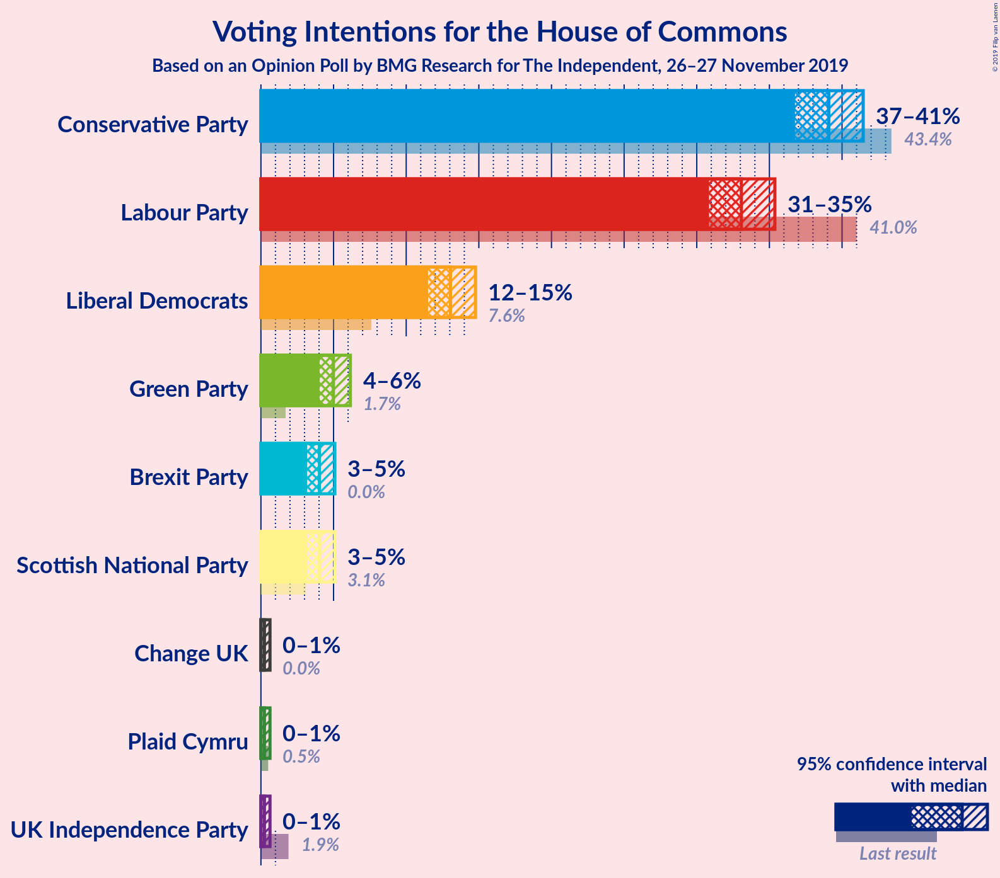

### Confidence Intervals

| Party | Last Result | Poll Result | 80% Confidence Interval | 90% Confidence Interval | 95% Confidence Interval | 99% Confidence Interval |
|:-----:|:-----------:|:-----------:|:-----------------------:|:-----------------------:|:-----------------------:|:-----------------------:|
| Conservative Party | 43.4% | 39.1% | 37.6–40.6% |37.1–41.1% |36.8–41.5% |36.0–42.2% |
| Labour Party | 41.0% | 33.1% | 31.6–34.6% |31.2–35.0% |30.8–35.4% |30.2–36.1% |
| Liberal Democrats | 7.6% | 13.0% | 12.0–14.2% |11.8–14.5% |11.5–14.8% |11.0–15.3% |
| Green Party | 1.7% | 5.0% | 4.4–5.7% |4.2–6.0% |4.0–6.2% |3.8–6.5% |
| Scottish National Party | 3.1% | 4.0% | 3.5–4.7% |3.3–4.9% |3.2–5.1% |2.9–5.4% |
| Brexit Party | 0.0% | 4.0% | 3.5–4.7% |3.3–4.9% |3.2–5.1% |2.9–5.4% |
| Plaid Cymru | 0.5% | 0.2% | 0.1–0.5% |0.1–0.6% |0.1–0.6% |0.1–0.8% |
| UK Independence Party | 1.9% | 0.2% | 0.1–0.5% |0.1–0.6% |0.1–0.6% |0.1–0.8% |
| Change UK | 0.0% | 0.2% | 0.1–0.5% |0.1–0.6% |0.1–0.6% |0.1–0.8% |

*Note:* The poll result column reflects the actual value used in the calculations. Published results may vary slightly, and in addition be rounded to fewer digits.

## Seats

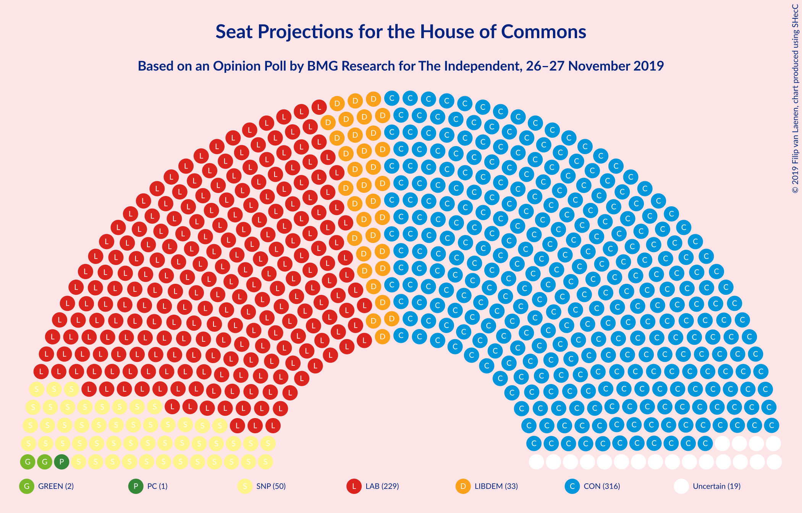

### Confidence Intervals

| Party | Last Result | Median | 80% Confidence Interval | 90% Confidence Interval | 95% Confidence Interval | 99% Confidence Interval |
|:-----:|:-----------:|:------:|:-----------------------:|:-----------------------:|:-----------------------:|:-----------------------:|
| <a href="#conservative-party">Conservative Party</a> | 317 | 316 | 302–332 |296–340 |289–341 |275–355 |
| <a href="#labour-party">Labour Party</a> | 262 | 229 | 214–239 |208–246 |206–254 |195–265 |
| <a href="#liberal-democrats">Liberal Democrats</a> | 12 | 33 | 32–37 |31–40 |30–41 |29–43 |
| <a href="#green-party">Green Party</a> | 1 | 2 | 1–2 |1–3 |1–3 |1–3 |
| <a href="#scottish-national-party">Scottish National Party</a> | 35 | 50 | 48–53 |45–53 |42–53 |40–54 |
| <a href="#brexit-party">Brexit Party</a> | 0 | 0 | 0 |0 |0 |0 |
| <a href="#plaid-cymru">Plaid Cymru</a> | 4 | 1 | 0–3 |0–3 |0–4 |0–4 |
| <a href="#uk-independence-party">UK Independence Party</a> | 0 | 0 | 0 |0 |0 |0 |
| <a href="#change-uk">Change UK</a> | 0 | 0 | 0 |0 |0 |0 |

### Conservative Party

*For a full overview of the results for this party, see the [Conservative Party](party-conservativeparty.html) page.*

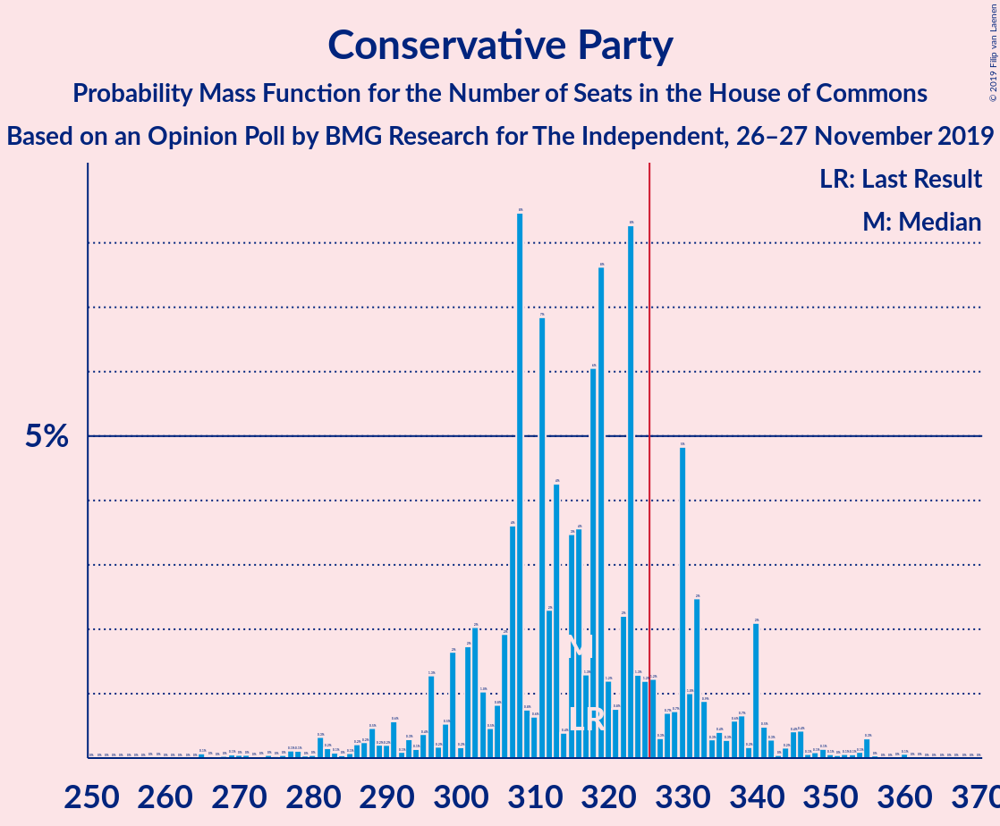

| Number of Seats | Probability | Accumulated | Special Marks |
|:---------------:|:-----------:|:-----------:|:-------------:|
| 258 | 0% | 100% |  |
| 259 | 0% | 99.9% |  |
| 260 | 0% | 99.9% |  |
| 261 | 0% | 99.9% |  |
| 262 | 0% | 99.9% |  |
| 263 | 0% | 99.9% |  |
| 264 | 0% | 99.9% |  |
| 265 | 0.1% | 99.9% |  |
| 266 | 0% | 99.8% |  |
| 267 | 0% | 99.8% |  |
| 268 | 0% | 99.8% |  |
| 269 | 0.1% | 99.7% |  |
| 270 | 0% | 99.7% |  |
| 271 | 0% | 99.6% |  |
| 272 | 0% | 99.6% |  |
| 273 | 0% | 99.6% |  |
| 274 | 0% | 99.6% |  |
| 275 | 0% | 99.5% |  |
| 276 | 0% | 99.5% |  |
| 277 | 0.1% | 99.4% |  |
| 278 | 0.1% | 99.3% |  |
| 279 | 0% | 99.2% |  |
| 280 | 0% | 99.2% |  |
| 281 | 0.3% | 99.1% |  |
| 282 | 0.2% | 98.8% |  |
| 283 | 0.1% | 98.6% |  |
| 284 | 0% | 98.6% |  |
| 285 | 0.1% | 98.5% |  |
| 286 | 0.2% | 98% |  |
| 287 | 0.2% | 98% |  |
| 288 | 0.5% | 98% |  |
| 289 | 0.2% | 98% |  |
| 290 | 0.2% | 97% |  |
| 291 | 0.6% | 97% |  |
| 292 | 0.1% | 97% |  |
| 293 | 0.3% | 96% |  |
| 294 | 0.1% | 96% |  |
| 295 | 0.4% | 96% |  |
| 296 | 1.3% | 96% |  |
| 297 | 0.2% | 94% |  |
| 298 | 0.5% | 94% |  |
| 299 | 2% | 94% |  |
| 300 | 0.2% | 92% |  |
| 301 | 2% | 92% |  |
| 302 | 2% | 90% |  |
| 303 | 1.0% | 88% |  |
| 304 | 0.5% | 87% |  |
| 305 | 0.8% | 87% |  |
| 306 | 2% | 86% |  |
| 307 | 4% | 84% |  |
| 308 | 8% | 80% |  |
| 309 | 0.8% | 72% |  |
| 310 | 0.6% | 71% |  |
| 311 | 7% | 70% |  |
| 312 | 2% | 63% |  |
| 313 | 4% | 61% |  |
| 314 | 0.4% | 57% |  |
| 315 | 3% | 57% |  |
| 316 | 4% | 53% | Median |
| 317 | 1.3% | 50% | Last Result |
| 318 | 6% | 48% |  |
| 319 | 8% | 42% |  |
| 320 | 1.2% | 35% |  |
| 321 | 0.8% | 33% |  |
| 322 | 2% | 33% |  |
| 323 | 8% | 30% |  |
| 324 | 1.3% | 22% |  |
| 325 | 1.2% | 21% |  |
| 326 | 1.2% | 20% | Majority |
| 327 | 0.3% | 18% |  |
| 328 | 0.7% | 18% |  |
| 329 | 0.7% | 17% |  |
| 330 | 5% | 17% |  |
| 331 | 1.0% | 12% |  |
| 332 | 2% | 11% |  |
| 333 | 0.9% | 8% |  |
| 334 | 0.3% | 7% |  |
| 335 | 0.4% | 7% |  |
| 336 | 0.3% | 7% |  |
| 337 | 0.6% | 6% |  |
| 338 | 0.7% | 6% |  |
| 339 | 0.2% | 5% |  |
| 340 | 2% | 5% |  |
| 341 | 0.5% | 3% |  |
| 342 | 0.3% | 2% |  |
| 343 | 0% | 2% |  |
| 344 | 0.2% | 2% |  |
| 345 | 0.4% | 2% |  |
| 346 | 0.4% | 2% |  |
| 347 | 0.1% | 1.1% |  |
| 348 | 0.1% | 1.1% |  |
| 349 | 0.1% | 1.0% |  |
| 350 | 0.1% | 0.8% |  |
| 351 | 0% | 0.8% |  |
| 352 | 0.1% | 0.7% |  |
| 353 | 0.1% | 0.7% |  |
| 354 | 0.1% | 0.6% |  |
| 355 | 0.3% | 0.5% |  |
| 356 | 0% | 0.2% |  |
| 357 | 0% | 0.2% |  |
| 358 | 0% | 0.2% |  |
| 359 | 0% | 0.2% |  |
| 360 | 0.1% | 0.1% |  |
| 361 | 0% | 0.1% |  |
| 362 | 0% | 0% |  |

### Labour Party

*For a full overview of the results for this party, see the [Labour Party](party-labourparty.html) page.*

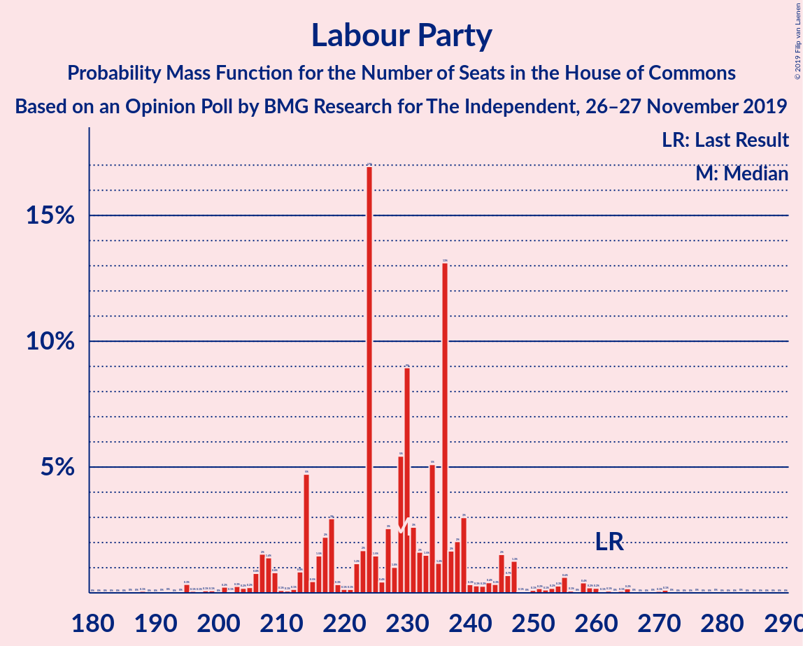

| Number of Seats | Probability | Accumulated | Special Marks |
|:---------------:|:-----------:|:-----------:|:-------------:|
| 187 | 0% | 100% |  |
| 188 | 0.1% | 99.9% |  |
| 189 | 0% | 99.9% |  |
| 190 | 0% | 99.9% |  |
| 191 | 0% | 99.9% |  |
| 192 | 0% | 99.8% |  |
| 193 | 0% | 99.8% |  |
| 194 | 0% | 99.8% |  |
| 195 | 0.3% | 99.8% |  |
| 196 | 0.1% | 99.4% |  |
| 197 | 0.1% | 99.3% |  |
| 198 | 0.1% | 99.3% |  |
| 199 | 0.1% | 99.2% |  |
| 200 | 0% | 99.1% |  |
| 201 | 0.2% | 99.1% |  |
| 202 | 0.1% | 98.9% |  |
| 203 | 0.3% | 98.8% |  |
| 204 | 0.2% | 98.5% |  |
| 205 | 0.2% | 98% |  |
| 206 | 0.8% | 98% |  |
| 207 | 2% | 97% |  |
| 208 | 1.4% | 96% |  |
| 209 | 0.8% | 94% |  |
| 210 | 0.1% | 94% |  |
| 211 | 0.1% | 94% |  |
| 212 | 0.1% | 93% |  |
| 213 | 0.8% | 93% |  |
| 214 | 5% | 92% |  |
| 215 | 0.5% | 88% |  |
| 216 | 1.5% | 87% |  |
| 217 | 2% | 86% |  |
| 218 | 3% | 84% |  |
| 219 | 0.3% | 81% |  |
| 220 | 0.1% | 80% |  |
| 221 | 0.1% | 80% |  |
| 222 | 1.2% | 80% |  |
| 223 | 2% | 79% |  |
| 224 | 17% | 77% |  |
| 225 | 1.5% | 60% |  |
| 226 | 0.4% | 59% |  |
| 227 | 3% | 58% |  |
| 228 | 1.0% | 56% |  |
| 229 | 5% | 55% | Median |
| 230 | 9% | 49% |  |
| 231 | 3% | 40% |  |
| 232 | 2% | 38% |  |
| 233 | 1.5% | 36% |  |
| 234 | 5% | 35% |  |
| 235 | 1.2% | 29% |  |
| 236 | 13% | 28% |  |
| 237 | 2% | 15% |  |
| 238 | 2% | 14% |  |
| 239 | 3% | 11% |  |
| 240 | 0.3% | 8% |  |
| 241 | 0.3% | 8% |  |
| 242 | 0.3% | 8% |  |
| 243 | 0.4% | 8% |  |
| 244 | 0.3% | 7% |  |
| 245 | 2% | 7% |  |
| 246 | 0.7% | 5% |  |
| 247 | 1.3% | 5% |  |
| 248 | 0.1% | 3% |  |
| 249 | 0% | 3% |  |
| 250 | 0.1% | 3% |  |
| 251 | 0.2% | 3% |  |
| 252 | 0.1% | 3% |  |
| 253 | 0.2% | 3% |  |
| 254 | 0.3% | 3% |  |
| 255 | 0.6% | 2% |  |
| 256 | 0.1% | 2% |  |
| 257 | 0% | 2% |  |
| 258 | 0.4% | 2% |  |
| 259 | 0.2% | 1.2% |  |
| 260 | 0.2% | 1.0% |  |
| 261 | 0.1% | 0.8% |  |
| 262 | 0.1% | 0.8% | Last Result |
| 263 | 0% | 0.7% |  |
| 264 | 0.1% | 0.7% |  |
| 265 | 0.2% | 0.6% |  |
| 266 | 0% | 0.5% |  |
| 267 | 0% | 0.4% |  |
| 268 | 0% | 0.4% |  |
| 269 | 0% | 0.4% |  |
| 270 | 0.1% | 0.4% |  |
| 271 | 0.1% | 0.3% |  |
| 272 | 0% | 0.2% |  |
| 273 | 0% | 0.1% |  |
| 274 | 0% | 0.1% |  |
| 275 | 0% | 0.1% |  |
| 276 | 0% | 0.1% |  |
| 277 | 0% | 0.1% |  |
| 278 | 0% | 0.1% |  |
| 279 | 0% | 0.1% |  |
| 280 | 0% | 0.1% |  |
| 281 | 0% | 0.1% |  |
| 282 | 0% | 0.1% |  |
| 283 | 0% | 0.1% |  |
| 284 | 0% | 0% |  |

### Liberal Democrats

*For a full overview of the results for this party, see the [Liberal Democrats](party-liberaldemocrats.html) page.*

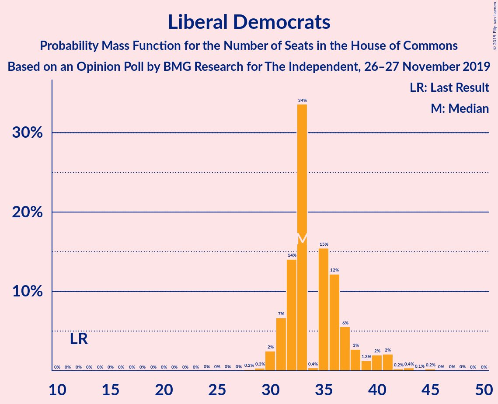

| Number of Seats | Probability | Accumulated | Special Marks |
|:---------------:|:-----------:|:-----------:|:-------------:|
| 12 | 0% | 100% | Last Result |
| 13 | 0% | 100% |  |
| 14 | 0% | 100% |  |
| 15 | 0% | 100% |  |
| 16 | 0% | 100% |  |
| 17 | 0% | 100% |  |
| 18 | 0% | 100% |  |
| 19 | 0% | 100% |  |
| 20 | 0% | 100% |  |
| 21 | 0% | 100% |  |
| 22 | 0% | 100% |  |
| 23 | 0% | 100% |  |
| 24 | 0% | 100% |  |
| 25 | 0% | 100% |  |
| 26 | 0% | 100% |  |
| 27 | 0% | 100% |  |
| 28 | 0.2% | 99.9% |  |
| 29 | 0.3% | 99.8% |  |
| 30 | 2% | 99.4% |  |
| 31 | 7% | 97% |  |
| 32 | 14% | 90% |  |
| 33 | 34% | 76% | Median |
| 34 | 0.4% | 43% |  |
| 35 | 15% | 42% |  |
| 36 | 12% | 27% |  |
| 37 | 6% | 15% |  |
| 38 | 3% | 9% |  |
| 39 | 1.3% | 6% |  |
| 40 | 2% | 5% |  |
| 41 | 2% | 3% |  |
| 42 | 0.2% | 1.0% |  |
| 43 | 0.4% | 0.7% |  |
| 44 | 0.1% | 0.4% |  |
| 45 | 0.2% | 0.3% |  |
| 46 | 0% | 0.1% |  |
| 47 | 0% | 0% |  |

### Green Party

*For a full overview of the results for this party, see the [Green Party](party-greenparty.html) page.*

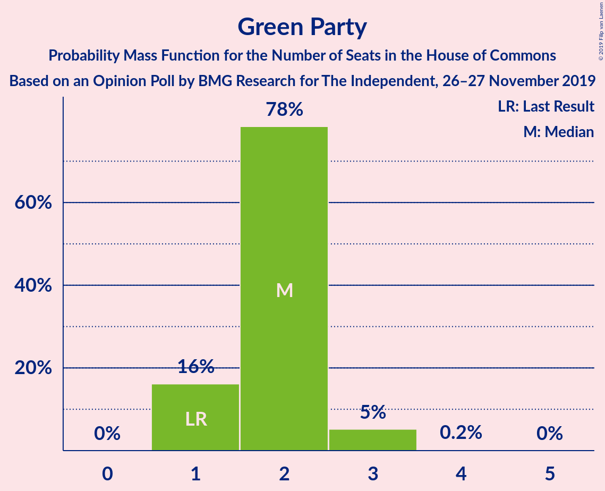

| Number of Seats | Probability | Accumulated | Special Marks |
|:---------------:|:-----------:|:-----------:|:-------------:|
| 1 | 16% | 100% | Last Result |
| 2 | 78% | 84% | Median |
| 3 | 5% | 5% |  |
| 4 | 0.2% | 0.3% |  |
| 5 | 0% | 0% |  |

### Scottish National Party

*For a full overview of the results for this party, see the [Scottish National Party](party-scottishnationalparty.html) page.*

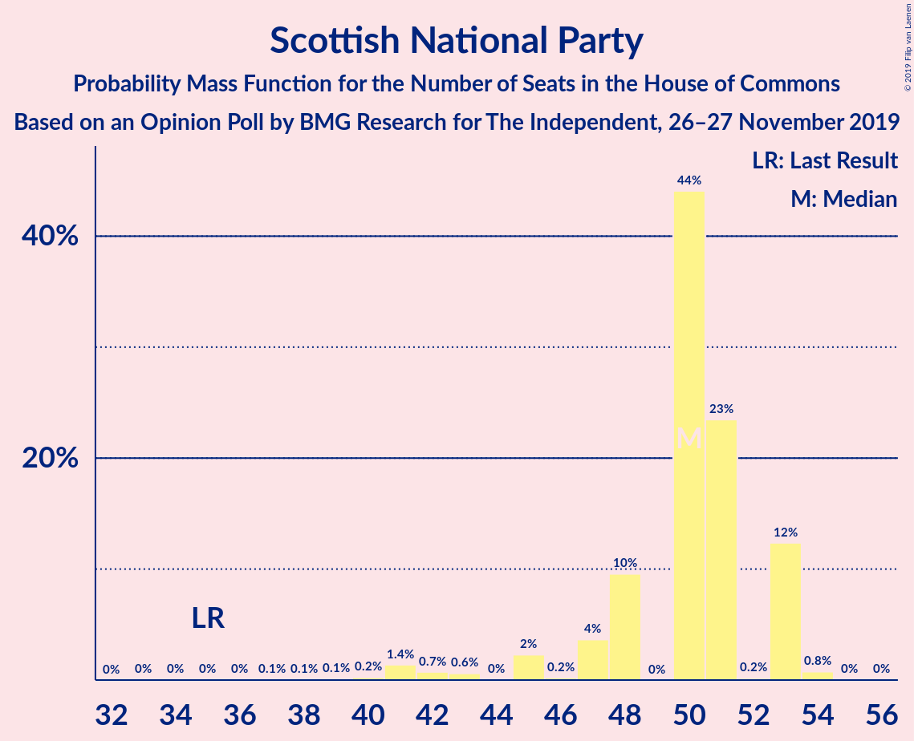

| Number of Seats | Probability | Accumulated | Special Marks |
|:---------------:|:-----------:|:-----------:|:-------------:|
| 33 | 0% | 100% |  |
| 34 | 0% | 99.9% |  |
| 35 | 0% | 99.9% | Last Result |
| 36 | 0% | 99.9% |  |
| 37 | 0.1% | 99.9% |  |
| 38 | 0.1% | 99.8% |  |
| 39 | 0.1% | 99.8% |  |
| 40 | 0.2% | 99.6% |  |
| 41 | 1.4% | 99.4% |  |
| 42 | 0.7% | 98% |  |
| 43 | 0.6% | 97% |  |
| 44 | 0% | 97% |  |
| 45 | 2% | 97% |  |
| 46 | 0.2% | 94% |  |
| 47 | 4% | 94% |  |
| 48 | 10% | 90% |  |
| 49 | 0% | 81% |  |
| 50 | 44% | 81% | Median |
| 51 | 23% | 37% |  |
| 52 | 0.2% | 13% |  |
| 53 | 12% | 13% |  |
| 54 | 0.8% | 0.8% |  |
| 55 | 0% | 0% |  |

### Brexit Party

*For a full overview of the results for this party, see the [Brexit Party](party-brexitparty.html) page.*

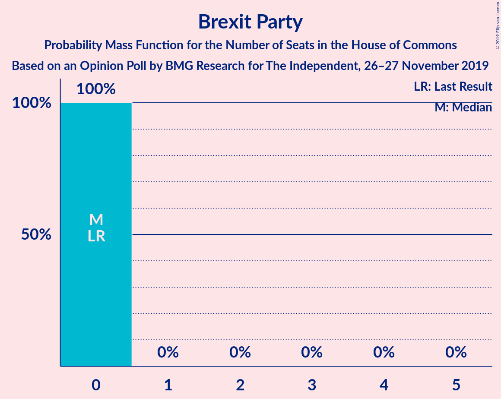

| Number of Seats | Probability | Accumulated | Special Marks |
|:---------------:|:-----------:|:-----------:|:-------------:|
| 0 | 100% | 100% | Last Result, Median |

### Plaid Cymru

*For a full overview of the results for this party, see the [Plaid Cymru](party-plaidcymru.html) page.*

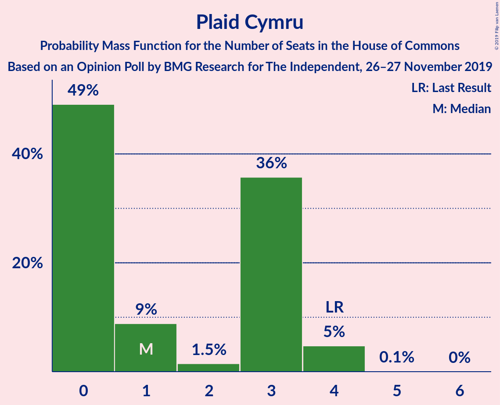

| Number of Seats | Probability | Accumulated | Special Marks |
|:---------------:|:-----------:|:-----------:|:-------------:|
| 0 | 49% | 100% |  |
| 1 | 9% | 51% | Median |
| 2 | 1.5% | 42% |  |
| 3 | 36% | 41% |  |
| 4 | 5% | 5% | Last Result |
| 5 | 0.1% | 0.1% |  |
| 6 | 0% | 0% |  |

### UK Independence Party

*For a full overview of the results for this party, see the [UK Independence Party](party-ukindependenceparty.html) page.*

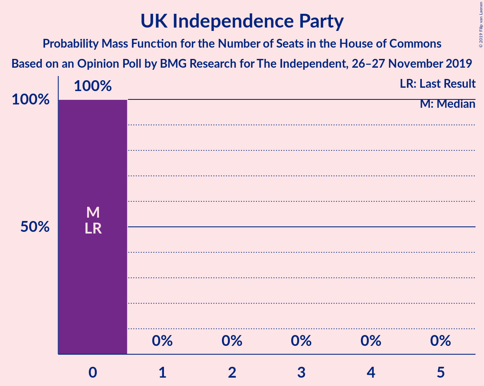

| Number of Seats | Probability | Accumulated | Special Marks |
|:---------------:|:-----------:|:-----------:|:-------------:|
| 0 | 100% | 100% | Last Result, Median |

### Change UK

*For a full overview of the results for this party, see the [Change UK](party-changeuk.html) page.*

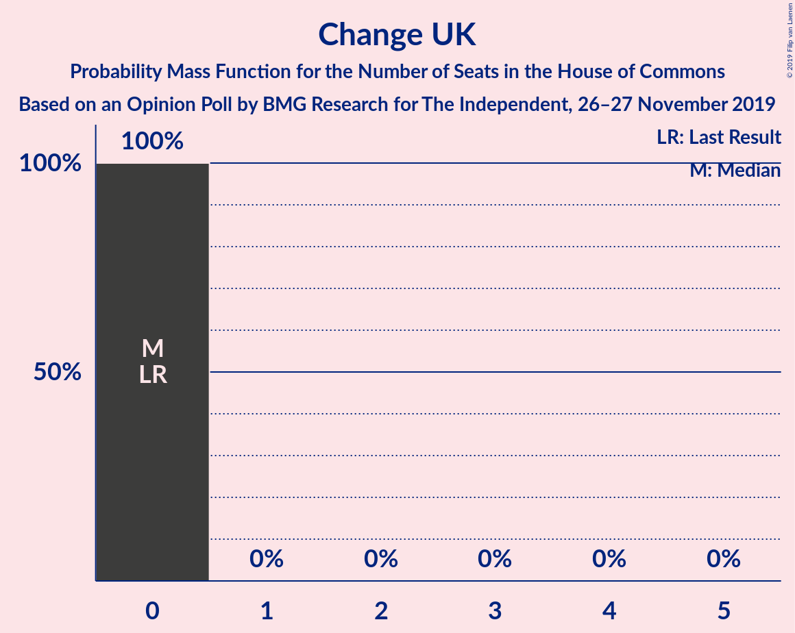

| Number of Seats | Probability | Accumulated | Special Marks |
|:---------------:|:-----------:|:-----------:|:-------------:|
| 0 | 100% | 100% | Last Result, Median |

## Coalitions

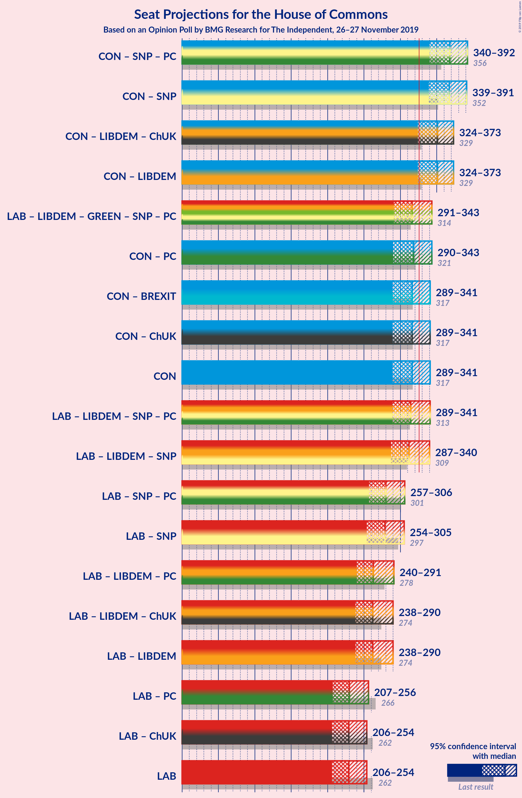

### Confidence Intervals

| Coalition | Last Result | Median | Majority? | 80% Confidence Interval | 90% Confidence Interval | 95% Confidence Interval | 99% Confidence Interval |
|:---------:|:-----------:|:------:|:---------:|:-----------------------:|:-----------------------:|:-----------------------:|:-----------------------:|
| Conservative Party – Scottish National Party – Plaid Cymru | 356 | 368 | 99.6% | 355–382 | 348–390 | 340–392 | 327–403 |
| Conservative Party – Scottish National Party | 352 | 367 | 99.5% | 354–381 | 346–387 | 339–391 | 325–403 |
| Conservative Party – Liberal Democrats – Change UK | 329 | 351 | 97% | 338–365 | 332–372 | 324–373 | 312–386 |
| Conservative Party – Liberal Democrats | 329 | 351 | 97% | 338–365 | 332–372 | 324–373 | 312–386 |
| Labour Party – Liberal Democrats – Green Party – Scottish National Party – Plaid Cymru | 314 | 316 | 16% | 300–330 | 292–336 | 291–343 | 277–357 |
| Conservative Party – Plaid Cymru | 321 | 318 | 22% | 302–333 | 297–340 | 290–343 | 276–355 |
| Conservative Party – Brexit Party | 317 | 316 | 20% | 302–332 | 296–340 | 289–341 | 275–355 |
| Conservative Party – Change UK | 317 | 316 | 20% | 302–332 | 296–340 | 289–341 | 275–355 |
| Conservative Party | 317 | 316 | 20% | 302–332 | 296–340 | 289–341 | 275–355 |
| Labour Party – Liberal Democrats – Scottish National Party – Plaid Cymru | 313 | 314 | 13% | 299–328 | 291–334 | 289–341 | 276–354 |
| Labour Party – Liberal Democrats – Scottish National Party | 309 | 312 | 13% | 298–328 | 290–333 | 287–340 | 275–354 |
| Labour Party – Scottish National Party – Plaid Cymru | 301 | 280 | 0.1% | 265–292 | 258–298 | 257–306 | 244–318 |
| Labour Party – Scottish National Party | 297 | 279 | 0.1% | 265–291 | 258–297 | 254–305 | 243–316 |
| Labour Party – Liberal Democrats – Plaid Cymru | 278 | 263 | 0% | 249–276 | 243–284 | 240–291 | 227–305 |
| Labour Party – Liberal Democrats – Change UK | 274 | 262 | 0% | 248–275 | 241–282 | 238–290 | 227–303 |
| Labour Party – Liberal Democrats | 274 | 262 | 0% | 248–275 | 241–282 | 238–290 | 227–303 |
| Labour Party – Plaid Cymru | 266 | 230 | 0% | 214–240 | 210–248 | 207–256 | 195–266 |
| Labour Party – Change UK | 262 | 229 | 0% | 214–239 | 208–246 | 206–254 | 195–265 |
| Labour Party | 262 | 229 | 0% | 214–239 | 208–246 | 206–254 | 195–265 |

### Conservative Party – Scottish National Party – Plaid Cymru

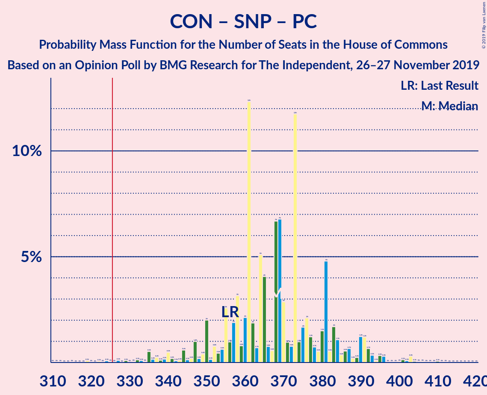

| Number of Seats | Probability | Accumulated | Special Marks |
|:---------------:|:-----------:|:-----------:|:-------------:|
| 310 | 0% | 100% |  |
| 311 | 0% | 99.9% |  |
| 312 | 0% | 99.9% |  |
| 313 | 0% | 99.9% |  |
| 314 | 0% | 99.9% |  |
| 315 | 0% | 99.9% |  |
| 316 | 0% | 99.9% |  |
| 317 | 0% | 99.9% |  |
| 318 | 0% | 99.9% |  |
| 319 | 0.1% | 99.9% |  |
| 320 | 0% | 99.8% |  |
| 321 | 0% | 99.8% |  |
| 322 | 0.1% | 99.7% |  |
| 323 | 0% | 99.7% |  |
| 324 | 0.1% | 99.7% |  |
| 325 | 0% | 99.6% |  |
| 326 | 0% | 99.6% | Majority |
| 327 | 0.1% | 99.5% |  |
| 328 | 0% | 99.4% |  |
| 329 | 0.1% | 99.4% |  |
| 330 | 0% | 99.3% |  |
| 331 | 0% | 99.3% |  |
| 332 | 0.1% | 99.3% |  |
| 333 | 0.1% | 99.2% |  |
| 334 | 0% | 99.1% |  |
| 335 | 0.5% | 99.0% |  |
| 336 | 0.2% | 98.5% |  |
| 337 | 0.2% | 98% |  |
| 338 | 0.1% | 98% |  |
| 339 | 0.2% | 98% |  |
| 340 | 0.5% | 98% |  |
| 341 | 0.2% | 97% |  |
| 342 | 0.1% | 97% |  |
| 343 | 0.1% | 97% |  |
| 344 | 0.6% | 97% |  |
| 345 | 0.1% | 96% |  |
| 346 | 0.2% | 96% |  |
| 347 | 1.0% | 96% |  |
| 348 | 0.2% | 95% |  |
| 349 | 0.4% | 95% |  |
| 350 | 2% | 95% |  |
| 351 | 0.1% | 93% |  |
| 352 | 0.8% | 92% |  |
| 353 | 0.4% | 92% |  |
| 354 | 0.6% | 91% |  |
| 355 | 3% | 91% |  |
| 356 | 1.0% | 88% | Last Result |
| 357 | 2% | 87% |  |
| 358 | 3% | 85% |  |
| 359 | 0.8% | 82% |  |
| 360 | 2% | 81% |  |
| 361 | 12% | 79% |  |
| 362 | 2% | 67% |  |
| 363 | 0.7% | 65% |  |
| 364 | 5% | 64% |  |
| 365 | 4% | 59% |  |
| 366 | 0.8% | 55% |  |
| 367 | 0.6% | 54% | Median |
| 368 | 7% | 54% |  |
| 369 | 7% | 47% |  |
| 370 | 3% | 40% |  |
| 371 | 1.0% | 37% |  |
| 372 | 0.8% | 36% |  |
| 373 | 12% | 36% |  |
| 374 | 1.0% | 24% |  |
| 375 | 2% | 23% |  |
| 376 | 2% | 21% |  |
| 377 | 1.2% | 19% |  |
| 378 | 0.7% | 18% |  |
| 379 | 0.5% | 17% |  |
| 380 | 1.5% | 17% |  |
| 381 | 5% | 15% |  |
| 382 | 0.5% | 10% |  |
| 383 | 2% | 10% |  |
| 384 | 1.1% | 8% |  |
| 385 | 0.4% | 7% |  |
| 386 | 0.5% | 7% |  |
| 387 | 0.7% | 6% |  |
| 388 | 0.2% | 5% |  |
| 389 | 0.2% | 5% |  |
| 390 | 1.2% | 5% |  |
| 391 | 1.2% | 4% |  |
| 392 | 0.7% | 3% |  |
| 393 | 0.3% | 2% |  |
| 394 | 0.1% | 2% |  |
| 395 | 0.3% | 2% |  |
| 396 | 0.3% | 1.2% |  |
| 397 | 0% | 0.9% |  |
| 398 | 0% | 0.9% |  |
| 399 | 0% | 0.9% |  |
| 400 | 0% | 0.9% |  |
| 401 | 0.1% | 0.8% |  |
| 402 | 0.1% | 0.7% |  |
| 403 | 0.3% | 0.6% |  |
| 404 | 0.1% | 0.3% |  |
| 405 | 0% | 0.2% |  |
| 406 | 0% | 0.2% |  |
| 407 | 0% | 0.2% |  |
| 408 | 0% | 0.1% |  |
| 409 | 0% | 0.1% |  |
| 410 | 0.1% | 0.1% |  |
| 411 | 0% | 0.1% |  |
| 412 | 0% | 0% |  |

### Conservative Party – Scottish National Party

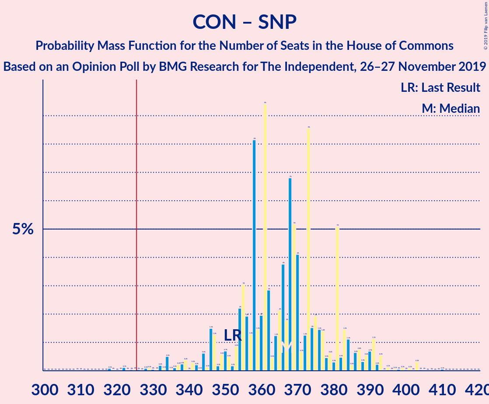

| Number of Seats | Probability | Accumulated | Special Marks |
|:---------------:|:-----------:|:-----------:|:-------------:|
| 309 | 0% | 100% |  |
| 310 | 0% | 99.9% |  |
| 311 | 0% | 99.9% |  |
| 312 | 0% | 99.9% |  |
| 313 | 0% | 99.9% |  |
| 314 | 0% | 99.9% |  |
| 315 | 0% | 99.9% |  |
| 316 | 0% | 99.9% |  |
| 317 | 0% | 99.9% |  |
| 318 | 0.1% | 99.9% |  |
| 319 | 0% | 99.8% |  |
| 320 | 0% | 99.7% |  |
| 321 | 0% | 99.7% |  |
| 322 | 0.1% | 99.7% |  |
| 323 | 0% | 99.6% |  |
| 324 | 0% | 99.6% |  |
| 325 | 0% | 99.5% |  |
| 326 | 0% | 99.5% | Majority |
| 327 | 0% | 99.4% |  |
| 328 | 0.1% | 99.4% |  |
| 329 | 0.1% | 99.3% |  |
| 330 | 0% | 99.2% |  |
| 331 | 0% | 99.2% |  |
| 332 | 0.2% | 99.1% |  |
| 333 | 0.1% | 98.9% |  |
| 334 | 0.5% | 98.8% |  |
| 335 | 0.1% | 98% |  |
| 336 | 0.1% | 98% |  |
| 337 | 0.2% | 98% |  |
| 338 | 0.2% | 98% |  |
| 339 | 0.4% | 98% |  |
| 340 | 0% | 97% |  |
| 341 | 0.3% | 97% |  |
| 342 | 0.2% | 97% |  |
| 343 | 0.1% | 97% |  |
| 344 | 0.6% | 97% |  |
| 345 | 0.1% | 96% |  |
| 346 | 1.5% | 96% |  |
| 347 | 1.3% | 94% |  |
| 348 | 0.2% | 93% |  |
| 349 | 0.6% | 93% |  |
| 350 | 0.7% | 92% |  |
| 351 | 0.5% | 92% |  |
| 352 | 0.2% | 91% | Last Result |
| 353 | 0.9% | 91% |  |
| 354 | 2% | 90% |  |
| 355 | 3% | 88% |  |
| 356 | 2% | 85% |  |
| 357 | 1.3% | 83% |  |
| 358 | 8% | 82% |  |
| 359 | 1.5% | 74% |  |
| 360 | 2% | 72% |  |
| 361 | 9% | 70% |  |
| 362 | 3% | 61% |  |
| 363 | 0.5% | 58% |  |
| 364 | 1.2% | 57% |  |
| 365 | 2% | 56% |  |
| 366 | 4% | 54% | Median |
| 367 | 2% | 50% |  |
| 368 | 7% | 49% |  |
| 369 | 5% | 42% |  |
| 370 | 4% | 37% |  |
| 371 | 0.7% | 32% |  |
| 372 | 1.3% | 32% |  |
| 373 | 9% | 31% |  |
| 374 | 2% | 22% |  |
| 375 | 2% | 20% |  |
| 376 | 1.5% | 19% |  |
| 377 | 1.4% | 17% |  |
| 378 | 0.5% | 16% |  |
| 379 | 0.6% | 15% |  |
| 380 | 0.3% | 15% |  |
| 381 | 5% | 14% |  |
| 382 | 0.5% | 9% |  |
| 383 | 1.5% | 9% |  |
| 384 | 1.1% | 7% |  |
| 385 | 0.2% | 6% |  |
| 386 | 0.6% | 6% |  |
| 387 | 0.8% | 5% |  |
| 388 | 0.3% | 5% |  |
| 389 | 0.6% | 4% |  |
| 390 | 0.7% | 4% |  |
| 391 | 1.1% | 3% |  |
| 392 | 0.2% | 2% |  |
| 393 | 0.5% | 2% |  |
| 394 | 0% | 1.1% |  |
| 395 | 0.1% | 1.1% |  |
| 396 | 0% | 0.9% |  |
| 397 | 0.1% | 0.9% |  |
| 398 | 0% | 0.8% |  |
| 399 | 0.1% | 0.8% |  |
| 400 | 0% | 0.7% |  |
| 401 | 0.1% | 0.7% |  |
| 402 | 0% | 0.6% |  |
| 403 | 0.3% | 0.5% |  |
| 404 | 0% | 0.2% |  |
| 405 | 0% | 0.2% |  |
| 406 | 0% | 0.2% |  |
| 407 | 0% | 0.2% |  |
| 408 | 0% | 0.1% |  |
| 409 | 0% | 0.1% |  |
| 410 | 0.1% | 0.1% |  |
| 411 | 0% | 0% |  |

### Conservative Party – Liberal Democrats – Change UK

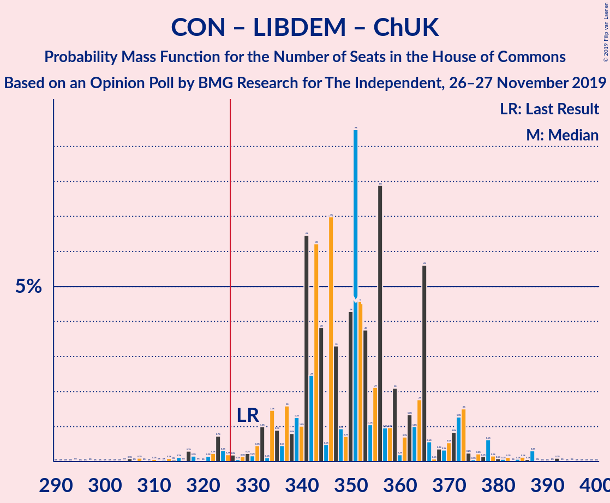

| Number of Seats | Probability | Accumulated | Special Marks |
|:---------------:|:-----------:|:-----------:|:-------------:|
| 295 | 0% | 100% |  |
| 296 | 0% | 99.9% |  |
| 297 | 0% | 99.9% |  |
| 298 | 0% | 99.9% |  |
| 299 | 0% | 99.9% |  |
| 300 | 0% | 99.9% |  |
| 301 | 0% | 99.9% |  |
| 302 | 0% | 99.9% |  |
| 303 | 0% | 99.9% |  |
| 304 | 0% | 99.9% |  |
| 305 | 0.1% | 99.9% |  |
| 306 | 0% | 99.8% |  |
| 307 | 0.1% | 99.8% |  |
| 308 | 0% | 99.7% |  |
| 309 | 0% | 99.6% |  |
| 310 | 0.1% | 99.6% |  |
| 311 | 0% | 99.6% |  |
| 312 | 0% | 99.5% |  |
| 313 | 0.1% | 99.5% |  |
| 314 | 0% | 99.4% |  |
| 315 | 0.1% | 99.4% |  |
| 316 | 0% | 99.2% |  |
| 317 | 0.3% | 99.2% |  |
| 318 | 0.2% | 98.9% |  |
| 319 | 0% | 98.7% |  |
| 320 | 0% | 98.7% |  |
| 321 | 0.2% | 98.7% |  |
| 322 | 0.2% | 98.6% |  |
| 323 | 0.7% | 98% |  |
| 324 | 0.3% | 98% |  |
| 325 | 0.2% | 97% |  |
| 326 | 0.2% | 97% | Majority |
| 327 | 0.1% | 97% |  |
| 328 | 0.1% | 97% |  |
| 329 | 0.2% | 97% | Last Result |
| 330 | 0.2% | 96% |  |
| 331 | 0.5% | 96% |  |
| 332 | 1.0% | 96% |  |
| 333 | 0.1% | 95% |  |
| 334 | 1.5% | 95% |  |
| 335 | 0.9% | 93% |  |
| 336 | 0.5% | 92% |  |
| 337 | 2% | 92% |  |
| 338 | 0.8% | 90% |  |
| 339 | 1.3% | 89% |  |
| 340 | 1.0% | 88% |  |
| 341 | 6% | 87% |  |
| 342 | 2% | 81% |  |
| 343 | 6% | 78% |  |
| 344 | 4% | 72% |  |
| 345 | 0.5% | 68% |  |
| 346 | 7% | 68% |  |
| 347 | 3% | 61% |  |
| 348 | 0.9% | 57% |  |
| 349 | 0.7% | 57% | Median |
| 350 | 4% | 56% |  |
| 351 | 9% | 52% |  |
| 352 | 5% | 42% |  |
| 353 | 4% | 37% |  |
| 354 | 1.1% | 34% |  |
| 355 | 2% | 33% |  |
| 356 | 8% | 31% |  |
| 357 | 1.0% | 23% |  |
| 358 | 1.0% | 22% |  |
| 359 | 2% | 21% |  |
| 360 | 0.2% | 19% |  |
| 361 | 0.7% | 18% |  |
| 362 | 1.3% | 18% |  |
| 363 | 1.0% | 16% |  |
| 364 | 2% | 15% |  |
| 365 | 6% | 14% |  |
| 366 | 0.6% | 8% |  |
| 367 | 0.1% | 7% |  |
| 368 | 0.4% | 7% |  |
| 369 | 0.3% | 7% |  |
| 370 | 0.5% | 7% |  |
| 371 | 0.8% | 6% |  |
| 372 | 1.3% | 5% |  |
| 373 | 2% | 4% |  |
| 374 | 0.2% | 2% |  |
| 375 | 0.1% | 2% |  |
| 376 | 0.2% | 2% |  |
| 377 | 0.1% | 2% |  |
| 378 | 0.6% | 2% |  |
| 379 | 0.2% | 1.2% |  |
| 380 | 0.1% | 1.0% |  |
| 381 | 0.1% | 1.0% |  |
| 382 | 0.1% | 0.9% |  |
| 383 | 0% | 0.8% |  |
| 384 | 0.1% | 0.8% |  |
| 385 | 0.1% | 0.7% |  |
| 386 | 0.1% | 0.6% |  |
| 387 | 0.3% | 0.5% |  |
| 388 | 0% | 0.2% |  |
| 389 | 0% | 0.2% |  |
| 390 | 0% | 0.2% |  |
| 391 | 0% | 0.2% |  |
| 392 | 0.1% | 0.2% |  |
| 393 | 0% | 0.1% |  |
| 394 | 0% | 0% |  |

### Conservative Party – Liberal Democrats

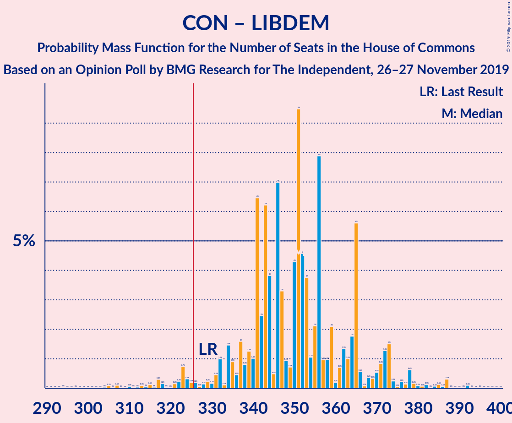

| Number of Seats | Probability | Accumulated | Special Marks |
|:---------------:|:-----------:|:-----------:|:-------------:|
| 295 | 0% | 100% |  |
| 296 | 0% | 99.9% |  |
| 297 | 0% | 99.9% |  |
| 298 | 0% | 99.9% |  |
| 299 | 0% | 99.9% |  |
| 300 | 0% | 99.9% |  |
| 301 | 0% | 99.9% |  |
| 302 | 0% | 99.9% |  |
| 303 | 0% | 99.9% |  |
| 304 | 0% | 99.9% |  |
| 305 | 0.1% | 99.9% |  |
| 306 | 0% | 99.8% |  |
| 307 | 0.1% | 99.8% |  |
| 308 | 0% | 99.7% |  |
| 309 | 0% | 99.6% |  |
| 310 | 0.1% | 99.6% |  |
| 311 | 0% | 99.6% |  |
| 312 | 0% | 99.5% |  |
| 313 | 0.1% | 99.5% |  |
| 314 | 0% | 99.4% |  |
| 315 | 0.1% | 99.4% |  |
| 316 | 0% | 99.2% |  |
| 317 | 0.3% | 99.2% |  |
| 318 | 0.2% | 98.9% |  |
| 319 | 0% | 98.7% |  |
| 320 | 0% | 98.7% |  |
| 321 | 0.2% | 98.7% |  |
| 322 | 0.2% | 98.6% |  |
| 323 | 0.7% | 98% |  |
| 324 | 0.3% | 98% |  |
| 325 | 0.2% | 97% |  |
| 326 | 0.2% | 97% | Majority |
| 327 | 0.1% | 97% |  |
| 328 | 0.1% | 97% |  |
| 329 | 0.2% | 97% | Last Result |
| 330 | 0.2% | 96% |  |
| 331 | 0.5% | 96% |  |
| 332 | 1.0% | 96% |  |
| 333 | 0.1% | 95% |  |
| 334 | 1.5% | 95% |  |
| 335 | 0.9% | 93% |  |
| 336 | 0.5% | 92% |  |
| 337 | 2% | 92% |  |
| 338 | 0.8% | 90% |  |
| 339 | 1.3% | 89% |  |
| 340 | 1.0% | 88% |  |
| 341 | 6% | 87% |  |
| 342 | 2% | 81% |  |
| 343 | 6% | 78% |  |
| 344 | 4% | 72% |  |
| 345 | 0.5% | 68% |  |
| 346 | 7% | 68% |  |
| 347 | 3% | 61% |  |
| 348 | 0.9% | 57% |  |
| 349 | 0.7% | 57% | Median |
| 350 | 4% | 56% |  |
| 351 | 9% | 52% |  |
| 352 | 5% | 42% |  |
| 353 | 4% | 37% |  |
| 354 | 1.1% | 34% |  |
| 355 | 2% | 33% |  |
| 356 | 8% | 31% |  |
| 357 | 1.0% | 23% |  |
| 358 | 1.0% | 22% |  |
| 359 | 2% | 21% |  |
| 360 | 0.2% | 19% |  |
| 361 | 0.7% | 18% |  |
| 362 | 1.3% | 18% |  |
| 363 | 1.0% | 16% |  |
| 364 | 2% | 15% |  |
| 365 | 6% | 14% |  |
| 366 | 0.6% | 8% |  |
| 367 | 0.1% | 7% |  |
| 368 | 0.4% | 7% |  |
| 369 | 0.3% | 7% |  |
| 370 | 0.5% | 7% |  |
| 371 | 0.8% | 6% |  |
| 372 | 1.3% | 5% |  |
| 373 | 2% | 4% |  |
| 374 | 0.2% | 2% |  |
| 375 | 0.1% | 2% |  |
| 376 | 0.2% | 2% |  |
| 377 | 0.1% | 2% |  |
| 378 | 0.6% | 2% |  |
| 379 | 0.2% | 1.2% |  |
| 380 | 0.1% | 1.0% |  |
| 381 | 0.1% | 1.0% |  |
| 382 | 0.1% | 0.9% |  |
| 383 | 0% | 0.8% |  |
| 384 | 0.1% | 0.8% |  |
| 385 | 0.1% | 0.7% |  |
| 386 | 0.1% | 0.6% |  |
| 387 | 0.3% | 0.5% |  |
| 388 | 0% | 0.2% |  |
| 389 | 0% | 0.2% |  |
| 390 | 0% | 0.2% |  |
| 391 | 0% | 0.2% |  |
| 392 | 0.1% | 0.2% |  |
| 393 | 0% | 0.1% |  |
| 394 | 0% | 0% |  |

### Labour Party – Liberal Democrats – Green Party – Scottish National Party – Plaid Cymru

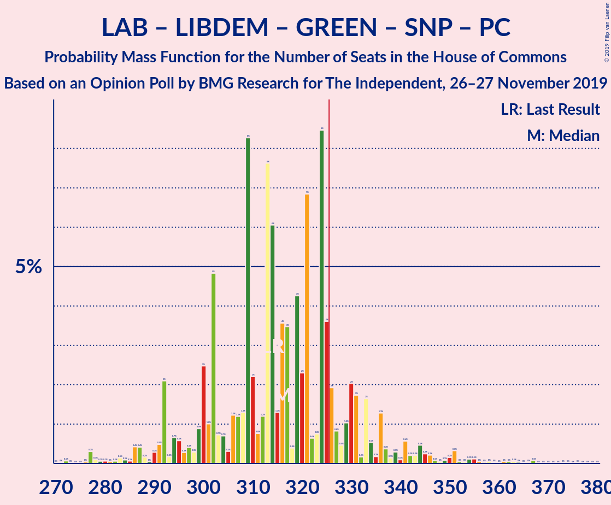

| Number of Seats | Probability | Accumulated | Special Marks |
|:---------------:|:-----------:|:-----------:|:-------------:|
| 271 | 0% | 100% |  |
| 272 | 0.1% | 99.9% |  |
| 273 | 0% | 99.9% |  |
| 274 | 0% | 99.8% |  |
| 275 | 0% | 99.8% |  |
| 276 | 0% | 99.8% |  |
| 277 | 0.3% | 99.8% |  |
| 278 | 0.1% | 99.5% |  |
| 279 | 0.1% | 99.4% |  |
| 280 | 0.1% | 99.3% |  |
| 281 | 0% | 99.3% |  |
| 282 | 0.1% | 99.2% |  |
| 283 | 0.1% | 99.2% |  |
| 284 | 0.1% | 99.0% |  |
| 285 | 0.1% | 98.9% |  |
| 286 | 0.4% | 98.9% |  |
| 287 | 0.4% | 98% |  |
| 288 | 0.2% | 98% |  |
| 289 | 0% | 98% |  |
| 290 | 0.3% | 98% |  |
| 291 | 0.5% | 98% |  |
| 292 | 2% | 97% |  |
| 293 | 0.2% | 95% |  |
| 294 | 0.7% | 95% |  |
| 295 | 0.6% | 94% |  |
| 296 | 0.3% | 94% |  |
| 297 | 0.4% | 93% |  |
| 298 | 0.3% | 93% |  |
| 299 | 0.9% | 93% |  |
| 300 | 2% | 92% |  |
| 301 | 1.0% | 89% |  |
| 302 | 5% | 88% |  |
| 303 | 0.7% | 83% |  |
| 304 | 0.7% | 83% |  |
| 305 | 0.3% | 82% |  |
| 306 | 1.2% | 82% |  |
| 307 | 1.2% | 80% |  |
| 308 | 1.3% | 79% |  |
| 309 | 8% | 78% |  |
| 310 | 2% | 70% |  |
| 311 | 0.8% | 67% |  |
| 312 | 1.2% | 67% |  |
| 313 | 8% | 65% |  |
| 314 | 6% | 58% | Last Result |
| 315 | 1.3% | 52% | Median |
| 316 | 4% | 50% |  |
| 317 | 3% | 47% |  |
| 318 | 0.4% | 43% |  |
| 319 | 4% | 43% |  |
| 320 | 2% | 39% |  |
| 321 | 7% | 37% |  |
| 322 | 0.6% | 30% |  |
| 323 | 0.8% | 29% |  |
| 324 | 8% | 28% |  |
| 325 | 4% | 20% |  |
| 326 | 2% | 16% | Majority |
| 327 | 0.8% | 14% |  |
| 328 | 0.5% | 13% |  |
| 329 | 1.0% | 13% |  |
| 330 | 2% | 12% |  |
| 331 | 2% | 10% |  |
| 332 | 0.2% | 8% |  |
| 333 | 2% | 8% |  |
| 334 | 0.5% | 6% |  |
| 335 | 0.2% | 6% |  |
| 336 | 1.3% | 6% |  |
| 337 | 0.4% | 4% |  |
| 338 | 0.1% | 4% |  |
| 339 | 0.3% | 4% |  |
| 340 | 0.1% | 4% |  |
| 341 | 0.6% | 3% |  |
| 342 | 0.2% | 3% |  |
| 343 | 0.2% | 3% |  |
| 344 | 0.5% | 2% |  |
| 345 | 0.2% | 2% |  |
| 346 | 0.2% | 2% |  |
| 347 | 0.1% | 2% |  |
| 348 | 0% | 1.5% |  |
| 349 | 0.1% | 1.4% |  |
| 350 | 0.2% | 1.4% |  |
| 351 | 0.3% | 1.2% |  |
| 352 | 0% | 0.9% |  |
| 353 | 0% | 0.8% |  |
| 354 | 0.1% | 0.8% |  |
| 355 | 0.1% | 0.7% |  |
| 356 | 0% | 0.6% |  |
| 357 | 0% | 0.5% |  |
| 358 | 0% | 0.5% |  |
| 359 | 0% | 0.4% |  |
| 360 | 0% | 0.4% |  |
| 361 | 0% | 0.4% |  |
| 362 | 0% | 0.4% |  |
| 363 | 0.1% | 0.3% |  |
| 364 | 0% | 0.3% |  |
| 365 | 0% | 0.2% |  |
| 366 | 0% | 0.2% |  |
| 367 | 0.1% | 0.2% |  |
| 368 | 0% | 0.1% |  |
| 369 | 0% | 0.1% |  |
| 370 | 0% | 0.1% |  |
| 371 | 0% | 0.1% |  |
| 372 | 0% | 0.1% |  |
| 373 | 0% | 0.1% |  |
| 374 | 0% | 0.1% |  |
| 375 | 0% | 0% |  |

### Conservative Party – Plaid Cymru

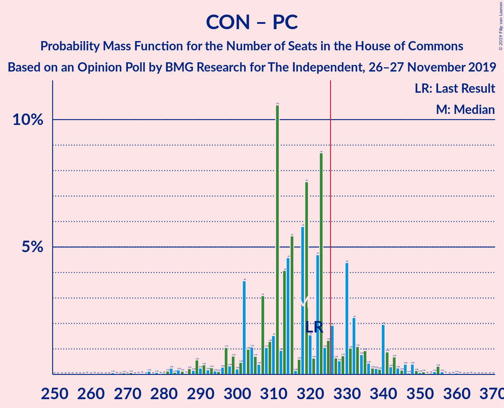

| Number of Seats | Probability | Accumulated | Special Marks |
|:---------------:|:-----------:|:-----------:|:-------------:|
| 259 | 0% | 100% |  |
| 260 | 0% | 99.9% |  |
| 261 | 0% | 99.9% |  |
| 262 | 0% | 99.9% |  |
| 263 | 0% | 99.9% |  |
| 264 | 0% | 99.9% |  |
| 265 | 0% | 99.9% |  |
| 266 | 0.1% | 99.9% |  |
| 267 | 0% | 99.8% |  |
| 268 | 0% | 99.8% |  |
| 269 | 0.1% | 99.8% |  |
| 270 | 0% | 99.7% |  |
| 271 | 0.1% | 99.7% |  |
| 272 | 0% | 99.7% |  |
| 273 | 0% | 99.6% |  |
| 274 | 0% | 99.6% |  |
| 275 | 0% | 99.6% |  |
| 276 | 0.1% | 99.6% |  |
| 277 | 0% | 99.4% |  |
| 278 | 0.1% | 99.4% |  |
| 279 | 0% | 99.4% |  |
| 280 | 0% | 99.3% |  |
| 281 | 0.1% | 99.3% |  |
| 282 | 0.2% | 99.2% |  |
| 283 | 0.1% | 98.9% |  |
| 284 | 0.2% | 98.8% |  |
| 285 | 0.1% | 98.7% |  |
| 286 | 0% | 98.5% |  |
| 287 | 0.2% | 98% |  |
| 288 | 0.2% | 98% |  |
| 289 | 0.6% | 98% |  |
| 290 | 0.2% | 98% |  |
| 291 | 0.4% | 97% |  |
| 292 | 0.2% | 97% |  |
| 293 | 0.3% | 97% |  |
| 294 | 0.1% | 96% |  |
| 295 | 0.1% | 96% |  |
| 296 | 0.3% | 96% |  |
| 297 | 1.1% | 96% |  |
| 298 | 0.3% | 95% |  |
| 299 | 0.7% | 95% |  |
| 300 | 0.2% | 94% |  |
| 301 | 0.5% | 94% |  |
| 302 | 4% | 93% |  |
| 303 | 1.0% | 89% |  |
| 304 | 1.1% | 88% |  |
| 305 | 0.7% | 87% |  |
| 306 | 0.4% | 87% |  |
| 307 | 3% | 86% |  |
| 308 | 1.1% | 83% |  |
| 309 | 1.3% | 82% |  |
| 310 | 2% | 81% |  |
| 311 | 11% | 79% |  |
| 312 | 0.9% | 69% |  |
| 313 | 4% | 68% |  |
| 314 | 5% | 64% |  |
| 315 | 5% | 59% |  |
| 316 | 0.2% | 54% |  |
| 317 | 0.6% | 54% | Median |
| 318 | 6% | 53% |  |
| 319 | 8% | 47% |  |
| 320 | 2% | 40% |  |
| 321 | 0.6% | 38% | Last Result |
| 322 | 5% | 37% |  |
| 323 | 9% | 33% |  |
| 324 | 1.1% | 24% |  |
| 325 | 1.3% | 23% |  |
| 326 | 2% | 22% | Majority |
| 327 | 0.6% | 20% |  |
| 328 | 0.5% | 19% |  |
| 329 | 0.7% | 19% |  |
| 330 | 4% | 18% |  |
| 331 | 1.0% | 13% |  |
| 332 | 2% | 12% |  |
| 333 | 1.1% | 10% |  |
| 334 | 0.8% | 9% |  |
| 335 | 0.9% | 8% |  |
| 336 | 0.4% | 7% |  |
| 337 | 0.2% | 7% |  |
| 338 | 0.2% | 7% |  |
| 339 | 0.2% | 6% |  |
| 340 | 2% | 6% |  |
| 341 | 0.9% | 4% |  |
| 342 | 0.3% | 3% |  |
| 343 | 0.7% | 3% |  |
| 344 | 0.3% | 2% |  |
| 345 | 0.2% | 2% |  |
| 346 | 0.4% | 2% |  |
| 347 | 0.1% | 2% |  |
| 348 | 0.4% | 2% |  |
| 349 | 0.2% | 1.1% |  |
| 350 | 0.1% | 1.0% |  |
| 351 | 0.1% | 0.9% |  |
| 352 | 0% | 0.8% |  |
| 353 | 0% | 0.8% |  |
| 354 | 0.1% | 0.7% |  |
| 355 | 0.3% | 0.6% |  |
| 356 | 0.1% | 0.3% |  |
| 357 | 0% | 0.2% |  |
| 358 | 0% | 0.2% |  |
| 359 | 0% | 0.2% |  |
| 360 | 0.1% | 0.2% |  |
| 361 | 0% | 0.1% |  |
| 362 | 0% | 0.1% |  |
| 363 | 0% | 0.1% |  |
| 364 | 0% | 0.1% |  |
| 365 | 0% | 0% |  |

### Conservative Party – Brexit Party

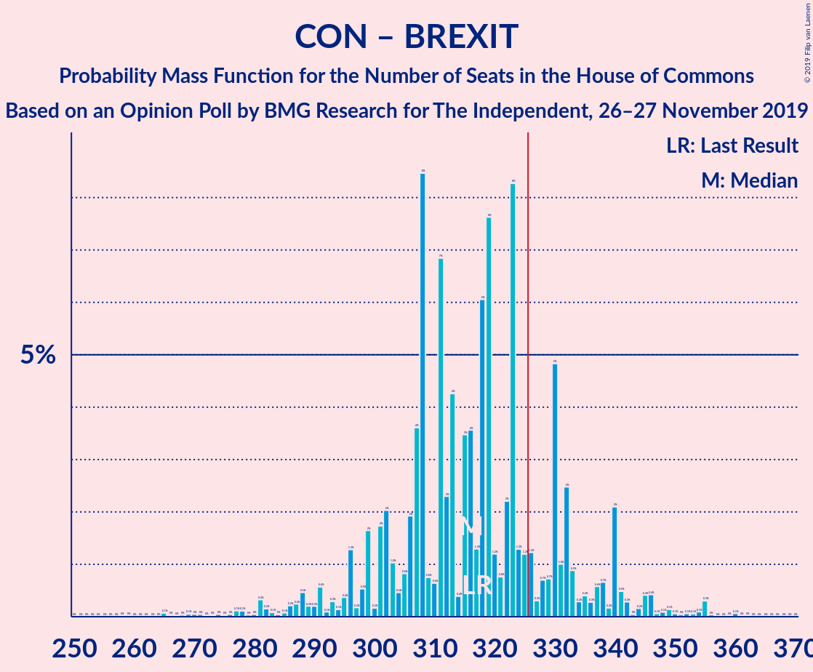

| Number of Seats | Probability | Accumulated | Special Marks |
|:---------------:|:-----------:|:-----------:|:-------------:|
| 258 | 0% | 100% |  |
| 259 | 0% | 99.9% |  |
| 260 | 0% | 99.9% |  |
| 261 | 0% | 99.9% |  |
| 262 | 0% | 99.9% |  |
| 263 | 0% | 99.9% |  |
| 264 | 0% | 99.9% |  |
| 265 | 0.1% | 99.9% |  |
| 266 | 0% | 99.8% |  |
| 267 | 0% | 99.8% |  |
| 268 | 0% | 99.8% |  |
| 269 | 0.1% | 99.7% |  |
| 270 | 0% | 99.7% |  |
| 271 | 0% | 99.6% |  |
| 272 | 0% | 99.6% |  |
| 273 | 0% | 99.6% |  |
| 274 | 0% | 99.6% |  |
| 275 | 0% | 99.5% |  |
| 276 | 0% | 99.5% |  |
| 277 | 0.1% | 99.4% |  |
| 278 | 0.1% | 99.3% |  |
| 279 | 0% | 99.2% |  |
| 280 | 0% | 99.2% |  |
| 281 | 0.3% | 99.1% |  |
| 282 | 0.2% | 98.8% |  |
| 283 | 0.1% | 98.6% |  |
| 284 | 0% | 98.6% |  |
| 285 | 0.1% | 98.5% |  |
| 286 | 0.2% | 98% |  |
| 287 | 0.2% | 98% |  |
| 288 | 0.5% | 98% |  |
| 289 | 0.2% | 98% |  |
| 290 | 0.2% | 97% |  |
| 291 | 0.6% | 97% |  |
| 292 | 0.1% | 97% |  |
| 293 | 0.3% | 96% |  |
| 294 | 0.1% | 96% |  |
| 295 | 0.4% | 96% |  |
| 296 | 1.3% | 96% |  |
| 297 | 0.2% | 94% |  |
| 298 | 0.5% | 94% |  |
| 299 | 2% | 94% |  |
| 300 | 0.2% | 92% |  |
| 301 | 2% | 92% |  |
| 302 | 2% | 90% |  |
| 303 | 1.0% | 88% |  |
| 304 | 0.5% | 87% |  |
| 305 | 0.8% | 87% |  |
| 306 | 2% | 86% |  |
| 307 | 4% | 84% |  |
| 308 | 8% | 80% |  |
| 309 | 0.8% | 72% |  |
| 310 | 0.6% | 71% |  |
| 311 | 7% | 70% |  |
| 312 | 2% | 63% |  |
| 313 | 4% | 61% |  |
| 314 | 0.4% | 57% |  |
| 315 | 3% | 57% |  |
| 316 | 4% | 53% | Median |
| 317 | 1.3% | 50% | Last Result |
| 318 | 6% | 48% |  |
| 319 | 8% | 42% |  |
| 320 | 1.2% | 35% |  |
| 321 | 0.8% | 33% |  |
| 322 | 2% | 33% |  |
| 323 | 8% | 30% |  |
| 324 | 1.3% | 22% |  |
| 325 | 1.2% | 21% |  |
| 326 | 1.2% | 20% | Majority |
| 327 | 0.3% | 18% |  |
| 328 | 0.7% | 18% |  |
| 329 | 0.7% | 17% |  |
| 330 | 5% | 17% |  |
| 331 | 1.0% | 12% |  |
| 332 | 2% | 11% |  |
| 333 | 0.9% | 8% |  |
| 334 | 0.3% | 7% |  |
| 335 | 0.4% | 7% |  |
| 336 | 0.3% | 7% |  |
| 337 | 0.6% | 6% |  |
| 338 | 0.7% | 6% |  |
| 339 | 0.2% | 5% |  |
| 340 | 2% | 5% |  |
| 341 | 0.5% | 3% |  |
| 342 | 0.3% | 2% |  |
| 343 | 0% | 2% |  |
| 344 | 0.2% | 2% |  |
| 345 | 0.4% | 2% |  |
| 346 | 0.4% | 2% |  |
| 347 | 0.1% | 1.1% |  |
| 348 | 0.1% | 1.1% |  |
| 349 | 0.1% | 1.0% |  |
| 350 | 0.1% | 0.8% |  |
| 351 | 0% | 0.8% |  |
| 352 | 0.1% | 0.7% |  |
| 353 | 0.1% | 0.7% |  |
| 354 | 0.1% | 0.6% |  |
| 355 | 0.3% | 0.5% |  |
| 356 | 0% | 0.2% |  |
| 357 | 0% | 0.2% |  |
| 358 | 0% | 0.2% |  |
| 359 | 0% | 0.2% |  |
| 360 | 0.1% | 0.1% |  |
| 361 | 0% | 0.1% |  |
| 362 | 0% | 0% |  |

### Conservative Party – Change UK

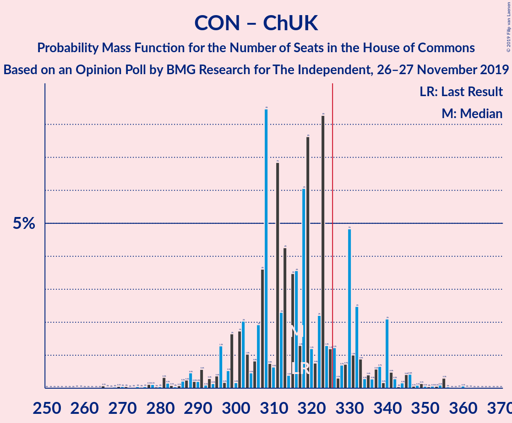

| Number of Seats | Probability | Accumulated | Special Marks |
|:---------------:|:-----------:|:-----------:|:-------------:|
| 258 | 0% | 100% |  |
| 259 | 0% | 99.9% |  |
| 260 | 0% | 99.9% |  |
| 261 | 0% | 99.9% |  |
| 262 | 0% | 99.9% |  |
| 263 | 0% | 99.9% |  |
| 264 | 0% | 99.9% |  |
| 265 | 0.1% | 99.9% |  |
| 266 | 0% | 99.8% |  |
| 267 | 0% | 99.8% |  |
| 268 | 0% | 99.8% |  |
| 269 | 0.1% | 99.7% |  |
| 270 | 0% | 99.7% |  |
| 271 | 0% | 99.6% |  |
| 272 | 0% | 99.6% |  |
| 273 | 0% | 99.6% |  |
| 274 | 0% | 99.6% |  |
| 275 | 0% | 99.5% |  |
| 276 | 0% | 99.5% |  |
| 277 | 0.1% | 99.4% |  |
| 278 | 0.1% | 99.3% |  |
| 279 | 0% | 99.2% |  |
| 280 | 0% | 99.2% |  |
| 281 | 0.3% | 99.1% |  |
| 282 | 0.2% | 98.8% |  |
| 283 | 0.1% | 98.6% |  |
| 284 | 0% | 98.6% |  |
| 285 | 0.1% | 98.5% |  |
| 286 | 0.2% | 98% |  |
| 287 | 0.2% | 98% |  |
| 288 | 0.5% | 98% |  |
| 289 | 0.2% | 98% |  |
| 290 | 0.2% | 97% |  |
| 291 | 0.6% | 97% |  |
| 292 | 0.1% | 97% |  |
| 293 | 0.3% | 96% |  |
| 294 | 0.1% | 96% |  |
| 295 | 0.4% | 96% |  |
| 296 | 1.3% | 96% |  |
| 297 | 0.2% | 94% |  |
| 298 | 0.5% | 94% |  |
| 299 | 2% | 94% |  |
| 300 | 0.2% | 92% |  |
| 301 | 2% | 92% |  |
| 302 | 2% | 90% |  |
| 303 | 1.0% | 88% |  |
| 304 | 0.5% | 87% |  |
| 305 | 0.8% | 87% |  |
| 306 | 2% | 86% |  |
| 307 | 4% | 84% |  |
| 308 | 8% | 80% |  |
| 309 | 0.8% | 72% |  |
| 310 | 0.6% | 71% |  |
| 311 | 7% | 70% |  |
| 312 | 2% | 63% |  |
| 313 | 4% | 61% |  |
| 314 | 0.4% | 57% |  |
| 315 | 3% | 57% |  |
| 316 | 4% | 53% | Median |
| 317 | 1.3% | 50% | Last Result |
| 318 | 6% | 48% |  |
| 319 | 8% | 42% |  |
| 320 | 1.2% | 35% |  |
| 321 | 0.8% | 33% |  |
| 322 | 2% | 33% |  |
| 323 | 8% | 30% |  |
| 324 | 1.3% | 22% |  |
| 325 | 1.2% | 21% |  |
| 326 | 1.2% | 20% | Majority |
| 327 | 0.3% | 18% |  |
| 328 | 0.7% | 18% |  |
| 329 | 0.7% | 17% |  |
| 330 | 5% | 17% |  |
| 331 | 1.0% | 12% |  |
| 332 | 2% | 11% |  |
| 333 | 0.9% | 8% |  |
| 334 | 0.3% | 7% |  |
| 335 | 0.4% | 7% |  |
| 336 | 0.3% | 7% |  |
| 337 | 0.6% | 6% |  |
| 338 | 0.7% | 6% |  |
| 339 | 0.2% | 5% |  |
| 340 | 2% | 5% |  |
| 341 | 0.5% | 3% |  |
| 342 | 0.3% | 2% |  |
| 343 | 0% | 2% |  |
| 344 | 0.2% | 2% |  |
| 345 | 0.4% | 2% |  |
| 346 | 0.4% | 2% |  |
| 347 | 0.1% | 1.1% |  |
| 348 | 0.1% | 1.1% |  |
| 349 | 0.1% | 1.0% |  |
| 350 | 0.1% | 0.8% |  |
| 351 | 0% | 0.8% |  |
| 352 | 0.1% | 0.7% |  |
| 353 | 0.1% | 0.7% |  |
| 354 | 0.1% | 0.6% |  |
| 355 | 0.3% | 0.5% |  |
| 356 | 0% | 0.2% |  |
| 357 | 0% | 0.2% |  |
| 358 | 0% | 0.2% |  |
| 359 | 0% | 0.2% |  |
| 360 | 0.1% | 0.1% |  |
| 361 | 0% | 0.1% |  |
| 362 | 0% | 0% |  |

### Conservative Party

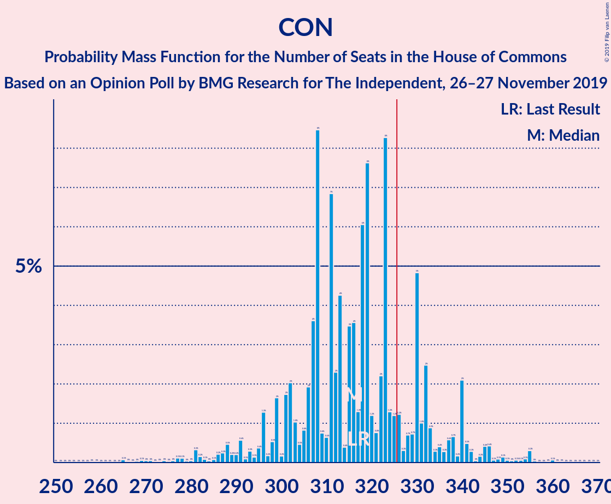

| Number of Seats | Probability | Accumulated | Special Marks |
|:---------------:|:-----------:|:-----------:|:-------------:|
| 258 | 0% | 100% |  |
| 259 | 0% | 99.9% |  |
| 260 | 0% | 99.9% |  |
| 261 | 0% | 99.9% |  |
| 262 | 0% | 99.9% |  |
| 263 | 0% | 99.9% |  |
| 264 | 0% | 99.9% |  |
| 265 | 0.1% | 99.9% |  |
| 266 | 0% | 99.8% |  |
| 267 | 0% | 99.8% |  |
| 268 | 0% | 99.8% |  |
| 269 | 0.1% | 99.7% |  |
| 270 | 0% | 99.7% |  |
| 271 | 0% | 99.6% |  |
| 272 | 0% | 99.6% |  |
| 273 | 0% | 99.6% |  |
| 274 | 0% | 99.6% |  |
| 275 | 0% | 99.5% |  |
| 276 | 0% | 99.5% |  |
| 277 | 0.1% | 99.4% |  |
| 278 | 0.1% | 99.3% |  |
| 279 | 0% | 99.2% |  |
| 280 | 0% | 99.2% |  |
| 281 | 0.3% | 99.1% |  |
| 282 | 0.2% | 98.8% |  |
| 283 | 0.1% | 98.6% |  |
| 284 | 0% | 98.6% |  |
| 285 | 0.1% | 98.5% |  |
| 286 | 0.2% | 98% |  |
| 287 | 0.2% | 98% |  |
| 288 | 0.5% | 98% |  |
| 289 | 0.2% | 98% |  |
| 290 | 0.2% | 97% |  |
| 291 | 0.6% | 97% |  |
| 292 | 0.1% | 97% |  |
| 293 | 0.3% | 96% |  |
| 294 | 0.1% | 96% |  |
| 295 | 0.4% | 96% |  |
| 296 | 1.3% | 96% |  |
| 297 | 0.2% | 94% |  |
| 298 | 0.5% | 94% |  |
| 299 | 2% | 94% |  |
| 300 | 0.2% | 92% |  |
| 301 | 2% | 92% |  |
| 302 | 2% | 90% |  |
| 303 | 1.0% | 88% |  |
| 304 | 0.5% | 87% |  |
| 305 | 0.8% | 87% |  |
| 306 | 2% | 86% |  |
| 307 | 4% | 84% |  |
| 308 | 8% | 80% |  |
| 309 | 0.8% | 72% |  |
| 310 | 0.6% | 71% |  |
| 311 | 7% | 70% |  |
| 312 | 2% | 63% |  |
| 313 | 4% | 61% |  |
| 314 | 0.4% | 57% |  |
| 315 | 3% | 57% |  |
| 316 | 4% | 53% | Median |
| 317 | 1.3% | 50% | Last Result |
| 318 | 6% | 48% |  |
| 319 | 8% | 42% |  |
| 320 | 1.2% | 35% |  |
| 321 | 0.8% | 33% |  |
| 322 | 2% | 33% |  |
| 323 | 8% | 30% |  |
| 324 | 1.3% | 22% |  |
| 325 | 1.2% | 21% |  |
| 326 | 1.2% | 20% | Majority |
| 327 | 0.3% | 18% |  |
| 328 | 0.7% | 18% |  |
| 329 | 0.7% | 17% |  |
| 330 | 5% | 17% |  |
| 331 | 1.0% | 12% |  |
| 332 | 2% | 11% |  |
| 333 | 0.9% | 8% |  |
| 334 | 0.3% | 7% |  |
| 335 | 0.4% | 7% |  |
| 336 | 0.3% | 7% |  |
| 337 | 0.6% | 6% |  |
| 338 | 0.7% | 6% |  |
| 339 | 0.2% | 5% |  |
| 340 | 2% | 5% |  |
| 341 | 0.5% | 3% |  |
| 342 | 0.3% | 2% |  |
| 343 | 0% | 2% |  |
| 344 | 0.2% | 2% |  |
| 345 | 0.4% | 2% |  |
| 346 | 0.4% | 2% |  |
| 347 | 0.1% | 1.1% |  |
| 348 | 0.1% | 1.1% |  |
| 349 | 0.1% | 1.0% |  |
| 350 | 0.1% | 0.8% |  |
| 351 | 0% | 0.8% |  |
| 352 | 0.1% | 0.7% |  |
| 353 | 0.1% | 0.7% |  |
| 354 | 0.1% | 0.6% |  |
| 355 | 0.3% | 0.5% |  |
| 356 | 0% | 0.2% |  |
| 357 | 0% | 0.2% |  |
| 358 | 0% | 0.2% |  |
| 359 | 0% | 0.2% |  |
| 360 | 0.1% | 0.1% |  |
| 361 | 0% | 0.1% |  |
| 362 | 0% | 0% |  |

### Labour Party – Liberal Democrats – Scottish National Party – Plaid Cymru

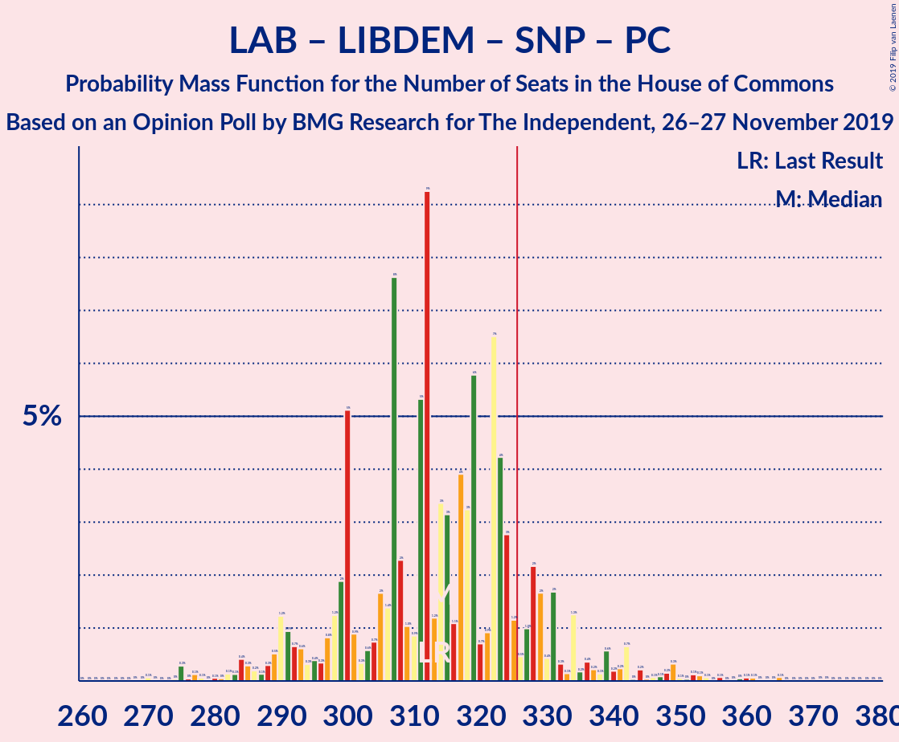

| Number of Seats | Probability | Accumulated | Special Marks |
|:---------------:|:-----------:|:-----------:|:-------------:|
| 269 | 0% | 100% |  |
| 270 | 0.1% | 99.9% |  |
| 271 | 0% | 99.9% |  |
| 272 | 0% | 99.8% |  |
| 273 | 0% | 99.8% |  |
| 274 | 0% | 99.8% |  |
| 275 | 0.3% | 99.8% |  |
| 276 | 0% | 99.5% |  |
| 277 | 0.1% | 99.5% |  |
| 278 | 0.1% | 99.3% |  |
| 279 | 0% | 99.3% |  |
| 280 | 0.1% | 99.2% |  |
| 281 | 0% | 99.2% |  |
| 282 | 0.1% | 99.1% |  |
| 283 | 0.1% | 99.0% |  |
| 284 | 0.4% | 98.9% |  |
| 285 | 0.3% | 98% |  |
| 286 | 0.2% | 98% |  |
| 287 | 0.1% | 98% |  |
| 288 | 0.3% | 98% |  |
| 289 | 0.5% | 98% |  |
| 290 | 1.2% | 97% |  |
| 291 | 0.9% | 96% |  |
| 292 | 0.7% | 95% |  |
| 293 | 0.6% | 94% |  |
| 294 | 0.3% | 94% |  |
| 295 | 0.4% | 93% |  |
| 296 | 0.3% | 93% |  |
| 297 | 0.8% | 93% |  |
| 298 | 1.2% | 92% |  |
| 299 | 2% | 90% |  |
| 300 | 5% | 89% |  |
| 301 | 0.9% | 83% |  |
| 302 | 0.3% | 83% |  |
| 303 | 0.6% | 82% |  |
| 304 | 0.7% | 82% |  |
| 305 | 2% | 81% |  |
| 306 | 1.4% | 79% |  |
| 307 | 8% | 78% |  |
| 308 | 2% | 70% |  |
| 309 | 1.0% | 68% |  |
| 310 | 0.9% | 67% |  |
| 311 | 5% | 66% |  |
| 312 | 9% | 61% |  |
| 313 | 1.2% | 51% | Last Result, Median |
| 314 | 3% | 50% |  |
| 315 | 3% | 47% |  |
| 316 | 1.1% | 44% |  |
| 317 | 4% | 43% |  |
| 318 | 3% | 39% |  |
| 319 | 6% | 36% |  |
| 320 | 0.7% | 30% |  |
| 321 | 0.9% | 29% |  |
| 322 | 7% | 28% |  |
| 323 | 4% | 22% |  |
| 324 | 3% | 17% |  |
| 325 | 1.2% | 15% |  |
| 326 | 0.5% | 13% | Majority |
| 327 | 1.0% | 13% |  |
| 328 | 2% | 12% |  |
| 329 | 2% | 10% |  |
| 330 | 0.4% | 8% |  |
| 331 | 2% | 8% |  |
| 332 | 0.3% | 6% |  |
| 333 | 0.1% | 6% |  |
| 334 | 1.3% | 6% |  |
| 335 | 0.2% | 4% |  |
| 336 | 0.4% | 4% |  |
| 337 | 0.2% | 4% |  |
| 338 | 0.1% | 4% |  |
| 339 | 0.6% | 3% |  |
| 340 | 0.2% | 3% |  |
| 341 | 0.2% | 3% |  |
| 342 | 0.7% | 2% |  |
| 343 | 0% | 2% |  |
| 344 | 0.2% | 2% |  |
| 345 | 0% | 2% |  |
| 346 | 0.1% | 2% |  |
| 347 | 0.1% | 1.4% |  |
| 348 | 0.2% | 1.4% |  |
| 349 | 0.3% | 1.2% |  |
| 350 | 0.1% | 0.9% |  |
| 351 | 0% | 0.8% |  |
| 352 | 0.1% | 0.8% |  |
| 353 | 0.1% | 0.7% |  |
| 354 | 0.1% | 0.6% |  |
| 355 | 0% | 0.5% |  |
| 356 | 0.1% | 0.5% |  |
| 357 | 0% | 0.4% |  |
| 358 | 0% | 0.4% |  |
| 359 | 0% | 0.4% |  |
| 360 | 0.1% | 0.4% |  |
| 361 | 0.1% | 0.3% |  |
| 362 | 0% | 0.2% |  |
| 363 | 0% | 0.2% |  |
| 364 | 0% | 0.2% |  |
| 365 | 0.1% | 0.2% |  |
| 366 | 0% | 0.1% |  |
| 367 | 0% | 0.1% |  |
| 368 | 0% | 0.1% |  |
| 369 | 0% | 0.1% |  |
| 370 | 0% | 0.1% |  |
| 371 | 0% | 0.1% |  |
| 372 | 0% | 0.1% |  |
| 373 | 0% | 0% |  |

### Labour Party – Liberal Democrats – Scottish National Party

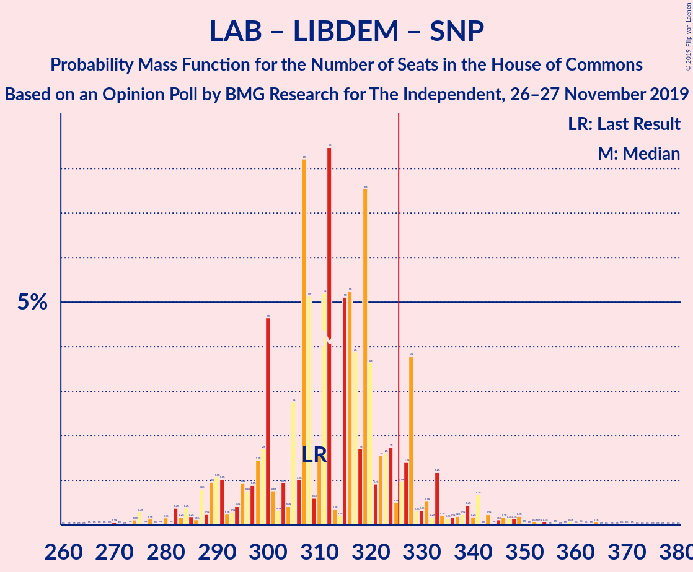

| Number of Seats | Probability | Accumulated | Special Marks |
|:---------------:|:-----------:|:-----------:|:-------------:|
| 266 | 0% | 100% |  |
| 267 | 0% | 99.9% |  |
| 268 | 0% | 99.9% |  |
| 269 | 0% | 99.9% |  |
| 270 | 0.1% | 99.9% |  |
| 271 | 0% | 99.9% |  |
| 272 | 0% | 99.8% |  |
| 273 | 0% | 99.8% |  |
| 274 | 0.1% | 99.8% |  |
| 275 | 0.3% | 99.7% |  |
| 276 | 0% | 99.4% |  |
| 277 | 0.1% | 99.3% |  |
| 278 | 0% | 99.2% |  |
| 279 | 0% | 99.2% |  |
| 280 | 0.2% | 99.2% |  |
| 281 | 0% | 99.0% |  |
| 282 | 0.4% | 99.0% |  |
| 283 | 0.2% | 98.6% |  |
| 284 | 0.4% | 98% |  |
| 285 | 0.2% | 98% |  |
| 286 | 0.1% | 98% |  |
| 287 | 0.8% | 98% |  |
| 288 | 0.2% | 97% |  |
| 289 | 1.0% | 97% |  |
| 290 | 1.1% | 96% |  |
| 291 | 1.0% | 95% |  |
| 292 | 0.2% | 94% |  |
| 293 | 0.3% | 93% |  |
| 294 | 0.4% | 93% |  |
| 295 | 0.9% | 93% |  |
| 296 | 0.8% | 92% |  |
| 297 | 0.9% | 91% |  |
| 298 | 1.4% | 90% |  |
| 299 | 2% | 89% |  |
| 300 | 5% | 87% |  |
| 301 | 0.8% | 82% |  |
| 302 | 0.3% | 81% |  |
| 303 | 0.9% | 81% |  |
| 304 | 0.4% | 80% |  |
| 305 | 3% | 80% |  |
| 306 | 1.0% | 77% |  |
| 307 | 8% | 76% |  |
| 308 | 5% | 68% |  |
| 309 | 0.6% | 63% | Last Result |
| 310 | 2% | 62% |  |
| 311 | 5% | 60% |  |
| 312 | 8% | 55% | Median |
| 313 | 0.3% | 47% |  |
| 314 | 0.2% | 46% |  |
| 315 | 5% | 46% |  |
| 316 | 5% | 41% |  |
| 317 | 4% | 36% |  |
| 318 | 2% | 32% |  |
| 319 | 8% | 30% |  |
| 320 | 4% | 23% |  |
| 321 | 0.9% | 19% |  |
| 322 | 2% | 18% |  |
| 323 | 2% | 17% |  |
| 324 | 2% | 15% |  |
| 325 | 0.5% | 13% |  |
| 326 | 1.0% | 13% | Majority |
| 327 | 1.4% | 12% |  |
| 328 | 4% | 10% |  |
| 329 | 0.3% | 7% |  |
| 330 | 0.3% | 6% |  |
| 331 | 0.5% | 6% |  |
| 332 | 0.2% | 5% |  |
| 333 | 1.2% | 5% |  |
| 334 | 0.2% | 4% |  |
| 335 | 0.2% | 4% |  |
| 336 | 0.2% | 4% |  |
| 337 | 0.2% | 4% |  |
| 338 | 0.2% | 3% |  |
| 339 | 0.4% | 3% |  |
| 340 | 0.2% | 3% |  |
| 341 | 0.7% | 2% |  |
| 342 | 0% | 2% |  |
| 343 | 0.2% | 2% |  |
| 344 | 0% | 2% |  |
| 345 | 0.1% | 1.5% |  |
| 346 | 0.2% | 1.4% |  |
| 347 | 0.1% | 1.2% |  |
| 348 | 0.1% | 1.0% |  |
| 349 | 0.2% | 0.9% |  |
| 350 | 0% | 0.7% |  |
| 351 | 0% | 0.7% |  |
| 352 | 0.1% | 0.6% |  |
| 353 | 0.1% | 0.6% |  |
| 354 | 0.1% | 0.5% |  |
| 355 | 0% | 0.4% |  |
| 356 | 0% | 0.4% |  |
| 357 | 0% | 0.4% |  |
| 358 | 0% | 0.4% |  |
| 359 | 0.1% | 0.3% |  |
| 360 | 0% | 0.3% |  |
| 361 | 0% | 0.2% |  |
| 362 | 0% | 0.2% |  |
| 363 | 0% | 0.2% |  |
| 364 | 0.1% | 0.2% |  |
| 365 | 0% | 0.1% |  |
| 366 | 0% | 0.1% |  |
| 367 | 0% | 0.1% |  |
| 368 | 0% | 0.1% |  |
| 369 | 0% | 0.1% |  |
| 370 | 0% | 0.1% |  |
| 371 | 0% | 0.1% |  |
| 372 | 0% | 0% |  |

### Labour Party – Scottish National Party – Plaid Cymru

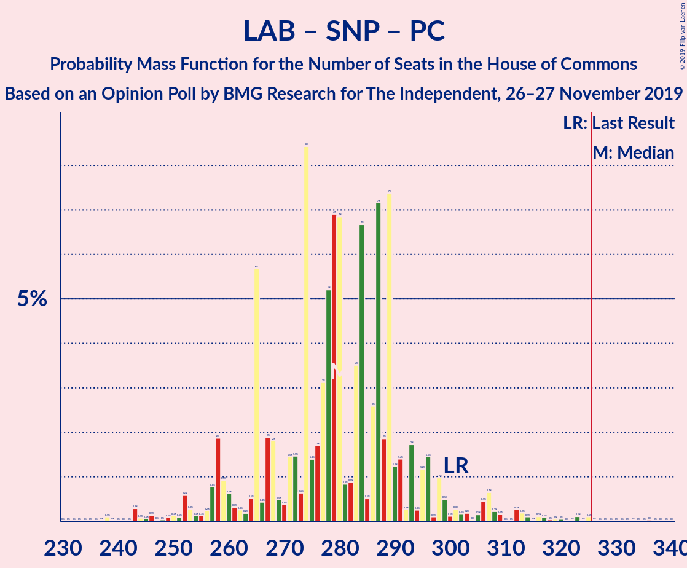

| Number of Seats | Probability | Accumulated | Special Marks |
|:---------------:|:-----------:|:-----------:|:-------------:|
| 238 | 0.1% | 100% |  |
| 239 | 0% | 99.9% |  |
| 240 | 0% | 99.8% |  |
| 241 | 0% | 99.8% |  |
| 242 | 0% | 99.8% |  |
| 243 | 0.3% | 99.8% |  |
| 244 | 0.1% | 99.5% |  |
| 245 | 0.1% | 99.5% |  |
| 246 | 0.1% | 99.4% |  |
| 247 | 0% | 99.3% |  |
| 248 | 0% | 99.2% |  |
| 249 | 0.1% | 99.2% |  |
| 250 | 0.1% | 99.1% |  |
| 251 | 0.1% | 99.0% |  |
| 252 | 0.6% | 98.9% |  |
| 253 | 0.3% | 98% |  |
| 254 | 0.1% | 98% |  |
| 255 | 0.1% | 98% |  |
| 256 | 0.2% | 98% |  |
| 257 | 0.8% | 98% |  |
| 258 | 2% | 97% |  |
| 259 | 0.9% | 95% |  |
| 260 | 0.6% | 94% |  |
| 261 | 0.3% | 93% |  |
| 262 | 0.3% | 93% |  |
| 263 | 0.2% | 93% |  |
| 264 | 0.5% | 93% |  |
| 265 | 6% | 92% |  |
| 266 | 0.4% | 86% |  |
| 267 | 2% | 86% |  |
| 268 | 2% | 84% |  |
| 269 | 0.5% | 82% |  |
| 270 | 0.4% | 82% |  |
| 271 | 1.5% | 81% |  |
| 272 | 1.5% | 80% |  |
| 273 | 0.6% | 78% |  |
| 274 | 8% | 78% |  |
| 275 | 1.4% | 69% |  |
| 276 | 2% | 68% |  |
| 277 | 3% | 66% |  |
| 278 | 5% | 63% |  |
| 279 | 7% | 58% |  |
| 280 | 7% | 51% | Median |
| 281 | 0.8% | 44% |  |
| 282 | 0.9% | 43% |  |
| 283 | 4% | 42% |  |
| 284 | 7% | 39% |  |
| 285 | 0.5% | 32% |  |
| 286 | 3% | 32% |  |
| 287 | 7% | 29% |  |
| 288 | 2% | 22% |  |
| 289 | 7% | 20% |  |
| 290 | 1.2% | 13% |  |
| 291 | 1.4% | 12% |  |
| 292 | 0.3% | 10% |  |
| 293 | 2% | 10% |  |
| 294 | 0.3% | 8% |  |
| 295 | 1.2% | 8% |  |
| 296 | 1.5% | 7% |  |
| 297 | 0.1% | 5% |  |
| 298 | 1.0% | 5% |  |
| 299 | 0.5% | 4% |  |
| 300 | 0.1% | 4% |  |
| 301 | 0.3% | 4% | Last Result |
| 302 | 0.2% | 3% |  |
| 303 | 0.2% | 3% |  |
| 304 | 0% | 3% |  |
| 305 | 0.1% | 3% |  |
| 306 | 0.5% | 3% |  |
| 307 | 0.7% | 2% |  |
| 308 | 0.2% | 2% |  |
| 309 | 0.2% | 1.5% |  |
| 310 | 0% | 1.3% |  |
| 311 | 0% | 1.3% |  |
| 312 | 0.3% | 1.3% |  |
| 313 | 0.2% | 1.0% |  |
| 314 | 0.1% | 0.8% |  |
| 315 | 0% | 0.7% |  |
| 316 | 0.1% | 0.7% |  |
| 317 | 0.1% | 0.6% |  |
| 318 | 0% | 0.5% |  |
| 319 | 0% | 0.5% |  |
| 320 | 0% | 0.4% |  |
| 321 | 0% | 0.4% |  |
| 322 | 0% | 0.4% |  |
| 323 | 0.1% | 0.4% |  |
| 324 | 0% | 0.2% |  |
| 325 | 0.1% | 0.2% |  |
| 326 | 0% | 0.1% | Majority |
| 327 | 0% | 0.1% |  |
| 328 | 0% | 0.1% |  |
| 329 | 0% | 0.1% |  |
| 330 | 0% | 0.1% |  |
| 331 | 0% | 0.1% |  |
| 332 | 0% | 0.1% |  |
| 333 | 0% | 0.1% |  |
| 334 | 0% | 0.1% |  |
| 335 | 0% | 0.1% |  |
| 336 | 0% | 0% |  |

### Labour Party – Scottish National Party

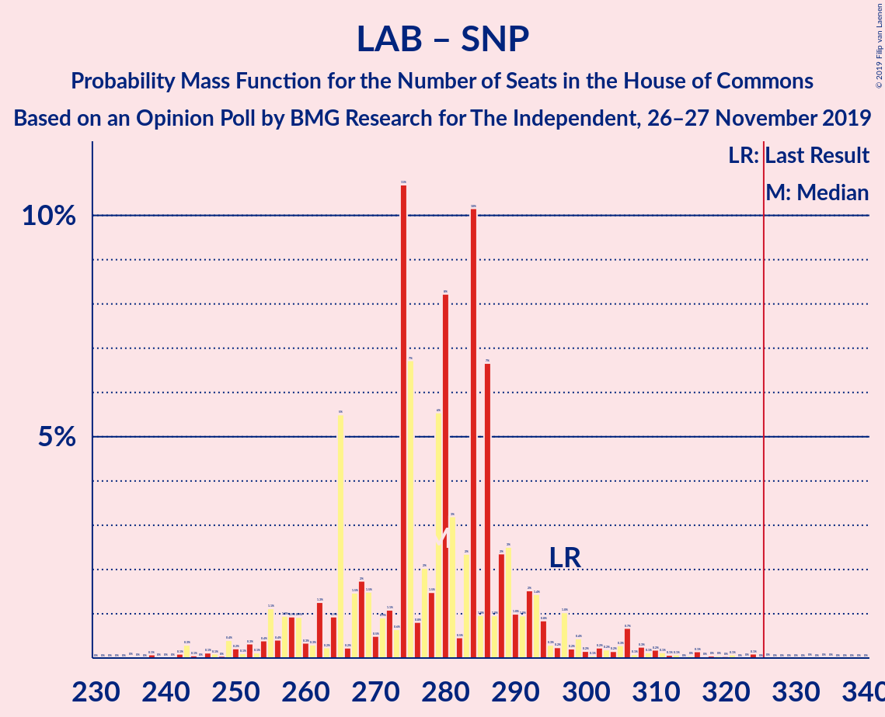

| Number of Seats | Probability | Accumulated | Special Marks |
|:---------------:|:-----------:|:-----------:|:-------------:|
| 235 | 0% | 100% |  |
| 236 | 0% | 99.9% |  |
| 237 | 0% | 99.9% |  |
| 238 | 0.1% | 99.9% |  |
| 239 | 0% | 99.8% |  |
| 240 | 0% | 99.8% |  |
| 241 | 0% | 99.8% |  |
| 242 | 0.1% | 99.8% |  |
| 243 | 0.3% | 99.7% |  |
| 244 | 0.1% | 99.4% |  |
| 245 | 0% | 99.3% |  |
| 246 | 0.1% | 99.3% |  |
| 247 | 0.1% | 99.2% |  |
| 248 | 0% | 99.1% |  |
| 249 | 0.4% | 99.1% |  |
| 250 | 0.2% | 98.7% |  |
| 251 | 0.1% | 98% |  |
| 252 | 0.3% | 98% |  |
| 253 | 0.1% | 98% |  |
| 254 | 0.4% | 98% |  |
| 255 | 1.1% | 97% |  |
| 256 | 0.4% | 96% |  |
| 257 | 1.0% | 96% |  |
| 258 | 0.9% | 95% |  |
| 259 | 0.9% | 94% |  |
| 260 | 0.3% | 93% |  |
| 261 | 0.3% | 93% |  |
| 262 | 1.3% | 93% |  |
| 263 | 0.2% | 91% |  |
| 264 | 0.9% | 91% |  |
| 265 | 5% | 90% |  |
| 266 | 0.2% | 85% |  |
| 267 | 1.5% | 84% |  |
| 268 | 2% | 83% |  |
| 269 | 1.5% | 81% |  |
| 270 | 0.5% | 80% |  |
| 271 | 0.9% | 79% |  |
| 272 | 1.1% | 78% |  |
| 273 | 0.6% | 77% |  |
| 274 | 11% | 76% |  |
| 275 | 7% | 66% |  |
| 276 | 0.8% | 59% |  |
| 277 | 2% | 58% |  |
| 278 | 1.5% | 56% |  |
| 279 | 6% | 55% | Median |
| 280 | 8% | 49% |  |
| 281 | 3% | 41% |  |
| 282 | 0.5% | 38% |  |
| 283 | 2% | 37% |  |
| 284 | 10% | 35% |  |
| 285 | 1.0% | 25% |  |
| 286 | 7% | 24% |  |
| 287 | 1.0% | 17% |  |
| 288 | 2% | 16% |  |
| 289 | 3% | 14% |  |
| 290 | 1.0% | 11% |  |
| 291 | 1.0% | 10% |  |
| 292 | 2% | 9% |  |
| 293 | 1.4% | 8% |  |
| 294 | 0.8% | 6% |  |
| 295 | 0.3% | 6% |  |
| 296 | 0.2% | 5% |  |
| 297 | 1.0% | 5% | Last Result |
| 298 | 0.2% | 4% |  |
| 299 | 0.4% | 4% |  |
| 300 | 0.2% | 3% |  |
| 301 | 0.1% | 3% |  |
| 302 | 0.2% | 3% |  |
| 303 | 0.2% | 3% |  |
| 304 | 0.2% | 3% |  |
| 305 | 0.3% | 3% |  |
| 306 | 0.7% | 2% |  |
| 307 | 0.1% | 2% |  |
| 308 | 0.3% | 2% |  |
| 309 | 0.1% | 1.3% |  |
| 310 | 0.2% | 1.2% |  |
| 311 | 0.1% | 1.0% |  |
| 312 | 0.1% | 0.8% |  |
| 313 | 0.1% | 0.8% |  |
| 314 | 0% | 0.7% |  |
| 315 | 0% | 0.7% |  |
| 316 | 0.1% | 0.6% |  |
| 317 | 0% | 0.5% |  |
| 318 | 0% | 0.5% |  |
| 319 | 0% | 0.4% |  |
| 320 | 0% | 0.4% |  |
| 321 | 0.1% | 0.3% |  |
| 322 | 0% | 0.2% |  |
| 323 | 0% | 0.2% |  |
| 324 | 0.1% | 0.2% |  |
| 325 | 0% | 0.1% |  |
| 326 | 0% | 0.1% | Majority |
| 327 | 0% | 0.1% |  |
| 328 | 0% | 0.1% |  |
| 329 | 0% | 0.1% |  |
| 330 | 0% | 0.1% |  |
| 331 | 0% | 0.1% |  |
| 332 | 0% | 0.1% |  |
| 333 | 0% | 0.1% |  |
| 334 | 0% | 0% |  |

### Labour Party – Liberal Democrats – Plaid Cymru

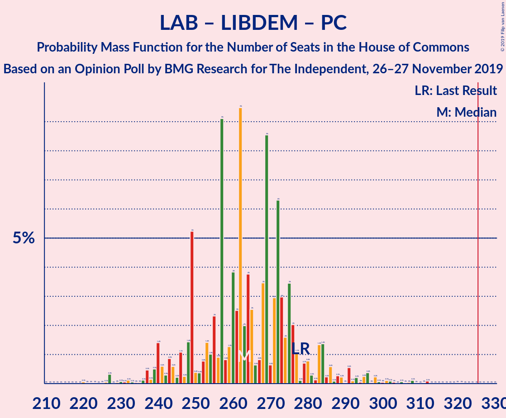

| Number of Seats | Probability | Accumulated | Special Marks |
|:---------------:|:-----------:|:-----------:|:-------------:|
| 220 | 0.1% | 100% |  |
| 221 | 0% | 99.9% |  |
| 222 | 0% | 99.9% |  |
| 223 | 0% | 99.9% |  |
| 224 | 0% | 99.9% |  |
| 225 | 0% | 99.8% |  |
| 226 | 0.1% | 99.8% |  |
| 227 | 0.3% | 99.8% |  |
| 228 | 0% | 99.5% |  |
| 229 | 0% | 99.4% |  |
| 230 | 0.1% | 99.4% |  |
| 231 | 0.1% | 99.3% |  |
| 232 | 0.1% | 99.3% |  |
| 233 | 0.1% | 99.2% |  |
| 234 | 0% | 99.1% |  |
| 235 | 0% | 99.1% |  |
| 236 | 0.1% | 99.0% |  |
| 237 | 0.5% | 98.9% |  |
| 238 | 0.1% | 98% |  |
| 239 | 0.5% | 98% |  |
| 240 | 1.4% | 98% |  |
| 241 | 0.6% | 96% |  |
| 242 | 0.3% | 96% |  |
| 243 | 0.9% | 96% |  |
| 244 | 0.6% | 95% |  |
| 245 | 0.2% | 94% |  |
| 246 | 1.1% | 94% |  |
| 247 | 0.2% | 93% |  |
| 248 | 1.4% | 93% |  |
| 249 | 5% | 91% |  |
| 250 | 0.4% | 86% |  |
| 251 | 0.4% | 85% |  |
| 252 | 0.8% | 85% |  |
| 253 | 1.4% | 84% |  |
| 254 | 1.0% | 83% |  |
| 255 | 2% | 82% |  |
| 256 | 0.9% | 80% |  |
| 257 | 9% | 79% |  |
| 258 | 0.8% | 70% |  |
| 259 | 1.3% | 69% |  |
| 260 | 4% | 67% |  |
| 261 | 3% | 64% |  |
| 262 | 9% | 61% |  |
| 263 | 2% | 52% | Median |
| 264 | 4% | 50% |  |
| 265 | 3% | 46% |  |
| 266 | 0.6% | 43% |  |
| 267 | 0.8% | 43% |  |
| 268 | 3% | 42% |  |
| 269 | 9% | 38% |  |
| 270 | 0.6% | 30% |  |
| 271 | 3% | 29% |  |
| 272 | 6% | 26% |  |
| 273 | 3% | 20% |  |
| 274 | 2% | 17% |  |
| 275 | 3% | 15% |  |
| 276 | 2% | 12% |  |
| 277 | 1.1% | 10% |  |
| 278 | 0.1% | 9% | Last Result |
| 279 | 0.7% | 9% |  |
| 280 | 0.8% | 8% |  |
| 281 | 0.3% | 7% |  |
| 282 | 0.1% | 7% |  |
| 283 | 1.3% | 7% |  |
| 284 | 1.4% | 5% |  |
| 285 | 0.2% | 4% |  |
| 286 | 0.6% | 4% |  |
| 287 | 0.1% | 3% |  |
| 288 | 0.3% | 3% |  |
| 289 | 0.2% | 3% |  |
| 290 | 0% | 3% |  |
| 291 | 0.6% | 3% |  |
| 292 | 0.1% | 2% |  |
| 293 | 0.2% | 2% |  |
| 294 | 0% | 2% |  |
| 295 | 0.2% | 2% |  |
| 296 | 0.4% | 2% |  |
| 297 | 0% | 1.2% |  |
| 298 | 0.2% | 1.1% |  |
| 299 | 0.1% | 0.9% |  |
| 300 | 0% | 0.8% |  |
| 301 | 0.1% | 0.8% |  |
| 302 | 0.1% | 0.7% |  |
| 303 | 0% | 0.6% |  |
| 304 | 0% | 0.5% |  |
| 305 | 0.1% | 0.5% |  |
| 306 | 0% | 0.5% |  |
| 307 | 0% | 0.4% |  |
| 308 | 0.1% | 0.4% |  |
| 309 | 0% | 0.3% |  |
| 310 | 0% | 0.3% |  |
| 311 | 0% | 0.2% |  |
| 312 | 0.1% | 0.2% |  |
| 313 | 0% | 0.1% |  |
| 314 | 0% | 0.1% |  |
| 315 | 0% | 0.1% |  |
| 316 | 0% | 0.1% |  |
| 317 | 0% | 0.1% |  |
| 318 | 0% | 0.1% |  |
| 319 | 0% | 0.1% |  |
| 320 | 0% | 0.1% |  |
| 321 | 0% | 0.1% |  |
| 322 | 0% | 0% |  |

### Labour Party – Liberal Democrats – Change UK

| Number of Seats | Probability | Accumulated | Special Marks |
|:---------------:|:-----------:|:-----------:|:-------------:|
| 219 | 0% | 100% |  |
| 220 | 0.1% | 99.9% |  |
| 221 | 0% | 99.9% |  |
| 222 | 0% | 99.9% |  |
| 223 | 0% | 99.9% |  |
| 224 | 0% | 99.8% |  |
| 225 | 0% | 99.8% |  |
| 226 | 0.1% | 99.8% |  |
| 227 | 0.3% | 99.7% |  |
| 228 | 0% | 99.4% |  |
| 229 | 0.2% | 99.4% |  |
| 230 | 0.1% | 99.2% |  |
| 231 | 0.1% | 99.2% |  |
| 232 | 0% | 99.1% |  |
| 233 | 0% | 99.1% |  |
| 234 | 0.3% | 99.1% |  |
| 235 | 0.1% | 98.8% |  |
| 236 | 0.3% | 98.7% |  |
| 237 | 0.3% | 98% |  |
| 238 | 0.6% | 98% |  |
| 239 | 0.5% | 97% |  |
| 240 | 2% | 97% |  |
| 241 | 0.2% | 95% |  |
| 242 | 0.3% | 95% |  |
| 243 | 0.7% | 95% |  |
| 244 | 0.6% | 94% |  |
| 245 | 0.3% | 93% |  |
| 246 | 1.0% | 93% |  |
| 247 | 0.3% | 92% |  |
| 248 | 2% | 92% |  |
| 249 | 5% | 90% |  |
| 250 | 2% | 85% |  |
| 251 | 0.4% | 83% |  |
| 252 | 0.9% | 83% |  |
| 253 | 0.6% | 82% |  |
| 254 | 2% | 82% |  |
| 255 | 3% | 80% |  |
| 256 | 1.2% | 77% |  |
| 257 | 11% | 76% |  |
| 258 | 1.3% | 65% |  |
| 259 | 0.9% | 64% |  |
| 260 | 3% | 63% |  |
| 261 | 4% | 60% |  |
| 262 | 9% | 56% | Median |
| 263 | 0.8% | 47% |  |
| 264 | 0.7% | 46% |  |
| 265 | 4% | 45% |  |
| 266 | 5% | 41% |  |
| 267 | 0.8% | 36% |  |
| 268 | 2% | 35% |  |
| 269 | 10% | 33% |  |
| 270 | 3% | 23% |  |
| 271 | 2% | 20% |  |
| 272 | 3% | 18% |  |
| 273 | 2% | 15% |  |
| 274 | 0.8% | 13% | Last Result |
| 275 | 2% | 12% |  |
| 276 | 1.1% | 10% |  |
| 277 | 0.4% | 9% |  |
| 278 | 0.6% | 8% |  |
| 279 | 0.4% | 8% |  |
| 280 | 2% | 7% |  |
| 281 | 0.2% | 5% |  |
| 282 | 0.4% | 5% |  |
| 283 | 1.0% | 5% |  |
| 284 | 0.2% | 4% |  |
| 285 | 0.2% | 4% |  |
| 286 | 0.5% | 4% |  |
| 287 | 0.2% | 3% |  |
| 288 | 0.1% | 3% |  |
| 289 | 0.2% | 3% |  |
| 290 | 0.6% | 3% |  |
| 291 | 0% | 2% |  |
| 292 | 0.1% | 2% |  |
| 293 | 0.2% | 2% |  |
| 294 | 0.2% | 2% |  |
| 295 | 0.5% | 1.4% |  |
| 296 | 0% | 1.0% |  |
| 297 | 0% | 0.9% |  |
| 298 | 0.2% | 0.9% |  |
| 299 | 0% | 0.7% |  |
| 300 | 0% | 0.7% |  |
| 301 | 0.1% | 0.6% |  |
| 302 | 0.1% | 0.6% |  |
| 303 | 0.1% | 0.5% |  |
| 304 | 0% | 0.4% |  |
| 305 | 0% | 0.4% |  |
| 306 | 0.1% | 0.4% |  |
| 307 | 0% | 0.3% |  |
| 308 | 0% | 0.3% |  |
| 309 | 0% | 0.3% |  |
| 310 | 0% | 0.2% |  |
| 311 | 0.1% | 0.2% |  |
| 312 | 0% | 0.1% |  |
| 313 | 0% | 0.1% |  |
| 314 | 0% | 0.1% |  |
| 315 | 0% | 0.1% |  |
| 316 | 0% | 0.1% |  |
| 317 | 0% | 0.1% |  |
| 318 | 0% | 0.1% |  |
| 319 | 0% | 0.1% |  |
| 320 | 0% | 0.1% |  |
| 321 | 0% | 0% |  |

### Labour Party – Liberal Democrats

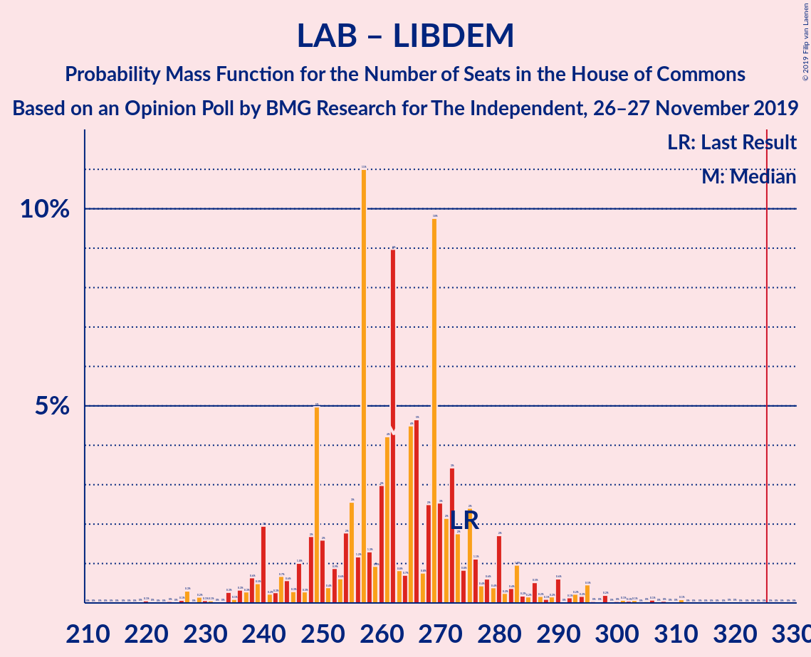

| Number of Seats | Probability | Accumulated | Special Marks |
|:---------------:|:-----------:|:-----------:|:-------------:|
| 219 | 0% | 100% |  |
| 220 | 0.1% | 99.9% |  |
| 221 | 0% | 99.9% |  |
| 222 | 0% | 99.9% |  |
| 223 | 0% | 99.9% |  |
| 224 | 0% | 99.8% |  |
| 225 | 0% | 99.8% |  |
| 226 | 0.1% | 99.8% |  |
| 227 | 0.3% | 99.7% |  |
| 228 | 0% | 99.4% |  |
| 229 | 0.2% | 99.4% |  |
| 230 | 0.1% | 99.2% |  |
| 231 | 0.1% | 99.2% |  |
| 232 | 0% | 99.1% |  |
| 233 | 0% | 99.1% |  |
| 234 | 0.3% | 99.1% |  |
| 235 | 0.1% | 98.8% |  |
| 236 | 0.3% | 98.7% |  |
| 237 | 0.3% | 98% |  |
| 238 | 0.6% | 98% |  |
| 239 | 0.5% | 97% |  |
| 240 | 2% | 97% |  |
| 241 | 0.2% | 95% |  |
| 242 | 0.3% | 95% |  |
| 243 | 0.7% | 95% |  |
| 244 | 0.6% | 94% |  |
| 245 | 0.3% | 93% |  |
| 246 | 1.0% | 93% |  |
| 247 | 0.3% | 92% |  |
| 248 | 2% | 92% |  |
| 249 | 5% | 90% |  |
| 250 | 2% | 85% |  |
| 251 | 0.4% | 83% |  |
| 252 | 0.9% | 83% |  |
| 253 | 0.6% | 82% |  |
| 254 | 2% | 82% |  |
| 255 | 3% | 80% |  |
| 256 | 1.2% | 77% |  |
| 257 | 11% | 76% |  |
| 258 | 1.3% | 65% |  |
| 259 | 0.9% | 64% |  |
| 260 | 3% | 63% |  |
| 261 | 4% | 60% |  |
| 262 | 9% | 56% | Median |
| 263 | 0.8% | 47% |  |
| 264 | 0.7% | 46% |  |
| 265 | 4% | 45% |  |
| 266 | 5% | 41% |  |
| 267 | 0.8% | 36% |  |
| 268 | 2% | 35% |  |
| 269 | 10% | 33% |  |
| 270 | 3% | 23% |  |
| 271 | 2% | 20% |  |
| 272 | 3% | 18% |  |
| 273 | 2% | 15% |  |
| 274 | 0.8% | 13% | Last Result |
| 275 | 2% | 12% |  |
| 276 | 1.1% | 10% |  |
| 277 | 0.4% | 9% |  |
| 278 | 0.6% | 8% |  |
| 279 | 0.4% | 8% |  |
| 280 | 2% | 7% |  |
| 281 | 0.2% | 5% |  |
| 282 | 0.4% | 5% |  |
| 283 | 1.0% | 5% |  |
| 284 | 0.2% | 4% |  |
| 285 | 0.2% | 4% |  |
| 286 | 0.5% | 4% |  |
| 287 | 0.2% | 3% |  |
| 288 | 0.1% | 3% |  |
| 289 | 0.2% | 3% |  |
| 290 | 0.6% | 3% |  |
| 291 | 0% | 2% |  |
| 292 | 0.1% | 2% |  |
| 293 | 0.2% | 2% |  |
| 294 | 0.2% | 2% |  |
| 295 | 0.5% | 1.4% |  |
| 296 | 0% | 1.0% |  |
| 297 | 0% | 0.9% |  |
| 298 | 0.2% | 0.9% |  |
| 299 | 0% | 0.7% |  |
| 300 | 0% | 0.7% |  |
| 301 | 0.1% | 0.6% |  |
| 302 | 0.1% | 0.6% |  |
| 303 | 0.1% | 0.5% |  |
| 304 | 0% | 0.4% |  |
| 305 | 0% | 0.4% |  |
| 306 | 0.1% | 0.4% |  |
| 307 | 0% | 0.3% |  |
| 308 | 0% | 0.3% |  |
| 309 | 0% | 0.3% |  |
| 310 | 0% | 0.2% |  |
| 311 | 0.1% | 0.2% |  |
| 312 | 0% | 0.1% |  |
| 313 | 0% | 0.1% |  |
| 314 | 0% | 0.1% |  |
| 315 | 0% | 0.1% |  |
| 316 | 0% | 0.1% |  |
| 317 | 0% | 0.1% |  |
| 318 | 0% | 0.1% |  |
| 319 | 0% | 0.1% |  |
| 320 | 0% | 0.1% |  |
| 321 | 0% | 0% |  |

### Labour Party – Plaid Cymru

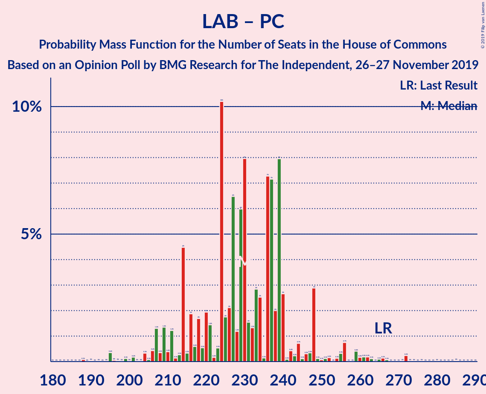

| Number of Seats | Probability | Accumulated | Special Marks |
|:---------------:|:-----------:|:-----------:|:-------------:|
| 188 | 0.1% | 100% |  |
| 189 | 0% | 99.9% |  |
| 190 | 0% | 99.9% |  |
| 191 | 0% | 99.9% |  |
| 192 | 0% | 99.9% |  |
| 193 | 0% | 99.8% |  |
| 194 | 0% | 99.8% |  |
| 195 | 0.4% | 99.8% |  |
| 196 | 0% | 99.5% |  |
| 197 | 0% | 99.4% |  |
| 198 | 0% | 99.4% |  |
| 199 | 0.1% | 99.4% |  |
| 200 | 0% | 99.3% |  |
| 201 | 0.2% | 99.2% |  |
| 202 | 0% | 99.1% |  |
| 203 | 0% | 99.0% |  |
| 204 | 0.3% | 99.0% |  |
| 205 | 0.1% | 98.7% |  |
| 206 | 0.4% | 98.6% |  |
| 207 | 1.3% | 98% |  |
| 208 | 0.3% | 97% |  |
| 209 | 1.3% | 97% |  |
| 210 | 0.4% | 95% |  |
| 211 | 1.2% | 95% |  |
| 212 | 0.1% | 94% |  |
| 213 | 0.3% | 93% |  |
| 214 | 4% | 93% |  |
| 215 | 0.3% | 89% |  |
| 216 | 2% | 88% |  |
| 217 | 0.6% | 87% |  |
| 218 | 2% | 86% |  |
| 219 | 0.5% | 84% |  |
| 220 | 2% | 84% |  |
| 221 | 1.4% | 82% |  |
| 222 | 0.2% | 80% |  |
| 223 | 0.5% | 80% |  |
| 224 | 10% | 80% |  |
| 225 | 2% | 69% |  |
| 226 | 2% | 68% |  |
| 227 | 6% | 66% |  |
| 228 | 1.2% | 59% |  |
| 229 | 6% | 58% |  |
| 230 | 8% | 52% | Median |
| 231 | 2% | 44% |  |
| 232 | 1.3% | 42% |  |
| 233 | 3% | 41% |  |
| 234 | 3% | 38% |  |
| 235 | 0.1% | 36% |  |
| 236 | 7% | 36% |  |
| 237 | 7% | 28% |  |
| 238 | 2% | 21% |  |
| 239 | 8% | 19% |  |
| 240 | 3% | 11% |  |
| 241 | 0.1% | 9% |  |
| 242 | 0.4% | 8% |  |
| 243 | 0.2% | 8% |  |
| 244 | 0.7% | 8% |  |
| 245 | 0.1% | 7% |  |
| 246 | 0.3% | 7% |  |
| 247 | 0.3% | 7% |  |
| 248 | 3% | 6% |  |
| 249 | 0.1% | 3% |  |
| 250 | 0.1% | 3% |  |
| 251 | 0.1% | 3% |  |
| 252 | 0.2% | 3% |  |
| 253 | 0% | 3% |  |
| 254 | 0.1% | 3% |  |
| 255 | 0.3% | 3% |  |
| 256 | 0.7% | 3% |  |
| 257 | 0% | 2% |  |
| 258 | 0% | 2% |  |
| 259 | 0.4% | 2% |  |
| 260 | 0.2% | 1.4% |  |
| 261 | 0.2% | 1.2% |  |
| 262 | 0.2% | 1.0% |  |
| 263 | 0.1% | 0.8% |  |
| 264 | 0% | 0.7% |  |
| 265 | 0.1% | 0.7% |  |
| 266 | 0.1% | 0.6% | Last Result |
| 267 | 0.1% | 0.5% |  |
| 268 | 0% | 0.4% |  |
| 269 | 0% | 0.4% |  |
| 270 | 0% | 0.4% |  |
| 271 | 0% | 0.4% |  |
| 272 | 0.2% | 0.4% |  |
| 273 | 0% | 0.2% |  |
| 274 | 0% | 0.1% |  |
| 275 | 0% | 0.1% |  |
| 276 | 0% | 0.1% |  |
| 277 | 0% | 0.1% |  |
| 278 | 0% | 0.1% |  |
| 279 | 0% | 0.1% |  |
| 280 | 0% | 0.1% |  |
| 281 | 0% | 0.1% |  |
| 282 | 0% | 0.1% |  |
| 283 | 0% | 0.1% |  |
| 284 | 0% | 0.1% |  |
| 285 | 0% | 0% |  |

### Labour Party – Change UK

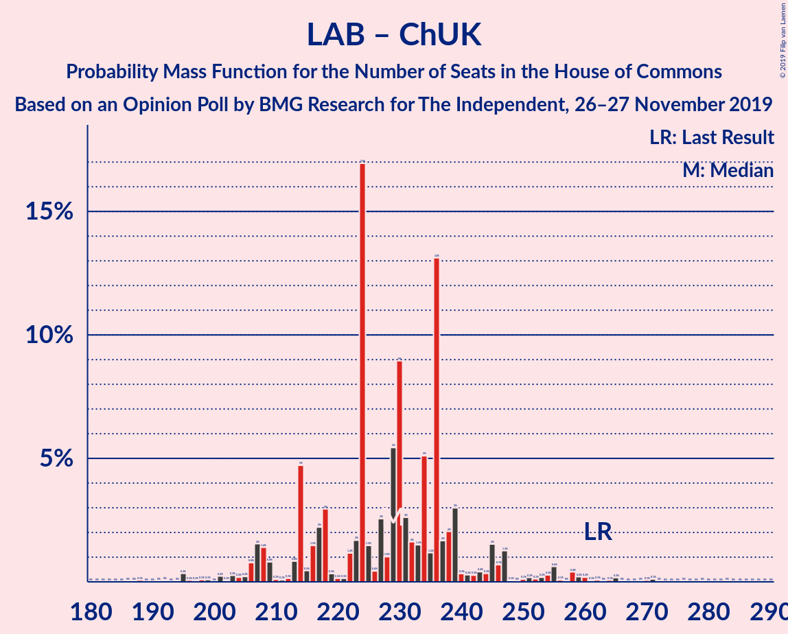

| Number of Seats | Probability | Accumulated | Special Marks |
|:---------------:|:-----------:|:-----------:|:-------------:|
| 187 | 0% | 100% |  |
| 188 | 0.1% | 99.9% |  |
| 189 | 0% | 99.9% |  |
| 190 | 0% | 99.9% |  |
| 191 | 0% | 99.9% |  |
| 192 | 0% | 99.8% |  |
| 193 | 0% | 99.8% |  |
| 194 | 0% | 99.8% |  |
| 195 | 0.3% | 99.8% |  |
| 196 | 0.1% | 99.4% |  |
| 197 | 0.1% | 99.3% |  |
| 198 | 0.1% | 99.3% |  |
| 199 | 0.1% | 99.2% |  |
| 200 | 0% | 99.1% |  |
| 201 | 0.2% | 99.1% |  |
| 202 | 0.1% | 98.9% |  |
| 203 | 0.3% | 98.8% |  |
| 204 | 0.2% | 98.5% |  |
| 205 | 0.2% | 98% |  |
| 206 | 0.8% | 98% |  |
| 207 | 2% | 97% |  |
| 208 | 1.4% | 96% |  |
| 209 | 0.8% | 94% |  |
| 210 | 0.1% | 94% |  |
| 211 | 0.1% | 94% |  |
| 212 | 0.1% | 93% |  |
| 213 | 0.8% | 93% |  |
| 214 | 5% | 92% |  |
| 215 | 0.5% | 88% |  |
| 216 | 1.5% | 87% |  |
| 217 | 2% | 86% |  |
| 218 | 3% | 84% |  |
| 219 | 0.3% | 81% |  |
| 220 | 0.1% | 80% |  |
| 221 | 0.1% | 80% |  |
| 222 | 1.2% | 80% |  |
| 223 | 2% | 79% |  |
| 224 | 17% | 77% |  |
| 225 | 1.5% | 60% |  |
| 226 | 0.4% | 59% |  |
| 227 | 3% | 58% |  |
| 228 | 1.0% | 56% |  |
| 229 | 5% | 55% | Median |
| 230 | 9% | 49% |  |
| 231 | 3% | 40% |  |
| 232 | 2% | 38% |  |
| 233 | 1.5% | 36% |  |
| 234 | 5% | 35% |  |
| 235 | 1.2% | 29% |  |
| 236 | 13% | 28% |  |
| 237 | 2% | 15% |  |
| 238 | 2% | 14% |  |
| 239 | 3% | 11% |  |
| 240 | 0.3% | 8% |  |
| 241 | 0.3% | 8% |  |
| 242 | 0.3% | 8% |  |
| 243 | 0.4% | 8% |  |
| 244 | 0.3% | 7% |  |
| 245 | 2% | 7% |  |
| 246 | 0.7% | 5% |  |
| 247 | 1.3% | 5% |  |
| 248 | 0.1% | 3% |  |
| 249 | 0% | 3% |  |
| 250 | 0.1% | 3% |  |
| 251 | 0.2% | 3% |  |
| 252 | 0.1% | 3% |  |
| 253 | 0.2% | 3% |  |
| 254 | 0.3% | 3% |  |
| 255 | 0.6% | 2% |  |
| 256 | 0.1% | 2% |  |
| 257 | 0% | 2% |  |
| 258 | 0.4% | 2% |  |
| 259 | 0.2% | 1.2% |  |
| 260 | 0.2% | 1.0% |  |
| 261 | 0.1% | 0.8% |  |
| 262 | 0.1% | 0.8% | Last Result |
| 263 | 0% | 0.7% |  |
| 264 | 0.1% | 0.7% |  |
| 265 | 0.2% | 0.6% |  |
| 266 | 0% | 0.5% |  |
| 267 | 0% | 0.4% |  |
| 268 | 0% | 0.4% |  |
| 269 | 0% | 0.4% |  |
| 270 | 0.1% | 0.4% |  |
| 271 | 0.1% | 0.3% |  |
| 272 | 0% | 0.2% |  |
| 273 | 0% | 0.1% |  |
| 274 | 0% | 0.1% |  |
| 275 | 0% | 0.1% |  |
| 276 | 0% | 0.1% |  |
| 277 | 0% | 0.1% |  |
| 278 | 0% | 0.1% |  |
| 279 | 0% | 0.1% |  |
| 280 | 0% | 0.1% |  |
| 281 | 0% | 0.1% |  |
| 282 | 0% | 0.1% |  |
| 283 | 0% | 0.1% |  |
| 284 | 0% | 0% |  |

### Labour Party

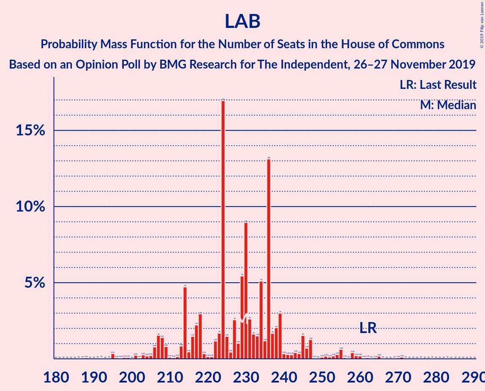

| Number of Seats | Probability | Accumulated | Special Marks |
|:---------------:|:-----------:|:-----------:|:-------------:|
| 187 | 0% | 100% |  |
| 188 | 0.1% | 99.9% |  |
| 189 | 0% | 99.9% |  |
| 190 | 0% | 99.9% |  |
| 191 | 0% | 99.9% |  |
| 192 | 0% | 99.8% |  |
| 193 | 0% | 99.8% |  |
| 194 | 0% | 99.8% |  |
| 195 | 0.3% | 99.8% |  |
| 196 | 0.1% | 99.4% |  |
| 197 | 0.1% | 99.3% |  |
| 198 | 0.1% | 99.3% |  |
| 199 | 0.1% | 99.2% |  |
| 200 | 0% | 99.1% |  |
| 201 | 0.2% | 99.1% |  |
| 202 | 0.1% | 98.9% |  |
| 203 | 0.3% | 98.8% |  |
| 204 | 0.2% | 98.5% |  |
| 205 | 0.2% | 98% |  |
| 206 | 0.8% | 98% |  |
| 207 | 2% | 97% |  |
| 208 | 1.4% | 96% |  |
| 209 | 0.8% | 94% |  |
| 210 | 0.1% | 94% |  |
| 211 | 0.1% | 94% |  |
| 212 | 0.1% | 93% |  |
| 213 | 0.8% | 93% |  |
| 214 | 5% | 92% |  |
| 215 | 0.5% | 88% |  |
| 216 | 1.5% | 87% |  |
| 217 | 2% | 86% |  |
| 218 | 3% | 84% |  |
| 219 | 0.3% | 81% |  |
| 220 | 0.1% | 80% |  |
| 221 | 0.1% | 80% |  |
| 222 | 1.2% | 80% |  |
| 223 | 2% | 79% |  |
| 224 | 17% | 77% |  |
| 225 | 1.5% | 60% |  |
| 226 | 0.4% | 59% |  |
| 227 | 3% | 58% |  |
| 228 | 1.0% | 56% |  |
| 229 | 5% | 55% | Median |
| 230 | 9% | 49% |  |
| 231 | 3% | 40% |  |
| 232 | 2% | 38% |  |
| 233 | 1.5% | 36% |  |
| 234 | 5% | 35% |  |
| 235 | 1.2% | 29% |  |
| 236 | 13% | 28% |  |
| 237 | 2% | 15% |  |
| 238 | 2% | 14% |  |
| 239 | 3% | 11% |  |
| 240 | 0.3% | 8% |  |
| 241 | 0.3% | 8% |  |
| 242 | 0.3% | 8% |  |
| 243 | 0.4% | 8% |  |
| 244 | 0.3% | 7% |  |
| 245 | 2% | 7% |  |
| 246 | 0.7% | 5% |  |
| 247 | 1.3% | 5% |  |
| 248 | 0.1% | 3% |  |
| 249 | 0% | 3% |  |
| 250 | 0.1% | 3% |  |
| 251 | 0.2% | 3% |  |
| 252 | 0.1% | 3% |  |
| 253 | 0.2% | 3% |  |
| 254 | 0.3% | 3% |  |
| 255 | 0.6% | 2% |  |
| 256 | 0.1% | 2% |  |
| 257 | 0% | 2% |  |
| 258 | 0.4% | 2% |  |
| 259 | 0.2% | 1.2% |  |
| 260 | 0.2% | 1.0% |  |
| 261 | 0.1% | 0.8% |  |
| 262 | 0.1% | 0.8% | Last Result |
| 263 | 0% | 0.7% |  |
| 264 | 0.1% | 0.7% |  |
| 265 | 0.2% | 0.6% |  |
| 266 | 0% | 0.5% |  |
| 267 | 0% | 0.4% |  |
| 268 | 0% | 0.4% |  |
| 269 | 0% | 0.4% |  |
| 270 | 0.1% | 0.4% |  |
| 271 | 0.1% | 0.3% |  |
| 272 | 0% | 0.2% |  |
| 273 | 0% | 0.1% |  |
| 274 | 0% | 0.1% |  |
| 275 | 0% | 0.1% |  |
| 276 | 0% | 0.1% |  |
| 277 | 0% | 0.1% |  |
| 278 | 0% | 0.1% |  |
| 279 | 0% | 0.1% |  |
| 280 | 0% | 0.1% |  |
| 281 | 0% | 0.1% |  |
| 282 | 0% | 0.1% |  |
| 283 | 0% | 0.1% |  |
| 284 | 0% | 0% |  |

## Technical Information

### Opinion Poll

+ **Polling firm:** BMG Research
+ **Commissioner(s):** The Independent
+ **Fieldwork period:** 26–27 November 2019

### Calculations

+ **Sample size:** 1663
+ **Simulations done:** 1,048,576
+ **Error estimate:** 1.57%

