# Opinion Poll by ComRes for Remain United, 6–8 December 2019

<a href="#voting-intentions">Voting Intentions</a> | <a href="#seats">Seats</a> | <a href="#coalitions">Coalitions</a> | <a href="#technical-information">Technical Information</a>

## Voting Intentions

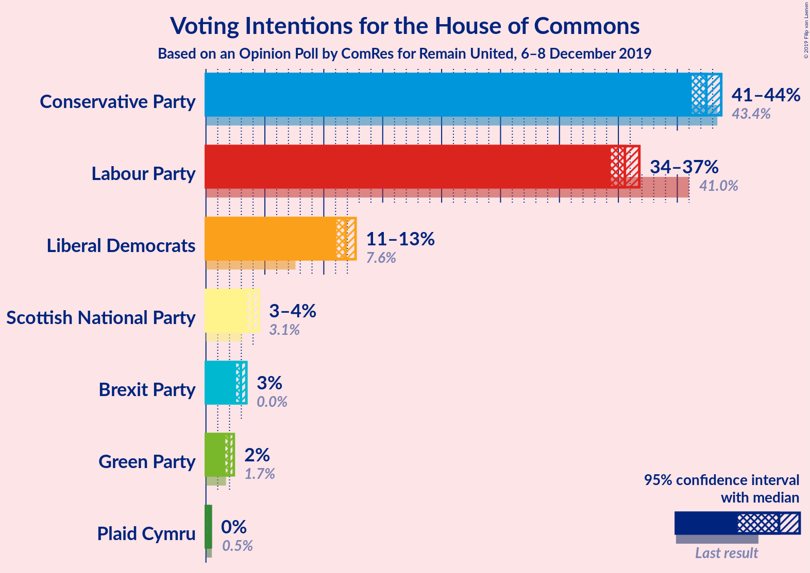

### Confidence Intervals

| Party | Last Result | Poll Result | 80% Confidence Interval | 90% Confidence Interval | 95% Confidence Interval | 99% Confidence Interval |
|:-----:|:-----------:|:-----------:|:-----------------------:|:-----------------------:|:-----------------------:|:-----------------------:|
| Conservative Party | 43.4% | 42.5% | 41.7–43.3% |41.4–43.5% |41.2–43.7% |40.8–44.1% |
| Labour Party | 41.0% | 35.6% | 34.8–36.4% |34.5–36.6% |34.4–36.8% |34.0–37.2% |
| Liberal Democrats | 7.6% | 11.9% | 11.3–12.4% |11.2–12.6% |11.1–12.7% |10.8–13.0% |
| Scottish National Party | 3.1% | 4.0% | 3.6–4.3% |3.6–4.4% |3.5–4.5% |3.3–4.6% |
| Brexit Party | 0.0% | 3.0% | 2.7–3.3% |2.6–3.4% |2.6–3.4% |2.4–3.6% |
| Green Party | 1.7% | 2.0% | 1.8–2.2% |1.7–2.3% |1.6–2.4% |1.6–2.5% |
| Plaid Cymru | 0.5% | 0.2% | 0.2–0.4% |0.2–0.4% |0.1–0.4% |0.1–0.5% |

*Note:* The poll result column reflects the actual value used in the calculations. Published results may vary slightly, and in addition be rounded to fewer digits.

## Seats

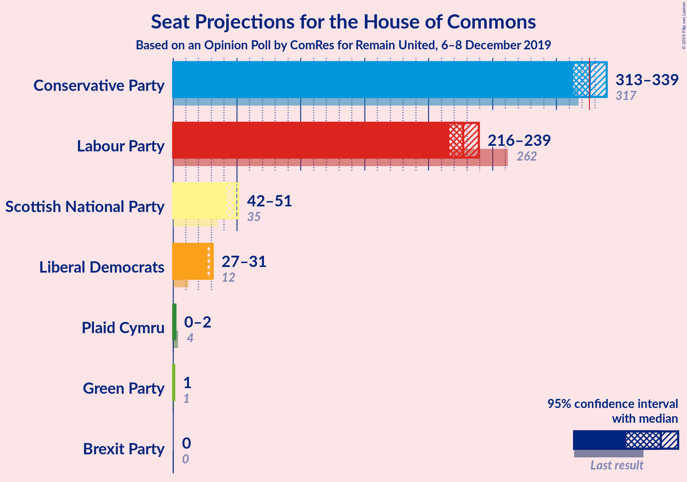

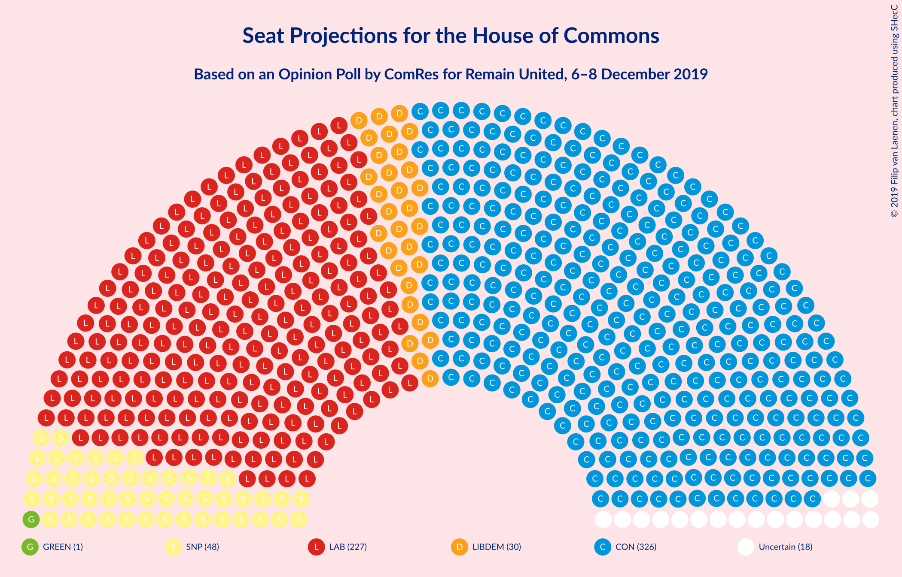

### Confidence Intervals

| Party | Last Result | Median | 80% Confidence Interval | 90% Confidence Interval | 95% Confidence Interval | 99% Confidence Interval |
|:-----:|:-----------:|:------:|:-----------------------:|:-----------------------:|:-----------------------:|:-----------------------:|
| <a href="#conservative-party">Conservative Party</a> | 317 | 326 | 316–333 |314–337 |313–339 |311–344 |
| <a href="#labour-party">Labour Party</a> | 262 | 227 | 223–237 |218–238 |216–239 |211–240 |
| <a href="#liberal-democrats">Liberal Democrats</a> | 12 | 30 | 28–31 |28–31 |27–31 |26–32 |
| <a href="#scottish-national-party">Scottish National Party</a> | 35 | 48 | 45–50 |42–50 |42–51 |41–51 |
| <a href="#brexit-party">Brexit Party</a> | 0 | 0 | 0 |0 |0 |0 |
| <a href="#green-party">Green Party</a> | 1 | 1 | 1 |1 |1 |1 |
| <a href="#plaid-cymru">Plaid Cymru</a> | 4 | 0 | 0–2 |0–2 |0–2 |0–3 |

### Conservative Party

*For a full overview of the results for this party, see the [Conservative Party](party-conservativeparty.html) page.*

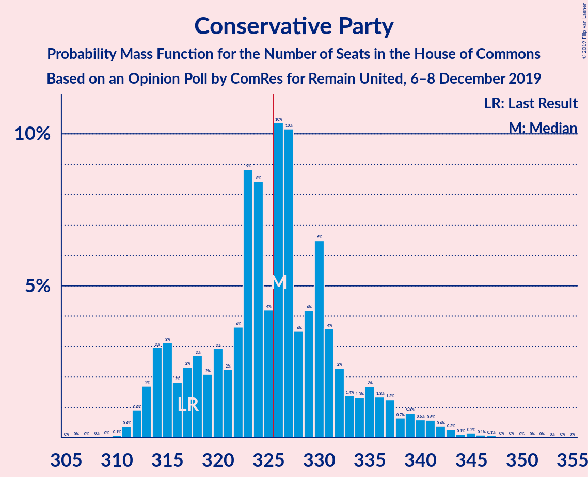

| Number of Seats | Probability | Accumulated | Special Marks |
|:---------------:|:-----------:|:-----------:|:-------------:|
| 306 | 0% | 100% |  |
| 307 | 0% | 99.9% |  |
| 308 | 0% | 99.9% |  |
| 309 | 0% | 99.9% |  |
| 310 | 0.1% | 99.8% |  |
| 311 | 0.4% | 99.8% |  |
| 312 | 0.9% | 99.4% |  |
| 313 | 2% | 98% |  |
| 314 | 3% | 97% |  |
| 315 | 3% | 94% |  |
| 316 | 2% | 91% |  |
| 317 | 2% | 89% | Last Result |
| 318 | 3% | 87% |  |
| 319 | 2% | 84% |  |
| 320 | 3% | 82% |  |
| 321 | 2% | 79% |  |
| 322 | 4% | 77% |  |
| 323 | 9% | 73% |  |
| 324 | 8% | 64% |  |
| 325 | 4% | 56% |  |
| 326 | 10% | 51% | Median, Majority |
| 327 | 10% | 41% |  |
| 328 | 4% | 31% |  |
| 329 | 4% | 27% |  |
| 330 | 6% | 23% |  |
| 331 | 4% | 17% |  |
| 332 | 2% | 13% |  |
| 333 | 1.4% | 11% |  |
| 334 | 1.3% | 9% |  |
| 335 | 2% | 8% |  |
| 336 | 1.3% | 6% |  |
| 337 | 1.3% | 5% |  |
| 338 | 0.7% | 4% |  |
| 339 | 0.8% | 3% |  |
| 340 | 0.6% | 2% |  |
| 341 | 0.6% | 2% |  |
| 342 | 0.4% | 1.2% |  |
| 343 | 0.3% | 0.9% |  |
| 344 | 0.1% | 0.6% |  |
| 345 | 0.2% | 0.5% |  |
| 346 | 0.1% | 0.3% |  |
| 347 | 0.1% | 0.2% |  |
| 348 | 0% | 0.1% |  |
| 349 | 0% | 0.1% |  |
| 350 | 0% | 0.1% |  |
| 351 | 0% | 0% |  |

### Labour Party

*For a full overview of the results for this party, see the [Labour Party](party-labourparty.html) page.*

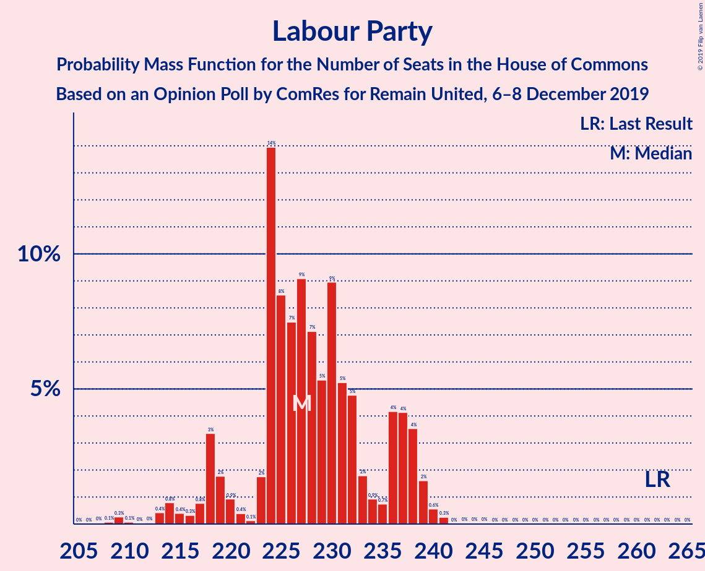

| Number of Seats | Probability | Accumulated | Special Marks |
|:---------------:|:-----------:|:-----------:|:-------------:|
| 207 | 0% | 100% |  |
| 208 | 0.1% | 99.9% |  |
| 209 | 0.3% | 99.9% |  |
| 210 | 0.1% | 99.6% |  |
| 211 | 0% | 99.5% |  |
| 212 | 0% | 99.5% |  |
| 213 | 0.4% | 99.4% |  |
| 214 | 0.8% | 99.0% |  |
| 215 | 0.4% | 98% |  |
| 216 | 0.3% | 98% |  |
| 217 | 0.8% | 97% |  |
| 218 | 3% | 97% |  |
| 219 | 2% | 93% |  |
| 220 | 0.9% | 92% |  |
| 221 | 0.4% | 91% |  |
| 222 | 0.1% | 90% |  |
| 223 | 2% | 90% |  |
| 224 | 14% | 88% |  |
| 225 | 8% | 74% |  |
| 226 | 7% | 66% |  |
| 227 | 9% | 58% | Median |
| 228 | 7% | 49% |  |
| 229 | 5% | 42% |  |
| 230 | 9% | 37% |  |
| 231 | 5% | 28% |  |
| 232 | 5% | 23% |  |
| 233 | 2% | 18% |  |
| 234 | 0.9% | 16% |  |
| 235 | 0.7% | 15% |  |
| 236 | 4% | 14% |  |
| 237 | 4% | 10% |  |
| 238 | 4% | 6% |  |
| 239 | 2% | 3% |  |
| 240 | 0.6% | 1.0% |  |
| 241 | 0.3% | 0.4% |  |
| 242 | 0% | 0.2% |  |
| 243 | 0% | 0.1% |  |
| 244 | 0% | 0.1% |  |
| 245 | 0% | 0.1% |  |
| 246 | 0% | 0.1% |  |
| 247 | 0% | 0% |  |
| 248 | 0% | 0% |  |
| 249 | 0% | 0% |  |
| 250 | 0% | 0% |  |
| 251 | 0% | 0% |  |
| 252 | 0% | 0% |  |
| 253 | 0% | 0% |  |
| 254 | 0% | 0% |  |
| 255 | 0% | 0% |  |
| 256 | 0% | 0% |  |
| 257 | 0% | 0% |  |
| 258 | 0% | 0% |  |
| 259 | 0% | 0% |  |
| 260 | 0% | 0% |  |
| 261 | 0% | 0% |  |
| 262 | 0% | 0% | Last Result |

### Liberal Democrats

*For a full overview of the results for this party, see the [Liberal Democrats](party-liberaldemocrats.html) page.*

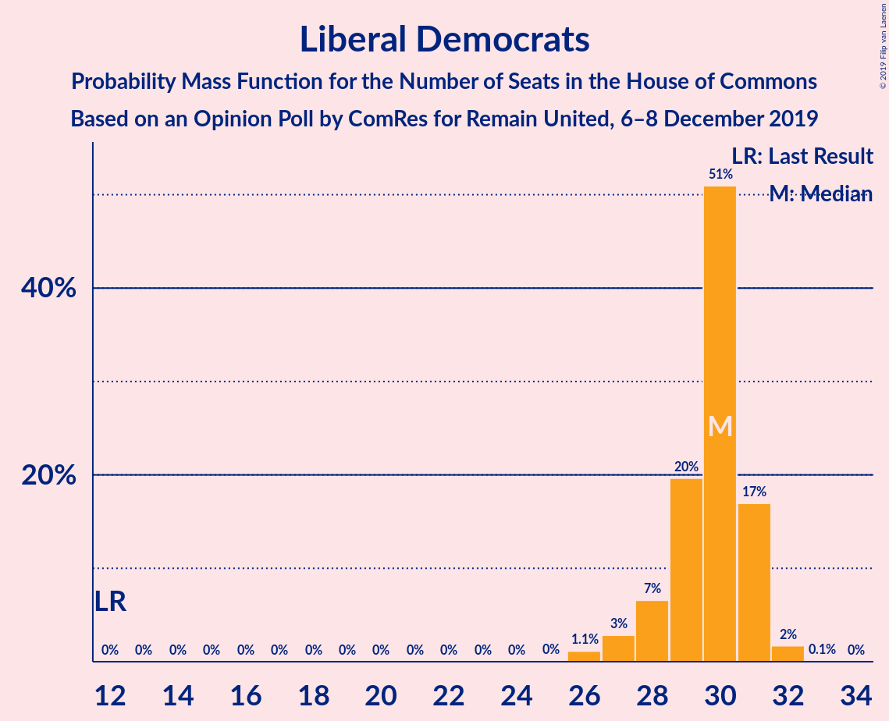

| Number of Seats | Probability | Accumulated | Special Marks |
|:---------------:|:-----------:|:-----------:|:-------------:|
| 12 | 0% | 100% | Last Result |
| 13 | 0% | 100% |  |
| 14 | 0% | 100% |  |
| 15 | 0% | 100% |  |
| 16 | 0% | 100% |  |
| 17 | 0% | 100% |  |
| 18 | 0% | 100% |  |
| 19 | 0% | 100% |  |
| 20 | 0% | 100% |  |
| 21 | 0% | 100% |  |
| 22 | 0% | 100% |  |
| 23 | 0% | 100% |  |
| 24 | 0% | 100% |  |
| 25 | 0% | 100% |  |
| 26 | 1.1% | 99.9% |  |
| 27 | 3% | 98.8% |  |
| 28 | 7% | 96% |  |
| 29 | 20% | 89% |  |
| 30 | 51% | 70% | Median |
| 31 | 17% | 19% |  |
| 32 | 2% | 2% |  |
| 33 | 0.1% | 0.1% |  |
| 34 | 0% | 0% |  |

### Scottish National Party

*For a full overview of the results for this party, see the [Scottish National Party](party-scottishnationalparty.html) page.*

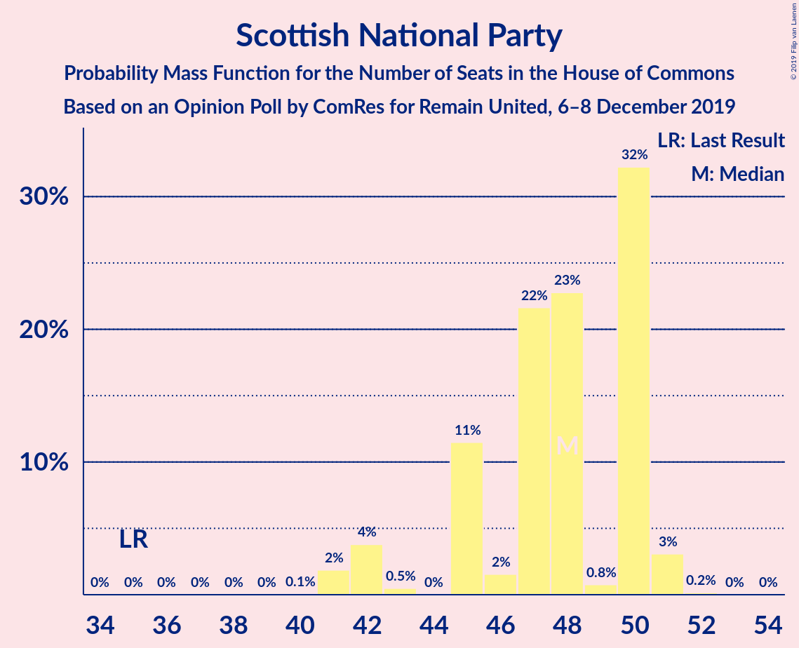

| Number of Seats | Probability | Accumulated | Special Marks |
|:---------------:|:-----------:|:-----------:|:-------------:|
| 35 | 0% | 100% | Last Result |
| 36 | 0% | 100% |  |
| 37 | 0% | 100% |  |
| 38 | 0% | 100% |  |
| 39 | 0% | 100% |  |
| 40 | 0.1% | 100% |  |
| 41 | 2% | 99.9% |  |
| 42 | 4% | 98% |  |
| 43 | 0.5% | 94% |  |
| 44 | 0% | 94% |  |
| 45 | 11% | 94% |  |
| 46 | 2% | 82% |  |
| 47 | 22% | 81% |  |
| 48 | 23% | 59% | Median |
| 49 | 0.8% | 36% |  |
| 50 | 32% | 36% |  |
| 51 | 3% | 3% |  |
| 52 | 0.2% | 0.2% |  |
| 53 | 0% | 0% |  |

### Brexit Party

*For a full overview of the results for this party, see the [Brexit Party](party-brexitparty.html) page.*

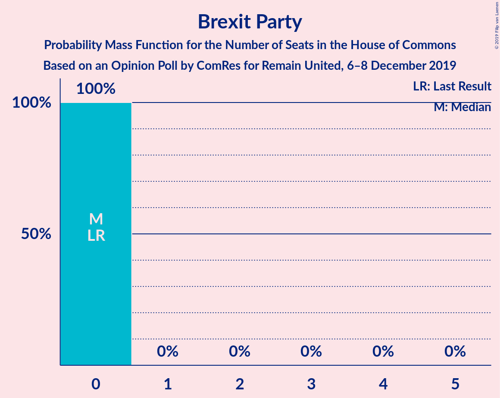

| Number of Seats | Probability | Accumulated | Special Marks |
|:---------------:|:-----------:|:-----------:|:-------------:|
| 0 | 100% | 100% | Last Result, Median |

### Green Party

*For a full overview of the results for this party, see the [Green Party](party-greenparty.html) page.*

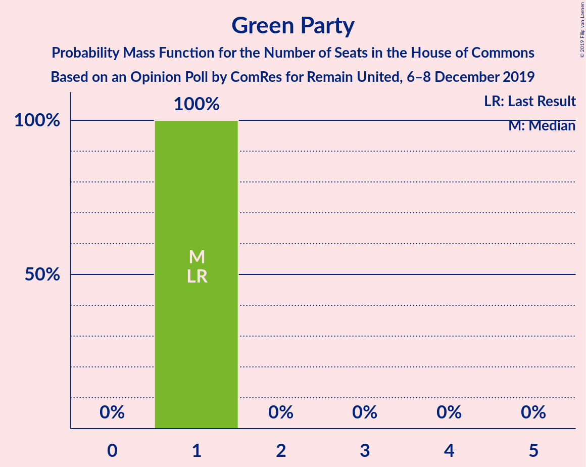

| Number of Seats | Probability | Accumulated | Special Marks |
|:---------------:|:-----------:|:-----------:|:-------------:|
| 1 | 100% | 100% | Last Result, Median |

### Plaid Cymru

*For a full overview of the results for this party, see the [Plaid Cymru](party-plaidcymru.html) page.*

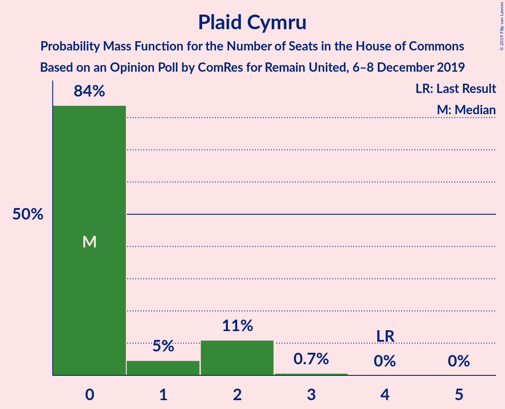

| Number of Seats | Probability | Accumulated | Special Marks |
|:---------------:|:-----------:|:-----------:|:-------------:|
| 0 | 84% | 100% | Median |
| 1 | 5% | 16% |  |
| 2 | 11% | 12% |  |
| 3 | 0.7% | 0.7% |  |
| 4 | 0% | 0% | Last Result |

## Coalitions

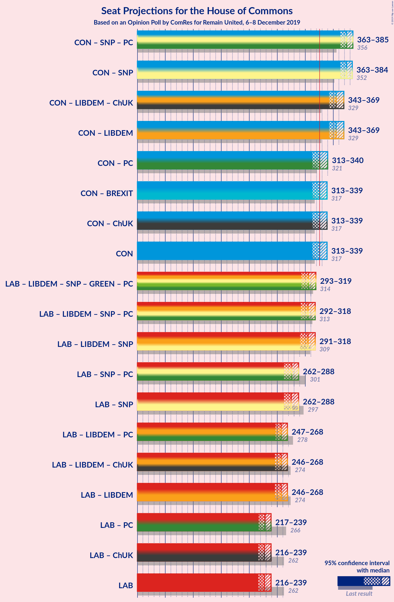

### Confidence Intervals

| Coalition | Last Result | Median | Majority? | 80% Confidence Interval | 90% Confidence Interval | 95% Confidence Interval | 99% Confidence Interval |
|:---------:|:-----------:|:------:|:---------:|:-----------------------:|:-----------------------:|:-----------------------:|:-----------------------:|
| Conservative Party – Scottish National Party – Plaid Cymru | 356 | 374 | 100% | 365–379 | 364–383 | 363–385 | 361–391 |
| Conservative Party – Scottish National Party | 352 | 374 | 100% | 365–379 | 364–383 | 363–384 | 361–390 |
| Conservative Party – Liberal Democrats | 329 | 355 | 100% | 345–363 | 344–366 | 343–369 | 341–374 |
| Conservative Party – Plaid Cymru | 321 | 326 | 54% | 316–333 | 314–337 | 313–340 | 312–344 |
| Conservative Party – Brexit Party | 317 | 326 | 51% | 316–333 | 314–337 | 313–339 | 311–344 |
| Conservative Party | 317 | 326 | 51% | 316–333 | 314–337 | 313–339 | 311–344 |
| Labour Party – Liberal Democrats – Scottish National Party – Green Party – Plaid Cymru | 314 | 306 | 0.1% | 299–316 | 295–318 | 293–319 | 288–321 |
| Labour Party – Liberal Democrats – Scottish National Party – Plaid Cymru | 313 | 305 | 0% | 298–315 | 294–317 | 292–318 | 287–320 |
| Labour Party – Liberal Democrats – Scottish National Party | 309 | 305 | 0% | 298–315 | 294–317 | 291–318 | 287–319 |
| Labour Party – Scottish National Party – Plaid Cymru | 301 | 276 | 0% | 268–286 | 265–287 | 262–288 | 257–290 |
| Labour Party – Scottish National Party | 297 | 275 | 0% | 268–286 | 264–287 | 262–288 | 257–290 |
| Labour Party – Liberal Democrats – Plaid Cymru | 278 | 257 | 0% | 252–266 | 248–267 | 247–268 | 241–270 |
| Labour Party – Liberal Democrats | 274 | 257 | 0% | 252–266 | 248–267 | 246–268 | 240–270 |
| Labour Party – Plaid Cymru | 266 | 228 | 0% | 223–237 | 218–238 | 217–239 | 211–241 |
| Labour Party | 262 | 227 | 0% | 223–237 | 218–238 | 216–239 | 211–240 |

### Conservative Party – Scottish National Party – Plaid Cymru

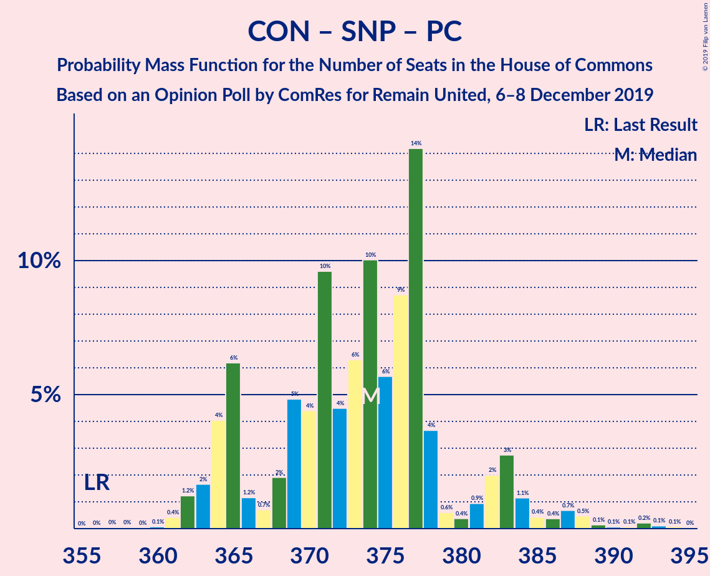

| Number of Seats | Probability | Accumulated | Special Marks |
|:---------------:|:-----------:|:-----------:|:-------------:|
| 355 | 0% | 100% |  |
| 356 | 0% | 99.9% | Last Result |
| 357 | 0% | 99.9% |  |
| 358 | 0% | 99.9% |  |
| 359 | 0% | 99.9% |  |
| 360 | 0.1% | 99.8% |  |
| 361 | 0.4% | 99.8% |  |
| 362 | 1.2% | 99.4% |  |
| 363 | 2% | 98% |  |
| 364 | 4% | 96% |  |
| 365 | 6% | 92% |  |
| 366 | 1.2% | 86% |  |
| 367 | 0.7% | 85% |  |
| 368 | 2% | 84% |  |
| 369 | 5% | 82% |  |
| 370 | 4% | 78% |  |
| 371 | 10% | 73% |  |
| 372 | 4% | 64% |  |
| 373 | 6% | 59% |  |
| 374 | 10% | 53% | Median |
| 375 | 6% | 43% |  |
| 376 | 9% | 37% |  |
| 377 | 14% | 28% |  |
| 378 | 4% | 14% |  |
| 379 | 0.6% | 11% |  |
| 380 | 0.4% | 10% |  |
| 381 | 0.9% | 10% |  |
| 382 | 2% | 9% |  |
| 383 | 3% | 7% |  |
| 384 | 1.1% | 4% |  |
| 385 | 0.4% | 3% |  |
| 386 | 0.4% | 2% |  |
| 387 | 0.7% | 2% |  |
| 388 | 0.5% | 1.2% |  |
| 389 | 0.1% | 0.7% |  |
| 390 | 0.1% | 0.6% |  |
| 391 | 0.1% | 0.5% |  |
| 392 | 0.2% | 0.4% |  |
| 393 | 0.1% | 0.2% |  |
| 394 | 0.1% | 0.1% |  |
| 395 | 0% | 0% |  |

### Conservative Party – Scottish National Party

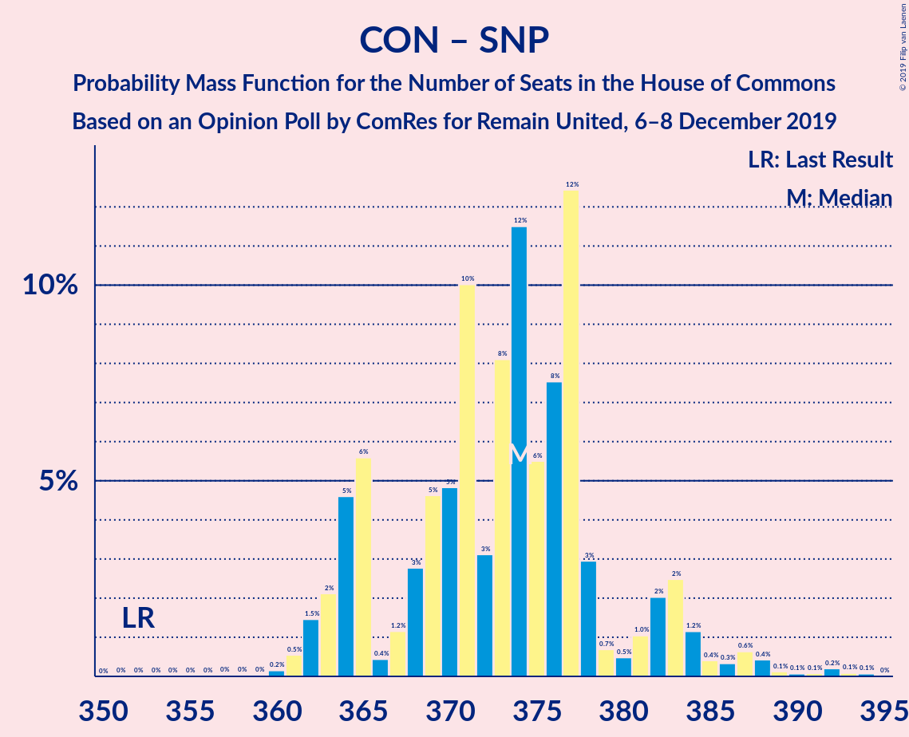

| Number of Seats | Probability | Accumulated | Special Marks |
|:---------------:|:-----------:|:-----------:|:-------------:|
| 352 | 0% | 100% | Last Result |
| 353 | 0% | 100% |  |
| 354 | 0% | 100% |  |
| 355 | 0% | 100% |  |
| 356 | 0% | 99.9% |  |
| 357 | 0% | 99.9% |  |
| 358 | 0% | 99.9% |  |
| 359 | 0% | 99.9% |  |
| 360 | 0.2% | 99.8% |  |
| 361 | 0.5% | 99.7% |  |
| 362 | 1.5% | 99.1% |  |
| 363 | 2% | 98% |  |
| 364 | 5% | 96% |  |
| 365 | 6% | 91% |  |
| 366 | 0.4% | 85% |  |
| 367 | 1.2% | 85% |  |
| 368 | 3% | 84% |  |
| 369 | 5% | 81% |  |
| 370 | 5% | 76% |  |
| 371 | 10% | 72% |  |
| 372 | 3% | 62% |  |
| 373 | 8% | 58% |  |
| 374 | 12% | 50% | Median |
| 375 | 6% | 39% |  |
| 376 | 8% | 33% |  |
| 377 | 12% | 26% |  |
| 378 | 3% | 13% |  |
| 379 | 0.7% | 10% |  |
| 380 | 0.5% | 10% |  |
| 381 | 1.0% | 9% |  |
| 382 | 2% | 8% |  |
| 383 | 2% | 6% |  |
| 384 | 1.2% | 4% |  |
| 385 | 0.4% | 2% |  |
| 386 | 0.3% | 2% |  |
| 387 | 0.6% | 2% |  |
| 388 | 0.4% | 1.1% |  |
| 389 | 0.1% | 0.7% |  |
| 390 | 0.1% | 0.5% |  |
| 391 | 0.1% | 0.5% |  |
| 392 | 0.2% | 0.4% |  |
| 393 | 0.1% | 0.2% |  |
| 394 | 0.1% | 0.1% |  |
| 395 | 0% | 0% |  |

### Conservative Party – Liberal Democrats

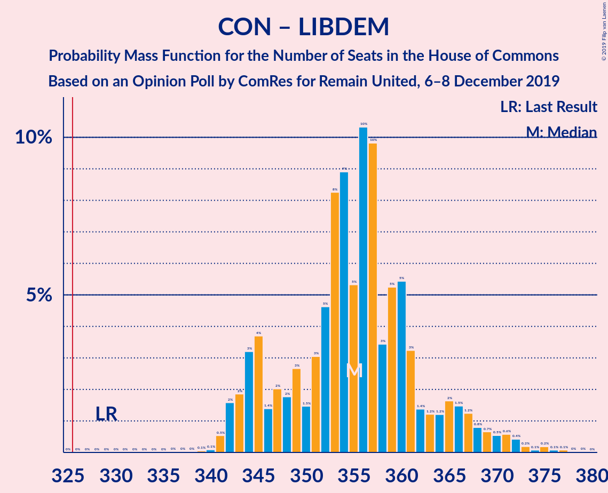

| Number of Seats | Probability | Accumulated | Special Marks |
|:---------------:|:-----------:|:-----------:|:-------------:|
| 329 | 0% | 100% | Last Result |
| 330 | 0% | 100% |  |
| 331 | 0% | 100% |  |
| 332 | 0% | 100% |  |
| 333 | 0% | 100% |  |
| 334 | 0% | 100% |  |
| 335 | 0% | 100% |  |
| 336 | 0% | 100% |  |
| 337 | 0% | 99.9% |  |
| 338 | 0% | 99.9% |  |
| 339 | 0.1% | 99.9% |  |
| 340 | 0.1% | 99.8% |  |
| 341 | 0.5% | 99.7% |  |
| 342 | 2% | 99.2% |  |
| 343 | 2% | 98% |  |
| 344 | 3% | 96% |  |
| 345 | 4% | 93% |  |
| 346 | 1.4% | 89% |  |
| 347 | 2% | 87% |  |
| 348 | 2% | 85% |  |
| 349 | 3% | 84% |  |
| 350 | 1.5% | 81% |  |
| 351 | 3% | 80% |  |
| 352 | 5% | 76% |  |
| 353 | 8% | 72% |  |
| 354 | 9% | 64% |  |
| 355 | 5% | 55% |  |
| 356 | 10% | 49% | Median |
| 357 | 10% | 39% |  |
| 358 | 3% | 29% |  |
| 359 | 5% | 26% |  |
| 360 | 5% | 21% |  |
| 361 | 3% | 15% |  |
| 362 | 1.4% | 12% |  |
| 363 | 1.2% | 10% |  |
| 364 | 1.2% | 9% |  |
| 365 | 2% | 8% |  |
| 366 | 1.5% | 6% |  |
| 367 | 1.2% | 5% |  |
| 368 | 0.8% | 4% |  |
| 369 | 0.7% | 3% |  |
| 370 | 0.5% | 2% |  |
| 371 | 0.6% | 2% |  |
| 372 | 0.4% | 1.1% |  |
| 373 | 0.2% | 0.7% |  |
| 374 | 0.1% | 0.5% |  |
| 375 | 0.2% | 0.4% |  |
| 376 | 0.1% | 0.2% |  |
| 377 | 0.1% | 0.2% |  |
| 378 | 0% | 0.1% |  |
| 379 | 0% | 0.1% |  |
| 380 | 0% | 0% |  |

### Conservative Party – Plaid Cymru

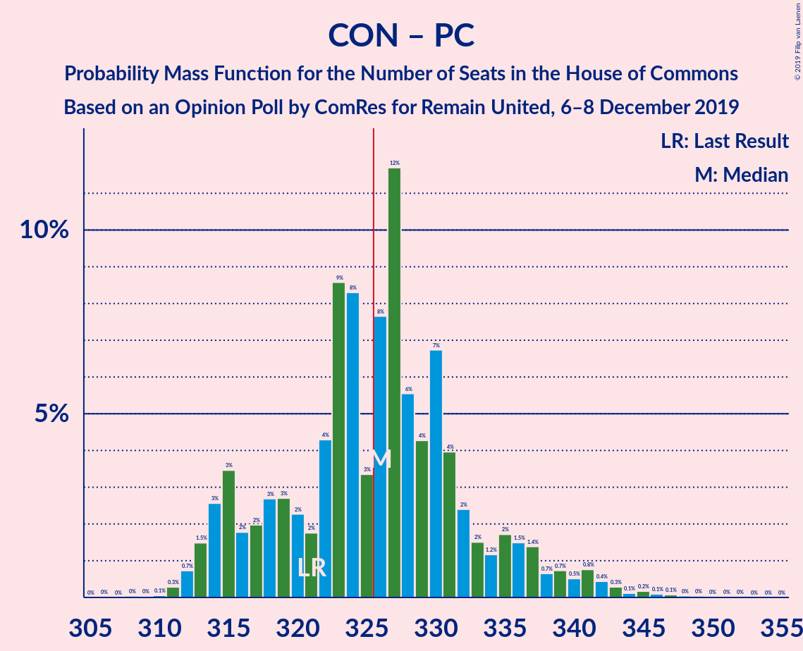

| Number of Seats | Probability | Accumulated | Special Marks |
|:---------------:|:-----------:|:-----------:|:-------------:|
| 306 | 0% | 100% |  |
| 307 | 0% | 99.9% |  |
| 308 | 0% | 99.9% |  |
| 309 | 0% | 99.9% |  |
| 310 | 0.1% | 99.9% |  |
| 311 | 0.3% | 99.8% |  |
| 312 | 0.7% | 99.5% |  |
| 313 | 1.5% | 98.8% |  |
| 314 | 3% | 97% |  |
| 315 | 3% | 95% |  |
| 316 | 2% | 91% |  |
| 317 | 2% | 89% |  |
| 318 | 3% | 88% |  |
| 319 | 3% | 85% |  |
| 320 | 2% | 82% |  |
| 321 | 2% | 80% | Last Result |
| 322 | 4% | 78% |  |
| 323 | 9% | 74% |  |
| 324 | 8% | 65% |  |
| 325 | 3% | 57% |  |
| 326 | 8% | 54% | Median, Majority |
| 327 | 12% | 46% |  |
| 328 | 6% | 34% |  |
| 329 | 4% | 29% |  |
| 330 | 7% | 24% |  |
| 331 | 4% | 18% |  |
| 332 | 2% | 14% |  |
| 333 | 2% | 11% |  |
| 334 | 1.2% | 10% |  |
| 335 | 2% | 9% |  |
| 336 | 1.5% | 7% |  |
| 337 | 1.4% | 5% |  |
| 338 | 0.7% | 4% |  |
| 339 | 0.7% | 3% |  |
| 340 | 0.5% | 3% |  |
| 341 | 0.8% | 2% |  |
| 342 | 0.4% | 1.3% |  |
| 343 | 0.3% | 0.9% |  |
| 344 | 0.1% | 0.6% |  |
| 345 | 0.2% | 0.5% |  |
| 346 | 0.1% | 0.3% |  |
| 347 | 0.1% | 0.2% |  |
| 348 | 0% | 0.2% |  |
| 349 | 0% | 0.1% |  |
| 350 | 0% | 0.1% |  |
| 351 | 0% | 0% |  |

### Conservative Party – Brexit Party

| Number of Seats | Probability | Accumulated | Special Marks |
|:---------------:|:-----------:|:-----------:|:-------------:|
| 306 | 0% | 100% |  |
| 307 | 0% | 99.9% |  |
| 308 | 0% | 99.9% |  |
| 309 | 0% | 99.9% |  |
| 310 | 0.1% | 99.8% |  |
| 311 | 0.4% | 99.8% |  |
| 312 | 0.9% | 99.4% |  |
| 313 | 2% | 98% |  |
| 314 | 3% | 97% |  |
| 315 | 3% | 94% |  |
| 316 | 2% | 91% |  |
| 317 | 2% | 89% | Last Result |
| 318 | 3% | 87% |  |
| 319 | 2% | 84% |  |
| 320 | 3% | 82% |  |
| 321 | 2% | 79% |  |
| 322 | 4% | 77% |  |
| 323 | 9% | 73% |  |
| 324 | 8% | 64% |  |
| 325 | 4% | 56% |  |
| 326 | 10% | 51% | Median, Majority |
| 327 | 10% | 41% |  |
| 328 | 4% | 31% |  |
| 329 | 4% | 27% |  |
| 330 | 6% | 23% |  |
| 331 | 4% | 17% |  |
| 332 | 2% | 13% |  |
| 333 | 1.4% | 11% |  |
| 334 | 1.3% | 9% |  |
| 335 | 2% | 8% |  |
| 336 | 1.3% | 6% |  |
| 337 | 1.3% | 5% |  |
| 338 | 0.7% | 4% |  |
| 339 | 0.8% | 3% |  |
| 340 | 0.6% | 2% |  |
| 341 | 0.6% | 2% |  |
| 342 | 0.4% | 1.2% |  |
| 343 | 0.3% | 0.9% |  |
| 344 | 0.1% | 0.6% |  |
| 345 | 0.2% | 0.5% |  |
| 346 | 0.1% | 0.3% |  |
| 347 | 0.1% | 0.2% |  |
| 348 | 0% | 0.1% |  |
| 349 | 0% | 0.1% |  |
| 350 | 0% | 0.1% |  |
| 351 | 0% | 0% |  |

### Conservative Party

| Number of Seats | Probability | Accumulated | Special Marks |
|:---------------:|:-----------:|:-----------:|:-------------:|
| 306 | 0% | 100% |  |
| 307 | 0% | 99.9% |  |
| 308 | 0% | 99.9% |  |
| 309 | 0% | 99.9% |  |
| 310 | 0.1% | 99.8% |  |
| 311 | 0.4% | 99.8% |  |
| 312 | 0.9% | 99.4% |  |
| 313 | 2% | 98% |  |
| 314 | 3% | 97% |  |
| 315 | 3% | 94% |  |
| 316 | 2% | 91% |  |
| 317 | 2% | 89% | Last Result |
| 318 | 3% | 87% |  |
| 319 | 2% | 84% |  |
| 320 | 3% | 82% |  |
| 321 | 2% | 79% |  |
| 322 | 4% | 77% |  |
| 323 | 9% | 73% |  |
| 324 | 8% | 64% |  |
| 325 | 4% | 56% |  |
| 326 | 10% | 51% | Median, Majority |
| 327 | 10% | 41% |  |
| 328 | 4% | 31% |  |
| 329 | 4% | 27% |  |
| 330 | 6% | 23% |  |
| 331 | 4% | 17% |  |
| 332 | 2% | 13% |  |
| 333 | 1.4% | 11% |  |
| 334 | 1.3% | 9% |  |
| 335 | 2% | 8% |  |
| 336 | 1.3% | 6% |  |
| 337 | 1.3% | 5% |  |
| 338 | 0.7% | 4% |  |
| 339 | 0.8% | 3% |  |
| 340 | 0.6% | 2% |  |
| 341 | 0.6% | 2% |  |
| 342 | 0.4% | 1.2% |  |
| 343 | 0.3% | 0.9% |  |
| 344 | 0.1% | 0.6% |  |
| 345 | 0.2% | 0.5% |  |
| 346 | 0.1% | 0.3% |  |
| 347 | 0.1% | 0.2% |  |
| 348 | 0% | 0.1% |  |
| 349 | 0% | 0.1% |  |
| 350 | 0% | 0.1% |  |
| 351 | 0% | 0% |  |

### Labour Party – Liberal Democrats – Scottish National Party – Green Party – Plaid Cymru

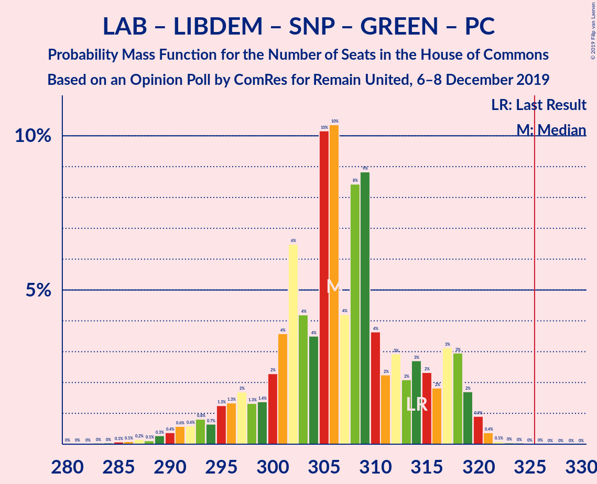

| Number of Seats | Probability | Accumulated | Special Marks |
|:---------------:|:-----------:|:-----------:|:-------------:|
| 282 | 0% | 100% |  |
| 283 | 0% | 99.9% |  |
| 284 | 0% | 99.9% |  |
| 285 | 0.1% | 99.9% |  |
| 286 | 0.1% | 99.8% |  |
| 287 | 0.2% | 99.7% |  |
| 288 | 0.1% | 99.5% |  |
| 289 | 0.3% | 99.4% |  |
| 290 | 0.4% | 99.1% |  |
| 291 | 0.6% | 98.8% |  |
| 292 | 0.6% | 98% |  |
| 293 | 0.8% | 98% |  |
| 294 | 0.7% | 97% |  |
| 295 | 1.3% | 96% |  |
| 296 | 1.3% | 95% |  |
| 297 | 2% | 94% |  |
| 298 | 1.3% | 92% |  |
| 299 | 1.4% | 91% |  |
| 300 | 2% | 89% |  |
| 301 | 4% | 87% |  |
| 302 | 6% | 83% |  |
| 303 | 4% | 77% |  |
| 304 | 4% | 73% |  |
| 305 | 10% | 69% |  |
| 306 | 10% | 59% | Median |
| 307 | 4% | 49% |  |
| 308 | 8% | 44% |  |
| 309 | 9% | 36% |  |
| 310 | 4% | 27% |  |
| 311 | 2% | 23% |  |
| 312 | 3% | 21% |  |
| 313 | 2% | 18% |  |
| 314 | 3% | 16% | Last Result |
| 315 | 2% | 13% |  |
| 316 | 2% | 11% |  |
| 317 | 3% | 9% |  |
| 318 | 3% | 6% |  |
| 319 | 2% | 3% |  |
| 320 | 0.9% | 2% |  |
| 321 | 0.4% | 0.6% |  |
| 322 | 0.1% | 0.2% |  |
| 323 | 0% | 0.2% |  |
| 324 | 0% | 0.1% |  |
| 325 | 0% | 0.1% |  |
| 326 | 0% | 0.1% | Majority |
| 327 | 0% | 0% |  |

### Labour Party – Liberal Democrats – Scottish National Party – Plaid Cymru

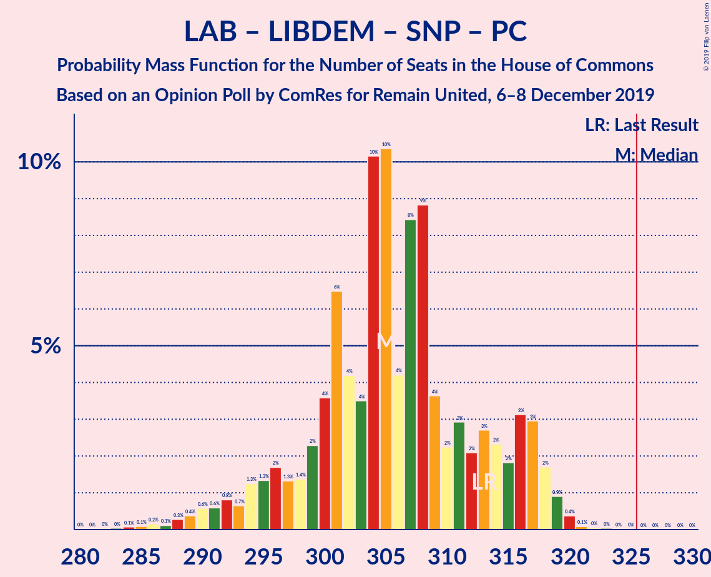

| Number of Seats | Probability | Accumulated | Special Marks |
|:---------------:|:-----------:|:-----------:|:-------------:|
| 281 | 0% | 100% |  |
| 282 | 0% | 99.9% |  |
| 283 | 0% | 99.9% |  |
| 284 | 0.1% | 99.9% |  |
| 285 | 0.1% | 99.8% |  |
| 286 | 0.2% | 99.7% |  |
| 287 | 0.1% | 99.5% |  |
| 288 | 0.3% | 99.4% |  |
| 289 | 0.4% | 99.1% |  |
| 290 | 0.6% | 98.8% |  |
| 291 | 0.6% | 98% |  |
| 292 | 0.8% | 98% |  |
| 293 | 0.7% | 97% |  |
| 294 | 1.3% | 96% |  |
| 295 | 1.3% | 95% |  |
| 296 | 2% | 94% |  |
| 297 | 1.3% | 92% |  |
| 298 | 1.4% | 91% |  |
| 299 | 2% | 89% |  |
| 300 | 4% | 87% |  |
| 301 | 6% | 83% |  |
| 302 | 4% | 77% |  |
| 303 | 4% | 73% |  |
| 304 | 10% | 69% |  |
| 305 | 10% | 59% | Median |
| 306 | 4% | 49% |  |
| 307 | 8% | 44% |  |
| 308 | 9% | 36% |  |
| 309 | 4% | 27% |  |
| 310 | 2% | 23% |  |
| 311 | 3% | 21% |  |
| 312 | 2% | 18% |  |
| 313 | 3% | 16% | Last Result |
| 314 | 2% | 13% |  |
| 315 | 2% | 11% |  |
| 316 | 3% | 9% |  |
| 317 | 3% | 6% |  |
| 318 | 2% | 3% |  |
| 319 | 0.9% | 2% |  |
| 320 | 0.4% | 0.6% |  |
| 321 | 0.1% | 0.2% |  |
| 322 | 0% | 0.2% |  |
| 323 | 0% | 0.1% |  |
| 324 | 0% | 0.1% |  |
| 325 | 0% | 0.1% |  |
| 326 | 0% | 0% | Majority |

### Labour Party – Liberal Democrats – Scottish National Party

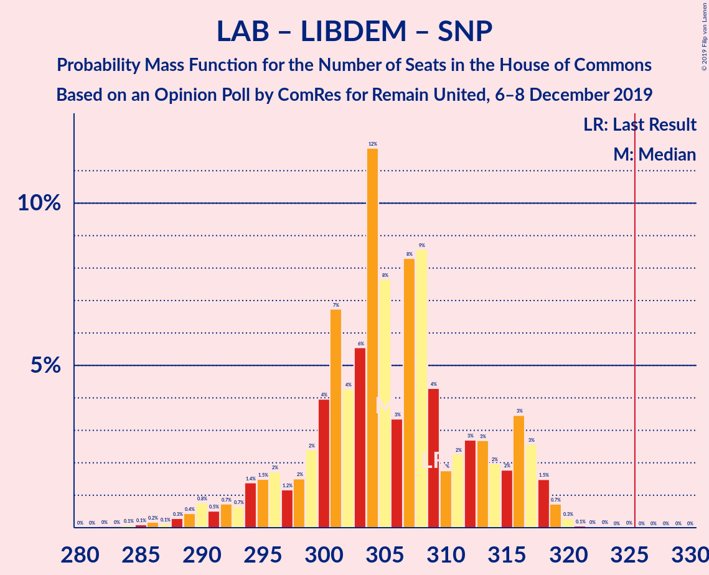

| Number of Seats | Probability | Accumulated | Special Marks |
|:---------------:|:-----------:|:-----------:|:-------------:|
| 281 | 0% | 100% |  |
| 282 | 0% | 99.9% |  |
| 283 | 0% | 99.9% |  |
| 284 | 0.1% | 99.8% |  |
| 285 | 0.1% | 99.8% |  |
| 286 | 0.2% | 99.7% |  |
| 287 | 0.1% | 99.5% |  |
| 288 | 0.3% | 99.4% |  |
| 289 | 0.4% | 99.1% |  |
| 290 | 0.8% | 98.7% |  |
| 291 | 0.5% | 98% |  |
| 292 | 0.7% | 97% |  |
| 293 | 0.7% | 97% |  |
| 294 | 1.4% | 96% |  |
| 295 | 1.5% | 95% |  |
| 296 | 2% | 93% |  |
| 297 | 1.2% | 91% |  |
| 298 | 2% | 90% |  |
| 299 | 2% | 89% |  |
| 300 | 4% | 86% |  |
| 301 | 7% | 82% |  |
| 302 | 4% | 76% |  |
| 303 | 6% | 71% |  |
| 304 | 12% | 66% |  |
| 305 | 8% | 54% | Median |
| 306 | 3% | 46% |  |
| 307 | 8% | 43% |  |
| 308 | 9% | 35% |  |
| 309 | 4% | 26% | Last Result |
| 310 | 2% | 22% |  |
| 311 | 2% | 20% |  |
| 312 | 3% | 18% |  |
| 313 | 3% | 15% |  |
| 314 | 2% | 12% |  |
| 315 | 2% | 11% |  |
| 316 | 3% | 9% |  |
| 317 | 3% | 5% |  |
| 318 | 1.5% | 3% |  |
| 319 | 0.7% | 1.2% |  |
| 320 | 0.3% | 0.5% |  |
| 321 | 0.1% | 0.2% |  |
| 322 | 0% | 0.1% |  |
| 323 | 0% | 0.1% |  |
| 324 | 0% | 0.1% |  |
| 325 | 0% | 0.1% |  |
| 326 | 0% | 0% | Majority |

### Labour Party – Scottish National Party – Plaid Cymru

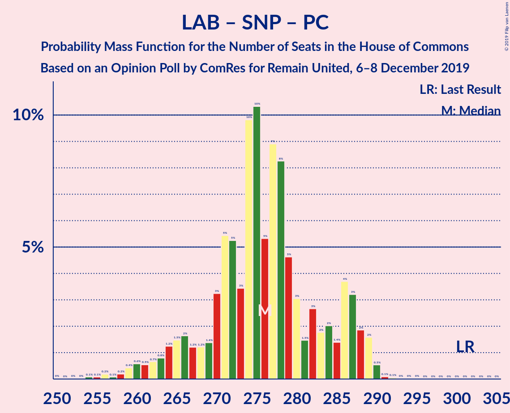

| Number of Seats | Probability | Accumulated | Special Marks |
|:---------------:|:-----------:|:-----------:|:-------------:|
| 252 | 0% | 100% |  |
| 253 | 0% | 99.9% |  |
| 254 | 0.1% | 99.9% |  |
| 255 | 0.1% | 99.8% |  |
| 256 | 0.2% | 99.8% |  |
| 257 | 0.1% | 99.6% |  |
| 258 | 0.2% | 99.5% |  |
| 259 | 0.4% | 99.3% |  |
| 260 | 0.6% | 98.9% |  |
| 261 | 0.5% | 98% |  |
| 262 | 0.7% | 98% |  |
| 263 | 0.8% | 97% |  |
| 264 | 1.2% | 96% |  |
| 265 | 1.5% | 95% |  |
| 266 | 2% | 94% |  |
| 267 | 1.2% | 92% |  |
| 268 | 1.2% | 91% |  |
| 269 | 1.4% | 90% |  |
| 270 | 3% | 88% |  |
| 271 | 5% | 85% |  |
| 272 | 5% | 79% |  |
| 273 | 3% | 74% |  |
| 274 | 10% | 71% |  |
| 275 | 10% | 61% | Median |
| 276 | 5% | 51% |  |
| 277 | 9% | 45% |  |
| 278 | 8% | 36% |  |
| 279 | 5% | 28% |  |
| 280 | 3% | 24% |  |
| 281 | 1.5% | 20% |  |
| 282 | 3% | 19% |  |
| 283 | 2% | 16% |  |
| 284 | 2% | 15% |  |
| 285 | 1.4% | 13% |  |
| 286 | 4% | 11% |  |
| 287 | 3% | 7% |  |
| 288 | 2% | 4% |  |
| 289 | 2% | 2% |  |
| 290 | 0.5% | 0.8% |  |
| 291 | 0.1% | 0.3% |  |
| 292 | 0.1% | 0.2% |  |
| 293 | 0% | 0.1% |  |
| 294 | 0% | 0.1% |  |
| 295 | 0% | 0.1% |  |
| 296 | 0% | 0% |  |
| 297 | 0% | 0% |  |
| 298 | 0% | 0% |  |
| 299 | 0% | 0% |  |
| 300 | 0% | 0% |  |
| 301 | 0% | 0% | Last Result |

### Labour Party – Scottish National Party

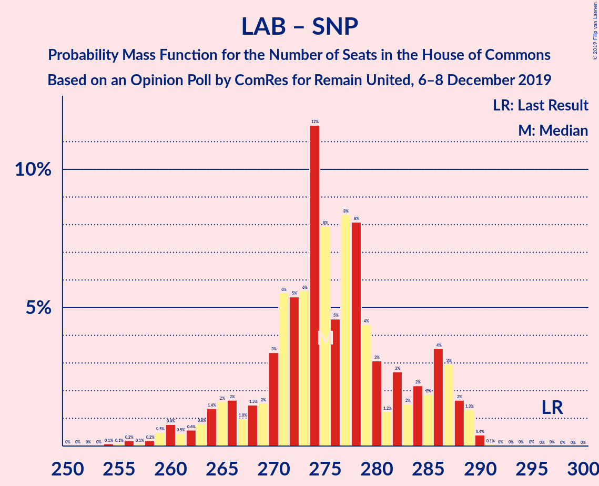

| Number of Seats | Probability | Accumulated | Special Marks |
|:---------------:|:-----------:|:-----------:|:-------------:|
| 251 | 0% | 100% |  |
| 252 | 0% | 99.9% |  |
| 253 | 0% | 99.9% |  |
| 254 | 0.1% | 99.9% |  |
| 255 | 0.1% | 99.8% |  |
| 256 | 0.2% | 99.7% |  |
| 257 | 0.1% | 99.5% |  |
| 258 | 0.2% | 99.5% |  |
| 259 | 0.5% | 99.3% |  |
| 260 | 0.8% | 98.8% |  |
| 261 | 0.5% | 98% |  |
| 262 | 0.6% | 98% |  |
| 263 | 0.8% | 97% |  |
| 264 | 1.4% | 96% |  |
| 265 | 2% | 95% |  |
| 266 | 2% | 93% |  |
| 267 | 1.0% | 92% |  |
| 268 | 1.5% | 91% |  |
| 269 | 2% | 89% |  |
| 270 | 3% | 88% |  |
| 271 | 6% | 84% |  |
| 272 | 5% | 79% |  |
| 273 | 6% | 73% |  |
| 274 | 12% | 68% |  |
| 275 | 8% | 56% | Median |
| 276 | 5% | 48% |  |
| 277 | 8% | 43% |  |
| 278 | 8% | 35% |  |
| 279 | 4% | 27% |  |
| 280 | 3% | 23% |  |
| 281 | 1.2% | 20% |  |
| 282 | 3% | 18% |  |
| 283 | 2% | 16% |  |
| 284 | 2% | 14% |  |
| 285 | 2% | 12% |  |
| 286 | 4% | 10% |  |
| 287 | 3% | 7% |  |
| 288 | 2% | 4% |  |
| 289 | 1.3% | 2% |  |
| 290 | 0.4% | 0.6% |  |
| 291 | 0.1% | 0.2% |  |
| 292 | 0% | 0.1% |  |
| 293 | 0% | 0.1% |  |
| 294 | 0% | 0.1% |  |
| 295 | 0% | 0.1% |  |
| 296 | 0% | 0% |  |
| 297 | 0% | 0% | Last Result |

### Labour Party – Liberal Democrats – Plaid Cymru

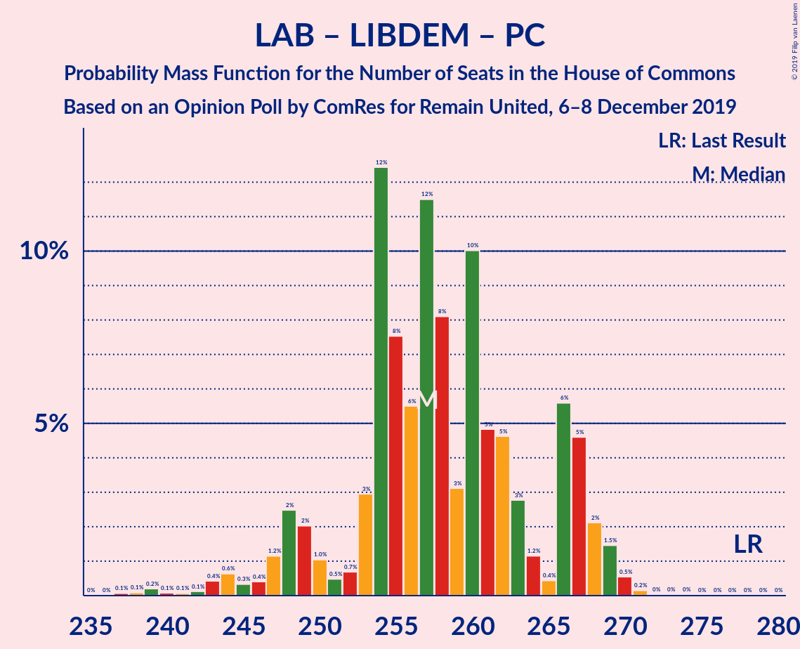

| Number of Seats | Probability | Accumulated | Special Marks |
|:---------------:|:-----------:|:-----------:|:-------------:|
| 237 | 0.1% | 100% |  |
| 238 | 0.1% | 99.9% |  |
| 239 | 0.2% | 99.8% |  |
| 240 | 0.1% | 99.6% |  |
| 241 | 0.1% | 99.5% |  |
| 242 | 0.1% | 99.5% |  |
| 243 | 0.4% | 99.3% |  |
| 244 | 0.6% | 98.9% |  |
| 245 | 0.3% | 98% |  |
| 246 | 0.4% | 98% |  |
| 247 | 1.2% | 98% |  |
| 248 | 2% | 96% |  |
| 249 | 2% | 94% |  |
| 250 | 1.0% | 92% |  |
| 251 | 0.5% | 91% |  |
| 252 | 0.7% | 90% |  |
| 253 | 3% | 90% |  |
| 254 | 12% | 87% |  |
| 255 | 8% | 74% |  |
| 256 | 6% | 67% |  |
| 257 | 12% | 61% | Median |
| 258 | 8% | 50% |  |
| 259 | 3% | 42% |  |
| 260 | 10% | 38% |  |
| 261 | 5% | 28% |  |
| 262 | 5% | 24% |  |
| 263 | 3% | 19% |  |
| 264 | 1.2% | 16% |  |
| 265 | 0.4% | 15% |  |
| 266 | 6% | 15% |  |
| 267 | 5% | 9% |  |
| 268 | 2% | 4% |  |
| 269 | 1.5% | 2% |  |
| 270 | 0.5% | 0.9% |  |
| 271 | 0.2% | 0.3% |  |
| 272 | 0% | 0.2% |  |
| 273 | 0% | 0.1% |  |
| 274 | 0% | 0.1% |  |
| 275 | 0% | 0.1% |  |
| 276 | 0% | 0.1% |  |
| 277 | 0% | 0% |  |
| 278 | 0% | 0% | Last Result |

### Labour Party – Liberal Democrats

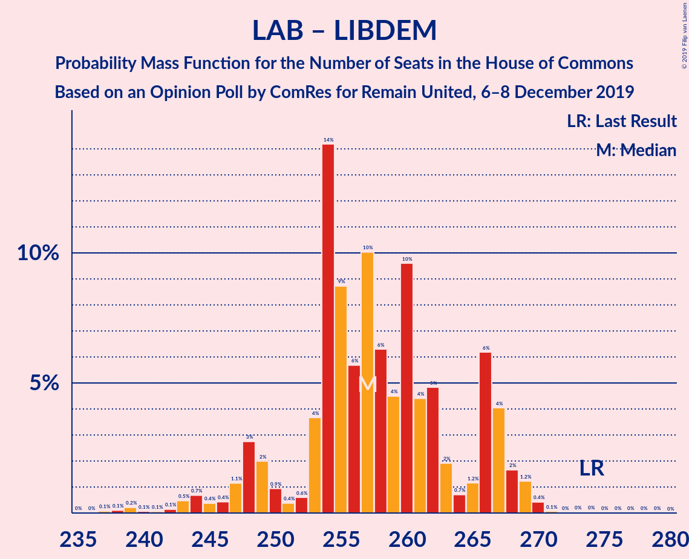

| Number of Seats | Probability | Accumulated | Special Marks |
|:---------------:|:-----------:|:-----------:|:-------------:|
| 237 | 0.1% | 100% |  |
| 238 | 0.1% | 99.9% |  |
| 239 | 0.2% | 99.8% |  |
| 240 | 0.1% | 99.6% |  |
| 241 | 0.1% | 99.5% |  |
| 242 | 0.1% | 99.4% |  |
| 243 | 0.5% | 99.3% |  |
| 244 | 0.7% | 98.8% |  |
| 245 | 0.4% | 98% |  |
| 246 | 0.4% | 98% |  |
| 247 | 1.1% | 97% |  |
| 248 | 3% | 96% |  |
| 249 | 2% | 93% |  |
| 250 | 0.9% | 91% |  |
| 251 | 0.4% | 90% |  |
| 252 | 0.6% | 90% |  |
| 253 | 4% | 89% |  |
| 254 | 14% | 86% |  |
| 255 | 9% | 72% |  |
| 256 | 6% | 63% |  |
| 257 | 10% | 57% | Median |
| 258 | 6% | 47% |  |
| 259 | 4% | 41% |  |
| 260 | 10% | 36% |  |
| 261 | 4% | 27% |  |
| 262 | 5% | 22% |  |
| 263 | 2% | 18% |  |
| 264 | 0.7% | 16% |  |
| 265 | 1.2% | 15% |  |
| 266 | 6% | 14% |  |
| 267 | 4% | 8% |  |
| 268 | 2% | 4% |  |
| 269 | 1.2% | 2% |  |
| 270 | 0.4% | 0.6% |  |
| 271 | 0.1% | 0.2% |  |
| 272 | 0% | 0.2% |  |
| 273 | 0% | 0.1% |  |
| 274 | 0% | 0.1% | Last Result |
| 275 | 0% | 0.1% |  |
| 276 | 0% | 0.1% |  |
| 277 | 0% | 0% |  |

### Labour Party – Plaid Cymru

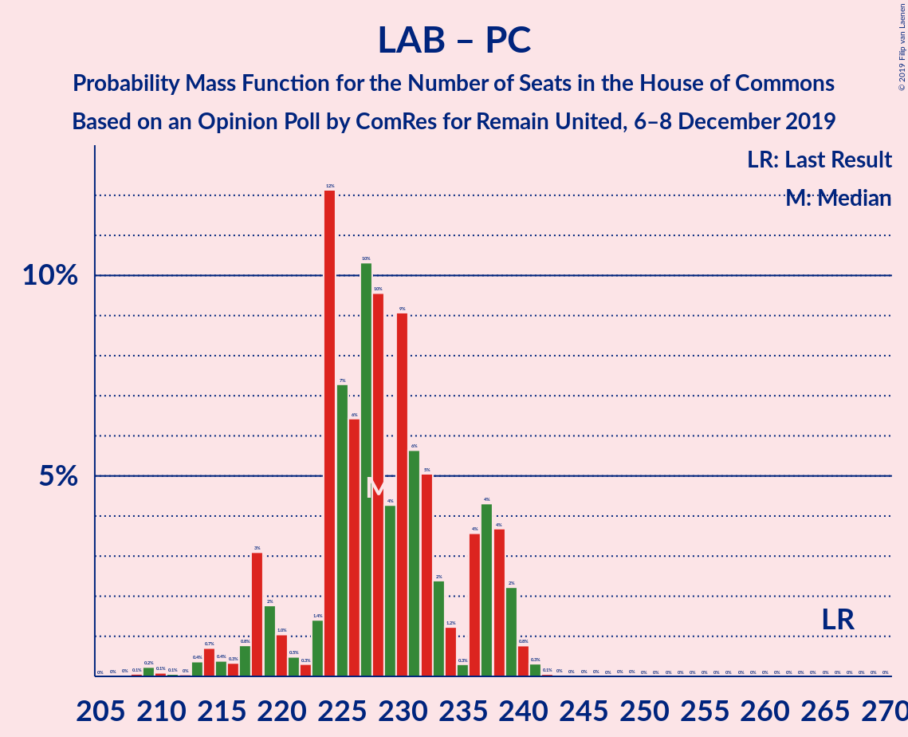

| Number of Seats | Probability | Accumulated | Special Marks |
|:---------------:|:-----------:|:-----------:|:-------------:|
| 207 | 0% | 100% |  |
| 208 | 0.1% | 99.9% |  |
| 209 | 0.2% | 99.9% |  |
| 210 | 0.1% | 99.6% |  |
| 211 | 0.1% | 99.6% |  |
| 212 | 0% | 99.5% |  |
| 213 | 0.4% | 99.5% |  |
| 214 | 0.7% | 99.1% |  |
| 215 | 0.4% | 98% |  |
| 216 | 0.3% | 98% |  |
| 217 | 0.8% | 98% |  |
| 218 | 3% | 97% |  |
| 219 | 2% | 94% |  |
| 220 | 1.0% | 92% |  |
| 221 | 0.5% | 91% |  |
| 222 | 0.3% | 90% |  |
| 223 | 1.4% | 90% |  |
| 224 | 12% | 89% |  |
| 225 | 7% | 77% |  |
| 226 | 6% | 69% |  |
| 227 | 10% | 63% | Median |
| 228 | 10% | 53% |  |
| 229 | 4% | 43% |  |
| 230 | 9% | 39% |  |
| 231 | 6% | 30% |  |
| 232 | 5% | 24% |  |
| 233 | 2% | 19% |  |
| 234 | 1.2% | 17% |  |
| 235 | 0.3% | 15% |  |
| 236 | 4% | 15% |  |
| 237 | 4% | 12% |  |
| 238 | 4% | 7% |  |
| 239 | 2% | 4% |  |
| 240 | 0.8% | 1.3% |  |
| 241 | 0.3% | 0.5% |  |
| 242 | 0.1% | 0.2% |  |
| 243 | 0% | 0.1% |  |
| 244 | 0% | 0.1% |  |
| 245 | 0% | 0.1% |  |
| 246 | 0% | 0.1% |  |
| 247 | 0% | 0% |  |
| 248 | 0% | 0% |  |
| 249 | 0% | 0% |  |
| 250 | 0% | 0% |  |
| 251 | 0% | 0% |  |
| 252 | 0% | 0% |  |
| 253 | 0% | 0% |  |
| 254 | 0% | 0% |  |
| 255 | 0% | 0% |  |
| 256 | 0% | 0% |  |
| 257 | 0% | 0% |  |
| 258 | 0% | 0% |  |
| 259 | 0% | 0% |  |
| 260 | 0% | 0% |  |
| 261 | 0% | 0% |  |
| 262 | 0% | 0% |  |
| 263 | 0% | 0% |  |
| 264 | 0% | 0% |  |
| 265 | 0% | 0% |  |
| 266 | 0% | 0% | Last Result |

### Labour Party

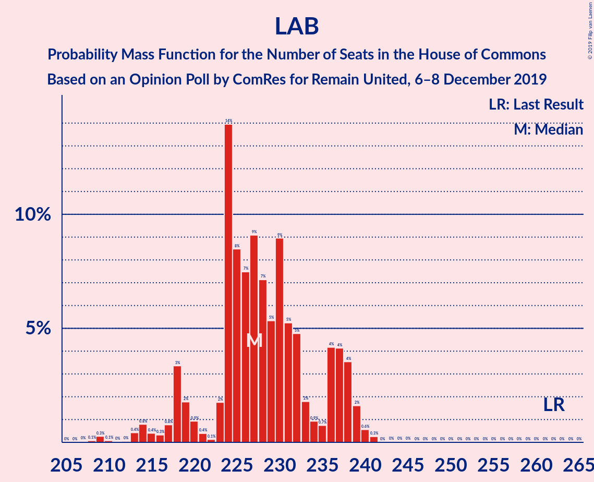

| Number of Seats | Probability | Accumulated | Special Marks |
|:---------------:|:-----------:|:-----------:|:-------------:|
| 207 | 0% | 100% |  |
| 208 | 0.1% | 99.9% |  |
| 209 | 0.3% | 99.9% |  |
| 210 | 0.1% | 99.6% |  |
| 211 | 0% | 99.5% |  |
| 212 | 0% | 99.5% |  |
| 213 | 0.4% | 99.4% |  |
| 214 | 0.8% | 99.0% |  |
| 215 | 0.4% | 98% |  |
| 216 | 0.3% | 98% |  |
| 217 | 0.8% | 97% |  |
| 218 | 3% | 97% |  |
| 219 | 2% | 93% |  |
| 220 | 0.9% | 92% |  |
| 221 | 0.4% | 91% |  |
| 222 | 0.1% | 90% |  |
| 223 | 2% | 90% |  |
| 224 | 14% | 88% |  |
| 225 | 8% | 74% |  |
| 226 | 7% | 66% |  |
| 227 | 9% | 58% | Median |
| 228 | 7% | 49% |  |
| 229 | 5% | 42% |  |
| 230 | 9% | 37% |  |
| 231 | 5% | 28% |  |
| 232 | 5% | 23% |  |
| 233 | 2% | 18% |  |
| 234 | 0.9% | 16% |  |
| 235 | 0.7% | 15% |  |
| 236 | 4% | 14% |  |
| 237 | 4% | 10% |  |
| 238 | 4% | 6% |  |
| 239 | 2% | 3% |  |
| 240 | 0.6% | 1.0% |  |
| 241 | 0.3% | 0.4% |  |
| 242 | 0% | 0.2% |  |
| 243 | 0% | 0.1% |  |
| 244 | 0% | 0.1% |  |
| 245 | 0% | 0.1% |  |
| 246 | 0% | 0.1% |  |
| 247 | 0% | 0% |  |
| 248 | 0% | 0% |  |
| 249 | 0% | 0% |  |
| 250 | 0% | 0% |  |
| 251 | 0% | 0% |  |
| 252 | 0% | 0% |  |
| 253 | 0% | 0% |  |
| 254 | 0% | 0% |  |
| 255 | 0% | 0% |  |
| 256 | 0% | 0% |  |
| 257 | 0% | 0% |  |
| 258 | 0% | 0% |  |
| 259 | 0% | 0% |  |
| 260 | 0% | 0% |  |
| 261 | 0% | 0% |  |
| 262 | 0% | 0% | Last Result |

## Technical Information

### Opinion Poll

+ **Polling firm:** ComRes
+ **Commissioner(s):** Remain United
+ **Fieldwork period:** 6–8 December 2019

### Calculations

+ **Sample size:** 6073
+ **Simulations done:** 1,048,576
+ **Error estimate:** 0.37%

