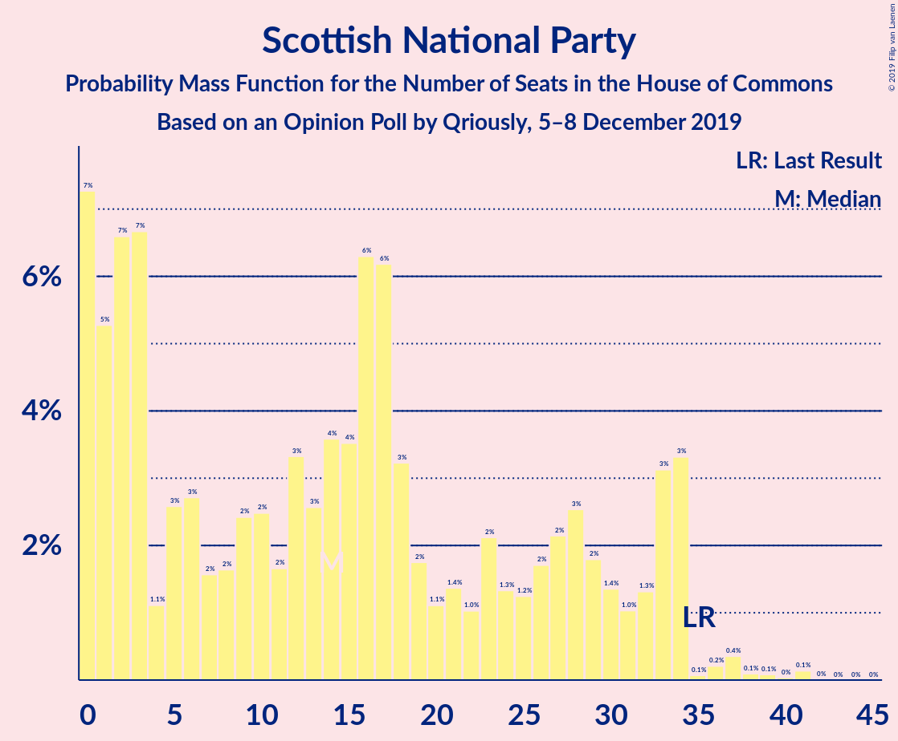
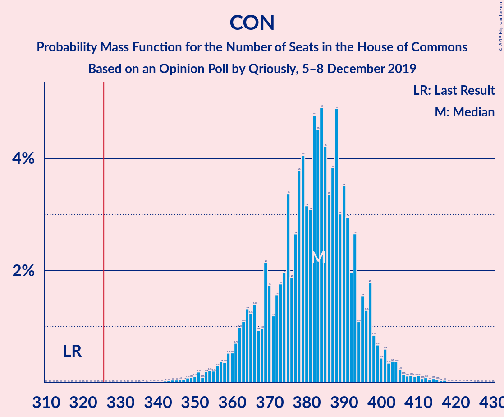
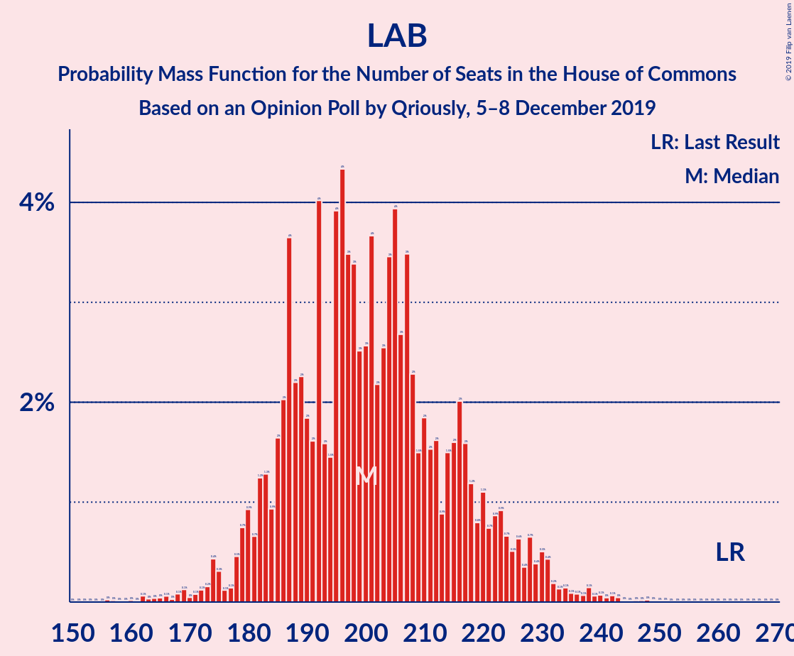

# Opinion Poll by Qriously, 5–8 December 2019

<a href="#voting-intentions">Voting Intentions</a> | <a href="#seats">Seats</a> | <a href="#coalitions">Coalitions</a> | <a href="#technical-information">Technical Information</a>

## Voting Intentions

### Confidence Intervals

| Party | Last Result | Poll Result | 80% Confidence Interval | 90% Confidence Interval | 95% Confidence Interval | 99% Confidence Interval |
|:-----:|:-----------:|:-----------:|:-----------------------:|:-----------------------:|:-----------------------:|:-----------------------:|
| Conservative Party | 43.4% | 43.4% | 42.1–44.8% |41.7–45.2% |41.4–45.5% |40.7–46.2% |
| Labour Party | 41.0% | 30.3% | 29.1–31.6% |28.7–31.9% |28.4–32.2% |27.8–32.9% |
| Liberal Democrats | 7.6% | 12.1% | 11.2–13.0% |11.0–13.3% |10.8–13.5% |10.4–14.0% |
| Green Party | 1.7% | 4.1% | 3.6–4.6% |3.4–4.8% |3.3–5.0% |3.1–5.3% |
| Brexit Party | 0.0% | 3.0% | 2.6–3.5% |2.5–3.7% |2.4–3.8% |2.2–4.1% |
| Scottish National Party | 3.1% | 2.0% | 1.7–2.5% |1.6–2.6% |1.5–2.7% |1.4–2.9% |

*Note:* The poll result column reflects the actual value used in the calculations. Published results may vary slightly, and in addition be rounded to fewer digits.

## Seats

### Confidence Intervals

| Party | Last Result | Median | 80% Confidence Interval | 90% Confidence Interval | 95% Confidence Interval | 99% Confidence Interval |
|:-----:|:-----------:|:------:|:-----------------------:|:-----------------------:|:-----------------------:|:-----------------------:|
| <a href="#conservative-party">Conservative Party</a> | 317 | 383 | 366–394 |362–398 |358–401 |349–411 |
| <a href="#labour-party">Labour Party</a> | 262 | 200 | 186–218 |182–224 |179–229 |169–238 |
| <a href="#liberal-democrats">Liberal Democrats</a> | 12 | 31 | 30–32 |29–33 |28–35 |26–37 |
| <a href="#green-party">Green Party</a> | 1 | 1 | 1–2 |1–2 |1–3 |1–3 |
| <a href="#brexit-party">Brexit Party</a> | 0 | 0 | 0 |0 |0 |0 |
| <a href="#scottish-national-party">Scottish National Party</a> | 35 | 14 | 1–30 |0–33 |0–34 |0–37 |

### Conservative Party

*For a full overview of the results for this party, see the [Conservative Party](party-conservativeparty.html) page.*

| Number of Seats | Probability | Accumulated | Special Marks |
|:---------------:|:-----------:|:-----------:|:-------------:|
| 317 | 0% | 100% | Last Result |
| 318 | 0% | 100% |  |
| 319 | 0% | 100% |  |
| 320 | 0% | 100% |  |
| 321 | 0% | 100% |  |
| 322 | 0% | 100% |  |
| 323 | 0% | 100% |  |
| 324 | 0% | 100% |  |
| 325 | 0% | 100% |  |
| 326 | 0% | 100% | Majority |
| 327 | 0% | 100% |  |
| 328 | 0% | 100% |  |
| 329 | 0% | 100% |  |
| 330 | 0% | 100% |  |
| 331 | 0% | 100% |  |
| 332 | 0% | 100% |  |
| 333 | 0% | 100% |  |
| 334 | 0% | 100% |  |
| 335 | 0% | 100% |  |
| 336 | 0% | 100% |  |
| 337 | 0% | 100% |  |
| 338 | 0% | 100% |  |
| 339 | 0% | 100% |  |
| 340 | 0% | 99.9% |  |
| 341 | 0% | 99.9% |  |
| 342 | 0% | 99.9% |  |
| 343 | 0% | 99.9% |  |
| 344 | 0% | 99.9% |  |
| 345 | 0% | 99.8% |  |
| 346 | 0.1% | 99.8% |  |
| 347 | 0.1% | 99.7% |  |
| 348 | 0.1% | 99.6% |  |
| 349 | 0.1% | 99.6% |  |
| 350 | 0.1% | 99.5% |  |
| 351 | 0.2% | 99.4% |  |
| 352 | 0.1% | 99.2% |  |
| 353 | 0.2% | 99.1% |  |
| 354 | 0.2% | 98.9% |  |
| 355 | 0.2% | 98.7% |  |
| 356 | 0.3% | 98% |  |
| 357 | 0.4% | 98% |  |
| 358 | 0.4% | 98% |  |
| 359 | 0.5% | 97% |  |
| 360 | 0.5% | 97% |  |
| 361 | 0.7% | 96% |  |
| 362 | 1.0% | 96% |  |
| 363 | 1.1% | 95% |  |
| 364 | 1.3% | 94% |  |
| 365 | 1.2% | 92% |  |
| 366 | 1.4% | 91% |  |
| 367 | 0.9% | 90% |  |
| 368 | 1.0% | 89% |  |
| 369 | 2% | 88% |  |
| 370 | 2% | 86% |  |
| 371 | 1.2% | 84% |  |
| 372 | 2% | 83% |  |
| 373 | 2% | 81% |  |
| 374 | 2% | 79% |  |
| 375 | 3% | 77% |  |
| 376 | 2% | 74% |  |
| 377 | 3% | 72% |  |
| 378 | 4% | 69% |  |
| 379 | 4% | 66% |  |
| 380 | 3% | 62% |  |
| 381 | 3% | 58% |  |
| 382 | 5% | 55% |  |
| 383 | 5% | 51% | Median |
| 384 | 5% | 46% |  |
| 385 | 4% | 41% |  |
| 386 | 3% | 37% |  |
| 387 | 4% | 34% |  |
| 388 | 5% | 30% |  |
| 389 | 3% | 25% |  |
| 390 | 4% | 22% |  |
| 391 | 3% | 18% |  |
| 392 | 2% | 15% |  |
| 393 | 3% | 13% |  |
| 394 | 1.1% | 11% |  |
| 395 | 2% | 10% |  |
| 396 | 1.3% | 8% |  |
| 397 | 2% | 7% |  |
| 398 | 0.8% | 5% |  |
| 399 | 0.7% | 4% |  |
| 400 | 0.4% | 4% |  |
| 401 | 0.6% | 3% |  |
| 402 | 0.3% | 2% |  |
| 403 | 0.4% | 2% |  |
| 404 | 0.4% | 2% |  |
| 405 | 0.2% | 1.4% |  |
| 406 | 0.1% | 1.2% |  |
| 407 | 0.1% | 1.0% |  |
| 408 | 0.1% | 0.9% |  |
| 409 | 0.1% | 0.8% |  |
| 410 | 0.1% | 0.7% |  |
| 411 | 0.1% | 0.5% |  |
| 412 | 0.1% | 0.5% |  |
| 413 | 0% | 0.4% |  |
| 414 | 0.1% | 0.3% |  |
| 415 | 0.1% | 0.2% |  |
| 416 | 0% | 0.2% |  |
| 417 | 0% | 0.2% |  |
| 418 | 0% | 0.1% |  |
| 419 | 0% | 0.1% |  |
| 420 | 0% | 0.1% |  |
| 421 | 0% | 0.1% |  |
| 422 | 0% | 0% |  |

### Labour Party

*For a full overview of the results for this party, see the [Labour Party](party-labourparty.html) page.*

| Number of Seats | Probability | Accumulated | Special Marks |
|:---------------:|:-----------:|:-----------:|:-------------:|
| 157 | 0% | 100% |  |
| 158 | 0% | 99.9% |  |
| 159 | 0% | 99.9% |  |
| 160 | 0% | 99.9% |  |
| 161 | 0% | 99.9% |  |
| 162 | 0.1% | 99.9% |  |
| 163 | 0% | 99.8% |  |
| 164 | 0% | 99.8% |  |
| 165 | 0% | 99.8% |  |
| 166 | 0.1% | 99.7% |  |
| 167 | 0% | 99.7% |  |
| 168 | 0.1% | 99.6% |  |
| 169 | 0.1% | 99.6% |  |
| 170 | 0% | 99.4% |  |
| 171 | 0.1% | 99.4% |  |
| 172 | 0.1% | 99.3% |  |
| 173 | 0.2% | 99.2% |  |
| 174 | 0.4% | 99.0% |  |
| 175 | 0.3% | 98.6% |  |
| 176 | 0.1% | 98% |  |
| 177 | 0.1% | 98% |  |
| 178 | 0.5% | 98% |  |
| 179 | 0.7% | 98% |  |
| 180 | 0.9% | 97% |  |
| 181 | 0.7% | 96% |  |
| 182 | 1.2% | 95% |  |
| 183 | 1.3% | 94% |  |
| 184 | 0.9% | 93% |  |
| 185 | 2% | 92% |  |
| 186 | 2% | 90% |  |
| 187 | 4% | 88% |  |
| 188 | 2% | 84% |  |
| 189 | 2% | 82% |  |
| 190 | 2% | 80% |  |
| 191 | 2% | 78% |  |
| 192 | 4% | 77% |  |
| 193 | 2% | 73% |  |
| 194 | 1.5% | 71% |  |
| 195 | 4% | 69% |  |
| 196 | 4% | 66% |  |
| 197 | 3% | 61% |  |
| 198 | 3% | 58% |  |
| 199 | 3% | 54% |  |
| 200 | 3% | 52% | Median |
| 201 | 4% | 49% |  |
| 202 | 2% | 46% |  |
| 203 | 3% | 43% |  |
| 204 | 3% | 41% |  |
| 205 | 4% | 37% |  |
| 206 | 3% | 33% |  |
| 207 | 3% | 31% |  |
| 208 | 2% | 27% |  |
| 209 | 1.5% | 25% |  |
| 210 | 2% | 24% |  |
| 211 | 2% | 22% |  |
| 212 | 2% | 20% |  |
| 213 | 0.9% | 19% |  |
| 214 | 1.5% | 18% |  |
| 215 | 2% | 16% |  |
| 216 | 2% | 15% |  |
| 217 | 2% | 13% |  |
| 218 | 1.2% | 11% |  |
| 219 | 0.8% | 10% |  |
| 220 | 1.1% | 9% |  |
| 221 | 0.7% | 8% |  |
| 222 | 0.9% | 7% |  |
| 223 | 0.9% | 6% |  |
| 224 | 0.7% | 5% |  |
| 225 | 0.5% | 5% |  |
| 226 | 0.6% | 4% |  |
| 227 | 0.4% | 4% |  |
| 228 | 0.7% | 3% |  |
| 229 | 0.4% | 3% |  |
| 230 | 0.5% | 2% |  |
| 231 | 0.4% | 2% |  |
| 232 | 0.2% | 1.2% |  |
| 233 | 0.1% | 1.1% |  |
| 234 | 0.1% | 0.9% |  |
| 235 | 0.1% | 0.8% |  |
| 236 | 0.1% | 0.7% |  |
| 237 | 0.1% | 0.6% |  |
| 238 | 0.1% | 0.5% |  |
| 239 | 0.1% | 0.4% |  |
| 240 | 0.1% | 0.3% |  |
| 241 | 0% | 0.3% |  |
| 242 | 0.1% | 0.2% |  |
| 243 | 0% | 0.2% |  |
| 244 | 0% | 0.1% |  |
| 245 | 0% | 0.1% |  |
| 246 | 0% | 0.1% |  |
| 247 | 0% | 0.1% |  |
| 248 | 0% | 0.1% |  |
| 249 | 0% | 0% |  |
| 250 | 0% | 0% |  |
| 251 | 0% | 0% |  |
| 252 | 0% | 0% |  |
| 253 | 0% | 0% |  |
| 254 | 0% | 0% |  |
| 255 | 0% | 0% |  |
| 256 | 0% | 0% |  |
| 257 | 0% | 0% |  |
| 258 | 0% | 0% |  |
| 259 | 0% | 0% |  |
| 260 | 0% | 0% |  |
| 261 | 0% | 0% |  |
| 262 | 0% | 0% | Last Result |

### Liberal Democrats

*For a full overview of the results for this party, see the [Liberal Democrats](party-liberaldemocrats.html) page.*

| Number of Seats | Probability | Accumulated | Special Marks |
|:---------------:|:-----------:|:-----------:|:-------------:|
| 12 | 0% | 100% | Last Result |
| 13 | 0% | 100% |  |
| 14 | 0% | 100% |  |
| 15 | 0% | 100% |  |
| 16 | 0% | 100% |  |
| 17 | 0% | 100% |  |
| 18 | 0% | 100% |  |
| 19 | 0% | 100% |  |
| 20 | 0% | 100% |  |
| 21 | 0% | 100% |  |
| 22 | 0% | 100% |  |
| 23 | 0% | 100% |  |
| 24 | 0.1% | 99.9% |  |
| 25 | 0.2% | 99.8% |  |
| 26 | 0.3% | 99.6% |  |
| 27 | 0.9% | 99.4% |  |
| 28 | 1.4% | 98.5% |  |
| 29 | 7% | 97% |  |
| 30 | 11% | 90% |  |
| 31 | 50% | 79% | Median |
| 32 | 20% | 30% |  |
| 33 | 7% | 10% |  |
| 34 | 0.4% | 3% |  |
| 35 | 2% | 3% |  |
| 36 | 0.1% | 0.6% |  |
| 37 | 0.3% | 0.5% |  |
| 38 | 0.1% | 0.2% |  |
| 39 | 0% | 0% |  |

### Green Party

*For a full overview of the results for this party, see the [Green Party](party-greenparty.html) page.*

| Number of Seats | Probability | Accumulated | Special Marks |
|:---------------:|:-----------:|:-----------:|:-------------:|
| 1 | 82% | 100% | Last Result, Median |
| 2 | 15% | 18% |  |
| 3 | 3% | 3% |  |
| 4 | 0% | 0% |  |

### Brexit Party

*For a full overview of the results for this party, see the [Brexit Party](party-brexitparty.html) page.*

| Number of Seats | Probability | Accumulated | Special Marks |
|:---------------:|:-----------:|:-----------:|:-------------:|
| 0 | 100% | 100% | Last Result, Median |

### Scottish National Party

*For a full overview of the results for this party, see the [Scottish National Party](party-scottishnationalparty.html) page.*

| Number of Seats | Probability | Accumulated | Special Marks |
|:---------------:|:-----------:|:-----------:|:-------------:|
| 0 | 7% | 100% |  |
| 1 | 5% | 93% |  |
| 2 | 7% | 87% |  |
| 3 | 7% | 81% |  |
| 4 | 1.1% | 74% |  |
| 5 | 3% | 73% |  |
| 6 | 3% | 70% |  |
| 7 | 2% | 68% |  |
| 8 | 2% | 66% |  |
| 9 | 2% | 65% |  |
| 10 | 2% | 62% |  |
| 11 | 2% | 60% |  |
| 12 | 3% | 58% |  |
| 13 | 3% | 55% |  |
| 14 | 4% | 52% | Median |
| 15 | 4% | 49% |  |
| 16 | 6% | 45% |  |
| 17 | 6% | 39% |  |
| 18 | 3% | 33% |  |
| 19 | 2% | 29% |  |
| 20 | 1.1% | 28% |  |
| 21 | 1.4% | 26% |  |
| 22 | 1.0% | 25% |  |
| 23 | 2% | 24% |  |
| 24 | 1.3% | 22% |  |
| 25 | 1.2% | 21% |  |
| 26 | 2% | 19% |  |
| 27 | 2% | 18% |  |
| 28 | 3% | 15% |  |
| 29 | 2% | 13% |  |
| 30 | 1.4% | 11% |  |
| 31 | 1.0% | 10% |  |
| 32 | 1.3% | 9% |  |
| 33 | 3% | 7% |  |
| 34 | 3% | 4% |  |
| 35 | 0.1% | 1.0% | Last Result |
| 36 | 0.2% | 0.9% |  |
| 37 | 0.4% | 0.7% |  |
| 38 | 0.1% | 0.4% |  |
| 39 | 0.1% | 0.3% |  |
| 40 | 0% | 0.2% |  |
| 41 | 0.1% | 0.1% |  |
| 42 | 0% | 0% |  |

## Coalitions

### Confidence Intervals

| Coalition | Last Result | Median | Majority? | 80% Confidence Interval | 90% Confidence Interval | 95% Confidence Interval | 99% Confidence Interval |
|:---------:|:-----------:|:------:|:---------:|:-----------------------:|:-----------------------:|:-----------------------:|:-----------------------:|
| Conservative Party – Liberal Democrats | 329 | 414 | 100% | 398–425 | 394–428 | 390–432 | 381–441 |
| Conservative Party – Scottish National Party | 352 | 396 | 100% | 378–412 | 372–416 | 367–419 | 358–429 |
| Conservative Party – Brexit Party | 317 | 383 | 100% | 366–394 | 362–398 | 358–401 | 349–411 |
| Conservative Party | 317 | 383 | 100% | 366–394 | 362–398 | 358–401 | 349–411 |
| Labour Party – Liberal Democrats – Scottish National Party | 309 | 245 | 0% | 234–262 | 230–266 | 226–270 | 217–279 |
| Labour Party – Liberal Democrats | 274 | 231 | 0% | 216–250 | 212–256 | 209–261 | 199–270 |
| Labour Party – Scottish National Party | 297 | 214 | 0% | 203–230 | 199–234 | 195–238 | 187–247 |
| Labour Party | 262 | 200 | 0% | 186–218 | 182–224 | 179–229 | 169–238 |

### Conservative Party – Liberal Democrats

| Number of Seats | Probability | Accumulated | Special Marks |
|:---------------:|:-----------:|:-----------:|:-------------:|
| 329 | 0% | 100% | Last Result |
| 330 | 0% | 100% |  |
| 331 | 0% | 100% |  |
| 332 | 0% | 100% |  |
| 333 | 0% | 100% |  |
| 334 | 0% | 100% |  |
| 335 | 0% | 100% |  |
| 336 | 0% | 100% |  |
| 337 | 0% | 100% |  |
| 338 | 0% | 100% |  |
| 339 | 0% | 100% |  |
| 340 | 0% | 100% |  |
| 341 | 0% | 100% |  |
| 342 | 0% | 100% |  |
| 343 | 0% | 100% |  |
| 344 | 0% | 100% |  |
| 345 | 0% | 100% |  |
| 346 | 0% | 100% |  |
| 347 | 0% | 100% |  |
| 348 | 0% | 100% |  |
| 349 | 0% | 100% |  |
| 350 | 0% | 100% |  |
| 351 | 0% | 100% |  |
| 352 | 0% | 100% |  |
| 353 | 0% | 100% |  |
| 354 | 0% | 100% |  |
| 355 | 0% | 100% |  |
| 356 | 0% | 100% |  |
| 357 | 0% | 100% |  |
| 358 | 0% | 100% |  |
| 359 | 0% | 100% |  |
| 360 | 0% | 100% |  |
| 361 | 0% | 100% |  |
| 362 | 0% | 100% |  |
| 363 | 0% | 100% |  |
| 364 | 0% | 100% |  |
| 365 | 0% | 100% |  |
| 366 | 0% | 100% |  |
| 367 | 0% | 100% |  |
| 368 | 0% | 100% |  |
| 369 | 0% | 100% |  |
| 370 | 0% | 100% |  |
| 371 | 0% | 100% |  |
| 372 | 0% | 100% |  |
| 373 | 0% | 99.9% |  |
| 374 | 0% | 99.9% |  |
| 375 | 0% | 99.9% |  |
| 376 | 0.1% | 99.9% |  |
| 377 | 0.1% | 99.8% |  |
| 378 | 0% | 99.8% |  |
| 379 | 0% | 99.7% |  |
| 380 | 0.1% | 99.7% |  |
| 381 | 0.1% | 99.6% |  |
| 382 | 0.2% | 99.5% |  |
| 383 | 0.1% | 99.3% |  |
| 384 | 0.1% | 99.2% |  |
| 385 | 0.1% | 99.1% |  |
| 386 | 0.3% | 98.9% |  |
| 387 | 0.3% | 98.7% |  |
| 388 | 0.3% | 98% |  |
| 389 | 0.4% | 98% |  |
| 390 | 0.3% | 98% |  |
| 391 | 0.6% | 97% |  |
| 392 | 0.5% | 97% |  |
| 393 | 0.7% | 96% |  |
| 394 | 1.3% | 96% |  |
| 395 | 1.2% | 94% |  |
| 396 | 1.3% | 93% |  |
| 397 | 2% | 92% |  |
| 398 | 1.1% | 90% |  |
| 399 | 1.1% | 89% |  |
| 400 | 2% | 88% |  |
| 401 | 2% | 87% |  |
| 402 | 2% | 85% |  |
| 403 | 1.3% | 83% |  |
| 404 | 2% | 82% |  |
| 405 | 2% | 80% |  |
| 406 | 3% | 78% |  |
| 407 | 2% | 75% |  |
| 408 | 3% | 73% |  |
| 409 | 3% | 70% |  |
| 410 | 4% | 67% |  |
| 411 | 3% | 62% |  |
| 412 | 3% | 60% |  |
| 413 | 5% | 56% |  |
| 414 | 6% | 51% | Median |
| 415 | 4% | 45% |  |
| 416 | 4% | 42% |  |
| 417 | 4% | 38% |  |
| 418 | 4% | 34% |  |
| 419 | 5% | 29% |  |
| 420 | 3% | 24% |  |
| 421 | 4% | 21% |  |
| 422 | 3% | 17% |  |
| 423 | 2% | 15% |  |
| 424 | 3% | 13% |  |
| 425 | 2% | 10% |  |
| 426 | 1.1% | 9% |  |
| 427 | 1.3% | 8% |  |
| 428 | 2% | 6% |  |
| 429 | 1.0% | 5% |  |
| 430 | 0.4% | 4% |  |
| 431 | 0.4% | 3% |  |
| 432 | 0.4% | 3% |  |
| 433 | 0.4% | 2% |  |
| 434 | 0.5% | 2% |  |
| 435 | 0.2% | 1.4% |  |
| 436 | 0.1% | 1.2% |  |
| 437 | 0.1% | 1.0% |  |
| 438 | 0.1% | 0.9% |  |
| 439 | 0.2% | 0.8% |  |
| 440 | 0.1% | 0.6% |  |
| 441 | 0.1% | 0.5% |  |
| 442 | 0.1% | 0.5% |  |
| 443 | 0.1% | 0.4% |  |
| 444 | 0.1% | 0.3% |  |
| 445 | 0.1% | 0.3% |  |
| 446 | 0.1% | 0.2% |  |
| 447 | 0% | 0.1% |  |
| 448 | 0% | 0.1% |  |
| 449 | 0% | 0.1% |  |
| 450 | 0% | 0.1% |  |
| 451 | 0% | 0.1% |  |
| 452 | 0% | 0.1% |  |
| 453 | 0% | 0% |  |

### Conservative Party – Scottish National Party

| Number of Seats | Probability | Accumulated | Special Marks |
|:---------------:|:-----------:|:-----------:|:-------------:|
| 348 | 0% | 100% |  |
| 349 | 0% | 99.9% |  |
| 350 | 0% | 99.9% |  |
| 351 | 0% | 99.9% |  |
| 352 | 0% | 99.9% | Last Result |
| 353 | 0% | 99.9% |  |
| 354 | 0% | 99.8% |  |
| 355 | 0.1% | 99.8% |  |
| 356 | 0% | 99.7% |  |
| 357 | 0.1% | 99.7% |  |
| 358 | 0.2% | 99.6% |  |
| 359 | 0.1% | 99.4% |  |
| 360 | 0.1% | 99.3% |  |
| 361 | 0.1% | 99.3% |  |
| 362 | 0.1% | 99.2% |  |
| 363 | 0.2% | 99.1% |  |
| 364 | 0.2% | 98.9% |  |
| 365 | 0.3% | 98.6% |  |
| 366 | 0.5% | 98% |  |
| 367 | 0.5% | 98% |  |
| 368 | 0.4% | 97% |  |
| 369 | 0.5% | 97% |  |
| 370 | 0.5% | 96% |  |
| 371 | 0.8% | 96% |  |
| 372 | 0.6% | 95% |  |
| 373 | 0.6% | 94% |  |
| 374 | 0.8% | 94% |  |
| 375 | 1.0% | 93% |  |
| 376 | 1.0% | 92% |  |
| 377 | 0.8% | 91% |  |
| 378 | 1.0% | 90% |  |
| 379 | 1.4% | 89% |  |
| 380 | 2% | 88% |  |
| 381 | 2% | 86% |  |
| 382 | 1.3% | 84% |  |
| 383 | 0.7% | 83% |  |
| 384 | 1.2% | 82% |  |
| 385 | 2% | 81% |  |
| 386 | 2% | 79% |  |
| 387 | 2% | 77% |  |
| 388 | 2% | 75% |  |
| 389 | 3% | 73% |  |
| 390 | 2% | 71% |  |
| 391 | 4% | 69% |  |
| 392 | 3% | 65% |  |
| 393 | 5% | 62% |  |
| 394 | 2% | 58% |  |
| 395 | 3% | 56% |  |
| 396 | 3% | 53% |  |
| 397 | 2% | 50% | Median |
| 398 | 3% | 47% |  |
| 399 | 3% | 45% |  |
| 400 | 5% | 42% |  |
| 401 | 3% | 37% |  |
| 402 | 3% | 34% |  |
| 403 | 2% | 31% |  |
| 404 | 3% | 29% |  |
| 405 | 3% | 26% |  |
| 406 | 2% | 24% |  |
| 407 | 2% | 22% |  |
| 408 | 2% | 20% |  |
| 409 | 2% | 17% |  |
| 410 | 2% | 15% |  |
| 411 | 2% | 13% |  |
| 412 | 2% | 11% |  |
| 413 | 2% | 9% |  |
| 414 | 1.4% | 8% |  |
| 415 | 1.0% | 6% |  |
| 416 | 0.7% | 5% |  |
| 417 | 0.8% | 5% |  |
| 418 | 0.9% | 4% |  |
| 419 | 0.5% | 3% |  |
| 420 | 0.4% | 2% |  |
| 421 | 0.3% | 2% |  |
| 422 | 0.2% | 2% |  |
| 423 | 0.3% | 2% |  |
| 424 | 0.3% | 1.3% |  |
| 425 | 0.1% | 1.0% |  |
| 426 | 0.2% | 0.9% |  |
| 427 | 0.1% | 0.7% |  |
| 428 | 0.1% | 0.6% |  |
| 429 | 0.1% | 0.5% |  |
| 430 | 0.1% | 0.4% |  |
| 431 | 0% | 0.4% |  |
| 432 | 0% | 0.3% |  |
| 433 | 0% | 0.3% |  |
| 434 | 0% | 0.2% |  |
| 435 | 0.1% | 0.2% |  |
| 436 | 0% | 0.1% |  |
| 437 | 0% | 0.1% |  |
| 438 | 0% | 0.1% |  |
| 439 | 0% | 0.1% |  |
| 440 | 0% | 0.1% |  |
| 441 | 0% | 0% |  |

### Conservative Party – Brexit Party

| Number of Seats | Probability | Accumulated | Special Marks |
|:---------------:|:-----------:|:-----------:|:-------------:|
| 317 | 0% | 100% | Last Result |
| 318 | 0% | 100% |  |
| 319 | 0% | 100% |  |
| 320 | 0% | 100% |  |
| 321 | 0% | 100% |  |
| 322 | 0% | 100% |  |
| 323 | 0% | 100% |  |
| 324 | 0% | 100% |  |
| 325 | 0% | 100% |  |
| 326 | 0% | 100% | Majority |
| 327 | 0% | 100% |  |
| 328 | 0% | 100% |  |
| 329 | 0% | 100% |  |
| 330 | 0% | 100% |  |
| 331 | 0% | 100% |  |
| 332 | 0% | 100% |  |
| 333 | 0% | 100% |  |
| 334 | 0% | 100% |  |
| 335 | 0% | 100% |  |
| 336 | 0% | 100% |  |
| 337 | 0% | 100% |  |
| 338 | 0% | 100% |  |
| 339 | 0% | 100% |  |
| 340 | 0% | 99.9% |  |
| 341 | 0% | 99.9% |  |
| 342 | 0% | 99.9% |  |
| 343 | 0% | 99.9% |  |
| 344 | 0% | 99.9% |  |
| 345 | 0% | 99.8% |  |
| 346 | 0.1% | 99.8% |  |
| 347 | 0.1% | 99.7% |  |
| 348 | 0.1% | 99.6% |  |
| 349 | 0.1% | 99.6% |  |
| 350 | 0.1% | 99.5% |  |
| 351 | 0.2% | 99.4% |  |
| 352 | 0.1% | 99.2% |  |
| 353 | 0.2% | 99.1% |  |
| 354 | 0.2% | 98.9% |  |
| 355 | 0.2% | 98.7% |  |
| 356 | 0.3% | 98% |  |
| 357 | 0.4% | 98% |  |
| 358 | 0.4% | 98% |  |
| 359 | 0.5% | 97% |  |
| 360 | 0.5% | 97% |  |
| 361 | 0.7% | 96% |  |
| 362 | 1.0% | 96% |  |
| 363 | 1.1% | 95% |  |
| 364 | 1.3% | 94% |  |
| 365 | 1.2% | 92% |  |
| 366 | 1.4% | 91% |  |
| 367 | 0.9% | 90% |  |
| 368 | 1.0% | 89% |  |
| 369 | 2% | 88% |  |
| 370 | 2% | 86% |  |
| 371 | 1.2% | 84% |  |
| 372 | 2% | 83% |  |
| 373 | 2% | 81% |  |
| 374 | 2% | 79% |  |
| 375 | 3% | 77% |  |
| 376 | 2% | 74% |  |
| 377 | 3% | 72% |  |
| 378 | 4% | 69% |  |
| 379 | 4% | 66% |  |
| 380 | 3% | 62% |  |
| 381 | 3% | 58% |  |
| 382 | 5% | 55% |  |
| 383 | 5% | 51% | Median |
| 384 | 5% | 46% |  |
| 385 | 4% | 41% |  |
| 386 | 3% | 37% |  |
| 387 | 4% | 34% |  |
| 388 | 5% | 30% |  |
| 389 | 3% | 25% |  |
| 390 | 4% | 22% |  |
| 391 | 3% | 18% |  |
| 392 | 2% | 15% |  |
| 393 | 3% | 13% |  |
| 394 | 1.1% | 11% |  |
| 395 | 2% | 10% |  |
| 396 | 1.3% | 8% |  |
| 397 | 2% | 7% |  |
| 398 | 0.8% | 5% |  |
| 399 | 0.7% | 4% |  |
| 400 | 0.4% | 4% |  |
| 401 | 0.6% | 3% |  |
| 402 | 0.3% | 2% |  |
| 403 | 0.4% | 2% |  |
| 404 | 0.4% | 2% |  |
| 405 | 0.2% | 1.4% |  |
| 406 | 0.1% | 1.2% |  |
| 407 | 0.1% | 1.0% |  |
| 408 | 0.1% | 0.9% |  |
| 409 | 0.1% | 0.8% |  |
| 410 | 0.1% | 0.7% |  |
| 411 | 0.1% | 0.5% |  |
| 412 | 0.1% | 0.5% |  |
| 413 | 0% | 0.4% |  |
| 414 | 0.1% | 0.3% |  |
| 415 | 0.1% | 0.2% |  |
| 416 | 0% | 0.2% |  |
| 417 | 0% | 0.2% |  |
| 418 | 0% | 0.1% |  |
| 419 | 0% | 0.1% |  |
| 420 | 0% | 0.1% |  |
| 421 | 0% | 0.1% |  |
| 422 | 0% | 0% |  |

### Conservative Party

| Number of Seats | Probability | Accumulated | Special Marks |
|:---------------:|:-----------:|:-----------:|:-------------:|
| 317 | 0% | 100% | Last Result |
| 318 | 0% | 100% |  |
| 319 | 0% | 100% |  |
| 320 | 0% | 100% |  |
| 321 | 0% | 100% |  |
| 322 | 0% | 100% |  |
| 323 | 0% | 100% |  |
| 324 | 0% | 100% |  |
| 325 | 0% | 100% |  |
| 326 | 0% | 100% | Majority |
| 327 | 0% | 100% |  |
| 328 | 0% | 100% |  |
| 329 | 0% | 100% |  |
| 330 | 0% | 100% |  |
| 331 | 0% | 100% |  |
| 332 | 0% | 100% |  |
| 333 | 0% | 100% |  |
| 334 | 0% | 100% |  |
| 335 | 0% | 100% |  |
| 336 | 0% | 100% |  |
| 337 | 0% | 100% |  |
| 338 | 0% | 100% |  |
| 339 | 0% | 100% |  |
| 340 | 0% | 99.9% |  |
| 341 | 0% | 99.9% |  |
| 342 | 0% | 99.9% |  |
| 343 | 0% | 99.9% |  |
| 344 | 0% | 99.9% |  |
| 345 | 0% | 99.8% |  |
| 346 | 0.1% | 99.8% |  |
| 347 | 0.1% | 99.7% |  |
| 348 | 0.1% | 99.6% |  |
| 349 | 0.1% | 99.6% |  |
| 350 | 0.1% | 99.5% |  |
| 351 | 0.2% | 99.4% |  |
| 352 | 0.1% | 99.2% |  |
| 353 | 0.2% | 99.1% |  |
| 354 | 0.2% | 98.9% |  |
| 355 | 0.2% | 98.7% |  |
| 356 | 0.3% | 98% |  |
| 357 | 0.4% | 98% |  |
| 358 | 0.4% | 98% |  |
| 359 | 0.5% | 97% |  |
| 360 | 0.5% | 97% |  |
| 361 | 0.7% | 96% |  |
| 362 | 1.0% | 96% |  |
| 363 | 1.1% | 95% |  |
| 364 | 1.3% | 94% |  |
| 365 | 1.2% | 92% |  |
| 366 | 1.4% | 91% |  |
| 367 | 0.9% | 90% |  |
| 368 | 1.0% | 89% |  |
| 369 | 2% | 88% |  |
| 370 | 2% | 86% |  |
| 371 | 1.2% | 84% |  |
| 372 | 2% | 83% |  |
| 373 | 2% | 81% |  |
| 374 | 2% | 79% |  |
| 375 | 3% | 77% |  |
| 376 | 2% | 74% |  |
| 377 | 3% | 72% |  |
| 378 | 4% | 69% |  |
| 379 | 4% | 66% |  |
| 380 | 3% | 62% |  |
| 381 | 3% | 58% |  |
| 382 | 5% | 55% |  |
| 383 | 5% | 51% | Median |
| 384 | 5% | 46% |  |
| 385 | 4% | 41% |  |
| 386 | 3% | 37% |  |
| 387 | 4% | 34% |  |
| 388 | 5% | 30% |  |
| 389 | 3% | 25% |  |
| 390 | 4% | 22% |  |
| 391 | 3% | 18% |  |
| 392 | 2% | 15% |  |
| 393 | 3% | 13% |  |
| 394 | 1.1% | 11% |  |
| 395 | 2% | 10% |  |
| 396 | 1.3% | 8% |  |
| 397 | 2% | 7% |  |
| 398 | 0.8% | 5% |  |
| 399 | 0.7% | 4% |  |
| 400 | 0.4% | 4% |  |
| 401 | 0.6% | 3% |  |
| 402 | 0.3% | 2% |  |
| 403 | 0.4% | 2% |  |
| 404 | 0.4% | 2% |  |
| 405 | 0.2% | 1.4% |  |
| 406 | 0.1% | 1.2% |  |
| 407 | 0.1% | 1.0% |  |
| 408 | 0.1% | 0.9% |  |
| 409 | 0.1% | 0.8% |  |
| 410 | 0.1% | 0.7% |  |
| 411 | 0.1% | 0.5% |  |
| 412 | 0.1% | 0.5% |  |
| 413 | 0% | 0.4% |  |
| 414 | 0.1% | 0.3% |  |
| 415 | 0.1% | 0.2% |  |
| 416 | 0% | 0.2% |  |
| 417 | 0% | 0.2% |  |
| 418 | 0% | 0.1% |  |
| 419 | 0% | 0.1% |  |
| 420 | 0% | 0.1% |  |
| 421 | 0% | 0.1% |  |
| 422 | 0% | 0% |  |

### Labour Party – Liberal Democrats – Scottish National Party

| Number of Seats | Probability | Accumulated | Special Marks |
|:---------------:|:-----------:|:-----------:|:-------------:|
| 206 | 0% | 100% |  |
| 207 | 0% | 99.9% |  |
| 208 | 0% | 99.9% |  |
| 209 | 0% | 99.9% |  |
| 210 | 0% | 99.9% |  |
| 211 | 0% | 99.9% |  |
| 212 | 0.1% | 99.8% |  |
| 213 | 0.1% | 99.8% |  |
| 214 | 0.1% | 99.7% |  |
| 215 | 0.1% | 99.7% |  |
| 216 | 0.1% | 99.6% |  |
| 217 | 0.1% | 99.5% |  |
| 218 | 0.1% | 99.4% |  |
| 219 | 0.1% | 99.3% |  |
| 220 | 0.1% | 99.2% |  |
| 221 | 0.1% | 99.1% |  |
| 222 | 0.2% | 98.9% |  |
| 223 | 0.3% | 98.8% |  |
| 224 | 0.3% | 98% |  |
| 225 | 0.4% | 98% |  |
| 226 | 0.4% | 98% |  |
| 227 | 0.5% | 97% |  |
| 228 | 0.6% | 97% |  |
| 229 | 0.8% | 96% |  |
| 230 | 1.2% | 95% |  |
| 231 | 1.4% | 94% |  |
| 232 | 1.4% | 93% |  |
| 233 | 1.4% | 91% |  |
| 234 | 2% | 90% |  |
| 235 | 2% | 88% |  |
| 236 | 2% | 86% |  |
| 237 | 3% | 84% |  |
| 238 | 4% | 81% |  |
| 239 | 3% | 77% |  |
| 240 | 5% | 74% |  |
| 241 | 4% | 70% |  |
| 242 | 3% | 65% |  |
| 243 | 4% | 62% |  |
| 244 | 5% | 58% |  |
| 245 | 4% | 53% | Median |
| 246 | 5% | 49% |  |
| 247 | 3% | 44% |  |
| 248 | 3% | 41% |  |
| 249 | 4% | 38% |  |
| 250 | 4% | 34% |  |
| 251 | 2% | 30% |  |
| 252 | 2% | 28% |  |
| 253 | 3% | 25% |  |
| 254 | 2% | 22% |  |
| 255 | 2% | 20% |  |
| 256 | 2% | 19% |  |
| 257 | 1.1% | 17% |  |
| 258 | 2% | 16% |  |
| 259 | 2% | 14% |  |
| 260 | 0.9% | 12% |  |
| 261 | 1.0% | 11% |  |
| 262 | 1.4% | 10% |  |
| 263 | 1.2% | 9% |  |
| 264 | 1.3% | 8% |  |
| 265 | 1.1% | 6% |  |
| 266 | 0.9% | 5% |  |
| 267 | 0.7% | 4% |  |
| 268 | 0.5% | 4% |  |
| 269 | 0.5% | 3% |  |
| 270 | 0.4% | 3% |  |
| 271 | 0.3% | 2% |  |
| 272 | 0.3% | 2% |  |
| 273 | 0.2% | 2% |  |
| 274 | 0.2% | 1.3% |  |
| 275 | 0.2% | 1.1% |  |
| 276 | 0.1% | 0.9% |  |
| 277 | 0.2% | 0.8% |  |
| 278 | 0.1% | 0.6% |  |
| 279 | 0.1% | 0.5% |  |
| 280 | 0.1% | 0.4% |  |
| 281 | 0.1% | 0.3% |  |
| 282 | 0.1% | 0.3% |  |
| 283 | 0.1% | 0.2% |  |
| 284 | 0% | 0.2% |  |
| 285 | 0% | 0.1% |  |
| 286 | 0% | 0.1% |  |
| 287 | 0% | 0.1% |  |
| 288 | 0% | 0.1% |  |
| 289 | 0% | 0% |  |
| 290 | 0% | 0% |  |
| 291 | 0% | 0% |  |
| 292 | 0% | 0% |  |
| 293 | 0% | 0% |  |
| 294 | 0% | 0% |  |
| 295 | 0% | 0% |  |
| 296 | 0% | 0% |  |
| 297 | 0% | 0% |  |
| 298 | 0% | 0% |  |
| 299 | 0% | 0% |  |
| 300 | 0% | 0% |  |
| 301 | 0% | 0% |  |
| 302 | 0% | 0% |  |
| 303 | 0% | 0% |  |
| 304 | 0% | 0% |  |
| 305 | 0% | 0% |  |
| 306 | 0% | 0% |  |
| 307 | 0% | 0% |  |
| 308 | 0% | 0% |  |
| 309 | 0% | 0% | Last Result |

### Labour Party – Liberal Democrats

| Number of Seats | Probability | Accumulated | Special Marks |
|:---------------:|:-----------:|:-----------:|:-------------:|
| 187 | 0% | 100% |  |
| 188 | 0% | 99.9% |  |
| 189 | 0% | 99.9% |  |
| 190 | 0% | 99.9% |  |
| 191 | 0% | 99.9% |  |
| 192 | 0% | 99.9% |  |
| 193 | 0.1% | 99.9% |  |
| 194 | 0% | 99.8% |  |
| 195 | 0% | 99.8% |  |
| 196 | 0% | 99.7% |  |
| 197 | 0% | 99.7% |  |
| 198 | 0.1% | 99.6% |  |
| 199 | 0.1% | 99.6% |  |
| 200 | 0.1% | 99.5% |  |
| 201 | 0.1% | 99.4% |  |
| 202 | 0.2% | 99.3% |  |
| 203 | 0.1% | 99.1% |  |
| 204 | 0.3% | 99.0% |  |
| 205 | 0.2% | 98.7% |  |
| 206 | 0.3% | 98% |  |
| 207 | 0.2% | 98% |  |
| 208 | 0.4% | 98% |  |
| 209 | 0.5% | 98% |  |
| 210 | 0.9% | 97% |  |
| 211 | 0.8% | 96% |  |
| 212 | 0.7% | 95% |  |
| 213 | 1.0% | 95% |  |
| 214 | 1.5% | 94% |  |
| 215 | 2% | 92% |  |
| 216 | 2% | 91% |  |
| 217 | 2% | 89% |  |
| 218 | 2% | 87% |  |
| 219 | 2% | 85% |  |
| 220 | 2% | 82% |  |
| 221 | 2% | 80% |  |
| 222 | 2% | 78% |  |
| 223 | 3% | 76% |  |
| 224 | 2% | 73% |  |
| 225 | 2% | 70% |  |
| 226 | 3% | 69% |  |
| 227 | 4% | 66% |  |
| 228 | 4% | 62% |  |
| 229 | 3% | 57% |  |
| 230 | 3% | 55% |  |
| 231 | 2% | 52% | Median |
| 232 | 3% | 50% |  |
| 233 | 3% | 46% |  |
| 234 | 2% | 44% |  |
| 235 | 4% | 41% |  |
| 236 | 3% | 37% |  |
| 237 | 3% | 34% |  |
| 238 | 3% | 31% |  |
| 239 | 2% | 28% |  |
| 240 | 1.4% | 26% |  |
| 241 | 2% | 25% |  |
| 242 | 2% | 23% |  |
| 243 | 2% | 21% |  |
| 244 | 1.1% | 19% |  |
| 245 | 0.7% | 18% |  |
| 246 | 1.4% | 17% |  |
| 247 | 2% | 16% |  |
| 248 | 2% | 13% |  |
| 249 | 1.3% | 12% |  |
| 250 | 1.1% | 11% |  |
| 251 | 0.8% | 9% |  |
| 252 | 0.9% | 9% |  |
| 253 | 0.9% | 8% |  |
| 254 | 0.8% | 7% |  |
| 255 | 0.6% | 6% |  |
| 256 | 0.7% | 5% |  |
| 257 | 0.7% | 5% |  |
| 258 | 0.6% | 4% |  |
| 259 | 0.5% | 3% |  |
| 260 | 0.4% | 3% |  |
| 261 | 0.5% | 3% |  |
| 262 | 0.5% | 2% |  |
| 263 | 0.3% | 2% |  |
| 264 | 0.2% | 1.3% |  |
| 265 | 0.2% | 1.1% |  |
| 266 | 0.1% | 0.9% |  |
| 267 | 0.1% | 0.8% |  |
| 268 | 0% | 0.7% |  |
| 269 | 0.1% | 0.7% |  |
| 270 | 0.2% | 0.6% |  |
| 271 | 0.1% | 0.4% |  |
| 272 | 0.1% | 0.3% |  |
| 273 | 0.1% | 0.3% |  |
| 274 | 0% | 0.2% | Last Result |
| 275 | 0% | 0.2% |  |
| 276 | 0% | 0.1% |  |
| 277 | 0% | 0.1% |  |
| 278 | 0% | 0.1% |  |
| 279 | 0% | 0.1% |  |
| 280 | 0% | 0.1% |  |
| 281 | 0% | 0% |  |

### Labour Party – Scottish National Party

| Number of Seats | Probability | Accumulated | Special Marks |
|:---------------:|:-----------:|:-----------:|:-------------:|
| 176 | 0% | 100% |  |
| 177 | 0% | 99.9% |  |
| 178 | 0% | 99.9% |  |
| 179 | 0% | 99.9% |  |
| 180 | 0% | 99.9% |  |
| 181 | 0.1% | 99.9% |  |
| 182 | 0.1% | 99.8% |  |
| 183 | 0% | 99.8% |  |
| 184 | 0.1% | 99.7% |  |
| 185 | 0.1% | 99.7% |  |
| 186 | 0.1% | 99.6% |  |
| 187 | 0.1% | 99.5% |  |
| 188 | 0.1% | 99.4% |  |
| 189 | 0.2% | 99.3% |  |
| 190 | 0.1% | 99.2% |  |
| 191 | 0.1% | 99.1% |  |
| 192 | 0.2% | 98.9% |  |
| 193 | 0.3% | 98.7% |  |
| 194 | 0.5% | 98% |  |
| 195 | 0.4% | 98% |  |
| 196 | 0.3% | 97% |  |
| 197 | 0.4% | 97% |  |
| 198 | 0.8% | 97% |  |
| 199 | 1.1% | 96% |  |
| 200 | 2% | 95% |  |
| 201 | 1.4% | 93% |  |
| 202 | 1.2% | 92% |  |
| 203 | 2% | 91% |  |
| 204 | 2% | 89% |  |
| 205 | 2% | 87% |  |
| 206 | 3% | 85% |  |
| 207 | 4% | 82% |  |
| 208 | 3% | 78% |  |
| 209 | 5% | 75% |  |
| 210 | 5% | 70% |  |
| 211 | 3% | 65% |  |
| 212 | 4% | 62% |  |
| 213 | 4% | 58% |  |
| 214 | 5% | 53% | Median |
| 215 | 5% | 48% |  |
| 216 | 3% | 43% |  |
| 217 | 3% | 40% |  |
| 218 | 4% | 37% |  |
| 219 | 3% | 33% |  |
| 220 | 3% | 30% |  |
| 221 | 2% | 26% |  |
| 222 | 3% | 25% |  |
| 223 | 2% | 22% |  |
| 224 | 2% | 20% |  |
| 225 | 1.3% | 18% |  |
| 226 | 1.4% | 16% |  |
| 227 | 2% | 15% |  |
| 228 | 1.4% | 13% |  |
| 229 | 1.1% | 12% |  |
| 230 | 1.3% | 11% |  |
| 231 | 1.3% | 9% |  |
| 232 | 1.4% | 8% |  |
| 233 | 1.2% | 7% |  |
| 234 | 1.2% | 5% |  |
| 235 | 0.7% | 4% |  |
| 236 | 0.4% | 4% |  |
| 237 | 0.6% | 3% |  |
| 238 | 0.3% | 3% |  |
| 239 | 0.4% | 2% |  |
| 240 | 0.3% | 2% |  |
| 241 | 0.2% | 2% |  |
| 242 | 0.3% | 1.3% |  |
| 243 | 0.1% | 1.0% |  |
| 244 | 0.1% | 0.9% |  |
| 245 | 0.1% | 0.8% |  |
| 246 | 0.2% | 0.7% |  |
| 247 | 0.1% | 0.5% |  |
| 248 | 0.1% | 0.4% |  |
| 249 | 0% | 0.3% |  |
| 250 | 0% | 0.3% |  |
| 251 | 0.1% | 0.2% |  |
| 252 | 0% | 0.2% |  |
| 253 | 0% | 0.1% |  |
| 254 | 0% | 0.1% |  |
| 255 | 0% | 0.1% |  |
| 256 | 0% | 0.1% |  |
| 257 | 0% | 0% |  |
| 258 | 0% | 0% |  |
| 259 | 0% | 0% |  |
| 260 | 0% | 0% |  |
| 261 | 0% | 0% |  |
| 262 | 0% | 0% |  |
| 263 | 0% | 0% |  |
| 264 | 0% | 0% |  |
| 265 | 0% | 0% |  |
| 266 | 0% | 0% |  |
| 267 | 0% | 0% |  |
| 268 | 0% | 0% |  |
| 269 | 0% | 0% |  |
| 270 | 0% | 0% |  |
| 271 | 0% | 0% |  |
| 272 | 0% | 0% |  |
| 273 | 0% | 0% |  |
| 274 | 0% | 0% |  |
| 275 | 0% | 0% |  |
| 276 | 0% | 0% |  |
| 277 | 0% | 0% |  |
| 278 | 0% | 0% |  |
| 279 | 0% | 0% |  |
| 280 | 0% | 0% |  |
| 281 | 0% | 0% |  |
| 282 | 0% | 0% |  |
| 283 | 0% | 0% |  |
| 284 | 0% | 0% |  |
| 285 | 0% | 0% |  |
| 286 | 0% | 0% |  |
| 287 | 0% | 0% |  |
| 288 | 0% | 0% |  |
| 289 | 0% | 0% |  |
| 290 | 0% | 0% |  |
| 291 | 0% | 0% |  |
| 292 | 0% | 0% |  |
| 293 | 0% | 0% |  |
| 294 | 0% | 0% |  |
| 295 | 0% | 0% |  |
| 296 | 0% | 0% |  |
| 297 | 0% | 0% | Last Result |

### Labour Party

| Number of Seats | Probability | Accumulated | Special Marks |
|:---------------:|:-----------:|:-----------:|:-------------:|
| 157 | 0% | 100% |  |
| 158 | 0% | 99.9% |  |
| 159 | 0% | 99.9% |  |
| 160 | 0% | 99.9% |  |
| 161 | 0% | 99.9% |  |
| 162 | 0.1% | 99.9% |  |
| 163 | 0% | 99.8% |  |
| 164 | 0% | 99.8% |  |
| 165 | 0% | 99.8% |  |
| 166 | 0.1% | 99.7% |  |
| 167 | 0% | 99.7% |  |
| 168 | 0.1% | 99.6% |  |
| 169 | 0.1% | 99.6% |  |
| 170 | 0% | 99.4% |  |
| 171 | 0.1% | 99.4% |  |
| 172 | 0.1% | 99.3% |  |
| 173 | 0.2% | 99.2% |  |
| 174 | 0.4% | 99.0% |  |
| 175 | 0.3% | 98.6% |  |
| 176 | 0.1% | 98% |  |
| 177 | 0.1% | 98% |  |
| 178 | 0.5% | 98% |  |
| 179 | 0.7% | 98% |  |
| 180 | 0.9% | 97% |  |
| 181 | 0.7% | 96% |  |
| 182 | 1.2% | 95% |  |
| 183 | 1.3% | 94% |  |
| 184 | 0.9% | 93% |  |
| 185 | 2% | 92% |  |
| 186 | 2% | 90% |  |
| 187 | 4% | 88% |  |
| 188 | 2% | 84% |  |
| 189 | 2% | 82% |  |
| 190 | 2% | 80% |  |
| 191 | 2% | 78% |  |
| 192 | 4% | 77% |  |
| 193 | 2% | 73% |  |
| 194 | 1.5% | 71% |  |
| 195 | 4% | 69% |  |
| 196 | 4% | 66% |  |
| 197 | 3% | 61% |  |
| 198 | 3% | 58% |  |
| 199 | 3% | 54% |  |
| 200 | 3% | 52% | Median |
| 201 | 4% | 49% |  |
| 202 | 2% | 46% |  |
| 203 | 3% | 43% |  |
| 204 | 3% | 41% |  |
| 205 | 4% | 37% |  |
| 206 | 3% | 33% |  |
| 207 | 3% | 31% |  |
| 208 | 2% | 27% |  |
| 209 | 1.5% | 25% |  |
| 210 | 2% | 24% |  |
| 211 | 2% | 22% |  |
| 212 | 2% | 20% |  |
| 213 | 0.9% | 19% |  |
| 214 | 1.5% | 18% |  |
| 215 | 2% | 16% |  |
| 216 | 2% | 15% |  |
| 217 | 2% | 13% |  |
| 218 | 1.2% | 11% |  |
| 219 | 0.8% | 10% |  |
| 220 | 1.1% | 9% |  |
| 221 | 0.7% | 8% |  |
| 222 | 0.9% | 7% |  |
| 223 | 0.9% | 6% |  |
| 224 | 0.7% | 5% |  |
| 225 | 0.5% | 5% |  |
| 226 | 0.6% | 4% |  |
| 227 | 0.4% | 4% |  |
| 228 | 0.7% | 3% |  |
| 229 | 0.4% | 3% |  |
| 230 | 0.5% | 2% |  |
| 231 | 0.4% | 2% |  |
| 232 | 0.2% | 1.2% |  |
| 233 | 0.1% | 1.1% |  |
| 234 | 0.1% | 0.9% |  |
| 235 | 0.1% | 0.8% |  |
| 236 | 0.1% | 0.7% |  |
| 237 | 0.1% | 0.6% |  |
| 238 | 0.1% | 0.5% |  |
| 239 | 0.1% | 0.4% |  |
| 240 | 0.1% | 0.3% |  |
| 241 | 0% | 0.3% |  |
| 242 | 0.1% | 0.2% |  |
| 243 | 0% | 0.2% |  |
| 244 | 0% | 0.1% |  |
| 245 | 0% | 0.1% |  |
| 246 | 0% | 0.1% |  |
| 247 | 0% | 0.1% |  |
| 248 | 0% | 0.1% |  |
| 249 | 0% | 0% |  |
| 250 | 0% | 0% |  |
| 251 | 0% | 0% |  |
| 252 | 0% | 0% |  |
| 253 | 0% | 0% |  |
| 254 | 0% | 0% |  |
| 255 | 0% | 0% |  |
| 256 | 0% | 0% |  |
| 257 | 0% | 0% |  |
| 258 | 0% | 0% |  |
| 259 | 0% | 0% |  |
| 260 | 0% | 0% |  |
| 261 | 0% | 0% |  |
| 262 | 0% | 0% | Last Result |

## Technical Information

### Opinion Poll

+ **Polling firm:** Qriously
+ **Commissioner(s):** —
+ **Fieldwork period:** 5–8 December 2019

### Calculations

+ **Sample size:** 2222
+ **Simulations done:** 1,048,576
+ **Error estimate:** 0.52%

