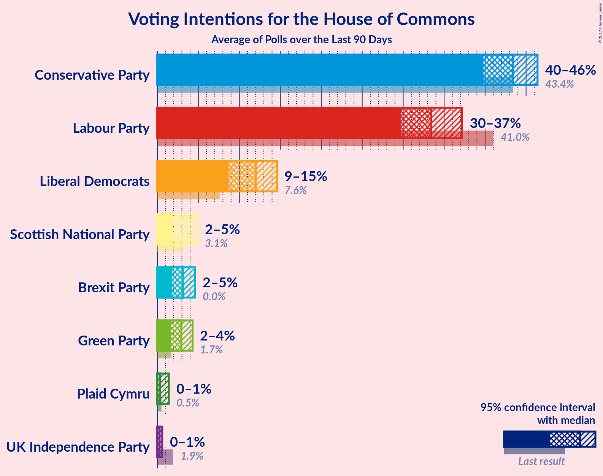
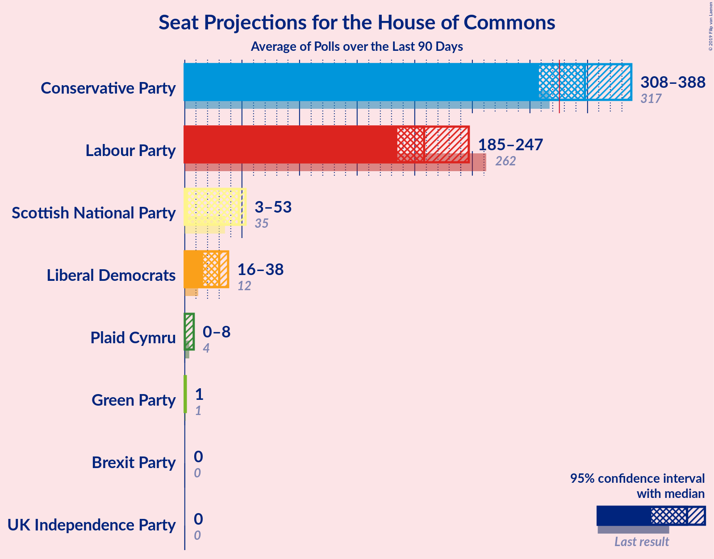
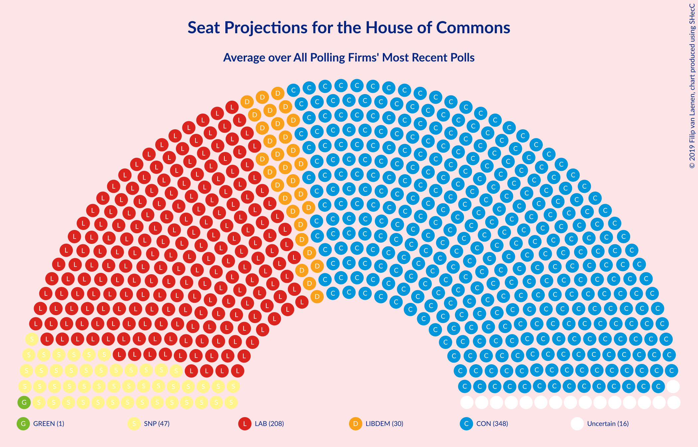
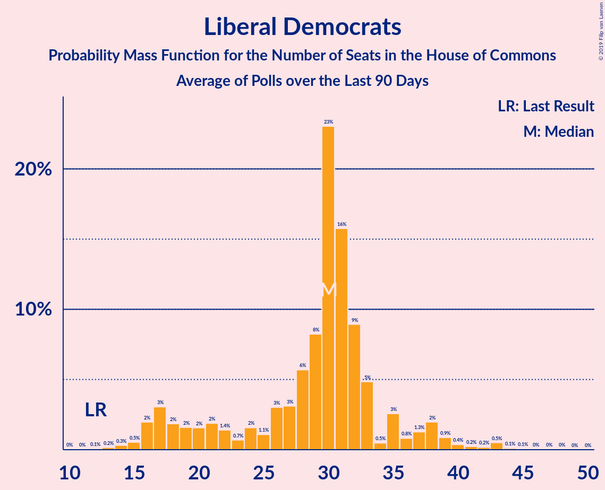
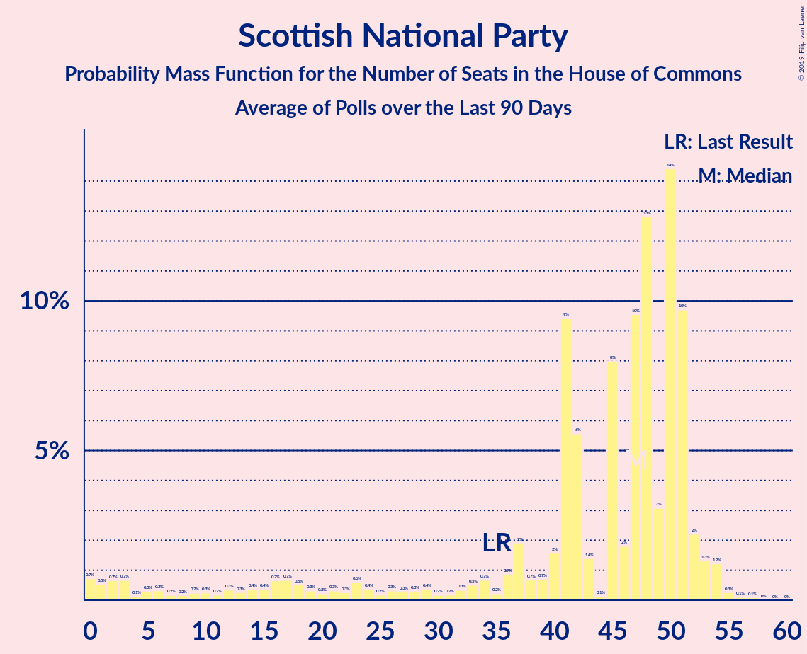
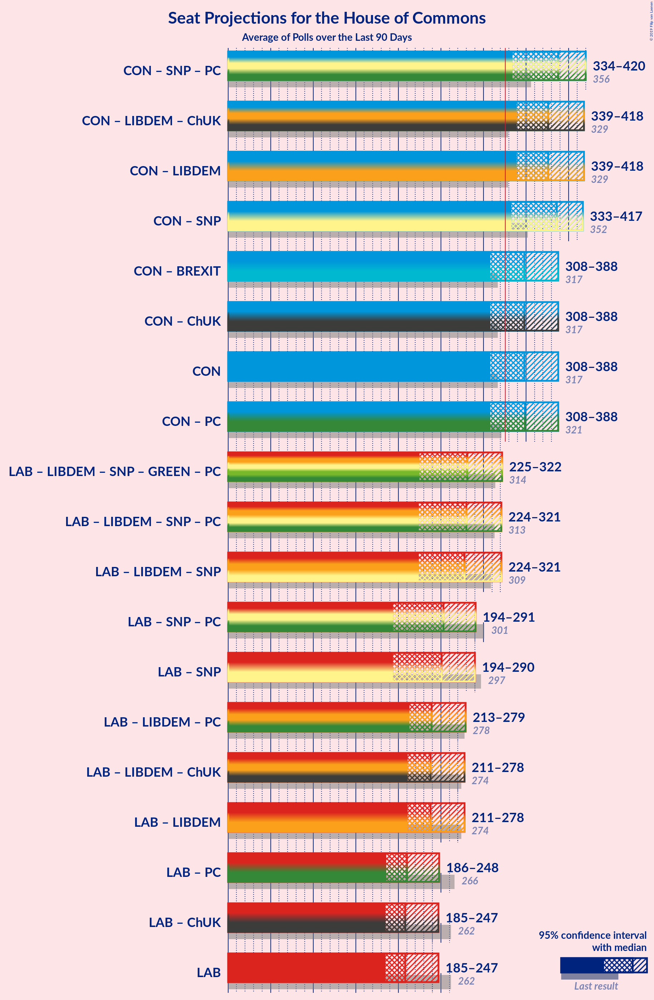

# Poll Average

<a href="#voting-intentions">Voting Intentions</a> | <a href="#seats">Seats</a> | <a href="#coalitions">Coalitions</a> | <a href="#technical-information">Technical Information</a>

## Summary

The table below lists the polls on which the average is based. They are the most recent polls (less than 90 days old) registered and analyzed so far.

| Period     | Polling firm/Commissioner(s) | CON | LAB | LIBDEM | SNP | UKIP | GREEN | PC | BREXIT | ChUK |
|:----------:|:----------------------------:|:--:|:--:|:--:|:--:|:--:|:--:|:--:|:--:|:--:|
| 8 June 2017 | General Election | 43.4%   317 | 41.0%   262 | 7.6%   12 | 3.1%   35 | 1.9%   0 | 1.7%   1 | 0.5%   4 | 0.0%   0 | 0.0%   0 |
| N/A | Poll Average | 40–46%   308–388 | 30–37%   185–247 | 9–15%   16–38 | 2–5%   3–53 | 0–1%   0 | 2–4%   1 | 0–1%   0–8 | 2–5%   0 | N/A   N/A |
| [10–11 December 2019](2019-12-11-Survation.html) | Survation | 43–47%   333–378 | 32–36%   186–225 | 8–10%   13–22 | 3–5%   41–54 | N/A   N/A | 2–4%   1 | 1%   5–8 | 2–4%   0 | N/A   N/A |
| [10–11 December 2019](2019-12-11-Panelbase.html) | Panelbase | 41–45%   320–360 | 32–36%   198–234 | 10–12%   22–30 | 3–5%   41–52 | N/A   N/A | 2–4%   1 | 0–1%   0–3 | 3–5%   0 | N/A   N/A |
| [10–11 December 2019](2019-12-11-Opinium.html) | Opinium | 44–47%   336–375 | 32–35%   185–217 | 11–13%   26–31 | 3–5%   41–51 | N/A   N/A | 2–3%   1 | 0–1%   0–3 | 2–3%   0 | N/A   N/A |
| [9–11 December 2019](2019-12-11-KantarPublic.html) | Kantar Public | 42–46%   333–373 | 30–34%   183–218 | 12–14%   30–34 | 3–5%   41–51 | N/A   N/A | 2–4%   1 | 0–1%   0–3 | 2–4%   0 | N/A   N/A |
| [9–11 December 2019](2019-12-11-IpsosMORI.html) | Ipsos MORI   Evening Standard | 42–46%   339–380 | 31–35%   185–227 | 11–13%   26–33 | N/A   N/A | N/A   N/A | 2–4%   1 | N/A   N/A | 1–3%   0 | N/A   N/A |
| [9–11 December 2019](2019-12-11-Deltapoll.html) | Deltapoll | 42–47%   322–376 | 32–37%   190–238 | 9–11%   16–29 | 3–5%   39–54 | N/A   N/A | 2–4%   1 | 0–1%   0–3 | 3–5%   0 | N/A   N/A |
| [6–11 December 2019](2019-12-11-BMGResearch.html) | BMG Research | 39–43%   318–374 | 30–34%   187–237 | 12–16%   31–44 | N/A   N/A | N/A   N/A | 2–4%   1 | N/A   N/A | 3–5%   0 | N/A   N/A |
| [8–10 December 2019](2019-12-10-NumberCruncherPolitics.html) | Number Cruncher Politics   Bloomberg | 40–46%   311–376 | 30–36%   179–235 | 10–14%   21–35 | 3–5%   36–54 | N/A   N/A | 2–4%   1 | 1–2%   3–10 | 2–4%   0 | N/A   N/A |
| [9–10 December 2019](2019-12-10-ComRes.html) | ComRes   Daily Telegraph | 39–43%   286–335 | 34–38%   217–262 | 11–13%   26–35 | 3–5%   40–54 | N/A   N/A | 1–3%   1 | N/A   N/A | 2–4%   0 | N/A   N/A |
| [6–9 December 2019](2019-12-09-ICMResearch.html) | ICM Research | 40–44%   303–351 | 34–38%   214–264 | 11–14%   26–35 | 2–4%   17–48 | 0–1%   0 | 1–3%   1 | 0–1%   0–3 | 2–4%   0 | N/A   N/A |
| [5–8 December 2019](2019-12-08-Qriously.html) | Qriously | 41–46%   358–401 | 28–32%   179–229 | 11–14%   28–35 | 2–3%   0–34 | N/A   N/A | 3–5%   1–3 | N/A   N/A | 2–4%   0 | N/A   N/A |
| [5–6 December 2019](2019-12-06-YouGov.html) | YouGov   The Sunday Times | 41–45%   316–370 | 31–35%   186–232 | 11–15%   29–36 | 3–5%   40–53 | N/A   N/A | 2–4%   1 | 0–1%   0–3 | 2–4%   0 | N/A   N/A |
| 8 June 2017 | General Election | 43.4%   317 | 41.0%   262 | 7.6%   12 | 3.1%   35 | 1.9%   0 | 1.7%   1 | 0.5%   4 | 0.0%   0 | 0.0%   0 |

Only polls for which at least the sample size has been published are included in the table above.

**Legend:**
+ **Top half of each row:** Voting intentions (95% confidence interval)
+ **Bottom half of each row:** Seat projections for the House of Commons (95% confidence interval)
+ **CON:** Conservative Party
+ **LAB:** Labour Party
+ **LIBDEM:** Liberal Democrats
+ **SNP:** Scottish National Party
+ **UKIP:** UK Independence Party
+ **GREEN:** Green Party
+ **PC:** Plaid Cymru
+ **BREXIT:** Brexit Party
+ **ChUK:** Change UK
+ **N/A (single party):** Party not included the published results
+ **N/A (entire row):** Calculation for this opinion poll not started yet

## Voting Intentions

### Confidence Intervals

| Party | Last Result | Median | 80% Confidence Interval | 90% Confidence Interval | 95% Confidence Interval | 99% Confidence Interval |
|:-----:|:-----------:|:------:|:-----------------------:|:-----------------------:|:-----------------------:|:-----------------------:|
| <a href="#conservative-party">Conservative Party</a> | 43.4% | 43.4% | 40.9–45.4% |40.3–46.0% | 39.8–46.4% | 38.8–47.1% |
| <a href="#labour-party">Labour Party</a> | 41.0% | 33.4% | 31.0–36.0% |30.2–36.7% | 29.7–37.2% | 28.8–38.1% |
| <a href="#liberal-democrats">Liberal Democrats</a> | 7.6% | 12.0% | 9.6–13.6% |9.0–14.1% | 8.7–14.6% | 8.1–15.4% |
| <a href="#scottish-national-party">Scottish National Party</a> | 3.1% | 3.9% | 2.5–4.5% |2.0–4.7% | 1.9–4.9% | 1.6–5.3% |
| <a href="#uk-independence-party">UK Independence Party</a> | 1.9% | 0.3% | 0.2–0.5% |0.1–0.5% | 0.1–0.6% | 0.1–0.7% |
| <a href="#green-party">Green Party</a> | 1.7% | 2.9% | 2.0–3.7% |1.8–4.1% | 1.7–4.3% | 1.5–4.8% |
| <a href="#plaid-cymru">Plaid Cymru</a> | 0.5% | 0.3% | 0.2–1.1% |0.1–1.3% | 0.1–1.4% | 0.1–1.7% |
| <a href="#brexit-party">Brexit Party</a> | 0.0% | 3.1% | 2.1–4.1% |1.9–4.4% | 1.8–4.6% | 1.5–5.0% |
| <a href="#change-uk">Change UK</a> | 0.0% | N/A | N/A |N/A | N/A | N/A |

### Conservative Party

*For a full overview of the results for this party, see the [Conservative Party](party-conservativeparty.html) page.*

| Voting Intentions | Probability | Accumulated | Special Marks |
|:-----------------:|:-----------:|:-----------:|:-------------:|
| 36.5–37.5% | 0% | 100% |  |
| 37.5–38.5% | 0.2% | 100% |  |
| 38.5–39.5% | 2% | 99.7% |  |
| 39.5–40.5% | 5% | 98% |  |
| 40.5–41.5% | 10% | 93% |  |
| 41.5–42.5% | 16% | 83% |  |
| 42.5–43.5% | 21% | 67% | Last Result, Median |
| 43.5–44.5% | 22% | 46% |  |
| 44.5–45.5% | 16% | 24% |  |
| 45.5–46.5% | 7% | 9% |  |
| 46.5–47.5% | 2% | 2% |  |
| 47.5–48.5% | 0.2% | 0.2% |  |
| 48.5–49.5% | 0% | 0% |  |

### Labour Party

*For a full overview of the results for this party, see the [Labour Party](party-labourparty.html) page.*

| Voting Intentions | Probability | Accumulated | Special Marks |
|:-----------------:|:-----------:|:-----------:|:-------------:|
| 26.5–27.5% | 0% | 100% |  |
| 27.5–28.5% | 0.3% | 100% |  |
| 28.5–29.5% | 2% | 99.7% |  |
| 29.5–30.5% | 5% | 98% |  |
| 30.5–31.5% | 9% | 93% |  |
| 31.5–32.5% | 16% | 84% |  |
| 32.5–33.5% | 21% | 68% | Median |
| 33.5–34.5% | 20% | 47% |  |
| 34.5–35.5% | 13% | 27% |  |
| 35.5–36.5% | 8% | 14% |  |
| 36.5–37.5% | 5% | 6% |  |
| 37.5–38.5% | 1.3% | 2% |  |
| 38.5–39.5% | 0.2% | 0.2% |  |
| 39.5–40.5% | 0% | 0% |  |
| 40.5–41.5% | 0% | 0% | Last Result |

### Liberal Democrats

*For a full overview of the results for this party, see the [Liberal Democrats](party-liberaldemocrats.html) page.*

| Voting Intentions | Probability | Accumulated | Special Marks |
|:-----------------:|:-----------:|:-----------:|:-------------:|
| 6.5–7.5% | 0% | 100% |  |
| 7.5–8.5% | 2% | 100% | Last Result |
| 8.5–9.5% | 8% | 98% |  |
| 9.5–10.5% | 8% | 91% |  |
| 10.5–11.5% | 18% | 82% |  |
| 11.5–12.5% | 31% | 64% | Median |
| 12.5–13.5% | 22% | 33% |  |
| 13.5–14.5% | 8% | 11% |  |
| 14.5–15.5% | 2% | 3% |  |
| 15.5–16.5% | 0.3% | 0.3% |  |
| 16.5–17.5% | 0% | 0% |  |

### Scottish National Party

*For a full overview of the results for this party, see the [Scottish National Party](party-scottishnationalparty.html) page.*

| Voting Intentions | Probability | Accumulated | Special Marks |
|:-----------------:|:-----------:|:-----------:|:-------------:|
| 0.0–0.5% | 0% | 100% |  |
| 0.5–1.5% | 0.3% | 100% |  |
| 1.5–2.5% | 10% | 99.7% |  |
| 2.5–3.5% | 19% | 90% | Last Result |
| 3.5–4.5% | 62% | 71% | Median |
| 4.5–5.5% | 9% | 9% |  |
| 5.5–6.5% | 0.2% | 0.2% |  |
| 6.5–7.5% | 0% | 0% |  |

### UK Independence Party

*For a full overview of the results for this party, see the [UK Independence Party](party-ukindependenceparty.html) page.*

| Voting Intentions | Probability | Accumulated | Special Marks |
|:-----------------:|:-----------:|:-----------:|:-------------:|
| 0.0–0.5% | 96% | 100% | Median |
| 0.5–1.5% | 4% | 4% |  |
| 1.5–2.5% | 0% | 0% | Last Result |

### Green Party

*For a full overview of the results for this party, see the [Green Party](party-greenparty.html) page.*

| Voting Intentions | Probability | Accumulated | Special Marks |
|:-----------------:|:-----------:|:-----------:|:-------------:|
| 0.0–0.5% | 0% | 100% |  |
| 0.5–1.5% | 1.0% | 100% |  |
| 1.5–2.5% | 29% | 99.0% | Last Result |
| 2.5–3.5% | 56% | 70% | Median |
| 3.5–4.5% | 13% | 14% |  |
| 4.5–5.5% | 1.2% | 1.2% |  |
| 5.5–6.5% | 0% | 0% |  |

### Plaid Cymru

*For a full overview of the results for this party, see the [Plaid Cymru](party-plaidcymru.html) page.*

| Voting Intentions | Probability | Accumulated | Special Marks |
|:-----------------:|:-----------:|:-----------:|:-------------:|
| 0.0–0.5% | 73% | 100% | Median |
| 0.5–1.5% | 25% | 27% | Last Result |
| 1.5–2.5% | 1.2% | 1.2% |  |
| 2.5–3.5% | 0% | 0% |  |

### Brexit Party

*For a full overview of the results for this party, see the [Brexit Party](party-brexitparty.html) page.*

| Voting Intentions | Probability | Accumulated | Special Marks |
|:-----------------:|:-----------:|:-----------:|:-------------:|
| 0.0–0.5% | 0% | 100% | Last Result |
| 0.5–1.5% | 0.5% | 100% |  |
| 1.5–2.5% | 21% | 99.5% |  |
| 2.5–3.5% | 51% | 79% | Median |
| 3.5–4.5% | 25% | 28% |  |
| 4.5–5.5% | 3% | 3% |  |
| 5.5–6.5% | 0% | 0% |  |

## Seats

### Confidence Intervals

| Party | Last Result | Median | 80% Confidence Interval | 90% Confidence Interval | 95% Confidence Interval | 99% Confidence Interval |
|:-----:|:-----------:|:------:|:-----------------------:|:-----------------------:|:-----------------------:|:-----------------------:|
| <a href="#conservative-party">Conservative Party</a> | 317 | 348 | 321–373 |313–381 | 308–388 | 292–397 |
| <a href="#labour-party">Labour Party</a> | 262 | 208 | 190–235 |187–239 | 185–247 | 179–262 |
| <a href="#liberal-democrats">Liberal Democrats</a> | 12 | 30 | 20–33 |17–37 | 16–38 | 14–43 |
| <a href="#scottish-national-party">Scottish National Party</a> | 35 | 47 | 26–51 |14–52 | 3–53 | 0–54 |
| <a href="#uk-independence-party">UK Independence Party</a> | 0 | 0 | 0 |0 | 0 | 0 |
| <a href="#green-party">Green Party</a> | 1 | 1 | 1 |1 | 1 | 1–2 |
| <a href="#plaid-cymru">Plaid Cymru</a> | 4 | 0 | 0–5 |0–8 | 0–8 | 0–10 |
| <a href="#brexit-party">Brexit Party</a> | 0 | 0 | 0 |0 | 0 | 0 |
| <a href="#change-uk">Change UK</a> | 0 | N/A | N/A |N/A | N/A | N/A |

### Conservative Party

*For a full overview of the results for this party, see the [Conservative Party](party-conservativeparty.html) page.*

| Number of Seats | Probability | Accumulated | Special Marks |
|:---------------:|:-----------:|:-----------:|:-------------:|
| 275 | 0% | 100% |  |
| 276 | 0% | 99.9% |  |
| 277 | 0% | 99.9% |  |
| 278 | 0% | 99.9% |  |
| 279 | 0% | 99.9% |  |
| 280 | 0% | 99.9% |  |
| 281 | 0% | 99.9% |  |
| 282 | 0% | 99.9% |  |
| 283 | 0% | 99.9% |  |
| 284 | 0% | 99.8% |  |
| 285 | 0% | 99.8% |  |
| 286 | 0% | 99.8% |  |
| 287 | 0% | 99.7% |  |
| 288 | 0% | 99.7% |  |
| 289 | 0% | 99.7% |  |
| 290 | 0% | 99.6% |  |
| 291 | 0.1% | 99.6% |  |
| 292 | 0.1% | 99.5% |  |
| 293 | 0.1% | 99.5% |  |
| 294 | 0.1% | 99.4% |  |
| 295 | 0.1% | 99.3% |  |
| 296 | 0.1% | 99.2% |  |
| 297 | 0.1% | 99.2% |  |
| 298 | 0.1% | 99.1% |  |
| 299 | 0.1% | 99.0% |  |
| 300 | 0.1% | 98.9% |  |
| 301 | 0.2% | 98.8% |  |
| 302 | 0.1% | 98.6% |  |
| 303 | 0.2% | 98.5% |  |
| 304 | 0.2% | 98% |  |
| 305 | 0.2% | 98% |  |
| 306 | 0.2% | 98% |  |
| 307 | 0.2% | 98% |  |
| 308 | 0.3% | 98% |  |
| 309 | 0.4% | 97% |  |
| 310 | 0.4% | 97% |  |
| 311 | 0.5% | 97% |  |
| 312 | 0.6% | 96% |  |
| 313 | 0.6% | 95% |  |
| 314 | 0.6% | 95% |  |
| 315 | 0.4% | 94% |  |
| 316 | 0.7% | 94% |  |
| 317 | 0.6% | 93% | Last Result |
| 318 | 0.6% | 92% |  |
| 319 | 0.7% | 92% |  |
| 320 | 1.0% | 91% |  |
| 321 | 0.6% | 90% |  |
| 322 | 1.0% | 90% |  |
| 323 | 1.2% | 89% |  |
| 324 | 1.5% | 87% |  |
| 325 | 1.2% | 86% |  |
| 326 | 1.0% | 85% | Majority |
| 327 | 1.0% | 84% |  |
| 328 | 1.1% | 83% |  |
| 329 | 1.5% | 82% |  |
| 330 | 1.3% | 80% |  |
| 331 | 1.4% | 79% |  |
| 332 | 1.3% | 77% |  |
| 333 | 2% | 76% |  |
| 334 | 1.0% | 74% |  |
| 335 | 2% | 73% |  |
| 336 | 1.3% | 71% |  |
| 337 | 1.2% | 70% |  |
| 338 | 2% | 69% |  |
| 339 | 2% | 67% |  |
| 340 | 1.4% | 65% |  |
| 341 | 2% | 64% |  |
| 342 | 2% | 62% |  |
| 343 | 2% | 61% |  |
| 344 | 2% | 59% |  |
| 345 | 3% | 57% |  |
| 346 | 2% | 54% |  |
| 347 | 2% | 52% |  |
| 348 | 2% | 50% | Median |
| 349 | 2% | 49% |  |
| 350 | 2% | 47% |  |
| 351 | 3% | 45% |  |
| 352 | 2% | 42% |  |
| 353 | 2% | 41% |  |
| 354 | 2% | 39% |  |
| 355 | 2% | 37% |  |
| 356 | 2% | 35% |  |
| 357 | 1.5% | 33% |  |
| 358 | 2% | 31% |  |
| 359 | 2% | 29% |  |
| 360 | 2% | 27% |  |
| 361 | 1.5% | 25% |  |
| 362 | 2% | 24% |  |
| 363 | 1.3% | 22% |  |
| 364 | 1.4% | 21% |  |
| 365 | 2% | 20% |  |
| 366 | 1.2% | 18% |  |
| 367 | 1.1% | 17% |  |
| 368 | 1.0% | 16% |  |
| 369 | 1.1% | 15% |  |
| 370 | 1.0% | 14% |  |
| 371 | 0.8% | 13% |  |
| 372 | 1.1% | 12% |  |
| 373 | 0.8% | 11% |  |
| 374 | 0.7% | 10% |  |
| 375 | 0.7% | 9% |  |
| 376 | 0.6% | 9% |  |
| 377 | 0.7% | 8% |  |
| 378 | 0.7% | 7% |  |
| 379 | 0.7% | 7% |  |
| 380 | 0.4% | 6% |  |
| 381 | 0.4% | 5% |  |
| 382 | 0.5% | 5% |  |
| 383 | 0.4% | 4% |  |
| 384 | 0.5% | 4% |  |
| 385 | 0.4% | 4% |  |
| 386 | 0.3% | 3% |  |
| 387 | 0.3% | 3% |  |
| 388 | 0.4% | 3% |  |
| 389 | 0.3% | 2% |  |
| 390 | 0.3% | 2% |  |
| 391 | 0.3% | 2% |  |
| 392 | 0.2% | 1.3% |  |
| 393 | 0.2% | 1.1% |  |
| 394 | 0.1% | 0.9% |  |
| 395 | 0.1% | 0.8% |  |
| 396 | 0.1% | 0.7% |  |
| 397 | 0.2% | 0.6% |  |
| 398 | 0.1% | 0.4% |  |
| 399 | 0.1% | 0.4% |  |
| 400 | 0% | 0.3% |  |
| 401 | 0.1% | 0.3% |  |
| 402 | 0% | 0.2% |  |
| 403 | 0% | 0.2% |  |
| 404 | 0% | 0.1% |  |
| 405 | 0% | 0.1% |  |
| 406 | 0% | 0.1% |  |
| 407 | 0% | 0.1% |  |
| 408 | 0% | 0.1% |  |
| 409 | 0% | 0.1% |  |
| 410 | 0% | 0.1% |  |
| 411 | 0% | 0% |  |

### Labour Party

*For a full overview of the results for this party, see the [Labour Party](party-labourparty.html) page.*

| Number of Seats | Probability | Accumulated | Special Marks |
|:---------------:|:-----------:|:-----------:|:-------------:|
| 167 | 0% | 100% |  |
| 168 | 0% | 99.9% |  |
| 169 | 0% | 99.9% |  |
| 170 | 0% | 99.9% |  |
| 171 | 0% | 99.9% |  |
| 172 | 0% | 99.9% |  |
| 173 | 0% | 99.9% |  |
| 174 | 0% | 99.8% |  |
| 175 | 0.1% | 99.8% |  |
| 176 | 0% | 99.7% |  |
| 177 | 0% | 99.7% |  |
| 178 | 0.1% | 99.6% |  |
| 179 | 0.1% | 99.6% |  |
| 180 | 0.2% | 99.4% |  |
| 181 | 0.3% | 99.2% |  |
| 182 | 0.4% | 98.9% |  |
| 183 | 0.6% | 98.6% |  |
| 184 | 0.4% | 98% |  |
| 185 | 0.7% | 98% |  |
| 186 | 2% | 97% |  |
| 187 | 2% | 95% |  |
| 188 | 2% | 93% |  |
| 189 | 0.6% | 91% |  |
| 190 | 1.0% | 91% |  |
| 191 | 1.2% | 90% |  |
| 192 | 1.3% | 88% |  |
| 193 | 1.5% | 87% |  |
| 194 | 1.3% | 86% |  |
| 195 | 3% | 84% |  |
| 196 | 1.5% | 81% |  |
| 197 | 2% | 80% |  |
| 198 | 1.2% | 78% |  |
| 199 | 2% | 77% |  |
| 200 | 2% | 75% |  |
| 201 | 2% | 73% |  |
| 202 | 2% | 71% |  |
| 203 | 2% | 69% |  |
| 204 | 4% | 67% |  |
| 205 | 3% | 64% |  |
| 206 | 4% | 61% |  |
| 207 | 5% | 58% |  |
| 208 | 3% | 53% | Median |
| 209 | 3% | 50% |  |
| 210 | 2% | 46% |  |
| 211 | 1.0% | 45% |  |
| 212 | 0.7% | 44% |  |
| 213 | 1.3% | 43% |  |
| 214 | 2% | 42% |  |
| 215 | 2% | 40% |  |
| 216 | 2% | 39% |  |
| 217 | 2% | 37% |  |
| 218 | 2% | 35% |  |
| 219 | 2% | 33% |  |
| 220 | 2% | 31% |  |
| 221 | 0.9% | 29% |  |
| 222 | 1.0% | 28% |  |
| 223 | 1.4% | 27% |  |
| 224 | 3% | 25% |  |
| 225 | 2% | 23% |  |
| 226 | 2% | 21% |  |
| 227 | 1.2% | 18% |  |
| 228 | 1.0% | 17% |  |
| 229 | 0.7% | 16% |  |
| 230 | 1.5% | 15% |  |
| 231 | 0.9% | 14% |  |
| 232 | 0.9% | 13% |  |
| 233 | 0.7% | 12% |  |
| 234 | 1.0% | 11% |  |
| 235 | 0.7% | 10% |  |
| 236 | 1.0% | 9% |  |
| 237 | 1.2% | 8% |  |
| 238 | 1.1% | 7% |  |
| 239 | 1.3% | 6% |  |
| 240 | 0.6% | 5% |  |
| 241 | 0.3% | 4% |  |
| 242 | 0.3% | 4% |  |
| 243 | 0.2% | 4% |  |
| 244 | 0.3% | 3% |  |
| 245 | 0.2% | 3% |  |
| 246 | 0.2% | 3% |  |
| 247 | 0.3% | 3% |  |
| 248 | 0.2% | 2% |  |
| 249 | 0.3% | 2% |  |
| 250 | 0.1% | 2% |  |
| 251 | 0.2% | 2% |  |
| 252 | 0.1% | 2% |  |
| 253 | 0.2% | 1.5% |  |
| 254 | 0.2% | 1.3% |  |
| 255 | 0.1% | 1.1% |  |
| 256 | 0.1% | 1.0% |  |
| 257 | 0.1% | 0.9% |  |
| 258 | 0.1% | 0.8% |  |
| 259 | 0.1% | 0.8% |  |
| 260 | 0% | 0.7% |  |
| 261 | 0.1% | 0.6% |  |
| 262 | 0.1% | 0.6% | Last Result |
| 263 | 0.1% | 0.5% |  |
| 264 | 0.1% | 0.4% |  |
| 265 | 0% | 0.3% |  |
| 266 | 0% | 0.3% |  |
| 267 | 0.1% | 0.3% |  |
| 268 | 0% | 0.2% |  |
| 269 | 0% | 0.2% |  |
| 270 | 0% | 0.2% |  |
| 271 | 0% | 0.2% |  |
| 272 | 0% | 0.1% |  |
| 273 | 0% | 0.1% |  |
| 274 | 0% | 0.1% |  |
| 275 | 0% | 0.1% |  |
| 276 | 0% | 0.1% |  |
| 277 | 0% | 0.1% |  |
| 278 | 0% | 0.1% |  |
| 279 | 0% | 0.1% |  |
| 280 | 0% | 0% |  |

### Liberal Democrats

*For a full overview of the results for this party, see the [Liberal Democrats](party-liberaldemocrats.html) page.*

| Number of Seats | Probability | Accumulated | Special Marks |
|:---------------:|:-----------:|:-----------:|:-------------:|
| 10 | 0% | 100% |  |
| 11 | 0% | 99.9% |  |
| 12 | 0.1% | 99.9% | Last Result |
| 13 | 0.2% | 99.8% |  |
| 14 | 0.3% | 99.6% |  |
| 15 | 0.5% | 99.3% |  |
| 16 | 2% | 98.8% |  |
| 17 | 3% | 97% |  |
| 18 | 2% | 94% |  |
| 19 | 2% | 92% |  |
| 20 | 2% | 90% |  |
| 21 | 2% | 89% |  |
| 22 | 1.4% | 87% |  |
| 23 | 0.7% | 85% |  |
| 24 | 2% | 85% |  |
| 25 | 1.1% | 83% |  |
| 26 | 3% | 82% |  |
| 27 | 3% | 79% |  |
| 28 | 6% | 76% |  |
| 29 | 8% | 70% |  |
| 30 | 23% | 62% | Median |
| 31 | 16% | 39% |  |
| 32 | 9% | 23% |  |
| 33 | 5% | 14% |  |
| 34 | 0.5% | 9% |  |
| 35 | 3% | 9% |  |
| 36 | 0.8% | 6% |  |
| 37 | 1.3% | 6% |  |
| 38 | 2% | 4% |  |
| 39 | 0.9% | 2% |  |
| 40 | 0.4% | 2% |  |
| 41 | 0.2% | 1.2% |  |
| 42 | 0.2% | 0.9% |  |
| 43 | 0.5% | 0.8% |  |
| 44 | 0.1% | 0.2% |  |
| 45 | 0.1% | 0.1% |  |
| 46 | 0% | 0.1% |  |
| 47 | 0% | 0.1% |  |
| 48 | 0% | 0% |  |

### Scottish National Party

*For a full overview of the results for this party, see the [Scottish National Party](party-scottishnationalparty.html) page.*

| Number of Seats | Probability | Accumulated | Special Marks |
|:---------------:|:-----------:|:-----------:|:-------------:|
| 0 | 0.7% | 100% |  |
| 1 | 0.5% | 99.3% |  |
| 2 | 0.7% | 98.7% |  |
| 3 | 0.7% | 98% |  |
| 4 | 0.1% | 97% |  |
| 5 | 0.3% | 97% |  |
| 6 | 0.3% | 97% |  |
| 7 | 0.2% | 97% |  |
| 8 | 0.2% | 96% |  |
| 9 | 0.2% | 96% |  |
| 10 | 0.3% | 96% |  |
| 11 | 0.2% | 96% |  |
| 12 | 0.3% | 96% |  |
| 13 | 0.3% | 95% |  |
| 14 | 0.4% | 95% |  |
| 15 | 0.4% | 95% |  |
| 16 | 0.7% | 94% |  |
| 17 | 0.7% | 94% |  |
| 18 | 0.5% | 93% |  |
| 19 | 0.3% | 92% |  |
| 20 | 0.2% | 92% |  |
| 21 | 0.3% | 92% |  |
| 22 | 0.3% | 92% |  |
| 23 | 0.6% | 91% |  |
| 24 | 0.4% | 91% |  |
| 25 | 0.2% | 90% |  |
| 26 | 0.3% | 90% |  |
| 27 | 0.3% | 90% |  |
| 28 | 0.3% | 90% |  |
| 29 | 0.4% | 89% |  |
| 30 | 0.2% | 89% |  |
| 31 | 0.2% | 89% |  |
| 32 | 0.3% | 89% |  |
| 33 | 0.5% | 88% |  |
| 34 | 0.7% | 88% |  |
| 35 | 0.2% | 87% | Last Result |
| 36 | 0.9% | 87% |  |
| 37 | 2% | 86% |  |
| 38 | 0.7% | 84% |  |
| 39 | 0.7% | 83% |  |
| 40 | 2% | 83% |  |
| 41 | 9% | 81% |  |
| 42 | 6% | 72% |  |
| 43 | 1.4% | 66% |  |
| 44 | 0.1% | 65% |  |
| 45 | 8% | 65% |  |
| 46 | 2% | 57% |  |
| 47 | 10% | 55% | Median |
| 48 | 13% | 45% |  |
| 49 | 3% | 32% |  |
| 50 | 14% | 29% |  |
| 51 | 10% | 15% |  |
| 52 | 2% | 5% |  |
| 53 | 1.3% | 3% |  |
| 54 | 1.2% | 2% |  |
| 55 | 0.3% | 0.5% |  |
| 56 | 0.1% | 0.2% |  |
| 57 | 0.1% | 0.1% |  |
| 58 | 0% | 0% |  |

### UK Independence Party

*For a full overview of the results for this party, see the [UK Independence Party](party-ukindependenceparty.html) page.*

| Number of Seats | Probability | Accumulated | Special Marks |
|:---------------:|:-----------:|:-----------:|:-------------:|
| 0 | 100% | 100% | Last Result, Median |

### Green Party

*For a full overview of the results for this party, see the [Green Party](party-greenparty.html) page.*

| Number of Seats | Probability | Accumulated | Special Marks |
|:---------------:|:-----------:|:-----------:|:-------------:|
| 1 | 98% | 100% | Last Result, Median |
| 2 | 1.3% | 2% |  |
| 3 | 0.3% | 0.3% |  |
| 4 | 0% | 0% |  |

### Plaid Cymru

*For a full overview of the results for this party, see the [Plaid Cymru](party-plaidcymru.html) page.*

| Number of Seats | Probability | Accumulated | Special Marks |
|:---------------:|:-----------:|:-----------:|:-------------:|
| 0 | 54% | 100% | Median |
| 1 | 2% | 46% |  |
| 2 | 11% | 44% |  |
| 3 | 9% | 33% |  |
| 4 | 3% | 24% | Last Result |
| 5 | 14% | 22% |  |
| 6 | 1.3% | 8% |  |
| 7 | 0.9% | 6% |  |
| 8 | 4% | 5% |  |
| 9 | 0.4% | 1.0% |  |
| 10 | 0.3% | 0.6% |  |
| 11 | 0.2% | 0.2% |  |
| 12 | 0% | 0% |  |

### Brexit Party

*For a full overview of the results for this party, see the [Brexit Party](party-brexitparty.html) page.*

| Number of Seats | Probability | Accumulated | Special Marks |
|:---------------:|:-----------:|:-----------:|:-------------:|
| 0 | 100% | 100% | Last Result, Median |

## Coalitions

### Confidence Intervals

| Coalition | Last Result | Median | Majority? | 80% Confidence Interval | 90% Confidence Interval | 95% Confidence Interval | 99% Confidence Interval |
|:---------:|:-----------:|:------:|:---------:|:-----------------------:|:-----------------------:|:-----------------------:|:-----------------------:|
| Conservative Party – Scottish National Party – Plaid Cymru | 356 | 388 | 99.2% | 352–412 | 342–417 | 334–420 | 322–428 |
| Conservative Party – Liberal Democrats – Change UK | 329 | 376 | 99.3% | 351–403 | 343–412 | 339–418 | 323–428 |
| Conservative Party – Liberal Democrats | 329 | 376 | 99.3% | 351–403 | 343–412 | 339–418 | 323–428 |
| Conservative Party – Scottish National Party | 352 | 386 | 99.2% | 352–410 | 342–414 | 333–417 | 322–423 |
| Conservative Party – Brexit Party | 317 | 348 | 85% | 321–373 | 313–381 | 308–388 | 292–397 |
| Conservative Party – Change UK | 317 | 348 | 85% | 321–373 | 313–381 | 308–388 | 292–397 |
| Conservative Party | 317 | 348 | 85% | 321–373 | 313–381 | 308–388 | 292–397 |
| Conservative Party – Plaid Cymru | 321 | 349 | 86% | 322–375 | 313–382 | 308–388 | 292–397 |
| Labour Party – Liberal Democrats – Scottish National Party – Green Party – Plaid Cymru | 314 | 281 | 2% | 240–310 | 233–317 | 225–322 | 216–338 |
| Labour Party – Liberal Democrats – Scottish National Party – Plaid Cymru | 313 | 280 | 2% | 239–309 | 232–316 | 224–321 | 215–337 |
| Labour Party – Liberal Democrats – Scottish National Party | 309 | 278 | 2% | 239–308 | 232–316 | 224–321 | 215–337 |
| Labour Party – Scottish National Party – Plaid Cymru | 301 | 253 | 0% | 207–279 | 200–286 | 194–291 | 186–307 |
| Labour Party – Scottish National Party | 297 | 251 | 0% | 207–278 | 200–285 | 194–290 | 186–306 |
| Labour Party – Liberal Democrats – Plaid Cymru | 278 | 239 | 0% | 220–266 | 216–271 | 213–279 | 207–293 |
| Labour Party – Liberal Democrats – Change UK | 274 | 238 | 0% | 218–266 | 214–271 | 211–278 | 203–293 |
| Labour Party – Liberal Democrats | 274 | 238 | 0% | 218–266 | 214–271 | 211–278 | 203–293 |
| Labour Party – Plaid Cymru | 266 | 210 | 0% | 191–236 | 188–240 | 186–248 | 180–262 |
| Labour Party – Change UK | 262 | 208 | 0% | 190–235 | 187–239 | 185–247 | 179–262 |
| Labour Party | 262 | 208 | 0% | 190–235 | 187–239 | 185–247 | 179–262 |

### Conservative Party – Scottish National Party – Plaid Cymru

| Number of Seats | Probability | Accumulated | Special Marks |
|:---------------:|:-----------:|:-----------:|:-------------:|
| 311 | 0% | 100% |  |
| 312 | 0% | 99.9% |  |
| 313 | 0% | 99.9% |  |
| 314 | 0% | 99.9% |  |
| 315 | 0% | 99.9% |  |
| 316 | 0% | 99.9% |  |
| 317 | 0% | 99.8% |  |
| 318 | 0% | 99.8% |  |
| 319 | 0.1% | 99.7% |  |
| 320 | 0.1% | 99.7% |  |
| 321 | 0.1% | 99.6% |  |
| 322 | 0% | 99.5% |  |
| 323 | 0.1% | 99.5% |  |
| 324 | 0.1% | 99.4% |  |
| 325 | 0.1% | 99.3% |  |
| 326 | 0.2% | 99.2% | Majority |
| 327 | 0.1% | 99.0% |  |
| 328 | 0.1% | 98.8% |  |
| 329 | 0.2% | 98.7% |  |
| 330 | 0.2% | 98.5% |  |
| 331 | 0.3% | 98% |  |
| 332 | 0.3% | 98% |  |
| 333 | 0.2% | 98% |  |
| 334 | 0.2% | 98% |  |
| 335 | 0.2% | 97% |  |
| 336 | 0.3% | 97% |  |
| 337 | 0.3% | 97% |  |
| 338 | 0.3% | 96% |  |
| 339 | 0.3% | 96% |  |
| 340 | 0.4% | 96% |  |
| 341 | 0.3% | 95% |  |
| 342 | 0.3% | 95% |  |
| 343 | 0.3% | 95% |  |
| 344 | 0.3% | 94% |  |
| 345 | 0.6% | 94% |  |
| 346 | 0.6% | 94% |  |
| 347 | 0.4% | 93% |  |
| 348 | 0.3% | 93% |  |
| 349 | 0.5% | 92% |  |
| 350 | 0.6% | 92% |  |
| 351 | 0.7% | 91% |  |
| 352 | 0.5% | 90% |  |
| 353 | 0.5% | 90% |  |
| 354 | 0.6% | 89% |  |
| 355 | 0.6% | 89% |  |
| 356 | 0.7% | 88% | Last Result |
| 357 | 0.8% | 87% |  |
| 358 | 1.0% | 87% |  |
| 359 | 1.1% | 86% |  |
| 360 | 1.1% | 85% |  |
| 361 | 2% | 83% |  |
| 362 | 1.2% | 81% |  |
| 363 | 1.4% | 80% |  |
| 364 | 1.3% | 79% |  |
| 365 | 0.7% | 78% |  |
| 366 | 0.8% | 77% |  |
| 367 | 1.0% | 76% |  |
| 368 | 0.8% | 75% |  |
| 369 | 1.2% | 74% |  |
| 370 | 1.1% | 73% |  |
| 371 | 2% | 72% |  |
| 372 | 0.9% | 70% |  |
| 373 | 0.9% | 69% |  |
| 374 | 1.1% | 69% |  |
| 375 | 1.3% | 67% |  |
| 376 | 2% | 66% |  |
| 377 | 2% | 65% |  |
| 378 | 1.3% | 63% |  |
| 379 | 1.1% | 62% |  |
| 380 | 1.3% | 61% |  |
| 381 | 1.1% | 59% |  |
| 382 | 1.2% | 58% |  |
| 383 | 1.2% | 57% |  |
| 384 | 1.5% | 56% |  |
| 385 | 1.5% | 54% |  |
| 386 | 1.0% | 53% |  |
| 387 | 1.2% | 52% |  |
| 388 | 1.0% | 51% |  |
| 389 | 1.2% | 50% |  |
| 390 | 1.3% | 48% |  |
| 391 | 1.2% | 47% |  |
| 392 | 2% | 46% |  |
| 393 | 2% | 44% |  |
| 394 | 3% | 42% |  |
| 395 | 2% | 39% | Median |
| 396 | 2% | 37% |  |
| 397 | 2% | 34% |  |
| 398 | 1.5% | 32% |  |
| 399 | 2% | 31% |  |
| 400 | 2% | 29% |  |
| 401 | 1.5% | 27% |  |
| 402 | 2% | 25% |  |
| 403 | 2% | 24% |  |
| 404 | 2% | 22% |  |
| 405 | 1.4% | 20% |  |
| 406 | 2% | 19% |  |
| 407 | 1.4% | 17% |  |
| 408 | 2% | 16% |  |
| 409 | 1.0% | 14% |  |
| 410 | 1.5% | 13% |  |
| 411 | 1.0% | 12% |  |
| 412 | 1.3% | 11% |  |
| 413 | 1.3% | 9% |  |
| 414 | 1.1% | 8% |  |
| 415 | 1.0% | 7% |  |
| 416 | 0.8% | 6% |  |
| 417 | 0.8% | 5% |  |
| 418 | 0.7% | 4% |  |
| 419 | 0.7% | 4% |  |
| 420 | 0.6% | 3% |  |
| 421 | 0.4% | 2% |  |
| 422 | 0.3% | 2% |  |
| 423 | 0.2% | 2% |  |
| 424 | 0.2% | 1.4% |  |
| 425 | 0.2% | 1.1% |  |
| 426 | 0.2% | 0.9% |  |
| 427 | 0.1% | 0.7% |  |
| 428 | 0.2% | 0.6% |  |
| 429 | 0.1% | 0.4% |  |
| 430 | 0.1% | 0.3% |  |
| 431 | 0% | 0.2% |  |
| 432 | 0% | 0.2% |  |
| 433 | 0% | 0.1% |  |
| 434 | 0% | 0.1% |  |
| 435 | 0% | 0.1% |  |
| 436 | 0% | 0.1% |  |
| 437 | 0% | 0% |  |

### Conservative Party – Liberal Democrats – Change UK

| Number of Seats | Probability | Accumulated | Special Marks |
|:---------------:|:-----------:|:-----------:|:-------------:|
| 306 | 0% | 100% |  |
| 307 | 0% | 99.9% |  |
| 308 | 0% | 99.9% |  |
| 309 | 0% | 99.9% |  |
| 310 | 0% | 99.9% |  |
| 311 | 0% | 99.9% |  |
| 312 | 0% | 99.9% |  |
| 313 | 0% | 99.9% |  |
| 314 | 0% | 99.9% |  |
| 315 | 0% | 99.8% |  |
| 316 | 0% | 99.8% |  |
| 317 | 0% | 99.8% |  |
| 318 | 0% | 99.7% |  |
| 319 | 0% | 99.7% |  |
| 320 | 0% | 99.7% |  |
| 321 | 0% | 99.6% |  |
| 322 | 0.1% | 99.6% |  |
| 323 | 0.1% | 99.5% |  |
| 324 | 0.1% | 99.4% |  |
| 325 | 0.1% | 99.4% |  |
| 326 | 0.1% | 99.3% | Majority |
| 327 | 0.1% | 99.2% |  |
| 328 | 0.1% | 99.2% |  |
| 329 | 0.1% | 99.1% | Last Result |
| 330 | 0.1% | 99.0% |  |
| 331 | 0.1% | 98.9% |  |
| 332 | 0.1% | 98.8% |  |
| 333 | 0.2% | 98.6% |  |
| 334 | 0.2% | 98% |  |
| 335 | 0.2% | 98% |  |
| 336 | 0.1% | 98% |  |
| 337 | 0.2% | 98% |  |
| 338 | 0.2% | 98% |  |
| 339 | 0.3% | 98% |  |
| 340 | 0.3% | 97% |  |
| 341 | 0.7% | 97% |  |
| 342 | 0.7% | 96% |  |
| 343 | 0.6% | 95% |  |
| 344 | 0.7% | 95% |  |
| 345 | 0.4% | 94% |  |
| 346 | 0.6% | 94% |  |
| 347 | 0.7% | 93% |  |
| 348 | 0.5% | 92% |  |
| 349 | 0.7% | 92% |  |
| 350 | 1.0% | 91% |  |
| 351 | 1.1% | 90% |  |
| 352 | 0.8% | 89% |  |
| 353 | 1.0% | 88% |  |
| 354 | 2% | 87% |  |
| 355 | 2% | 86% |  |
| 356 | 1.2% | 84% |  |
| 357 | 1.3% | 83% |  |
| 358 | 2% | 81% |  |
| 359 | 0.9% | 80% |  |
| 360 | 2% | 79% |  |
| 361 | 1.3% | 77% |  |
| 362 | 1.1% | 76% |  |
| 363 | 2% | 75% |  |
| 364 | 2% | 73% |  |
| 365 | 2% | 71% |  |
| 366 | 2% | 69% |  |
| 367 | 1.3% | 68% |  |
| 368 | 2% | 66% |  |
| 369 | 2% | 65% |  |
| 370 | 2% | 63% |  |
| 371 | 2% | 61% |  |
| 372 | 2% | 59% |  |
| 373 | 2% | 57% |  |
| 374 | 2% | 55% |  |
| 375 | 2% | 53% |  |
| 376 | 3% | 51% |  |
| 377 | 2% | 48% |  |
| 378 | 2% | 46% | Median |
| 379 | 2% | 44% |  |
| 380 | 2% | 42% |  |
| 381 | 2% | 40% |  |
| 382 | 2% | 38% |  |
| 383 | 1.3% | 37% |  |
| 384 | 2% | 35% |  |
| 385 | 2% | 33% |  |
| 386 | 1.4% | 32% |  |
| 387 | 2% | 30% |  |
| 388 | 2% | 29% |  |
| 389 | 2% | 27% |  |
| 390 | 1.2% | 25% |  |
| 391 | 2% | 23% |  |
| 392 | 1.4% | 22% |  |
| 393 | 1.2% | 20% |  |
| 394 | 1.4% | 19% |  |
| 395 | 1.1% | 18% |  |
| 396 | 2% | 17% |  |
| 397 | 0.9% | 15% |  |
| 398 | 0.9% | 14% |  |
| 399 | 0.6% | 13% |  |
| 400 | 1.1% | 13% |  |
| 401 | 0.8% | 12% |  |
| 402 | 0.7% | 11% |  |
| 403 | 0.8% | 10% |  |
| 404 | 0.7% | 9% |  |
| 405 | 0.4% | 9% |  |
| 406 | 0.4% | 8% |  |
| 407 | 0.6% | 8% |  |
| 408 | 0.7% | 7% |  |
| 409 | 0.6% | 6% |  |
| 410 | 0.5% | 6% |  |
| 411 | 0.3% | 5% |  |
| 412 | 0.4% | 5% |  |
| 413 | 0.5% | 5% |  |
| 414 | 0.5% | 4% |  |
| 415 | 0.3% | 4% |  |
| 416 | 0.3% | 4% |  |
| 417 | 0.3% | 3% |  |
| 418 | 0.4% | 3% |  |
| 419 | 0.4% | 2% |  |
| 420 | 0.3% | 2% |  |
| 421 | 0.3% | 2% |  |
| 422 | 0.2% | 1.4% |  |
| 423 | 0.1% | 1.2% |  |
| 424 | 0.2% | 1.1% |  |
| 425 | 0.1% | 0.9% |  |
| 426 | 0.1% | 0.7% |  |
| 427 | 0.1% | 0.6% |  |
| 428 | 0.2% | 0.5% |  |
| 429 | 0.1% | 0.4% |  |
| 430 | 0% | 0.3% |  |
| 431 | 0% | 0.3% |  |
| 432 | 0% | 0.2% |  |
| 433 | 0% | 0.2% |  |
| 434 | 0% | 0.2% |  |
| 435 | 0% | 0.1% |  |
| 436 | 0% | 0.1% |  |
| 437 | 0% | 0.1% |  |
| 438 | 0% | 0.1% |  |
| 439 | 0% | 0.1% |  |
| 440 | 0% | 0.1% |  |
| 441 | 0% | 0% |  |

### Conservative Party – Liberal Democrats

| Number of Seats | Probability | Accumulated | Special Marks |
|:---------------:|:-----------:|:-----------:|:-------------:|
| 306 | 0% | 100% |  |
| 307 | 0% | 99.9% |  |
| 308 | 0% | 99.9% |  |
| 309 | 0% | 99.9% |  |
| 310 | 0% | 99.9% |  |
| 311 | 0% | 99.9% |  |
| 312 | 0% | 99.9% |  |
| 313 | 0% | 99.9% |  |
| 314 | 0% | 99.9% |  |
| 315 | 0% | 99.8% |  |
| 316 | 0% | 99.8% |  |
| 317 | 0% | 99.8% |  |
| 318 | 0% | 99.7% |  |
| 319 | 0% | 99.7% |  |
| 320 | 0% | 99.7% |  |
| 321 | 0% | 99.6% |  |
| 322 | 0.1% | 99.6% |  |
| 323 | 0.1% | 99.5% |  |
| 324 | 0.1% | 99.4% |  |
| 325 | 0.1% | 99.4% |  |
| 326 | 0.1% | 99.3% | Majority |
| 327 | 0.1% | 99.2% |  |
| 328 | 0.1% | 99.2% |  |
| 329 | 0.1% | 99.1% | Last Result |
| 330 | 0.1% | 99.0% |  |
| 331 | 0.1% | 98.9% |  |
| 332 | 0.1% | 98.8% |  |
| 333 | 0.2% | 98.6% |  |
| 334 | 0.2% | 98% |  |
| 335 | 0.2% | 98% |  |
| 336 | 0.1% | 98% |  |
| 337 | 0.2% | 98% |  |
| 338 | 0.2% | 98% |  |
| 339 | 0.3% | 98% |  |
| 340 | 0.3% | 97% |  |
| 341 | 0.7% | 97% |  |
| 342 | 0.7% | 96% |  |
| 343 | 0.6% | 95% |  |
| 344 | 0.7% | 95% |  |
| 345 | 0.4% | 94% |  |
| 346 | 0.6% | 94% |  |
| 347 | 0.7% | 93% |  |
| 348 | 0.5% | 92% |  |
| 349 | 0.7% | 92% |  |
| 350 | 1.0% | 91% |  |
| 351 | 1.1% | 90% |  |
| 352 | 0.8% | 89% |  |
| 353 | 1.0% | 88% |  |
| 354 | 2% | 87% |  |
| 355 | 2% | 86% |  |
| 356 | 1.2% | 84% |  |
| 357 | 1.3% | 83% |  |
| 358 | 2% | 81% |  |
| 359 | 0.9% | 80% |  |
| 360 | 2% | 79% |  |
| 361 | 1.3% | 77% |  |
| 362 | 1.1% | 76% |  |
| 363 | 2% | 75% |  |
| 364 | 2% | 73% |  |
| 365 | 2% | 71% |  |
| 366 | 2% | 69% |  |
| 367 | 1.3% | 68% |  |
| 368 | 2% | 66% |  |
| 369 | 2% | 65% |  |
| 370 | 2% | 63% |  |
| 371 | 2% | 61% |  |
| 372 | 2% | 59% |  |
| 373 | 2% | 57% |  |
| 374 | 2% | 55% |  |
| 375 | 2% | 53% |  |
| 376 | 3% | 51% |  |
| 377 | 2% | 48% |  |
| 378 | 2% | 46% | Median |
| 379 | 2% | 44% |  |
| 380 | 2% | 42% |  |
| 381 | 2% | 40% |  |
| 382 | 2% | 38% |  |
| 383 | 1.3% | 37% |  |
| 384 | 2% | 35% |  |
| 385 | 2% | 33% |  |
| 386 | 1.4% | 32% |  |
| 387 | 2% | 30% |  |
| 388 | 2% | 29% |  |
| 389 | 2% | 27% |  |
| 390 | 1.2% | 25% |  |
| 391 | 2% | 23% |  |
| 392 | 1.4% | 22% |  |
| 393 | 1.2% | 20% |  |
| 394 | 1.4% | 19% |  |
| 395 | 1.1% | 18% |  |
| 396 | 2% | 17% |  |
| 397 | 0.9% | 15% |  |
| 398 | 0.9% | 14% |  |
| 399 | 0.6% | 13% |  |
| 400 | 1.1% | 13% |  |
| 401 | 0.8% | 12% |  |
| 402 | 0.7% | 11% |  |
| 403 | 0.8% | 10% |  |
| 404 | 0.7% | 9% |  |
| 405 | 0.4% | 9% |  |
| 406 | 0.4% | 8% |  |
| 407 | 0.6% | 8% |  |
| 408 | 0.7% | 7% |  |
| 409 | 0.6% | 6% |  |
| 410 | 0.5% | 6% |  |
| 411 | 0.3% | 5% |  |
| 412 | 0.4% | 5% |  |
| 413 | 0.5% | 5% |  |
| 414 | 0.5% | 4% |  |
| 415 | 0.3% | 4% |  |
| 416 | 0.3% | 4% |  |
| 417 | 0.3% | 3% |  |
| 418 | 0.4% | 3% |  |
| 419 | 0.4% | 2% |  |
| 420 | 0.3% | 2% |  |
| 421 | 0.3% | 2% |  |
| 422 | 0.2% | 1.4% |  |
| 423 | 0.1% | 1.2% |  |
| 424 | 0.2% | 1.1% |  |
| 425 | 0.1% | 0.9% |  |
| 426 | 0.1% | 0.7% |  |
| 427 | 0.1% | 0.6% |  |
| 428 | 0.2% | 0.5% |  |
| 429 | 0.1% | 0.4% |  |
| 430 | 0% | 0.3% |  |
| 431 | 0% | 0.3% |  |
| 432 | 0% | 0.2% |  |
| 433 | 0% | 0.2% |  |
| 434 | 0% | 0.2% |  |
| 435 | 0% | 0.1% |  |
| 436 | 0% | 0.1% |  |
| 437 | 0% | 0.1% |  |
| 438 | 0% | 0.1% |  |
| 439 | 0% | 0.1% |  |
| 440 | 0% | 0.1% |  |
| 441 | 0% | 0% |  |

### Conservative Party – Scottish National Party

| Number of Seats | Probability | Accumulated | Special Marks |
|:---------------:|:-----------:|:-----------:|:-------------:|
| 311 | 0% | 100% |  |
| 312 | 0% | 99.9% |  |
| 313 | 0% | 99.9% |  |
| 314 | 0% | 99.9% |  |
| 315 | 0% | 99.9% |  |
| 316 | 0% | 99.9% |  |
| 317 | 0% | 99.8% |  |
| 318 | 0% | 99.8% |  |
| 319 | 0.1% | 99.7% |  |
| 320 | 0.1% | 99.7% |  |
| 321 | 0.1% | 99.6% |  |
| 322 | 0% | 99.5% |  |
| 323 | 0.1% | 99.5% |  |
| 324 | 0.1% | 99.4% |  |
| 325 | 0.1% | 99.3% |  |
| 326 | 0.2% | 99.2% | Majority |
| 327 | 0.1% | 99.0% |  |
| 328 | 0.1% | 98.8% |  |
| 329 | 0.2% | 98.7% |  |
| 330 | 0.2% | 98.5% |  |
| 331 | 0.3% | 98% |  |
| 332 | 0.3% | 98% |  |
| 333 | 0.2% | 98% |  |
| 334 | 0.2% | 97% |  |
| 335 | 0.2% | 97% |  |
| 336 | 0.3% | 97% |  |
| 337 | 0.3% | 97% |  |
| 338 | 0.3% | 96% |  |
| 339 | 0.3% | 96% |  |
| 340 | 0.4% | 96% |  |
| 341 | 0.4% | 95% |  |
| 342 | 0.3% | 95% |  |
| 343 | 0.3% | 95% |  |
| 344 | 0.3% | 94% |  |
| 345 | 0.5% | 94% |  |
| 346 | 0.6% | 94% |  |
| 347 | 0.4% | 93% |  |
| 348 | 0.4% | 93% |  |
| 349 | 0.6% | 92% |  |
| 350 | 0.6% | 92% |  |
| 351 | 0.6% | 91% |  |
| 352 | 0.5% | 90% | Last Result |
| 353 | 0.5% | 90% |  |
| 354 | 0.6% | 89% |  |
| 355 | 0.6% | 89% |  |
| 356 | 0.8% | 88% |  |
| 357 | 0.8% | 87% |  |
| 358 | 1.0% | 86% |  |
| 359 | 1.1% | 85% |  |
| 360 | 1.2% | 84% |  |
| 361 | 2% | 83% |  |
| 362 | 1.4% | 81% |  |
| 363 | 1.4% | 80% |  |
| 364 | 1.3% | 78% |  |
| 365 | 0.8% | 77% |  |
| 366 | 0.8% | 76% |  |
| 367 | 0.9% | 75% |  |
| 368 | 0.9% | 74% |  |
| 369 | 1.5% | 74% |  |
| 370 | 1.2% | 72% |  |
| 371 | 1.3% | 71% |  |
| 372 | 1.0% | 70% |  |
| 373 | 1.2% | 69% |  |
| 374 | 2% | 67% |  |
| 375 | 2% | 66% |  |
| 376 | 1.4% | 64% |  |
| 377 | 1.4% | 63% |  |
| 378 | 1.1% | 61% |  |
| 379 | 1.2% | 60% |  |
| 380 | 1.2% | 59% |  |
| 381 | 1.2% | 58% |  |
| 382 | 1.3% | 57% |  |
| 383 | 1.4% | 55% |  |
| 384 | 1.4% | 54% |  |
| 385 | 2% | 53% |  |
| 386 | 1.1% | 51% |  |
| 387 | 0.9% | 50% |  |
| 388 | 1.1% | 49% |  |
| 389 | 1.2% | 48% |  |
| 390 | 2% | 47% |  |
| 391 | 2% | 45% |  |
| 392 | 3% | 43% |  |
| 393 | 2% | 40% |  |
| 394 | 2% | 38% |  |
| 395 | 2% | 36% | Median |
| 396 | 2% | 34% |  |
| 397 | 2% | 31% |  |
| 398 | 1.5% | 30% |  |
| 399 | 2% | 28% |  |
| 400 | 2% | 26% |  |
| 401 | 2% | 24% |  |
| 402 | 2% | 22% |  |
| 403 | 2% | 21% |  |
| 404 | 2% | 19% |  |
| 405 | 2% | 17% |  |
| 406 | 2% | 16% |  |
| 407 | 1.0% | 14% |  |
| 408 | 2% | 13% |  |
| 409 | 0.9% | 11% |  |
| 410 | 1.0% | 10% |  |
| 411 | 1.2% | 9% |  |
| 412 | 1.3% | 8% |  |
| 413 | 1.3% | 7% |  |
| 414 | 1.2% | 6% |  |
| 415 | 1.0% | 4% |  |
| 416 | 0.5% | 3% |  |
| 417 | 0.5% | 3% |  |
| 418 | 0.6% | 2% |  |
| 419 | 0.4% | 2% |  |
| 420 | 0.4% | 1.5% |  |
| 421 | 0.3% | 1.1% |  |
| 422 | 0.2% | 0.8% |  |
| 423 | 0.2% | 0.6% |  |
| 424 | 0.1% | 0.5% |  |
| 425 | 0.1% | 0.3% |  |
| 426 | 0.1% | 0.2% |  |
| 427 | 0% | 0.2% |  |
| 428 | 0% | 0.1% |  |
| 429 | 0% | 0.1% |  |
| 430 | 0% | 0.1% |  |
| 431 | 0% | 0.1% |  |
| 432 | 0% | 0.1% |  |
| 433 | 0% | 0% |  |

### Conservative Party – Brexit Party

| Number of Seats | Probability | Accumulated | Special Marks |
|:---------------:|:-----------:|:-----------:|:-------------:|
| 275 | 0% | 100% |  |
| 276 | 0% | 99.9% |  |
| 277 | 0% | 99.9% |  |
| 278 | 0% | 99.9% |  |
| 279 | 0% | 99.9% |  |
| 280 | 0% | 99.9% |  |
| 281 | 0% | 99.9% |  |
| 282 | 0% | 99.9% |  |
| 283 | 0% | 99.9% |  |
| 284 | 0% | 99.8% |  |
| 285 | 0% | 99.8% |  |
| 286 | 0% | 99.8% |  |
| 287 | 0% | 99.7% |  |
| 288 | 0% | 99.7% |  |
| 289 | 0% | 99.7% |  |
| 290 | 0% | 99.6% |  |
| 291 | 0.1% | 99.6% |  |
| 292 | 0.1% | 99.5% |  |
| 293 | 0.1% | 99.5% |  |
| 294 | 0.1% | 99.4% |  |
| 295 | 0.1% | 99.3% |  |
| 296 | 0.1% | 99.2% |  |
| 297 | 0.1% | 99.2% |  |
| 298 | 0.1% | 99.1% |  |
| 299 | 0.1% | 99.0% |  |
| 300 | 0.1% | 98.9% |  |
| 301 | 0.2% | 98.8% |  |
| 302 | 0.1% | 98.6% |  |
| 303 | 0.2% | 98.5% |  |
| 304 | 0.2% | 98% |  |
| 305 | 0.2% | 98% |  |
| 306 | 0.2% | 98% |  |
| 307 | 0.2% | 98% |  |
| 308 | 0.3% | 98% |  |
| 309 | 0.4% | 97% |  |
| 310 | 0.4% | 97% |  |
| 311 | 0.5% | 97% |  |
| 312 | 0.6% | 96% |  |
| 313 | 0.6% | 95% |  |
| 314 | 0.6% | 95% |  |
| 315 | 0.4% | 94% |  |
| 316 | 0.7% | 94% |  |
| 317 | 0.6% | 93% | Last Result |
| 318 | 0.6% | 92% |  |
| 319 | 0.7% | 92% |  |
| 320 | 1.0% | 91% |  |
| 321 | 0.6% | 90% |  |
| 322 | 1.0% | 90% |  |
| 323 | 1.2% | 89% |  |
| 324 | 1.5% | 87% |  |
| 325 | 1.2% | 86% |  |
| 326 | 1.0% | 85% | Majority |
| 327 | 1.0% | 84% |  |
| 328 | 1.1% | 83% |  |
| 329 | 1.5% | 82% |  |
| 330 | 1.3% | 80% |  |
| 331 | 1.4% | 79% |  |
| 332 | 1.3% | 77% |  |
| 333 | 2% | 76% |  |
| 334 | 1.0% | 74% |  |
| 335 | 2% | 73% |  |
| 336 | 1.3% | 71% |  |
| 337 | 1.2% | 70% |  |
| 338 | 2% | 69% |  |
| 339 | 2% | 67% |  |
| 340 | 1.4% | 65% |  |
| 341 | 2% | 64% |  |
| 342 | 2% | 62% |  |
| 343 | 2% | 61% |  |
| 344 | 2% | 59% |  |
| 345 | 3% | 57% |  |
| 346 | 2% | 54% |  |
| 347 | 2% | 52% |  |
| 348 | 2% | 50% | Median |
| 349 | 2% | 49% |  |
| 350 | 2% | 47% |  |
| 351 | 3% | 45% |  |
| 352 | 2% | 42% |  |
| 353 | 2% | 41% |  |
| 354 | 2% | 39% |  |
| 355 | 2% | 37% |  |
| 356 | 2% | 35% |  |
| 357 | 1.5% | 33% |  |
| 358 | 2% | 31% |  |
| 359 | 2% | 29% |  |
| 360 | 2% | 27% |  |
| 361 | 1.5% | 25% |  |
| 362 | 2% | 24% |  |
| 363 | 1.3% | 22% |  |
| 364 | 1.4% | 21% |  |
| 365 | 2% | 20% |  |
| 366 | 1.2% | 18% |  |
| 367 | 1.1% | 17% |  |
| 368 | 1.0% | 16% |  |
| 369 | 1.1% | 15% |  |
| 370 | 1.0% | 14% |  |
| 371 | 0.8% | 13% |  |
| 372 | 1.1% | 12% |  |
| 373 | 0.8% | 11% |  |
| 374 | 0.7% | 10% |  |
| 375 | 0.7% | 9% |  |
| 376 | 0.6% | 9% |  |
| 377 | 0.7% | 8% |  |
| 378 | 0.7% | 7% |  |
| 379 | 0.7% | 7% |  |
| 380 | 0.4% | 6% |  |
| 381 | 0.4% | 5% |  |
| 382 | 0.5% | 5% |  |
| 383 | 0.4% | 4% |  |
| 384 | 0.5% | 4% |  |
| 385 | 0.4% | 4% |  |
| 386 | 0.3% | 3% |  |
| 387 | 0.3% | 3% |  |
| 388 | 0.4% | 3% |  |
| 389 | 0.3% | 2% |  |
| 390 | 0.3% | 2% |  |
| 391 | 0.3% | 2% |  |
| 392 | 0.2% | 1.3% |  |
| 393 | 0.2% | 1.1% |  |
| 394 | 0.1% | 0.9% |  |
| 395 | 0.1% | 0.8% |  |
| 396 | 0.1% | 0.7% |  |
| 397 | 0.2% | 0.6% |  |
| 398 | 0.1% | 0.4% |  |
| 399 | 0.1% | 0.4% |  |
| 400 | 0% | 0.3% |  |
| 401 | 0.1% | 0.3% |  |
| 402 | 0% | 0.2% |  |
| 403 | 0% | 0.2% |  |
| 404 | 0% | 0.1% |  |
| 405 | 0% | 0.1% |  |
| 406 | 0% | 0.1% |  |
| 407 | 0% | 0.1% |  |
| 408 | 0% | 0.1% |  |
| 409 | 0% | 0.1% |  |
| 410 | 0% | 0.1% |  |
| 411 | 0% | 0% |  |

### Conservative Party – Change UK

| Number of Seats | Probability | Accumulated | Special Marks |
|:---------------:|:-----------:|:-----------:|:-------------:|
| 275 | 0% | 100% |  |
| 276 | 0% | 99.9% |  |
| 277 | 0% | 99.9% |  |
| 278 | 0% | 99.9% |  |
| 279 | 0% | 99.9% |  |
| 280 | 0% | 99.9% |  |
| 281 | 0% | 99.9% |  |
| 282 | 0% | 99.9% |  |
| 283 | 0% | 99.9% |  |
| 284 | 0% | 99.8% |  |
| 285 | 0% | 99.8% |  |
| 286 | 0% | 99.8% |  |
| 287 | 0% | 99.7% |  |
| 288 | 0% | 99.7% |  |
| 289 | 0% | 99.7% |  |
| 290 | 0% | 99.6% |  |
| 291 | 0.1% | 99.6% |  |
| 292 | 0.1% | 99.5% |  |
| 293 | 0.1% | 99.5% |  |
| 294 | 0.1% | 99.4% |  |
| 295 | 0.1% | 99.3% |  |
| 296 | 0.1% | 99.2% |  |
| 297 | 0.1% | 99.2% |  |
| 298 | 0.1% | 99.1% |  |
| 299 | 0.1% | 99.0% |  |
| 300 | 0.1% | 98.9% |  |
| 301 | 0.2% | 98.8% |  |
| 302 | 0.1% | 98.6% |  |
| 303 | 0.2% | 98.5% |  |
| 304 | 0.2% | 98% |  |
| 305 | 0.2% | 98% |  |
| 306 | 0.2% | 98% |  |
| 307 | 0.2% | 98% |  |
| 308 | 0.3% | 98% |  |
| 309 | 0.4% | 97% |  |
| 310 | 0.4% | 97% |  |
| 311 | 0.5% | 97% |  |
| 312 | 0.6% | 96% |  |
| 313 | 0.6% | 95% |  |
| 314 | 0.6% | 95% |  |
| 315 | 0.4% | 94% |  |
| 316 | 0.7% | 94% |  |
| 317 | 0.6% | 93% | Last Result |
| 318 | 0.6% | 92% |  |
| 319 | 0.7% | 92% |  |
| 320 | 1.0% | 91% |  |
| 321 | 0.6% | 90% |  |
| 322 | 1.0% | 90% |  |
| 323 | 1.2% | 89% |  |
| 324 | 1.5% | 87% |  |
| 325 | 1.2% | 86% |  |
| 326 | 1.0% | 85% | Majority |
| 327 | 1.0% | 84% |  |
| 328 | 1.1% | 83% |  |
| 329 | 1.5% | 82% |  |
| 330 | 1.3% | 80% |  |
| 331 | 1.4% | 79% |  |
| 332 | 1.3% | 77% |  |
| 333 | 2% | 76% |  |
| 334 | 1.0% | 74% |  |
| 335 | 2% | 73% |  |
| 336 | 1.3% | 71% |  |
| 337 | 1.2% | 70% |  |
| 338 | 2% | 69% |  |
| 339 | 2% | 67% |  |
| 340 | 1.4% | 65% |  |
| 341 | 2% | 64% |  |
| 342 | 2% | 62% |  |
| 343 | 2% | 61% |  |
| 344 | 2% | 59% |  |
| 345 | 3% | 57% |  |
| 346 | 2% | 54% |  |
| 347 | 2% | 52% |  |
| 348 | 2% | 50% | Median |
| 349 | 2% | 49% |  |
| 350 | 2% | 47% |  |
| 351 | 3% | 45% |  |
| 352 | 2% | 42% |  |
| 353 | 2% | 41% |  |
| 354 | 2% | 39% |  |
| 355 | 2% | 37% |  |
| 356 | 2% | 35% |  |
| 357 | 1.5% | 33% |  |
| 358 | 2% | 31% |  |
| 359 | 2% | 29% |  |
| 360 | 2% | 27% |  |
| 361 | 1.5% | 25% |  |
| 362 | 2% | 24% |  |
| 363 | 1.3% | 22% |  |
| 364 | 1.4% | 21% |  |
| 365 | 2% | 20% |  |
| 366 | 1.2% | 18% |  |
| 367 | 1.1% | 17% |  |
| 368 | 1.0% | 16% |  |
| 369 | 1.1% | 15% |  |
| 370 | 1.0% | 14% |  |
| 371 | 0.8% | 13% |  |
| 372 | 1.1% | 12% |  |
| 373 | 0.8% | 11% |  |
| 374 | 0.7% | 10% |  |
| 375 | 0.7% | 9% |  |
| 376 | 0.6% | 9% |  |
| 377 | 0.7% | 8% |  |
| 378 | 0.7% | 7% |  |
| 379 | 0.7% | 7% |  |
| 380 | 0.4% | 6% |  |
| 381 | 0.4% | 5% |  |
| 382 | 0.5% | 5% |  |
| 383 | 0.4% | 4% |  |
| 384 | 0.5% | 4% |  |
| 385 | 0.4% | 4% |  |
| 386 | 0.3% | 3% |  |
| 387 | 0.3% | 3% |  |
| 388 | 0.4% | 3% |  |
| 389 | 0.3% | 2% |  |
| 390 | 0.3% | 2% |  |
| 391 | 0.3% | 2% |  |
| 392 | 0.2% | 1.3% |  |
| 393 | 0.2% | 1.1% |  |
| 394 | 0.1% | 0.9% |  |
| 395 | 0.1% | 0.8% |  |
| 396 | 0.1% | 0.7% |  |
| 397 | 0.2% | 0.6% |  |
| 398 | 0.1% | 0.4% |  |
| 399 | 0.1% | 0.4% |  |
| 400 | 0% | 0.3% |  |
| 401 | 0.1% | 0.3% |  |
| 402 | 0% | 0.2% |  |
| 403 | 0% | 0.2% |  |
| 404 | 0% | 0.1% |  |
| 405 | 0% | 0.1% |  |
| 406 | 0% | 0.1% |  |
| 407 | 0% | 0.1% |  |
| 408 | 0% | 0.1% |  |
| 409 | 0% | 0.1% |  |
| 410 | 0% | 0.1% |  |
| 411 | 0% | 0% |  |

### Conservative Party

| Number of Seats | Probability | Accumulated | Special Marks |
|:---------------:|:-----------:|:-----------:|:-------------:|
| 275 | 0% | 100% |  |
| 276 | 0% | 99.9% |  |
| 277 | 0% | 99.9% |  |
| 278 | 0% | 99.9% |  |
| 279 | 0% | 99.9% |  |
| 280 | 0% | 99.9% |  |
| 281 | 0% | 99.9% |  |
| 282 | 0% | 99.9% |  |
| 283 | 0% | 99.9% |  |
| 284 | 0% | 99.8% |  |
| 285 | 0% | 99.8% |  |
| 286 | 0% | 99.8% |  |
| 287 | 0% | 99.7% |  |
| 288 | 0% | 99.7% |  |
| 289 | 0% | 99.7% |  |
| 290 | 0% | 99.6% |  |
| 291 | 0.1% | 99.6% |  |
| 292 | 0.1% | 99.5% |  |
| 293 | 0.1% | 99.5% |  |
| 294 | 0.1% | 99.4% |  |
| 295 | 0.1% | 99.3% |  |
| 296 | 0.1% | 99.2% |  |
| 297 | 0.1% | 99.2% |  |
| 298 | 0.1% | 99.1% |  |
| 299 | 0.1% | 99.0% |  |
| 300 | 0.1% | 98.9% |  |
| 301 | 0.2% | 98.8% |  |
| 302 | 0.1% | 98.6% |  |
| 303 | 0.2% | 98.5% |  |
| 304 | 0.2% | 98% |  |
| 305 | 0.2% | 98% |  |
| 306 | 0.2% | 98% |  |
| 307 | 0.2% | 98% |  |
| 308 | 0.3% | 98% |  |
| 309 | 0.4% | 97% |  |
| 310 | 0.4% | 97% |  |
| 311 | 0.5% | 97% |  |
| 312 | 0.6% | 96% |  |
| 313 | 0.6% | 95% |  |
| 314 | 0.6% | 95% |  |
| 315 | 0.4% | 94% |  |
| 316 | 0.7% | 94% |  |
| 317 | 0.6% | 93% | Last Result |
| 318 | 0.6% | 92% |  |
| 319 | 0.7% | 92% |  |
| 320 | 1.0% | 91% |  |
| 321 | 0.6% | 90% |  |
| 322 | 1.0% | 90% |  |
| 323 | 1.2% | 89% |  |
| 324 | 1.5% | 87% |  |
| 325 | 1.2% | 86% |  |
| 326 | 1.0% | 85% | Majority |
| 327 | 1.0% | 84% |  |
| 328 | 1.1% | 83% |  |
| 329 | 1.5% | 82% |  |
| 330 | 1.3% | 80% |  |
| 331 | 1.4% | 79% |  |
| 332 | 1.3% | 77% |  |
| 333 | 2% | 76% |  |
| 334 | 1.0% | 74% |  |
| 335 | 2% | 73% |  |
| 336 | 1.3% | 71% |  |
| 337 | 1.2% | 70% |  |
| 338 | 2% | 69% |  |
| 339 | 2% | 67% |  |
| 340 | 1.4% | 65% |  |
| 341 | 2% | 64% |  |
| 342 | 2% | 62% |  |
| 343 | 2% | 61% |  |
| 344 | 2% | 59% |  |
| 345 | 3% | 57% |  |
| 346 | 2% | 54% |  |
| 347 | 2% | 52% |  |
| 348 | 2% | 50% | Median |
| 349 | 2% | 49% |  |
| 350 | 2% | 47% |  |
| 351 | 3% | 45% |  |
| 352 | 2% | 42% |  |
| 353 | 2% | 41% |  |
| 354 | 2% | 39% |  |
| 355 | 2% | 37% |  |
| 356 | 2% | 35% |  |
| 357 | 1.5% | 33% |  |
| 358 | 2% | 31% |  |
| 359 | 2% | 29% |  |
| 360 | 2% | 27% |  |
| 361 | 1.5% | 25% |  |
| 362 | 2% | 24% |  |
| 363 | 1.3% | 22% |  |
| 364 | 1.4% | 21% |  |
| 365 | 2% | 20% |  |
| 366 | 1.2% | 18% |  |
| 367 | 1.1% | 17% |  |
| 368 | 1.0% | 16% |  |
| 369 | 1.1% | 15% |  |
| 370 | 1.0% | 14% |  |
| 371 | 0.8% | 13% |  |
| 372 | 1.1% | 12% |  |
| 373 | 0.8% | 11% |  |
| 374 | 0.7% | 10% |  |
| 375 | 0.7% | 9% |  |
| 376 | 0.6% | 9% |  |
| 377 | 0.7% | 8% |  |
| 378 | 0.7% | 7% |  |
| 379 | 0.7% | 7% |  |
| 380 | 0.4% | 6% |  |
| 381 | 0.4% | 5% |  |
| 382 | 0.5% | 5% |  |
| 383 | 0.4% | 4% |  |
| 384 | 0.5% | 4% |  |
| 385 | 0.4% | 4% |  |
| 386 | 0.3% | 3% |  |
| 387 | 0.3% | 3% |  |
| 388 | 0.4% | 3% |  |
| 389 | 0.3% | 2% |  |
| 390 | 0.3% | 2% |  |
| 391 | 0.3% | 2% |  |
| 392 | 0.2% | 1.3% |  |
| 393 | 0.2% | 1.1% |  |
| 394 | 0.1% | 0.9% |  |
| 395 | 0.1% | 0.8% |  |
| 396 | 0.1% | 0.7% |  |
| 397 | 0.2% | 0.6% |  |
| 398 | 0.1% | 0.4% |  |
| 399 | 0.1% | 0.4% |  |
| 400 | 0% | 0.3% |  |
| 401 | 0.1% | 0.3% |  |
| 402 | 0% | 0.2% |  |
| 403 | 0% | 0.2% |  |
| 404 | 0% | 0.1% |  |
| 405 | 0% | 0.1% |  |
| 406 | 0% | 0.1% |  |
| 407 | 0% | 0.1% |  |
| 408 | 0% | 0.1% |  |
| 409 | 0% | 0.1% |  |
| 410 | 0% | 0.1% |  |
| 411 | 0% | 0% |  |

### Conservative Party – Plaid Cymru

| Number of Seats | Probability | Accumulated | Special Marks |
|:---------------:|:-----------:|:-----------:|:-------------:|
| 275 | 0% | 100% |  |
| 276 | 0% | 99.9% |  |
| 277 | 0% | 99.9% |  |
| 278 | 0% | 99.9% |  |
| 279 | 0% | 99.9% |  |
| 280 | 0% | 99.9% |  |
| 281 | 0% | 99.9% |  |
| 282 | 0% | 99.9% |  |
| 283 | 0% | 99.9% |  |
| 284 | 0% | 99.8% |  |
| 285 | 0% | 99.8% |  |
| 286 | 0% | 99.8% |  |
| 287 | 0% | 99.7% |  |
| 288 | 0% | 99.7% |  |
| 289 | 0% | 99.7% |  |
| 290 | 0% | 99.6% |  |
| 291 | 0% | 99.6% |  |
| 292 | 0.1% | 99.6% |  |
| 293 | 0.1% | 99.5% |  |
| 294 | 0.1% | 99.4% |  |
| 295 | 0.1% | 99.3% |  |
| 296 | 0.1% | 99.2% |  |
| 297 | 0.1% | 99.2% |  |
| 298 | 0.1% | 99.1% |  |
| 299 | 0.1% | 99.1% |  |
| 300 | 0.1% | 99.0% |  |
| 301 | 0.2% | 98.8% |  |
| 302 | 0.1% | 98.7% |  |
| 303 | 0.1% | 98.5% |  |
| 304 | 0.2% | 98% |  |
| 305 | 0.2% | 98% |  |
| 306 | 0.2% | 98% |  |
| 307 | 0.2% | 98% |  |
| 308 | 0.2% | 98% |  |
| 309 | 0.3% | 97% |  |
| 310 | 0.4% | 97% |  |
| 311 | 0.5% | 97% |  |
| 312 | 0.6% | 96% |  |
| 313 | 0.6% | 96% |  |
| 314 | 0.5% | 95% |  |
| 315 | 0.4% | 94% |  |
| 316 | 0.7% | 94% |  |
| 317 | 0.5% | 93% |  |
| 318 | 0.5% | 93% |  |
| 319 | 0.6% | 92% |  |
| 320 | 0.9% | 92% |  |
| 321 | 0.6% | 91% | Last Result |
| 322 | 0.8% | 90% |  |
| 323 | 0.8% | 89% |  |
| 324 | 1.5% | 89% |  |
| 325 | 1.1% | 87% |  |
| 326 | 1.0% | 86% | Majority |
| 327 | 1.1% | 85% |  |
| 328 | 1.2% | 84% |  |
| 329 | 1.1% | 83% |  |
| 330 | 1.3% | 82% |  |
| 331 | 1.4% | 80% |  |
| 332 | 1.2% | 79% |  |
| 333 | 1.3% | 78% |  |
| 334 | 0.9% | 76% |  |
| 335 | 2% | 75% |  |
| 336 | 1.2% | 73% |  |
| 337 | 1.3% | 72% |  |
| 338 | 2% | 71% |  |
| 339 | 2% | 69% |  |
| 340 | 1.2% | 67% |  |
| 341 | 1.5% | 66% |  |
| 342 | 2% | 65% |  |
| 343 | 2% | 63% |  |
| 344 | 2% | 61% |  |
| 345 | 2% | 60% |  |
| 346 | 2% | 58% |  |
| 347 | 2% | 55% |  |
| 348 | 2% | 53% | Median |
| 349 | 2% | 51% |  |
| 350 | 2% | 50% |  |
| 351 | 2% | 48% |  |
| 352 | 2% | 46% |  |
| 353 | 2% | 44% |  |
| 354 | 2% | 42% |  |
| 355 | 2% | 40% |  |
| 356 | 2% | 38% |  |
| 357 | 2% | 36% |  |
| 358 | 2% | 34% |  |
| 359 | 2% | 32% |  |
| 360 | 2% | 30% |  |
| 361 | 2% | 28% |  |
| 362 | 2% | 27% |  |
| 363 | 2% | 25% |  |
| 364 | 2% | 24% |  |
| 365 | 2% | 22% |  |
| 366 | 1.3% | 20% |  |
| 367 | 1.2% | 19% |  |
| 368 | 1.0% | 18% |  |
| 369 | 1.3% | 17% |  |
| 370 | 1.3% | 16% |  |
| 371 | 0.9% | 14% |  |
| 372 | 1.2% | 13% |  |
| 373 | 0.9% | 12% |  |
| 374 | 0.8% | 11% |  |
| 375 | 0.8% | 10% |  |
| 376 | 0.8% | 10% |  |
| 377 | 0.9% | 9% |  |
| 378 | 0.8% | 8% |  |
| 379 | 0.8% | 7% |  |
| 380 | 0.5% | 6% |  |
| 381 | 0.5% | 6% |  |
| 382 | 0.6% | 5% |  |
| 383 | 0.5% | 5% |  |
| 384 | 0.5% | 4% |  |
| 385 | 0.4% | 4% |  |
| 386 | 0.3% | 3% |  |
| 387 | 0.4% | 3% |  |
| 388 | 0.5% | 3% |  |
| 389 | 0.3% | 2% |  |
| 390 | 0.3% | 2% |  |
| 391 | 0.3% | 2% |  |
| 392 | 0.2% | 1.4% |  |
| 393 | 0.2% | 1.2% |  |
| 394 | 0.1% | 0.9% |  |
| 395 | 0.1% | 0.8% |  |
| 396 | 0.1% | 0.7% |  |
| 397 | 0.2% | 0.6% |  |
| 398 | 0.1% | 0.4% |  |
| 399 | 0.1% | 0.4% |  |
| 400 | 0% | 0.3% |  |
| 401 | 0.1% | 0.3% |  |
| 402 | 0% | 0.2% |  |
| 403 | 0% | 0.2% |  |
| 404 | 0% | 0.2% |  |
| 405 | 0% | 0.1% |  |
| 406 | 0% | 0.1% |  |
| 407 | 0% | 0.1% |  |
| 408 | 0% | 0.1% |  |
| 409 | 0% | 0.1% |  |
| 410 | 0% | 0.1% |  |
| 411 | 0% | 0% |  |

### Labour Party – Liberal Democrats – Scottish National Party – Green Party – Plaid Cymru

| Number of Seats | Probability | Accumulated | Special Marks |
|:---------------:|:-----------:|:-----------:|:-------------:|
| 210 | 0% | 100% |  |
| 211 | 0% | 99.9% |  |
| 212 | 0% | 99.9% |  |
| 213 | 0% | 99.9% |  |
| 214 | 0.1% | 99.8% |  |
| 215 | 0.1% | 99.8% |  |
| 216 | 0.2% | 99.7% |  |
| 217 | 0.2% | 99.5% |  |
| 218 | 0.3% | 99.3% |  |
| 219 | 0.2% | 99.0% |  |
| 220 | 0.2% | 98.9% |  |
| 221 | 0.2% | 98.7% |  |
| 222 | 0.2% | 98% |  |
| 223 | 0.3% | 98% |  |
| 224 | 0.2% | 98% |  |
| 225 | 0.4% | 98% |  |
| 226 | 0.2% | 97% |  |
| 227 | 0.3% | 97% |  |
| 228 | 0.3% | 97% |  |
| 229 | 0.3% | 97% |  |
| 230 | 0.3% | 96% |  |
| 231 | 0.4% | 96% |  |
| 232 | 0.5% | 96% |  |
| 233 | 0.4% | 95% |  |
| 234 | 0.5% | 95% |  |
| 235 | 0.4% | 94% |  |
| 236 | 0.6% | 94% |  |
| 237 | 0.7% | 93% |  |
| 238 | 0.9% | 92% |  |
| 239 | 0.8% | 91% |  |
| 240 | 0.7% | 91% |  |
| 241 | 0.8% | 90% |  |
| 242 | 0.7% | 89% |  |
| 243 | 0.6% | 88% |  |
| 244 | 0.7% | 88% |  |
| 245 | 0.8% | 87% |  |
| 246 | 0.8% | 86% |  |
| 247 | 0.8% | 85% |  |
| 248 | 0.6% | 85% |  |
| 249 | 0.6% | 84% |  |
| 250 | 0.6% | 84% |  |
| 251 | 0.8% | 83% |  |
| 252 | 0.6% | 82% |  |
| 253 | 0.6% | 81% |  |
| 254 | 0.7% | 81% |  |
| 255 | 0.6% | 80% |  |
| 256 | 0.7% | 80% |  |
| 257 | 0.8% | 79% |  |
| 258 | 0.8% | 78% |  |
| 259 | 0.8% | 77% |  |
| 260 | 1.0% | 77% |  |
| 261 | 0.8% | 76% |  |
| 262 | 0.7% | 75% |  |
| 263 | 1.1% | 74% |  |
| 264 | 0.9% | 73% |  |
| 265 | 1.2% | 72% |  |
| 266 | 1.0% | 71% |  |
| 267 | 1.4% | 70% |  |
| 268 | 1.2% | 68% |  |
| 269 | 1.1% | 67% |  |
| 270 | 1.4% | 66% |  |
| 271 | 1.1% | 65% |  |
| 272 | 1.3% | 64% |  |
| 273 | 1.4% | 62% |  |
| 274 | 1.4% | 61% |  |
| 275 | 1.0% | 60% |  |
| 276 | 2% | 59% |  |
| 277 | 2% | 57% |  |
| 278 | 2% | 55% |  |
| 279 | 1.5% | 53% |  |
| 280 | 2% | 52% |  |
| 281 | 2% | 50% |  |
| 282 | 1.3% | 48% |  |
| 283 | 1.3% | 47% |  |
| 284 | 2% | 45% |  |
| 285 | 2% | 44% |  |
| 286 | 2% | 42% | Median |
| 287 | 2% | 40% |  |
| 288 | 2% | 38% |  |
| 289 | 1.4% | 36% |  |
| 290 | 1.4% | 35% |  |
| 291 | 1.4% | 33% |  |
| 292 | 1.1% | 32% |  |
| 293 | 1.4% | 31% |  |
| 294 | 1.4% | 30% |  |
| 295 | 1.0% | 28% |  |
| 296 | 1.1% | 27% |  |
| 297 | 2% | 26% |  |
| 298 | 0.9% | 24% |  |
| 299 | 1.5% | 23% |  |
| 300 | 1.1% | 22% |  |
| 301 | 1.1% | 21% |  |
| 302 | 1.1% | 19% |  |
| 303 | 1.4% | 18% |  |
| 304 | 1.1% | 17% |  |
| 305 | 0.9% | 16% |  |
| 306 | 1.0% | 15% |  |
| 307 | 1.0% | 14% |  |
| 308 | 1.3% | 13% |  |
| 309 | 1.2% | 12% |  |
| 310 | 1.0% | 10% |  |
| 311 | 0.6% | 9% |  |
| 312 | 0.9% | 9% |  |
| 313 | 0.7% | 8% |  |
| 314 | 0.6% | 7% | Last Result |
| 315 | 0.5% | 7% |  |
| 316 | 0.7% | 6% |  |
| 317 | 0.7% | 5% |  |
| 318 | 0.5% | 5% |  |
| 319 | 0.4% | 4% |  |
| 320 | 0.5% | 4% |  |
| 321 | 0.3% | 3% |  |
| 322 | 0.3% | 3% |  |
| 323 | 0.2% | 2% |  |
| 324 | 0.2% | 2% |  |
| 325 | 0.1% | 2% |  |
| 326 | 0.2% | 2% | Majority |
| 327 | 0.2% | 2% |  |
| 328 | 0.2% | 2% |  |
| 329 | 0.2% | 1.4% |  |
| 330 | 0.1% | 1.2% |  |
| 331 | 0.1% | 1.1% |  |
| 332 | 0.1% | 1.0% |  |
| 333 | 0.1% | 0.9% |  |
| 334 | 0.1% | 0.9% |  |
| 335 | 0.1% | 0.8% |  |
| 336 | 0.1% | 0.7% |  |
| 337 | 0.1% | 0.6% |  |
| 338 | 0.1% | 0.6% |  |
| 339 | 0.1% | 0.5% |  |
| 340 | 0% | 0.4% |  |
| 341 | 0.1% | 0.4% |  |
| 342 | 0% | 0.3% |  |
| 343 | 0% | 0.3% |  |
| 344 | 0% | 0.3% |  |
| 345 | 0% | 0.2% |  |
| 346 | 0% | 0.2% |  |
| 347 | 0% | 0.2% |  |
| 348 | 0% | 0.2% |  |
| 349 | 0% | 0.1% |  |
| 350 | 0% | 0.1% |  |
| 351 | 0% | 0.1% |  |
| 352 | 0% | 0.1% |  |
| 353 | 0% | 0.1% |  |
| 354 | 0% | 0.1% |  |
| 355 | 0% | 0.1% |  |
| 356 | 0% | 0% |  |

### Labour Party – Liberal Democrats – Scottish National Party – Plaid Cymru

| Number of Seats | Probability | Accumulated | Special Marks |
|:---------------:|:-----------:|:-----------:|:-------------:|
| 209 | 0% | 100% |  |
| 210 | 0% | 99.9% |  |
| 211 | 0% | 99.9% |  |
| 212 | 0% | 99.9% |  |
| 213 | 0.1% | 99.8% |  |
| 214 | 0.1% | 99.8% |  |
| 215 | 0.2% | 99.7% |  |
| 216 | 0.2% | 99.5% |  |
| 217 | 0.3% | 99.3% |  |
| 218 | 0.2% | 99.0% |  |
| 219 | 0.2% | 98.9% |  |
| 220 | 0.2% | 98.7% |  |
| 221 | 0.2% | 98% |  |
| 222 | 0.3% | 98% |  |
| 223 | 0.2% | 98% |  |
| 224 | 0.4% | 98% |  |
| 225 | 0.2% | 97% |  |
| 226 | 0.3% | 97% |  |
| 227 | 0.3% | 97% |  |
| 228 | 0.4% | 97% |  |
| 229 | 0.3% | 96% |  |
| 230 | 0.4% | 96% |  |
| 231 | 0.4% | 95% |  |
| 232 | 0.4% | 95% |  |
| 233 | 0.5% | 95% |  |
| 234 | 0.5% | 94% |  |
| 235 | 0.6% | 94% |  |
| 236 | 0.7% | 93% |  |
| 237 | 0.9% | 92% |  |
| 238 | 0.8% | 91% |  |
| 239 | 0.8% | 91% |  |
| 240 | 0.8% | 90% |  |
| 241 | 0.8% | 89% |  |
| 242 | 0.6% | 88% |  |
| 243 | 0.7% | 88% |  |
| 244 | 0.9% | 87% |  |
| 245 | 0.7% | 86% |  |
| 246 | 0.8% | 85% |  |
| 247 | 0.6% | 85% |  |
| 248 | 0.6% | 84% |  |
| 249 | 0.7% | 83% |  |
| 250 | 0.8% | 83% |  |
| 251 | 0.6% | 82% |  |
| 252 | 0.6% | 81% |  |
| 253 | 0.6% | 81% |  |
| 254 | 0.6% | 80% |  |
| 255 | 0.7% | 80% |  |
| 256 | 0.8% | 79% |  |
| 257 | 0.8% | 78% |  |
| 258 | 0.8% | 77% |  |
| 259 | 1.0% | 77% |  |
| 260 | 0.8% | 76% |  |
| 261 | 0.7% | 75% |  |
| 262 | 1.1% | 74% |  |
| 263 | 0.9% | 73% |  |
| 264 | 1.2% | 72% |  |
| 265 | 1.0% | 71% |  |
| 266 | 1.4% | 70% |  |
| 267 | 1.2% | 68% |  |
| 268 | 1.1% | 67% |  |
| 269 | 1.4% | 66% |  |
| 270 | 1.1% | 65% |  |
| 271 | 1.3% | 64% |  |
| 272 | 1.4% | 62% |  |
| 273 | 1.4% | 61% |  |
| 274 | 1.0% | 60% |  |
| 275 | 2% | 59% |  |
| 276 | 2% | 57% |  |
| 277 | 2% | 55% |  |
| 278 | 1.5% | 53% |  |
| 279 | 2% | 52% |  |
| 280 | 2% | 50% |  |
| 281 | 1.3% | 48% |  |
| 282 | 1.3% | 47% |  |
| 283 | 2% | 45% |  |
| 284 | 2% | 44% |  |
| 285 | 2% | 42% | Median |
| 286 | 2% | 40% |  |
| 287 | 2% | 38% |  |
| 288 | 1.4% | 36% |  |
| 289 | 1.4% | 35% |  |
| 290 | 1.4% | 33% |  |
| 291 | 1.1% | 32% |  |
| 292 | 1.4% | 31% |  |
| 293 | 1.4% | 30% |  |
| 294 | 1.0% | 28% |  |
| 295 | 1.1% | 27% |  |
| 296 | 2% | 26% |  |
| 297 | 0.9% | 24% |  |
| 298 | 1.5% | 23% |  |
| 299 | 1.1% | 22% |  |
| 300 | 1.1% | 21% |  |
| 301 | 1.1% | 19% |  |
| 302 | 1.4% | 18% |  |
| 303 | 1.1% | 17% |  |
| 304 | 0.9% | 16% |  |
| 305 | 1.0% | 15% |  |
| 306 | 1.0% | 14% |  |
| 307 | 1.3% | 13% |  |
| 308 | 1.2% | 12% |  |
| 309 | 1.0% | 10% |  |
| 310 | 0.6% | 9% |  |
| 311 | 0.9% | 9% |  |
| 312 | 0.7% | 8% |  |
| 313 | 0.6% | 7% | Last Result |
| 314 | 0.5% | 7% |  |
| 315 | 0.7% | 6% |  |
| 316 | 0.7% | 5% |  |
| 317 | 0.5% | 5% |  |
| 318 | 0.4% | 4% |  |
| 319 | 0.5% | 4% |  |
| 320 | 0.3% | 3% |  |
| 321 | 0.3% | 3% |  |
| 322 | 0.2% | 2% |  |
| 323 | 0.2% | 2% |  |
| 324 | 0.1% | 2% |  |
| 325 | 0.2% | 2% |  |
| 326 | 0.2% | 2% | Majority |
| 327 | 0.2% | 2% |  |
| 328 | 0.2% | 1.4% |  |
| 329 | 0.1% | 1.2% |  |
| 330 | 0.1% | 1.1% |  |
| 331 | 0.1% | 1.0% |  |
| 332 | 0.1% | 0.9% |  |
| 333 | 0.1% | 0.9% |  |
| 334 | 0.1% | 0.8% |  |
| 335 | 0.1% | 0.7% |  |
| 336 | 0.1% | 0.6% |  |
| 337 | 0.1% | 0.6% |  |
| 338 | 0.1% | 0.5% |  |
| 339 | 0% | 0.4% |  |
| 340 | 0.1% | 0.4% |  |
| 341 | 0% | 0.3% |  |
| 342 | 0% | 0.3% |  |
| 343 | 0% | 0.3% |  |
| 344 | 0% | 0.2% |  |
| 345 | 0% | 0.2% |  |
| 346 | 0% | 0.2% |  |
| 347 | 0% | 0.2% |  |
| 348 | 0% | 0.1% |  |
| 349 | 0% | 0.1% |  |
| 350 | 0% | 0.1% |  |
| 351 | 0% | 0.1% |  |
| 352 | 0% | 0.1% |  |
| 353 | 0% | 0.1% |  |
| 354 | 0% | 0.1% |  |
| 355 | 0% | 0% |  |

### Labour Party – Liberal Democrats – Scottish National Party

| Number of Seats | Probability | Accumulated | Special Marks |
|:---------------:|:-----------:|:-----------:|:-------------:|
| 209 | 0% | 100% |  |
| 210 | 0% | 99.9% |  |
| 211 | 0% | 99.9% |  |
| 212 | 0% | 99.9% |  |
| 213 | 0.1% | 99.8% |  |
| 214 | 0.1% | 99.8% |  |
| 215 | 0.2% | 99.7% |  |
| 216 | 0.2% | 99.5% |  |
| 217 | 0.3% | 99.3% |  |
| 218 | 0.2% | 99.0% |  |
| 219 | 0.2% | 98.9% |  |
| 220 | 0.2% | 98.7% |  |
| 221 | 0.2% | 98% |  |
| 222 | 0.3% | 98% |  |
| 223 | 0.2% | 98% |  |
| 224 | 0.4% | 98% |  |
| 225 | 0.2% | 97% |  |
| 226 | 0.3% | 97% |  |
| 227 | 0.3% | 97% |  |
| 228 | 0.4% | 97% |  |
| 229 | 0.3% | 96% |  |
| 230 | 0.4% | 96% |  |
| 231 | 0.4% | 95% |  |
| 232 | 0.4% | 95% |  |
| 233 | 0.5% | 95% |  |
| 234 | 0.5% | 94% |  |
| 235 | 0.6% | 94% |  |
| 236 | 0.7% | 93% |  |
| 237 | 0.9% | 92% |  |
| 238 | 0.8% | 91% |  |
| 239 | 0.8% | 91% |  |
| 240 | 0.8% | 90% |  |
| 241 | 0.8% | 89% |  |
| 242 | 0.6% | 88% |  |
| 243 | 0.7% | 88% |  |
| 244 | 0.9% | 87% |  |
| 245 | 0.7% | 86% |  |
| 246 | 0.8% | 85% |  |
| 247 | 0.6% | 84% |  |
| 248 | 0.6% | 84% |  |
| 249 | 0.7% | 83% |  |
| 250 | 0.9% | 82% |  |
| 251 | 0.7% | 81% |  |
| 252 | 0.7% | 81% |  |
| 253 | 0.8% | 80% |  |
| 254 | 0.7% | 79% |  |
| 255 | 0.8% | 79% |  |
| 256 | 0.9% | 78% |  |
| 257 | 0.9% | 77% |  |
| 258 | 0.9% | 76% |  |
| 259 | 1.2% | 75% |  |
| 260 | 0.9% | 74% |  |
| 261 | 1.0% | 73% |  |
| 262 | 1.3% | 72% |  |
| 263 | 0.9% | 71% |  |
| 264 | 1.3% | 70% |  |
| 265 | 1.1% | 69% |  |
| 266 | 1.4% | 68% |  |
| 267 | 1.4% | 66% |  |
| 268 | 1.3% | 65% |  |
| 269 | 1.3% | 63% |  |
| 270 | 1.3% | 62% |  |
| 271 | 1.4% | 61% |  |
| 272 | 1.4% | 59% |  |
| 273 | 1.3% | 58% |  |
| 274 | 1.2% | 57% |  |
| 275 | 2% | 56% |  |
| 276 | 2% | 54% |  |
| 277 | 2% | 52% |  |
| 278 | 2% | 50% |  |
| 279 | 2% | 49% |  |
| 280 | 2% | 47% |  |
| 281 | 1.5% | 45% |  |
| 282 | 1.4% | 44% |  |
| 283 | 2% | 43% |  |
| 284 | 2% | 41% |  |
| 285 | 2% | 39% | Median |
| 286 | 2% | 37% |  |
| 287 | 2% | 36% |  |
| 288 | 1.3% | 34% |  |
| 289 | 2% | 33% |  |
| 290 | 1.2% | 31% |  |
| 291 | 0.9% | 30% |  |
| 292 | 1.4% | 29% |  |
| 293 | 1.4% | 28% |  |
| 294 | 1.1% | 26% |  |
| 295 | 1.0% | 25% |  |
| 296 | 2% | 24% |  |
| 297 | 0.8% | 22% |  |
| 298 | 1.1% | 21% |  |
| 299 | 1.0% | 20% |  |
| 300 | 1.2% | 19% |  |
| 301 | 1.2% | 18% |  |
| 302 | 0.9% | 17% |  |
| 303 | 1.2% | 16% |  |
| 304 | 1.1% | 15% |  |
| 305 | 0.9% | 14% |  |
| 306 | 1.0% | 13% |  |
| 307 | 1.4% | 12% |  |
| 308 | 0.8% | 10% |  |
| 309 | 0.8% | 9% | Last Result |
| 310 | 0.6% | 9% |  |
| 311 | 0.7% | 8% |  |
| 312 | 0.6% | 7% |  |
| 313 | 0.6% | 7% |  |
| 314 | 0.5% | 6% |  |
| 315 | 0.7% | 6% |  |
| 316 | 0.7% | 5% |  |
| 317 | 0.5% | 4% |  |
| 318 | 0.4% | 4% |  |
| 319 | 0.5% | 3% |  |
| 320 | 0.3% | 3% |  |
| 321 | 0.3% | 3% |  |
| 322 | 0.2% | 2% |  |
| 323 | 0.1% | 2% |  |
| 324 | 0.1% | 2% |  |
| 325 | 0.2% | 2% |  |
| 326 | 0.2% | 2% | Majority |
| 327 | 0.1% | 1.5% |  |
| 328 | 0.2% | 1.4% |  |
| 329 | 0.1% | 1.2% |  |
| 330 | 0.1% | 1.1% |  |
| 331 | 0.1% | 1.0% |  |
| 332 | 0.1% | 0.9% |  |
| 333 | 0.1% | 0.8% |  |
| 334 | 0.1% | 0.8% |  |
| 335 | 0.1% | 0.7% |  |
| 336 | 0.1% | 0.6% |  |
| 337 | 0.1% | 0.5% |  |
| 338 | 0.1% | 0.5% |  |
| 339 | 0% | 0.4% |  |
| 340 | 0% | 0.4% |  |
| 341 | 0% | 0.3% |  |
| 342 | 0% | 0.3% |  |
| 343 | 0% | 0.3% |  |
| 344 | 0% | 0.2% |  |
| 345 | 0% | 0.2% |  |
| 346 | 0% | 0.2% |  |
| 347 | 0% | 0.1% |  |
| 348 | 0% | 0.1% |  |
| 349 | 0% | 0.1% |  |
| 350 | 0% | 0.1% |  |
| 351 | 0% | 0.1% |  |
| 352 | 0% | 0.1% |  |
| 353 | 0% | 0.1% |  |
| 354 | 0% | 0.1% |  |
| 355 | 0% | 0% |  |

### Labour Party – Scottish National Party – Plaid Cymru

| Number of Seats | Probability | Accumulated | Special Marks |
|:---------------:|:-----------:|:-----------:|:-------------:|
| 180 | 0% | 100% |  |
| 181 | 0% | 99.9% |  |
| 182 | 0.1% | 99.9% |  |
| 183 | 0% | 99.8% |  |
| 184 | 0% | 99.8% |  |
| 185 | 0.2% | 99.8% |  |
| 186 | 0.3% | 99.6% |  |
| 187 | 0.6% | 99.3% |  |
| 188 | 0.1% | 98.7% |  |
| 189 | 0% | 98.6% |  |
| 190 | 0.3% | 98.6% |  |
| 191 | 0.3% | 98% |  |
| 192 | 0.3% | 98% |  |
| 193 | 0.1% | 98% |  |
| 194 | 0.8% | 98% |  |
| 195 | 0.2% | 97% |  |
| 196 | 0.3% | 97% |  |
| 197 | 0.1% | 96% |  |
| 198 | 0.6% | 96% |  |
| 199 | 0.3% | 96% |  |
| 200 | 0.6% | 95% |  |
| 201 | 0.5% | 95% |  |
| 202 | 0.3% | 94% |  |
| 203 | 0.7% | 94% |  |
| 204 | 0.7% | 93% |  |
| 205 | 0.7% | 93% |  |
| 206 | 1.2% | 92% |  |
| 207 | 1.3% | 91% |  |
| 208 | 1.0% | 89% |  |
| 209 | 0.9% | 88% |  |
| 210 | 0.8% | 88% |  |
| 211 | 0.4% | 87% |  |
| 212 | 0.4% | 86% |  |
| 213 | 0.7% | 86% |  |
| 214 | 0.8% | 85% |  |
| 215 | 0.8% | 85% |  |
| 216 | 0.4% | 84% |  |
| 217 | 0.6% | 83% |  |
| 218 | 0.9% | 83% |  |
| 219 | 0.7% | 82% |  |
| 220 | 0.7% | 81% |  |
| 221 | 0.4% | 80% |  |
| 222 | 0.4% | 80% |  |
| 223 | 0.4% | 80% |  |
| 224 | 0.8% | 79% |  |
| 225 | 0.8% | 78% |  |
| 226 | 0.6% | 78% |  |
| 227 | 0.5% | 77% |  |
| 228 | 0.7% | 76% |  |
| 229 | 0.6% | 76% |  |
| 230 | 0.6% | 75% |  |
| 231 | 0.6% | 75% |  |
| 232 | 0.5% | 74% |  |
| 233 | 0.7% | 73% |  |
| 234 | 0.6% | 73% |  |
| 235 | 1.1% | 72% |  |
| 236 | 0.8% | 71% |  |
| 237 | 1.0% | 70% |  |
| 238 | 1.0% | 69% |  |
| 239 | 1.0% | 68% |  |
| 240 | 1.0% | 67% |  |
| 241 | 0.7% | 66% |  |
| 242 | 1.0% | 65% |  |
| 243 | 1.1% | 64% |  |
| 244 | 0.9% | 63% |  |
| 245 | 0.9% | 62% |  |
| 246 | 1.3% | 61% |  |
| 247 | 2% | 60% |  |
| 248 | 1.2% | 58% |  |
| 249 | 2% | 57% |  |
| 250 | 2% | 56% |  |
| 251 | 2% | 54% |  |
| 252 | 2% | 52% |  |
| 253 | 1.5% | 51% |  |
| 254 | 2% | 49% |  |
| 255 | 2% | 48% | Median |
| 256 | 2% | 45% |  |
| 257 | 2% | 43% |  |
| 258 | 2% | 42% |  |
| 259 | 2% | 40% |  |
| 260 | 2% | 38% |  |
| 261 | 2% | 37% |  |
| 262 | 2% | 35% |  |
| 263 | 1.3% | 34% |  |
| 264 | 1.1% | 32% |  |
| 265 | 1.5% | 31% |  |
| 266 | 2% | 30% |  |
| 267 | 2% | 28% |  |
| 268 | 2% | 26% |  |
| 269 | 1.0% | 24% |  |
| 270 | 1.3% | 23% |  |
| 271 | 2% | 22% |  |
| 272 | 1.0% | 20% |  |
| 273 | 2% | 19% |  |
| 274 | 1.3% | 18% |  |
| 275 | 1.2% | 17% |  |
| 276 | 2% | 15% |  |
| 277 | 2% | 13% |  |
| 278 | 1.1% | 12% |  |
| 279 | 0.9% | 11% |  |
| 280 | 1.0% | 10% |  |
| 281 | 0.9% | 9% |  |
| 282 | 0.8% | 8% |  |
| 283 | 0.5% | 7% |  |
| 284 | 0.8% | 7% |  |
| 285 | 0.7% | 6% |  |
| 286 | 0.6% | 5% |  |
| 287 | 0.6% | 5% |  |
| 288 | 0.6% | 4% |  |
| 289 | 0.4% | 3% |  |
| 290 | 0.4% | 3% |  |
| 291 | 0.2% | 3% |  |
| 292 | 0.2% | 2% |  |
| 293 | 0.2% | 2% |  |
| 294 | 0.2% | 2% |  |
| 295 | 0.2% | 2% |  |
| 296 | 0.2% | 2% |  |
| 297 | 0.2% | 1.4% |  |
| 298 | 0.2% | 1.3% |  |
| 299 | 0.1% | 1.1% |  |
| 300 | 0.1% | 1.0% |  |
| 301 | 0.1% | 0.9% | Last Result |
| 302 | 0.1% | 0.9% |  |
| 303 | 0% | 0.8% |  |
| 304 | 0.1% | 0.8% |  |
| 305 | 0.1% | 0.7% |  |
| 306 | 0.1% | 0.6% |  |
| 307 | 0.1% | 0.5% |  |
| 308 | 0% | 0.4% |  |
| 309 | 0% | 0.4% |  |
| 310 | 0.1% | 0.4% |  |
| 311 | 0% | 0.3% |  |
| 312 | 0% | 0.3% |  |
| 313 | 0% | 0.2% |  |
| 314 | 0% | 0.2% |  |
| 315 | 0% | 0.2% |  |
| 316 | 0% | 0.1% |  |
| 317 | 0% | 0.1% |  |
| 318 | 0% | 0.1% |  |
| 319 | 0% | 0.1% |  |
| 320 | 0% | 0.1% |  |
| 321 | 0% | 0.1% |  |
| 322 | 0% | 0.1% |  |
| 323 | 0% | 0.1% |  |
| 324 | 0% | 0% |  |

### Labour Party – Scottish National Party

| Number of Seats | Probability | Accumulated | Special Marks |
|:---------------:|:-----------:|:-----------:|:-------------:|
| 180 | 0% | 100% |  |
| 181 | 0% | 99.9% |  |
| 182 | 0.1% | 99.9% |  |
| 183 | 0% | 99.8% |  |
| 184 | 0% | 99.8% |  |
| 185 | 0.2% | 99.8% |  |
| 186 | 0.3% | 99.6% |  |
| 187 | 0.6% | 99.3% |  |
| 188 | 0.1% | 98.7% |  |
| 189 | 0% | 98.6% |  |
| 190 | 0.3% | 98.6% |  |
| 191 | 0.3% | 98% |  |
| 192 | 0.3% | 98% |  |
| 193 | 0.1% | 98% |  |
| 194 | 0.8% | 98% |  |
| 195 | 0.2% | 97% |  |
| 196 | 0.3% | 97% |  |
| 197 | 0.1% | 96% |  |
| 198 | 0.6% | 96% |  |
| 199 | 0.3% | 96% |  |
| 200 | 0.6% | 95% |  |
| 201 | 0.5% | 95% |  |
| 202 | 0.3% | 94% |  |
| 203 | 0.7% | 94% |  |
| 204 | 0.7% | 93% |  |
| 205 | 0.7% | 93% |  |
| 206 | 1.2% | 92% |  |
| 207 | 1.3% | 91% |  |
| 208 | 1.0% | 89% |  |
| 209 | 0.9% | 88% |  |
| 210 | 0.8% | 88% |  |
| 211 | 0.4% | 87% |  |
| 212 | 0.4% | 86% |  |
| 213 | 0.7% | 86% |  |
| 214 | 0.8% | 85% |  |
| 215 | 0.8% | 84% |  |
| 216 | 0.4% | 84% |  |
| 217 | 0.6% | 83% |  |
| 218 | 0.9% | 83% |  |
| 219 | 0.8% | 82% |  |
| 220 | 0.7% | 81% |  |
| 221 | 0.5% | 80% |  |
| 222 | 0.4% | 80% |  |
| 223 | 0.4% | 79% |  |
| 224 | 0.8% | 79% |  |
| 225 | 0.9% | 78% |  |
| 226 | 0.7% | 77% |  |
| 227 | 0.6% | 76% |  |
| 228 | 0.8% | 76% |  |
| 229 | 0.7% | 75% |  |
| 230 | 0.6% | 74% |  |
| 231 | 0.8% | 74% |  |
| 232 | 0.7% | 73% |  |
| 233 | 0.9% | 72% |  |
| 234 | 0.8% | 71% |  |
| 235 | 1.3% | 71% |  |
| 236 | 1.0% | 69% |  |
| 237 | 1.2% | 68% |  |
| 238 | 1.1% | 67% |  |
| 239 | 0.9% | 66% |  |
| 240 | 0.9% | 65% |  |
| 241 | 0.8% | 64% |  |
| 242 | 1.1% | 64% |  |
| 243 | 1.3% | 63% |  |
| 244 | 1.3% | 61% |  |
| 245 | 1.1% | 60% |  |
| 246 | 1.4% | 59% |  |
| 247 | 2% | 57% |  |
| 248 | 1.1% | 56% |  |
| 249 | 2% | 55% |  |
| 250 | 2% | 53% |  |
| 251 | 2% | 51% |  |
| 252 | 2% | 49% |  |
| 253 | 2% | 47% |  |
| 254 | 2% | 46% |  |
| 255 | 2% | 44% | Median |
| 256 | 2% | 41% |  |
| 257 | 2% | 40% |  |
| 258 | 1.4% | 38% |  |
| 259 | 2% | 37% |  |
| 260 | 2% | 35% |  |
| 261 | 1.3% | 34% |  |
| 262 | 1.2% | 32% |  |
| 263 | 1.1% | 31% |  |
| 264 | 1.1% | 30% |  |
| 265 | 2% | 29% |  |
| 266 | 2% | 27% |  |
| 267 | 2% | 25% |  |
| 268 | 2% | 23% |  |
| 269 | 0.8% | 22% |  |
| 270 | 1.0% | 21% |  |
| 271 | 2% | 20% |  |
| 272 | 1.2% | 18% |  |
| 273 | 1.2% | 17% |  |
| 274 | 1.3% | 16% |  |
| 275 | 1.5% | 15% |  |
| 276 | 2% | 13% |  |
| 277 | 1.0% | 12% |  |
| 278 | 0.9% | 11% |  |
| 279 | 0.8% | 10% |  |
| 280 | 0.8% | 9% |  |
| 281 | 0.7% | 8% |  |
| 282 | 0.6% | 7% |  |
| 283 | 0.5% | 7% |  |
| 284 | 0.7% | 6% |  |
| 285 | 0.7% | 6% |  |
| 286 | 0.6% | 5% |  |
| 287 | 0.6% | 4% |  |
| 288 | 0.6% | 4% |  |
| 289 | 0.4% | 3% |  |
| 290 | 0.3% | 3% |  |
| 291 | 0.2% | 2% |  |
| 292 | 0.2% | 2% |  |
| 293 | 0.1% | 2% |  |
| 294 | 0.2% | 2% |  |
| 295 | 0.2% | 2% |  |
| 296 | 0.2% | 2% |  |
| 297 | 0.2% | 1.4% | Last Result |
| 298 | 0.2% | 1.2% |  |
| 299 | 0.1% | 1.1% |  |
| 300 | 0.1% | 1.0% |  |
| 301 | 0.1% | 0.9% |  |
| 302 | 0.1% | 0.8% |  |
| 303 | 0% | 0.8% |  |
| 304 | 0.1% | 0.7% |  |
| 305 | 0.1% | 0.7% |  |
| 306 | 0.1% | 0.6% |  |
| 307 | 0.1% | 0.5% |  |
| 308 | 0% | 0.4% |  |
| 309 | 0% | 0.4% |  |
| 310 | 0% | 0.3% |  |
| 311 | 0% | 0.3% |  |
| 312 | 0% | 0.3% |  |
| 313 | 0% | 0.2% |  |
| 314 | 0% | 0.2% |  |
| 315 | 0% | 0.2% |  |
| 316 | 0% | 0.1% |  |
| 317 | 0% | 0.1% |  |
| 318 | 0% | 0.1% |  |
| 319 | 0% | 0.1% |  |
| 320 | 0% | 0.1% |  |
| 321 | 0% | 0.1% |  |
| 322 | 0% | 0.1% |  |
| 323 | 0% | 0.1% |  |
| 324 | 0% | 0% |  |

### Labour Party – Liberal Democrats – Plaid Cymru

| Number of Seats | Probability | Accumulated | Special Marks |
|:---------------:|:-----------:|:-----------:|:-------------:|
| 198 | 0% | 100% |  |
| 199 | 0% | 99.9% |  |
| 200 | 0% | 99.9% |  |
| 201 | 0% | 99.9% |  |
| 202 | 0% | 99.9% |  |
| 203 | 0% | 99.9% |  |
| 204 | 0.1% | 99.8% |  |
| 205 | 0.1% | 99.8% |  |
| 206 | 0.1% | 99.7% |  |
| 207 | 0.1% | 99.6% |  |
| 208 | 0.2% | 99.5% |  |
| 209 | 0.2% | 99.3% |  |
| 210 | 0.4% | 99.0% |  |
| 211 | 0.4% | 98.7% |  |
| 212 | 0.4% | 98% |  |
| 213 | 0.6% | 98% |  |
| 214 | 0.7% | 97% |  |
| 215 | 0.7% | 97% |  |
| 216 | 1.2% | 96% |  |
| 217 | 1.5% | 95% |  |
| 218 | 2% | 93% |  |
| 219 | 1.5% | 92% |  |
| 220 | 1.5% | 90% |  |
| 221 | 1.2% | 89% |  |
| 222 | 1.2% | 87% |  |
| 223 | 2% | 86% |  |
| 224 | 1.4% | 84% |  |
| 225 | 2% | 83% |  |
| 226 | 2% | 81% |  |
| 227 | 2% | 79% |  |
| 228 | 2% | 77% |  |
| 229 | 2% | 75% |  |
| 230 | 2% | 73% |  |
| 231 | 2% | 71% |  |
| 232 | 2% | 69% |  |
| 233 | 2% | 67% |  |
| 234 | 2% | 65% |  |
| 235 | 3% | 62% |  |
| 236 | 3% | 60% |  |
| 237 | 3% | 57% |  |
| 238 | 3% | 54% | Median |
| 239 | 3% | 51% |  |
| 240 | 2% | 48% |  |
| 241 | 2% | 46% |  |
| 242 | 1.4% | 44% |  |
| 243 | 1.4% | 42% |  |
| 244 | 1.3% | 41% |  |
| 245 | 1.3% | 40% |  |
| 246 | 2% | 38% |  |
| 247 | 2% | 36% |  |
| 248 | 2% | 35% |  |
| 249 | 2% | 33% |  |
| 250 | 1.4% | 31% |  |
| 251 | 1.4% | 30% |  |
| 252 | 1.4% | 29% |  |
| 253 | 1.4% | 27% |  |
| 254 | 2% | 26% |  |
| 255 | 2% | 24% |  |
| 256 | 2% | 23% |  |
| 257 | 2% | 21% |  |
| 258 | 1.2% | 19% |  |
| 259 | 1.0% | 18% |  |
| 260 | 1.4% | 17% |  |
| 261 | 0.9% | 16% |  |
| 262 | 1.5% | 15% |  |
| 263 | 0.6% | 13% |  |
| 264 | 0.8% | 13% |  |
| 265 | 1.1% | 12% |  |
| 266 | 1.2% | 11% |  |
| 267 | 1.0% | 10% |  |
| 268 | 1.2% | 9% |  |
| 269 | 0.9% | 8% |  |
| 270 | 1.3% | 7% |  |
| 271 | 0.6% | 5% |  |
| 272 | 0.4% | 5% |  |
| 273 | 0.3% | 4% |  |
| 274 | 0.3% | 4% |  |
| 275 | 0.4% | 4% |  |
| 276 | 0.3% | 3% |  |
| 277 | 0.3% | 3% |  |
| 278 | 0.2% | 3% | Last Result |
| 279 | 0.2% | 3% |  |
| 280 | 0.2% | 2% |  |
| 281 | 0.2% | 2% |  |
| 282 | 0.2% | 2% |  |
| 283 | 0.1% | 2% |  |
| 284 | 0.1% | 2% |  |
| 285 | 0.2% | 1.4% |  |
| 286 | 0.2% | 1.2% |  |
| 287 | 0.1% | 1.0% |  |
| 288 | 0.1% | 0.9% |  |
| 289 | 0.1% | 0.8% |  |
| 290 | 0.1% | 0.8% |  |
| 291 | 0.1% | 0.7% |  |
| 292 | 0% | 0.6% |  |
| 293 | 0.1% | 0.6% |  |
| 294 | 0.1% | 0.5% |  |
| 295 | 0% | 0.4% |  |
| 296 | 0% | 0.4% |  |
| 297 | 0% | 0.3% |  |
| 298 | 0% | 0.3% |  |
| 299 | 0% | 0.2% |  |
| 300 | 0% | 0.2% |  |
| 301 | 0% | 0.2% |  |
| 302 | 0% | 0.2% |  |
| 303 | 0% | 0.1% |  |
| 304 | 0% | 0.1% |  |
| 305 | 0% | 0.1% |  |
| 306 | 0% | 0.1% |  |
| 307 | 0% | 0.1% |  |
| 308 | 0% | 0.1% |  |
| 309 | 0% | 0.1% |  |
| 310 | 0% | 0.1% |  |
| 311 | 0% | 0.1% |  |
| 312 | 0% | 0% |  |

### Labour Party – Liberal Democrats – Change UK

| Number of Seats | Probability | Accumulated | Special Marks |
|:---------------:|:-----------:|:-----------:|:-------------:|
| 194 | 0% | 100% |  |
| 195 | 0% | 99.9% |  |
| 196 | 0% | 99.9% |  |
| 197 | 0% | 99.9% |  |
| 198 | 0% | 99.9% |  |
| 199 | 0% | 99.9% |  |
| 200 | 0% | 99.8% |  |
| 201 | 0.1% | 99.8% |  |
| 202 | 0.1% | 99.7% |  |
| 203 | 0.2% | 99.5% |  |
| 204 | 0.2% | 99.4% |  |
| 205 | 0.2% | 99.2% |  |
| 206 | 0.2% | 99.0% |  |
| 207 | 0.2% | 98.8% |  |
| 208 | 0.3% | 98.6% |  |
| 209 | 0.3% | 98% |  |
| 210 | 0.5% | 98% |  |
| 211 | 0.6% | 98% |  |
| 212 | 0.8% | 97% |  |
| 213 | 0.8% | 96% |  |
| 214 | 0.9% | 95% |  |
| 215 | 1.1% | 94% |  |
| 216 | 1.2% | 93% |  |
| 217 | 1.4% | 92% |  |
| 218 | 1.5% | 91% |  |
| 219 | 2% | 89% |  |
| 220 | 1.3% | 88% |  |
| 221 | 2% | 86% |  |
| 222 | 1.3% | 85% |  |
| 223 | 2% | 83% |  |
| 224 | 2% | 81% |  |
| 225 | 2% | 80% |  |
| 226 | 2% | 78% |  |
| 227 | 2% | 76% |  |
| 228 | 2% | 74% |  |
| 229 | 2% | 72% |  |
| 230 | 2% | 70% |  |
| 231 | 2% | 68% |  |
| 232 | 2% | 66% |  |
| 233 | 2% | 64% |  |
| 234 | 3% | 62% |  |
| 235 | 3% | 59% |  |
| 236 | 3% | 57% |  |
| 237 | 4% | 54% |  |
| 238 | 3% | 50% | Median |
| 239 | 3% | 48% |  |
| 240 | 1.4% | 45% |  |
| 241 | 2% | 44% |  |
| 242 | 1.5% | 42% |  |
| 243 | 1.3% | 41% |  |
| 244 | 2% | 39% |  |
| 245 | 1.3% | 38% |  |
| 246 | 2% | 36% |  |
| 247 | 2% | 35% |  |
| 248 | 2% | 33% |  |
| 249 | 1.4% | 31% |  |
| 250 | 1.3% | 30% |  |
| 251 | 1.5% | 29% |  |
| 252 | 1.2% | 27% |  |
| 253 | 2% | 26% |  |
| 254 | 2% | 24% |  |
| 255 | 2% | 23% |  |
| 256 | 1.4% | 21% |  |
| 257 | 1.2% | 20% |  |
| 258 | 1.0% | 18% |  |
| 259 | 0.8% | 17% |  |
| 260 | 2% | 17% |  |
| 261 | 0.8% | 15% |  |
| 262 | 1.2% | 14% |  |
| 263 | 0.6% | 13% |  |
| 264 | 1.0% | 12% |  |
| 265 | 1.1% | 11% |  |
| 266 | 1.1% | 10% |  |
| 267 | 1.0% | 9% |  |
| 268 | 1.2% | 8% |  |
| 269 | 0.7% | 7% |  |
| 270 | 1.3% | 6% |  |
| 271 | 0.5% | 5% |  |
| 272 | 0.4% | 4% |  |
| 273 | 0.3% | 4% |  |
| 274 | 0.3% | 4% | Last Result |
| 275 | 0.3% | 4% |  |
| 276 | 0.3% | 3% |  |
| 277 | 0.3% | 3% |  |
| 278 | 0.3% | 3% |  |
| 279 | 0.2% | 2% |  |
| 280 | 0.3% | 2% |  |
| 281 | 0.2% | 2% |  |
| 282 | 0.1% | 2% |  |
| 283 | 0.1% | 2% |  |
| 284 | 0.1% | 1.5% |  |
| 285 | 0.2% | 1.4% |  |
| 286 | 0.2% | 1.2% |  |
| 287 | 0.1% | 1.0% |  |
| 288 | 0% | 0.9% |  |
| 289 | 0.1% | 0.8% |  |
| 290 | 0.1% | 0.8% |  |
| 291 | 0.1% | 0.7% |  |
| 292 | 0% | 0.6% |  |
| 293 | 0.1% | 0.5% |  |
| 294 | 0.1% | 0.5% |  |
| 295 | 0% | 0.4% |  |
| 296 | 0% | 0.4% |  |
| 297 | 0% | 0.3% |  |
| 298 | 0% | 0.3% |  |
| 299 | 0% | 0.2% |  |
| 300 | 0% | 0.2% |  |
| 301 | 0% | 0.2% |  |
| 302 | 0% | 0.1% |  |
| 303 | 0% | 0.1% |  |
| 304 | 0% | 0.1% |  |
| 305 | 0% | 0.1% |  |
| 306 | 0% | 0.1% |  |
| 307 | 0% | 0.1% |  |
| 308 | 0% | 0.1% |  |
| 309 | 0% | 0.1% |  |
| 310 | 0% | 0.1% |  |
| 311 | 0% | 0% |  |

### Labour Party – Liberal Democrats

| Number of Seats | Probability | Accumulated | Special Marks |
|:---------------:|:-----------:|:-----------:|:-------------:|
| 194 | 0% | 100% |  |
| 195 | 0% | 99.9% |  |
| 196 | 0% | 99.9% |  |
| 197 | 0% | 99.9% |  |
| 198 | 0% | 99.9% |  |
| 199 | 0% | 99.9% |  |
| 200 | 0% | 99.8% |  |
| 201 | 0.1% | 99.8% |  |
| 202 | 0.1% | 99.7% |  |
| 203 | 0.2% | 99.5% |  |
| 204 | 0.2% | 99.4% |  |
| 205 | 0.2% | 99.2% |  |
| 206 | 0.2% | 99.0% |  |
| 207 | 0.2% | 98.8% |  |
| 208 | 0.3% | 98.6% |  |
| 209 | 0.3% | 98% |  |
| 210 | 0.5% | 98% |  |
| 211 | 0.6% | 98% |  |
| 212 | 0.8% | 97% |  |
| 213 | 0.8% | 96% |  |
| 214 | 0.9% | 95% |  |
| 215 | 1.1% | 94% |  |
| 216 | 1.2% | 93% |  |
| 217 | 1.4% | 92% |  |
| 218 | 1.5% | 91% |  |
| 219 | 2% | 89% |  |
| 220 | 1.3% | 88% |  |
| 221 | 2% | 86% |  |
| 222 | 1.3% | 85% |  |
| 223 | 2% | 83% |  |
| 224 | 2% | 81% |  |
| 225 | 2% | 80% |  |
| 226 | 2% | 78% |  |
| 227 | 2% | 76% |  |
| 228 | 2% | 74% |  |
| 229 | 2% | 72% |  |
| 230 | 2% | 70% |  |
| 231 | 2% | 68% |  |
| 232 | 2% | 66% |  |
| 233 | 2% | 64% |  |
| 234 | 3% | 62% |  |
| 235 | 3% | 59% |  |
| 236 | 3% | 57% |  |
| 237 | 4% | 54% |  |
| 238 | 3% | 50% | Median |
| 239 | 3% | 48% |  |
| 240 | 1.4% | 45% |  |
| 241 | 2% | 44% |  |
| 242 | 1.5% | 42% |  |
| 243 | 1.3% | 41% |  |
| 244 | 2% | 39% |  |
| 245 | 1.3% | 38% |  |
| 246 | 2% | 36% |  |
| 247 | 2% | 35% |  |
| 248 | 2% | 33% |  |
| 249 | 1.4% | 31% |  |
| 250 | 1.3% | 30% |  |
| 251 | 1.5% | 29% |  |
| 252 | 1.2% | 27% |  |
| 253 | 2% | 26% |  |
| 254 | 2% | 24% |  |
| 255 | 2% | 23% |  |
| 256 | 1.4% | 21% |  |
| 257 | 1.2% | 20% |  |
| 258 | 1.0% | 18% |  |
| 259 | 0.8% | 17% |  |
| 260 | 2% | 17% |  |
| 261 | 0.8% | 15% |  |
| 262 | 1.2% | 14% |  |
| 263 | 0.6% | 13% |  |
| 264 | 1.0% | 12% |  |
| 265 | 1.1% | 11% |  |
| 266 | 1.1% | 10% |  |
| 267 | 1.0% | 9% |  |
| 268 | 1.2% | 8% |  |
| 269 | 0.7% | 7% |  |
| 270 | 1.3% | 6% |  |
| 271 | 0.5% | 5% |  |
| 272 | 0.4% | 4% |  |
| 273 | 0.3% | 4% |  |
| 274 | 0.3% | 4% | Last Result |
| 275 | 0.3% | 4% |  |
| 276 | 0.3% | 3% |  |
| 277 | 0.3% | 3% |  |
| 278 | 0.3% | 3% |  |
| 279 | 0.2% | 2% |  |
| 280 | 0.3% | 2% |  |
| 281 | 0.2% | 2% |  |
| 282 | 0.1% | 2% |  |
| 283 | 0.1% | 2% |  |
| 284 | 0.1% | 1.5% |  |
| 285 | 0.2% | 1.4% |  |
| 286 | 0.2% | 1.2% |  |
| 287 | 0.1% | 1.0% |  |
| 288 | 0% | 0.9% |  |
| 289 | 0.1% | 0.8% |  |
| 290 | 0.1% | 0.8% |  |
| 291 | 0.1% | 0.7% |  |
| 292 | 0% | 0.6% |  |
| 293 | 0.1% | 0.5% |  |
| 294 | 0.1% | 0.5% |  |
| 295 | 0% | 0.4% |  |
| 296 | 0% | 0.4% |  |
| 297 | 0% | 0.3% |  |
| 298 | 0% | 0.3% |  |
| 299 | 0% | 0.2% |  |
| 300 | 0% | 0.2% |  |
| 301 | 0% | 0.2% |  |
| 302 | 0% | 0.1% |  |
| 303 | 0% | 0.1% |  |
| 304 | 0% | 0.1% |  |
| 305 | 0% | 0.1% |  |
| 306 | 0% | 0.1% |  |
| 307 | 0% | 0.1% |  |
| 308 | 0% | 0.1% |  |
| 309 | 0% | 0.1% |  |
| 310 | 0% | 0.1% |  |
| 311 | 0% | 0% |  |

### Labour Party – Plaid Cymru

| Number of Seats | Probability | Accumulated | Special Marks |
|:---------------:|:-----------:|:-----------:|:-------------:|
| 169 | 0% | 100% |  |
| 170 | 0% | 99.9% |  |
| 171 | 0% | 99.9% |  |
| 172 | 0% | 99.9% |  |
| 173 | 0% | 99.9% |  |
| 174 | 0% | 99.9% |  |
| 175 | 0% | 99.8% |  |
| 176 | 0% | 99.8% |  |
| 177 | 0% | 99.8% |  |
| 178 | 0.1% | 99.8% |  |
| 179 | 0.1% | 99.7% |  |
| 180 | 0.1% | 99.6% |  |
| 181 | 0.2% | 99.5% |  |
| 182 | 0.2% | 99.3% |  |
| 183 | 0.5% | 99.1% |  |
| 184 | 0.1% | 98.6% |  |
| 185 | 0.5% | 98% |  |
| 186 | 1.2% | 98% |  |
| 187 | 2% | 97% |  |
| 188 | 2% | 95% |  |
| 189 | 0.9% | 93% |  |
| 190 | 1.3% | 93% |  |
| 191 | 1.3% | 91% |  |
| 192 | 1.3% | 90% |  |
| 193 | 2% | 89% |  |
| 194 | 1.3% | 87% |  |
| 195 | 2% | 86% |  |
| 196 | 1.3% | 84% |  |
| 197 | 2% | 82% |  |
| 198 | 1.3% | 81% |  |
| 199 | 2% | 79% |  |
| 200 | 2% | 78% |  |
| 201 | 2% | 76% |  |
| 202 | 2% | 74% |  |
| 203 | 2% | 72% |  |
| 204 | 3% | 70% |  |
| 205 | 2% | 67% |  |
| 206 | 3% | 65% |  |
| 207 | 4% | 62% |  |
| 208 | 3% | 58% | Median |
| 209 | 4% | 55% |  |
| 210 | 2% | 51% |  |
| 211 | 2% | 49% |  |
| 212 | 2% | 47% |  |
| 213 | 1.5% | 45% |  |
| 214 | 2% | 44% |  |
| 215 | 2% | 42% |  |
| 216 | 2% | 41% |  |
| 217 | 2% | 39% |  |
| 218 | 2% | 37% |  |
| 219 | 2% | 35% |  |
| 220 | 2% | 34% |  |
| 221 | 1.3% | 31% |  |
| 222 | 1.0% | 30% |  |
| 223 | 1.5% | 29% |  |
| 224 | 2% | 27% |  |
| 225 | 2% | 25% |  |
| 226 | 2% | 23% |  |
| 227 | 2% | 21% |  |
| 228 | 2% | 19% |  |
| 229 | 1.2% | 17% |  |
| 230 | 2% | 16% |  |
| 231 | 0.7% | 14% |  |
| 232 | 1.0% | 14% |  |
| 233 | 0.8% | 13% |  |
| 234 | 1.0% | 12% |  |
| 235 | 0.8% | 11% |  |
| 236 | 1.0% | 10% |  |
| 237 | 1.2% | 9% |  |
| 238 | 1.1% | 8% |  |
| 239 | 1.4% | 7% |  |
| 240 | 0.8% | 5% |  |
| 241 | 0.4% | 5% |  |
| 242 | 0.5% | 4% |  |
| 243 | 0.2% | 4% |  |
| 244 | 0.2% | 3% |  |
| 245 | 0.2% | 3% |  |
| 246 | 0.3% | 3% |  |
| 247 | 0.3% | 3% |  |
| 248 | 0.2% | 3% |  |
| 249 | 0.2% | 2% |  |
| 250 | 0.1% | 2% |  |
| 251 | 0.3% | 2% |  |
| 252 | 0.1% | 2% |  |
| 253 | 0.2% | 2% |  |
| 254 | 0.2% | 1.4% |  |
| 255 | 0.1% | 1.2% |  |
| 256 | 0.1% | 1.1% |  |
| 257 | 0.1% | 0.9% |  |
| 258 | 0% | 0.9% |  |
| 259 | 0.1% | 0.8% |  |
| 260 | 0.1% | 0.7% |  |
| 261 | 0.1% | 0.7% |  |
| 262 | 0.1% | 0.6% |  |
| 263 | 0.1% | 0.5% |  |
| 264 | 0.1% | 0.4% |  |
| 265 | 0% | 0.4% |  |
| 266 | 0% | 0.3% | Last Result |
| 267 | 0.1% | 0.3% |  |
| 268 | 0% | 0.2% |  |
| 269 | 0% | 0.2% |  |
| 270 | 0% | 0.2% |  |
| 271 | 0% | 0.2% |  |
| 272 | 0% | 0.1% |  |
| 273 | 0% | 0.1% |  |
| 274 | 0% | 0.1% |  |
| 275 | 0% | 0.1% |  |
| 276 | 0% | 0.1% |  |
| 277 | 0% | 0.1% |  |
| 278 | 0% | 0.1% |  |
| 279 | 0% | 0.1% |  |
| 280 | 0% | 0% |  |

### Labour Party – Change UK

| Number of Seats | Probability | Accumulated | Special Marks |
|:---------------:|:-----------:|:-----------:|:-------------:|
| 167 | 0% | 100% |  |
| 168 | 0% | 99.9% |  |
| 169 | 0% | 99.9% |  |
| 170 | 0% | 99.9% |  |
| 171 | 0% | 99.9% |  |
| 172 | 0% | 99.9% |  |
| 173 | 0% | 99.9% |  |
| 174 | 0% | 99.8% |  |
| 175 | 0.1% | 99.8% |  |
| 176 | 0% | 99.7% |  |
| 177 | 0% | 99.7% |  |
| 178 | 0.1% | 99.6% |  |
| 179 | 0.1% | 99.6% |  |
| 180 | 0.2% | 99.4% |  |
| 181 | 0.3% | 99.2% |  |
| 182 | 0.4% | 98.9% |  |
| 183 | 0.6% | 98.6% |  |
| 184 | 0.4% | 98% |  |
| 185 | 0.7% | 98% |  |
| 186 | 2% | 97% |  |
| 187 | 2% | 95% |  |
| 188 | 2% | 93% |  |
| 189 | 0.6% | 91% |  |
| 190 | 1.0% | 91% |  |
| 191 | 1.2% | 90% |  |
| 192 | 1.3% | 88% |  |
| 193 | 1.5% | 87% |  |
| 194 | 1.3% | 86% |  |
| 195 | 3% | 84% |  |
| 196 | 1.5% | 81% |  |
| 197 | 2% | 80% |  |
| 198 | 1.2% | 78% |  |
| 199 | 2% | 77% |  |
| 200 | 2% | 75% |  |
| 201 | 2% | 73% |  |
| 202 | 2% | 71% |  |
| 203 | 2% | 69% |  |
| 204 | 4% | 67% |  |
| 205 | 3% | 64% |  |
| 206 | 4% | 61% |  |
| 207 | 5% | 58% |  |
| 208 | 3% | 53% | Median |
| 209 | 3% | 50% |  |
| 210 | 2% | 46% |  |
| 211 | 1.0% | 45% |  |
| 212 | 0.7% | 44% |  |
| 213 | 1.3% | 43% |  |
| 214 | 2% | 42% |  |
| 215 | 2% | 40% |  |
| 216 | 2% | 39% |  |
| 217 | 2% | 37% |  |
| 218 | 2% | 35% |  |
| 219 | 2% | 33% |  |
| 220 | 2% | 31% |  |
| 221 | 0.9% | 29% |  |
| 222 | 1.0% | 28% |  |
| 223 | 1.4% | 27% |  |
| 224 | 3% | 25% |  |
| 225 | 2% | 23% |  |
| 226 | 2% | 21% |  |
| 227 | 1.2% | 18% |  |
| 228 | 1.0% | 17% |  |
| 229 | 0.7% | 16% |  |
| 230 | 1.5% | 15% |  |
| 231 | 0.9% | 14% |  |
| 232 | 0.9% | 13% |  |
| 233 | 0.7% | 12% |  |
| 234 | 1.0% | 11% |  |
| 235 | 0.7% | 10% |  |
| 236 | 1.0% | 9% |  |
| 237 | 1.2% | 8% |  |
| 238 | 1.1% | 7% |  |
| 239 | 1.3% | 6% |  |
| 240 | 0.6% | 5% |  |
| 241 | 0.3% | 4% |  |
| 242 | 0.3% | 4% |  |
| 243 | 0.2% | 4% |  |
| 244 | 0.3% | 3% |  |
| 245 | 0.2% | 3% |  |
| 246 | 0.2% | 3% |  |
| 247 | 0.3% | 3% |  |
| 248 | 0.2% | 2% |  |
| 249 | 0.3% | 2% |  |
| 250 | 0.1% | 2% |  |
| 251 | 0.2% | 2% |  |
| 252 | 0.1% | 2% |  |
| 253 | 0.2% | 1.5% |  |
| 254 | 0.2% | 1.3% |  |
| 255 | 0.1% | 1.1% |  |
| 256 | 0.1% | 1.0% |  |
| 257 | 0.1% | 0.9% |  |
| 258 | 0.1% | 0.8% |  |
| 259 | 0.1% | 0.8% |  |
| 260 | 0% | 0.7% |  |
| 261 | 0.1% | 0.6% |  |
| 262 | 0.1% | 0.6% | Last Result |
| 263 | 0.1% | 0.5% |  |
| 264 | 0.1% | 0.4% |  |
| 265 | 0% | 0.3% |  |
| 266 | 0% | 0.3% |  |
| 267 | 0.1% | 0.3% |  |
| 268 | 0% | 0.2% |  |
| 269 | 0% | 0.2% |  |
| 270 | 0% | 0.2% |  |
| 271 | 0% | 0.2% |  |
| 272 | 0% | 0.1% |  |
| 273 | 0% | 0.1% |  |
| 274 | 0% | 0.1% |  |
| 275 | 0% | 0.1% |  |
| 276 | 0% | 0.1% |  |
| 277 | 0% | 0.1% |  |
| 278 | 0% | 0.1% |  |
| 279 | 0% | 0.1% |  |
| 280 | 0% | 0% |  |

### Labour Party

| Number of Seats | Probability | Accumulated | Special Marks |
|:---------------:|:-----------:|:-----------:|:-------------:|
| 167 | 0% | 100% |  |
| 168 | 0% | 99.9% |  |
| 169 | 0% | 99.9% |  |
| 170 | 0% | 99.9% |  |
| 171 | 0% | 99.9% |  |
| 172 | 0% | 99.9% |  |
| 173 | 0% | 99.9% |  |
| 174 | 0% | 99.8% |  |
| 175 | 0.1% | 99.8% |  |
| 176 | 0% | 99.7% |  |
| 177 | 0% | 99.7% |  |
| 178 | 0.1% | 99.6% |  |
| 179 | 0.1% | 99.6% |  |
| 180 | 0.2% | 99.4% |  |
| 181 | 0.3% | 99.2% |  |
| 182 | 0.4% | 98.9% |  |
| 183 | 0.6% | 98.6% |  |
| 184 | 0.4% | 98% |  |
| 185 | 0.7% | 98% |  |
| 186 | 2% | 97% |  |
| 187 | 2% | 95% |  |
| 188 | 2% | 93% |  |
| 189 | 0.6% | 91% |  |
| 190 | 1.0% | 91% |  |
| 191 | 1.2% | 90% |  |
| 192 | 1.3% | 88% |  |
| 193 | 1.5% | 87% |  |
| 194 | 1.3% | 86% |  |
| 195 | 3% | 84% |  |
| 196 | 1.5% | 81% |  |
| 197 | 2% | 80% |  |
| 198 | 1.2% | 78% |  |
| 199 | 2% | 77% |  |
| 200 | 2% | 75% |  |
| 201 | 2% | 73% |  |
| 202 | 2% | 71% |  |
| 203 | 2% | 69% |  |
| 204 | 4% | 67% |  |
| 205 | 3% | 64% |  |
| 206 | 4% | 61% |  |
| 207 | 5% | 58% |  |
| 208 | 3% | 53% | Median |
| 209 | 3% | 50% |  |
| 210 | 2% | 46% |  |
| 211 | 1.0% | 45% |  |
| 212 | 0.7% | 44% |  |
| 213 | 1.3% | 43% |  |
| 214 | 2% | 42% |  |
| 215 | 2% | 40% |  |
| 216 | 2% | 39% |  |
| 217 | 2% | 37% |  |
| 218 | 2% | 35% |  |
| 219 | 2% | 33% |  |
| 220 | 2% | 31% |  |
| 221 | 0.9% | 29% |  |
| 222 | 1.0% | 28% |  |
| 223 | 1.4% | 27% |  |
| 224 | 3% | 25% |  |
| 225 | 2% | 23% |  |
| 226 | 2% | 21% |  |
| 227 | 1.2% | 18% |  |
| 228 | 1.0% | 17% |  |
| 229 | 0.7% | 16% |  |
| 230 | 1.5% | 15% |  |
| 231 | 0.9% | 14% |  |
| 232 | 0.9% | 13% |  |
| 233 | 0.7% | 12% |  |
| 234 | 1.0% | 11% |  |
| 235 | 0.7% | 10% |  |
| 236 | 1.0% | 9% |  |
| 237 | 1.2% | 8% |  |
| 238 | 1.1% | 7% |  |
| 239 | 1.3% | 6% |  |
| 240 | 0.6% | 5% |  |
| 241 | 0.3% | 4% |  |
| 242 | 0.3% | 4% |  |
| 243 | 0.2% | 4% |  |
| 244 | 0.3% | 3% |  |
| 245 | 0.2% | 3% |  |
| 246 | 0.2% | 3% |  |
| 247 | 0.3% | 3% |  |
| 248 | 0.2% | 2% |  |
| 249 | 0.3% | 2% |  |
| 250 | 0.1% | 2% |  |
| 251 | 0.2% | 2% |  |
| 252 | 0.1% | 2% |  |
| 253 | 0.2% | 1.5% |  |
| 254 | 0.2% | 1.3% |  |
| 255 | 0.1% | 1.1% |  |
| 256 | 0.1% | 1.0% |  |
| 257 | 0.1% | 0.9% |  |
| 258 | 0.1% | 0.8% |  |
| 259 | 0.1% | 0.8% |  |
| 260 | 0% | 0.7% |  |
| 261 | 0.1% | 0.6% |  |
| 262 | 0.1% | 0.6% | Last Result |
| 263 | 0.1% | 0.5% |  |
| 264 | 0.1% | 0.4% |  |
| 265 | 0% | 0.3% |  |
| 266 | 0% | 0.3% |  |
| 267 | 0.1% | 0.3% |  |
| 268 | 0% | 0.2% |  |
| 269 | 0% | 0.2% |  |
| 270 | 0% | 0.2% |  |
| 271 | 0% | 0.2% |  |
| 272 | 0% | 0.1% |  |
| 273 | 0% | 0.1% |  |
| 274 | 0% | 0.1% |  |
| 275 | 0% | 0.1% |  |
| 276 | 0% | 0.1% |  |
| 277 | 0% | 0.1% |  |
| 278 | 0% | 0.1% |  |
| 279 | 0% | 0.1% |  |
| 280 | 0% | 0% |  |

## Technical Information

+ **Number of polls included in this average:** 12
+ **Lowest number of simulations done in a poll included in this average:** 1,048,576
+ **Total number of simulations done in the polls included in this average:** 12,582,912
+ **Error estimate:** 1.87%
