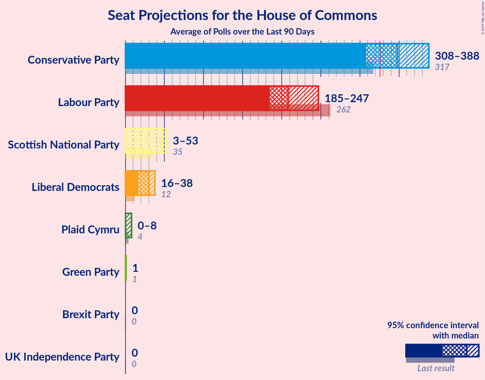
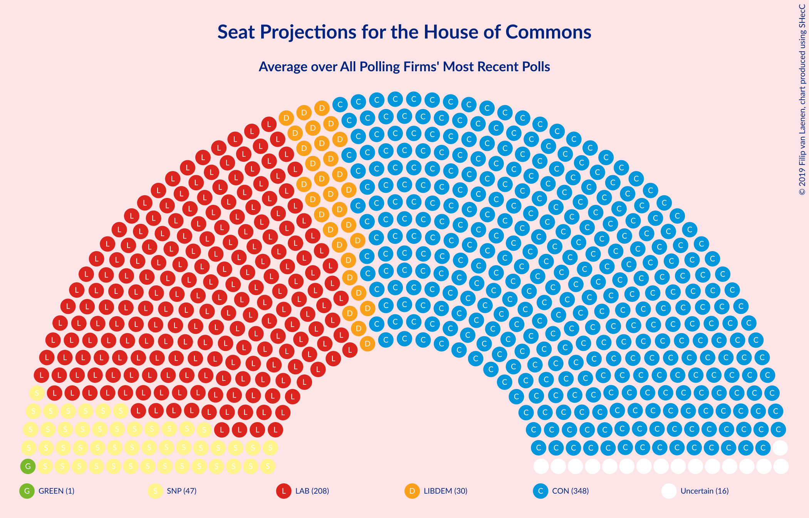
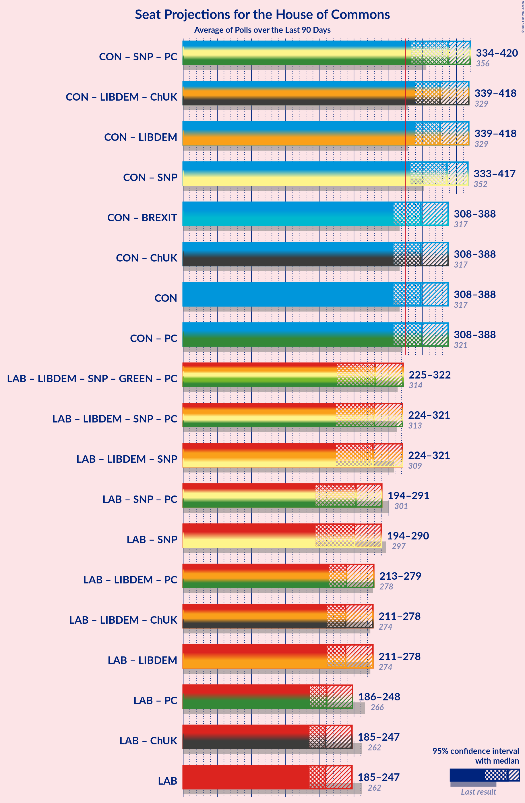

# Overview

The table below lists the most recent polls (less than 90 days old) registered and analyzed so far.

| Period     | Polling firm/Commissioner(s) | CON | LAB | LIBDEM | SNP | UKIP | GREEN | PC | BREXIT | ChUK |
|:----------:|:----------------------------:|:--:|:--:|:--:|:--:|:--:|:--:|:--:|:--:|:--:|
| 8 June 2017 | General Election | 43.4%   317 | 41.0%   262 | 7.6%   12 | 3.1%   35 | 1.9%   0 | 1.7%   1 | 0.5%   4 | 0.0%   0 | 0.0%   0 |
| N/A | [Poll Average](average.html) | 40–46%   308–388 | 30–37%   185–247 | 9–15%   16–38 | 2–5%   3–53 | 0–1%   0 | 2–4%   1 | 0–1%   0–8 | 2–5%   0 | N/A   N/A |
| [10–11 December 2019](2019-12-11-Survation.html) | Survation | 43–47%   333–378 | 32–36%   186–225 | 8–10%   13–22 | 3–5%   41–54 | N/A   N/A | 2–4%   1 | 1%   5–8 | 2–4%   0 | N/A   N/A |
| [10–11 December 2019](2019-12-11-Panelbase.html) | Panelbase | 41–45%   320–360 | 32–36%   198–234 | 10–12%   22–30 | 3–5%   41–52 | N/A   N/A | 2–4%   1 | 0–1%   0–3 | 3–5%   0 | N/A   N/A |
| [10–11 December 2019](2019-12-11-Opinium.html) | Opinium | 44–47%   336–375 | 32–35%   185–217 | 11–13%   26–31 | 3–5%   41–51 | N/A   N/A | 2–3%   1 | 0–1%   0–3 | 2–3%   0 | N/A   N/A |
| [9–11 December 2019](2019-12-11-KantarPublic.html) | Kantar Public | 42–46%   333–373 | 30–34%   183–218 | 12–14%   30–34 | 3–5%   41–51 | N/A   N/A | 2–4%   1 | 0–1%   0–3 | 2–4%   0 | N/A   N/A |
| [9–11 December 2019](2019-12-11-IpsosMORI.html) | Ipsos MORI   Evening Standard | 42–46%   339–380 | 31–35%   185–227 | 11–13%   26–33 | N/A   N/A | N/A   N/A | 2–4%   1 | N/A   N/A | 1–3%   0 | N/A   N/A |
| [9–11 December 2019](2019-12-11-Deltapoll.html) | Deltapoll | 42–47%   322–376 | 32–37%   190–238 | 9–11%   16–29 | 3–5%   39–54 | N/A   N/A | 2–4%   1 | 0–1%   0–3 | 3–5%   0 | N/A   N/A |
| [6–11 December 2019](2019-12-11-BMGResearch.html) | BMG Research | 39–43%   318–374 | 30–34%   187–237 | 12–16%   31–44 | N/A   N/A | N/A   N/A | 2–4%   1 | N/A   N/A | 3–5%   0 | N/A   N/A |
| [8–10 December 2019](2019-12-10-NumberCruncherPolitics.html) | Number Cruncher Politics   Bloomberg | 40–46%   311–376 | 30–36%   179–235 | 10–14%   21–35 | 3–5%   36–54 | N/A   N/A | 2–4%   1 | 1–2%   3–10 | 2–4%   0 | N/A   N/A |
| [9–10 December 2019](2019-12-10-ComRes.html) | ComRes   Daily Telegraph | 39–43%   286–335 | 34–38%   217–262 | 11–13%   26–35 | 3–5%   40–54 | N/A   N/A | 1–3%   1 | N/A   N/A | 2–4%   0 | N/A   N/A |
| [6–9 December 2019](2019-12-09-ICMResearch.html) | ICM Research | 40–44%   303–351 | 34–38%   214–264 | 11–14%   26–35 | 2–4%   17–48 | 0–1%   0 | 1–3%   1 | 0–1%   0–3 | 2–4%   0 | N/A   N/A |
| [5–8 December 2019](2019-12-08-Qriously.html) | Qriously | 41–46%   358–401 | 28–32%   179–229 | 11–14%   28–35 | 2–3%   0–34 | N/A   N/A | 3–5%   1–3 | N/A   N/A | 2–4%   0 | N/A   N/A |
| [5–6 December 2019](2019-12-06-YouGov.html) | YouGov   The Sunday Times | 41–45%   316–370 | 31–35%   186–232 | 11–15%   29–36 | 3–5%   40–53 | N/A   N/A | 2–4%   1 | 0–1%   0–3 | 2–4%   0 | N/A   N/A |
| 8 June 2017 | General Election | 43.4%   317 | 41.0%   262 | 7.6%   12 | 3.1%   35 | 1.9%   0 | 1.7%   1 | 0.5%   4 | 0.0%   0 | 0.0%   0 |

Only polls for which at least the sample size has been published are included in the table above.

**Legend:**
+ **Top half of each row:** Voting intentions (95% confidence interval)
+ **Bottom half of each row:** Seat projections for the House of Commons (95% confidence interval)
+ **CON:** Conservative Party
+ **LAB:** Labour Party
+ **LIBDEM:** Liberal Democrats
+ **SNP:** Scottish National Party
+ **UKIP:** UK Independence Party
+ **GREEN:** Green Party
+ **PC:** Plaid Cymru
+ **BREXIT:** Brexit Party
+ **ChUK:** Change UK
+ **N/A (single party):** Party not included the published results
+ **N/A (entire row):** Calculation for this opinion poll not started yet

