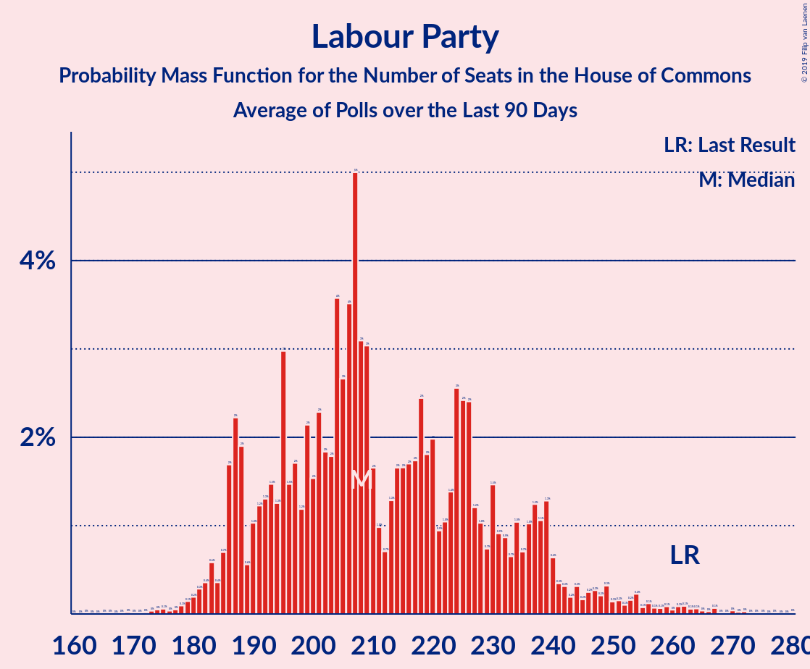

# Labour Party

<a href="#voting-intentions">Voting Intentions</a> | <a href="#seats">Seats</a>

## Voting Intentions

Last result: **41.0%** (General Election of 8 June 2017)

### Confidence Intervals

| Period     | Polling firm/Commissioner(s) | Median | 80% Confidence Interval | 90% Confidence Interval | 95% Confidence Interval | 99% Confidence Interval |
|:----------:|:----------------:|:-----------:|:-----------------------:|:-----------------------:|:-----------------------:|:-----------------------:|
| N/A | [Poll Average](average.html) | 33.4% | 31.0–36.0% | 30.2–36.7% | 29.7–37.2% | 28.8–38.1% |
| [10–11 December 2019](2019-12-11-Survation.html) | Survation | 34.0% | 32.8–35.3% | 32.4–35.6% | 32.1–35.9% | 31.5–36.5% |
| [10–11 December 2019](2019-12-11-Panelbase.html) | Panelbase | 34.0% | 32.9–35.1% | 32.6–35.4% | 32.4–35.7% | 31.9–36.2% |
| [10–11 December 2019](2019-12-11-Opinium.html) | Opinium | 33.2% | 32.1–34.4% | 31.8–34.7% | 31.6–35.0% | 31.1–35.5% |
| [9–11 December 2019](2019-12-11-KantarPublic.html) | Kantar Public | 31.9% | 30.8–33.1% | 30.5–33.4% | 30.2–33.7% | 29.7–34.2% |
| [9–11 December 2019](2019-12-11-IpsosMORI.html) | Ipsos MORI   Evening Standard | 33.0% | 31.7–34.3% | 31.4–34.7% | 31.0–35.0% | 30.5–35.6% |
| [9–11 December 2019](2019-12-11-Deltapoll.html) | Deltapoll | 34.5% | 33.1–35.9% | 32.7–36.4% | 32.3–36.7% | 31.7–37.4% |
| [6–11 December 2019](2019-12-11-BMGResearch.html) | BMG Research | 32.0% | 30.5–33.5% | 30.1–33.9% | 29.8–34.3% | 29.1–35.0% |
| [8–10 December 2019](2019-12-10-NumberCruncherPolitics.html) | Number Cruncher Politics   Bloomberg | 33.0% | 31.1–34.9% | 30.6–35.5% | 30.2–36.0% | 29.3–36.9% |
| [9–10 December 2019](2019-12-10-ComRes.html) | ComRes   Daily Telegraph | 36.0% | 34.6–37.4% | 34.2–37.8% | 33.9–38.1% | 33.3–38.8% |
| [6–9 December 2019](2019-12-09-ICMResearch.html) | ICM Research | 36.2% | 34.8–37.6% | 34.4–38.0% | 34.1–38.3% | 33.5–39.0% |
| [5–8 December 2019](2019-12-08-Qriously.html) | Qriously | 30.3% | 29.1–31.6% | 28.7–31.9% | 28.4–32.2% | 27.8–32.9% |
| [6–8 December 2019](2019-12-08-ComRes.html) | ComRes   Remain United | 35.6% | 34.8–36.4% | 34.5–36.6% | 34.4–36.8% | 34.0–37.2% |
| [5–7 December 2019](2019-12-07-Survation.html) | Survation   Good Morning Britain | 30.7% | 28.9–32.6% | 28.4–33.2% | 28.0–33.7% | 27.1–34.6% |
| [5–7 December 2019](2019-12-07-Deltapoll.html) | Deltapoll   The Mail on Sunday | 33.3% | 31.7–34.8% | 31.3–35.3% | 30.9–35.7% | 30.2–36.4% |
| [5–6 December 2019](2019-12-06-YouGov.html) | YouGov   The Sunday Times | 32.9% | 31.5–34.4% | 31.1–34.8% | 30.7–35.2% | 30.0–35.9% |
| [4–6 December 2019](2019-12-06-Panelbase.html) | Panelbase | 33.9% | 32.6–35.3% | 32.2–35.7% | 31.9–36.0% | 31.2–36.6% |
| [4–6 December 2019](2019-12-06-Opinium.html) | Opinium   The Observer | 30.9% | 29.6–32.3% | 29.2–32.6% | 28.9–33.0% | 28.3–33.6% |
| [4–6 December 2019](2019-12-06-BMGResearch.html) | BMG Research   The Independent | 32.1% | 30.6–33.7% | 30.2–34.1% | 29.8–34.5% | 29.1–35.2% |
| [4–5 December 2019](2019-12-05-ComRes.html) | ComRes   The Sunday Telegraph | 33.0% | 31.7–34.4% | 31.3–34.7% | 31.0–35.1% | 30.3–35.7% |
| [2–4 December 2019](2019-12-04-IpsosMORI.html) | Ipsos MORI   Evening Standard | 32.0% | 30.5–33.5% | 30.1–34.0% | 29.7–34.4% | 29.0–35.1% |
| [2–3 December 2019](2019-12-03-YouGov.html) | YouGov   The Times and Sky News | 32.6% | 31.2–34.1% | 30.8–34.5% | 30.4–34.9% | 29.7–35.6% |
| [2–3 December 2019](2019-12-03-ComRes.html) | ComRes   Daily Telegraph | 32.0% | 30.7–33.3% | 30.3–33.7% | 30.0–34.1% | 29.4–34.7% |
| [28 November–2 December 2019](2019-12-02-KantarPublic.html) | Kantar Public | 31.7% | 29.9–33.5% | 29.4–34.0% | 29.0–34.5% | 28.1–35.4% |
| [29 November–2 December 2019](2019-12-02-ICMResearch.html) | ICM Research | 35.3% | 33.9–36.7% | 33.6–37.1% | 33.2–37.4% | 32.6–38.1% |
| [26–30 November 2019](2019-11-30-Survation.html) | Survation   Good Morning Britain | 33.0% | 31.1–34.8% | 30.6–35.4% | 30.2–35.8% | 29.3–36.8% |
| [28–30 November 2019](2019-11-30-Deltapoll.html) | Deltapoll   The Mail on Sunday | 32.1% | 30.6–33.6% | 30.1–34.1% | 29.8–34.5% | 29.1–35.2% |
| [28–29 November 2019](2019-11-29-YouGov.html) | YouGov   The Sunday Times | 33.9% | 32.5–35.4% | 32.1–35.9% | 31.7–36.2% | 31.0–37.0% |
| [27–29 November 2019](2019-11-29-Opinium.html) | Opinium   The Observer | 30.6% | 29.3–32.0% | 29.0–32.3% | 28.6–32.7% | 28.0–33.3% |
| [27–28 November 2019](2019-11-28-Panelbase.html) | Panelbase | 33.9% | 32.6–35.3% | 32.2–35.7% | 31.9–36.0% | 31.2–36.7% |
| [27–28 November 2019](2019-11-28-ComRes.html) | ComRes   The Sunday Telegraph | 33.0% | 31.7–34.4% | 31.3–34.7% | 31.0–35.1% | 30.3–35.7% |
| [26–27 November 2019](2019-11-27-BMGResearch.html) | BMG Research   The Independent | 33.1% | 31.6–34.6% | 31.2–35.0% | 30.8–35.4% | 30.2–36.1% |
| [25–26 November 2019](2019-11-26-YouGov.html) | YouGov   The Times and Sky News | 32.2% | 30.8–33.7% | 30.4–34.2% | 30.0–34.5% | 29.4–35.2% |
| [25–26 November 2019](2019-11-26-ComRes.html) | ComRes   Daily Telegraph | 34.4% | 33.0–35.7% | 32.6–36.1% | 32.3–36.5% | 31.7–37.1% |
| [21–25 November 2019](2019-11-25-KantarPublic.html) | Kantar Public | 31.8% | 30.0–33.7% | 29.6–34.2% | 29.1–34.6% | 28.3–35.5% |
| [22–25 November 2019](2019-11-25-ICMResearch.html) | ICM Research | 33.9% | 32.6–35.3% | 32.2–35.7% | 31.9–36.0% | 31.2–36.7% |
| [20–23 November 2019](2019-11-23-Survation.html) | Survation   Good Morning Britain | 29.4% | 27.6–31.3% | 27.1–31.8% | 26.7–32.3% | 25.8–33.2% |
| [21–23 November 2019](2019-11-23-Deltapoll.html) | Deltapoll   The Mail on Sunday | 30.2% | 28.7–31.7% | 28.2–32.1% | 27.9–32.5% | 27.2–33.3% |
| [21–22 November 2019](2019-11-22-YouGov.html) | YouGov   The Sunday Times | 29.9% | 28.5–31.4% | 28.1–31.8% | 27.8–32.2% | 27.1–32.9% |
| [20–22 November 2019](2019-11-22-Panelbase.html) | Panelbase | 32.0% | 30.7–33.4% | 30.3–33.7% | 30.0–34.1% | 29.4–34.7% |
| [20–22 November 2019](2019-11-22-Opinium.html) | Opinium   The Observer | 28.1% | 26.8–29.4% | 26.4–29.8% | 26.1–30.1% | 25.5–30.7% |
| [20–21 November 2019](2019-11-21-ComRes.html) | ComRes   The Sunday Express | 32.0% | 30.7–33.3% | 30.3–33.7% | 30.0–34.1% | 29.4–34.7% |
| [19–21 November 2019](2019-11-21-BMGResearch.html) | BMG Research | 28.5% | 27.1–30.0% | 26.7–30.4% | 26.4–30.7% | 25.7–31.4% |
| [12–20 November 2019](2019-11-20-YouGov.html) | YouGov | 28.7% | 28.2–29.3% | 28.0–29.4% | 27.9–29.6% | 27.6–29.8% |
| [18–19 November 2019](2019-11-19-YouGov.html) | YouGov   The Times | 30.0% | 28.5–31.5% | 28.1–31.9% | 27.8–32.3% | 27.1–33.0% |
| [15–19 November 2019](2019-11-19-IpsosMORI.html) | Ipsos MORI   Evening Standard | 28.0% | 26.3–29.8% | 25.9–30.3% | 25.5–30.7% | 24.7–31.6% |
| [18–19 November 2019](2019-11-19-ComRes.html) | ComRes   Daily Telegraph | 31.0% | 29.6–32.5% | 29.2–33.0% | 28.8–33.3% | 28.1–34.0% |
| [14–18 November 2019](2019-11-18-KantarPublic.html) | Kantar Public | 27.0% | 25.4–28.8% | 25.0–29.2% | 24.6–29.7% | 23.8–30.5% |
| [15–18 November 2019](2019-11-18-ICMResearch.html) | ICM Research | 31.9% | 30.6–33.3% | 30.3–33.7% | 29.9–34.0% | 29.3–34.7% |
| [14–16 November 2019](2019-11-16-Survation.html) | Survation | 28.3% | 26.6–30.2% | 26.0–30.7% | 25.6–31.2% | 24.8–32.1% |
| [10–16 November 2019](2019-11-16-Deltapoll.html) | Deltapoll   The Mail on Sunday | 30.0% | 28.5–31.6% | 28.1–32.0% | 27.8–32.4% | 27.1–33.1% |
| [14–15 November 2019](2019-11-15-YouGov.html) | YouGov   The Sunday Times | 27.7% | 26.3–29.1% | 25.9–29.5% | 25.6–29.9% | 24.9–30.6% |
| [13–15 November 2019](2019-11-15-Opinium.html) | Opinium   The Observer | 27.9% | 26.6–29.2% | 26.2–29.6% | 25.9–29.9% | 25.3–30.5% |
| [9–15 November 2019](2019-11-15-BMGResearch.html) | BMG Research | 29.0% | 27.5–30.5% | 27.1–30.9% | 26.8–31.3% | 26.1–32.0% |
| [13–14 November 2019](2019-11-14-Panelbase.html) | Panelbase | 30.2% | 28.4–32.1% | 27.9–32.6% | 27.4–33.1% | 26.6–34.0% |
| [13–14 November 2019](2019-11-14-ComRes.html) | ComRes   The Sunday Telegraph | 33.0% | 31.7–34.4% | 31.3–34.7% | 31.0–35.1% | 30.4–35.7% |
| [11–12 November 2019](2019-11-12-YouGov.html) | YouGov   The Times and Sky News | 28.0% | 26.6–29.4% | 26.2–29.9% | 25.8–30.2% | 25.2–30.9% |
| [11–12 November 2019](2019-11-12-ComRes.html) | ComRes   Daily Telegraph | 29.5% | 28.2–30.8% | 27.8–31.2% | 27.5–31.5% | 26.9–32.1% |
| [7–11 November 2019](2019-11-11-KantarPublic.html) | Kantar Public | 27.0% | 25.4–28.8% | 25.0–29.2% | 24.6–29.7% | 23.8–30.5% |
| [8–11 November 2019](2019-11-11-ICMResearch.html) | ICM Research | 30.6% | 29.3–31.9% | 29.0–32.3% | 28.6–32.7% | 28.0–33.3% |
| [8–10 November 2019](2019-11-10-ComRes.html) | ComRes   Britain Elects | 28.9% | 27.7–30.3% | 27.3–30.7% | 27.0–31.0% | 26.4–31.6% |
| [6–9 November 2019](2019-11-09-Deltapoll.html) | Deltapoll   The Mail on Sunday | 29.2% | 27.8–30.8% | 27.4–31.2% | 27.0–31.6% | 26.3–32.3% |
| [7–8 November 2019](2019-11-08-YouGov.html) | YouGov   The Sunday Times and Sky News | 25.9% | 24.6–27.3% | 24.2–27.7% | 23.9–28.1% | 23.2–28.8% |
| [6–8 November 2019](2019-11-08-Survation.html) | Survation | 29.0% | 27.7–30.3% | 27.4–30.7% | 27.1–31.0% | 26.5–31.7% |
| [6–8 November 2019](2019-11-08-Panelbase.html) | Panelbase | 29.8% | 28.1–31.7% | 27.6–32.2% | 27.1–32.7% | 26.3–33.6% |
| [6–8 November 2019](2019-11-08-Opinium.html) | Opinium   The Observer | 29.1% | 27.8–30.4% | 27.4–30.8% | 27.1–31.1% | 26.5–31.8% |
| [5–8 November 2019](2019-11-08-BMGResearch.html) | BMG Research   The Independent | 28.7% | 27.3–30.3% | 26.8–30.7% | 26.5–31.1% | 25.8–31.8% |
| [5–6 November 2019](2019-11-06-YouGov.html) | YouGov   The Times and Sky News | 24.9% | 23.6–26.3% | 23.2–26.7% | 22.9–27.0% | 22.3–27.7% |
| [30 October–5 November 2019](2019-11-05-ComRes.html) | ComRes   Remain United | 28.5% | 27.8–29.3% | 27.6–29.5% | 27.4–29.7% | 27.0–30.0% |
| [1–4 November 2019](2019-11-04-YouGov.html) | YouGov   The Times | 24.8% | 23.9–25.8% | 23.6–26.1% | 23.4–26.3% | 22.9–26.8% |
| [1–4 November 2019](2019-11-04-ICMResearch.html) | ICM Research   Reuters | 30.6% | 29.3–32.0% | 29.0–32.3% | 28.7–32.7% | 28.1–33.3% |
| [31 October–2 November 2019](2019-11-02-Deltapoll.html) | Deltapoll   The Mail on Sunday | 27.9% | 26.5–29.5% | 26.1–29.9% | 25.7–30.3% | 25.0–31.0% |
| [30 October–1 November 2019](2019-11-01-YouGov.html) | YouGov   The Sunday Times | 26.9% | 25.6–28.2% | 25.2–28.6% | 24.9–29.0% | 24.3–29.6% |
| [30 October–1 November 2019](2019-11-01-Opinium.html) | Opinium   The Observer | 25.6% | 24.4–26.9% | 24.0–27.3% | 23.7–27.6% | 23.2–28.2% |
| [30–31 October 2019](2019-10-31-Panelbase.html) | Panelbase | 29.0% | 27.2–30.8% | 26.7–31.4% | 26.2–31.9% | 25.4–32.8% |
| [30–31 October 2019](2019-10-31-ORB.html) | ORB   The Telegraph | 28.0% | 26.7–29.3% | 26.3–29.6% | 26.0–29.9% | 25.4–30.6% |
| [30–31 October 2019](2019-10-31-ComRes.html) | ComRes   Sunday Express | 28.1% | 26.6–29.6% | 26.2–30.0% | 25.9–30.3% | 25.2–31.1% |
| [29–30 October 2019](2019-10-30-YouGov.html) | YouGov   The Times | 21.1% | 19.9–22.4% | 19.6–22.8% | 19.3–23.1% | 18.7–23.8% |
| [29–30 October 2019](2019-10-30-Survation.html) | Survation | 26.0% | 24.3–27.9% | 23.8–28.4% | 23.4–28.8% | 22.6–29.7% |
| [17–28 October 2019](2019-10-28-YouGov.html) | YouGov | 21.7% | 21.2–22.2% | 21.0–22.3% | 20.9–22.4% | 20.7–22.7% |
| [25–28 October 2019](2019-10-28-IpsosMORI.html) | Ipsos MORI | 23.8% | 22.2–25.6% | 21.7–26.1% | 21.3–26.6% | 20.5–27.4% |
| [24–25 October 2019](2019-10-25-YouGov.html) | YouGov | 22.9% | 21.6–24.3% | 21.3–24.7% | 20.9–25.0% | 20.3–25.7% |
| [23–25 October 2019](2019-10-25-Opinium.html) | Opinium   The Observer | 24.1% | 22.9–25.4% | 22.6–25.8% | 22.3–26.1% | 21.7–26.7% |
| [20–21 October 2019](2019-10-21-YouGov.html) | YouGov   The Times | 21.7% | 20.4–23.0% | 20.1–23.4% | 19.8–23.7% | 19.2–24.4% |
| [18–21 October 2019](2019-10-21-Deltapoll.html) | Deltapoll | 23.9% | 22.7–25.1% | 22.4–25.5% | 22.1–25.8% | 21.5–26.4% |
| [17–18 October 2019](2019-10-18-Survation.html) | Survation   Daily Mail | 23.6% | 22.0–25.4% | 21.5–25.9% | 21.1–26.3% | 20.3–27.2% |
| [17–18 October 2019](2019-10-18-Panelbase.html) | Panelbase | 27.3% | 25.5–29.1% | 25.0–29.7% | 24.6–30.1% | 23.8–31.0% |
| [15–17 October 2019](2019-10-17-Opinium.html) | Opinium   The Observer | 23.7% | 22.5–25.0% | 22.2–25.3% | 21.9–25.6% | 21.3–26.2% |
| [16–17 October 2019](2019-10-17-ComRes.html) | ComRes   Britain Elects | 28.5% | 27.2–29.8% | 26.9–30.2% | 26.6–30.5% | 26.0–31.1% |
| [14–15 October 2019](2019-10-15-YouGov.html) | YouGov   The Times | 22.1% | 20.8–23.5% | 20.4–23.9% | 20.1–24.2% | 19.5–24.8% |
| [10–15 October 2019](2019-10-15-KantarPublic.html) | Kantar Public | 25.2% | 23.6–26.8% | 23.2–27.3% | 22.8–27.7% | 22.0–28.5% |
| [9–11 October 2019](2019-10-11-Panelbase.html) | Panelbase   The Sunday Times | 30.2% | 28.9–31.5% | 28.5–31.9% | 28.2–32.2% | 27.6–32.8% |
| [9–10 October 2019](2019-10-10-ComRes.html) | ComRes   Daily Express | 27.0% | 25.7–28.3% | 25.4–28.6% | 25.1–28.9% | 24.5–29.6% |
| [8–9 October 2019](2019-10-09-YouGov.html) | YouGov   The Times | 21.7% | 20.4–23.0% | 20.0–23.4% | 19.7–23.7% | 19.1–24.4% |
| [4–6 October 2019](2019-10-06-ComRes.html) | ComRes   Daily Telegraph | 26.5% | 25.2–27.8% | 24.9–28.1% | 24.6–28.5% | 24.0–29.1% |
| [3–4 October 2019](2019-10-04-Opinium.html) | Opinium   The Observer | 23.3% | 22.1–24.5% | 21.8–24.9% | 21.5–25.2% | 20.9–25.8% |
| [1–4 October 2019](2019-10-04-BMGResearch.html) | BMG Research   The Independent | 26.2% | 24.7–27.6% | 24.3–28.1% | 24.0–28.4% | 23.3–29.2% |
| [30 September–1 October 2019](2019-10-01-YouGov.html) | YouGov   The Times | 20.9% | 19.6–22.2% | 19.3–22.6% | 19.0–22.9% | 18.4–23.6% |
| [26–27 September 2019](2019-09-27-YouGov.html) | YouGov   The Sunday Times | 21.9% | 20.6–23.2% | 20.2–23.6% | 19.9–24.0% | 19.3–24.6% |
| [25–27 September 2019](2019-09-27-Opinium.html) | Opinium   The Observer | 23.9% | 22.7–25.1% | 22.3–25.5% | 22.0–25.8% | 21.5–26.4% |
| [24–25 September 2019](2019-09-25-YouGov.html) | YouGov   The Times | 21.1% | 19.8–22.5% | 19.5–22.8% | 19.2–23.2% | 18.6–23.8% |
| [25 September 2019](2019-09-25-Survation.html) | Survation   Daily Mail | 24.0% | 22.4–25.8% | 21.9–26.3% | 21.5–26.8% | 20.7–27.6% |
| [24 September 2019](2019-09-24-ComRes.html) | ComRes   Daily Telegraph | 28.1% | 26.4–30.0% | 25.9–30.5% | 25.5–31.0% | 24.6–31.9% |
| [19–20 September 2019](2019-09-20-YouGov.html) | YouGov   People's Vote | 23.1% | 21.9–24.3% | 21.6–24.7% | 21.3–25.0% | 20.7–25.6% |
| [19–20 September 2019](2019-09-20-Opinium.html) | Opinium   The Observer | 22.1% | 20.9–23.3% | 20.6–23.7% | 20.3–24.0% | 19.8–24.6% |
| [18–19 September 2019](2019-09-19-ComRes.html) | ComRes   Britain Elects | 27.4% | 26.1–28.7% | 25.8–29.0% | 25.5–29.3% | 24.9–30.0% |
| [17–18 September 2019](2019-09-18-YouGov.html) | YouGov   The Times | 20.5% | 19.3–21.9% | 18.9–22.2% | 18.6–22.6% | 18.0–23.2% |
| [13–16 September 2019](2019-09-16-IpsosMORI.html) | Ipsos MORI   Evening Standard | 24.2% | 22.5–26.0% | 22.0–26.5% | 21.6–26.9% | 20.8–27.8% |
| [12–15 September 2019](2019-09-15-ComRes.html) | ComRes   Sunday Express | 27.0% | 25.7–28.3% | 25.4–28.6% | 25.1–28.9% | 24.5–29.6% |
| [11–13 September 2019](2019-09-13-Opinium.html) | Opinium   The Observer | 25.1% | 23.9–26.4% | 23.6–26.8% | 23.3–27.1% | 22.7–27.7% |
| [9–10 September 2019](2019-09-10-YouGov.html) | YouGov   The Times | 22.9% | 21.6–24.2% | 21.2–24.6% | 20.9–24.9% | 20.3–25.6% |
| [5–9 September 2019](2019-09-09-KantarPublic.html) | Kantar Public | 24.0% | 22.5–25.7% | 22.0–26.2% | 21.6–26.6% | 20.9–27.4% |
| [6–8 September 2019](2019-09-08-ComRes.html) | ComRes   Daily Telegraph | 28.9% | 27.6–30.2% | 27.3–30.6% | 27.0–30.9% | 26.4–31.6% |
| [5–7 September 2019](2019-09-07-Deltapoll.html) | Deltapoll   The Sun on Sunday | 27.9% | 26.7–29.2% | 26.3–29.6% | 26.0–29.9% | 25.4–30.5% |
| [5–6 September 2019](2019-09-06-YouGov.html) | YouGov   The Sunday Times | 20.9% | 19.6–22.2% | 19.3–22.6% | 19.0–22.9% | 18.4–23.5% |
| [5–6 September 2019](2019-09-06-Survation.html) | Survation   Daily Mail | 23.7% | 22.1–25.5% | 21.6–26.0% | 21.2–26.4% | 20.4–27.3% |
| [5–6 September 2019](2019-09-06-Panelbase.html) | Panelbase | 28.3% | 26.6–30.2% | 26.1–30.7% | 25.6–31.2% | 24.8–32.1% |
| [4–6 September 2019](2019-09-06-Opinium.html) | Opinium   The Observer | 24.9% | 23.7–26.2% | 23.3–26.5% | 23.0–26.8% | 22.5–27.5% |
| [4–6 September 2019](2019-09-06-ComRes.html) | ComRes   Britain Elects | 27.0% | 25.7–28.3% | 25.4–28.7% | 25.1–29.0% | 24.5–29.6% |
| [3–6 September 2019](2019-09-06-BMGResearch.html) | BMG Research   The Independent | 25.3% | 23.9–26.8% | 23.5–27.2% | 23.2–27.6% | 22.5–28.3% |
| [3–4 September 2019](2019-09-04-HanburyStrategy.html) | Hanbury Strategy | 25.8% | 24.1–27.7% | 23.6–28.2% | 23.2–28.7% | 22.4–29.5% |
| [2–3 September 2019](2019-09-03-YouGov.html) | YouGov   The Times | 24.9% | 23.5–26.3% | 23.2–26.7% | 22.8–27.1% | 22.2–27.7% |
| [29–31 August 2019](2019-08-31-Deltapoll.html) | Deltapoll   The Mail on Sunday | 23.5% | 22.3–24.7% | 22.0–25.1% | 21.7–25.4% | 21.1–26.0% |
| [29–30 August 2019](2019-08-30-Survation.html) | Survation   Daily Mail | 23.7% | 22.1–25.5% | 21.6–26.0% | 21.2–26.4% | 20.4–27.3% |
| [28–29 August 2019](2019-08-29-YouGov.html) | YouGov | 21.7% | 20.5–23.0% | 20.2–23.3% | 19.9–23.6% | 19.3–24.2% |
| [27–28 August 2019](2019-08-28-YouGov.html) | YouGov   The Times | 21.9% | 20.7–23.1% | 20.4–23.5% | 20.1–23.8% | 19.6–24.4% |
| [22–23 August 2019](2019-08-23-YouGov.html) | YouGov   The Sunday Times | 19.3% | 18.2–20.4% | 17.9–20.8% | 17.6–21.0% | 17.1–21.6% |
| [21–23 August 2019](2019-08-23-Opinium.html) | Opinium   The Observer | 25.7% | 24.5–27.0% | 24.1–27.3% | 23.8–27.6% | 23.2–28.3% |
| [20–21 August 2019](2019-08-21-YouGov.html) | YouGov   The Times | 21.9% | 20.6–23.2% | 20.3–23.6% | 20.0–23.9% | 19.4–24.6% |
| [15–19 August 2019](2019-08-19-KantarPublic.html) | Kantar Public | 27.9% | 26.2–29.6% | 25.8–30.1% | 25.3–30.6% | 24.6–31.4% |
| [13–14 August 2019](2019-08-14-YouGov.html) | YouGov   The Times | 20.7% | 19.5–22.1% | 19.1–22.5% | 18.8–22.8% | 18.2–23.4% |
| [7–12 August 2019](2019-08-12-BMGResearch.html) | BMG Research   The Independent | 24.9% | 23.5–26.4% | 23.2–26.8% | 22.8–27.2% | 22.2–27.9% |
| [6–11 August 2019](2019-08-11-Survation.html) | Survation | 24.2% | 23.0–25.4% | 22.6–25.8% | 22.3–26.1% | 21.8–26.7% |
| [9–11 August 2019](2019-08-11-ComRes.html) | ComRes   Daily Telegraph | 26.9% | 25.6–28.2% | 25.3–28.5% | 25.0–28.8% | 24.4–29.5% |
| [8–9 August 2019](2019-08-09-Opinium.html) | Opinium   The Observer | 28.2% | 26.9–29.5% | 26.5–29.9% | 26.2–30.2% | 25.6–30.8% |
| [5–6 August 2019](2019-08-06-YouGov.html) | YouGov   The Times | 21.8% | 20.5–23.2% | 20.2–23.5% | 19.9–23.9% | 19.3–24.6% |
| [29–30 July 2019](2019-07-30-YouGov.html) | YouGov   The Times | 22.8% | 21.7–24.1% | 21.4–24.4% | 21.1–24.7% | 20.5–25.3% |
| [26–30 July 2019](2019-07-30-IpsosMORI.html) | Ipsos MORI | 22.9% | 21.3–24.7% | 20.8–25.2% | 20.4–25.7% | 19.7–26.5% |
| [26–28 July 2019](2019-07-28-ComRes.html) | ComRes   Britain Elects | 29.3% | 28.1–30.7% | 27.7–31.0% | 27.4–31.4% | 26.8–32.0% |
| [25–27 July 2019](2019-07-27-Deltapoll.html) | Deltapoll   The Mail on Sunday | 25.0% | 23.8–26.3% | 23.4–26.6% | 23.1–26.9% | 22.6–27.6% |
| [25–26 July 2019](2019-07-26-YouGov.html) | YouGov   The Sunday Times | 20.9% | 19.7–22.2% | 19.3–22.6% | 19.0–22.9% | 18.5–23.6% |
| [24–26 July 2019](2019-07-26-Opinium.html) | Opinium   The Observer | 27.4% | 26.1–28.7% | 25.8–29.1% | 25.5–29.4% | 24.9–30.0% |
| [24–25 July 2019](2019-07-25-ComRes.html) | ComRes   Sunday Express | 27.2% | 25.9–28.5% | 25.6–28.8% | 25.3–29.1% | 24.7–29.8% |
| [23–24 July 2019](2019-07-24-YouGov.html) | YouGov   The Times | 18.6% | 17.4–19.9% | 17.1–20.2% | 16.8–20.5% | 16.3–21.1% |
| [16–17 July 2019](2019-07-17-YouGov.html) | YouGov   The Times | 21.1% | 19.9–22.4% | 19.5–22.8% | 19.3–23.1% | 18.7–23.7% |
| [15–16 July 2019](2019-07-16-ComRes.html) | ComRes | 27.7% | 26.4–29.0% | 26.1–29.3% | 25.8–29.7% | 25.2–30.3% |
| [10–11 July 2019](2019-07-11-Survation.html) | Survation | 28.8% | 27.0–30.6% | 26.5–31.2% | 26.0–31.6% | 25.2–32.5% |
| [10–11 July 2019](2019-07-11-ComRes.html) | ComRes   The Express | 28.0% | 26.6–29.4% | 26.3–29.8% | 25.9–30.1% | 25.3–30.8% |
| [9–10 July 2019](2019-07-10-YouGov.html) | YouGov   The Times | 19.9% | 18.7–21.2% | 18.4–21.6% | 18.1–21.9% | 17.5–22.6% |
| [5–7 July 2019](2019-07-07-ComRes.html) | ComRes   Daily Telegraph | 28.4% | 27.1–29.7% | 26.8–30.1% | 26.5–30.4% | 25.9–31.1% |
| [3–5 July 2019](2019-07-05-Opinium.html) | Opinium   The Observer | 24.7% | 23.5–25.9% | 23.1–26.3% | 22.8–26.6% | 22.3–27.2% |
| [2–5 July 2019](2019-07-05-BMGResearch.html) | BMG Research   The Independent | 27.2% | 25.8–28.7% | 25.4–29.1% | 25.0–29.5% | 24.4–30.2% |
| [2–3 July 2019](2019-07-03-YouGov.html) | YouGov   The Times | 17.9% | 16.7–19.2% | 16.4–19.5% | 16.1–19.8% | 15.5–20.5% |
| [24–25 June 2019](2019-06-25-YouGov.html) | YouGov   The Times | 20.0% | 18.9–21.1% | 18.5–21.5% | 18.3–21.7% | 17.8–22.3% |
| [21–25 June 2019](2019-06-25-IpsosMORI.html) | Ipsos MORI | 24.4% | 22.7–26.1% | 22.2–26.6% | 21.8–27.1% | 21.1–27.9% |
| [19–20 June 2019](2019-06-20-Survation.html) | Survation   Daily Mail on Sunday | 25.7% | 24.5–27.0% | 24.2–27.4% | 23.9–27.7% | 23.3–28.3% |
| [19–20 June 2019](2019-06-20-Opinium.html) | Opinium   The Observer | 26.0% | 24.8–27.3% | 24.4–27.6% | 24.1–28.0% | 23.5–28.6% |
| [13–14 June 2019](2019-06-14-YouGov.html) | YouGov   The Sunday Times | 21.1% | 19.9–22.4% | 19.5–22.8% | 19.2–23.1% | 18.6–23.8% |
| [9–10 June 2019](2019-06-10-YouGov.html) | YouGov   The Times | 19.2% | 18.0–20.4% | 17.6–20.8% | 17.3–21.1% | 16.8–21.7% |
| [7–9 June 2019](2019-06-09-ComRes.html) | ComRes   Daily Telegraph | 26.7% | 25.5–28.0% | 25.1–28.4% | 24.8–28.7% | 24.2–29.3% |
| [4–7 June 2019](2019-06-07-BMGResearch.html) | BMG Research   The Independent | 26.7% | 25.3–28.2% | 24.9–28.6% | 24.5–29.0% | 23.9–29.7% |
| [4–6 June 2019](2019-06-06-YouGov.html) | YouGov   The Times | 19.9% | 18.6–21.2% | 18.3–21.6% | 18.0–21.9% | 17.4–22.6% |
| [28–30 May 2019](2019-05-30-Opinium.html) | Opinium   The Observer | 22.0% | 20.8–23.2% | 20.5–23.6% | 20.2–23.9% | 19.7–24.5% |
| [29–30 May 2019](2019-05-30-Deltapoll.html) | Deltapoll   The Mail on Sunday | 25.5% | 24.4–26.6% | 24.1–27.0% | 23.8–27.3% | 23.3–27.8% |
| [28–29 May 2019](2019-05-29-YouGov.html) | YouGov   The Times | 18.9% | 17.8–20.2% | 17.5–20.5% | 17.2–20.9% | 16.6–21.5% |
| [23–24 May 2019](2019-05-24-LordAshcroft.html) | Lord Ashcroft | 21.0% | 20.5–21.5% | 20.3–21.7% | 20.2–21.8% | 20.0–22.1% |
| [22 May 2019](2019-05-22-Survation.html) | Survation   Daily Mail | 32.9% | 31.6–34.3% | 31.2–34.7% | 30.9–35.0% | 30.3–35.7% |
| [14–21 May 2019](2019-05-21-Panelbase.html) | Panelbase   The Sunday Times | 31.0% | 29.7–32.3% | 29.3–32.7% | 29.0–33.0% | 28.4–33.7% |
| [17–20 May 2019](2019-05-20-Opinium.html) | Opinium   The Times | 26.5% | 25.2–27.8% | 24.9–28.2% | 24.6–28.5% | 24.0–29.1% |
| [8–17 May 2019](2019-05-17-YouGov.html) | YouGov   Best For Britain | 24.0% | 23.4–24.6% | 23.3–24.7% | 23.1–24.9% | 22.9–25.2% |
| [17 May 2019](2019-05-17-Survation.html) | Survation   Daily Mail | 31.6% | 29.8–33.5% | 29.2–34.1% | 28.8–34.6% | 27.9–35.5% |
| [14–16 May 2019](2019-05-16-Opinium.html) | Opinium   The Observer | 29.2% | 27.9–30.5% | 27.6–30.9% | 27.3–31.3% | 26.7–31.9% |
| [13–14 May 2019](2019-05-14-YouGov.html) | YouGov   The Times | 24.8% | 23.4–26.2% | 23.1–26.6% | 22.7–26.9% | 22.1–27.6% |
| [10–14 May 2019](2019-05-14-IpsosMORI.html) | Ipsos MORI | 26.2% | 24.5–28.0% | 24.1–28.5% | 23.7–28.9% | 22.9–29.8% |
| [9–13 May 2019](2019-05-13-KantarPublic.html) | Kantar Public | 34.0% | 32.3–35.9% | 31.8–36.4% | 31.3–36.8% | 30.5–37.7% |
| [9–13 May 2019](2019-05-13-HanburyStrategy.html) | Hanbury Strategy | 29.7% | 28.4–31.0% | 28.0–31.4% | 27.7–31.7% | 27.1–32.4% |
| [10–12 May 2019](2019-05-12-ComRes.html) | ComRes   Daily Telegraph | 27.6% | 26.3–28.9% | 26.0–29.2% | 25.7–29.6% | 25.1–30.2% |
| [8–10 May 2019](2019-05-10-Opinium.html) | Opinium   The Observer | 27.9% | 26.7–29.3% | 26.3–29.6% | 26.0–30.0% | 25.4–30.6% |
| [7–10 May 2019](2019-05-10-BMGResearch.html) | BMG Research | 30.0% | 28.5–31.5% | 28.1–31.9% | 27.7–32.3% | 27.0–33.1% |
| [8–9 May 2019](2019-05-09-YouGov.html) | YouGov   The Times | 24.2% | 23.1–25.4% | 22.8–25.8% | 22.5–26.1% | 21.9–26.7% |
| [9 May 2019](2019-05-09-ComRes.html) | ComRes   Brexit Express | 26.7% | 25.5–28.0% | 25.2–28.4% | 24.9–28.7% | 24.3–29.3% |
| [3–7 May 2019](2019-05-07-Opinium.html) | Opinium | 30.0% | 28.5–31.5% | 28.1–31.9% | 27.7–32.3% | 27.1–33.1% |
| [29–30 April 2019](2019-04-30-YouGov.html) | YouGov | 28.7% | 27.3–30.2% | 26.9–30.6% | 26.6–31.0% | 25.9–31.7% |
| [23–24 April 2019](2019-04-24-YouGov.html) | YouGov   The Times | 30.0% | 28.6–31.4% | 28.2–31.8% | 27.9–32.2% | 27.3–32.9% |
| [18–24 April 2019](2019-04-24-Panelbase.html) | Panelbase   The Sunday Times | 35.7% | 34.3–37.1% | 33.9–37.4% | 33.6–37.8% | 33.0–38.5% |
| [21–23 April 2019](2019-04-23-Opinium.html) | Opinium   The Observer | 33.0% | 31.3–34.8% | 30.8–35.3% | 30.4–35.7% | 29.6–36.6% |
| [16–17 April 2019](2019-04-17-YouGov.html) | YouGov   The Times | 30.0% | 28.7–31.5% | 28.3–31.9% | 27.9–32.2% | 27.3–32.9% |
| [17 April 2019](2019-04-17-OnePoll.html) | OnePoll   The Sun on Sunday | 32.0% | 30.7–33.4% | 30.3–33.7% | 30.0–34.1% | 29.4–34.7% |
| [16–17 April 2019](2019-04-17-ORB.html) | ORB   The Telegraph | 29.0% | 27.6–30.5% | 27.2–31.0% | 26.8–31.3% | 26.1–32.1% |
| [9–12 April 2019](2019-04-12-Opinium.html) | Opinium   The Observer | 36.0% | 34.7–37.4% | 34.3–37.8% | 33.9–38.1% | 33.3–38.8% |
| [4–8 April 2019](2019-04-08-KantarPublic.html) | Kantar Public | 34.6% | 32.9–36.5% | 32.4–37.0% | 32.0–37.4% | 31.1–38.3% |
| [5–8 April 2019](2019-04-08-HanburyStrategy.html) | Hanbury Strategy   Open Europe | 39.6% | 38.2–41.0% | 37.8–41.4% | 37.5–41.8% | 36.8–42.4% |
| [3–6 April 2019](2019-04-06-Survation.html) | Survation | 40.6% | 39.8–41.4% | 39.6–41.6% | 39.4–41.9% | 39.0–42.2% |
| [2–5 April 2019](2019-04-05-BMGResearch.html) | BMG Research   The Independent | 34.3% | 32.8–35.9% | 32.3–36.4% | 32.0–36.8% | 31.2–37.6% |
| [2–3 April 2019](2019-04-03-YouGov.html) | YouGov | 31.0% | 29.6–32.4% | 29.2–32.8% | 28.9–33.2% | 28.2–33.9% |
| [28–30 March 2019](2019-03-30-Deltapoll.html) | Deltapoll   The Mail on Sunday | 40.6% | 38.6–42.6% | 38.1–43.2% | 37.6–43.7% | 36.7–44.6% |
| [28–29 March 2019](2019-03-29-Opinium.html) | Opinium   The Observer | 34.9% | 33.6–36.3% | 33.2–36.7% | 32.8–37.0% | 32.2–37.7% |
| [24–25 March 2019](2019-03-25-YouGov.html) | YouGov   The Times | 33.0% | 31.7–34.3% | 31.3–34.7% | 31.0–35.0% | 30.4–35.7% |
| [20–22 March 2019](2019-03-22-Opinium.html) | Opinium   The Observer | 35.0% | 33.7–36.4% | 33.3–36.8% | 33.0–37.1% | 32.3–37.8% |
| [15–19 March 2019](2019-03-19-IpsosMORI.html) | Ipsos MORI | 34.0% | 32.2–35.9% | 31.6–36.5% | 31.2–36.9% | 30.3–37.9% |
| [14–15 March 2019](2019-03-15-YouGov.html) | YouGov   People’s Vote | 33.0% | 30.2–33.1% | 29.8–33.5% | 29.5–33.8% | 28.8–34.5% |
| [15 March 2019](2019-03-15-Survation.html) | Survation   Daily Mail | 39.3% | 37.4–41.3% | 36.8–41.9% | 36.4–42.4% | 35.4–43.3% |
| [12–15 March 2019](2019-03-15-Opinium.html) | Opinium   The Observer | 34.0% | 32.7–35.4% | 32.3–35.8% | 31.9–36.2% | 31.3–36.8% |
| [7–11 March 2019](2019-03-11-KantarPublic.html) | Kantar Public | 31.3% | 29.6–33.1% | 29.1–33.6% | 28.7–34.1% | 27.9–34.9% |
| [4–8 March 2019](2019-03-08-BMGResearch.html) | BMG Research | 34.0% | 32.4–35.6% | 32.0–36.0% | 31.6–36.4% | 30.9–37.2% |
| [3–4 March 2019](2019-03-04-YouGov.html) | YouGov   The Times | 31.0% | 29.7–32.3% | 29.4–32.6% | 29.1–33.0% | 28.5–33.6% |
| [26 February–1 March 2019](2019-03-01-Opinium.html) | Opinium   The Observer | 33.7% | 32.3–35.1% | 31.9–35.5% | 31.6–35.8% | 31.0–36.5% |
| [22–23 February 2019](2019-02-23-YouGov.html) | YouGov   The Times | 30.0% | 28.6–31.5% | 28.2–31.9% | 27.9–32.3% | 27.2–33.0% |
| [21–23 February 2019](2019-02-23-Deltapoll.html) | Deltapoll   The Mail on Sunday | 36.3% | 34.4–38.3% | 33.9–38.8% | 33.4–39.3% | 32.5–40.3% |
| [18–19 February 2019](2019-02-19-YouGov.html) | YouGov   The Times | 33.3% | 31.9–34.8% | 31.5–35.1% | 31.2–35.5% | 30.5–36.2% |
| [18 February 2019](2019-02-18-Survation.html) | Survation   Daily Mail | 35.7% | 33.8–37.6% | 33.3–38.2% | 32.8–38.7% | 31.9–39.6% |
| [13–15 February 2019](2019-02-15-Opinium.html) | Opinium   The Observer | 37.3% | 35.9–38.7% | 35.5–39.1% | 35.2–39.4% | 34.5–40.1% |
| [7–11 February 2019](2019-02-11-KantarPublic.html) | Kantar Public | 35.0% | 33.2–36.9% | 32.7–37.4% | 32.3–37.8% | 31.5–38.7% |
| [4–8 February 2019](2019-02-08-BMGResearch.html) | BMG Research | 34.7% | 33.1–36.3% | 32.7–36.7% | 32.3–37.1% | 31.6–37.9% |
| [1–5 February 2019](2019-02-05-IpsosMORI.html) | Ipsos MORI | 37.6% | 35.7–39.6% | 35.1–40.2% | 34.7–40.7% | 33.7–41.6% |
| [3–4 February 2019](2019-02-04-YouGov.html) | YouGov   The Times | 34.0% | 32.6–35.4% | 32.2–35.8% | 31.9–36.2% | 31.2–36.9% |
| [30 January–1 February 2019](2019-02-01-Opinium.html) | Opinium   The Observer | 34.0% | 32.7–35.4% | 32.3–35.8% | 31.9–36.2% | 31.3–36.8% |
| [30 January 2019](2019-01-30-Survation.html) | Survation   Daily Mail | 39.4% | 37.4–41.3% | 36.9–41.9% | 36.4–42.4% | 35.5–43.3% |
| [23–25 January 2019](2019-01-25-Opinium.html) | Opinium   People’s Vote | 36.0% | 34.6–37.4% | 34.2–37.8% | 33.9–38.1% | 33.3–38.8% |
| [16–18 January 2019](2019-01-18-Opinium.html) | Opinium   The Observer | 39.2% | 37.8–40.6% | 37.4–41.0% | 37.1–41.4% | 36.5–42.1% |
| [16–18 January 2019](2019-01-18-ICMResearch.html) | ICM Research | 39.9% | 38.5–41.3% | 38.1–41.7% | 37.8–42.0% | 37.1–42.7% |
| [10–17 January 2019](2019-01-17-NumberCruncherPolitics.html) | Number Cruncher Politics   Politico | 39.4% | 37.5–41.4% | 36.9–42.0% | 36.5–42.4% | 35.6–43.4% |
| [16–17 January 2019](2019-01-17-ComRes.html) | ComRes   Sunday Express | 37.0% | 35.6–38.4% | 35.2–38.8% | 34.9–39.1% | 34.2–39.8% |
| [14–15 January 2019](2019-01-15-ComRes.html) | ComRes   Daily Express | 39.4% | 38.0–40.8% | 37.6–41.2% | 37.3–41.6% | 36.6–42.2% |
| [13–14 January 2019](2019-01-14-YouGov.html) | YouGov   The Times | 34.0% | 32.5–35.5% | 32.1–35.9% | 31.8–36.3% | 31.1–37.0% |
| [10–14 January 2019](2019-01-14-KantarPublic.html) | Kantar Public | 38.0% | 36.1–39.9% | 35.6–40.4% | 35.1–40.9% | 34.3–41.8% |
| [10–11 January 2019](2019-01-11-Survation.html) | Survation   Daily Mail | 40.6% | 38.6–42.6% | 38.1–43.1% | 37.6–43.6% | 36.7–44.6% |
| [8–11 January 2019](2019-01-11-BMGResearch.html) | BMG Research   The Independent | 36.0% | 34.4–37.6% | 34.0–38.1% | 33.6–38.5% | 32.9–39.2% |
| [6–7 January 2019](2019-01-07-YouGov.html) | YouGov   The Times | 35.3% | 33.8–36.9% | 33.4–37.3% | 33.1–37.7% | 32.3–38.4% |
| [21 December 2018–4 January 2019](2019-01-04-YouGov.html) | YouGov   People’s Vote | 34.7% | 34.3–35.1% | 34.2–35.2% | 34.1–35.3% | 33.9–35.5% |
| [18–20 December 2018](2018-12-20-Opinium.html) | Opinium | 38.9% | 37.5–40.4% | 37.1–40.8% | 36.8–41.1% | 36.1–41.8% |
| [16–17 December 2018](2018-12-17-YouGov.html) | YouGov   The Times | 39.0% | 37.4–40.5% | 37.0–41.0% | 36.7–41.4% | 35.9–42.1% |
| [12–14 December 2018](2018-12-14-YouGov.html) | YouGov   People’s Vote | 36.4% | 35.5–37.3% | 35.3–37.5% | 35.0–37.7% | 34.6–38.1% |
| [13–14 December 2018](2018-12-14-Opinium.html) | Opinium   The Observer | 38.9% | 37.5–40.3% | 37.1–40.7% | 36.8–41.0% | 36.1–41.7% |
| [10–11 December 2018](2018-12-11-Populus.html) | Populus | 40.8% | 39.4–42.2% | 39.0–42.6% | 38.7–43.0% | 38.0–43.7% |
| [6–7 December 2018](2018-12-07-YouGov.html) | YouGov   The Sunday Times | 37.8% | 36.3–39.3% | 35.8–39.8% | 35.5–40.1% | 34.7–40.9% |
| [5–6 December 2018](2018-12-06-KantarPublic.html) | Kantar Public | 37.6% | 35.8–39.4% | 35.3–40.0% | 34.9–40.4% | 34.0–41.3% |
| [30 November–5 December 2018](2018-12-05-IpsosMORI.html) | Ipsos MORI | 38.0% | 36.1–40.0% | 35.6–40.5% | 35.1–41.0% | 34.2–42.0% |
| [3–4 December 2018](2018-12-04-YouGov.html) | YouGov   The Times | 37.6% | 36.1–39.2% | 35.7–39.6% | 35.3–40.0% | 34.6–40.8% |
| [30 November–2 December 2018](2018-12-02-ComRes.html) | ComRes   Sunday Express | 39.7% | 38.3–41.1% | 37.9–41.5% | 37.6–41.9% | 36.9–42.5% |
| [26–27 November 2018](2018-11-27-YouGov.html) | YouGov   The Times | 35.3% | 33.9–36.8% | 33.5–37.3% | 33.1–37.6% | 32.4–38.3% |
| [18–19 November 2018](2018-11-19-YouGov.html) | YouGov   The Times | 36.7% | 35.2–38.3% | 34.8–38.7% | 34.5–39.1% | 33.7–39.8% |
| [14–15 November 2018](2018-11-15-Opinium.html) | Opinium | 39.0% | 37.2–40.8% | 36.7–41.3% | 36.3–41.8% | 35.4–42.7% |
| [14–15 November 2018](2018-11-15-ComRes.html) | ComRes   Sunday Express | 40.0% | 38.6–41.4% | 38.2–41.8% | 37.9–42.2% | 37.2–42.9% |
| [8–12 November 2018](2018-11-12-KantarPublic.html) | Kantar Public | 39.0% | 37.1–40.8% | 36.6–41.4% | 36.2–41.8% | 35.3–42.7% |
| [2–7 November 2018](2018-11-07-Panelbase.html) | Panelbase   Constitutional Commission | 39.5% | 38.1–40.9% | 37.7–41.3% | 37.4–41.6% | 36.7–42.3% |
| [4–5 November 2018](2018-11-05-YouGov.html) | YouGov   The Times | 37.4% | 35.9–38.9% | 35.4–39.4% | 35.1–39.8% | 34.3–40.5% |
| [20 October–2 November 2018](2018-11-02-Survation.html) | Survation   Channel 4 | 40.8% | 40.4–41.3% | 40.2–41.4% | 40.1–41.5% | 39.9–41.7% |
| [29–30 October 2018](2018-10-30-YouGov.html) | YouGov   The Times | 39.7% | 38.1–41.2% | 37.7–41.7% | 37.3–42.1% | 36.6–42.8% |
| [26–28 October 2018](2018-10-28-ICMResearch.html) | ICM Research | 38.3% | 36.9–39.7% | 36.5–40.1% | 36.2–40.4% | 35.5–41.1% |
| [24–26 October 2018](2018-10-26-Deltapoll.html) | Deltapoll   Mirror | 39.8% | 37.9–41.8% | 37.3–42.4% | 36.9–42.9% | 35.9–43.8% |
| [22–23 October 2018](2018-10-23-YouGov.html) | YouGov   The Times | 36.3% | 34.9–37.8% | 34.4–38.2% | 34.1–38.5% | 33.4–39.3% |
| [19–22 October 2018](2018-10-22-IpsosMORI.html) | Ipsos MORI | 36.6% | 34.7–38.5% | 34.2–39.1% | 33.7–39.6% | 32.8–40.5% |
| [14–15 October 2018](2018-10-15-YouGov.html) | YouGov   The Times | 36.7% | 35.2–38.3% | 34.8–38.7% | 34.4–39.1% | 33.7–39.9% |
| [11–15 October 2018](2018-10-15-KantarPublic.html) | Kantar Public | 36.0% | 34.2–37.9% | 33.7–38.4% | 33.2–38.9% | 32.4–39.8% |
| [11–12 October 2018](2018-10-12-Opinium.html) | Opinium   The Observer | 36.6% | 35.3–38.0% | 34.9–38.4% | 34.5–38.8% | 33.9–39.4% |
| [10 October 2018](2018-10-10-Survation.html) | Survation | 38.7% | 36.7–40.6% | 36.2–41.2% | 35.7–41.7% | 34.8–42.7% |
| [8–9 October 2018](2018-10-09-YouGov.html) | YouGov   The Times | 37.0% | 35.5–38.5% | 35.0–39.0% | 34.7–39.3% | 34.0–40.1% |
| [4–7 October 2018](2018-10-07-BMGResearch.html) | BMG Research | 38.0% | 36.4–39.6% | 36.0–40.1% | 35.6–40.5% | 34.8–41.3% |
| [3–5 October 2018](2018-10-05-Opinium.html) | Opinium   The Observer | 39.4% | 38.0–40.8% | 37.6–41.2% | 37.3–41.6% | 36.6–42.2% |
| [3–5 October 2018](2018-10-05-BMGResearch.html) | BMG Research   The Independent | 38.9% | 37.3–40.6% | 36.9–41.0% | 36.5–41.4% | 35.7–42.2% |
| [30 September–1 October 2018](2018-10-01-YouGov.html) | YouGov   The Times | 36.3% | 34.8–37.9% | 34.4–38.3% | 34.0–38.7% | 33.3–39.5% |
| [28–29 September 2018](2018-09-29-BMGResearch.html) | BMG Research   HuffPost UK | 39.6% | 37.8–41.4% | 37.3–41.9% | 36.8–42.4% | 36.0–43.3% |
| [26–28 September 2018](2018-09-28-Opinium.html) | Opinium   The Observer | 36.7% | 35.3–38.1% | 34.9–38.5% | 34.6–38.8% | 33.9–39.5% |
| [26–27 September 2018](2018-09-27-ComRes.html) | ComRes   Sunday Express | 40.3% | 38.9–41.7% | 38.5–42.1% | 38.2–42.5% | 37.5–43.1% |
| [24–25 September 2018](2018-09-25-YouGov.html) | YouGov   The Times | 36.2% | 34.7–37.8% | 34.3–38.2% | 33.9–38.6% | 33.2–39.4% |
| [21–24 September 2018](2018-09-24-ICMResearch.html) | ICM Research   The Guardian | 39.8% | 38.4–41.2% | 38.0–41.6% | 37.6–41.9% | 37.0–42.6% |
| [21–22 September 2018](2018-09-22-BMGResearch.html) | BMG Research   HuffPost UK | 38.2% | 36.2–40.2% | 35.7–40.7% | 35.2–41.2% | 34.3–42.2% |
| [18–20 September 2018](2018-09-20-Opinium.html) | Opinium | 38.6% | 37.2–40.0% | 36.8–40.4% | 36.5–40.8% | 35.8–41.4% |
| [18–19 September 2018](2018-09-19-YouGov.html) | YouGov   The Times | 36.0% | 34.8–37.2% | 34.4–37.6% | 34.1–37.9% | 33.5–38.5% |
| [14–18 September 2018](2018-09-18-IpsosMORI.html) | Ipsos MORI | 36.9% | 35.1–38.8% | 34.5–39.4% | 34.1–39.9% | 33.2–40.8% |
| [12–13 September 2018](2018-09-13-YouGov.html) | YouGov   The Times | 36.4% | 34.8–37.9% | 34.4–38.4% | 34.0–38.7% | 33.3–39.5% |
| [11–13 September 2018](2018-09-13-Opinium.html) | Opinium   The Observer | 38.4% | 37.0–39.8% | 36.6–40.2% | 36.3–40.5% | 35.6–41.2% |
| [6–10 September 2018](2018-09-10-KantarPublic.html) | Kantar Public | 35.3% | 33.5–37.2% | 33.0–37.7% | 32.5–38.1% | 31.7–39.0% |
| [7–9 September 2018](2018-09-09-ICMResearch.html) | ICM Research   The Guardian | 38.9% | 37.5–40.3% | 37.1–40.7% | 36.8–41.0% | 36.2–41.7% |
| [7 September 2018](2018-09-07-Survation.html) | Survation   Daily Mail | 37.3% | 35.5–39.3% | 34.9–39.9% | 34.4–40.3% | 33.5–41.3% |
| [4–7 September 2018](2018-09-07-BMGResearch.html) | BMG Research   The Independent | 37.9% | 36.3–39.5% | 35.9–40.0% | 35.5–40.4% | 34.8–41.1% |
| [3–4 September 2018](2018-09-04-YouGov.html) | YouGov   The Times | 35.0% | 33.6–36.4% | 33.2–36.8% | 32.9–37.2% | 32.2–37.9% |
| [31 August–1 September 2018](2018-09-01-Survation.html) | Survation | 41.0% | 39.0–43.0% | 38.5–43.6% | 38.0–44.1% | 37.1–45.0% |
| [28–29 August 2018](2018-08-29-YouGov.html) | YouGov   The Times | 37.4% | 35.9–38.9% | 35.5–39.4% | 35.1–39.7% | 34.4–40.5% |
| [20–21 August 2018](2018-08-21-YouGov.html) | YouGov   The Times | 36.7% | 35.2–38.2% | 34.8–38.6% | 34.4–39.0% | 33.7–39.7% |
| [17–19 August 2018](2018-08-19-ICMResearch.html) | ICM Research   The Guardian | 39.1% | 37.8–40.5% | 37.4–41.0% | 37.0–41.3% | 36.4–42.0% |
| [14–17 August 2018](2018-08-17-Opinium.html) | Opinium   The Observer | 38.0% | 36.6–39.4% | 36.2–39.8% | 35.9–40.1% | 35.2–40.8% |
| [14–16 August 2018](2018-08-16-Deltapoll.html) | Deltapoll   The Sun on Sunday | 39.6% | 38.2–41.1% | 37.8–41.5% | 37.4–41.8% | 36.7–42.5% |
| [13–14 August 2018](2018-08-14-YouGov.html) | YouGov   The Times | 37.7% | 36.1–39.2% | 35.7–39.6% | 35.3–40.0% | 34.6–40.8% |
| [9–13 August 2018](2018-08-13-NumberCruncherPolitics.html) | Number Cruncher Politics | 40.4% | 38.5–42.4% | 38.0–43.0% | 37.5–43.5% | 36.6–44.4% |
| [9–13 August 2018](2018-08-13-KantarPublic.html) | Kantar Public | 38.2% | 36.4–40.1% | 35.9–40.7% | 35.4–41.1% | 34.6–42.1% |
| [6–10 August 2018](2018-08-10-BMGResearch.html) | BMG Research   The Independent | 39.2% | 37.6–40.8% | 37.1–41.3% | 36.7–41.7% | 35.9–42.5% |
| [8–9 August 2018](2018-08-09-YouGov.html) | YouGov   The Times | 35.0% | 33.5–36.5% | 33.1–36.9% | 32.7–37.3% | 32.0–38.0% |
| [3–5 August 2018](2018-08-05-ICMResearch.html) | ICM Research   The Guardian | 40.2% | 38.8–41.6% | 38.4–42.0% | 38.1–42.4% | 37.4–43.0% |
| [30–31 July 2018](2018-07-31-YouGov.html) | YouGov   The Times | 38.0% | 36.5–39.5% | 36.1–40.0% | 35.7–40.3% | 35.0–41.1% |
| [20–24 July 2018](2018-07-24-IpsosMORI.html) | Ipsos MORI | 37.6% | 35.7–39.6% | 35.2–40.2% | 34.7–40.6% | 33.8–41.6% |
| [22–23 July 2018](2018-07-23-YouGov.html) | YouGov   The Times | 38.3% | 36.8–39.9% | 36.4–40.3% | 36.0–40.7% | 35.3–41.4% |
| [20–22 July 2018](2018-07-22-ICMResearch.html) | ICM Research | 40.5% | 39.1–41.9% | 38.7–42.3% | 38.4–42.7% | 37.7–43.3% |
| [19–20 July 2018](2018-07-20-YouGov.html) | YouGov   The Times | 39.0% | 37.5–40.6% | 37.1–41.0% | 36.7–41.4% | 36.0–42.1% |
| [16–17 July 2018](2018-07-17-YouGov.html) | YouGov   The Times | 41.3% | 39.8–42.9% | 39.4–43.3% | 39.0–43.7% | 38.3–44.5% |
| [12–14 July 2018](2018-07-14-Deltapoll.html) | Deltapoll   The Sun on Sunday | 42.0% | 40.3–43.6% | 39.9–44.1% | 39.5–44.5% | 38.7–45.3% |
| [10–13 July 2018](2018-07-13-Opinium.html) | Opinium   The Observer | 39.6% | 38.2–41.0% | 37.8–41.4% | 37.5–41.8% | 36.8–42.4% |
| [10–11 July 2018](2018-07-11-YouGov.html) | YouGov   The Times | 39.0% | 37.5–40.5% | 37.1–40.9% | 36.7–41.3% | 36.0–42.0% |
| [8–9 July 2018](2018-07-09-YouGov.html) | YouGov   The Times | 39.0% | 37.5–40.6% | 37.1–41.0% | 36.7–41.4% | 36.0–42.1% |
| [5–9 July 2018](2018-07-09-KantarPublic.html) | Kantar Public | 38.0% | 36.2–39.9% | 35.6–40.5% | 35.2–41.0% | 34.3–41.9% |
| [6–9 July 2018](2018-07-09-ICMResearch.html) | ICM Research   The Guardian | 38.9% | 37.5–40.3% | 37.1–40.7% | 36.8–41.1% | 36.1–41.7% |
| [7 July 2018](2018-07-07-Survation.html) | Survation | 40.4% | 38.5–42.4% | 37.9–43.0% | 37.4–43.5% | 36.5–44.5% |
| [3–5 July 2018](2018-07-05-BMGResearch.html) | BMG Research | 38.1% | 36.5–39.7% | 36.0–40.1% | 35.6–40.5% | 34.9–41.3% |
| [3–4 July 2018](2018-07-04-YouGov.html) | YouGov   The Times | 40.0% | 38.4–41.5% | 38.0–42.0% | 37.6–42.4% | 36.9–43.1% |
| [22–27 June 2018](2018-06-27-IpsosMORI.html) | Ipsos MORI | 38.0% | 36.1–40.0% | 35.6–40.5% | 35.1–41.0% | 34.2–42.0% |
| [25–26 June 2018](2018-06-26-YouGov.html) | YouGov   The Times | 37.0% | 35.5–38.6% | 35.1–39.0% | 34.7–39.4% | 34.0–40.1% |
| [22–24 June 2018](2018-06-24-ICMResearch.html) | ICM Research   The Guardian | 39.9% | 38.5–41.3% | 38.1–41.7% | 37.8–42.1% | 37.1–42.7% |
| [19–20 June 2018](2018-06-20-Survation.html) | Survation   Good Morning Britain | 38.7% | 36.8–40.7% | 36.3–41.3% | 35.8–41.8% | 34.9–42.7% |
| [18–19 June 2018](2018-06-19-YouGov.html) | YouGov   The Times | 39.6% | 38.0–41.2% | 37.6–41.6% | 37.2–42.0% | 36.5–42.8% |
| [11–12 June 2018](2018-06-12-YouGov.html) | YouGov   The Times | 39.3% | 37.8–40.9% | 37.3–41.3% | 37.0–41.7% | 36.2–42.5% |
| [8–10 June 2018](2018-06-10-ICMResearch.html) | ICM Research   The Guardian | 40.2% | 38.8–41.6% | 38.4–42.0% | 38.1–42.3% | 37.4–43.0% |
| [5–8 June 2018](2018-06-08-BMGResearch.html) | BMG Research   The Independent | 41.3% | 39.7–43.0% | 39.3–43.5% | 38.9–43.9% | 38.1–44.7% |
| [5–7 June 2018](2018-06-07-Opinium.html) | Opinium   The Observer | 39.2% | 37.8–40.6% | 37.4–41.0% | 37.1–41.4% | 36.4–42.1% |
| [4–5 June 2018](2018-06-05-YouGov.html) | YouGov   The Times | 37.3% | 35.8–38.9% | 35.3–39.3% | 35.0–39.7% | 34.2–40.5% |
| [31 May–4 June 2018](2018-06-04-Survation.html) | Survation | 40.4% | 39.0–41.8% | 38.6–42.2% | 38.3–42.6% | 37.6–43.3% |
| [28–29 May 2018](2018-05-29-YouGov.html) | YouGov   The Times | 38.6% | 37.1–40.2% | 36.7–40.6% | 36.3–41.0% | 35.6–41.7% |
| [25–29 May 2018](2018-05-29-ICMResearch.html) | ICM Research   The Guardian | 39.6% | 38.2–41.0% | 37.8–41.4% | 37.5–41.8% | 36.8–42.5% |
| [18–22 May 2018](2018-05-22-IpsosMORI.html) | Ipsos MORI | 40.2% | 38.2–42.2% | 37.7–42.8% | 37.2–43.3% | 36.3–44.2% |
| [20–21 May 2018](2018-05-21-YouGov.html) | YouGov   The Times | 38.4% | 36.9–39.9% | 36.4–40.4% | 36.1–40.7% | 35.3–41.5% |
| [16–17 May 2018](2018-05-17-ComRes.html) | ComRes   Daily Mail | 41.0% | 39.6–42.4% | 39.2–42.8% | 38.9–43.1% | 38.2–43.8% |
| [15–16 May 2018](2018-05-16-Opinium.html) | Opinium   The Observer | 38.6% | 37.2–40.0% | 36.9–40.4% | 36.5–40.8% | 35.9–41.5% |
| [13–14 May 2018](2018-05-14-YouGov.html) | YouGov   The Times | 38.0% | 36.5–39.6% | 36.0–40.0% | 35.7–40.4% | 34.9–41.1% |
| [11–13 May 2018](2018-05-13-ICMResearch.html) | ICM Research   The Guardian | 39.5% | 38.1–40.9% | 37.8–41.3% | 37.4–41.7% | 36.8–42.3% |
| [8–10 May 2018](2018-05-10-Survation.html) | Survation | 40.0% | 38.4–41.6% | 38.0–42.1% | 37.6–42.4% | 36.9–43.2% |
| [8–9 May 2018](2018-05-09-YouGov.html) | YouGov   The Times | 38.4% | 36.9–40.0% | 36.5–40.4% | 36.1–40.8% | 35.4–41.5% |
| [1–4 May 2018](2018-05-04-BMGResearch.html) | BMG Research   The Independent | 38.9% | 37.3–40.6% | 36.8–41.1% | 36.4–41.5% | 35.7–42.3% |
| [30 April–1 May 2018](2018-05-01-YouGov.html) | YouGov   The Times | 38.7% | 37.2–40.3% | 36.8–40.8% | 36.4–41.2% | 35.6–41.9% |
| [27–29 April 2018](2018-04-29-ICMResearch.html) | ICM Research   The Guardian | 38.9% | 37.5–40.3% | 37.1–40.7% | 36.8–41.0% | 36.1–41.7% |
| [27–29 April 2018](2018-04-29-ComRes.html) | ComRes   Daily Express | 39.5% | 38.1–40.9% | 37.7–41.3% | 37.4–41.7% | 36.7–42.3% |
| [24–25 April 2018](2018-04-25-YouGov.html) | YouGov   The Times | 38.0% | 36.5–39.6% | 36.1–40.0% | 35.7–40.4% | 35.0–41.1% |
| [20–24 April 2018](2018-04-24-IpsosMORI.html) | Ipsos MORI | 40.0% | 38.1–42.1% | 37.5–42.6% | 37.1–43.1% | 36.1–44.1% |
| [16–17 April 2018](2018-04-17-YouGov.html) | YouGov   The Times | 38.0% | 36.5–39.6% | 36.0–40.0% | 35.7–40.4% | 34.9–41.2% |
| [14 April 2018](2018-04-14-Survation.html) | Survation   The Mail on Sunday | 39.6% | 38.2–41.0% | 37.8–41.4% | 37.5–41.7% | 36.9–42.4% |
| [10–13 April 2018](2018-04-13-BMGResearch.html) | BMG Research | 38.2% | 36.7–39.8% | 36.2–40.3% | 35.8–40.7% | 35.1–41.4% |
| [10–12 April 2018](2018-04-12-Opinium.html) | Opinium   The Observer | 40.0% | 38.6–41.4% | 38.2–41.8% | 37.9–42.2% | 37.2–42.8% |
| [11–12 April 2018](2018-04-12-ComRes.html) | ComRes   Sunday Express | 41.0% | 39.6–42.4% | 39.2–42.8% | 38.9–43.2% | 38.2–43.9% |
| [9–10 April 2018](2018-04-10-YouGov.html) | YouGov   The Times | 40.0% | 38.5–41.6% | 38.0–42.0% | 37.7–42.4% | 36.9–43.2% |
| [6–8 April 2018](2018-04-08-ICMResearch.html) | ICM Research   The Guardian | 40.8% | 39.3–42.3% | 38.8–42.8% | 38.5–43.2% | 37.7–43.9% |
| [4–5 April 2018](2018-04-05-YouGov.html) | YouGov   The Times | 40.6% | 39.1–42.2% | 38.6–42.6% | 38.3–43.0% | 37.5–43.8% |
| [27 March–5 April 2018](2018-04-05-NumberCruncherPolitics.html) | Number Cruncher Politics | 37.9% | 36.0–39.9% | 35.5–40.4% | 35.0–40.9% | 34.1–41.8% |
| [26–27 March 2018](2018-03-27-YouGov.html) | YouGov   The Times | 39.4% | 37.9–41.0% | 37.5–41.4% | 37.1–41.8% | 36.4–42.6% |
| [16–18 March 2018](2018-03-18-ICMResearch.html) | ICM Research   The Guardian | 40.6% | 39.1–42.2% | 38.6–42.6% | 38.3–43.0% | 37.5–43.8% |
| [13–16 March 2018](2018-03-16-BMGResearch.html) | BMG Research | 39.9% | 38.4–41.4% | 38.0–41.8% | 37.6–42.2% | 37.0–42.9% |
| [14–15 March 2018](2018-03-15-YouGov.html) | YouGov   The Times | 39.0% | 37.6–40.5% | 37.2–40.8% | 36.9–41.2% | 36.2–41.9% |
| [13–15 March 2018](2018-03-15-Opinium.html) | Opinium   The Observer | 39.9% | 38.5–41.3% | 38.1–41.7% | 37.8–42.1% | 37.1–42.7% |
| [7–8 March 2018](2018-03-08-Survation.html) | Survation   Good Morning Britain | 43.4% | 41.5–45.4% | 40.9–46.0% | 40.5–46.5% | 39.5–47.4% |
| [2–7 March 2018](2018-03-07-IpsosMORI.html) | Ipsos MORI | 41.9% | 39.9–43.9% | 39.4–44.5% | 38.9–45.0% | 38.0–45.9% |
| [5–6 March 2018](2018-03-06-YouGov.html) | YouGov   The Times | 43.0% | 41.5–44.6% | 41.0–45.1% | 40.6–45.4% | 39.9–46.2% |
| [2–4 March 2018](2018-03-04-ICMResearch.html) | ICM Research   The Guardian | 41.8% | 40.4–43.2% | 40.0–43.6% | 39.6–43.9% | 39.0–44.6% |
| [26–27 February 2018](2018-02-27-YouGov.html) | YouGov   The Times | 42.0% | 40.5–43.6% | 40.0–44.0% | 39.6–44.4% | 38.9–45.1% |
| [19–20 February 2018](2018-02-20-YouGov.html) | YouGov   The Times | 41.9% | 40.3–43.5% | 39.9–43.9% | 39.5–44.3% | 38.8–45.0% |
| [16–19 February 2018](2018-02-19-ICMResearch.html) | ICM Research   The Guardian | 42.8% | 41.2–44.4% | 40.8–44.8% | 40.4–45.2% | 39.7–45.9% |
| [12–13 February 2018](2018-02-13-YouGov.html) | YouGov   The Times | 41.4% | 39.9–43.0% | 39.4–43.5% | 39.1–43.8% | 38.3–44.6% |
| [6–12 February 2018](2018-02-12-KantarPublic.html) | Kantar Public | 39.4% | 38.1–40.7% | 37.8–41.0% | 37.4–41.3% | 36.9–42.0% |
| [6–9 February 2018](2018-02-09-BMGResearch.html) | BMG Research | 39.9% | 38.3–41.5% | 37.8–42.0% | 37.4–42.4% | 36.7–43.2% |
| [6–8 February 2018](2018-02-08-Opinium.html) | Opinium   The Observer | 38.6% | 37.2–40.0% | 36.8–40.4% | 36.5–40.8% | 35.8–41.5% |
| [5–6 February 2018](2018-02-06-YouGov.html) | YouGov   The Times | 39.0% | 37.6–40.4% | 37.2–40.8% | 36.9–41.2% | 36.2–41.8% |
| [2–4 February 2018](2018-02-04-ICMResearch.html) | ICM Research   The Guardian | 39.9% | 38.5–41.3% | 38.1–41.7% | 37.8–42.0% | 37.1–42.7% |
| [28–29 January 2018](2018-01-29-YouGov.html) | YouGov   The Times | 42.0% | 40.5–43.6% | 40.0–44.0% | 39.6–44.4% | 38.9–45.1% |
| [26–29 January 2018](2018-01-29-Survation.html) | Survation | 42.9% | 40.9–44.8% | 40.4–45.4% | 39.9–45.9% | 39.0–46.8% |
| [19–23 January 2018](2018-01-23-IpsosMORI.html) | Ipsos MORI | 42.0% | 40.0–44.0% | 39.5–44.6% | 39.0–45.0% | 38.1–46.0% |
| [10–19 January 2018](2018-01-19-ICMResearch.html) | ICM Research   The Guardian | 40.9% | 39.9–41.9% | 39.6–42.2% | 39.4–42.4% | 38.9–42.9% |
| [16–17 January 2018](2018-01-17-YouGov.html) | YouGov   The Times | 42.3% | 40.8–43.9% | 40.4–44.4% | 40.0–44.7% | 39.3–45.5% |
| [12–14 January 2018](2018-01-14-ICMResearch.html) | ICM Research   The Guardian | 41.3% | 39.9–42.7% | 39.5–43.1% | 39.2–43.5% | 38.5–44.1% |
| [11–12 January 2018](2018-01-12-Opinium.html) | Opinium   The Observer | 40.3% | 38.9–41.7% | 38.5–42.1% | 38.1–42.5% | 37.5–43.1% |
| [9–12 January 2018](2018-01-12-BMGResearch.html) | BMG Research | 41.0% | 39.4–42.6% | 38.9–43.1% | 38.5–43.5% | 37.8–44.3% |
| [7–8 January 2018](2018-01-08-YouGov.html) | YouGov   The Times | 41.3% | 39.8–42.9% | 39.3–43.3% | 39.0–43.7% | 38.2–44.5% |

### Probability Mass Function

The following table shows the probability mass function per percentage block of voting intentions for the [poll average](average.html) for Labour Party.

| Voting Intentions | Probability | Accumulated | Special Marks |
|:-----------------:|:-----------:|:-----------:|:-------------:|
| 26.5–27.5% | 0% | 100% |  |
| 27.5–28.5% | 0.3% | 100% |  |
| 28.5–29.5% | 2% | 99.7% |  |
| 29.5–30.5% | 5% | 98% |  |
| 30.5–31.5% | 9% | 93% |  |
| 31.5–32.5% | 16% | 84% |  |
| 32.5–33.5% | 21% | 68% | Median |
| 33.5–34.5% | 20% | 47% |  |
| 34.5–35.5% | 13% | 27% |  |
| 35.5–36.5% | 8% | 14% |  |
| 36.5–37.5% | 5% | 6% |  |
| 37.5–38.5% | 1.3% | 2% |  |
| 38.5–39.5% | 0.2% | 0.2% |  |
| 39.5–40.5% | 0% | 0% |  |
| 40.5–41.5% | 0% | 0% | Last Result |

## Seats

Last result: **262** seats (General Election of 8 June 2017)

### Confidence Intervals

| Period     | Polling firm/Commissioner(s) | Median | 80% Confidence Interval | 90% Confidence Interval | 95% Confidence Interval | 99% Confidence Interval |
|:----------:|:----------------:|:------:|:-----------------------:|:-----------------------:|:-----------------------:|:-----------------------:|
| N/A | [Poll Average](average.html) | 208 | 190–235 | 187–239 | 185–247 | 179–262 |
| [10–11 December 2019](2019-12-11-Survation.html) | Survation | 205 | 191–219 | 188–224 | 186–225 | 183–230 |
| [10–11 December 2019](2019-12-11-Panelbase.html) | Panelbase | 217 | 206–227 | 201–230 | 198–234 | 192–238 |
| [10–11 December 2019](2019-12-11-Opinium.html) | Opinium | 201 | 187–209 | 186–211 | 185–217 | 181–224 |
| [9–11 December 2019](2019-12-11-KantarPublic.html) | Kantar Public | 196 | 187–209 | 186–213 | 183–218 | 180–224 |
| [9–11 December 2019](2019-12-11-IpsosMORI.html) | Ipsos MORI   Evening Standard | 205 | 187–220 | 186–226 | 185–227 | 182–234 |
| [9–11 December 2019](2019-12-11-Deltapoll.html) | Deltapoll | 215 | 199–227 | 193–232 | 190–238 | 187–240 |
| [6–11 December 2019](2019-12-11-BMGResearch.html) | BMG Research | 213 | 194–228 | 190–232 | 187–237 | 182–240 |
| [8–10 December 2019](2019-12-10-NumberCruncherPolitics.html) | Number Cruncher Politics   Bloomberg | 205 | 185–226 | 182–231 | 179–235 | 172–245 |
| [9–10 December 2019](2019-12-10-ComRes.html) | ComRes   Daily Telegraph | 236 | 223–249 | 222–256 | 217–262 | 208–273 |
| [6–9 December 2019](2019-12-09-ICMResearch.html) | ICM Research | 235 | 224–252 | 218–258 | 214–264 | 205–277 |
| [5–8 December 2019](2019-12-08-Qriously.html) | Qriously | 200 | 186–218 | 182–224 | 179–229 | 169–238 |
| [6–8 December 2019](2019-12-08-ComRes.html) | ComRes   Remain United | 227 | 223–237 | 218–238 | 216–239 | 211–240 |
| [5–7 December 2019](2019-12-07-Survation.html) | Survation   Good Morning Britain | 185 | 170–206 | 162–212 | 156–220 | 149–234 |
| [5–7 December 2019](2019-12-07-Deltapoll.html) | Deltapoll   The Mail on Sunday | 206 | 187–223 | 186–225 | 183–227 | 179–237 |
| [5–6 December 2019](2019-12-06-YouGov.html) | YouGov   The Sunday Times | 208 | 192–224 | 187–227 | 186–232 | 182–237 |
| [4–6 December 2019](2019-12-06-Panelbase.html) | Panelbase | 213 | 199–227 | 193–229 | 190–233 | 185–236 |
| [4–6 December 2019](2019-12-06-Opinium.html) | Opinium   The Observer | 185 | 174–195 | 169–199 | 163–204 | 156–208 |
| [4–6 December 2019](2019-12-06-BMGResearch.html) | BMG Research   The Independent | 212 | 199–232 | 194–238 | 187–240 | 183–252 |
| [4–5 December 2019](2019-12-05-ComRes.html) | ComRes   The Sunday Telegraph | 218 | 205–231 | 200–235 | 195–236 | 187–244 |
| [2–4 December 2019](2019-12-04-IpsosMORI.html) | Ipsos MORI   Evening Standard | 194 | 181–211 | 178–216 | 176–221 | 168–227 |
| [2–3 December 2019](2019-12-03-YouGov.html) | YouGov   The Times and Sky News | 215 | 199–230 | 193–235 | 188–237 | 185–241 |
| [2–3 December 2019](2019-12-03-ComRes.html) | ComRes   Daily Telegraph | 206 | 191–223 | 187–224 | 186–228 | 182–234 |
| [28 November–2 December 2019](2019-12-02-KantarPublic.html) | Kantar Public | 195 | 179–219 | 175–225 | 170–229 | 159–239 |
| [29 November–2 December 2019](2019-12-02-ICMResearch.html) | ICM Research | 229 | 215–242 | 209–249 | 207–255 | 199–266 |
| [26–30 November 2019](2019-11-30-Survation.html) | Survation   Good Morning Britain | 214 | 191–235 | 185–241 | 183–248 | 177–262 |
| [28–30 November 2019](2019-11-30-Deltapoll.html) | Deltapoll   The Mail on Sunday | 195 | 181–215 | 177–219 | 173–224 | 162–234 |
| [28–29 November 2019](2019-11-29-YouGov.html) | YouGov   The Sunday Times | 218 | 201–230 | 195–236 | 191–237 | 186–243 |
| [27–29 November 2019](2019-11-29-Opinium.html) | Opinium   The Observer | 185 | 175–195 | 168–199 | 163–204 | 156–208 |
| [27–28 November 2019](2019-11-28-Panelbase.html) | Panelbase | 224 | 207–237 | 203–242 | 199–247 | 191–257 |
| [27–28 November 2019](2019-11-28-ComRes.html) | ComRes   The Sunday Telegraph | 208 | 194–224 | 187–228 | 186–233 | 182–240 |
| [26–27 November 2019](2019-11-27-BMGResearch.html) | BMG Research   The Independent | 229 | 214–239 | 208–246 | 206–254 | 195–265 |
| [25–26 November 2019](2019-11-26-YouGov.html) | YouGov   The Times and Sky News | 202 | 187–220 | 186–223 | 183–225 | 179–232 |
| [25–26 November 2019](2019-11-26-ComRes.html) | ComRes   Daily Telegraph | 226 | 212–239 | 207–245 | 205–249 | 196–261 |
| [21–25 November 2019](2019-11-25-KantarPublic.html) | Kantar Public | 201 | 186–223 | 182–224 | 178–230 | 168–237 |
| [22–25 November 2019](2019-11-25-ICMResearch.html) | ICM Research | 224 | 211–237 | 206–243 | 203–247 | 193–258 |
| [20–23 November 2019](2019-11-23-Survation.html) | Survation   Good Morning Britain | 195 | 177–219 | 173–224 | 168–230 | 155–241 |
| [21–23 November 2019](2019-11-23-Deltapoll.html) | Deltapoll   The Mail on Sunday | 187 | 179–201 | 176–207 | 170–213 | 157–224 |
| [21–22 November 2019](2019-11-22-YouGov.html) | YouGov   The Sunday Times | 190 | 180–208 | 178–213 | 174–218 | 163–225 |
| [20–22 November 2019](2019-11-22-Panelbase.html) | Panelbase | 206 | 189–223 | 185–226 | 183–230 | 179–238 |
| [20–22 November 2019](2019-11-22-Opinium.html) | Opinium   The Observer | 157 | 150–179 | 146–181 | 141–183 | 137–185 |
| [20–21 November 2019](2019-11-21-ComRes.html) | ComRes   The Sunday Express | 206 | 192–223 | 187–225 | 186–229 | 182–237 |
| [19–21 November 2019](2019-11-21-BMGResearch.html) | BMG Research | 192 | 177–206 | 172–213 | 165–226 | 154–234 |
| [12–20 November 2019](2019-11-20-YouGov.html) | YouGov | 181 | 177–185 | 176–185 | 174–186 | 171–190 |
| [18–19 November 2019](2019-11-19-YouGov.html) | YouGov   The Times | 192 | 181–208 | 179–216 | 174–219 | 163–225 |
| [15–19 November 2019](2019-11-19-IpsosMORI.html) | Ipsos MORI   Evening Standard | 171 | 150–185 | 145–190 | 142–194 | 135–205 |
| [18–19 November 2019](2019-11-19-ComRes.html) | ComRes   Daily Telegraph | 200 | 185–217 | 182–223 | 180–224 | 173–230 |
| [14–18 November 2019](2019-11-18-KantarPublic.html) | Kantar Public | 155 | 141–176 | 137–180 | 134–183 | 127–190 |
| [15–18 November 2019](2019-11-18-ICMResearch.html) | ICM Research | 207 | 192–225 | 188–228 | 187–232 | 183–240 |
| [14–16 November 2019](2019-11-16-Survation.html) | Survation | 179 | 159–198 | 153–204 | 149–210 | 141–222 |
| [10–16 November 2019](2019-11-16-Deltapoll.html) | Deltapoll   The Mail on Sunday | 184 | 166–194 | 162–202 | 156–206 | 151–215 |
| [14–15 November 2019](2019-11-15-YouGov.html) | YouGov   The Sunday Times | 170 | 153–183 | 149–186 | 146–188 | 141–195 |
| [13–15 November 2019](2019-11-15-Opinium.html) | Opinium   The Observer | 171 | 156–181 | 152–183 | 146–185 | 142–190 |
| [9–15 November 2019](2019-11-15-BMGResearch.html) | BMG Research | 212 | 193–228 | 187–233 | 184–235 | 179–244 |
| [13–14 November 2019](2019-11-14-Panelbase.html) | Panelbase | 187 | 173–207 | 164–216 | 159–222 | 153–227 |
| [13–14 November 2019](2019-11-14-ComRes.html) | ComRes   The Sunday Telegraph | 221 | 205–234 | 201–237 | 196–241 | 187–250 |
| [11–12 November 2019](2019-11-12-YouGov.html) | YouGov   The Times and Sky News | 178 | 163–191 | 156–198 | 152–202 | 147–209 |
| [11–12 November 2019](2019-11-12-ComRes.html) | ComRes   Daily Telegraph | 203 | 187–219 | 184–224 | 181–226 | 176–231 |
| [7–11 November 2019](2019-11-11-KantarPublic.html) | Kantar Public | 187 | 175–213 | 169–219 | 166–224 | 153–233 |
| [8–11 November 2019](2019-11-11-ICMResearch.html) | ICM Research | 214 | 199–230 | 193–234 | 189–235 | 182–243 |
| [8–10 November 2019](2019-11-10-ComRes.html) | ComRes   Britain Elects | 211 | 195–224 | 188–228 | 184–232 | 182–235 |
| [6–9 November 2019](2019-11-09-Deltapoll.html) | Deltapoll   The Mail on Sunday | 188 | 179–207 | 173–213 | 169–221 | 161–227 |
| [7–8 November 2019](2019-11-08-YouGov.html) | YouGov   The Sunday Times and Sky News | 176 | 159–187 | 154–194 | 150–200 | 144–208 |
| [6–8 November 2019](2019-11-08-Survation.html) | Survation | 220 | 204–232 | 200–234 | 197–240 | 187–251 |
| [6–8 November 2019](2019-11-08-Panelbase.html) | Panelbase | 204 | 184–223 | 181–228 | 177–233 | 166–237 |
| [6–8 November 2019](2019-11-08-Opinium.html) | Opinium   The Observer | 190 | 179–202 | 173–206 | 170–213 | 159–222 |
| [5–8 November 2019](2019-11-08-BMGResearch.html) | BMG Research   The Independent | 217 | 203–245 | 195–246 | 190–254 | 181–261 |
| [5–6 November 2019](2019-11-06-YouGov.html) | YouGov   The Times and Sky News | 179 | 165–198 | 158–202 | 158–209 | 147–214 |
| [30 October–5 November 2019](2019-11-05-ComRes.html) | ComRes   Remain United | 215 | 202–221 | 202–222 | 201–225 | 195–231 |
| [1–4 November 2019](2019-11-04-YouGov.html) | YouGov   The Times | 172 | 163–182 | 162–185 | 156–190 | 149–195 |
| [1–4 November 2019](2019-11-04-ICMResearch.html) | ICM Research   Reuters | 224 | 207–236 | 205–238 | 200–243 | 191–253 |
| [31 October–2 November 2019](2019-11-02-Deltapoll.html) | Deltapoll   The Mail on Sunday | 185 | 173–203 | 169–207 | 165–215 | 153–222 |
| [30 October–1 November 2019](2019-11-01-YouGov.html) | YouGov   The Sunday Times | 175 | 170–199 | 167–205 | 163–206 | 151–216 |
| [30 October–1 November 2019](2019-11-01-Opinium.html) | Opinium   The Observer | 161 | 150–176 | 147–178 | 142–180 | 137–184 |
| [30–31 October 2019](2019-10-31-Panelbase.html) | Panelbase | 193 | 177–218 | 172–223 | 166–227 | 153–238 |
| [30–31 October 2019](2019-10-31-ORB.html) | ORB   The Telegraph | 208 | 193–228 | 188–231 | 186–235 | 183–237 |
| [30–31 October 2019](2019-10-31-ComRes.html) | ComRes   Sunday Express | 215 | 194–223 | 187–229 | 184–233 | 178–237 |
| [29–30 October 2019](2019-10-30-YouGov.html) | YouGov   The Times | 147 | 136–168 | 132–174 | 129–176 | 119–181 |
| [29–30 October 2019](2019-10-30-Survation.html) | Survation | 201 | 177–223 | 174–227 | 170–231 | 159–244 |
| [17–28 October 2019](2019-10-28-YouGov.html) | YouGov | 155 | 146–165 | 145–165 | 144–168 | 142–170 |
| [25–28 October 2019](2019-10-28-IpsosMORI.html) | Ipsos MORI | 147 | 130–170 | 125–175 | 120–180 | 100–185 |
| [24–25 October 2019](2019-10-25-YouGov.html) | YouGov | 170 | 150–177 | 144–180 | 142–184 | 135–193 |
| [23–25 October 2019](2019-10-25-Opinium.html) | Opinium   The Observer | 160 | 146–177 | 145–179 | 142–182 | 136–186 |
| [20–21 October 2019](2019-10-21-YouGov.html) | YouGov   The Times | 146 | 129–163 | 128–169 | 128–175 | 120–186 |
| [18–21 October 2019](2019-10-21-Deltapoll.html) | Deltapoll | 172 | 152–179 | 149–187 | 146–192 | 138–199 |
| [17–18 October 2019](2019-10-18-Survation.html) | Survation   Daily Mail | 193 | 170–216 | 164–220 | 162–224 | 149–240 |
| [17–18 October 2019](2019-10-18-Panelbase.html) | Panelbase | 202 | 182–222 | 180–226 | 175–233 | 161–239 |
| [15–17 October 2019](2019-10-17-Opinium.html) | Opinium   The Observer | 171 | 152–181 | 149–185 | 147–190 | 141–198 |
| [16–17 October 2019](2019-10-17-ComRes.html) | ComRes   Britain Elects | 230 | 219–250 | 215–262 | 213–266 | 202–275 |
| [14–15 October 2019](2019-10-15-YouGov.html) | YouGov   The Times | 150 | 135–169 | 133–173 | 129–176 | 121–182 |
| [10–15 October 2019](2019-10-15-KantarPublic.html) | Kantar Public | 170 | 150–181 | 141–190 | 138–198 | 132–199 |
| [9–11 October 2019](2019-10-11-Panelbase.html) | Panelbase   The Sunday Times | 236 | 225–261 | 221–267 | 219–275 | 210–284 |
| [9–10 October 2019](2019-10-10-ComRes.html) | ComRes   Daily Express | 220 | 203–231 | 199–233 | 194–237 | 184–250 |
| [8–9 October 2019](2019-10-09-YouGov.html) | YouGov   The Times | 161 | 137–174 | 135–178 | 134–183 | 124–194 |
| [4–6 October 2019](2019-10-06-ComRes.html) | ComRes   Daily Telegraph | 219 | 197–229 | 192–231 | 187–232 | 179–243 |
| [3–4 October 2019](2019-10-04-Opinium.html) | Opinium   The Observer | 165 | 146–178 | 143–182 | 140–182 | 136–185 |
| [1–4 October 2019](2019-10-04-BMGResearch.html) | BMG Research   The Independent | 219 | 199–231 | 192–242 | 189–249 | 178–260 |
| [30 September–1 October 2019](2019-10-01-YouGov.html) | YouGov   The Times | 123 | 109–149 | 109–149 | 109–149 | 101–166 |
| [26–27 September 2019](2019-09-27-YouGov.html) | YouGov   The Sunday Times | 142 | 115–162 | 109–172 | 106–172 | 96–191 |
| [25–27 September 2019](2019-09-27-Opinium.html) | Opinium   The Observer | 159 | 151–167 | 151–181 | 149–188 | 131–190 |
| [24–25 September 2019](2019-09-25-YouGov.html) | YouGov   The Times | 135 | 120–146 | 109–156 | 103–161 | 97–173 |
| [25 September 2019](2019-09-25-Survation.html) | Survation   Daily Mail | 175 | 143–211 | 136–223 | 130–233 | 120–249 |
| [24 September 2019](2019-09-24-ComRes.html) | ComRes   Daily Telegraph | 238 | 203–265 | 194–273 | 189–274 | 174–286 |
| [19–20 September 2019](2019-09-20-YouGov.html) | YouGov   People's Vote | 163 | 138–179 | 134–190 | 129–191 | 120–199 |
| [19–20 September 2019](2019-09-20-Opinium.html) | Opinium   The Observer | 135 | 117–145 | 116–154 | 114–157 | 102–165 |
| [18–19 September 2019](2019-09-19-ComRes.html) | ComRes   Britain Elects | 237 | 204–244 | 203–251 | 193–251 | 186–264 |
| [17–18 September 2019](2019-09-18-YouGov.html) | YouGov   The Times | 120 | 118–127 | 110–154 | 106–155 | 101–160 |
| [13–16 September 2019](2019-09-16-IpsosMORI.html) | Ipsos MORI   Evening Standard | 192 | 152–208 | 146–212 | 136–218 | 134–222 |
| [12–15 September 2019](2019-09-15-ComRes.html) | ComRes   Sunday Express | 229 | 206–255 | 202–261 | 199–266 | 191–272 |
| [11–13 September 2019](2019-09-13-Opinium.html) | Opinium   The Observer | 146 | 143–159 | 143–165 | 125–177 | 122–183 |
| [9–10 September 2019](2019-09-10-YouGov.html) | YouGov   The Times | 148 | 131–182 | 125–182 | 117–186 | 109–197 |
| [5–9 September 2019](2019-09-09-KantarPublic.html) | Kantar Public | 160 | 147–174 | 135–174 | 132–180 | 132–205 |
| [6–8 September 2019](2019-09-08-ComRes.html) | ComRes   Daily Telegraph | 241 | 218–265 | 216–270 | 206–272 | 198–281 |
| [5–7 September 2019](2019-09-07-Deltapoll.html) | Deltapoll   The Sun on Sunday | 216 | 197–239 | 193–245 | 191–261 | 183–265 |
| [5–6 September 2019](2019-09-06-YouGov.html) | YouGov   The Sunday Times | 134 | 108–152 | 100–156 | 100–157 | 100–168 |
| [5–6 September 2019](2019-09-06-Survation.html) | Survation   Daily Mail | 159 | 129–185 | 122–193 | 116–203 | 107–222 |
| [5–6 September 2019](2019-09-06-Panelbase.html) | Panelbase | 238 | 211–261 | 210–273 | 205–279 | 199–295 |
| [4–6 September 2019](2019-09-06-Opinium.html) | Opinium   The Observer | 177 | 151–189 | 149–189 | 143–193 | 140–204 |
| [4–6 September 2019](2019-09-06-ComRes.html) | ComRes   Britain Elects | 203 | 194–219 | 181–227 | 180–243 | 172–252 |
| [3–6 September 2019](2019-09-06-BMGResearch.html) | BMG Research   The Independent | 232 | 220–249 | 208–249 | 200–262 | 191–265 |
| [3–4 September 2019](2019-09-04-HanburyStrategy.html) | Hanbury Strategy | 189 | 167–230 | 154–230 | 134–230 | 134–233 |
| [2–3 September 2019](2019-09-03-YouGov.html) | YouGov   The Times | 175 | 154–201 | 150–201 | 142–201 | 134–211 |
| [29–31 August 2019](2019-08-31-Deltapoll.html) | Deltapoll   The Mail on Sunday | 149 | 136–165 | 134–165 | 128–165 | 119–180 |
| [29–30 August 2019](2019-08-30-Survation.html) | Survation   Daily Mail | 167 | 138–200 | 132–208 | 128–208 | 112–224 |
| [28–29 August 2019](2019-08-29-YouGov.html) | YouGov | 148 | 127–165 | 117–165 | 113–167 | 109–180 |
| [27–28 August 2019](2019-08-28-YouGov.html) | YouGov   The Times | 121 | 117–152 | 114–162 | 107–162 | 100–166 |
| [22–23 August 2019](2019-08-23-YouGov.html) | YouGov   The Sunday Times | 85 | 85–105 | 84–111 | 80–115 | 80–131 |
| [21–23 August 2019](2019-08-23-Opinium.html) | Opinium   The Observer | 180 | 161–190 | 150–196 | 139–202 | 134–219 |
| [20–21 August 2019](2019-08-21-YouGov.html) | YouGov   The Times | 139 | 131–165 | 125–177 | 113–186 | 111–199 |
| [15–19 August 2019](2019-08-19-KantarPublic.html) | Kantar Public | 183 | 172–198 | 161–198 | 155–204 | 150–213 |
| [13–14 August 2019](2019-08-14-YouGov.html) | YouGov   The Times | 142 | 111–162 | 101–167 | 92–169 | 91–172 |
| [7–12 August 2019](2019-08-12-BMGResearch.html) | BMG Research   The Independent | 212 | 169–212 | 160–215 | 160–215 | 147–219 |
| [6–11 August 2019](2019-08-11-Survation.html) | Survation | 180 | 161–201 | 157–209 | 150–218 | 140–227 |
| [9–11 August 2019](2019-08-11-ComRes.html) | ComRes   Daily Telegraph | 193 | 174–219 | 162–223 | 162–238 | 158–238 |
| [8–9 August 2019](2019-08-09-Opinium.html) | Opinium   The Observer | 194 | 179–218 | 174–222 | 168–242 | 162–248 |
| [5–6 August 2019](2019-08-06-YouGov.html) | YouGov   The Times | 154 | 131–170 | 119–178 | 113–184 | 95–197 |
| [29–30 July 2019](2019-07-30-YouGov.html) | YouGov   The Times | 167 | 156–171 | 150–183 | 150–192 | 139–196 |
| [26–30 July 2019](2019-07-30-IpsosMORI.html) | Ipsos MORI | 165 | 138–181 | 130–191 | 126–205 | 113–212 |
| [26–28 July 2019](2019-07-28-ComRes.html) | ComRes   Britain Elects | 240 | 215–265 | 215–273 | 211–276 | 199–284 |
| [25–27 July 2019](2019-07-27-Deltapoll.html) | Deltapoll   The Mail on Sunday | 188 | 162–205 | 154–212 | 151–215 | 142–224 |
| [25–26 July 2019](2019-07-26-YouGov.html) | YouGov   The Sunday Times | 138 | 117–157 | 111–164 | 111–170 | 97–172 |
| [24–26 July 2019](2019-07-26-Opinium.html) | Opinium   The Observer | 208 | 188–239 | 180–247 | 180–253 | 167–267 |
| [24–25 July 2019](2019-07-25-ComRes.html) | ComRes   Sunday Express | 203 | 192–222 | 184–237 | 180–247 | 173–252 |
| [23–24 July 2019](2019-07-24-YouGov.html) | YouGov   The Times | 116 | 99–133 | 97–140 | 94–145 | 86–155 |
| [16–17 July 2019](2019-07-17-YouGov.html) | YouGov   The Times | 132 | 109–148 | 106–156 | 102–157 | 96–176 |
| [15–16 July 2019](2019-07-16-ComRes.html) | ComRes | 227 | 204–245 | 197–252 | 187–255 | 179–264 |
| [10–11 July 2019](2019-07-11-Survation.html) | Survation | 229 | 200–255 | 195–264 | 187–272 | 175–287 |
| [10–11 July 2019](2019-07-11-ComRes.html) | ComRes   The Express | 210 | 194–236 | 188–243 | 181–249 | 169–264 |
| [9–10 July 2019](2019-07-10-YouGov.html) | YouGov   The Times | 117 | 102–133 | 99–138 | 94–145 | 89–154 |
| [5–7 July 2019](2019-07-07-ComRes.html) | ComRes   Daily Telegraph | 226 | 207–244 | 199–249 | 192–251 | 179–264 |
| [3–5 July 2019](2019-07-05-Opinium.html) | Opinium   The Observer | 174 | 158–196 | 150–201 | 143–201 | 131–217 |
| [2–5 July 2019](2019-07-05-BMGResearch.html) | BMG Research   The Independent | 232 | 198–265 | 194–277 | 189–285 | 174–294 |
| [2–3 July 2019](2019-07-03-YouGov.html) | YouGov   The Times | 93 | 84–109 | 82–110 | 78–114 | 70–123 |
| [24–25 June 2019](2019-06-25-YouGov.html) | YouGov   The Times | 123 | 111–137 | 106–146 | 104–150 | 97–163 |
| [21–25 June 2019](2019-06-25-IpsosMORI.html) | Ipsos MORI | 207 | 181–245 | 171–249 | 162–255 | 149–270 |
| [19–20 June 2019](2019-06-20-Survation.html) | Survation   Daily Mail on Sunday | 199 | 174–213 | 168–217 | 166–222 | 153–234 |
| [19–20 June 2019](2019-06-20-Opinium.html) | Opinium   The Observer | 186 | 171–203 | 167–209 | 162–214 | 159–223 |
| [13–14 June 2019](2019-06-14-YouGov.html) | YouGov   The Sunday Times | 135 | 119–154 | 115–158 | 110–161 | 103–167 |
| [9–10 June 2019](2019-06-10-YouGov.html) | YouGov   The Times | 110 | 103–123 | 103–134 | 100–143 | 87–158 |
| [7–9 June 2019](2019-06-09-ComRes.html) | ComRes   Daily Telegraph | 194 | 175–210 | 174–215 | 171–219 | 161–231 |
| [4–7 June 2019](2019-06-07-BMGResearch.html) | BMG Research   The Independent | 196 | 186–226 | 175–241 | 172–242 | 163–263 |
| [4–6 June 2019](2019-06-06-YouGov.html) | YouGov   The Times | 138 | 124–147 | 119–150 | 110–153 | 105–157 |
| [28–30 May 2019](2019-05-30-Opinium.html) | Opinium   The Observer | 154 | 145–167 | 143–169 | 141–171 | 136–175 |
| [29–30 May 2019](2019-05-30-Deltapoll.html) | Deltapoll   The Mail on Sunday | 184 | 166–197 | 163–203 | 162–206 | 157–216 |
| [28–29 May 2019](2019-05-29-YouGov.html) | YouGov   The Times | 133 | 114–147 | 111–151 | 107–152 | 101–159 |
| [23–24 May 2019](2019-05-24-LordAshcroft.html) | Lord Ashcroft | 183 | 176–191 | 174–196 | 172–197 | 168–199 |
| [22 May 2019](2019-05-22-Survation.html) | Survation   Daily Mail | 297 | 282–312 | 279–316 | 276–323 | 267–335 |
| [14–21 May 2019](2019-05-21-Panelbase.html) | Panelbase   The Sunday Times | 274 | 255–295 | 245–302 | 238–305 | 228–317 |
| [17–20 May 2019](2019-05-20-Opinium.html) | Opinium   The Times | 174 | 164–188 | 160–190 | 158–191 | 151–198 |
| [8–17 May 2019](2019-05-17-YouGov.html) | YouGov   Best For Britain | 188 | 172–202 | 169–204 | 167–207 | 159–213 |
| [17 May 2019](2019-05-17-Survation.html) | Survation   Daily Mail | 291 | 265–312 | 264–320 | 256–326 | 237–336 |
| [14–16 May 2019](2019-05-16-Opinium.html) | Opinium   The Observer | 209 | 188–223 | 184–229 | 182–239 | 176–249 |
| [13–14 May 2019](2019-05-14-YouGov.html) | YouGov   The Times | 196 | 164–223 | 155–229 | 149–232 | 137–243 |
| [10–14 May 2019](2019-05-14-IpsosMORI.html) | Ipsos MORI | 230 | 200–262 | 189–270 | 175–273 | 162–286 |
| [9–13 May 2019](2019-05-13-KantarPublic.html) | Kantar Public | 315 | 293–341 | 289–349 | 287–355 | 279–368 |
| [9–13 May 2019](2019-05-13-HanburyStrategy.html) | Hanbury Strategy | 261 | 243–285 | 233–291 | 227–298 | 219–308 |
| [10–12 May 2019](2019-05-12-ComRes.html) | ComRes   Daily Telegraph | 224 | 205–249 | 198–256 | 192–261 | 187–269 |
| [8–10 May 2019](2019-05-10-Opinium.html) | Opinium   The Observer | 222 | 199–238 | 195–247 | 190–254 | 182–262 |
| [7–10 May 2019](2019-05-10-BMGResearch.html) | BMG Research | 285 | 264–300 | 256–304 | 248–307 | 234–315 |
| [8–9 May 2019](2019-05-09-YouGov.html) | YouGov   The Times | 184 | 161–213 | 155–222 | 150–228 | 141–233 |
| [9 May 2019](2019-05-09-ComRes.html) | ComRes   Brexit Express | 227 | 205–248 | 200–257 | 194–262 | 186–271 |
| [3–7 May 2019](2019-05-07-Opinium.html) | Opinium | 265 | 238–285 | 233–291 | 226–293 | 212–304 |
| [29–30 April 2019](2019-04-30-YouGov.html) | YouGov | 232 | 210–263 | 202–271 | 198–275 | 185–283 |
| [23–24 April 2019](2019-04-24-YouGov.html) | YouGov   The Times | 274 | 255–286 | 245–290 | 237–298 | 227–301 |
| [18–24 April 2019](2019-04-24-Panelbase.html) | Panelbase   The Sunday Times | 321 | 305–337 | 300–342 | 297–345 | 290–353 |
| [21–23 April 2019](2019-04-23-Opinium.html) | Opinium   The Observer | 283 | 256–305 | 249–313 | 248–322 | 229–328 |
| [16–17 April 2019](2019-04-17-YouGov.html) | YouGov   The Times | 267 | 240–285 | 230–287 | 222–294 | 216–299 |
| [17 April 2019](2019-04-17-OnePoll.html) | OnePoll   The Sun on Sunday | 307 | 289–323 | 286–330 | 283–333 | 273–340 |
| [16–17 April 2019](2019-04-17-ORB.html) | ORB   The Telegraph | 271 | 243–286 | 233–290 | 220–297 | 214–305 |
| [9–12 April 2019](2019-04-12-Opinium.html) | Opinium   The Observer | 313 | 299–325 | 295–329 | 291–334 | 285–344 |
| [4–8 April 2019](2019-04-08-KantarPublic.html) | Kantar Public | 291 | 267–307 | 258–312 | 251–316 | 236–324 |
| [5–8 April 2019](2019-04-08-HanburyStrategy.html) | Hanbury Strategy   Open Europe | 322 | 310–338 | 308–344 | 305–348 | 299–355 |
| [3–6 April 2019](2019-04-06-Survation.html) | Survation | 304 | 296–315 | 294–316 | 290–318 | 285–321 |
| [2–5 April 2019](2019-04-05-BMGResearch.html) | BMG Research   The Independent | 259 | 235–286 | 233–290 | 229–294 | 222–300 |
| [2–3 April 2019](2019-04-03-YouGov.html) | YouGov | 255 | 233–280 | 231–285 | 228–289 | 221–295 |
| [28–30 March 2019](2019-03-30-Deltapoll.html) | Deltapoll   The Mail on Sunday | 312 | 289–337 | 281–344 | 272–350 | 257–360 |
| [28–29 March 2019](2019-03-29-Opinium.html) | Opinium   The Observer | 277 | 247–296 | 239–299 | 238–300 | 234–308 |
| [24–25 March 2019](2019-03-25-YouGov.html) | YouGov   The Times | 240 | 229–262 | 224–269 | 222–274 | 215–286 |
| [20–22 March 2019](2019-03-22-Opinium.html) | Opinium   The Observer | 257 | 237–282 | 236–289 | 235–293 | 229–297 |
| [15–19 March 2019](2019-03-19-IpsosMORI.html) | Ipsos MORI | 235 | 220–264 | 214–272 | 208–282 | 199–293 |
| [14–15 March 2019](2019-03-15-YouGov.html) | YouGov   People’s Vote | 232 | 215–257 | 212–267 | 212–275 | 202–285 |
| [15 March 2019](2019-03-15-Survation.html) | Survation   Daily Mail | 309 | 282–332 | 272–338 | 264–343 | 249–355 |
| [12–15 March 2019](2019-03-15-Opinium.html) | Opinium   The Observer | 235 | 226–258 | 222–267 | 219–269 | 212–277 |
| [7–11 March 2019](2019-03-11-KantarPublic.html) | Kantar Public | 206 | 188–225 | 185–230 | 182–236 | 174–240 |
| [4–8 March 2019](2019-03-08-BMGResearch.html) | BMG Research | 236 | 219–254 | 213–260 | 205–272 | 201–288 |
| [3–4 March 2019](2019-03-04-YouGov.html) | YouGov   The Times | 207 | 192–223 | 192–225 | 188–231 | 182–235 |
| [26 February–1 March 2019](2019-03-01-Opinium.html) | Opinium   The Observer | 231 | 216–239 | 208–247 | 207–253 | 201–262 |
| [22–23 February 2019](2019-02-23-YouGov.html) | YouGov   The Times | 195 | 182–214 | 179–222 | 177–224 | 170–229 |
| [21–23 February 2019](2019-02-23-Deltapoll.html) | Deltapoll   The Mail on Sunday | 231 | 212–248 | 208–257 | 203–263 | 191–277 |
| [18–19 February 2019](2019-02-19-YouGov.html) | YouGov   The Times | 218 | 204–232 | 195–236 | 193–237 | 187–244 |
| [18 February 2019](2019-02-18-Survation.html) | Survation   Daily Mail | 246 | 226–276 | 220–288 | 217–297 | 207–312 |
| [13–15 February 2019](2019-02-15-Opinium.html) | Opinium   The Observer | 275 | 256–295 | 244–297 | 240–299 | 238–308 |
| [7–11 February 2019](2019-02-11-KantarPublic.html) | Kantar Public | 235 | 215–252 | 211–263 | 206–274 | 200–288 |
| [4–8 February 2019](2019-02-08-BMGResearch.html) | BMG Research | 242 | 231–276 | 224–279 | 223–291 | 216–305 |
| [1–5 February 2019](2019-02-05-IpsosMORI.html) | Ipsos MORI | 271 | 239–295 | 235–301 | 232–305 | 223–313 |
| [3–4 February 2019](2019-02-04-YouGov.html) | YouGov   The Times | 225 | 209–237 | 206–239 | 203–245 | 194–255 |
| [30 January–1 February 2019](2019-02-01-Opinium.html) | Opinium   The Observer | 225 | 210–236 | 206–239 | 203–244 | 194–255 |
| [30 January 2019](2019-01-30-Survation.html) | Survation   Daily Mail | 278 | 249–300 | 243–307 | 239–313 | 231–340 |
| [23–25 January 2019](2019-01-25-Opinium.html) | Opinium   People’s Vote | 244 | 229–262 | 226–271 | 223–276 | 214–285 |
| [16–18 January 2019](2019-01-18-Opinium.html) | Opinium   The Observer | 293 | 276–306 | 271–307 | 266–312 | 255–315 |
| [16–18 January 2019](2019-01-18-ICMResearch.html) | ICM Research | 291 | 267–309 | 260–317 | 256–321 | 243–331 |
| [10–17 January 2019](2019-01-17-NumberCruncherPolitics.html) | Number Cruncher Politics   Politico | 264 | 238–297 | 233–306 | 229–314 | 220–326 |
| [16–17 January 2019](2019-01-17-ComRes.html) | ComRes   Sunday Express | 265 | 244–290 | 236–296 | 236–303 | 231–314 |
| [14–15 January 2019](2019-01-15-ComRes.html) | ComRes   Daily Express | 294 | 271–313 | 264–319 | 260–324 | 248–334 |
| [13–14 January 2019](2019-01-14-YouGov.html) | YouGov   The Times | 234 | 221–245 | 216–254 | 208–258 | 204–271 |
| [10–14 January 2019](2019-01-14-KantarPublic.html) | Kantar Public | 292 | 269–309 | 259–313 | 254–319 | 238–326 |
| [10–11 January 2019](2019-01-11-Survation.html) | Survation   Daily Mail | 304 | 274–329 | 265–336 | 257–340 | 243–351 |
| [8–11 January 2019](2019-01-11-BMGResearch.html) | BMG Research   The Independent | 277 | 247–300 | 241–304 | 240–310 | 235–320 |
| [6–7 January 2019](2019-01-07-YouGov.html) | YouGov   The Times | 235 | 217–242 | 215–249 | 213–257 | 196–271 |
| [21 December 2018–4 January 2019](2019-01-04-YouGov.html) | YouGov   People’s Vote | 230 | 226–236 | 226–236 | 225–236 | 225–237 |
| [18–20 December 2018](2018-12-20-Opinium.html) | Opinium | 275 | 253–295 | 247–298 | 243–301 | 240–309 |
| [16–17 December 2018](2018-12-17-YouGov.html) | YouGov   The Times | 257 | 238–281 | 237–286 | 232–291 | 226–298 |
| [12–14 December 2018](2018-12-14-YouGov.html) | YouGov   People’s Vote | 239 | 235–250 | 230–254 | 229–255 | 224–263 |
| [13–14 December 2018](2018-12-14-Opinium.html) | Opinium   The Observer | 282 | 259–297 | 254–300 | 247–303 | 239–308 |
| [10–11 December 2018](2018-12-11-Populus.html) | Populus | 304 | 279–319 | 275–327 | 271–333 | 259–342 |
| [6–7 December 2018](2018-12-07-YouGov.html) | YouGov   The Sunday Times | 263 | 238–286 | 237–291 | 235–294 | 228–300 |
| [5–6 December 2018](2018-12-06-KantarPublic.html) | Kantar Public | 273 | 243–294 | 237–299 | 234–303 | 226–311 |
| [30 November–5 December 2018](2018-12-05-IpsosMORI.html) | Ipsos MORI | 273 | 243–296 | 237–302 | 233–305 | 225–314 |
| [3–4 December 2018](2018-12-04-YouGov.html) | YouGov   The Times | 254 | 237–280 | 235–285 | 231–290 | 224–296 |
| [30 November–2 December 2018](2018-12-02-ComRes.html) | ComRes   Sunday Express | 296 | 274–316 | 268–321 | 262–325 | 250–336 |
| [26–27 November 2018](2018-11-27-YouGov.html) | YouGov   The Times | 236 | 224–252 | 219–260 | 215–264 | 207–278 |
| [18–19 November 2018](2018-11-19-YouGov.html) | YouGov   The Times | 247 | 234–273 | 229–280 | 226–286 | 220–296 |
| [14–15 November 2018](2018-11-15-Opinium.html) | Opinium | 293 | 270–308 | 261–312 | 255–316 | 241–322 |
| [14–15 November 2018](2018-11-15-ComRes.html) | ComRes   Sunday Express | 305 | 288–324 | 283–330 | 277–335 | 265–342 |
| [8–12 November 2018](2018-11-12-KantarPublic.html) | Kantar Public | 259 | 240–293 | 237–295 | 231–299 | 223–310 |
| [2–7 November 2018](2018-11-07-Panelbase.html) | Panelbase   Constitutional Commission | 276 | 252–292 | 246–294 | 242–298 | 237–306 |
| [4–5 November 2018](2018-11-05-YouGov.html) | YouGov   The Times | 241 | 230–265 | 226–273 | 223–280 | 214–292 |
| [20 October–2 November 2018](2018-11-02-Survation.html) | Survation   Channel 4 | 293 | 283–301 | 280–304 | 277–305 | 274–308 |
| [29–30 October 2018](2018-10-30-YouGov.html) | YouGov   The Times | 254 | 239–281 | 237–292 | 234–300 | 228–311 |
| [26–28 October 2018](2018-10-28-ICMResearch.html) | ICM Research | 259 | 239–284 | 236–294 | 235–299 | 227–310 |
| [24–26 October 2018](2018-10-26-Deltapoll.html) | Deltapoll   Mirror | 258 | 234–280 | 229–288 | 227–295 | 217–307 |
| [22–23 October 2018](2018-10-23-YouGov.html) | YouGov   The Times | 237 | 225–250 | 221–258 | 216–264 | 207–277 |
| [19–22 October 2018](2018-10-22-IpsosMORI.html) | Ipsos MORI | 249 | 233–285 | 228–291 | 224–296 | 216–304 |
| [14–15 October 2018](2018-10-15-YouGov.html) | YouGov   The Times | 237 | 224–255 | 222–262 | 216–269 | 208–282 |
| [11–15 October 2018](2018-10-15-KantarPublic.html) | Kantar Public | 235 | 219–259 | 214–266 | 207–273 | 199–287 |
| [11–12 October 2018](2018-10-12-Opinium.html) | Opinium   The Observer | 239 | 229–259 | 225–265 | 223–271 | 216–283 |
| [10 October 2018](2018-10-10-Survation.html) | Survation | 265 | 239–294 | 237–299 | 232–304 | 225–314 |
| [8–9 October 2018](2018-10-09-YouGov.html) | YouGov   The Times | 239 | 228–258 | 225–266 | 221–272 | 215–282 |
| [4–7 October 2018](2018-10-07-BMGResearch.html) | BMG Research | 286 | 255–310 | 249–314 | 244–319 | 234–329 |
| [3–5 October 2018](2018-10-05-Opinium.html) | Opinium   The Observer | 287 | 258–301 | 249–307 | 246–315 | 239–322 |
| [3–5 October 2018](2018-10-05-BMGResearch.html) | BMG Research   The Independent | 281 | 254–296 | 248–300 | 240–303 | 235–311 |
| [30 September–1 October 2018](2018-10-01-YouGov.html) | YouGov   The Times | 233 | 219–248 | 214–255 | 208–261 | 202–273 |
| [28–29 September 2018](2018-09-29-BMGResearch.html) | BMG Research   HuffPost UK | 301 | 284–316 | 278–320 | 269–324 | 256–334 |
| [26–28 September 2018](2018-09-28-Opinium.html) | Opinium   The Observer | 247 | 235–271 | 231–275 | 228–284 | 224–292 |
| [26–27 September 2018](2018-09-27-ComRes.html) | ComRes   Sunday Express | 292 | 266–312 | 260–318 | 254–322 | 245–330 |
| [24–25 September 2018](2018-09-25-YouGov.html) | YouGov   The Times | 235 | 221–248 | 216–255 | 210–261 | 203–273 |
| [21–24 September 2018](2018-09-24-ICMResearch.html) | ICM Research   The Guardian | 274 | 249–299 | 244–308 | 241–312 | 237–322 |
| [21–22 September 2018](2018-09-22-BMGResearch.html) | BMG Research   HuffPost UK | 273 | 244–296 | 238–303 | 236–306 | 227–315 |
| [18–20 September 2018](2018-09-20-Opinium.html) | Opinium | 287 | 266–300 | 259–304 | 254–306 | 244–312 |
| [18–19 September 2018](2018-09-19-YouGov.html) | YouGov   The Times | 240 | 231–254 | 227–260 | 223–269 | 218–272 |
| [14–18 September 2018](2018-09-18-IpsosMORI.html) | Ipsos MORI | 260 | 236–295 | 230–302 | 226–310 | 218–322 |
| [12–13 September 2018](2018-09-13-YouGov.html) | YouGov   The Times | 240 | 225–262 | 221–273 | 218–279 | 212–289 |
| [11–13 September 2018](2018-09-13-Opinium.html) | Opinium   The Observer | 265 | 243–286 | 239–291 | 237–294 | 231–299 |
| [6–10 September 2018](2018-09-10-KantarPublic.html) | Kantar Public | 238 | 220–261 | 215–267 | 209–275 | 200–290 |
| [7–9 September 2018](2018-09-09-ICMResearch.html) | ICM Research   The Guardian | 258 | 242–286 | 241–295 | 235–298 | 227–308 |
| [7 September 2018](2018-09-07-Survation.html) | Survation   Daily Mail | 270 | 238–300 | 235–310 | 230–317 | 221–325 |
| [4–7 September 2018](2018-09-07-BMGResearch.html) | BMG Research   The Independent | 315 | 288–330 | 278–334 | 271–336 | 259–344 |
| [3–4 September 2018](2018-09-04-YouGov.html) | YouGov   The Times | 237 | 227–258 | 223–265 | 222–270 | 212–281 |
| [31 August–1 September 2018](2018-09-01-Survation.html) | Survation | 307 | 281–332 | 272–338 | 264–344 | 249–355 |
| [28–29 August 2018](2018-08-29-YouGov.html) | YouGov   The Times | 260 | 237–279 | 232–284 | 230–292 | 225–301 |
| [20–21 August 2018](2018-08-21-YouGov.html) | YouGov   The Times | 246 | 235–270 | 229–278 | 226–283 | 219–292 |
| [17–19 August 2018](2018-08-19-ICMResearch.html) | ICM Research   The Guardian | 286 | 259–308 | 252–315 | 247–318 | 241–327 |
| [14–17 August 2018](2018-08-17-Opinium.html) | Opinium   The Observer | 261 | 242–286 | 239–292 | 237–293 | 232–299 |
| [14–16 August 2018](2018-08-16-Deltapoll.html) | Deltapoll   The Sun on Sunday | 296 | 281–322 | 276–329 | 271–332 | 257–338 |
| [13–14 August 2018](2018-08-14-YouGov.html) | YouGov   The Times | 249 | 236–277 | 230–283 | 228–289 | 222–301 |
| [9–13 August 2018](2018-08-13-NumberCruncherPolitics.html) | Number Cruncher Politics | 288 | 260–307 | 252–310 | 244–315 | 236–325 |
| [9–13 August 2018](2018-08-13-KantarPublic.html) | Kantar Public | 262 | 237–290 | 234–295 | 230–300 | 223–309 |
| [6–10 August 2018](2018-08-10-BMGResearch.html) | BMG Research   The Independent | 295 | 270–318 | 262–322 | 255–327 | 243–337 |
| [8–9 August 2018](2018-08-09-YouGov.html) | YouGov   The Times | 237 | 225–259 | 223–267 | 219–272 | 209–283 |
| [3–5 August 2018](2018-08-05-ICMResearch.html) | ICM Research   The Guardian | 286 | 263–300 | 259–301 | 251–306 | 243–312 |
| [30–31 July 2018](2018-07-31-YouGov.html) | YouGov   The Times | 275 | 253–296 | 246–301 | 238–306 | 236–317 |
| [20–24 July 2018](2018-07-24-IpsosMORI.html) | Ipsos MORI | 272 | 239–295 | 236–300 | 232–304 | 224–312 |
| [22–23 July 2018](2018-07-23-YouGov.html) | YouGov   The Times | 274 | 249–295 | 242–301 | 238–304 | 235–315 |
| [20–22 July 2018](2018-07-22-ICMResearch.html) | ICM Research | 294 | 268–315 | 262–320 | 254–324 | 245–333 |
| [19–20 July 2018](2018-07-20-YouGov.html) | YouGov   The Times | 281 | 258–297 | 250–301 | 246–304 | 238–309 |
| [16–17 July 2018](2018-07-17-YouGov.html) | YouGov   The Times | 305 | 292–319 | 287–324 | 283–331 | 271–341 |
| [12–14 July 2018](2018-07-14-Deltapoll.html) | Deltapoll   The Sun on Sunday | 312 | 294–335 | 286–339 | 283–344 | 269–354 |
| [10–13 July 2018](2018-07-13-Opinium.html) | Opinium   The Observer | 297 | 284–310 | 279–312 | 273–316 | 261–323 |
| [10–11 July 2018](2018-07-11-YouGov.html) | YouGov   The Times | 290 | 266–305 | 260–310 | 255–316 | 242–325 |
| [8–9 July 2018](2018-07-09-YouGov.html) | YouGov   The Times | 276 | 249–296 | 242–303 | 239–309 | 236–317 |
| [5–9 July 2018](2018-07-09-KantarPublic.html) | Kantar Public | 254 | 235–286 | 229–292 | 225–295 | 218–305 |
| [6–9 July 2018](2018-07-09-ICMResearch.html) | ICM Research   The Guardian | 265 | 242–290 | 240–298 | 238–305 | 231–316 |
| [7 July 2018](2018-07-07-Survation.html) | Survation | 294 | 262–320 | 253–327 | 244–333 | 235–344 |
| [3–5 July 2018](2018-07-05-BMGResearch.html) | BMG Research | 254 | 237–283 | 230–295 | 229–298 | 224–311 |
| [3–4 July 2018](2018-07-04-YouGov.html) | YouGov   The Times | 268 | 243–293 | 240–300 | 237–304 | 231–315 |
| [22–27 June 2018](2018-06-27-IpsosMORI.html) | Ipsos MORI | 244 | 227–278 | 226–287 | 222–291 | 208–302 |
| [25–26 June 2018](2018-06-26-YouGov.html) | YouGov   The Times | 236 | 225–261 | 224–264 | 218–266 | 209–283 |
| [22–24 June 2018](2018-06-24-ICMResearch.html) | ICM Research   The Guardian | 280 | 250–308 | 249–315 | 243–315 | 238–324 |
| [19–20 June 2018](2018-06-20-Survation.html) | Survation   Good Morning Britain | 245 | 228–279 | 225–287 | 222–293 | 210–301 |
| [18–19 June 2018](2018-06-19-YouGov.html) | YouGov   The Times | 260 | 238–285 | 237–293 | 235–298 | 226–313 |
| [11–12 June 2018](2018-06-12-YouGov.html) | YouGov   The Times | 246 | 230–279 | 228–291 | 225–295 | 225–303 |
| [8–10 June 2018](2018-06-10-ICMResearch.html) | ICM Research   The Guardian | 256 | 244–288 | 241–295 | 240–305 | 232–317 |
| [5–8 June 2018](2018-06-08-BMGResearch.html) | BMG Research   The Independent | 323 | 299–342 | 295–343 | 284–344 | 270–357 |
| [5–7 June 2018](2018-06-07-Opinium.html) | Opinium   The Observer | 259 | 239–277 | 236–284 | 233–288 | 228–295 |
| [4–5 June 2018](2018-06-05-YouGov.html) | YouGov   The Times | 231 | 218–244 | 211–250 | 208–258 | 198–270 |
| [31 May–4 June 2018](2018-06-04-Survation.html) | Survation | 273 | 247–294 | 242–301 | 238–307 | 234–317 |
| [28–29 May 2018](2018-05-29-YouGov.html) | YouGov   The Times | 248 | 235–271 | 230–278 | 227–285 | 222–291 |
| [25–29 May 2018](2018-05-29-ICMResearch.html) | ICM Research   The Guardian | 259 | 239–286 | 236–294 | 233–299 | 226–312 |
| [18–22 May 2018](2018-05-22-IpsosMORI.html) | Ipsos MORI | 275 | 247–300 | 242–305 | 238–311 | 231–313 |
| [20–21 May 2018](2018-05-21-YouGov.html) | YouGov   The Times | 241 | 230–267 | 226–274 | 224–282 | 215–294 |
| [16–17 May 2018](2018-05-17-ComRes.html) | ComRes   Daily Mail | 284 | 257–307 | 252–315 | 246–320 | 239–327 |
| [15–16 May 2018](2018-05-16-Opinium.html) | Opinium   The Observer | 241 | 236–256 | 230–263 | 226–268 | 220–282 |
| [13–14 May 2018](2018-05-14-YouGov.html) | YouGov   The Times | 254 | 231–273 | 229–284 | 221–295 | 213–303 |
| [11–13 May 2018](2018-05-13-ICMResearch.html) | ICM Research   The Guardian | 265 | 243–292 | 239–296 | 234–302 | 228–314 |
| [8–10 May 2018](2018-05-10-Survation.html) | Survation | 273 | 247–299 | 239–307 | 238–315 | 230–324 |
| [8–9 May 2018](2018-05-09-YouGov.html) | YouGov   The Times | 238 | 226–261 | 221–265 | 220–274 | 209–287 |
| [1–4 May 2018](2018-05-04-BMGResearch.html) | BMG Research   The Independent | 274 | 252–295 | 242–299 | 239–303 | 234–309 |
| [30 April–1 May 2018](2018-05-01-YouGov.html) | YouGov   The Times | 242 | 231–267 | 228–274 | 225–279 | 217–296 |
| [27–29 April 2018](2018-04-29-ICMResearch.html) | ICM Research   The Guardian | 257 | 240–283 | 236–291 | 233–298 | 227–309 |
| [27–29 April 2018](2018-04-29-ComRes.html) | ComRes   Daily Express | 282 | 258–308 | 252–318 | 245–321 | 239–329 |
| [24–25 April 2018](2018-04-25-YouGov.html) | YouGov   The Times | 239 | 226–262 | 222–267 | 220–275 | 209–287 |
| [20–24 April 2018](2018-04-24-IpsosMORI.html) | Ipsos MORI | 278 | 242–305 | 236–312 | 235–320 | 223–328 |
| [16–17 April 2018](2018-04-17-YouGov.html) | YouGov   The Times | 240 | 226–259 | 224–267 | 219–275 | 210–287 |
| [14 April 2018](2018-04-14-Survation.html) | Survation   The Mail on Sunday | 272 | 249–291 | 246–295 | 240–298 | 235–305 |
| [10–13 April 2018](2018-04-13-BMGResearch.html) | BMG Research | 247 | 237–291 | 235–299 | 231–304 | 227–311 |
| [10–12 April 2018](2018-04-12-Opinium.html) | Opinium   The Observer | 272 | 252–291 | 245–296 | 241–297 | 237–306 |
| [11–12 April 2018](2018-04-12-ComRes.html) | ComRes   Sunday Express | 292 | 269–310 | 259–315 | 251–321 | 242–331 |
| [9–10 April 2018](2018-04-10-YouGov.html) | YouGov   The Times | 276 | 254–296 | 244–303 | 240–305 | 236–321 |
| [6–8 April 2018](2018-04-08-ICMResearch.html) | ICM Research   The Guardian | 275 | 253–304 | 247–309 | 243–319 | 236–328 |
| [4–5 April 2018](2018-04-05-YouGov.html) | YouGov   The Times | 270 | 246–296 | 241–302 | 239–308 | 233–318 |
| [27 March–5 April 2018](2018-04-05-NumberCruncherPolitics.html) | Number Cruncher Politics | 238 | 221–261 | 218–272 | 209–279 | 201–291 |
| [26–27 March 2018](2018-03-27-YouGov.html) | YouGov   The Times | 263 | 241–289 | 237–295 | 232–303 | 224–315 |
| [16–18 March 2018](2018-03-18-ICMResearch.html) | ICM Research   The Guardian | 259 | 239–282 | 237–295 | 231–304 | 225–314 |
| [13–16 March 2018](2018-03-16-BMGResearch.html) | BMG Research | 289 | 269–302 | 260–305 | 257–310 | 244–314 |
| [14–15 March 2018](2018-03-15-YouGov.html) | YouGov   The Times | 249 | 237–267 | 234–274 | 231–282 | 226–291 |
| [13–15 March 2018](2018-03-15-Opinium.html) | Opinium   The Observer | 250 | 240–278 | 237–282 | 236–287 | 230–296 |
| [7–8 March 2018](2018-03-08-Survation.html) | Survation   Good Morning Britain | 327 | 309–354 | 298–357 | 292–362 | 277–381 |
| [2–7 March 2018](2018-03-07-IpsosMORI.html) | Ipsos MORI | 267 | 239–294 | 237–300 | 233–307 | 226–317 |
| [5–6 March 2018](2018-03-06-YouGov.html) | YouGov   The Times | 294 | 277–312 | 264–314 | 261–322 | 248–336 |
| [2–4 March 2018](2018-03-04-ICMResearch.html) | ICM Research   The Guardian | 282 | 253–310 | 252–311 | 250–311 | 242–322 |
| [26–27 February 2018](2018-02-27-YouGov.html) | YouGov   The Times | 287 | 263–309 | 252–310 | 250–317 | 241–326 |
| [19–20 February 2018](2018-02-20-YouGov.html) | YouGov   The Times | 291 | 261–309 | 259–315 | 249–322 | 241–330 |
| [16–19 February 2018](2018-02-19-ICMResearch.html) | ICM Research   The Guardian | 297 | 271–323 | 263–323 | 260–333 | 249–339 |
| [12–13 February 2018](2018-02-13-YouGov.html) | YouGov   The Times | 301 | 271–323 | 265–326 | 261–332 | 248–340 |
| [6–12 February 2018](2018-02-12-KantarPublic.html) | Kantar Public | 271 | 255–291 | 248–294 | 242–295 | 236–303 |
| [6–9 February 2018](2018-02-09-BMGResearch.html) | BMG Research | 312 | 278–326 | 270–331 | 263–334 | 254–343 |
| [6–8 February 2018](2018-02-08-Opinium.html) | Opinium   The Observer | 244 | 237–266 | 232–281 | 230–285 | 227–290 |
| [5–6 February 2018](2018-02-06-YouGov.html) | YouGov   The Times | 266 | 244–292 | 238–299 | 233–303 | 226–316 |
| [2–4 February 2018](2018-02-04-ICMResearch.html) | ICM Research   The Guardian | 294 | 269–314 | 262–319 | 258–325 | 241–331 |
| [28–29 January 2018](2018-01-29-YouGov.html) | YouGov   The Times | 277 | 256–300 | 248–308 | 246–311 | 238–319 |
| [26–29 January 2018](2018-01-29-Survation.html) | Survation | 328 | 301–342 | 287–347 | 278–350 | 259–362 |
| [19–23 January 2018](2018-01-23-IpsosMORI.html) | Ipsos MORI | 302 | 273–325 | 263–330 | 255–336 | 241–346 |
| [10–19 January 2018](2018-01-19-ICMResearch.html) | ICM Research   The Guardian | 282 | 265–306 | 263–309 | 254–312 | 254–319 |
| [16–17 January 2018](2018-01-17-YouGov.html) | YouGov   The Times | 288 | 270–298 | 265–308 | 253–309 | 241–325 |
| [12–14 January 2018](2018-01-14-ICMResearch.html) | ICM Research   The Guardian | 292 | 258–311 | 258–318 | 257–323 | 242–336 |
| [11–12 January 2018](2018-01-12-Opinium.html) | Opinium   The Observer | 275 | 253–295 | 249–297 | 244–300 | 240–308 |
| [9–12 January 2018](2018-01-12-BMGResearch.html) | BMG Research | 292 | 262–316 | 256–321 | 249–326 | 239–335 |
| [7–8 January 2018](2018-01-08-YouGov.html) | YouGov   The Times | 286 | 259–306 | 255–312 | 248–317 | 239–327 |

### Probability Mass Function

The following table shows the probability mass function per seat for the [poll average](average.html) for Labour Party.

| Number of Seats | Probability | Accumulated | Special Marks |
|:---------------:|:-----------:|:-----------:|:-------------:|
| 167 | 0% | 100% |  |
| 168 | 0% | 99.9% |  |
| 169 | 0% | 99.9% |  |
| 170 | 0% | 99.9% |  |
| 171 | 0% | 99.9% |  |
| 172 | 0% | 99.9% |  |
| 173 | 0% | 99.9% |  |
| 174 | 0% | 99.8% |  |
| 175 | 0.1% | 99.8% |  |
| 176 | 0% | 99.7% |  |
| 177 | 0% | 99.7% |  |
| 178 | 0.1% | 99.6% |  |
| 179 | 0.1% | 99.6% |  |
| 180 | 0.2% | 99.4% |  |
| 181 | 0.3% | 99.2% |  |
| 182 | 0.4% | 98.9% |  |
| 183 | 0.6% | 98.6% |  |
| 184 | 0.4% | 98% |  |
| 185 | 0.7% | 98% |  |
| 186 | 2% | 97% |  |
| 187 | 2% | 95% |  |
| 188 | 2% | 93% |  |
| 189 | 0.6% | 91% |  |
| 190 | 1.0% | 91% |  |
| 191 | 1.2% | 90% |  |
| 192 | 1.3% | 88% |  |
| 193 | 1.5% | 87% |  |
| 194 | 1.3% | 86% |  |
| 195 | 3% | 84% |  |
| 196 | 1.5% | 81% |  |
| 197 | 2% | 80% |  |
| 198 | 1.2% | 78% |  |
| 199 | 2% | 77% |  |
| 200 | 2% | 75% |  |
| 201 | 2% | 73% |  |
| 202 | 2% | 71% |  |
| 203 | 2% | 69% |  |
| 204 | 4% | 67% |  |
| 205 | 3% | 64% |  |
| 206 | 4% | 61% |  |
| 207 | 5% | 58% |  |
| 208 | 3% | 53% | Median |
| 209 | 3% | 50% |  |
| 210 | 2% | 46% |  |
| 211 | 1.0% | 45% |  |
| 212 | 0.7% | 44% |  |
| 213 | 1.3% | 43% |  |
| 214 | 2% | 42% |  |
| 215 | 2% | 40% |  |
| 216 | 2% | 39% |  |
| 217 | 2% | 37% |  |
| 218 | 2% | 35% |  |
| 219 | 2% | 33% |  |
| 220 | 2% | 31% |  |
| 221 | 0.9% | 29% |  |
| 222 | 1.0% | 28% |  |
| 223 | 1.4% | 27% |  |
| 224 | 3% | 25% |  |
| 225 | 2% | 23% |  |
| 226 | 2% | 21% |  |
| 227 | 1.2% | 18% |  |
| 228 | 1.0% | 17% |  |
| 229 | 0.7% | 16% |  |
| 230 | 1.5% | 15% |  |
| 231 | 0.9% | 14% |  |
| 232 | 0.9% | 13% |  |
| 233 | 0.7% | 12% |  |
| 234 | 1.0% | 11% |  |
| 235 | 0.7% | 10% |  |
| 236 | 1.0% | 9% |  |
| 237 | 1.2% | 8% |  |
| 238 | 1.1% | 7% |  |
| 239 | 1.3% | 6% |  |
| 240 | 0.6% | 5% |  |
| 241 | 0.3% | 4% |  |
| 242 | 0.3% | 4% |  |
| 243 | 0.2% | 4% |  |
| 244 | 0.3% | 3% |  |
| 245 | 0.2% | 3% |  |
| 246 | 0.2% | 3% |  |
| 247 | 0.3% | 3% |  |
| 248 | 0.2% | 2% |  |
| 249 | 0.3% | 2% |  |
| 250 | 0.1% | 2% |  |
| 251 | 0.2% | 2% |  |
| 252 | 0.1% | 2% |  |
| 253 | 0.2% | 1.5% |  |
| 254 | 0.2% | 1.3% |  |
| 255 | 0.1% | 1.1% |  |
| 256 | 0.1% | 1.0% |  |
| 257 | 0.1% | 0.9% |  |
| 258 | 0.1% | 0.8% |  |
| 259 | 0.1% | 0.8% |  |
| 260 | 0% | 0.7% |  |
| 261 | 0.1% | 0.6% |  |
| 262 | 0.1% | 0.6% | Last Result |
| 263 | 0.1% | 0.5% |  |
| 264 | 0.1% | 0.4% |  |
| 265 | 0% | 0.3% |  |
| 266 | 0% | 0.3% |  |
| 267 | 0.1% | 0.3% |  |
| 268 | 0% | 0.2% |  |
| 269 | 0% | 0.2% |  |
| 270 | 0% | 0.2% |  |
| 271 | 0% | 0.2% |  |
| 272 | 0% | 0.1% |  |
| 273 | 0% | 0.1% |  |
| 274 | 0% | 0.1% |  |
| 275 | 0% | 0.1% |  |
| 276 | 0% | 0.1% |  |
| 277 | 0% | 0.1% |  |
| 278 | 0% | 0.1% |  |
| 279 | 0% | 0.1% |  |
| 280 | 0% | 0% |  |

