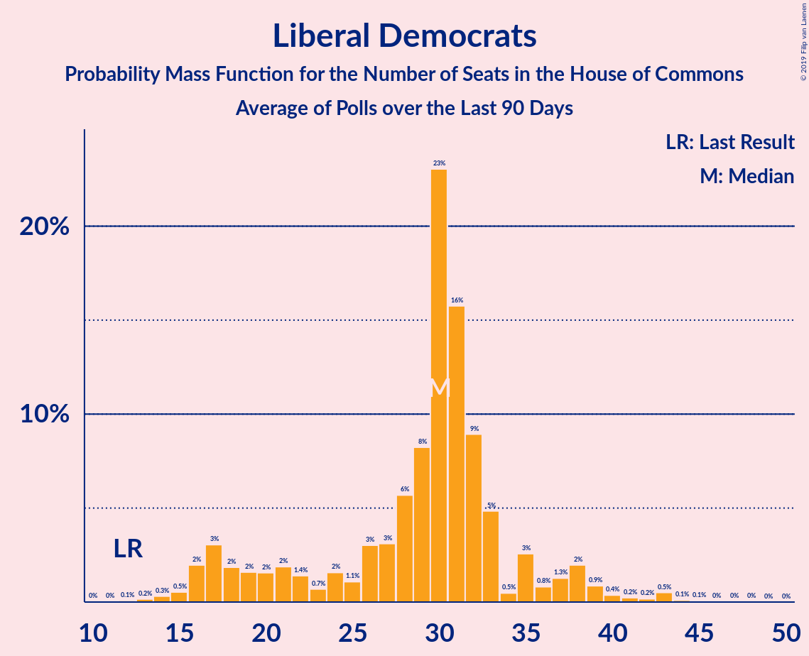

# Liberal Democrats

<a href="#voting-intentions">Voting Intentions</a> | <a href="#seats">Seats</a>

## Voting Intentions

Last result: **7.6%** (General Election of 8 June 2017)

### Confidence Intervals

| Period     | Polling firm/Commissioner(s) | Median | 80% Confidence Interval | 90% Confidence Interval | 95% Confidence Interval | 99% Confidence Interval |
|:----------:|:----------------:|:-----------:|:-----------------------:|:-----------------------:|:-----------------------:|:-----------------------:|
| N/A | [Poll Average](average.html) | 12.0% | 9.6–13.6% | 9.0–14.1% | 8.7–14.6% | 8.1–15.4% |
| [10–11 December 2019](2019-12-11-Survation.html) | Survation | 9.0% | 8.3–9.8% | 8.1–10.0% | 7.9–10.2% | 7.6–10.6% |
| [10–11 December 2019](2019-12-11-Panelbase.html) | Panelbase | 11.0% | 10.3–11.8% | 10.1–11.9% | 10.0–12.1% | 9.6–12.5% |
| [10–11 December 2019](2019-12-11-Opinium.html) | Opinium | 12.1% | 11.3–12.9% | 11.1–13.1% | 11.0–13.3% | 10.6–13.7% |
| [9–11 December 2019](2019-12-11-KantarPublic.html) | Kantar Public | 13.0% | 12.2–13.8% | 12.0–14.1% | 11.8–14.3% | 11.4–14.7% |
| [9–11 December 2019](2019-12-11-IpsosMORI.html) | Ipsos MORI   Evening Standard | 12.0% | 11.2–13.0% | 10.9–13.2% | 10.7–13.4% | 10.3–13.9% |
| [9–11 December 2019](2019-12-11-Deltapoll.html) | Deltapoll | 9.8% | 9.0–10.8% | 8.8–11.1% | 8.6–11.3% | 8.2–11.8% |
| [6–11 December 2019](2019-12-11-BMGResearch.html) | BMG Research | 14.0% | 12.9–15.1% | 12.6–15.5% | 12.4–15.7% | 11.9–16.3% |
| [8–10 December 2019](2019-12-10-NumberCruncherPolitics.html) | Number Cruncher Politics   Bloomberg | 12.0% | 10.8–13.4% | 10.4–13.8% | 10.1–14.1% | 9.6–14.8% |
| [9–10 December 2019](2019-12-10-ComRes.html) | ComRes   Daily Telegraph | 12.0% | 11.1–13.0% | 10.9–13.2% | 10.7–13.5% | 10.2–14.0% |
| [6–9 December 2019](2019-12-09-ICMResearch.html) | ICM Research | 12.1% | 11.2–13.1% | 10.9–13.4% | 10.7–13.6% | 10.3–14.1% |
| [5–8 December 2019](2019-12-08-Qriously.html) | Qriously | 12.1% | 11.2–13.0% | 11.0–13.3% | 10.8–13.5% | 10.4–14.0% |
| [6–8 December 2019](2019-12-08-ComRes.html) | ComRes   Remain United | 11.9% | 11.3–12.4% | 11.2–12.6% | 11.1–12.7% | 10.8–13.0% |
| [5–7 December 2019](2019-12-07-Survation.html) | Survation   Good Morning Britain | 10.9% | 9.7–12.2% | 9.4–12.6% | 9.1–12.9% | 8.6–13.6% |
| [5–7 December 2019](2019-12-07-Deltapoll.html) | Deltapoll   The Mail on Sunday | 11.1% | 10.1–12.2% | 9.8–12.5% | 9.6–12.8% | 9.2–13.3% |
| [5–6 December 2019](2019-12-06-YouGov.html) | YouGov   The Sunday Times | 13.0% | 12.0–14.1% | 11.7–14.4% | 11.4–14.7% | 11.0–15.2% |
| [4–6 December 2019](2019-12-06-Panelbase.html) | Panelbase | 13.0% | 12.1–14.0% | 11.8–14.3% | 11.6–14.5% | 11.2–15.0% |
| [4–6 December 2019](2019-12-06-Opinium.html) | Opinium   The Observer | 13.0% | 12.1–14.0% | 11.8–14.3% | 11.6–14.5% | 11.2–15.0% |
| [4–6 December 2019](2019-12-06-BMGResearch.html) | BMG Research   The Independent | 14.0% | 12.9–15.2% | 12.6–15.5% | 12.4–15.8% | 11.9–16.4% |
| [4–5 December 2019](2019-12-05-ComRes.html) | ComRes   The Sunday Telegraph | 12.0% | 11.1–13.0% | 10.9–13.2% | 10.7–13.5% | 10.2–14.0% |
| [2–4 December 2019](2019-12-04-IpsosMORI.html) | Ipsos MORI   Evening Standard | 13.0% | 12.0–14.2% | 11.7–14.5% | 11.4–14.8% | 10.9–15.4% |
| [2–3 December 2019](2019-12-03-YouGov.html) | YouGov   The Times and Sky News | 11.8% | 10.9–12.9% | 10.6–13.2% | 10.4–13.5% | 9.9–14.0% |
| [2–3 December 2019](2019-12-03-ComRes.html) | ComRes   Daily Telegraph | 12.0% | 11.1–13.0% | 10.9–13.3% | 10.7–13.5% | 10.3–14.0% |
| [28 November–2 December 2019](2019-12-02-KantarPublic.html) | Kantar Public | 14.9% | 13.6–16.3% | 13.2–16.8% | 12.9–17.1% | 12.3–17.8% |
| [29 November–2 December 2019](2019-12-02-ICMResearch.html) | ICM Research | 13.1% | 12.2–14.1% | 11.9–14.4% | 11.7–14.7% | 11.3–15.2% |
| [26–30 November 2019](2019-11-30-Survation.html) | Survation   Good Morning Britain | 11.0% | 9.8–12.3% | 9.5–12.7% | 9.2–13.0% | 8.7–13.7% |
| [28–30 November 2019](2019-11-30-Deltapoll.html) | Deltapoll   The Mail on Sunday | 15.1% | 13.9–16.3% | 13.6–16.6% | 13.3–16.9% | 12.8–17.5% |
| [28–29 November 2019](2019-11-29-YouGov.html) | YouGov   The Sunday Times | 13.0% | 12.0–14.1% | 11.7–14.4% | 11.4–14.7% | 11.0–15.2% |
| [27–29 November 2019](2019-11-29-Opinium.html) | Opinium   The Observer | 12.8% | 11.9–13.8% | 11.7–14.1% | 11.4–14.4% | 11.0–14.9% |
| [27–28 November 2019](2019-11-28-Panelbase.html) | Panelbase | 13.0% | 12.1–14.0% | 11.8–14.3% | 11.6–14.5% | 11.2–15.0% |
| [27–28 November 2019](2019-11-28-ComRes.html) | ComRes   The Sunday Telegraph | 13.0% | 12.1–14.0% | 11.8–14.3% | 11.6–14.5% | 11.2–15.0% |
| [26–27 November 2019](2019-11-27-BMGResearch.html) | BMG Research   The Independent | 13.0% | 12.0–14.2% | 11.8–14.5% | 11.5–14.8% | 11.0–15.3% |
| [25–26 November 2019](2019-11-26-YouGov.html) | YouGov   The Times and Sky News | 13.1% | 12.1–14.2% | 11.8–14.5% | 11.6–14.8% | 11.1–15.4% |
| [25–26 November 2019](2019-11-26-ComRes.html) | ComRes   Daily Telegraph | 13.1% | 12.2–14.1% | 11.9–14.4% | 11.7–14.7% | 11.3–15.2% |
| [21–25 November 2019](2019-11-25-KantarPublic.html) | Kantar Public | 13.9% | 12.7–15.4% | 12.3–15.8% | 12.0–16.1% | 11.4–16.8% |
| [22–25 November 2019](2019-11-25-ICMResearch.html) | ICM Research | 13.0% | 12.1–14.0% | 11.8–14.3% | 11.6–14.5% | 11.1–15.0% |
| [20–23 November 2019](2019-11-23-Survation.html) | Survation   Good Morning Britain | 14.8% | 13.4–16.3% | 13.0–16.7% | 12.7–17.1% | 12.1–17.8% |
| [21–23 November 2019](2019-11-23-Deltapoll.html) | Deltapoll   The Mail on Sunday | 16.1% | 14.9–17.3% | 14.6–17.7% | 14.3–18.0% | 13.8–18.6% |
| [21–22 November 2019](2019-11-22-YouGov.html) | YouGov   The Sunday Times | 16.0% | 14.9–17.2% | 14.6–17.5% | 14.3–17.8% | 13.8–18.4% |
| [20–22 November 2019](2019-11-22-Panelbase.html) | Panelbase | 14.0% | 13.0–15.0% | 12.8–15.3% | 12.6–15.6% | 12.1–16.1% |
| [20–22 November 2019](2019-11-22-Opinium.html) | Opinium   The Observer | 12.0% | 11.1–13.0% | 10.9–13.3% | 10.7–13.5% | 10.3–14.0% |
| [20–21 November 2019](2019-11-21-ComRes.html) | ComRes   The Sunday Express | 15.0% | 14.0–16.1% | 13.8–16.4% | 13.5–16.6% | 13.1–17.2% |
| [19–21 November 2019](2019-11-21-BMGResearch.html) | BMG Research | 18.3% | 17.2–19.6% | 16.8–20.0% | 16.6–20.3% | 16.0–20.9% |
| [12–20 November 2019](2019-11-20-YouGov.html) | YouGov | 14.9% | 14.4–15.3% | 14.3–15.4% | 14.2–15.5% | 14.0–15.7% |
| [18–19 November 2019](2019-11-19-YouGov.html) | YouGov   The Times | 14.9% | 13.9–16.1% | 13.5–16.5% | 13.3–16.8% | 12.8–17.4% |
| [15–19 November 2019](2019-11-19-IpsosMORI.html) | Ipsos MORI   Evening Standard | 16.0% | 14.6–17.4% | 14.3–17.8% | 13.9–18.2% | 13.3–18.9% |
| [18–19 November 2019](2019-11-19-ComRes.html) | ComRes   Daily Telegraph | 15.0% | 13.9–16.2% | 13.6–16.5% | 13.3–16.8% | 12.8–17.4% |
| [14–18 November 2019](2019-11-18-KantarPublic.html) | Kantar Public | 16.0% | 14.7–17.4% | 14.3–17.8% | 14.0–18.2% | 13.4–18.9% |
| [15–18 November 2019](2019-11-18-ICMResearch.html) | ICM Research | 13.0% | 12.1–14.0% | 11.8–14.3% | 11.6–14.5% | 11.2–15.0% |
| [14–16 November 2019](2019-11-16-Survation.html) | Survation | 13.2% | 11.9–14.6% | 11.5–15.0% | 11.2–15.4% | 10.6–16.1% |
| [10–16 November 2019](2019-11-16-Deltapoll.html) | Deltapoll   The Mail on Sunday | 11.0% | 10.0–12.1% | 9.8–12.4% | 9.5–12.7% | 9.1–13.2% |
| [14–15 November 2019](2019-11-15-YouGov.html) | YouGov   The Sunday Times | 14.8% | 13.7–16.0% | 13.4–16.3% | 13.2–16.6% | 12.7–17.2% |
| [13–15 November 2019](2019-11-15-Opinium.html) | Opinium   The Observer | 13.9% | 13.0–15.0% | 12.7–15.3% | 12.5–15.5% | 12.0–16.0% |
| [9–15 November 2019](2019-11-15-BMGResearch.html) | BMG Research | 16.0% | 14.9–17.3% | 14.6–17.6% | 14.3–17.9% | 13.8–18.5% |
| [13–14 November 2019](2019-11-14-Panelbase.html) | Panelbase | 15.1% | 13.7–16.6% | 13.3–17.0% | 13.0–17.4% | 12.4–18.2% |
| [13–14 November 2019](2019-11-14-ComRes.html) | ComRes   The Sunday Telegraph | 14.0% | 13.0–15.0% | 12.8–15.3% | 12.5–15.6% | 12.1–16.1% |
| [11–12 November 2019](2019-11-12-YouGov.html) | YouGov   The Times and Sky News | 15.0% | 13.9–16.2% | 13.6–16.5% | 13.4–16.8% | 12.8–17.4% |
| [11–12 November 2019](2019-11-12-ComRes.html) | ComRes   Daily Telegraph | 15.7% | 14.7–16.8% | 14.4–17.1% | 14.2–17.4% | 13.7–17.9% |
| [7–11 November 2019](2019-11-11-KantarPublic.html) | Kantar Public | 17.0% | 15.7–18.5% | 15.3–18.9% | 14.9–19.3% | 14.3–20.0% |
| [8–11 November 2019](2019-11-11-ICMResearch.html) | ICM Research | 14.8% | 13.8–15.9% | 13.5–16.1% | 13.3–16.4% | 12.9–16.9% |
| [8–10 November 2019](2019-11-10-ComRes.html) | ComRes   Britain Elects | 17.0% | 15.9–18.1% | 15.7–18.4% | 15.4–18.7% | 14.9–19.2% |
| [6–9 November 2019](2019-11-09-Deltapoll.html) | Deltapoll   The Mail on Sunday | 16.1% | 15.0–17.4% | 14.6–17.8% | 14.4–18.1% | 13.8–18.7% |
| [7–8 November 2019](2019-11-08-YouGov.html) | YouGov   The Sunday Times and Sky News | 16.9% | 15.8–18.2% | 15.5–18.5% | 15.2–18.8% | 14.7–19.4% |
| [6–8 November 2019](2019-11-08-Survation.html) | Survation | 17.0% | 16.0–18.1% | 15.7–18.4% | 15.4–18.7% | 14.9–19.2% |
| [6–8 November 2019](2019-11-08-Panelbase.html) | Panelbase | 14.9% | 13.6–16.4% | 13.2–16.8% | 12.9–17.2% | 12.3–18.0% |
| [6–8 November 2019](2019-11-08-Opinium.html) | Opinium   The Observer | 15.0% | 14.1–16.1% | 13.8–16.4% | 13.5–16.7% | 13.1–17.2% |
| [5–8 November 2019](2019-11-08-BMGResearch.html) | BMG Research   The Independent | 15.8% | 14.7–17.1% | 14.3–17.5% | 14.1–17.8% | 13.5–18.4% |
| [5–6 November 2019](2019-11-06-YouGov.html) | YouGov   The Times and Sky News | 16.9% | 15.8–18.2% | 15.5–18.5% | 15.2–18.8% | 14.7–19.4% |
| [30 October–5 November 2019](2019-11-05-ComRes.html) | ComRes   Remain United | 16.7% | 16.1–17.3% | 15.9–17.5% | 15.8–17.7% | 15.5–18.0% |
| [1–4 November 2019](2019-11-04-YouGov.html) | YouGov   The Times | 15.9% | 15.1–16.8% | 14.9–17.0% | 14.7–17.2% | 14.3–17.6% |
| [1–4 November 2019](2019-11-04-ICMResearch.html) | ICM Research   Reuters | 14.8% | 13.8–15.9% | 13.5–16.2% | 13.3–16.4% | 12.9–16.9% |
| [31 October–2 November 2019](2019-11-02-Deltapoll.html) | Deltapoll   The Mail on Sunday | 13.9% | 12.8–15.2% | 12.5–15.5% | 12.3–15.8% | 11.8–16.4% |
| [30 October–1 November 2019](2019-11-01-YouGov.html) | YouGov   The Sunday Times | 15.9% | 14.9–17.1% | 14.6–17.4% | 14.3–17.7% | 13.8–18.2% |
| [30 October–1 November 2019](2019-11-01-Opinium.html) | Opinium   The Observer | 15.8% | 14.8–16.9% | 14.5–17.2% | 14.2–17.4% | 13.8–18.0% |
| [30–31 October 2019](2019-10-31-Panelbase.html) | Panelbase | 14.0% | 12.7–15.5% | 12.3–15.9% | 12.0–16.3% | 11.4–17.0% |
| [30–31 October 2019](2019-10-31-ORB.html) | ORB   The Telegraph | 14.0% | 13.0–15.0% | 12.8–15.3% | 12.5–15.6% | 12.1–16.1% |
| [30–31 October 2019](2019-10-31-ComRes.html) | ComRes   Sunday Express | 17.1% | 15.9–18.3% | 15.6–18.7% | 15.3–19.0% | 14.7–19.6% |
| [29–30 October 2019](2019-10-30-YouGov.html) | YouGov   The Times | 18.1% | 17.0–19.3% | 16.6–19.7% | 16.4–20.0% | 15.8–20.6% |
| [29–30 October 2019](2019-10-30-Survation.html) | Survation | 19.0% | 17.5–20.7% | 17.1–21.1% | 16.7–21.6% | 16.0–22.4% |
| [17–28 October 2019](2019-10-28-YouGov.html) | YouGov | 18.7% | 18.3–19.2% | 18.1–19.3% | 18.0–19.4% | 17.8–19.7% |
| [25–28 October 2019](2019-10-28-IpsosMORI.html) | Ipsos MORI | 19.9% | 18.3–21.6% | 17.9–22.0% | 17.5–22.5% | 16.8–23.3% |
| [24–25 October 2019](2019-10-25-YouGov.html) | YouGov | 17.9% | 16.7–19.1% | 16.4–19.5% | 16.1–19.8% | 15.6–20.4% |
| [23–25 October 2019](2019-10-25-Opinium.html) | Opinium   The Observer | 15.1% | 14.1–16.2% | 13.8–16.5% | 13.6–16.7% | 13.1–17.3% |
| [20–21 October 2019](2019-10-21-YouGov.html) | YouGov   The Times | 18.7% | 17.5–20.0% | 17.2–20.3% | 16.9–20.7% | 16.4–21.3% |
| [18–21 October 2019](2019-10-21-Deltapoll.html) | Deltapoll | 18.9% | 17.8–20.1% | 17.5–20.4% | 17.2–20.7% | 16.7–21.2% |
| [17–18 October 2019](2019-10-18-Survation.html) | Survation   Daily Mail | 20.7% | 19.1–22.4% | 18.7–22.9% | 18.3–23.3% | 17.6–24.1% |
| [17–18 October 2019](2019-10-18-Panelbase.html) | Panelbase | 17.2% | 15.7–18.8% | 15.3–19.2% | 15.0–19.6% | 14.3–20.4% |
| [15–17 October 2019](2019-10-17-Opinium.html) | Opinium   The Observer | 15.8% | 14.8–16.9% | 14.5–17.2% | 14.3–17.5% | 13.8–18.0% |
| [16–17 October 2019](2019-10-17-ComRes.html) | ComRes   Britain Elects | 17.7% | 16.7–18.8% | 16.4–19.1% | 16.1–19.4% | 15.6–20.0% |
| [14–15 October 2019](2019-10-15-YouGov.html) | YouGov   The Times | 18.1% | 16.9–19.4% | 16.6–19.7% | 16.3–20.0% | 15.7–20.7% |
| [10–15 October 2019](2019-10-15-KantarPublic.html) | Kantar Public | 18.2% | 16.8–19.7% | 16.4–20.1% | 16.1–20.5% | 15.4–21.2% |
| [9–11 October 2019](2019-10-11-Panelbase.html) | Panelbase   The Sunday Times | 17.1% | 16.0–18.2% | 15.8–18.5% | 15.5–18.8% | 15.0–19.4% |
| [9–10 October 2019](2019-10-10-ComRes.html) | ComRes   Daily Express | 17.9% | 16.9–19.1% | 16.6–19.4% | 16.3–19.7% | 15.8–20.2% |
| [8–9 October 2019](2019-10-09-YouGov.html) | YouGov   The Times | 19.7% | 18.4–21.0% | 18.1–21.4% | 17.8–21.7% | 17.2–22.3% |
| [4–6 October 2019](2019-10-06-ComRes.html) | ComRes   Daily Telegraph | 18.6% | 17.6–19.8% | 17.3–20.1% | 17.0–20.4% | 16.5–21.0% |
| [3–4 October 2019](2019-10-04-Opinium.html) | Opinium   The Observer | 15.2% | 14.2–16.3% | 13.9–16.6% | 13.7–16.9% | 13.2–17.4% |
| [1–4 October 2019](2019-10-04-BMGResearch.html) | BMG Research   The Independent | 20.1% | 18.8–21.5% | 18.4–21.8% | 18.1–22.2% | 17.5–22.8% |
| [30 September–1 October 2019](2019-10-01-YouGov.html) | YouGov   The Times | 22.9% | 21.6–24.2% | 21.2–24.6% | 20.9–25.0% | 20.3–25.7% |
| [26–27 September 2019](2019-09-27-YouGov.html) | YouGov   The Sunday Times | 20.9% | 19.6–22.2% | 19.3–22.6% | 19.0–22.9% | 18.4–23.6% |
| [25–27 September 2019](2019-09-27-Opinium.html) | Opinium   The Observer | 19.9% | 18.8–21.1% | 18.5–21.4% | 18.2–21.7% | 17.7–22.3% |
| [24–25 September 2019](2019-09-25-YouGov.html) | YouGov   The Times | 21.1% | 19.8–22.5% | 19.5–22.8% | 19.2–23.2% | 18.6–23.8% |
| [25 September 2019](2019-09-25-Survation.html) | Survation   Daily Mail | 22.0% | 20.3–23.7% | 19.9–24.2% | 19.5–24.6% | 18.8–25.5% |
| [24 September 2019](2019-09-24-ComRes.html) | ComRes   Daily Telegraph | 20.8% | 19.3–22.5% | 18.8–23.0% | 18.5–23.4% | 17.7–24.3% |
| [19–20 September 2019](2019-09-20-YouGov.html) | YouGov   People's Vote | 22.0% | 20.9–23.3% | 20.5–23.6% | 20.3–23.9% | 19.7–24.5% |
| [19–20 September 2019](2019-09-20-Opinium.html) | Opinium   The Observer | 17.1% | 16.0–18.2% | 15.7–18.5% | 15.5–18.8% | 15.0–19.3% |
| [18–19 September 2019](2019-09-19-ComRes.html) | ComRes   Britain Elects | 20.2% | 19.1–21.4% | 18.8–21.7% | 18.5–22.0% | 18.0–22.6% |
| [17–18 September 2019](2019-09-18-YouGov.html) | YouGov   The Times | 22.5% | 21.2–23.9% | 20.9–24.3% | 20.5–24.6% | 19.9–25.3% |
| [13–16 September 2019](2019-09-16-IpsosMORI.html) | Ipsos MORI   Evening Standard | 23.2% | 21.5–24.9% | 21.0–25.4% | 20.7–25.9% | 19.9–26.7% |
| [12–15 September 2019](2019-09-15-ComRes.html) | ComRes   Sunday Express | 20.0% | 18.9–21.2% | 18.6–21.5% | 18.3–21.8% | 17.8–22.3% |
| [11–13 September 2019](2019-09-13-Opinium.html) | Opinium   The Observer | 16.1% | 15.1–17.2% | 14.8–17.5% | 14.5–17.8% | 14.1–18.3% |
| [9–10 September 2019](2019-09-10-YouGov.html) | YouGov   The Times | 18.9% | 17.7–20.1% | 17.3–20.5% | 17.0–20.8% | 16.5–21.4% |
| [5–9 September 2019](2019-09-09-KantarPublic.html) | Kantar Public | 20.0% | 18.6–21.6% | 18.2–22.1% | 17.8–22.5% | 17.1–23.2% |
| [6–8 September 2019](2019-09-08-ComRes.html) | ComRes   Daily Telegraph | 17.0% | 15.9–18.1% | 15.6–18.4% | 15.4–18.7% | 14.9–19.2% |
| [5–7 September 2019](2019-09-07-Deltapoll.html) | Deltapoll   The Sun on Sunday | 16.9% | 15.9–18.0% | 15.6–18.4% | 15.4–18.6% | 14.9–19.2% |
| [5–6 September 2019](2019-09-06-YouGov.html) | YouGov   The Sunday Times | 18.9% | 17.7–20.2% | 17.4–20.5% | 17.1–20.9% | 16.6–21.5% |
| [5–6 September 2019](2019-09-06-Survation.html) | Survation   Daily Mail | 17.8% | 16.4–19.5% | 16.0–19.9% | 15.6–20.3% | 14.9–21.1% |
| [5–6 September 2019](2019-09-06-Panelbase.html) | Panelbase | 19.2% | 17.6–20.8% | 17.2–21.3% | 16.8–21.7% | 16.1–22.5% |
| [4–6 September 2019](2019-09-06-Opinium.html) | Opinium   The Observer | 16.9% | 15.9–18.0% | 15.6–18.4% | 15.3–18.6% | 14.9–19.2% |
| [4–6 September 2019](2019-09-06-ComRes.html) | ComRes   Britain Elects | 20.0% | 18.9–21.2% | 18.6–21.5% | 18.3–21.8% | 17.8–22.4% |
| [3–6 September 2019](2019-09-06-BMGResearch.html) | BMG Research   The Independent | 17.8% | 16.6–19.1% | 16.3–19.5% | 16.0–19.8% | 15.4–20.5% |
| [3–4 September 2019](2019-09-04-HanburyStrategy.html) | Hanbury Strategy | 16.9% | 15.4–18.5% | 15.0–18.9% | 14.7–19.3% | 14.0–20.1% |
| [2–3 September 2019](2019-09-03-YouGov.html) | YouGov   The Times | 15.9% | 14.8–17.1% | 14.5–17.5% | 14.2–17.8% | 13.7–18.4% |
| [29–31 August 2019](2019-08-31-Deltapoll.html) | Deltapoll   The Mail on Sunday | 17.6% | 16.6–18.7% | 16.3–19.1% | 16.0–19.3% | 15.5–19.9% |
| [29–30 August 2019](2019-08-30-Survation.html) | Survation   Daily Mail | 20.8% | 19.2–22.5% | 18.8–23.0% | 18.4–23.4% | 17.7–24.2% |
| [28–29 August 2019](2019-08-29-YouGov.html) | YouGov | 20.7% | 19.5–21.9% | 19.2–22.3% | 18.9–22.6% | 18.4–23.2% |
| [27–28 August 2019](2019-08-28-YouGov.html) | YouGov   The Times | 16.9% | 15.9–18.0% | 15.6–18.3% | 15.3–18.6% | 14.8–19.2% |
| [22–23 August 2019](2019-08-23-YouGov.html) | YouGov   The Sunday Times | 19.3% | 18.2–20.4% | 17.9–20.8% | 17.6–21.0% | 17.1–21.6% |
| [21–23 August 2019](2019-08-23-Opinium.html) | Opinium   The Observer | 14.8% | 13.8–15.9% | 13.5–16.2% | 13.3–16.4% | 12.9–17.0% |
| [20–21 August 2019](2019-08-21-YouGov.html) | YouGov   The Times | 19.9% | 18.7–21.2% | 18.4–21.6% | 18.1–21.9% | 17.5–22.5% |
| [15–19 August 2019](2019-08-19-KantarPublic.html) | Kantar Public | 14.9% | 13.6–16.4% | 13.3–16.8% | 13.0–17.1% | 12.4–17.8% |
| [13–14 August 2019](2019-08-14-YouGov.html) | YouGov   The Times | 19.8% | 18.5–21.1% | 18.2–21.4% | 17.9–21.8% | 17.3–22.4% |
| [7–12 August 2019](2019-08-12-BMGResearch.html) | BMG Research   The Independent | 18.9% | 17.7–20.3% | 17.3–20.7% | 17.0–21.0% | 16.5–21.6% |
| [6–11 August 2019](2019-08-11-Survation.html) | Survation | 21.2% | 20.0–22.4% | 19.7–22.7% | 19.4–23.0% | 18.9–23.6% |
| [9–11 August 2019](2019-08-11-ComRes.html) | ComRes   Daily Telegraph | 15.9% | 14.9–17.0% | 14.6–17.3% | 14.4–17.6% | 13.9–18.1% |
| [8–9 August 2019](2019-08-09-Opinium.html) | Opinium   The Observer | 13.1% | 12.1–14.1% | 11.9–14.4% | 11.7–14.6% | 11.2–15.1% |
| [5–6 August 2019](2019-08-06-YouGov.html) | YouGov   The Times | 20.8% | 19.6–22.2% | 19.2–22.5% | 18.9–22.9% | 18.3–23.5% |
| [29–30 July 2019](2019-07-30-YouGov.html) | YouGov   The Times | 19.7% | 18.7–20.9% | 18.4–21.2% | 18.1–21.5% | 17.6–22.1% |
| [26–30 July 2019](2019-07-30-IpsosMORI.html) | Ipsos MORI | 19.2% | 17.6–20.8% | 17.2–21.3% | 16.8–21.7% | 16.1–22.5% |
| [26–28 July 2019](2019-07-28-ComRes.html) | ComRes   Britain Elects | 15.7% | 14.7–16.8% | 14.4–17.1% | 14.1–17.3% | 13.7–17.9% |
| [25–27 July 2019](2019-07-27-Deltapoll.html) | Deltapoll   The Mail on Sunday | 18.0% | 16.9–19.1% | 16.6–19.5% | 16.4–19.7% | 15.9–20.3% |
| [25–26 July 2019](2019-07-26-YouGov.html) | YouGov   The Sunday Times | 19.9% | 18.7–21.2% | 18.4–21.6% | 18.1–21.9% | 17.5–22.5% |
| [24–26 July 2019](2019-07-26-Opinium.html) | Opinium   The Observer | 15.7% | 14.6–16.7% | 14.4–17.1% | 14.1–17.3% | 13.7–17.8% |
| [24–25 July 2019](2019-07-25-ComRes.html) | ComRes   Sunday Express | 19.1% | 18.0–20.2% | 17.7–20.6% | 17.4–20.9% | 16.9–21.4% |
| [23–24 July 2019](2019-07-24-YouGov.html) | YouGov   The Times | 22.5% | 21.2–23.9% | 20.9–24.2% | 20.6–24.6% | 20.0–25.2% |
| [16–17 July 2019](2019-07-17-YouGov.html) | YouGov   The Times | 20.1% | 18.9–21.4% | 18.6–21.8% | 18.3–22.1% | 17.7–22.7% |
| [15–16 July 2019](2019-07-16-ComRes.html) | ComRes | 16.8% | 15.8–17.9% | 15.5–18.2% | 15.2–18.5% | 14.7–19.0% |
| [10–11 July 2019](2019-07-11-Survation.html) | Survation | 18.8% | 17.3–20.4% | 16.8–20.9% | 16.5–21.3% | 15.8–22.1% |
| [10–11 July 2019](2019-07-11-ComRes.html) | ComRes   The Express | 15.0% | 14.0–16.2% | 13.7–16.5% | 13.4–16.8% | 13.0–17.3% |
| [9–10 July 2019](2019-07-10-YouGov.html) | YouGov   The Times | 18.9% | 17.7–20.2% | 17.4–20.5% | 17.1–20.9% | 16.5–21.5% |
| [5–7 July 2019](2019-07-07-ComRes.html) | ComRes   Daily Telegraph | 16.2% | 15.2–17.3% | 14.9–17.6% | 14.7–17.9% | 14.2–18.4% |
| [3–5 July 2019](2019-07-05-Opinium.html) | Opinium   The Observer | 14.8% | 13.9–15.9% | 13.6–16.2% | 13.3–16.5% | 12.9–17.0% |
| [2–5 July 2019](2019-07-05-BMGResearch.html) | BMG Research   The Independent | 18.1% | 16.9–19.5% | 16.6–19.8% | 16.3–20.2% | 15.7–20.8% |
| [2–3 July 2019](2019-07-03-YouGov.html) | YouGov   The Times | 19.9% | 18.6–21.2% | 18.3–21.6% | 18.0–21.9% | 17.4–22.6% |
| [24–25 June 2019](2019-06-25-YouGov.html) | YouGov   The Times | 18.9% | 17.9–20.1% | 17.6–20.4% | 17.3–20.7% | 16.8–21.3% |
| [21–25 June 2019](2019-06-25-IpsosMORI.html) | Ipsos MORI | 22.3% | 20.7–24.1% | 20.3–24.6% | 19.9–25.0% | 19.2–25.8% |
| [19–20 June 2019](2019-06-20-Survation.html) | Survation   Daily Mail on Sunday | 17.8% | 16.8–18.9% | 16.4–19.3% | 16.2–19.5% | 15.7–20.1% |
| [19–20 June 2019](2019-06-20-Opinium.html) | Opinium   The Observer | 16.0% | 15.0–17.1% | 14.7–17.4% | 14.4–17.6% | 14.0–18.2% |
| [13–14 June 2019](2019-06-14-YouGov.html) | YouGov   The Sunday Times | 19.1% | 17.9–20.4% | 17.5–20.7% | 17.3–21.0% | 16.7–21.7% |
| [9–10 June 2019](2019-06-10-YouGov.html) | YouGov   The Times | 22.2% | 20.9–23.5% | 20.5–23.9% | 20.2–24.2% | 19.6–24.8% |
| [7–9 June 2019](2019-06-09-ComRes.html) | ComRes   Daily Telegraph | 16.8% | 15.8–17.9% | 15.5–18.2% | 15.2–18.5% | 14.8–19.1% |
| [4–7 June 2019](2019-06-07-BMGResearch.html) | BMG Research   The Independent | 16.8% | 15.7–18.1% | 15.3–18.5% | 15.0–18.8% | 14.5–19.4% |
| [4–6 June 2019](2019-06-06-YouGov.html) | YouGov   The Times | 19.9% | 18.6–21.2% | 18.3–21.6% | 18.0–21.9% | 17.4–22.6% |
| [28–30 May 2019](2019-05-30-Opinium.html) | Opinium   The Observer | 16.0% | 15.0–17.1% | 14.7–17.4% | 14.5–17.7% | 14.0–18.2% |
| [29–30 May 2019](2019-05-30-Deltapoll.html) | Deltapoll   The Mail on Sunday | 15.7% | 14.8–16.7% | 14.5–16.9% | 14.3–17.2% | 13.9–17.7% |
| [28–29 May 2019](2019-05-29-YouGov.html) | YouGov   The Times | 23.9% | 22.7–25.3% | 22.3–25.7% | 22.0–26.0% | 21.4–26.6% |
| [23–24 May 2019](2019-05-24-LordAshcroft.html) | Lord Ashcroft | 17.0% | 16.5–17.5% | 16.4–17.6% | 16.3–17.8% | 16.0–18.0% |
| [22 May 2019](2019-05-22-Survation.html) | Survation   Daily Mail | 13.0% | 12.0–14.0% | 11.8–14.3% | 11.6–14.5% | 11.1–15.0% |
| [14–21 May 2019](2019-05-21-Panelbase.html) | Panelbase   The Sunday Times | 13.0% | 12.1–14.0% | 11.8–14.3% | 11.6–14.5% | 11.2–15.0% |
| [17–20 May 2019](2019-05-20-Opinium.html) | Opinium   The Times | 12.2% | 11.3–13.2% | 11.1–13.5% | 10.9–13.7% | 10.4–14.2% |
| [8–17 May 2019](2019-05-17-YouGov.html) | YouGov   Best For Britain | 18.0% | 17.5–18.5% | 17.3–18.7% | 17.2–18.8% | 17.0–19.1% |
| [17 May 2019](2019-05-17-Survation.html) | Survation   Daily Mail | 12.8% | 11.5–14.3% | 11.2–14.7% | 10.9–15.0% | 10.3–15.7% |
| [14–16 May 2019](2019-05-16-Opinium.html) | Opinium   The Observer | 11.1% | 10.2–12.1% | 10.0–12.3% | 9.8–12.6% | 9.4–13.0% |
| [13–14 May 2019](2019-05-14-YouGov.html) | YouGov   The Times | 15.8% | 14.7–17.0% | 14.4–17.4% | 14.1–17.7% | 13.6–18.3% |
| [10–14 May 2019](2019-05-14-IpsosMORI.html) | Ipsos MORI | 14.6% | 13.2–16.0% | 12.9–16.4% | 12.6–16.8% | 12.0–17.5% |
| [9–13 May 2019](2019-05-13-KantarPublic.html) | Kantar Public | 15.0% | 13.7–16.4% | 13.4–16.9% | 13.1–17.2% | 12.5–17.9% |
| [9–13 May 2019](2019-05-13-HanburyStrategy.html) | Hanbury Strategy | 12.8% | 11.9–13.9% | 11.7–14.1% | 11.4–14.4% | 11.0–14.9% |
| [10–12 May 2019](2019-05-12-ComRes.html) | ComRes   Daily Telegraph | 13.3% | 12.3–14.3% | 12.1–14.6% | 11.9–14.8% | 11.4–15.3% |
| [8–10 May 2019](2019-05-10-Opinium.html) | Opinium   The Observer | 11.0% | 10.1–11.9% | 9.9–12.2% | 9.7–12.4% | 9.3–12.9% |
| [7–10 May 2019](2019-05-10-BMGResearch.html) | BMG Research | 18.0% | 16.8–19.3% | 16.4–19.7% | 16.1–20.0% | 15.6–20.6% |
| [8–9 May 2019](2019-05-09-YouGov.html) | YouGov   The Times | 16.1% | 15.2–17.2% | 14.9–17.5% | 14.7–17.7% | 14.2–18.2% |
| [9 May 2019](2019-05-09-ComRes.html) | ComRes   Brexit Express | 14.8% | 13.9–15.9% | 13.6–16.2% | 13.4–16.5% | 12.9–17.0% |
| [3–7 May 2019](2019-05-07-Opinium.html) | Opinium | 11.0% | 10.0–12.1% | 9.8–12.4% | 9.5–12.7% | 9.1–13.2% |
| [29–30 April 2019](2019-04-30-YouGov.html) | YouGov | 12.9% | 11.9–14.0% | 11.6–14.3% | 11.3–14.6% | 10.9–15.2% |
| [23–24 April 2019](2019-04-24-YouGov.html) | YouGov   The Times | 11.0% | 10.1–12.0% | 9.9–12.3% | 9.6–12.6% | 9.2–13.1% |
| [18–24 April 2019](2019-04-24-Panelbase.html) | Panelbase   The Sunday Times | 7.9% | 7.2–8.8% | 7.0–9.0% | 6.8–9.2% | 6.5–9.6% |
| [21–23 April 2019](2019-04-23-Opinium.html) | Opinium   The Observer | 6.0% | 5.2–7.0% | 5.0–7.2% | 4.8–7.5% | 4.4–8.0% |
| [16–17 April 2019](2019-04-17-YouGov.html) | YouGov   The Times | 10.0% | 9.2–11.0% | 8.9–11.3% | 8.7–11.5% | 8.3–12.0% |
| [17 April 2019](2019-04-17-OnePoll.html) | OnePoll   The Sun on Sunday | 9.0% | 8.2–9.9% | 8.0–10.1% | 7.8–10.3% | 7.5–10.8% |
| [16–17 April 2019](2019-04-17-ORB.html) | ORB   The Telegraph | 8.0% | 7.2–9.0% | 7.0–9.3% | 6.8–9.5% | 6.4–10.0% |
| [9–12 April 2019](2019-04-12-Opinium.html) | Opinium   The Observer | 8.0% | 7.3–8.9% | 7.1–9.1% | 6.9–9.3% | 6.6–9.7% |
| [4–8 April 2019](2019-04-08-KantarPublic.html) | Kantar Public | 10.9% | 9.8–12.2% | 9.5–12.5% | 9.3–12.8% | 8.8–13.5% |
| [5–8 April 2019](2019-04-08-HanburyStrategy.html) | Hanbury Strategy   Open Europe | 7.9% | 7.2–8.7% | 7.0–9.0% | 6.8–9.2% | 6.5–9.6% |
| [3–6 April 2019](2019-04-06-Survation.html) | Survation | 9.9% | 9.4–10.4% | 9.3–10.6% | 9.2–10.7% | 8.9–10.9% |
| [2–5 April 2019](2019-04-05-BMGResearch.html) | BMG Research   The Independent | 11.1% | 10.2–12.2% | 9.9–12.6% | 9.6–12.8% | 9.2–13.4% |
| [2–3 April 2019](2019-04-03-YouGov.html) | YouGov | 12.0% | 11.1–13.1% | 10.8–13.4% | 10.6–13.6% | 10.2–14.1% |
| [28–30 March 2019](2019-03-30-Deltapoll.html) | Deltapoll   The Mail on Sunday | 6.9% | 6.0–8.1% | 5.7–8.4% | 5.5–8.7% | 5.1–9.3% |
| [28–29 March 2019](2019-03-29-Opinium.html) | Opinium   The Observer | 9.0% | 8.2–9.8% | 8.0–10.1% | 7.8–10.3% | 7.4–10.7% |
| [24–25 March 2019](2019-03-25-YouGov.html) | YouGov   The Times | 11.0% | 10.2–11.9% | 9.9–12.2% | 9.7–12.4% | 9.3–12.9% |
| [20–22 March 2019](2019-03-22-Opinium.html) | Opinium   The Observer | 7.0% | 6.3–7.8% | 6.1–8.0% | 5.9–8.2% | 5.6–8.6% |
| [15–19 March 2019](2019-03-19-IpsosMORI.html) | Ipsos MORI | 8.0% | 7.0–9.2% | 6.7–9.5% | 6.5–9.8% | 6.1–10.4% |
| [14–15 March 2019](2019-03-15-YouGov.html) | YouGov   People’s Vote | 11.0% | 11.3–13.3% | 11.0–13.6% | 10.8–13.9% | 10.3–14.4% |
| [15 March 2019](2019-03-15-Survation.html) | Survation   Daily Mail | 10.0% | 8.9–11.4% | 8.6–11.7% | 8.3–12.1% | 7.8–12.7% |
| [12–15 March 2019](2019-03-15-Opinium.html) | Opinium   The Observer | 8.0% | 7.3–8.8% | 7.0–9.1% | 6.9–9.3% | 6.5–9.7% |
| [7–11 March 2019](2019-03-11-KantarPublic.html) | Kantar Public | 8.1% | 7.1–9.2% | 6.9–9.5% | 6.6–9.8% | 6.2–10.4% |
| [4–8 March 2019](2019-03-08-BMGResearch.html) | BMG Research | 12.0% | 11.0–13.1% | 10.7–13.4% | 10.4–13.7% | 10.0–14.3% |
| [3–4 March 2019](2019-03-04-YouGov.html) | YouGov   The Times | 11.0% | 10.2–11.9% | 10.0–12.2% | 9.8–12.4% | 9.4–12.8% |
| [26 February–1 March 2019](2019-03-01-Opinium.html) | Opinium   The Observer | 8.9% | 8.2–9.8% | 7.9–10.1% | 7.7–10.3% | 7.4–10.7% |
| [22–23 February 2019](2019-02-23-YouGov.html) | YouGov   The Times | 10.0% | 9.1–11.0% | 8.9–11.3% | 8.6–11.5% | 8.2–12.0% |
| [21–23 February 2019](2019-02-23-Deltapoll.html) | Deltapoll   The Mail on Sunday | 6.0% | 5.2–7.1% | 4.9–7.4% | 4.7–7.7% | 4.4–8.2% |
| [18–19 February 2019](2019-02-19-YouGov.html) | YouGov   The Times | 10.1% | 9.3–11.1% | 9.0–11.3% | 8.8–11.6% | 8.4–12.0% |
| [18 February 2019](2019-02-18-Survation.html) | Survation   Daily Mail | 9.9% | 8.8–11.2% | 8.5–11.5% | 8.2–11.9% | 7.7–12.5% |
| [13–15 February 2019](2019-02-15-Opinium.html) | Opinium   The Observer | 8.1% | 7.3–8.9% | 7.1–9.2% | 7.0–9.4% | 6.6–9.8% |
| [7–11 February 2019](2019-02-11-KantarPublic.html) | Kantar Public | 10.0% | 9.0–11.3% | 8.7–11.6% | 8.4–11.9% | 7.9–12.5% |
| [4–8 February 2019](2019-02-08-BMGResearch.html) | BMG Research | 12.8% | 11.8–14.0% | 11.5–14.3% | 11.2–14.6% | 10.7–15.2% |
| [1–5 February 2019](2019-02-05-IpsosMORI.html) | Ipsos MORI | 10.0% | 8.8–11.3% | 8.5–11.6% | 8.2–12.0% | 7.7–12.6% |
| [3–4 February 2019](2019-02-04-YouGov.html) | YouGov   The Times | 10.0% | 9.1–10.9% | 8.9–11.2% | 8.7–11.4% | 8.3–11.9% |
| [30 January–1 February 2019](2019-02-01-Opinium.html) | Opinium   The Observer | 8.0% | 7.3–8.8% | 7.0–9.1% | 6.9–9.3% | 6.5–9.7% |
| [30 January 2019](2019-01-30-Survation.html) | Survation   Daily Mail | 9.1% | 8.1–10.4% | 7.8–10.7% | 7.5–11.1% | 7.0–11.7% |
| [23–25 January 2019](2019-01-25-Opinium.html) | Opinium   People’s Vote | 7.0% | 6.3–7.8% | 6.1–8.0% | 6.0–8.2% | 5.6–8.6% |
| [16–18 January 2019](2019-01-18-Opinium.html) | Opinium   The Observer | 6.9% | 6.2–7.7% | 6.0–7.9% | 5.9–8.1% | 5.5–8.5% |
| [16–18 January 2019](2019-01-18-ICMResearch.html) | ICM Research | 9.0% | 8.2–9.9% | 8.0–10.1% | 7.8–10.3% | 7.5–10.7% |
| [10–17 January 2019](2019-01-17-NumberCruncherPolitics.html) | Number Cruncher Politics   Politico | 8.1% | 7.1–9.3% | 6.8–9.6% | 6.5–9.9% | 6.1–10.5% |
| [16–17 January 2019](2019-01-17-ComRes.html) | ComRes   Sunday Express | 10.0% | 9.2–10.9% | 8.9–11.2% | 8.8–11.4% | 8.4–11.8% |
| [14–15 January 2019](2019-01-15-ComRes.html) | ComRes   Daily Express | 8.1% | 7.3–8.9% | 7.1–9.1% | 6.9–9.3% | 6.6–9.8% |
| [13–14 January 2019](2019-01-14-YouGov.html) | YouGov   The Times | 11.0% | 10.1–12.0% | 9.8–12.3% | 9.6–12.6% | 9.2–13.1% |
| [10–14 January 2019](2019-01-14-KantarPublic.html) | Kantar Public | 9.0% | 8.0–10.2% | 7.7–10.6% | 7.5–10.9% | 7.0–11.5% |
| [10–11 January 2019](2019-01-11-Survation.html) | Survation   Daily Mail | 9.9% | 8.8–11.2% | 8.4–11.6% | 8.2–11.9% | 7.7–12.5% |
| [8–11 January 2019](2019-01-11-BMGResearch.html) | BMG Research   The Independent | 12.0% | 11.0–13.2% | 10.7–13.5% | 10.5–13.8% | 10.0–14.3% |
| [6–7 January 2019](2019-01-07-YouGov.html) | YouGov   The Times | 11.1% | 10.2–12.2% | 9.9–12.5% | 9.7–12.7% | 9.3–13.2% |
| [21 December 2018–4 January 2019](2019-01-04-YouGov.html) | YouGov   People’s Vote | 10.2% | 10.0–10.5% | 9.9–10.5% | 9.8–10.6% | 9.7–10.7% |
| [18–20 December 2018](2018-12-20-Opinium.html) | Opinium | 6.0% | 5.3–6.7% | 5.1–6.9% | 5.0–7.1% | 4.7–7.5% |
| [16–17 December 2018](2018-12-17-YouGov.html) | YouGov   The Times | 7.0% | 6.2–7.9% | 6.0–8.1% | 5.9–8.3% | 5.5–8.8% |
| [12–14 December 2018](2018-12-14-YouGov.html) | YouGov   People’s Vote | 10.1% | 9.6–10.7% | 9.4–10.8% | 9.3–11.0% | 9.0–11.2% |
| [13–14 December 2018](2018-12-14-Opinium.html) | Opinium   The Observer | 8.0% | 7.3–8.8% | 7.1–9.1% | 6.9–9.3% | 6.5–9.7% |
| [10–11 December 2018](2018-12-11-Populus.html) | Populus | 7.1% | 6.4–7.9% | 6.2–8.2% | 6.1–8.4% | 5.8–8.8% |
| [6–7 December 2018](2018-12-07-YouGov.html) | YouGov   The Sunday Times | 10.2% | 9.3–11.2% | 9.1–11.5% | 8.9–11.8% | 8.4–12.3% |
| [5–6 December 2018](2018-12-06-KantarPublic.html) | Kantar Public | 8.9% | 7.9–10.1% | 7.7–10.4% | 7.4–10.7% | 7.0–11.3% |
| [30 November–5 December 2018](2018-12-05-IpsosMORI.html) | Ipsos MORI | 9.0% | 7.9–10.2% | 7.6–10.5% | 7.4–10.9% | 6.9–11.5% |
| [3–4 December 2018](2018-12-04-YouGov.html) | YouGov   The Times | 8.9% | 8.1–9.9% | 7.8–10.2% | 7.6–10.4% | 7.2–10.9% |
| [30 November–2 December 2018](2018-12-02-ComRes.html) | ComRes   Sunday Express | 9.1% | 8.4–10.0% | 8.1–10.3% | 8.0–10.5% | 7.6–10.9% |
| [26–27 November 2018](2018-11-27-YouGov.html) | YouGov   The Times | 10.1% | 9.2–11.1% | 8.9–11.3% | 8.7–11.6% | 8.3–12.1% |
| [18–19 November 2018](2018-11-19-YouGov.html) | YouGov   The Times | 8.1% | 7.3–9.1% | 7.1–9.3% | 6.9–9.6% | 6.6–10.0% |
| [14–15 November 2018](2018-11-15-Opinium.html) | Opinium | 7.0% | 6.1–8.0% | 5.9–8.3% | 5.7–8.6% | 5.3–9.1% |
| [14–15 November 2018](2018-11-15-ComRes.html) | ComRes   Sunday Express | 9.0% | 8.2–9.9% | 8.0–10.1% | 7.8–10.3% | 7.5–10.8% |
| [8–12 November 2018](2018-11-12-KantarPublic.html) | Kantar Public | 8.0% | 7.1–9.1% | 6.8–9.5% | 6.6–9.7% | 6.2–10.3% |
| [2–7 November 2018](2018-11-07-Panelbase.html) | Panelbase   Constitutional Commission | 7.9% | 7.2–8.7% | 7.0–8.9% | 6.8–9.2% | 6.4–9.6% |
| [4–5 November 2018](2018-11-05-YouGov.html) | YouGov   The Times | 8.1% | 7.3–9.0% | 7.0–9.3% | 6.8–9.5% | 6.5–10.0% |
| [20 October–2 November 2018](2018-11-02-Survation.html) | Survation   Channel 4 | 8.2% | 7.9–8.4% | 7.8–8.5% | 7.8–8.6% | 7.7–8.7% |
| [29–30 October 2018](2018-10-30-YouGov.html) | YouGov   The Times | 7.1% | 6.3–8.0% | 6.1–8.2% | 5.9–8.4% | 5.6–8.9% |
| [26–28 October 2018](2018-10-28-ICMResearch.html) | ICM Research | 9.1% | 8.3–10.0% | 8.1–10.2% | 7.9–10.4% | 7.6–10.8% |
| [24–26 October 2018](2018-10-26-Deltapoll.html) | Deltapoll   Mirror | 6.0% | 5.1–7.1% | 4.9–7.4% | 4.7–7.6% | 4.3–8.2% |
| [22–23 October 2018](2018-10-23-YouGov.html) | YouGov   The Times | 8.0% | 7.3–8.9% | 7.1–9.2% | 6.9–9.4% | 6.5–9.8% |
| [19–22 October 2018](2018-10-22-IpsosMORI.html) | Ipsos MORI | 9.9% | 8.8–11.2% | 8.5–11.5% | 8.2–11.8% | 7.7–12.5% |
| [14–15 October 2018](2018-10-15-YouGov.html) | YouGov   The Times | 9.2% | 8.3–10.1% | 8.1–10.4% | 7.8–10.7% | 7.5–11.1% |
| [11–15 October 2018](2018-10-15-KantarPublic.html) | Kantar Public | 10.0% | 8.9–11.3% | 8.6–11.6% | 8.4–11.9% | 7.9–12.5% |
| [11–12 October 2018](2018-10-12-Opinium.html) | Opinium   The Observer | 7.9% | 7.2–8.7% | 7.0–9.0% | 6.8–9.2% | 6.5–9.6% |
| [10 October 2018](2018-10-10-Survation.html) | Survation | 6.9% | 6.0–8.1% | 5.7–8.4% | 5.5–8.7% | 5.1–9.3% |
| [8–9 October 2018](2018-10-09-YouGov.html) | YouGov   The Times | 9.0% | 8.1–10.0% | 7.9–10.2% | 7.7–10.5% | 7.3–11.0% |
| [4–7 October 2018](2018-10-07-BMGResearch.html) | BMG Research | 12.0% | 11.0–13.1% | 10.7–13.5% | 10.5–13.7% | 10.0–14.3% |
| [3–5 October 2018](2018-10-05-Opinium.html) | Opinium   The Observer | 7.1% | 6.4–7.9% | 6.2–8.1% | 6.0–8.3% | 5.7–8.7% |
| [3–5 October 2018](2018-10-05-BMGResearch.html) | BMG Research   The Independent | 10.0% | 9.0–11.1% | 8.8–11.3% | 8.6–11.6% | 8.1–12.1% |
| [30 September–1 October 2018](2018-10-01-YouGov.html) | YouGov   The Times | 9.1% | 8.2–10.1% | 8.0–10.3% | 7.8–10.6% | 7.4–11.1% |
| [28–29 September 2018](2018-09-29-BMGResearch.html) | BMG Research   HuffPost UK | 11.9% | 10.8–13.2% | 10.4–13.5% | 10.2–13.9% | 9.7–14.5% |
| [26–28 September 2018](2018-09-28-Opinium.html) | Opinium   The Observer | 9.2% | 8.4–10.0% | 8.2–10.3% | 8.0–10.5% | 7.6–10.9% |
| [26–27 September 2018](2018-09-27-ComRes.html) | ComRes   Sunday Express | 9.1% | 8.3–10.0% | 8.1–10.2% | 7.9–10.4% | 7.6–10.9% |
| [24–25 September 2018](2018-09-25-YouGov.html) | YouGov   The Times | 11.1% | 10.1–12.1% | 9.9–12.4% | 9.6–12.7% | 9.2–13.2% |
| [21–24 September 2018](2018-09-24-ICMResearch.html) | ICM Research   The Guardian | 9.0% | 8.2–9.8% | 8.0–10.1% | 7.8–10.3% | 7.4–10.7% |
| [21–22 September 2018](2018-09-22-BMGResearch.html) | BMG Research   HuffPost UK | 10.0% | 8.9–11.4% | 8.6–11.7% | 8.3–12.1% | 7.8–12.7% |
| [18–20 September 2018](2018-09-20-Opinium.html) | Opinium | 8.9% | 8.1–9.8% | 7.9–10.0% | 7.7–10.2% | 7.4–10.7% |
| [18–19 September 2018](2018-09-19-YouGov.html) | YouGov   The Times | 11.0% | 10.2–11.8% | 10.0–12.1% | 9.8–12.3% | 9.5–12.7% |
| [14–18 September 2018](2018-09-18-IpsosMORI.html) | Ipsos MORI | 13.0% | 11.8–14.4% | 11.4–14.8% | 11.1–15.2% | 10.5–15.9% |
| [12–13 September 2018](2018-09-13-YouGov.html) | YouGov   The Times | 11.1% | 10.2–12.2% | 9.9–12.5% | 9.7–12.7% | 9.2–13.3% |
| [11–13 September 2018](2018-09-13-Opinium.html) | Opinium   The Observer | 7.1% | 6.4–7.8% | 6.2–8.1% | 6.0–8.3% | 5.7–8.7% |
| [6–10 September 2018](2018-09-10-KantarPublic.html) | Kantar Public | 10.1% | 9.0–11.4% | 8.7–11.7% | 8.5–12.0% | 8.0–12.6% |
| [7–9 September 2018](2018-09-09-ICMResearch.html) | ICM Research   The Guardian | 8.0% | 7.3–8.8% | 7.1–9.1% | 6.9–9.3% | 6.6–9.7% |
| [7 September 2018](2018-09-07-Survation.html) | Survation   Daily Mail | 10.1% | 9.0–11.4% | 8.7–11.8% | 8.4–12.1% | 7.9–12.7% |
| [4–7 September 2018](2018-09-07-BMGResearch.html) | BMG Research   The Independent | 11.0% | 10.0–12.1% | 9.7–12.4% | 9.5–12.6% | 9.0–13.2% |
| [3–4 September 2018](2018-09-04-YouGov.html) | YouGov   The Times | 11.0% | 10.1–12.0% | 9.9–12.3% | 9.6–12.5% | 9.3–13.0% |
| [31 August–1 September 2018](2018-09-01-Survation.html) | Survation | 6.0% | 5.1–7.1% | 4.9–7.4% | 4.7–7.6% | 4.3–8.2% |
| [28–29 August 2018](2018-08-29-YouGov.html) | YouGov   The Times | 10.1% | 9.2–11.1% | 8.9–11.4% | 8.7–11.6% | 8.3–12.1% |
| [20–21 August 2018](2018-08-21-YouGov.html) | YouGov   The Times | 8.9% | 8.1–9.8% | 7.8–10.1% | 7.6–10.3% | 7.3–10.8% |
| [17–19 August 2018](2018-08-19-ICMResearch.html) | ICM Research   The Guardian | 7.8% | 7.1–8.6% | 6.9–8.9% | 6.7–9.1% | 6.4–9.5% |
| [14–17 August 2018](2018-08-17-Opinium.html) | Opinium   The Observer | 7.0% | 6.3–7.8% | 6.1–8.0% | 5.9–8.2% | 5.6–8.6% |
| [14–16 August 2018](2018-08-16-Deltapoll.html) | Deltapoll   The Sun on Sunday | 7.9% | 7.2–8.8% | 7.0–9.0% | 6.8–9.2% | 6.4–9.7% |
| [13–14 August 2018](2018-08-14-YouGov.html) | YouGov   The Times | 7.9% | 7.1–8.8% | 6.9–9.1% | 6.7–9.3% | 6.3–9.8% |
| [9–13 August 2018](2018-08-13-NumberCruncherPolitics.html) | Number Cruncher Politics | 8.1% | 7.1–9.3% | 6.8–9.6% | 6.6–9.9% | 6.1–10.5% |
| [9–13 August 2018](2018-08-13-KantarPublic.html) | Kantar Public | 8.8% | 7.8–10.0% | 7.6–10.4% | 7.3–10.7% | 6.9–11.2% |
| [6–10 August 2018](2018-08-10-BMGResearch.html) | BMG Research   The Independent | 10.1% | 9.1–11.1% | 8.9–11.4% | 8.6–11.7% | 8.2–12.2% |
| [8–9 August 2018](2018-08-09-YouGov.html) | YouGov   The Times | 10.0% | 9.1–11.0% | 8.9–11.3% | 8.7–11.6% | 8.3–12.1% |
| [3–5 August 2018](2018-08-05-ICMResearch.html) | ICM Research   The Guardian | 7.0% | 6.3–7.8% | 6.2–8.0% | 6.0–8.2% | 5.7–8.6% |
| [30–31 July 2018](2018-07-31-YouGov.html) | YouGov   The Times | 10.0% | 9.1–11.0% | 8.9–11.3% | 8.7–11.5% | 8.3–12.0% |
| [20–24 July 2018](2018-07-24-IpsosMORI.html) | Ipsos MORI | 9.9% | 8.8–11.2% | 8.5–11.5% | 8.2–11.9% | 7.7–12.5% |
| [22–23 July 2018](2018-07-23-YouGov.html) | YouGov   The Times | 10.1% | 9.2–11.1% | 8.9–11.4% | 8.7–11.6% | 8.3–12.1% |
| [20–22 July 2018](2018-07-22-ICMResearch.html) | ICM Research | 7.9% | 7.2–8.7% | 7.0–9.0% | 6.8–9.2% | 6.5–9.6% |
| [19–20 July 2018](2018-07-20-YouGov.html) | YouGov   The Times | 9.0% | 8.1–10.0% | 7.9–10.2% | 7.7–10.5% | 7.3–10.9% |
| [16–17 July 2018](2018-07-17-YouGov.html) | YouGov   The Times | 9.1% | 8.2–10.0% | 8.0–10.3% | 7.8–10.5% | 7.4–11.0% |
| [12–14 July 2018](2018-07-14-Deltapoll.html) | Deltapoll   The Sun on Sunday | 7.0% | 6.2–7.9% | 6.0–8.2% | 5.8–8.4% | 5.5–8.9% |
| [10–13 July 2018](2018-07-13-Opinium.html) | Opinium   The Observer | 7.9% | 7.2–8.8% | 7.0–9.0% | 6.8–9.2% | 6.5–9.6% |
| [10–11 July 2018](2018-07-11-YouGov.html) | YouGov   The Times | 10.0% | 9.1–11.0% | 8.9–11.2% | 8.7–11.5% | 8.3–12.0% |
| [8–9 July 2018](2018-07-09-YouGov.html) | YouGov   The Times | 9.0% | 8.1–10.0% | 7.9–10.2% | 7.7–10.5% | 7.3–10.9% |
| [5–9 July 2018](2018-07-09-KantarPublic.html) | Kantar Public | 9.0% | 8.0–10.2% | 7.7–10.6% | 7.5–10.9% | 7.0–11.5% |
| [6–9 July 2018](2018-07-09-ICMResearch.html) | ICM Research   The Guardian | 9.0% | 8.2–9.9% | 8.0–10.1% | 7.8–10.3% | 7.5–10.8% |
| [7 July 2018](2018-07-07-Survation.html) | Survation | 10.1% | 9.0–11.4% | 8.7–11.8% | 8.4–12.2% | 7.9–12.8% |
| [3–5 July 2018](2018-07-05-BMGResearch.html) | BMG Research | 10.3% | 9.3–11.3% | 9.1–11.6% | 8.8–11.9% | 8.4–12.4% |
| [3–4 July 2018](2018-07-04-YouGov.html) | YouGov   The Times | 9.0% | 8.2–10.0% | 7.9–10.3% | 7.7–10.5% | 7.3–11.0% |
| [22–27 June 2018](2018-06-27-IpsosMORI.html) | Ipsos MORI | 7.0% | 6.1–8.2% | 5.8–8.5% | 5.6–8.7% | 5.2–9.3% |
| [25–26 June 2018](2018-06-26-YouGov.html) | YouGov   The Times | 9.0% | 8.1–10.0% | 7.9–10.2% | 7.7–10.5% | 7.3–11.0% |
| [22–24 June 2018](2018-06-24-ICMResearch.html) | ICM Research   The Guardian | 9.0% | 8.2–9.9% | 8.0–10.1% | 7.8–10.3% | 7.5–10.8% |
| [19–20 June 2018](2018-06-20-Survation.html) | Survation   Good Morning Britain | 7.1% | 6.2–8.3% | 5.9–8.6% | 5.7–8.9% | 5.3–9.5% |
| [18–19 June 2018](2018-06-19-YouGov.html) | YouGov   The Times | 8.9% | 8.0–9.9% | 7.8–10.2% | 7.6–10.4% | 7.2–10.9% |
| [11–12 June 2018](2018-06-12-YouGov.html) | YouGov   The Times | 8.1% | 7.3–9.0% | 7.0–9.3% | 6.8–9.5% | 6.5–10.0% |
| [8–10 June 2018](2018-06-10-ICMResearch.html) | ICM Research   The Guardian | 8.0% | 7.3–8.9% | 7.1–9.1% | 6.9–9.3% | 6.6–9.7% |
| [5–8 June 2018](2018-06-08-BMGResearch.html) | BMG Research   The Independent | 11.1% | 10.1–12.2% | 9.8–12.5% | 9.6–12.8% | 9.1–13.3% |
| [5–7 June 2018](2018-06-07-Opinium.html) | Opinium   The Observer | 6.9% | 6.2–7.7% | 6.0–7.9% | 5.9–8.1% | 5.5–8.5% |
| [4–5 June 2018](2018-06-05-YouGov.html) | YouGov   The Times | 8.0% | 7.2–9.0% | 7.0–9.2% | 6.8–9.5% | 6.4–9.9% |
| [31 May–4 June 2018](2018-06-04-Survation.html) | Survation | 9.1% | 8.3–10.0% | 8.1–10.2% | 7.9–10.4% | 7.5–10.9% |
| [28–29 May 2018](2018-05-29-YouGov.html) | YouGov   The Times | 8.9% | 8.1–9.9% | 7.8–10.2% | 7.6–10.4% | 7.3–10.9% |
| [25–29 May 2018](2018-05-29-ICMResearch.html) | ICM Research   The Guardian | 7.9% | 7.2–8.8% | 7.0–9.0% | 6.8–9.2% | 6.5–9.6% |
| [18–22 May 2018](2018-05-22-IpsosMORI.html) | Ipsos MORI | 7.0% | 6.1–8.1% | 5.8–8.5% | 5.6–8.7% | 5.2–9.3% |
| [20–21 May 2018](2018-05-21-YouGov.html) | YouGov   The Times | 9.1% | 8.2–10.1% | 8.0–10.3% | 7.8–10.6% | 7.4–11.1% |
| [16–17 May 2018](2018-05-17-ComRes.html) | ComRes   Daily Mail | 7.0% | 6.3–7.8% | 6.1–8.0% | 6.0–8.2% | 5.7–8.6% |
| [15–16 May 2018](2018-05-16-Opinium.html) | Opinium   The Observer | 5.9% | 5.3–6.7% | 5.1–6.9% | 5.0–7.1% | 4.7–7.4% |
| [13–14 May 2018](2018-05-14-YouGov.html) | YouGov   The Times | 9.0% | 8.1–10.0% | 7.9–10.2% | 7.7–10.5% | 7.3–11.0% |
| [11–13 May 2018](2018-05-13-ICMResearch.html) | ICM Research   The Guardian | 7.9% | 7.2–8.7% | 7.0–9.0% | 6.8–9.2% | 6.5–9.6% |
| [8–10 May 2018](2018-05-10-Survation.html) | Survation | 8.0% | 7.2–9.0% | 7.0–9.2% | 6.8–9.5% | 6.4–9.9% |
| [8–9 May 2018](2018-05-09-YouGov.html) | YouGov   The Times | 9.1% | 8.2–10.1% | 8.0–10.3% | 7.8–10.6% | 7.4–11.1% |
| [1–4 May 2018](2018-05-04-BMGResearch.html) | BMG Research   The Independent | 10.0% | 9.0–11.1% | 8.8–11.4% | 8.6–11.7% | 8.1–12.2% |
| [30 April–1 May 2018](2018-05-01-YouGov.html) | YouGov   The Times | 7.1% | 6.4–8.0% | 6.2–8.3% | 6.0–8.5% | 5.6–9.0% |
| [27–29 April 2018](2018-04-29-ICMResearch.html) | ICM Research   The Guardian | 8.0% | 7.3–8.8% | 7.1–9.1% | 6.9–9.3% | 6.6–9.7% |
| [27–29 April 2018](2018-04-29-ComRes.html) | ComRes   Daily Express | 8.9% | 8.1–9.7% | 7.9–10.0% | 7.7–10.2% | 7.3–10.6% |
| [24–25 April 2018](2018-04-25-YouGov.html) | YouGov   The Times | 8.0% | 7.2–8.9% | 7.0–9.1% | 6.8–9.4% | 6.4–9.8% |
| [20–24 April 2018](2018-04-24-IpsosMORI.html) | Ipsos MORI | 10.0% | 8.8–11.3% | 8.5–11.6% | 8.2–12.0% | 7.7–12.6% |
| [16–17 April 2018](2018-04-17-YouGov.html) | YouGov   The Times | 8.0% | 7.2–8.9% | 6.9–9.2% | 6.8–9.4% | 6.4–9.9% |
| [14 April 2018](2018-04-14-Survation.html) | Survation   The Mail on Sunday | 8.9% | 8.2–9.8% | 8.0–10.0% | 7.8–10.2% | 7.4–10.7% |
| [10–13 April 2018](2018-04-13-BMGResearch.html) | BMG Research | 11.1% | 10.1–12.2% | 9.8–12.5% | 9.6–12.7% | 9.2–13.3% |
| [10–12 April 2018](2018-04-12-Opinium.html) | Opinium   The Observer | 7.0% | 6.3–7.8% | 6.1–8.0% | 6.0–8.2% | 5.7–8.6% |
| [11–12 April 2018](2018-04-12-ComRes.html) | ComRes   Sunday Express | 7.0% | 6.3–7.8% | 6.1–8.0% | 6.0–8.2% | 5.7–8.6% |
| [9–10 April 2018](2018-04-10-YouGov.html) | YouGov   The Times | 9.0% | 8.2–10.0% | 7.9–10.3% | 7.7–10.5% | 7.3–11.0% |
| [6–8 April 2018](2018-04-08-ICMResearch.html) | ICM Research   The Guardian | 7.0% | 6.2–7.8% | 6.0–8.1% | 5.8–8.3% | 5.5–8.7% |
| [4–5 April 2018](2018-04-05-YouGov.html) | YouGov   The Times | 6.9% | 6.2–7.8% | 6.0–8.0% | 5.8–8.2% | 5.5–8.7% |
| [27 March–5 April 2018](2018-04-05-NumberCruncherPolitics.html) | Number Cruncher Politics | 8.0% | 7.0–9.2% | 6.7–9.5% | 6.5–9.8% | 6.1–10.4% |
| [26–27 March 2018](2018-03-27-YouGov.html) | YouGov   The Times | 8.1% | 7.3–9.0% | 7.0–9.3% | 6.9–9.5% | 6.5–10.0% |
| [16–18 March 2018](2018-03-18-ICMResearch.html) | ICM Research   The Guardian | 7.9% | 7.1–8.8% | 6.9–9.1% | 6.7–9.3% | 6.3–9.8% |
| [13–16 March 2018](2018-03-16-BMGResearch.html) | BMG Research | 10.0% | 9.1–10.9% | 8.9–11.2% | 8.7–11.4% | 8.3–11.9% |
| [14–15 March 2018](2018-03-15-YouGov.html) | YouGov   The Times | 7.0% | 6.3–7.8% | 6.1–8.0% | 6.0–8.2% | 5.6–8.6% |
| [13–15 March 2018](2018-03-15-Opinium.html) | Opinium   The Observer | 6.0% | 5.4–6.7% | 5.2–7.0% | 5.0–7.1% | 4.7–7.5% |
| [7–8 March 2018](2018-03-08-Survation.html) | Survation   Good Morning Britain | 8.9% | 7.8–10.1% | 7.5–10.5% | 7.3–10.8% | 6.8–11.4% |
| [2–7 March 2018](2018-03-07-IpsosMORI.html) | Ipsos MORI | 6.0% | 5.2–7.1% | 4.9–7.4% | 4.7–7.7% | 4.3–8.2% |
| [5–6 March 2018](2018-03-06-YouGov.html) | YouGov   The Times | 7.0% | 6.2–7.9% | 6.1–8.1% | 5.9–8.4% | 5.5–8.8% |
| [2–4 March 2018](2018-03-04-ICMResearch.html) | ICM Research   The Guardian | 6.9% | 6.3–7.7% | 6.1–8.0% | 5.9–8.1% | 5.6–8.5% |
| [26–27 February 2018](2018-02-27-YouGov.html) | YouGov   The Times | 7.0% | 6.2–7.8% | 6.0–8.1% | 5.9–8.3% | 5.5–8.7% |
| [19–20 February 2018](2018-02-20-YouGov.html) | YouGov   The Times | 8.0% | 7.2–8.9% | 7.0–9.2% | 6.8–9.4% | 6.4–9.9% |
| [16–19 February 2018](2018-02-19-ICMResearch.html) | ICM Research   The Guardian | 7.0% | 6.2–7.8% | 6.0–8.1% | 5.9–8.3% | 5.5–8.7% |
| [12–13 February 2018](2018-02-13-YouGov.html) | YouGov   The Times | 8.1% | 7.2–9.0% | 7.0–9.3% | 6.8–9.5% | 6.5–9.9% |
| [6–12 February 2018](2018-02-12-KantarPublic.html) | Kantar Public | 8.1% | 7.4–8.8% | 7.2–9.1% | 7.1–9.2% | 6.8–9.6% |
| [6–9 February 2018](2018-02-09-BMGResearch.html) | BMG Research | 8.0% | 7.1–8.9% | 6.9–9.2% | 6.7–9.4% | 6.3–9.9% |
| [6–8 February 2018](2018-02-08-Opinium.html) | Opinium   The Observer | 6.9% | 6.3–7.7% | 6.1–8.0% | 5.9–8.2% | 5.6–8.5% |
| [5–6 February 2018](2018-02-06-YouGov.html) | YouGov   The Times | 8.0% | 7.3–8.8% | 7.1–9.1% | 6.9–9.3% | 6.6–9.7% |
| [2–4 February 2018](2018-02-04-ICMResearch.html) | ICM Research   The Guardian | 8.0% | 7.2–8.8% | 7.0–9.0% | 6.9–9.2% | 6.5–9.6% |
| [28–29 January 2018](2018-01-29-YouGov.html) | YouGov   The Times | 6.0% | 5.3–6.8% | 5.1–7.0% | 4.9–7.2% | 4.6–7.7% |
| [26–29 January 2018](2018-01-29-Survation.html) | Survation | 8.0% | 7.0–9.2% | 6.8–9.5% | 6.5–9.8% | 6.1–10.4% |
| [19–23 January 2018](2018-01-23-IpsosMORI.html) | Ipsos MORI | 9.0% | 8.0–10.3% | 7.7–10.6% | 7.4–10.9% | 6.9–11.6% |
| [10–19 January 2018](2018-01-19-ICMResearch.html) | ICM Research   The Guardian | 7.0% | 6.5–7.5% | 6.3–7.7% | 6.2–7.8% | 6.0–8.1% |
| [16–17 January 2018](2018-01-17-YouGov.html) | YouGov   The Times | 7.1% | 6.3–7.9% | 6.1–8.2% | 5.9–8.4% | 5.6–8.8% |
| [12–14 January 2018](2018-01-14-ICMResearch.html) | ICM Research   The Guardian | 7.1% | 6.4–7.8% | 6.2–8.1% | 6.0–8.3% | 5.7–8.7% |
| [11–12 January 2018](2018-01-12-Opinium.html) | Opinium   The Observer | 6.0% | 5.4–6.8% | 5.2–7.0% | 5.1–7.2% | 4.8–7.5% |
| [9–12 January 2018](2018-01-12-BMGResearch.html) | BMG Research | 8.0% | 7.2–9.0% | 6.9–9.2% | 6.7–9.5% | 6.4–10.0% |
| [7–8 January 2018](2018-01-08-YouGov.html) | YouGov   The Times | 9.1% | 8.2–10.0% | 8.0–10.3% | 7.8–10.6% | 7.4–11.1% |

### Probability Mass Function

The following table shows the probability mass function per percentage block of voting intentions for the [poll average](average.html) for Liberal Democrats.

| Voting Intentions | Probability | Accumulated | Special Marks |
|:-----------------:|:-----------:|:-----------:|:-------------:|
| 6.5–7.5% | 0% | 100% |  |
| 7.5–8.5% | 2% | 100% | Last Result |
| 8.5–9.5% | 8% | 98% |  |
| 9.5–10.5% | 8% | 91% |  |
| 10.5–11.5% | 18% | 82% |  |
| 11.5–12.5% | 31% | 64% | Median |
| 12.5–13.5% | 22% | 33% |  |
| 13.5–14.5% | 8% | 11% |  |
| 14.5–15.5% | 2% | 3% |  |
| 15.5–16.5% | 0.3% | 0.3% |  |
| 16.5–17.5% | 0% | 0% |  |

## Seats

Last result: **12** seats (General Election of 8 June 2017)

### Confidence Intervals

| Period     | Polling firm/Commissioner(s) | Median | 80% Confidence Interval | 90% Confidence Interval | 95% Confidence Interval | 99% Confidence Interval |
|:----------:|:----------------:|:------:|:-----------------------:|:-----------------------:|:-----------------------:|:-----------------------:|
| N/A | [Poll Average](average.html) | 30 | 20–33 | 17–37 | 16–38 | 14–43 |
| [10–11 December 2019](2019-12-11-Survation.html) | Survation | 17 | 15–20 | 14–21 | 13–22 | 10–25 |
| [10–11 December 2019](2019-12-11-Panelbase.html) | Panelbase | 28 | 24–30 | 23–30 | 22–30 | 21–31 |
| [10–11 December 2019](2019-12-11-Opinium.html) | Opinium | 30 | 28–30 | 27–31 | 26–31 | 23–32 |
| [9–11 December 2019](2019-12-11-KantarPublic.html) | Kantar Public | 31 | 30–33 | 30–33 | 30–34 | 28–36 |
| [9–11 December 2019](2019-12-11-IpsosMORI.html) | Ipsos MORI   Evening Standard | 30 | 28–32 | 27–33 | 26–33 | 23–35 |
| [9–11 December 2019](2019-12-11-Deltapoll.html) | Deltapoll | 21 | 18–26 | 17–28 | 16–29 | 14–30 |
| [6–11 December 2019](2019-12-11-BMGResearch.html) | BMG Research | 38 | 33–42 | 32–43 | 31–44 | 30–47 |
| [8–10 December 2019](2019-12-10-NumberCruncherPolitics.html) | Number Cruncher Politics   Bloomberg | 29 | 26–32 | 23–33 | 21–35 | 19–37 |
| [9–10 December 2019](2019-12-10-ComRes.html) | ComRes   Daily Telegraph | 30 | 28–33 | 27–33 | 26–35 | 25–36 |
| [6–9 December 2019](2019-12-09-ICMResearch.html) | ICM Research | 30 | 28–32 | 27–33 | 26–35 | 24–37 |
| [5–8 December 2019](2019-12-08-Qriously.html) | Qriously | 31 | 30–32 | 29–33 | 28–35 | 26–37 |
| [6–8 December 2019](2019-12-08-ComRes.html) | ComRes   Remain United | 30 | 28–31 | 28–31 | 27–31 | 26–32 |
| [5–7 December 2019](2019-12-07-Survation.html) | Survation   Good Morning Britain | 27 | 20–30 | 18–30 | 18–31 | 17–33 |
| [5–7 December 2019](2019-12-07-Deltapoll.html) | Deltapoll   The Mail on Sunday | 27 | 21–30 | 20–30 | 19–31 | 18–32 |
| [5–6 December 2019](2019-12-06-YouGov.html) | YouGov   The Sunday Times | 31 | 30–35 | 30–36 | 29–36 | 27–38 |
| [4–6 December 2019](2019-12-06-Panelbase.html) | Panelbase | 31 | 29–33 | 29–35 | 28–35 | 27–37 |
| [4–6 December 2019](2019-12-06-Opinium.html) | Opinium   The Observer | 30 | 29–32 | 29–32 | 28–33 | 26–36 |
| [4–6 December 2019](2019-12-06-BMGResearch.html) | BMG Research   The Independent | 35 | 32–38 | 31–41 | 31–43 | 30–47 |
| [4–5 December 2019](2019-12-05-ComRes.html) | ComRes   The Sunday Telegraph | 31 | 29–33 | 28–33 | 27–35 | 25–36 |
| [2–4 December 2019](2019-12-04-IpsosMORI.html) | Ipsos MORI   Evening Standard | 30 | 29–33 | 28–35 | 27–35 | 26–37 |
| [2–3 December 2019](2019-12-03-YouGov.html) | YouGov   The Times and Sky News | 30 | 26–32 | 25–33 | 24–35 | 22–36 |
| [2–3 December 2019](2019-12-03-ComRes.html) | ComRes   Daily Telegraph | 30 | 29–32 | 28–33 | 27–33 | 25–36 |
| [28 November–2 December 2019](2019-12-02-KantarPublic.html) | Kantar Public | 36 | 31–42 | 30–44 | 30–46 | 29–49 |
| [29 November–2 December 2019](2019-12-02-ICMResearch.html) | ICM Research | 32 | 30–36 | 30–37 | 29–38 | 28–40 |
| [26–30 November 2019](2019-11-30-Survation.html) | Survation   Good Morning Britain | 28 | 22–31 | 21–32 | 20–32 | 18–35 |
| [28–30 November 2019](2019-11-30-Deltapoll.html) | Deltapoll   The Mail on Sunday | 36 | 32–40 | 31–43 | 30–44 | 30–46 |
| [28–29 November 2019](2019-11-29-YouGov.html) | YouGov   The Sunday Times | 31 | 30–35 | 29–36 | 29–36 | 26–38 |
| [27–29 November 2019](2019-11-29-Opinium.html) | Opinium   The Observer | 30 | 29–32 | 28–32 | 28–33 | 26–35 |
| [27–28 November 2019](2019-11-28-Panelbase.html) | Panelbase | 32 | 30–36 | 30–37 | 30–38 | 28–40 |
| [27–28 November 2019](2019-11-28-ComRes.html) | ComRes   The Sunday Telegraph | 31 | 30–35 | 30–37 | 30–38 | 28–39 |
| [26–27 November 2019](2019-11-27-BMGResearch.html) | BMG Research   The Independent | 33 | 32–37 | 31–40 | 30–41 | 29–43 |
| [25–26 November 2019](2019-11-26-YouGov.html) | YouGov   The Times and Sky News | 31 | 30–35 | 30–36 | 29–36 | 28–39 |
| [25–26 November 2019](2019-11-26-ComRes.html) | ComRes   Daily Telegraph | 33 | 31–37 | 30–38 | 30–39 | 29–42 |
| [21–25 November 2019](2019-11-25-KantarPublic.html) | Kantar Public | 33 | 31–38 | 30–41 | 30–42 | 28–46 |
| [22–25 November 2019](2019-11-25-ICMResearch.html) | ICM Research | 32 | 30–36 | 29–37 | 29–38 | 28–41 |
| [20–23 November 2019](2019-11-23-Survation.html) | Survation   Good Morning Britain | 39 | 33–47 | 32–48 | 31–50 | 30–52 |
| [21–23 November 2019](2019-11-23-Deltapoll.html) | Deltapoll   The Mail on Sunday | 41 | 36–47 | 33–48 | 33–49 | 32–51 |
| [21–22 November 2019](2019-11-22-YouGov.html) | YouGov   The Sunday Times | 42 | 36–47 | 36–48 | 34–49 | 32–51 |
| [20–22 November 2019](2019-11-22-Panelbase.html) | Panelbase | 35 | 31–38 | 30–40 | 30–42 | 29–44 |
| [20–22 November 2019](2019-11-22-Opinium.html) | Opinium   The Observer | 28 | 24–30 | 22–30 | 22–31 | 20–32 |
| [20–21 November 2019](2019-11-21-ComRes.html) | ComRes   The Sunday Express | 38 | 35–43 | 33–44 | 32–46 | 31–48 |
| [19–21 November 2019](2019-11-21-BMGResearch.html) | BMG Research | 52 | 47–57 | 46–59 | 44–61 | 41–62 |
| [12–20 November 2019](2019-11-20-YouGov.html) | YouGov | 36 | 34–38 | 34–38 | 33–39 | 32–40 |
| [18–19 November 2019](2019-11-19-YouGov.html) | YouGov   The Times | 37 | 33–43 | 32–44 | 32–46 | 31–48 |
| [15–19 November 2019](2019-11-19-IpsosMORI.html) | Ipsos MORI   Evening Standard | 40 | 33–46 | 32–48 | 31–49 | 30–51 |
| [18–19 November 2019](2019-11-19-ComRes.html) | ComRes   Daily Telegraph | 37 | 33–42 | 32–44 | 32–46 | 31–48 |
| [14–18 November 2019](2019-11-18-KantarPublic.html) | Kantar Public | 38 | 33–45 | 32–47 | 31–48 | 30–50 |
| [15–18 November 2019](2019-11-18-ICMResearch.html) | ICM Research | 32 | 30–36 | 30–38 | 30–38 | 29–40 |
| [14–16 November 2019](2019-11-16-Survation.html) | Survation | 32 | 29–38 | 29–40 | 28–42 | 26–46 |
| [10–16 November 2019](2019-11-16-Deltapoll.html) | Deltapoll   The Mail on Sunday | 28 | 23–30 | 21–30 | 20–31 | 19–32 |
| [14–15 November 2019](2019-11-15-YouGov.html) | YouGov   The Sunday Times | 35 | 32–40 | 31–42 | 30–44 | 30–46 |
| [13–15 November 2019](2019-11-15-Opinium.html) | Opinium   The Observer | 32 | 30–36 | 30–37 | 30–37 | 29–39 |
| [9–15 November 2019](2019-11-15-BMGResearch.html) | BMG Research | 48 | 43–55 | 42–57 | 41–59 | 37–61 |
| [13–14 November 2019](2019-11-14-Panelbase.html) | Panelbase | 36 | 32–43 | 31–45 | 30–47 | 30–50 |
| [13–14 November 2019](2019-11-14-ComRes.html) | ComRes   The Sunday Telegraph | 36 | 32–40 | 32–42 | 31–43 | 30–45 |
| [11–12 November 2019](2019-11-12-YouGov.html) | YouGov   The Times and Sky News | 39 | 33–46 | 32–47 | 31–48 | 30–50 |
| [11–12 November 2019](2019-11-12-ComRes.html) | ComRes   Daily Telegraph | 44 | 38–48 | 36–49 | 36–50 | 35–55 |
| [7–11 November 2019](2019-11-11-KantarPublic.html) | Kantar Public | 50 | 46–59 | 43–61 | 42–61 | 38–66 |
| [8–11 November 2019](2019-11-11-ICMResearch.html) | ICM Research | 42 | 37–47 | 36–48 | 35–49 | 32–50 |
| [8–10 November 2019](2019-11-10-ComRes.html) | ComRes   Britain Elects | 49 | 46–58 | 46–59 | 44–60 | 42–62 |
| [6–9 November 2019](2019-11-09-Deltapoll.html) | Deltapoll   The Mail on Sunday | 44 | 37–50 | 36–51 | 35–51 | 33–56 |
| [7–8 November 2019](2019-11-08-YouGov.html) | YouGov   The Sunday Times and Sky News | 48 | 44–54 | 43–57 | 42–58 | 38–61 |
| [6–8 November 2019](2019-11-08-Survation.html) | Survation | 55 | 47–60 | 46–61 | 46–62 | 44–65 |
| [6–8 November 2019](2019-11-08-Panelbase.html) | Panelbase | 41 | 35–46 | 33–48 | 32–49 | 31–53 |
| [6–8 November 2019](2019-11-08-Opinium.html) | Opinium   The Observer | 37 | 34–42 | 33–44 | 32–46 | 30–48 |
| [5–8 November 2019](2019-11-08-BMGResearch.html) | BMG Research   The Independent | 48 | 44–54 | 43–59 | 43–60 | 38–61 |
| [5–6 November 2019](2019-11-06-YouGov.html) | YouGov   The Times and Sky News | 54 | 48–59 | 47–60 | 46–62 | 42–66 |
| [30 October–5 November 2019](2019-11-05-ComRes.html) | ComRes   Remain United | 48 | 47–56 | 47–57 | 46–58 | 46–60 |
| [1–4 November 2019](2019-11-04-YouGov.html) | YouGov   The Times | 48 | 45–49 | 44–49 | 43–50 | 41–53 |
| [1–4 November 2019](2019-11-04-ICMResearch.html) | ICM Research   Reuters | 43 | 38–48 | 36–49 | 36–49 | 34–51 |
| [31 October–2 November 2019](2019-11-02-Deltapoll.html) | Deltapoll   The Mail on Sunday | 37 | 32–43 | 31–44 | 30–46 | 29–49 |
| [30 October–1 November 2019](2019-11-01-YouGov.html) | YouGov   The Sunday Times | 47 | 41–49 | 39–49 | 37–52 | 35–55 |
| [30 October–1 November 2019](2019-11-01-Opinium.html) | Opinium   The Observer | 43 | 37–46 | 36–48 | 36–48 | 32–50 |
| [30–31 October 2019](2019-10-31-Panelbase.html) | Panelbase | 37 | 31–44 | 30–46 | 30–48 | 29–51 |
| [30–31 October 2019](2019-10-31-ORB.html) | ORB   The Telegraph | 42 | 36–46 | 35–47 | 35–48 | 32–49 |
| [30–31 October 2019](2019-10-31-ComRes.html) | ComRes   Sunday Express | 50 | 47–60 | 46–60 | 46–61 | 42–65 |
| [29–30 October 2019](2019-10-30-YouGov.html) | YouGov   The Times | 60 | 50–65 | 50–66 | 49–68 | 48–71 |
| [29–30 October 2019](2019-10-30-Survation.html) | Survation | 64 | 57–72 | 55–74 | 51–76 | 48–79 |
| [17–28 October 2019](2019-10-28-YouGov.html) | YouGov | 62 | 61–64 | 59–65 | 59–65 | 58–68 |
| [25–28 October 2019](2019-10-28-IpsosMORI.html) | Ipsos MORI | 60 | 51–66 | 49–68 | 48–71 | 45–75 |
| [24–25 October 2019](2019-10-25-YouGov.html) | YouGov | 56 | 51–63 | 50–65 | 50–68 | 49–71 |
| [23–25 October 2019](2019-10-25-Opinium.html) | Opinium   The Observer | 44 | 37–46 | 36–48 | 34–49 | 33–49 |
| [20–21 October 2019](2019-10-21-YouGov.html) | YouGov   The Times | 63 | 53–69 | 52–70 | 50–73 | 49–76 |
| [18–21 October 2019](2019-10-21-Deltapoll.html) | Deltapoll | 60 | 53–65 | 50–69 | 49–69 | 48–73 |
| [17–18 October 2019](2019-10-18-Survation.html) | Survation   Daily Mail | 74 | 67–84 | 65–86 | 62–88 | 59–94 |
| [17–18 October 2019](2019-10-18-Panelbase.html) | Panelbase | 50 | 46–61 | 46–62 | 44–65 | 37–71 |
| [15–17 October 2019](2019-10-17-Opinium.html) | Opinium   The Observer | 47 | 45–50 | 43–52 | 42–56 | 38–60 |
| [16–17 October 2019](2019-10-17-ComRes.html) | ComRes   Britain Elects | 62 | 57–67 | 56–68 | 55–69 | 51–72 |
| [14–15 October 2019](2019-10-15-YouGov.html) | YouGov   The Times | 58 | 49–63 | 48–64 | 48–66 | 46–69 |
| [10–15 October 2019](2019-10-15-KantarPublic.html) | Kantar Public | 55 | 47–63 | 46–63 | 45–63 | 42–68 |
| [9–11 October 2019](2019-10-11-Panelbase.html) | Panelbase   The Sunday Times | 57 | 52–63 | 47–64 | 46–66 | 46–69 |
| [9–10 October 2019](2019-10-10-ComRes.html) | ComRes   Daily Express | 61 | 58–67 | 56–69 | 54–70 | 49–72 |
| [8–9 October 2019](2019-10-09-YouGov.html) | YouGov   The Times | 69 | 63–76 | 61–78 | 59–80 | 55–81 |
| [4–6 October 2019](2019-10-06-ComRes.html) | ComRes   Daily Telegraph | 65 | 60–72 | 59–74 | 58–75 | 55–76 |
| [3–4 October 2019](2019-10-04-Opinium.html) | Opinium   The Observer | 48 | 40–49 | 38–49 | 37–50 | 34–52 |
| [1–4 October 2019](2019-10-04-BMGResearch.html) | BMG Research   The Independent | 73 | 66–79 | 65–81 | 64–84 | 61–88 |
| [30 September–1 October 2019](2019-10-01-YouGov.html) | YouGov   The Times | 80 | 79–83 | 74–90 | 73–90 | 68–93 |
| [26–27 September 2019](2019-09-27-YouGov.html) | YouGov   The Sunday Times | 74 | 67–80 | 64–81 | 63–83 | 59–88 |
| [25–27 September 2019](2019-09-27-Opinium.html) | Opinium   The Observer | 61 | 59–66 | 59–68 | 59–72 | 55–75 |
| [24–25 September 2019](2019-09-25-YouGov.html) | YouGov   The Times | 80 | 72–87 | 68–88 | 68–89 | 66–92 |
| [25 September 2019](2019-09-25-Survation.html) | Survation   Daily Mail | 88 | 79–101 | 76–105 | 75–107 | 71–116 |
| [24 September 2019](2019-09-24-ComRes.html) | ComRes   Daily Telegraph | 78 | 72–87 | 70–93 | 68–96 | 63–100 |
| [19–20 September 2019](2019-09-20-YouGov.html) | YouGov   People's Vote | 84 | 77–89 | 75–90 | 74–91 | 72–95 |
| [19–20 September 2019](2019-09-20-Opinium.html) | Opinium   The Observer | 50 | 46–57 | 46–60 | 46–64 | 43–64 |
| [18–19 September 2019](2019-09-19-ComRes.html) | ComRes   Britain Elects | 73 | 72–82 | 72–88 | 70–88 | 65–88 |
| [17–18 September 2019](2019-09-18-YouGov.html) | YouGov   The Times | 82 | 80–89 | 79–90 | 77–90 | 74–97 |
| [13–16 September 2019](2019-09-16-IpsosMORI.html) | Ipsos MORI   Evening Standard | 80 | 73–89 | 71–92 | 68–95 | 66–99 |
| [12–15 September 2019](2019-09-15-ComRes.html) | ComRes   Sunday Express | 75 | 72–82 | 72–85 | 71–87 | 67–92 |
| [11–13 September 2019](2019-09-13-Opinium.html) | Opinium   The Observer | 46 | 46–48 | 44–50 | 42–50 | 41–57 |
| [9–10 September 2019](2019-09-10-YouGov.html) | YouGov   The Times | 68 | 60–76 | 58–76 | 57–78 | 51–84 |
| [5–9 September 2019](2019-09-09-KantarPublic.html) | Kantar Public | 63 | 58–69 | 49–70 | 49–74 | 49–77 |
| [6–8 September 2019](2019-09-08-ComRes.html) | ComRes   Daily Telegraph | 60 | 58–68 | 57–72 | 55–73 | 45–73 |
| [5–7 September 2019](2019-09-07-Deltapoll.html) | Deltapoll   The Sun on Sunday | 58 | 54–66 | 53–67 | 52–68 | 47–71 |
| [5–6 September 2019](2019-09-06-YouGov.html) | YouGov   The Sunday Times | 61 | 58–72 | 57–72 | 50–73 | 49–76 |
| [5–6 September 2019](2019-09-06-Survation.html) | Survation   Daily Mail | 69 | 58–76 | 57–80 | 57–82 | 53–86 |
| [5–6 September 2019](2019-09-06-Panelbase.html) | Panelbase | 70 | 65–75 | 62–76 | 60–78 | 58–83 |
| [4–6 September 2019](2019-09-06-Opinium.html) | Opinium   The Observer | 54 | 48–58 | 47–59 | 45–59 | 45–63 |
| [4–6 September 2019](2019-09-06-ComRes.html) | ComRes   Britain Elects | 74 | 67–77 | 65–78 | 64–81 | 61–85 |
| [3–6 September 2019](2019-09-06-BMGResearch.html) | BMG Research   The Independent | 71 | 63–76 | 62–76 | 62–77 | 59–82 |
| [3–4 September 2019](2019-09-04-HanburyStrategy.html) | Hanbury Strategy | 59 | 55–64 | 52–65 | 47–69 | 45–72 |
| [2–3 September 2019](2019-09-03-YouGov.html) | YouGov   The Times | 48 | 46–57 | 46–59 | 44–60 | 41–60 |
| [29–31 August 2019](2019-08-31-Deltapoll.html) | Deltapoll   The Mail on Sunday | 58 | 54–64 | 47–65 | 47–67 | 47–70 |
| [29–30 August 2019](2019-08-30-Survation.html) | Survation   Daily Mail | 77 | 69–87 | 65–87 | 63–89 | 61–95 |
| [28–29 August 2019](2019-08-29-YouGov.html) | YouGov | 75 | 71–80 | 70–80 | 67–81 | 62–85 |
| [27–28 August 2019](2019-08-28-YouGov.html) | YouGov   The Times | 59 | 49–62 | 48–62 | 47–65 | 46–67 |
| [22–23 August 2019](2019-08-23-YouGov.html) | YouGov   The Sunday Times | 70 | 65–74 | 62–75 | 62–77 | 59–80 |
| [21–23 August 2019](2019-08-23-Opinium.html) | Opinium   The Observer | 47 | 46–55 | 45–55 | 43–57 | 41–59 |
| [20–21 August 2019](2019-08-21-YouGov.html) | YouGov   The Times | 70 | 66–79 | 64–79 | 64–80 | 59–90 |
| [15–19 August 2019](2019-08-19-KantarPublic.html) | Kantar Public | 37 | 35–42 | 33–42 | 32–43 | 30–48 |
| [13–14 August 2019](2019-08-14-YouGov.html) | YouGov   The Times | 76 | 71–83 | 70–83 | 68–86 | 62–91 |
| [7–12 August 2019](2019-08-12-BMGResearch.html) | BMG Research   The Independent | 70 | 62–78 | 61–78 | 60–79 | 59–85 |
| [6–11 August 2019](2019-08-11-Survation.html) | Survation | 80 | 75–88 | 75–90 | 74–93 | 71–100 |
| [9–11 August 2019](2019-08-11-ComRes.html) | ComRes   Daily Telegraph | 58 | 49–61 | 49–65 | 46–68 | 46–68 |
| [8–9 August 2019](2019-08-09-Opinium.html) | Opinium   The Observer | 39 | 39–47 | 38–49 | 36–52 | 35–55 |
| [5–6 August 2019](2019-08-06-YouGov.html) | YouGov   The Times | 77 | 70–84 | 70–84 | 66–85 | 65–91 |
| [29–30 July 2019](2019-07-30-YouGov.html) | YouGov   The Times | 71 | 62–72 | 60–74 | 60–76 | 59–77 |
| [26–30 July 2019](2019-07-30-IpsosMORI.html) | Ipsos MORI | 67 | 59–75 | 58–78 | 55–80 | 50–85 |
| [26–28 July 2019](2019-07-28-ComRes.html) | ComRes   Britain Elects | 63 | 56–65 | 54–66 | 54–71 | 46–72 |
| [25–27 July 2019](2019-07-27-Deltapoll.html) | Deltapoll   The Mail on Sunday | 67 | 61–72 | 59–74 | 58–75 | 57–76 |
| [25–26 July 2019](2019-07-26-YouGov.html) | YouGov   The Sunday Times | 75 | 70–80 | 68–83 | 65–84 | 60–86 |
| [24–26 July 2019](2019-07-26-Opinium.html) | Opinium   The Observer | 57 | 54–65 | 47–66 | 46–67 | 44–67 |
| [24–25 July 2019](2019-07-25-ComRes.html) | ComRes   Sunday Express | 78 | 69–80 | 68–80 | 68–80 | 65–81 |
| [23–24 July 2019](2019-07-24-YouGov.html) | YouGov   The Times | 106 | 95–114 | 91–117 | 89–119 | 86–122 |
| [16–17 July 2019](2019-07-17-YouGov.html) | YouGov   The Times | 89 | 81–99 | 79–99 | 76–101 | 73–106 |
| [15–16 July 2019](2019-07-16-ComRes.html) | ComRes | 71 | 66–76 | 64–78 | 63–79 | 61–84 |
| [10–11 July 2019](2019-07-11-Survation.html) | Survation | 83 | 73–96 | 70–98 | 69–101 | 66–107 |
| [10–11 July 2019](2019-07-11-ComRes.html) | ComRes   The Express | 66 | 61–71 | 59–72 | 56–74 | 54–76 |
| [9–10 July 2019](2019-07-10-YouGov.html) | YouGov   The Times | 85 | 75–91 | 74–97 | 73–100 | 71–102 |
| [5–7 July 2019](2019-07-07-ComRes.html) | ComRes   Daily Telegraph | 68 | 64–72 | 63–74 | 60–76 | 57–80 |
| [3–5 July 2019](2019-07-05-Opinium.html) | Opinium   The Observer | 66 | 62–69 | 62–70 | 61–71 | 56–74 |
| [2–5 July 2019](2019-07-05-BMGResearch.html) | BMG Research   The Independent | 72 | 65–78 | 63–81 | 61–83 | 59–86 |
| [2–3 July 2019](2019-07-03-YouGov.html) | YouGov   The Times | 89 | 81–99 | 80–99 | 77–104 | 74–109 |
| [24–25 June 2019](2019-06-25-YouGov.html) | YouGov   The Times | 91 | 82–98 | 80–100 | 79–102 | 75–109 |
| [21–25 June 2019](2019-06-25-IpsosMORI.html) | Ipsos MORI | 94 | 82–106 | 80–115 | 75–116 | 74–119 |
| [19–20 June 2019](2019-06-20-Survation.html) | Survation   Daily Mail on Sunday | 78 | 71–85 | 70–87 | 69–90 | 66–94 |
| [19–20 June 2019](2019-06-20-Opinium.html) | Opinium   The Observer | 73 | 69–82 | 68–85 | 67–86 | 67–91 |
| [13–14 June 2019](2019-06-14-YouGov.html) | YouGov   The Sunday Times | 91 | 81–100 | 79–101 | 78–104 | 75–108 |
| [9–10 June 2019](2019-06-10-YouGov.html) | YouGov   The Times | 117 | 116–123 | 114–126 | 111–132 | 107–132 |
| [7–9 June 2019](2019-06-09-ComRes.html) | ComRes   Daily Telegraph | 75 | 69–81 | 69–81 | 67–84 | 64–89 |
| [4–7 June 2019](2019-06-07-BMGResearch.html) | BMG Research   The Independent | 69 | 64–74 | 62–79 | 62–80 | 56–84 |
| [4–6 June 2019](2019-06-06-YouGov.html) | YouGov   The Times | 99 | 89–111 | 87–112 | 86–114 | 84–117 |
| [28–30 May 2019](2019-05-30-Opinium.html) | Opinium   The Observer | 81 | 75–84 | 74–85 | 72–85 | 70–94 |
| [29–30 May 2019](2019-05-30-Deltapoll.html) | Deltapoll   The Mail on Sunday | 73 | 70–80 | 68–82 | 67–86 | 66–89 |
| [28–29 May 2019](2019-05-29-YouGov.html) | YouGov   The Times | 124 | 114–133 | 111–136 | 108–139 | 105–142 |
| [23–24 May 2019](2019-05-24-LordAshcroft.html) | Lord Ashcroft | 95 | 93–100 | 92–102 | 91–104 | 90–106 |
| [22 May 2019](2019-05-22-Survation.html) | Survation   Daily Mail | 45 | 44–54 | 44–55 | 42–56 | 40–58 |
| [14–21 May 2019](2019-05-21-Panelbase.html) | Panelbase   The Sunday Times | 60 | 57–66 | 55–68 | 54–69 | 53–73 |
| [17–20 May 2019](2019-05-20-Opinium.html) | Opinium   The Times | 54 | 51–61 | 49–62 | 47–62 | 44–65 |
| [8–17 May 2019](2019-05-17-YouGov.html) | YouGov   Best For Britain | 78 | 74–83 | 73–83 | 72–83 | 72–85 |
| [17 May 2019](2019-05-17-Survation.html) | Survation   Daily Mail | 48 | 43–55 | 40–57 | 39–60 | 35–65 |
| [14–16 May 2019](2019-05-16-Opinium.html) | Opinium   The Observer | 53 | 45–55 | 44–58 | 42–60 | 39–62 |
| [13–14 May 2019](2019-05-14-YouGov.html) | YouGov   The Times | 67 | 62–73 | 61–75 | 58–77 | 57–81 |
| [10–14 May 2019](2019-05-14-IpsosMORI.html) | Ipsos MORI | 65 | 56–70 | 54–72 | 53–75 | 45–79 |
| [9–13 May 2019](2019-05-13-KantarPublic.html) | Kantar Public | 60 | 54–67 | 52–68 | 50–71 | 48–73 |
| [9–13 May 2019](2019-05-13-HanburyStrategy.html) | Hanbury Strategy | 62 | 55–67 | 55–68 | 54–69 | 53–73 |
| [10–12 May 2019](2019-05-12-ComRes.html) | ComRes   Daily Telegraph | 67 | 60–70 | 58–72 | 57–73 | 54–76 |
| [8–10 May 2019](2019-05-10-Opinium.html) | Opinium   The Observer | 53 | 44–55 | 44–60 | 44–61 | 41–62 |
| [7–10 May 2019](2019-05-10-BMGResearch.html) | BMG Research | 72 | 67–78 | 65–81 | 64–84 | 60–86 |
| [8–9 May 2019](2019-05-09-YouGov.html) | YouGov   The Times | 70 | 65–76 | 64–77 | 62–78 | 60–82 |
| [9 May 2019](2019-05-09-ComRes.html) | ComRes   Brexit Express | 74 | 69–84 | 68–86 | 67–87 | 64–91 |
| [3–7 May 2019](2019-05-07-Opinium.html) | Opinium | 44 | 39–53 | 38–53 | 37–54 | 33–58 |
| [29–30 April 2019](2019-04-30-YouGov.html) | YouGov | 51 | 40–56 | 39–57 | 38–58 | 36–60 |
| [23–24 April 2019](2019-04-24-YouGov.html) | YouGov   The Times | 41 | 35–45 | 34–45 | 33–50 | 29–54 |
| [18–24 April 2019](2019-04-24-Panelbase.html) | Panelbase   The Sunday Times | 26 | 22–32 | 20–32 | 19–34 | 17–37 |
| [21–23 April 2019](2019-04-23-Opinium.html) | Opinium   The Observer | 14 | 11–21 | 10–22 | 10–23 | 8–26 |
| [16–17 April 2019](2019-04-17-YouGov.html) | YouGov   The Times | 34 | 27–39 | 27–40 | 26–42 | 24–44 |
| [17 April 2019](2019-04-17-OnePoll.html) | OnePoll   The Sun on Sunday | 34 | 31–42 | 29–43 | 28–44 | 25–45 |
| [16–17 April 2019](2019-04-17-ORB.html) | ORB   The Telegraph | 27 | 23–33 | 22–34 | 21–37 | 19–39 |
| [9–12 April 2019](2019-04-12-Opinium.html) | Opinium   The Observer | 21 | 19–25 | 18–27 | 16–28 | 14–31 |
| [4–8 April 2019](2019-04-08-KantarPublic.html) | Kantar Public | 32 | 26–39 | 25–42 | 24–43 | 23–44 |
| [5–8 April 2019](2019-04-08-HanburyStrategy.html) | Hanbury Strategy   Open Europe | 22 | 16–25 | 15–26 | 14–27 | 12–29 |
| [3–6 April 2019](2019-04-06-Survation.html) | Survation | 27 | 25–27 | 24–28 | 24–28 | 23–28 |
| [2–5 April 2019](2019-04-05-BMGResearch.html) | BMG Research   The Independent | 30 | 27–36 | 26–37 | 26–39 | 23–40 |
| [2–3 April 2019](2019-04-03-YouGov.html) | YouGov | 38 | 33–43 | 31–44 | 30–45 | 28–46 |
| [28–30 March 2019](2019-03-30-Deltapoll.html) | Deltapoll   The Mail on Sunday | 15 | 9–20 | 7–23 | 5–24 | 3–26 |
| [28–29 March 2019](2019-03-29-Opinium.html) | Opinium   The Observer | 27 | 18–29 | 17–29 | 15–30 | 14–32 |
| [24–25 March 2019](2019-03-25-YouGov.html) | YouGov   The Times | 30 | 27–34 | 26–35 | 26–36 | 24–38 |
| [20–22 March 2019](2019-03-22-Opinium.html) | Opinium   The Observer | 11 | 9–15 | 8–17 | 4–18 | 4–21 |
| [15–19 March 2019](2019-03-19-IpsosMORI.html) | Ipsos MORI | 15 | 11–22 | 9–23 | 6–25 | 4–27 |
| [14–15 March 2019](2019-03-15-YouGov.html) | YouGov   People’s Vote | 35 | 31–40 | 30–42 | 30–43 | 28–45 |
| [15 March 2019](2019-03-15-Survation.html) | Survation   Daily Mail | 28 | 25–31 | 23–34 | 20–35 | 18–39 |
| [12–15 March 2019](2019-03-15-Opinium.html) | Opinium   The Observer | 15 | 12–19 | 10–21 | 10–22 | 8–24 |
| [7–11 March 2019](2019-03-11-KantarPublic.html) | Kantar Public | 15 | 9–20 | 6–22 | 5–24 | 3–27 |
| [4–8 March 2019](2019-03-08-BMGResearch.html) | BMG Research | 31 | 28–35 | 27–37 | 26–37 | 25–42 |
| [3–4 March 2019](2019-03-04-YouGov.html) | YouGov   The Times | 29 | 27–31 | 25–31 | 24–31 | 21–34 |
| [26 February–1 March 2019](2019-03-01-Opinium.html) | Opinium   The Observer | 20 | 15–25 | 14–26 | 13–27 | 13–29 |
| [22–23 February 2019](2019-02-23-YouGov.html) | YouGov   The Times | 26 | 19–29 | 17–30 | 16–30 | 15–31 |
| [21–23 February 2019](2019-02-23-Deltapoll.html) | Deltapoll   The Mail on Sunday | 4 | 1–9 | 0–12 | 0–14 | 0–17 |
| [18–19 February 2019](2019-02-19-YouGov.html) | YouGov   The Times | 24 | 20–29 | 18–29 | 17–30 | 14–31 |
| [18 February 2019](2019-02-18-Survation.html) | Survation   Daily Mail | 26 | 21–29 | 19–31 | 18–32 | 16–35 |
| [13–15 February 2019](2019-02-15-Opinium.html) | Opinium   The Observer | 19 | 13–25 | 12–25 | 12–26 | 11–28 |
| [7–11 February 2019](2019-02-11-KantarPublic.html) | Kantar Public | 25 | 20–29 | 18–30 | 16–31 | 13–33 |
| [4–8 February 2019](2019-02-08-BMGResearch.html) | BMG Research | 35 | 31–40 | 30–41 | 29–43 | 27–46 |
| [1–5 February 2019](2019-02-05-IpsosMORI.html) | Ipsos MORI | 26 | 20–29 | 17–30 | 16–32 | 13–35 |
| [3–4 February 2019](2019-02-04-YouGov.html) | YouGov   The Times | 24 | 19–28 | 18–29 | 16–30 | 14–31 |
| [30 January–1 February 2019](2019-02-01-Opinium.html) | Opinium   The Observer | 15 | 11–19 | 9–20 | 7–21 | 5–24 |
| [30 January 2019](2019-01-30-Survation.html) | Survation   Daily Mail | 24 | 18–28 | 16–29 | 15–29 | 12–31 |
| [23–25 January 2019](2019-01-25-Opinium.html) | Opinium   People’s Vote | 10 | 5–14 | 4–16 | 3–16 | 2–19 |
| [16–18 January 2019](2019-01-18-Opinium.html) | Opinium   The Observer | 10 | 8–13 | 6–14 | 4–16 | 2–20 |
| [16–18 January 2019](2019-01-18-ICMResearch.html) | ICM Research | 21 | 19–24 | 17–26 | 16–27 | 15–28 |
| [10–17 January 2019](2019-01-17-NumberCruncherPolitics.html) | Number Cruncher Politics   Politico | 16 | 10–21 | 8–23 | 6–25 | 4–27 |
| [16–17 January 2019](2019-01-17-ComRes.html) | ComRes   Sunday Express | 27 | 23–28 | 22–28 | 21–29 | 19–31 |
| [14–15 January 2019](2019-01-15-ComRes.html) | ComRes   Daily Express | 18 | 15–24 | 14–25 | 13–25 | 11–27 |
| [13–14 January 2019](2019-01-14-YouGov.html) | YouGov   The Times | 29 | 26–32 | 24–32 | 24–33 | 20–36 |
| [10–14 January 2019](2019-01-14-KantarPublic.html) | Kantar Public | 24 | 17–28 | 15–29 | 14–30 | 12–33 |
| [10–11 January 2019](2019-01-11-Survation.html) | Survation   Daily Mail | 27 | 21–29 | 20–30 | 18–31 | 16–35 |
| [8–11 January 2019](2019-01-11-BMGResearch.html) | BMG Research   The Independent | 34 | 29–39 | 28–40 | 27–41 | 27–44 |
| [6–7 January 2019](2019-01-07-YouGov.html) | YouGov   The Times | 28 | 25–31 | 23–32 | 22–33 | 20–33 |
| [21 December 2018–4 January 2019](2019-01-04-YouGov.html) | YouGov   People’s Vote | 26 | 26–27 | 25–27 | 24–27 | 24–28 |
| [18–20 December 2018](2018-12-20-Opinium.html) | Opinium | 5 | 2–11 | 2–12 | 1–13 | 0–15 |
| [16–17 December 2018](2018-12-17-YouGov.html) | YouGov   The Times | 10 | 4–14 | 3–15 | 2–16 | 1–18 |
| [12–14 December 2018](2018-12-14-YouGov.html) | YouGov   People’s Vote | 24 | 22–27 | 22–27 | 20–28 | 18–28 |
| [13–14 December 2018](2018-12-14-Opinium.html) | Opinium   The Observer | 16 | 12–21 | 11–23 | 11–24 | 9–26 |
| [10–11 December 2018](2018-12-11-Populus.html) | Populus | 15 | 11–16 | 8–19 | 7–19 | 5–23 |
| [6–7 December 2018](2018-12-07-YouGov.html) | YouGov   The Sunday Times | 26 | 22–28 | 20–29 | 18–30 | 16–32 |
| [5–6 December 2018](2018-12-06-KantarPublic.html) | Kantar Public | 22 | 15–27 | 13–27 | 12–28 | 11–29 |
| [30 November–5 December 2018](2018-12-05-IpsosMORI.html) | Ipsos MORI | 22 | 14–27 | 13–27 | 12–28 | 10–30 |
| [3–4 December 2018](2018-12-04-YouGov.html) | YouGov   The Times | 19 | 14–26 | 13–27 | 12–27 | 11–28 |
| [30 November–2 December 2018](2018-12-02-ComRes.html) | ComRes   Sunday Express | 25 | 20–28 | 18–28 | 18–28 | 16–29 |
| [26–27 November 2018](2018-11-27-YouGov.html) | YouGov   The Times | 26 | 21–29 | 20–30 | 19–30 | 17–32 |
| [18–19 November 2018](2018-11-19-YouGov.html) | YouGov   The Times | 17 | 13–22 | 12–24 | 10–25 | 6–27 |
| [14–15 November 2018](2018-11-15-Opinium.html) | Opinium | 11 | 8–16 | 4–18 | 4–20 | 2–23 |
| [14–15 November 2018](2018-11-15-ComRes.html) | ComRes   Sunday Express | 24 | 19–27 | 18–27 | 17–28 | 15–29 |
| [8–12 November 2018](2018-11-12-KantarPublic.html) | Kantar Public | 15 | 10–21 | 8–23 | 7–25 | 4–27 |
| [2–7 November 2018](2018-11-07-Panelbase.html) | Panelbase   Constitutional Commission | 15 | 11–19 | 10–21 | 9–22 | 5–25 |
| [4–5 November 2018](2018-11-05-YouGov.html) | YouGov   The Times | 16 | 11–21 | 9–22 | 7–23 | 5–26 |
| [20 October–2 November 2018](2018-11-02-Survation.html) | Survation   Channel 4 | 17 | 17–19 | 17–20 | 16–20 | 16–21 |
| [29–30 October 2018](2018-10-30-YouGov.html) | YouGov   The Times | 10 | 5–16 | 4–17 | 3–18 | 2–20 |
| [26–28 October 2018](2018-10-28-ICMResearch.html) | ICM Research | 21 | 17–25 | 16–26 | 16–27 | 14–27 |
| [24–26 October 2018](2018-10-26-Deltapoll.html) | Deltapoll   Mirror | 4 | 0–10 | 0–12 | 0–14 | 0–16 |
| [22–23 October 2018](2018-10-23-YouGov.html) | YouGov   The Times | 13 | 9–17 | 7–18 | 6–19 | 4–22 |
| [19–22 October 2018](2018-10-22-IpsosMORI.html) | Ipsos MORI | 25 | 19–28 | 17–30 | 16–31 | 13–34 |
| [14–15 October 2018](2018-10-15-YouGov.html) | YouGov   The Times | 20 | 16–26 | 15–26 | 14–27 | 12–28 |
| [11–15 October 2018](2018-10-15-KantarPublic.html) | Kantar Public | 25 | 18–28 | 17–29 | 15–30 | 13–32 |
| [11–12 October 2018](2018-10-12-Opinium.html) | Opinium   The Observer | 14 | 11–19 | 10–20 | 7–21 | 5–24 |
| [10 October 2018](2018-10-10-Survation.html) | Survation | 11 | 4–17 | 2–18 | 2–20 | 1–24 |
| [8–9 October 2018](2018-10-09-YouGov.html) | YouGov   The Times | 20 | 15–24 | 13–25 | 13–26 | 11–27 |
| [4–7 October 2018](2018-10-07-BMGResearch.html) | BMG Research | 31 | 28–37 | 27–39 | 27–40 | 26–43 |
| [3–5 October 2018](2018-10-05-Opinium.html) | Opinium   The Observer | 14 | 9–16 | 8–16 | 5–17 | 3–20 |
| [3–5 October 2018](2018-10-05-BMGResearch.html) | BMG Research   The Independent | 26 | 21–28 | 19–29 | 18–30 | 15–32 |
| [30 September–1 October 2018](2018-10-01-YouGov.html) | YouGov   The Times | 20 | 16–25 | 15–26 | 14–27 | 11–28 |
| [28–29 September 2018](2018-09-29-BMGResearch.html) | BMG Research   HuffPost UK | 33 | 28–39 | 27–41 | 27–43 | 24–44 |
| [26–28 September 2018](2018-09-28-Opinium.html) | Opinium   The Observer | 22 | 17–26 | 15–27 | 14–28 | 13–28 |
| [26–27 September 2018](2018-09-27-ComRes.html) | ComRes   Sunday Express | 21 | 18–27 | 17–28 | 17–28 | 15–28 |
| [24–25 September 2018](2018-09-25-YouGov.html) | YouGov   The Times | 27 | 23–30 | 22–31 | 21–31 | 19–33 |
| [21–24 September 2018](2018-09-24-ICMResearch.html) | ICM Research   The Guardian | 21 | 17–26 | 16–26 | 16–27 | 14–28 |
| [21–22 September 2018](2018-09-22-BMGResearch.html) | BMG Research   HuffPost UK | 26 | 22–29 | 18–31 | 16–33 | 13–36 |
| [18–20 September 2018](2018-09-20-Opinium.html) | Opinium | 23 | 17–27 | 15–27 | 14–27 | 12–28 |
| [18–19 September 2018](2018-09-19-YouGov.html) | YouGov   The Times | 28 | 25–30 | 24–31 | 24–32 | 21–33 |
| [14–18 September 2018](2018-09-18-IpsosMORI.html) | Ipsos MORI | 35 | 30–41 | 28–42 | 28–43 | 27–47 |
| [12–13 September 2018](2018-09-13-YouGov.html) | YouGov   The Times | 28 | 25–32 | 25–33 | 23–33 | 20–36 |
| [11–13 September 2018](2018-09-13-Opinium.html) | Opinium   The Observer | 11 | 5–15 | 4–16 | 4–17 | 2–19 |
| [6–10 September 2018](2018-09-10-KantarPublic.html) | Kantar Public | 26 | 20–30 | 18–31 | 17–32 | 14–33 |
| [7–9 September 2018](2018-09-09-ICMResearch.html) | ICM Research   The Guardian | 16 | 14–20 | 11–21 | 10–22 | 7–25 |
| [7 September 2018](2018-09-07-Survation.html) | Survation   Daily Mail | 27 | 21–29 | 20–30 | 18–32 | 16–35 |
| [4–7 September 2018](2018-09-07-BMGResearch.html) | BMG Research   The Independent | 31 | 29–35 | 28–36 | 27–38 | 25–39 |
| [3–4 September 2018](2018-09-04-YouGov.html) | YouGov   The Times | 28 | 25–31 | 24–32 | 23–33 | 20–36 |
| [31 August–1 September 2018](2018-09-01-Survation.html) | Survation | 9 | 3–15 | 2–16 | 1–16 | 0–20 |
| [28–29 August 2018](2018-08-29-YouGov.html) | YouGov   The Times | 26 | 21–28 | 21–29 | 20–30 | 16–32 |
| [20–21 August 2018](2018-08-21-YouGov.html) | YouGov   The Times | 20 | 14–25 | 13–26 | 12–27 | 11–28 |
| [17–19 August 2018](2018-08-19-ICMResearch.html) | ICM Research   The Guardian | 17 | 15–21 | 13–22 | 12–24 | 9–26 |
| [14–17 August 2018](2018-08-17-Opinium.html) | Opinium   The Observer | 11 | 5–15 | 4–16 | 4–17 | 2–19 |
| [14–16 August 2018](2018-08-16-Deltapoll.html) | Deltapoll   The Sun on Sunday | 18 | 15–24 | 14–25 | 13–25 | 10–27 |
| [13–14 August 2018](2018-08-14-YouGov.html) | YouGov   The Times | 16 | 12–20 | 9–22 | 7–23 | 5–26 |
| [9–13 August 2018](2018-08-13-NumberCruncherPolitics.html) | Number Cruncher Politics | 16 | 11–23 | 10–25 | 8–26 | 4–28 |
| [9–13 August 2018](2018-08-13-KantarPublic.html) | Kantar Public | 20 | 13–26 | 12–27 | 12–27 | 9–28 |
| [6–10 August 2018](2018-08-10-BMGResearch.html) | BMG Research   The Independent | 28 | 25–30 | 23–30 | 21–31 | 19–34 |
| [8–9 August 2018](2018-08-09-YouGov.html) | YouGov   The Times | 26 | 20–28 | 19–30 | 18–31 | 15–32 |
| [3–5 August 2018](2018-08-05-ICMResearch.html) | ICM Research   The Guardian | 12 | 6–15 | 5–16 | 4–17 | 3–20 |
| [30–31 July 2018](2018-07-31-YouGov.html) | YouGov   The Times | 27 | 23–28 | 21–29 | 20–30 | 17–32 |
| [20–24 July 2018](2018-07-24-IpsosMORI.html) | Ipsos MORI | 26 | 20–29 | 17–30 | 16–31 | 13–35 |
| [22–23 July 2018](2018-07-23-YouGov.html) | YouGov   The Times | 27 | 22–28 | 21–29 | 19–30 | 18–32 |
| [20–22 July 2018](2018-07-22-ICMResearch.html) | ICM Research | 17 | 15–21 | 13–22 | 12–23 | 9–26 |
| [19–20 July 2018](2018-07-20-YouGov.html) | YouGov   The Times | 21 | 15–26 | 13–27 | 12–27 | 11–28 |
| [16–17 July 2018](2018-07-17-YouGov.html) | YouGov   The Times | 24 | 19–28 | 18–28 | 16–29 | 13–30 |
| [12–14 July 2018](2018-07-14-Deltapoll.html) | Deltapoll   The Sun on Sunday | 15 | 9–18 | 7–19 | 5–21 | 3–24 |
| [10–13 July 2018](2018-07-13-Opinium.html) | Opinium   The Observer | 17 | 12–23 | 12–24 | 11–25 | 10–27 |
| [10–11 July 2018](2018-07-11-YouGov.html) | YouGov   The Times | 27 | 24–29 | 22–30 | 21–30 | 18–33 |
| [8–9 July 2018](2018-07-09-YouGov.html) | YouGov   The Times | 22 | 17–27 | 15–28 | 14–28 | 12–28 |
| [5–9 July 2018](2018-07-09-KantarPublic.html) | Kantar Public | 20 | 14–26 | 13–27 | 12–27 | 9–29 |
| [6–9 July 2018](2018-07-09-ICMResearch.html) | ICM Research   The Guardian | 21 | 17–26 | 17–26 | 16–27 | 15–28 |
| [7 July 2018](2018-07-07-Survation.html) | Survation | 27 | 21–29 | 19–30 | 17–31 | 15–35 |
| [3–5 July 2018](2018-07-05-BMGResearch.html) | BMG Research | 25 | 21–27 | 21–28 | 20–28 | 17–30 |
| [3–4 July 2018](2018-07-04-YouGov.html) | YouGov   The Times | 20 | 16–26 | 15–26 | 14–27 | 11–28 |
| [22–27 June 2018](2018-06-27-IpsosMORI.html) | Ipsos MORI | 11 | 4–16 | 3–17 | 2–20 | 1–22 |
| [25–26 June 2018](2018-06-26-YouGov.html) | YouGov   The Times | 17 | 14–23 | 12–25 | 12–26 | 9–28 |
| [22–24 June 2018](2018-06-24-ICMResearch.html) | ICM Research   The Guardian | 21 | 17–26 | 16–26 | 16–27 | 15–28 |
| [19–20 June 2018](2018-06-20-Survation.html) | Survation   Good Morning Britain | 10 | 3–16 | 2–17 | 2–19 | 0–22 |
| [18–19 June 2018](2018-06-19-YouGov.html) | YouGov   The Times | 20 | 14–24 | 14–25 | 14–26 | 11–28 |
| [11–12 June 2018](2018-06-12-YouGov.html) | YouGov   The Times | 15 | 11–21 | 8–21 | 7–21 | 5–25 |
| [8–10 June 2018](2018-06-10-ICMResearch.html) | ICM Research   The Guardian | 17 | 14–19 | 11–20 | 10–21 | 6–24 |
| [5–8 June 2018](2018-06-08-BMGResearch.html) | BMG Research   The Independent | 29 | 27–33 | 26–34 | 25–36 | 22–39 |
| [5–7 June 2018](2018-06-07-Opinium.html) | Opinium   The Observer | 6 | 2–10 | 2–11 | 2–12 | 2–13 |
| [4–5 June 2018](2018-06-05-YouGov.html) | YouGov   The Times | 15 | 8–19 | 6–20 | 6–21 | 3–23 |
| [31 May–4 June 2018](2018-06-04-Survation.html) | Survation | 19 | 16–24 | 15–25 | 15–26 | 14–27 |
| [28–29 May 2018](2018-05-29-YouGov.html) | YouGov   The Times | 18 | 14–23 | 12–24 | 12–26 | 10–27 |
| [25–29 May 2018](2018-05-29-ICMResearch.html) | ICM Research   The Guardian | 15 | 11–17 | 9–19 | 8–20 | 6–23 |
| [18–22 May 2018](2018-05-22-IpsosMORI.html) | Ipsos MORI | 10 | 4–15 | 3–17 | 2–18 | 1–20 |
| [20–21 May 2018](2018-05-21-YouGov.html) | YouGov   The Times | 20 | 15–24 | 15–26 | 14–26 | 11–28 |
| [16–17 May 2018](2018-05-17-ComRes.html) | ComRes   Daily Mail | 12 | 6–15 | 5–16 | 4–16 | 3–19 |
| [15–16 May 2018](2018-05-16-Opinium.html) | Opinium   The Observer | 3 | 0–5 | 0–7 | 0–8 | 0–12 |
| [13–14 May 2018](2018-05-14-YouGov.html) | YouGov   The Times | 20 | 16–24 | 15–25 | 15–26 | 13–28 |
| [11–13 May 2018](2018-05-13-ICMResearch.html) | ICM Research   The Guardian | 15 | 11–20 | 11–20 | 10–21 | 7–23 |
| [8–10 May 2018](2018-05-10-Survation.html) | Survation | 16 | 12–20 | 10–21 | 8–22 | 6–25 |
| [8–9 May 2018](2018-05-09-YouGov.html) | YouGov   The Times | 19 | 15–24 | 14–25 | 14–26 | 10–27 |
| [1–4 May 2018](2018-05-04-BMGResearch.html) | BMG Research   The Independent | 26 | 22–28 | 20–29 | 18–30 | 16–33 |
| [30 April–1 May 2018](2018-05-01-YouGov.html) | YouGov   The Times | 9 | 4–16 | 3–16 | 3–17 | 2–19 |
| [27–29 April 2018](2018-04-29-ICMResearch.html) | ICM Research   The Guardian | 17 | 13–20 | 11–21 | 9–22 | 7–24 |
| [27–29 April 2018](2018-04-29-ComRes.html) | ComRes   Daily Express | 21 | 17–26 | 16–27 | 16–28 | 15–28 |
| [24–25 April 2018](2018-04-25-YouGov.html) | YouGov   The Times | 16 | 8–18 | 6–20 | 5–21 | 4–23 |
| [20–24 April 2018](2018-04-24-IpsosMORI.html) | Ipsos MORI | 23 | 19–27 | 17–28 | 16–29 | 14–32 |
| [16–17 April 2018](2018-04-17-YouGov.html) | YouGov   The Times | 15 | 9–19 | 7–20 | 6–22 | 4–24 |
| [14 April 2018](2018-04-14-Survation.html) | Survation   The Mail on Sunday | 20 | 15–24 | 13–25 | 13–26 | 12–28 |
| [10–13 April 2018](2018-04-13-BMGResearch.html) | BMG Research | 28 | 26–32 | 25–33 | 24–33 | 21–36 |
| [10–12 April 2018](2018-04-12-Opinium.html) | Opinium   The Observer | 11 | 5–14 | 4–15 | 3–16 | 2–19 |
| [11–12 April 2018](2018-04-12-ComRes.html) | ComRes   Sunday Express | 13 | 8–16 | 6–16 | 5–18 | 3–20 |
| [9–10 April 2018](2018-04-10-YouGov.html) | YouGov   The Times | 21 | 16–26 | 15–27 | 15–28 | 12–28 |
| [6–8 April 2018](2018-04-08-ICMResearch.html) | ICM Research   The Guardian | 12 | 7–16 | 5–17 | 4–18 | 3–19 |
| [4–5 April 2018](2018-04-05-YouGov.html) | YouGov   The Times | 10 | 5–15 | 3–16 | 3–17 | 2–19 |
| [27 March–5 April 2018](2018-04-05-NumberCruncherPolitics.html) | Number Cruncher Politics | 14 | 7–19 | 5–21 | 4–22 | 2–25 |
| [26–27 March 2018](2018-03-27-YouGov.html) | YouGov   The Times | 16 | 11–19 | 9–21 | 9–22 | 7–24 |
| [16–18 March 2018](2018-03-18-ICMResearch.html) | ICM Research   The Guardian | 15 | 8–17 | 8–19 | 7–20 | 4–21 |
| [13–16 March 2018](2018-03-16-BMGResearch.html) | BMG Research | 27 | 23–29 | 21–29 | 19–30 | 17–31 |
| [14–15 March 2018](2018-03-15-YouGov.html) | YouGov   The Times | 8 | 3–14 | 2–14 | 2–15 | 2–16 |
| [13–15 March 2018](2018-03-15-Opinium.html) | Opinium   The Observer | 3 | 1–7 | 1–8 | 0–10 | 0–12 |
| [7–8 March 2018](2018-03-08-Survation.html) | Survation   Good Morning Britain | 24 | 17–26 | 16–27 | 15–28 | 13–31 |
| [2–7 March 2018](2018-03-07-IpsosMORI.html) | Ipsos MORI | 3 | 0–9 | 0–11 | 0–13 | 0–15 |
| [5–6 March 2018](2018-03-06-YouGov.html) | YouGov   The Times | 8 | 5–15 | 4–16 | 3–16 | 2–18 |
| [2–4 March 2018](2018-03-04-ICMResearch.html) | ICM Research   The Guardian | 11 | 7–16 | 6–16 | 4–16 | 4–17 |
| [26–27 February 2018](2018-02-27-YouGov.html) | YouGov   The Times | 11 | 5–15 | 4–15 | 3–16 | 2–18 |
| [19–20 February 2018](2018-02-20-YouGov.html) | YouGov   The Times | 16 | 12–20 | 11–21 | 9–24 | 6–26 |
| [16–19 February 2018](2018-02-19-ICMResearch.html) | ICM Research   The Guardian | 12 | 5–17 | 5–17 | 5–17 | 3–20 |
| [12–13 February 2018](2018-02-13-YouGov.html) | YouGov   The Times | 16 | 15–21 | 13–23 | 10–24 | 8–26 |
| [6–12 February 2018](2018-02-12-KantarPublic.html) | Kantar Public | 15 | 12–19 | 11–22 | 11–22 | 8–25 |
| [6–9 February 2018](2018-02-09-BMGResearch.html) | BMG Research | 17 | 15–22 | 14–23 | 11–25 | 9–27 |
| [6–8 February 2018](2018-02-08-Opinium.html) | Opinium   The Observer | 7 | 4–13 | 3–15 | 3–15 | 2–17 |
| [5–6 February 2018](2018-02-06-YouGov.html) | YouGov   The Times | 16 | 12–18 | 10–20 | 9–21 | 8–23 |
| [2–4 February 2018](2018-02-04-ICMResearch.html) | ICM Research   The Guardian | 19 | 15–23 | 13–24 | 12–25 | 9–26 |
| [28–29 January 2018](2018-01-29-YouGov.html) | YouGov   The Times | 4 | 1–8 | 0–11 | 0–13 | 0–14 |
| [26–29 January 2018](2018-01-29-Survation.html) | Survation | 17 | 14–23 | 12–26 | 10–26 | 8–29 |
| [19–23 January 2018](2018-01-23-IpsosMORI.html) | Ipsos MORI | 21 | 15–27 | 14–28 | 13–28 | 10–30 |
| [10–19 January 2018](2018-01-19-ICMResearch.html) | ICM Research   The Guardian | 13 | 9–15 | 8–16 | 7–17 | 6–17 |
| [16–17 January 2018](2018-01-17-YouGov.html) | YouGov   The Times | 9 | 5–16 | 4–16 | 3–17 | 2–20 |
| [12–14 January 2018](2018-01-14-ICMResearch.html) | ICM Research   The Guardian | 13 | 6–16 | 5–16 | 4–17 | 3–19 |
| [11–12 January 2018](2018-01-12-Opinium.html) | Opinium   The Observer | 5 | 2–8 | 1–11 | 0–12 | 0–14 |
| [9–12 January 2018](2018-01-12-BMGResearch.html) | BMG Research | 16 | 13–20 | 12–22 | 9–24 | 6–26 |
| [7–8 January 2018](2018-01-08-YouGov.html) | YouGov   The Times | 21 | 16–26 | 15–27 | 14–28 | 12–28 |

### Probability Mass Function

The following table shows the probability mass function per seat for the [poll average](average.html) for Liberal Democrats.

| Number of Seats | Probability | Accumulated | Special Marks |
|:---------------:|:-----------:|:-----------:|:-------------:|
| 10 | 0% | 100% |  |
| 11 | 0% | 99.9% |  |
| 12 | 0.1% | 99.9% | Last Result |
| 13 | 0.2% | 99.8% |  |
| 14 | 0.3% | 99.6% |  |
| 15 | 0.5% | 99.3% |  |
| 16 | 2% | 98.8% |  |
| 17 | 3% | 97% |  |
| 18 | 2% | 94% |  |
| 19 | 2% | 92% |  |
| 20 | 2% | 90% |  |
| 21 | 2% | 89% |  |
| 22 | 1.4% | 87% |  |
| 23 | 0.7% | 85% |  |
| 24 | 2% | 85% |  |
| 25 | 1.1% | 83% |  |
| 26 | 3% | 82% |  |
| 27 | 3% | 79% |  |
| 28 | 6% | 76% |  |
| 29 | 8% | 70% |  |
| 30 | 23% | 62% | Median |
| 31 | 16% | 39% |  |
| 32 | 9% | 23% |  |
| 33 | 5% | 14% |  |
| 34 | 0.5% | 9% |  |
| 35 | 3% | 9% |  |
| 36 | 0.8% | 6% |  |
| 37 | 1.3% | 6% |  |
| 38 | 2% | 4% |  |
| 39 | 0.9% | 2% |  |
| 40 | 0.4% | 2% |  |
| 41 | 0.2% | 1.2% |  |
| 42 | 0.2% | 0.9% |  |
| 43 | 0.5% | 0.8% |  |
| 44 | 0.1% | 0.2% |  |
| 45 | 0.1% | 0.1% |  |
| 46 | 0% | 0.1% |  |
| 47 | 0% | 0.1% |  |
| 48 | 0% | 0% |  |

