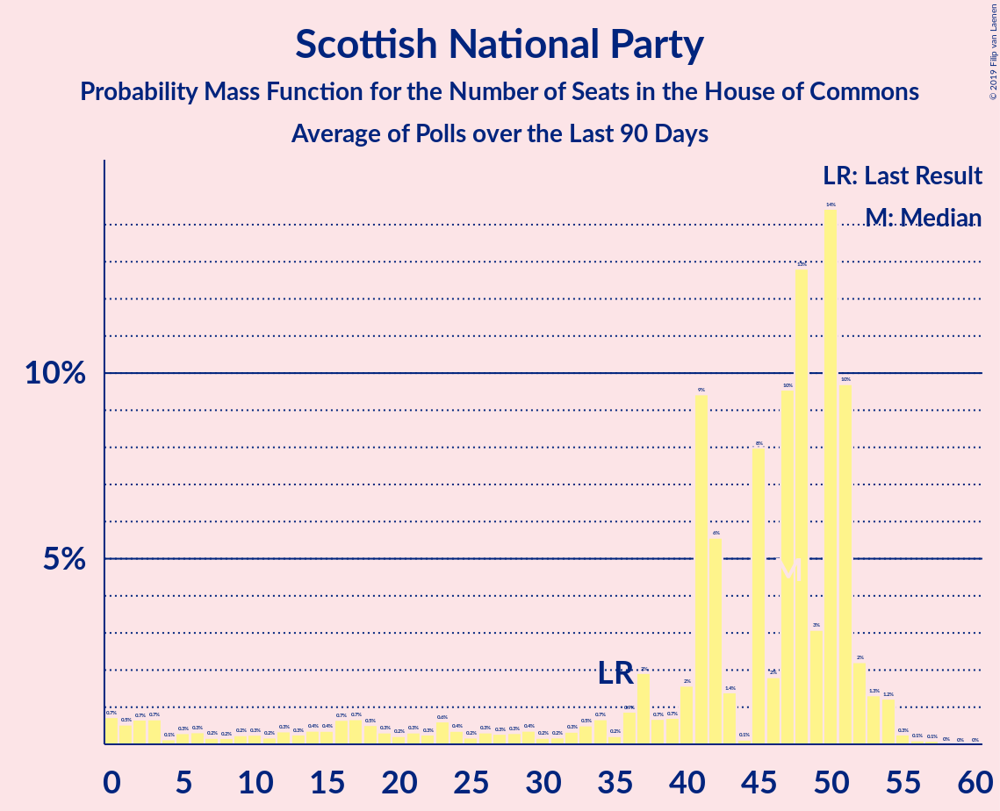

# Scottish National Party

<a href="#voting-intentions">Voting Intentions</a> | <a href="#seats">Seats</a>

## Voting Intentions

Last result: **3.1%** (General Election of 8 June 2017)

### Confidence Intervals

| Period     | Polling firm/Commissioner(s) | Median | 80% Confidence Interval | 90% Confidence Interval | 95% Confidence Interval | 99% Confidence Interval |
|:----------:|:----------------:|:-----------:|:-----------------------:|:-----------------------:|:-----------------------:|:-----------------------:|
| N/A | [Poll Average](average.html) | 3.9% | 2.5–4.5% | 2.0–4.7% | 1.9–4.9% | 1.6–5.3% |
| [10–11 December 2019](2019-12-11-Survation.html) | Survation | 4.0% | 3.5–4.6% | 3.4–4.7% | 3.3–4.9% | 3.1–5.2% |
| [10–11 December 2019](2019-12-11-Panelbase.html) | Panelbase | 4.0% | 3.6–4.5% | 3.5–4.6% | 3.4–4.8% | 3.2–5.0% |
| [10–11 December 2019](2019-12-11-Opinium.html) | Opinium | 4.0% | 3.6–4.5% | 3.5–4.7% | 3.4–4.8% | 3.2–5.0% |
| [9–11 December 2019](2019-12-11-KantarPublic.html) | Kantar Public | 4.0% | 3.5–4.5% | 3.4–4.6% | 3.3–4.8% | 3.1–5.0% |
| [9–11 December 2019](2019-12-11-IpsosMORI.html) | Ipsos MORI   Evening Standard | 0.0% | N/A | N/A | N/A | N/A |
| [9–11 December 2019](2019-12-11-Deltapoll.html) | Deltapoll | 4.0% | 3.4–4.6% | 3.3–4.8% | 3.2–5.0% | 2.9–5.3% |
| [6–11 December 2019](2019-12-11-BMGResearch.html) | BMG Research | 0.0% | N/A | N/A | N/A | N/A |
| [8–10 December 2019](2019-12-10-NumberCruncherPolitics.html) | Number Cruncher Politics   Bloomberg | 4.0% | 3.3–4.9% | 3.1–5.1% | 2.9–5.4% | 2.6–5.8% |
| [9–10 December 2019](2019-12-10-ComRes.html) | ComRes   Daily Telegraph | 4.0% | 3.5–4.6% | 3.4–4.8% | 3.2–4.9% | 3.0–5.3% |
| [6–9 December 2019](2019-12-09-ICMResearch.html) | ICM Research | 3.0% | 2.6–3.6% | 2.5–3.7% | 2.4–3.9% | 2.2–4.2% |
| [5–8 December 2019](2019-12-08-Qriously.html) | Qriously | 2.0% | 1.7–2.5% | 1.6–2.6% | 1.5–2.7% | 1.4–2.9% |
| [6–8 December 2019](2019-12-08-ComRes.html) | ComRes   Remain United | 4.0% | 3.6–4.3% | 3.6–4.4% | 3.5–4.5% | 3.3–4.6% |
| [5–7 December 2019](2019-12-07-Survation.html) | Survation   Good Morning Britain | 3.0% | 2.4–3.8% | 2.2–4.0% | 2.1–4.2% | 1.8–4.6% |
| [5–7 December 2019](2019-12-07-Deltapoll.html) | Deltapoll   The Mail on Sunday | 4.0% | 3.5–4.8% | 3.3–5.0% | 3.2–5.2% | 2.9–5.5% |
| [5–6 December 2019](2019-12-06-YouGov.html) | YouGov   The Sunday Times | 4.0% | 3.4–4.7% | 3.3–4.9% | 3.1–5.0% | 2.9–5.4% |
| [4–6 December 2019](2019-12-06-Panelbase.html) | Panelbase | 4.0% | 3.5–4.6% | 3.3–4.8% | 3.2–4.9% | 3.0–5.2% |
| [4–6 December 2019](2019-12-06-Opinium.html) | Opinium   The Observer | 4.0% | 3.5–4.6% | 3.3–4.8% | 3.2–5.0% | 3.0–5.3% |
| [4–6 December 2019](2019-12-06-BMGResearch.html) | BMG Research   The Independent | 3.0% | 2.5–3.6% | 2.3–3.8% | 2.2–4.0% | 2.0–4.3% |
| [4–5 December 2019](2019-12-05-ComRes.html) | ComRes   The Sunday Telegraph | 4.0% | 3.5–4.6% | 3.3–4.8% | 3.2–4.9% | 3.0–5.2% |
| [2–4 December 2019](2019-12-04-IpsosMORI.html) | Ipsos MORI   Evening Standard | 4.0% | 3.4–4.7% | 3.3–4.9% | 3.1–5.1% | 2.9–5.5% |
| [2–3 December 2019](2019-12-03-YouGov.html) | YouGov   The Times and Sky News | 4.9% | 4.3–5.7% | 4.1–5.9% | 4.0–6.1% | 3.7–6.5% |
| [2–3 December 2019](2019-12-03-ComRes.html) | ComRes   Daily Telegraph | 4.0% | 3.5–4.6% | 3.4–4.8% | 3.2–5.0% | 3.0–5.3% |
| [28 November–2 December 2019](2019-12-02-KantarPublic.html) | Kantar Public | 3.0% | 2.4–3.8% | 2.3–4.0% | 2.1–4.2% | 1.9–4.6% |
| [29 November–2 December 2019](2019-12-02-ICMResearch.html) | ICM Research | 3.0% | 2.6–3.6% | 2.4–3.7% | 2.3–3.9% | 2.1–4.1% |
| [26–30 November 2019](2019-11-30-Survation.html) | Survation   Good Morning Britain | 3.0% | 2.4–3.8% | 2.3–4.0% | 2.1–4.2% | 1.9–4.6% |
| [28–30 November 2019](2019-11-30-Deltapoll.html) | Deltapoll   The Mail on Sunday | 3.0% | 2.5–3.7% | 2.4–3.8% | 2.3–4.0% | 2.0–4.3% |
| [28–29 November 2019](2019-11-29-YouGov.html) | YouGov   The Sunday Times | 4.0% | 3.4–4.7% | 3.3–4.9% | 3.1–5.0% | 2.9–5.4% |
| [27–29 November 2019](2019-11-29-Opinium.html) | Opinium   The Observer | 4.0% | 3.5–4.6% | 3.3–4.8% | 3.2–4.9% | 3.0–5.2% |
| [27–28 November 2019](2019-11-28-Panelbase.html) | Panelbase | 3.0% | 2.5–3.5% | 2.4–3.7% | 2.3–3.8% | 2.1–4.1% |
| [27–28 November 2019](2019-11-28-ComRes.html) | ComRes   The Sunday Telegraph | 3.0% | 2.6–3.6% | 2.5–3.7% | 2.3–3.9% | 2.1–4.1% |
| [26–27 November 2019](2019-11-27-BMGResearch.html) | BMG Research   The Independent | 4.0% | 3.5–4.7% | 3.3–4.9% | 3.2–5.1% | 2.9–5.4% |
| [25–26 November 2019](2019-11-26-YouGov.html) | YouGov   The Times and Sky News | 4.1% | 3.5–4.7% | 3.3–4.9% | 3.2–5.1% | 3.0–5.5% |
| [25–26 November 2019](2019-11-26-ComRes.html) | ComRes   Daily Telegraph | 3.0% | 2.6–3.6% | 2.5–3.8% | 2.4–3.9% | 2.2–4.2% |
| [21–25 November 2019](2019-11-25-KantarPublic.html) | Kantar Public | 4.0% | 3.3–4.9% | 3.2–5.1% | 3.0–5.3% | 2.7–5.8% |
| [22–25 November 2019](2019-11-25-ICMResearch.html) | ICM Research | 3.0% | 2.6–3.6% | 2.4–3.7% | 2.3–3.8% | 2.1–4.1% |
| [20–23 November 2019](2019-11-23-Survation.html) | Survation   Good Morning Britain | 3.0% | 2.4–3.8% | 2.2–4.0% | 2.1–4.2% | 1.8–4.6% |
| [21–23 November 2019](2019-11-23-Deltapoll.html) | Deltapoll   The Mail on Sunday | 4.0% | 3.4–4.7% | 3.3–5.0% | 3.1–5.1% | 2.9–5.5% |
| [21–22 November 2019](2019-11-22-YouGov.html) | YouGov   The Sunday Times | 4.0% | 3.4–4.7% | 3.3–4.9% | 3.2–5.0% | 2.9–5.4% |
| [20–22 November 2019](2019-11-22-Panelbase.html) | Panelbase | 3.0% | 2.6–3.6% | 2.4–3.7% | 2.3–3.9% | 2.1–4.1% |
| [20–22 November 2019](2019-11-22-Opinium.html) | Opinium   The Observer | 5.0% | 4.4–5.7% | 4.3–5.9% | 4.1–6.1% | 3.9–6.4% |
| [20–21 November 2019](2019-11-21-ComRes.html) | ComRes   The Sunday Express | 3.0% | 2.6–3.5% | 2.4–3.7% | 2.3–3.8% | 2.1–4.1% |
| [19–21 November 2019](2019-11-21-BMGResearch.html) | BMG Research | 2.0% | 1.7–2.6% | 1.6–2.7% | 1.5–2.9% | 1.3–3.1% |
| [12–20 November 2019](2019-11-20-YouGov.html) | YouGov | 4.0% | 3.7–4.2% | 3.7–4.3% | 3.6–4.3% | 3.5–4.5% |
| [18–19 November 2019](2019-11-19-YouGov.html) | YouGov   The Times | 4.0% | 3.4–4.7% | 3.3–4.9% | 3.1–5.1% | 2.9–5.4% |
| [15–19 November 2019](2019-11-19-IpsosMORI.html) | Ipsos MORI   Evening Standard | 4.0% | 3.3–4.8% | 3.1–5.1% | 3.0–5.3% | 2.7–5.7% |
| [18–19 November 2019](2019-11-19-ComRes.html) | ComRes   Daily Telegraph | 4.0% | 3.4–4.7% | 3.3–4.9% | 3.1–5.1% | 2.9–5.4% |
| [14–18 November 2019](2019-11-18-KantarPublic.html) | Kantar Public | 4.0% | 3.4–4.8% | 3.2–5.1% | 3.0–5.3% | 2.7–5.7% |
| [15–18 November 2019](2019-11-18-ICMResearch.html) | ICM Research | 3.0% | 2.5–3.5% | 2.4–3.7% | 2.3–3.8% | 2.1–4.1% |
| [14–16 November 2019](2019-11-16-Survation.html) | Survation | 3.1% | 2.5–3.9% | 2.3–4.1% | 2.2–4.3% | 1.9–4.8% |
| [10–16 November 2019](2019-11-16-Deltapoll.html) | Deltapoll   The Mail on Sunday | 3.0% | 2.5–3.7% | 2.4–3.8% | 2.3–4.0% | 2.0–4.3% |
| [14–15 November 2019](2019-11-15-YouGov.html) | YouGov   The Sunday Times | 4.0% | 3.4–4.6% | 3.2–4.8% | 3.1–5.0% | 2.9–5.3% |
| [13–15 November 2019](2019-11-15-Opinium.html) | Opinium   The Observer | 4.0% | 3.5–4.6% | 3.3–4.8% | 3.2–4.9% | 3.0–5.2% |
| [9–15 November 2019](2019-11-15-BMGResearch.html) | BMG Research | 3.0% | 2.5–3.6% | 2.4–3.8% | 2.3–4.0% | 2.1–4.3% |
| [13–14 November 2019](2019-11-14-Panelbase.html) | Panelbase | 4.0% | 3.3–4.9% | 3.1–5.2% | 3.0–5.4% | 2.7–5.9% |
| [13–14 November 2019](2019-11-14-ComRes.html) | ComRes   The Sunday Telegraph | 3.0% | 2.6–3.6% | 2.5–3.7% | 2.4–3.9% | 2.2–4.1% |
| [11–12 November 2019](2019-11-12-YouGov.html) | YouGov   The Times and Sky News | 3.0% | 2.5–3.7% | 2.4–3.8% | 2.3–4.0% | 2.1–4.3% |
| [11–12 November 2019](2019-11-12-ComRes.html) | ComRes   Daily Telegraph | 3.9% | 3.4–4.5% | 3.3–4.7% | 3.1–4.8% | 2.9–5.2% |
| [7–11 November 2019](2019-11-11-KantarPublic.html) | Kantar Public | 3.0% | 2.5–3.7% | 2.3–4.0% | 2.2–4.2% | 1.9–4.5% |
| [8–11 November 2019](2019-11-11-ICMResearch.html) | ICM Research | 2.9% | 2.5–3.5% | 2.4–3.6% | 2.3–3.8% | 2.1–4.1% |
| [8–10 November 2019](2019-11-10-ComRes.html) | ComRes   Britain Elects | 4.0% | 3.5–4.6% | 3.3–4.8% | 3.2–4.9% | 3.0–5.2% |
| [6–9 November 2019](2019-11-09-Deltapoll.html) | Deltapoll   The Mail on Sunday | 3.0% | 2.5–3.7% | 2.4–3.9% | 2.3–4.0% | 2.1–4.4% |
| [7–8 November 2019](2019-11-08-YouGov.html) | YouGov   The Sunday Times and Sky News | 4.0% | 3.5–4.7% | 3.3–4.9% | 3.2–5.1% | 2.9–5.4% |
| [6–8 November 2019](2019-11-08-Survation.html) | Survation | 4.0% | 3.5–4.6% | 3.3–4.8% | 3.2–4.9% | 3.0–5.2% |
| [6–8 November 2019](2019-11-08-Panelbase.html) | Panelbase | 4.0% | 3.3–4.9% | 3.1–5.2% | 3.0–5.4% | 2.7–5.9% |
| [6–8 November 2019](2019-11-08-Opinium.html) | Opinium   The Observer | 5.0% | 4.4–5.7% | 4.3–5.9% | 4.1–6.1% | 3.9–6.4% |
| [5–8 November 2019](2019-11-08-BMGResearch.html) | BMG Research   The Independent | 2.0% | 1.6–2.5% | 1.5–2.7% | 1.4–2.8% | 1.2–3.1% |
| [5–6 November 2019](2019-11-06-YouGov.html) | YouGov   The Times and Sky News | 4.0% | 3.4–4.6% | 3.2–4.8% | 3.1–5.0% | 2.9–5.4% |
| [30 October–5 November 2019](2019-11-05-ComRes.html) | ComRes   Remain United | 3.9% | 3.6–4.3% | 3.5–4.4% | 3.5–4.5% | 3.3–4.6% |
| [1–4 November 2019](2019-11-04-YouGov.html) | YouGov   The Times | 4.0% | 3.6–4.4% | 3.4–4.6% | 3.3–4.7% | 3.2–4.9% |
| [1–4 November 2019](2019-11-04-ICMResearch.html) | ICM Research   Reuters | 3.0% | 2.5–3.5% | 2.4–3.7% | 2.3–3.8% | 2.1–4.1% |
| [31 October–2 November 2019](2019-11-02-Deltapoll.html) | Deltapoll   The Mail on Sunday | 3.0% | 2.5–3.7% | 2.4–3.8% | 2.2–4.0% | 2.0–4.3% |
| [30 October–1 November 2019](2019-11-01-YouGov.html) | YouGov   The Sunday Times | 5.0% | 4.4–5.7% | 4.2–5.9% | 4.1–6.1% | 3.8–6.4% |
| [30 October–1 November 2019](2019-11-01-Opinium.html) | Opinium   The Observer | 3.9% | 3.4–4.6% | 3.3–4.7% | 3.2–4.9% | 2.9–5.2% |
| [30–31 October 2019](2019-10-31-Panelbase.html) | Panelbase | 3.0% | 2.4–3.8% | 2.2–4.0% | 2.1–4.2% | 1.8–4.6% |
| [30–31 October 2019](2019-10-31-ORB.html) | ORB   The Telegraph | 5.0% | 4.4–5.7% | 4.3–5.9% | 4.1–6.0% | 3.9–6.4% |
| [30–31 October 2019](2019-10-31-ComRes.html) | ComRes   Sunday Express | 4.0% | 3.4–4.7% | 3.2–4.9% | 3.1–5.1% | 2.9–5.4% |
| [29–30 October 2019](2019-10-30-YouGov.html) | YouGov   The Times | 4.1% | 3.5–4.7% | 3.4–4.9% | 3.2–5.1% | 3.0–5.4% |
| [29–30 October 2019](2019-10-30-Survation.html) | Survation | 4.0% | 3.3–4.9% | 3.1–5.1% | 2.9–5.3% | 2.6–5.8% |
| [17–28 October 2019](2019-10-28-YouGov.html) | YouGov | 3.9% | 3.7–4.2% | 3.7–4.3% | 3.6–4.3% | 3.5–4.4% |
| [25–28 October 2019](2019-10-28-IpsosMORI.html) | Ipsos MORI | 3.0% | 2.4–3.8% | 2.2–4.0% | 2.1–4.2% | 1.8–4.6% |
| [24–25 October 2019](2019-10-25-YouGov.html) | YouGov | 3.0% | 2.5–3.6% | 2.4–3.8% | 2.3–3.9% | 2.1–4.2% |
| [23–25 October 2019](2019-10-25-Opinium.html) | Opinium   The Observer | 5.0% | 4.5–5.7% | 4.3–5.9% | 4.2–6.1% | 3.9–6.4% |
| [20–21 October 2019](2019-10-21-YouGov.html) | YouGov   The Times | 3.0% | 2.5–3.6% | 2.4–3.7% | 2.2–3.9% | 2.0–4.2% |
| [18–21 October 2019](2019-10-21-Deltapoll.html) | Deltapoll | 4.0% | 3.5–4.6% | 3.3–4.8% | 3.2–4.9% | 3.0–5.2% |
| [17–18 October 2019](2019-10-18-Survation.html) | Survation   Daily Mail | 3.9% | 3.2–4.8% | 3.0–5.0% | 2.9–5.3% | 2.6–5.7% |
| [17–18 October 2019](2019-10-18-Panelbase.html) | Panelbase | 4.1% | 3.4–5.0% | 3.2–5.2% | 3.0–5.5% | 2.7–5.9% |
| [15–17 October 2019](2019-10-17-Opinium.html) | Opinium   The Observer | 3.9% | 3.4–4.6% | 3.3–4.7% | 3.2–4.9% | 2.9–5.2% |
| [16–17 October 2019](2019-10-17-ComRes.html) | ComRes   Britain Elects | 3.9% | 3.4–4.5% | 3.3–4.7% | 3.2–4.8% | 2.9–5.2% |
| [14–15 October 2019](2019-10-15-YouGov.html) | YouGov   The Times | 4.0% | 3.4–4.7% | 3.3–4.9% | 3.1–5.1% | 2.9–5.4% |
| [10–15 October 2019](2019-10-15-KantarPublic.html) | Kantar Public | 3.0% | 2.5–3.8% | 2.3–4.0% | 2.2–4.2% | 2.0–4.6% |
| [9–11 October 2019](2019-10-11-Panelbase.html) | Panelbase   The Sunday Times | 4.0% | 3.5–4.6% | 3.4–4.8% | 3.2–5.0% | 3.0–5.3% |
| [9–10 October 2019](2019-10-10-ComRes.html) | ComRes   Daily Express | 4.0% | 3.5–4.6% | 3.4–4.8% | 3.2–5.0% | 3.0–5.3% |
| [8–9 October 2019](2019-10-09-YouGov.html) | YouGov   The Times | 4.0% | 3.4–4.7% | 3.2–4.9% | 3.1–5.0% | 2.9–5.4% |
| [4–6 October 2019](2019-10-06-ComRes.html) | ComRes   Daily Telegraph | 3.9% | 3.4–4.6% | 3.3–4.7% | 3.2–4.9% | 2.9–5.2% |
| [3–4 October 2019](2019-10-04-Opinium.html) | Opinium   The Observer | 5.1% | 4.5–5.8% | 4.3–6.0% | 4.2–6.1% | 3.9–6.5% |
| [1–4 October 2019](2019-10-04-BMGResearch.html) | BMG Research   The Independent | 3.0% | 2.5–3.7% | 2.4–3.9% | 2.3–4.0% | 2.1–4.4% |
| [30 September–1 October 2019](2019-10-01-YouGov.html) | YouGov   The Times | 3.0% | 2.5–3.6% | 2.3–3.7% | 2.2–3.9% | 2.0–4.2% |
| [26–27 September 2019](2019-09-27-YouGov.html) | YouGov   The Sunday Times | 4.0% | 3.4–4.7% | 3.3–4.9% | 3.2–5.1% | 2.9–5.4% |
| [25–27 September 2019](2019-09-27-Opinium.html) | Opinium   The Observer | 5.0% | 4.4–5.7% | 4.2–5.9% | 4.1–6.0% | 3.9–6.4% |
| [24–25 September 2019](2019-09-25-YouGov.html) | YouGov   The Times | 2.9% | 2.4–3.5% | 2.3–3.7% | 2.2–3.8% | 2.0–4.1% |
| [25 September 2019](2019-09-25-Survation.html) | Survation   Daily Mail | 4.0% | 3.3–4.9% | 3.1–5.1% | 2.9–5.3% | 2.6–5.8% |
| [24 September 2019](2019-09-24-ComRes.html) | ComRes   Daily Telegraph | 4.2% | 3.5–5.1% | 3.3–5.4% | 3.1–5.6% | 2.8–6.1% |
| [19–20 September 2019](2019-09-20-YouGov.html) | YouGov   People's Vote | 4.0% | 3.5–4.6% | 3.3–4.8% | 3.2–4.9% | 3.0–5.3% |
| [19–20 September 2019](2019-09-20-Opinium.html) | Opinium   The Observer | 4.0% | 3.5–4.7% | 3.4–4.8% | 3.3–5.0% | 3.0–5.3% |
| [18–19 September 2019](2019-09-19-ComRes.html) | ComRes   Britain Elects | 4.0% | 3.5–4.7% | 3.4–4.8% | 3.3–5.0% | 3.0–5.3% |
| [17–18 September 2019](2019-09-18-YouGov.html) | YouGov   The Times | 3.9% | 3.4–4.6% | 3.2–4.8% | 3.1–5.0% | 2.8–5.3% |
| [13–16 September 2019](2019-09-16-IpsosMORI.html) | Ipsos MORI   Evening Standard | 3.5% | 2.8–4.3% | 2.7–4.6% | 2.5–4.8% | 2.2–5.3% |
| [12–15 September 2019](2019-09-15-ComRes.html) | ComRes   Sunday Express | 4.0% | 3.5–4.6% | 3.3–4.8% | 3.2–4.9% | 3.0–5.2% |
| [11–13 September 2019](2019-09-13-Opinium.html) | Opinium   The Observer | 4.0% | 3.5–4.6% | 3.3–4.8% | 3.2–5.0% | 3.0–5.3% |
| [9–10 September 2019](2019-09-10-YouGov.html) | YouGov   The Times | 4.0% | 3.4–4.7% | 3.3–4.9% | 3.2–5.1% | 2.9–5.4% |
| [5–9 September 2019](2019-09-09-KantarPublic.html) | Kantar Public | 4.0% | 3.4–4.9% | 3.2–5.1% | 3.0–5.3% | 2.7–5.8% |
| [6–8 September 2019](2019-09-08-ComRes.html) | ComRes   Daily Telegraph | 3.0% | 2.5–3.5% | 2.4–3.7% | 2.3–3.8% | 2.1–4.1% |
| [5–7 September 2019](2019-09-07-Deltapoll.html) | Deltapoll   The Sun on Sunday | 5.0% | 4.4–5.7% | 4.3–5.9% | 4.1–6.0% | 3.9–6.4% |
| [5–6 September 2019](2019-09-06-YouGov.html) | YouGov   The Sunday Times | 4.0% | 3.4–4.7% | 3.3–4.9% | 3.2–5.1% | 2.9–5.4% |
| [5–6 September 2019](2019-09-06-Survation.html) | Survation   Daily Mail | 3.9% | 3.2–4.8% | 3.0–5.1% | 2.9–5.3% | 2.6–5.8% |
| [5–6 September 2019](2019-09-06-Panelbase.html) | Panelbase | 3.1% | 2.5–3.9% | 2.3–4.1% | 2.2–4.3% | 1.9–4.7% |
| [4–6 September 2019](2019-09-06-Opinium.html) | Opinium   The Observer | 5.0% | 4.4–5.7% | 4.2–5.9% | 4.1–6.0% | 3.8–6.4% |
| [4–6 September 2019](2019-09-06-ComRes.html) | ComRes   Britain Elects | 3.0% | 2.5–3.5% | 2.4–3.7% | 2.3–3.8% | 2.1–4.1% |
| [3–6 September 2019](2019-09-06-BMGResearch.html) | BMG Research   The Independent | 2.8% | 2.3–3.4% | 2.2–3.6% | 2.1–3.8% | 1.9–4.1% |
| [3–4 September 2019](2019-09-04-HanburyStrategy.html) | Hanbury Strategy | 4.0% | 3.3–4.9% | 3.1–5.2% | 3.0–5.4% | 2.7–5.9% |
| [2–3 September 2019](2019-09-03-YouGov.html) | YouGov   The Times | 4.0% | 3.4–4.7% | 3.2–4.9% | 3.1–5.0% | 2.9–5.4% |
| [29–31 August 2019](2019-08-31-Deltapoll.html) | Deltapoll   The Mail on Sunday | 3.9% | 3.4–4.5% | 3.2–4.7% | 3.1–4.8% | 2.9–5.2% |
| [29–30 August 2019](2019-08-30-Survation.html) | Survation   Daily Mail | 3.9% | 3.2–4.8% | 3.0–5.1% | 2.9–5.3% | 2.6–5.8% |
| [28–29 August 2019](2019-08-29-YouGov.html) | YouGov | 4.0% | 3.4–4.6% | 3.3–4.8% | 3.2–5.0% | 2.9–5.3% |
| [27–28 August 2019](2019-08-28-YouGov.html) | YouGov   The Times | 4.0% | 3.5–4.6% | 3.3–4.8% | 3.2–4.9% | 3.0–5.3% |
| [22–23 August 2019](2019-08-23-YouGov.html) | YouGov   The Sunday Times | 4.1% | 3.6–4.7% | 3.4–4.9% | 3.3–5.0% | 3.0–5.3% |
| [21–23 August 2019](2019-08-23-Opinium.html) | Opinium   The Observer | 4.9% | 4.4–5.6% | 4.2–5.8% | 4.1–6.0% | 3.8–6.3% |
| [20–21 August 2019](2019-08-21-YouGov.html) | YouGov   The Times | 4.0% | 3.4–4.7% | 3.3–4.8% | 3.1–5.0% | 2.9–5.4% |
| [15–19 August 2019](2019-08-19-KantarPublic.html) | Kantar Public | 4.9% | 4.2–5.9% | 4.0–6.1% | 3.8–6.4% | 3.5–6.8% |
| [13–14 August 2019](2019-08-14-YouGov.html) | YouGov   The Times | 3.9% | 3.4–4.6% | 3.2–4.8% | 3.1–5.0% | 2.9–5.4% |
| [7–12 August 2019](2019-08-12-BMGResearch.html) | BMG Research   The Independent | 3.0% | 2.5–3.6% | 2.4–3.8% | 2.3–4.0% | 2.0–4.3% |
| [6–11 August 2019](2019-08-11-Survation.html) | Survation | 4.0% | 3.5–4.6% | 3.4–4.8% | 3.2–5.0% | 3.0–5.3% |
| [9–11 August 2019](2019-08-11-ComRes.html) | ComRes   Daily Telegraph | 3.0% | 2.5–3.5% | 2.4–3.7% | 2.3–3.8% | 2.1–4.1% |
| [8–9 August 2019](2019-08-09-Opinium.html) | Opinium   The Observer | 4.0% | 3.5–4.7% | 3.4–4.8% | 3.3–5.0% | 3.0–5.3% |
| [5–6 August 2019](2019-08-06-YouGov.html) | YouGov   The Times | 4.0% | 3.4–4.7% | 3.3–4.9% | 3.1–5.1% | 2.9–5.4% |
| [29–30 July 2019](2019-07-30-YouGov.html) | YouGov   The Times | 5.2% | 4.6–5.9% | 4.4–6.1% | 4.3–6.2% | 4.0–6.6% |
| [26–30 July 2019](2019-07-30-IpsosMORI.html) | Ipsos MORI | 3.9% | 3.2–4.8% | 3.0–5.0% | 2.8–5.3% | 2.5–5.7% |
| [26–28 July 2019](2019-07-28-ComRes.html) | ComRes   Britain Elects | 2.9% | 2.5–3.5% | 2.4–3.6% | 2.3–3.8% | 2.1–4.1% |
| [25–27 July 2019](2019-07-27-Deltapoll.html) | Deltapoll   The Mail on Sunday | 4.0% | 3.5–4.6% | 3.3–4.8% | 3.2–5.0% | 3.0–5.3% |
| [25–26 July 2019](2019-07-26-YouGov.html) | YouGov   The Sunday Times | 4.9% | 4.3–5.7% | 4.2–5.9% | 4.0–6.1% | 3.7–6.5% |
| [24–26 July 2019](2019-07-26-Opinium.html) | Opinium   The Observer | 4.9% | 4.3–5.6% | 4.2–5.8% | 4.0–5.9% | 3.8–6.3% |
| [24–25 July 2019](2019-07-25-ComRes.html) | ComRes   Sunday Express | 3.0% | 2.6–3.6% | 2.4–3.7% | 2.3–3.9% | 2.1–4.1% |
| [23–24 July 2019](2019-07-24-YouGov.html) | YouGov   The Times | 3.9% | 3.4–4.6% | 3.2–4.8% | 3.1–4.9% | 2.8–5.3% |
| [16–17 July 2019](2019-07-17-YouGov.html) | YouGov   The Times | 4.0% | 3.5–4.7% | 3.3–4.9% | 3.2–5.0% | 2.9–5.4% |
| [15–16 July 2019](2019-07-16-ComRes.html) | ComRes | 4.0% | 3.5–4.6% | 3.3–4.8% | 3.2–4.9% | 3.0–5.2% |
| [10–11 July 2019](2019-07-11-Survation.html) | Survation | 4.0% | 3.3–4.9% | 3.1–5.1% | 2.9–5.3% | 2.6–5.8% |
| [10–11 July 2019](2019-07-11-ComRes.html) | ComRes   The Express | 3.0% | 2.5–3.6% | 2.4–3.8% | 2.3–3.9% | 2.1–4.2% |
| [9–10 July 2019](2019-07-10-YouGov.html) | YouGov   The Times | 5.0% | 4.3–5.7% | 4.2–5.9% | 4.0–6.1% | 3.7–6.5% |
| [5–7 July 2019](2019-07-07-ComRes.html) | ComRes   Daily Telegraph | 3.0% | 2.6–3.6% | 2.5–3.7% | 2.4–3.9% | 2.2–4.2% |
| [3–5 July 2019](2019-07-05-Opinium.html) | Opinium   The Observer | 4.9% | 4.4–5.6% | 4.2–5.8% | 4.1–6.0% | 3.8–6.3% |
| [2–5 July 2019](2019-07-05-BMGResearch.html) | BMG Research   The Independent | 2.0% | 1.6–2.6% | 1.5–2.7% | 1.4–2.9% | 1.2–3.2% |
| [2–3 July 2019](2019-07-03-YouGov.html) | YouGov   The Times | 4.0% | 3.4–4.7% | 3.3–4.9% | 3.1–5.1% | 2.9–5.4% |
| [24–25 June 2019](2019-06-25-YouGov.html) | YouGov   The Times | 4.0% | 3.5–4.6% | 3.3–4.8% | 3.2–4.9% | 3.0–5.2% |
| [21–25 June 2019](2019-06-25-IpsosMORI.html) | Ipsos MORI | 4.0% | 3.3–4.9% | 3.2–5.2% | 3.0–5.4% | 2.7–5.9% |
| [19–20 June 2019](2019-06-20-Survation.html) | Survation   Daily Mail on Sunday | 3.0% | 2.5–3.5% | 2.4–3.7% | 2.3–3.8% | 2.1–4.1% |
| [19–20 June 2019](2019-06-20-Opinium.html) | Opinium   The Observer | 4.0% | 3.5–4.6% | 3.3–4.8% | 3.2–4.9% | 3.0–5.2% |
| [13–14 June 2019](2019-06-14-YouGov.html) | YouGov   The Sunday Times | 3.0% | 2.5–3.6% | 2.4–3.8% | 2.3–3.9% | 2.1–4.2% |
| [9–10 June 2019](2019-06-10-YouGov.html) | YouGov   The Times | 4.1% | 3.5–4.7% | 3.3–4.9% | 3.2–5.1% | 3.0–5.5% |
| [7–9 June 2019](2019-06-09-ComRes.html) | ComRes   Daily Telegraph | 3.0% | 2.5–3.5% | 2.4–3.7% | 2.3–3.8% | 2.1–4.1% |
| [4–7 June 2019](2019-06-07-BMGResearch.html) | BMG Research   The Independent | 3.0% | 2.5–3.6% | 2.3–3.8% | 2.2–3.9% | 2.0–4.3% |
| [4–6 June 2019](2019-06-06-YouGov.html) | YouGov   The Times | 5.0% | 4.3–5.7% | 4.1–5.9% | 4.0–6.1% | 3.7–6.5% |
| [28–30 May 2019](2019-05-30-Opinium.html) | Opinium   The Observer | 4.0% | 3.5–4.6% | 3.3–4.8% | 3.2–5.0% | 3.0–5.3% |
| [29–30 May 2019](2019-05-30-Deltapoll.html) | Deltapoll   The Mail on Sunday | 3.9% | 3.5–4.5% | 3.3–4.6% | 3.2–4.8% | 3.0–5.0% |
| [28–29 May 2019](2019-05-29-YouGov.html) | YouGov   The Times | 5.1% | 4.5–5.9% | 4.3–6.1% | 4.2–6.2% | 3.9–6.6% |
| [23–24 May 2019](2019-05-24-LordAshcroft.html) | Lord Ashcroft | 0.0% | N/A | N/A | N/A | N/A |
| [22 May 2019](2019-05-22-Survation.html) | Survation   Daily Mail | 3.0% | 2.6–3.6% | 2.4–3.7% | 2.3–3.9% | 2.1–4.1% |
| [14–21 May 2019](2019-05-21-Panelbase.html) | Panelbase   The Sunday Times | 4.0% | 3.5–4.6% | 3.3–4.8% | 3.2–4.9% | 3.0–5.2% |
| [17–20 May 2019](2019-05-20-Opinium.html) | Opinium   The Times | 4.1% | 3.6–4.7% | 3.4–4.9% | 3.3–5.1% | 3.1–5.4% |
| [8–17 May 2019](2019-05-17-YouGov.html) | YouGov   Best For Britain | 4.3% | 4.0–4.6% | 3.9–4.6% | 3.9–4.7% | 3.7–4.8% |
| [17 May 2019](2019-05-17-Survation.html) | Survation   Daily Mail | 4.9% | 4.1–5.9% | 3.9–6.2% | 3.7–6.4% | 3.4–6.9% |
| [14–16 May 2019](2019-05-16-Opinium.html) | Opinium   The Observer | 4.0% | 3.5–4.7% | 3.4–4.8% | 3.2–5.0% | 3.0–5.3% |
| [13–14 May 2019](2019-05-14-YouGov.html) | YouGov   The Times | 4.2% | 3.7–4.9% | 3.5–5.1% | 3.4–5.3% | 3.1–5.7% |
| [10–14 May 2019](2019-05-14-IpsosMORI.html) | Ipsos MORI | 3.9% | 3.2–4.8% | 3.1–5.0% | 2.9–5.3% | 2.6–5.7% |
| [9–13 May 2019](2019-05-13-KantarPublic.html) | Kantar Public | 5.0% | 4.3–6.0% | 4.1–6.2% | 3.9–6.5% | 3.6–6.9% |
| [9–13 May 2019](2019-05-13-HanburyStrategy.html) | Hanbury Strategy | 4.0% | 3.4–4.6% | 3.3–4.8% | 3.2–4.9% | 2.9–5.2% |
| [10–12 May 2019](2019-05-12-ComRes.html) | ComRes   Daily Telegraph | 3.1% | 2.6–3.6% | 2.5–3.8% | 2.4–3.9% | 2.2–4.2% |
| [8–10 May 2019](2019-05-10-Opinium.html) | Opinium   The Observer | 3.4% | 2.9–4.0% | 2.8–4.1% | 2.7–4.3% | 2.5–4.6% |
| [7–10 May 2019](2019-05-10-BMGResearch.html) | BMG Research | 0.0% | N/A | N/A | N/A | N/A |
| [8–9 May 2019](2019-05-09-YouGov.html) | YouGov   The Times | 4.3% | 3.8–5.0% | 3.7–5.1% | 3.6–5.3% | 3.3–5.6% |
| [9 May 2019](2019-05-09-ComRes.html) | ComRes   Brexit Express | 2.9% | 2.5–3.5% | 2.4–3.6% | 2.3–3.8% | 2.1–4.1% |
| [3–7 May 2019](2019-05-07-Opinium.html) | Opinium | 3.0% | 2.5–3.6% | 2.3–3.8% | 2.2–4.0% | 2.0–4.3% |
| [29–30 April 2019](2019-04-30-YouGov.html) | YouGov | 3.4% | 2.9–4.0% | 2.7–4.2% | 2.6–4.4% | 2.4–4.7% |
| [23–24 April 2019](2019-04-24-YouGov.html) | YouGov   The Times | 4.3% | 3.7–4.9% | 3.5–5.1% | 3.4–5.3% | 3.2–5.6% |
| [18–24 April 2019](2019-04-24-Panelbase.html) | Panelbase   The Sunday Times | 3.9% | 3.4–4.6% | 3.3–4.7% | 3.2–4.9% | 2.9–5.2% |
| [21–23 April 2019](2019-04-23-Opinium.html) | Opinium   The Observer | 5.0% | 4.3–5.9% | 4.1–6.2% | 3.9–6.4% | 3.6–6.8% |
| [16–17 April 2019](2019-04-17-YouGov.html) | YouGov   The Times | 4.3% | 3.7–5.0% | 3.6–5.2% | 3.4–5.3% | 3.2–5.7% |
| [17 April 2019](2019-04-17-OnePoll.html) | OnePoll   The Sun on Sunday | 4.0% | 3.5–4.6% | 3.3–4.8% | 3.2–5.0% | 3.0–5.3% |
| [16–17 April 2019](2019-04-17-ORB.html) | ORB   The Telegraph | 4.0% | 3.4–4.7% | 3.3–4.9% | 3.1–5.1% | 2.9–5.5% |
| [9–12 April 2019](2019-04-12-Opinium.html) | Opinium   The Observer | 5.0% | 4.4–5.7% | 4.2–5.9% | 4.1–6.0% | 3.9–6.4% |
| [4–8 April 2019](2019-04-08-KantarPublic.html) | Kantar Public | 4.9% | 4.2–5.9% | 4.0–6.1% | 3.8–6.4% | 3.5–6.8% |
| [5–8 April 2019](2019-04-08-HanburyStrategy.html) | Hanbury Strategy   Open Europe | 4.0% | 3.4–4.6% | 3.3–4.8% | 3.2–4.9% | 2.9–5.2% |
| [3–6 April 2019](2019-04-06-Survation.html) | Survation | 0.0% | N/A | N/A | N/A | N/A |
| [2–5 April 2019](2019-04-05-BMGResearch.html) | BMG Research   The Independent | 4.1% | 3.5–4.8% | 3.3–5.0% | 3.2–5.2% | 2.9–5.6% |
| [2–3 April 2019](2019-04-03-YouGov.html) | YouGov | 5.0% | 4.4–5.8% | 4.2–6.0% | 4.1–6.2% | 3.8–6.5% |
| [28–30 March 2019](2019-03-30-Deltapoll.html) | Deltapoll   The Mail on Sunday | 3.0% | 2.4–3.8% | 2.2–4.0% | 2.1–4.2% | 1.8–4.6% |
| [28–29 March 2019](2019-03-29-Opinium.html) | Opinium   The Observer | 4.0% | 3.5–4.6% | 3.3–4.8% | 3.2–4.9% | 3.0–5.3% |
| [24–25 March 2019](2019-03-25-YouGov.html) | YouGov   The Times | 4.0% | 3.5–4.6% | 3.3–4.8% | 3.2–4.9% | 3.0–5.2% |
| [20–22 March 2019](2019-03-22-Opinium.html) | Opinium   The Observer | 5.0% | 4.4–5.7% | 4.3–5.9% | 4.1–6.1% | 3.9–6.4% |
| [15–19 March 2019](2019-03-19-IpsosMORI.html) | Ipsos MORI | 5.0% | 4.3–6.0% | 4.1–6.3% | 3.9–6.6% | 3.5–7.1% |
| [14–15 March 2019](2019-03-15-YouGov.html) | YouGov   People’s Vote | 3.0% | 2.6–3.7% | 2.5–3.8% | 2.4–4.0% | 2.1–4.3% |
| [15 March 2019](2019-03-15-Survation.html) | Survation   Daily Mail | 3.0% | 2.4–3.8% | 2.2–4.0% | 2.1–4.2% | 1.8–4.6% |
| [12–15 March 2019](2019-03-15-Opinium.html) | Opinium   The Observer | 5.0% | 4.4–5.7% | 4.3–5.9% | 4.1–6.1% | 3.9–6.4% |
| [7–11 March 2019](2019-03-11-KantarPublic.html) | Kantar Public | 5.0% | 4.3–6.0% | 4.1–6.2% | 3.9–6.5% | 3.6–6.9% |
| [4–8 March 2019](2019-03-08-BMGResearch.html) | BMG Research | 3.0% | 2.5–3.6% | 2.4–3.8% | 2.2–4.0% | 2.0–4.3% |
| [3–4 March 2019](2019-03-04-YouGov.html) | YouGov   The Times | 4.0% | 3.5–4.6% | 3.4–4.8% | 3.2–4.9% | 3.0–5.2% |
| [26 February–1 March 2019](2019-03-01-Opinium.html) | Opinium   The Observer | 4.0% | 3.4–4.6% | 3.3–4.8% | 3.2–4.9% | 2.9–5.2% |
| [22–23 February 2019](2019-02-23-YouGov.html) | YouGov   The Times | 4.0% | 3.4–4.7% | 3.3–4.9% | 3.2–5.1% | 2.9–5.4% |
| [21–23 February 2019](2019-02-23-Deltapoll.html) | Deltapoll   The Mail on Sunday | 4.0% | 3.3–4.9% | 3.1–5.2% | 3.0–5.4% | 2.7–5.8% |
| [18–19 February 2019](2019-02-19-YouGov.html) | YouGov   The Times | 4.3% | 3.7–5.0% | 3.6–5.2% | 3.5–5.3% | 3.2–5.7% |
| [18 February 2019](2019-02-18-Survation.html) | Survation   Daily Mail | 2.9% | 2.3–3.7% | 2.2–4.0% | 2.1–4.2% | 1.8–4.6% |
| [13–15 February 2019](2019-02-15-Opinium.html) | Opinium   The Observer | 4.0% | 3.5–4.7% | 3.4–4.8% | 3.3–5.0% | 3.0–5.3% |
| [7–11 February 2019](2019-02-11-KantarPublic.html) | Kantar Public | 4.0% | 3.4–4.9% | 3.2–5.1% | 3.0–5.3% | 2.7–5.8% |
| [4–8 February 2019](2019-02-08-BMGResearch.html) | BMG Research | 3.0% | 2.5–3.6% | 2.4–3.8% | 2.2–4.0% | 2.0–4.3% |
| [1–5 February 2019](2019-02-05-IpsosMORI.html) | Ipsos MORI | 4.0% | 3.3–4.9% | 3.1–5.2% | 2.9–5.4% | 2.6–5.9% |
| [3–4 February 2019](2019-02-04-YouGov.html) | YouGov   The Times | 4.3% | 3.7–4.9% | 3.6–5.1% | 3.4–5.3% | 3.2–5.6% |
| [30 January–1 February 2019](2019-02-01-Opinium.html) | Opinium   The Observer | 4.0% | 3.5–4.6% | 3.3–4.8% | 3.2–5.0% | 3.0–5.3% |
| [30 January 2019](2019-01-30-Survation.html) | Survation   Daily Mail | 3.0% | 2.4–3.8% | 2.3–4.1% | 2.1–4.3% | 1.9–4.7% |
| [23–25 January 2019](2019-01-25-Opinium.html) | Opinium   People’s Vote | 4.0% | 3.5–4.6% | 3.3–4.8% | 3.2–5.0% | 3.0–5.3% |
| [16–18 January 2019](2019-01-18-Opinium.html) | Opinium   The Observer | 4.9% | 4.3–5.6% | 4.2–5.8% | 4.0–5.9% | 3.8–6.3% |
| [16–18 January 2019](2019-01-18-ICMResearch.html) | ICM Research | 3.0% | 2.5–3.5% | 2.4–3.7% | 2.3–3.8% | 2.1–4.1% |
| [10–17 January 2019](2019-01-17-NumberCruncherPolitics.html) | Number Cruncher Politics   Politico | 3.0% | 2.4–3.8% | 2.3–4.0% | 2.1–4.3% | 1.9–4.7% |
| [16–17 January 2019](2019-01-17-ComRes.html) | ComRes   Sunday Express | 3.0% | 2.6–3.6% | 2.4–3.7% | 2.3–3.8% | 2.1–4.1% |
| [14–15 January 2019](2019-01-15-ComRes.html) | ComRes   Daily Express | 3.0% | 2.6–3.6% | 2.5–3.7% | 2.4–3.9% | 2.2–4.2% |
| [13–14 January 2019](2019-01-14-YouGov.html) | YouGov   The Times | 4.3% | 3.7–5.0% | 3.6–5.2% | 3.4–5.4% | 3.2–5.7% |
| [10–14 January 2019](2019-01-14-KantarPublic.html) | Kantar Public | 4.0% | 3.3–4.8% | 3.1–5.1% | 3.0–5.3% | 2.7–5.7% |
| [10–11 January 2019](2019-01-11-Survation.html) | Survation   Daily Mail | 3.0% | 2.4–3.8% | 2.2–4.0% | 2.1–4.2% | 1.8–4.6% |
| [8–11 January 2019](2019-01-11-BMGResearch.html) | BMG Research   The Independent | 3.0% | 2.5–3.6% | 2.3–3.8% | 2.2–4.0% | 2.0–4.3% |
| [6–7 January 2019](2019-01-07-YouGov.html) | YouGov   The Times | 3.4% | 2.9–4.1% | 2.8–4.3% | 2.7–4.4% | 2.4–4.8% |
| [21 December 2018–4 January 2019](2019-01-04-YouGov.html) | YouGov   People’s Vote | 3.5% | 3.3–3.7% | 3.3–3.7% | 3.3–3.7% | 3.2–3.8% |
| [18–20 December 2018](2018-12-20-Opinium.html) | Opinium | 4.0% | 3.5–4.6% | 3.3–4.8% | 3.2–5.0% | 3.0–5.3% |
| [16–17 December 2018](2018-12-17-YouGov.html) | YouGov   The Times | 4.3% | 3.7–5.0% | 3.5–5.2% | 3.4–5.4% | 3.1–5.7% |
| [12–14 December 2018](2018-12-14-YouGov.html) | YouGov   People’s Vote | 4.3% | 4.0–4.7% | 3.9–4.8% | 3.8–4.9% | 3.6–5.1% |
| [13–14 December 2018](2018-12-14-Opinium.html) | Opinium   The Observer | 4.0% | 3.5–4.6% | 3.3–4.8% | 3.2–4.9% | 3.0–5.2% |
| [10–11 December 2018](2018-12-11-Populus.html) | Populus | 3.0% | 2.6–3.6% | 2.5–3.8% | 2.4–3.9% | 2.2–4.2% |
| [6–7 December 2018](2018-12-07-YouGov.html) | YouGov   The Sunday Times | 4.4% | 3.8–5.1% | 3.6–5.3% | 3.5–5.5% | 3.2–5.8% |
| [5–6 December 2018](2018-12-06-KantarPublic.html) | Kantar Public | 4.0% | 3.3–4.8% | 3.2–5.1% | 3.0–5.3% | 2.7–5.7% |
| [30 November–5 December 2018](2018-12-05-IpsosMORI.html) | Ipsos MORI | 4.0% | 3.3–4.9% | 3.1–5.2% | 3.0–5.4% | 2.7–5.8% |
| [3–4 December 2018](2018-12-04-YouGov.html) | YouGov   The Times | 4.2% | 3.7–5.0% | 3.5–5.2% | 3.4–5.3% | 3.1–5.7% |
| [30 November–2 December 2018](2018-12-02-ComRes.html) | ComRes   Sunday Express | 3.0% | 2.6–3.6% | 2.5–3.7% | 2.4–3.9% | 2.2–4.2% |
| [26–27 November 2018](2018-11-27-YouGov.html) | YouGov   The Times | 3.5% | 2.9–4.1% | 2.8–4.3% | 2.7–4.4% | 2.5–4.8% |
| [18–19 November 2018](2018-11-19-YouGov.html) | YouGov   The Times | 3.5% | 3.0–4.1% | 2.8–4.3% | 2.7–4.5% | 2.5–4.8% |
| [14–15 November 2018](2018-11-15-Opinium.html) | Opinium | 5.0% | 4.3–5.9% | 4.1–6.2% | 3.9–6.4% | 3.6–6.9% |
| [14–15 November 2018](2018-11-15-ComRes.html) | ComRes   Sunday Express | 3.0% | 2.6–3.6% | 2.4–3.7% | 2.3–3.9% | 2.1–4.1% |
| [8–12 November 2018](2018-11-12-KantarPublic.html) | Kantar Public | 4.0% | 3.4–4.9% | 3.2–5.1% | 3.0–5.3% | 2.7–5.7% |
| [2–7 November 2018](2018-11-07-Panelbase.html) | Panelbase   Constitutional Commission | 4.0% | 3.5–4.6% | 3.3–4.8% | 3.2–4.9% | 3.0–5.2% |
| [4–5 November 2018](2018-11-05-YouGov.html) | YouGov   The Times | 3.5% | 3.0–4.1% | 2.8–4.3% | 2.7–4.5% | 2.5–4.8% |
| [20 October–2 November 2018](2018-11-02-Survation.html) | Survation   Channel 4 | 3.1% | 2.9–3.2% | 2.9–3.3% | 2.8–3.3% | 2.8–3.4% |
| [29–30 October 2018](2018-10-30-YouGov.html) | YouGov   The Times | 3.5% | 2.9–4.1% | 2.8–4.3% | 2.7–4.5% | 2.5–4.8% |
| [26–28 October 2018](2018-10-28-ICMResearch.html) | ICM Research | 3.0% | 2.6–3.6% | 2.5–3.7% | 2.4–3.9% | 2.2–4.1% |
| [24–26 October 2018](2018-10-26-Deltapoll.html) | Deltapoll   Mirror | 3.9% | 3.2–4.8% | 3.1–5.1% | 2.9–5.3% | 2.6–5.8% |
| [22–23 October 2018](2018-10-23-YouGov.html) | YouGov   The Times | 5.2% | 4.5–5.9% | 4.4–6.1% | 4.2–6.3% | 3.9–6.7% |
| [19–22 October 2018](2018-10-22-IpsosMORI.html) | Ipsos MORI | 3.9% | 3.2–4.8% | 3.1–5.1% | 2.9–5.3% | 2.6–5.7% |
| [14–15 October 2018](2018-10-15-YouGov.html) | YouGov   The Times | 3.5% | 3.0–4.2% | 2.9–4.4% | 2.7–4.5% | 2.5–4.9% |
| [11–15 October 2018](2018-10-15-KantarPublic.html) | Kantar Public | 4.0% | 3.3–4.8% | 3.1–5.1% | 3.0–5.3% | 2.7–5.7% |
| [11–12 October 2018](2018-10-12-Opinium.html) | Opinium   The Observer | 4.0% | 3.5–4.6% | 3.3–4.8% | 3.2–4.9% | 3.0–5.2% |
| [10 October 2018](2018-10-10-Survation.html) | Survation | 4.0% | 3.3–4.9% | 3.1–5.1% | 2.9–5.4% | 2.6–5.8% |
| [8–9 October 2018](2018-10-09-YouGov.html) | YouGov   The Times | 4.3% | 3.7–5.0% | 3.5–5.2% | 3.4–5.3% | 3.1–5.7% |
| [4–7 October 2018](2018-10-07-BMGResearch.html) | BMG Research | 3.0% | 2.5–3.6% | 2.3–3.8% | 2.2–4.0% | 2.0–4.3% |
| [3–5 October 2018](2018-10-05-Opinium.html) | Opinium   The Observer | 3.0% | 2.6–3.6% | 2.5–3.7% | 2.4–3.9% | 2.2–4.2% |
| [3–5 October 2018](2018-10-05-BMGResearch.html) | BMG Research   The Independent | 4.0% | 3.4–4.7% | 3.2–4.9% | 3.1–5.1% | 2.9–5.5% |
| [30 September–1 October 2018](2018-10-01-YouGov.html) | YouGov   The Times | 3.5% | 3.0–4.1% | 2.8–4.3% | 2.7–4.5% | 2.5–4.8% |
| [28–29 September 2018](2018-09-29-BMGResearch.html) | BMG Research   HuffPost UK | 4.0% | 3.4–4.8% | 3.2–5.0% | 3.0–5.3% | 2.7–5.7% |
| [26–28 September 2018](2018-09-28-Opinium.html) | Opinium   The Observer | 4.1% | 3.6–4.7% | 3.4–4.9% | 3.3–5.0% | 3.1–5.4% |
| [26–27 September 2018](2018-09-27-ComRes.html) | ComRes   Sunday Express | 3.0% | 2.6–3.6% | 2.5–3.7% | 2.4–3.9% | 2.2–4.2% |
| [24–25 September 2018](2018-09-25-YouGov.html) | YouGov   The Times | 3.4% | 2.9–4.1% | 2.8–4.3% | 2.7–4.5% | 2.4–4.8% |
| [21–24 September 2018](2018-09-24-ICMResearch.html) | ICM Research   The Guardian | 3.0% | 2.5–3.6% | 2.4–3.7% | 2.3–3.8% | 2.1–4.1% |
| [21–22 September 2018](2018-09-22-BMGResearch.html) | BMG Research   HuffPost UK | 4.0% | 3.3–4.9% | 3.1–5.2% | 2.9–5.4% | 2.6–5.9% |
| [18–20 September 2018](2018-09-20-Opinium.html) | Opinium | 3.9% | 3.4–4.6% | 3.3–4.7% | 3.2–4.9% | 2.9–5.2% |
| [18–19 September 2018](2018-09-19-YouGov.html) | YouGov   The Times | 4.3% | 3.8–4.8% | 3.6–5.0% | 3.5–5.1% | 3.3–5.4% |
| [14–18 September 2018](2018-09-18-IpsosMORI.html) | Ipsos MORI | 3.0% | 2.4–3.8% | 2.3–4.0% | 2.1–4.2% | 1.9–4.6% |
| [12–13 September 2018](2018-09-13-YouGov.html) | YouGov   The Times | 3.5% | 2.9–4.1% | 2.8–4.3% | 2.7–4.5% | 2.4–4.8% |
| [11–13 September 2018](2018-09-13-Opinium.html) | Opinium   The Observer | 4.0% | 3.5–4.6% | 3.4–4.8% | 3.2–5.0% | 3.0–5.3% |
| [6–10 September 2018](2018-09-10-KantarPublic.html) | Kantar Public | 4.0% | 3.4–4.9% | 3.2–5.1% | 3.0–5.3% | 2.7–5.8% |
| [7–9 September 2018](2018-09-09-ICMResearch.html) | ICM Research   The Guardian | 3.0% | 2.5–3.5% | 2.4–3.7% | 2.3–3.8% | 2.1–4.1% |
| [7 September 2018](2018-09-07-Survation.html) | Survation   Daily Mail | 3.0% | 2.4–3.8% | 2.2–4.0% | 2.1–4.2% | 1.9–4.6% |
| [4–7 September 2018](2018-09-07-BMGResearch.html) | BMG Research   The Independent | 2.0% | 1.6–2.6% | 1.5–2.7% | 1.4–2.9% | 1.2–3.1% |
| [3–4 September 2018](2018-09-04-YouGov.html) | YouGov   The Times | 4.3% | 3.7–5.0% | 3.6–5.2% | 3.5–5.3% | 3.2–5.7% |
| [31 August–1 September 2018](2018-09-01-Survation.html) | Survation | 3.0% | 2.5–3.9% | 2.3–4.1% | 2.1–4.3% | 1.9–4.7% |
| [28–29 August 2018](2018-08-29-YouGov.html) | YouGov   The Times | 3.5% | 3.0–4.1% | 2.8–4.3% | 2.7–4.5% | 2.5–4.8% |
| [20–21 August 2018](2018-08-21-YouGov.html) | YouGov   The Times | 4.2% | 3.7–4.9% | 3.5–5.1% | 3.4–5.3% | 3.1–5.7% |
| [17–19 August 2018](2018-08-19-ICMResearch.html) | ICM Research   The Guardian | 2.9% | 2.5–3.5% | 2.4–3.6% | 2.3–3.7% | 2.1–4.0% |
| [14–17 August 2018](2018-08-17-Opinium.html) | Opinium   The Observer | 4.0% | 3.5–4.6% | 3.3–4.8% | 3.2–5.0% | 3.0–5.3% |
| [14–16 August 2018](2018-08-16-Deltapoll.html) | Deltapoll   The Sun on Sunday | 3.0% | 2.5–3.6% | 2.4–3.7% | 2.3–3.9% | 2.1–4.2% |
| [13–14 August 2018](2018-08-14-YouGov.html) | YouGov   The Times | 3.4% | 2.9–4.0% | 2.7–4.2% | 2.6–4.4% | 2.4–4.7% |
| [9–13 August 2018](2018-08-13-NumberCruncherPolitics.html) | Number Cruncher Politics | 4.1% | 3.4–5.0% | 3.2–5.2% | 3.0–5.4% | 2.7–5.9% |
| [9–13 August 2018](2018-08-13-KantarPublic.html) | Kantar Public | 3.9% | 3.3–4.8% | 3.1–5.0% | 2.9–5.2% | 2.7–5.7% |
| [6–10 August 2018](2018-08-10-BMGResearch.html) | BMG Research   The Independent | 3.0% | 2.5–3.7% | 2.4–3.9% | 2.3–4.1% | 2.1–4.4% |
| [8–9 August 2018](2018-08-09-YouGov.html) | YouGov   The Times | 4.3% | 3.7–5.0% | 3.6–5.2% | 3.4–5.4% | 3.2–5.7% |
| [3–5 August 2018](2018-08-05-ICMResearch.html) | ICM Research   The Guardian | 4.0% | 3.5–4.6% | 3.4–4.8% | 3.2–5.0% | 3.0–5.3% |
| [30–31 July 2018](2018-07-31-YouGov.html) | YouGov   The Times | 3.4% | 2.9–4.1% | 2.8–4.3% | 2.7–4.4% | 2.4–4.7% |
| [20–24 July 2018](2018-07-24-IpsosMORI.html) | Ipsos MORI | 4.0% | 3.3–4.9% | 3.1–5.2% | 3.0–5.4% | 2.7–5.9% |
| [22–23 July 2018](2018-07-23-YouGov.html) | YouGov   The Times | 3.5% | 2.9–4.1% | 2.8–4.3% | 2.7–4.5% | 2.4–4.8% |
| [20–22 July 2018](2018-07-22-ICMResearch.html) | ICM Research | 3.0% | 2.5–3.5% | 2.4–3.7% | 2.3–3.8% | 2.1–4.1% |
| [19–20 July 2018](2018-07-20-YouGov.html) | YouGov   The Times | 4.3% | 3.7–5.0% | 3.5–5.2% | 3.4–5.3% | 3.1–5.7% |
| [16–17 July 2018](2018-07-17-YouGov.html) | YouGov   The Times | 3.4% | 2.9–4.1% | 2.8–4.3% | 2.7–4.4% | 2.4–4.8% |
| [12–14 July 2018](2018-07-14-Deltapoll.html) | Deltapoll   The Sun on Sunday | 3.0% | 2.5–3.7% | 2.4–3.9% | 2.3–4.0% | 2.1–4.4% |
| [10–13 July 2018](2018-07-13-Opinium.html) | Opinium   The Observer | 3.9% | 3.4–4.6% | 3.3–4.7% | 3.2–4.9% | 2.9–5.2% |
| [10–11 July 2018](2018-07-11-YouGov.html) | YouGov   The Times | 3.4% | 2.9–4.0% | 2.8–4.2% | 2.7–4.4% | 2.4–4.7% |
| [8–9 July 2018](2018-07-09-YouGov.html) | YouGov   The Times | 3.4% | 2.9–4.1% | 2.8–4.3% | 2.6–4.4% | 2.4–4.7% |
| [5–9 July 2018](2018-07-09-KantarPublic.html) | Kantar Public | 4.0% | 3.3–4.8% | 3.1–5.1% | 2.9–5.3% | 2.7–5.7% |
| [6–9 July 2018](2018-07-09-ICMResearch.html) | ICM Research   The Guardian | 3.0% | 2.5–3.5% | 2.4–3.7% | 2.3–3.8% | 2.1–4.1% |
| [7 July 2018](2018-07-07-Survation.html) | Survation | 3.1% | 2.5–3.9% | 2.3–4.1% | 2.2–4.3% | 1.9–4.8% |
| [3–5 July 2018](2018-07-05-BMGResearch.html) | BMG Research | 3.1% | 2.6–3.8% | 2.5–3.9% | 2.3–4.1% | 2.1–4.5% |
| [3–4 July 2018](2018-07-04-YouGov.html) | YouGov   The Times | 3.4% | 2.9–4.1% | 2.8–4.3% | 2.6–4.4% | 2.4–4.7% |
| [22–27 June 2018](2018-06-27-IpsosMORI.html) | Ipsos MORI | 4.0% | 3.3–4.9% | 3.1–5.2% | 3.0–5.4% | 2.7–5.9% |
| [25–26 June 2018](2018-06-26-YouGov.html) | YouGov   The Times | 4.3% | 3.7–5.0% | 3.5–5.2% | 3.4–5.3% | 3.1–5.7% |
| [22–24 June 2018](2018-06-24-ICMResearch.html) | ICM Research   The Guardian | 3.0% | 2.5–3.5% | 2.4–3.7% | 2.3–3.8% | 2.1–4.1% |
| [19–20 June 2018](2018-06-20-Survation.html) | Survation   Good Morning Britain | 4.1% | 3.4–5.0% | 3.2–5.3% | 3.0–5.5% | 2.7–6.0% |
| [18–19 June 2018](2018-06-19-YouGov.html) | YouGov   The Times | 3.4% | 2.9–4.0% | 2.7–4.2% | 2.6–4.4% | 2.4–4.7% |
| [11–12 June 2018](2018-06-12-YouGov.html) | YouGov   The Times | 3.5% | 3.0–4.1% | 2.8–4.3% | 2.7–4.5% | 2.5–4.8% |
| [8–10 June 2018](2018-06-10-ICMResearch.html) | ICM Research   The Guardian | 3.0% | 2.6–3.6% | 2.5–3.7% | 2.3–3.9% | 2.2–4.1% |
| [5–8 June 2018](2018-06-08-BMGResearch.html) | BMG Research   The Independent | 2.0% | 1.6–2.6% | 1.5–2.7% | 1.4–2.9% | 1.2–3.2% |
| [5–7 June 2018](2018-06-07-Opinium.html) | Opinium   The Observer | 5.9% | 5.3–6.6% | 5.1–6.8% | 4.9–7.0% | 4.6–7.4% |
| [4–5 June 2018](2018-06-05-YouGov.html) | YouGov   The Times | 3.5% | 2.9–4.1% | 2.8–4.3% | 2.7–4.5% | 2.4–4.8% |
| [31 May–4 June 2018](2018-06-04-Survation.html) | Survation | 3.0% | 2.6–3.6% | 2.5–3.7% | 2.4–3.9% | 2.2–4.2% |
| [28–29 May 2018](2018-05-29-YouGov.html) | YouGov   The Times | 4.3% | 3.7–5.0% | 3.5–5.2% | 3.4–5.3% | 3.1–5.7% |
| [25–29 May 2018](2018-05-29-ICMResearch.html) | ICM Research   The Guardian | 2.9% | 2.5–3.5% | 2.4–3.7% | 2.3–3.8% | 2.1–4.1% |
| [18–22 May 2018](2018-05-22-IpsosMORI.html) | Ipsos MORI | 5.0% | 4.2–6.0% | 4.0–6.3% | 3.8–6.6% | 3.5–7.1% |
| [20–21 May 2018](2018-05-21-YouGov.html) | YouGov   The Times | 3.4% | 2.9–4.1% | 2.8–4.3% | 2.7–4.4% | 2.4–4.8% |
| [16–17 May 2018](2018-05-17-ComRes.html) | ComRes   Daily Mail | 3.0% | 2.5–3.5% | 2.4–3.7% | 2.3–3.8% | 2.1–4.1% |
| [15–16 May 2018](2018-05-16-Opinium.html) | Opinium   The Observer | 4.0% | 3.5–4.6% | 3.3–4.8% | 3.2–4.9% | 3.0–5.2% |
| [13–14 May 2018](2018-05-14-YouGov.html) | YouGov   The Times | 2.6% | 2.1–3.2% | 2.0–3.3% | 1.9–3.5% | 1.7–3.8% |
| [11–13 May 2018](2018-05-13-ICMResearch.html) | ICM Research   The Guardian | 3.0% | 2.5–3.5% | 2.4–3.7% | 2.3–3.8% | 2.1–4.1% |
| [8–10 May 2018](2018-05-10-Survation.html) | Survation | 3.0% | 2.5–3.7% | 2.4–3.8% | 2.3–4.0% | 2.1–4.3% |
| [8–9 May 2018](2018-05-09-YouGov.html) | YouGov   The Times | 3.5% | 2.9–4.1% | 2.8–4.3% | 2.7–4.5% | 2.5–4.8% |
| [1–4 May 2018](2018-05-04-BMGResearch.html) | BMG Research   The Independent | 4.0% | 3.4–4.7% | 3.2–4.9% | 3.1–5.1% | 2.8–5.5% |
| [30 April–1 May 2018](2018-05-01-YouGov.html) | YouGov   The Times | 3.5% | 3.0–4.2% | 2.8–4.4% | 2.7–4.5% | 2.5–4.9% |
| [27–29 April 2018](2018-04-29-ICMResearch.html) | ICM Research   The Guardian | 3.0% | 2.6–3.6% | 2.5–3.7% | 2.3–3.9% | 2.1–4.1% |
| [27–29 April 2018](2018-04-29-ComRes.html) | ComRes   Daily Express | 3.0% | 2.5–3.5% | 2.4–3.7% | 2.3–3.8% | 2.1–4.1% |
| [24–25 April 2018](2018-04-25-YouGov.html) | YouGov   The Times | 3.4% | 2.9–4.1% | 2.8–4.3% | 2.6–4.4% | 2.4–4.7% |
| [20–24 April 2018](2018-04-24-IpsosMORI.html) | Ipsos MORI | 3.0% | 2.4–3.8% | 2.2–4.0% | 2.1–4.2% | 1.8–4.7% |
| [16–17 April 2018](2018-04-17-YouGov.html) | YouGov   The Times | 3.4% | 2.9–4.1% | 2.8–4.3% | 2.7–4.4% | 2.4–4.8% |
| [14 April 2018](2018-04-14-Survation.html) | Survation   The Mail on Sunday | 4.0% | 3.5–4.6% | 3.3–4.8% | 3.2–4.9% | 3.0–5.2% |
| [10–13 April 2018](2018-04-13-BMGResearch.html) | BMG Research | 4.0% | 3.5–4.8% | 3.3–5.0% | 3.2–5.1% | 2.9–5.5% |
| [10–12 April 2018](2018-04-12-Opinium.html) | Opinium   The Observer | 4.0% | 3.5–4.6% | 3.3–4.8% | 3.2–4.9% | 3.0–5.3% |
| [11–12 April 2018](2018-04-12-ComRes.html) | ComRes   Sunday Express | 3.0% | 2.6–3.5% | 2.4–3.7% | 2.3–3.8% | 2.1–4.1% |
| [9–10 April 2018](2018-04-10-YouGov.html) | YouGov   The Times | 3.4% | 2.9–4.1% | 2.8–4.3% | 2.6–4.4% | 2.4–4.8% |
| [6–8 April 2018](2018-04-08-ICMResearch.html) | ICM Research   The Guardian | 3.0% | 2.5–3.6% | 2.4–3.7% | 2.3–3.9% | 2.1–4.2% |
| [4–5 April 2018](2018-04-05-YouGov.html) | YouGov   The Times | 3.4% | 2.9–4.0% | 2.7–4.2% | 2.6–4.4% | 2.4–4.7% |
| [27 March–5 April 2018](2018-04-05-NumberCruncherPolitics.html) | Number Cruncher Politics | 4.0% | 3.3–4.8% | 3.1–5.1% | 2.9–5.3% | 2.6–5.8% |
| [26–27 March 2018](2018-03-27-YouGov.html) | YouGov   The Times | 2.6% | 2.1–3.2% | 2.0–3.3% | 1.9–3.5% | 1.7–3.8% |
| [16–18 March 2018](2018-03-18-ICMResearch.html) | ICM Research   The Guardian | 3.0% | 2.5–3.6% | 2.4–3.8% | 2.3–3.9% | 2.1–4.3% |
| [13–16 March 2018](2018-03-16-BMGResearch.html) | BMG Research | 4.0% | 3.4–4.6% | 3.3–4.8% | 3.2–5.0% | 2.9–5.3% |
| [14–15 March 2018](2018-03-15-YouGov.html) | YouGov   The Times | 4.3% | 3.7–4.9% | 3.6–5.1% | 3.5–5.3% | 3.2–5.6% |
| [13–15 March 2018](2018-03-15-Opinium.html) | Opinium   The Observer | 4.0% | 3.5–4.6% | 3.3–4.8% | 3.2–5.0% | 3.0–5.3% |
| [7–8 March 2018](2018-03-08-Survation.html) | Survation   Good Morning Britain | 3.0% | 2.4–3.8% | 2.2–4.0% | 2.1–4.2% | 1.9–4.6% |
| [2–7 March 2018](2018-03-07-IpsosMORI.html) | Ipsos MORI | 4.0% | 3.3–4.9% | 3.1–5.1% | 2.9–5.3% | 2.6–5.8% |
| [5–6 March 2018](2018-03-06-YouGov.html) | YouGov   The Times | 3.4% | 2.9–4.1% | 2.8–4.3% | 2.6–4.4% | 2.4–4.7% |
| [2–4 March 2018](2018-03-04-ICMResearch.html) | ICM Research   The Guardian | 3.0% | 2.6–3.6% | 2.4–3.7% | 2.3–3.9% | 2.1–4.1% |
| [26–27 February 2018](2018-02-27-YouGov.html) | YouGov   The Times | 3.4% | 2.9–4.1% | 2.8–4.3% | 2.7–4.4% | 2.4–4.8% |
| [19–20 February 2018](2018-02-20-YouGov.html) | YouGov   The Times | 3.4% | 2.9–4.0% | 2.7–4.2% | 2.6–4.4% | 2.4–4.7% |
| [16–19 February 2018](2018-02-19-ICMResearch.html) | ICM Research   The Guardian | 3.0% | 2.5–3.6% | 2.4–3.8% | 2.3–3.9% | 2.1–4.3% |
| [12–13 February 2018](2018-02-13-YouGov.html) | YouGov   The Times | 2.6% | 2.2–3.2% | 2.1–3.4% | 2.0–3.5% | 1.8–3.8% |
| [6–12 February 2018](2018-02-12-KantarPublic.html) | Kantar Public | 4.0% | 3.6–4.6% | 3.4–4.8% | 3.3–4.9% | 3.1–5.2% |
| [6–9 February 2018](2018-02-09-BMGResearch.html) | BMG Research | 2.0% | 1.6–2.5% | 1.5–2.7% | 1.4–2.8% | 1.2–3.1% |
| [6–8 February 2018](2018-02-08-Opinium.html) | Opinium   The Observer | 3.9% | 3.4–4.6% | 3.3–4.7% | 3.2–4.9% | 2.9–5.2% |
| [5–6 February 2018](2018-02-06-YouGov.html) | YouGov   The Times | 2.6% | 2.1–3.1% | 2.0–3.2% | 1.9–3.3% | 1.8–3.6% |
| [2–4 February 2018](2018-02-04-ICMResearch.html) | ICM Research   The Guardian | 3.0% | 2.5–3.5% | 2.4–3.7% | 2.3–3.8% | 2.1–4.1% |
| [28–29 January 2018](2018-01-29-YouGov.html) | YouGov   The Times | 3.4% | 2.9–4.1% | 2.8–4.3% | 2.6–4.4% | 2.4–4.7% |
| [26–29 January 2018](2018-01-29-Survation.html) | Survation | 2.0% | 1.5–2.7% | 1.4–2.9% | 1.3–3.0% | 1.1–3.4% |
| [19–23 January 2018](2018-01-23-IpsosMORI.html) | Ipsos MORI | 3.4% | 2.8–4.2% | 2.6–4.5% | 2.5–4.7% | 2.2–5.1% |
| [10–19 January 2018](2018-01-19-ICMResearch.html) | ICM Research   The Guardian | 3.0% | 2.7–3.4% | 2.6–3.5% | 2.5–3.6% | 2.4–3.7% |
| [16–17 January 2018](2018-01-17-YouGov.html) | YouGov   The Times | 3.5% | 3.0–4.1% | 2.8–4.3% | 2.7–4.5% | 2.5–4.8% |
| [12–14 January 2018](2018-01-14-ICMResearch.html) | ICM Research   The Guardian | 3.0% | 2.6–3.6% | 2.5–3.7% | 2.3–3.9% | 2.1–4.1% |
| [11–12 January 2018](2018-01-12-Opinium.html) | Opinium   The Observer | 4.0% | 3.5–4.7% | 3.4–4.8% | 3.2–5.0% | 3.0–5.3% |
| [9–12 January 2018](2018-01-12-BMGResearch.html) | BMG Research | 3.0% | 2.5–3.6% | 2.3–3.8% | 2.2–4.0% | 2.0–4.3% |
| [7–8 January 2018](2018-01-08-YouGov.html) | YouGov   The Times | 3.4% | 2.9–4.1% | 2.8–4.3% | 2.7–4.4% | 2.4–4.8% |

### Probability Mass Function

The following table shows the probability mass function per percentage block of voting intentions for the [poll average](average.html) for Scottish National Party.

| Voting Intentions | Probability | Accumulated | Special Marks |
|:-----------------:|:-----------:|:-----------:|:-------------:|
| 0.0–0.5% | 0% | 100% |  |
| 0.5–1.5% | 0.3% | 100% |  |
| 1.5–2.5% | 10% | 99.7% |  |
| 2.5–3.5% | 19% | 90% | Last Result |
| 3.5–4.5% | 62% | 71% | Median |
| 4.5–5.5% | 9% | 9% |  |
| 5.5–6.5% | 0.2% | 0.2% |  |
| 6.5–7.5% | 0% | 0% |  |

## Seats

Last result: **35** seats (General Election of 8 June 2017)

### Confidence Intervals

| Period     | Polling firm/Commissioner(s) | Median | 80% Confidence Interval | 90% Confidence Interval | 95% Confidence Interval | 99% Confidence Interval |
|:----------:|:----------------:|:------:|:-----------------------:|:-----------------------:|:-----------------------:|:-----------------------:|
| N/A | [Poll Average](average.html) | 47 | 26–51 | 14–52 | 3–53 | 0–54 |
| [10–11 December 2019](2019-12-11-Survation.html) | Survation | 48 | 42–52 | 41–53 | 41–54 | 37–55 |
| [10–11 December 2019](2019-12-11-Panelbase.html) | Panelbase | 48 | 42–51 | 41–52 | 41–52 | 41–53 |
| [10–11 December 2019](2019-12-11-Opinium.html) | Opinium | 47 | 41–50 | 41–50 | 41–51 | 38–52 |
| [9–11 December 2019](2019-12-11-KantarPublic.html) | Kantar Public | 47 | 41–50 | 41–51 | 41–51 | 38–52 |
| [9–11 December 2019](2019-12-11-IpsosMORI.html) | Ipsos MORI   Evening Standard |  |  |  |  |  |
| [9–11 December 2019](2019-12-11-Deltapoll.html) | Deltapoll | 48 | 41–52 | 41–53 | 39–54 | 34–56 |
| [6–11 December 2019](2019-12-11-BMGResearch.html) | BMG Research |  |  |  |  |  |
| [8–10 December 2019](2019-12-10-NumberCruncherPolitics.html) | Number Cruncher Politics   Bloomberg | 48 | 41–52 | 39–54 | 36–54 | 30–56 |
| [9–10 December 2019](2019-12-10-ComRes.html) | ComRes   Daily Telegraph | 50 | 45–51 | 41–53 | 40–54 | 38–54 |
| [6–9 December 2019](2019-12-09-ICMResearch.html) | ICM Research | 38 | 22–45 | 19–47 | 17–48 | 5–50 |
| [5–8 December 2019](2019-12-08-Qriously.html) | Qriously | 14 | 1–30 | 0–33 | 0–34 | 0–37 |
| [6–8 December 2019](2019-12-08-ComRes.html) | ComRes   Remain United | 48 | 45–50 | 42–50 | 42–51 | 41–51 |
| [5–7 December 2019](2019-12-07-Survation.html) | Survation   Good Morning Britain | 37 | 26–45 | 17–48 | 13–50 | 2–51 |
| [5–7 December 2019](2019-12-07-Deltapoll.html) | Deltapoll   The Mail on Sunday | 47 | 41–51 | 41–52 | 39–54 | 34–56 |
| [5–6 December 2019](2019-12-06-YouGov.html) | YouGov   The Sunday Times | 48 | 41–51 | 41–51 | 40–53 | 35–54 |
| [4–6 December 2019](2019-12-06-Panelbase.html) | Panelbase | 48 | 41–51 | 41–51 | 41–51 | 37–53 |
| [4–6 December 2019](2019-12-06-Opinium.html) | Opinium   The Observer | 45 | 41–50 | 40–51 | 38–51 | 34–52 |
| [4–6 December 2019](2019-12-06-BMGResearch.html) | BMG Research   The Independent | 40 | 31–45 | 22–48 | 17–50 | 6–50 |
| [4–5 December 2019](2019-12-05-ComRes.html) | ComRes   The Sunday Telegraph | 50 | 45–51 | 41–53 | 41–54 | 39–54 |
| [2–4 December 2019](2019-12-04-IpsosMORI.html) | Ipsos MORI   Evening Standard | 48 | 41–51 | 41–51 | 39–53 | 34–54 |
| [2–3 December 2019](2019-12-03-YouGov.html) | YouGov   The Times and Sky News | 53 | 50–56 | 50–56 | 48–57 | 47–58 |
| [2–3 December 2019](2019-12-03-ComRes.html) | ComRes   Daily Telegraph | 50 | 42–51 | 41–52 | 41–53 | 39–54 |
| [28 November–2 December 2019](2019-12-02-KantarPublic.html) | Kantar Public | 38 | 25–47 | 18–48 | 13–50 | 3–51 |
| [29 November–2 December 2019](2019-12-02-ICMResearch.html) | ICM Research | 39 | 22–45 | 19–47 | 16–48 | 6–50 |
| [26–30 November 2019](2019-11-30-Survation.html) | Survation   Good Morning Britain | 40 | 23–47 | 17–50 | 11–50 | 2–52 |
| [28–30 November 2019](2019-11-30-Deltapoll.html) | Deltapoll   The Mail on Sunday | 38 | 18–41 | 17–42 | 15–45 | 6–50 |
| [28–29 November 2019](2019-11-29-YouGov.html) | YouGov   The Sunday Times | 48 | 41–51 | 41–51 | 40–53 | 34–54 |
| [27–29 November 2019](2019-11-29-Opinium.html) | Opinium   The Observer | 47 | 41–50 | 41–51 | 38–51 | 34–52 |
| [27–28 November 2019](2019-11-28-Panelbase.html) | Panelbase | 40 | 25–45 | 22–47 | 17–48 | 6–50 |
| [27–28 November 2019](2019-11-28-ComRes.html) | ComRes   The Sunday Telegraph | 36 | 32–42 | 19–47 | 17–48 | 14–50 |
| [26–27 November 2019](2019-11-27-BMGResearch.html) | BMG Research   The Independent | 50 | 48–53 | 45–53 | 42–53 | 40–54 |
| [25–26 November 2019](2019-11-26-YouGov.html) | YouGov   The Times and Sky News | 48 | 41–51 | 41–51 | 41–53 | 36–54 |
| [25–26 November 2019](2019-11-26-ComRes.html) | ComRes   Daily Telegraph | 40 | 28–47 | 22–47 | 19–48 | 10–50 |
| [21–25 November 2019](2019-11-25-KantarPublic.html) | Kantar Public | 48 | 41–51 | 41–53 | 37–53 | 33–54 |
| [22–25 November 2019](2019-11-25-ICMResearch.html) | ICM Research | 40 | 26–45 | 22–47 | 18–48 | 11–50 |
| [20–23 November 2019](2019-11-23-Survation.html) | Survation   Good Morning Britain | 39 | 31–48 | 22–50 | 16–51 | 5–53 |
| [21–23 November 2019](2019-11-23-Deltapoll.html) | Deltapoll   The Mail on Sunday | 48 | 41–51 | 39–51 | 39–53 | 34–54 |
| [21–22 November 2019](2019-11-22-YouGov.html) | YouGov   The Sunday Times | 50 | 41–51 | 39–53 | 39–53 | 35–54 |
| [20–22 November 2019](2019-11-22-Panelbase.html) | Panelbase | 40 | 31–42 | 25–47 | 20–48 | 14–50 |
| [20–22 November 2019](2019-11-22-Opinium.html) | Opinium   The Observer | 52 | 48–55 | 47–56 | 45–57 | 41–58 |
| [20–21 November 2019](2019-11-21-ComRes.html) | ComRes   The Sunday Express | 38 | 31–45 | 25–47 | 19–48 | 14–50 |
| [19–21 November 2019](2019-11-21-BMGResearch.html) | BMG Research | 17 | 2–32 | 0–33 | 0–35 | 0–39 |
| [12–20 November 2019](2019-11-20-YouGov.html) | YouGov | 48 | 45–50 | 45–50 | 45–50 | 42–50 |
| [18–19 November 2019](2019-11-19-YouGov.html) | YouGov   The Times | 50 | 41–51 | 39–51 | 39–53 | 35–54 |
| [15–19 November 2019](2019-11-19-IpsosMORI.html) | Ipsos MORI   Evening Standard | 47 | 39–51 | 37–52 | 35–54 | 33–54 |
| [18–19 November 2019](2019-11-19-ComRes.html) | ComRes   Daily Telegraph | 49 | 41–51 | 41–53 | 39–53 | 35–53 |
| [14–18 November 2019](2019-11-18-KantarPublic.html) | Kantar Public | 47 | 39–51 | 36–52 | 34–53 | 33–54 |
| [15–18 November 2019](2019-11-18-ICMResearch.html) | ICM Research | 40 | 31–45 | 25–47 | 20–48 | 14–50 |
| [14–16 November 2019](2019-11-16-Survation.html) | Survation | 41 | 30–48 | 27–50 | 21–50 | 10–51 |
| [10–16 November 2019](2019-11-16-Deltapoll.html) | Deltapoll   The Mail on Sunday | 41 | 37–41 | 34–42 | 15–42 | 6–47 |
| [14–15 November 2019](2019-11-15-YouGov.html) | YouGov   The Sunday Times | 47 | 41–50 | 39–51 | 36–52 | 33–54 |
| [13–15 November 2019](2019-11-15-Opinium.html) | Opinium   The Observer | 47 | 41–50 | 41–51 | 41–53 | 37–54 |
| [9–15 November 2019](2019-11-15-BMGResearch.html) | BMG Research | 40 | 34–50 | 32–50 | 29–51 | 18–53 |
| [13–14 November 2019](2019-11-14-Panelbase.html) | Panelbase | 47 | 40–51 | 39–53 | 33–53 | 33–54 |
| [13–14 November 2019](2019-11-14-ComRes.html) | ComRes   The Sunday Telegraph | 40 | 31–46 | 23–48 | 20–48 | 14–50 |
| [11–12 November 2019](2019-11-12-YouGov.html) | YouGov   The Times and Sky News | 39 | 33–45 | 30–48 | 28–50 | 17–50 |
| [11–12 November 2019](2019-11-12-ComRes.html) | ComRes   Daily Telegraph | 50 | 45–53 | 40–53 | 39–53 | 39–53 |
| [7–11 November 2019](2019-11-11-KantarPublic.html) | Kantar Public | 39 | 32–49 | 27–51 | 22–51 | 12–53 |
| [8–11 November 2019](2019-11-11-ICMResearch.html) | ICM Research | 39 | 33–47 | 28–48 | 22–50 | 18–51 |
| [8–10 November 2019](2019-11-10-ComRes.html) | ComRes   Britain Elects | 51 | 47–53 | 45–53 | 43–53 | 39–54 |
| [6–9 November 2019](2019-11-09-Deltapoll.html) | Deltapoll   The Mail on Sunday | 39 | 33–47 | 30–48 | 24–50 | 16–51 |
| [7–8 November 2019](2019-11-08-YouGov.html) | YouGov   The Sunday Times and Sky News | 50 | 45–53 | 41–54 | 39–54 | 39–54 |
| [6–8 November 2019](2019-11-08-Survation.html) | Survation | 51 | 48–53 | 46–53 | 45–53 | 41–53 |
| [6–8 November 2019](2019-11-08-Panelbase.html) | Panelbase | 50 | 42–53 | 40–53 | 39–54 | 34–54 |
| [6–8 November 2019](2019-11-08-Opinium.html) | Opinium   The Observer | 53 | 50–54 | 50–54 | 50–54 | 48–55 |
| [5–8 November 2019](2019-11-08-BMGResearch.html) | BMG Research   The Independent | 22 | 0–35 | 0–38 | 0–38 | 0–42 |
| [5–6 November 2019](2019-11-06-YouGov.html) | YouGov   The Times and Sky News | 51 | 50–54 | 46–54 | 43–54 | 39–54 |
| [30 October–5 November 2019](2019-11-05-ComRes.html) | ComRes   Remain United | 51 | 50–53 | 49–53 | 48–53 | 46–53 |
| [1–4 November 2019](2019-11-04-YouGov.html) | YouGov   The Times | 50 | 48–52 | 47–53 | 47–54 | 41–54 |
| [1–4 November 2019](2019-11-04-ICMResearch.html) | ICM Research   Reuters | 39 | 35–48 | 32–50 | 28–50 | 18–51 |
| [31 October–2 November 2019](2019-11-02-Deltapoll.html) | Deltapoll   The Mail on Sunday | 41 | 33–47 | 33–48 | 28–50 | 18–51 |
| [30 October–1 November 2019](2019-11-01-YouGov.html) | YouGov   The Sunday Times | 54 | 51–54 | 51–54 | 50–54 | 48–55 |
| [30 October–1 November 2019](2019-11-01-Opinium.html) | Opinium   The Observer | 50 | 45–51 | 42–52 | 40–53 | 37–54 |
| [30–31 October 2019](2019-10-31-Panelbase.html) | Panelbase | 40 | 32–48 | 23–50 | 18–51 | 6–53 |
| [30–31 October 2019](2019-10-31-ORB.html) | ORB   The Telegraph | 53 | 53–55 | 51–55 | 51–55 | 50–55 |
| [30–31 October 2019](2019-10-31-ComRes.html) | ComRes   Sunday Express | 51 | 46–53 | 45–53 | 43–54 | 39–54 |
| [29–30 October 2019](2019-10-30-YouGov.html) | YouGov   The Times | 52 | 48–54 | 45–54 | 44–54 | 39–54 |
| [29–30 October 2019](2019-10-30-Survation.html) | Survation | 51 | 46–54 | 45–54 | 43–54 | 39–54 |
| [17–28 October 2019](2019-10-28-YouGov.html) | YouGov | 50 | 48–54 | 48–54 | 48–54 | 48–54 |
| [25–28 October 2019](2019-10-28-IpsosMORI.html) | Ipsos MORI | 39 | 31–46 | 28–49 | 26–50 | 15–52 |
| [24–25 October 2019](2019-10-25-YouGov.html) | YouGov | 43 | 37–48 | 34–49 | 32–51 | 31–53 |
| [23–25 October 2019](2019-10-25-Opinium.html) | Opinium   The Observer | 54 | 51–54 | 50–54 | 50–55 | 48–55 |
| [20–21 October 2019](2019-10-21-YouGov.html) | YouGov   The Times | 40 | 34–49 | 32–50 | 28–52 | 28–54 |
| [18–21 October 2019](2019-10-21-Deltapoll.html) | Deltapoll | 50 | 48–54 | 43–54 | 43–54 | 39–54 |
| [17–18 October 2019](2019-10-18-Survation.html) | Survation   Daily Mail | 51 | 46–54 | 45–54 | 44–54 | 38–54 |
| [17–18 October 2019](2019-10-18-Panelbase.html) | Panelbase | 51 | 47–54 | 43–54 | 39–54 | 36–54 |
| [15–17 October 2019](2019-10-17-Opinium.html) | Opinium   The Observer | 50 | 49–53 | 47–54 | 45–54 | 40–54 |
| [16–17 October 2019](2019-10-17-ComRes.html) | ComRes   Britain Elects | 53 | 49–53 | 48–53 | 48–53 | 48–54 |
| [14–15 October 2019](2019-10-15-YouGov.html) | YouGov   The Times | 49 | 43–54 | 43–54 | 41–54 | 39–54 |
| [10–15 October 2019](2019-10-15-KantarPublic.html) | Kantar Public | 39 | 32–48 | 30–51 | 26–51 | 15–53 |
| [9–11 October 2019](2019-10-11-Panelbase.html) | Panelbase   The Sunday Times | 53 | 49–53 | 48–53 | 48–53 | 45–53 |
| [9–10 October 2019](2019-10-10-ComRes.html) | ComRes   Daily Express | 53 | 48–53 | 48–53 | 48–54 | 45–54 |
| [8–9 October 2019](2019-10-09-YouGov.html) | YouGov   The Times | 50 | 48–54 | 45–54 | 39–54 | 38–54 |
| [4–6 October 2019](2019-10-06-ComRes.html) | ComRes   Daily Telegraph | 52 | 48–53 | 48–53 | 48–54 | 45–54 |
| [3–4 October 2019](2019-10-04-Opinium.html) | Opinium   The Observer | 54 | 51–54 | 51–55 | 51–55 | 50–55 |
| [1–4 October 2019](2019-10-04-BMGResearch.html) | BMG Research   The Independent | 47 | 37–49 | 37–51 | 36–51 | 29–53 |
| [30 September–1 October 2019](2019-10-01-YouGov.html) | YouGov   The Times | 48 | 35–48 | 35–50 | 35–50 | 32–52 |
| [26–27 September 2019](2019-09-27-YouGov.html) | YouGov   The Sunday Times | 49 | 46–54 | 45–54 | 45–54 | 43–54 |
| [25–27 September 2019](2019-09-27-Opinium.html) | Opinium   The Observer | 54 | 53–54 | 51–54 | 51–54 | 50–54 |
| [24–25 September 2019](2019-09-25-YouGov.html) | YouGov   The Times | 48 | 38–50 | 33–52 | 31–52 | 31–52 |
| [25 September 2019](2019-09-25-Survation.html) | Survation   Daily Mail | 51 | 50–54 | 49–54 | 48–54 | 44–54 |
| [24 September 2019](2019-09-24-ComRes.html) | ComRes   Daily Telegraph | 52 | 51–53 | 49–54 | 49–54 | 46–54 |
| [19–20 September 2019](2019-09-20-YouGov.html) | YouGov   People's Vote | 51 | 49–52 | 49–53 | 48–54 | 46–54 |
| [19–20 September 2019](2019-09-20-Opinium.html) | Opinium   The Observer | 51 | 46–54 | 43–54 | 43–54 | 39–54 |
| [18–19 September 2019](2019-09-19-ComRes.html) | ComRes   Britain Elects | 53 | 51–53 | 51–53 | 49–53 | 49–54 |
| [17–18 September 2019](2019-09-18-YouGov.html) | YouGov   The Times | 52 | 51–52 | 49–52 | 48–52 | 46–54 |
| [13–16 September 2019](2019-09-16-IpsosMORI.html) | Ipsos MORI   Evening Standard | 49 | 39–51 | 38–52 | 38–52 | 32–54 |
| [12–15 September 2019](2019-09-15-ComRes.html) | ComRes   Sunday Express | 51 | 51–53 | 51–53 | 49–53 | 48–54 |
| [11–13 September 2019](2019-09-13-Opinium.html) | Opinium   The Observer | 51 | 50–52 | 43–52 | 43–53 | 41–54 |
| [9–10 September 2019](2019-09-10-YouGov.html) | YouGov   The Times | 53 | 47–54 | 47–54 | 45–54 | 44–54 |
| [5–9 September 2019](2019-09-09-KantarPublic.html) | Kantar Public | 49 | 45–54 | 43–54 | 40–54 | 39–54 |
| [6–8 September 2019](2019-09-08-ComRes.html) | ComRes   Daily Telegraph | 46 | 31–53 | 31–53 | 31–53 | 23–53 |
| [5–7 September 2019](2019-09-07-Deltapoll.html) | Deltapoll   The Sun on Sunday | 53 | 53–54 | 53–54 | 53–54 | 53–54 |
| [5–6 September 2019](2019-09-06-YouGov.html) | YouGov   The Sunday Times | 54 | 48–54 | 47–54 | 39–54 | 38–54 |
| [5–6 September 2019](2019-09-06-Survation.html) | Survation   Daily Mail | 53 | 49–54 | 49–54 | 48–54 | 45–54 |
| [5–6 September 2019](2019-09-06-Panelbase.html) | Panelbase | 48 | 43–51 | 33–52 | 21–53 | 16–53 |
| [4–6 September 2019](2019-09-06-Opinium.html) | Opinium   The Observer | 54 | 53–54 | 53–54 | 51–54 | 51–54 |
| [4–6 September 2019](2019-09-06-ComRes.html) | ComRes   Britain Elects | 46 | 38–49 | 38–51 | 37–51 | 35–52 |
| [3–6 September 2019](2019-09-06-BMGResearch.html) | BMG Research   The Independent | 47 | 42–51 | 37–51 | 37–51 | 32–53 |
| [3–4 September 2019](2019-09-04-HanburyStrategy.html) | Hanbury Strategy | 53 | 51–54 | 50–54 | 48–54 | 45–54 |
| [2–3 September 2019](2019-09-03-YouGov.html) | YouGov   The Times | 51 | 49–53 | 48–54 | 46–54 | 45–54 |
| [29–31 August 2019](2019-08-31-Deltapoll.html) | Deltapoll   The Mail on Sunday | 51 | 48–53 | 48–54 | 40–54 | 40–54 |
| [29–30 August 2019](2019-08-30-Survation.html) | Survation   Daily Mail | 51 | 48–54 | 48–54 | 46–54 | 39–54 |
| [28–29 August 2019](2019-08-29-YouGov.html) | YouGov | 52 | 48–53 | 48–54 | 45–54 | 42–54 |
| [27–28 August 2019](2019-08-28-YouGov.html) | YouGov   The Times | 51 | 49–54 | 47–54 | 47–54 | 42–54 |
| [22–23 August 2019](2019-08-23-YouGov.html) | YouGov   The Sunday Times | 53 | 50–54 | 49–54 | 47–54 | 47–54 |
| [21–23 August 2019](2019-08-23-Opinium.html) | Opinium   The Observer | 54 | 53–54 | 53–54 | 53–54 | 51–55 |
| [20–21 August 2019](2019-08-21-YouGov.html) | YouGov   The Times | 53 | 49–54 | 48–54 | 47–54 | 39–54 |
| [15–19 August 2019](2019-08-19-KantarPublic.html) | Kantar Public | 51 | 51–54 | 50–54 | 50–55 | 47–55 |
| [13–14 August 2019](2019-08-14-YouGov.html) | YouGov   The Times | 52 | 48–54 | 48–54 | 47–54 | 45–54 |
| [7–12 August 2019](2019-08-12-BMGResearch.html) | BMG Research   The Independent | 44 | 40–49 | 40–51 | 39–52 | 34–53 |
| [6–11 August 2019](2019-08-11-Survation.html) | Survation | 51 | 51–54 | 51–54 | 49–54 | 48–54 |
| [9–11 August 2019](2019-08-11-ComRes.html) | ComRes   Daily Telegraph | 50 | 42–51 | 39–53 | 39–53 | 33–53 |
| [8–9 August 2019](2019-08-09-Opinium.html) | Opinium   The Observer | 53 | 51–53 | 51–53 | 51–54 | 49–55 |
| [5–6 August 2019](2019-08-06-YouGov.html) | YouGov   The Times | 52 | 49–53 | 48–54 | 47–54 | 45–54 |
| [29–30 July 2019](2019-07-30-YouGov.html) | YouGov   The Times | 54 | 54 | 54 | 53–54 | 52–54 |
| [26–30 July 2019](2019-07-30-IpsosMORI.html) | Ipsos MORI | 52 | 47–54 | 43–54 | 40–54 | 37–54 |
| [26–28 July 2019](2019-07-28-ComRes.html) | ComRes   Britain Elects | 48 | 42–53 | 42–53 | 38–53 | 24–53 |
| [25–27 July 2019](2019-07-27-Deltapoll.html) | Deltapoll   The Mail on Sunday | 53 | 49–54 | 49–54 | 49–54 | 48–54 |
| [25–26 July 2019](2019-07-26-YouGov.html) | YouGov   The Sunday Times | 54 | 52–54 | 51–54 | 51–54 | 50–54 |
| [24–26 July 2019](2019-07-26-Opinium.html) | Opinium   The Observer | 53 | 53–54 | 53–54 | 53–54 | 53–55 |
| [24–25 July 2019](2019-07-25-ComRes.html) | ComRes   Sunday Express | 49 | 48–51 | 37–51 | 37–51 | 28–53 |
| [23–24 July 2019](2019-07-24-YouGov.html) | YouGov   The Times | 51 | 50–52 | 50–54 | 50–54 | 47–54 |
| [16–17 July 2019](2019-07-17-YouGov.html) | YouGov   The Times | 51 | 50–54 | 50–54 | 50–54 | 48–54 |
| [15–16 July 2019](2019-07-16-ComRes.html) | ComRes | 53 | 51–53 | 51–53 | 51–54 | 50–54 |
| [10–11 July 2019](2019-07-11-Survation.html) | Survation | 52 | 51–53 | 51–53 | 51–54 | 48–54 |
| [10–11 July 2019](2019-07-11-ComRes.html) | ComRes   The Express | 51 | 48–53 | 47–53 | 43–53 | 37–53 |
| [9–10 July 2019](2019-07-10-YouGov.html) | YouGov   The Times | 54 | 53–54 | 53–54 | 51–54 | 51–54 |
| [5–7 July 2019](2019-07-07-ComRes.html) | ComRes   Daily Telegraph | 51 | 48–53 | 47–53 | 42–53 | 34–53 |
| [3–5 July 2019](2019-07-05-Opinium.html) | Opinium   The Observer | 54 | 53–54 | 53–55 | 53–55 | 52–55 |
| [2–5 July 2019](2019-07-05-BMGResearch.html) | BMG Research   The Independent | 31 | 6–46 | 4–47 | 1–48 | 0–49 |
| [2–3 July 2019](2019-07-03-YouGov.html) | YouGov   The Times | 51 | 51–54 | 50–54 | 50–54 | 48–54 |
| [24–25 June 2019](2019-06-25-YouGov.html) | YouGov   The Times | 51 | 50–54 | 50–54 | 50–54 | 50–54 |
| [21–25 June 2019](2019-06-25-IpsosMORI.html) | Ipsos MORI | 51 | 50–54 | 49–54 | 48–54 | 45–54 |
| [19–20 June 2019](2019-06-20-Survation.html) | Survation   Daily Mail on Sunday | 51 | 48–51 | 47–53 | 45–53 | 39–53 |
| [19–20 June 2019](2019-06-20-Opinium.html) | Opinium   The Observer | 53 | 51–53 | 51–54 | 51–54 | 50–54 |
| [13–14 June 2019](2019-06-14-YouGov.html) | YouGov   The Sunday Times | 50 | 48–50 | 47–52 | 46–53 | 42–54 |
| [9–10 June 2019](2019-06-10-YouGov.html) | YouGov   The Times | 52 | 51–54 | 50–54 | 50–54 | 50–54 |
| [7–9 June 2019](2019-06-09-ComRes.html) | ComRes   Daily Telegraph | 51 | 49–52 | 47–53 | 46–53 | 35–53 |
| [4–7 June 2019](2019-06-07-BMGResearch.html) | BMG Research   The Independent | 49 | 47–52 | 43–53 | 38–53 | 32–53 |
| [4–6 June 2019](2019-06-06-YouGov.html) | YouGov   The Times | 54 | 53–54 | 51–54 | 51–54 | 50–54 |
| [28–30 May 2019](2019-05-30-Opinium.html) | Opinium   The Observer | 52 | 52–53 | 51–53 | 50–53 | 50–54 |
| [29–30 May 2019](2019-05-30-Deltapoll.html) | Deltapoll   The Mail on Sunday | 53 | 52–53 | 52–54 | 51–54 | 51–54 |
| [28–29 May 2019](2019-05-29-YouGov.html) | YouGov   The Times | 54 | 52–54 | 52–54 | 52–54 | 51–54 |
| [23–24 May 2019](2019-05-24-LordAshcroft.html) | Lord Ashcroft |  |  |  |  |  |
| [22 May 2019](2019-05-22-Survation.html) | Survation   Daily Mail | 51 | 49–53 | 39–53 | 35–53 | 21–53 |
| [14–21 May 2019](2019-05-21-Panelbase.html) | Panelbase   The Sunday Times | 53 | 53 | 53 | 53 | 53–54 |
| [17–20 May 2019](2019-05-20-Opinium.html) | Opinium   The Times | 53 | 53 | 53–54 | 53–54 | 53–55 |
| [8–17 May 2019](2019-05-17-YouGov.html) | YouGov   Best For Britain | 53 | 53–54 | 53–54 | 52–54 | 51–54 |
| [17 May 2019](2019-05-17-Survation.html) | Survation   Daily Mail | 53 | 53–55 | 53–56 | 53–57 | 53–58 |
| [14–16 May 2019](2019-05-16-Opinium.html) | Opinium   The Observer | 53 | 53–54 | 53–54 | 53–54 | 53–56 |
| [13–14 May 2019](2019-05-14-YouGov.html) | YouGov   The Times | 53 | 53–54 | 52–54 | 51–54 | 50–54 |
| [10–14 May 2019](2019-05-14-IpsosMORI.html) | Ipsos MORI | 53 | 52–53 | 51–54 | 50–54 | 48–55 |
| [9–13 May 2019](2019-05-13-KantarPublic.html) | Kantar Public | 53 | 53 | 53–54 | 53–55 | 53–55 |
| [9–13 May 2019](2019-05-13-HanburyStrategy.html) | Hanbury Strategy | 53 | 53 | 53 | 53 | 53–54 |
| [10–12 May 2019](2019-05-12-ComRes.html) | ComRes   Daily Telegraph | 53 | 51–53 | 50–53 | 49–53 | 46–53 |
| [8–10 May 2019](2019-05-10-Opinium.html) | Opinium   The Observer | 53 | 52–53 | 52–53 | 52–53 | 49–54 |
| [7–10 May 2019](2019-05-10-BMGResearch.html) | BMG Research |  |  |  |  |  |
| [8–9 May 2019](2019-05-09-YouGov.html) | YouGov   The Times | 53 | 53–54 | 53–54 | 52–54 | 50–54 |
| [9 May 2019](2019-05-09-ComRes.html) | ComRes   Brexit Express | 51 | 50–53 | 50–53 | 49–53 | 42–53 |
| [3–7 May 2019](2019-05-07-Opinium.html) | Opinium | 53 | 48–53 | 43–53 | 35–53 | 24–53 |
| [29–30 April 2019](2019-04-30-YouGov.html) | YouGov | 53 | 48–53 | 46–53 | 45–53 | 36–53 |
| [23–24 April 2019](2019-04-24-YouGov.html) | YouGov   The Times | 53 | 53–54 | 53–54 | 53–55 | 51–57 |
| [18–24 April 2019](2019-04-24-Panelbase.html) | Panelbase   The Sunday Times | 54 | 54–57 | 53–57 | 52–57 | 49–58 |
| [21–23 April 2019](2019-04-23-Opinium.html) | Opinium   The Observer | 58 | 57–58 | 57–59 | 57–59 | 56–59 |
| [16–17 April 2019](2019-04-17-YouGov.html) | YouGov   The Times | 54 | 53–55 | 53–56 | 51–57 | 51–58 |
| [17 April 2019](2019-04-17-OnePoll.html) | OnePoll   The Sun on Sunday | 54 | 53–56 | 53–56 | 53–57 | 53–57 |
| [16–17 April 2019](2019-04-17-ORB.html) | ORB   The Telegraph | 54 | 54–57 | 53–57 | 51–58 | 51–58 |
| [9–12 April 2019](2019-04-12-Opinium.html) | Opinium   The Observer | 57 | 56–58 | 55–58 | 54–58 | 54–58 |
| [4–8 April 2019](2019-04-08-KantarPublic.html) | Kantar Public | 54 | 53–57 | 53–57 | 52–58 | 51–58 |
| [5–8 April 2019](2019-04-08-HanburyStrategy.html) | Hanbury Strategy   Open Europe | 55 | 51–57 | 49–57 | 48–57 | 37–58 |
| [3–6 April 2019](2019-04-06-Survation.html) | Survation |  |  |  |  |  |
| [2–5 April 2019](2019-04-05-BMGResearch.html) | BMG Research   The Independent | 51 | 50–54 | 48–54 | 47–54 | 40–56 |
| [2–3 April 2019](2019-04-03-YouGov.html) | YouGov | 54 | 53–55 | 53–56 | 53–57 | 51–58 |
| [28–30 March 2019](2019-03-30-Deltapoll.html) | Deltapoll   The Mail on Sunday | 36 | 9–54 | 6–55 | 3–57 | 1–58 |
| [28–29 March 2019](2019-03-29-Opinium.html) | Opinium   The Observer | 53 | 49–56 | 48–57 | 48–57 | 40–57 |
| [24–25 March 2019](2019-03-25-YouGov.html) | YouGov   The Times | 51 | 48–54 | 47–54 | 45–54 | 42–55 |
| [20–22 March 2019](2019-03-22-Opinium.html) | Opinium   The Observer | 58 | 57–58 | 55–58 | 55–58 | 53–59 |
| [15–19 March 2019](2019-03-19-IpsosMORI.html) | Ipsos MORI | 57 | 53–58 | 52–59 | 51–59 | 48–59 |
| [14–15 March 2019](2019-03-15-YouGov.html) | YouGov   People’s Vote | 48 | 37–51 | 33–51 | 22–53 | 8–53 |
| [15 March 2019](2019-03-15-Survation.html) | Survation   Daily Mail | 38 | 10–51 | 6–52 | 3–53 | 1–54 |
| [12–15 March 2019](2019-03-15-Opinium.html) | Opinium   The Observer | 57 | 55–58 | 54–58 | 52–58 | 51–59 |
| [7–11 March 2019](2019-03-11-KantarPublic.html) | Kantar Public | 57 | 53–59 | 51–59 | 49–59 | 45–59 |
| [4–8 March 2019](2019-03-08-BMGResearch.html) | BMG Research | 40 | 22–48 | 22–50 | 17–50 | 5–51 |
| [3–4 March 2019](2019-03-04-YouGov.html) | YouGov   The Times | 50 | 45–53 | 43–54 | 41–54 | 40–54 |
| [26 February–1 March 2019](2019-03-01-Opinium.html) | Opinium   The Observer | 51 | 42–56 | 41–57 | 41–57 | 40–57 |
| [22–23 February 2019](2019-02-23-YouGov.html) | YouGov   The Times | 50 | 45–53 | 41–54 | 41–56 | 38–57 |
| [21–23 February 2019](2019-02-23-Deltapoll.html) | Deltapoll   The Mail on Sunday | 52 | 43–56 | 40–58 | 36–58 | 24–58 |
| [18–19 February 2019](2019-02-19-YouGov.html) | YouGov   The Times | 50 | 47–54 | 45–56 | 42–56 | 41–57 |
| [18 February 2019](2019-02-18-Survation.html) | Survation   Daily Mail | 39 | 17–49 | 8–51 | 4–51 | 0–54 |
| [13–15 February 2019](2019-02-15-Opinium.html) | Opinium   The Observer | 52 | 48–57 | 45–57 | 44–57 | 39–58 |
| [7–11 February 2019](2019-02-11-KantarPublic.html) | Kantar Public | 52 | 41–56 | 40–56 | 38–57 | 29–57 |
| [4–8 February 2019](2019-02-08-BMGResearch.html) | BMG Research | 41 | 24–50 | 20–50 | 16–50 | 6–51 |
| [1–5 February 2019](2019-02-05-IpsosMORI.html) | Ipsos MORI | 51 | 44–55 | 39–56 | 37–57 | 24–57 |
| [3–4 February 2019](2019-02-04-YouGov.html) | YouGov   The Times | 51 | 47–54 | 45–56 | 42–56 | 41–57 |
| [30 January–1 February 2019](2019-02-01-Opinium.html) | Opinium   The Observer | 51 | 45–55 | 42–56 | 41–57 | 39–58 |
| [30 January 2019](2019-01-30-Survation.html) | Survation   Daily Mail | 45 | 32–51 | 26–52 | 18–52 | 2–55 |
| [23–25 January 2019](2019-01-25-Opinium.html) | Opinium   People’s Vote | 54 | 45–56 | 43–57 | 42–58 | 38–58 |
| [16–18 January 2019](2019-01-18-Opinium.html) | Opinium   The Observer | 58 | 57–58 | 55–58 | 55–58 | 53–58 |
| [16–18 January 2019](2019-01-18-ICMResearch.html) | ICM Research | 32 | 15–45 | 9–49 | 8–50 | 4–51 |
| [10–17 January 2019](2019-01-17-NumberCruncherPolitics.html) | Number Cruncher Politics   Politico | 36 | 9–49 | 6–52 | 3–54 | 1–55 |
| [16–17 January 2019](2019-01-17-ComRes.html) | ComRes   Sunday Express | 39 | 23–48 | 17–50 | 13–50 | 6–52 |
| [14–15 January 2019](2019-01-15-ComRes.html) | ComRes   Daily Express | 39 | 21–50 | 13–51 | 9–52 | 6–54 |
| [13–14 January 2019](2019-01-14-YouGov.html) | YouGov   The Times | 51 | 47–54 | 47–54 | 47–56 | 42–56 |
| [10–14 January 2019](2019-01-14-KantarPublic.html) | Kantar Public | 52 | 47–57 | 44–57 | 39–57 | 26–58 |
| [10–11 January 2019](2019-01-11-Survation.html) | Survation   Daily Mail | 30 | 9–50 | 5–51 | 3–52 | 0–54 |
| [8–11 January 2019](2019-01-11-BMGResearch.html) | BMG Research   The Independent | 42 | 24–50 | 19–51 | 10–51 | 4–53 |
| [6–7 January 2019](2019-01-07-YouGov.html) | YouGov   The Times | 43 | 36–50 | 32–51 | 28–51 | 20–54 |
| [21 December 2018–4 January 2019](2019-01-04-YouGov.html) | YouGov   People’s Vote | 45 | 42–47 | 41–47 | 41–47 | 41–48 |
| [18–20 December 2018](2018-12-20-Opinium.html) | Opinium | 55 | 49–58 | 47–58 | 43–58 | 35–58 |
| [16–17 December 2018](2018-12-17-YouGov.html) | YouGov   The Times | 54 | 49–58 | 46–58 | 43–58 | 39–58 |
| [12–14 December 2018](2018-12-14-YouGov.html) | YouGov   People’s Vote | 52 | 50–54 | 48–54 | 48–54 | 47–56 |
| [13–14 December 2018](2018-12-14-Opinium.html) | Opinium   The Observer | 52 | 47–57 | 45–57 | 42–57 | 32–58 |
| [10–11 December 2018](2018-12-11-Populus.html) | Populus | 34 | 16–50 | 12–53 | 7–54 | 4–55 |
| [6–7 December 2018](2018-12-07-YouGov.html) | YouGov   The Sunday Times | 52 | 50–56 | 47–56 | 46–57 | 40–57 |
| [5–6 December 2018](2018-12-06-KantarPublic.html) | Kantar Public | 52 | 45–56 | 41–57 | 38–57 | 26–58 |
| [30 November–5 December 2018](2018-12-05-IpsosMORI.html) | Ipsos MORI | 52 | 44–57 | 39–57 | 36–57 | 26–58 |
| [3–4 December 2018](2018-12-04-YouGov.html) | YouGov   The Times | 52 | 48–57 | 46–57 | 42–57 | 39–57 |
| [30 November–2 December 2018](2018-12-02-ComRes.html) | ComRes   Sunday Express | 39 | 21–49 | 14–51 | 9–51 | 6–52 |
| [26–27 November 2018](2018-11-27-YouGov.html) | YouGov   The Times | 45 | 38–51 | 35–52 | 29–52 | 21–54 |
| [18–19 November 2018](2018-11-19-YouGov.html) | YouGov   The Times | 46 | 38–53 | 31–54 | 25–55 | 19–57 |
| [14–15 November 2018](2018-11-15-Opinium.html) | Opinium | 58 | 56–58 | 54–58 | 54–58 | 52–58 |
| [14–15 November 2018](2018-11-15-ComRes.html) | ComRes   Sunday Express | 39 | 17–50 | 10–51 | 8–52 | 4–54 |
| [8–12 November 2018](2018-11-12-KantarPublic.html) | Kantar Public | 52 | 42–57 | 39–57 | 35–58 | 24–58 |
| [2–7 November 2018](2018-11-07-Panelbase.html) | Panelbase   Constitutional Commission | 52 | 45–55 | 41–57 | 39–57 | 29–58 |
| [4–5 November 2018](2018-11-05-YouGov.html) | YouGov   The Times | 46 | 36–53 | 28–54 | 24–55 | 15–57 |
| [20 October–2 November 2018](2018-11-02-Survation.html) | Survation   Channel 4 | 30 | 27–39 | 26–40 | 24–41 | 24–44 |
| [29–30 October 2018](2018-10-30-YouGov.html) | YouGov   The Times | 48 | 35–54 | 25–54 | 22–55 | 9–56 |
| [26–28 October 2018](2018-10-28-ICMResearch.html) | ICM Research | 38 | 21–47 | 17–48 | 9–50 | 5–52 |
| [24–26 October 2018](2018-10-26-Deltapoll.html) | Deltapoll   Mirror | 53 | 41–56 | 33–58 | 26–58 | 16–58 |
| [22–23 October 2018](2018-10-23-YouGov.html) | YouGov   The Times | 57 | 55–58 | 54–58 | 53–58 | 49–59 |
| [19–22 October 2018](2018-10-22-IpsosMORI.html) | Ipsos MORI | 50 | 41–55 | 40–56 | 35–57 | 24–57 |
| [14–15 October 2018](2018-10-15-YouGov.html) | YouGov   The Times | 45 | 37–51 | 34–52 | 28–53 | 19–56 |
| [11–15 October 2018](2018-10-15-KantarPublic.html) | Kantar Public | 50 | 41–54 | 40–56 | 39–56 | 26–57 |
| [11–12 October 2018](2018-10-12-Opinium.html) | Opinium   The Observer | 52 | 46–55 | 42–57 | 41–57 | 38–58 |
| [10 October 2018](2018-10-10-Survation.html) | Survation | 54 | 42–58 | 39–58 | 31–58 | 21–58 |
| [8–9 October 2018](2018-10-09-YouGov.html) | YouGov   The Times | 51 | 48–56 | 45–57 | 41–57 | 40–57 |
| [4–7 October 2018](2018-10-07-BMGResearch.html) | BMG Research | 39 | 16–50 | 8–50 | 6–51 | 2–53 |
| [3–5 October 2018](2018-10-05-Opinium.html) | Opinium   The Observer | 39 | 21–49 | 14–51 | 8–52 | 4–55 |
| [3–5 October 2018](2018-10-05-BMGResearch.html) | BMG Research   The Independent | 51 | 46–54 | 44–55 | 41–56 | 29–57 |
| [30 September–1 October 2018](2018-10-01-YouGov.html) | YouGov   The Times | 44 | 35–51 | 31–52 | 24–53 | 19–55 |
| [28–29 September 2018](2018-09-29-BMGResearch.html) | BMG Research   HuffPost UK | 52 | 48–54 | 44–54 | 36–54 | 26–56 |
| [26–28 September 2018](2018-09-28-Opinium.html) | Opinium   The Observer | 51 | 47–55 | 44–56 | 41–57 | 39–57 |
| [26–27 September 2018](2018-09-27-ComRes.html) | ComRes   Sunday Express | 33 | 18–47 | 9–49 | 7–51 | 6–52 |
| [24–25 September 2018](2018-09-25-YouGov.html) | YouGov   The Times | 45 | 39–50 | 34–50 | 27–51 | 18–52 |
| [21–24 September 2018](2018-09-24-ICMResearch.html) | ICM Research   The Guardian | 33 | 14–46 | 9–48 | 7–49 | 3–51 |
| [21–22 September 2018](2018-09-22-BMGResearch.html) | BMG Research   HuffPost UK | 51 | 44–54 | 40–56 | 34–57 | 21–57 |
| [18–20 September 2018](2018-09-20-Opinium.html) | Opinium | 52 | 48–56 | 46–56 | 43–57 | 33–57 |
| [18–19 September 2018](2018-09-19-YouGov.html) | YouGov   The Times | 51 | 50–54 | 48–54 | 45–54 | 42–56 |
| [14–18 September 2018](2018-09-18-IpsosMORI.html) | Ipsos MORI | 40 | 17–50 | 9–50 | 6–51 | 1–53 |
| [12–13 September 2018](2018-09-13-YouGov.html) | YouGov   The Times | 45 | 39–50 | 35–51 | 25–51 | 14–54 |
| [11–13 September 2018](2018-09-13-Opinium.html) | Opinium   The Observer | 54 | 47–57 | 45–58 | 41–58 | 39–58 |
| [6–10 September 2018](2018-09-10-KantarPublic.html) | Kantar Public | 50 | 42–54 | 40–56 | 39–57 | 29–57 |
| [7–9 September 2018](2018-09-09-ICMResearch.html) | ICM Research   The Guardian | 33 | 20–45 | 10–48 | 7–50 | 4–53 |
| [7 September 2018](2018-09-07-Survation.html) | Survation   Daily Mail | 39 | 16–50 | 7–51 | 5–52 | 1–54 |
| [4–7 September 2018](2018-09-07-BMGResearch.html) | BMG Research   The Independent | 3 | 0–14 | 0–22 | 0–28 | 0–39 |
| [3–4 September 2018](2018-09-04-YouGov.html) | YouGov   The Times | 51 | 48–54 | 47–54 | 47–55 | 42–56 |
| [31 August–1 September 2018](2018-09-01-Survation.html) | Survation | 40 | 11–55 | 7–56 | 3–57 | 1–58 |
| [28–29 August 2018](2018-08-29-YouGov.html) | YouGov   The Times | 47 | 38–51 | 32–52 | 27–52 | 16–55 |
| [20–21 August 2018](2018-08-21-YouGov.html) | YouGov   The Times | 52 | 48–57 | 46–57 | 43–57 | 40–57 |
| [17–19 August 2018](2018-08-19-ICMResearch.html) | ICM Research   The Guardian | 34 | 14–47 | 9–49 | 7–51 | 3–53 |
| [14–17 August 2018](2018-08-17-Opinium.html) | Opinium   The Observer | 54 | 47–56 | 45–58 | 42–58 | 38–58 |
| [14–16 August 2018](2018-08-16-Deltapoll.html) | Deltapoll   The Sun on Sunday | 38 | 18–50 | 12–51 | 7–53 | 4–55 |
| [13–14 August 2018](2018-08-14-YouGov.html) | YouGov   The Times | 43 | 32–52 | 24–54 | 21–54 | 12–55 |
| [9–13 August 2018](2018-08-13-NumberCruncherPolitics.html) | Number Cruncher Politics | 53 | 44–57 | 38–57 | 30–58 | 21–58 |
| [9–13 August 2018](2018-08-13-KantarPublic.html) | Kantar Public | 51 | 43–55 | 39–57 | 37–57 | 24–57 |
| [6–10 August 2018](2018-08-10-BMGResearch.html) | BMG Research   The Independent | 39 | 18–50 | 9–51 | 7–51 | 2–54 |
| [8–9 August 2018](2018-08-09-YouGov.html) | YouGov   The Times | 52 | 48–56 | 47–56 | 45–57 | 41–57 |
| [3–5 August 2018](2018-08-05-ICMResearch.html) | ICM Research   The Guardian | 54 | 47–57 | 42–57 | 40–58 | 31–58 |
| [30–31 July 2018](2018-07-31-YouGov.html) | YouGov   The Times | 46 | 32–51 | 26–52 | 23–54 | 12–55 |
| [20–24 July 2018](2018-07-24-IpsosMORI.html) | Ipsos MORI | 51 | 45–56 | 41–56 | 39–57 | 26–57 |
| [22–23 July 2018](2018-07-23-YouGov.html) | YouGov   The Times | 47 | 35–51 | 27–52 | 24–52 | 15–54 |
| [20–22 July 2018](2018-07-22-ICMResearch.html) | ICM Research | 32 | 13–47 | 9–50 | 7–51 | 3–54 |
| [19–20 July 2018](2018-07-20-YouGov.html) | YouGov   The Times | 53 | 49–57 | 47–57 | 46–57 | 39–58 |
| [16–17 July 2018](2018-07-17-YouGov.html) | YouGov   The Times | 49 | 30–52 | 27–54 | 22–54 | 10–57 |
| [12–14 July 2018](2018-07-14-Deltapoll.html) | Deltapoll   The Sun on Sunday | 33 | 12–52 | 7–54 | 4–55 | 2–57 |
| [10–13 July 2018](2018-07-13-Opinium.html) | Opinium   The Observer | 53 | 49–57 | 47–57 | 44–57 | 30–58 |
| [10–11 July 2018](2018-07-11-YouGov.html) | YouGov   The Times | 47 | 32–51 | 28–52 | 24–54 | 12–54 |
| [8–9 July 2018](2018-07-09-YouGov.html) | YouGov   The Times | 46 | 29–51 | 26–52 | 21–54 | 9–56 |
| [5–9 July 2018](2018-07-09-KantarPublic.html) | Kantar Public | 51 | 41–55 | 39–57 | 36–57 | 23–58 |
| [6–9 July 2018](2018-07-09-ICMResearch.html) | ICM Research   The Guardian | 35 | 18–46 | 12–48 | 7–49 | 4–51 |
| [7 July 2018](2018-07-07-Survation.html) | Survation | 39 | 11–50 | 7–52 | 3–52 | 1–54 |
| [3–5 July 2018](2018-07-05-BMGResearch.html) | BMG Research | 39 | 19–47 | 14–49 | 12–50 | 5–52 |
| [3–4 July 2018](2018-07-04-YouGov.html) | YouGov   The Times | 42 | 27–51 | 23–52 | 19–53 | 8–55 |
| [22–27 June 2018](2018-06-27-IpsosMORI.html) | Ipsos MORI | 51 | 40–57 | 39–58 | 34–58 | 25–58 |
| [25–26 June 2018](2018-06-26-YouGov.html) | YouGov   The Times | 52 | 45–56 | 42–57 | 41–57 | 36–58 |
| [22–24 June 2018](2018-06-24-ICMResearch.html) | ICM Research   The Guardian | 26 | 13–47 | 9–48 | 8–49 | 6–51 |
| [19–20 June 2018](2018-06-20-Survation.html) | Survation   Good Morning Britain | 53 | 42–57 | 41–58 | 38–58 | 24–58 |
| [18–19 June 2018](2018-06-19-YouGov.html) | YouGov   The Times | 41 | 27–51 | 22–52 | 17–52 | 7–55 |
| [11–12 June 2018](2018-06-12-YouGov.html) | YouGov   The Times | 42 | 29–51 | 24–53 | 19–55 | 9–55 |
| [8–10 June 2018](2018-06-10-ICMResearch.html) | ICM Research   The Guardian | 39 | 21–41 | 17–45 | 8–48 | 3–54 |
| [5–8 June 2018](2018-06-08-BMGResearch.html) | BMG Research   The Independent | 1 | 0–13 | 0–24 | 0–28 | 0–38 |
| [5–7 June 2018](2018-06-07-Opinium.html) | Opinium   The Observer | 58 | 58 | 57–58 | 57–58 | 55–59 |
| [4–5 June 2018](2018-06-05-YouGov.html) | YouGov   The Times | 42 | 33–51 | 24–53 | 23–54 | 15–55 |
| [31 May–4 June 2018](2018-06-04-Survation.html) | Survation | 29 | 20–45 | 13–48 | 8–49 | 3–51 |
| [28–29 May 2018](2018-05-29-YouGov.html) | YouGov   The Times | 51 | 45–55 | 44–56 | 41–57 | 39–57 |
| [25–29 May 2018](2018-05-29-ICMResearch.html) | ICM Research   The Guardian | 32 | 10–42 | 8–47 | 6–49 | 3–52 |
| [18–22 May 2018](2018-05-22-IpsosMORI.html) | Ipsos MORI | 58 | 54–58 | 54–58 | 51–58 | 46–58 |
| [20–21 May 2018](2018-05-21-YouGov.html) | YouGov   The Times | 42 | 32–51 | 25–52 | 21–53 | 13–55 |
| [16–17 May 2018](2018-05-17-ComRes.html) | ComRes   Daily Mail | 33 | 9–45 | 7–50 | 6–52 | 3–54 |
| [15–16 May 2018](2018-05-16-Opinium.html) | Opinium   The Observer | 52 | 44–55 | 43–56 | 42–56 | 38–58 |
| [13–14 May 2018](2018-05-14-YouGov.html) | YouGov   The Times | 19 | 6–38 | 3–40 | 0–41 | 0–48 |
| [11–13 May 2018](2018-05-13-ICMResearch.html) | ICM Research   The Guardian | 34 | 14–42 | 9–45 | 7–47 | 4–52 |
| [8–10 May 2018](2018-05-10-Survation.html) | Survation | 35 | 13–49 | 8–49 | 6–51 | 2–54 |
| [8–9 May 2018](2018-05-09-YouGov.html) | YouGov   The Times | 43 | 30–50 | 24–51 | 21–52 | 11–54 |
| [1–4 May 2018](2018-05-04-BMGResearch.html) | BMG Research   The Independent | 51 | 46–54 | 40–56 | 39–56 | 28–57 |
| [30 April–1 May 2018](2018-05-01-YouGov.html) | YouGov   The Times | 45 | 32–53 | 27–54 | 21–55 | 15–56 |
| [27–29 April 2018](2018-04-29-ICMResearch.html) | ICM Research   The Guardian | 37 | 19–46 | 13–48 | 8–49 | 4–53 |
| [27–29 April 2018](2018-04-29-ComRes.html) | ComRes   Daily Express | 35 | 13–47 | 9–49 | 6–51 | 3–52 |
| [24–25 April 2018](2018-04-25-YouGov.html) | YouGov   The Times | 42 | 34–51 | 25–53 | 23–54 | 8–55 |
| [20–24 April 2018](2018-04-24-IpsosMORI.html) | Ipsos MORI | 35 | 9–48 | 6–50 | 1–51 | 0–53 |
| [16–17 April 2018](2018-04-17-YouGov.html) | YouGov   The Times | 42 | 30–51 | 23–53 | 21–54 | 8–55 |
| [14 April 2018](2018-04-14-Survation.html) | Survation   The Mail on Sunday | 51 | 46–54 | 40–56 | 37–57 | 28–57 |
| [10–13 April 2018](2018-04-13-BMGResearch.html) | BMG Research | 51 | 47–54 | 42–54 | 40–54 | 29–56 |
| [10–12 April 2018](2018-04-12-Opinium.html) | Opinium   The Observer | 54 | 45–56 | 42–57 | 40–58 | 29–58 |
| [11–12 April 2018](2018-04-12-ComRes.html) | ComRes   Sunday Express | 28 | 15–47 | 7–50 | 6–52 | 2–54 |
| [9–10 April 2018](2018-04-10-YouGov.html) | YouGov   The Times | 44 | 32–51 | 28–52 | 21–53 | 8–55 |
| [6–8 April 2018](2018-04-08-ICMResearch.html) | ICM Research   The Guardian | 29 | 9–47 | 7–50 | 4–52 | 2–54 |
| [4–5 April 2018](2018-04-05-YouGov.html) | YouGov   The Times | 42 | 26–53 | 20–54 | 13–55 | 7–56 |
| [27 March–5 April 2018](2018-04-05-NumberCruncherPolitics.html) | Number Cruncher Politics | 49 | 40–55 | 36–57 | 32–57 | 20–58 |
| [26–27 March 2018](2018-03-27-YouGov.html) | YouGov   The Times | 19 | 3–39 | 2–41 | 0–42 | 0–48 |
| [16–18 March 2018](2018-03-18-ICMResearch.html) | ICM Research   The Guardian | 27 | 8–42 | 6–48 | 4–50 | 2–53 |
| [13–16 March 2018](2018-03-16-BMGResearch.html) | BMG Research | 51 | 46–54 | 45–54 | 40–56 | 29–57 |
| [14–15 March 2018](2018-03-15-YouGov.html) | YouGov   The Times | 54 | 48–57 | 46–58 | 42–58 | 40–58 |
| [13–15 March 2018](2018-03-15-Opinium.html) | Opinium   The Observer | 52 | 44–56 | 43–57 | 41–58 | 34–58 |
| [7–8 March 2018](2018-03-08-Survation.html) | Survation   Good Morning Britain | 29 | 7–49 | 3–51 | 3–54 | 0–57 |
| [2–7 March 2018](2018-03-07-IpsosMORI.html) | Ipsos MORI | 52 | 40–56 | 31–58 | 25–58 | 10–58 |
| [5–6 March 2018](2018-03-06-YouGov.html) | YouGov   The Times | 41 | 26–53 | 17–54 | 12–55 | 6–56 |
| [2–4 March 2018](2018-03-04-ICMResearch.html) | ICM Research   The Guardian | 27 | 9–43 | 7–46 | 5–50 | 3–53 |
| [26–27 February 2018](2018-02-27-YouGov.html) | YouGov   The Times | 43 | 28–54 | 22–54 | 16–55 | 7–57 |
| [19–20 February 2018](2018-02-20-YouGov.html) | YouGov   The Times | 46 | 27–52 | 23–55 | 17–55 | 8–57 |
| [16–19 February 2018](2018-02-19-ICMResearch.html) | ICM Research   The Guardian | 29 | 7–49 | 7–50 | 5–52 | 2–54 |
| [12–13 February 2018](2018-02-13-YouGov.html) | YouGov   The Times | 21 | 5–38 | 2–43 | 2–45 | 0–50 |
| [6–12 February 2018](2018-02-12-KantarPublic.html) | Kantar Public | 52 | 47–56 | 45–57 | 41–57 | 36–57 |
| [6–9 February 2018](2018-02-09-BMGResearch.html) | BMG Research | 3 | 0–16 | 0–22 | 0–29 | 0–38 |
| [6–8 February 2018](2018-02-08-Opinium.html) | Opinium   The Observer | 54 | 44–55 | 43–56 | 42–56 | 30–58 |
| [5–6 February 2018](2018-02-06-YouGov.html) | YouGov   The Times | 13 | 3–35 | 1–40 | 0–40 | 0–46 |
| [2–4 February 2018](2018-02-04-ICMResearch.html) | ICM Research   The Guardian | 29 | 13–47 | 9–48 | 7–51 | 2–54 |
| [28–29 January 2018](2018-01-29-YouGov.html) | YouGov   The Times | 44 | 30–54 | 22–55 | 14–55 | 8–56 |
| [26–29 January 2018](2018-01-29-Survation.html) | Survation | 2 | 0–11 | 0–17 | 0–28 | 0–43 |
| [19–23 January 2018](2018-01-23-IpsosMORI.html) | Ipsos MORI | 44 | 15–52 | 11–54 | 9–56 | 3–57 |
| [10–19 January 2018](2018-01-19-ICMResearch.html) | ICM Research   The Guardian | 33 | 17–44 | 13–46 | 9–48 | 7–52 |
| [16–17 January 2018](2018-01-17-YouGov.html) | YouGov   The Times | 47 | 26–54 | 23–55 | 20–55 | 8–57 |
| [12–14 January 2018](2018-01-14-ICMResearch.html) | ICM Research   The Guardian | 30 | 16–49 | 9–51 | 6–52 | 4–54 |
| [11–12 January 2018](2018-01-12-Opinium.html) | Opinium   The Observer | 54 | 48–56 | 44–58 | 42–58 | 32–58 |
| [9–12 January 2018](2018-01-12-BMGResearch.html) | BMG Research | 29 | 9–48 | 7–51 | 4–52 | 2–54 |
| [7–8 January 2018](2018-01-08-YouGov.html) | YouGov   The Times | 44 | 26–51 | 21–52 | 15–54 | 7–55 |

### Probability Mass Function

The following table shows the probability mass function per seat for the [poll average](average.html) for Scottish National Party.

| Number of Seats | Probability | Accumulated | Special Marks |
|:---------------:|:-----------:|:-----------:|:-------------:|
| 0 | 0.7% | 100% |  |
| 1 | 0.5% | 99.3% |  |
| 2 | 0.7% | 98.7% |  |
| 3 | 0.7% | 98% |  |
| 4 | 0.1% | 97% |  |
| 5 | 0.3% | 97% |  |
| 6 | 0.3% | 97% |  |
| 7 | 0.2% | 97% |  |
| 8 | 0.2% | 96% |  |
| 9 | 0.2% | 96% |  |
| 10 | 0.3% | 96% |  |
| 11 | 0.2% | 96% |  |
| 12 | 0.3% | 96% |  |
| 13 | 0.3% | 95% |  |
| 14 | 0.4% | 95% |  |
| 15 | 0.4% | 95% |  |
| 16 | 0.7% | 94% |  |
| 17 | 0.7% | 94% |  |
| 18 | 0.5% | 93% |  |
| 19 | 0.3% | 92% |  |
| 20 | 0.2% | 92% |  |
| 21 | 0.3% | 92% |  |
| 22 | 0.3% | 92% |  |
| 23 | 0.6% | 91% |  |
| 24 | 0.4% | 91% |  |
| 25 | 0.2% | 90% |  |
| 26 | 0.3% | 90% |  |
| 27 | 0.3% | 90% |  |
| 28 | 0.3% | 90% |  |
| 29 | 0.4% | 89% |  |
| 30 | 0.2% | 89% |  |
| 31 | 0.2% | 89% |  |
| 32 | 0.3% | 89% |  |
| 33 | 0.5% | 88% |  |
| 34 | 0.7% | 88% |  |
| 35 | 0.2% | 87% | Last Result |
| 36 | 0.9% | 87% |  |
| 37 | 2% | 86% |  |
| 38 | 0.7% | 84% |  |
| 39 | 0.7% | 83% |  |
| 40 | 2% | 83% |  |
| 41 | 9% | 81% |  |
| 42 | 6% | 72% |  |
| 43 | 1.4% | 66% |  |
| 44 | 0.1% | 65% |  |
| 45 | 8% | 65% |  |
| 46 | 2% | 57% |  |
| 47 | 10% | 55% | Median |
| 48 | 13% | 45% |  |
| 49 | 3% | 32% |  |
| 50 | 14% | 29% |  |
| 51 | 10% | 15% |  |
| 52 | 2% | 5% |  |
| 53 | 1.3% | 3% |  |
| 54 | 1.2% | 2% |  |
| 55 | 0.3% | 0.5% |  |
| 56 | 0.1% | 0.2% |  |
| 57 | 0.1% | 0.1% |  |
| 58 | 0% | 0% |  |

