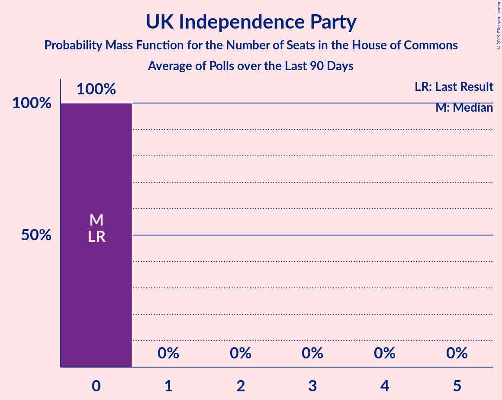

# UK Independence Party

<a href="#voting-intentions">Voting Intentions</a> | <a href="#seats">Seats</a>

## Voting Intentions

Last result: **1.9%** (General Election of 8 June 2017)

### Confidence Intervals

| Period     | Polling firm/Commissioner(s) | Median | 80% Confidence Interval | 90% Confidence Interval | 95% Confidence Interval | 99% Confidence Interval |
|:----------:|:----------------:|:-----------:|:-----------------------:|:-----------------------:|:-----------------------:|:-----------------------:|
| N/A | [Poll Average](average.html) | 0.3% | 0.2–0.5% | 0.1–0.5% | 0.1–0.6% | 0.1–0.7% |
| [10–11 December 2019](2019-12-11-Survation.html) | Survation | 0.0% | N/A | N/A | N/A | N/A |
| [10–11 December 2019](2019-12-11-Panelbase.html) | Panelbase | 0.0% | N/A | N/A | N/A | N/A |
| [10–11 December 2019](2019-12-11-Opinium.html) | Opinium | 0.0% | N/A | N/A | N/A | N/A |
| [9–11 December 2019](2019-12-11-KantarPublic.html) | Kantar Public | 0.0% | N/A | N/A | N/A | N/A |
| [9–11 December 2019](2019-12-11-IpsosMORI.html) | Ipsos MORI   Evening Standard | 0.0% | N/A | N/A | N/A | N/A |
| [9–11 December 2019](2019-12-11-Deltapoll.html) | Deltapoll | 0.0% | N/A | N/A | N/A | N/A |
| [6–11 December 2019](2019-12-11-BMGResearch.html) | BMG Research | 0.0% | N/A | N/A | N/A | N/A |
| [8–10 December 2019](2019-12-10-NumberCruncherPolitics.html) | Number Cruncher Politics   Bloomberg | 0.0% | N/A | N/A | N/A | N/A |
| [9–10 December 2019](2019-12-10-ComRes.html) | ComRes   Daily Telegraph | 0.0% | N/A | N/A | N/A | N/A |
| [6–9 December 2019](2019-12-09-ICMResearch.html) | ICM Research | 0.2% | 0.2–0.5% | 0.1–0.5% | 0.1–0.6% | 0.1–0.7% |
| [5–8 December 2019](2019-12-08-Qriously.html) | Qriously | 0.0% | N/A | N/A | N/A | N/A |
| [6–8 December 2019](2019-12-08-ComRes.html) | ComRes   Remain United | 0.0% | N/A | N/A | N/A | N/A |
| [5–7 December 2019](2019-12-07-Survation.html) | Survation   Good Morning Britain | 0.0% | N/A | N/A | N/A | N/A |
| [5–7 December 2019](2019-12-07-Deltapoll.html) | Deltapoll   The Mail on Sunday | 1.0% | 0.7–1.4% | 0.6–1.5% | 0.6–1.6% | 0.5–1.8% |
| [5–6 December 2019](2019-12-06-YouGov.html) | YouGov   The Sunday Times | 0.0% | N/A | N/A | N/A | N/A |
| [4–6 December 2019](2019-12-06-Panelbase.html) | Panelbase | 0.0% | N/A | N/A | N/A | N/A |
| [4–6 December 2019](2019-12-06-Opinium.html) | Opinium   The Observer | 0.0% | N/A | N/A | N/A | N/A |
| [4–6 December 2019](2019-12-06-BMGResearch.html) | BMG Research   The Independent | 0.3% | 0.2–0.5% | 0.1–0.6% | 0.1–0.7% | 0.1–0.8% |
| [4–5 December 2019](2019-12-05-ComRes.html) | ComRes   The Sunday Telegraph | 0.0% | N/A | N/A | N/A | N/A |
| [2–4 December 2019](2019-12-04-IpsosMORI.html) | Ipsos MORI   Evening Standard | 0.0% | N/A | N/A | N/A | N/A |
| [2–3 December 2019](2019-12-03-YouGov.html) | YouGov   The Times and Sky News | 0.0% | N/A | N/A | N/A | N/A |
| [2–3 December 2019](2019-12-03-ComRes.html) | ComRes   Daily Telegraph | 0.0% | N/A | N/A | N/A | N/A |
| [28 November–2 December 2019](2019-12-02-KantarPublic.html) | Kantar Public | 0.0% | N/A | N/A | N/A | N/A |
| [29 November–2 December 2019](2019-12-02-ICMResearch.html) | ICM Research | 0.0% | N/A | N/A | N/A | N/A |
| [26–30 November 2019](2019-11-30-Survation.html) | Survation   Good Morning Britain | 0.0% | N/A | N/A | N/A | N/A |
| [28–30 November 2019](2019-11-30-Deltapoll.html) | Deltapoll   The Mail on Sunday | 0.3% | 0.2–0.5% | 0.1–0.6% | 0.1–0.7% | 0.1–0.8% |
| [28–29 November 2019](2019-11-29-YouGov.html) | YouGov   The Sunday Times | 0.0% | N/A | N/A | N/A | N/A |
| [27–29 November 2019](2019-11-29-Opinium.html) | Opinium   The Observer | 0.0% | N/A | N/A | N/A | N/A |
| [27–28 November 2019](2019-11-28-Panelbase.html) | Panelbase | 0.0% | N/A | N/A | N/A | N/A |
| [27–28 November 2019](2019-11-28-ComRes.html) | ComRes   The Sunday Telegraph | 0.0% | N/A | N/A | N/A | N/A |
| [26–27 November 2019](2019-11-27-BMGResearch.html) | BMG Research   The Independent | 0.2% | 0.1–0.5% | 0.1–0.6% | 0.1–0.6% | 0.1–0.8% |
| [25–26 November 2019](2019-11-26-YouGov.html) | YouGov   The Times and Sky News | 0.0% | N/A | N/A | N/A | N/A |
| [25–26 November 2019](2019-11-26-ComRes.html) | ComRes   Daily Telegraph | 0.0% | N/A | N/A | N/A | N/A |
| [21–25 November 2019](2019-11-25-KantarPublic.html) | Kantar Public | 0.0% | N/A | N/A | N/A | N/A |
| [22–25 November 2019](2019-11-25-ICMResearch.html) | ICM Research | 0.2% | 0.2–0.5% | 0.1–0.5% | 0.1–0.6% | 0.1–0.7% |
| [20–23 November 2019](2019-11-23-Survation.html) | Survation   Good Morning Britain | 0.0% | N/A | N/A | N/A | N/A |
| [21–23 November 2019](2019-11-23-Deltapoll.html) | Deltapoll   The Mail on Sunday | 0.0% | N/A | N/A | N/A | N/A |
| [21–22 November 2019](2019-11-22-YouGov.html) | YouGov   The Sunday Times | 0.0% | N/A | N/A | N/A | N/A |
| [20–22 November 2019](2019-11-22-Panelbase.html) | Panelbase | 0.0% | N/A | N/A | N/A | N/A |
| [20–22 November 2019](2019-11-22-Opinium.html) | Opinium   The Observer | 0.2% | 0.2–0.5% | 0.1–0.5% | 0.1–0.6% | 0.1–0.7% |
| [20–21 November 2019](2019-11-21-ComRes.html) | ComRes   The Sunday Express | 0.0% | N/A | N/A | N/A | N/A |
| [19–21 November 2019](2019-11-21-BMGResearch.html) | BMG Research | 0.0% | N/A | N/A | N/A | N/A |
| [12–20 November 2019](2019-11-20-YouGov.html) | YouGov | 0.0% | N/A | N/A | N/A | N/A |
| [18–19 November 2019](2019-11-19-YouGov.html) | YouGov   The Times | 0.0% | N/A | N/A | N/A | N/A |
| [15–19 November 2019](2019-11-19-IpsosMORI.html) | Ipsos MORI   Evening Standard | 0.0% | N/A | N/A | N/A | N/A |
| [18–19 November 2019](2019-11-19-ComRes.html) | ComRes   Daily Telegraph | 0.0% | N/A | N/A | N/A | N/A |
| [14–18 November 2019](2019-11-18-KantarPublic.html) | Kantar Public | 0.0% | N/A | N/A | N/A | N/A |
| [15–18 November 2019](2019-11-18-ICMResearch.html) | ICM Research | 0.0% | N/A | N/A | N/A | N/A |
| [14–16 November 2019](2019-11-16-Survation.html) | Survation | 0.0% | N/A | N/A | N/A | N/A |
| [10–16 November 2019](2019-11-16-Deltapoll.html) | Deltapoll   The Mail on Sunday | 0.0% | N/A | N/A | N/A | N/A |
| [14–15 November 2019](2019-11-15-YouGov.html) | YouGov   The Sunday Times | 0.0% | N/A | N/A | N/A | N/A |
| [13–15 November 2019](2019-11-15-Opinium.html) | Opinium   The Observer | 0.2% | 0.2–0.5% | 0.1–0.5% | 0.1–0.6% | 0.1–0.7% |
| [9–15 November 2019](2019-11-15-BMGResearch.html) | BMG Research | 0.0% | N/A | N/A | N/A | N/A |
| [13–14 November 2019](2019-11-14-Panelbase.html) | Panelbase | 0.3% | 0.2–0.7% | 0.1–0.8% | 0.1–0.9% | 0.1–1.1% |
| [13–14 November 2019](2019-11-14-ComRes.html) | ComRes   The Sunday Telegraph | 0.0% | N/A | N/A | N/A | N/A |
| [11–12 November 2019](2019-11-12-YouGov.html) | YouGov   The Times and Sky News | 0.0% | N/A | N/A | N/A | N/A |
| [11–12 November 2019](2019-11-12-ComRes.html) | ComRes   Daily Telegraph | 0.2% | 0.2–0.5% | 0.1–0.5% | 0.1–0.6% | 0.1–0.7% |
| [7–11 November 2019](2019-11-11-KantarPublic.html) | Kantar Public | 1.0% | 0.7–1.5% | 0.7–1.7% | 0.6–1.8% | 0.5–2.1% |
| [8–11 November 2019](2019-11-11-ICMResearch.html) | ICM Research | 1.0% | 0.7–1.3% | 0.7–1.4% | 0.6–1.5% | 0.5–1.7% |
| [8–10 November 2019](2019-11-10-ComRes.html) | ComRes   Britain Elects | 0.2% | 0.2–0.5% | 0.1–0.5% | 0.1–0.6% | 0.1–0.7% |
| [6–9 November 2019](2019-11-09-Deltapoll.html) | Deltapoll   The Mail on Sunday | 1.0% | 0.7–1.4% | 0.7–1.5% | 0.6–1.6% | 0.5–1.9% |
| [7–8 November 2019](2019-11-08-YouGov.html) | YouGov   The Sunday Times and Sky News | 0.0% | N/A | N/A | N/A | N/A |
| [6–8 November 2019](2019-11-08-Survation.html) | Survation | 0.0% | N/A | N/A | N/A | N/A |
| [6–8 November 2019](2019-11-08-Panelbase.html) | Panelbase | 0.3% | 0.2–0.6% | 0.1–0.7% | 0.1–0.8% | 0.1–1.1% |
| [6–8 November 2019](2019-11-08-Opinium.html) | Opinium   The Observer | 0.2% | 0.2–0.5% | 0.1–0.5% | 0.1–0.6% | 0.1–0.7% |
| [5–8 November 2019](2019-11-08-BMGResearch.html) | BMG Research   The Independent | 0.3% | 0.2–0.5% | 0.1–0.6% | 0.1–0.7% | 0.1–0.8% |
| [5–6 November 2019](2019-11-06-YouGov.html) | YouGov   The Times and Sky News | 0.2% | 0.1–0.5% | 0.1–0.5% | 0.1–0.6% | 0.1–0.8% |
| [30 October–5 November 2019](2019-11-05-ComRes.html) | ComRes   Remain United | 0.2% | 0.2–0.4% | 0.2–0.4% | 0.1–0.4% | 0.1–0.5% |
| [1–4 November 2019](2019-11-04-YouGov.html) | YouGov   The Times | 0.2% | 0.2–0.4% | 0.1–0.4% | 0.1–0.5% | 0.1–0.6% |
| [1–4 November 2019](2019-11-04-ICMResearch.html) | ICM Research   Reuters | 1.0% | 0.7–1.3% | 0.7–1.4% | 0.6–1.5% | 0.5–1.7% |
| [31 October–2 November 2019](2019-11-02-Deltapoll.html) | Deltapoll   The Mail on Sunday | 1.0% | 0.7–1.4% | 0.7–1.5% | 0.6–1.6% | 0.5–1.9% |
| [30 October–1 November 2019](2019-11-01-YouGov.html) | YouGov   The Sunday Times | 0.3% | 0.2–0.5% | 0.1–0.6% | 0.1–0.6% | 0.1–0.8% |
| [30 October–1 November 2019](2019-11-01-Opinium.html) | Opinium   The Observer | 0.2% | 0.2–0.5% | 0.1–0.5% | 0.1–0.6% | 0.1–0.7% |
| [30–31 October 2019](2019-10-31-Panelbase.html) | Panelbase | 0.0% | N/A | N/A | N/A | N/A |
| [30–31 October 2019](2019-10-31-ORB.html) | ORB   The Telegraph | 0.0% | N/A | N/A | N/A | N/A |
| [30–31 October 2019](2019-10-31-ComRes.html) | ComRes   Sunday Express | 0.3% | 0.2–0.5% | 0.1–0.6% | 0.1–0.7% | 0.1–0.8% |
| [29–30 October 2019](2019-10-30-YouGov.html) | YouGov   The Times | 0.0% | N/A | N/A | N/A | N/A |
| [29–30 October 2019](2019-10-30-Survation.html) | Survation | 0.0% | N/A | N/A | N/A | N/A |
| [17–28 October 2019](2019-10-28-YouGov.html) | YouGov | 0.3% | 0.2–0.3% | 0.2–0.4% | 0.2–0.4% | 0.2–0.4% |
| [25–28 October 2019](2019-10-28-IpsosMORI.html) | Ipsos MORI | 0.3% | 0.2–0.7% | 0.1–0.8% | 0.1–0.9% | 0.1–1.1% |
| [24–25 October 2019](2019-10-25-YouGov.html) | YouGov | 0.2% | 0.1–0.5% | 0.1–0.5% | 0.1–0.6% | 0.1–0.8% |
| [23–25 October 2019](2019-10-25-Opinium.html) | Opinium   The Observer | 1.0% | 0.8–1.4% | 0.7–1.5% | 0.6–1.5% | 0.5–1.7% |
| [20–21 October 2019](2019-10-21-YouGov.html) | YouGov   The Times | 1.0% | 0.7–1.4% | 0.7–1.5% | 0.6–1.6% | 0.5–1.8% |
| [18–21 October 2019](2019-10-21-Deltapoll.html) | Deltapoll | 1.0% | 0.8–1.3% | 0.7–1.4% | 0.6–1.5% | 0.5–1.7% |
| [17–18 October 2019](2019-10-18-Survation.html) | Survation   Daily Mail | 0.3% | 0.2–0.7% | 0.1–0.8% | 0.1–0.9% | 0.1–1.1% |
| [17–18 October 2019](2019-10-18-Panelbase.html) | Panelbase | 0.3% | 0.2–0.7% | 0.1–0.8% | 0.1–0.9% | 0.1–1.1% |
| [15–17 October 2019](2019-10-17-Opinium.html) | Opinium   The Observer | 2.0% | 1.6–2.5% | 1.6–2.6% | 1.5–2.7% | 1.3–3.0% |
| [16–17 October 2019](2019-10-17-ComRes.html) | ComRes   Britain Elects | 0.2% | 0.2–0.5% | 0.1–0.5% | 0.1–0.6% | 0.1–0.7% |
| [14–15 October 2019](2019-10-15-YouGov.html) | YouGov   The Times | 1.0% | 0.7–1.4% | 0.7–1.5% | 0.6–1.6% | 0.5–1.8% |
| [10–15 October 2019](2019-10-15-KantarPublic.html) | Kantar Public | 1.0% | 0.7–1.5% | 0.6–1.6% | 0.6–1.8% | 0.5–2.0% |
| [9–11 October 2019](2019-10-11-Panelbase.html) | Panelbase   The Sunday Times | 0.2% | 0.2–0.5% | 0.1–0.5% | 0.1–0.6% | 0.1–0.7% |
| [9–10 October 2019](2019-10-10-ComRes.html) | ComRes   Daily Express | 0.2% | 0.2–0.5% | 0.1–0.5% | 0.1–0.6% | 0.1–0.7% |
| [8–9 October 2019](2019-10-09-YouGov.html) | YouGov   The Times | 0.2% | 0.1–0.5% | 0.1–0.6% | 0.1–0.6% | 0.1–0.8% |
| [4–6 October 2019](2019-10-06-ComRes.html) | ComRes   Daily Telegraph | 1.0% | 0.8–1.4% | 0.7–1.4% | 0.6–1.5% | 0.5–1.7% |
| [3–4 October 2019](2019-10-04-Opinium.html) | Opinium   The Observer | 1.0% | 0.8–1.4% | 0.7–1.4% | 0.6–1.5% | 0.5–1.7% |
| [1–4 October 2019](2019-10-04-BMGResearch.html) | BMG Research   The Independent | 0.3% | 0.2–0.5% | 0.1–0.6% | 0.1–0.7% | 0.1–0.8% |
| [30 September–1 October 2019](2019-10-01-YouGov.html) | YouGov   The Times | 0.2% | 0.1–0.5% | 0.1–0.6% | 0.1–0.6% | 0.1–0.8% |
| [26–27 September 2019](2019-09-27-YouGov.html) | YouGov   The Sunday Times | 0.2% | 0.1–0.5% | 0.1–0.6% | 0.1–0.6% | 0.1–0.8% |
| [25–27 September 2019](2019-09-27-Opinium.html) | Opinium   The Observer | 0.2% | 0.2–0.5% | 0.1–0.5% | 0.1–0.6% | 0.1–0.7% |
| [24–25 September 2019](2019-09-25-YouGov.html) | YouGov   The Times | 1.0% | 0.7–1.4% | 0.7–1.5% | 0.6–1.6% | 0.5–1.8% |
| [25 September 2019](2019-09-25-Survation.html) | Survation   Daily Mail | 0.0% | N/A | N/A | N/A | N/A |
| [24 September 2019](2019-09-24-ComRes.html) | ComRes   Daily Telegraph | 0.0% | N/A | N/A | N/A | N/A |
| [19–20 September 2019](2019-09-20-YouGov.html) | YouGov   People's Vote | 0.2% | 0.2–0.5% | 0.1–0.5% | 0.1–0.6% | 0.1–0.7% |
| [19–20 September 2019](2019-09-20-Opinium.html) | Opinium   The Observer | 2.0% | 1.6–2.5% | 1.5–2.6% | 1.5–2.7% | 1.3–3.0% |
| [18–19 September 2019](2019-09-19-ComRes.html) | ComRes   Britain Elects | 0.2% | 0.2–0.5% | 0.1–0.5% | 0.1–0.6% | 0.1–0.7% |
| [17–18 September 2019](2019-09-18-YouGov.html) | YouGov   The Times | 1.0% | 0.7–1.4% | 0.7–1.5% | 0.6–1.6% | 0.5–1.8% |
| [13–16 September 2019](2019-09-16-IpsosMORI.html) | Ipsos MORI   Evening Standard | 0.3% | 0.2–0.7% | 0.1–0.8% | 0.1–0.9% | 0.1–1.1% |
| [12–15 September 2019](2019-09-15-ComRes.html) | ComRes   Sunday Express | 1.0% | 0.8–1.4% | 0.7–1.5% | 0.7–1.6% | 0.6–1.8% |
| [11–13 September 2019](2019-09-13-Opinium.html) | Opinium   The Observer | 1.0% | 0.8–1.4% | 0.7–1.4% | 0.6–1.5% | 0.5–1.7% |
| [9–10 September 2019](2019-09-10-YouGov.html) | YouGov   The Times | 0.2% | 0.1–0.5% | 0.1–0.5% | 0.1–0.6% | 0.1–0.8% |
| [5–9 September 2019](2019-09-09-KantarPublic.html) | Kantar Public | 1.0% | 0.7–1.4% | 0.6–1.6% | 0.5–1.7% | 0.4–2.0% |
| [6–8 September 2019](2019-09-08-ComRes.html) | ComRes   Daily Telegraph | 1.0% | 0.8–1.3% | 0.7–1.4% | 0.6–1.5% | 0.5–1.7% |
| [5–7 September 2019](2019-09-07-Deltapoll.html) | Deltapoll   The Sun on Sunday | 1.0% | 0.7–1.3% | 0.7–1.4% | 0.6–1.5% | 0.5–1.7% |
| [5–6 September 2019](2019-09-06-YouGov.html) | YouGov   The Sunday Times | 1.0% | 0.8–1.4% | 0.7–1.5% | 0.6–1.6% | 0.5–1.8% |
| [5–6 September 2019](2019-09-06-Survation.html) | Survation   Daily Mail | 0.0% | N/A | N/A | N/A | N/A |
| [5–6 September 2019](2019-09-06-Panelbase.html) | Panelbase | 0.3% | 0.2–0.7% | 0.1–0.8% | 0.1–0.9% | 0.1–1.1% |
| [4–6 September 2019](2019-09-06-Opinium.html) | Opinium   The Observer | 1.0% | 0.8–1.4% | 0.7–1.4% | 0.6–1.5% | 0.5–1.7% |
| [4–6 September 2019](2019-09-06-ComRes.html) | ComRes   Britain Elects | 1.0% | 0.8–1.4% | 0.7–1.4% | 0.6–1.5% | 0.5–1.7% |
| [3–6 September 2019](2019-09-06-BMGResearch.html) | BMG Research   The Independent | 0.9% | 0.7–1.3% | 0.6–1.5% | 0.5–1.6% | 0.5–1.8% |
| [3–4 September 2019](2019-09-04-HanburyStrategy.html) | Hanbury Strategy | 0.2% | 0.1–0.5% | 0.1–0.6% | 0.1–0.7% | 0.0–0.9% |
| [2–3 September 2019](2019-09-03-YouGov.html) | YouGov   The Times | 1.0% | 0.7–1.4% | 0.7–1.5% | 0.6–1.6% | 0.5–1.8% |
| [29–31 August 2019](2019-08-31-Deltapoll.html) | Deltapoll   The Mail on Sunday | 1.0% | 0.7–1.3% | 0.7–1.4% | 0.6–1.5% | 0.5–1.7% |
| [29–30 August 2019](2019-08-30-Survation.html) | Survation   Daily Mail | 0.0% | N/A | N/A | N/A | N/A |
| [28–29 August 2019](2019-08-29-YouGov.html) | YouGov | 0.3% | 0.2–0.5% | 0.1–0.6% | 0.1–0.6% | 0.1–0.8% |
| [27–28 August 2019](2019-08-28-YouGov.html) | YouGov   The Times | 0.2% | 0.2–0.5% | 0.1–0.5% | 0.1–0.6% | 0.1–0.7% |
| [22–23 August 2019](2019-08-23-YouGov.html) | YouGov   The Sunday Times | 0.2% | 0.2–0.5% | 0.1–0.5% | 0.1–0.6% | 0.1–0.7% |
| [21–23 August 2019](2019-08-23-Opinium.html) | Opinium   The Observer | 1.0% | 0.8–1.4% | 0.7–1.4% | 0.6–1.5% | 0.5–1.7% |
| [20–21 August 2019](2019-08-21-YouGov.html) | YouGov   The Times | 0.2% | 0.1–0.5% | 0.1–0.5% | 0.1–0.6% | 0.1–0.7% |
| [15–19 August 2019](2019-08-19-KantarPublic.html) | Kantar Public | 0.3% | 0.2–0.6% | 0.1–0.7% | 0.1–0.8% | 0.0–1.0% |
| [13–14 August 2019](2019-08-14-YouGov.html) | YouGov   The Times | 1.0% | 0.7–1.4% | 0.7–1.5% | 0.6–1.6% | 0.5–1.8% |
| [7–12 August 2019](2019-08-12-BMGResearch.html) | BMG Research   The Independent | 1.0% | 0.7–1.4% | 0.7–1.5% | 0.6–1.6% | 0.5–1.8% |
| [6–11 August 2019](2019-08-11-Survation.html) | Survation | 0.0% | N/A | N/A | N/A | N/A |
| [9–11 August 2019](2019-08-11-ComRes.html) | ComRes   Daily Telegraph | 1.0% | 0.8–1.4% | 0.7–1.4% | 0.6–1.5% | 0.5–1.7% |
| [8–9 August 2019](2019-08-09-Opinium.html) | Opinium   The Observer | 1.0% | 0.8–1.4% | 0.7–1.4% | 0.6–1.5% | 0.5–1.7% |
| [5–6 August 2019](2019-08-06-YouGov.html) | YouGov   The Times | 0.2% | 0.1–0.5% | 0.1–0.6% | 0.1–0.6% | 0.1–0.8% |
| [29–30 July 2019](2019-07-30-YouGov.html) | YouGov   The Times | 1.0% | 0.8–1.4% | 0.7–1.5% | 0.7–1.6% | 0.6–1.7% |
| [26–30 July 2019](2019-07-30-IpsosMORI.html) | Ipsos MORI | 1.0% | 0.7–1.5% | 0.6–1.7% | 0.5–1.8% | 0.4–2.1% |
| [26–28 July 2019](2019-07-28-ComRes.html) | ComRes   Britain Elects | 1.0% | 0.8–1.4% | 0.7–1.4% | 0.6–1.5% | 0.5–1.7% |
| [25–27 July 2019](2019-07-27-Deltapoll.html) | Deltapoll   The Mail on Sunday | 1.0% | 0.8–1.4% | 0.7–1.5% | 0.6–1.5% | 0.5–1.7% |
| [25–26 July 2019](2019-07-26-YouGov.html) | YouGov   The Sunday Times | 0.2% | 0.1–0.5% | 0.1–0.5% | 0.1–0.6% | 0.1–0.7% |
| [24–26 July 2019](2019-07-26-Opinium.html) | Opinium   The Observer | 1.0% | 0.8–1.4% | 0.7–1.4% | 0.6–1.5% | 0.5–1.7% |
| [24–25 July 2019](2019-07-25-ComRes.html) | ComRes   Sunday Express | 1.0% | 0.7–1.3% | 0.7–1.4% | 0.6–1.5% | 0.5–1.7% |
| [23–24 July 2019](2019-07-24-YouGov.html) | YouGov   The Times | 1.0% | 0.7–1.4% | 0.7–1.5% | 0.6–1.6% | 0.5–1.8% |
| [16–17 July 2019](2019-07-17-YouGov.html) | YouGov   The Times | 0.2% | 0.1–0.5% | 0.1–0.5% | 0.1–0.6% | 0.1–0.7% |
| [15–16 July 2019](2019-07-16-ComRes.html) | ComRes | 1.0% | 0.7–1.3% | 0.7–1.4% | 0.6–1.5% | 0.5–1.7% |
| [10–11 July 2019](2019-07-11-Survation.html) | Survation | 0.0% | N/A | N/A | N/A | N/A |
| [10–11 July 2019](2019-07-11-ComRes.html) | ComRes   The Express | 1.0% | 0.8–1.4% | 0.7–1.5% | 0.6–1.6% | 0.5–1.8% |
| [9–10 July 2019](2019-07-10-YouGov.html) | YouGov   The Times | 0.2% | 0.1–0.5% | 0.1–0.5% | 0.1–0.6% | 0.1–0.8% |
| [5–7 July 2019](2019-07-07-ComRes.html) | ComRes   Daily Telegraph | 1.0% | 0.8–1.4% | 0.7–1.4% | 0.6–1.5% | 0.5–1.7% |
| [3–5 July 2019](2019-07-05-Opinium.html) | Opinium   The Observer | 1.0% | 0.8–1.4% | 0.7–1.4% | 0.6–1.5% | 0.5–1.7% |
| [2–5 July 2019](2019-07-05-BMGResearch.html) | BMG Research   The Independent | 2.0% | 1.6–2.6% | 1.5–2.7% | 1.4–2.9% | 1.2–3.2% |
| [2–3 July 2019](2019-07-03-YouGov.html) | YouGov   The Times | 0.2% | 0.1–0.5% | 0.1–0.6% | 0.1–0.6% | 0.1–0.8% |
| [24–25 June 2019](2019-06-25-YouGov.html) | YouGov   The Times | 1.0% | 0.8–1.4% | 0.7–1.5% | 0.7–1.6% | 0.6–1.8% |
| [21–25 June 2019](2019-06-25-IpsosMORI.html) | Ipsos MORI | 1.1% | 0.7–1.6% | 0.7–1.8% | 0.6–1.9% | 0.5–2.2% |
| [19–20 June 2019](2019-06-20-Survation.html) | Survation   Daily Mail on Sunday | 1.0% | 0.8–1.3% | 0.7–1.4% | 0.6–1.5% | 0.5–1.7% |
| [19–20 June 2019](2019-06-20-Opinium.html) | Opinium   The Observer | 2.0% | 1.6–2.5% | 1.5–2.6% | 1.5–2.7% | 1.3–2.9% |
| [13–14 June 2019](2019-06-14-YouGov.html) | YouGov   The Sunday Times | 0.2% | 0.1–0.5% | 0.1–0.5% | 0.1–0.6% | 0.1–0.8% |
| [9–10 June 2019](2019-06-10-YouGov.html) | YouGov   The Times | 0.2% | 0.1–0.5% | 0.1–0.5% | 0.1–0.6% | 0.1–0.7% |
| [7–9 June 2019](2019-06-09-ComRes.html) | ComRes   Daily Telegraph | 1.0% | 0.8–1.3% | 0.7–1.4% | 0.6–1.5% | 0.5–1.7% |
| [4–7 June 2019](2019-06-07-BMGResearch.html) | BMG Research   The Independent | 1.0% | 0.7–1.4% | 0.7–1.5% | 0.6–1.6% | 0.5–1.8% |
| [4–6 June 2019](2019-06-06-YouGov.html) | YouGov   The Times | 0.0% | N/A | N/A | N/A | N/A |
| [28–30 May 2019](2019-05-30-Opinium.html) | Opinium   The Observer | 1.0% | 0.8–1.4% | 0.7–1.4% | 0.6–1.5% | 0.5–1.7% |
| [29–30 May 2019](2019-05-30-Deltapoll.html) | Deltapoll   The Mail on Sunday | 1.0% | 0.8–1.3% | 0.7–1.4% | 0.7–1.5% | 0.6–1.6% |
| [28–29 May 2019](2019-05-29-YouGov.html) | YouGov   The Times | 1.0% | 0.8–1.4% | 0.7–1.5% | 0.6–1.6% | 0.5–1.8% |
| [23–24 May 2019](2019-05-24-LordAshcroft.html) | Lord Ashcroft | 3.0% | 2.8–3.2% | 2.7–3.3% | 2.7–3.4% | 2.6–3.5% |
| [22 May 2019](2019-05-22-Survation.html) | Survation   Daily Mail | 3.0% | 2.6–3.6% | 2.4–3.7% | 2.3–3.9% | 2.1–4.1% |
| [14–21 May 2019](2019-05-21-Panelbase.html) | Panelbase   The Sunday Times | 3.0% | 2.6–3.6% | 2.4–3.7% | 2.3–3.8% | 2.1–4.1% |
| [17–20 May 2019](2019-05-20-Opinium.html) | Opinium   The Times | 2.0% | 1.7–2.5% | 1.6–2.7% | 1.5–2.8% | 1.4–3.0% |
| [8–17 May 2019](2019-05-17-YouGov.html) | YouGov   Best For Britain | 2.0% | 1.8–2.2% | 1.8–2.3% | 1.7–2.3% | 1.6–2.4% |
| [17 May 2019](2019-05-17-Survation.html) | Survation   Daily Mail | 2.0% | 1.5–2.7% | 1.4–2.9% | 1.3–3.1% | 1.1–3.4% |
| [14–16 May 2019](2019-05-16-Opinium.html) | Opinium   The Observer | 2.0% | 1.6–2.5% | 1.5–2.6% | 1.5–2.7% | 1.3–2.9% |
| [13–14 May 2019](2019-05-14-YouGov.html) | YouGov   The Times | 2.0% | 1.6–2.5% | 1.5–2.7% | 1.4–2.8% | 1.2–3.1% |
| [10–14 May 2019](2019-05-14-IpsosMORI.html) | Ipsos MORI | 2.9% | 2.3–3.7% | 2.2–3.9% | 2.0–4.1% | 1.8–4.5% |
| [9–13 May 2019](2019-05-13-KantarPublic.html) | Kantar Public | 4.0% | 3.3–4.8% | 3.2–5.1% | 3.0–5.3% | 2.7–5.7% |
| [9–13 May 2019](2019-05-13-HanburyStrategy.html) | Hanbury Strategy | 2.0% | 1.6–2.5% | 1.6–2.6% | 1.5–2.7% | 1.3–3.0% |
| [10–12 May 2019](2019-05-12-ComRes.html) | ComRes   Daily Telegraph | 4.1% | 3.6–4.7% | 3.4–4.9% | 3.3–5.1% | 3.1–5.4% |
| [8–10 May 2019](2019-05-10-Opinium.html) | Opinium   The Observer | 4.0% | 3.5–4.6% | 3.3–4.8% | 3.2–5.0% | 3.0–5.3% |
| [7–10 May 2019](2019-05-10-BMGResearch.html) | BMG Research | 3.0% | 2.5–3.6% | 2.4–3.8% | 2.2–4.0% | 2.0–4.3% |
| [8–9 May 2019](2019-05-09-YouGov.html) | YouGov   The Times | 2.0% | 1.7–2.5% | 1.6–2.6% | 1.5–2.7% | 1.4–2.9% |
| [9 May 2019](2019-05-09-ComRes.html) | ComRes   Brexit Express | 2.9% | 2.5–3.5% | 2.4–3.6% | 2.3–3.8% | 2.1–4.1% |
| [3–7 May 2019](2019-05-07-Opinium.html) | Opinium | 4.0% | 3.4–4.7% | 3.3–4.9% | 3.1–5.1% | 2.9–5.5% |
| [29–30 April 2019](2019-04-30-YouGov.html) | YouGov | 2.0% | 1.6–2.5% | 1.5–2.6% | 1.4–2.8% | 1.2–3.0% |
| [23–24 April 2019](2019-04-24-YouGov.html) | YouGov   The Times | 4.0% | 3.4–4.6% | 3.3–4.8% | 3.2–5.0% | 2.9–5.3% |
| [18–24 April 2019](2019-04-24-Panelbase.html) | Panelbase   The Sunday Times | 4.9% | 4.4–5.6% | 4.2–5.8% | 4.1–6.0% | 3.8–6.3% |
| [21–23 April 2019](2019-04-23-Opinium.html) | Opinium   The Observer | 4.0% | 3.4–4.8% | 3.2–5.1% | 3.0–5.3% | 2.8–5.7% |
| [16–17 April 2019](2019-04-17-YouGov.html) | YouGov   The Times | 4.0% | 3.4–4.7% | 3.3–4.8% | 3.2–5.0% | 2.9–5.3% |
| [17 April 2019](2019-04-17-OnePoll.html) | OnePoll   The Sun on Sunday | 5.0% | 4.4–5.7% | 4.3–5.9% | 4.1–6.1% | 3.9–6.4% |
| [16–17 April 2019](2019-04-17-ORB.html) | ORB   The Telegraph | 5.0% | 4.3–5.8% | 4.1–6.0% | 4.0–6.2% | 3.7–6.6% |
| [9–12 April 2019](2019-04-12-Opinium.html) | Opinium   The Observer | 11.0% | 10.2–12.0% | 9.9–12.2% | 9.7–12.5% | 9.3–12.9% |
| [4–8 April 2019](2019-04-08-KantarPublic.html) | Kantar Public | 6.9% | 6.0–8.0% | 5.8–8.3% | 5.6–8.5% | 5.2–9.0% |
| [5–8 April 2019](2019-04-08-HanburyStrategy.html) | Hanbury Strategy   Open Europe | 7.9% | 7.2–8.7% | 7.0–9.0% | 6.8–9.2% | 6.5–9.6% |
| [3–6 April 2019](2019-04-06-Survation.html) | Survation | 6.9% | 6.5–7.4% | 6.4–7.5% | 6.3–7.6% | 6.1–7.8% |
| [2–5 April 2019](2019-04-05-BMGResearch.html) | BMG Research   The Independent | 6.1% | 5.3–6.9% | 5.1–7.2% | 5.0–7.4% | 4.6–7.8% |
| [2–3 April 2019](2019-04-03-YouGov.html) | YouGov | 7.0% | 6.3–7.8% | 6.1–8.1% | 5.9–8.3% | 5.6–8.7% |
| [28–30 March 2019](2019-03-30-Deltapoll.html) | Deltapoll   The Mail on Sunday | 6.9% | 6.0–8.1% | 5.7–8.4% | 5.5–8.7% | 5.1–9.3% |
| [28–29 March 2019](2019-03-29-Opinium.html) | Opinium   The Observer | 9.0% | 8.2–9.8% | 8.0–10.1% | 7.8–10.3% | 7.4–10.7% |
| [24–25 March 2019](2019-03-25-YouGov.html) | YouGov   The Times | 4.0% | 3.5–4.6% | 3.3–4.8% | 3.2–4.9% | 3.0–5.2% |
| [20–22 March 2019](2019-03-22-Opinium.html) | Opinium   The Observer | 9.0% | 8.2–9.9% | 8.0–10.1% | 7.8–10.3% | 7.5–10.8% |
| [15–19 March 2019](2019-03-19-IpsosMORI.html) | Ipsos MORI | 7.0% | 6.1–8.2% | 5.9–8.5% | 5.6–8.8% | 5.2–9.3% |
| [14–15 March 2019](2019-03-15-YouGov.html) | YouGov   People’s Vote | 5.0% | 5.5–7.0% | 5.3–7.2% | 5.1–7.4% | 4.8–7.8% |
| [15 March 2019](2019-03-15-Survation.html) | Survation   Daily Mail | 5.1% | 4.3–6.1% | 4.1–6.4% | 3.9–6.6% | 3.5–7.1% |
| [12–15 March 2019](2019-03-15-Opinium.html) | Opinium   The Observer | 8.0% | 7.3–8.8% | 7.0–9.1% | 6.9–9.3% | 6.5–9.7% |
| [7–11 March 2019](2019-03-11-KantarPublic.html) | Kantar Public | 6.1% | 5.3–7.1% | 5.0–7.4% | 4.8–7.6% | 4.5–8.1% |
| [4–8 March 2019](2019-03-08-BMGResearch.html) | BMG Research | 5.0% | 4.3–5.8% | 4.1–6.0% | 4.0–6.2% | 3.7–6.6% |
| [3–4 March 2019](2019-03-04-YouGov.html) | YouGov   The Times | 3.0% | 2.6–3.5% | 2.5–3.7% | 2.3–3.8% | 2.2–4.1% |
| [26 February–1 March 2019](2019-03-01-Opinium.html) | Opinium   The Observer | 6.9% | 6.2–7.7% | 6.1–8.0% | 5.9–8.2% | 5.6–8.6% |
| [22–23 February 2019](2019-02-23-YouGov.html) | YouGov   The Times | 5.0% | 4.4–5.8% | 4.2–6.0% | 4.1–6.2% | 3.8–6.6% |
| [21–23 February 2019](2019-02-23-Deltapoll.html) | Deltapoll   The Mail on Sunday | 5.1% | 4.3–6.1% | 4.1–6.3% | 3.9–6.6% | 3.5–7.1% |
| [18–19 February 2019](2019-02-19-YouGov.html) | YouGov   The Times | 4.0% | 3.5–4.7% | 3.4–4.9% | 3.2–5.0% | 3.0–5.4% |
| [18 February 2019](2019-02-18-Survation.html) | Survation   Daily Mail | 5.0% | 4.2–6.0% | 4.0–6.2% | 3.8–6.5% | 3.5–7.0% |
| [13–15 February 2019](2019-02-15-Opinium.html) | Opinium   The Observer | 7.0% | 6.3–7.8% | 6.2–8.0% | 6.0–8.2% | 5.7–8.6% |
| [7–11 February 2019](2019-02-11-KantarPublic.html) | Kantar Public | 3.0% | 2.4–3.7% | 2.3–3.9% | 2.1–4.1% | 1.9–4.5% |
| [4–8 February 2019](2019-02-08-BMGResearch.html) | BMG Research | 4.9% | 4.3–5.7% | 4.1–5.9% | 3.9–6.1% | 3.6–6.6% |
| [1–5 February 2019](2019-02-05-IpsosMORI.html) | Ipsos MORI | 4.0% | 3.3–4.9% | 3.1–5.2% | 2.9–5.4% | 2.6–5.9% |
| [3–4 February 2019](2019-02-04-YouGov.html) | YouGov   The Times | 4.0% | 3.5–4.6% | 3.3–4.8% | 3.2–5.0% | 3.0–5.3% |
| [30 January–1 February 2019](2019-02-01-Opinium.html) | Opinium   The Observer | 7.0% | 6.3–7.8% | 6.1–8.0% | 6.0–8.2% | 5.6–8.6% |
| [30 January 2019](2019-01-30-Survation.html) | Survation   Daily Mail | 4.1% | 3.4–5.0% | 3.2–5.2% | 3.0–5.5% | 2.7–5.9% |
| [23–25 January 2019](2019-01-25-Opinium.html) | Opinium   People’s Vote | 7.0% | 6.3–7.8% | 6.1–8.0% | 6.0–8.2% | 5.6–8.6% |
| [16–18 January 2019](2019-01-18-Opinium.html) | Opinium   The Observer | 6.9% | 6.2–7.7% | 6.0–7.9% | 5.9–8.1% | 5.5–8.5% |
| [16–18 January 2019](2019-01-18-ICMResearch.html) | ICM Research | 5.0% | 4.4–5.7% | 4.3–5.9% | 4.1–6.0% | 3.9–6.4% |
| [10–17 January 2019](2019-01-17-NumberCruncherPolitics.html) | Number Cruncher Politics   Politico | 4.1% | 3.4–5.0% | 3.2–5.2% | 3.0–5.5% | 2.7–5.9% |
| [16–17 January 2019](2019-01-17-ComRes.html) | ComRes   Sunday Express | 6.0% | 5.4–6.7% | 5.2–7.0% | 5.0–7.1% | 4.8–7.5% |
| [14–15 January 2019](2019-01-15-ComRes.html) | ComRes   Daily Express | 7.1% | 6.4–7.9% | 6.2–8.1% | 6.0–8.3% | 5.7–8.7% |
| [13–14 January 2019](2019-01-14-YouGov.html) | YouGov   The Times | 6.0% | 5.3–6.8% | 5.1–7.0% | 5.0–7.2% | 4.6–7.6% |
| [10–14 January 2019](2019-01-14-KantarPublic.html) | Kantar Public | 6.0% | 5.1–7.0% | 4.9–7.3% | 4.7–7.5% | 4.3–8.0% |
| [10–11 January 2019](2019-01-11-Survation.html) | Survation   Daily Mail | 3.9% | 3.3–4.9% | 3.1–5.1% | 2.9–5.3% | 2.6–5.8% |
| [8–11 January 2019](2019-01-11-BMGResearch.html) | BMG Research   The Independent | 6.0% | 5.3–6.9% | 5.1–7.1% | 4.9–7.3% | 4.6–7.8% |
| [6–7 January 2019](2019-01-07-YouGov.html) | YouGov   The Times | 4.0% | 3.5–4.7% | 3.3–4.9% | 3.2–5.1% | 2.9–5.5% |
| [21 December 2018–4 January 2019](2019-01-04-YouGov.html) | YouGov   People’s Vote | 4.1% | 3.9–4.3% | 3.9–4.3% | 3.8–4.3% | 3.8–4.4% |
| [18–20 December 2018](2018-12-20-Opinium.html) | Opinium | 6.0% | 5.3–6.7% | 5.1–6.9% | 5.0–7.1% | 4.7–7.5% |
| [16–17 December 2018](2018-12-17-YouGov.html) | YouGov   The Times | 4.0% | 3.4–4.7% | 3.3–4.9% | 3.1–5.0% | 2.9–5.4% |
| [12–14 December 2018](2018-12-14-YouGov.html) | YouGov   People’s Vote | 4.0% | 3.7–4.4% | 3.6–4.5% | 3.5–4.6% | 3.4–4.8% |
| [13–14 December 2018](2018-12-14-Opinium.html) | Opinium   The Observer | 6.0% | 5.4–6.7% | 5.2–7.0% | 5.0–7.1% | 4.8–7.5% |
| [10–11 December 2018](2018-12-11-Populus.html) | Populus | 6.1% | 5.5–6.9% | 5.3–7.1% | 5.2–7.3% | 4.9–7.7% |
| [6–7 December 2018](2018-12-07-YouGov.html) | YouGov   The Sunday Times | 3.1% | 2.6–3.7% | 2.5–3.9% | 2.3–4.0% | 2.1–4.4% |
| [5–6 December 2018](2018-12-06-KantarPublic.html) | Kantar Public | 4.9% | 4.2–5.8% | 4.0–6.1% | 3.8–6.3% | 3.5–6.8% |
| [30 November–5 December 2018](2018-12-05-IpsosMORI.html) | Ipsos MORI | 4.0% | 3.3–4.9% | 3.1–5.2% | 3.0–5.4% | 2.7–5.8% |
| [3–4 December 2018](2018-12-04-YouGov.html) | YouGov   The Times | 3.9% | 3.4–4.6% | 3.2–4.8% | 3.1–5.0% | 2.9–5.4% |
| [30 November–2 December 2018](2018-12-02-ComRes.html) | ComRes   Sunday Express | 6.1% | 5.5–6.8% | 5.3–7.0% | 5.1–7.2% | 4.8–7.6% |
| [26–27 November 2018](2018-11-27-YouGov.html) | YouGov   The Times | 6.0% | 5.4–6.8% | 5.2–7.1% | 5.0–7.3% | 4.7–7.7% |
| [18–19 November 2018](2018-11-19-YouGov.html) | YouGov   The Times | 6.1% | 5.4–6.9% | 5.2–7.2% | 5.0–7.4% | 4.7–7.8% |
| [14–15 November 2018](2018-11-15-Opinium.html) | Opinium | 8.0% | 7.1–9.1% | 6.8–9.4% | 6.6–9.7% | 6.2–10.2% |
| [14–15 November 2018](2018-11-15-ComRes.html) | ComRes   Sunday Express | 7.0% | 6.3–7.8% | 6.1–8.0% | 6.0–8.2% | 5.6–8.6% |
| [8–12 November 2018](2018-11-12-KantarPublic.html) | Kantar Public | 3.0% | 2.4–3.7% | 2.3–3.9% | 2.1–4.1% | 1.9–4.5% |
| [2–7 November 2018](2018-11-07-Panelbase.html) | Panelbase   Constitutional Commission | 5.0% | 4.4–5.6% | 4.2–5.8% | 4.1–6.0% | 3.8–6.3% |
| [4–5 November 2018](2018-11-05-YouGov.html) | YouGov   The Times | 4.0% | 3.5–4.7% | 3.3–4.9% | 3.2–5.1% | 2.9–5.5% |
| [20 October–2 November 2018](2018-11-02-Survation.html) | Survation   Channel 4 | 3.1% | 2.9–3.2% | 2.9–3.3% | 2.8–3.3% | 2.8–3.4% |
| [29–30 October 2018](2018-10-30-YouGov.html) | YouGov   The Times | 5.1% | 4.5–5.9% | 4.3–6.1% | 4.1–6.3% | 3.8–6.7% |
| [26–28 October 2018](2018-10-28-ICMResearch.html) | ICM Research | 5.0% | 4.5–5.7% | 4.3–5.9% | 4.2–6.1% | 3.9–6.4% |
| [24–26 October 2018](2018-10-26-Deltapoll.html) | Deltapoll   Mirror | 5.0% | 4.2–6.0% | 4.0–6.3% | 3.8–6.5% | 3.5–7.0% |
| [22–23 October 2018](2018-10-23-YouGov.html) | YouGov   The Times | 4.1% | 3.5–4.7% | 3.4–4.9% | 3.2–5.1% | 3.0–5.4% |
| [19–22 October 2018](2018-10-22-IpsosMORI.html) | Ipsos MORI | 5.0% | 4.2–6.0% | 4.0–6.2% | 3.8–6.5% | 3.5–7.0% |
| [14–15 October 2018](2018-10-15-YouGov.html) | YouGov   The Times | 4.1% | 3.5–4.8% | 3.3–5.0% | 3.2–5.1% | 3.0–5.5% |
| [11–15 October 2018](2018-10-15-KantarPublic.html) | Kantar Public | 3.0% | 2.5–3.8% | 2.3–4.0% | 2.2–4.2% | 1.9–4.6% |
| [11–12 October 2018](2018-10-12-Opinium.html) | Opinium   The Observer | 5.9% | 5.3–6.7% | 5.1–6.9% | 5.0–7.0% | 4.7–7.4% |
| [10 October 2018](2018-10-10-Survation.html) | Survation | 5.9% | 5.1–7.0% | 4.8–7.3% | 4.6–7.6% | 4.3–8.1% |
| [8–9 October 2018](2018-10-09-YouGov.html) | YouGov   The Times | 4.0% | 3.4–4.7% | 3.3–4.9% | 3.2–5.1% | 2.9–5.4% |
| [4–7 October 2018](2018-10-07-BMGResearch.html) | BMG Research | 4.0% | 3.4–4.7% | 3.2–4.9% | 3.1–5.1% | 2.9–5.5% |
| [3–5 October 2018](2018-10-05-Opinium.html) | Opinium   The Observer | 6.1% | 5.4–6.8% | 5.3–7.0% | 5.1–7.2% | 4.8–7.6% |
| [3–5 October 2018](2018-10-05-BMGResearch.html) | BMG Research   The Independent | 4.0% | 3.4–4.7% | 3.2–4.9% | 3.1–5.1% | 2.9–5.5% |
| [30 September–1 October 2018](2018-10-01-YouGov.html) | YouGov   The Times | 5.0% | 4.4–5.8% | 4.2–6.0% | 4.1–6.2% | 3.8–6.6% |
| [28–29 September 2018](2018-09-29-BMGResearch.html) | BMG Research   HuffPost UK | 5.0% | 4.3–5.9% | 4.1–6.1% | 3.9–6.4% | 3.6–6.8% |
| [26–28 September 2018](2018-09-28-Opinium.html) | Opinium   The Observer | 6.1% | 5.5–6.9% | 5.3–7.1% | 5.2–7.3% | 4.9–7.6% |
| [26–27 September 2018](2018-09-27-ComRes.html) | ComRes   Sunday Express | 5.1% | 4.5–5.7% | 4.3–5.9% | 4.2–6.1% | 3.9–6.4% |
| [24–25 September 2018](2018-09-25-YouGov.html) | YouGov   The Times | 4.0% | 3.4–4.7% | 3.3–4.9% | 3.1–5.1% | 2.9–5.4% |
| [21–24 September 2018](2018-09-24-ICMResearch.html) | ICM Research   The Guardian | 4.0% | 3.5–4.6% | 3.3–4.8% | 3.2–4.9% | 3.0–5.3% |
| [21–22 September 2018](2018-09-22-BMGResearch.html) | BMG Research   HuffPost UK | 5.1% | 4.3–6.1% | 4.1–6.4% | 3.9–6.6% | 3.5–7.1% |
| [18–20 September 2018](2018-09-20-Opinium.html) | Opinium | 7.9% | 7.2–8.8% | 7.0–9.0% | 6.8–9.2% | 6.5–9.6% |
| [18–19 September 2018](2018-09-19-YouGov.html) | YouGov   The Times | 5.0% | 4.5–5.6% | 4.3–5.8% | 4.2–5.9% | 4.0–6.2% |
| [14–18 September 2018](2018-09-18-IpsosMORI.html) | Ipsos MORI | 2.0% | 1.5–2.6% | 1.4–2.8% | 1.3–3.0% | 1.1–3.3% |
| [12–13 September 2018](2018-09-13-YouGov.html) | YouGov   The Times | 4.0% | 3.4–4.7% | 3.3–4.9% | 3.2–5.1% | 2.9–5.4% |
| [11–13 September 2018](2018-09-13-Opinium.html) | Opinium   The Observer | 6.1% | 5.4–6.8% | 5.2–7.0% | 5.1–7.2% | 4.8–7.6% |
| [6–10 September 2018](2018-09-10-KantarPublic.html) | Kantar Public | 5.0% | 4.3–5.9% | 4.0–6.2% | 3.9–6.4% | 3.5–6.9% |
| [7–9 September 2018](2018-09-09-ICMResearch.html) | ICM Research   The Guardian | 4.0% | 3.5–4.6% | 3.4–4.8% | 3.2–4.9% | 3.0–5.3% |
| [7 September 2018](2018-09-07-Survation.html) | Survation   Daily Mail | 4.0% | 3.4–4.9% | 3.2–5.2% | 3.0–5.4% | 2.7–5.9% |
| [4–7 September 2018](2018-09-07-BMGResearch.html) | BMG Research   The Independent | 7.0% | 6.2–7.9% | 6.0–8.2% | 5.8–8.4% | 5.5–8.8% |
| [3–4 September 2018](2018-09-04-YouGov.html) | YouGov   The Times | 5.0% | 4.4–5.7% | 4.2–5.9% | 4.1–6.1% | 3.8–6.4% |
| [31 August–1 September 2018](2018-09-01-Survation.html) | Survation | 7.0% | 6.1–8.1% | 5.8–8.4% | 5.6–8.7% | 5.2–9.3% |
| [28–29 August 2018](2018-08-29-YouGov.html) | YouGov   The Times | 5.0% | 4.4–5.8% | 4.2–6.0% | 4.1–6.2% | 3.8–6.6% |
| [20–21 August 2018](2018-08-21-YouGov.html) | YouGov   The Times | 6.0% | 5.3–6.8% | 5.1–7.0% | 4.9–7.2% | 4.6–7.6% |
| [17–19 August 2018](2018-08-19-ICMResearch.html) | ICM Research   The Guardian | 5.9% | 5.3–6.6% | 5.1–6.8% | 4.9–7.0% | 4.6–7.4% |
| [14–17 August 2018](2018-08-17-Opinium.html) | Opinium   The Observer | 7.0% | 6.3–7.8% | 6.1–8.0% | 5.9–8.2% | 5.6–8.6% |
| [14–16 August 2018](2018-08-16-Deltapoll.html) | Deltapoll   The Sun on Sunday | 5.9% | 5.3–6.7% | 5.1–6.9% | 5.0–7.1% | 4.7–7.5% |
| [13–14 August 2018](2018-08-14-YouGov.html) | YouGov   The Times | 6.0% | 5.3–6.8% | 5.1–7.0% | 4.9–7.2% | 4.6–7.6% |
| [9–13 August 2018](2018-08-13-NumberCruncherPolitics.html) | Number Cruncher Politics | 5.0% | 4.2–6.0% | 4.0–6.3% | 3.8–6.5% | 3.5–7.0% |
| [9–13 August 2018](2018-08-13-KantarPublic.html) | Kantar Public | 3.9% | 3.3–4.8% | 3.1–5.0% | 2.9–5.2% | 2.7–5.7% |
| [6–10 August 2018](2018-08-10-BMGResearch.html) | BMG Research   The Independent | 5.0% | 4.3–5.8% | 4.1–6.0% | 4.0–6.2% | 3.7–6.6% |
| [8–9 August 2018](2018-08-09-YouGov.html) | YouGov   The Times | 7.0% | 6.2–7.8% | 6.0–8.1% | 5.9–8.3% | 5.5–8.7% |
| [3–5 August 2018](2018-08-05-ICMResearch.html) | ICM Research   The Guardian | 6.1% | 5.4–6.8% | 5.2–7.0% | 5.1–7.2% | 4.8–7.5% |
| [30–31 July 2018](2018-07-31-YouGov.html) | YouGov   The Times | 6.0% | 5.3–6.8% | 5.1–7.0% | 5.0–7.2% | 4.6–7.6% |
| [20–24 July 2018](2018-07-24-IpsosMORI.html) | Ipsos MORI | 6.0% | 5.1–7.0% | 4.9–7.3% | 4.7–7.6% | 4.3–8.1% |
| [22–23 July 2018](2018-07-23-YouGov.html) | YouGov   The Times | 6.1% | 5.4–6.9% | 5.2–7.1% | 5.0–7.3% | 4.7–7.7% |
| [20–22 July 2018](2018-07-22-ICMResearch.html) | ICM Research | 4.9% | 4.4–5.6% | 4.2–5.8% | 4.1–6.0% | 3.8–6.3% |
| [19–20 July 2018](2018-07-20-YouGov.html) | YouGov   The Times | 6.0% | 5.3–6.8% | 5.1–7.0% | 5.0–7.2% | 4.6–7.7% |
| [16–17 July 2018](2018-07-17-YouGov.html) | YouGov   The Times | 7.1% | 6.3–7.9% | 6.1–8.2% | 5.9–8.4% | 5.6–8.8% |
| [12–14 July 2018](2018-07-14-Deltapoll.html) | Deltapoll   The Sun on Sunday | 6.0% | 5.3–6.9% | 5.1–7.1% | 4.9–7.3% | 4.6–7.8% |
| [10–13 July 2018](2018-07-13-Opinium.html) | Opinium   The Observer | 7.9% | 7.2–8.8% | 7.0–9.0% | 6.8–9.2% | 6.5–9.6% |
| [10–11 July 2018](2018-07-11-YouGov.html) | YouGov   The Times | 6.0% | 5.3–6.8% | 5.1–7.0% | 5.0–7.2% | 4.7–7.6% |
| [8–9 July 2018](2018-07-09-YouGov.html) | YouGov   The Times | 5.0% | 4.3–5.7% | 4.2–5.9% | 4.0–6.1% | 3.7–6.5% |
| [5–9 July 2018](2018-07-09-KantarPublic.html) | Kantar Public | 3.0% | 2.5–3.8% | 2.3–4.0% | 2.2–4.3% | 1.9–4.6% |
| [6–9 July 2018](2018-07-09-ICMResearch.html) | ICM Research   The Guardian | 4.0% | 3.5–4.6% | 3.3–4.8% | 3.2–4.9% | 3.0–5.2% |
| [7 July 2018](2018-07-07-Survation.html) | Survation | 0.0% | N/A | N/A | N/A | N/A |
| [3–5 July 2018](2018-07-05-BMGResearch.html) | BMG Research | 3.1% | 2.6–3.8% | 2.5–3.9% | 2.3–4.1% | 2.1–4.5% |
| [3–4 July 2018](2018-07-04-YouGov.html) | YouGov   The Times | 3.0% | 2.5–3.6% | 2.4–3.8% | 2.3–3.9% | 2.1–4.3% |
| [22–27 June 2018](2018-06-27-IpsosMORI.html) | Ipsos MORI | 4.0% | 3.3–4.9% | 3.1–5.2% | 3.0–5.4% | 2.7–5.9% |
| [25–26 June 2018](2018-06-26-YouGov.html) | YouGov   The Times | 3.0% | 2.5–3.6% | 2.4–3.8% | 2.3–3.9% | 2.0–4.2% |
| [22–24 June 2018](2018-06-24-ICMResearch.html) | ICM Research   The Guardian | 3.0% | 2.5–3.5% | 2.4–3.7% | 2.3–3.8% | 2.1–4.1% |
| [19–20 June 2018](2018-06-20-Survation.html) | Survation   Good Morning Britain | 3.0% | 2.4–3.8% | 2.3–4.1% | 2.1–4.3% | 1.9–4.7% |
| [18–19 June 2018](2018-06-19-YouGov.html) | YouGov   The Times | 3.0% | 2.5–3.6% | 2.4–3.8% | 2.3–3.9% | 2.0–4.3% |
| [11–12 June 2018](2018-06-12-YouGov.html) | YouGov   The Times | 3.1% | 2.6–3.7% | 2.4–3.9% | 2.3–4.0% | 2.1–4.3% |
| [8–10 June 2018](2018-06-10-ICMResearch.html) | ICM Research   The Guardian | 3.0% | 2.6–3.6% | 2.5–3.7% | 2.3–3.9% | 2.2–4.1% |
| [5–8 June 2018](2018-06-08-BMGResearch.html) | BMG Research   The Independent | 4.0% | 3.4–4.8% | 3.3–5.0% | 3.1–5.2% | 2.9–5.5% |
| [5–7 June 2018](2018-06-07-Opinium.html) | Opinium   The Observer | 2.9% | 2.5–3.5% | 2.4–3.6% | 2.3–3.8% | 2.1–4.1% |
| [4–5 June 2018](2018-06-05-YouGov.html) | YouGov   The Times | 3.0% | 2.5–3.7% | 2.4–3.8% | 2.3–4.0% | 2.1–4.3% |
| [31 May–4 June 2018](2018-06-04-Survation.html) | Survation | 2.0% | 1.7–2.5% | 1.6–2.6% | 1.5–2.8% | 1.3–3.0% |
| [28–29 May 2018](2018-05-29-YouGov.html) | YouGov   The Times | 3.0% | 2.5–3.6% | 2.4–3.8% | 2.3–3.9% | 2.1–4.3% |
| [25–29 May 2018](2018-05-29-ICMResearch.html) | ICM Research   The Guardian | 2.9% | 2.5–3.5% | 2.4–3.7% | 2.3–3.8% | 2.1–4.1% |
| [18–22 May 2018](2018-05-22-IpsosMORI.html) | Ipsos MORI | 2.0% | 1.5–2.7% | 1.4–2.9% | 1.3–3.0% | 1.1–3.4% |
| [20–21 May 2018](2018-05-21-YouGov.html) | YouGov   The Times | 2.0% | 1.7–2.6% | 1.6–2.7% | 1.5–2.9% | 1.3–3.1% |
| [16–17 May 2018](2018-05-17-ComRes.html) | ComRes   Daily Mail | 3.0% | 2.5–3.5% | 2.4–3.7% | 2.3–3.8% | 2.1–4.1% |
| [15–16 May 2018](2018-05-16-Opinium.html) | Opinium   The Observer | 4.0% | 3.5–4.6% | 3.3–4.8% | 3.2–4.9% | 3.0–5.2% |
| [13–14 May 2018](2018-05-14-YouGov.html) | YouGov   The Times | 3.0% | 2.5–3.6% | 2.4–3.8% | 2.3–3.9% | 2.1–4.3% |
| [11–13 May 2018](2018-05-13-ICMResearch.html) | ICM Research   The Guardian | 3.0% | 2.5–3.5% | 2.4–3.7% | 2.3–3.8% | 2.1–4.1% |
| [8–10 May 2018](2018-05-10-Survation.html) | Survation | 3.0% | 2.5–3.7% | 2.4–3.8% | 2.3–4.0% | 2.1–4.3% |
| [8–9 May 2018](2018-05-09-YouGov.html) | YouGov   The Times | 2.0% | 1.6–2.5% | 1.5–2.7% | 1.4–2.8% | 1.3–3.1% |
| [1–4 May 2018](2018-05-04-BMGResearch.html) | BMG Research   The Independent | 4.0% | 3.4–4.7% | 3.2–4.9% | 3.1–5.1% | 2.8–5.5% |
| [30 April–1 May 2018](2018-05-01-YouGov.html) | YouGov   The Times | 3.1% | 2.6–3.7% | 2.4–3.9% | 2.3–4.0% | 2.1–4.4% |
| [27–29 April 2018](2018-04-29-ICMResearch.html) | ICM Research   The Guardian | 4.0% | 3.5–4.6% | 3.3–4.8% | 3.2–5.0% | 3.0–5.3% |
| [27–29 April 2018](2018-04-29-ComRes.html) | ComRes   Daily Express | 4.9% | 4.4–5.6% | 4.2–5.8% | 4.1–6.0% | 3.8–6.3% |
| [24–25 April 2018](2018-04-25-YouGov.html) | YouGov   The Times | 3.0% | 2.5–3.6% | 2.4–3.8% | 2.3–3.9% | 2.1–4.3% |
| [20–24 April 2018](2018-04-24-IpsosMORI.html) | Ipsos MORI | 2.0% | 1.5–2.7% | 1.4–2.9% | 1.3–3.1% | 1.1–3.4% |
| [16–17 April 2018](2018-04-17-YouGov.html) | YouGov   The Times | 3.0% | 2.5–3.6% | 2.4–3.8% | 2.3–4.0% | 2.1–4.3% |
| [14 April 2018](2018-04-14-Survation.html) | Survation   The Mail on Sunday | 3.0% | 2.5–3.5% | 2.4–3.7% | 2.3–3.8% | 2.1–4.1% |
| [10–13 April 2018](2018-04-13-BMGResearch.html) | BMG Research | 3.0% | 2.5–3.6% | 2.4–3.8% | 2.3–4.0% | 2.1–4.3% |
| [10–12 April 2018](2018-04-12-Opinium.html) | Opinium   The Observer | 5.0% | 4.4–5.7% | 4.2–5.9% | 4.1–6.0% | 3.8–6.4% |
| [11–12 April 2018](2018-04-12-ComRes.html) | ComRes   Sunday Express | 4.0% | 3.5–4.6% | 3.4–4.8% | 3.2–5.0% | 3.0–5.3% |
| [9–10 April 2018](2018-04-10-YouGov.html) | YouGov   The Times | 4.0% | 3.5–4.7% | 3.3–4.9% | 3.2–5.1% | 2.9–5.5% |
| [6–8 April 2018](2018-04-08-ICMResearch.html) | ICM Research   The Guardian | 4.0% | 3.4–4.7% | 3.3–4.9% | 3.1–5.0% | 2.9–5.4% |
| [4–5 April 2018](2018-04-05-YouGov.html) | YouGov   The Times | 4.0% | 3.4–4.7% | 3.3–4.9% | 3.1–5.0% | 2.9–5.4% |
| [27 March–5 April 2018](2018-04-05-NumberCruncherPolitics.html) | Number Cruncher Politics | 3.0% | 2.4–3.8% | 2.2–4.0% | 2.1–4.2% | 1.9–4.6% |
| [26–27 March 2018](2018-03-27-YouGov.html) | YouGov   The Times | 3.0% | 2.5–3.6% | 2.4–3.8% | 2.3–4.0% | 2.1–4.3% |
| [16–18 March 2018](2018-03-18-ICMResearch.html) | ICM Research   The Guardian | 1.0% | 0.7–1.4% | 0.7–1.5% | 0.6–1.6% | 0.5–1.8% |
| [13–16 March 2018](2018-03-16-BMGResearch.html) | BMG Research | 4.0% | 3.4–4.6% | 3.3–4.8% | 3.2–5.0% | 2.9–5.3% |
| [14–15 March 2018](2018-03-15-YouGov.html) | YouGov   The Times | 3.0% | 2.6–3.6% | 2.5–3.7% | 2.3–3.9% | 2.1–4.2% |
| [13–15 March 2018](2018-03-15-Opinium.html) | Opinium   The Observer | 4.0% | 3.5–4.6% | 3.3–4.8% | 3.2–5.0% | 3.0–5.3% |
| [7–8 March 2018](2018-03-08-Survation.html) | Survation   Good Morning Britain | 3.0% | 2.4–3.8% | 2.2–4.0% | 2.1–4.2% | 1.9–4.6% |
| [2–7 March 2018](2018-03-07-IpsosMORI.html) | Ipsos MORI | 2.0% | 1.5–2.7% | 1.4–2.9% | 1.3–3.0% | 1.1–3.4% |
| [5–6 March 2018](2018-03-06-YouGov.html) | YouGov   The Times | 2.0% | 1.6–2.5% | 1.5–2.7% | 1.4–2.8% | 1.3–3.1% |
| [2–4 March 2018](2018-03-04-ICMResearch.html) | ICM Research   The Guardian | 2.0% | 1.6–2.4% | 1.5–2.6% | 1.4–2.7% | 1.3–2.9% |
| [26–27 February 2018](2018-02-27-YouGov.html) | YouGov   The Times | 3.0% | 2.5–3.6% | 2.4–3.8% | 2.3–3.9% | 2.1–4.3% |
| [19–20 February 2018](2018-02-20-YouGov.html) | YouGov   The Times | 4.0% | 3.4–4.7% | 3.3–4.9% | 3.2–5.1% | 2.9–5.4% |
| [16–19 February 2018](2018-02-19-ICMResearch.html) | ICM Research   The Guardian | 3.0% | 2.5–3.6% | 2.4–3.8% | 2.3–3.9% | 2.1–4.3% |
| [12–13 February 2018](2018-02-13-YouGov.html) | YouGov   The Times | 4.0% | 3.5–4.7% | 3.3–4.9% | 3.2–5.1% | 2.9–5.5% |
| [6–12 February 2018](2018-02-12-KantarPublic.html) | Kantar Public | 4.0% | 3.6–4.6% | 3.4–4.8% | 3.3–4.9% | 3.1–5.2% |
| [6–9 February 2018](2018-02-09-BMGResearch.html) | BMG Research | 5.0% | 4.3–5.8% | 4.1–6.0% | 4.0–6.2% | 3.7–6.6% |
| [6–8 February 2018](2018-02-08-Opinium.html) | Opinium   The Observer | 4.9% | 4.4–5.6% | 4.2–5.8% | 4.1–6.0% | 3.8–6.3% |
| [5–6 February 2018](2018-02-06-YouGov.html) | YouGov   The Times | 3.0% | 2.6–3.6% | 2.4–3.7% | 2.3–3.9% | 2.1–4.1% |
| [2–4 February 2018](2018-02-04-ICMResearch.html) | ICM Research   The Guardian | 4.0% | 3.5–4.6% | 3.4–4.8% | 3.2–5.0% | 3.0–5.3% |
| [28–29 January 2018](2018-01-29-YouGov.html) | YouGov   The Times | 2.0% | 1.6–2.5% | 1.5–2.6% | 1.4–2.8% | 1.2–3.0% |
| [26–29 January 2018](2018-01-29-Survation.html) | Survation | 3.0% | 2.4–3.8% | 2.3–4.0% | 2.1–4.2% | 1.9–4.6% |
| [19–23 January 2018](2018-01-23-IpsosMORI.html) | Ipsos MORI | 3.0% | 2.4–3.8% | 2.3–4.0% | 2.1–4.2% | 1.9–4.7% |
| [10–19 January 2018](2018-01-19-ICMResearch.html) | ICM Research   The Guardian | 4.0% | 3.6–4.4% | 3.5–4.5% | 3.4–4.6% | 3.2–4.8% |
| [16–17 January 2018](2018-01-17-YouGov.html) | YouGov   The Times | 3.1% | 2.6–3.7% | 2.4–3.8% | 2.3–4.0% | 2.1–4.3% |
| [12–14 January 2018](2018-01-14-ICMResearch.html) | ICM Research   The Guardian | 4.0% | 3.5–4.7% | 3.4–4.8% | 3.3–5.0% | 3.0–5.3% |
| [11–12 January 2018](2018-01-12-Opinium.html) | Opinium   The Observer | 5.0% | 4.5–5.7% | 4.3–5.9% | 4.1–6.1% | 3.9–6.4% |
| [9–12 January 2018](2018-01-12-BMGResearch.html) | BMG Research | 4.0% | 3.4–4.8% | 3.3–5.0% | 3.1–5.2% | 2.9–5.5% |
| [7–8 January 2018](2018-01-08-YouGov.html) | YouGov   The Times | 3.0% | 2.5–3.6% | 2.4–3.8% | 2.3–3.9% | 2.1–4.3% |

### Probability Mass Function

The following table shows the probability mass function per percentage block of voting intentions for the [poll average](average.html) for UK Independence Party.

| Voting Intentions | Probability | Accumulated | Special Marks |
|:-----------------:|:-----------:|:-----------:|:-------------:|
| 0.0–0.5% | 96% | 100% | Median |
| 0.5–1.5% | 4% | 4% |  |
| 1.5–2.5% | 0% | 0% | Last Result |

## Seats

Last result: **0** seats (General Election of 8 June 2017)

### Confidence Intervals

| Period     | Polling firm/Commissioner(s) | Median | 80% Confidence Interval | 90% Confidence Interval | 95% Confidence Interval | 99% Confidence Interval |
|:----------:|:----------------:|:------:|:-----------------------:|:-----------------------:|:-----------------------:|:-----------------------:|
| N/A | [Poll Average](average.html) | 0 | 0 | 0 | 0 | 0 |
| [10–11 December 2019](2019-12-11-Survation.html) | Survation |  |  |  |  |  |
| [10–11 December 2019](2019-12-11-Panelbase.html) | Panelbase |  |  |  |  |  |
| [10–11 December 2019](2019-12-11-Opinium.html) | Opinium |  |  |  |  |  |
| [9–11 December 2019](2019-12-11-KantarPublic.html) | Kantar Public |  |  |  |  |  |
| [9–11 December 2019](2019-12-11-IpsosMORI.html) | Ipsos MORI   Evening Standard |  |  |  |  |  |
| [9–11 December 2019](2019-12-11-Deltapoll.html) | Deltapoll |  |  |  |  |  |
| [6–11 December 2019](2019-12-11-BMGResearch.html) | BMG Research |  |  |  |  |  |
| [8–10 December 2019](2019-12-10-NumberCruncherPolitics.html) | Number Cruncher Politics   Bloomberg |  |  |  |  |  |
| [9–10 December 2019](2019-12-10-ComRes.html) | ComRes   Daily Telegraph |  |  |  |  |  |
| [6–9 December 2019](2019-12-09-ICMResearch.html) | ICM Research | 0 | 0 | 0 | 0 | 0 |
| [5–8 December 2019](2019-12-08-Qriously.html) | Qriously |  |  |  |  |  |
| [6–8 December 2019](2019-12-08-ComRes.html) | ComRes   Remain United |  |  |  |  |  |
| [5–7 December 2019](2019-12-07-Survation.html) | Survation   Good Morning Britain |  |  |  |  |  |
| [5–7 December 2019](2019-12-07-Deltapoll.html) | Deltapoll   The Mail on Sunday | 0 | 0 | 0 | 0 | 0 |
| [5–6 December 2019](2019-12-06-YouGov.html) | YouGov   The Sunday Times |  |  |  |  |  |
| [4–6 December 2019](2019-12-06-Panelbase.html) | Panelbase |  |  |  |  |  |
| [4–6 December 2019](2019-12-06-Opinium.html) | Opinium   The Observer |  |  |  |  |  |
| [4–6 December 2019](2019-12-06-BMGResearch.html) | BMG Research   The Independent | 0 | 0 | 0 | 0 | 0 |
| [4–5 December 2019](2019-12-05-ComRes.html) | ComRes   The Sunday Telegraph |  |  |  |  |  |
| [2–4 December 2019](2019-12-04-IpsosMORI.html) | Ipsos MORI   Evening Standard |  |  |  |  |  |
| [2–3 December 2019](2019-12-03-YouGov.html) | YouGov   The Times and Sky News |  |  |  |  |  |
| [2–3 December 2019](2019-12-03-ComRes.html) | ComRes   Daily Telegraph |  |  |  |  |  |
| [28 November–2 December 2019](2019-12-02-KantarPublic.html) | Kantar Public |  |  |  |  |  |
| [29 November–2 December 2019](2019-12-02-ICMResearch.html) | ICM Research |  |  |  |  |  |
| [26–30 November 2019](2019-11-30-Survation.html) | Survation   Good Morning Britain |  |  |  |  |  |
| [28–30 November 2019](2019-11-30-Deltapoll.html) | Deltapoll   The Mail on Sunday | 0 | 0 | 0 | 0 | 0 |
| [28–29 November 2019](2019-11-29-YouGov.html) | YouGov   The Sunday Times |  |  |  |  |  |
| [27–29 November 2019](2019-11-29-Opinium.html) | Opinium   The Observer |  |  |  |  |  |
| [27–28 November 2019](2019-11-28-Panelbase.html) | Panelbase |  |  |  |  |  |
| [27–28 November 2019](2019-11-28-ComRes.html) | ComRes   The Sunday Telegraph |  |  |  |  |  |
| [26–27 November 2019](2019-11-27-BMGResearch.html) | BMG Research   The Independent | 0 | 0 | 0 | 0 | 0 |
| [25–26 November 2019](2019-11-26-YouGov.html) | YouGov   The Times and Sky News |  |  |  |  |  |
| [25–26 November 2019](2019-11-26-ComRes.html) | ComRes   Daily Telegraph |  |  |  |  |  |
| [21–25 November 2019](2019-11-25-KantarPublic.html) | Kantar Public |  |  |  |  |  |
| [22–25 November 2019](2019-11-25-ICMResearch.html) | ICM Research | 0 | 0 | 0 | 0 | 0 |
| [20–23 November 2019](2019-11-23-Survation.html) | Survation   Good Morning Britain |  |  |  |  |  |
| [21–23 November 2019](2019-11-23-Deltapoll.html) | Deltapoll   The Mail on Sunday |  |  |  |  |  |
| [21–22 November 2019](2019-11-22-YouGov.html) | YouGov   The Sunday Times |  |  |  |  |  |
| [20–22 November 2019](2019-11-22-Panelbase.html) | Panelbase |  |  |  |  |  |
| [20–22 November 2019](2019-11-22-Opinium.html) | Opinium   The Observer | 0 | 0 | 0 | 0 | 0 |
| [20–21 November 2019](2019-11-21-ComRes.html) | ComRes   The Sunday Express |  |  |  |  |  |
| [19–21 November 2019](2019-11-21-BMGResearch.html) | BMG Research |  |  |  |  |  |
| [12–20 November 2019](2019-11-20-YouGov.html) | YouGov |  |  |  |  |  |
| [18–19 November 2019](2019-11-19-YouGov.html) | YouGov   The Times |  |  |  |  |  |
| [15–19 November 2019](2019-11-19-IpsosMORI.html) | Ipsos MORI   Evening Standard |  |  |  |  |  |
| [18–19 November 2019](2019-11-19-ComRes.html) | ComRes   Daily Telegraph |  |  |  |  |  |
| [14–18 November 2019](2019-11-18-KantarPublic.html) | Kantar Public |  |  |  |  |  |
| [15–18 November 2019](2019-11-18-ICMResearch.html) | ICM Research |  |  |  |  |  |
| [14–16 November 2019](2019-11-16-Survation.html) | Survation |  |  |  |  |  |
| [10–16 November 2019](2019-11-16-Deltapoll.html) | Deltapoll   The Mail on Sunday |  |  |  |  |  |
| [14–15 November 2019](2019-11-15-YouGov.html) | YouGov   The Sunday Times |  |  |  |  |  |
| [13–15 November 2019](2019-11-15-Opinium.html) | Opinium   The Observer | 0 | 0 | 0 | 0 | 0 |
| [9–15 November 2019](2019-11-15-BMGResearch.html) | BMG Research |  |  |  |  |  |
| [13–14 November 2019](2019-11-14-Panelbase.html) | Panelbase | 0 | 0 | 0 | 0 | 0 |
| [13–14 November 2019](2019-11-14-ComRes.html) | ComRes   The Sunday Telegraph |  |  |  |  |  |
| [11–12 November 2019](2019-11-12-YouGov.html) | YouGov   The Times and Sky News |  |  |  |  |  |
| [11–12 November 2019](2019-11-12-ComRes.html) | ComRes   Daily Telegraph | 0 | 0 | 0 | 0 | 0 |
| [7–11 November 2019](2019-11-11-KantarPublic.html) | Kantar Public | 0 | 0 | 0 | 0 | 0 |
| [8–11 November 2019](2019-11-11-ICMResearch.html) | ICM Research | 0 | 0 | 0 | 0 | 0 |
| [8–10 November 2019](2019-11-10-ComRes.html) | ComRes   Britain Elects | 0 | 0 | 0 | 0 | 0 |
| [6–9 November 2019](2019-11-09-Deltapoll.html) | Deltapoll   The Mail on Sunday | 0 | 0 | 0 | 0 | 0 |
| [7–8 November 2019](2019-11-08-YouGov.html) | YouGov   The Sunday Times and Sky News |  |  |  |  |  |
| [6–8 November 2019](2019-11-08-Survation.html) | Survation |  |  |  |  |  |
| [6–8 November 2019](2019-11-08-Panelbase.html) | Panelbase | 0 | 0 | 0 | 0 | 0 |
| [6–8 November 2019](2019-11-08-Opinium.html) | Opinium   The Observer | 0 | 0 | 0 | 0 | 0 |
| [5–8 November 2019](2019-11-08-BMGResearch.html) | BMG Research   The Independent | 0 | 0 | 0 | 0 | 0 |
| [5–6 November 2019](2019-11-06-YouGov.html) | YouGov   The Times and Sky News | 0 | 0 | 0 | 0 | 0 |
| [30 October–5 November 2019](2019-11-05-ComRes.html) | ComRes   Remain United | 0 | 0 | 0 | 0 | 0 |
| [1–4 November 2019](2019-11-04-YouGov.html) | YouGov   The Times | 0 | 0 | 0 | 0 | 0 |
| [1–4 November 2019](2019-11-04-ICMResearch.html) | ICM Research   Reuters | 0 | 0 | 0 | 0 | 0 |
| [31 October–2 November 2019](2019-11-02-Deltapoll.html) | Deltapoll   The Mail on Sunday | 0 | 0 | 0 | 0 | 0 |
| [30 October–1 November 2019](2019-11-01-YouGov.html) | YouGov   The Sunday Times | 0 | 0 | 0 | 0 | 0 |
| [30 October–1 November 2019](2019-11-01-Opinium.html) | Opinium   The Observer | 0 | 0 | 0 | 0 | 0 |
| [30–31 October 2019](2019-10-31-Panelbase.html) | Panelbase |  |  |  |  |  |
| [30–31 October 2019](2019-10-31-ORB.html) | ORB   The Telegraph |  |  |  |  |  |
| [30–31 October 2019](2019-10-31-ComRes.html) | ComRes   Sunday Express | 0 | 0 | 0 | 0 | 0 |
| [29–30 October 2019](2019-10-30-YouGov.html) | YouGov   The Times |  |  |  |  |  |
| [29–30 October 2019](2019-10-30-Survation.html) | Survation |  |  |  |  |  |
| [17–28 October 2019](2019-10-28-YouGov.html) | YouGov | 0 | 0 | 0 | 0 | 0 |
| [25–28 October 2019](2019-10-28-IpsosMORI.html) | Ipsos MORI | 0 | 0 | 0 | 0 | 0 |
| [24–25 October 2019](2019-10-25-YouGov.html) | YouGov | 0 | 0 | 0 | 0 | 0 |
| [23–25 October 2019](2019-10-25-Opinium.html) | Opinium   The Observer | 0 | 0 | 0 | 0 | 0 |
| [20–21 October 2019](2019-10-21-YouGov.html) | YouGov   The Times | 0 | 0 | 0 | 0 | 0 |
| [18–21 October 2019](2019-10-21-Deltapoll.html) | Deltapoll | 0 | 0 | 0 | 0 | 0 |
| [17–18 October 2019](2019-10-18-Survation.html) | Survation   Daily Mail | 0 | 0 | 0 | 0 | 0 |
| [17–18 October 2019](2019-10-18-Panelbase.html) | Panelbase | 0 | 0 | 0 | 0 | 0 |
| [15–17 October 2019](2019-10-17-Opinium.html) | Opinium   The Observer | 0 | 0 | 0 | 0 | 0 |
| [16–17 October 2019](2019-10-17-ComRes.html) | ComRes   Britain Elects | 0 | 0 | 0 | 0 | 0 |
| [14–15 October 2019](2019-10-15-YouGov.html) | YouGov   The Times | 0 | 0 | 0 | 0 | 0 |
| [10–15 October 2019](2019-10-15-KantarPublic.html) | Kantar Public | 0 | 0 | 0 | 0 | 0 |
| [9–11 October 2019](2019-10-11-Panelbase.html) | Panelbase   The Sunday Times | 0 | 0 | 0 | 0 | 0 |
| [9–10 October 2019](2019-10-10-ComRes.html) | ComRes   Daily Express | 0 | 0 | 0 | 0 | 0 |
| [8–9 October 2019](2019-10-09-YouGov.html) | YouGov   The Times | 0 | 0 | 0 | 0 | 0 |
| [4–6 October 2019](2019-10-06-ComRes.html) | ComRes   Daily Telegraph | 0 | 0 | 0 | 0 | 0 |
| [3–4 October 2019](2019-10-04-Opinium.html) | Opinium   The Observer | 0 | 0 | 0 | 0 | 0 |
| [1–4 October 2019](2019-10-04-BMGResearch.html) | BMG Research   The Independent | 0 | 0 | 0 | 0 | 0 |
| [30 September–1 October 2019](2019-10-01-YouGov.html) | YouGov   The Times | 0 | 0 | 0 | 0 | 0 |
| [26–27 September 2019](2019-09-27-YouGov.html) | YouGov   The Sunday Times | 0 | 0 | 0 | 0 | 0 |
| [25–27 September 2019](2019-09-27-Opinium.html) | Opinium   The Observer | 0 | 0 | 0 | 0 | 0 |
| [24–25 September 2019](2019-09-25-YouGov.html) | YouGov   The Times | 0 | 0 | 0 | 0 | 0 |
| [25 September 2019](2019-09-25-Survation.html) | Survation   Daily Mail |  |  |  |  |  |
| [24 September 2019](2019-09-24-ComRes.html) | ComRes   Daily Telegraph |  |  |  |  |  |
| [19–20 September 2019](2019-09-20-YouGov.html) | YouGov   People's Vote | 0 | 0 | 0 | 0 | 0 |
| [19–20 September 2019](2019-09-20-Opinium.html) | Opinium   The Observer | 0 | 0 | 0 | 0 | 0 |
| [18–19 September 2019](2019-09-19-ComRes.html) | ComRes   Britain Elects | 0 | 0 | 0 | 0 | 0 |
| [17–18 September 2019](2019-09-18-YouGov.html) | YouGov   The Times | 0 | 0 | 0 | 0 | 0 |
| [13–16 September 2019](2019-09-16-IpsosMORI.html) | Ipsos MORI   Evening Standard | 0 | 0 | 0 | 0 | 0 |
| [12–15 September 2019](2019-09-15-ComRes.html) | ComRes   Sunday Express | 0 | 0 | 0 | 0 | 0 |
| [11–13 September 2019](2019-09-13-Opinium.html) | Opinium   The Observer | 0 | 0 | 0 | 0 | 0 |
| [9–10 September 2019](2019-09-10-YouGov.html) | YouGov   The Times | 0 | 0 | 0 | 0 | 0 |
| [5–9 September 2019](2019-09-09-KantarPublic.html) | Kantar Public | 0 | 0 | 0 | 0 | 0 |
| [6–8 September 2019](2019-09-08-ComRes.html) | ComRes   Daily Telegraph | 0 | 0 | 0 | 0 | 0 |
| [5–7 September 2019](2019-09-07-Deltapoll.html) | Deltapoll   The Sun on Sunday | 0 | 0 | 0 | 0 | 0 |
| [5–6 September 2019](2019-09-06-YouGov.html) | YouGov   The Sunday Times | 0 | 0 | 0 | 0 | 0 |
| [5–6 September 2019](2019-09-06-Survation.html) | Survation   Daily Mail |  |  |  |  |  |
| [5–6 September 2019](2019-09-06-Panelbase.html) | Panelbase | 0 | 0 | 0 | 0 | 0 |
| [4–6 September 2019](2019-09-06-Opinium.html) | Opinium   The Observer | 0 | 0 | 0 | 0 | 0 |
| [4–6 September 2019](2019-09-06-ComRes.html) | ComRes   Britain Elects | 0 | 0 | 0 | 0 | 0 |
| [3–6 September 2019](2019-09-06-BMGResearch.html) | BMG Research   The Independent | 0 | 0 | 0 | 0 | 0 |
| [3–4 September 2019](2019-09-04-HanburyStrategy.html) | Hanbury Strategy | 0 | 0 | 0 | 0 | 0 |
| [2–3 September 2019](2019-09-03-YouGov.html) | YouGov   The Times | 0 | 0 | 0 | 0 | 0 |
| [29–31 August 2019](2019-08-31-Deltapoll.html) | Deltapoll   The Mail on Sunday | 0 | 0 | 0 | 0 | 0 |
| [29–30 August 2019](2019-08-30-Survation.html) | Survation   Daily Mail |  |  |  |  |  |
| [28–29 August 2019](2019-08-29-YouGov.html) | YouGov | 0 | 0 | 0 | 0 | 0 |
| [27–28 August 2019](2019-08-28-YouGov.html) | YouGov   The Times | 0 | 0 | 0 | 0 | 0 |
| [22–23 August 2019](2019-08-23-YouGov.html) | YouGov   The Sunday Times | 0 | 0 | 0 | 0 | 0 |
| [21–23 August 2019](2019-08-23-Opinium.html) | Opinium   The Observer | 0 | 0 | 0 | 0 | 0 |
| [20–21 August 2019](2019-08-21-YouGov.html) | YouGov   The Times | 0 | 0 | 0 | 0 | 0 |
| [15–19 August 2019](2019-08-19-KantarPublic.html) | Kantar Public | 0 | 0 | 0 | 0 | 0 |
| [13–14 August 2019](2019-08-14-YouGov.html) | YouGov   The Times | 0 | 0 | 0 | 0 | 0 |
| [7–12 August 2019](2019-08-12-BMGResearch.html) | BMG Research   The Independent | 0 | 0 | 0 | 0 | 0 |
| [6–11 August 2019](2019-08-11-Survation.html) | Survation |  |  |  |  |  |
| [9–11 August 2019](2019-08-11-ComRes.html) | ComRes   Daily Telegraph | 0 | 0 | 0 | 0 | 0 |
| [8–9 August 2019](2019-08-09-Opinium.html) | Opinium   The Observer | 0 | 0 | 0 | 0 | 0 |
| [5–6 August 2019](2019-08-06-YouGov.html) | YouGov   The Times | 0 | 0 | 0 | 0 | 0 |
| [29–30 July 2019](2019-07-30-YouGov.html) | YouGov   The Times | 0 | 0 | 0 | 0 | 0 |
| [26–30 July 2019](2019-07-30-IpsosMORI.html) | Ipsos MORI | 0 | 0 | 0 | 0 | 0 |
| [26–28 July 2019](2019-07-28-ComRes.html) | ComRes   Britain Elects | 0 | 0 | 0 | 0 | 0 |
| [25–27 July 2019](2019-07-27-Deltapoll.html) | Deltapoll   The Mail on Sunday | 0 | 0 | 0 | 0 | 0 |
| [25–26 July 2019](2019-07-26-YouGov.html) | YouGov   The Sunday Times | 0 | 0 | 0 | 0 | 0 |
| [24–26 July 2019](2019-07-26-Opinium.html) | Opinium   The Observer | 0 | 0 | 0 | 0 | 0 |
| [24–25 July 2019](2019-07-25-ComRes.html) | ComRes   Sunday Express | 0 | 0 | 0 | 0 | 0 |
| [23–24 July 2019](2019-07-24-YouGov.html) | YouGov   The Times | 0 | 0 | 0 | 0 | 0 |
| [16–17 July 2019](2019-07-17-YouGov.html) | YouGov   The Times | 0 | 0 | 0 | 0 | 0 |
| [15–16 July 2019](2019-07-16-ComRes.html) | ComRes | 0 | 0 | 0 | 0 | 0 |
| [10–11 July 2019](2019-07-11-Survation.html) | Survation |  |  |  |  |  |
| [10–11 July 2019](2019-07-11-ComRes.html) | ComRes   The Express | 0 | 0 | 0 | 0 | 0 |
| [9–10 July 2019](2019-07-10-YouGov.html) | YouGov   The Times | 0 | 0 | 0 | 0 | 0 |
| [5–7 July 2019](2019-07-07-ComRes.html) | ComRes   Daily Telegraph | 0 | 0 | 0 | 0 | 0 |
| [3–5 July 2019](2019-07-05-Opinium.html) | Opinium   The Observer | 0 | 0 | 0 | 0 | 0 |
| [2–5 July 2019](2019-07-05-BMGResearch.html) | BMG Research   The Independent | 0 | 0 | 0 | 0 | 0 |
| [2–3 July 2019](2019-07-03-YouGov.html) | YouGov   The Times | 0 | 0 | 0 | 0 | 0 |
| [24–25 June 2019](2019-06-25-YouGov.html) | YouGov   The Times | 0 | 0 | 0 | 0 | 0 |
| [21–25 June 2019](2019-06-25-IpsosMORI.html) | Ipsos MORI | 0 | 0 | 0 | 0 | 0 |
| [19–20 June 2019](2019-06-20-Survation.html) | Survation   Daily Mail on Sunday | 0 | 0 | 0 | 0 | 0 |
| [19–20 June 2019](2019-06-20-Opinium.html) | Opinium   The Observer | 0 | 0 | 0 | 0 | 0 |
| [13–14 June 2019](2019-06-14-YouGov.html) | YouGov   The Sunday Times | 0 | 0 | 0 | 0 | 0 |
| [9–10 June 2019](2019-06-10-YouGov.html) | YouGov   The Times | 0 | 0 | 0 | 0 | 0 |
| [7–9 June 2019](2019-06-09-ComRes.html) | ComRes   Daily Telegraph | 0 | 0 | 0 | 0 | 0 |
| [4–7 June 2019](2019-06-07-BMGResearch.html) | BMG Research   The Independent | 0 | 0 | 0 | 0 | 0 |
| [4–6 June 2019](2019-06-06-YouGov.html) | YouGov   The Times |  |  |  |  |  |
| [28–30 May 2019](2019-05-30-Opinium.html) | Opinium   The Observer | 0 | 0 | 0 | 0 | 0 |
| [29–30 May 2019](2019-05-30-Deltapoll.html) | Deltapoll   The Mail on Sunday | 0 | 0 | 0 | 0 | 0 |
| [28–29 May 2019](2019-05-29-YouGov.html) | YouGov   The Times | 0 | 0 | 0 | 0 | 0 |
| [23–24 May 2019](2019-05-24-LordAshcroft.html) | Lord Ashcroft | 0 | 0 | 0 | 0 | 0 |
| [22 May 2019](2019-05-22-Survation.html) | Survation   Daily Mail | 0 | 0 | 0 | 0 | 0 |
| [14–21 May 2019](2019-05-21-Panelbase.html) | Panelbase   The Sunday Times | 0 | 0 | 0 | 0 | 0 |
| [17–20 May 2019](2019-05-20-Opinium.html) | Opinium   The Times | 0 | 0 | 0 | 0 | 0 |
| [8–17 May 2019](2019-05-17-YouGov.html) | YouGov   Best For Britain | 0 | 0 | 0 | 0 | 0 |
| [17 May 2019](2019-05-17-Survation.html) | Survation   Daily Mail | 0 | 0 | 0 | 0 | 0 |
| [14–16 May 2019](2019-05-16-Opinium.html) | Opinium   The Observer | 0 | 0 | 0 | 0 | 0 |
| [13–14 May 2019](2019-05-14-YouGov.html) | YouGov   The Times | 0 | 0 | 0 | 0 | 0 |
| [10–14 May 2019](2019-05-14-IpsosMORI.html) | Ipsos MORI | 0 | 0 | 0 | 0 | 0 |
| [9–13 May 2019](2019-05-13-KantarPublic.html) | Kantar Public | 0 | 0 | 0 | 0 | 0 |
| [9–13 May 2019](2019-05-13-HanburyStrategy.html) | Hanbury Strategy | 0 | 0 | 0 | 0 | 0 |
| [10–12 May 2019](2019-05-12-ComRes.html) | ComRes   Daily Telegraph | 0 | 0 | 0 | 0 | 0 |
| [8–10 May 2019](2019-05-10-Opinium.html) | Opinium   The Observer | 0 | 0 | 0 | 0 | 0 |
| [7–10 May 2019](2019-05-10-BMGResearch.html) | BMG Research | 0 | 0 | 0 | 0 | 0 |
| [8–9 May 2019](2019-05-09-YouGov.html) | YouGov   The Times | 0 | 0 | 0 | 0 | 0 |
| [9 May 2019](2019-05-09-ComRes.html) | ComRes   Brexit Express | 0 | 0 | 0 | 0 | 0 |
| [3–7 May 2019](2019-05-07-Opinium.html) | Opinium | 0 | 0 | 0 | 0 | 0 |
| [29–30 April 2019](2019-04-30-YouGov.html) | YouGov | 0 | 0 | 0 | 0 | 0 |
| [23–24 April 2019](2019-04-24-YouGov.html) | YouGov   The Times | 0 | 0 | 0 | 0 | 0 |
| [18–24 April 2019](2019-04-24-Panelbase.html) | Panelbase   The Sunday Times | 0 | 0 | 0 | 0 | 0 |
| [21–23 April 2019](2019-04-23-Opinium.html) | Opinium   The Observer | 0 | 0 | 0 | 0 | 0 |
| [16–17 April 2019](2019-04-17-YouGov.html) | YouGov   The Times | 0 | 0 | 0 | 0 | 0 |
| [17 April 2019](2019-04-17-OnePoll.html) | OnePoll   The Sun on Sunday | 0 | 0 | 0 | 0 | 0 |
| [16–17 April 2019](2019-04-17-ORB.html) | ORB   The Telegraph | 0 | 0 | 0 | 0 | 0 |
| [9–12 April 2019](2019-04-12-Opinium.html) | Opinium   The Observer | 10 | 2–13 | 2–15 | 2–17 | 2–18 |
| [4–8 April 2019](2019-04-08-KantarPublic.html) | Kantar Public | 1 | 1–2 | 1–2 | 1–2 | 1–2 |
| [5–8 April 2019](2019-04-08-HanburyStrategy.html) | Hanbury Strategy   Open Europe | 1 | 1–2 | 1–2 | 1–2 | 1–2 |
| [3–6 April 2019](2019-04-06-Survation.html) | Survation | 1 | 1 | 1 | 1 | 1 |
| [2–5 April 2019](2019-04-05-BMGResearch.html) | BMG Research   The Independent | 1 | 1 | 1–2 | 1–2 | 1–2 |
| [2–3 April 2019](2019-04-03-YouGov.html) | YouGov | 2 | 1–2 | 1–2 | 1–2 | 0–2 |
| [28–30 March 2019](2019-03-30-Deltapoll.html) | Deltapoll   The Mail on Sunday | 1 | 1 | 1–2 | 1–2 | 1–2 |
| [28–29 March 2019](2019-03-29-Opinium.html) | Opinium   The Observer | 2 | 2 | 2 | 2–5 | 1–6 |
| [24–25 March 2019](2019-03-25-YouGov.html) | YouGov   The Times | 0 | 0 | 0 | 0–1 | 0–1 |
| [20–22 March 2019](2019-03-22-Opinium.html) | Opinium   The Observer | 2 | 2 | 2 | 2–4 | 1–5 |
| [15–19 March 2019](2019-03-19-IpsosMORI.html) | Ipsos MORI | 1 | 1–2 | 1–2 | 1–2 | 1–2 |
| [14–15 March 2019](2019-03-15-YouGov.html) | YouGov   People’s Vote | 2 | 1–2 | 1–2 | 1–2 | 1–2 |
| [15 March 2019](2019-03-15-Survation.html) | Survation   Daily Mail | 1 | 1 | 1 | 1 | 0–1 |
| [12–15 March 2019](2019-03-15-Opinium.html) | Opinium   The Observer | 2 | 2 | 1–2 | 1–2 | 1–2 |
| [7–11 March 2019](2019-03-11-KantarPublic.html) | Kantar Public | 1 | 1–2 | 1–2 | 1–2 | 1–2 |
| [4–8 March 2019](2019-03-08-BMGResearch.html) | BMG Research | 1 | 1 | 1 | 1 | 1 |
| [3–4 March 2019](2019-03-04-YouGov.html) | YouGov   The Times | 0 | 0–1 | 0–1 | 0–1 | 0–1 |
| [26 February–1 March 2019](2019-03-01-Opinium.html) | Opinium   The Observer | 1 | 1–2 | 1–2 | 1–2 | 1–2 |
| [22–23 February 2019](2019-02-23-YouGov.html) | YouGov   The Times | 1 | 1 | 1 | 1–2 | 1–2 |
| [21–23 February 2019](2019-02-23-Deltapoll.html) | Deltapoll   The Mail on Sunday | 1 | 1 | 1 | 1 | 0–1 |
| [18–19 February 2019](2019-02-19-YouGov.html) | YouGov   The Times | 1 | 0–1 | 0–1 | 0–1 | 0–1 |
| [18 February 2019](2019-02-18-Survation.html) | Survation   Daily Mail | 1 | 1 | 1 | 1 | 0–1 |
| [13–15 February 2019](2019-02-15-Opinium.html) | Opinium   The Observer | 1 | 1–2 | 1–2 | 1–2 | 1–2 |
| [7–11 February 2019](2019-02-11-KantarPublic.html) | Kantar Public | 0 | 0–1 | 0–1 | 0–1 | 0–1 |
| [4–8 February 2019](2019-02-08-BMGResearch.html) | BMG Research | 1 | 1 | 1 | 1 | 1 |
| [1–5 February 2019](2019-02-05-IpsosMORI.html) | Ipsos MORI | 1 | 0–1 | 0–1 | 0–1 | 0–1 |
| [3–4 February 2019](2019-02-04-YouGov.html) | YouGov   The Times | 1 | 0–1 | 0–1 | 0–1 | 0–1 |
| [30 January–1 February 2019](2019-02-01-Opinium.html) | Opinium   The Observer | 1 | 1–2 | 1–2 | 1–2 | 1–2 |
| [30 January 2019](2019-01-30-Survation.html) | Survation   Daily Mail | 1 | 0–1 | 0–1 | 0–1 | 0–1 |
| [23–25 January 2019](2019-01-25-Opinium.html) | Opinium   People’s Vote | 1 | 1–2 | 1–2 | 1–2 | 1–2 |
| [16–18 January 2019](2019-01-18-Opinium.html) | Opinium   The Observer | 1 | 1 | 1 | 1 | 1–2 |
| [16–18 January 2019](2019-01-18-ICMResearch.html) | ICM Research | 1 | 1 | 1 | 1 | 1 |
| [10–17 January 2019](2019-01-17-NumberCruncherPolitics.html) | Number Cruncher Politics   Politico | 1 | 0–1 | 0–1 | 0–1 | 0–1 |
| [16–17 January 2019](2019-01-17-ComRes.html) | ComRes   Sunday Express | 1 | 1 | 1 | 1 | 1 |
| [14–15 January 2019](2019-01-15-ComRes.html) | ComRes   Daily Express | 1 | 1 | 1 | 1–2 | 1–2 |
| [13–14 January 2019](2019-01-14-YouGov.html) | YouGov   The Times | 1 | 1 | 1 | 1–2 | 1–2 |
| [10–14 January 2019](2019-01-14-KantarPublic.html) | Kantar Public | 1 | 1 | 1 | 1 | 1–2 |
| [10–11 January 2019](2019-01-11-Survation.html) | Survation   Daily Mail | 1 | 0–1 | 0–1 | 0–1 | 0–1 |
| [8–11 January 2019](2019-01-11-BMGResearch.html) | BMG Research   The Independent | 1 | 1 | 1 | 1 | 1–2 |
| [6–7 January 2019](2019-01-07-YouGov.html) | YouGov   The Times | 1 | 0–1 | 0–1 | 0–1 | 0–1 |
| [21 December 2018–4 January 2019](2019-01-04-YouGov.html) | YouGov   People’s Vote | 1 | 1 | 1 | 1 | 1 |
| [18–20 December 2018](2018-12-20-Opinium.html) | Opinium | 1 | 1 | 1 | 1 | 1 |
| [16–17 December 2018](2018-12-17-YouGov.html) | YouGov   The Times | 1 | 0–1 | 0–1 | 0–1 | 0–1 |
| [12–14 December 2018](2018-12-14-YouGov.html) | YouGov   People’s Vote | 1 | 1 | 1 | 1 | 0–1 |
| [13–14 December 2018](2018-12-14-Opinium.html) | Opinium   The Observer | 1 | 1 | 1 | 1 | 1 |
| [10–11 December 2018](2018-12-11-Populus.html) | Populus | 1 | 1 | 1 | 1 | 1 |
| [6–7 December 2018](2018-12-07-YouGov.html) | YouGov   The Sunday Times | 0 | 0–1 | 0–1 | 0–1 | 0–1 |
| [5–6 December 2018](2018-12-06-KantarPublic.html) | Kantar Public | 1 | 1 | 1 | 1 | 1 |
| [30 November–5 December 2018](2018-12-05-IpsosMORI.html) | Ipsos MORI | 1 | 0–1 | 0–1 | 0–1 | 0–1 |
| [3–4 December 2018](2018-12-04-YouGov.html) | YouGov   The Times | 1 | 0–1 | 0–1 | 0–1 | 0–1 |
| [30 November–2 December 2018](2018-12-02-ComRes.html) | ComRes   Sunday Express | 1 | 1 | 1 | 1 | 1 |
| [26–27 November 2018](2018-11-27-YouGov.html) | YouGov   The Times | 1 | 1 | 1 | 1–2 | 1–2 |
| [18–19 November 2018](2018-11-19-YouGov.html) | YouGov   The Times | 1 | 1 | 1 | 1 | 1–2 |
| [14–15 November 2018](2018-11-15-Opinium.html) | Opinium | 1 | 1–2 | 1–2 | 1–2 | 1–2 |
| [14–15 November 2018](2018-11-15-ComRes.html) | ComRes   Sunday Express | 1 | 1 | 1 | 1 | 1–2 |
| [8–12 November 2018](2018-11-12-KantarPublic.html) | Kantar Public | 0 | 0–1 | 0–1 | 0–1 | 0–1 |
| [2–7 November 2018](2018-11-07-Panelbase.html) | Panelbase   Constitutional Commission | 1 | 1 | 1 | 1 | 1 |
| [4–5 November 2018](2018-11-05-YouGov.html) | YouGov   The Times | 1 | 0–1 | 0–1 | 0–1 | 0–1 |
| [20 October–2 November 2018](2018-11-02-Survation.html) | Survation   Channel 4 | 0 | 0 | 0 | 0 | 0 |
| [29–30 October 2018](2018-10-30-YouGov.html) | YouGov   The Times | 1 | 1 | 1 | 1 | 1 |
| [26–28 October 2018](2018-10-28-ICMResearch.html) | ICM Research | 1 | 1 | 1 | 1 | 1 |
| [24–26 October 2018](2018-10-26-Deltapoll.html) | Deltapoll   Mirror | 1 | 1 | 1 | 1 | 0–1 |
| [22–23 October 2018](2018-10-23-YouGov.html) | YouGov   The Times | 1 | 0–1 | 0–1 | 0–1 | 0–1 |
| [19–22 October 2018](2018-10-22-IpsosMORI.html) | Ipsos MORI | 1 | 1 | 1 | 1 | 0–1 |
| [14–15 October 2018](2018-10-15-YouGov.html) | YouGov   The Times | 1 | 0–1 | 0–1 | 0–1 | 0–1 |
| [11–15 October 2018](2018-10-15-KantarPublic.html) | Kantar Public | 0 | 0–1 | 0–1 | 0–1 | 0–1 |
| [11–12 October 2018](2018-10-12-Opinium.html) | Opinium   The Observer | 1 | 1 | 1 | 1 | 1 |
| [10 October 2018](2018-10-10-Survation.html) | Survation | 1 | 1 | 1 | 1 | 1–2 |
| [8–9 October 2018](2018-10-09-YouGov.html) | YouGov   The Times | 1 | 1 | 0–1 | 0–1 | 0–1 |
| [4–7 October 2018](2018-10-07-BMGResearch.html) | BMG Research | 1 | 0–1 | 0–1 | 0–1 | 0–1 |
| [3–5 October 2018](2018-10-05-Opinium.html) | Opinium   The Observer | 1 | 1 | 1 | 1 | 1 |
| [3–5 October 2018](2018-10-05-BMGResearch.html) | BMG Research   The Independent | 1 | 1 | 0–1 | 0–1 | 0–1 |
| [30 September–1 October 2018](2018-10-01-YouGov.html) | YouGov   The Times | 1 | 1 | 1 | 1 | 1 |
| [28–29 September 2018](2018-09-29-BMGResearch.html) | BMG Research   HuffPost UK | 1 | 1 | 1 | 1 | 0–1 |
| [26–28 September 2018](2018-09-28-Opinium.html) | Opinium   The Observer | 1 | 1 | 1 | 1 | 1–2 |
| [26–27 September 2018](2018-09-27-ComRes.html) | ComRes   Sunday Express | 1 | 1 | 1 | 1 | 1 |
| [24–25 September 2018](2018-09-25-YouGov.html) | YouGov   The Times | 1 | 0–1 | 0–1 | 0–1 | 0–1 |
| [21–24 September 2018](2018-09-24-ICMResearch.html) | ICM Research   The Guardian | 1 | 0–1 | 0–1 | 0–1 | 0–1 |
| [21–22 September 2018](2018-09-22-BMGResearch.html) | BMG Research   HuffPost UK | 1 | 1 | 1 | 1 | 1 |
| [18–20 September 2018](2018-09-20-Opinium.html) | Opinium | 1 | 1–2 | 1–2 | 1–2 | 1–2 |
| [18–19 September 2018](2018-09-19-YouGov.html) | YouGov   The Times | 1 | 1 | 1 | 1 | 1 |
| [14–18 September 2018](2018-09-18-IpsosMORI.html) | Ipsos MORI | 0 | 0 | 0 | 0 | 0 |
| [12–13 September 2018](2018-09-13-YouGov.html) | YouGov   The Times | 1 | 0–1 | 0–1 | 0–1 | 0–1 |
| [11–13 September 2018](2018-09-13-Opinium.html) | Opinium   The Observer | 1 | 1 | 1 | 1 | 1 |
| [6–10 September 2018](2018-09-10-KantarPublic.html) | Kantar Public | 1 | 1 | 1 | 1 | 0–1 |
| [7–9 September 2018](2018-09-09-ICMResearch.html) | ICM Research   The Guardian | 1 | 0–1 | 0–1 | 0–1 | 0–1 |
| [7 September 2018](2018-09-07-Survation.html) | Survation   Daily Mail | 1 | 0–1 | 0–1 | 0–1 | 0–1 |
| [4–7 September 2018](2018-09-07-BMGResearch.html) | BMG Research   The Independent | 1 | 1 | 1–2 | 1–2 | 1–2 |
| [3–4 September 2018](2018-09-04-YouGov.html) | YouGov   The Times | 1 | 1 | 1 | 1 | 1 |
| [31 August–1 September 2018](2018-09-01-Survation.html) | Survation | 1 | 1 | 1–2 | 1–2 | 1–2 |
| [28–29 August 2018](2018-08-29-YouGov.html) | YouGov   The Times | 1 | 1 | 1 | 1 | 1 |
| [20–21 August 2018](2018-08-21-YouGov.html) | YouGov   The Times | 1 | 1 | 1 | 1 | 1–2 |
| [17–19 August 2018](2018-08-19-ICMResearch.html) | ICM Research   The Guardian | 1 | 1 | 1 | 1 | 1 |
| [14–17 August 2018](2018-08-17-Opinium.html) | Opinium   The Observer | 1 | 1 | 1–2 | 1–2 | 1–2 |
| [14–16 August 2018](2018-08-16-Deltapoll.html) | Deltapoll   The Sun on Sunday | 1 | 1 | 1 | 1 | 1 |
| [13–14 August 2018](2018-08-14-YouGov.html) | YouGov   The Times | 1 | 1 | 1 | 1 | 1 |
| [9–13 August 2018](2018-08-13-NumberCruncherPolitics.html) | Number Cruncher Politics | 1 | 1 | 1 | 1 | 0–1 |
| [9–13 August 2018](2018-08-13-KantarPublic.html) | Kantar Public | 1 | 0–1 | 0–1 | 0–1 | 0–1 |
| [6–10 August 2018](2018-08-10-BMGResearch.html) | BMG Research   The Independent | 1 | 1 | 1 | 1 | 1 |
| [8–9 August 2018](2018-08-09-YouGov.html) | YouGov   The Times | 1 | 1–2 | 1–2 | 1–2 | 1–2 |
| [3–5 August 2018](2018-08-05-ICMResearch.html) | ICM Research   The Guardian | 1 | 1 | 1 | 1 | 1 |
| [30–31 July 2018](2018-07-31-YouGov.html) | YouGov   The Times | 1 | 1 | 1 | 1 | 1 |
| [20–24 July 2018](2018-07-24-IpsosMORI.html) | Ipsos MORI | 1 | 1 | 1 | 1 | 1–2 |
| [22–23 July 2018](2018-07-23-YouGov.html) | YouGov   The Times | 1 | 1 | 1 | 1 | 1 |
| [20–22 July 2018](2018-07-22-ICMResearch.html) | ICM Research | 1 | 1 | 1 | 1 | 1 |
| [19–20 July 2018](2018-07-20-YouGov.html) | YouGov   The Times | 1 | 1 | 1 | 1 | 1 |
| [16–17 July 2018](2018-07-17-YouGov.html) | YouGov   The Times | 1 | 1 | 1 | 1 | 1–2 |
| [12–14 July 2018](2018-07-14-Deltapoll.html) | Deltapoll   The Sun on Sunday | 1 | 1 | 1 | 1 | 1 |
| [10–13 July 2018](2018-07-13-Opinium.html) | Opinium   The Observer | 1 | 1–2 | 1–2 | 1–2 | 1–2 |
| [10–11 July 2018](2018-07-11-YouGov.html) | YouGov   The Times | 1 | 1 | 1 | 1 | 1 |
| [8–9 July 2018](2018-07-09-YouGov.html) | YouGov   The Times | 1 | 1 | 1 | 1 | 1 |
| [5–9 July 2018](2018-07-09-KantarPublic.html) | Kantar Public | 0 | 0–1 | 0–1 | 0–1 | 0–1 |
| [6–9 July 2018](2018-07-09-ICMResearch.html) | ICM Research   The Guardian | 1 | 0–1 | 0–1 | 0–1 | 0–1 |
| [7 July 2018](2018-07-07-Survation.html) | Survation |  |  |  |  |  |
| [3–5 July 2018](2018-07-05-BMGResearch.html) | BMG Research | 0 | 0–1 | 0–1 | 0–1 | 0–1 |
| [3–4 July 2018](2018-07-04-YouGov.html) | YouGov   The Times | 0 | 0–1 | 0–1 | 0–1 | 0–1 |
| [22–27 June 2018](2018-06-27-IpsosMORI.html) | Ipsos MORI | 1 | 0–1 | 0–1 | 0–1 | 0–1 |
| [25–26 June 2018](2018-06-26-YouGov.html) | YouGov   The Times | 0 | 0 | 0–1 | 0–1 | 0–1 |
| [22–24 June 2018](2018-06-24-ICMResearch.html) | ICM Research   The Guardian | 0 | 0 | 0–1 | 0–1 | 0–1 |
| [19–20 June 2018](2018-06-20-Survation.html) | Survation   Good Morning Britain | 0 | 0–1 | 0–1 | 0–1 | 0–1 |
| [18–19 June 2018](2018-06-19-YouGov.html) | YouGov   The Times | 0 | 0 | 0–1 | 0–1 | 0–1 |
| [11–12 June 2018](2018-06-12-YouGov.html) | YouGov   The Times | 0 | 0–1 | 0–1 | 0–1 | 0–1 |
| [8–10 June 2018](2018-06-10-ICMResearch.html) | ICM Research   The Guardian | 0 | 0 | 0–1 | 0–1 | 0–1 |
| [5–8 June 2018](2018-06-08-BMGResearch.html) | BMG Research   The Independent | 1 | 0–1 | 0–1 | 0–1 | 0–1 |
| [5–7 June 2018](2018-06-07-Opinium.html) | Opinium   The Observer | 0 | 0 | 0–1 | 0–1 | 0–1 |
| [4–5 June 2018](2018-06-05-YouGov.html) | YouGov   The Times | 0 | 0 | 0–1 | 0–1 | 0–1 |
| [31 May–4 June 2018](2018-06-04-Survation.html) | Survation | 0 | 0 | 0 | 0 | 0 |
| [28–29 May 2018](2018-05-29-YouGov.html) | YouGov   The Times | 0 | 0 | 0–1 | 0–1 | 0–1 |
| [25–29 May 2018](2018-05-29-ICMResearch.html) | ICM Research   The Guardian | 0 | 0 | 0 | 0–1 | 0–1 |
| [18–22 May 2018](2018-05-22-IpsosMORI.html) | Ipsos MORI | 0 | 0 | 0 | 0 | 0 |
| [20–21 May 2018](2018-05-21-YouGov.html) | YouGov   The Times | 0 | 0 | 0 | 0 | 0 |
| [16–17 May 2018](2018-05-17-ComRes.html) | ComRes   Daily Mail | 0 | 0 | 0–1 | 0–1 | 0–1 |
| [15–16 May 2018](2018-05-16-Opinium.html) | Opinium   The Observer | 1 | 0–1 | 0–1 | 0–1 | 0–1 |
| [13–14 May 2018](2018-05-14-YouGov.html) | YouGov   The Times | 0 | 0 | 0–1 | 0–1 | 0–1 |
| [11–13 May 2018](2018-05-13-ICMResearch.html) | ICM Research   The Guardian | 0 | 0 | 0 | 0–1 | 0–1 |
| [8–10 May 2018](2018-05-10-Survation.html) | Survation | 0 | 0 | 0–1 | 0–1 | 0–1 |
| [8–9 May 2018](2018-05-09-YouGov.html) | YouGov   The Times | 0 | 0 | 0 | 0 | 0 |
| [1–4 May 2018](2018-05-04-BMGResearch.html) | BMG Research   The Independent | 1 | 0–1 | 0–1 | 0–1 | 0–1 |
| [30 April–1 May 2018](2018-05-01-YouGov.html) | YouGov   The Times | 0 | 0 | 0–1 | 0–1 | 0–1 |
| [27–29 April 2018](2018-04-29-ICMResearch.html) | ICM Research   The Guardian | 1 | 0–1 | 0–1 | 0–1 | 0–1 |
| [27–29 April 2018](2018-04-29-ComRes.html) | ComRes   Daily Express | 1 | 1 | 1 | 1 | 1 |
| [24–25 April 2018](2018-04-25-YouGov.html) | YouGov   The Times | 0 | 0 | 0–1 | 0–1 | 0–1 |
| [20–24 April 2018](2018-04-24-IpsosMORI.html) | Ipsos MORI | 0 | 0 | 0 | 0 | 0 |
| [16–17 April 2018](2018-04-17-YouGov.html) | YouGov   The Times | 0 | 0–1 | 0–1 | 0–1 | 0–1 |
| [14 April 2018](2018-04-14-Survation.html) | Survation   The Mail on Sunday | 0 | 0–1 | 0–1 | 0–1 | 0–1 |
| [10–13 April 2018](2018-04-13-BMGResearch.html) | BMG Research | 0 | 0–1 | 0–1 | 0–1 | 0–1 |
| [10–12 April 2018](2018-04-12-Opinium.html) | Opinium   The Observer | 1 | 1 | 1 | 1 | 1 |
| [11–12 April 2018](2018-04-12-ComRes.html) | ComRes   Sunday Express | 1 | 0–1 | 0–1 | 0–1 | 0–1 |
| [9–10 April 2018](2018-04-10-YouGov.html) | YouGov   The Times | 1 | 0–1 | 0–1 | 0–1 | 0–1 |
| [6–8 April 2018](2018-04-08-ICMResearch.html) | ICM Research   The Guardian | 1 | 0–1 | 0–1 | 0–1 | 0–1 |
| [4–5 April 2018](2018-04-05-YouGov.html) | YouGov   The Times | 1 | 0–1 | 0–1 | 0–1 | 0–1 |
| [27 March–5 April 2018](2018-04-05-NumberCruncherPolitics.html) | Number Cruncher Politics | 0 | 0–1 | 0–1 | 0–1 | 0–1 |
| [26–27 March 2018](2018-03-27-YouGov.html) | YouGov   The Times | 0 | 0 | 0–1 | 0–1 | 0–1 |
| [16–18 March 2018](2018-03-18-ICMResearch.html) | ICM Research   The Guardian | 0 | 0 | 0 | 0 | 0 |
| [13–16 March 2018](2018-03-16-BMGResearch.html) | BMG Research | 1 | 0–1 | 0–1 | 0–1 | 0–1 |
| [14–15 March 2018](2018-03-15-YouGov.html) | YouGov   The Times | 0 | 0–1 | 0–1 | 0–1 | 0–1 |
| [13–15 March 2018](2018-03-15-Opinium.html) | Opinium   The Observer | 1 | 0–1 | 0–1 | 0–1 | 0–1 |
| [7–8 March 2018](2018-03-08-Survation.html) | Survation   Good Morning Britain | 0 | 0 | 0–1 | 0–1 | 0–1 |
| [2–7 March 2018](2018-03-07-IpsosMORI.html) | Ipsos MORI | 0 | 0 | 0 | 0 | 0 |
| [5–6 March 2018](2018-03-06-YouGov.html) | YouGov   The Times | 0 | 0 | 0 | 0 | 0 |
| [2–4 March 2018](2018-03-04-ICMResearch.html) | ICM Research   The Guardian | 0 | 0 | 0 | 0 | 0 |
| [26–27 February 2018](2018-02-27-YouGov.html) | YouGov   The Times | 0 | 0 | 0 | 0 | 0–1 |
| [19–20 February 2018](2018-02-20-YouGov.html) | YouGov   The Times | 1 | 0–1 | 0–1 | 0–1 | 0–1 |
| [16–19 February 2018](2018-02-19-ICMResearch.html) | ICM Research   The Guardian | 0 | 0 | 0–1 | 0–1 | 0–1 |
| [12–13 February 2018](2018-02-13-YouGov.html) | YouGov   The Times | 1 | 0–1 | 0–1 | 0–1 | 0–1 |
| [6–12 February 2018](2018-02-12-KantarPublic.html) | Kantar Public | 1 | 0–1 | 0–1 | 0–1 | 0–1 |
| [6–9 February 2018](2018-02-09-BMGResearch.html) | BMG Research | 1 | 1 | 1 | 1 | 1 |
| [6–8 February 2018](2018-02-08-Opinium.html) | Opinium   The Observer | 1 | 1 | 1 | 1 | 1 |
| [5–6 February 2018](2018-02-06-YouGov.html) | YouGov   The Times | 0 | 0 | 0–1 | 0–1 | 0–1 |
| [2–4 February 2018](2018-02-04-ICMResearch.html) | ICM Research   The Guardian | 1 | 0–1 | 0–1 | 0–1 | 0–1 |
| [28–29 January 2018](2018-01-29-YouGov.html) | YouGov   The Times | 0 | 0 | 0 | 0 | 0 |
| [26–29 January 2018](2018-01-29-Survation.html) | Survation | 0 | 0–1 | 0–1 | 0–1 | 0–1 |
| [19–23 January 2018](2018-01-23-IpsosMORI.html) | Ipsos MORI | 0 | 0–1 | 0–1 | 0–1 | 0–1 |
| [10–19 January 2018](2018-01-19-ICMResearch.html) | ICM Research   The Guardian | 1 | 1 | 0–1 | 0–1 | 0–1 |
| [16–17 January 2018](2018-01-17-YouGov.html) | YouGov   The Times | 0 | 0 | 0–1 | 0–1 | 0–1 |
| [12–14 January 2018](2018-01-14-ICMResearch.html) | ICM Research   The Guardian | 1 | 0–1 | 0–1 | 0–1 | 0–1 |
| [11–12 January 2018](2018-01-12-Opinium.html) | Opinium   The Observer | 1 | 1 | 1 | 1 | 1 |
| [9–12 January 2018](2018-01-12-BMGResearch.html) | BMG Research | 1 | 0–1 | 0–1 | 0–1 | 0–1 |
| [7–8 January 2018](2018-01-08-YouGov.html) | YouGov   The Times | 0 | 0 | 0–1 | 0–1 | 0–1 |

### Probability Mass Function

The following table shows the probability mass function per seat for the [poll average](average.html) for UK Independence Party.

| Number of Seats | Probability | Accumulated | Special Marks |
|:---------------:|:-----------:|:-----------:|:-------------:|
| 0 | 100% | 100% | Last Result, Median |

